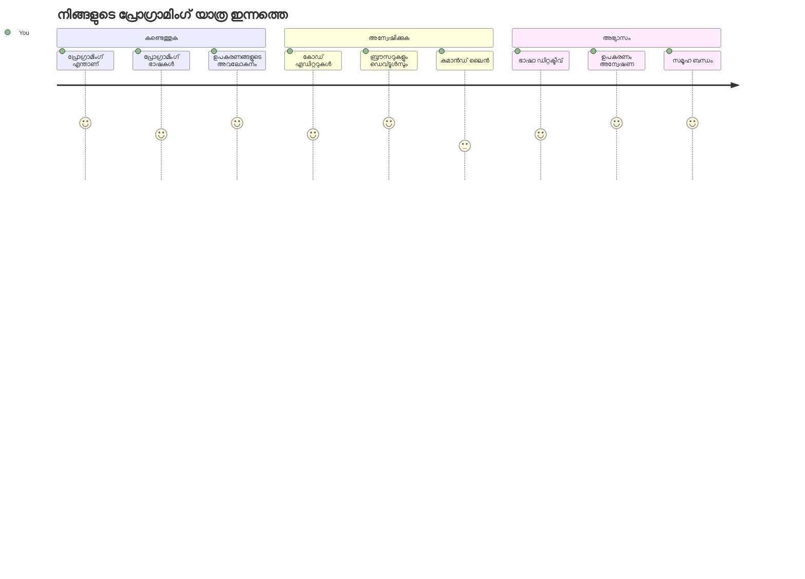
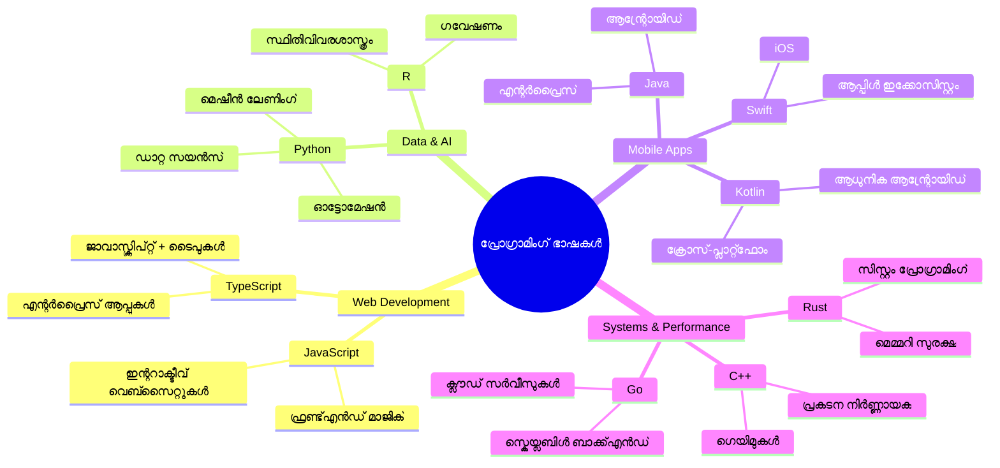
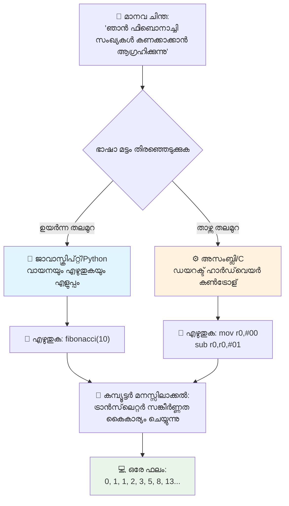
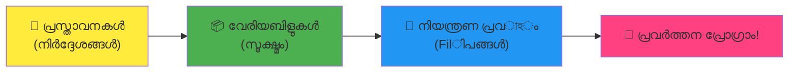
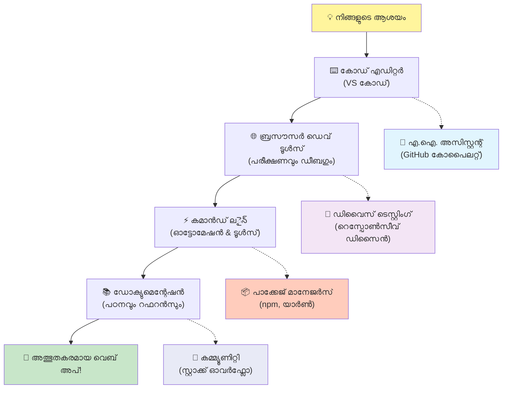
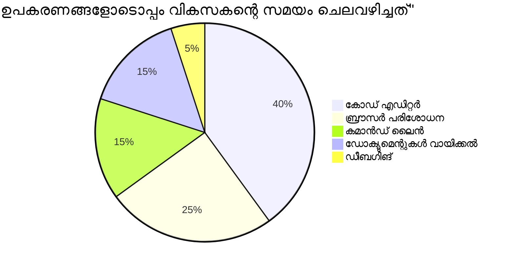
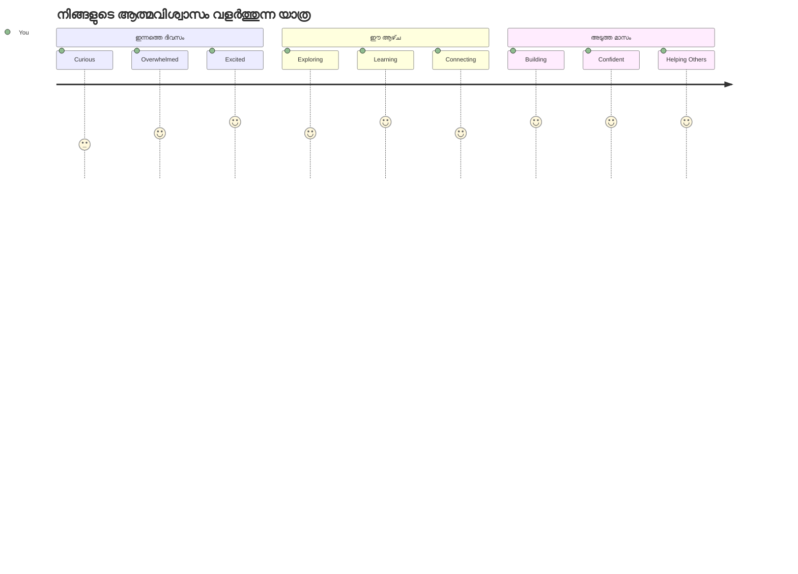

# പ്രോഗ്രാമിംഗ് ഭാഷകളിലേക്കുള്ള പരിചയംയും ആധുനിക ഡവലപ്പർ ടൂൾസും

ഹേയ്, ഭാവിയിലെ ഡവലപ്പറേ! 👋 ഓരോ ദിവസവും എന്നെ കുളിരുണ്ടാക്കുന്നത് പറയാമോ? പ്രോഗ്രാമിങ് കമ്പ്യൂട്ടറുകൾക്കായി മാത്രം അല്ല – ഇത് നിങ്ങളുടെ ഏറ്റവും വിചിത്രമായ ആശയങ്ങൾ ജീവനോടെ കൊണ്ടുവരാൻ ഉള്ള അസൽ അത്ഭുതശക്തിയാണ്!

നിങ്ങളുടെ പ്രിയപ്പെട്ട ആപ്പ് ഉപയോഗിക്കുമ്പോൾ എല്ലാം പകുതി പകുതിയായി പറ്റുന്ന那个 സമയം നിങ്ങൾ അറിയാമോ? ഒരു ബട്ടൺ തട്ടുമ്പോൾ അതിപാരമ്പര്യമായ՛ ഒന്നാണ് സംഭവിക്കുന്നത്, നിങ്ങൾ “വാവേ, അവർ അതെങ്ങേ ചെയ്തു?” എന്ന് വിചാരിക്കുന്നത്? ആ മാജിക് കോഡ് എഴുതിയിരിക്കുന്നത് നിങ്ങളുപോലെയൊരു ആളാണ് – അറ്റത്തട്ടിൽ ദി കഫി ഷോപ്പിൽ ഇരുന്ന് മൂന്നാമത്തെ എസ്പ്രസോ കുടിച്ചുകൊണ്ടിരിക്കുമ്പോൾ. ഇനി ഞങ്ങൾ ഈ പാഠം കഴിഞ്ഞാൽ നിങ്ങൾ ധരിക്കും എങ്ങനെ ചെയ്തു എന്നറിയാൻ മാത്രമല്ല, അത് പരീക്ഷിക്കാൻ തിട്ടയുമുണ്ടാകും!

ഡവലപ്പിങ് intimidating ആണ് എന്ന് നിങ്ങൾ കരുതിയാൽ ഞാനോട് പറയാൻ ഇഷ്ടം – ഞാൻ തുടങ്ങുമ്പോൾ ഞാനിവിടെ ഒരു ഗണിത ജീനി അല്ലെങ്കിൽ അഞ്ചുമുക്കിന് മുതൽ കോഡിങ്ങ് ചെയ്തു വരുന്നവനായി കരുതുകയായിരുന്നു. പക്ഷെ എന്‍റെ കാഴ്ചപ്പാട് മാറ്റിയത് എന്തെന്നാൽ: പ്രോഗ്രാമിങ് ഒരു പുതിയ ഭാഷയിൽ സംവാദം തുടങ്ങുന്നതുപോലെയാണ്. “നമസ്ക്കാരം” ഒക്കെ പഠിച്ച് കൊഫി ഓർഡർ ചെയ്യാൻ തുടങ്ങും, പിന്നെ ദാർശനിക ചർച്ചകൾ ചെയ്യാനാകും! പക്ഷെ ഇവിടെ കമ്പ്യൂട്ടറുമായി സംസാരിക്കുന്നു, അവർ ഏറ്റവും സഹിഷ്ണുതയുള്ള കൂട്ടുകാർ തന്നെയാണ് – നിങ്ങളുടെ പിശകുകൾ നിരീക്ഷിക്കാറില്ല, വീണ്ടും ശ്രമിക്കാൻ അതീവ ആഗ്രഹിക്കുന്നു!

ഇന്ന് ഞങ്ങൾ ആധുനിക വെബ് ഡവലപ്പ്മെന്റ് എങ്ങനെ സാധ്യമാണ് എന്ന അത്ഭുതകരമായ ടൂളുകൾ പരിശോധിക്കും. Netflix, Spotify, നിങ്ങളുടെ പ്രിയപ്പെട്ട indie ആപ്പ് സ്റ്റുഡിയോയിലെ ഡവലപ്പർമാർ ദിവസവും ഉപയോഗിക്കുന്ന എഡിറ്ററുകളും ബ്രൗസറുകളും വർക്‌ഫ്ലോകളും കാണിക്കാനാണ്. ഇതിലും സന്തോഷം നൽകുന്ന കാര്യം: ഈ പ്രൊഫഷണൽ ഗ്രേഡ്, വ്യാവസായിക ടൂൾസ് ഏറ്റവും വലിയ ഭാഗം പൂര്‍ണമായും സൗജന്യമാണ്!


> സ്കെച്ച്നോട്ട് [Tomomi Imura](https://twitter.com/girlie_mac)


```mermaid
journey
    title നിങ്ങളുടെ പ്രോഗ്രാമിംഗ് യാത്ര ഇന്നത്തെ
    section കണ്ടെത്തുക
      പ്രോഗ്രാമിംഗ് എന്താണ്: 5: You
      പ്രോഗ്രാമിംഗ് ഭാഷകൾ: 4: You
      ഉപകരണങ്ങളുടെ അവലോകനം: 5: You
    section അന്വേഷിക്കുക
      കോഡ് എഡിറ്ററുകൾ: 4: You
      ബ്രൗസറുകളും ഡെവ്‌ടൂൾസും: 5: You
      കമാൻഡ് ലൈൻ: 3: You
    section അഭ്യാസം
      ഭാഷാ ഡിറ്റക്ടീവ്: 4: You
      ഉപകരണം അന്വേഷണ: 5: You
      സമൂഹ ബന്ധം: 5: You
```
## നിങ്ങൾക്ക് എന്തെല്ലാം അറിയാമെന്ന് നോക്കാം!

ഇടയ്ക്കും കാണാം, ഞാൻ അറിയാൻ ആഗ്രഹിക്കുന്നു – ഈ പ്രോഗ്രാമിങ് ലോകത്തെക്കുറിച്ച് നിങ്ങൾക്ക് എന്താണ് അറിയുന്നത്? ഈ ചോദ്യങ്ങൾ നോക്കി നിങ്ങൾ “ഇതിൽ ഒന്നും എനിക്ക് അറിയില്ല” എന്നിച്ചാൽ അത് പൂർണ്ണമായും ശരിയാണ്! അതാണ് നിങ്ങൾ ശരിയായ സ്ഥലത്താണ്. ഈ ക്വിസ് ഒരുപോലെ വർക്ക് ഔട്ടിന് മുമ്പുള്ള ശാരീരിക പുഷ്ടീകരണമല്ല; നമ്മൾ വെറും ബുദ്ധിശക്തി തകിടുക്കുകയാണ്!

[പ്രീ-പാഠങ്ങൾ ഉള്ള ക്വിസ് താ‌ക്കുക](https://ff-quizzes.netlify.app/web/)


## നാം ഒന്നിച്ച് പോകാനിരിക്കുന്ന യാത്ര

ഞാൻ ഇന്ന് നമുക്ക് പരിശോധിക്കാനിരിക്കുന്ന വിഷയങ്ങളെ കുറിച്ച് അതീവ ആവേശത്തിലാണ്! കൃത്യമായ എൻറെ അഭിലാഷം നിങ്ങൾ ഏതാനും ആശയങ്ങൾ മനസ്സിലാക്കുമ്പോൾ, നിങ്ങള്‍റെ മുഖം ഞാൻ കാണാനാകും. നാം അടഞ്ഞ് പോകുന്ന അത്ഭുതകരമായ യാത്ര ഇങ്ങനെ ആണ്:

- **പ്രോഗ്രാമിങ് യഥാർത്ഥത്തിൽ എന്താണ് (കണ്ടത്തരമായുള്ള ഏറ്റവും കൂളായി!):** കോഡ്, നിങ്ങളുടെ ചുറ്റുപാടുള്ള എല്ലാ കാര്യങ്ങളുടെയും ഇന്ദ്രിയജാലം എന്നത് കണ്ടെത്തും; ഹൈദയകാലത്ത് മൊൻഡേ മോണിംഗ് അറിയുന്ന ആ അലാറം മുതൽ, Netflix നിർദ്ദേശങ്ങൾ നിര്‍മിക്കുന്ന ആ ആൾഗൊരിതം വരെ

- **പ്രോഗ്രാമിങ് ഭാഷകളും അവയുടെ അത്ഭുതകരമായ വ്യക്തിത്വങ്ങളും:** ഓരോ ആളും പ്രത്യക്തമായ സൂപ്പർപവർസ് ഉളവാക്കി പ്രശ്നങ്ങൾ പരിഹരിക്കുന്ന ഒരു പാർട്ടിയിൽ ഏറുന്ന കൂട്ടുകാർ പോലെ, പ്രോഗ്രാമിങ് ഭാഷകൾ മാറി മാറി പരിചയപ്പെടാൻ കഴിയുക!

- **ഡിജിറ്റല് മാജിക് ഉണ്ടാക്കുന്ന അടിസ്ഥാന ഘടകങ്ങൾ:** ക്രിയേറ്റീവ് LEGO സെറ്റുകൾ പോലെ. ഈ ഭാഗങ്ങൾ എങ്ങനെ സജ്ജമാക്കാവുന്നതാണെന്ന് മനസ്സിലായാൽ നിങ്ങളുടെ സങ്കല്‌പത്തിലായതു എല്ലാം ൽ നിർമ്മിക്കാൻ കഴിയും

- **പ്രൊഫഷണൽ ടൂളുകൾ നിങ്ങൾക്ക് മായി വാനടുത്തുംൊഴികെ വെബ് ഡെവലപ്പ്മെന്റ് എങ്ങനെ അത്ഭുതകരമായ രീതി ആക്കി മാറ്റുന്നു:** ഞാൻ കാഴ്ച പറയുന്നില്ല – ഈ ടൂളുകൾ നിങ്ങൾക്ക് സൂപ്പർപവർസുള്ളതായി തോന്നിക്കും; മികച്ച ഭാഗം? പ്രൊഫ് ഡവലപ്പർമാർ ഉപയോഗിക്കുന്നവ തന്നെയാണ്!

> 💡 **ഇഴ കഴിഞ്ഞെള്ളാം:** ഇന്ന് എല്ലാം ഓർക്കാൻ ശ്രമിക്കരുത്! ഇപ്പോൾ എന്റെ വിചാരം നിങ്ങൾക്ക് ഉണ്ടാക്കണമെന്നത് ആ ആവേശത്തിന്റെ കൊളവും. വിശദാംശങ്ങൾ സ്വാഭാവികമായി ഒത്തു കൂടും – അതാണ് യഥാർത്ഥ പഠനം!

> ഈ പാഠം [Microsoft Learn](https://learn.microsoft.com/en-us/learn/modules/web-development-101/introduction-programming/?WT.mc_id=academic-77807-sagibbon) ല് പഠിക്കാം!

## അങ്ങനെ പ്രോഗ്രാമിങ് *എന്താണ്* യഥാർത്ഥത്തിൽ?

അല്ലോ, വലിയ ചോദ്യം നേരിടാം: പ്രോഗ്രാമിങ് എന്താണെന്ന് യഥാർത്ഥത്തിൽ?

ഞാൻ എനിക്ക് കാണിച്ച പാഠം പറയാം. കഴിഞ്ഞ ആഴ്ച, ഞാന് എന്റെ അമ്മയെ ഞങ്ങളുടെ പുതിയ स्मार्ट ടി.വി. റിമോട്ട് എപ്രകാരമാണ് ഉപയോഗിക്കേണ്ടത് എന്ന് പറഞ്ഞു കൊടുക്കാൻ ശ്രമിക്കുകയായിരുന്നു. ഞാൻ പറഞ്ഞു: “ചുവപ്പ് ബട്ടൺ തട്ടുക, എന്നാൽ വലിയ ചുവപ്പ് ബട്ടൺ അല്ല, ഇടക്ക് ചെറുതായി ഉള്ള ചുവപ്പ് ബട്ടൺ... ഇല്ല, നിങ്ങളുടെ മറുവശം... ഒക്കെ പിടിച്ചു 2 സെക്കൻഡ്, 1 അല്ല, 3 അല്ല...”ഇത് പരിചിതമാണോ? 😅

അത് പ്രോഗ്രാമിങാണ്! അതായത് വളരെ വിശദമായ, ക്രമീകരിച്ച നിർദ്ദേശങ്ങൾ ഒരു ശക്തമായ, പക്ഷെ എല്ലാം അസൂയയില്ലാത്ത വസ്തുവിന് നൽകുന്നത്. പക്ഷെ നിങ്ങളുടെ അമ്മയെ (ആളുകൾ ചോദിച്ചാൽ "എന്ത് ചുവപ്പ് ബട്ടൺ?") മനസ്സിലാക്കേണ്ടതില്ല; കമ്പ്യൂട്ടറിന് അർത്ഥമാക്കണം (അവൾ നിങ്ങളെക്കാണാൻ ശ്രമിക്കാതെ നിങ്ങള്‍ പറഞ്ഞതുപോലെ ചെയ്യും).

എനിക്ക് യഥാർത്ഥത്തിൽ മനസ്സിലായത്: കമ്പ്യൂട്ടറുകൾ അത്ര വളരെ സങ്കീർണമല്ല. അവർ രണ്ട് കാര്യങ്ങൾ മാത്രമാണ് മനസ്സിലാക്കുന്നത് – 1 ഉം 0 ഉം, അതായത് “അതെ” അല്ലെങ്കിൽ “ഇല്ല” അല്ലെങ്കിൽ “ഓൺ” അല്ലെങ്കിൽ “ഓഫ്”. അതാണ്! പക്ഷെ അതിൽ മാജിക്ക് എവിടെയാണ്? നമ്മൾ "The Matrix" പോലുള്ള ഭാഷയിൽ സംസാരിക്കാൻ കഴിയാത്തതിനാൽ, **പ്രോഗ്രാമിംഗ് ഭാഷകൾ** രക്ഷിക്കുന്നു. അവ നിങ്ങളുടെ സാധാരണ മനുഷ്യ ചിന്തകൾക്കായി ലോകത്തിലെ മികച്ച പരിഭാഷകനാണ്, അവയ്‌ക്ക് കോംപ്യൂട്ടർ ഭാഷയിലേക്ക് മാറ്റുന്നു.

എപ്പോൾാലും എന്നെ ഉണർത്തുന്നത്: നിങ്ങളുടെ ജീവിതത്തിലെ എല്ലാം ഡിജിറ്റൽ നിങ്ങളുടെ പോലുള്ള ആളുകൾ ആരംഭിച്ചാണ് – കാപ്പിക്കപ്പ് കൈയിൽ പിടിച്ച് പൈജാമയിൽ ഇരുന്ന് ലാപ്‌ടോപ്പിൽ കോഡ് ടൈപ്പ് ചെയ്‌തവർ. അ इंस्टाग്രാം ഫിൽട്ടർ നിങ്ങൾക്ക് സുന്ദരിയായി ഉപയോഗിക്കുന്നത്? ഒരാൾ അത് കോഡ് ചെയ്തു. നിങ്ങളുടെ പ്രിയപ്പെട്ട ഗാനം കണ്ടെത്തിയ ആ നിർദ്ദേശം? ഒരു ഡവലപ്പർ ആ ആൾഗോരിതം നിർമ്മിച്ചു. നിങ്ങൾ സുഹൃത്തുക്കളോടൊപ്പം ക്യാഷ് ബിൽ വിഭജിക്കാൻ സഹായിക്കുന്ന ആ ആപ്പ്? “ഇത് ബുദ്ധിമുട്ടാണ്, ഞാൻ തീർക്കാം” എന്നു ആരെങ്കിലും ആലോചിച്ചു... പിന്നെ ചെയ്തു!

പ്രോഗ്രാമിംഗ് പഠിക്കുന്നത് ഒരു പുതിയ കഴിവ് നേടുന്നതല്ല – ഇത് ഈ അപാരമായ പ്രശ്നപരിഹാരക കൂട്ടായ്മയുടെ ഭാഗമാകുന്നതാണ്, അവർ ദിവസവും “എന്തുചെയ്‌തു? ഒരാളുടെ ദിനം ഒരു ചെറിയ വിധ്യാഭ്യാസം ആരാഞ്ഞ് മെച്ചപ്പെടുത്തുമോ?” എന്ന് ചിന്തിക്കുന്നു. സത്യത്തിൽ, പാർക്കൽ ഇതുപോലും കൂളാണോ?

✅ **സുക്ഷ്മമായ കാര്യം കാണുക**: ഒരു അവസരം കിട്ടുമ്പോൾ അന്വേഷിക്കുക – ഭൂപ്രഥമ കമ്പ്യൂട്ടർ പ്രോഗ്രാമർ ആരെന്ന് നിങ്ങൾ കരുതുന്നു? ഞാൻ സൂചന തരാം: നിങ്ങൾ പ്രതീക്ഷിക്കുന്ന ആളല്ലാതിരിക്കാം! ആ വ്യക്തിയുടെ പിന്നിലുള്ള കഥ അതീവ ആകർഷകമാണ്, പ്രോഗ്രാമിങ് എക്കാലവും സൃഷ്ടിപരമായ പ്രശ്നപരിഹാരത്തിനും ചിന്തിക്കാന്‍ പുറത്തുള്ളതും ആയിരുന്നതാണ് എന്ന് കാണിക്കുന്നു.

### 🧠 **ചെക്ക് ഇൻ സമയം: നിങ്ങൾ എങ്ങിനെയാണ് അനുഭവപ്പെടുന്നത്?**

**ഒരു മിനിറ്റ് അടുക്കുക:**
- “കമ്പ്യൂട്ടറുകൾക്ക് നിർദ്ദേശം നൽകുക” എന്ന ആശയം ഇനി മനസ്സിലായോ?
- നിങ്ങൾ ഓട്ടോമേറ്റ് ചെയ്യാൻ ആഗ്രഹിക്കുന്ന ദിനനിലവിലുള്ള എന്തെങ്കിലും കാര്യമൊന്നുണ്ടോ?
- ഈ പ്രോഗ്രാമിങിനെ കുറിച്ച് ഏതെങ്കിലും സംശയങ്ങൾ ഉണർന്നോ?

> **ഓർമ്മിക്കുക:** ചില ആശയങ്ങൾ നിങ്ങൾക്ക് തീർച്ചയായും തൽസമയത്ത് മുക്കുകൂടി തോന്നാം. പ്രോഗ്രാമിങ് പഠിക്കുന്നത് പുതിയ ഭാഷ പഠിക്കുകയാണത്രേ – നിങ്ങളുടെ മസ്തിഷ്കം അതിന്റെ ന്യൂറൽ പാതകൾ നിർമ്മിക്കാൻ സമയം എടുക്കും. നിങ്ങൾ നല്ല രീതിയിൽ പോവുകയാണ്!

## പ്രോഗ്രാമിങ് ഭാഷകൾ വിവിധ തരം മാജിക് ഫ്രേവറുകളാണ് പോലെ

ഇപ്പോൾ ഞാൻ പറയാനുള്ളത് ചെറുതല്ല, പക്ഷേ സൃഷ്ടിച്ചിരിക്കുക – പ്രോഗ്രാമിങ് ഭാഷകൾ ഗ്രൂവ് മൂസിക് പോലെ ആണ്. ജാസ്സ്, താളം നിറഞ്ഞ സ്നേഹത്തോടെ, റോക്ക് പവർഫുൾ, ക്ലാസിക്കൽ കോംപ്ലക്സ് സെഞ്ചുലേറ്റഡ്, ഹെപ്-ഹോപ്പ് ക്രിയേറ്റീവ് ആൻഡ് എക്സ്‌പ്രസീവ്. ഓരോ ശൈലി തന്‍റെ സ്വന്തമായ മെയിൽ തീം, അനുഭാവസ്വഭാവം ഉണ്ട്, ഓരോന്നും പലയിടത്തും ഫിറ്റായിരിക്കും.

പ്രോഗ്രാമിങ് ഭാഷകൾ അതേ രീതിയിലാണ്! വലിയഹോദന ഡാറ്റ പഠിക്കാനും മെച്ചപ്പെട്ട മൊബൈൽ ഗെയിം നിർമാണം ചെയ്യാനുമുള്ള ഒരേ ഭാഷ നിങ്ങൾ ഉപയോഗിക്കില്ല, അതുപോലെ യോ​ഗ ക്ലാസ്സിൽ ഡെത്ത് മെറ്റൽ പ്ലേ ചെയ്തില്ല!

എല്ലാവർക്കും ഞാന് ഒന്ന് പറയാം: ഇതുപോലെ ഭാഷകൾ ലോകത്തിലെ ഏറ്റവും ക്ഷമാമയമായ വിവർത്തകൻപോലെയാണ്. നിങ്ങൾക്ക് സാധാരണ മനുഷ്യൻപോലെ ആശയങ്ങൾ അവതരിപ്പിക്കാൻ കഴിയും, അവർ അതിനെ 1 കളിലും 0 കളിലും പകർന്ന് കമ്പ്യൂട്ടർക്ക് മനസ്സിലാക്കാവുന്നതായി മാറ്റി നൽകുന്നു. അവൊരു സുഹൃത്തിന്റെ പോലെ ആകുന്നു – “മനുഷ്യ സൃഷ്ടിപരത്വത്തിൽ” നിലവിലുണ്ടായെയും “കമ്പ്യൂട്ടർ ലൊജിക്കിലും” നന്നായി പ്രാവീണ്യം ഉള്ളവരായി – മാത്രമല്ല അവർ തളരാറില്ല, കോഫി ബ്രേക്ക് വേണ്ട, ഇരട്ട ചോദ്യങ്ങൾ ചോദിച്ചാൽ വിധേയപാടില്ല!

### പ്രശസ്തമായ പ്രോഗ്രാമിങ് ഭാഷകളും അവയുടെ ഉപയോഗങ്ങളും


```mermaid
mindmap
  root((പ്രോഗ്രാമിംഗ് ഭാഷകൾ))
    Web Development
      JavaScript
        ഫ്രണ്ട്‌എൻഡ് മാജിക്
        ഇന്ററാക്ടീവ് വെബ്സൈറ്റുകൾ
      TypeScript
        ജാവാസ്ക്രിപ്റ്റ് + ടൈപുകൾ
        എന്റർപ്രൈസ് ആപ്പുകൾ
    Data & AI
      Python
        ഡാറ്റ സയൻസ്
        മെഷീൻ ലേണിംഗ്
        ഓട്ടോമേഷൻ
      R
        സ്ഥിതിവിവരശാസ്ത്രം
        ഗവേഷണം
    Mobile Apps
      Java
        ആന്റ്രോയിഡ്
        എന്റർപ്രൈസ്
      Swift
        iOS
        ആപ്പിൾ ഇക്കോസിസ്റ്റം
      Kotlin
        ആധുനിക ആന്റ്രോയിഡ്
        ക്രോസ്-പ്ലാറ്റ്ഫോം
    Systems & Performance
      C++
        ഗെയിമുകൾ
        പ്രകടന നിർണ്ണായക
      Rust
        മെമ്മറി സുരക്ഷ
        സിസ്റ്റം പ്രോഗ്രാമിംഗ്
      Go
        ക്ലൗഡ് സർവീസുകൾ
        സ്കെയ്ലബിൾ ബാക്ക്എൻഡ്
```
| ഭാഷ | ഏറ്റവും അനുയോജ്യം | എന്തുകൊണ്ട് പ്രശസ്തമാണ് |
|----------|----------|------------------|
| **JavaScript** | വെബ് ഡെവലപ്പ്മെന്റ്, ഉപയോക്തൃ ഇന്റർഫേസുകൾ | ബ്രൗസറുകളിൽ പ്രവർത്തിച്ച് ഇന്ററാക്ടീവ് വെബ്സൈറ്റുകൾ പവർ ചെയ്യുന്നു |
| **Python** | ഡേറ്റാ സയൻസ്, ഓട്ടോമേഷൻ, AI | വായിക്കാൻ, പഠിക്കാൻ എളുപ്പവും ശക്തമായ ലൈബ്രറികൾ ഉണ്ട് |
| **Java** | എന്റർപ്രൈസ് ആപ്ലിക്കേഷനുകൾ, ആൻഡ്രോയ്ഡ് ആപ്പുകൾ | പ്ലാറ്റ്ഫോം സ്വതന്ത്രവും വലിയ സംവിധാനങ്ങൾക്കായി രാജ്ഞിപമാനവും |
| **C#** | വിൻഡോസ് ആപ്ലിക്കേഷനുകൾ, ഗെയിം ഡവലപ്പ്മെന്റ് | ശക്തമായ മൈക്രോസോഫ്റ്റ് പിന്തുണ |
| **Go** | ക്ലൗഡ് സേവനങ്ങൾ, ബാക്ക്എൻഡ് സിസ്റ്റങ്ങൾ | വേഗതയുള്ള, ലളിതവും ആധുനിക കമ്പ്യൂട്ടിങ്ങിന് രൂപകല്പന ചെയ്യപ്പെട്ടതും |

### ഹൈ-ലെവൽ vs ലോ-ലെവൽ ഭാഷകൾ

അതുപോലും, ഇതായിരുന്നു ആദ്യമായി പഠിക്കുമ്പോൾ എന്റെ മനസ്സ് പൊട്ടിച്ച concept. ഞാൻ് നിങ്ങളുമായി പങ്കിടുന്നു – പ്രതീകം എങ്ങനെ എല്ലാം ക്ലിയർ ആകുമെന്ന് എന്നതിന്:

നിങ്ങൾ ഒരു രാജ്യത്തേക്ക് പോയിട്ട് ലാംഗ്വേജ് സംസാരിക്കാൻ അറിയില്ല എന്ന സ്ഥിതിയിൽ നിങ്ങള്ക്ക് അടുത്തത്തുള്ള പാനിയമുറി അന്വേഷിക്കണം (എല്ലാവരും ഇതുചേർത്തിട്ടുണ്ട്, അല്ലേ? 😅):

- **ലോ-ലെവൽ പ്രോഗ്രാമിങ്** ആ സ്ഥലത്തേക്ക് ഇന്ററാക്റ്റ് ചെയ്യുക നന്നായി, പഴമയുള്ള മെച്ചപ്പെട്ട ഭാഷയുടെ നുണ തോന്നുന്നപോലെ. കലാ സ്രഷ്ടികൾ, പ്രാദേശിക ജനങ്ങൾക്കുള്ള തിരിച്ചറിയലുകൾ ഉപയോഗിച്ച് ഉടൻ മനസ്സിലാക്കുന്ന വിധം സംസാരിക്കുക. അതിവിശിഷ്ടവും കാര്യക്ഷമവുമാണ്, പക്ഷെ നിങ്ങൾക്ക് അവിടെ പരിഠლായനായിരിക്കണം. പാനിയമുറി കണ്ടെത്താനുള്ള ശ്രമത്തിൽ ഇത് വളരെ കഠിനമായിരിക്കും.

- **ലൈ-ലെവൽ പ്രോഗ്രാമിങ്** നന്നായിട്ടുള്ള പ്രാദേശിക സുഹൃത്ത് ആകുക. പതിവായി ഇംഗ്ലീഷിൽ “നമുക്ക് പാനിയമുറി വേണം” എന്നതുപോലെ പറയാം, അവർ സംസ്ക്കാരപരമായ പരിഭാഷയും ദിശാനിർദ്ദേശവും നിഷ്പ്രിയമായി കൊണ്ടു നൽകും.

പ്രോഗ്രാമിങിൽ:
- **ലോ-ലെവൽ ഭാഷകൾ** (Assembly, C പോലുള്ള) നിങ്ങളുടെ കൂടെ കമ്പ്യൂട്ടറിന്റെ ഹാർഡ്‌വെയറുമായി വളരെ വിശദമായി പറയാം, പക്ഷെ മെഷീൻപോലെ ചിന്തിക്കണം, ഇത് ഒരു വലിയ മാനസിക മാറ്റമാണ്!
- **ഹൈ-ലെവൽ ഭാഷകൾ** (JavaScript, Python, C# പോലുള്ള) നിങ്ങൾക്ക് മനുഷ്യൻപോലെ ചിന്തിക്കാം, അവർ പിന്നിലെ മെഷീൻ ഭാഷ കൈകാര്യം ചെയ്യും. കൂടാതെ, ഇത് പുതിയവരെ ഓർമ്മിക്കുന്ന, സഹായിക്കാൻ ആഗ്രഹിക്കുന്ന മനോഹരമായ സമൂഹങ്ങൾക്ക് പൂർണമായും ചേർന്നിടുന്നു!

നിങ്ങൾക്ക് ശുപാർശ ചെയ്യുന്നത് ഏതാണ് എന്നെ മനസ്സിലാകുന്നുണ്ടോ? 😉 ഹൈ-ലെവൽ ഭാഷകൾ പരിശീലനചക്രങ്ങൾ പോലെയാണ് – അവ നീക്കം ചെയ്യാൻ നിങ്ങൾ ആഗ്രഹിയ്ക്കില്ല; കാരണം അവ പ്രയാസമല്ലാതാക്കുന്നു!


```mermaid
flowchart TB
    A["👤 മാനവ ചിന്ത:<br/>'ഞാൻ ഫിബൊനാച്ചി സംഖ്യകൾ കണക്കാക്കാൻ ആഗ്രഹിക്കുന്നു'"] --> B{ഭാഷാ മട്ടം തിരഞ്ഞെടുക്കുക}
    
    B -->|ഉയർന്ന തലമുറ| C["🌟 ജാവാസ്ക്രിപ്റ്റ്/Python<br/>വായനയും എഴുതുകയും എളുപ്പം"]
    B -->|താഴ്ന്ന തലമുറ| D["⚙️ അസംബ്ലി/C<br/>ഡയറക്ട് ഹാർഡ്‌വെയർ കൺട്രോള്"]
    
    C --> E["📝 എഴുതുക: fibonacci(10)"]
    D --> F["📝 എഴുതുക: mov r0,#00<br/>sub r0,r0,#01"]
    
    E --> G["🤖 കമ്പ്യൂട്ടർ മനസ്സിലാക്കൽ:<br/>ട്രാൻസ്‌ലെറ്റർ സങ്കീർണ്ണത കൈകാര്യം ചെയ്യുന്നു"]
    F --> G
    
    G --> H["💻 ഒരേ ഫലം:<br/>0, 1, 1, 2, 3, 5, 8, 13..."]
    
    style C fill:#e1f5fe
    style D fill:#fff3e0
    style H fill:#e8f5e8
```
### ഹൈ-ലെവൽ ഭാഷകൾ എങ്ങനെ സുഹൃത്തുക്കളായിരിക്കുന്നു കാണാം

നിങ്ങൾക്ക് കുറേ അയഞ്ഞുപോയിട്ടും ഞാൻ ഒരു കാര്യം കാണിക്കാൻ പോകുകയാണ്. ആദ്യ കോഡ് ഉദാഹരണം കാണുമ്പോൾ ഭയക്കാതെ ഇരിക്കുക! ഭയപ്പെടുത്തുന്നതാണ് എന്റെ ഉദ്ദേശം!

വ്യത്യസ്ത ശൈലിയിൽ എഴുതിയ ഒരേ ടെസ്ക്ടറ് കാണാം. ഫിബൊനാച്ചി സീക്വൻസ് എന്നതാണ് – ഒരു ശൈലിയുടെ ഗണിത പാറ്റേൺ, ഓരോ സംഖ്യയും മുമ്പത്തെ രണ്ടു സംഖ്യകളുടെ കൂട്ടമാണ്: 0, 1, 1, 2, 3, 5, 8, 13... (ആശ്ചര്യം! പ്രകൃതിയിൽ എല്ലായിടത്തും കാണാം – സൂര്യപ്പൂവ് വിത്തുകളുടെ സ്പിറൽ, പൈന്കോൺ പാറ്റേൺ, ഗാലക്സി രൂപീകരണം!)

മാറിടാൻ തയ്യാറാണോ? സഞ്ചരിക്കാം!

**ഹൈ-ലെവൽ ഭാഷ (JavaScript) – മനുഷ്യ സൗഹൃദം:**

```javascript
// പടി 1: അടിസ്ഥാന ഫിബോണാച്ചി ക്രമീകരണം
const fibonacciCount = 10;
let current = 0;
let next = 1;

console.log('Fibonacci sequence:');
```

**ഈ കോഡ് ചെയ്യുന്നത്:**
- എത്ര ഫിബൊനാച്ചി സംഖ്യകൾ ഉണ്ടാക്കണമെന്ന് ഒരു കോൺസ്റ്റന്റ് പ്രഖ്യാപിക്കുക
- നിലവിലുള്ള സംഖ്യകളും അടുത്ത സംഖ്യകളും ട്രാക്ക് ചെയ്യാൻ രണ്ട് വേരിയബിൾസ് ആരംഭിക്കുക
- ഫിബൊനാച്ചി പാറ്റേൺ നിർണ്ണയിക്കുന്ന സ്റ്റാർട്ടിംഗ് മൂല്യങ്ങൾ സജ്ജമാക്കുക (0, 1)
- നമുക്ക് ഔട്ട്‌പുട്ട് തിരിച്ചറിയാൻ ഹെഡർ സന്ദേശം പ്രദർശിപ്പിക്കുക

```javascript
// ഘട്ടം 2: ഒരു ലൂപ്പ് ഉപയോഗിച്ച് ശ്രേണി സൃഷ്ടിക്കുക
for (let i = 0; i < fibonacciCount; i++) {
  console.log(`Position ${i + 1}: ${current}`);
  
  // ശ്രേണിയിലെ അടുത്ത സംഖ്യ കണക്കാക്കുക
  const sum = current + next;
  current = next;
  next = sum;
}
```

**ഇവിടെ എന്താകുന്നു:**
- ഒരൊന്നായി ഓരോ സ്ഥാനം కోసం `for` ലൂപ്പ് ഉപയോഗിച്ച് ചുറ്റുക
- ഓരോ സംഖ്യയും ആസ്ഥാനവിവരത്തോടെ ടെംപ്ലേറ്റ് ലിറ്ററൽ ഫോർമാറ്റിംഗ് ഉപയോഗിച്ച് പ്രദർശിപ്പിക്കുക
- നിലവിലെ മൂല്യങ്ങൾ കൂട്ടിച്ചേർത്ത് അടുത്ത ഫിബൊനാച്ചി സംഖ്യ കണക്കുക
- ട്രാക്കിംഗ് വേരിയബിൾസ് അപ്ഡേറ്റ് ചെയ്ത് അടുത്ത ഐററേഷനിലേക്ക് പോകുക

```javascript
// ഘട്ടം 3: ആധുനിക ഫംഗ്ഷണൽ സമീപനം
const generateFibonacci = (count) => {
  const sequence = [0, 1];
  
  for (let i = 2; i < count; i++) {
    sequence[i] = sequence[i - 1] + sequence[i - 2];
  }
  
  return sequence;
};

// ഉപയോഗത്തിന്റെ ഉദാഹരണം
const fibSequence = generateFibonacci(10);
console.log(fibSequence);
```

**മുകളിൽ നാം ചെയ്തത്:**
- ആധുനിക ആയുള്ള arrow ഫംക്ഷൻ പരാമൃഷ്ടമായി ഉപയോഗിച്ച് പുനരുപയോഗയോഗ്യമായ ഫംക്ഷൻ സൃഷ്ടിച്ചു
- ഏകദേശം മുഴുവൻ സീക്വൻസും സൂക്ഷിക്കാൻ ഒരു അറേ ഉണ്ടാക്കി, ഒരൊറ്റ സംഖ്യ മാത്രം പ്രദർശിപ്പിക്കാതെ
- ഓരോ എഴുത്തും മുമ്പത്തെ മൂല്യങ്ങളിൽ നിന്നു കണക്കാക്കിയ സംഖ്യ മറ്റൊരു അറേ ഇൻഡെക്സിംഗ് ആയി ഉപയോഗിച്ചു
- പ്രോഗ്രാമിന്റെ മറ്റുഭാഗങ്ങളിൽ ഉപയോഗിക്കാനായി മുഴുവൻ സീക്വൻസ് തിരികെ നൽകി

**ലോ-ലെവൽ ഭാഷ (ARM Assembly) – കമ്പ്യൂട്ടർ സൗഹൃദം:**

```assembly
 area ascen,code,readonly
 entry
 code32
 adr r0,thumb+1
 bx r0
 code16
thumb
 mov r0,#00
 sub r0,r0,#01
 mov r1,#01
 mov r4,#10
 ldr r2,=0x40000000
back add r0,r1
 str r0,[r2]
 add r2,#04
 mov r3,r0
 mov r0,r1
 mov r1,r3
 sub r4,#01
 cmp r4,#00
 bne back
 end
```

ജാവാസ്ക്രിപ്റ്റ് പതിപ്പ് എങ്ങനെ ആംഗലേയ നിർദ്ദേശങ്ങളായി വായിക്കാമെന്ന് കാണുന്നുവേ, അസംബ്ലി പതിപ്പ് കമ്പ്യൂട്ടറിന്റെ പ്രൊസസ്സർ നേരിട്ട് നിയന്ത്രിക്കുന്ന ഗൂഢസംവിധാനങ്ങളായ കമാന്റുകൾ ഉപയോഗിക്കുന്നു. രണ്ട് പതിപ്പും ഒരേ ടെസ്ക്ട് നിർവ്വഹിക്കുന്നു, പക്ഷെ ഹൈ-ലെവൽ ഭാഷ മനുഷ്യർക്ക് മനസ്സിലാക്കാനും എഴുതാനും പരിപാലിക്കാനും എളുപ്പമാണ്.

**ഇവിടെ നിങ്ങൾ ശ്രദ്ധിക്കപ്പെടുന്ന പ്രധാന വ്യത്യാസങ്ങൾ:**
- **വായനാസൗകര്യം**: ജാവാസ്ക്രിപ്റ്റ് `fibonacciCount` പോലുള്ള വിവരണാത്മക പേരുകൾ ഉപയോഗിക്കുന്നപ്പോൾ അസംബ്ലി `r0`, `r1` പോലുള്ള രഹസ്യടീക്കുകളാണ് ഉപയോഗിക്കുന്നത്  
- **കമന്റുകൾ**: ഉയർന്ന തലത്തിലുള്ള ഭാഷകൾ കോഡ് സ്വയം-വിവരണമാകുന്ന വിധത്തിൽ വ്യാഖ്യാനാത്മക കമന്റുകൾ പ്രോത്സാഹിപ്പിക്കുന്നു  
- **ഘടന**: ജാവാസ്ക്രിപ്റ്റിന്റെ താർകിക പ്രവാഹം മനുഷ്യർ പ്രശ്നങ്ങളെ ഘട്ടം ഘട്ടമായി ആലോചിക്കുന്ന രീതിയോട് പൊരുത്തപ്പെടുന്നു  
- **പരിപാലനം**: വ്യത്യസ്ത ആവശ്യങ്ങൾക്കായി ജാവാസ്ക്രിപ്റ്റ് പതിപ്പ് അപ്‌ഡേറ്റ് ചെയ്യൽ ലളിതവും വ്യക്തവുമായ കാര്യമാണ്  

✅ **ഫിബൊനാച്ചി ശ്രേണി കുറിച്ച്**: ഓരോ സംഖ്യയും മുമ്പ് രണ്ടിന്റെ കൂട്ടമാണ് (0, 1, 1, 2, 3, 5, 8...) എന്ന അത്യന്തം മനോഹരമായ ഈ നമ്പർ പാറ്റേർൺ പ്രകൃതിയിലെ *എല്ലായിടത്തും* കാണപ്പെടുന്നു! പറഞ്ഞാൽ സൺഫ്ലവർ സ്പിരലുകളിൽ, പൈൻകോൺ പാറ്റേർണുകളിൽ, നോട്ടിലസ് പൊതികൾ വളർച്ച പ്രക്രിയയിൽ, കൂടാതെ മരം ശാഖകൾ വളരുന്ന രീതിയിലും കാണാം. ഗണിതവും കോഡും പ്രകൃതിയിൽ സൗന്ദര്യം ഉണ്ടാക്കാൻ ഉപയോഗിക്കുന്ന പാറ്റേൺസുകൾ മനസ്സിലാക്കുകയും പുനഃസൃഷ്ടിക്കുകയും ചെയ്യുന്നതിൽ എത്രയോ അതിശയപ്പെടുന്നുണ്ട്!  

## മായാജാലം സൃഷ്ടിക്കുന്ന ഘടകങ്ങൾ

ശരി, ഇപ്പോൾ പ്രോഗ്രാമിംഗ് ഭാഷകൾ പ്രവർത്തനരൂപം എങ്ങനെ പോകുന്നു എന്ന് നിങ്ങൾ കണ്ടു കഴിഞ്ഞാൽ, എഴുതപ്പെട്ട ഓരോ പ്രോഗ്രാമിന്റെയും അടിസ്ഥാന ഭാഗങ്ങളെ ചുവടെ പൊട്ടിത്തെറിക്കാം. നിങ്ങളുടെ പ്രിയപ്പെട്ട പാചകക്കുറിപ്പിലെ അനിവാര്യ ഘടകങ്ങൾ പോലെ ഇവയെ ചിന്തിക്കുക – ഓരോ ഘടകവും ചെയ്യുന്നത് മനസ്സിലായാൽ നിങ്ങൾ ഏതെങ്കിലും भाषा വായിച്ചും എഴുതിയും സാധിക്കും!

ഇതെന്തെന്നാൽ പ്രോഗ്രാമിംഗ് വ്യാകരണത്തെ പഠിക്കുന്നതുപോലെ ആണ്. സ്കൂളിൽ നാമം, ക്രിയ, വാക്യങ്ങൾ ചേർക്കുന്നത് പഠിച്ചപ്പോൾ ഓർക്കുന്നുണ്ടോ? പ്രോഗ്രാമിംഗിനെന്നും വ്യാകരണം ഉണ്ട്, തിരിച്ചറിയുക, അത് ഇംഗ്ലീഷ് വ്യാകരണത്തെക്കാൾ വളരെ ലളിതവും ന്യായമായി പ്രവർത്തിക്കുന്നതാണ്! 😄  

### സ്റ്റേറ്റ്മെന്റുകൾ: ഘട്ടം ഘട്ടമായ നിർദ്ദേശങ്ങൾ

നാം **സ്റ്റേറ്റ്മെന്റുകൾ** മുതൽ തുടങ്ങിയാലോ – ഇവ നിങ്ങളുടെ കമ്പ്യൂട്ടറുമായി നടത്തുന്ന സംഭാഷണത്തിലെ ഓരോ വ്യക്തമായ വാക്യങ്ങളാണ്. ഓരോ സ്റ്റേറ്റ്മെന്റും കമ്പ്യൂട്ടറിനെ ഒരു പ്രത്യേക കാര്യം ചെയ്യാൻ പറയുന്നു, പക്ഷേ വഴികാട്ടലുപോലെ: "ഇവിടെ ഇടത് തിരികെ പോവുക," "ചുവപ്പ് ലൈറ്റിൽ നിർത്തുക," "അവിടെ പാർക്ക് ചെയ്യുക."  

സ്റ്റേറ്റ്മെന്റുകൾ എങ്ങനെ വായനാസൗകര്യമാണെന്ന് ഞാൻ ഇഷ്ടപ്പെടുന്നത് കാണൂ:  

```javascript
// ഒറ്റ പ്രവർത്തനങ്ങൾ നടത്തുന്നതിന് അടിസ്ഥാന കമാൻഡുകൾ
const userName = "Alex";                    
console.log("Hello, world!");              
const sum = 5 + 3;                         
```
  
**ഈ കോഡ് ചെയ്യുന്നത്:**
- ഒരു സ്റ്റാറ്റിക് ഘടകം പ്രഖ്യാപിച്ച് ഉപയോക്താവിന്റെ പേര് സൂക്ഷിക്കുക  
- കോൺസോളിൽ ഒരു സ്വാഗത സന്ദേശം പ്രദർശിപ്പിക്കുക  
- ഒരു ഗണിത പ്രവർത്തനഫലം കണക്കാക്കി സൂക്ഷിക്കുക  

```javascript
// വെബ് പേജുകളുമായി ഇടപഴകുന്ന പ്രസ്താവനകൾ
document.title = "My Awesome Website";      
document.body.style.backgroundColor = "lightblue";
```
  
**ഘട്ടം ഘട്ടം, ഇതാണ് നടക്കുന്നത്:**
- ബ്രൗസർ ടാബിലുള്ള വെബ്‌പേജ് തലക്കെട്ട് മാറ്റുക  
- മൊത്തം പേജ് ബോഡിയുടെ പശ്ചാത്തല നിറം മാറ്റുക  

### പ്രതിഫലങ്ങൾ: നിങ്ങളുടെ പ്രോഗ്രാമിന്റെ മെമ്മറി സിസ്റ്റം  

ശരി, **പ്രതിരൂപങ്ങൾ** എന്നത് എന്റെ ഏറ്റവും ഇഷ്ടപ്പെട്ട ആശയങ്ങളിൽ ഒന്നാണ്, കാരണം അവ നിങ്ങൾ പ്രതിദിനം ഉപയോഗിക്കുന്ന കാര്യങ്ങളോട് വളരെ സമാനമാണ്!  

ഒരു നിമിഷം നിങ്ങളുടെ ഫോൺ കോൺടാക്ട് ലിസ്റ്റ് ചിന്തിക്കുക. എല്ലാ നമ്പറുകളും നമുക്ക് മനസ്സിലാക്കേണ്ടതില്ല – നിങ്ങൾ "അമ്മ", "സഹചാരൻ", അല്ലെങ്കിൽ "രാത്രി 2 വരെ ഡെലിവറി ചെയ്യുന്ന പിസ്സാ സ്ഥലം" എന്നാണ് സൂക്ഷിക്കുന്നത്, ഫോൺ ശരിയായ നമ്പറുകൾ ഓർക്കുന്നു. പ്രതിഫലങ്ങളും അതുപോലെ പ്രവർത്തിക്കുന്നു! നിങ്ങളുടെ പ്രോഗ്രാമിന് വിവരം സൂക്ഷിക്കാനും പിന്നീട് പേരുപയോഗിച്ച് തിരിച്ചെടുക്കാനും ഇവ ഉപയോഗിക്കാം.  

ഇതിൽ ഏറ്റവും തുതപ്പുള്ളത് ഇതാണ്: നിങ്ങളുടെ പ്രോഗ്രാം പ്രവർത്തിക്കുന്നതോടെ പ്രതിഫലങ്ങൾ മാറ്റാൻ കഴിയുമ്ബോൾ (അതുകൊണ്ടാണ് പ്രതിഫലം എന്ന് വിളിക്കുന്നത്!). നിങ്ങൾ പുതിയ ഒരിടത്ത് മികച്ച പിസ്സാ സ്ഥലം കണ്ടെത്തുമ്പോൾ അവിടെ നിന്നു കോൺടാക്ട് അപ്‌ഡേറ്റ് ചെയ്യുന്ന പോലെ, പ്രോഗ്രാം പുതിയ വിവരങ്ങൾ പഠിച്ചോ അവസ്ഥ മാറിയോ ചെയ്താൽ പ്രതിഫലങ്ങൾ അപ്ഡേറ്റ് ചെയ്യാം!  

ഇത് എത്ര തികച്ചും ലളിതമാണെന്ന് ഞാൻ കാണിക്കും:  

```javascript
// സംയോജിത ചरों സൃഷ്‌ടിക്കുന്നതിനുള്ള ഘട്ടം 1:
const siteName = "Weather Dashboard";        
let currentWeather = "sunny";               
let temperature = 75;                       
let isRaining = false;                      
```
  
**ഈ ആശയങ്ങൾ മനസ്സിലാക്കുക:**
- `const` ഉപയോഗിച്ച് അചഞ്ചലമായ മൂല്യങ്ങൾ സൂക്ഷിക്കുക (ഉദാ., സൈറ്റ് പേര്)  
- `let` ഉപയോഗിച്ച് പ്രോഗ്രാം മുഴുവൻ മാറ്റം വരുത്താവുന്ന മൂല്യങ്ങൾ  
- വർഗ്ഗീകരിക്കപ്പെട്ട ഡാറ്റാ തരം നൽകി: സ്ട്രിംഗ്, സംഖ്യ, ബൂളിയൻ (true/false)  
- പ്രതിഫലങ്ങൾ എന്തിനാണെന്ന് വ്യക്തമാക്കിയ പേരുകൾ നൽകുക  

```javascript
// ഘട്ടം 2: ബന്ധപ്പെട്ട ഡാറ്റ ഒരു കൂട്ടമായി ഗ്രൂപ്പുചെയ്യാൻ objects ഉപയോഗിക്കുന്നത്
const weatherData = {                       
  location: "San Francisco",
  humidity: 65,
  windSpeed: 12
};
```
  
**മുകളിലത്തെ ഉദാഹരണത്തിൽ:**
- ബന്ധപ്പെട്ട കാലാവസ്ഥ വിവരങ്ങൾ ഒരു ഒബ്ജക്റ്റായി കൂട്ടിയിടുക  
- ഒരു പ്രതിഫലത്തിൽ ആർജിച്ച ഡാറ്റയുടെ പല ഭാഗങ്ങളും ക്രമീകരിക്കുക  
- ഓരോ വിവരത്തിനും കീ-വാല്യു ജോഡികൾ ഉപയോഗിച്ച് ലേബലുചെയ്യുക  

```javascript
// ഘട്ടം 3: വ്യത്യസ്ഥമായ വേരിയബിളുകൾ ഉപയോഗിക്കുകയും അപ്‌ഡേറ്റ് ചെയ്യുകയും ചെയ്യുന്നു
console.log(`${siteName}: Today is ${currentWeather} and ${temperature}°F`);
console.log(`Wind speed: ${weatherData.windSpeed} mph`);

// മാറ്റം വരുത്താവുന്ന വേരിയബിളുകൾ അപ്‌ഡേറ്റ് ചെയ്യുന്നു
currentWeather = "cloudy";                  
temperature = 68;                          
```
  
**ഓരോ ഭാഗവും മനസ്സിലാക്കാം:**
- ടെംപ്ലേറ്റ് ലിറ്ററൽസുകൾ `${}` ഉപയോഗിച്ച് ഡാറ്റ പ്രദർശിപ്പിക്കുക  
- ഡോട്ട് നോട്ടേഷൻ കൊണ്ട് ഒബ്ജക്റ്റിന്റെ പ്രോപ്പർട്ടികളിൽ പ്രവേശിക്കുക (`weatherData.windSpeed`)  
- `let` പ്രഖ്യാപിച്ച പ്രതിഫലങ്ങൾ ആവശ്യമനുസരിച്ചു അപ്‌ഡേറ്റ് ചെയ്യുക  
- നിരവധി പ്രതിഫലങ്ങൾ സംയോജിപ്പിച്ച് പ്രാസംഗിക സന്ദേശങ്ങൾ രൂപപ്പെടുത്തുക  

```javascript
// പടി 4: ശുഭ്രമായ കോഡിനുള്ള ആധുനിക ദ്രോഹനരൂപീകരണം
const { location, humidity } = weatherData; 
console.log(`${location} humidity: ${humidity}%`);
```
  
**അറിയേണ്ട കാര്യങ്ങൾ:**
- ഡീസ്റ്റ്രക്ചറിംഗ് അസൈൻമെന്റ് ഉപയോഗിച്ചു ഒബ്ജക്റ്റിൽ നിന്നും പ്രത്യേക പ്രോപ്പർട്ടികൾ എടുക്കുക  
- ഒബ്ജക്റ്റിന്റെ കീകൾ പോലെ അസാധാരണമായി പുതിയ പ്രതിഫലങ്ങൾ സൃഷ്ടിക്കുക  
- പുനരാവൃതം ഡോട്ട് നോട്ടേഷൻ ഒഴിവാക്കി കോഡ് ലളിതമാക്കുക  

### കൺട്രോൾ ഫ്ലോ: പ്രോഗ്രാമിനെ ചിന്തിക്കാൻ പഠിപ്പിക്കുക  

ശരി, ഇവിടെ പ്രോഗ്രാമിംഗ് മനസ്സമൃദ്ധമാക്കുന്ന ഘട്ടം തുടങ്ങി! **കൺട്രോൾ ഫ്ലോ** എന്നത്, നിങ്ങളുടെ പ്രോഗ്രാമിനെ നിങ്ങൾ പോലെ യുക്തിപൂർവം തീരുമാനങ്ങൾ എടുക്കാൻ പഠിപ്പിക്കുന്നതാണ്. നിങ്ങൾ ദിവസവും നാരിഴപ്പണി ചെയ്യാതെ വെറും സ്വാഭാവികമായി ചെയ്യുന്നത് ഇതാണ് പോലെ.  

ഇതിനൊരു ഉദാഹരണം: ഇന്ന് രാവിലെ "മഴ പെയ்யുകയാണെങ്കിൽ കുട ഉളുത്ത് പോകും. തണുത്താൽ ജാക്കറ്റ് ധരിക്കും. വൈകിക്കുകയാണെങ്കിൽ പ്രഭാതഭക്ഷണം ഒഴിവാക്കി വഴിയിൽ کافی കഴിക്കും." നിങ്ങളുടെ മസ്തിഷ്‌കം ദിനംപ്രതി നിരവധി തവണ ഈ ലജിക് അനുസരിക്കുന്നു!  

ഇതാണ് പ്രോഗ്രാമുകൾക്ക് ബുദ്ധിയുള്ളവനാക്കി, ചില നിരുപകാരമായ കൂണ\u200cകൾ മാത്രം അനുസരിക്കുന്നതിന് പകരം യുക്തിപൂർവം പ്രതികരിക്കുന്നതാക്കുന്ന കാര്യം. അവ ഒരു മനസ്സും സ്വന്തമാക്കി, അവസ്ഥ വിലയിരുത്തി, അനുയോജ്യമായി പ്രതികരിക്കാം.  

ഇതെങ്ങനെ ഭംഗിയായി പ്രവർത്തിക്കുന്നുവെന്ന് കാണിക്കൽ എനിക്ക് ആസ്വാദ്യമാണ്:  

```javascript
// നില 1: അടിസ്ഥാന നിബന്ധനാത്മക ലോഗിക്
const userAge = 17;

if (userAge >= 18) {
  console.log("You can vote!");
} else {
  const yearsToWait = 18 - userAge;
  console.log(`You'll be able to vote in ${yearsToWait} year(s).`);
}
```
  
**ഈ കോഡ് ചെയ്യുന്നത്:**
- ഉപയോക്താവിന്റെ വയസ്സ് വോട്ടിങ് യോഗ്യതയുണ്ടോ എന്ന് പരിശോധിക്കുക  
- വ്യത്യസ്ത കോഡ് ബ്ലോക്കുകൾ നടപ്പിലാക്കുക വിധി ഫലത്തിന്റെ അടിസ്ഥാനത്തിൽ  
- 18 വയസ്സിനും താഴെയുള്ളവർക്ക് വോട്ടിങ് യോഗ്യത നേടാൻ എത്ര കാലമെടുക്കും കണക്കാക്കും  
- ഓരോ സാഹചര്യത്തിനും സൈദ്ധാന്തികവും സഹായകരവുമായ ഫീഡ്ബാക്ക് നൽകുക  

```javascript
// പടിയം 2: നിരവധി നിലകൾ ലൊജിക്കൽ ഓപ്പറേറ്ററുകളുമായി
const userAge = 17;
const hasPermission = true;

if (userAge >= 18 && hasPermission) {
  console.log("Access granted: You can enter the venue.");
} else if (userAge >= 16) {
  console.log("You need parent permission to enter.");
} else {
  console.log("Sorry, you must be at least 16 years old.");
}
```
  
**ഇവിടെ നടക്കുന്നത് പിരിച്ചുകൂടി:**
- `&&` (ആൺഡ്) ഓപ്പറേറ്റർ ഉപയോഗിച്ച് പല നിബന്ധനകളും കൂട്ടിച്ചേർക്കുക  
- പല സാഹചര്യങ്ങൾക്കായി `else if` ഉപയോഗിച്ചുകൊണ്ട് നിബന്ധനകൾ അടിയന്തിര പരമ്പര സൃഷ്ടിക്കുക  
- എല്ലാ സാധ്യതകളും കൈകാര്യം ചെയ്യാൻ അവസാനത്തെ `else` ക്ലോസ് ഉപയോഗിക്കുക  
- വ്യത്യസ്ത സാഹചര്യങ്ങൾക്ക് സ്പഷ്ടവും പ്രാവർത്തികവുമായ ഫീഡ്ബാക്ക് നൽകുക  

```javascript
// പടിയായി 3: ടെർനറി ഓപ്പറേറ്ററോട് കൂടിയ സംക്ഷിപ്ത നിബന്ധന
const votingStatus = userAge >= 18 ? "Can vote" : "Cannot vote yet";
console.log(`Status: ${votingStatus}`);
```
  
**നിങ്ങൾ ഓർക്കേണ്ടത്:**
- ലളിതമായ രണ്ട് ഓപ്ഷൻ ആയ സാഹചര്യങ്ങൾക്ക് ternary ഓപ്പറേറ്റർ (`?:`) ഉപയോഗിക്കുക  
- ആദ്യം നിബന്ധന, അവശേഷിച്ച് `?`, സത്യം വരുത്തുമ്പോളത്തെ ഫലം, `:`, then false result  
- നിബന്ധനകളെ അടിസ്ഥാനമാക്കി മൂല്യങ്ങൾ ഏർപ്പെടുത്തേണ്ടപ്പോൾ ഈ മാതൃക പിന്തുടരുക  

```javascript
// ഘട്ടം 4: പല പ്രത്യേക സംഭവങ്ങളെ കൈകാര്യം ചെയ്യുക
const dayOfWeek = "Tuesday";

switch (dayOfWeek) {
  case "Monday":
  case "Tuesday":
  case "Wednesday":
  case "Thursday":
  case "Friday":
    console.log("It's a weekday - time to work!");
    break;
  case "Saturday":
  case "Sunday":
    console.log("It's the weekend - time to relax!");
    break;
  default:
    console.log("Invalid day of the week");
}
```
  
**ഈ കോഡ് ചെയ്യുന്നത്:**
- പ്രതിഫല മൂല്യം എത്ര വശമുള്ള പ്രത്യേക കേസുകളിൽ ഒത്തുപോകുന്നു എന്ന് പരിശോധിക്കുക  
- സമാനമായ കേസുകൾ (ആഴ്ചയിലെ ദിവസങ്ങൾ, വാരാന്ത്യങ്ങൾ) കൂട്ടിച്ചേർക്കുക  
- ഒത്തുപോയപ്പോൾ അനുയോജ്യമായ കോഡ് ബ്ലോക്ക് പ്രവർത്തിപ്പിക്കുക  
- പ്രതീക്ഷിക്കാത്ത മൂല്യങ്ങൾ കൈകാര്യം ചെയ്യാനുള്ള `default` കേസുകൾ ഉൾപ്പെടുത്തുക  
- അടുത്ത കേസിലേക്ക് കോഡ് തുടരുന്നത് തടയാൻ `break` സ്റ്റേറ്റ്മെന്റുകൾ ഉപയോഗിക്കുക  

> 💡 **യാഥാർഥ്യത്തെഴുത്ത്**: കൺട്രോൾ ഫ്ലോ ലോകത്തിലെ ഏറ്റവും ക്ഷമയുള്ള GPS നിങ്ങൾക്ക് വഴികാട്ടിയാകുന്നിരിക്കുന്നു എന്ന് ലൈക്കുചെയ്യൂ. "മേൻ സ്ട്രീറ്റ് ട്രാഫിക് ഉണ്ടെങ്കിൽ ഹൈവേ ഉപയോഗിക്കൂ. ഹൈവെ നിർമാണം തടസ്സപ്പെടുത്തുകയാണെങ്കിൽ, പരിസരമുള്ള മനോഹരമായ വഴി തിരയൂ." പ്രോഗ്രാമുകൾക്കും ഇതുപോലെയുള്ള നിബന്ധന ലജിക് ആണ് വ്യത്യസ്ത സാഹചര്യങ്ങൾ മനസ്സിലാക്കി ഉപയോക്താക്കൾക്ക് മികച്ച അനുഭവം നൽകുന്നത്.  

### 🎯 **അവബോധം പരിശോധിക്കുക: ഘടകങ്ങൾ നന്നായി മനസ്സിലായോ?**

**അടിസ്ഥാനങ്ങളുമായി നിങ്ങൾ എങ്ങനെ മുന്നേറുകയാണ് നോക്കാം:**
- പ്രതിഫലവും സ്റ്റേറ്റ്മെന്റും തമ്മിലുള്ള വ്യത്യാസം നിങ്ങളുടെ സ്വന്തം വാക്കുകളിൽ പറഞ്ഞുതിയ്ക്കാമോ?  
- നിബന്ധന "if-then" ഉപയോഗിക്കുന്ന യഥാർത്ഥ അനുഭവം പറഞ്ഞുതരാമോ (ഞങ്ങളുടെ വോട്ടിങ് ഉദാഹരണം പോലുള്ളത്)  
- പ്രോഗ്രാമിംഗ് ലജിക്കിൽ നിന്നുള്ള നിങ്ങൾക്ക് ഒന്ന് അത്ഭുതം തോന്നിയ കാര്യം എന്തെങ്കിലും?  

**ദേശീയ ആത്മവിശ്വാസം കൂട്ടാൻ:**  

```mermaid
flowchart LR
    A["📝 പ്രസ്താവനകൾ<br/>(നിർദ്ദേശങ്ങൾ)"] --> B["📦 വേരിയബിളുകൾ<br/>(സൂക്ഷ്മം)"] --> C["🔀 നിയന്ത്രണ പ്രവাহം<br/>(Filിപങ്ങൾ)"] --> D["🎉 പ്രവർത്തന പ്രോഗ്രാം!"]
    
    style A fill:#ffeb3b
    style B fill:#4caf50
    style C fill:#2196f3
    style D fill:#ff4081
```  
✅ **അടുത്ത വട്ടം കാണുന്നത്:** നാം ഈ ആശയങ്ങളിൽ ഗതാഗതം കൂടുതൽ ആസ്വദിച്ച് പഠനം തുടരാൻ പോകുന്നു! ഇപ്പോൾ, മുന്നിലുള്ള അനേകം സാദ്ധ്യതകളിൽ നിന്നുള്ള അത്ഭുതവും ആവേശവും അനുഭവിക്കാനാണ് നിങ്ങൾക്കുള്ളത്. പ്രത്യേക കാഴ്ചപ്പാടുകളും സാങ്കേതിക വിദ്യകളും നമുക്ക് പരിശീലനം നേടുമ്പോൾ പ്രകൃത്യാ കുടഞ്ഞുപോകും – ഇത് നിങ്ങൾ പ്രതീക്ഷിക്കുന്നതിൽ സൂക്ഷ്മമായി കൂടുതൽ രസകരമായിരിക്കും!

## ഉപകരണങ്ങൾ  

ശരി, ഞാൻ ഇങ്ങനെ ഉണർന്നു നിന്നാൽ ശക്തിയോടെ പിടിക്കാൻ കഴിഞ്ഞിട്ടില്ല! 🚀 നമുക്ക് സംസാരിക്കാം അത്ഭുതകരമായ ഉപകരണങ്ങളെക്കുറിച്ച്, നിങ്ങളുടെ കൈകളിലേക്ക് ഡിജിറ്റൽ സ്പേസ്ഷിപ്പ് കീസുകൾ കിട്ടിയതിന് തുല്യമായ അനുഭവം നൽകുന്നവ.  

ഒരു ഷെഫിന് കൈകളുടെ അനുബന്ധങ്ങളായ ശരിയായ ബാലൻസ് ചട്ടികളുള്ളതായി നിങ്ങൾക്ക് അറിയാം അല്ലേ? അല്ലെങ്കിൽ ഒരുപാട്ടുകാരൻ ടച്ചു കുറിച്ചപ്പോൾ തന്നെ പാടപ്രവർത്തനം തുടങ്ങുന്ന ഗിറ്റാറ് പോലെ? വികസിപ്പിച്ച അഡ്രൈവർമാർക്കും അവരുടേതായ അതിമനോഹരമായ ഉപകരണങ്ങൾ ഉണ്ട്, നിങ്ങളുടെ മനസ്സ് പൊട്ടിപ്പുറപ്പെട്ടുപോകാനുള്ള സത്യമാണ് – അവയിൽ പലത് പൂർണ്ണമായും സൗജന്യമാണ്!  

ഈ ഉപകരണങ്ങൾ പങ്കുവെക്കാനായി ഞാൻ എത്ര ആവേശത്തിലാണ് എന്ന് ഞാനറിയാം, കാരണം ഇതുവരെ സോഫ്റ്റ്വേർ നിർമ്മാണം എങ്ങനെ നടത്താമെന്നതിൽ വിപ്ലവം സൃഷ്ടിച്ചു ചിലവിൽ കഴിഞ്ഞില്ല. AI-ശക്തിയുള്ള കോഡിംഗ് സഹായികൾ, Wi-Fi ലഭ്യമാകുന്നിടത്തുണ്ടെങ്കിൽ എവിടെയും ഒരു ആപ്ലിക്കേഷൻ നിർമ്മിക്കാൻ കഴിയുന്ന ക്ലൗഡ് പരിതസ്ഥിതികൾ, പ്രോഗ്രാമുകളുടെ എക്‌സ്-റേ ദർശനം പോലുള്ള വളരെ നല്ല ഡീബഗിംഗ് ഉപകരണങ്ങൾ.  

അവ തന്നെ "ആരംഭകർക്കുള്ള ഉപകരണങ്ങൾ" അല്ല, നിങ്ങൾ വലുതായി മാറുവാനും കഴിവുകൾ വികസിപ്പിക്കുവാനും കഴിയാത്ത ഉപകരണങ്ങൾ കുടിയാകില്ല. ഗൂഗിള്‍, നെറ്റ്‌ഫ്ലിക്സ്, നിങ്ങളുടെ ഇഷ്ടമുള്ള ഇൻഡിയ ടെക് സ്റ്റുഡിയോ തുടങ്ങിയവയിൽ പ്രൊഫഷണൽ തലത്തിലാണ് ഇങ്ങനെ ഉപകരണങ്ങൾ ഈ നിമിഷം ഉപയോഗിക്കുന്നത്. നിങ്ങൾ അവ ഉപയോഗിച്ച് വലിയ പ്രൊണായിരിക്കുമെന്ന് തോന്നും!  


```mermaid
graph TD
    A["💡 നിങ്ങളുടെ ആശയം"] --> B["⌨️ കോഡ് എഡിറ്റർ<br/>(VS കോഡ്)"] 
    B --> C["🌐 ബ്രസൗസർ ഡെവ് ടൂൾസ്<br/>(പരീക്ഷണവും ഡീബഗും)"]
    C --> D["⚡ കമാൻഡ് ലైన్<br/>(ഓട്ടോമേഷൻ & ടൂൾസ്)"]
    D --> E["📚 ഡോക്യുമെന്റേഷൻ<br/>(പഠനവും റഫറൻസും)"]
    E --> F["🚀 അത്ഭുതകരമായ വെബ് അപ്!"]
    
    B -.-> G["🤖 എ.ഐ. അസിസ്റ്റന്റ്<br/>(GitHub കോപൈലറ്റ്)"]
    C -.-> H["📱 ഡിവൈസ് ടെസ്റ്റിംഗ്<br/>(റെസ്പോൺസീവ് ഡിസൈൻ)"]
    D -.-> I["📦 പാക്കേജ് മാനേജർസ്<br/>(npm, യാർൺ)"]
    E -.-> J["👥 കമ്മ്യൂണിറ്റി<br/>(സ്റ്റാക്ക് ഓവർഫ്ലോ)"]
    
    style A fill:#fff59d
    style F fill:#c8e6c9
    style G fill:#e1f5fe
    style H fill:#f3e5f5
    style I fill:#ffccbc
    style J fill:#e8eaf6
```  
### കോഡ് എഡിറ്ററുകളും ഐ.ഡി.ഇ-കളും: നിങ്ങളുടെ പുതിയ ഡിജിറ്റൽ ഏറ്റവും നല്ല സുഹൃത്തുക്കൾ  

കോഡ് എഡിറ്ററുകൾക്കുറിച്ച് സംസാരിക്കാം – ഇവ നിങ്ങളുടെ ഏറ്റവും പ്രിയപ്പെട്ട ഇടങ്ങളായി മാറാൻ പോകുന്നു! അവ നിങ്ങളുടെ സ്വകാര്യ കോഡിംഗ് സ്വർഗമാണ്, അവിടെ നിങ്ങൾ സ്വയം ഡിജിറ്റൽ സൃഷ്ടികൾ സൃഷ്ടിക്കുകയും മെച്ചപ്പെടുത്തുകയും ചെയ്യും.  

ഇപ്പോൾ ആധുനിക എഡിറ്ററുകളിൽ ഇവ സമ്മർദ്ദ മായില്ലാത്ത ഡ്രാഫ്റ്റ് എഡിറ്ററുകളല്ല. 24/7 മായി നിങ്ങളുടെ പക്കൽ ഇരുന്ന് കോഡിംഗ് ഗൈഡായും സഹായിയായും പ്രവർത്തിക്കുന്ന അത്യന്തം കഴിവുള്ള ടെക്നിക്കൽ മാർഗ്ഗ നിർദേശകർമുണ്ട്. നിങ്ങൾ ടൈപ്പ് ചെയ്യുന്നപ്പോൾ തെറ്റുകൾ നിങ്ങൾ ശ്രദ്ധിക്കുമെന്നും മുമ്പേ പിടിക്കുകയും, മെച്ചപ്പെടുത്തലുകൾ നിങ്ങളെ ഒരു ജീനിയസ്സ് പോലെ കാണിക്കുന്നവ നിർദേശിക്കുകയും, എല്ലാം മനസ്സിലാക്കാൻ സഹായിക്കുകയും, നിങ്ങൾ എഴുതാൻ പോകുന്ന വാക്കുകൾ പ്രവചിച്ച് അപ്പോഴുള്ള ആശയങ്ങൾ പൂർത്തിയാക്കാൻ ശ്രമിക്കുകയും ചെയ്യുന്നു!  

ആറ്റോ-കമ്പ്ലീഷൻ ആദ്യമായി കണ്ടപ്പോൾ ഞാൻ ഭാവിയിലായിരുന്നു എന്ന് നിസ്സംശയം പറയാം. നിങ്ങൾ എന്തെങ്കിലും ടൈಪ್ ചെയ്യുമ്പോൾ, എഡിറ്റർ അഭിപ്രായപ്പെടുന്നുണ്ട്, "ഹേയ്, നിങ്ങൾ ആവശ്യപ്പെടുന്ന ഈഫംഗ്ഷൻ നിനക്ക് വേണമെന്ന് ആലോചിക്കുകയാണോ?" നിങ്ങളുടെ കോഡിങ്ങിനുള്ള മനസ്സറിയുന്ന കൂട്ടുകാരൻ ഉള്ളത് പോലെയാണ്!  

**ഈ എഡിറ്ററുകൾ അതിവിശേഷമാക്കുന്നത് എന്താണ്?**

ആധുനിക കോഡ് എഡിറ്ററുകൾ നിങ്ങൾക്ക് പ്രൊഡക്ടിവിറ്റി കൂട്ടാനുള്ള നിരവധി സവിശേഷതകൾ നൽകുന്നു:  

| സവിശേഷത | എന്താണ് ചെയ്യുന്നത് | എന്തുകൊണ്ട് സഹായിക്കും |  
|---------|--------------|--------------|  
| **സിന്റാക്‌സ് ഹൈലൈറ്റിംഗ്** | കോഡിന്റെ വ്യത്യസ്ത ഭാഗങ്ങൾ നിറംകൊടുത്ത് കാണിക്കുന്നു | കോഡ് വായിക്കാൻ സുഗമമാക്കും, തെറ്റുകൾ കണ്ടെത്താൻ സഹായിക്കും |  
| **ആറ്റോ-കമ്പ്ലീഷൻ** | നിങ്ങൾ ടൈപ്പ് ചെയ്യുമ്പോൾ കോഡ് നിർദേശിക്കുന്നു | കോഡിംഗ് വേഗത്തിലാക്കുകയും തെറ്റുകൾ കുറയ്ക്കുകയും ചെയ്യും |  
| **ഡീബഗിംഗ് ടൂളുകൾ** | തെറ്റുകൾ കണ്ടെത്താനും പരിഹരിക്കാനും സഹായിക്കുന്നു | പ്രശ്‌നപരിഹാര സമയം കുറക്കും |  
| **എക്സ്റ്റൻഷനുകൾ** | പ്രത്യേക സവിശേഷതകൾ ചേർക്കാം | ഏതുകാര്യത്തിനും എഡിറ്റർ ഇഷ്ടാനുസരിച്ചു മാറ്റാം |  
| **AI അസിിസ്റ്റൻറുകൾ** | കോഡ് നിർദേശങ്ങളും വിശദീകരണങ്ങളും വാഗ്ദാനം ചെയ്യുന്നു | പഠനവും ഉത്പാദകതയും വേഗത്തിലാക്കും |  

> 🎥 **വീഡിയോ ഉറവ്**: ഈ ഉപകരണങ്ങൾ പ്രവർത്തനരീതിയിൽ കാണാൻ ഇഷ്ടമുണ്ടോ? ഈ [Tools of the Trade video](https://youtube.com/watch?v=69WJeXGBdxg) പരിശോധിക്കൂ.  

#### വെബ് ഡവലപ്പ്മെന്റിനായി ശിപാർശ ചെയ്ത എഡിറ്ററുകൾ  

**[Visual Studio Code](https://code.visualstudio.com/?WT.mc_id=academic-77807-sagibbon)** (സൗജന്യ)  
- വെബ് ഡവലപ്പർമാരിൽ ഏറ്റവും ജനപ്രിയം  
- മികച്ച എക്സ്റ്റൻഷൻ സമ്പ്രദായം  
- ബിൽറ്റ്-ഇൻ ടർമിനൽ, Git പരസ്പരംബന്ധനം  
- **ആവശ്യമായ എക്സ്റ്റൻഷനുകൾ**:  
  - [GitHub Copilot](https://marketplace.visualstudio.com/items?itemName=GitHub.copilot) - AI ശക്\u200cതിയുള്ള കോഡ് നിർദ്ദേശങ്ങൾ  
  - [Live Share](https://marketplace.visualstudio.com/items?itemName=MS-vsliveshare.vsliveshare) - യഥാർത്ഥ സമയ സഹകരണവും  
  - [Prettier](https://marketplace.visualstudio.com/items?itemName=esbenp.prettier-vscode) - സ്വയംകോഡ് ഫോർമാറ്റിംഗ്  
  - [Code Spell Checker](https://marketplace.visualstudio.com/items?itemName=streetsidesoftware.code-spell-checker) - കോഡ് ടൈപ്പോകൾ പിടികൂടുന്നു  

**[JetBrains WebStorm](https://www.jetbrains.com/webstorm/)** (പണം, വിദ്യാർത്ഥികൾക്ക് സൗജന്യം)  
- ആധുനിക ഡീബഗിംഗ്, ടെസ്റ്റിംഗ് ഉപകരണങ്ങൾ  
- ബുദ്ധിമുട്ടുള്ള കോഡ് പൂർത്തിയാക്കൽ  
- ബിൽറ്റ്-ഇൻ വേർഷൻ കൺട്രോൾ  

**ക്ലൗഡ് അടിസ്ഥാന ഐ.ഡി.ഇകൾ** (വിവിധ വിലകൾ)  
- [GitHub Codespaces](https://github.com/features/codespaces) - ബ്രൗസറിൽ പൂർണ്ണ VS കോഡ്  
- [Replit](https://replit.com/) - പഠനത്തിനും കോഡ് പങ്കുവെക്കുന്നതിനും മികച്ചത്  
- [StackBlitz](https://stackblitz.com/) - തൽക്ഷണ പൂർണ്ണ തരം വെബ് ഡവലപ്പ്മെന്റ്  

> 💡 **ആരംഭകൻ്റെ ടിപ്പ്**: Visual Studio Code ഉപയോഗിച്ച് ആരംഭിക്കുക – സൗജന്യവും വ്യവസായത്തിൽ വ്യാപകമായി ഉപയോഗിക്കുന്നതും tutorials, എക്സ്റ്റൻഷനുകൾ നിർമ്മിക്കുന്ന വലിയ സമൂഹവും ഉള്ളതാണ്.  


### വെബ് ബ്രൗസറുകൾ: നിങ്ങളുടെ രഹസ്യ വികസന പ്ര laboratorio

ശരി, ഇപ്പോൾ മനസ്സ് പൊട്ടിപ്പുറപ്പെട്ടിരിക്കാം! നിങ്ങൾ സോഷ്യൽ മീഡിയയിൽ സ്ക്രോൾ ചെയ്യാനും വീഡിയോ കാണാനുമുള്ളതിന് ബ്രൗസർ ഉപയോഗിക്കുകയാണെന്ന് അറിയാം, എന്നാൽ അവർ ഇപ്പോഴത്തെ വരെ ഈ അത്ഭുതകരമായ രഹസ്യ ഡവലപ്പർ ലാബ് ഒളിപ്പിച്ചിരുന്നു, നിങ്ങൾ കണ്ടെത്താൻ കാത്തിരിപ്പായിരുന്നു!  

ഇവിടെ നിങ്ങൾ എല്ലായ്പ്പോഴും ഒരു വെബ് പേജ് സ്വയം റൈറ്റ്-ക്ലിക്ക് ചെയ്ത് "ഇൻസ്പെക്റ്റ് എലെമെന്റ്" തിരഞ്ഞെടുക്കുമ്പോൾ, നിങ്ങൾ ഒരു മറയിലുള്ള പ്രൊഫഷണൽ ഡവലപ്പർ ടൂളുകളുടെ ലോകം തുറക്കുകയാണ്, ഞാൻ നൂറുകണക്കിന് ഡോളർ ചിലവഴിച്ചിട്ടുള്ള ചില പ്രത്യേക സോഫ്റ്റ്വെയറുകൾക്കു മുകളിലുള്ള ശക്തിയുള്ളവയാണ് അത്. ഇത് നിങ്ങളുടെ വീട്ടിലെ പഴയ അടുക്കള മറഞ്ഞിരിക്കുന്ന ഒരു പ്രൊഫഷണൽ ഷെഫിന്റെ ലാബ് കണ്ടെത്തുന്നതുപോലെയാണ്!
ആദ്യമായി ആരെങ്കിലും ബ്രൗസർ ഡെവ്ടൂളുകൾ എനിക്കു കാണിച്ചപ്പോൾ, ഞാൻ മൂന്നുമണിക്കൂറോളം വെറും ക്ളಿಕ್ಕ് ചെയ്തുകൊണ്ടും "വെയിറ്റ്, അത് ഇതും ചെയ്യാൻ പറ്റുമോ?!" എന്ന് ആക്ഷേപിക്കുന്നു. നിങ്ങൾ സൈറ്റിൽ റിയൽ-ടൈമിൽ എഡിറ്റ് ചെയ്യാൻ, എല്ലാം എത്ര വേഗം ലോഡ് ചെയ്യപ്പെടുന്നു എന്നത് കണ്ടറിയാൻ, നിങ്ങളുടെ സൈറ്റ് വ്യത്യസ്ത ഉപകരണങ്ങളിൽ എങ്ങനെയാണ് കാണപ്പെടുന്നത് എന്ന് പരീക്ഷിക്കാൻ, കൂടാതെ ജാവാസ്ക്രിപ്റ്റ് പൂർണ്ണ വിദഗ്ധനായതായി ഡീബഗ് ചെയ്യാൻ പോലും കഴിയുന്നു. ഇതൊരു മാർക്കറ്റിങ് തന്നെ!

**ബ്രൗസറുകൾ നിങ്ങളുടെ രഹസ്യ ആയുധമായി എന്റേത് കാരണമെന്തെന്ന് ഇവിടെ:**

നിങ്ങൾ ഒരു വെബ്സൈറ്റ് അല്ലെങ്കിൽ വെബ് അപ്ലിക്കേഷൻ സൃഷ്ടിക്കുമ്പോൾ, അതു ലൊകരിൽ എങ്ങനെ കാണപ്പെടുന്നു, പ്രവർത്തിക്കുന്നു എന്ന് കാണേണ്ടതാണ്. ബ്രൗസറുകൾ നിങ്ങളുടെ പ്രവൃത്തി കാണിക്കാനായിരിക്കുന്നു മാത്രമല്ല, പ്രകടനക്ഷമത, ആക്‌സസിബിലിറ്റി, മറ്റു പ്രശ്‌നങ്ങൾ എന്നിവയെക്കുറിച്ച് വിശദമായ ഫീഡ്ബാക്കും നൽകുന്നു.

#### ബ്രൗസർ ഡെവലപ്പർ ടൂൾസ് (DevTools)

ആധുനിക ബ്രൗസറുകൾ സമഗ്രമായ ഡെവലപ്പ്മെന്റ് സ്യൂട്ടുകൾ ഉൾക്കൊള്ളുന്നു:

| ഉപകരണം വിഭാഗം | അത് ചെയ്യുന്നത് | ഉദാഹരണ ഉപയോഗം |
|---------------|--------------|------------------|
| **എലമെന്റ് ഇൻസ്പെക്ടർ** | HTML/CSS റിയൽ-ടൈമിൽ കാണുകയും എഡിറ്റും ചെയ്യുകയും ചെയ്യുന്നു | സ്റ്റൈലിംഗ് ശരിയാക്കുകയും ഫലങ്ങൾ ഉടൻ കാണുകയും ചെയ്യുക |
| **കൺസോൾ** | പിശകുകൾ കാണുക, ജാവാസ്ക്രിപ്റ്റ് പരീക്ഷിക്കുക | പ്രശ്‌നങ്ങൾ ഡീബഗ് ചെയ്ത് കോഡ് പരീക്ഷണം നടത്തുക |
| **നെറ്റ്‌വർക്ക് മോണിറ്റർ** | സ്രോതസ്സുകൾ എങ്ങനെ ലോഡ് ചെയ്യപ്പെടുന്നു എന്ന് ട്രാക്ക് ചെയ്യുക | പ്രകടനക്ഷമത മെച്ചപ്പെടുത്തുകയും ലോഡിങ് സമയങ്ങൾ കുറയ്ക്കുകയും ചെയ്യുക |
| **ആക്‌സസിബിലിറ്റി ചെക്കർ** | ഉൾക്കൊള്ളുന്ന ഡിസൈൻ പരിശോധന നടത്തുക | എല്ലാ ഉപയോക്താക്കൾക്കും സൈറ്റ് പ്രവർത്തിക്കുമെന്ന് ഉറപ്പ് വരുത്തുക |
| **ഡിവൈസ് സിമുലേറ്റർ** | വ്യത്യസ്ത സ്ക്രീൻ വലുപ്പങ്ങളിൽ പ്രിവ്യൂ ചെയ്യുക | മൾട്ടിപ്പിൾ ഉപകരണങ്ങൾ വേണ്ടാതെ റെസ്പോൺസീവ് ഡിസൈൻ പരിശോധിക്കുക |

#### ഡെവലപ്മെന്റിനായുള്ള ശുപാർശ ചെയ്ത ബ്രൗസറുകൾ

- **[ക്രോം](https://developers.google.com/web/tools/chrome-devtools/)** - വ്യവസായ-സ്റ്റാൻഡേർഡ് DevTools ഉൾപ്പെടെയുള്ള വ്യാപകമായ ഡോക്യുമെൻറേഷൻ
- **[ഫയർഫോക്സു](https://developer.mozilla.org/docs/Tools)** - ഉത്തമമായ CSS ഗ്രിഡ്, ആക്‌സസിബിലിറ്റി ഉപകരണങ്ങൾ
- **[എഡ്ജ്](https://docs.microsoft.com/microsoft-edge/devtools-guide-chromium/?WT.mc_id=academic-77807-sagibbon)** - ക്രോമിയം ആസ്ഥാനമാക്കി മൈക്രോസോഫ്റ്റിന്റെ ഡെവലപ്പർ വിഭവങ്ങൾ

> ⚠️ **പ്രധാന ടെസ്റ്റിംഗ് ടിപ്പ്**: നിങ്ങളുടെ വെബ്സൈറ്റുകൾ ദയവായി നിരവധി ബ്രൗസറുകളിൽ പരീക്ഷിക്കുക! ക്രോത്തിന് പൂർണമായും പ്രവർത്തിക്കുന്നതു സഫാരിയിലോ ഫയർഫോക്സിലോ വ്യത്യസ്തമായി കാണപ്പെടാം. പ്രൊഫഷണൽ ഡെവലപ്പർമാർ എല്ലാവിധ പ്രധാന ബ്രൗസറുകളിലും പരീക്ഷണം നടത്തുന്നു, ഉപയോക്തൃ അനുഭവം ഉറപ്പാക്കാൻ.

### കമാൻഡ് ലൈൻ ടൂളുകൾ: നിങ്ങളുടെ ഡെവലപ്പർ സൂപ്പർപവർസ്‌ പ്രവേശനദ്വാരം

ഒന്ന്, കമാൻഡ് ലൈനെ കുറിച്ചുള്ള ഒരു ശരിയായ സത്യസന്ധമായ ഞെട്ടിപ്പിക്കുന്ന ഒരു സമയം ഇവിടെ ഉണ്ട്. ഞാൻ ആദ്യം കണ്ടപ്പോൾ – വെറും ഒരു ഭയങ്കര കറുത്ത സ്ക്രീനും ബ്ലിങ്കിംഗ് ടെക്സ്റ്റും – ഞാൻ സാക്ഷാല്‍ വിചാരം ചെയ്തു: "ഇല്ല, തീർച്ചയായും ഇല്ല! 1980കളിലെ ഒരു ഹാക്കർ സിനിമയിലൊരു സീനം പോലെ തോന്നുന്നു, ഞാൻ ഇതിന് അർഹതയില്ല!" 😅

എന്നാൽ ഞാൻ ആ സമയത്ത് ആരെങ്കിലും പറഞ്ഞിട്ടുണ്ടായിരുന്നെങ്കിൽ ഞാൻ ഇപ്പൊഴുപോലെ പറയുന്നു: കമാൻഡ് ലൈൻ ഭയങ്കരം അല്ല – അത് നിങ്ങളുടെ കമ്പ്യൂട്ടറുമായി നേരിട്ട് സംസാരിക്കുന്നതിനായുള്ള വഴി മാത്രമാണ്. ഒരു ഫാന്സി ആപ്പിൽ ഫുഡ് ഓർഡർ ചെയ്യുന്നതും (സൂപ്പർ എളുപ്പമാണ്) നിങ്ങളുടെ പ്രിയപ്പെട്ട പ്രാദേശിക റെസ്റ്റോറന്റിലെ ഷെഫിനോട് നേരിട്ട് സംസാരിച്ച് "മെഴുതുവാൻ അത്ഭുതകരമായ ഒന്നൊന്നും തരൂ" എന്ന് പറയുന്നതിന്റെ വ്യത്യാസം പോലെ.

ഡെവലപ്പർമാർ ഭവനരും ഉള്ളിൽ കമാൻഡ് ലൈൻ ഉപയോഗിച്ച് അത്ഭുതവാദികൾപോലെ സുഖം അനുഭവിക്കുന്നു. നിങ്ങൾ ചില മായാജാലം പോലെ തോന്നുന്ന വാക്ക്(കൾ) തരം Sinaiശിപ്പിച്ച്, എൻറർ അമർത്തുക, പിന്നെ പെട്ടെന്ന് പ്രോജക്റ്റ് ഘടനകൾ സൃഷ്ടിക്കുകയും ആഗോളത്തിൽ നിന്നുള്ള കരുത്തുള്ള ഉപകരണങ്ങൾ ഇൻസ്റ്റാൾ ചെയ്യുകയും നിങ്ങൾക്കാവശ്യമായ ഹൃസ്വയാത്രകൾ ഓൺലൈനിലേക്ക് വിനിയോഗിച്ചുകൊടുക്കുകയും ചെയ്യുന്നു. നിങ്ങള് ആദ്യം ഇതിന് രുചികരമായി അറിയുമ്പോള്, അത് തീർച്ചയായും അസഹ്യമാണ്!

**കമാൻഡ് ലൈനിന്റെ പ്രിയപ്പെട്ട ടൂൾ ആകാൻ കാരണം:**

ഗ്രാഫിക്കൽ ഇന്റർഫേസുകൾ പല പ്രവർത്തനങ്ങൾക്കും നല്ലതായിരുന്നിട്ടും, കമാൻഡ് ലൈൻ ഓട്ടോമേഷൻ, കൃത്യത, വേഗതയിൽ അതിക്രുതമാണ്. പല ഡെവലപ്പ്മെന്റ് ടൂളുകളും പ്രധാനമായി കമാൻഡ് ലൈൻ ഇൻറർഫേസുകളിലൂടെ പ്രവർത്തിക്കുന്നു, അത് എഫിഷ്യൻസിയായി ഉപയോഗിക്കാൻ പഠിക്കുവാൻ Productivity വളരെ മെച്ചപ്പെടും.

```bash
# ഘട്ടം 1: പ്രോജക്റ്റ് ഡയറക്ടറി സൃഷ്ടിക്കുകയും അതിലേക്ക് നാവിഗേറ്റ് ചെയ്യുകയും ചെയ്യുക
mkdir my-awesome-website
cd my-awesome-website
```

**ഈ കോഡ് ചെയ്യുന്നത്:**
- നിങ്ങളുടെ പ്രോജക്റ്റിനായി "my-awesome-website" എന്ന പുതിയ ഡയറക്ടറി സൃഷ്ടിക്കുക
- പ്രവർത്തനം ആരംഭിക്കാൻ സൃഷ്ടിച്ച ഡയറക്ടറിയിലേക്ക് നയിക്കുക

```bash
# ഘട്ടം 2: package.json ഉപയോഗിച്ച് പ്രോജക്റ്റ് ആരംഭിക്കുക
npm init -y

# ആധുനിക ഡെവലപ്പ്മെന്റ് ഉപകരണങ്ങൾ ഇൻസ്റ്റാൾ ചെയ്യുക
npm install --save-dev vite prettier eslint
npm install --save-dev @eslint/js
```

**ചുരുക്കത്തിൽ, ഇതാണ് നടക്കുന്നത്:**
- `npm init -y` ഉപയോഗിച്ച് ഡീഫോൾട്ട് ക്രമീകരണങ്ങളോടെ പുതിയ Node.js പ്രോജക്റ്റ് ആരംഭിക്കുക
- വേഗത്തിലുള്ള ഡെവലപ്പ്മെന്റിനും പ്രൊഡക്ഷൻ ബിൽഡുകൾക്കുമായി Vite ഇൻസ്റ്റാൾ ചെയ്യുക
- സ്വതനായ കോഡ് ഫോർമാറ്റിംഗിനായി Prettier ഉപയോഗിക്കുക, ക്വാൾട്ടിയുടെ പരിശോധനയ്ക്ക് ESLint ചേർക്കുക
- "--save-dev" ഫ്ലാഗ് ഡെവലപ്പ്മെന്റ് മാത്രം നിർവഹിക്കുന്ന निर्भरതകൾ സൂചിപ്പിക്കാൻ ഉപയോഗിക്കുക

```bash
# പടി 3: പ്രോജക്ട് ഘടനയും ഫയലുകളും സൃഷ്‌ടിക്കുക
mkdir src assets
echo '<!DOCTYPE html><html><head><title>My Site</title></head><body><h1>Hello World</h1></body></html>' > index.html

# വികസന സെർവർ ആരംഭിക്കുക
npx vite
```

**മുകളിൽ, നാം:**
- സോഴ്സ് കോഡ്, ആസറ്റ് ഫോള്ഡറുകൾ സൃഷ്ടിച്ച് പ്രോജക്റ്റ് ക്രമീകരിച്ചു
- ശരിയായ ഡോക്യുമെന്റ് ഘടനയോടെയുള്ള അടിസ്ഥാന HTML ഫയൽ സൃഷ്ടിച്ചു
- ലൈവ് റീലോഡിംഗിനും ഹോട്ട് മഡ്യൂൾ റിപ്ലേസ്മെന്റിനും Vite ഡെവലപ്പ്മെന്റ് സെർവർ ആരംഭിച്ചു

#### വെബ് ഡെവലപ്പ്മെന്റിനായുള്ള അത്യാവശ്യം കമാൻഡ് ലൈൻ ടൂളുകൾ

| Tool | ഉദ്ദേശ്യം | എന്തുകൊണ്ട് നിങ്ങൾക്ക് വേണം |
|------|---------|-----------------------------|
| **[Git](https://git-scm.com/)** | വെർഷൻ കണ്ട്രോൾ | മാറ്റങ്ങൾ ട്രാക്ക് ചെയ്യുക, കൂട്ടുപ്രവൃത്തിക്കു ഉപകരിക്കുക, ബാക്കപ്പ് എടുക്കുക |
| **[Node.js & npm](https://nodejs.org/)** | ജാവാസ്ക്രിപ്റ്റ് റൺറ്റൈം & പാക്കേജ് മാനേജ്‌മെന്റ് | ബ്രൗസറുകൾക്കപ്പുറം ജാവാസ്ക്രിപ്റ്റ് ഓടിക്കുക, ആധുനിക ഡെവലപ്‌മെന്റ് ടൂളുകൾ ഇൻസ്റ്റാൾ ചെയ്യുക |
| **[Vite](https://vitejs.dev/)** | ബിൽഡ് ടൂൾ & ഡെവ് സർവർ | അതിവേഗം ഡെവലപ്പ്മെന്റ് ഹോട്ട് മോഡ്യൂൾ റിപ്ലേസ്മെന്റ് ഉൾപ്പെടെ |
| **[ESLint](https://eslint.org/)** | കോഡ് ഗുണമേന്മ | ജാവാസ്ക്രിപ്റ്റിൽ പ്രശ്‌നങ്ങൾ കണ്ടെത്താനും പരിഹരിക്കാനും സഹായിക്കുന്നു |
| **[Prettier](https://prettier.io/)** | കോഡ് ഫോർമാറ്റിംഗ് | നിങ്ങളുടെ കോഡ് സമയബന്ധിതവും വായിക്കാൻ എളുപ്പവുമാക്കുക |

#### പ്ലാറ്റ്‌ഫോം-സ്പെസിഫിക് ഓപ്ഷനുകൾ

**Windows:**
- **[Windows Terminal](https://docs.microsoft.com/windows/terminal/?WT.mc_id=academic-77807-sagibbon)** - ആധുനികവും സവിശേഷതകൾ നിറഞ്ഞ_terminal_
- **[PowerShell](https://docs.microsoft.com/powershell/?WT.mc_id=academic-77807-sagibbon)** 💻 - ശക്തമായ സ്ക്രിപ്റ്റിംഗ് പരിസ്ഥിതി
- **[Command Prompt](https://docs.microsoft.com/windows-server/administration/windows-commands/?WT.mc_id=academic-77807-sagibbon)** 💻 - പരമ്പരാഗത Windows കമാൻഡ് ലൈൻ

**macOS:**
- **[Terminal](https://support.apple.com/guide/terminal/)** 💻 - മുഖ്യമായ ടർമിനൽ ആപ്പ്
- **[iTerm2](https://iterm2.com/)** - മെച്ചപ്പെടുത്തിയ ടർമിനൽ സവിശേഷതകളോടുള്ള

**Linux:**
- **[Bash](https://www.gnu.org/software/bash/)** 💻 - സ്റ്റാൻഡേർഡ് Linux ഷെൽ
- **[KDE Konsole](https://docs.kde.org/trunk5/en/konsole/konsole/index.html)** - ആധുനിക ടർമിനൽ എംമുലേറ്റർ

> 💻 = ഓപ്പറേറ്റിങ് സിസ്റ്റത്തിൽ മുൻകൂട്ടി ഇൻസ്റ്റാൾ ചെയ്തിട്ടുണ്ട്

> 🎯 **പഠന പാത**: അടിസ്ഥാന കമാൻഡുകൾ `cd` (ഡയറക്ടറി മാറ്റുക), `ls` അല്ലെങ്കിൽ `dir` (ഫയലുകൾ പട്ടികയാക്കുക), `mkdir` (ഫോള്ഡർ സൃഷ്ടിക്കുക) മുതലായവ തുടങ്ങുക. പിന്നീട് ആധുനിക പ്രവൃത്തി പ്രവാഹ കമാൻഡുകൾ പേറാവുന്ന `npm install`, `git status`, `code .` (VS Code തുറക്കാൻ) എന്നിവയും പ്രായോഗികമാക്കുക. നിങ്ങൾക്ക് കൂടുതൽ പരിചയം കിട്ടുമ്പോൾ, കൂടുതൽ പരിശീലന വളർച്ചക്കും ഓട്ടോമേഷൻ സാങ്കേതികതകൾക്കും സ്വാഭാവികം പിടിച്ചെടുക്കും.

### ഡോക്യുമെന്റേഷൻ: എപ്പോഴും ലഭ്യമായ പഠന മാര്‍ഗ്ഗദർശകൻ

ഒന്ന്, ചെറുതൊരു രഹസ്യം പങ്കുവെക്കാം; അത് നിങ്ങൾക്കു തുടക്കക്കാരനായി ഇരിക്കാൻ ഏറെ ആശ്വാസം നൽകും: ഏറ്റവും പരിചയസമ്പന്നരായ ഡെവലപ്പർമാരും അവരുടെ സമയം വലിയൊരു ഭാഗം ഡോക്യുമെന്റേഷൻ വായനയ്ക്ക് ചെലവഴിക്കാറുണ്ട്. അവർ എന്ത് ചെയ്യുന്നു അറിയാതായതിനാൽ അല്ല – എങ്കിൽ അത് ഒരു ജ್ಞಾನത്തിന്റെ സൂചനയാണ്!

ഡോക്യുമെന്റേഷൻ ലോകത്തിലെ ഏറ്റവും ക്ഷമയുള്ള, അറിവും അനുഭവവും നിറഞ്ഞ അധ്യാപകർ 24/7 ലഭ്യമാകുന്നതായി ഉൾക്കൊള്ളുക. രാത്രി 2 മണിക്ക് പ്രശ്‌നം കിട്ടിയാൽ? ഡോക്യുമെന്റേഷൻ അതിവേഗം സഹായിക്കും. പുതിയ സവിശേഷതകളെക്കുറിച്ച് പഠിക്കണം ആണോ? ഡോക്യുമെന്റേഷൻ പടികൾ പാലിച്ച് നിങ്ങൾക്കു സഹായിക്കും. എന്തെങ്കിലും എന്തുകൊണ്ട് അങ്ങനെ പ്രവർത്തിക്കുന്നു എന്നറിയണമോ? ആണ്, ഡോക്യുമെന്റേഷൻ വളരെ മനസിലാകുന്ന രീതിയിൽ നിങ്ങൾക്ക് വിശദീകരിക്കും.

എനിക്ക് ദർശനം പൂർണ്ണമായി परिवर्तनചെയ്ത ഒന്നുണ്ട്: വെബ് ഡെവലപ്പ്മെന്റ് ലോകം വളരെ വേഗത്തിൽ മുന്നേറുന്നു, ആരും എല്ലാം ഓർമിക്കും എന്നില്ല. 15+ വർഷം പരിചയമുള്ള മുതിർന്ന ഡെവലപ്പർമാരും അടിസ്ഥാന സിന്റാക്സ് അന്വേഷിക്കുന്നത് ഞാൻ കണ്ടിട്ടുണ്ട്, എന്തിനും അത്ര സങ്കടമോ നിറക്കാ? അതറിയാം വേഗത്തിൽ വിശ്വസനീയമായ ഉത്തരം എവിടെ കാണാനെന്ന് അറിയുന്നു എന്നതാണ്.

**ഇവിടെ യഥാർത്ഥ മായാജാലം നടക്കുകയാണ്:**

പ്രൊഫഷണൽ ഡെവലപ്പർമാർ ഏറെ സമയമെങ്കിലും ഡോക്യുമെന്റേഷൻ വായിക്കുന്നു – അവർ എന്തുചെയ്യുന്നു അറിയാതിരുന്നതല്ല, പക്ഷേ വെബ് ഡെവലപ്പ്മെന്റ് രംഗങ്ങൾ അതിവേഗം മാറുന്നുവന്ന് കൊണ്ട് പുതിയ അറിവ് നേടേണ്ടതായിരിക്കും. നല്ല ഡോക്യുമെന്റേഷൻ നിങ്ങൾക്ക് *എങ്ങനെ* ഉപയോഗിക്കാമെന്ന് മാത്രമല്ല, *എന്തുകൊണ്ട്*യും *എപ്പോൾ* ഉപയോഗിക്കേണ്ടതും മനസിലാകാൻ സഹായിക്കുന്നു.

#### അത്യാവശ്യ ഡോക്യുമെന്റേഷൻ വിഭവങ്ങൾ

**[Mozilla Developer Network (MDN)](https://developer.mozilla.org/docs/Web)**
- വെബ് ടെക്നോളജി ഡോക്യുമെന്റേഷൻക്ക് സ്വർണ മാനദണ്ഡം
- HTML, CSS, ജാവാസ്ക്രിപ്റ്റ് സംബന്ധിച്ച സമഗ്ര ഗൈഡുകൾ
- ബ്രൗസർ അനുയോജ്യത വിവരങ്ങൾ ഉൾപ്പെടുന്നു
- പ്രായോഗിക ഉദാഹരണങ്ങളും ഇന്ററാക്ടീവ് ഡെമോകളും ചേർന്നു

**[Web.dev](https://web.dev)** (ഗൂഗിള് വഴി)
- ആധുനിക വെബ് ഡെവലപ്പ്മെന്റ് മികച്ച രീതികൾ
- പ്രകടനം മെച്ചപ്പെടുത്താനുള്ള മാർഗ്ഗനിർദ്ദേശങ്ങൾ
- ആക്‌സസിബിലിറ്റി, ഉൾക്കൊള്ളുന്ന ഡിസൈൻ പ്രിൻസിപ്പിൾസ്
- യഥാര്‍ത്ഥ ലോക പദ്ധതി നടപടങ്ങളെക്കുറിച്ച് പഠനങ്ങൾ

**[Microsoft Developer Documentation](https://docs.microsoft.com/microsoft-edge/#microsoft-edge-for-developers)**
- എഡ്ജ് ബ്രൗസർ ഡെവലപ്പ്മെന്റ് വിഭവങ്ങൾ
- പ്രോഗ്രസീവ് വെബ് ആപ്പ് ഗൈഡുകൾ
- പ്ലാറ്റ്‌ഫോം-ക്രോസ് ഡെവലപ്പ്മെന്റ് അനുഭവങ്ങൾ

**[Frontend Masters Learning Paths](https://frontendmasters.com/learn/)**
- ഘടിത പഠന കോഴ്‌സുകൾ
- ശില്പശാലകൾ, വ്യവസായ വിദഗ്ധരുടെ വീഡിയോ കോഴ്‌സുകൾ
- പ്രായോഗിക കോഡിംഗ് അഭ്യാസങ്ങൾ

> 📚 **പഠന തന്ത്രം**: ഡോക്യുമെന്റേഷൻ ഓർമിക്കാൻ ശ്രമിക്കേണ്ട, അത് എഫിഷ്യൻസിയായി എങ്ങനെ തിരയാമെന്നു പഠിക്കുക. പലപ്പോഴും ഉപയോഗിക്കുന്ന റഫറൻസുകൾ ബുക്ക്‌മാർക്ക് ചെയ്തിരിക്കുക, പ്രത്യേക വിവരങ്ങൾ എളുപ്പത്തിൽ കണ്ടെത്താൻ തിരയൽ സുഖമാക്കുക.

### 🔧 **ടൂൾ മാസ്‌റ്ററി ചെക്ക്: നിങ്ങൾക്ക് ഏതാണ് ഹൃദയത്തില് ഏറ്റവും അടുത്തത്?**

**ഒരു നിമിഷം ചോദിക്കാം:**
- ഏറ്റവും ആദ്യം പരീക്ഷിക്കാൻ നിങ്ങൾ ഏറ്റവും ആവേശഭരിതനാണ് ഏത് ടൂൾ? (തെറ്റായ ഉത്തരം ഇല്ല!)
- കമാൻഡ് ലൈൻ ഇപ്പോഴും ഭയപ്പെടുത്തുന്നുണ്ടോ, അതോ അതിന്റെ കുറിച്ച് കാമുകത്വമുണ്ടോ?
- നിങ്ങളുടെ പ്രിയ വെബ്സൈറ്റുകളുടെ പിന്നിൽ നോക്കാൻ ബ്രൗസർ ഡെവ്ടూలുകൾ ഉപയോഗിക്കാൻ നിങ്ങൾക്ക് കഴിയും എന്ന് تصور ചെയ്യാമോ?


```mermaid
pie title "ഉപകരണങ്ങളോടൊപ്പം വികസകന്റെ സമയം ചെലവഴിച്ചത്"
    "കോഡ് എഡിറ്റർ" : 40
    "ബ്രൗസർ പരിശോധന" : 25
    "കമാൻഡ് ലൈൻ" : 15
    "ഡോക്യുമെന്റുകൾ വായിക്കൽ" : 15
    "ഡീബഗിങ്" : 5
```
> **വിഹിതം**: അധികം ഡെവലപ്പർമാർ സ്വയം എഡിറ്ററിൽ 40% സമയം ചെലവ് ചെയ്യുമ്പോൾ, ടെസ്റ്റിംഗ്, പഠനം, പ്രശ്നപരിഹാരം എന്നിവയ്ക്കുള്ള സമയം ശ്രദ്ധിക്കുക. പ്രോഗ്രാമിംഗ് വെറും കോഡ് എഴുതലല്ല - അതു അനുഭവം രൂപപ്പെടുത്തലാണ്!

✅ **ചിന്തിക്കാൻ ഭക്ഷണം**: വെബ്സൈറ്റുകൾ നിർമ്മിക്കുന്ന ടൂളുകൾ (ഡെവലപ്പ്മെന്റ്) ഡിസൈൻ ചെയ്യാനുള്ള ടൂളുകൾ (ഡിസൈൻ) തമ്മിലുള്ള വ്യത്യാസം നിങ്ങൾക്ക് എങ്ങനെയെന്നു ചിന്തിക്കൂ. അത് മനോഹരമായ വീട് രൂപകൽപ്പന ചെയ്യുന്ന ആർകിടെക്ടും ആ വീട് നിർമ്മിക്കുന്ന കോൺട്രാക്ടറും തമ്മിലുള്ള വ്യത്യാസം പോലെയാണ്. രണ്ടും അത്യാവശ്യമാണ്; പക്ഷേ ടൂളുകളിലും പ്രക്രിയയിലുമെല്ലാം വ്യത്യാസമുണ്ട്! ഇത് നിങ്ങൾക്ക് വെബ്‌സൈറ്റുകൾ ജനിക്കാൻ എങ്ങനെ സഹായിക്കുന്നു എന്ന വലിയ ചിത്രം കാണാൻ സഹായിക്കും.

## GitHub Copilot Agent സവാൽ 🚀

Agent മോടിൽ താഴെ പറയുന്ന സവാൽ പൂർത്തിയാക്കുക:

**വിവരണം:** ഒരു ആധുനിക കോഡ് എഡിറ്റർ അല്ലെങ്കിൽ IDEയിലെ സവിശേഷതകൾ കണ്ടെത്തി, അത് വെബ് ഡെവലപ്പർമാരുടെ പ്രവൃത്തി രീതിയിൽ എങ്ങനെ മെച്ചപ്പെടുത്തുന്നു എന്ന് കാണിക്കുക.

**പ്രമ്പ്റ്റ്:** Visual Studio Code, WebStorm, അല്ലെങ്കിൽ ക്ലൗഡ് അടിസ്ഥാനത്തിലുള്ള IDE എന്നിവയിൽ നിന്നും എളുപ്പത്തിൽ തിരഞ്ഞെടുക്കുക. നിങ്ങൾക്ക് സഹായകമായ മൂന്ന് സവിശേഷതകൾ അല്ലെങ്കിൽ എക്സ്റ്റെൻഷനുകൾ ചുരുക്കി വിവരിക്കുക. ഏതു സവിശേഷത/എക്സ്റ്റെൻഷൻ ഉപയോഗിച്ചാണ് നിങ്ങളുടെ പ്രവൃത്തി മെച്ചപ്പെട്ടത്, അത് വിശദീകരിക്കുക.

---

## 🚀 സവാൽ

**നന്നായി, കണ്ടെത്തൽക്കാർ, നിങ്ങളുടെ ആദ്യചോദ്യത്തിന് തയ്യാറാണോ?**

ഇപ്പോൾ നിങ്ങൾക്ക് ഈ മികച്ച അടിസ്ഥാനമേ കിട്ടിയപ്പോൾ, ഞാൻ നിങ്ങൾക്ക് ഒരു സാഹസികമാണ് നിർദ്ദേശിക്കുന്നത്, ഇതിലൂടെ പ്രോഗ്രാമിംഗ് ലോകം എത്ര വൈവിധ്യമാർന്നതും മനോഹരവുമായിട്ടുള്ളതാണെന്ന് നിങ്ങൾ കാണാനാകും. കേൾക്കൂ – ഇതു ഇപ്പോഴും കോഡ് എഴുതാൻ ഹോംവർക്കല്ല, അതുകൊണ്ടു വ്യാപാരമില്ല! നിങ്ങൾ ഒരു പ്രോഗ്രാമിംഗ് ഭാഷ ഡിടെക്ടീവായി നിങ്ങളുടെ ആദ്യ രസകരമായ കേസ് ചടങ്ങിൽ വെച്ചിരിക്കുകയാണ്!

**നിങ്ങളുടെ ദൗത്യം, നിങ്ങൾ സ്വീകരിച്ചാൽ:**
1. **ഭാഷാ എക്സ്പ്ലോറർ ആകൂ**: പൂർണ്ണമായും വ്യത്യസ്ത ലോകങ്ങളിൽ നിന്നുള്ള മൂന്ന് പ്രോഗ്രാമിംഗ് ഭാഷകൾ തിരഞ്ഞെടുക്കൂ – ഒരെന്തെങ്കിലും വെബ് സൈറ്റ് പണിയുന്നതിന്, മറ്റൊന്ന് മൊബൈൽ ആപ്പുകൾക്ക്, മറ്റൊന്ന് ശാസ്ത്രജ്ഞർക്ക് ഡാറ്റയുടെ വിശകലനത്തിന്. ഓരോ ഭാഷയിലും ഒരേ ലളിതമായ ടാസ്ക് എഴുതിയ ഉദാഹരണങ്ങൾ കണ്ടെത്തൂ. ഈ തികച്ചും വ്യത്യസ്ത രീതിയിലുള്ള ഭാഷകൾ വഴി നിങ്ങള്‍ അത്ഭുതപ്പെടുമെന്നും ഞാൻ വാഗ്ദാനം ചെയ്യുന്നു!

2. **അവരുടെ ഉത്ഭവകഥകൾ അന്വേക്ഷിക്കുക**: ഓരോ ഭാഷയും പ്രത്യേകമാക്കുന്നത് എന്താണെന്ന് കണ്ടെത്തുക. ഓരോ പ്രോഗ്രാമിംഗ് ഭാഷയും ഉണ്ടാകാൻ കാരണം "ഏതെങ്കിലുമൊരു പ്രശ്‌നം അഭിമുഖീകരിക്കുമ്പോൾ അത് എളുപ്പത്തിൽ പരിഹരിക്കുന്ന നല്ല മാർഗ്ഗം വേണം" എന്നായിരുന്നു. ആ പ്രശ്‌നങ്ങൾ എന്തായിരുന്നു എന്നു കണ്ടെത്താമോ? ചില കഥകൾ വളരെ രസകരമാണ്!

3. **സംഘങ്ങൾ പരിചയപ്പെടുത്തുക**: ഓരോ ഭാഷയുടെ സമൂഹം എത്ര സ്നേഹപൂർവ്വം, താൽപര്യവാന്മാരാണ് എന്ന് പരിശോധിക്കുക. ചിലത് വലിയ ഡെവലപ്പർമാരുടെ സമുദായമുണ്ട്, ചിലത് ചെറുതും ഗാഢവും പിന്തുണയുള്ളതും. ഈ വ്യത്യസ്ത വ്യക്തിത്വങ്ങൾ നിങ്ങൾ കാണാൻ ആഗ്രഹിക്കും!

4. **സ്വന്തം ഇഷ്ടം ശ്രദ്ധിക്കുക**: ഇപ്പോൾ ഏത് ഭാഷ ഏറ്റവും അടുത്തുള്ളതായി തോന്നുന്നു? "പരിപൂർണ" തിരഞ്ഞെടുപ്പ് എന്ന ആശങ്ക ഇല്ലാതെയിരിക്കുക – നിങ്ങളുടെ ഇഷ്ടം കേൾക്കുക! തെറ്റായ ഉത്തരം ഇല്ല, പിന്നീട് മറ്റു ഭാഷകളും നിങ്ങൾ പരിശോധിക്കാം.

**ബോണസ് കണ്ടെത്തൽ:** ഓരോ ഭാഷയുമായി നിർമ്മിച്ച വലിയ വെബ്സൈറ്റുകളും ആപ്പുകളും കണ്ടെത്താൻ നോക്കുക. Instagram, Netflix, അല്ലെങ്കിൽ നിങ്ങൾക്ക് ഇഷ്ടമായ മൊബൈൽ ഗെയിം ഏതാണെങ്കിലും അതിന്റെ ഭാഷ അറിയാമോ എന്ന് നിങ്ങൾക്കു ഞെട്ടിക്കാം!

> 💡 **ഓർമ്മിക്കുക**: ഇന്ന് നിങ്ങൾ ഏതെങ്കിലും ഒരു ഭാഷയിൽ വിദഗ്ധനായിരിക്കേണ്ടതില്ല. തുടക്കമായി ഗൃഹ പ്രദേശത്ത് പരിചയപ്പെടുകയാണ്. സമയം കഴി‌ക്കുക, സന്തോഷത്തോടെ പരീക്ഷിച്ച് കാണുക, ജാഗ്രതയോടെ മുന്നോട്ട് പോവുക!

## കണ്ടെടുത്തത് ആഘോഷിക്കാം!

ആഹ്ലാദം! ഇന്ന് നിങ്ങൾ അതിയായ വിവരങ്ങൾ ഉൾക്കൊണ്ടു! ഈ അത്ഭുതകരമായ യാത്രയിൽ നിങ്ങൾ എത്രമാത്രം പഠിച്ചുവോ അത് ഞങ്ങൾ genuine ആയി അറിയാൻ ആഗ്രഹിക്കുന്നു. ഓർമ്മിക്കുക – ഇതൊരു പരീക്ഷയല്ല, ഒട്ടും പൂർണമാക്കേണ്ടതില്ല. നിങ്ങളുടെ പഠനത്തിലൂടെ എത്തിയ മനോഹരമായ ഈ ലോകത്തെക്കുറിച്ചുള്ള ആഘോഷമാണിത്!

[പോസ്റ്റ്-പാഠം ക്വിസ് ഇപ്പോൾ എടുക്കൂ](https://ff-quizzes.netlify.app/web/)

## അവലോകനം & സ്വയം പঠনപരിശീലനം

**സമയം എടുക്കൂ, ആസ്വദിക്കൂ!**
നിങ്ങൾ ഇന്ന് വളരെ വിശാലമായ പ്രദേശം അന്വേഷിച്ചു, അതിനാൽ നിങ്ങൾക്ക് അഭിമാനിക്കാനുള്ള കാര്യമുണ്ട്! ഇപ്പോൾ രസകരമായ ഭാഗം വരുന്നു – നിങ്ങളുടെ ആവസാനം കൊളുത്തിയ വിഷയങ്ങളെ അന്വേഷിക്കുക. ഓർമ്മിക്കൂ, ഇത് ഹോംവർക്കല്ല – ഒരു സാഹസം തന്നെയാണ്!

**നിങ്ങളെ ആവേശപ്പെടുത്തുന്ന കാര്യങ്ങളിൽ കൂടുതൽ ആഴത്തിൽ കയറിയാലോ:**

**പ്രോഗ്രാമിംഗ് ഭാഷകളിൽ കൈകൾ ഇറക്കി പഠിക്കുക:**
- ശ്രദ്ധ നേടി കയ്യടക്കിയ 2-3 ഭാഷകളുടെ ഔദ്യോഗിക വെബ്സൈറ്റുകൾ സന്ദർശിക്കുക. ഓരോന്നിന്റെയും അവന്റെ സ്വഭാവവും കഥയും ഉണ്ട്!
- [CodePen](https://codepen.io/), [JSFiddle](https://jsfiddle.net/), അല്ലെങ്കിൽ [Replit](https://replit.com/) പോലുള്ള ഓൺലൈൻ കോഡിംഗ് പ്ലേഗ്രൗണ്ടുകളിൽ പരീക്ഷിക്കുക. പരീക്ഷിക്കാൻ പേടിക്കേണ്ട – തകരാറുണ്ടാക്കാൻ സാധിക്കില്ല!
- നിങ്ങൾക്ക് ഇഷ്ടപെട്ട ഭാഷ എങ്ങനെ സ്ഥാപിതമായി എന്ന് വായിക്കുക. സത്യത്തിൽ, ചില തുടക്കങ്ങളുടെ കഥകൾ അതിവിശേഷവും രസകരവുമാണ്, ഭാഷകൾ എങ്ങനെ പ്രവർത്തിക്കുന്നു എന്ന് മനസിലാക്കാൻ സഹായിക്കും.

**നവീന ഉപകരണങ്ങളുമായി സൗഹൃദം സ്ഥാപിക്കുക:**
- ഇന്നുവരെ ഡൗൺലോഡ് ചെയ്തിട്ടില്ലെങ്കിൽ Visual Studio Code ഡൗൺലോഡ് ചെയ്യുക – ഇത് സൗജന്യമാണ്, നിങ്ങൾക്ക് ഇഷ്ടപ്പെടും!
- ഒരു കുറച്ച് മിനുട്ടുകൾ Extentions മാർക്കറ്റ്പ്ലേസ് ത്വരിതം കഴുകുക. നിങ്ങളുടെ കോഡ് എഡിറ്ററിന് ഒരു ആപ്പ് സ്റ്റോർപോലെ ആണ് അത്!
- നിങ്ങളുടെ ബ്രൗസറിന്റെ Developer Tools തുറന്ന് അമർത്തുകയോ ക്ലിക്കു നടത്തുകയോ ചെയ്യുക. എല്ലാം മനസിലാക്കാൻ ശ്രമിക്കേണ്ട – സാന്ദ്രമായി അവിടെ എന്തുണ്ട്ന്ന് പരിചയപ്പെടുക.

**കമ്മ്യൂണിറ്റിയിൽ ചേർക്കുക:**
- [Dev.to](https://dev.to/), [Stack Overflow](https://stackoverflow.com/), അല്ലെങ്കിൽ [GitHub](https://github.com/) പോലുള്ള ഡെവലപ്പർ കമ്മ്യൂണിറ്റികൾ ഫോളോ ചെയ്യുക. പ്രോഗ്രാമിംഗ് സമൂഹം പുതുതായി വരുന്നവർക്കും വളരെ സൗഹൃദമാണ്!
- YouTube-യിൽ തുടക്കക്കാർയ്ക്ക് അനുയോജ്യമായ കോഡിംഗ് വീഡിയോകൾ കാണുക. തുടക്കം എങ്ങനെ ആയിരുന്നു എന്ന് ഓർക്കുന്ന നിരവധി മികച്ച സൃഷ്ടാക്കൾ ഉണ്ടാകും.
- തദ്ദേശീയ മീറ്റപ്പുകളിലോ ഓൺലൈൻ കമ്മ്യൂണിറ്റികളിലോ ചേരാൻ പരിഗണിക്കുക. വിശ്വസിക്കുക, ഡെവലപ്പർമാർ പുതുതായി വരുന്നവർക്കു സഹായിക്കാൻ ഇഷ്ടപ്പെടുന്നു!

> 🎯 **കേള്‍ക്കൂ, ഞാൻ നിങ്ങളെ ഓർക്കുതലത്രം ആഗ്രഹിക്കുന്നത് ഇതാണ്**: ഒരു രാത്രി പ്രോഗ്രാമിംഗ് വിസ്‌ഡാർ വൽക്കരിക്കാതെ നിങ്ങൾ പ്രതീക്ഷിക്കേണ്ട. ഇപ്പോൾ നിങ്ങൾ പ്രവേശിക്കാനിരിക്കുന്ന ഈ അത്ഭുതകരമായ പുതിയ ലോകത്തെ പരിചയപ്പെടുകയാണ്. സമയം എടുക്കുക, യാത്ര ആസ്വദിക്കുക, ഓർക്കുക – നിങ്ങൾ ആരാധിക്കുന്ന ഓരോ ഡെവലപ്പറും ഒരിക്കൽ തന്നെ, ഇപ്പോൾ നിങ്ങളെയിടത്തു ഇരുന്ന് ആവേശത്തോടെ ഒടുവിൽ ചെറിയ ഭ്രാന്തത അനുഭവിച്ചവരാണ്. അത് അടിപൊളിയുള്ള സാധാരണമാണ്, അതായത് നിങ്ങൾ ശരിയായി ചെയ്യുകയാണ്!

## ജോലിസമയം

[Reading the Docs](assignment.md)

> 💡 **നിങ്ങളുടെ ജോലിക്കായി ചെറിയ പ്രേരണ**: നമ്മൾക്കു അറിയാത്ത ചില ഉപകരണങ്ങൾ നിങ്ങൾ അന്വേഷണം ചെയ്യുന്നത് ഞാൻ സത്യത്തിൽ കാണാൻ ആഗ്രഹിക്കുന്നു! ഇനി വരെ പറയാതെ വന്ന എഡിറ്ററുകളും ബ്രൗസറുകളും കമാൻഡ് ലൈനും ഒഴിവാക്കുക – അവിടെ തേടാൻ കഴിയുന്ന അത്ഭുതകരമായ വികസന ഉപകരണങ്ങളുടെ ഒരു പൂർണ്ണ ലോകം ഉണ്ട്. സജീവമായി പരിപാലിക്കപ്പെടുന്ന, മനോഹരവും സഹായകരവുമായ കമ്മ്യൂണിറ്റികൾ ഉള്ളവയെ തേടുക (ഇവയ്ക്ക് മികച്ച ട്യുട്ടോറിയലുകളും സഹായകരരായ ആളുകളും ഉണ്ട്, നിങ്ങൾ തടസ്സപ്പെട്ടപ്പോൾ സൗഹൃദത്തോടെ സഹായിക്കാനാകുന്നതും).

---

## 🚀 നിങ്ങളുടെ പ്രോഗ്രാമിംഗ് യാത്ര ദിവസക്കണക്കുകൾ

### ⚡ **അടുത്ത 5 മിനിറ്റിൽ ചെയ്യാൻ കഴിയുന്നത്**
- [ ] ശ്രദ്ധ പിടിച്ച 2-3 പ്രോഗ്രാമിംഗ് ഭാഷ വെബ്സൈറ്റുകൾ ബുക്ക്മാർക്ക് ചെയ്യുക
- [ ] ഇന്നുവരെ ഡൗൺലോഡ് ചെയ്തിട്ടില്ലെങ്കിൽ Visual Studio Code ഡൗൺലോഡ് ചെയ്യുക
- [ ] നിങ്ങളുടെ ബ്രൗസറിന്റെ DevTools (F12) തുറന്ന് ഏതെങ്കിലും വെബ്സൈറ്റ് ക്ലിക്കു ചെയ്യുക
- [ ] ഒരു പ്രോഗ്രാമിംഗ് കമ്മ്യൂണിറ്റി ചേർക്കുക (Dev.to, Reddit r/webdev, അല്ലെങ്കിൽ Stack Overflow)

### ⏰ **ഈ മണിക്കൂറിൽ നേടാവുന്നതുകൾ**
- [ ] പാഠത്തിനു ശേഷം ക്വിസ് പൂർത്തിയാക്കി ഉത്തരം മനസ്സിലാക്കുക
- [ ] GitHub Copilot\Extension ഉപയോഗപ്പെടുത്തുക VS Code-ൽ
- [ ] ഒറ്റവട്ടത്തിൽ 2 വ്യത്യസ്ത പ്രോഗ്രാമിംഗ് ഭാഷകളിൽ "Hello World" ഓൺലൈനിൽ ശ്രമിക്കുക
- [ ] YouTube-ൽ "Day in the Life of a Developer" വീഡിയോ കാണുക
- [ ] നിങ്ങളുടെ പ്രോഗ്രാമിംഗ് ഭാഷയുടെ അന്വേഷണ കാലം തുടങ്ങുക (ചാലഞ്ചിൽ നിന്നും)

### 📅 **നിങ്ങളുടെ ആഴ്ച ലംബമായ സാഹസം**
- [ ] ജോലിസ്‌മയം പൂർത്തിയാക്കുകയും 3 പുതിയ വികസന ഉപകരണങ്ങൾ അന്വേഷിക്കുകയും ചെയ്യുക
- [ ] സോഷ്യൽ മീഡിയയിൽ 5 ഡെവലപ്പറായി അല്ലെങ്കിൽ പ്രോഗ്രാമിംഗ് അക്കൗണ്ടുകൾ പിന്തുടരുക
- [ ] CodePen അല്ലെങ്കിൽ Replit-ൽ ചെറിയൊരു കാര്യവും നിർമ്മിക്കാൻ ശ്രമിക്കുക ("Hello, [Your Name]!" പോലെയെങ്കിലും)
- [ ] ഏതൊരാളുടെ കോഡിംഗ് യാത്രയെക്കുറിച്ചുള്ള ഡെവലപ്പർ ബ്ലോഗ് പോസ്റ്റ് വായിക്കുക
- [ ] വെർച്വൽ മീറ്റപ്പിൽ ചേരുക അല്ലെങ്കിൽ പ്രോഗ്രാമിംഗ് ടോക്ക് കാണുക
- [ ] ഓൺലൈൻ ട്യുട്ടോറിയലുകളിലൂടെ നിങ്ങളുടെ തിരഞ്ഞെടുക്കുന്ന ഭാഷ പഠനം തുടങ്ങുക

### 🗓️ **നിങ്ങളുടെ മാസനിലവാര പരിവർത്തനം**
- [ ] നിങ്ങളുടെ ആദ്യ ചെറിയ പ്രോജക്ട് നിർമ്മിക്കുക (ഒരു ലളിതമായ വെബ് പേജ് പോലും വരാം!)
- [ ] ഒരു ഓപ്പൺ സോഴ്‌സ് പ്രോജക്ടിന് സംഭാവന നൽകുക (ഡോക്യുമെന്റേഷൻ ഫിക്‌സുകൾ മുതൽ തുടങ്ങിയാലും മതി)
- [ ] പ്രോഗ്രാമിംഗ് യാത്ര ആരംഭിച്ച ഒരാളെ മെന്റർ ചെയ്യുക
- [ ] നിങ്ങളുടെ ഡെവലപ്പർ പോർട്ട്ഫോളിയോ വെബ്സൈറ്റ് സൃഷ്ടിക്കുക
- [ ] തദ്ദേശീയ ഡെവലപ്പർ കമ്മ്യൂണിറ്റികളുമായി ബന്ധപ്പെടുക അല്ലെങ്കിൽ പഠന ഗ്രൂപ്പുകളിൽ ചേർക്കുക
- [ ] അടുത്ത പഠനമീറ്റിംഗ് പദ്ധതിപെടുത്തുക

### 🎯 **അവസാന ചിന്താ പരിശോധന**

**ഇനി മുന്നോട്ട് പോകുന്നതിന് മുൻപ്, ഒരു നിമിഷം സന്തോഷിപ്പിക്കുക:**
- ഇന്ന് പ്രോഗ്രാമിംഗിൽ ഏതൊരു കാര്യം നിങ്ങളെ ആവേശപരവശനാക്കിയിട്ടുണ്ട്?
- ആദ്യം ഏത് ഉപകരണം അല്ലെങ്കിൽ ആശയം അന്വേഷിക്കാൻ ആഗ്രഹിക്കുന്നു?
- ഈ പ്രോഗ്രാമിംഗ് യാത്ര ആരംഭിക്കുന്നതിന് നീ എങ്ങിനെയാണ് തോന്നുന്നത്?
- ഇപ്പോൾ ഒരു ഡെവലപ്പറോട് ചോദിക്കാൻ ആഗ്രഹിക്കുന്ന ഒരു ചോദ്യം എന്താണ്?


```mermaid
journey
    title നിങ്ങളുടെ ആത്മവിശ്വാസം വളര്‍ത്തുന്ന യാത്ര
    section ഇന്നത്തെ ദിവസം
      Curious: 3: You
      Overwhelmed: 4: You
      Excited: 5: You
    section ഈ ആഴ്‌ച
      Exploring: 4: You
      Learning: 5: You
      Connecting: 4: You
    section അടുത്ത മാസം
      Building: 5: You
      Confident: 5: You
      Helping Others: 5: You
```
> 🌟 **ഓർമിക്കൂ**: എല്ലാ വിദഗ്ധനും ഒരു കാലത്ത് തുടക്കക്കാരമായിരുന്നു. ഓരോ മുതിർന്ന ഡെവലപ്പറും ഇപ്പോഴത്തെ പോലെ, ആവേശത്തോടെ, ചിലപ്പോള്‍ ഒപ്പം അലട്ടപ്പെടുകയും പുതിയതിനെക്കുറിച്ച് അറിഞ്ഞാലോ എന്ന് ആഗ്രഹിക്കുകയും ചെയ്തിട്ടുണ്ട്. നിങ്ങൾ അത്ഭുതകരമായ കൂട്ടായ്മയിൽ ഉണ്ട്, ഈ യാത്ര അത്ഭുതകരമായിരിക്കും. പ്രോഗ്രാമിംഗിന്റെ അത്ഭുതകരമായ ലോകത്തിലേക്ക് സ്വാഗതം! 🎉

---

<!-- CO-OP TRANSLATOR DISCLAIMER START -->
**അഴ്**:
ഈ രേഖ AI ഭാഷാന്തര സേവനം [കോ-ഓപ്പ് ട്രാൻസ്ലേറ്റർ](https://github.com/Azure/co-op-translator) ഉപയോഗിച്ച് പരിഭാഷപ്പെടുത്തിയതാണ്. നമുക്ക് ശുദ്ധിയും കൃത്യതയും ഉറപ്പാക്കാൻ ശ്രമിച്ചുവെങ്കിലും, ഓട്ടോമാറ്റിക് വിവർത്തനത്തിൽ പിശകുകൾ ഉണ്ടാകാമെന്ന് ദയവായി ശ്രദ്ധിക്കുക. സുഗമമായ và പ്രാമാണികമായ ഉറവിടമായി സ്ഥിതി ചെയ്യുന്ന മൗലിക രേഖ തന്നെ കാര്യക്ഷമമാണെന്ന് കണക്കാക്കുക. നിർണായക വിവരങ്ങൾക്കായി പ്രൊഫഷണൽ മാനവ വിവർത്തനം നിർദ്ദേശിക്കുന്നു. ഈ വിവർത്തനം ഉപയോഗിക്കുന്നതിനാൽ ഉണ്ടായേക്കാവുന്ന തെറ്റായ വ്യാഖ്യാനങ്ങൾക്കോ ഗൗരവമുള്ള പിഴവുകളിലേക്കോ ഞങ്ങൾ ഉത്തരവാദികളല്ല.
<!-- CO-OP TRANSLATOR DISCLAIMER END -->