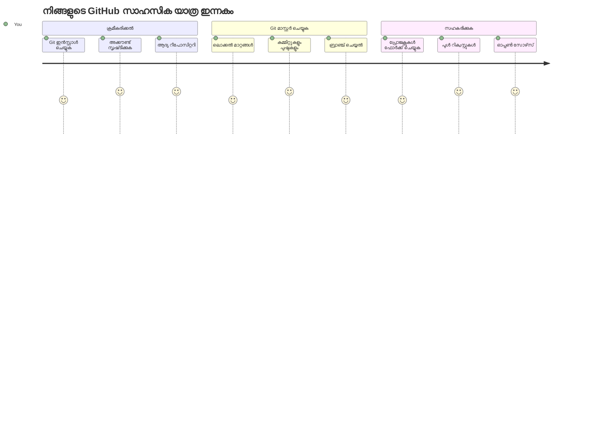
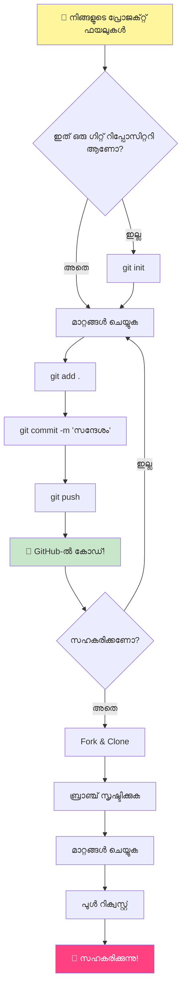
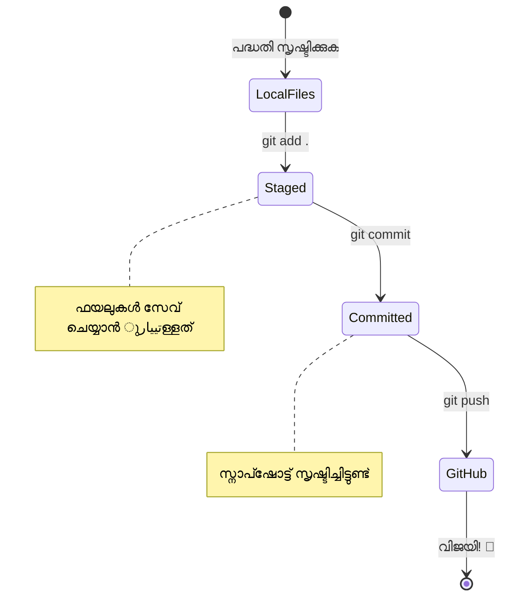
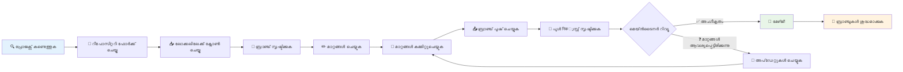
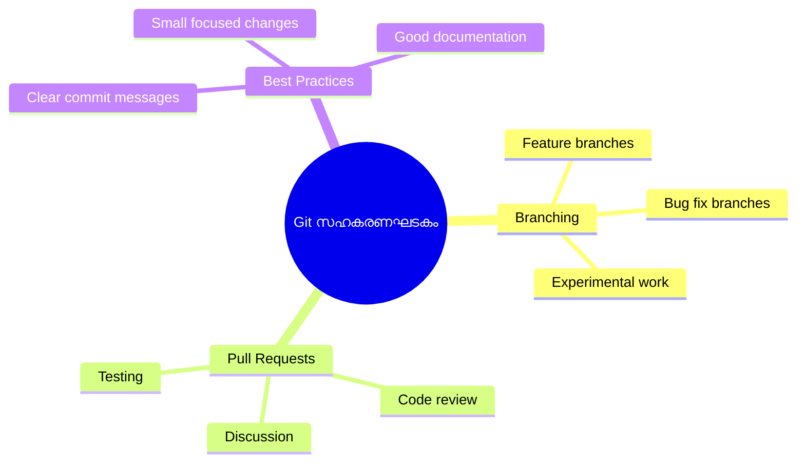
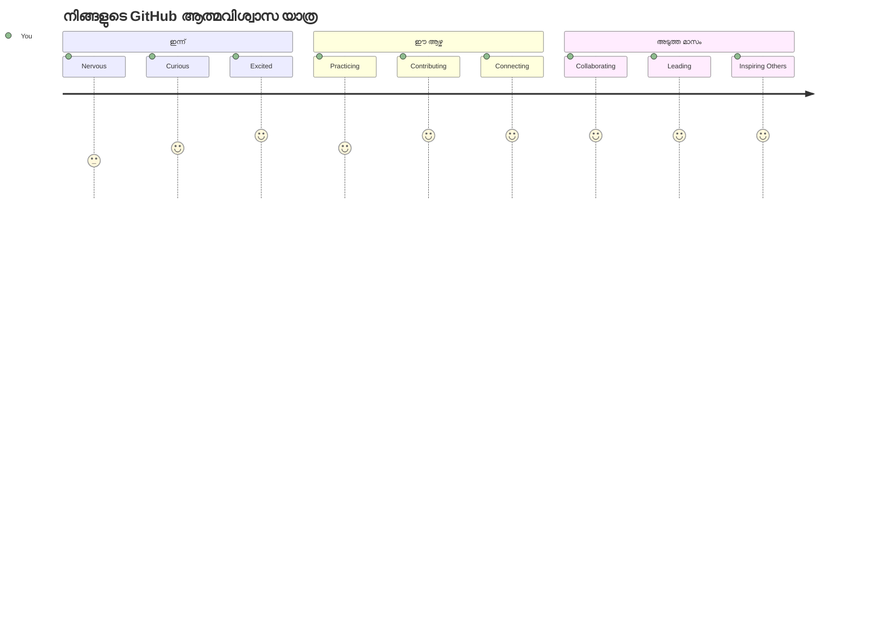

<!--
CO_OP_TRANSLATOR_METADATA:
{
  "original_hash": "5c383cc2cc23bb164b06417d1c107a44",
  "translation_date": "2026-01-08T20:30:47+00:00",
  "source_file": "1-getting-started-lessons/2-github-basics/README.md",
  "language_code": "ml"
}
-->
# ഗിറ്റ്ഹബ്ബ് പരിചയം

ഹൈ, ഭാവിയിലെ ഡെവലപ്പർ! 👋 ലോകമെമ്പാടും ലക്ഷങ്ങൾ കോഡർമാരെ ചേർന്നുവരാൻ തയ്യാറാണോ? ഗിറ്റ്ഹബ്ബിനെ നിങ്ങൾക്കു പരിചയപ്പെടുത്താൻ ഞാൻ അസാധാരണമായി ആവേശത്തിലാണ് – പ്രോഗ്രാമർമാർക്കുള്ള സോഷ്യൽ മീഡിയ പ്ലാറ്റ്‌ഫോമാണ് എന്ന് കരുതുക, എന്നാൽ നിങ്ങളുടെ ലഞ്ചിന്റെ ഫോട്ടോകൾ പങ്കിടുന്നതിനിടയ്ക്ക് പകരം, നാം കോഡ് പങ്കുവെച്ച് അത്ഭുതകരമായ കാര്യങ്ങൾ ერთად സൃഷ്ടിക്കുന്നു!

എനിക്ക് തീർച്ചയായും മനസിലാകാത്തത് ഇതാണ്: നിങ്ങൾ ഫോൺ ഉപയോഗിക്കുന്ന എല്ലാ ആപ്ലിക്കേഷനുകളും, നിങ്ങൾ സന്ദർശിക്കുന്ന ഓരോ വെബ്‌സൈറ്റും, നിങ്ങൾ പഠിക്കാനുദ്ദേശിക്കുന്ന ഉറപ്പിക്കുന്പോഴും ടൂൾസും, ദൃശ്യമായി GitHub പോലെയുള്ള പ്ലാറ്റ്ഫോമുകളിൽ സഹകരിച്ച് നിർമ്മിച്ചത് ഡെവലപ്പർമാരുടെ ടീമുകളാണ്. നിങ്ങൾ പ്രിയമുള്ള സംഗീത ആപ്പ്? ആപ്ലിക്കേഷനിൽ നിങ്ങൾ പോലൊരു ഒരാൾ സംഭാവന നൽകിയതാണ്. നിങ്ങൾ വിട്ടുകിട്ടാനാകാത്ത ആ ഗെയിം? അതും ഒരുപക്ഷെ GitHub സഹകരണത്തോടെ ആണ് നിർമ്മിച്ചത്. ഇപ്പോൾ നിങ്ങൾ ആ അത്ഭുതകരമായ സമുദായത്തിന്റെ ഭാഗമാകാൻ പഠിക്കുകയാണ്!

ആദ്യം ഇതെല്ലാം ആഭ്യന്തരമായി ഭീതികരമായിരിക്കാം എന്ന് എനിക്ക് അറിയാം – ഞാൻ എന്റെ ആദ്യ GitHub പേജ് നോക്കി "ഇത് എന്താണെന്ന് മനസ്സിലാകുന്നില്ല" എന്ന് ഞാൻ ഓർക്കുന്നു. പക്ഷേ ഇതാണ് കാര്യം: ഓരോ ഡെവലപ്പറും നിങ്ങൾ നിലവിലുള്ള സമയത്ത് ഏതേക്കുകയുമാണ് ആരംഭിച്ചത്. ഈ പാഠത്തിനൊടുവിൽ, നിങ്ങൾക്ക് നിങ്ങളുടെ സ്വന്തം GitHub റെപ്പോസിറ്ററി ഉണ്ടാകും (ഇത് നിങ്ങളുടെ വ്യക്തിഗത പ്രോജക്ട് പ്രദർശനശാലയായി കണക്കാക്കാം), നിങ്ങൾ നിങ്ങളുടെ പ്രവർത്തനം എങ്ങനെ സംരക്ഷിക്കാമെന്നും, മറ്റുള്ളവർക്കൊപ്പവും പങ്കുവെക്കാനും, മാസങ്ങളോളം ആളുകൾ ഉപയോഗിക്കുന്ന പ്രോജക്ടുകളിൽ സംഭാവന ചെയ്യാനും അറിയാം.

ഈ യാത്ര ഞങ്ങൾ ഒന്നിച്ച് കാൽ ചവിട്ടി തുടരും. വേഗം വേണ്ട, സമ്മർദ്ദം വേണ്ട – നിങ്ങൾക്കും, എനിക്കും, ഇനി നിങ്ങളുടെ പുതിയ മികച്ച കൂട്ടുകാരായി മാറാൻ പോകുന്ന ചില മികച്ച ഉപകരണങ്ങൾക്കുമൊത്ത്!


> സ്കെച്ച്നോട്ട് [Tomomi Imura](https://twitter.com/girlie_mac) द्वारा


## പ്രീ-ലെക്ടർ ക്വിസ്
[പ്രീ-ലെക്ചർ ക്വിസ്](https://ff-quizzes.netlify.app)

## പരിചയം

വളരെ രസകരമായ കാര്യങ്ങളിൽ ചാടിവരുന്നതിനു മുമ്പായി, GitHub മാജിക് ചെയ്യാൻ നിങ്ങളുടെ കമ്പ്യൂട്ടർ തയ്യാറാക്കാം! ഇതെന്തെന്നാൽ ഒരു കലാത്മക കൃതിക്ക് മുൻപ് ഞങ്ങൾ കലാസാധനങ്ങൾ ക്രമീകരിക്കുന്നത് പോലെ തന്നെ – ശരിയായ ഉപകരണങ്ങൾ ഒരുക്കിക്കൊള്ളുന്നത് എല്ലാം മെച്ചപ്പെടുത്തി കൂടുതൽ രസകരമാക്കും.

പ്രത്യേകിച്ച് ഓരോ സേഠപ്പും ഞാൻ നിങ്ങൾക്കൊപ്പം നടക്കാൻ പോകുന്നു, ആദ്യനോട്ടത്തിൽ ഭീതിയുണ്ടാവേണ്ടതായി തോന്നിക്കില്ല. ഏതെങ്കിലും കാര്യം ഉടൻ മനസ്സിലാകുന്നതല്ലെങ്കിൽ ഇത് സാധാരണമാണ്! ഞാൻ എന്റെ ആദ്യ ഡവലപ്പ്മെന്റ് പരിസരവും സജ്ജമാക്കുമ്പോൾ പുരാതന ഹിയറോഗ്ലിഫ്സുകൾ വായിക്കുന്നതുപോലെ തോന്നിയതാണ്. ഓരോ ഡെവലപ്പറും നിങ്ങൾ ഇപ്പോൾ ഉണ്ടാകുന്ന സ്ഥാനത്ത് ഒരിക്കൽ എത്തിയിട്ടുണ്ട്, അവർ ശരിയാവോ എന്ന് സംശയിച്ച്. സ്പോയിലർ ലവ്: நீங்கள் ഇവിടെ പഠിച്ചുകൊണ്ടിരിക്കുകയാണെങ്കിൽ, നിങ്ങൾ ഇതിനകം ശരിയാണെന്ന് തെളിയിച്ചു! 🌟

ഈ പാഠത്തിൽ നമ്മൾ പൂരംചെയ്യുന്നത്:

- നിങ്ങളുടെ കമ്പ്യൂട്ടറിൽ ചെയ്യുന്ന പ്രവർത്തനങ്ങൾ ട്രാക്ക് ചെയ്യുക
- മറ്റ് ആളുകളുമായി പ്രോജക്ടുകളിൽ പ്രവർത്തിക്കുക
- ഓപ്പൺ സോഴ്സ് സോഫ്റ്റ്‌വെയറിൽ സംഭാവന ചെയ്യുന്നത് എങ്ങനെ എന്നത്

### മുൻ‌നിയമങ്ങൾ

GitHub മാജിക് ചെയ്യാൻ നിങ്ങളുടെ കമ്പ്യൂട്ടർ തയ്യാറാക്കാം! വിഷമിക്കേണ്ട, സജ്ജീകരണം ഒന്നേ സമയം മാത്രം ചെയ്യണം, പിന്നീട് നിങ്ങളുടെ മുഴുവനായ കോഡിംങ് യാത്രക്കായി നിങ്ങൾ സജ്ജമാണ്.

സർവ്വതോലൂസ്ക്കരം തുടങ്ങാം! ആദ്യം, നിങ്ങളുടെ കമ്പ്യൂട്ടറിൽ Git ഇതിനകം സ്ഥലമുണ്ടോ എന്ന് പരിശോധിക്കാം. Git എന്ന് വെളിപ്പെടുത്തുക ഒരു അത്യന്തം ബുദ്ധിമുട്ടുള്ള അസിസ്റ്റന്റിനെയാണ്, നിങ്ങളുടെ കോഡിൽ നിങ്ങൾ ചെയ്യുന്ന എല്ലാ മാറ്റങ്ങളും ഓർക്കുന്നതിൽ വളരെ കഴിവുള്ളത് – Ctrl+S ബട്ടൺ തുടർച്ചയായി അമർത്തുന്നതു പോലെയല്ല (നാം എല്ലാവരും അങ്ങനെ ചെയ്തിട്ടുണ്ട്!).

Git ഇതിനകം ഇൻസ്റ്റാൾ ചെയ്തിട്ടുണ്ടോ എന്ന് നോക്കാം, ടെർമിനലിൽ ഈ majiic കമാൻഡ് ടൈപ്പ് ചെയ്യൂ:
`git --version`

Git ഇൻസ്റ്റാൾ ചെയ്തിട്ടില്ലെങ്കിൽ, വിഷമിക്കേണ്ട! [download Git](https://git-scm.com/downloads) എന്നിടങ്ങളിലേക്ക് ചെന്ന് അത് പിടിച്ചെടുക്കൂ. ഇൻസ്റ്റാൾ ചെയ്തശേഷം, Git നെ നിങ്ങൾക്കു പരിചയപ്പെടുത്തേണ്ടതുണ്ട്:

> 💡 **ആദ്യ സെറ്റ് അപ്പ്**: ഈ കമാൻഡുകൾ Git നിന്‍റെ പേര് എന്താണെന്ന് പറയും. ഈ വിവരങ്ങൾ നിങ്ങൾ ചെയ്യുന്ന ഓരോ കമിറ്റ്-നടത്തലിനും ചേർക്കപ്പെടും, അതിനാൽ നിങ്ങൾ പൊതുവായി പങ്കുവെക്കാൻ തക്ക പേര്-ഇമെയിൽ തിരഞ്ഞെടുക്കുക.

```bash
git config --global user.name "your-name"
git config --global user.email "your-email"
```

Git ഇതിനകം കോൺഫിഗർ ചെയ്തിട്ടുണ്ടോ എന്ന് പരിശോധിക്കാൻ നിങ്ങൾക്ക് ടൈപ്പ് ചെയ്യാം:
```bash
git config --list
```

GitHub അക്കൗണ്ട്, ഒരു കോഡ് എഡിറ്റർ (Visual Studio Code പോലുള്ള) ഉണ്ടായിരിക്കണം, കൂടാതെ ടെർമിനൽ (അഥവാ കമാൻഡ് പ്രാമ്പ്റ്റ്) തുറക്കേണ്ടിയിരിക്കും.

[github.com](https://github.com/) സന്ദർശിച്ച് അക്കൗണ്ട് ഉണ്ടാക്കൂ, അല്ലെങ്കിൽ ലോഗിൻ ചെയ്ത് പ്രൊഫൈൽ പൂരിപ്പിക്കൂ.

💡 **ആധുനിക ഉപദേശം**: പാസ്‌വേഡുകൾ ഇല്ലാതെ കൂടുതൽ ലളിതമായ സ്ഥിരീകരണത്തിന് [SSH കീകൾ](https://docs.github.com/en/authentication/connecting-to-github-with-ssh) സജ്ജമാക്കാമെന്നു പരിഗണിക്കുക അല്ലെങ്കിൽ [GitHub CLI](https://cli.github.com/) ഉപയോഗിക്കുക.

✅ GitHub യേകമാത്രമായ കോഡ് റിപ്പോസിറ്ററി അല്ല; മറ്റ് പലരും ഉണ്ട്, പക്ഷേ GitHub ഏറ്റവും ഏറെ അറിയപ്പെടുന്നതാണ്.

### തയ്യാറെടുപ്പ്

നിങ്ങൾക്ക് ഒരു കോഡ് പ്രോജക്ട് അടങ്ങിയ ഫോള്ഡർ (ലാപ്‌ടോപ്പ് അല്ലെങ്കിൽ പിസി) കൂടാതെ GitHub ല്‍ പൊതു റെപ്പോസിറ്ററി ഉണ്ടായിരിക്കണം, ഇത് മറ്റുള്ളവരുടെ പ്രോജക്ടുകളിൽ എങ്ങനെ സംഭാവന നൽകാമെന്ന് ഉദാഹരണമായി സേവിക്കുകയും ചെയ്യും.

### നിങ്ങളുടെ കോഡ് സുരക്ഷിതമാക്കുക

നാം കുറച്ചു സമയം സെക്യൂരിറ്റി സംബന്ധിച്ച് സംസാരിക്കാം – പക്ഷേ പേടിപ്പെടുത്തുന്ന കാര്യങ്ങൾ നിങ്ങളെ അടിച്ചമർത്തില്ല! ഇവാ സെക്യൂരിറ്റി പാടവങ്ങൾ നിങ്ങളുടെ കാറോ വീട്ടിലോ തലപ്പൊത്ത് അടക്കുന്നതുപോലെയാണ്. അവ സാമൂഹ്യപ്രവർത്തനങ്ങളായി മാറുകയും നിങ്ങളുടെ കഠിനാധ്വാനത്തെ സംരക്ഷിക്കുകയും ചെയ്യും.

GitHub ഉപയോഗിക്കുമ്പോൾ, സുരക്ഷാ മികച്ച രീതികൾ പാലിക്കുക എന്നത് പ്രധാനമാണ്:

| സുരക്ഷാ മേഖല  | മികച്ച പ്രഥിഷ്ഠ | അതിന്റെ പ്രാധാന്യം |
|---------------|---------------|----------------|
| **അടയാളപ്പെടൽ** | SSH കീകൾ അല്ലെങ്കിൽ വ്യക്തിഗത ആക്‌സസ് ടോകൺകൾ ഉപയോഗിക്കുക | പാസ്‌വേഡുകൾ കുറച്ചുകൂടി സുരക്ഷിതമല്ല, പണ്ടാരിച്ചതായി മാറുന്നു |
| **ഇരട്ട-ഘട്ട അംഗീകാരം** | GitHub അക്കൗണ്ടിൽ 2FA തുറക്കുക | അക്കൗണ്ട് സംരക്ഷണത്തിന് ഒരു അധിക പാളി കൂട്ടുന്നു |
| **റെപ്പോസിറ്ററി സുരക്ഷ** | സംവേദനശീല വിവരങ്ങൾ ഒരിക്കലും കമിറ്റ് ചെയ്യരുത് | API കീകൾ, പാസ്സ്‌വേഡുകൾ പൊതു റെപ്പോസിറ്ററികളിൽ പബ്ലിഷ് ചെയ്യരുത് |
| **ഡിപൻഡൻസി മാനേജ്മെന്റ്** | അപ്‌ഡേറ്റുകൾക്കായി Dependabot തുറക്കുക | നിങ്ങളുടെ ആശ്രിതങ്ങൾ സുരക്ഷിതമാക്കുകയും പുതുക്കുകയും ചെയ്യും |

> ⚠️ **നിബന്ധനാപൂർവ ഓർമ്മപ്പെടുത്തൽ**: API കീകൾ, പാസ്‌വേഡുകൾ, അല്ലെങ്കിൽ മറ്റെന്തെങ്കിലും സംവേദനശീല വിവരങ്ങൾ ഒരിക്കലും ഏതെങ്കിലും റെപ്പോസിറ്ററിയിൽ കമിറ്റ് ചെയ്യരുത്. പരിസ്ഥിതി വേരിയബിളുകളും `.gitignore` ഫയലുകളും ഉപയോഗിക്കുക.

**ആധുനിക അംഗീകാര സജ്ജീകരണം:**

```bash
# SSH കീ ജനറേറ്റ് ചെയ്യുക (ആധുനിക ed25519 ആൽഗോറിതം)
ssh-keygen -t ed25519 -C "your_email@example.com"

# Git നു SSH ഉപയോഗിക്കാൻ ക്രമീകരിക്കുക
git remote set-url origin git@github.com:username/repository.git
```

> 💡 **പ്രൊ ടിപ്പ്**: SSH കീകൾ പാസ്‌വേഡുകൾ നിന്ന് പുനരാധാര സമയം നൽകാതിരിക്കാനും പാരമ്പര്യ അംഗീകാര രീതികളെ അപേക്ഷിച്ച് കൂടുതൽ സുരക്ഷിതമാണെന്ന് തെളിയിക്കുന്നു.

---

## പ്രൊഫഷണലായി നിങ്ങളുടെ കോഡ് മാനേജ് ചെയ്യുക

ഇപ്പോഴാണ് കാര്യങ്ങൾ വല്ലാതെ രസകരമാകുന്നത്! 🎉 നിങ്ങൾക്കുപോലുള്ള പ്രൊമാർ കോഡ് എങ്ങനെ ട്രാക്ക് ചെയ്യുകയും മാനേജ് ചെയ്യുകയും ചെയ്യുന്നുവെന്ന് പഠിക്കാൻ പോകുന്നു, ഇത് പഠിപ്പിക്കാനായുള്ള ഞാൻ ഏറെ ഇഷ്ടപ്പെടുന്ന വിഷയമാണ്, കാരണം ഇത് ഒരു ഗെയിം ചേഞ്ചർ ആണ്.

നിരൂപണം ചെയ്യൂ: നിങ്ങൾ ഒരു അസാധാരണ കഥ എഴുതുന്നു, ഓരോ ഡ്രാഫ്റ്റും, ഓരോ മാന്യമായ എഡിറ്റും, ഓരോ "അയ, അതാണ് ജീനിയസ്!" എന്ന നിമിഷവും ട്രാക്ക് ചെയ്യാൻ ആഗ്രഹിക്കുന്നു. അതെ Git നിങ്ങളുടെ കോഡിനെയാണ് ചെയ്യുന്നത്! എല്ലാം ഓര്‍ക്കുന്ന വായ്പ്പുള്ള സമയयാത്ര 수행്‍ ബുക്ക് പോലെയാണ് - ഓരോ കീസ്ട്രോക്ക്, ഓരോ മാറ്റം, "അമ്പിള്ളി, ഇത് എല്ലാവരും തകരം" എന്ന് നിമിഷം ഉടൻ പിന്തള്ളാവുന്നതു വരെ ഓർക്കുന്നു.

സത്യമായി പറഞ്ഞാൽ - ഇത് ആദ്യം വഷളാകാം. ഞാൻ ആരംഭിച്ചപ്പോൾ, "എന്തുകൊണ്ട് സാധാരണ പോലെ എന്റെ ഫയലുകൾ സംരക്ഷിക്കാനാകുന്നില്ല?" എന്നും ഞാൻ ചിന്തിച്ചു. പക്ഷേ വിശ്വസിക്കുക: Git നിങ്ങൾക്കായി ക്ലിക്ക് ചെയ്യുമ്പോൾ (അതും ചെയ്യും!), നിങ്ങൾക്കു ഒരിക്കലും സ്മ രിക്കാവുന്ന ലോകം തുറക്കും "എനിക്ക് ഇതിനൊപ്പമുള്ള ആദ്യകാലത്തേയുള്ള കോഡിങ്ങ് എങ്ങനെ ചെയ്തു?" എന്ന പോലെ! നിങ്ങളുടെ രാവിലെ നടക്കുമ്പോൾ പറക്കാൻ നിങ്ങൾക്കായിരുന്നെന്നു കണ്ടെത്തുന്നതുപോലെ!

നിങ്ങളുടെ ലാപ്‌ടോപിൽ (അല്ലെങ്കിൽ പിസി) ഏതെങ്കിലും കോഡ് പ്രോജക്ട് അടങ്ങിയ ഫോള്ഡർ ഉണ്ടെന്ന് കരുതുക, നിങ്ങൾ git എന്ന വേർഷൻ കണ്ട്രോൾ സംവിധാനമായി ഉപയോഗിച്ച് നിങ്ങളുടെ പുരോഗതി ട്രാക്ക് ചെയ്യാൻ തുടങ്ങാൻ ആഗ്രഹിക്കുന്നു. ചിലരൊക്കെ git ഉപയോഗിക്കുന്നത് ഭാവിയിൽ നിങ്ങള്‍ക്ക് എന്നെ കാണിക്കുന്ന "പ്രണയം കത്ത്" എഴുതുക എന്നു താരതമ്യം ചെയ്യും. നിങ്ങളുടെ കമ്മിറ്റ് മെസ്സേജുകൾ ദിവസങ്ങളോ ആഴ്ചകളോ മാസങ്ങളോ കഴിഞ്ഞ ശേഷവും വായിക്കുമ്പോൾ നിങ്ങൾ നിര്‍ദ്ദേശം നല്‍കിയ കാരണങ്ങളെ നിങ്ങൾ തിരിച്ചറിയാനും "റോൾബാക്ക്" ചെയ്യാനും കഴിയും - അത് നല്ല കമ്മിറ്റ് മെസ്സേജുകള്‍ എഴുതുമ്പോഴാണ്.


### ടാസ്‌ക്: നിങ്ങളുടെ ആദ്യ റെപ്പോസിറ്ററി സൃഷ്ടിക്കുക!

> 🎯 **നിങ്ങളുടെ ദൗത്യം (ഞാൻ അതിനായി ഏറെ ആവേശത്തിലാണ്!)**: നമ്മൾ ഒരുമിച്ച് നിങ്ങളുടെ ആദ്യ GitHub റെപ്പോസിറ്ററി സൃഷ്ടിക്കാനാണ് പോകുന്നത്! ഇതു കഴിഞ്ഞാൽ, നിങ്ങളുടെ കോഡ് താമസിക്കുന്ന ഇന്റർനെറ്റിന്റെ ചെറിയ മുറിയുണ്ടാകും, നിങ്ങൾ ആദ്യ “കമിറ്റ്” (വളരെ ബുദ്ധിമുട്ടുള്ള രീതിയിൽ നിങ്ങളുടെ പ്രവർത്തി സംരക്ഷിക്കുന്നതിന് ഡെവലപ്പർമാരുടെ ഭാഷ) നടത്തി കഴിഞ്ഞിരിക്കും.
>
> ഇത് സ്‌നേഹപൂർവമായ ഒരു പ്രത്യേക നിമിഷമാണ് – നിങ്ങൾ ഔദ്യോഗികമായി ആഗോള ഡെവലപ്പർമാരുടെ സമൂഹത്തിൻറെ ഭാഗമാകും! എന്റെ ആദ്യ റെപ്പോ സൃഷ്ടിച്ചതിന്റെ ആവേശം ഞാൻ ഇപ്പോഴും ഓർക്കുന്നു "വാവ്, ഞാൻ ഇതു കാര്യമായി ചെയ്യുന്നുവെന്ന്!"

ഈ സഞ്ചാരത്തിലൂടെ നമ്മൾ ഒരുമിച്ച് കൂട്ടായി നടക്കുന്നുവെന്ന് കരുതാം, ഓരോ ഘട്ടവും ശ്രദ്ധയോടെ. വേഗത്തിലോട്ടുപോകാൻ അവകാശമില്ല, ഓരോ ഘട്ടവും മനസ്സിലാക്കും എന്ന് ഞാൻ ഉറപ്പുനൽകുന്നു. നിങ്ങളെ സ്നേഹിക്കുന്ന എല്ലാ കോഡിങ്ങ് സൂപ്പർസ്റ്റാർമാരും ഒരിക്കൽ നിങ്ങളുടെ നിലയിൽ ഇരുന്നു അവരുടെ ആദ്യ റെപ്പോ ഇല്ലാതാക്കാൻ പോകുകയായിരുന്നു. എത്ര കൂള്‍ ആണോ അത്?

> വീഡിയോ കാണുക
> 
> [](https://www.youtube.com/watch?v=9R31OUPpxU4)

**നമുക്ക് ഇത് ചേർന്ന് ചെയ്യാം:**

1. **GitHub-ൽ നിങ്ങളുടെ റെപ്പോസിറ്ററി സൃഷ്ടിക്കുക**. GitHub.com-ൽ പോകുക, മുകൾ വലത് കോണിൽ ആ ഇരുട്ടും പച്ച **New** ബട്ടണോ (അല്ലെങ്കിൽ **+** ചിഹ്നമോ) തിരയുക. അതിൽ ക്ലിക് ചെയ്ത് **New repository** തിരഞ്ഞെടുക്കുക.

   ചെയ്യാനുള്ള കാര്യങ്ങൾ:
   1. നിങ്ങളുടെ റെപ്പോസിറ്ററിക്ക് ഒരു പേര് നൽകൂ – അതൊരു ഇതുസബ് മനസ്സിലാക്കാവുന്ന പേര് ആയിരിക്കണം!
   1. നിങ്ങൾ ആഗ്രഹിക്കുന്നുവെങ്കിൽ ഒരു വിവരണം ചേർക്കൂ (ഇത് മറ്റുള്ളവർ നിങ്ങളുടെ പ്രോജക്ട് എന്താണെന്ന് മനസ്സിലാക്കാൻ സഹായിക്കുന്നു)
   1. ഇത് പൊതു (ഏവർക്കും കാണാൻ സാധിക്കും) ആക്കണമോ അല്ലെങ്കിൽ സ്വകാര്യതാനുസരണം (നിങ്ങള്ക്ക് മാത്രം) ആക്കണമോ തീരുമാനിക്കുക
   1. README ഫയൽ ചേർക്കാൻ ബോക്സ് പരിശോധിക്കാനായി ഞാൻ ശുപാർശ ചെയ്യുന്നു – ഇത് നിങ്ങളുടെ പ്രോജക്ടിന്റെ മുൻ പേജിനെപ്പോലെ ആണ്
   1. **Create repository** ക്ലിക്ക് ചെയ്ത് ആഘോഷിക്കൂ – നിങ്ങൾ ആദ്യ റെപ്പോ സൃഷ്ടിച്ചു! 🎉

2. **നിങ്ങളുടെ പ്രോജക്ട് ഫോളഡറിൽ നാവിഗേറ്റ് ചെയ്യുക**. ഇപ്പോൾ നിങ്ങളുടെ ടെർമിനൽ തുറക്കാം (ഭീതിയില്ല, അത്ര ഭയങ്കരമല്ല!). കമ്പ്യൂട്ടറിന് നിങ്ങളുടെ പ്രോജക്ട് ഫയലുകൾ എവിടെയാണ് എന്ന് പറയേണ്ടതുണ്ട്. ഈ കമാൻഡ് ടൈപ്പ് ചെയ്യൂ:

   ```bash
   cd [name of your folder]
   ```

   **ഇവിടെ നമ്മൾ ചെയ്യുന്നത്:**
   - "ഹേ, കമ്പ്യൂട്ടർ, എന്നെ എന്റെ പ്രോജക്ട് ഫോളഡർക്ക് കൊണ്ടുപോ!"
   - ഇത് നിങ്ങളുടെ ഡെസ്ക്ടോപ്പിലെ പ്രത്യേക ഒരു ഫോളഡർ തുറക്കുന്നതുപോലെ ആണ്, പക്ഷേ ടെക്സ്റ്റ് കമാൻഡുകൾ ഉപയോഗിച്ച് ചെയ്യുന്നു
   - `[name of your folder]` എന്നത് നിങ്ങളുടെ പ്രോജക്ട് ഫോളഡറിന്റെ യഥാർത്ഥ പേരായി മാറ്റുക

3. **ഫോളഡർ Git റെപ്പോസിറ്ററിയായി മാറ്റുക**. മാജിക്ക് ഇവിടെ നടക്കുന്നു! ടൈപ്പ് ചെയ്യൂ:

   ```bash
   git init
   ```

   **ഇവിടെ സംഭവിച്ചത് (വളരെ കൂള്‍ കാര്യങ്ങൾ!):**
   - Git നിങ്ങളുടെ പ്രോജക്ടിൽ ഒളിഞ്ഞ `.git` ഫോൾഡർ സൃഷ്ടിച്ചു – കാണാൻ കഴിയില്ല പക്ഷേ നിലനിൽക്കുന്നു!
   - നിങ്ങളുടെ സാധാരണ ഫോളഡർ ഇനി ഒരു "റെപ്പോസിറ്ററി" ആയി മാറി, നിങ്ങളുടെ ഓരോ മാറ്റവും ട്രാക്ക് ചെയ്യാൻ കഴിയും
   - നിങ്ങളുടെ ഫോളഡർക്കൊരു സൂപ്പർപവറുകൾ സമ്മാനിച്ചതുപോലെ കരുതുക അതെല്ലാം ഓർക്കാനുള്ള കഴിവ്

4. **സാമ്പത്തികങ്ങൾ പരിശോധിക്കുക**. Git നിങ്ങളുടെ പ്രോജക്ടിനെ ഇപ്പോൾ എങ്ങനെ കാണുന്നു എന്ന് നോക്കാം:

   ```bash
   git status
   ```

   **Git പറഞ്ഞതിനെ മനസിലാക്കുക:**

   നിങ്ങൾ ഇങ്ങനെ ഒരു സ്ഥലത്ത് കാണുന്നുണ്ട്:

   ```output
   Changes not staged for commit:
   (use "git add <file>..." to update what will be committed)
   (use "git restore <file>..." to discard changes in working directory)

        modified:   file.txt
        modified:   file2.txt
   ```

   **ഭയപ്പെടുത്താതെ! ഇതിന് അർത്ഥം:**
   - **ചുവപ്പ്** നിറത്തിലുള്ള ഫയലുകൾ മാറ്റങ്ങളുള്ളതായിരിക്കും, പക്ഷേ ഇപ്പോൾ സേവ് ചെയ്യാൻ തയ്യാറല്ല
   - **പച്ച** നിറത്തിലുള്ള ഫയലുകൾ (നിങ്ങൾ ഇവ കാണുമ്പോൾ) സേവ് ചെയ്യാൻ തയ്യാറാണ്
   - Git ഉപകാരപ്രദമാണ്, നിങ്ങൾക്ക് അടുത്ത എന്തുചെയ്യാമെന്ന് വ്യക്തമാക്കുന്നു

   > 💡 **പ്രൊ ടിപ്പ്**: `git status` കമാൻഡ് നിങ്ങളുടെ മികച്ച സുഹൃത്താണ്! എന്ത് സംഭവിച്ചെന്ന് പുറകിൽ മിണ്ടുമ്പോൾ ഏതു സമയവും ഇത് ഉപയോഗിക്കൂ. Git-നെ ചോദിക്കുന്നത് പോലെ "ഹേ, ഇപ്പോഴത്തെ സ്ഥിതി എന്താണ്?"

5. **നിങ്ങളുടെ ഫയലുകൾ സേവ് ചെയ്യാൻ ഒരുക്കുക** ("സ്റ്റേജിംഗ്" എന്നു പറയുന്നു):

   ```bash
   git add .
   ```

   **നാം ഇപ്പോഴത്തെത്തിച്ചത്:**
   - Git-നെ ഞങ്ങൾ "എല്ലാ ഫയലുകളും അടുത്ത സേവ്-ലെ ഉൾപ്പെടുത്തണം" എന്ന് പറഞ്ഞു
   - `.` എന്നത് "ഈ ഫോളഡറിലെ എല്ലാം" എന്നു പറയുന്നതുപോലെ
   - ഇപ്പോൾ നിങ്ങളുടെ ഫയലുകൾ "സ്റ്റേജ്" ചെയ്തു, അടുത്ത ഘട്ടത്തിനായി തയ്യാറായി

   **കുറച്ച് തിരഞ്ഞെടുക്കാനുദ്ദേശിക്കുന്നുണ്ടോ?** നിങ്ങൾ ചില പ്രത്യേക ഫയലുകൾ മാത്രം ചേർക്കാം:

   ```bash
   git add [file or folder name]
   ```

   **എന്തുകൊണ്ട് ഇതു ചെയ്യണം?**
   - ചിലപ്പോൾ ബന്ധപ്പെട്ട മാറ്റങ്ങൾ പാകമാക്കി സേവ് ചെയ്യാനാകുന്നു
   - നിങ്ങളുടെ പ്രവർത്തനം ലജിക്കൽ ചുക്കുകളിൽ ക്രമപ്പെടുത്തി സഹായിക്കുന്നു
   - എന്ത് മാറ്റം എപ്പോൾ ഉണ്ടായി എന്നത് മനസ്സിലാക്കാനും സഹായിക്കുന്നു

   **മനസ്സിലാക്കിയിരിക്കുന്നത് മാറ്റിയാൽ?** പ്രശ്നമില്ല! സ്റ്റേജ് ചെയ്ത ഫയലുകൾ ഇങ്ങനെ ഒഴിവാക്കാം:

   ```bash
   # എല്ലാം unstaging ചെയ്യുക
   git reset
   
   # ഒരു ഫയൽ മാത്രം unstaging ചെയ്യുക
   git reset [file name]
   ```

   ഭയപ്പെടേണ്ട, ഇത് നിങ്ങളുടെ പ്രവർത്തി ഇല്ലാതാക്കില്ല, "സേവ് ചെയ്യാൻ തയ്യാറായ" സ്റ്റാക്കിൽ നിന്നും ഫയലുകൾ പുറത്താക്കുന്നു.

6. **നിങ്ങളുടെ പ്രവർത്തി സ്ഥിരതയോടെ സേവ് ചെയ്യുക** (ആദ്യ കമ്മിറ്റ്!):

   ```bash
   git commit -m "first commit"
   ```

   **🎉 അഭിനന്ദനങ്ങൾ! നിങ്ങൾ നിങ്ങളുടെ ആദ്യ കമ്മിറ്റ് ചെയ്തു!**

   **ഇവിടെ സംഭവിച്ചത്:**
   - Git ഈ നിമിഷത്തെ എല്ലാ സ്റ്റേജ് ചെയ്ത ഫയലുകളുടെയും "സ്നാപ്ഷോട്ട്" എടുത്തു
   - നിങ്ങളുടെ "first commit" എന്ന മെസ്സേജ് ഈ സേവ് പോയിന്റ് വിദ്യാർത്ഥിക്കുന്നു
   - Git ഈ സ്നാപ്ഷോട്ടിന് യുണീക്ക് ഐഡി നൽകുകയും പിന്നീട് എപ്പോഴും നിങ്ങൾക്ക് അത് കണ്ടെത്താൻ കഴിയും
   - നിങ്ങൾ ഔദ്യോഗികമായി നിങ്ങളുടെ പ്രോജക്ട് ചരിത്രം ട്രാക്ക് ചെയ്യാൻ തുടങ്ങി!

   > 💡 **ഇനിയും കമ്മിറ്റുകൾക്ക് മെച്ചപ്പെട്ട മെസ്സേജുകൾ**: അടുത്തപ്പോഴും "updated stuff"െ പകരം "Add contact form to homepage" അല്ലെങ്കിൽ "Fix navigation menu bug" പോലുള്ള വിവരവും ഉള്ള മെസ്സേജുകൾ ഉപയോഗിക്കുക. നിങ്ങളുടെ ഭാവിയിലെ ഞാൻ നന്ദിപറയും!

7. **നിങ്ങളുടെ പ്രാദേശിക പ്രോജക്ട് GitHub-നെ കണക്റ്റ് ചെയ്യുക**. ഇപ്പോൾ, നിങ്ങളുടെ പ്രോജക്ട് നിങ്ങളുടെ കമ്പ്യൂട്ടറിൽ മാത്രമാണ്. GitHub റെപ്പോസിറ്ററിയുമായി കണക്റ്റ് ചെയ്തു ലോകവുമായി പങ്കുവെക്കാം!

   ആദ്യം, GitHub റെപ്പോസിറ്ററി പേജിൽ പോയി URL കോപ്പിയെടുക്കൂ. പിന്നെ ഇവിടെ واپس വന്ന് ടൈപ്പ് ചെയ്യുക:

   ```bash
   git remote add origin https://github.com/username/repository_name.git
   ```
   
   (രണ്ടാമത്തെ URL യഥാർത്ഥ റിപോസിറ്ററി URL കൊണ്ട് മാറുക!)

   **നാം ഇപ്പോഴത്തെത്തിച്ചത്:**
   - ഞങ്ങൾ നിങ്ങളുടെ ലോക്കൽ പ്രോജക്റ്റും നിങ്ങളുടെ GitHub റിപ്പോസിറ്ററിയും തമ്മിൽ ഒരു കണക്ഷൻ സൃഷ്ടിച്ചു
   - "Origin" എന്നത് നിങ്ങളുടെ GitHub റിപ്പോസിറ്ററിയുടെ ഒരു പകർപ്പ് മാത്രമാണ് – ഇത് നിങ്ങളുടെ ഫോൺയിലെ ഒരു കോൺടാക്റ്റ് കൂട്ടിച്ചേർക്കുന്നതുപോലെ ആണ്
   - ഇനി നിങ്ങളുടെ ലോക്കൽ Git-ന് നിങ്ങൾ നിങ്ങളുടെ കോഡ് പങ്ക് വെക്കാൻ സജ്ജമായപ്പോൾ എവിടെ അയയ്ക്കണമെന്ന് അറിയാം

   💡 **ഇളവുള്ള വഴി**: നിങ്ങൾക്ക് GitHub CLI ഇൻസ്റ്റാൾ ചെയ്തിട്ടുണ്ടെങ്കിൽ, നിങ്ങള്ക്കു ഇത് ഒരു കമാൻഡിൽ ചെയ്യാം:
   ```bash
   gh repo create my-repo --public --push --source=.
   ```

8. **നിങ്ങളുടെ കോഡ് GitHub-ക്ക് അയയ്ക്കുക** (പ്രധാന നിമിഷം!):

   ```bash
   git push -u origin main
   ```

   **🚀 ഇതാ, നിങ്ങൾ നിങ്ങളുടെ കോഡ് GitHub-ലേക്ക് അപ്‌ലോഡ് ചെയ്യുകയാണ്!**
   
   **എന്ത് നടക്കുന്നു:**
   - നിങ്ങളുടെ കമിറ്റുകൾ നിങ്ങളുടെ കമ്പ്യൂട്ടറിൽ നിന്ന് GitHub-ിലേക്കു പോകുന്നു
   - `-u` ഫ്ലാഗ് ഭാവിയിലെ പുഷ്‌കൾക്ക് എളുപ്പം പ്ര永久മായ കണക്ഷൻ സജ്ജമാക്കുന്നു
   - "main" നിങ്ങളുടെ പ്രധാന ബ്രാഞ്ചിന്റെ പേര് ആണ് (പ്രധാന ഫോൾഡറുപോലെ)
   - ഇതിന് ശേഷം നിങ്ങൾക്ക് ഭാവിയിൽ सिर्फ `git push` ടൈപ്പ് ചെയ്ത് അപ്‌ലോഡുകൾ ചെയ്യാം!

   💡 **പെട്ടെന്നുള്ള കുറിപ്പ്**: നിങ്ങളുടെ ബ്രാഞ്ചിന് മറ്റേതെങ്കിലും പേര് ഉണ്ടെങ്കിൽ ("master" പോലുള്ളത്), ആ പേര് ഉപയോഗിക്കുക. അറിയാൻ `git branch --show-current` ഉപയോഗിക്കാം.

9. **നിങ്ങളുടെ പുതിയ ദിനസ്രവ്ഷം** (ഇതിൽ നിങ്ങൾക്ക് നശിക്കുന്നത് തുടരും!):

   ഇനി മുതൽ, നിങ്ങളുടെ പ്രോജക്റ്റിൽ മാറ്റം വരുത്തുമ്പോൾ, നിങ്ങൾക്ക് ഈ സിംപിള്‍ മൂന്ന് ഘട്ടമുള്ള നൃത്തമുണ്ട്:

   ```bash
   git add .
   git commit -m "describe what you changed"
   git push
   ```

   **ഇതാണ് നിങ്ങളുടെ കോഡിങ്ങ് ഹൃദയം:**
   - നിങ്ങളുടെ കോഡിൽ ചില മനോഹരമായ മാറ്റങ്ങൾ ചെയ്യുക ✨
   - അവയെ സ്റ്റേജ് ചെയ്യുക `git add` വഴി ("ഹായ് Git, ഈ മാറ്റങ്ങൾ ശ്രദ്ധിക്കുക!")
   - സേവ് ചെയ്യുക `git commit` കമാൻഡും വിശദീകരണത്തോടെ (ഭാവിയിലെ നിങ്ങൾ നന്ദി പറയും!)
   - ലോകത്തോട് പങ്കുവെക്കുക `git push` 🚀
   - ആവർത്തിക്കുക - ഈ പ്രവൃത്തി ശ്വാസം എടുക്കുന്നതുപോലെ സ്വാഭാവികം ആകും!

   എനിക്ക് ഈ പ്രവൃത്തി പ്രണയം കാരണം, ഇത് ഒരു വീഡിയോ ഗെയിമിലെ അനേകം സേവ് പോയിന്റുകൾ പോലെ ആണ്. നിങ്ങൾക്ക് ഇഷ്ടമായ ഒരു മാറ്റം ചെയ്തുവോ? കമിറ്റ് ചെയ്യുക! റിസ്കി ഒരു കാര്യം പരീക്ഷിക്കാനോ? പ്രശ്നമില്ല - ആളുപോകരുത് നിങ്ങളുടെ അവസാന കമിറ്റിലേക്കു പോകാം!

   > 💡 **ടിപ്പ്**: GitHub-ൽ കാണാൻ നിങ്ങൾ ആഗ്രഹിക്കാത്ത ഫയലുകൾ ട്രാക്ക് ചെയ്യാതിരിക്കാനുള്ള ഒരു `.gitignore` ഫയൽ സ്വീകരിക്കാനും ആഗ്രഹിക്കാം - പോലെ നിങ്ങള്‍ വെളിപ്പെടുത്താതെ പുലർത്തുന്ന കുറിപ്പുകൾക്ക്. `.gitignore` ടമ്പ്‌ലേറ്റുകൾക്കായി [.gitignore templates](https://github.com/github/gitignore) സന്ദർശിക്കുക അല്ലെങ്കിൽ [gitignore.io](https://www.toptal.com/developers/gitignore) ഉപയോഗിച്ച് ഒരാൾ സൃഷ്ടിക്കാം.

### 🧠 **ആദ്യ റിപ്പോസിറ്ററി ചെക്കിൻ: എങ്ങനെ അനുഭവപ്പെട്ടു?**

**ഒരിക്കൽ വഴികാട്ടാനും വൈകല്യം വിലയിരുത്താനും:**
- നിങ്ങളുടെ കോഡ് ആദ്യമായി GitHub-ൽ പ്രദർശിപ്പിക്കുന്നത് എങ്ങനെ അനുഭവപ്പെട്ടു?
- ഏത് ഘട്ടം ഏറ്റവും ആശയക്കുഴപ്പമുണ്ടായിരുന്നു, ഏത് വലിയ എളുപ്പമാണ്?
- `git add`, `git commit`, `git push` തമ്മിലുള്ള വ്യത്യാസം നിങ്ങളുടെ വാക്കുകളിൽ വിശദീകരിക്കാമോ?


> **ഓർക്കുക**: പരിചയസമ്പന്നർ പോലും കമാൻഡുകൾ മറക്കാറുണ്ട്. ഈ പ്രവൃത്തി മെമ്മറി പരിശീലനം അനിവാര്യമാണ് - നിങ്ങൾ നല്ല നിലയിൽ വരുന്നു!

#### ആധുനിക Git പ്രവൃത്തിതന്ത്രങ്ങൾ

ഈ ആധുനിക രീതികൾ സ്വീകരിക്കാൻ പരിഗണിക്കുക:

- **Conventional Commits**: `feat:`, `fix:`, `docs:` പോലുള്ള മാനകൃതമായ കമിറ്റ് സന്ദേശ ഫോർമാറ്റ് ഉപയോഗിക്കുക. കൂടുതൽ അറിയാൻ [conventionalcommits.org](https://www.conventionalcommits.org/)
- **ആറ്റോമിക് കമിറ്റുകൾ**: ഓരോ കമിറ്റും ഒരൊറ്റ ലോഗിക്കൽ മാറ്റം പ്രതിനിധാനം ചെയ്യണം
- **മിതമായ ഇടവേളകളിൽ കമിറ്റ് ചെയ്യുക**: വ ശക്തമായ വിവരണങ്ങളോടുകൂടി പതിവായി കമിറ്റ് ചെയ്യുക

#### Commit സന്ദേശങ്ങൾ

ഒരു മികച്ച Git commit വിഷയം താഴെപറയുന്ന വാക്യം പൂർണ്ണമാക്കണം:
ഇപ്രകാരം ചെയ്താൽ, ഈ കമിറ്റ് <നിങ്ങളുടെ വിഷയം ഇവിടെ> ചെയ്യും

വിഷയത്തിന് നിർദ്ദേശ պաշտոնം, ഇപ്പോഴത്തെ കാലം ഉപയോഗിക്കുക: "change" പകരം "changed" അല്ലെങ്കിൽ "changes" വേണ്ട.  
വിഷയത്തെ പോലെ, ശരീരഭാഗത്തും (ഐച്ഛികം) നിർദ്ദേശകാലം ഉപയോഗിക്കുക. ശരീരഭാഗം മാറ്റത്തിനുള്ള പ്രേരണയും മുൻപത്തെ പെരുമാറ്റവുമായി താരതമ്യം ചെയ്യുക. നിങ്ങൾ `why` ആണ് വിശദീകരിക്കുന്നത്, `how` അല്ല.

✅ GitHub അന്വേക്ഷിക്കാൻ ചില മിനിറ്റുകൾ ചെലവഴിക്കൂ. നിങ്ങള്‍ക്ക് വളരെ മികച്ച ഒരു commit സന്ദേശം കണ്ടെത്താമോ? ഏറ്റവും ലളിതമായ ഒന്ന് കണ്ടെത്താമോ? ഒരു commit സന്ദേശത്തിൽ ഏറ്റവും പ്രധാനപ്പെട്ടതും ഉപയോഗപ്രദവുമായ വിവരമെന്നുള്ളത് എന്തെന്ന് നിങ്ങൾക്ക് തോന്നുന്നു?

## മറ്റുള്ളവരോട് പ്രവർത്തിക്കൽ (വൈക്കം ഭാഗം!)

നിങ്ങളുടെ തൊപ്പി പിടിച്ചിരിക്കുക, കാരണം GitHub ഇവിടെ അത്യന്തം മായാജാലമേ ഉള്ളത്! 🪄 നിങ്ങൾ നിങ്ങളുടെ സ്വതന്ത്ര കോഡ് കൈകാര്യം ചെയ്യാൻ പഠിച്ചു, എന്നാൽ ഇപ്പോൾ ഞങ്ങൾ ലോകമാകെ അതുല്യമായ ആളുകളുമുള്ള സഹകരണത്തിലേക്ക് പ്രവേശിക്കുന്നു.

ഇതാണ് ചിത്രം: നിങ്ങൾ നാളെ എഴുന്നേറ്റപ്പോഴേ someone ടോക്കിയോയിൽ നിന്നു നിങ്ങളുടെ കോഡ് മെച്ചപ്പെടുത്തിയതായി കാണുക. പിന്നീട് ബെर्लിൻ മേൽ നിന്നു ഒരാൾ ഒരു ബഗ് പറ്റിനടപ്പിക്കുന്നു. വൈകുന്നേരം വരെ സൗ പോളോയിലെ ഒരു ഡെവലപ്പർ നിങ്ങൾക്കു സങ്കൽപ്പിക്കാത്ത ഒരു ഫീച്ചർ ചേർക്കുന്നു. ഇത് ശാസ്ത്ര കഥയല്ല - GitHub പ്രപഞ്ചത്തിലെ അങ്ങേയറ്റം സാധാരണ കണ്ടം!

എനിക്ക് വളരെയധികം ആവേശം നൽകുന്നത് നിങ്ങളുടെ പഠിക്കുന്ന സഹകരണശക്തികൾ ആണ്. ഗൂഗിള്, മൈക്രോസോഫ്റ്റ്, നിങ്ങളുടെ ഇഷ്ട സ്റ്റാർട്ടപ്പുകൾ എല്ലാം എന്നും ഈ ഘടനകളിൽ പ്രവർത്തിക്കുന്നു. നിങ്ങൾക്ക് സാങ്കേതികമായി ഒരു ഉപകരണം മാത്രമല്ല - നിങ്ങൾ ആഗോള സോഫ്റ്റ്വേർ ലോകത്തെ ഒന്നാക്കുന്ന രഹസ്യഭാഷയാണ് പഠിക്കുന്നത്.

ഭേദഗതി ഒന്നാം പുൾ റിക്വസ്റ്റ് അവരുടെ ആദ്യ മർജ് പ്രക്രിയകൾ അനുഭവിച്ചതിനു ശേഷം, വികസകർക്കു ഓപ്പൺ സോഴ്സ് വിദഗ്ധതയിലേക്കുള്ള വലിയ ഉത്സാഹം വളരുന്നു. ലോകത്തിലെ ഏറ്റവും വലിയ, ഏറ്റവും സൃഷ്ടിച്ച ടീം പ്രോജക്ടിന്റെ ഭാഗമാകുന്നത് പോലെയാണ്!

> Video കാണുക
>
> [](https://www.youtube.com/watch?v=bFCM-PC3cu8)

GitHub-ലേക്ക് കാര്യങ്ങൾ ലഭ്യമാക്കാനുള്ള പ്രധാന കാരണം മറ്റുള്ള ഡെവലപ്പർമാർക്കൊപ്പമുളള സഹകരണം സാധ്യമാക്കാനായിരുന്നു.


നിങ്ങളുടെ റിപ്പോസിറ്ററിയിൽ, പ്രാവർത്തികം `Insights > Community` വഴി പ്രോജക്റ്റ് ശുഭ്രം ഞാറ്റുക GitHub കമ്മ്യൂണിറ്റി മാനദണ്ഡങ്ങൾ നിയന്ത്രിക്കുന്നു എന്ന് പരിശോധിക്കുക.

നിങ്ങളുടെ റിപ്പോസിറ്ററി പ്രൊഫഷണലായും സ്വാഗതം ചെയ്യുന്നതുമാക്കാൻ ആഗ്രഹിക്കുന്നുണ്ടോ? നിങ്ങളുടെ റിപ്പോസിറ്ററിയിലേക്ക് പോവുക, ശേഷം `Insights > Community` ക്ലിക്ക് ചെയ്യുക. ഈ പ്രത്യേകത "നല്ല റിപ്പോസിറ്ററി പ്രാക്ടീസുകൾ" എന്ന GitHub കമ്മ്യൂണിറ്റി പരിഗണിക്കുന്നതിനൊപ്പം നിങ്ങളുടെ പ്രോജക്റ്റ് എങ്ങനെ തുല്യമാണ് എന്ന് കാണിക്കുന്നു.

> 🎯 **നിങ്ങളുടെ പ്രോജക്റ്റ് തെളിയിക്കുക**: സുസംഘടിതവും നല്ല ഡോക്യുമെന്റേഷനുള്ളൊരു റിപ്പോസിറ്ററി ശുഭ്രവും സ്വാഗതം ചെയ്യുന്ന ഒരു സ്റ്റോർഫ്രണ്ട് പോലെ ആണ്. ഇത് നിങ്ങൾ നിങ്ങളുടെ ജോലി ശ്രദ്ധിക്കുമെന്ന് കാണിക്കുന്നു, മറ്റുള്ളവരുടെ സംഭാവനക്ക് പ്രേരിപ്പിക്കുന്നു!

**രെപ്പോസിറ്ററി മനോഹരമാക്കുന്നത് എന്താണ്:**

| എന്ത് ചേർക്കണം | അത് എന്തുകൊണ്ട് പ്രധാനമാണ് | അത് നിങ്ങള്ക്ക് എന്ത് നൽകുന്നു |
|-------------|-------------------|---------------------|
| **Description** | ആദ്യ ദൃശ്യപ്രഭാതം പ്രധാനം! | ആളുകൾക്കു ഉടൻ അറിയാം നിങ്ങളുടെ പ്രോജക്റ്റ് എന്ത് ചെയ്യുന്നു |
| **README** | നിങ്ങളുടെ പ്രോജക്റ്റിന്റെ ഫണ്ട് പേജ് | പുതിയ സന്ദർശകർക്കുള്ള സൗഹൃദ വീക്ഷണാതിഥി പോലെയാണ് |
| **Contributing Guidelines** | സഹായം സ്വാഗതം ചെയ്യുന്നുവെന്ന് കാണിക്കുന്നു | ആളുകൾക്ക് കൃത്യമായി എങ്ങനെ സഹായിക്കാമെന്ന് അറിയാം |
| **Code of Conduct** | സൗഹൃദപരമായ സ്ഥലം സൃഷ്ടിക്കുന്നു | എല്ലാവർക്കും പങ്കാളിത്തത്തിന് സ്വാഗതം |
| **License** | നിയമ വ്യവസ്ഥകൾ വ്യക്തമാക്കുന്നു | മറ്റുള്ളവര്‍ നിങ്ങളുടെ കോഡ് എങ്ങനെ ഉപയോഗിക്കാമെന്ന് മനസ്സിലാക്കും |
| **Security Policy** | നിങ്ങൾ ഉത്തരവാദിത്വമുള്ളവനെന്നു കാണിക്കുന്നു | പ്രൊഫഷണൽ രീതികൾ പ്രദർശിപ്പിക്കുന്നു |

> 💡 **പ്രൊ ടിപ്പ്**: GitHub ഈ എല്ലാ ഫയലുകൾക്കും ടെംപ്ളേറ്റുകൾ നൽകുന്നു. പുതിയ റിപ്പോസിറ്ററി സൃഷ്ടിക്കുമ്പോൾ ബോക്സുകൾ ടിക്ക് ചെയ്ത് സ്വയം ഈ ഫയലുകൾ സൃഷ്ടിക്കാം.

**ആധുനിക GitHub ഫീച്ചറുകൾ അന്വേഷിക്കുക:**

🤖 **ഓട്ടോമേഷൻ & CI/CD:**
- **GitHub Actions** ഓട്ടോമേറ്റഡ് ടെസ്റ്റിംഗും ഡിപ്ലോയ്‌മെന്റും വേണ്ടി
- **Dependabot** എൻറോൾ ചെയ്ത ഡിപെൻഡൻസി അപ്പ്‌ഡേറ്റുകൾക്ക്

💬 **കമ്മ്യൂണിറ്റി & പ്രോജക്റ്റ് മാനേജ്‌മെന്റ്:**
- **GitHub Discussions** പ്രശ്നങ്ങളിൽപ്പറ്റിയുള്ള കമ്മ്യൂണിറ്റി സംഭാഷണങ്ങൾക്കായി
- **GitHub Projects** കാൻബൻ സ്റ്റൈൽ പ്രോജക്റ്റ് മാനേജ്‌മെന്റിനായി
- **ബ്രാഞ്ച് പ്രൊട്ടക്ഷൻ നിയമങ്ങൾ** കോഡിന്റെ ഗുണനിലവാരം ഉറപ്പാക്കാനായി

ഈ എല്ലാ സ്രോതസ്സുകളും പുതിയ ടീം അംഗങ്ങളെ ഓൺബോർഡ് ചെയ്യുന്നതിനും ഉപയോഗപ്രദമാണ്. സാധാരണയായി പുതിയ സംഭാവനക്കാർ ഇത് ആദ്യമാണ് പരിശോധിക്കുന്നത്, നിങ്ങൾക്കുള്ള പ്രോജക്റ്റ് സമയം ചെലവഴിക്കാനുള്ള ശരിയായ സ്ഥാനം ആണോ എന്നു കണ്ടുനോക്കാൻ.

✅ README ഫയലുകൾ തയ്യാറാക്കാൻ സമയം എടുക്കുന്നു, പക്ഷെ ബിസി മാനേജർമാർ പലപ്പോഴും അവ അവഗണിക്കുന്നു. നിങ്ങൾക്ക് വളരെ വിവരണപരമായ README കണ്ടെത്താമോ? കുറിപ്പ്: മികച്ച README സൃഷ്ടിക്കാൻ സഹായിക്കുന്ന ചില [ഉപകരണങ്ങൾ](https://www.makeareadme.com/) ഉണ്ട്, പരീക്ഷിക്കാം.


### ടാസ്‌ക്: ചില കോഡ് മർജ് ചെയ്യുക

Contributing ഡോക്യുമെന്റുകൾ ആളുകൾക്ക് പ്രോജക്റ്റിൽ സംഭാവന ചെയ്യാൻ സഹായിക്കുന്നു. നിങ്ങൾക്കു തരത്തിലുള്ള സംഭാവനകൾ വേണമെന്ന്, പ്രക്രിയ എങ്ങനെ നടക്കും എന്ന് വിശദീകരിക്കുന്നു. സംഭാവനക്കാർ GitHub ലെ നിങ്ങളുടെ റിപ്പോസിറ്ററിയിലേക്ക് സംഭാവന ചെയ്യാൻ ഒരു പരമ്പരാ ഘട്ടങ്ങൾ പാലിക്കേണ്ടി വരും:

1. **നിങ്ങളുടെ റിപ്പോ ഫോർക്ക് ചെയ്യൽ** மக்கள் നിങ്ങളുടെ പ്രോജക്റ്റ് _fork_ ചെയ്യാൻ ആഗ്രഹിക്കാം. ഫോർക്ക് ചെയ്യുക എന്നാൽ അവരുടെ GitHub പ്രൊഫൈലിൽ നിങ്ങളുടെ റിപ്പോസിറ്ററിയുടെ പകർപ്പ് സൃഷ്ടിക്കുക എന്നാര്ത്ഥം.
1. **ക്ലോൺ ചെയ്യുക**. അവിടെ നിന്നും അവർ പ്രോജക്റ്റ് നിങ്ങളുടെ ലോക്കൽ മെഷീനിലേക്കു ക്ലോൺ ചെയ്യും.
1. **ഒരു ബ്രാഞ്ച് സൃഷ്ടിക്കുക**. അവർക്ക് അവരുടെ ജോലി വെക്കാൻ ഒരു _ബ്രാഞ്ച്_ സൃഷ്ടിക്കാൻ പറയും.
1. **മാറ്റത്തെ ഒറ്റഫലകത്തിലുള്ള മാറ്റみに‍ച്ച് ഫോക്കസ് ചെയ്യുക**. സംഭാവനക്കാർ ഒരു സമയം ഒരേ ഒരു വിഷയത്തിൽ ശ്രദ്ധ കേന്ദ്രീകരിക്കാൻ വേണം - അങ്ങനെ അവർ നൽകിയ മാറ്റങ്ങൾ വെട്ടിപ്പിഴച്ചു ചേർക്കാനാകും. അവരെ കണക്കാക്കുക, ഒരു ബഗ് പരിഹാരവും ഒരു പുതിയ ഫീച്ചറും വിവിധ ടെസ്റ്റുകൾ അപ്ഡേറ്റു ചെയ്യുകയും ചെയ്താൽ - നിങ്ങൾക്ക് ഏത് രണ്ട് മെച്ചപ്പെടുത്തലുകൾ അല്ലെങ്കിൽ ഒരു മെച്ചപ്പെടുത്തൽ മാത്രമേ ശരിക്കും നടപ്പിലാക്കാൻ കഴിയും എന്നറിയാതെ?

✅ നല്ല കോഡ് എഴുതാനും ലഭ്യമാക്കാനും ബ്രാഞ്ചുകൾ നിർണായകമായ സാഹചര്യങ്ങൾ സങ്കൽപിക്കുക. നിങ്ങൾക്ക് എന്ത് ഉപയോക്തൃകേസുകൾ വരാം?

> ഓർക്കുക, നിങ്ങൾ ലോകത്തിൽ കാണാൻ ആഗ്രഹിക്കുന്ന മാറ്റം നിങ്ങൾ തന്നെ ആകുക, നിങ്ങളുടെ ജോലിക്കും ബ്രാഞ്ചുകൾ സൃഷ്ടിക്കുക. നിങ്ങൾ ചെയ്യുന്ന ഓരോ കമിറ്റും നിങ്ങൾ ഇപ്പോൾ "checkout" ചെയ്തിരിക്കുന്ന ബ്രാഞ്ചിൽ ഉണ്ടാകും. ഏതു ബ്രാഞ്ച് ആണെന്ന് കാണാൻ `git status` ഉപയോഗിക്കുക.

ഒരു സംഭാവനാ പ്രവൃത്തി പാത വഴി നമുക്ക് പോകാം. സംഭാവനാകാരി ഇതിനകം മാത്രമേ _fork_ ചെയ്ത് _clone_ ചെയ്തിട്ടുള്ളൂ എന്ന് ധരിക്കുക; അവർക്ക് ലോക്കൽ മെഷീനിൽ പ്രവർത്തിക്കാൻ Git റിപ്പോ തയ്യാറായി:

1. **ഒരു ബ്രാഞ്ച് സൃഷ്ടിക്കുക**. സംഭാവനകൾ അടങ്ങുന്ന ബ്രാഞ്ച് സൃഷ്ടിക്കാൻ `git branch` കമാൻഡ് ഉപയോഗിക്കുക:

   ```bash
   git branch [branch-name]
   ```

   > 💡 **ആധുനിക സമീപനം**: നിങ്ങൾ ഒരു കമാൻഡിൽ പുതിയ ബ്രാഞ്ച് സൃഷ്ടിച്ച് ഉൾപ്പെടുത്താവുന്നതാണ്:
   ```bash
   git switch -c [branch-name]
   ```

1. **പ്രവൃത്തി ബ്രാഞ്ചിലേക്ക് മാറുക**. നിർദ്ദിഷ്ട ബ്രാഞ്ചിലേക്ക് മാറി വർക്കിംഗ് ഡയറക്ടറി അപ്ഡേറ്റ് ചെയ്യാൻ `git switch` ഉപയോഗിക്കുക:

   ```bash
   git switch [branch-name]
   ```

   > 💡 **ആധുനിക കുറിപ്പ്**: ബ്രാഞ്ചുകൾ മാറാൻ `git switch` ഉപയോഗിക്കുക, ഇത് `git checkout` ന്റെ ആധുനിക, കൂടുതൽ വ്യക്തമായ, സുരക്ഷിതമായ പകരമാണ്.

1. **ജോലി ചെയ്യുക**. ഈ ഘട്ടത്തിൽ മാറ്റങ്ങൾ ചേർക്കുക. Git-ന് അറിയിക്കാൻ താഴെപ്പറയുന്ന കമാൻഡുകൾ മറക്കരുത്:

   ```bash
   git add .
   git commit -m "my changes"
   ```

   > ⚠️ **കമിറ്റ് സന്ദേശ നിലവാരം**: നിങ്ങളുടെ കമിറ്റിന് നല്ല പേര് നൽകുക, നിങ്ങൾക്കും സഹായം ചെയ്യുന്ന maintainer-നും വേണ്ടി. നടത്തിയ മാറ്റം നിഷ്കളങ്കമായി വിശദീകരിക്കുക!

1. **നിങ്ങളുടെ ജോലി `main` ബ്രാഞ്ച്‌ൽ ചേർക്കുക**. നിങ്ങള്‍ക്ക് ജോലി കഴിഞ്ഞാൽ അതിനെ `main` ബ്രാഞ്ചിനൊപ്പം സംയോജിപ്പിക്കണം. `main` ബ്രാഞ്ച് ഇടയ്ക്കായി മാറിയിരിക്കാം, അതിനാൽ ആദ്യം താഴെപ്പറയുന്ന കമാൻഡുകൾ പ്രവർത്തിപ്പിച്ച് ഇത് ഏറ്റവും പുതിയത് ആക്കുക:

   ```bash
   git switch main
   git pull
   ```

   ഈ ഘട്ടത്തിൽ Git നിർവഹിച്ചു ചേർക്കാൻ കഴിയാത്ത **സംഘർഷങ്ങൾ(conflicts)** ഉണ്ടാകുന്ന സ്ഥലങ്ങൾ ഒരുങ്ങുക. അതിനായി താഴെപ്പറയുന്ന കമാൻഡുകൾ പ്രവർത്തിപ്പിക്കുക:

   ```bash
   git switch [branch_name]
   git merge main
   ```

   `git merge main` കമാൻഡ് `main` ന്റെ എല്ലാ മാറ്റങ്ങളും നിങ്ങളുടെ ബ്രാഞ്ചിലേക്ക് കൊണ്ടുവരും. സാധാരണ നിലയിൽ തുടരാം. ഇല്ലെങ്കിൽ VS Code Git എവിടെ പ്രശ്നമുണ്ട് എന്ന് കാണിക്കുകയും, നിങ്ങൾ ദൃശ്യഫയലുകളിൽ ഏറ്റവും കൃത്യമായ ഉള്ളടക്കം എത്രയെന്ന് തിരുത്തുകയുമാകും.

   💡 **ആധുനിക ബദൽ**: ശുഭ്രമായ ചരിത്രത്തിനായി `git rebase` പരിഗണിക്കുക:
   ```bash
   git rebase main
   ```
   ഇത് പുതിയ `main` ബ്രാഞ്ചിന്റെ മുകളിലായി നിങ്ങളുടെ കമിറ്റ് പുനരാവൃത്തിയാക്കുന്നു, സാദ്ധ്യമാക്കുന്നു സുതാര്യമായ ചരിത്രം.

1. **നിങ്ങളുടെ ജോലി GitHub-ലേക്ക് അയക്കുക**. GitHub-നു നിങ്ങളുടെ ജോലി അയക്കുന്നത് രണ്ട് കാര്യങ്ങൾക്കായി ആണ്. നിങ്ങൾ നിങ്ങളുടെ ബ്രാഞ്ച് നിങ്ങളുടെ റിപ്പോസിറ്ററിയിലേക്കു പുഷ് ചെയ്യണം, പിന്നെയും ഒരു PR, പുൾ റിക്വസ്റ്റ് തുറക്കണം.

   ```bash
   git push --set-upstream origin [branch-name]
   ```

   മേൽ പറയപ്പെട്ട കമാൻഡ് നിങ്ങളുടെ ഫോർക്ക് ചെയ്ത റിപ്പോയിൽ ബ്രാഞ്ച് സൃഷ്ടിക്കും.

### 🤝 **സഹകരണ നൈപുണ്യ പരിശോധന: മറ്റുള്ളവരോടൊപ്പം പ്രവർത്തിക്കാനാണ് തയ്യാറോ?**

**സഹകരണം എങ്ങനെ അനുഭവപ്പെടുന്നു പരിശോധിക്കാം:**
- ഫോർക്കിംഗ്, പുൾ റിക്വസ്റ്റ് ആശയം ഇപ്പോൾ മനസ്സിലാവുന്നുണ്ടോ?
- ബ്രാഞ്ചുകളിൽ പ്രവർത്തനത്തോട് ബന്ധപ്പെട്ട ഒരു കാര്യത്തിൽ കൂടുതൽ പരിശീലനം ചെറുതാക്കാൻ ആഗ്രഹിക്കുന്നുണ്ടോ?
- മറ്റാരുടെയും പ്രോജക്റ്റിൽ സംഭാവന ചെയ്യുന്നതിൽ നിങ്ങൾ എത്രത്തോളം സ്വസ്ഥയാണെന്ന് തോന്നുന്നു?


> **ആത്മവിശ്വാസം വർദ്ധിപ്പിക്കുക**: നിങ്ങൾ ആദരിക്കുന്ന ഓരോ ഡെവലപ്പറും ആദ്യ പുൾ റിക്വസ്റ്റ് തുടങ്ങുമ്പോൾ നർവസ് ആയിരുന്നു. GitHub സമൂഹം പുതെത്തെവർക്കും അതി സ്നേഹപൂർവ്വം വരവേൽക്കുന്നു!

1. **ഒരു PR തുറക്കുക**. ഇനി, നിങ്ങൾ ഒരു PR തുറക്കണം. GitHub-ലെ ഫോർക്കുചെയ്ത റിപ്പോസിറ്ററിയിലേക്ക് പോകുക. GitHub നിങ്ങൾ പുതിയ PR സൃഷ്ടിക്കാൻ ആഗ്രഹിക്കുന്നുണ്ടോ എന്ന് ചോദിക്കുന്ന ഒരു സൂചന കാണിക്കും, അതിൽ ക്ലിക്ക് ചെയ്യുക, Commit സന്ദേശത്തിന്റെ തലക്കെട്ട് മാറ്റാനോ മികച്ച വിവരണം നൽകാനോ കഴിയുന്ന ഇന്റർഫേസ് തുറക്കും. ഇനി നിങ്ങൾ ഫോർക്ക് ചെയ്ത റിപ്പോയുടെ Maintainer ഈ PR കാണും, പിന്തുണയ്ക്കും, നിങ്ങളുടെ PR മർജ്ജ് ചെയ്യും. നിങ്ങൾ ഇപ്പോൾ ഒരാളെത്തരി, യേ :)

   💡 **ആധുനിക ടിപ്പ്**: GitHub CLI ഉപയോഗിച്ച് PR സൃഷ്ടിക്കാം:
   ```bash
   gh pr create --title "Your PR title" --body "Description of changes"
   ```

   🔧 **PR-കളെക്കുറിച്ചുള്ള മികച്ച പ്രാക്ടീസുകൾ**:
   - "Fixes #123" പോലുള്ള കീവേർഡുകൾ ഉപയോഗിച്ച് ബന്ധപ്പെട്ട ഇഷ്യൂസുകളുമായി ലിങ്ക് ചെയ്യുക
   - UI മാറ്റങ്ങൾക്ക് സ്ക്രീൻഷോട്ടുകൾ ചേർക്കുക
   - പ്രത്യേക റിവ്യൂവർമാരെ അഭ്യർത്ഥിക്കുക
   - പ്രവൃത്തി പുരോഗതിക്കുള്ള Draft PRകൾ ഉപയോഗിക്കുക
   - റിവ്യൂ അഭ്യർത്ഥിക്കുന്നതിന് മുമ്പ് എല്ലാ CI പരിശോധനകളും പരിചയപ്പെടുക
1. **പരിശുദ്ധീകരണം**. ഒരു PR വിജയകരമായി മേഴ്ജ് ചെയ്തശേഷം _പരിശുദ്ധീകരണം_ നടത്തുന്നത് നല്ല പ്രവർത്തനരീതിയാണ് എന്ന് കണക്കാക്കപ്പെടുന്നു. നിങ്ങളുടെ ലോക്കൽ ബ്രാഞ്ചും GitHub-ലേക്ക് പുഷ് ചെയ്തത് ആയ ബ്രാഞ്ചും ഇരട്ടിയിലും നിങ്ങൾ പരിശോധിച്ചു തീര്ക്കണം. ആദ്യം താഴെ നൽകിയ കമാൻഡ് ഉപയോഗിച്ച് അത് ലോക്കലായി ഡീലീറ്റ് ചെയ്യാം: 

   ```bash
   git branch -d [branch-name]
   ```

   തുടർന്നു പൂർണ്ണമായും GitHub പേജിലേക്ക് പോകുകയും അവിടെ പുഷ് ചെയ്ത റിമോട്ട് ബ്രാഞ്ച് നീക്കം ചെയ്യുകയും ചെയ്യുക.

`പുൾ റിക്വസ്റ്റ്` എന്നത് ചെറിയൊരു പദം പോലെ തോന്നിയേക്കാം, കാരണം നിങ്ങൾ ചെയ്യാൻ പോകുന്നത് നിങ്ങളുടെ മാറ്റങ്ങൾ പ്രോജക്റ്റിലേക്ക് പുഷ് ചെയ്യുകയാണ്. എന്നാൽ മെയിന്റൈനർ (പ്രോജക്റ്റ് ഉടമ) അല്ലെങ്കിൽ കോർ ടീം നിങ്ങളുടെ മാറ്റങ്ങൾ പരിഗണിച്ച് പ്രോജക്റ്റിന്റെ "മെയിൻ" ബ്രാഞ്ചിൽ മേഴ്ജ് ചെയ്യുന്നതിന് മുമ്പ് നിങ്ങൾ മെയിന്റൈനറിൽ നിന്ന് ഒരു മാറ്റ തീരുമാനമെടുക്കാൻ അഭ്യർത്ഥിക്കുന്നു എന്നതാണ് സത്യം.

ഒരു പുൾ റിക്വസ്റ്റ് പുതിയ ബ്രാഞ്ചിൽ കൊണ്ടുവരുന്ന വ്യത്യാസങ്ങൾ കണക്കാക്കി അവനവ സ്‌പർശിക്കുന്ന, റിവ്യൂകൾ, കമന്റുകൾ, ഇൻറഗ്രേറ്റഡ് ടെസ്റ്റുകൾ എന്നിവയോടൊപ്പം ചർച്ച ചെയുന്നതിന് ഒരു സ്ഥലം ആണ്. നല്ലൊരു പുൾ റിക്വസ്റ്റ് ഏകദേശം ഒരു കമ്മിറ്റ് സന്ദേശത്തിന്റെ നിയമങ്ങൾ പിന്തുടരുന്നു. ഉദാഹരണത്തിന് നിങ്ങളുടെ പ്രവർത്തനം ഒരു പ്രശ്നം പരിഹരിക്കുന്ന പക്ഷം, എന്നത് എന്നുമുണ്ട്. ഇത് `#` എന്ന ചിഹ്നത്തിനുശേഷം നിങ്ങളുടെ പ്രശ്നത്തിന്റെ നമ്പർ രേഖപ്പെടുത്തിയതിനാൽ സാധിക്കുന്നു. ഉദാഹരണം `#97`.

🤞എല്ലാ പരിശോധനകളും പാസാകുകയും പ്രോജക്റ്റ് ഉടമ(കൾ) നിങ്ങളുടെ മാറ്റങ്ങൾ പ്രോജക്റ്റിലേക്ക് മേഴ്ജ് ചെയ്യുകയും ചെയ്യും എന്ന് ആശംസിക്കുന്നു🤞

GitHub-ലേയുള്ള തുല്യമായ റിമോട്ട് ബ്രാഞ്ചിൽ നിന്നും എല്ലാ പുതിയ കമ്മിറ്റുകളുമടങ്ങിയിടെയുള്ള നിങ്ങളുടെ നിലവിലെ ലോക്കൽ പ്രവർത്തന ബ്രാഞ്ച് അപ്‌ഡേറ്റ് ചെയ്യുക:

`git pull`

## ഓപ്പൺ സോഴ്സ്-ന് സംഭാവന ചെയ്യുന്നു (നിങ്ങളുടെ സ്വാധീനം സാദ്ധ്യമാക്കാനുള്ള അവസരം!)

ഇത്രയും വലിയൊരു വസ്തുവിനെ കുറിച്ച് നിങ്ങളെ വിസ്മയിപ്പിക്കാൻ എന്തെങ്കിലും തയ്യാറാണോ? 🤯 ഓപ്പൺ സോഴ്സ് പ്രോജക്റ്റുകളിൽ സംഭാവന ചെയ്യുന്നത് பற்றி സംസാരിക്കാം – അതിനെ കുറിച്ച് ഞാൻ share ചെയ്യാൻ പറ്റിയെന്ന് ആലോചിക്കുന്നതിൽ ഞാൻ goosebumps महसूसിക്കുന്നു!

ഇത് നിങ്ങൾക്ക് യഥാർത്ഥത്തിൽ ഒരു അസാധാരണമായ കാര്യം becoming a part of ആദ്യമായിട്ടാണ്. നിങ്ങൾ ദിവസേന ഉപയോഗിക്കുന്ന ലക്ഷക്കണക്കിന് ഡെവലപ്പർമാർ ഉപയോഗിക്കുന്ന ഉപകരണങ്ങൾ മെച്ചപ്പെടുത്തുന്നോ, അല്ലെങ്കിൽ നിങ്ങളുടെ സുഹൃത്തുക്കൾ പ്രിയപ്പെട്ട ആപ്പിൽ ഉണ്ടാകുന്ന ഒരു ബഗിനെ ശരിയാക്കുന്നോ എന്ന് സങ്കൽപിക്കുക. ഇത് ഒരു സ്വപ്നം മാത്രം അല്ല – ഇത് ഓപ്പൺ സോഴ്സ് സംഭാവനയുടെ മുഖ്യ ലക്ഷ്യമാണ്!

ഇത് ചിന്തിക്കുമ്പോൾ എനിക്ക് chills നൽകുന്ന കാര്യം ഇതാണ്: നിങ്ങൾ പഠിക്കുന്ന ഓരോ ഉപകരണവും – നിങ്ങളുടെ കോഡ് എഡിറ്റർ, നാം പഠിക്കാൻ പോകുന്ന ഫ്രെയിംവർക്ക്, നിങ്ങൾ ഈ വായന നടത്തുന്ന ബ്രൗസറും – എല്ലാം ഒരാൾ നിങ്ങൾ പോലെയുള്ള ഒരാൾതന്നെയായിരുന്നു ആദ്യത്തെ സംഭാവന ചെയ്തപ്പൊഴാണ് തുടങ്ങിയതെന്ന്. നിങ്ങളുടെ ഇഷ്ടമുള്ള VS Code എക്സ്റ്റൻഷൻ നിർമ്മിച്ച那个 ശ്രദ്ധേയനായ ഡെവലപ്പർ? അവർ ഒരിക്കൽ തന്നെ ഒരു പുതിയ ശൂന്യമായ ഹസ്തത്തോടെ "create pull request" ക്ലിക്കുചെയ്ത നയമായിരുന്നു, നിങ്ങൾ ചെയ്യാൻ പോകുന്നതുപോലെ.

അതിന്റെ ഏറ്റവും മനോഹരമായ ഭാഗം ഇതാണ്: ഓപ്പൺ സോഴ്സ് സമൂഹം ആഗോള വെബിന്റെ ഏറ്റവും വലിയ കൂട്ടായ്മ പോലെ ആണ്. പല പ്രോജക്റ്റുകളും സജീവമായി പുതുതായി ചേരുന്നവരെ അന്വേഷിക്കുകയും പ്രത്യേകിച്ച് "good first issue" ടാഗുചെയ്ത പ്രശ്നങ്ങൾ新人കൾക്കായി ഉണ്ടാക്കിയിട്ടുള്ളതു്! മെയിന്റൈനർമാർ പുതിയ സംഭാവനക്കാർ കാണുമ്പോൾ വളരെ ആഹ്ലാദിക്കുന്നു കാരണം അവർ സ്വന്തം ആദ്യ ചുവടുകൾ ഓർക്കുന്നു.

```mermaid
flowchart TD
    A[🔍 GitHub അന്വേഷിക്കുക] --> B[🏷️ "നല്ല പ്രഥമപ്രശ്നം" കണ്ടെത്തുക]
    B --> C[📖 സംഭാവനാനിര്‍ദ്ദേശങ്ങള്‍ വായിക്കുക]
    C --> D[🍴 റിപോസിറ്ററി ഫോര്‍ക്കും ചെയ്യുക]
    D --> E[💻 പ്രാദേശിക പരിസ്ഥിതി ക്രമീകരിക്കുക]
    E --> F[🌿 ഫീച്ചര്‍ ബ്രാഞ്ച് സൃഷ്ടിക്കുക]
    F --> G[✨ നിങ്ങളുടെ സംഭാവന നടത്തുക]
    G --> H[🧪 നിങ്ങളുടെ മാറ്റങ്ങള്‍ പരിശോധന നടത്തുക]
    H --> I[📝 വ്യക്തമായ കമ്മിറ്റ് എഴുതുക]
    I --> J[📤 പുഷ് ചെയ്ത് പുല്‍ റിക്വസ്റ്റ് സൃഷ്ടിക്കുക]
    J --> K[💬 പ്രതികരണവുമായി ഇടപഴകുക]
    K --> L[🎉 ലയിച്ചു! നിങ്ങൾ സംഭാവന ദാതാവാണ്!]
    L --> M[🌟 അടുത്ത പ്രശ്നം കണ്ടെത്തുക]
    
    style A fill:#e1f5fe
    style L fill:#c8e6c9
    style M fill:#fff59d
```
നിങ്ങൾ ഇവിടെ നൂറു ശതമാനം കോഡ് പഠിക്കുന്നില്ല – നിങ്ങൾ ഓരോ ദിവസവും "ഡിജിറ്റൽ ലോകം എങ്ങനെ മെച്ചപ്പെടുത്താം?" എന്നു ചിന്തിക്കുന്ന ഒരു ആഗോള കുടുംബത്തിലേക്കുള്ള പ്ര്യാപ്തി സാദ്ധ്യമാക്കുകയാണ്. ക്ലബ്ബിലേക്ക് സ്വാഗതം! 🌟

ആദ്യം GitHub-ലെ നിങ്ങളുടെ താൽപ്പര്യമുള്ള റിപോസിറ്ററി (അഥവാ **repo**) കണ്ടെത്തൂ, അതിൽ നിങ്ങളോ മറ്റോ മാറ്റങ്ങൾ സംഭാവന ചെയ്യാൻ ആഗ്രഹിക്കുന്നുവെങ്കിൽ. അതിന്റെ ഉള്ളടക്കം നിങ്ങളുടെ മെഷീനിലേക്ക് പ്രതിലിപി ചെയ്യണം.

✅ 'beginner-friendly' റിപോസിറ്ററികൾ കണ്ടെത്താൻ മികച്ച മാർഗം [good-first-issue ടാഗ് ഉപയോഗിച്ച് തെരയുക](https://github.blog/2020-01-22-browse-good-first-issues-to-start-contributing-to-open-source/) .


കോഡ് കോപ്പി ചെയ്യാനുള്ള പല മാർഗ്ഗങ്ങളുണ്ട്. ഒരു മാർഗ്ഗം "clone" ചെയ്യുക എന്നതാണ്, HTTPS, SSH അല്ലെങ്കിൽ GitHub CLI (കമാൻഡ് ലൈൻ ഇന്റർഫേസ്) ഉപയോക്തൃ ഇനങ്ങളിലൂടെ.

ടെർമിനൽ തുറന്ന് റിപോസിറ്ററി ഇതുപോലെ ക്ലോൺ ചെയ്യുക:
```bash
# HTTPS ഉപയോഗിക്കുന്നു
git clone https://github.com/ProjectURL

# SSH ഉപയോഗിക്കുന്നു (SSH കീ സജ്ജീകരണം ആവശ്യമാണ്)
git clone git@github.com:username/repository.git

# GitHub CLI ഉപയോഗിക്കുന്നു
gh repo clone username/repository
```

പ്രോജക്റ്റിൽ പ്രവർത്തിക്കാൻ, ശരിയായ ഫോൾഡറിൽ സ്വിച്ച് ചെയ്യുക:
`cd ProjectURL`

നിങ്ങൾ സംപൂർണ പ്രോജക്റ്റ് തുറക്കാനും കഴിയും:
- **[GitHub Codespaces](https://github.com/features/codespaces)** - ബ്രൗസറിലെ VS Code-ഉം GitHub-ഉം ചേർന്ന ക്ലൗഡ് ഡെവലപ്പ്മെന്റ് പരിസ്ഥിതി
- **[GitHub Desktop](https://desktop.github.com/)** - Git ഓപ്പറേഷനുകൾക്കായുള്ള GUI ആപ്പ്  
- **[GitHub.dev](https://github.dev)** - ഏതെങ്കിലും GitHub റിപോയിൽ `.` കീ അമർത്തി VS Code ബ്രൗസറിൽ തുറക്കുക
- **GitHub Pull Requests എക്സ്റ്റൻഷൻ ഉപയോഗിച്ച് VS Code**

അവസാനമായി, കോഡിനെ നിസ്തളമായ ഫോൾഡറായി ഡൗൺലോഡ് ചെയ്യാം.

### GitHub-നെ കുറിച്ചുള്ള ചില കൂടുതൽ രസകരമായ കാര്യങ്ങൾ

GitHub-യിലെ പൊതുവായ ഏതെങ്കിലും റിപോസിറ്ററിക്ക് നിങ്ങൾ സ്റ്റാർ, വാച്ച്, അല്ലെങ്കിൽ "fork" ചെയ്യാം. നിങ്ങളുടെ സ്റ്റാർ ചെയ്‌ത റിപോസിറ്ററികൾ മുകളിൽ വലതു കോണിലെ ഡ്രോപ്പ് ഡൗൺ മെനുവിൽ കാണാം. ഇത് കോഡിന്റെ ബുക്മാർക്കിങ് പോലെയാണ്.

പ്രോജക്റ്റുകൾക്ക് പ്രശ്ന ട്രാക്കർ ഉണ്ട്, GitHub-ഇൽ "Issues" ടാബിൽ കൂടുതലും കണ്ടുപിടിക്കാം എന്നില്ലെങ്കിൽ വേറെ സൂചന ഉണ്ടെങ്കിൽ അവിടെ. അപ്പോൾ ആളുകൾ പ്രോജക്റ്റുമായി ബന്ധപ്പെട്ട പ്രശ്നങ്ങൾ ചർച്ച ചെയ്യുന്നു. പുൾ റിക്വസ്റ്റ്‌സ് ടാബ് മാറ്റങ്ങൾ പരിശോധിക്കാനും ചർച്ച ചെയ്യാനും ഉള്ള സ്ഥലമാണ്.

പ്രോജക്റ്റുകൾക്ക് ഫോറം, മെയിലിംഗ് ലിസ്റ്റ്, അല്ലെങ്കിൽ Slack, Discord, IRC പോലുള്ള ചാറ്റ് ചാനലുകൾ ഉണ്ടായിരിക്കാം.

🔧 **ആധുനിക GitHub സവിശേഷതകൾ**:
- **GitHub Discussions** - സമൂഹ സംവാദങ്ങൾക്കുള്ള ഇന്റഗ്രേറ്റ് ചെയ്ത ഫോറം
- **GitHub Sponsors** - മെയിന്റൈനർമാരെ സാമ്പത്തികമായി പിന്തുണയ്ക്കുക  
- **സുരക്ഷ ടാബ്** - ദുര്‍ബലത റിപ്പോർട്ടുകളും സുരക്ഷാ ഉപദേശങ്ങളും
- **ആക്ഷൻസ് ടാബ്** - ഓട്ടോമേറ്റഡ് വർക്ക്ഫ്ലോകളും CI/CD പൈപ്പ്ലൈനുകളും കാണുക
- **ഇൻസൈറ്റ്സ് ടാബ്** - സംഭാവനക്കാർ, കമ്മിറ്റുകൾ, പ്രോജക്റ്റ് ആരോഗ്യത്തെക്കുറിച്ചുള്ള വിശകലനം
- **പ്രോജക്റ്റുകൾ ടാബ്** - GitHub-ന്റെ ഇൻബിൽറ്റ് പ്രോജക്റ്റ് മാനേജുമെന്റ് ഉപകരണങ്ങൾ

✅ നിങ്ങളുടെ പുതിയ GitHub റിപോ മുഴുവൻ പരിശോധിച്ച് ചില കാര്യങ്ങൾ ചെയ്യാൻ ശ്രമിക്കുക, സെറ്റിംഗുകൾ എഡിറ്റ് ചെയ്യാനുള്ളത്, റിപോക്ക് വിവരങ്ങൾ കൂട്ടിച്ചേർക്കൽ, പ്രോജക്റ്റ് (ഒരു കാൻബാൻ ബോർഡ് പോലുള്ളതു) സൃഷ്ടിക്കൽ, GitHub Actions ഓട്ടോമേഷൻ സെറ്റപ്പ് ചെയ്യുക. നിങ്ങൾക്ക് പല കാര്യങ്ങളും ചെയ്യാൻ കഴിയുന്നു!

---

## 🚀 ചലഞ്ച് 

ശരിയാണ്, നിങ്ങൾക്ക് ലഭിച്ച നൂതന GitHub സൂപ്പർപവർ ഉപയോഗിച്ച് പരീക്ഷണം നടത്തുന്നതിന് സമയമായിരിക്കുന്നു! 🚀 ഇവിടെ ഒരു ചലഞ്ച് ഉണ്ടാകുന്നു, അത് എല്ലാം ഏറ്റവും സന്തോഷകരമായ രീതിയിൽ ചേര്ക്കുന്നു:

ഒരു സുഹൃത്ത് അല്ലെങ്കിൽ "കമ്പ്യൂട്ടർ സ്റ്റഫുമായി നിങ്ങൾ എന്ത് ചെയ്യുന്നു?" എന്ന alltid ചോദിക്കുന്ന കുടുംബാംഗം ഒന്നിച്ച് ബന്ധുക്കളായി കോഡിംഗ് സാഹസികത ആരംഭിക്കുക! ഇവിടെ യഥാർത്ഥ മായാജാലം നടക്കുന്നു – ഒരു പ്രോജക്റ്റ് സൃഷ്ടിച്ച്, അവരെ അതിനെ ഫോർക്കുചെയ്യാൻ അനുവദിച്ച്, ബ്രാഞ്ചുകൾ സൃഷ്ടിച്ച്, കൈരാജ്യം ചെയ്യുന്നവരായി മേഴ്ജ് ചെയ്യുക.

ഞാൻ കള്ളം പറയുന്നില്ല – നിങ്ങൾക്ക് ഒരിടയിൽ ണെ हസികയും വരാം (മുഖ്യമായി ഒരേ ലൈൻ മാറ്റാൻ ശ്രമിക്കുമ്പോൾ), നിങ്ങൾക്കും അവർക്കും ഭ്രമത്തിലും വീഴാനും കഴിയും, പക്ഷേ നിങ്ങൾക്കു യാഥാർത്ഥ്യമായ അഹാ! അനുഭവങ്ങൾ അനിവാര്യമാണ്, അത് പഠനത്തെ മൂല്യമുണ്ട്. കൂടാതെ ആദ്യ വിജയകരമായ മേഴ്ജ് മറ്റൊരാളുമായി പങ്കിടുന്നതിന് പ്രത്യേകതയുണ്ട് – നിങ്ങൾ എത്തിയ ദൂരെ ചെറിയൊരു ആഘോഷം പോലെ!

ഒരു കോഡിംഗ് കൂട്ടുകാരനില്ലേ? അസുഖിക്കണ്ട! GitHub സമൂഹം വളരെ സ്നേഹപൂർവം മനുഷ്യർ കൊണ്ട് നിറഞ്ഞിരിക്കുന്നു, അവർക്ക് പുതുമുഖമായിരുന്ന കാലം ഓർക്കാം. "good first issue" ടാഗും ഉള്ള റിപോസിറ്ററികൾ അന്വേഷിക്കുക – അവർ മിതഭാഷയോടെ പറയുന്നു "ഹേ, തുടക്കക്കാർ, ഞങ്ങളോട് കൂടി പഠിക്കൂ!" എത്ര മനോഹാരിതയാണ് അത്?

## പോസ്റ്റ്-ലെക്ചർ ക്വിസ്
[Post-lecture quiz](https://ff-quizzes.netlify.app/web/en/)

## അവലോകനം & പഠനം തുടരുക

വാഹ്! 🎉 നിങ്ങൾ GitHub അടിസ്ഥാനങ്ങൾ പൂർണ്ണമായി കൈവച്ചി! ഇപ്പോൾ നിങ്ങളുടെ മസ്തിഷ്കം ഇട്ടിവെച്ചിരിപ്പിക്കുകയായിരുന്നു എങ്കിൽ, അത് സാധാരണവും നല്ല സൂചനയുമാണ്. നിങ്ങൾ പഠിച്ചതും എനിക്ക് തുടക്കം മുതൽ ആശ്വാസം അനുഭവിക്കാൻ ആഴ്ചകൾ വേണ്ടി വന്ന ഉപകരണങ്ങളാണ്.

Git, GitHub അത്രയും ശക്തമായവയാണ് (ഗൗരവമായി ശക്തമായത്), ഞാൻ അറിയുന്ന എല്ലാ ഡെവലപ്പർമാർക്കും – ഇപ്പോൾ വിസ്മൃതികൾ പോലുള്ളവരായവർക്കും – ധാരാളം അഭ്യാസവും ചില പിഴവുകളും നേരിടേണ്ടിവന്നു മുൻപ് എല്ലാം മനസ്സിലായി. നിങ്ങൾ ഈ പാഠം വിജയകരമായി പൂർത്തിയാക്കിയതും നിങ്ങളെ already ഒരു ഡെവലപ്പറുടെ ടൂൾകിറ്റിലെ ഏറ്റവും പ്രധാനപ്പെട്ട ഉപകരണങ്ങളെ കൈകാര്യം ചെയ്യുന്നതിലേക്ക് ഒരുങ്ങിച്ചിരിക്കുന്നതിന്റെ തെളിവാണ്.

ഇവിടെയാണ് നിങ്ങളെ സഹായിക്കാനുള്ള ഉത്സാഹകരമായ ചില റിസോഴ്‌സുകൾ:

- [Contributing to open source software guide](https://opensource.guide/how-to-contribute/#how-to-submit-a-contribution) – മാറ്റങ്ങൾ സൃഷ്ടിക്കാൻ നിങ്ങളുടെ റോഡ്‌മാപ്പ്
- [Git cheatsheet](https://training.github.com/downloads/github-git-cheat-sheet/) – എളുപ്പത്തിൽ റഫറൻസ് ചെയ്യാൻ ഈ ഷീറ്റ് കൈവശം വെയ്ക്കുക!

മറ്റുചിന്തിക്കുക: അഭ്യാസം പുരോഗതിയെയാണ് ഉളവാക്കുന്നത്, പരിപൂർണത അല്ല! Git, GitHub കൂടുതൽ ഉപയോഗിക്കുമ്പോൾ ഇത് സ്വാഭാവികമാക്കുന്നു. GitHub ചില ആകർഷകമായ ഇന്ററാക്ടീവ് കോഴ്‌സുകൾ സൃഷ്ടിച്ചിട്ടുണ്ട്, ഇവിടെ നിങ്ങൾ സുരക്ഷിതമായ അന്തരീക്ഷത്തിൽ അഭ്യാസം നടത്താം:

- [Introduction to GitHub](https://github.com/skills/introduction-to-github)
- [Communicate using Markdown](https://github.com/skills/communicate-using-markdown)  
- [GitHub Pages](https://github.com/skills/github-pages)
- [Managing merge conflicts](https://github.com/skills/resolve-merge-conflicts)

**ആരോഹണത്തിന് തയ്യാറാണോ? ഈ ആധുനിക ഉപകരണങ്ങൾ പരിശോധിക്കുക:**
- [GitHub CLI documentation](https://cli.github.com/manual/) – കമാൻഡ് ലൈൻ വിസായി തരം തോന്നാൻ നിങ്ങൾക്കായി
- [GitHub Codespaces documentation](https://docs.github.com/en/codespaces) – ക്ലൗഡിൽ കോഡ് ചെയ്യുക!
- [GitHub Actions documentation](https://docs.github.com/en/actions) – എല്ലാ കാര്യങ്ങളും ഓട്ടോമേറ്റ് ചെയ്യുക
- [Git best practices](https://www.atlassian.com/git/tutorials/comparing-workflows) – നിങ്ങളുടെ വർക്ക്‌ഫ്ലോ ഗെയിം മെച്ചപ്പെടുത്തുക 

## GitHub Copilot Agent Challenge 🚀

എജന്റ് മോഡ് ഉപയോഗിച്ച് താഴെ പറയുന്ന ചലഞ്ച് പൂർത്തിയാക്കുക:

**വിവരണം:** ഈ പാഠത്തിൽ പഠിച്ച GitHub പ്രവൃത്തി പ്രക്രിയ പൂർണമായി പ്രദർശിപ്പിക്കുന്ന സഹകരണ വെബ് ഡെവലപ്പ്മെന്റ് പ്രോജക്റ്റ് സൃഷ്ടിക്കുക. ഈ ചലഞ്ച് റിപോസിറ്ററി സൃഷ്ടിക്കൽ, സഹകരണ സവിശേഷതകൾ, ആധുനിക Git പ്രവൃത്തശൈലികൾ യാഥാർത്ഥ്യ സാഹചര്യത്തിൽ അഭ്യാസം നടത്താൻ സഹായിക്കും.

**പ്രോംപ്റ്റ്:** ലളിതമായ "Web Development Resources" പ്രോജക്റ്റിന് പുതിയ പൊതു GitHub റിപോസിറ്ററി സൃഷ്ടിക്കുക. റിപോസിറ്ററി നല്ല ഘടനയുള്ള README.md ഫയൽ ഉൾക്കൊള്ളണം, പ്രയോജനപ്പെട്ട വെബ് ഡെവലപ്പ്മെന്റ് ഉപകരണങ്ങളും വിഭജനങ്ങളായ വിഭാഗങ്ങളായി (HTML, CSS, JavaScript, തുടങ്ങിയവ) പട്ടികവുമുണ്ടാകണം. ലൈസൻസ്, സംഭാവനാ മാർഗനിർദ്ദേശങ്ങൾ, കോഡ് ഓഫ് കണ്ടക്ട് തുടങ്ങിയ സമൂഹ മാനദണ്ഡങ്ങളും ശരിയായി സജ്ജീകരിക്കുക. കുറഞ്ഞത് രണ്ട് ഫീച്ചർ ബ്രാഞ്ചുകൾ സൃഷ്ടിക്കുക: CSS സ്രോതസ്സുകൾ കൂട്ടിച്ചേർക്കുന്നതിന് ഒന്ന്, JavaScript സ്രോതസ്സുകൾക്കായി മറ്റൊന്ന്. ഓരോ ബ്രാഞ്ചിലും വിശദമായ കമ്മിറ്റ് സന്ദേശങ്ങളോടെ കമ്മിറ്റുകൾ ചെയ്യുക, പിന്നീട് മാറ്റങ്ങൾ മെയിനിലേക്ക് മേഴ്ജ് ചെയ്യാൻ പുൾ റിക്വസ്റ്റുകൾ സൃഷ്ടിക്കുക. പ്രശ്നങ്ങൾ, ചർച്ചകൾ എന്നിവക്ക് GitHub സവിശേഷതകൾ സജീവമാക്കുകയും, ഓട്ടോമേറ്റഡ് പരിശോധനകൾക്കായി അടിസ്ഥാന GitHub Actions വർക്ക്ഫ്ലോ സജ്ജമാക്കുകയും ചെയ്യുക.

## അസൈൻമെന്റ് 

നിങ്ങളുടെ ദൗത്യമാണ്, നിങ്ങൾ സ്വീകരിക്കാൻ തയ്യാറുണ്ടെങ്കിൽ: GitHub Skills-ലെ [Introduction to GitHub](https://github.com/skills/introduction-to-github) കോഴ്സ് പൂർത്തിയാക്കുക. ഇത് സുരക്ഷിതവും മാർഗ്ഗനിർദേശപരവുമായ പരിതസ്ഥിതിയിൽ നിങ്ങൾ പഠിച്ച എല്ലാം അഭ്യാസം ചെയ്യാനാകും. കൂടാതെ പൂർത്തിയാക്കുമ്പോൾ നിങ്ങൾക്ക് ഒരു കൂൾ ബാഡ്ജ് ലഭിക്കും! 🏅

**കൂടുതൽ ചലഞ്ചുകൾക്കായി തയ്യാറാണോ?**
- നിങ്ങളുടെ GitHub അക്കൗണ്ടിന് SSH ഓതന്റിക്കേഷൻ സജ്ജമാക്കുക (പാസ്‌വേഡുകൾ വേണ്ട!)
- നിങ്ങളുടെ ദൈനംദിന Git പ്രവർത്തനങ്ങൾക്കായി GitHub CLI പരീക്ഷിക്കുക
- GitHub Actions വർക്ക്ഫ്ലോ ഉള്ള ഒരു റിപോസിറ്ററി സൃഷ്ടിക്കുക
- GitHub Codespaces ഈ പ്രത്യേക റിപോസിറ്ററി മൊത്തം ക്ലൗഡ് അധിഷ്ഠിത എഡിറ്ററിൽ തുറന്ന് ഉപയോഗിക്കുക

---

## 🚀 നിങ്ങളുടെ GitHub വിദഗദതയുടെ സമയരേഖ

### ⚡ **അടുത്ത 5 മിനിറ്റിൽ നിങ്ങൾ ചെയ്യാവുന്നതെന്ത്**
- [ ] ഈ റിപോസിറ്ററിയും താൽപ്പര്യമുള്ള മറ്റൊരു 3 പ്രോജക്റ്റുകളും സ്റ്റാർ ചെയ്യുക
- [ ] നിങ്ങളുടെ GitHub അക്കൗണ്ടിൽ രണ്ട് ഘട്ട ഓതന്റിക്കേഷൻ സജ്ജമാക്കുക
- [ ] നിങ്ങളുടെ ആദ്യ റിപോസിറ്ററിയുടെ ലളിതമായ README സൃഷ്ടിക്കുക
- [ ] 5 പ്രചോദനമേകുന്ന ഡെവലപ്പർമാരെ ഫോളോ ചെയ്യുക

### 🎯 **ഈ മണിക്കൂലിൽ നിങ്ങൾ സാധിച്ചുതീർക്കാവുന്നതെന്ത്**
- [ ] പോസ്റ്റ്-പാഠം ക്വിസ് പൂർത്തിയാക്കി GitHub യാത്രയിൽ തിരിച്ചറിവ് നേടുക
- [ ] പാസ്‌വേഡില്ലാത്ത GitHub ഓതന്റിക്കേഷനായി SSH കീകൾ സജ്ജമാക്കുക
- [ ] മികച്ച ഒരു കമ്മിറ്റ് സന്ദേശം ഉപയോഗിച്ച് ആദ്യ അർത്ഥമുള്ള കമ്മിറ്റ് ചെയ്യുക
- [ ] GitHub "Explore" ടാബ് പരിശോധിച്ച് ട്രെൻഡിങ്ങായ പ്രോജക്റ്റുകൾ കണ്ടെത്തുക
- [ ] റിപോസിറ്ററി forking പരീക്ഷിക്കുകയും ചെറിയ മാറ്റം ചെയ്യുകയും ചെയ്യുക

### 📅 **നിങ്ങളുടെ ആഴ്‌ചവാരി GitHub സാഹസം**
- [ ] GitHub Skills കോഴ്‌സുകൾ (Introduction to GitHub, Markdown) പൂർത്തിയാക്കുക
- [ ] ഒരു ഓപ്പൺ സോഴ്സ് പ്രോജക്റ്റിന് ആദ്യ പുൾ റിക്വസ്റ്റ് സൃഷ്ടിക്കുക
- [ ] നിങ്ങളുടെ പ്രവർത്തനങ്ങൾ പ്രദർശിപ്പിക്കാൻ GitHub Pages സജ്ജമാക്കുക
- [ ] താത്പര്യമുള്ള പ്രോജക്റ്റുകളിൽ GitHub Discussions-ൽ പങ്കെടുക്കുക
- [ ] ശരിയായ സമൂഹ മാനദണ്ഡങ്ങളോടെയുള്ള ഒരു റിപോസിറ്ററി സൃഷ്ടിക്കുക (README, ലൈസൻസ്, തുടങ്ങിയവ)
- [ ] ക്ലൗഡ് ആധിഷ്ഠിത വികസനത്തിനായി GitHub Codespaces പരീക്ഷിക്കുക

### 🌟 **നിങ്ങളുടെ മാസം നീണ്ട രൂപാന്തരണം**
- [ ] 3 വ്യത്യസ്ത ഓപ്പൺ സോഴ്സ് പ്രോജക്റ്റുകളിൽ സംഭാവന ചെയ്യുക
- [ ] GitHub-യിൽ പുതുമുഖനായ ഒരാൾക് മാർഗ്ഗനിർദ്ദേശം നൽകുക (pay it forward!)
- [ ] GitHub Actions ഉപയോഗിച്ച് ഓട്ടോമേറ്റഡ് വർക്ക്ഫ്ലോകൾ സജ്ജമാക്കുക
- [ ] നിങ്ങളുടെ GitHub സംഭാവനകളെ പ്രദർശിപ്പിക്കുന്ന പോർട്ട്ഫോളിയോ നിർമ്മിക്കുക
- [ ] Hacktoberfest പോലുള്ള സമൂഹ പരിപാടികളിൽ പങ്കെടുക്കുക
- [ ] മറ്റുള്ളവർ സംഭാവന ചെയ്യുന്ന നിങ്ങളുടെ സ്വന്തം പ്രോജക്റ്റിന് മെയിന്റൈനറായി മാറുക

### 🎓 **അവസാന GitHub വിദഗദത പരിശോധന**

**നിങ്ങൾ എത്തിച്ചേരുന്നത് ആഘോഷിക്കൂ:**
- GitHub ഉപയോഗിക്കുന്നത് സംബന്ധിച്ച് നിങ്ങൾക്ക് ഏറ്റവും ഇഷ്ടമുള്ള കാര്യം എന്താണ്?
- ഏത് സഹകരണ സവിശേഷത നിങ്ങളെ ഏറ്റവും ആകർഷിക്കുന്നു?
- ഇപ്പോൾ ഓപ്പൺ സോഴ്സിൽ സംഭാവന ചെയ്യുന്നതിൽ നിങ്ങൾ എത്രത്തോളം ആത്മവിശ്വാസത്തിലാണ്?
- ആദ്യമായി സംഭാവന ചെയ്യാൻ നിങ്ങൾ ആഗ്രഹിക്കുന്ന പ്രോജക്റ്റ് എന്താണ്?


> 🌍 **അന്താരാഷ്ട്ര ഡെവലപ്പർ സമുദായത്തിൽ സ്വാഗതം!** ഇനി നിങ്ങൾക്ക് ലോകമാകെയുള്ള ലക്ഷക്കണക്കിന് ഡെവലപ്പർമാരുമായി ചേർന്ന് പ്രവർത്തിക്കാനുള്ള ഉപകരണങ്ങൾ ലഭിച്ചതാണ്. നിങ്ങളുടെ ആദ്യ സംഭാവന ചെറിയതെന്നു തോന്നാമെങ്കിലും, എല്ലാ വലിയ ഓപ്പൺ സോഴ്സ് പ്രോജക്റ്റുകളും ആദ്യം ഒരു ആളിന്റെ ആദ്യ കമ്മിറ്റിലൂടെ തുടങ്ങി. നിങ്ങൾ സ്വാധീനം ചെലുത്തുമോ എന്നല്ല ചോദ്യം, എന്നിട്ട് ആദ്യമായി നിങ്ങളുടെ അപൂർവമായ ദർശനത്തിൽ നിന്നുള്ള ഏത് അത്ഭുതപ്രോജക്റ്റാണ് പ്രയോജനം ചെയ്യുക എന്ന്. 🚀

മനസ്സിലാക്കൂ: എല്ലാ വിദഗ്ധരും ഒരിക്കൽ തുടങ്ങിയത് തുടക്കക്കാരായിരുന്നു. നിങ്ങൾക്ക് ഇത് ചെയ്യാനാകും! 💪

---

<!-- CO-OP TRANSLATOR DISCLAIMER START -->
**ഡിസ്‌ക്ലെയ്മർ**:  
ഈ ഡോക്യുമെന്റ് AI തർജ്മാകlama സർവീസ് [Co-op Translator](https://github.com/Azure/co-op-translator) ഉപയോഗിച്ച് തർജ്ജിമ ചെയ്തതാണ്. നാം കൃത്യതimingൻ ശ്രമിച്ചാലും, ഓട്ടോമാറ്റഡ് തർജ്മകളിൽ പിഴവുകൾ বা തെറ്റായ വിവരങ്ങൾ ഉണ്ടായിരിക്കാവുന്നതാണ്. സ്വദേശപ്രകാരമായ യഥാർത്ഥ ഡോക്യുമെന്റ് എപ്പോഴുമുള്ള പ്രാമാണികമായ ഉറവിടമായി കണക്കാക്കേണ്ടതാണ്. ഗുരുതരമായ വിവരങ്ങൾക്ക് വർഗ്ഗീയ മനുഷ്യ തർജ്ജിമ പണിയെടുക്കുന്നത് ശിപാർശ ചെയ്യപ്പെടുന്നു. ഈ തർജ്മ നിർവചനത്തെ അടിസ്ഥാനമാക്കി ഉണ്ടായൊരു തെറ്റുപറച്ചിലിനോ തെറ്റായി വ്യാഖ്യാനിക്കലിനോ ഞങ്ങൾ ഉത്തരവാദിത്തമെടുക്കുന്നില്ല.
<!-- CO-OP TRANSLATOR DISCLAIMER END -->