<!--
CO_OP_TRANSLATOR_METADATA:
{
  "original_hash": "7f2c48e04754724123ea100a822765e5",
  "translation_date": "2026-01-08T19:38:38+00:00",
  "source_file": "1-getting-started-lessons/3-accessibility/README.md",
  "language_code": "ml"
}
-->
# ആക്‌സസിബിൾ വെബ്പേജുകൾ സൃഷ്ടിക്കൽ

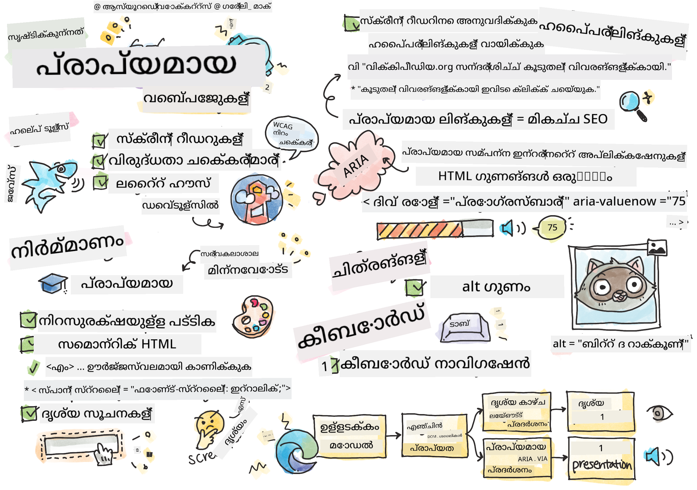
> സ്കെച്‌നോട്ട് [ടോമോമി ഇമൂറ](https://twitter.com/girlie_mac) ഉത്ഘാടനം

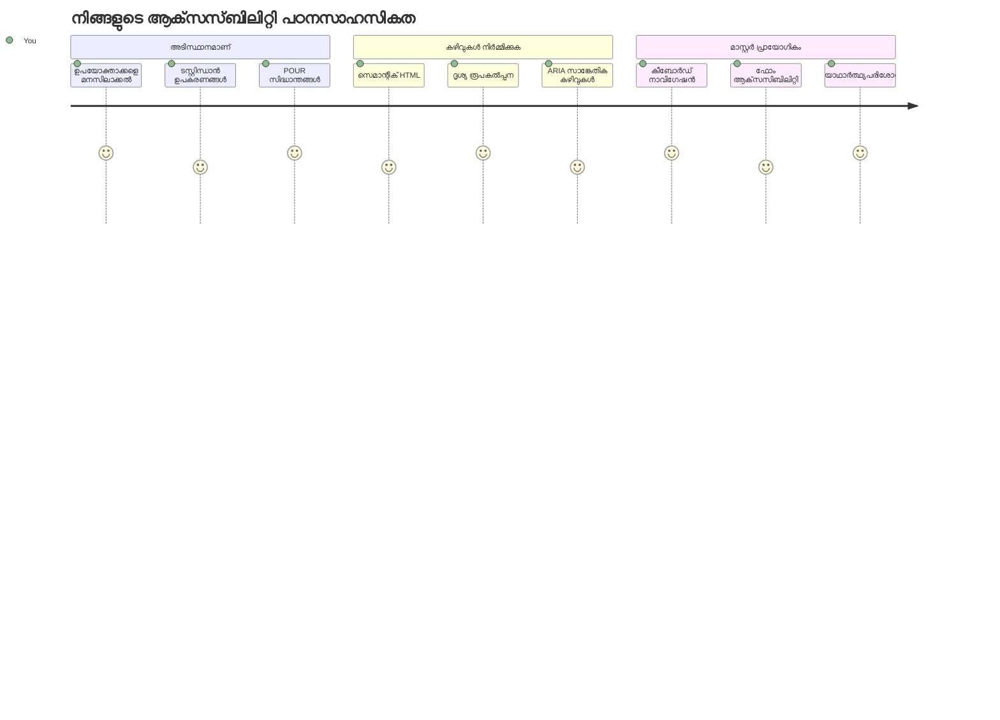
## പ്രീ-ലെക്ചർ ക്വിസ്
[پ്രീ-ലെക്ചർ ക്വിസ്](https://ff-quizzes.netlify.app/web/)

> വെബിന്റെ ശക്തി അതിന്റെ സർവത്രവ്യാപകതയിലാണു്. അസൗകര്യമില്ലാതെ എല്ലാവർക്കും പ്രവേശനം അവശ്യമാണ്.
>
> \- സർ ടിമോത്തി ബേൺസ്ലി, W3C ഡയറക്ടർ, വേൾഡ് വൈഡ് വെബ്ബിന്റെ കണ്ടുപിടുത്തക്കാരൻ

നിങ്ങളെ അമ്പരപ്പിക്കാൻ പോകുന്ന ഒരു കാര്യമുണ്ട്: ആക്‌സസിബിൾ വെബ്സൈറ്റുകൾ നിർമ്മിക്കുമ്പോൾ, നിങ്ങൾ വെറും প্রতিবന്ധങ്ങളുള്ള ആളുകൾക്ക് സഹായം നൽകുകയല്ല—സന്തോഷകരം, നിങ്ങൾ വെബിനെ എല്ലാവർക്കും മെച്ചപ്പെടുത്തുകയാണ്!

ചെറുചെരിവുകളിൽ കാണുന്ന കർബ് കട്ടുകൾ നിങ്ങൾ ശ്രദ്ധിച്ചിട്ടുണ്ടോ? അവ ആദ്യം വീൽചെയറിന് വേണ്ടിയാണ് രൂപകല്‍പ്പന ചെയ്തിരുന്നത്, എന്നാൽ ഇപ്പോള്‍ അവ സ്റ്റോളറുകൾ, ഡെലിവറി തൊഴിലാളികൾ ഡോളികളോടെ, യാത്രക്കാര്‍ റോളിങ് ബാഗുകളോടെ, സൈക്ലിസ്റ്റുകൾക്കും സഹായം നൽകുന്നു. ആക്‌സസിബിൾ വെബ് ഡിസൈൻ എങ്ങനെ പ്രവർത്തിക്കുന്നുവെന്നുള്ള ഉദാഹരണമാണ് ഇത്—ഒരു കൂട്ടത്തേക്ക് സഹായകരമായ പരിഹാരങ്ങൾ സാധാരണയായി എല്ലാവർക്കും ലാഭകരമായി മാറുന്നു. അതിവിശിഷ്ടമാണല്ലോ?

ഈ പാഠത്തിൽ, ആരെങ്കിലും എങ്ങനെ വിശ്വസനീയമായ അനുഭവം നൽകുന്ന വെബ്സൈറ്റുകൾ സൃഷ്ടിക്കാമെന്ന് നാം പഠിക്കുകയാണ്. വെബ് സ്റ്റാൻഡേർഡുകളിൽ പെട്ടിട്ടുള്ള പ്രായോഗിക സാങ്കേതിക വിദ്യകൾ കണ്ടെത്തും, പരിശോധനയ്ക്ക് കൈകോർക്കും, ആക്‌സസിബിലിറ്റി നിങ്ങളുടെ സൈറ്റുകൾ എല്ലാവർക്കും എങ്ങനെ കൂടുതൽ ഉപയോഗപ്രദമാക്കുന്നുവെന്ന് കാണും.

ഈ പാഠം കഴിഞ്ഞാൽ, ആക്‌സസിബിലിറ്റി നിങ്ങളുടെ ഡവലപ്പ്മെന്റ് പ്രവൃത്തി പ്രവാഹത്തിന്റെ സ്വാഭാവികഭാഗമാക്കാനുള്ള ആത്മവിശ്വാസം നിങ്ങൾക്ക് ഉണ്ടാകും. വിചാരിച്ചുകൊണ്ടിരിക്കണോ, ഓർമിക്കണോ ഷരീരസൗകര്യം കണക്കിലെടുക്കുന്ന ഡിസൈൻ തിരഞ്ഞെടുപ്പ് രജ്ജുതി മില്ല്യനോടുകൂടി വെബ്ബ് തുറക്കുന്നത് എങ്ങനെ? ചേരാം!

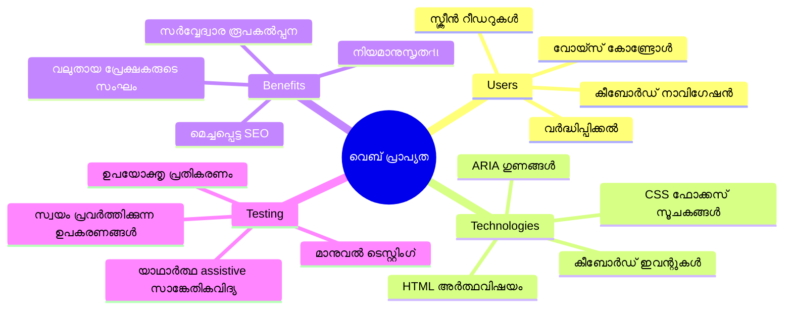
> ഈ പാഠം നിങ്ങൾക്ക് [Microsoft Learn](https://docs.microsoft.com/learn/modules/web-development-101/accessibility/?WT.mc_id=academic-77807-sagibbon)  통해യിൽ എടുക്കാം!

## അസിസ്റ്റീവ് സാങ്കേതിക വിദ്യകൾ മനസിലാക്കൽ

കോഡിങ്ങിലേക്ക് ചാടുന്നതിന് മുമ്പ്, വിവിധ കഴിവുള്ള ആളുകൾ വെബ് എങ്ങനെ അനുഭവിക്കാറുള്ളുവെന്ന് നാം ഒരു നിമിഷം കാണാം. ഇത് വെറും സിദ്ധാന്തമല്ല—ഇത്തരം യഥാർത്ഥ നാവിഗേഷൻ മാതൃകകൾ മനസ്സിലാക്കുന്നത് നിങ്ങളെ മികച്ച ഡവലപ്പർ ആക്കും!

അസിസ്റ്റീവ് സാങ്കേതിക വിദ്യകൾ അതിവിശിഷ്ടമാണ്, അവ প্রতিবന്ധങ്ങളുള്ള ആളുകൾ വെബ്സൈറ്റുകളുമായി ഇന്ററാക്റ്റ് ചെയ്യാൻ സഹായിക്കുന്നു, അത് നിങ്ങളെ അമ്പരപ്പിക്കും. ഈ സാങ്കേതിക വിദ്യകൾ എങ്ങനെ പ്രവർത്തിക്കുന്നു എന്ന് നിങ്ങൾ മനസ്സിലാക്കിയാൽ, ആക്‌സസിബിൾ വെബ് അനുഭവങ്ങൾ സൃഷ്ടിക്കുന്നത് ഏറെ എളുപ്പമാകും. മറ്റൊരാളുടെ കണ്ണിലൂടെ നിങ്ങളുടെ കോഡ് കാണാൻ പഠിക്കുന്നതുപോലെയാണ്.

### സ്ക്രീൻ റീഡറുകൾ

[സ്ക്രീൻ റീഡറുകൾ](https://en.wikipedia.org/wiki/Screen_reader) അതിവിദഗ്ദ്ധ സാങ്കേതിക സാമഗ്രികളാണ്, ഡിജിറ്റൽ വാചകം ശബ്ദമോ ബ്രെയിൽ ഔട്ട്പുട്ടോ ആയി മാറ്റുന്നു. പ്രധാനമായും ദർശന പരിഗണനയുള്ളവർ ഉപയോഗിക്കുന്നതാണെങ്കിലും, ഡിസ്‌ലക്‌സിയ പോലുള്ള പഠന വൈകല്യമുള്ളവർക്കും ഇത് വളരെ സഹായകരമാണ്.

സ്ക്രീൻ റീഡറെ ഞാൻ ഒരു ബുദ്ധിമുട്ടുള്ള വാചകക്കാരനെ പോലെ കരുതുന്നു, നിങ്ങൾക്ക് പുസ്തകം വായിച്ചു തരുന്നത് പോലെയാണ്. അതിവിവരിച്ചു അർത്ഥപ്രദമായ ക്രമത്തിൽ ഉള്ളടക്കം വായിക്കുന്നു, "ബട്ടൺ" അല്ലെങ്കിൽ "ലിങ്ക്" പോലുള്ള ഇന്ററാക്ടീവ് ഘടകങ്ങളെ അറിയിക്കുന്നു, പേജ് ചുറ്റിമുണ്ടു നാവിഗേറ്റ് ചെയ്യാൻ കീബോർഡ് ഷോർട്ട്കട്ടുകൾ നൽകുന്നു. പക്ഷേ, സ്ക്രീൻ റീഡറുകൾ വെബ്‌സൈറ്റുകൾ ശരിയായ ഘടനയിലും മാന്യമായ ഉള്ളടക്കത്തിലും രൂപകൽപ്പന ചെയ്തിട്ടില്ലെങ്കിൽ അതാത് മാജിക് കാണില്ല. ഇവിടെ ഡവലപ്പർ എന്ന നിലയിൽ നിങ്ങൾ വരിക!

**ഏറ്റവും ജനപ്രിയ സ്ക്രീൻ റീഡറുകൾ:**
- **Windows**: [NVDA](https://www.nvaccess.org/about-nvda/) (സൗജന്യവും ജനപ്രിയവുമാണ്), [JAWS](https://webaim.org/articles/jaws/), [Narrator](https://support.microsoft.com/windows/complete-guide-to-narrator-e4397a0d-ef4f-b386-d8ae-c172f109bdb1/?WT.mc_id=academic-77807-sagibbon) (ഇൻബിൽറ്റ്)
- **macOS/iOS**: [VoiceOver](https://support.apple.com/guide/voiceover/welcome/10) (ഇൻബിൽറ്റ്, വളരെ കഴിവുള്ളത്)
- **Android**: [TalkBack](https://support.google.com/accessibility/android/answer/6283677) (ഇൻബിൽറ്റ്)
- **Linux**: [Orca](https://wiki.gnome.org/Projects/Orca) (സൗജന്യവും ഓപ്പൺ സോഴ്സ്)

**സ്ക്രീൻ റീഡറുകൾ വെബ് ഉള്ളടക്കം എങ്ങനെ നാവിഗേറ്റ് ചെയ്യുന്നു:**

സ്ക്രീൻ റീഡറുകൾ കൂടുതൽ പരിചയസമ്പന്നരുടെ ബ്രൗസിംഗ് ഫലപ്രദമാക്കുന്ന നിരവധി നാവിഗേഷൻ രീതി നൽകുന്നു:
- **ക്രമാതീത വായനം**: മുകളിൽ നിന്നു താഴേക്ക് ഉള്ളടക്കം വായിക്കുന്നു, ഒരു പുസ്തകം പിന്തുടരുന്നതുപോലെ
- **ലാൻഡ്മാർക്ക് നാവിഗേഷൻ**: പേജ് വിഭാഗങ്ങൾക്കിടയിൽ (header, nav, main, footer) ചാടി പോകുക
- **ഹെഡിങ് നാവിഗേഷൻ**: ഹെഡിങ്ങുകൾക്കിടയിൽ ചാടി പേജ് ഘടന മനസിലാക്കുക
- **ലിങ്ക് പട്ടികകൾ**: എല്ലാ ലിങ്കുകളും പെട്ടെന്നുള്ള ആക്സസിനായി പട്ടികയാക്കുക
- **ഫോം കൺട്രോളുകൾ**: ഇൻപുട്ട് ഫീൽഡുകളുടെയും ബട്ടണുകളുടെയും ഇടയിൽ നേരിട്ട് നാവിഗേറ്റ് ചെയ്യുക

> 💡 **ഇത് ഞെട്ടിക്കുന്ന കാര്യമാണു്**: 68% സ്ക്രീൻ റീഡർ ഉപയോഗക്കാർ പ്രധാനമായും ഹെഡിങ്ങുകളിലൂടെ നാവിഗേറ്റ് ചെയ്യുന്നു ([WebAIM സർവേ](https://webaim.org/projects/screenreadersurvey9/#finding)). അർഥം? നിങ്ങളുടെ ഹെഡിങ് ഘടന ഉപയോക്താക്കൾക്കായി ഒരു റോഡ് മാപ്പ് പോലെയാണ്—ശരിയായി രൂപകൽപ്പന ചെയ്താൽ, അവർക്ക് ഉള്ളടക്കത്തിൽ എളുപ്പത്തിൽ തിരയാൻ നിങ്ങൾ സഹായിക്കുന്നുവെന്ന് അർഥം!

### നിങ്ങളുടെ ടെസ്റ്റിംഗ് പ്രവൃത്തി പ്രവാഹം നിർമ്മിക്കൽ

നല്ല വാർത്ത: ഫലപ്രദമായ ആക്‌സസിബിലിറ്റി പരിശോധന ഭ്രാന്ത മാക്കണമെന്നില്ല! ഓട്ടോമേറ്റഡ് ടൂളുകൾ (എല്ലാമറിയാനുള്ള പ്രശ്നങ്ങൾ കണ്ടെത്തുന്നതിൽ മികച്ചത്) ഉപയോഗിച്ച് കൈകൊണ്ടുള്ള പരിശോധന ചേർത്താൽ ഏറ്റവും നല്ലതാണ്. നിങ്ങളുടെ മുഴുവൻദിനം കളയാതെ അധികം പ്രശ്നങ്ങൾ കണ്ടെത്താൻ എനിക്ക് കണ്ടെത്തിയ സിസ്റ്റമാറ്റിക് മാർഗ്ഗം ഇതാ:

**അവശ്യമായ മാനുവൽ ടെസ്റ്റിംഗ് പ്രവൃത്തി പ്രവാഹം:**

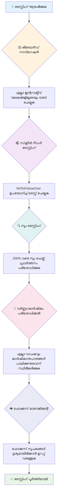
**ഘട്ടം ഘട്ടം ടെസ്റ്റിംഗ് ചെക്ക്ലിസ്റ്റ്:**
1. **കീബോർഡ് നാവിഗേഷൻ**: Tab, Shift+Tab, Enter, Space, Arrow കീകൾ മാത്രം ഉപയോഗിക്കുക
2. **സ്ക്രീൻ റീഡർ ടെസ്റ്റിംഗ്**: NVDA, VoiceOver, അല്ലെങ്കിൽ Narrator ഓണാക്കി കണ്ണ് അടച്ചുപറയ്‌ക്കുക
3. **സൂം ടെസ്റ്റിംഗ്**: 200% ഉം 400% ഉം സൂം ഘട്ടങ്ങളിൽ പരീക്ഷിക്കുക
4. **റംഗ് വിടിവം പരിശോധന**: എല്ലാ വാചകങ്ങളുടെയും UI ഘടകങ്ങളുടെയും പരിശോധന
5. **ഫോക്കസ് സൂചക പരിശോധന**: എല്ലാ ഇന്ററാക്ടീവ് ഘടകങ്ങളുടെയും ദൃശ്യ ഫോക്കസ് നില ഉണ്ടെന്നൊക്കുക

✅ **Lighthouse നാൽ തുടങ്ങുക**: നിങ്ങളുടെ ബ്രൗസറിലെ DevTools തുറന്ന് Lighthouse ആക്‌സസിബിലിറ്റി ഓഡിറ്റ് പ്രവർത്തിപ്പിക്കുക, ശേഷം ഫലങ്ങൾ പരിഗണിച്ച് മാനുവൽ പരിശോധന ഏർപ്പെടുത്തുക.

### സൂം & മാഗ്നിഫിക്കേഷൻ ടൂളുകൾ

ഫോൺ ടെക്സ്റ്റ് ചെറിയപ്പോൾ നിങ്ങൾ എങ്ങനെ പിണച്ച് സൂം ചെയ്യാറുണ്ടെന്നു് അറിയാമല്ലോ, അല്ലെങ്കിൽ പ്രകാശമുള്ള വെളിച്ചത്തിൽ ലാപ്‌ടോപ്പ് സ്‌ക്രീനിലേക്ക് കണ്ണടച്ചു നോക്കാറുണ്ടോ? പല ഉപയോക്താക്കൾക്കും ഉള്ളടക്കം വായിക്കാൻ മാഗ്നിഫിക്കേഷൻ ടൂളുകളിൽ ആശ്രയിക്കുന്നു. ഇതിൽ ദൃശ്യ ദുർബലതയുള്ളവർ, മുതിർന്നവരും ഉൾപ്പെടുന്നു, കൂടാതെ പരിതസ്ഥിതി പുറം ജില്ലകളും വെബ്‌സൈറ്റ് വായിക്കാൻ ശ്രമിക്കുമ്പോൾ.

ആധുനിക സൂം സാങ്കേതിക വിദ്യ വലിയ വലിപ്പമാക്കലിൽ മാത്രമല്ല. ഈ ടൂളുകൾ എങ്ങനെ പ്രവർത്തിക്കുന്നു മനസ്സിലാക്കുന്നത്, ნებისმിയും ആർക്കിടെക്ചർ രചിക്കാൻ സഹായിക്കും, ഏത് സൂം ഘട്ടത്തിലും സൈറ്റ് ഫംഗ്ഷണൽ ആയതിനെയും ആകർഷകമായതിനെയും ഉറപ്പാക്കാൻ.

**ആധുനിക ബ്രൗസർ സൂം കഴിവുകൾ:**
- **പേജ് സൂം**: എല്ലാ ഉള്ളടക്കവും അനുപാതപരമായി സ്കെയിൽ ചെയ്യുന്നു (വാചകം, ചിത്രങ്ങൾ, ലേഔട്ട്) - ഇതാണ് പരിഗണിക്കേണ്ട രീതിയ്‌ക്കൊപ്പം
- **വാചകം മാത്രം സൂം**: ഫോണ്ട് വലുപ്പം കൂട്ടുന്നു പക്ഷെ യഥാ ലേഔട്ട് നിലനിർത്തുന്നു
- **പിണച്ച്-ടു-സൂം**: മൊബൈൽ ജെസ്ച്ചർ പിന്തുണക്കുന്നു താത്ക്കാലികമായി വലുപ്പം കൂട്ടാൻ
- **ബ്രൗസർ പിന്തുണ**: എല്ലാ ആധുനിക ബ്രൗസറുകളും 500% വരെ സൂം പിന്തുണയ്ക്കുന്നു, പ്രവർത്തനക്ഷമത നഷ്ടപ്പെടാതെ

**വിശിഷ്ട മാഗ്നിഫിക്കേഷൻ സോഫ്റ്റ്‌വെയർ:**
- **Windows**: [Magnifier](https://support.microsoft.com/windows/use-magnifier-to-make-things-on-the-screen-easier-to-see-414948ba-8b1c-d3bd-8615-0e5e32204198) (ഇൻബിൽട്ട്), [ZoomText](https://www.freedomscientific.com/training/zoomtext/getting-started/)
- **macOS/iOS**: [Zoom](https://www.apple.com/accessibility/mac/vision/) (ഇൻബിൽട്ട്, മുൻനിര സവിശേഷതകൾ സഹിതം)

> ⚠️ **ഡിസൈൻ പരിഗണന**: WCAG ആവശ്യപ്പെടുന്നത് ഉള്ളടക്കം 200% സൂം ചെയ്താലും പ്രവർത്തനക്ഷമമായിരിക്കണം. ഈ നിലയിൽ, ശരാശരി ഹോറിസോണ്ടൽ സ്‌ക്രോളിംഗ് കുറവായിരിക്കണം, എല്ലാ ഇന്ററാക്ടീവ് ഘടകങ്ങളും ആക്‌സസിബിൾ ആയിരിക്കണം.

✅ **റെസ്പോൺസീവ് ഡിസൈൻ പരീക്ഷിക്കുക**: നിങ്ങളുടെ ബ്രൗസർ 200% ഉം 400% ഉം സൂം ചെയ്ത് നോക്കൂ. ലേഔട്ട് സുന്ദരമായും എളുപ്പത്തിൽ ക്രമീകരിക്കപ്പെടുന്നു? അധിക സ്‌ക്രോളിംഗ് കൂടാതെ എല്ലാ സവിശേഷതകളും നിങ്ങൾക്ക് ആക്‌സസ് ചെയ്യാമോ?

## ആധുനിക ആക്‌സസിബിലിറ്റി ടെസ്റ്റിംഗ് ടൂളുകൾ

ഇപ്പോൾ നിങ്ങൾ അറിയാം ആളുകൾ അസിസ്റ്റീവ് സാങ്കേതിക വിദ്യ ഉപയോഗിച്ച് വെബ് എങ്ങനെ നാവിഗേറ്റ് ചെയ്യുന്നു, നമുക്ക് സഹായിക്കുന്ന ഉപകരണങ്ങൾ പരിശോധിക്കാം accessible websites നിർമ്മിക്കാൻ.

ഓട്ടോമേറ്റഡ് ടൂളുകൾ വ്യക്തമാക്കുന്ന പ്രശ്നങ്ങൾ പിടിക്കുകയും (ഉദാ. alt ടെക്സ്റ്റ് ഇല്ലാത്തത്), കൈകൊണ്ടുള്ള പരിശോധന സൈറ്റ് യഥാർത്ഥ ലോകത്തിൽ ഉപയോഗിക്കാൻ അനുയോജ്യമായി ഉറപ്പാക്കുകയും ചെയ്യുന്നു. ഒരുമിച്ച്, ഇവ നിങ്ങളുടെ സൈറ്റുകൾ എല്ലാവർക്കും പ്രവർത്തിക്കുന്നതിൽ ആത്മവിശ്വാസം നൽകുന്നു.

### നിറം വിടിവം പരിശോധന

നല്ല വാർത്ത: നിറം വിടിവം ഏറ്റവും സാധാരണമായ ആക്‌സസിബിലിറ്റി പ്രശ്നങ്ങളിലൊന്നാണ്, പക്ഷെ അതുപോലെ പരിഹരിക്കാൻ എളുപ്പമെന്നതാണ്. നല്ല വിടിവം എല്ലാവർക്കും ഉപകാരപ്രദമാണ്—ദൃശ്യ വൈകല്യമുള്ളവരിൽ നിന്നും കടൽതീരത്തിൽ ഫോണിൽ വായിക്കുന്നവരെ വരെ.

**WCAG വിടിവം ആവശ്യകതകൾ:**

| വാചക തരം | WCAG AA (കുറഞ്ഞത്) | WCAG AAA (ഉയർത്തിയത്) |
|-----------|-------------------|---------------------|
| **സ്വഭാവ വാചകം** (18pt താഴെ) | 4.5:1 വിടിവം അനുപാതം | 7:1 വിടിവം അനുപാതം |
| **വലിയ വാചകം** (18pt+ അല്ലെങ്കിൽ 14pt+ ബോൾഡ്) | 3:1 വിടിവം അനുപാതം | 4.5:1 വിടിവം അനുപാതം |
| **UI ഘടകങ്ങൾ** (ബട്ടണുകൾ, ഫോം ബോർഡറുകൾ) | 3:1 വിടിവം അനുപാതം | 3:1 വിടിവം അനുപാതം |

**അവശ്യമായ ടെസ്റ്റിംഗ് ടൂളുകൾ:**
- [Colour Contrast Analyser](https://www.tpgi.com/color-contrast-checker/) - ഡെസ്ക്ടോപ്പ് ആപ്പ് കളർ പിക്കർ സഹിതം
- [WebAIM Contrast Checker](https://webaim.org/resources/contrastchecker/) - വെബ് അടിസ്ഥാനമാക്കിയ ഫീഡ്ബാക്ക്
- [Stark](https://www.getstark.co/) - Figma, Sketch, Adobe XD ഡിസൈൻ പ്ലഗിൻ
- [Accessible Colors](https://accessible-colors.com/) - ആക്‌സസിബിൾ കolor പാളറ്റുകൾ കണ്ടെത്താൻ

✅ **മികച്ച നിറം പാളറ്റുകൾ നിർമ്മിക്കുക**: നിങ്ങളുടെ ബ്രാൻഡ് നിറങ്ങൾ കൊണ്ട് ആരംഭിച്ച്, കണ്ട്രാസ്റ്റ് ചെക്കറുകൾ ഉപയോഗിച്ച് ആക്സസിബിൾ വകഭേദങ്ങൾ സൃഷ്ടിക്കുക. ഈ ഘടന നിങ്ങളുടെ ഡിസൈൻ സിസ്റ്റത്തിന്റെ ആക്‌സസിബിൾ കളർ ടോക്കണുകളായി രേഖപ്പെടുത്തുക.

### സമഗ്ര ആക്‌സസിബിലിറ്റി ഓഡിറ്റിംഗ്

ഏറ്റവും ഫലപ്രദമായ ആക്‌സസിബിലിറ്റി ടെസ്റ്റിംഗ് വ്യത്യസ്ത മാര്‍ഗ്ഗങ്ങൾ സംയോജിപ്പിക്കുന്നു. ഒറ്റപ്പോലും ഏതാനും പ്രശ്നങ്ങൾ മാത്രമേ അറിഞ്ഞു പിടിക്കൂ, അതിനാൽ ടെസ്റ്റിംഗ് രീതി വളർത്തേണ്ടതാണ്.

**ബ്രൗസർ അടിസ്ഥാനപരമായ ടെസ്റ്റിംഗ് (DevTools ഉൾപ്പെടുത്തിയത്):**
- **Chrome/Edge**: Lighthouse ആക്‌സസിബിലിറ്റി ഓഡിറ്റ് + Accessibility പാനൽ
- **Firefox**: Accessibility ഇൻസ്പെക്ടർ വിശദമായ ട്രി വ്യൂ സഹിതം
- **Safari**: Web Inspector ൽ Audit ടാബ് VoiceOver അനുഭവ സമചാരം

**പ്രൊഫഷണൽ ടെസ്റ്റിംഗ് എക്സ്റ്റൻഷനുകൾ:**
- [axe DevTools](https://www.deque.com/axe/devtools/) - വ്യവസായ സ്റ്റാൻഡേർഡ് ഓട്ടോമേറ്റഡ് ടെസ്റ്റിംഗ്
- [WAVE](https://wave.webaim.org/extension/) - Visual ഫീഡ്ബാക്ക് പിശകു വരിയടക്കം
- [Accessibility Insights](https://accessibilityinsights.io/) - Microsoft ന്റെ സമ്പൂർണ ടെസ്റ്റിംഗ് സ്യൂട്ട്

**കമാൻഡ്-ലൈൻ & CI/CD സംയോജനം:**
- [axe-core](https://github.com/dequelabs/axe-core) - ഓട്ടോമേറ്റഡ് ടെസ്റ്റിനുള്ള ജാവാസ്ക്രിപ്റ്റ് ലൈബ്രറി
- [Pa11y](https://pa11y.org/) - കമാൻഡ്-ലൈൻ ആക്‌സസിബിലിറ്റി ടെസ്റ്റിംഗ് ടൂൾ
- [Lighthouse CI](https://github.com/GoogleChrome/lighthouse-ci) - ഓട്ടോമേറ്റഡ് ആക്‌സസിബിലിറ്റി സ്കോറിംഗ്

> 🎯 **ടെസ്റ്റിംഗ് ലക്ഷ്യം**: ഒരു ബേസ്ലൈൻ ആയി Lighthouse ആക്‌സസിബിലിറ്റി സ്‌കോർ 95+ നിരീക്ഷിക്കുക. ഓർമിക്കുക, ഓട്ടോമേറ്റഡ് ടൂളുകൾ മാത്രം ആക്‌സസിബിലിറ്റി പ്രശ്നങ്ങളുടെ 30-40% മാത്രം കണ്ടെത്തുന്നു—മാനുവൽ ടെസ്റ്റിംഗ് ഇപ്പോഴും അനിവാര്യമാണ്!

### 🧠 **ടെസ്റ്റിംഗ് കഴിവുകൾ പരിശോധിക്കുക: വിഷങ്ങളുണ്ടോ കണ്ടെത്താൻ തയ്യാറാ?**

**ആക്‌സസിബിലിറ്റി ടെസ്റ്റിംഗിനെ കുറിച്ച് നിങ്ങൾ എങ്ങനെ അനുഭവപ്പെടുന്നു വഴി നോക്കാം:**
- ഇപ്പോൾ ഏത് ടെസ്റ്റിംഗ് രീതി നിങ്ങൾക്ക് എളുപ്പമായി തോന്നുന്നു?
- കീബോർഡ് മാത്രം നാവിഗേഷൻ ഒരു മുഴുവൻ ദിനം ഉപയോഗിക്കുന്നതു് കഴിയും എന്ന് നിങ്ങൾ കരുതുന്നുണ്ടോ?
- നിങ്ങൾ നേരിട്ടുള്ള ഒരു ആക്‌സസിബിലിറ്റി തടസ്സം ഓൺലൈനിൽ എന്തെങ്കിലും അനുഭവപ്പെട്ടിട്ടുണ്ടോ?

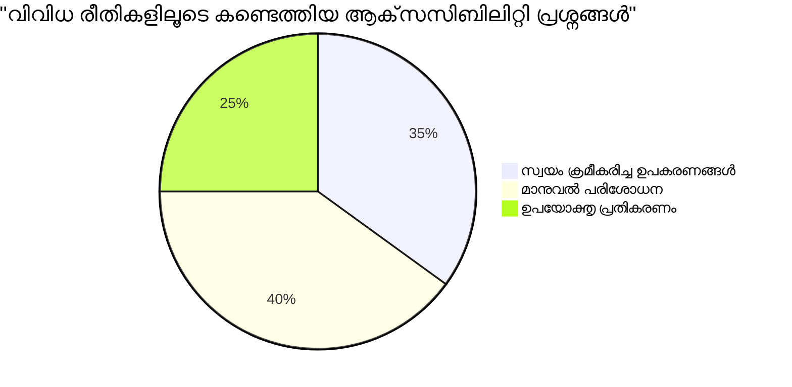
> **ആത്മവിശ്വാസം വർദ്ധിപ്പിക്കുന്നു**: പ്രൊഫഷണൽ ആക്‌സസിബിലിറ്റി ടെസ്റ്റർമാർ ഈ രീതി തന്നെ ഉപയോഗിക്കുന്നു. നിങ്ങൾ വ്യവസായ സ്റ്റാൻഡേർഡ് രീതികൾ പഠിക്കുകയാണ്!

## അടിസ്ഥാനം മുതൽ ആക്‌സസിബിലിറ്റി നിർമിക്കുക

ആക്‌സസിബിലിറ്റിയിൽ വിജയിക്കാനിടയാക്കുന്നത് അത് അർജ്ജിക്കപ്പെടുന്ന ആദ്യ ദിവസം മുതൽ നിർമ്മിക്കലാണ്. "ഞാൻ പിന്നീട് ആക്‌സസിബിലിറ്റി ചേർക്കും" എന്ന് കരുതുന്നത് വൈജ്ഞാനികമാണ്, പക്ഷേ വീടു് പണിയപ്പെട്ട ശേഷം പാലം ഇടുന്നതുപോലെയാണ്—സാധ്യമാണ്, എളുപ്പമല്ല.

ആക്‌സസിബിലിറ്റിയെ ഒരു വീട് പ്ലാൻ ചെയ്യുന്നതുപോലെ കരുതുക—ആരംഭത്തില്‍ വീൽചെയർ പ്രവേശനം ഉൾപ്പെടുത്തുന്നത് കൂടുതൽ സുഗമമാണ് ഒടുവിൽ മാറ്റം വരുത്തുന്നതേക്കാൾ.

### POUR സിദ്ധാന്തങ്ങൾ: നിങ്ങളുടെ ആക്‌സസിബിലിറ്റി അടിസ്ഥാനം

വെബ് കന്റന്റ് ആക്‌സസിബിലിറ്റി ഗൈഡ്‌ലൈൻസുകൾ (WCAG) നാല് അടിസ്ഥാന സിദ്ധാന്തങ്ങൾയെ നിർമ്മിച്ചിരിക്കുന്നു, അവ POUR എന്നാണു് അറിയപ്പെടുന്നത്. ഭീമാകാരമല്ല—പകരം, അവ ഏവർക്കും പറ്റിയ ഉള്ളടക്കം ഉണ്ടാക്കുന്നതിനുള്ള പ്രായോഗിക മാർഗ്ഗനിർദ്ദേശങ്ങളാണ്.

POUR മനസ്സിലാക്കിയാൽ, ആക്‌സസിബിലിറ്റി തീരുമാനങ്ങൾ എളുപ്പത്തിൽ എടുക്കാനാകും. ഒരു മാനസിക ചെക്ക്ലിസ്റ്റ് ഉണ്ടാകുന്നതുപോലെ നിങ്ങളുടെ ഡിസൈൻ തിരഞ്ഞെടുപ്പുകൾ നയിക്കുന്നു. ഇതാ അവ വിശദീകരിക്കുന്നു:

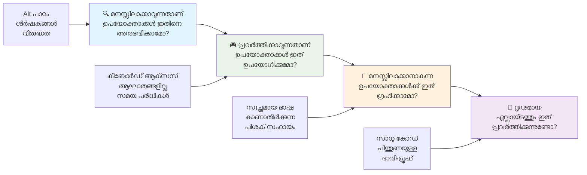
**🔍 പ്രകടമാകാവുന്ന (Perceivable)**: ഉപയോക്താക്കൾക്ക് അവരുടെ ലഭ്യമായ അറിയലുകൾ വഴി വിവരങ്ങൾ കാണാനാകണം

- ടെക്സ്റ്റിൽ വ്യക്തമാക്കാനുള്ള പകരപ്പെടുത്തിയ വാചകങ്ങൾ (ചിത്രങ്ങൾ, വീഡിയോകൾ, ഓഡിയോ)
- എല്ലാ വാചകത്തിന്റെയും UI ഘടകങ്ങളുടേയും മതിവരുന്ന നിറം വിടിവം ഉറപ്പ് വരുത്തുക
- മൾട്ടിമീഡിയ ഉള്ളടക്കങ്ങൾക്ക് ക്യാപ്ഷനുകളും ട്രാൻസ്ഫ്രിപ്റ്റുകളും നൽകുക
- 200% വരെ വലുപ്പം മാറ്റുമ്പോഴും ഉള്ളടക്കം പ്രവർത്തനക്ഷമമായിരിക്കണം
- വിവരങ്ങൾ പകർപ്പിക്കാൻ നിറം മാത്രം അല്ല, വിവിധ സെൻസറികൾ ഉപയോഗിക്കുക

**🎮 പ്രവർത്തനക്ഷമമായ (Operable)**: എല്ലാ ഇന്റർഫേസ് ഘടകങ്ങളും ലഭ്യമായ ഇൻപുട്ട് മാർഗ്ഗങ്ങളിൽ പ്രവർത്തിക്കണം

- കീബോർഡ് നാവിഗേഷനിലൂടെ എല്ലാ പ്രവർത്തനങ്ങളും ആക്‌സസിബിൾ ആക്കുക
- ഉപയോക്താക്കൾക്ക് ഉള്ളടക്കം വായിക്കുകയും ഇടപെടുകയും ചെയ്യാനുള്ള മതിയായ സമയം നൽകുക
- സീസ്ചർസ് അല്ലെങ്കിൽ വേസ്‌റ്റിബുലാർ പ്രശ്നങ്ങൾ ഉണ്ടാക്കുന്ന ഉള്ളടക്കം ഒഴിവാക്കുക
- വ്യക്തമോയ ഘടനയും ലാൻഡ്മാർക്കുകളും ഉപയോഗിച്ച് ഫലപ്രദമായ നാവിഗേഷൻ സഹായിക്കുക
- 44px കനിയായിട്ടുള്ള ലക്ഷ്യപരിധികൾ ഉണ്ടാകണം ഇന്ററാക്ടീവ് ഘടകങ്ങൾക്ക്

**📖 മനസ്സിലാക്കാവുന്ന (Understandable)**: വിവരങ്ങളും UI പ്രവർത്തനവും വ്യക്തവും പ്രായോഗികവുമാകണം

- നിങ്ങളുടെ ദർശകനുസരിച്ച് സുതാര്യവും ലളിതവുമായ ഭാഷ ഉപയോഗിക്കുക
- ഉള്ളടക്കം നിയന്ത്രണ വിധേയവും സ്ഥിരതയുള്ളതുമാകണം
- ഉപയോക്തൃഇൻപുട്ടിനായി വ്യക്തമായ നിർദ്ദേശങ്ങളും പിശകു സന്ദേശങ്ങളും നൽകുക
- ഫോമുകളിൽ പിശകുകൾ മനസ്സിലാക്കാനിലും തിരുത്താനുമുള്ള സഹായം നൽകുക
- ലൊജിക്കൽ വായനാകൃതിയിലും വിവരങ്ങൾ ഘടനയിൽ ഉള്ളടക്കം ക്രമീകരിക്കുക

**💪 ശക്തമായ (Robust)**: ഉള്ളടക്കം വിവിധ സാങ്കേതികവിദ്യകളിലും അസിസ്റ്റീവ് ഉപകരണങ്ങളിലും വിശ്വസനീയമായി പ്രവർത്തിക്കണം

- **വളരെ സാധുവായ സെമാന്റിക് HTML നിങ്ങളുടെ അടിസ്ഥാനം ആക്കുക**
- **ഇപ്പോൾ ഉള്ളും ഭാവിയിലുള്ള അസിസ്റ്റീവ് സാങ്കേതിക വിദ്യകളുമായി പൊരുത്തപ്പെടാൻ ഉറപ്പ് നൽകുക**
- **മാർക്കപ്പിനായി വെബ് സ്റ്റാൻഡേർഡുകളും മികച്ച രീതികളും പിന്തുടരുക**
- **വ്യത്യസ്ത ബ്രൗസറുകൾ, ഉപകരണങ്ങൾ, സഹായമേളനങ്ങൾ എന്നിവയിൽ പരിശോധന നടത്തുക**
- **ഉന്നത സവിശേഷതകൾ പിന്തുണയ്ക്കാതെ ഉപരിതലമായി വീഴ്ച സംഭവിക്കുമ്പോൾ ഉള്ളടക്കം ക്രമീകരിക്കുക**

### 🎯 **POUR സിദ്ധാന്ത പരിശോധന: അത് നിലനിർത്തുക**

**അടിത്തറകളിൽ ത്വരിതമായ പ്രതിബിംബനം:**
- ഓരോ POUR സിദ്ധാന്തത്തെയും പൊട്ടിക്കുന്ന ഒരു വെബ് സൈറ്റ് ഫീച്ചർ നിങ്ങൾക്ക് ചിന്തിക്കാമോ?
- ഒരു ഡെവലപ്പറായി ഏറ്റവും സ്വാഭാവികമായി തോന്നുന്നത് ഏതു സിദ്ധാന്തമാണ്?
- ദുര്‍ഗമമായ ഉപയോക്താക്കളല്ലാതെ എല്ലാവർക്കും ഡിസൈൻ എങ്ങനെ മെച്ചപ്പെടുത്താൻ ഈ സിദ്ധാന്തങ്ങൾ സഹായിക്കും?

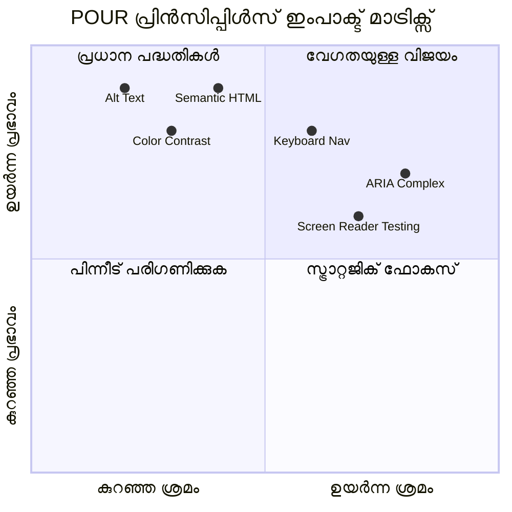
> **ഓർമ്മിക്കുക**: കുറഞ്ഞ പരിശ്രമത്തിൽ വലിയ സ്വാധീനം ഉള്ള മെച്ചപ്പെടുത്തലുകളിൽ തുടക്കം മുടക്കുക. സെമാന്റിക് HTML-ഉം alt ടെക്സ്റ്റും കുറഞ്ഞ പരിശ്രമത്തിൽ വലിയ ആക്സസിബിലിറ്റി വർദ്ധനവാണ് നൽകുന്നത്!

## ആക്സസിബിൾ വിഷ്വൽ ഡിസൈൻ സൃഷ്ടിക്കൽ

നല്ല വിഷ്വൽ ഡിസൈൻയും ആക്സസിബിലിറ്റിയും ചേർന്ന് പ്രവർത്തിക്കുന്നു. ആക്സസിബിലിറ്റിയെ മനസിലാക്കി ഡിസൈൻ ചെയ്തപ്പോൾ, ഈ നിയന്ത്രണങ്ങൾ എല്ലാവർക്കും ഗുണകരമായ കൂടുതൽ ശുദ്ധവും തനി ഉത്തമവുമായ പരിഹാരങ്ങൾ കണ്ടെത്താൻ സാധിക്കുന്നു.

വളരെ കാഴ്ചയ്ക്ക് പറ്റിയില്ലാത്തവർക്കും, നിങ്ങളുടെ ഉള്ളടക്കം കാണുന്ന സാഹചര്യങ്ങളിൽ നിന്നും സ്വതന്ത്രമായി, എല്ലാവർക്കും അനുയോജ്യമായി പ്രവർത്തിക്കുന്ന ദൃശ്യ ആകര്‍ഷകമായ ഡിസൈനുകൾ എങ്ങനെ സൃഷ്ടിക്കാമെന്ന് നാം പരിശോധിക്കാം.

### നിറവും ദൃശ്യ ആക്സസിബിലിറ്റി തന്ത്രങ്ങളും

നിറം ആശയവിനിമയത്തിന് ശക്തിയാണ്, എന്നാൽ പ്രധാന വിവരങ്ങൾ അറിയിക്കാൻ അത് ഒറ്റ വഴിയാകരുത്. നിറപരമായ ഡിസൈൻ ദർശനം മറികടന്ന്, കൂടുതൽ ദൃഢതയുള്ള, ഉൾക്കൊള്ളുന്ന അനുഭവങ്ങൾ സൃഷ്ടിക്കുന്നു, വിവിധ സാഹചര്യങ്ങളിൽ ഫലപ്രദം ആകുന്നു.

**നിറദൃശ്യ വ്യത്യാസങ്ങൾക്കായി ഡിസൈൻ ചെയ്യുക:**

ഏകദേശം പുരുഷന്മാരിൽ 8%നും സ്ത്രീകളിൽ 0.5%നും ചില നിറദൃഷ്‌ടിവൈകാര്യതയുണ്ട് ("നിറകാണാത്തതുപോലെ" അറിയപ്പെടുന്നത്). ഏറ്റവും സാധാരണമായവ:
- **ഡ്യൂറ്ററാനോപ്പിയ**: ചുവപ്പും പച്ചയും തിരിച്ചറിയാനുകഷ്‌ണം
- **പ്രോട്ടാനോപ്പിയ**: ചുവപ്പ് ഇളക്കം കുറഞ്ഞുപോലെയാണ് കാണുന്നത്
- **ട്രൈറ്റാനോപ്പിയ**: നീലയുംമഞ്ഞയും തമ്മിൽ ഭേദപ്പെടുത്താൻ ബുദ്ധിമുട്ട് (അപര്യായം)

**ഉൾക്കൊള്ളുന്ന നിറ തന്ത്രങ്ങൾ:**

```css
/* ❌ Bad: Using only color to indicate status */
.error { color: red; }
.success { color: green; }

/* ✅ Good: Color plus icons and context */
.error {
  color: #d32f2f;
  border-left: 4px solid #d32f2f;
}
.error::before {
  content: "⚠️";
  margin-right: 8px;
}

.success {
  color: #2e7d32;
  border-left: 4px solid #2e7d32;
}
.success::before {
  content: "✅";
  margin-right: 8px;
}
```

**അടിസ്ഥാന കോൺട്രാസ്റ്റ് ആവശ്യകതകൾക്ക് പുറമേ:**
- നിറം കാണാനുള്ള സഹായികൾ ഉപയോഗിച്ച് നിങ്ങളുടെ നിറങ്ങൾ പരീക്ഷിക്കുക
- നിറ കോഡിംഗിനൊപ്പം പാറ്റേണുകൾ, എഴുത്തുകൾ, രൂപങ്ങൾ ഉപയോഗിക്കുക
- നിറം ഇല്ലാതെ പോലും ഇന്ററാക്ടീവ് അവസ്ഥകൾ വ്യത്യസ്തമായി കാണിക്കുക
- നിങ്ങളുടെ ഡിസൈൻ ഉയർന്ന കോൺട്രാസ്റ്റിൽ എങ്ങിനെയാണ് കാണപ്പെടുന്നത് கவലിക്കുക

✅ **നിറ ആക്സസിബിലിറ്റി പരിശോധന**: വൈവിധ്യമാർന്ന നിറദൃഷ്ടിബന്ധമുള്ളവർക്ക് നിങ്ങളുടെ സൈറ്റ് എങ്ങനെയാണ് എത്തുന്നത് എന്ന് കാണാൻ [Coblis](https://www.color-blindness.com/coblis-color-blindness-simulator/) പോലുള്ള ഉപകരണങ്ങൾ ഉപയോഗിക്കുക.

### ഫോകസ് സൂചകങ്ങളും ഇടപെടൽ ഡിസൈനും

ഫോകസ് സൂചകങ്ങൾ ഒരു ഡിജിറ്റൽ കേഴ്സർ പോലെയാണ് — കീബോർഡുപയോഗിക്കുന്നവർക്ക് അവർ പേജിൽ എവിടെയാണ് എന്ന് കാണിക്കുന്നു. നന്നായി രൂപകൽപ്പന ചെയ്ത ഫോകസ് സൂചകങ്ങൾ എല്ലാവർക്കും ഇടപെടലുകൾ സ്പഷ്ടവും പ്രവചിക്കാനാകുന്നതുമായവ ആക്കുന്നു.

**ആധുനിക ഫോകസ് സൂചക മികച്ച പടികൾ:**

```css
/* Enhanced focus styles that work across browsers */
button:focus-visible {
  outline: 2px solid #0066cc;
  outline-offset: 2px;
  box-shadow: 0 0 0 4px rgba(0, 102, 204, 0.25);
}

/* Remove focus outline for mouse users, preserve for keyboard users */
button:focus:not(:focus-visible) {
  outline: none;
}

/* Focus-within for complex components */
.card:focus-within {
  box-shadow: 0 0 0 3px rgba(74, 144, 164, 0.5);
  border-color: #4A90A4;
}

/* Ensure focus indicators meet contrast requirements */
.custom-focus:focus-visible {
  outline: 3px solid #ffffff;
  outline-offset: 2px;
  box-shadow: 0 0 0 6px #000000;
}
```

**ഫോക്സ് സൂചക ആവശ്യകതകൾ:**
- **കാണപ്പെടാം**: ചേർന്നിരിക്കുന്ന ഘടകങ്ങളുമായി കുറഞ്ഞത് 3:1 കോൺട്രാസ്റ്റ് ഉണ്ടായിരിക്കണം
- **വീതി**: മുഴുവൻ ഘടകത്തിനും കുറഞ്ഞത് 2px സവിശേഷത
- **ശാവകം**: ഫോകസ് മറ്റിടങ്ങളിലേക്ക് മാറുന്നതുവരെ കാണപ്പെടണം
- **വ്യത്യാസം**: മറ്റ് UI നിലകളിൽ നിന്ന് ദൃശ്യപരമായി വ്യത്യസ്തമാകണം

> 💡 **ഡിസൈൻ ടിപ്പ്**: മികച്ച ഫോകസ് സൂചകങ്ങൾ ഫെൻമാർജിൻ, ബോക്സ്-ഷാഡോ, നിറമാറ്റങ്ങൾ എന്നിവ സംയോജിപ്പിച്ച് വ്യത്യസ്ത പശ്ചാത്തലങ്ങളിലും സാഹചര്യങ്ങളിലും തെളിവായി മാറുന്നു.

✅ **ഫോകസ് സൂചക ഓഡിറ്റ് ചെയ്യുക**: നിങ്ങളുടെ വെബ്‌സൈറ്റിൽ ടാബ് ചെയ്ത് യഥാർത്ഥ ഫോകസ് സൂചകങ്ങൾ ഉള്ള ഘടകങ്ങൾ ശ്രദ്ധിക്കുക. ഉണ്ടെങ്കിൽ ഞാൻ കണ്ട് സുഖമല്ലാത്തവയോ ഇല്ലാതെയോ?

### സെമാന്റിക് HTML: ആക്സസിബിലിറ്റിയുടെ അടിത്തറ

സെമാന്റിക് HTML ഉപയോഗിച്ച് സഹായകരമായ സാങ്കേതികവിദ്യകൾക്ക് നിങ്ങളുടെ വെബ്‌സൈറ്റിന് GPS സംവിധാനം നൽകുന്നതുപോലെ ആണ്. ശരിയായ HTML ഘടകങ്ങൾ ഉപയോഗിക്കുന്നത് സ്ക്രീൻ റീഡറുകൾ, കീബോർഡുകൾ, മറ്റ് ഉപകരണങ്ങൾക്കു സഹായിക്കുന്ന ഒരു വിശദമായ മാർഗരേഖ നൽകുന്നത് പോലെയാണ്.

എനിക്ക് വളരെ മനസ്സിലായത് അണുക്കളുള്ള, കൃത്യമായ ജീവനുള്ള ലൈബ്രറി സെമാന്റിക് HTMLയും, പുസ്തകങ്ങൾ അമർത്തിവെച്ചിട്ടുള്ള ഗോദാമും തമ്മിലുള്ള വ്യത്യാസം പോലെയാണ്.

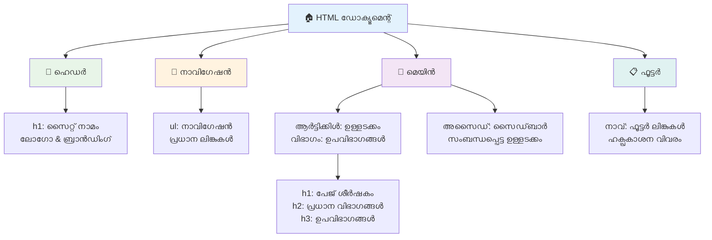
**ആക്സസിബിൾ പേജിന്റെ ഘടനയുടെ പണിതടങ്ങൾ:**

```html
<!-- Landmark elements provide page navigation structure -->
<header>
  <h1>Your Site Name</h1>
  <nav aria-label="Main navigation">
    <ul>
      <li><a href="/home">Home</a></li>
      <li><a href="/about">About</a></li>
      <li><a href="/services">Services</a></li>
    </ul>
  </nav>
</header>

<main>
  <article>
    <header>
      <h1>Article Title</h1>
      <p>Published on <time datetime="2024-10-14">October 14, 2024</time></p>
    </header>
    
    <section>
      <h2>First Section</h2>
      <p>Content that relates to this section...</p>
    </section>
    
    <section>
      <h2>Second Section</h2>
      <p>More related content...</p>
    </section>
  </article>
  
  <aside>
    <h2>Related Links</h2>
    <nav aria-label="Related articles">
      <ul>
        <li><a href="/related-1">First related article</a></li>
        <li><a href="/related-2">Second related article</a></li>
      </ul>
    </nav>
  </aside>
</main>

<footer>
  <p>&copy; 2024 Your Site Name. All rights reserved.</p>
  <nav aria-label="Footer links">
    <ul>
      <li><a href="/privacy">Privacy Policy</a></li>
      <li><a href="/contact">Contact Us</a></li>
    </ul>
  </nav>
</footer>
```

**സെമാന്റിക് HTML ആക്സസിബിലിറ്റി എങ്ങനെ മാറ്റിമറിക്കുന്നു:**

| സെമാന്റിക് ഘടകം | ഉദ്ദേശ്യം | സ്ക്രീൻ റീഡറിന് ലഭിക്കുന്ന ഗുണം |
|------------------|---------|----------------------|
| `<header>` | പേജ് അല്ലെങ്കിൽ സെക്ഷൻ ഹീഡർ | "ബാനർ ലാൻഡ്‌മാർക്ക്" - മുകളിൽ വേഗം നാവിഗേറ്റ് ചെയ്യുക |
| `<nav>` | നാവിഗേഷൻ ലിങ്കുകൾ | "നാവിഗേഷൻ ലാൻഡ്‌മാർക്ക്" - നാവിഗേഷൻ ലിസ്റ്റ് |
| `<main>` | പ്രാഥമിക പേജ് ഉള്ളടക്കം | "മേన్ ലാൻഡ്‌മാർക്ക്" - ദിശാനിർദേശം മുക്കെട്ടിരിക്കുക |
| `<article>` | സ്വയം സമ്പൂർണ ഉള്ളടക്കം | ആർട്ടിക്കിൾ അതിരുകൾ അറിയിപ്പ് |
| `<section>` | വിഷയം അടിസ്ഥാനമാക്കിയുള്ള ഗ്രൂപ്പുകൾ | ഉള്ളടക്കം ഘടന ഒരുക്കുന്നു |
| `<aside>` | അനുബന്ധ സൈഡ്‌ബാർ ഉള്ളടക്കം | "കോമ്പ്ലിമെന്ററി ലാൻഡ്‌മാർക്ക്" |
| `<footer>` | പേജ് അല്ലെങ്കിൽ സെക്ഷൻ ഫൂട്ടർ | "Contentinfo landmark" |

**സെമാന്റിക് HTML ഉപയോഗിച്ച് സ്ക്രീൻ റീഡറിന്റെ അഫ്ഫർഡ്‌ ചെയ്യുന്നത്:**
- **ലാൻഡ്‌മാർക്ക് നാവിഗേഷൻ**: പ്രധാന പേജ് ഭാഗങ്ങൾക്കിടയ്ക്ക് വേഗം ഓടുക
- **ഹെഡിംഗ് ഔട്ട്‌ലൈൻ**: ഹെഡിങ് ഘടനയിൽ നിന്നുള്ള ഉള്ളടക്കം ഫലം സൃഷ്ടിക്കുക
- **ഘടകങ്ങളുടെ പട്ടികകൾ**: എല്ലാ ലിങ്കുകൾ, ബട്ടണുകൾ, ഫോം നിയന്ത്രണങ്ങൾ പട്ടികയാക്കുക
- **പാരിസ്ഥിതിക ബോധം**: ഉള്ളടക്കം വിഭാഗങ്ങളുടെ ബന്ധം മനസ്സിലാക്കുക

> 🎯 **ത്വരിത പരിശോധന**: NVDA/JAWS-ൽ ലാൻഡ്‌മാർക്ക് ഷോർട്ട്കട്ടുകൾ ഉപയോഗിച്ച് (D ലാൻഡ്‌മാർക്ക്, H ഹെഡിംഗ്, K ലിങ്ക്) നിങ്ങളുടെ സൈറ്റ് സന്ദർശിക്കുക. നാവിഗേഷൻ മനസ്സിലാകുന്നുണ്ടോ?

### 🏗️ **സെമാന്റിക് HTML മാസ്റ്ററി പരിശോധന: ശക്തമായ അടിത്തറകൾ നിർമ്മിക്കുക**

**നിങ്ങളുടെ സെമാന്റിക് പരിജ്ഞാനം വിലയിരുത്താം:**
- HTML മാത്രം നോക്കിയാണ് ഒരു വെബ്‌പേജിലെ ലാൻഡ്‌മാർക്ക് തിരിച്ചറിയാൻ കഴിയും?
- `<section>`യും `<div>`നും തമ്മിലുള്ള വ്യത്യാസം ഒരു സുഹൃത്തിനെ എങ്ങനെ വെളിപ്പെടുത്തും?
- ഒരു സ്ക്രീൻ റീഡർ ഉപയോക്താവ് നാവിഗേഷൻ പ്രശ്നങ്ങൾ അറിയിച്ചാൽ ആദ്യം നിങ്ങൾ പരിശോധിക്കും?

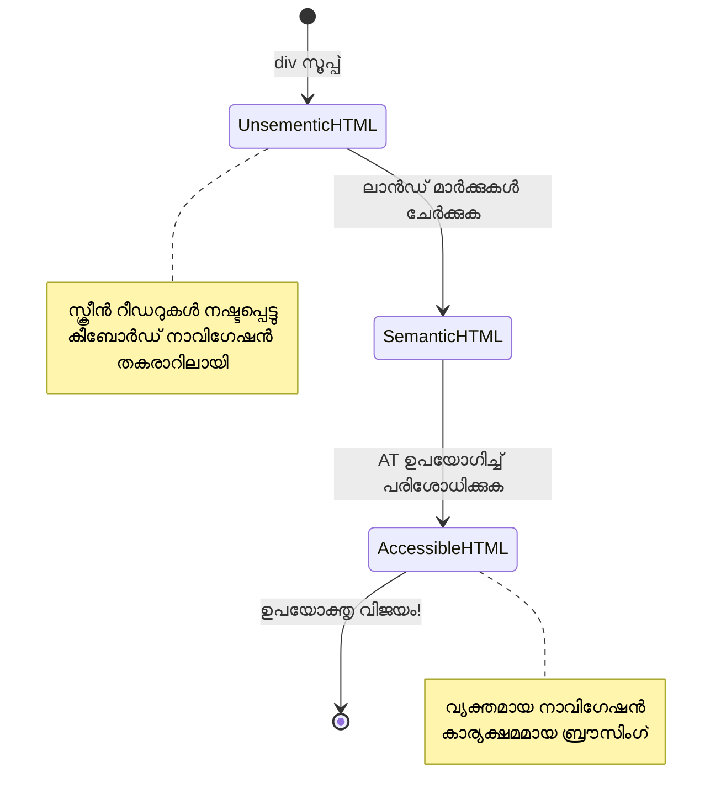
> **പ്രൊ ഇൻസൈറ്റു**: നല്ല സെമാന്റിക് HTML സ്വയം 70% ആക്സസിബിലിറ്റിപ്രശ്നങ്ങൾ പരിഹരിക്കുന്നു. ഈ അടിത്തറയിൽ മത്സരിച്ചാൽ നല്ല വഴിയിലാണ് നിങ്ങൾ!

✅ **സെമാന്റിക് ഘടന ഓഡിറ്റ് ചെയ്യുക**: ബ്രൗസറിന്റെ DevTools-ൽ ആക്സസിബിലിറ്റി പാനൽ ഉപയോഗിച്ച് ആക്സസിബിലിറ്റി ട്രീ കാണുക, നിങ്ങളുടെ മാർക്കപ്പ് ഒരു തർക്കരഹിതമായി രൂപീകരിച്ചിട്ടുണ്ടോ എന്ന് ഉറപ്പാക്കുക.

### ഹെഡിംഗ് വില്പന: ഒരു താർക്കിക ഉള്ളടക്കം ഔട്ട്‌ലൈൻ സൃഷ്ടിക്കൽ

ഹെഡിംഗ്‌കൾ ആക്സസിബിൾ ഉള്ളടക്കത്തിന് നിർണ്ണായകമാണ് — ഇത് എല്ലാം ബന്ധിപ്പിക്കുന്ന റിബ്ബണുപോലെ ആണ്. സ്ക്രീൻ റീഡർ ഉപയോഗിക്കുന്നവർ ഹെഡിംഗ്‌കളിൽ ആശ്രയിച്ചാണ് ഉള്ളടക്കം മനസ്സിലാക്കി അവിടെ എത്തുന്നത്. ഇത് നിങ്ങളുടെ പേജിന് ഒരു ഉള്ളടക്ക പട്ടികയായിരിക്കും.

**ഹെഡിങിനുള്ള സ്വർണ നിയമം:**
പോലും പടിയൊന്നും മറക്കരുത്. `<h1>` ൽ നിന്നു `<h2>`, `<h3>` എന്നിങ്ങനെ യാതൊരു തെറ്റു കൂടാതെ ക്രമത്തിൽ മുന്നോട്ടുപോകണം. സ്‌കൂളിൽ ഔട്ട്‌ലൈൻ ചെയ്തത് ഓർത്തിരിക്കുമോ? അത് പോലെ തന്നെ ആണ്.

**പരിപूर्ण ഹെഡിംഗ് ഘടന ഉദാഹരണം:**

```html
<!-- ✅ Excellent: Logical, hierarchical progression -->
<main>
  <h1>Complete Guide to Web Accessibility</h1>
  
  <section>
    <h2>Understanding Screen Readers</h2>
    <p>Introduction to screen reader technology...</p>
    
    <h3>Popular Screen Reader Software</h3>
    <p>NVDA, JAWS, and VoiceOver comparison...</p>
    
    <h3>Testing with Screen Readers</h3>
    <p>Step-by-step testing instructions...</p>
  </section>
  
  <section>
    <h2>Color and Contrast Guidelines</h2>
    <p>Designing with sufficient contrast...</p>
    
    <h3>WCAG Contrast Requirements</h3>
    <p>Understanding the different contrast levels...</p>
    
    <h3>Testing Tools and Techniques</h3>
    <p>Tools for verifying contrast ratios...</p>
  </section>
</main>
```

```html
<!-- ❌ Problematic: Skipping levels, inconsistent structure -->
<h1>Page Title</h1>
<h3>Subsection</h3> <!-- Skipped h2 -->
<h2>This should come before h3</h2>
<h1>Another main heading?</h1> <!-- Multiple h1s -->
```

**ഹെഡിംഗ് മികച്ച പടികൾ:**
- **每 പേജിൽ ഒറ്റ `<h1>`**: സാധാരണയായി പ്രധാന പേജ് ശീർഷകം അല്ലെങ്കിൽ പ്രാഥമിക ഉള്ളടക്ക ഹെഡിംഗ്
- **യുക്തിപരമായ മുന്നേറ്റം**: കാൽപ്പാടുകൾ ഇല്ലാതെ മുന്നോട്ടുപോകുക (h1 → h2 → h3, h1 → h3 അല്ല)
- **വിവരണാത്മക ഉള്ളടക്കം**: സംവേദനത്തിലല്ലാതെ വായിക്കുമ്പോഴും ഹെഡിങ്ങുകൾ അർത്ഥവത്തായിരിക്കണം
- **CSS ഉപയോഗിച്ച് ദൃശ്യ സ്റ്റൈലിംഗ്**: രൂപത്തിനായി CSS, ഘടനക്കായി HTML തലങ്ങൾ ഉപയോഗിക്കുക

**സ്ക്രീൻ റീഡർ നാവിഗേഷൻ സ്ഥിതിവിവരം:**
- 68% സ്ക്രീൻ റീഡർ ഉപയോക്താക്കൾ ഹെഡിങുകൾ ഉപയോഗിച്ചാണ് നാവിഗേഷൻ ([WebAIM Survey](https://webaim.org/projects/screenreadersurvey9/#finding))
- ഉപയോക്താക്കൾ യുക്തിപരമായ ഹെഡിങ് ഔട്ട്‌ലൈൻ പ്രതീക്ഷിക്കുന്നു
- ഹെഡിംഗ് പേജിന്റെ ഘടനം മനസ്സിലാക്കാൻ ഏറ്റവും വേഗതയുള്ള മാർഗമാണ്

> 💡 **പ്രൊ ടിപ്പ്**: "HeadingsMap" പോലുള്ള ബ്രൗസർ എക്സ്റ്റൻഷനുകൾ ഉപയോഗിച്ച് ഹെഡിങ് ഘടന ദൃശ്യവത്കരിക്കുക. അത് ഒരു കാര്യമാക്കപ്പെട്ട ഉള്ളടക്ക പട്ടികപോലെയിരിക്കണം.

✅ **നിങ്ങളുടെ ഹെഡിംഗ് ഘടന പരിശോധിക്കുക**: NVDA-യിൽ H കീ ഉപയോഗിച്ച് സ്ക്രീൻ റീഡറിന്റെ ഹെഡിംഗ് നാവിഗേഷൻ ഉപയോഗിച്ച് ഹെഡിങ്ങുകൾക്കിടയിലൂടെ കയറിയുനോക്കുക. വിവരണം യുക്തിസഹമായാണോ?

### പരിഗണിച്ചുള്ള ദൃശ്യ ആക്സസിബിലിറ്റി സാങ്കേതികവിദ്യകൾ

കോൺട്രാസ്റ്റ്, നിറത്തിലുപരി, കൂടുതൽ ജടിലമായ സാങ്കേതികവിദ്യകൾ സമഗ്രമായ ഉൾക്കൊള്ളൽ ദൃശ്യ അനുഭവങ്ങൾ സൃഷ്ടിക്കുന്നു. വിവിധ വായനാ സാഹചര്യങ്ങളിലും സഹായ സാങ്കേതിക വിദ്യകളിലും ഉള്ളടക്കം പ്രവർത്തിക്കുവാൻ ഈ മാർഗങ്ങൾ ഉറപ്പാക്കുന്നു.

**അവശ്യമായ ദൃശ്യ ആശയവിനിമയ തന്ത്രങ്ങൾ:**

- **മൾട്ടി-മോഡൽ ഫീഡ്ബാക്ക്**: ദൃശ്യ, പദം, ചിലപ്പോൾ ശബ്ദ സൂചനകളുടെ കൂട്ടു
- **പ്രോഗ്രസീവ ഡിസ്‌ക്ലോഷർ**: വിവരങ്ങൾ ദ്രവ്യമൂലം കഷണങ്ങളായി സമർപ്പിക്കുക
- **തെരിയുന്ന ഇടപെടൽ മാതൃകകൾ**: പരിചിതമായ UI സവിശേഷതകൾ ഉപയോഗിക്കുക
- **റസ്പോൺസീവ് ടൈപ്പോഗ്രാഫി**: ഉപകരണങ്ങളിൽ എഴുത്തിന്റെ അനുപാതം ക്രമീകരിക്കുക
- **ലോഡിംഗ്, പിശക് അവസ്ഥകൾ**: എല്ലാ ഉപയോക്തൃ പ്രവർത്തകത്തിനും വ്യക്തമായ അറിയിപ്പ് നൽകുക

**CSS ഉപകരണങ്ങൾ ഉയർന്ന ആക്സസിബിലിറ്റിക്ക്:**

```css
/* Screen reader only text - visually hidden but accessible */
.sr-only {
  position: absolute;
  width: 1px;
  height: 1px;
  padding: 0;
  margin: -1px;
  overflow: hidden;
  clip: rect(0, 0, 0, 0);
  white-space: nowrap;
  border: 0;
}

/* Skip link for keyboard navigation */
.skip-link {
  position: absolute;
  top: -40px;
  left: 6px;
  background: #000000;
  color: #ffffff;
  padding: 8px 16px;
  text-decoration: none;
  border-radius: 4px;
  font-weight: bold;
  transition: top 0.3s ease;
  z-index: 1000;
}

.skip-link:focus {
  top: 6px;
}

/* Reduced motion respect */
@media (prefers-reduced-motion: reduce) {
  .skip-link {
    transition: none;
  }
  
  * {
    animation-duration: 0.01ms !important;
    animation-iteration-count: 1 !important;
    transition-duration: 0.01ms !important;
  }
}

/* High contrast mode support */
@media (prefers-contrast: high) {
  .button {
    border: 2px solid;
  }
}
```

> 🎯 **ആക്സസിബിലിറ്റി പാറ്റേൺ**: "സ്കിപ്പ് ലിങ്ക്" കീബോർഡ് ഉപയോക്താക്കൾക്ക് അനിവാര്യമാണ്. ഇത് നിങ്ങളുടെ страницയുടെ ആദ്യ ഫോക്കസ് ചെയ്യാവുന്ന ഘടകമായിരിക്കണം, നേരിട്ട് പ്രധാന ഉള്ളടക്കത്തിലേക്ക് ചാടാൻ സഹായിക്കും.

✅ **സ്കിപ്പ് നാവിഗേഷൻ നടപ്പിലാക്കുക**: നിങ്ങളുടെ പേജുകളിൽ സ്കിപ്പ് ലിങ്കുകൾ ചേർക്കുക, പേജ് ലോഡ് ആയ ഉടൻ ടാബ് അമർത്തി പരീക്ഷിക്കുക. അവ പ്രത്യക്ഷപ്പെടുകയും പ്രധാന ഉള്ളടക്കത്തിലേക്ക് ചാടുകയും ചെയ്യണം.

## പ്രഭാഷകമായ ലിങ്ക് ടെക്സ്റ്റ് നിർമ്മാണം

ലിങ്കുകൾ വെബിന്റെ ഹൈവേയുകൾ പോലെയാണ്, പക്ഷേ മോശമായ ലിങ്ക് ടെക്സ്റ്റ് "Downtown Chicago" എന്നതിന് പകരം "സ്ഥലം" എന്ന് മാത്രം കുറിക്കുന്ന റോഡേഴ്സ് പോലെയാണ്. അത്ര സഹായകരമാകില്ല, അല്ലേ?

എന്റെ മനസ്സ് ഉരുട്ടിയ വിവരമാണ്: സ്ക്രീൻ റീഡറുകൾ പേജിലെ എല്ലാ ലിങ്കുകളും ഒരു വലിയ പട്ടികയായി പുറത്തെടുക്കുകയും കാണിക്കുകയും ചെയ്യും. നിങ്ങൾക്ക് ഒരു ലിങ്ക് ഡയറക്ടറി കിട്ടിയതായി കരുതുക. ഓരോന്നും സ്വതന്ത്രമായി അർത്ഥവത്തായിരിക്കണോ? അങ്ങനെയാണ് നിങ്ങൾ എഴുതേണ്ടത്!

### ലിങ്ക് നാവിഗേഷൻ പാറ്റേണുകൾ മനസ്സിലാക്കൽ

സ്ക്രീൻ റീഡറുകൾ നല്ല ലിങ്ക് ടെക്സ്റ്റിൽ ആശ്രയിച്ച ശക്തമായ നാവിഗേഷൻ സവിശേഷതകൾ വാഗ്ദാനം ചെയ്യുന്നു:

**ലിങ്ക് നാവിഗേഷൻ രീതി:**
- **ക്രമഘടന വായന**: ലിങ്കുകൾ ഉള്ളടക്ക പ്രവാഹത്തിന്റെ ഭാഗമായി വായിക്കുന്നത്
- **ലിങ്ക് ലിസ്റ്റ് സൃഷ്ടി**: സൈറ്റ് ലിങ്കുകൾക്ക് തിരയാവുന്ന ഡയറക്ടറി
- **വേഗനാവിഗേഷൻ**: കീബോർഡ് ഷോർട്ട്കട്ടുകൾ (NVDA-യിൽ K) ഉപയോഗിച്ച് ലിങ്കുകൾക്കിടയിൽ ചാടുക
- **തിരച്ചിൽ ഫംഗ്ഷണാലിറ്റി**: ഭാഗികമായ ടെക്സ്റ്റ് ടൈപ്പിങ്ങ് വഴി ലിങ്കുകൾ കണ്ടെത്തുക

**സന്ദർഭത്തിന്റെ പ്രാധാന്യം:**
സ്ക്രീൻ റീഡർ ഉപയോക്താക്കൾ ലിങ്ക് ലിസ്റ്റ് ഉണ്ടാക്കിയപ്പോൾ ഇങ്ങനെ കാണും:
- "റിപ്പോർട്ട് ഡൗൺലോഡ് ചെയ്യുക"
- "കൂടുതൽ അറിയുക"
- "ഇവിടെ ക്ലിക്ക് ചെയ്യുക"
- "പ്രൈവസി പോളിസി"
- "ഇവിടെ ക്ലിക്ക് ചെയ്യുക"

ഇവയിലെ രണ്ട് മാത്രമാണ് പരിവേഷം പുറത്തെടുത്ത് വായിക്കുമ്പോൾ പ്രസക്തം!

> 📊 **ഉപയോക്തൃ സ്വാധീനം**: സ്ക്രീൻ റീഡർ ഉപയോക്താക്കൾ ലിങ്ക് ലിസ്റ്റ് സ്കാൻ ചെയ്ത് പേജ് ഉള്ളടക്കം വേഗത്തിൽ മനസ്സിലാക്കുന്നു. സാധാരണ ലിങ്ക് ടെക്സ്റ്റ് അവരെ പിൻവാങ്ങി പേജ് സന്ദർശന സമയം വളരെയധികം കൂടാനിടയാക്കുന്നു.

### ചെറിയ ലിങ്ക് ടെക്സ്റ്റ് പിഴവുകൾ ഒഴിവാക്കുക

എന്ത് പ്രവർത്തിക്കാത്തതെന്ന് മനസ്സിലാക്കുന്നത് നിലവിലുള്ള ഉള്ളടക്കത്തിലെ ആക്സസിബിലിറ്റി പ്രശ്നങ്ങൾ തിരിച്ചറിയാനും പരിഹരിക്കാനും സഹായിക്കുന്നു.

**❌ ലഭ്യമല്ലാത്ത, സാധാരണ ലിങ്ക് ടെക്സ്റ്റുകൾ:**

```html
<!-- Meaningless when read from a link list -->
<p>Our sustainability efforts are detailed in our recent report. 
   <a href="/sustainability-2024.pdf">Click here</a> to view it.</p>

<!-- Repeated generic text throughout the page -->
<div class="article-card">
  <h3>Web Accessibility Guide</h3>
  <p>Learn the fundamentals...</p>
  <a href="/accessibility-guide">Read more</a>
</div>
<div class="article-card">
  <h3>Color Contrast Tips</h3>
  <p>Improve your design...</p>
  <a href="/color-contrast">Read more</a>
</div>

<!-- URLs as link text (difficult for screen readers to announce) -->
<p>Visit https://www.w3.org/WAI/WCAG21/quickref/ for WCAG guidelines.</p>

<!-- Vague action words -->
<a href="/contact">Go</a> | <a href="/about">See</a> | <a href="/help">View</a>
```

**ഈ പാറ്റേണുകൾ പരാജയപ്പെടുന്നതിന്റെ കാരണം:**
- **"ഇവിടെ ക്ലിക്ക് ചെയ്യുക"** ലിങ്കിന്റെ ലക്ഷ്യം വ്യക്തമാക്കുന്നില്ല
- **"കൂടുതൽ വായിക്കൂ"** പലതവണ ആവർത്തിക്കുന്നത് കുഴപ്പം സൃഷ്ടിക്കുന്നു
- **Raw URLs** സ്ക്രീൻ റീഡറുകൾ സുതാര്യമായി ഉച്ചരിക്കാനാകാത്തതാണ്
- **ഒറ്റവാക്കുകൾ** പോലുള്ള "Go" അല്ലെങ്കിൽ "See" വിവരണരഹിതമാണ്

### മികച്ച ലിങ്ക് ടെക്സ്റ്റ് എഴുതൽ

വിവരണാത്മകമായ ലിങ്ക് ടെക്സ്റ്റുകൾ എല്ലാവർക്കും ഗുണകരമാണ് — കാണാനാകുന്നവർക്ക് ലിങ്കുകൾ വേഗം കണ്ടെത്താം, സ്ക്രീൻ റീഡർ ഉപയോഗിക്കുന്നവർക്ക് ലക്ഷ്യം ഉടൻ മനസ്സിലാകും.

**✅ വ്യക്തവും വിശദവുമായ ലിങ്ക് ടെക്സ്റ്റുകൾ ഉദാഹരണങ്ങൾ:**

```html
<!-- Descriptive text that explains the destination -->
<p>Our comprehensive <a href="/sustainability-2024.pdf">2024 sustainability report (PDF, 2.1MB)</a> details our environmental initiatives.</p>

<!-- Specific, unique link text for each card -->
<div class="article-card">
  <h3>Web Accessibility Guide</h3>
  <p>Learn the fundamentals of inclusive design...</p>
  <a href="/accessibility-guide">Read our complete web accessibility guide</a>
</div>
<div class="article-card">
  <h3>Color Contrast Tips</h3>
  <p>Improve your design with better color choices...</p>
  <a href="/color-contrast">Explore color contrast best practices</a>
</div>

<!-- Meaningful text instead of raw URLs -->
<p>The <a href="https://www.w3.org/WAI/WCAG21/quickref/">WCAG 2.1 Quick Reference guide</a> provides comprehensive accessibility guidelines.</p>

<!-- Descriptive action links -->
<a href="/contact">Contact our support team</a> | 
<a href="/about">About our company</a> | 
<a href="/help">Get help with your account</a>
```

**ലിങ്ക് ടെക്സ്റ്റ് മികച്ച മാർഗങ്ങൾ:**
- **നിർദ്ദിഷ്ടമാകുക**: "ക്വാർട്ടർ ഫിനാൻഷ്യൽ റിപ്പോർട്ട് ഡൗൺലോഡ് ചെയ്യുക" vs. "ഡൗൺലോഡ്"
- **ഫയൽ തരം, വലിപ്പം ഉൾപ്പെടുത്തുക**: ഡൗൺലോഡ് ചെയ്യാവുന്ന ഫയലുകൾക്കായി "(PDF, 1.2MB)"
- **ലിങ്കുകൾ പുറം തിരയിൽ തുറക്കുമ്പോൾ സൂചിപ്പിക്കുക**: "(പുത്തൻ വിൻഡോയിൽ തുറക്കുന്നു)"
- **സജീവമായ ഭാഷ ഉപയോഗിക്കുക**: "ഞങ്ങളുമായി ബന്ധപ്പെടുക" vs. "ബന്ധപ്പെടൽ പേജ്"
- **സംക്ഷിപ്തമാക്കുക**: സാധ്യമായ 2-8 വാക്കുകൾക്കുള്ളിൽ

### പരിഗണിച്ച ലിങ്ക് ആക്സസിബിലിറ്റി പാറ്റേണുകൾ

ക്ലാസുകൾ, സാങ്കേതിക ആവശ്യങ്ങൾകാലത്ത് പ്രത്യേക പരിഹാരങ്ങൾ ആവശ്യമാണ്. ഇവിടെ സാധാരണ വെല്ലുവിളികൾക്കുള്ള പരിച്ഛേദ മാർഗ്ഗങ്ങൾ ഉണ്ട്:

**ARIA ഉപയോഗിച്ച് വ്യാഖ്യാനം കൂടുതൽ നൽകൽ:**

```html
<!-- When button text must be short but needs more context -->
<a href="/report.pdf" 
   aria-label="Download 2024 annual financial report, PDF format, 2.3MB">
  Download Report
</a>

<!-- When the full context comes from surrounding content -->
<h3 id="sustainability-heading">Sustainability Initiative</h3>
<p>Our efforts to reduce environmental impact...</p>
<a href="/sustainability-details" 
   aria-labelledby="sustainability-heading"
   aria-describedby="sustainability-summary">
  Learn more
</a>
<p id="sustainability-summary">Detailed breakdown of our 2024 environmental goals and achievements</p>
```

**ഫയൽ തരം, പുറം ലക്ഷ്യങ്ങൾ സൂചിപ്പിക്കൽ:**

```html
<!-- Method 1: Include information in visible link text -->
<a href="/annual-report.pdf">
  Download our 2024 annual report (PDF, 2.3MB)
</a>

<!-- Method 2: Use screen reader-only text for file details -->
<a href="/annual-report.pdf">
  Download our 2024 annual report
  <span class="sr-only">(PDF format, 2.3MB)</span>
</a>

<!-- Method 3: External link indication -->
<a href="https://example.com" 
   target="_blank" 
   aria-describedby="external-link-warning">
  Visit external resource
</a>
<span id="external-link-warning" class="sr-only">
  (opens in new window)
</span>

<!-- Method 4: Using CSS for visual indicators -->
<a href="https://example.com" class="external-link">
  External resource
</a>
```

```css
/* Visual indicator for external links */
.external-link::after {
  content: " ↗";
  font-size: 0.8em;
  color: #666;
}

/* Screen reader announcement for external links */
.external-link::before {
  content: "External link: ";
  position: absolute;
  left: -10000px;
  width: 1px;
  height: 1px;
  overflow: hidden;
}
```

> ⚠️ **അത്‌ചിത്രം**: `target="_blank"` ഉപയോഗിക്കുമ്പോൾ ലിങ്ക് ഒരു പുതിയ വിൻഡോയിൽ അല്ലെങ്കിൽ ടാബിൽ തുറക്കുമെന്ന് ഉപയോക്താക്കൾക്ക് എപ്പോഴും അറിയിക്കുക. അനിയന്ത്രിതമായ നാവിഗേഷൻ മാറ്റങ്ങൾ ആശയക്കുഴപ്പമുണ്ടാക്കാം.

✅ **ലിങ്കിന്റെ ബാല്യക്കം പരിശോധിക്കുക**: നിങ്ങളുടെ ബ്രൗസറിന്റെ ഡെവലപ്പർ ടൂൾസ് ഉപയോഗിച്ച് പേജിലെ എല്ലാ ലിങ്കുകളും പട്ടികയാക്കുക. ഇതിനുള്ള സന്ദർഭമില്ലാതെ ഓരോ ലിങ്കിന്റെയും ഉദ്ദേശ്യം നിങ്ങൾക്ക് മനസ്സിലാക്കാമോ?

## ARIA: HTML ആക്സസിബിലിറ്റി ശക്തിപ്പെടുത്തൽ

[Accessible Rich Internet Applications (ARIA)](https://developer.mozilla.org/docs/Web/Accessibility/ARIA) നിങ്ങളുടെ സങ്കീർണ്ണ വെബ് ആപ്ലിക്കേഷനുകളും സഹായ സാങ്കേതിക വിദ്യകളും തമ്മിലുള്ള സർവ്വത്രം ആശയവിനിമയമാണ്. നിങ്ങളുടെ ഇന്ററാക്റ്റീവ് ഘടകങ്ങൾ HTML വഴിയല്ലാതെ വിശദീകരിക്കുമ്പോൾ ARIA ഇടപെടുന്നു.

ARIAയെ ഞാൻ വേദിയിലെ രംഗനടപടി മുഖാന്തരം നിങ്ങളുടെ HTML-ൽ സഹായകരമായ കുറിപ്പുകൾ ചേർക്കുക എന്നാണ് കരുതുന്നത് — അഭിനേതാക്കൾക്ക് അവരുടെ പങ്കുകളും ബന്ധങ്ങളും മനസ്സിലാക്കാം.

**ARIA-യെക്കുറിച്ചുള്ള ഏറ്റവും പ്രധാന നിയമം**: സേമാന്റിക് HTML ആദ്യം ഉപയോഗിക്കുക, പിന്നീട് ARIA അതിനെ മെച്ചപ്പെടുത്താൻ മാത്രം ചേർക്കുക. ARIA ഒരു രുചിയേകൽ മാത്രമാണ്, മുഖ്യ ഭക്ഷണമല്ല. HTML ഘടനയെ വ്യക്തമായി മെച്ചപ്പെടുത്തണം, അതിന് പകരം വന്നല്ലാം. ആദ്യം അതിന്റെ അടിത്തറ ശരി ആക്കുക!

### തന്ത്രപരമായ ARIA നടപ്പിൽപ്പെടുത്തൽ

ARIA ശക്തിയാണ്, എന്നാൽ ശക്തിയോടൊപ്പം ഉത്തരവാദിത്വവും ആകുന്നു. തെറ്റായ ARIA ഉപയോഗം ആക്സസിബിലിറ്റിക്ക് ഹാനികരമായേക്കാം. എപ്പോൾ എങ്ങനെ പ്രയോജനം എത്തിക്കാമെന്ന് ഇവിടെ രൂപരേഖ കാണാം:

**✅ ARIA ഉപയോഗിക്കുക, എപ്പോൾ:**
- ഇഷ്ടാനുസൃത ഇന്ററാക്റ്റീവ് വിഡ്ജറ്റുകൾ സൃഷ്ടിക്കുമ്പോൾ (അക്കോർഡിയൻ, ടാബുകൾ, കാരൗസൽ)
- പേജു റീലോഡ് ഇല്ലാതെ സജീവ ഉള്ളടക്കം മാറ്റ publiko
- സങ്കീർണ്ണ UI ബന്ധങ്ങൾക്കു കൂടി വിശദീകരണം നൽകുമ്പോൾ
- ലോഡിംഗ് അവസ്ഥകളും ലൈവ് ഉള്ളടക്കം അപ്ഡേറ്റ് ഭാഷ്യങ്ങൾ നൽകുമ്പോൾ
- ഇന്ററാക്ടീവ് ആപ്പ് പോലെയുള്ള ഇന്റർഫേസ് നിർമ്മിക്കുന്നപ്പോൾ

**❌ ARIA ഒഴിവാക്കുക, എപ്പോൾ:**
- സാധാരണ HTML ഘടകങ്ങൾ ആവശ്യമായ സെമാന്റ്റിക് നൽകുമ്പോൾ
- ശരിയായി പ്രവർത്തിപ്പിക്കുന്നതിൽ സംശയമുണ്ടെങ്കിൽ
- സെമാന്റിക് HTML-ൽ നല്‍കിയിരിക്കുന്ന വിവരങ്ങൾ ആവർത്തിച്ചങ്കിൽ
- യഥാർത്ഥ സഹായ സാങ്കേതിക വിദ്ദ്യയിൽ പരിശോധിച്ചിട്ടില്ലെങ്കിൽ

> 🎯 **ARIA സ്വർണ്ണ നിയമം**: "ആവശ്യമായി അല്ലെങ്കിൽ മാത്രം സെമാന്റ്റിക് മാറ്റം വരുത്തുക, കീബോർഡ് ആക്സസിബിലിറ്റി ഉറപ്പാക്കുക, യഥാർത്ഥ സഹായ സാങ്കേതിക വിദ്യയുമായി പരീക്ഷിക്കുക."
**ARIA-യുടെ അഞ്ച് വിഭാഗങ്ങൾ:**

1. **Roles**: ഈ ഘടകം എന്താണ്? (`button`, `tab`, `dialog`)
2. **Properties**: അതിന്റെ സവിശേഷതകൾ എന്തൊക്കെയാണ്? (`aria-required`, `aria-haspopup`)
3. **States**: ഇപ്പോഴത്തെ അവസ്ഥ എന്താണ്? (`aria-expanded`, `aria-checked`)
4. **Landmarks**: പേജ് ഘടനയിൽ അത് എവിടെയാണ്? (`banner`, `navigation`, `main`)
5. **Live regions**: മാറ്റങ്ങൾ എങ്ങനെ അറിയിക്കണം? (`aria-live`, `aria-atomic`)

### ആധുനിക വെബ് ആപ്പുകൾക്കായി ആവശ്യമായ ARIA മാതൃകകൾ

ഇന്ററാക്ടീവ് വെബ് ആപ്പുകളിൽ ഏറ്റവും സാധാരണ ആക്‌സസിബിലിറ്റി പ്രശ്‌നങ്ങൾ ഇതുപോലെ പരിഹരിക്കുന്നു:

**ഘടകങ്ങളെ നാമകരണം ചെയ്ത് വിവരണം നൽകൽ:**

```html
<!-- aria-label: Provides accessible name when visible text isn't sufficient -->
<button aria-label="Close newsletter subscription dialog">×</button>

<!-- aria-labelledby: References existing text as the accessible name -->
<section aria-labelledby="news-heading">
  <h2 id="news-heading">Latest News</h2>
  <!-- news content -->
</section>

<!-- aria-describedby: Links to additional descriptive text -->
<input type="password" 
       aria-describedby="pwd-requirements pwd-strength"
       required>
<div id="pwd-requirements">
  Password must contain at least 8 characters, including uppercase, lowercase, and numbers.
</div>
<div id="pwd-strength" aria-live="polite">
  <!-- Dynamic password strength indicator -->
</div>
```

**ഡൈനാമിക് ഉള്ളടക്കത്തിനുള്ള ലൈവ് റീജിയൻ:**

```html
<!-- Polite announcements (don't interrupt current speech) -->
<div aria-live="polite" id="status-updates">
  <!-- Status messages appear here -->
</div>

<!-- Assertive announcements (interrupt and announce immediately) -->
<div aria-live="assertive" id="urgent-alerts">
  <!-- Error messages and critical alerts -->
</div>

<!-- Loading states with live regions -->
<button id="submit-btn" aria-describedby="loading-status">
  Submit Application
</button>
<div id="loading-status" aria-live="polite" aria-atomic="true">
  <!-- "Processing your application..." appears here -->
</div>
```

**ഇന്ററാക്ടീവ് വിഡ്ജറ്റ് ഉദാഹരണം (അക്കോർഡിയൻ):**

```html
<div class="accordion">
  <h3>
    <button aria-expanded="false" 
            aria-controls="panel-1" 
            id="accordion-trigger-1"
            class="accordion-trigger">
      Accessibility Guidelines
    </button>
  </h3>
  <div id="panel-1" 
       role="region"
       aria-labelledby="accordion-trigger-1" 
       hidden>
    <p>WCAG 2.1 provides comprehensive guidelines...</p>
  </div>
</div>
```

```javascript
// അകോർഡിയൻ സ്റ്റേറ്റ് മാനേജ് ചെയ്യാൻ ജാവാസ്ക്രിപ്റ്റ്
function toggleAccordion(trigger) {
  const panel = document.getElementById(trigger.getAttribute('aria-controls'));
  const isExpanded = trigger.getAttribute('aria-expanded') === 'true';
  
  // സ്റ്റേറ്റുകൾ ടോഗിൾ ചെയ്യുക
  trigger.setAttribute('aria-expanded', !isExpanded);
  panel.hidden = isExpanded;
  
  // സ്ക്രീൻ റീഡറുകൾക്ക് മാറ്റം അറിയിക്കുക
  const status = document.getElementById('status-updates');
  status.textContent = isExpanded ? 'Section collapsed' : 'Section expanded';
}
```

### ARIA പ്രയോജനപ്രദമായ പ്രയോഗങ്ങൾ

ARIA ശക്തിയാണ്, എന്നാൽ സൂക്ഷ്മതയോടെ നടപ്പിലാക്കേണ്ടതാണ്. താഴെപ്പറയുന്ന മാർഗ്ഗനിർദ്ദേശങ്ങൾ പാലിക്കുന്നത്, നിങ്ങളുടെ ARIA ആക്സസിബിലിറ്റി മെച്ചപ്പെടുത്തിയേക്കും മറ്റ് തടസങ്ങൾ സൃഷ്ടിക്കാതിരിക്കുമെന്നും ഉറപ്പാക്കും:

**🛡️ പ്രാഥമിക തത്വങ്ങൾ:**

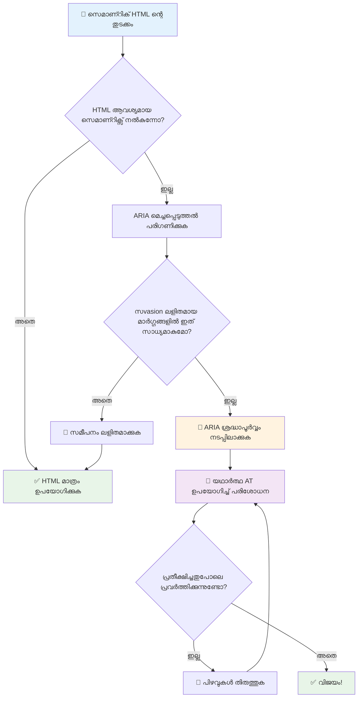
1. **സെമാന്റിക് HTML ആദ്യം**: എല്ലായ്പ്പോഴും `<button>` ഉപയോഗിക്കുക, `<div role="button">` എന്നതിനുപകരം
2. **സെമാന്റിക് ത്തിനെ തകരാത്തത്**: നിലവിലുള്ള HTML അർത്ഥം മറികടക്കരുത് (`<h1 role="button">` ഒഴിവാക്കുക)
3. **കീബോർഡ് ആക്സസിബിലിറ്റി നിലനിർത്തി**: എല്ലാ ഇന്ററാക്ടീവ് ARIA ഘടകങ്ങളും പൂർണ്ണമായും കീബോർഡ് ഉപയോഗിച്ച് ആക്‌സസിബിൾ ആകണമേണം
4. **വാസ്തവവുമായ ഉപയോക്താക്കളുമായി പരിശോധന നടത്തൂ**: സഹായ സാങ്കേതികവിദ്യകളിൽ ARIA പിന്തുണ വ്യത്യസ്തമാണ്
5. **സരളമായി തുടങ്ങുക**: സങ്കീർണമായ ARIA പ്രയോഗങ്ങളിൽ പിശകുകൾ കൂടുതലാകും

**🔍 പരിശോധന പ്രവൃത്തി പരിചരണം:**

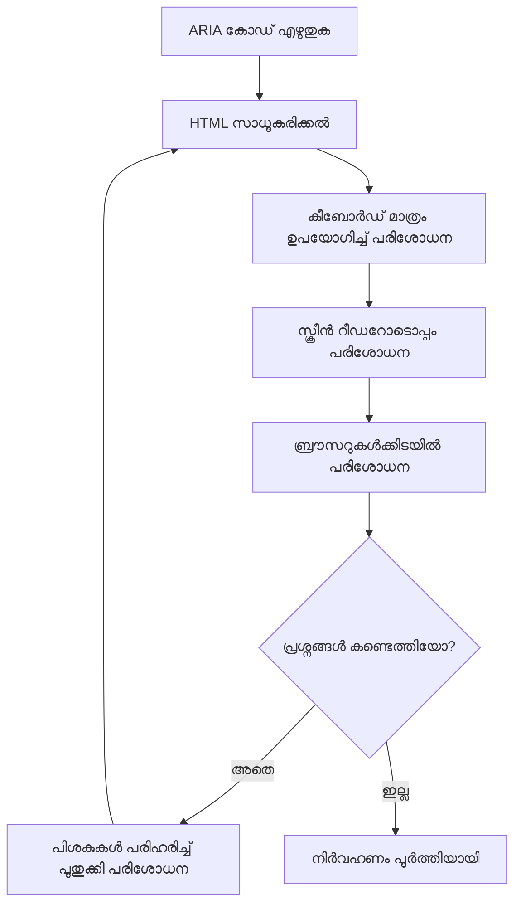
**🚫 ഒഴിവാക്കേണ്ട സാധാരണ ARIA പിഴവുകൾ:**

- **വിമർശനാത്മകമായ വിവരങ്ങൾ**: HTML സെമാന്റിക്കിനോട് വിരോധമുണ്ടാകരുത്
- **അധിക ലേബലിംഗ്**:过多的ARIA വിവരങ്ങൾ ഉപയോക്താക്കളെ ഭീതി കൊള്ളിക്കുന്നു
- **സ്ഥിരമായ ARIA**: ഉള്ളടക്കം മാറുമ്പോൾ ARIA നിലകൾ അപ്ഡേറ്റ് ചെയ്യാതിരിക്കുന്നതു
- **പരിശോധിക്കാത്ത പ്രയോഗങ്ങൾ**: സിദ്ധാന്തത്തിൽ പ്രവർത്തിക്കുന്ന ARIA, പ്രായോഗികമായി തകരാറുള്ളത്
- **കീബോർഡ് പിന്തുണ ഇല്ലാതിരിക്കൽ**: ARIA റോളുകൾക്ക് അനുയോജ്യമായ കീബോർഡ് ഇടപെടലുകൾ ഇല്ലായ്മ

> 💡 **പരിശോധനാ ഉപകരണങ്ങൾ**: സ്വയമേവ ARIA സത്യവാങ്മൂലം നടത്താനായി [accessibility-checker](https://www.npmjs.com/package/accessibility-checker) പോലുള്ള ടൂളുകൾ ഉപയോഗിക്കാവുന്നതാണ്, എന്നാൽ സന്ദർശക സ്ക്രീൻ റീഡറുമായും പരീക്ഷണം നടത്തുക.

### 🎭 **ARIA നൈപുണ്യ പരിശോധന: സങ്കീർണ ഇടപെടലുകൾക്ക് തയ്യാറല്ലെങ്കില്?**

**നിങ്ങളുടെ ARIA ആത്മവിശ്വാസം വിലയിരുത്തുക:**
- സെമാന്റിക് HTML ന് പകരം ARIA ആയാൽ നിങ്ങൾ നിയന്ത്രിക്കുമോ? (അറ്റ്മാഹം: തൽസമയങ്ങളിൽ വളരെ കുറവായിരിക്കും!)
- `<div role="button">` സാധാരണ `<button>`-യെക്കാൾ കാരണം എങ്ങനെയാണ് വരെ ലംഘ്യം?
- ഉത്തരവാദിത്വ പരീക്ഷണത്തെക്കുറിച്ച് മറക്കരുത് എന്നു പറയാൻ ഏറ്റവും പ്രധാനപ്പെട്ട കാര്യം എന്താണ്?

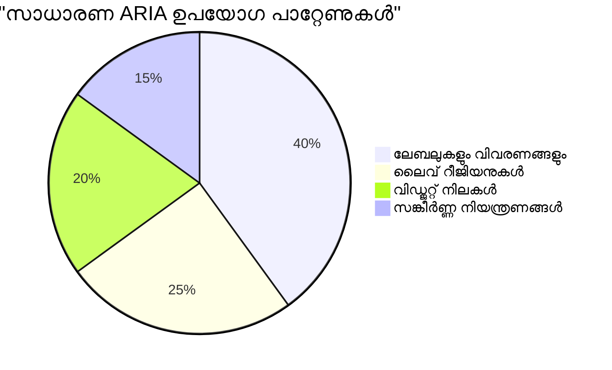
> **പ്രധാന ബോധ്യം**: ARIA ഉപയോഗത്തിന്റെ പ്രധാന ഭാഗം ഘടകങ്ങൾ ലേബിൾ ചെയ്യാനും വിവരണം നൽകാനും ആണ്. സങ്കീർണ വിഡ്ജറ്റ് മാതൃകകൾ വളരെ കുറവാണ്.

✅ **വിദഗ്ധരിൽ നിന്നായി പഠിക്കുക**: സങ്കീർണ ഇന്ററാക്ടീവ് വിഡ്ജറ്റുകളുടെ സ്വാഗതയോഗ്യമായ മാതൃകകൾക്കും പ്രയോഗങ്ങൾക്കും [ARIA Authoring Practices Guide](https://w3c.github.io/aria-practices/) പഠിക്കുക.

## ചിത്രങ്ങളും മീഡിയയും ആക്സസിബിൾ ആക്കൽ

വിസ്വൽ, ഓഡിയോ ഉള്ളടക്കം ആധുനിക വെബ് അനുഭവങ്ങളുടെ അനിവാര്യ ഘടകങ്ങളാണ്, പക്ഷേ അവ പരിഗണനയോടെ നടപ്പിലാക്കാത്തപക്ഷം തടസ്സങ്ങൾ സൃഷ്ടിക്കും. നിങ്ങളുടെ മീഡിയയുടെ വിവരംയും മനോഹാരിതയും എല്ലാ ഉപയോക്താക്കളിലേക്കും എത്തിച്ചേരണം എന്ന് ലക്ഷ്യം വെക്കുക. നിങ്ങൾ അതിൽ പ്രാവീണ്യം നേടുമ്പോൾ അത് സ്വാഭാവികമായി ചെയ്യും.

വിവിധ തരം മീഡിയക്ക് വ്യത്യസ്ത ആക്സസിബിലിറ്റി സമീപനങ്ങൾ ആവശ്യമാണ്. അത് പാചകം പോലെയാണ് — ദയനീയമായ മീൻ പാകം ചെയ്യുന്നത് പോരാത്തത് പോലെ കഠിനമായ സ്റ്റെക്ക് പാകം ചെയ്യുന്നത് വേറെ.

### തന്ത്രപരമായ ചിത്രം ആക്സസിബിലിറ്റി

നിങ്ങളുടെ വെബ്സൈറ്റിലെ ഓരോ ചിത്രത്തിനും ഒരു ഉദ്ദേശ്യം ഉണ്ട്. ആ ഉദ്ദേശ്യം മനസ്സിലാക്കുന്നത് നല്ല ആൽട്ട് ടെക്സ്റ്റും കൂടുതൽ ഉൾക്കൊള്ളുന്ന അനുഭവങ്ങളും സൃഷ്ടിക്കാൻ സഹായിക്കും.

**ചരിത്ര ചിഹ്നങ്ങളും അവരുടെ ആൽട്ട് ടെക്‌സ്‌റ്റ് തന്ത്രങ്ങളും:**

**വിവരമുഖ ചിതറുകൾ** - പ്രധാന വിവരങ്ങൾ കൈമാറുന്നു:  
```html

```
  
**ആലങ്കാരിക ചിത്രങ്ങൾ** - നിരൂപണ മൂല്യമില്ലാത്ത ദൃശ്യങ്ങൾ:  
```html

```
  
**പ്രയോഗാത്മക ചിത്രങ്ങൾ** - ബട്ടണുകളോ നിയന്ത്രണങ്ങളോ ആയി ഉപയോഗിക്കുന്നു:  
```html
<button>
  
</button>
```
  
**സങ്കീർണ ചിത്രങ്ങൾ** - ചാർട്ടുകൾ, വീഴ്‍വിളക്കങ്ങൾ, വിവരചിത്രങ്ങൾ:  
```html

<div id="chart-description">
  <p>Detailed description: Sales data shows a steady increase across all quarters...</p>
</div>
```
  
### വീഡിയോയും ഓഡിയോയും ആക്സസിബിള്‍

**വീഡിയോ ആവശ്യകതകൾ:**
- **ക്യാപ്ഷനുകൾ**: സംസാരിച്ച ഉള്ളടക്കത്തിന്റെയും ശബ്ദപ്രഭാഷങ്ങളുടെ എഴുതിയ രൂപം  
- **ഓഡിയോ വിവരണങ്ങൾ**: ദൃഷ്ടിബാധിതർക്കായി ദൃശ്യ ഘടകങ്ങളുടെ വാചകരൂപം  
- **ട്രാൻസ്‌ക്രിപ്റ്റുകൾ**: എല്ലാ ഓഡിയോയും ദൃശ്യവുമായ ഉള്ളടക്കങ്ങളിലും പൂർണ്ണ പാഠം  

```html
<video controls>
  <source src="video.mp4" type="video/mp4">
  <track kind="captions" src="captions.vtt" srclang="en" label="English">
  <track kind="descriptions" src="descriptions.vtt" srclang="en" label="Audio descriptions">
</video>
```
  
**ഓഡിയോ ആവശ്യകതകൾ:**
- **ട്രാൻസ്‌ക്രിപ്റ്റുകൾ**: മുഴുവൻ സംസാരിച്ച ഉള്ളടക്കത്തിന്റെയും എഴുത്ത്  
- **ദൃശ്യ സൂചകങ്ങൾ**: ഓഡിയോ മാത്രം ഉള്ള കാര്യമെങ്കിൽ കാഴ്ച സൂചികളായി നൽകണം  

### ആധുനിക ചിത്രം സാങ്കേതിക വിദ്യകൾ

**ആലങ്കാരിക ചിത്രങ്ങൾക്കായി CSS ഉപയോഗിക്കുന്നത്:**  
```css
.hero-section {
  background-image: url('decorative-hero.jpg');
  /* Decorative images in CSS don't need alt text */
}
```
  
**ആക്‌സസിബിള്‍ റെസ്പോൺസീവ് ചിത്രങ്ങൾ:**  
```html
<picture>
  <source media="(min-width: 800px)" srcset="large-chart.png">
  <source media="(min-width: 400px)" srcset="medium-chart.png">
  
</picture>
```
  
✅ **ചിത്ര ആക്സസിബിലിറ്റി സ്ഥിരീകരിക്കുക**: സ്ക്രീൻ റീഡർ ഉപയോഗിച്ച് ചിത്രമുള്ള ഒരു പേജ് നാവിഗേറ്റ് ചെയ്യൂ. ഉള്ളടക്കം മനസ്സിലാക്കാൻ നിങ്ങൾക്കു വേണ്ടത്ര വിവരങ്ങൾ ലഭിക്കുകയാണോ?

## കീബോർഡ് നാവിഗേഷൻ, ഫോകസ് മാനേജ്‌മെന്റ്

നിരവധി ഉപയോക്താക്കൾ വെബ് സംവഹിക്കുന്നത് മുഴുവൻ കീബോർഡ് ഉപയോഗിച്ച്. ഇവയിൽ ചലന ബാധിതരായവർ, കീബോർഡ് ഉപയോഗിക്കുന്നത് മൈസിനെക്കാൾ വേഗമെന്ന് കണ്ടുപിടിച്ച പവർ യൂസർമാർ, മൈസ് തകരാറിലായവർ എന്നിവരാണ് ഉൾപ്പെടുന്നത്. നിങ്ങളുടെ സൈറ്റ് കീബോർഡ് ഇൻപുട്ടിനൊപ്പം നല്ലപോലെ പ്രവർത്തിക്കുന്നത് അനിവാര്യമാണ്, കൂടാതെ എല്ലാവർക്കും സൈറ്റിന്റെ കാര്യക്ഷമത മെച്ചപ്പെടുത്തുന്നു.

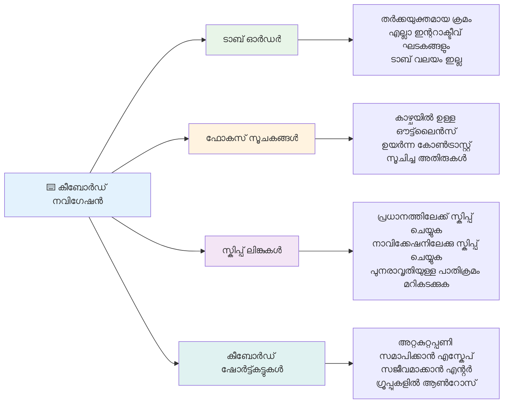
### അനിവാര്യ കീബോർഡ് നാവിഗേഷൻ മാതൃകകൾ

**സാധാരണ കീബോർഡ് ഇടപെടലുകൾ:**
- **Tab**: ഇന്ററാക്ടീവ് ഘടകങ്ങളിൽ മുന്നോട്ട് ഫോകസ് മാറ്റുക  
- **Shift + Tab**: പിൻവശം ഫോകസ് മാറ്റുക  
- **Enter**: ബട്ടണുകളും ലിങ്കുകളും പ്രവർത്തിപ്പിക്കുക  
- **Space**: ബട്ടണുകളും ചെക്ക്ബോക്സുകളും പ്രവർത്തിപ്പിക്കുക  
- **അറോ കീകൾ**: ഘടക ഗ്രൂപ്പുകളിൽ നാവിഗേറ്റ് ചെയ്യുക (റേഡിയോ ബട്ടണുകൾ, മെനുകൾ)  
- **Escape**: മോടാൽ, ഡ്രോപ്ഡൗൺ തുടങ്ങിയവ അടയ്ക്കുക അല്ലെങ്കിൽ പ്രവർത്തനങ്ങൾ റദ്ദാക്കുക  

### ഫോകസ് മാനേജ്‌മെന്റ് മികച്ച രീതികൾ

**കാണാവുന്ന ഫോകസ് സൂചകങ്ങൾ:**
```css
/* Ensure focus is always visible */
button:focus-visible {
  outline: 2px solid #4A90A4;
  outline-offset: 2px;
}

/* Custom focus styles for different components */
.card:focus-within {
  box-shadow: 0 0 0 3px rgba(74, 144, 164, 0.5);
}
```
  
**മുറിപ്പാട്ടാക്കിയ ലിങ്കുകൾ ഫാസ്റ്റ് നാവിഗേഷനു:**
```html
<a href="#main-content" class="skip-link">Skip to main content</a>
<a href="#navigation" class="skip-link">Skip to navigation</a>

<nav id="navigation">
  <!-- navigation content -->
</nav>
<main id="main-content">
  <!-- main content -->
</main>
```
  
**ശുദ്ധമായ ടാബ് ഓർഡർ:**
```html
<!-- Use semantic HTML for natural tab order -->
<form>
  <label for="name">Name:</label>
  <input type="text" id="name" tabindex="0">
  
  <label for="email">Email:</label>
  <input type="email" id="email" tabindex="0">
  
  <button type="submit" tabindex="0">Submit</button>
</form>
```
  
### മോടലുകളിലെ ഫോകസ് പൂട്ടൽ

മോടൽ ഡയലോഗുകൾ തുറക്കുമ്പോൾ, ഫോകസ് അതിന്റെ اندر പൂട്ടപ്പെട്ടിരിക്കണം:

```javascript
// ആധുനിക ഫോകസ് ട്രാപ്പ് നടപ്പാക്കൽ
function trapFocus(element) {
  const focusableElements = element.querySelectorAll(
    'button, [href], input, select, textarea, [tabindex]:not([tabindex="-1"])'
  );
  
  const firstElement = focusableElements[0];
  const lastElement = focusableElements[focusableElements.length - 1];

  element.addEventListener('keydown', (e) => {
    if (e.key === 'Tab') {
      if (e.shiftKey && document.activeElement === firstElement) {
        e.preventDefault();
        lastElement.focus();
      } else if (!e.shiftKey && document.activeElement === lastElement) {
        e.preventDefault();
        firstElement.focus();
      }
    }
    
    if (e.key === 'Escape') {
      closeModal();
    }
  });
  
  // മോഡൽ തുറക്കുമ്പോൾ ആദ്യ ഘടകത്തിൽ ഫോകസ് നൽകുക
  firstElement.focus();
}
```
  
✅ **കീബോർഡ് നാവിഗേഷൻ പരിശോധന:** Tab കീ മാത്രം ഉപയോഗിച്ച് നിങ്ങളുടെ വെബ്സൈറ്റ് നാവിഗേറ്റ് ചെയ്യുന്നതൊക്കെ ശ്രമിക്കുക. എല്ലാം ഇന്ററാക്ടീവ് ഘടകങ്ങൾ നിങ്ങൾക്ക് എത്തിക്കാനാകുന്നുവോ? ഫോകസ് ക്രമീകരണം യുക്തിയുണ്ടോ? ഫോകസ് സൂചകങ്ങൾ വ്യക്തമായും ദൃശ്യവുമാണോ?

## ഫോം ആക്സസിബിലിറ്റി

ഉപഭോക്തൃ ഇടപെടലിനായി ഫോം അനിവാര്യമാണ്, ആക്സസിബിലിറ്റി പ്രത്യേക ശ്രദ്ധ തേടുന്നു.

### ലേബൽ - ഫോം കൺട്രോൾ ബന്ധം

**ഓരോ ഫോം കൺട്രോളിനും ലേബൽ വേണം:**
```html
<!-- Explicit labeling (preferred) -->
<label for="username">Username:</label>
<input type="text" id="username" name="username" required>

<!-- Implicit labeling -->
<label>
  Password:
  <input type="password" name="password" required>
</label>

<!-- Using aria-label when visual label isn't desired -->
<input type="search" aria-label="Search products" placeholder="Search...">
```
  
### പിശകു കൈകാര്യം, പരിശോധന

**ആക്സസിബിള്‍ പിശക് സന്ദേശങ്ങൾ:**
```html
<label for="email">Email Address:</label>
<input type="email" id="email" name="email" 
       aria-describedby="email-error" 
       aria-invalid="true" required>
<div id="email-error" role="alert">
  Please enter a valid email address
</div>
```
  
**ഫോം പരിശോധന മികച്ച രീതികൾ:**
- തെറ്റായ ഫീൽഡുകൾ കാണിക്കാൻ `aria-invalid` ഉപയോഗിക്കുക  
- വ്യക്തവും വ്യക്തമായ പിശക് സന്ദേശങ്ങൾ നൽകുക  
- പ്രധാന പിശക് പ്രസംഗങ്ങൾക്ക് `role="alert"` ഉപയോഗിക്കുക  
- പിശകുകൾ ഉടൻ കാണിക്കുകയും ഫോം സമർപ്പിക്കുമ്പോഴും കാണിക്കുകയും ചെയ്യാം  

### ഫീൽഡ്സെറ്റും ഗ്രൂപ്പും

**ബന്ധപ്പെട്ട ഫോം കൺട്രോളുകൾ കൂട്ടുക:**  
```html
<fieldset>
  <legend>Shipping Address</legend>
  <label for="street">Street Address:</label>
  <input type="text" id="street" name="street">
  
  <label for="city">City:</label>
  <input type="text" id="city" name="city">
</fieldset>

<fieldset>
  <legend>Preferred Contact Method</legend>
  <input type="radio" id="contact-email" name="contact" value="email">
  <label for="contact-email">Email</label>
  
  <input type="radio" id="contact-phone" name="contact" value="phone">
  <label for="contact-phone">Phone</label>
</fieldset>
```
  
## നിങ്ങളുടെ ആക്സസിബിലിറ്റി യാത്ര: പ്രധാന conclusioകൾ

അഭിനന്ദനങ്ങൾ! നിങ്ങൾ ഏകദേശം ഉൾക്കൊള്ളുന്നതായ വെബ് അനുഭവങ്ങൾ സൃഷ്ടിക്കാൻ അടിസ്ഥാന അറിവ് നേടിയിരിക്കുന്നു. ഇത് വളരെ ആവേശകരമാണ്! വെബ് ആക്സസിബിലിറ്റി വെറും അനുസരണ ബോക്സുകൾ പരിശോധിക്കുന്നതല്ല— മനുഷ്യർ ഡിജിറ്റൽ ഉള്ളടക്കവുമായി എങ്ങനെ വ്യത്യസ്തമായി സംവദിക്കുകയാണെന്നു തിരിച്ചറിഞ്ഞ് ആ അത്ഭുതകരമായ സങ്കീർണതക്കായി രൂപകൽ‌പന ചെയ്യുക തന്നെയാണ്.

നിങ്ങൾ മികച്ച ഡിസൈൻ എല്ലാവർക്കും അടിയന്തിരമായി പ്രവർത്തിക്കുന്ന ഒരു വികസക സമൂഹത്തിലേക്ക് ചേർന്നിരിക്കുന്നു. ക്ലബ്ബിലേക്ക് സ്വാഗതം!

**🎯 നിങ്ങളുടെ ആക്സസിബിലിറ്റി ഉപകരണ പെട്ടി ഇപ്പോൾ ഉൾക്കൊള്ളുന്നു:**

| പ്രാഥമിക തത്വം | നടപ്പാക്കൽ | ഫലം |
|----------------|----------------|---------|
| **സെമാന്റിക് HTML അടിസ്ഥാനം** | ഉദ്ദേശിച്ച പ്രവർത്തനത്തിനായി ശരിയായ HTML ഘടകങ്ങൾ ഉപയോഗിക്കുക | സ്ക്രീൻ റീഡറുകൾ എളുപ്പത്തിൽ നാവിഗേറ്റ് ചെയ്യാം, കീബോർഡ് സ്വയം പ്രവർത്തിക്കുന്നു |
| **ഇൻക്ലൂസീവ് ദൃശ്യ രൂപകൽപ്പന** | മതിയായ ഭേദം, സാരമായ നിറം ഉപയോഗം, ദൃശ്യമായ ഫോകസ് സൂചകങ്ങൾ | ഏത് പ്രകാശ സാഹചര്യത്തിലും എല്ലാവർക്കും വ്യക്തമാണ് |
| **വിവരണാത്മക ഉള്ളടക്കം** | അർത്ഥപൂർണ്ണ ലിങ്ക് ടെക്‌സ്‌റ്റും ആല്ട് ടെക്‌സ്‌റ്റും, തലക്കെട്ടുകൾ | ഉപയോക്താക്കൾക്ക് ദൃശ്യമില്ലാത്ത സാഹചര്യങ്ങളിലും ഉള്ളടക്കം മനസ്സിലാക്കാം |
| **കീബോർഡ് ആക്സസിബിലിറ്റി** | ടാബ് ഓർഡർ, കീബോർഡ് ഷോർട്ട്കട്ടുകൾ, ഫോകസ് മാനേജ്മെന്റ് | ചലനശേഷി പ്രാപ്തിയും ശക്തി ഉപയോക്തൃ കാര്യക്ഷമതയും |
| **ARIA മെച്ചപ്പെടുത്തൽ** | സെമാന്റിക് ഇടവേളകൾ പൂരിപ്പിക്കാൻ തന്ത്രപരമായ ഉപയോഗം | സങ്കീർണ ആപ്ലിക്കേഷനുകൾ സഹായ സാങ്കേതികവിദ്യകളോടെ പ്രവർത്തിക്കുന്നു |
| **സമ്പൂർണമായ പരിശോധന** | സ്വയംപ്രവർത്തിക്കുന്ന ടൂളുകൾ + കൈമാറ്റ പരിശോധന + വാസ്തവ ഉപഭോക്തൃ പരീക്ഷണം | ഉപയോക്താക്കളെ ബാധിക്കുന്ന പ്രശ്നങ്ങൾ പിടികൂടുക |

**🚀 നിങ്ങളുടെ അടുത്തപടികൾ:**

1. **നിങ്ങളുടെ വികസന പ്രവൃത്തികളിൽ ആക്സസിബിലിറ്റി നിർമ്മിക്കുക**: പരീക്ഷണങ്ങൾ സ്വാഭാവിക ഭാഗമാക്കുക  
2. **വാസ്തവ ഉപയോക്താക്കളിൽ നിന്ന് പഠിക്കുക**: സഹായ സാങ്കേതികവിദ്യകൾ ഉപയോഗിക്കുന്നവരുടെ അഭിപ്രായം തേടുക  
3. **ആധുനികമായി തുടരുക**: ആക്സസിബിലിറ്റി സാങ്കേതികവിദ്യകളും നിലവാരങ്ങളും പുരോഗമിക്കുന്നു  
4. **ഉൾക്കാളത്തെ പ്രോത്സാഹിപ്പിക്കുക**: നിങ്ങളുടെ അറിവ് പങ്കുവെച്ച് ടീമിന്റെ മുൻഗണന ആക്കുക  

> 💡 **ഓർമ്മിക്കുക**: ആക്സസിബിലിറ്റി നിരോധനങ്ങൾ സാധാരണയായി സൃഷ്ടിക്കുന്നു നവീനവും മനോഹരവുമായ പരിഹാരങ്ങൾ. കോർബ് കട്ടുകളും ക്യാപ്ഷനുകളും വോയ്‌സ് നിയന്ത്രണങ്ങളും ആക്സസിബിലിറ്റി സവിശേഷതകളായി തുടങ്ങിയതും പിന്നീട് പൊതുവായ മെച്ചപ്പെടുത്തലായും മാറി.

**ബിസിനസ് കേസ് വ്യക്തമാണ്**: ആക്സസിബിൾ വെബ്സൈറ്റുകൾ കൂടുതൽ ഉപയോക്താക്കളിൽ എത്തുന്നു, സെർച്ച് എഞ്ചിനുകളിൽ മികച്ച റാങ്കിങ് നേടുന്നു, മെന്റനൻസ് ചെലവ് കുറവാണ്, നിയമപരമായ റിസ്കുകൾ ഒഴിവാക്കുന്നു. പക്ഷേ സത്യത്തിൽ? ആക്സസിബിലിറ്റി ചെറിയ കാരണമല്ല. ആക്സസിബിൾ സൈറ്റ് വെബ് വെളിച്ചവും ഉൾക്കാഴ്ചയും നയിക്കുന്നു - എല്ലാവർക്കും സമാനമായ വിവര സ്വകാര്യത നൽകാനുള്ള ആശയവും.

നിങ്ങൾ ഇപ്പോൾ ഭാവിയിലെ ഉൾക്കൊള്ളുന്ന വെബ് സൃഷ്ടിക്കാനുള്ള കഴിവ് നേടി. ഓരോ ആക്സസിബിൾ സൈറ്റ് നിങ്ങളുടെ ഇന്റർനെറ്റ് എല്ലാവർക്കും സ്‌നേഹമുള്ള സ്ഥലമാക്കുന്നു. അത് ചിന്തിക്കുമ്പോൾ ആയിരം വട്ടം അത്ഭുതകരമാണ്!

## അധിക വിഭവങ്ങൾ

ഈ അനിവാര്യ വിഭവങ്ങളുമായി നിങ്ങളുടെ ആക്സസിബിലിറ്റി പഠനയാത്ര തുടർക്കുക:

**📚 ഔദ്യോഗിക നിലവാരങ്ങളും മാർഗ്ഗനിർദ്ദേശങ്ങളും:**
- [WCAG 2.1 മാർഗ്ഗനിർദ്ദേശങ്ങൾ](https://www.w3.org/WAI/WCAG21/quickref/) - ഔദ്യോഗിക ആക്സസിബിലിറ്റി സ്റ്റാൻഡേർഡ് ക്വിക് റഫറൻസ്
- [ARIA Authoring Practices Guide](https://w3c.github.io/aria-practices/) - ഇന്ററാക്ടീവ് വിഡ്ജറ്റുകളുടെ സമഗ്ര മാതൃകകൾ
- [WebAIM മാർഗ്ഗനിർദ്ദേശങ്ങൾ](https://webaim.org/) - പ്രായോഗികവും തുടക്കക്കാരFriendlyയും ആക്സസിബിലിറ്റി മാർഗ്ഗനിർദ്ദേശങ്ങൾ

**🛠️ ഉപകരണങ്ങളും പരിശോധന വിഭവങ്ങളും:**
- [axe DevTools](https://www.deque.com/axe/devtools/) - വ്യവസായ നിലവാരമുള്ള ആക്സസിബിലിറ്റി പരിശോധന
- [A11y പ്രോജക്റ്റ് ചെക്ലിസ്റ്റ്](https://www.a11yproject.com/checklist/) - ഘട്ടം ഘട്ടമായ ആക്സസിബിലിറ്റി സ്ഥിരീകരണം
- [Accessibility Insights](https://accessibilityinsights.io/) - മൈക്രോസോഫ്റ്റിന്റെ സമഗ്ര പരിശോധനാ സ്യൂട്ട്
- [Color Oracle](https://colororacle.org/) - നിറക്കാഴ്ച ഭ്രാന്ത് സിമുലേറ്റർ ഡിസൈൻ പരീക്ഷണത്തിന്

**🎓 പഠനവും സമൂഹവും:**
- [WebAIM സ്ക്രീൻ റീഡർ സർവേ](https://webaim.org/projects/screenreadersurvey9/) - വാസ്തവ ഉപയോക്തൃ ആഗോളം
- [Inclusive Components](https://inclusive-components.design/) - ആധുനിക ആക്സസിബിൾ ഘടക മാതൃകകൾ
- [A11y Coffee](https://a11y.coffee/) - ദ്രുത ആക്സസിബിലിറ്റി ടിപ്പ്‌സ്,洞察ങ്ങൾ
- [Web Accessibility Initiative (WAI)](https://www.w3.org/WAI/) - W3C സംഗ്രഹമായ ആക്സസിബിലിറ്റി വിഭവങ്ങൾ

**🎥 കൈകാര്യം പഠന കുറിപ്പുകൾ:**
- [Accessibility Developer Guide](https://www.accessibility-developer-guide.com/) - പ്രായോഗിക നടപ്പിലാക്കൽ മാർഗ്ഗനിർദ്ദേശങ്ങൾ
- [Deque University](https://dequeuniversity.com/) - പ്രൊഫഷണൽ ആക്സസിബിലിറ്റി പരിശീലന കോഴ്സുകൾ

## GitHub Copilot ഏജന്റിന്റെ പോരാട്ടം 🚀

ഏജന്റ് മോഡ് ഉപയോഗിച്ച് താഴെ പറയുന്ന പോരാട്ടം പൂർത്തിയാക്കുക:

**വിവരണം:** ശരിയായ ഫോക്കസ് മാനേജ്മെന്റ്, ARIA ഗുണങ്ങൾ, കീബോർഡ് നാവിഗേഷൻ മാതൃകകൾ പ്രദർശിപ്പിക്കുന്ന ആക്സസിബിൾ മോടൽ ഡയലോഗ് ഘടകം സൃഷ്ടിക്കുക.

**പ്രംപ്റ്റ്:** HTML, CSS, JavaScript ഉപയോഗിച്ച് ഒരു പൂർണ്ണ മോടൽ ഡയലോഗ് ഘടകം സൃഷ്ടിക്കുക, ഫോകസ് പൂട്ടലും ESC കീ ഉപയോഗിച്ച് അടക്കലും, പുറത്ത് ക്ലിക്കും അടക്കലും, സ്ക്രീൻ റീഡറുകൾക്കുള്ള ARIA ഗുണങ്ങളും ദൃശ്യമായ ഫോകസ് സൂചകങ്ങളും ഉൾക്കൊള്ളുന്നു. ഫോം ശരിയായ ലേബലുകളും പിശക് കൈകാര്യം ചെയലും ഉൾക്കൊള്ളണം. ഘടകം WCAG 2.1 AA നിലവാരങ്ങൾ പാലിക്കണം.

## 🚀 പോരാട്ടം

ഈ HTML ഏറ്റവും ആക്സസിബിളായ രീതിയിൽ പുതുക്കുക, നിങ്ങൾ പഠിച്ച തന്ത്രങ്ങൾ ഉപയോഗിച്ച്.

```html
<!DOCTYPE html>
<html lang="en">
  <head>
    <meta charset="UTF-8">
    <meta name="viewport" content="width=device-width, initial-scale=1.0">
    <title>Turtle Ipsum - The World's Premier Turtle Fan Club</title>
    <link href='../assets/style.css' rel='stylesheet' type='text/css'>
  </head>
  <body>
    <header class="site-header">
      <h1 class="site-title">Turtle Ipsum</h1>
      <p class="site-subtitle">The World's Premier Turtle Fan Club</p>
    </header>
    
    <nav class="main-nav" aria-label="Main navigation">
      <h2 class="nav-header">Resources</h2>
      <ul class="nav-list">
        <li><a href="https://www.youtube.com/watch?v=CMNry4PE93Y">"I like turtles" video</a></li>
        <li><a href="https://en.wikipedia.org/wiki/Turtle">Basic turtle information</a></li>
        <li><a href="https://en.wikipedia.org/wiki/Turtles_(chocolate)">Chocolate turtles candy</a></li>
      </ul>
    </nav>
    
    <main class="main-content">
      <article>
        <h1>Welcome to Turtle Ipsum</h1>
        <p class="intro">
          <a href="/about">Learn more about our turtle community</a> and discover fascinating facts about these amazing creatures.
        </p>
        <p class="article-text">
          Turtle ipsum dolor sit amet, consectetur adipiscing elit, sed do eiusmod tempor incididunt ut labore et dolore magna aliqua. Ut enim ad minim veniam, quis nostrud exercitation ullamco laboris nisi ut aliquip ex ea commodo consequat. Duis aute irure dolor in reprehenderit in voluptate velit esse cillum dolore eu fugiat nulla pariatur. Excepteur sint occaecat cupidatat non proident, sunt in culpa qui officia deserunt mollit anim id est laborum.
        </p>
      </article>
    </main>
    
    <footer class="footer">
      <section class="newsletter-signup">
        <h2>Stay Updated</h2>
        <button type="button" onclick="showNewsletterForm()">Sign up for turtle news</button>
      </section>
      
      <nav class="footer-nav" aria-label="Footer navigation">
        <h2>Site Pages</h2>
        <ul>
          <li><a href="../">Home</a></li>
          <li><a href="../semantic">Semantic HTML example</a></li>
        </ul>
      </nav>
      
      <p class="footer-copyright">&copy; 2024 Instrument. All rights reserved.</p>
    </footer>
  </body>
</html>
```
  
**നടപ്പാക്കപ്പെട്ട പ്രധാന മാറ്റങ്ങൾ:**  
- ശരിയായ സെമാന്റിക് HTML ഘടന ചേർത്തു  
- തലക്കെട്ടുകളുടെ ക്രമം ശരിയാക്കി (ഒരു h1, ലൊജിക്കൽ പുരോഗതി)  
- "ഇവിടെ ക്ലിക്ക് ചെയ്യൂ" പകരം അർത്ഥമുള്ള ലിങ്ക് ടെക്സ്റ്റ് നൽകി  
- നാവിഗേഷനിനായി ശരിയായ ARIA ലേബലുകൾ ചേർത്തു  
- lang ആട്രിബ്യൂട്ട്, ശരിയായ മെറ്റാ ടാഗുകൾ ഉൾപ്പെടുത്തി  
- ഇന്ററാക്ടീവ് ഘടകങ്ങൾക്ക് ബട്ടൺ ഘടകം ഉപയോഗിച്ചു  
- ഫൂട്ടർ ഉള്ളടക്കം ശരിയായ ലാൻഡ്മാർക്കുകളുമായി അടച്ച് ക്രമീകരിച്ചു  

## ക്ലാസിന് ശേഷം ക്വിസ്  
[Post-lecture quiz](https://ff-quizzes.netlify.app/web/en/)

## അവലോകനം & സ്വയം പഠനം

വരും ഗവൺമെന്റുകൾ ആക്സസിബിലിറ്റി ആവശ്യകതകളെ കുറിച്ച് നിയമങ്ങൾ ഉണ്ടാക്കുന്നു. നിങ്ങളുടെ നാട്ടിലെ ആക്സസിബിലിറ്റി നിയമങ്ങൾ പഠിക്കുക. എന്താണ് ഉൾപ്പെടുത്തിയിരിക്കുന്നത്, എന്ത് അല്ല? ഉദാഹരണത്തിന് [ഈ സർക്കാർ വെബ്സൈറ്റ്](https://accessibility.blog.gov.uk/).

## അസൈൻമെന്റ്

[അആക്സസിബിൾ അല്ലാത്ത ഒരു വെബ്സൈറ്റ് വിശകലനം ചെയ്യുക](assignment.md)

ക്രഡിറ്റുകൾ: [Turtle Ipsum](https://github.com/Instrument/semantic-html-sample) by Instrument

---

## 🚀 നിങ്ങളുടെ ആക്സസിബിലിറ്റി മാസ്റ്ററി ടൈംലൈൻ

### ⚡ **അടുത്ത 5 മിനിറ്റിനുള്ളിൽ ചെയ്യേണ്ടത്**
- [ ] നിങ്ങളുടെ ബ്രൗസറിൽ axe DevTools എക്സ്ടൻഷൻ ഇൻസ്റ്റാൾ ചെയ്യുക  
- [ ] ഇഷ്ടപ്പെട്ട വെബ്സൈറ്റിൽ Lighthouse ആക്സസിബിലിറ്റി ഓഡിറ്റ് നടത്തുക  
- [ ] Tab കീ മാത്രം ഉപയോഗിച്ച് ഏതെങ്കിലും വെബ്സൈറ്റ് നാവിഗേറ്റ് ചെയ്യാൻ ശ്രമിക്കുക  
- [ ] നിങ്ങളുടെ ബ്രൗസറിലെ ഇൻബിൽറ്റ് സ്ക്രീൻ റീഡർ (Narrator/VoiceOver) പരീക്ഷിക്കുക  

### 🎯 **ഈ മണിക്കൂറിനുള്ളിൽ നേടാവുന്നത്**
- [ ] ക്ലാസിന് ശേഷം ക്വിസ് പൂർത്തിയാക്കി ആക്സസിബിലിറ്റി അറിവുകൾ വിശലേഷിക്കുക  
- [ ] 10 വ്യത്യസ്ത ചിത്രങ്ങൾക്ക് അർത്ഥവത്തായ ആൽറ്റ് ടെക്സ്റ്റ് എഴുതാൻ പരിശീലിക്കുക  
- [ ] HeadingsMap എക്സ്റ്റൻഷൻ ഉപയോഗിച്ച് വെബ്സൈറ്റിന്റെ തലക്കെട്ട് ഘടന പരിശോധിക്കുക  
- [ ] പോരാട്ടം HTML-ൽ കണ്ടെത്തിയ ആക്സസിബിലിറ്റി പ്രശ്നങ്ങൾ പരിഹരിക്കുക  
- [ ] WebAIM ടൂൾ ഉപയോഗിച്ച് നിലവിലെ പ്രോജക്റ്റിൽ നിറ ഭേദം പരിശോധിക്കുക  

### 📅 **ഓരോ ആഴ്ചത്തിലും നീ സ്വീകരിക്കേണ്ടത്**
- [ ] ആക്സസിബിൾ അല്ലാത്ത വെബ്സൈറ്റ് വിശകലനം അസൈൻമെന്റ് പൂർത്തിയാക്കുക  
- [ ] ആക്സസിബിലിറ്റി പരിശോധന ഉപകരണങ്ങൾ ഉപയോഗിച്ച്你的 ഡവലപ്പ്മെന്റ് പരിസ്ഥിതി ക്രമീകരിക്കുക
- [ ] 5 വ്യത്യസ്ത സങ്കീർണ്ണ വെബ്സൈറ്റുകളിൽ കീബോർഡ് നാവിഗേഷൻ അഭ്യസിക്കുക  
- [ ] ശരിയായ ലേബലുകൾ, പിശക് കൈകാര്യം, ARIA എന്നിവയോടൊപ്പം ഒരു ലളിതമായ പഞ്ഞി രൂപകൽപ്പന ചെയ്യുക  
- [ ] ഒരു ആക്‌സസ്‌സിബിലിറ്റി കമ്മ്യൂണിറ്റിയുമായി ചേരുക (A11y Slack, WebAIM forum)  
- [ ] തിരഞ്ഞെടുക്കപ്പെട്ട ഭിന്നശേഷിക്കാർ വെബ്സൈറ്റുകൾ നാവിഗേറ്റ് ചെയ്യുന്നുവെന്ന് അവലോകനം ചെയ്യുക (YouTube-ൽ മികച്ച ഉദാഹരണങ്ങൾ ഉണ്ട്)  

### 🌟 **നിങ്ങളുടെ ഒരു മാസത്തെ മാറ്റം**  
- [ ] ആക്‌സസ്‌സിബിലിറ്റി പരിശോധന നിങ്ങളുടെ വികസന പ്രവൃത്തി പ്രവാഹത്തിൽ സംയോജിപ്പിക്കുക  
- [ ] ആക്‌സസ്‌സിബിലിറ്റി പ്രശ്നങ്ങൾ ശരിയാക്കുന്ന തുറന്ന ഉറവിട പദ്ധതിക്ക് സംഭാവന നൽകുക  
- [ ] സഹായ സാങ്കേതികവിദ്യ ഉപയോഗിക്കുന്ന ആരോരുമായി ഉപയോഗ്യത പരിശോധന നടത്തുക  
- [ ] നിങ്ങളുടെ ടീമിനായി ആക്‌സസ്‌സിബിൾ ഘടക ലൈബ്രറി നിർമ്മിക്കുക  
- [ ] നിങ്ങളുടെ ജോലി സ്ഥലത്ത് അല്ലെങ്കിൽ സമൂഹത്തിൽ ആക്‌സസ്‌സിബിലിറ്റിക്ക് വേണ്ടി അഭിമുഖീകരിക്കുക  
- [ ] ആക്‌സസ്‌സിബിലিটি ആശയങ്ങളിൽ പുതുതായി ചേർന്ന ഒരാളെ മെന്റർ ചെയ്യുക  

### 🏆 **അവസാന ആക്‌സസ്‌സിബിലിറ്റി ചാമ്പ്യൻ പരിശോധന**  

**നിങ്ങളുടെ ആക്‌സസ്‌സിബിലിറ്റി യാത്ര ആഘോഷിക്കുക:**  
- ആളുകൾ വെബ് എങ്ങനെ ഉപയോഗിക്കുന്നു എന്ന അന്വേഷണത്തിൽ നിങ്ങൾക്ക് ഏറ്റവും വിചിത്രമായ എന്താണ് കണ്ടെത്തിയത്?  
- നിങ്ങളുടെ വികസന ശൈലിക്ക് ഏറ്റവും അനുയോജ്യമാകുന്ന ആക്‌സസ്‌സിബിലിറ്റി സിദ്ധാന്തം ഏതാണ്?  
- ആക്‌സസ്‌സിബിലിറ്റി പഠിക്കുന്നത് ഡിസൈനിന്റെ ദൃഷ്ടികോണം എങ്ങനെ മാറി?  
- യഥാർത്ഥ ഒരു പദ്ധതിയിൽ നിങ്ങൾ ആദ്യമായ് ചെയ്യാനാകുന്ന ആക്‌സസ്‌സിബിലിറ്റി മെച്ചപ്പെടുത്തൽ എന്താണ്?  

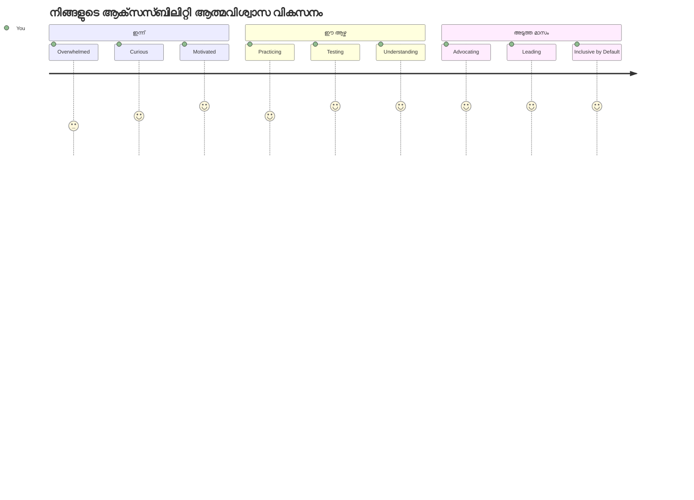
> 🌍 **നിങ്ങൾ ഇപ്പോൾ ആക്‌സസ്‌സിബിലിറ്റി ചാമ്പ്യനാണ്!** എല്ലാവർക്കും വെബ് സൗകര്യപ്രദമായ അനുഭവങ്ങൾ സൃഷ്ടിക്കുന്നത് എങ്ങനെ എന്നതു നിങ്ങൾ മനസ്സിലാക്കിയിട്ടുണ്ട്, അവർ എങ്കിൽ എങ്ങനെ വെബിനെ ആക്സസ് ചെയ്യുന്നു എന്നത് ആശ്രയിക്കാതെ. നിങ്ങൾ നിർമ്മിക്കുന്ന ഓരോ ആക്‌സസ്‌സിബിൾ ഫീച്ചറും ഇന്റർനെറ്റിനെ കൂടുതൽ സമവായമായി മാറ്റുന്നു. ആക്‌സസ്‌സിബിലിറ്റി ഒരു നിയന്ത്രണം അല്ല, മറിച്ച് എല്ലാ ഉപയോക്താക്കൾക്കും മികച്ച അനുഭവങ്ങൾ സൃഷ്ടിക്കാനുള്ള അവസരം എന്നാണ് നിങ്ങളുടേതായ വീക്ഷണം. ഈ സമരത്തിലേക്ക് സ്വാഗതം! 🎉

---

<!-- CO-OP TRANSLATOR DISCLAIMER START -->
**വ്യക്തിഗത ഉത്തരവാദിത്തമില്ലായ്മ**:  
ഈ ഡോക്യുമെന്റ് AI വിവർത്തന സേവനമായ [Co-op Translator](https://github.com/Azure/co-op-translator) ഉപയോഗിച്ചു വിവർത്തനം ചെയ്യപ്പെട്ടതാണ്. ഞങ്ങൾ കൃത്യതയ്ക്ക് ശ്രമിക്കുന്നെങ്കിലും, സ്വയം പ്രവർത്തിക്കുന്ന വിവർത്തനങ്ങളിൽ പിശകുകൾ അല്ലെങ്കിൽ അശുദ്ധികൾ ഉണ്ടായിരിക്കാമെന്ന് ദയവായി അറിയുക. ഔദ്യോഗിക ഭാഷയിലുള്ള മൂല ഡോക്യുമെന്റ് അവകാശ prizcheya ഉറവിടമായി പ Consider ചെയ്‌തുകൊണ്ടിരിക്കണം. നിർണ്ണായക വിവരങ്ങൾക്കായി, പ്രൊഫഷണൽ മാനവ വിവർത്തനം ശുപാർശ ചെയ്യപ്പെടുന്നു. ഈ വിവർത്തനത്തിന്റെ ഉപയോഗത്തിൽ നിന്നുണ്ടാകുന്ന തെറ്റിദ്ധാരണകൾക്കോ അർത്ഥബോധ വ്യതിയാനങ്ങൾക്കോ ഞങ്ങൾക്ക് ഉത്തരവാദിത്വമില്ല.
<!-- CO-OP TRANSLATOR DISCLAIMER END -->