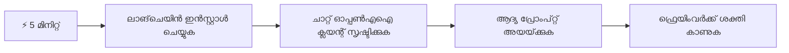
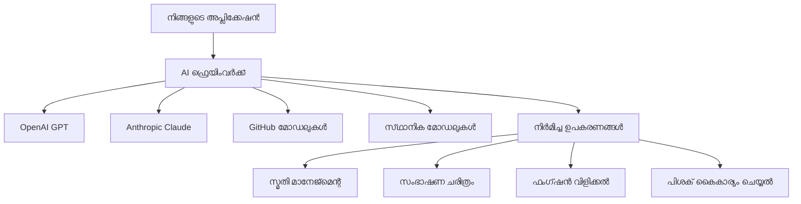
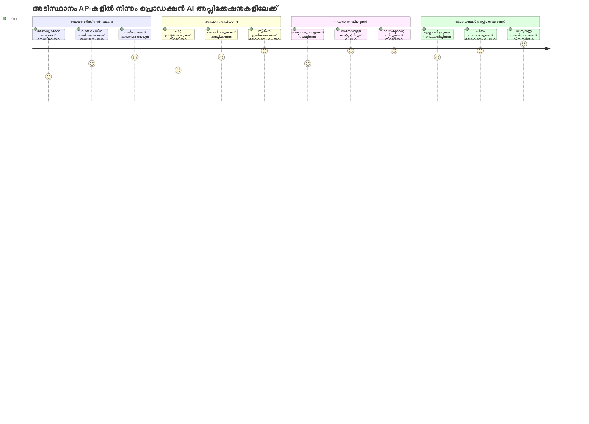
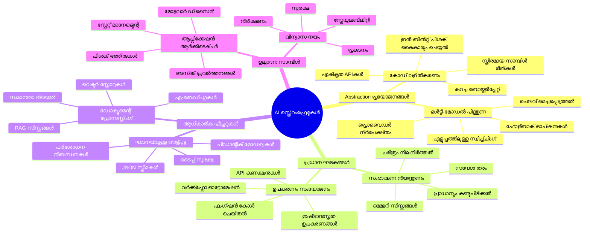
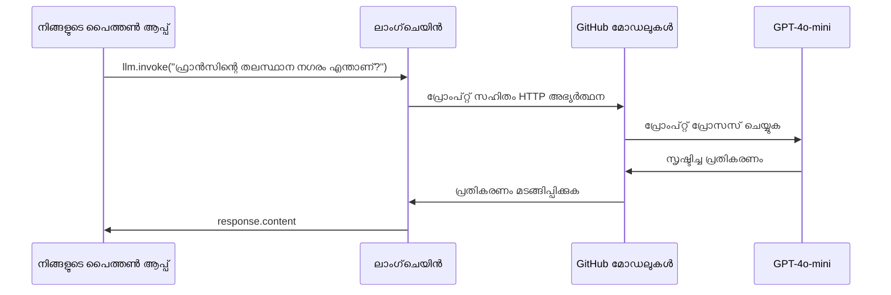
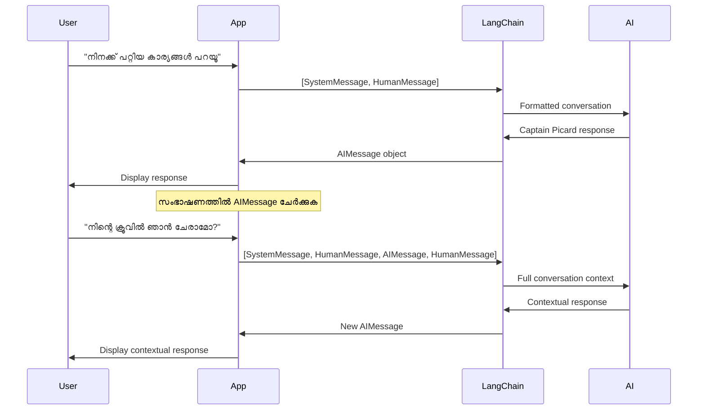
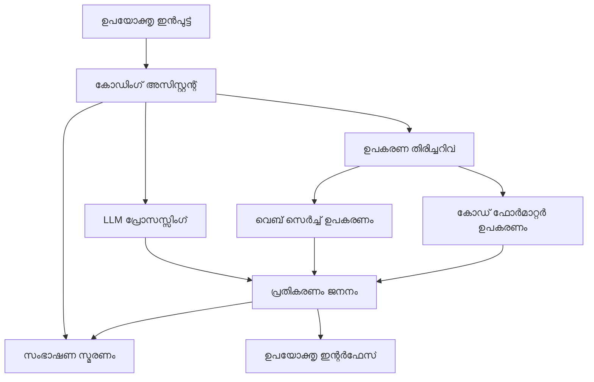
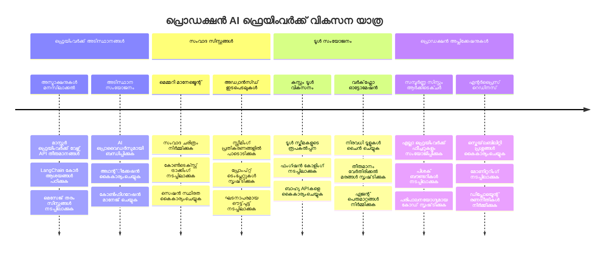
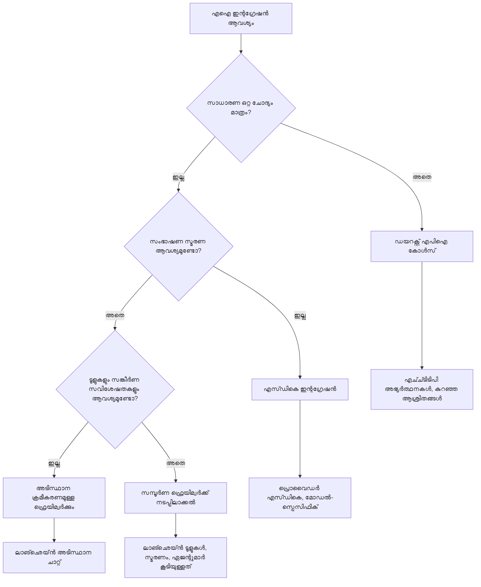

# AI ഫ്രെയിംവർക്ക്

ആരംഭത്തിൽ നിന്നുതൊട്ട് AI ആപ്പ്ലിക്കേഷനുകൾ നിർമ്മിക്കാൻ ശ്രമിക്കുമ്പോൾ overwhelmed ആകാറുണ്ടോ? നിങ്ങൾ ഒറ്റക്കല്ല! AI ഫ്രെയിംവർക്കുകൾ AI ഡവലപ്പ്മെന്റിന് വേണ്ടി സ്വിസ് ആർമി കൈയോപ്പിയായി - ബുദ്ധിമുട്ടുകൾ ഒഴിവാക്കി സമയവും ക്ഷീണം കുറയ്ക്കുന്ന ശക്തമായ ഉപകരണങ്ങൾ ആണ്. ഒരു AI ഫ്രെയിംവർക്കിനെ നന്നായി ക്രമീകരിച്ച ലൈബ്രറി പോലെ ചിന്തിക്കാം: ഇതിൽ പൂർവനിർമിത ഘടകങ്ങൾ, സ്റ്റാൻഡേർഡൈസ് ചെയ്ത API-കൾ, സ്മാര്ട്ട് അപ്‌ട്രാക്ഷനുകൾ ലഭിക്കുന്നു, ഇതുവഴി നിങ്ങൾക്ക് ഇമ്പ്ലിമെന്റേഷൻ വിശദാംശങ്ങളുമായി പൈരാറ്റം ചെയ്യാതെ പ്രശ്‌നങ്ങൾ നേരിടാനാകും.

ഈ പാഠത്തിൽ, LangChain പോലുള്ള ഫ്രെയിംവർക്കുകൾ എങ്ങനെ കോംപ്ലെക്സ് AI ഇൻറഗ്രേഷൻ ജോലികൾ പച്ച വെളുത്ത, വായിക്കാൻ എളുപ്പമുള്ള കോഡായി മാറ്റാമെന്ന് പരിശോധിക്കും. ചർച്ചകൾ ശ്രദ്ധയിൽ വയ്ക്കൽ, ടൂൾ കോളിംഗ് നടപ്പിലാക്കൽ, നിരവധി AI മോഡലുകൾ ഒരുമിച്ച് കൈകാര്യം ചെയ്യൽ എന്നിവ പോലുള്ള യഥാർത്ഥ പ്രശ്‌നങ്ങൾക്ക് എങ്ങനെ നേരിടാമെന്ന് കണ്ടെത്താം.

പാഠം അവസാനിക്കുമ്പോളും, നിങ്ങൾക്ക് എപ്പോഴാണ് ഫ്രെയിംവർക്കുകൾ ഉപയോഗിക്കേണ്ടത്, അവയുടെ അപ്‌ട്രാക്ഷനുകൾ എങ്ങനെ കാര്യക്ഷമമായി ഉപയോഗിക്കാം, യഥാർത്ഥ ഉപയോഗത്തിനായി തയ്യാറായ AI ആപ്പുകൾ എങ്ങനെ നിർമ്മിക്കാം എന്നിവ അറിയാം. നിങ്ങളുടെ പ്രോജക്ടുകൾക്കായി AI ഫ്രെയിംവർക്കുകൾ എന്ത് ചെയ്യാം എന്ന് കണ്ടെത്താം.

## ⚡ അടുത്ത 5 മിനിറ്റിൽ ചെയ്യാൻ ഉള്ളത്

**ബിസി ഡവലപ്പർമാർക്കായി ക്വിക്ക് സ്റ്റാർട്ട് പാത്ത്**


- **മിനിറ്റ് 1**: LangChain ഇൻസ്റ്റാൾ ചെയ്യുക: `pip install langchain langchain-openai`
- **മിനിറ്റ് 2**: നിങ്ങളുടെ GitHub ടോക്കൺ സജ്ജമാക്കുകയും ChatOpenAI ക്ലയന്റ് ഇംപോർട്ട് ചെയ്യുകയും ചെയ്യുക
- **മിനിറ്റ് 3**: സിസ്റ്റം, മനുഷ്യ സന്ദേശങ്ങളോടെ ഒരു ലളിതമായ സംഭാഷണം സൃഷ്ടിക്കുക
- **മിനിറ്റ് 4**: ഒരു അടിസ്ഥാന ടൂൾ (ഉദാ: add ഫംഗ്ഷൻ) ചേർക്കുക, AI ടൂൾ കോളിംഗ് കാണുക
- **മിനിറ്റ് 5**: റോ API കോൾസിനും ഫ്രെയിംവർക്ക് അപ്‌ട്രാക്ഷനും ഇടയിലെ വ്യത്യാസം അനുഭവിക്കുക

**ക്വിക് ടെസ്റ്റ് കോഡ്**:
```python
from langchain_openai import ChatOpenAI
from langchain_core.messages import SystemMessage, HumanMessage

llm = ChatOpenAI(
    api_key=os.environ["GITHUB_TOKEN"],
    base_url="https://models.github.ai/inference",
    model="openai/gpt-4o-mini"
)

response = llm.invoke([
    SystemMessage(content="You are a helpful coding assistant"),
    HumanMessage(content="Explain Python functions briefly")
])
print(response.content)
```

**ഏത് കാരണത്താൽ ഇത് സുപ്രധാനമാണ്**: 5 മിനിറ്റിനുള്ളിൽ, AI ഫ്രെയിംവർക്കുകൾ എങ്ങനെ കോംപ്ലെക്സ് AI ഇൻറഗ്രേഷൻ എളുപ്പമായ മാതോഡ് കോളുകളായി മാറ്റുന്നു എന്നൊരു അനുഭവം ലഭിക്കും. ഇത് പ്രൊഡക്ഷൻ AI ആപ്പുകൾക്കുള്ള അടിസ്ഥാനമാണ്.

## എന്തുകൊണ്ട് ഫ്രെയിംവർക്ക് തിരഞ്ഞെടുക്കണം?

നിങ്ങൾ AI ആപ്പ് നിർമ്മിക്കാൻ ഒരുങ്ങിയിരിക്കുകയാണ് - സന്ദർശനയോഗ്യം! എന്നാൽ ഇവിടെ നിരവധി വഴികളുള്ളതും അവയ്ക്ക് സ്വന്തം ഗുണദോഷങ്ങളുള്ളതും ആണ്. ഇത് നടക്കുന്നത് നടക്കുന്നതിനായി നടക്കുന്നതിനായി നടന്ന്, ബസിക്കിടയിലൂടെയോ ഡ്രൈവുചെയ്യുകയോ തിരഞ്ഞെടുക്കുന്നതുപോലെ ആണ് - എല്ലാം ലക്ഷ്യത്തെത്തിക്കും, പക്ഷെ അനുഭവവും പരിശ്രമവും വളരെ വ്യത്യസ്ഥമാണ്.

നിങ്ങളുടെ പ്രോജക്ടുകളിൽ AI എങ്ങനെ ഇന്റഗ്രേറ്റ് ചെയ്യാമെന്ന് മൂന്ന് പ്രധാന വിധികളിൽ വിശകലനം ചെയ്യാം:

| സമീപനം | ഗുണങ്ങൾ | മികച്ച ഉപയോ​ഗം | പരിഗണനകൾ |
|----------|------------|----------|--------------|
| **Direct HTTP Requests** | പൂർണ്ണ നിയന്ത്രണം, ആശ്രിതത്വം ഇല്ല | ലളിതമായ ചോദ്യങ്ങൾ, അടിസ്ഥാനങ്ങൾ പഠിക്കൽ | കൂടുതൽ നീളം വരുന്ന കോഡ്, മാനുവൽ എറർ കൈകാര്യം |
| **SDK Integration** | കുറവ് ബോയ്ലറ്പ്ലേറ്റ്, മോഡൽ-സ്പെസിഫിക് ഒപ്റ്റിമൈസേഷൻ | ഒറ്റ മോഡൽ ആപ്പുകൾ | പ്രത്യേക പ്രൊവൈഡർമാർക്കു പരിമിതമാണ് |
| **AI Frameworks** | ഏകീകൃത API, ഇൻബിൽറ്റ് അപ്‌ട്രാക്ഷനുകൾ | മൾട്ടി-മോഡൽ ആപ്പുകൾ, കോംപ്ലെക്സ് വർക്ക്‌ഫ്ളോക്സ് | പഠനവക്രം, അധിക അപ്‌ട്രാക്ഷൻ സാധ്യത |

### പ്രായോഗികമായി ഫ്രെയിംവർക്ക് ഗുണങ്ങൾ


**ഫ്രെയിംവർക്ക് എന്തുകൊണ്ട് പ്രധാനമാണ്:**
- **ഏകീകൃതമാക്കുന്നു** നിരവധി AI പ്രൊവൈഡർമാരെ ഒരു ഇന്റർഫേസിൽ
- **സംഭാഷണ മെമ്മറി** സ്വയം കൈകാര്യം ചെയ്യുന്നു
- **സാധാരണ ടാസ്ക്കുകൾക്കായി** റെഡി മെയ്ഡ് ടൂൾസ് നൽകുന്നു - embeddings, ഫംഗ്ഷൻ കോളിംഗ് തുടങ്ങിയവ
- **എറർ കൈകാര്യം** ചെയ്യൽ, റിറ്റ്രൈ ലോജിക്ക് കൈകാര്യം ചെയ്യുന്നു
- **കോംപ്ലെക്സ് വർക്ക്‌ഫ്ളോക്സ്** വായിക്കാവുന്ന മാതോഡ് കോളുകളാക്കി മാറ്റുന്നു

> 💡 **പ്രൊ ടിപ്പ്**: വ്യത്യസ്ത AI മോഡലുകൾ തമ്മിൽ മാറുമ്പോൾ, കോംപ്ലെക്സ് ഫീച്ചറുകൾ (എജന്റുകൾ, മെമ്മറി, ടൂൾ കോളിംഗ്) നിർമ്മിക്കുമ്പോൾ ഫ്രെയിംവർക്കുകളെ ഉപയോഗിക്കുക. അടിസ്ഥാനങ്ങൾ പഠിക്കുമ്പോൾ, ലളിതമായ, കൺസൻട്രേറ്റഡ് ആപ്പുകൾ നിർമ്മിക്കുമ്പോൾ നേരിട്ട് API-കൾ ഉപയോഗിക്കുക.

**മുൻനിര**: ഒരു സഹായിയുടെ പ്രത്യേക ടൂളുകൾക്കും മുഴുവൻ വർക്ക്‌ഷോപ്പിനും ഇടയിൽ തിരഞ്ഞെടുക്കുന്നതുപോലെ, ആവശ്യ സംഘം ടൂളുമായി പൊരുത്തം കാണിക്കുന്നതാണ്. കോംപ്ലെക്സ്, ഫീച്ചർ സമൃദ്ധ ആപ്പുകൾക്കായി ഫ്രെയിംവർക്കുകൾ ഉത്തമമാണ്, ലളിതമായ ഉപയോഗങ്ങൾക്കായി നേരിട്ട് API-കൾ നല്ലതാണ്.

## 🗺️ AI ഫ്രെയിംവർക്ക് മാസ്റ്ററിയിലേക്കുള്ള നിങ്ങളുടെ പഠന യാത്ര


**നിങ്ങളുടെ യാത്രയുടെ ലക്ഷ്യം**: ഈ പാഠം അവസാനിക്കുമ്പോൾ, നിങ്ങൾ AI ഫ്രെയിംവർക്കുകൾ അഭ്യസിച്ച് സമ്പന്നമായ, പ്രൊഡക്ഷൻ റെഡി AI ആപ്പുകൾ നിർമ്മിക്കാൻ കഴിയും, വ്യാപാര AI അസിസ്റ്റന്റിന് സമാനമായവ.

## പരിചയം

ഈ പാഠത്തിൽ നാം പഠിക്കുന്നതു:

- ഒരു പൊതുവായ AI ഫ്രെയിംവർക്ക് ഉപയോഗിക്കൽ
- ചാറ്റ് സംഭാഷണങ്ങൾ, ടൂൾ ഉപയോഗം, മെമ്മറി, കോൺടെക്സ്‌റ്റ് തുടങ്ങിയ പൊതുപ്രശ്‌നങ്ങൾχείമാറ്റം
- ഇതുപയോഗിച്ച് AI ആപ്പുകൾ സൃഷ്ടിക്കൽ

## 🧠 AI ഫ്രെയിംവർക്ക് ഡവലപ്പ്മെന്റ് ഇക്കോസിസ്റ്റം


**മൂല സിദ്ധാന്തം**: AI ഫ്രെയിംവർക്കുകൾ കോംപ്ലെക്സിറ്റി അപ്‌ട്രാക്ഷൻചെയ്യുന്നു, സംഭാഷണ മാനേജ്‌മെന്റ്, ടൂൾ ഇന്റഗ്രേഷൻ, ഡോക്യുമെന്റ് പ്രോസസിംഗ് എന്നിവയ്ക്കായി ശക്തമായ അപ്‌ട്രാക്ഷനുകൾ നൽകുന്നു, ഡവലപ്പർമാർക്ക് വ്യവസ്ഥാപിതവും പരിപാലനയോഗ്യവുമായ കോഡ് ഉപയോഗിച്ച് സുസ്ഥിര AI ആപ്പുകൾ നിർമ്മിക്കാനാകും.

## നിങ്ങളുടെ ആദ്യ AI പ്രംപ്റ്റ്

ആരംഭം അടിസ്ഥാനങ്ങളിൽ നിന്ന് ആരംഭിക്കാം: ആദ്യ AI ആപ്പ് സൃഷ്ടിക്കുക, ഒരു ചോദ്യമോൾക്കുകയും മറുപടി സ്വീകരിക്കകയും ചെയ്യുക. ആർക്കിമിഡീസ് തൻ്റെ കുളത്തിൽ നിർമ്മിതി ശാസ്ത്ര നിയമം കണ്ടെത്തിയത് പോലെ, ലളിതമായ നിരീക്ഷണങ്ങൾ ശക്തമായ洞ങ്ങൾ നൽകും - ഫ്രെയിംവർക്കുകൾ ആ洞ങ്ങൾ ആക്‌സസിബിള്‍ ആർക്കുന്നു.

### GitHub മോഡലുകളുമായി LangChain സജ്ജമാക്കൽ

LangChain ഉപയോഗിച്ച് GitHub മോഡലുകളുമായി ബന്ധിപ്പിക്കാം; ഇതിലൂടെ വിവിധ AI മോഡലുകൾക്ക് സൗജന്യമാർഗ്ഗം ലഭിക്കും. തുടക്കത്തിനായി വളരെ കുറച്ച് കോൺഫിഗറേഷൻ പാരാമീറ്ററുകൾ മാത്രം വേണ്ടിവരും:

```python
from langchain_openai import ChatOpenAI
import os

llm = ChatOpenAI(
    api_key=os.environ["GITHUB_TOKEN"],
    base_url="https://models.github.ai/inference",
    model="openai/gpt-4o-mini",
)

# ഒരു ലളിതമായ പ്രാംപ്റ്റ് അയയ്ക്കുക
response = llm.invoke("What's the capital of France?")
print(response.content)
```

**ഇവിടെ നടക്കുന്ന കാര്യങ്ങൾ വിശകലനം ചെയ്യൂ:**
- `ChatOpenAI` ക്ലാസ് ഉപയോഗിച്ച് LangChain ക്ലയന്റ് സൃഷ്ടിക്കുന്നു - നിങ്ങളുടെ AI ഉദ്‌വേഗദ്വാരം
- GitHub മോഡലുകളുമായി ബന്ധിപ്പിക്കുന്നതിന് നിങ്ങളുടെ ഓത്തരിസേഷൻ ടോക്കൺ ക്രമീകരിക്കുന്നു
- ഉപയോഗിക്കേണ്ട AI മോഡൽ വ്യക്തമാക്കുന്നു (`gpt-4o-mini`) - നിങ്ങളുടെ AI അസിസ്റ്റൻറെ തിരഞ്ഞെടുപ്പ്
- നിങ്ങളുടെ ചോദ്യവും `invoke()` മാതോഡും വഴി അയയ്ക്കുന്നു - മാജിക് ഇവിടെ നടക്കുന്നു
- മറുപടി എടുക്കുകയും പ്രദർശിപ്പിക്കുകയും ചെയ്യുന്നു - നിങ്ങൾ AI-യോട് സംഭാഷണം തുടങ്ങുന്നു!

> 🔧 **സജ്ജീകരണ കുറിപ്പ്**: GitHub Codespaces ഉപയോഗിച്ചാൽ `GITHUB_TOKEN` ഇതിനകം ക്രമീകരിച്ചിരിക്കുന്നു! ലൊക്കലായി ജോലി ചെയ്യുന്നുവെങ്കിൽ, അനുയോജ്യമായ അനുമതികളോടെ പേഴ്സണൽ ആക്സസ് ടോക്കൺ സൃഷ്ടിക്കേണ്ടതുണ്ട്.

**പ്രതീക്ഷിക്കാവുന്ന ഔട്ട്പുട്ട്:**
```text
The capital of France is Paris.
```


## സംഭാഷണ AI നിർമ്മാണം

ആദ്യം ഉദാഹരണം അടിസ്ഥാനം കാണിക്കുന്നു, എന്നാൽ അത് ഒറ്റത് കാര്യമാണ് - നിങ്ങൾ ചോദ്യമോൾക്കും, മറുപടി കിട്ടും, അതിങ്ങനെ. യഥാർത്ഥ ആപ്പുകളിൽ, AI നിങ്ങളുടെ ചർച്ചകളെ ഓർക്കേണ്ടതാണ്, വാട്ട്സൺ, ഹോംസ് പോലുള്ളവർ നടത്തിയ പോലുള്ള അന്വേഷണം സംഭാഷണങ്ങൾ പോലെ.

ഇവിടെ LangChain വളരെപ്രയോജനപ്പെടുന്നു. അത് വ്യത്യസ്ത സന്ദേശ തരം നൽകുന്നു, വിഭാഗീകരിച്ച സംഭാഷണങ്ങൾ കൊടുക്കാനും AI-ക് വ്യക്തിത്വം നൽകാനുമുണ്ട്. കൺടെക്സ്‌റ്റ്, കഥാപാത്രങ്ങൾ നിലനിർത്തുന്ന ചാറ്റ് അനുഭവങ്ങൾ നിർമ്മിയ്ക്കാം.

### സന്ദേശ തരം മനസിലാക്കൽ

സന്ദേശ തരം ഇടപെടുന്നവർ എല്ലാ "തൊപ്പികൾ" അണിയുന്നത് പോലെയാണ്. LangChain വ്യത്യസ്ത സന്ദേശ ക്ലാസ്സുകൾ ഉപയോഗിച്ച് ആരാണ് എന്ത് പറയുന്നത് എന്നാണ് ട്രാക്ക് ചെയ്യുന്നത്:

| സന്ദേശ തരം | ലക്ഷ്യം | ഉദാഹരണ ഉപയോഗം |
|--------------|---------|------------------|
| `SystemMessage` | AI വ്യക്തിത്വവും പെരുമാറ്റവും നിർവ്വചിക്കുന്നു | "നീ ഒരു സഹായക കോഡിംഗ് അസിസ്റ്റന്റ് ആണ്" |
| `HumanMessage` | ഉപഭോക്താവ് നൽകുന്ന ഇൻപുട്ട് | "ഫംഗ്ഷനുകൾ എങ്ങനെ പ്രവർത്തിക്കുന്നു വിശദീകരിക്കുക" |
| `AIMessage` | AI മറുപടികൾ സൂക്ഷിക്കുന്നു | മുൻപ് ഉണ്ടായ AI റസ്പോൺസുകൾ സംഭാഷണത്തിൽ |

### നിങ്ങളുടെ ആദ്യ സംഭാഷണം സൃഷ്ടിക്കൽ

AI ഒരു പ്രത്യേക ಪಾತ್ರം ഏറ്റെടുക്കുന്ന സംഭാഷണം സൃഷ്ടിക്കാം. ക്യാപ്റ്റൻ പികാർഡ് എന്ന വ്യക്തിത്വം വഹിക്കും - തത്ത്വചിന്തനക്ഷമയായ, ലീഡർഷിപ്പ് ഉള്ള കഥാപാത്രം:

```python
messages = [
    SystemMessage(content="You are Captain Picard of the Starship Enterprise"),
    HumanMessage(content="Tell me about you"),
]
```

**ഈ സംഭാഷണം സജ്ജീകരണം വിസ്താരമാക്കുക:**
- `SystemMessage` വഴി AI വേഷവും വ്യക്തിത്വവും സ്ഥാപിക്കുന്നു
- `HumanMessage` മായി ആദ്യം ഉപഭോക്തൃ ചോദ്യമെത്തിക്കുന്നു
- മൊത്തം പല ടേണുകളുള്ള സംഭാഷണത്തിന് അടിത്തറ ഒരുക്കുന്നു

പൂർണ്ണ കോഡ് ഇങ്ങനെ കാണപ്പെടും:

```python
from langchain_core.messages import HumanMessage, SystemMessage
from langchain_openai import ChatOpenAI
import os

llm = ChatOpenAI(
    api_key=os.environ["GITHUB_TOKEN"],
    base_url="https://models.github.ai/inference",
    model="openai/gpt-4o-mini",
)

messages = [
    SystemMessage(content="You are Captain Picard of the Starship Enterprise"),
    HumanMessage(content="Tell me about you"),
]


# പ്രവൃത്തിക്കുന്നു
response  = llm.invoke(messages)
print(response.content)
```

നിങ്ങൾ കാണേണ്ട സമയം:

```text
I am Captain Jean-Luc Picard, the commanding officer of the USS Enterprise (NCC-1701-D), a starship in the United Federation of Planets. My primary mission is to explore new worlds, seek out new life and new civilizations, and boldly go where no one has gone before. 

I believe in the importance of diplomacy, reason, and the pursuit of knowledge. My crew is diverse and skilled, and we often face challenges that test our resolve, ethics, and ingenuity. Throughout my career, I have encountered numerous species, grappled with complex moral dilemmas, and have consistently sought peaceful solutions to conflicts.

I hold the ideals of the Federation close to my heart, believing in the importance of cooperation, understanding, and respect for all sentient beings. My experiences have shaped my leadership style, and I strive to be a thoughtful and just captain. How may I assist you further?
```

സംഭാഷണ തുടർച്ച നിലനിര്‍ത്തുവാൻ (ഓരോ തവണ കോൺടെക്സ്‌റ്റ് റീസെറ്റ് ചെയ്യാതിരിക്കാൻ), മറുപടികൾ നിങ്ങളുടെ സന്ദേശ പട്ടികയിൽ തുടർച്ചയായി ചേർക്കണം. മുന്നൂറു വർഷങ്ങൾക്ക് മുകൾ oral പരമ്പരാഗത കഥകളെ സൂക്ഷിച്ച പോലെ, ഇത് ദീർഘകാല ഓർമ്മ സൃഷ്ടിക്കുന്നു:

```python
from langchain_core.messages import HumanMessage, SystemMessage
from langchain_openai import ChatOpenAI
import os

llm = ChatOpenAI(
    api_key=os.environ["GITHUB_TOKEN"],
    base_url="https://models.github.ai/inference",
    model="openai/gpt-4o-mini",
)

messages = [
    SystemMessage(content="You are Captain Picard of the Starship Enterprise"),
    HumanMessage(content="Tell me about you"),
]


# പ്രവർത്തിക്കുന്നു
response  = llm.invoke(messages)

print(response.content)

print("---- Next ----")

messages.append(response)
messages.append(HumanMessage(content="Now that I know about you, I'm Chris, can I be in your crew?"))

response  = llm.invoke(messages)

print(response.content)

```

സുഖകരമായത് അല്ലേ? നമ്മൾ രണ്ടു സന്ദേശങ്ങൾ മാത്രമുള്ള LLM നെ ആദ്യമായി വിളിക്കുന്നു, പിന്നീട് മുഴുവൻ സംഭाषണ ചരിത്രത്തോടെയും. വെറുതെ നോക്കുമ്പോൾ AI സംഭാഷണത്തില്‍ പങ്കെടുത്ത പോലെ അനുഭവപ്പെടും!

ഈ കോഡ് ഓടിക്കുമ്പോൾ നിങ്ങൾക്ക് രണ്ടാം മറുപടി ഇങ്ങനെ ആകാം:

```text
Welcome aboard, Chris! It's always a pleasure to meet those who share a passion for exploration and discovery. While I cannot formally offer you a position on the Enterprise right now, I encourage you to pursue your aspirations. We are always in need of talented individuals with diverse skills and backgrounds. 

If you are interested in space exploration, consider education and training in the sciences, engineering, or diplomacy. The values of curiosity, resilience, and teamwork are crucial in Starfleet. Should you ever find yourself on a starship, remember to uphold the principles of the Federation: peace, understanding, and respect for all beings. Your journey can lead you to remarkable adventures, whether in the stars or on the ground. Engage!
```


അതിൽ ഞാൻ "ശായാദാ" എന്നനിലവാരമാണ് ;)

## സ്ട്രീമിംഗ് മറുപടികൾ

ChatGPT തൊടർച്ചയിൽ മറുപടികൾ "ടൈപ്പ്" ചെയ്യുന്ന പോലെ തോന്നിയിട്ടുണ്ടോ? അത് സ്ട്രീമിംഗ് പ്രവർത്തനമാണ്. ഒരു പരിചയസമ്പന്നനായ ഹസ്തകലാകാരൻ എഴുത്ത് സൃഷ്ടിക്കുന്ന പോലെ — അക്ഷരങ്ങൾ തൻ്റെ strokes ആയി ദൃശ്യമാകുന്നത് — സ്ട്രീമിംഗ് ഇടപെടൽ സ്വാഭാവികമാക്കുകയും ഉടനടി ഫീഡ്‌بാക്ക് നൽകുകയും ചെയ്യുന്നു.

### LangChain ഉപയോഗിച്ച് സ്ട്രീമിംഗ് നടപ്പിലാക്കൽ

```python
from langchain_openai import ChatOpenAI
import os

llm = ChatOpenAI(
    api_key=os.environ["GITHUB_TOKEN"],
    base_url="https://models.github.ai/inference",
    model="openai/gpt-4o-mini",
    streaming=True
)

# പ്രതികരണം സ്റ്റ്രീമിംഗ് ചെയ്യുക
for chunk in llm.stream("Write a short story about a robot learning to code"):
    print(chunk.content, end="", flush=True)
```

**സ്ട്രീമിംഗ് എത്ര മനോഹരം:**
- **ഉണ്ടാകുമ്പോൾ** ഉള്ളടക്കം കാണിക്കുന്നു - കാത്തിരിപ്പിൽ ഇനി വൈകണ്ട!
- **ഉപയോക്താക്കളെ** യാഥാർത്ഥ്യത്തിൽ ഇടപെടുന്നതുപോലെ അനുഭവമാക്കുന്നു
- **സാങ്കേതികമായി ഇരിക്കുമ്പോഴും** വേഗമേറിയതു പോലെ തോന്നുന്നു
- **AI "ചിന്തിക്കുന്ന" സമയത്ത്** ഉപയോക്താക്കൾക്ക് വായന ആരംഭിക്കാൻ അനുവദിക്കുന്നു

> 💡 **ഉപയോക്തൃ അനുഭവം ടിപ്പ്**: കോഡ് വിശദീകരണമുകൾ, സൃഷ്ടിമാന ലേഖനം, വിവരണംtutorials പോലെയുള്ള ദീർഘ മറുപടികൾക്കായി സ്ട്രീമിംഗ് വളരെയും പ്രസക്തമാണ്. ഉപയോക്താക്കൾ കാത്തിരിപ്പ് കാണാതെ പുരോഗതി കാണാൻ ഇഷ്ടപ്പെടും!

### 🎯 പാഠാധിഷ്ഠിത പരിശോധന: ഫ്രെയിംവർക്ക് അപ്‌ട്രാക്ഷൻ ഗുണങ്ങൾ

**താമസിച്ച് ചിന്തിക്കുക**: നിങ്ങൾ ഇപ്പോൾ AI ഫ്രെയിംവർക്ക് അപ്‌ട്രാക്ഷനുകളുടെ ശക്തി അനുഭവിച്ചിട്ടുണ്ട്. മുൻ പാഠങ്ങളിൽ നിന്ന് ലഭിച്ചിരിക്കുന്ന റോ API കോൾസുമായി താരതമ്യം ചെയ്യുക.

**കുറഞ്ഞ സമയം സ്വയം വിലയിരുത്തൽ**:
- LangChain മെസേജ് ട്രാക്കിംഗുമായി താരതമ്യംചെയ്‌താൽ സംഭാഷണ മാനേജ്മെന്റ് എങ്ങനെ ലളിതമാക്കുന്നു?
- `invoke()` ഉം `stream()` ഉം തമ്മിലുള്ള വ്യത്യാസം എന്ത്, രണ്ട് രീതികളും എപ്പോൾ ഉപയോഗിക്കുന്നു?
- ഫ്രെയിംവർക്കിന്റെ മെസേജ് സിസ്റ്റം കോഡ് ഓർഗനൈസേഷൻ എങ്ങനെ മെച്ചപ്പെടുത്തുന്നു?

**യഥാർത്ഥ ലോക ബന്ധം**: നിങ്ങൾ പഠിച്ച അപ്‌ട്രാക്ഷൻ പാറ്റേണുകൾ (മെസേജ് തരങ്ങൾ, സ്ട്രീമിംഗ് ഇന്റർഫേസുകൾ, സംഭാഷണ മെമ്മറി) എല്ലാ വലിയ AI ആപ്പ് സംവിധാനങ്ങളിലും ഉപയോഗിക്കുന്നു - ChatGPT ഇന്റർഫേസിൽ നിന്നും GitHub Copilot കോഡ് അസിസ്റ്റൻസിലേക്കും. നിങ്ങൾ പ്രൊഫഷണൽ AI സംഘങ്ങൾ ഉപയോഗിക്കുന്ന സമാന ആർക്കിടെക്‌ചറൽ മാതൃകകൾ നൈപുണ്യത്തോടെ കൈകാര്യം ചെയ്യുന്നു.

**ചിട്ടപ്പെട്ട ചോദ്യം**: വിവിധ AI മോഡൽ പ്രൊവൈഡർമാരെ (OpenAI, Anthropic, Google) ഏക ഐഫേസിൽ കൈകാര്യം ചെയ്യുന്ന ഫ്രെയിംവർക്ക് അപ്‌ട്രാക്ഷൻ നിങ്ങൾ എങ്ങനെ രൂപകൽപ്പന ചെയ്യും? ഗുണങ്ങളും trade-off-കളും ശ്രദ്ധിക്കുക.

## പ്രംപ്റ്റ് ടെംപ്ലേറ്റുകൾ

പ്രംപ്റ്റ് ടെംപ്ലേറ്റുകൾ ശ്രോതസ്സിനനുസരിച്ച് പ്രസംഗ മാതൃകകൾ പോലെയാണ് - സിസേരോ പാരമ്പര്യങ്ങളിൽ ഭിന്നപാലകർക്കായി തന്റെ പ്രസംഗ ശൈലികൾ മാറ്റിയപ്പോൾ പോലെ. ഇതുപയോഗിച്ച് ഒരിക്കൽ ടെംപ്ലേറ്റ് ക്രമീകരിച്ച്, പല വിവരങ്ങൾക്കും പകരംകെട്ടി മറ്റെല്ലാം വീണ്ടും എഴുതാതിരിക്കും. നിങ്ങൾ ആവശ്യമായ മൂല്യങ്ങൾ മറിയുള്ളവയടക്കാൻ ടർണുകൾ മാത്രം പൂരിപ്പിക്കും.

### പുനഃഉപയോഗ പാടുകൾ സൃഷ്ടിക്കൽ

```python
from langchain_core.prompts import ChatPromptTemplate

# കോഡ് وضഹിക്കാൻ ഒരു ടേംപ്ലേറ്റ് നിർവ്വചിക്കൂ
template = ChatPromptTemplate.from_messages([
    ("system", "You are an expert programming instructor. Explain concepts clearly with examples."),
    ("human", "Explain {concept} in {language} with a practical example for {skill_level} developers")
])

# വ്യത്യസ്ത മൂല്യങ്ങളുമായി ടേംപ്ലേറ്റ് ഉപയോഗിക്കൂ
questions = [
    {"concept": "functions", "language": "JavaScript", "skill_level": "beginner"},
    {"concept": "classes", "language": "Python", "skill_level": "intermediate"},
    {"concept": "async/await", "language": "JavaScript", "skill_level": "advanced"}
]

for question in questions:
    prompt = template.format_messages(**question)
    response = llm.invoke(prompt)
    print(f"Topic: {question['concept']}\n{response.content}\n---\n")
```

**നീങ്ങൾ ടെംപ്ലേറ്റുകൾ ഇഷ്ടപ്പെടുന്നത് എന്തുകൊണ്ട്:**
- **നിങ്ങളുടെ പ്രംപ്റ്റുകൾ എല്ലാവിടത്തും സുസ്ഥിരം ആക്കുന്നു**
- **ക ric സ്റ്റ്രിങ് കൂട്ടിച്ചേർക്കൽ ഇല്ല - ശുദ്ധവും ലളിതവുമായ variables**
- **നിങ്ങളുടെ AI പ്രവൃത്തി പ്രവാസ്ഥയായി പെരുമാറുന്നു, ഘടന ഓരോപ്പോഴും സമാനമാണ്**
- **അപ്ഡേറ്റുകൾ എളുപ്പം - ടെംപ്ലേറ്റ് ഒറ്റ തവണ മാറ്റുക, എല്ല സ്ഥലങ്ങളിലും പ്രയോജനപ്പെടുന്നു**

## ഘടനാപരമായ ഔട്ട്പുട്ട്

AI മറുപടികൾ അന്യസംവിധാനമായ ടെക്സ്റ്റായി വന്നാൽ parsing ചെയ്യുക ബുദ്ധിമുട്ടാണവ എന്നിട്ടുണ്ടോ? ഘടനാപരമായ ഔട്ട്പുട്ട് നിങ്ങളുടെ AI-യെ ലിനിയസ് ഉപയോഗിച്ച ജീവശാസ്ത്ര വർഗ്ഗീകരണ മാതൃകയെപോലെ അനുകൂലിതവും പ്രവാസ്ഥവും ഉള്ള രീതിയിൽ പ്രവർത്തിപ്പിക്കൽ ആണ്. JSON, പ്രത്യേക ഡാറ്റാ ഘടനകൾ, ആവശ്യമുള്ള ഫോർമാറ്റിൽ നിങ്ങൾ അപേക്ഷിക്കാം.

### ഔട്ട്പുട്ട് സ്കീമകൾ നിർവ്വചിക്കൽ

```python
from langchain_core.prompts import ChatPromptTemplate
from langchain_core.output_parsers import JsonOutputParser
from pydantic import BaseModel, Field

class CodeReview(BaseModel):
    score: int = Field(description="Code quality score from 1-10")
    strengths: list[str] = Field(description="List of code strengths")
    improvements: list[str] = Field(description="List of suggested improvements")
    overall_feedback: str = Field(description="Summary feedback")

# പാർസർ സജ്ജമാക്കുക
parser = JsonOutputParser(pydantic_object=CodeReview)

# ഫോർമാറ്റ് നിർദേശങ്ങളോടൊത്ത് പ്രൊംപ്റ്റ് സൃഷ്‌ടിക്കുക
prompt = ChatPromptTemplate.from_messages([
    ("system", "You are a code reviewer. {format_instructions}"),
    ("human", "Review this code: {code}")
])

# നിർദേശങ്ങളോടൊപ്പം പ്രൊംപ്റ്റ് ഫോർമാറ്റ് ചെയ്യുക
chain = prompt | llm | parser

# ഘടിതപ്പെട്ട പ്രതികരണം ലഭിക്കുക
code_sample = """
def calculate_average(numbers):
    return sum(numbers) / len(numbers)
"""

result = chain.invoke({
    "code": code_sample,
    "format_instructions": parser.get_format_instructions()
})

print(f"Score: {result['score']}")
print(f"Strengths: {', '.join(result['strengths'])}")
```

**ഘടനാപരമായ ഔട്ട്പുട്ട് ഗെയിം-ചേഞ്ചർ എന്തുകൊണ്ട് ആണെന്ന്:**
- **ഏതു ഫോർമാറ്റ് വരും എന്ന് ഇനി അനുമാനിക്കേണ്ടി വരൂ - ഓരോ തവണയും സ്ഥിരതയുള്ളതാണ്**
- **ഡാറ്റാബേസുകൾക്കും API-കൾക്കും നേരിട്ട് plug ചെയ്യാം**
- **പ്രതീക്ഷിക്കാത്ത AI മറുപടികൾ തടയുന്നു, ആപ്പിൽ തകരാറുകൾ കുറയ്ക്കുന്നു**
- **നിങ്ങൾ കൈകാര്യം ചെയ്യുന്ന വസ്തുക്കൾ നന്നായി അറിയുന്നതിനാൽ കോഡ് ശുദ്ധിയാകും**

## ടൂൾ കോളിംഗ്

ഇപ്പോൾ ഏറ്റവും ശക്തമായ ഫീച്ചറുകളിലൊന്നായി കടന്നു. ടൂളുകളാണ്. ഇത് AI-ന്റെ സംഭാഷണം മുടങ്ങാതെ പ്രായോഗിക ശേഷികൾ നൽകുന്നു. മദ്ധ്യകാല ഗിൽഡുകൾ പ്രത്യേക ശില്പങ്ങളിൽ ടൂളുകൾ വികസിപ്പിച്ചതുപോലെ, നിങ്ങൾ നിങ്ങളുടെ AI-യ്ക്ക് ലക്ഷ്യമിട്ട ഉപകരണങ്ങൾ നൽകും. ലഭ്യമായ ടൂളുകൾ വ്യക്തമാക്കും, ആരോ അതിനനുസരിച്ച് ആവശ്യപ്പെടുമ്പോൾ AI നടപടി എടുക്കും.

### Python ഉപയോഗം

ചെല്ലാം ടൂളുകൾ ഇങ്ങനെ ചേർക്കാം:

```python
from typing_extensions import Annotated, TypedDict

class add(TypedDict):
    """Add two integers."""

    # അനോട്ടേഷനുകൾക്കു ടൈപ്പ് ഉണ്ടായിരിക്കണം കൂടാതെ ഓപ്ഷണലായി ഒരു ഡിഫോൾട്ട് മൂല്യവും വിവരണവും (ആ ഓർഡറിൽ) ഉൾപ്പെടുത്താവുന്നതാണ്.
    a: Annotated[int, ..., "First integer"]
    b: Annotated[int, ..., "Second integer"]

tools = [add]

functions = {
    "add": lambda a, b: a + b
}
```

ഇവിടെ എന്ത് നടക്കുന്നു? `add` എന്ന ടൂളിന് ബ്ലൂപ്രിന്റ് സൃഷ്ടിക്കുന്നു. `TypedDict` -ൽ നിന്ന് പൈതൃകം വാങ്ങിയും `a`, `b`-ക്കുള്ള നല്ല `Annotated` ടൈപ്പുകൾ നൽകി, LLM-ന്റെ ടൂളിന്റെ പ്രവർത്തനം എന്താണോ അതും ആവശ്യവുമെന്താണെന്ന് വ്യക്തമാക്കുന്നു‌. `functions` നാവ്‌ഡിക്ഷനറി നമ്മുടെ ടൂൾബോക്‌സുപോലെയാണ് - AI നിർദേശിക്കുമ്പോൾ എന്ത് ചെയ്‌താൽ എന്ന് കോഡ് അറിയുന്നു.

അടുത്തത് ടൂളുമായി LLM ഉയർന്ന രീതിയിലേ_calling ചെയ്യും എന്നതാണ്:

```python
llm = ChatOpenAI(
    api_key=os.environ["GITHUB_TOKEN"],
    base_url="https://models.github.ai/inference",
    model="openai/gpt-4o-mini",
)

llm_with_tools = llm.bind_tools(tools)
```

നാം `tools` അരയുമായി `bind_tools` വിളിക്കുന്നു, ഇതിലൂടെ LLM `llm_with_tools` ഈ ടൂൾ അറിയുന്നതായി മാറും.

ഈ പുതിയ LLM ഉപയോഗിക്കാൻ താഴെയുള്ള കോഡ് ടൈപ്പ് ചെയ്യാം:

```python
query = "What is 3 + 12?"

res = llm_with_tools.invoke(query)
if(res.tool_calls):
    for tool in res.tool_calls:
        print("TOOL CALL: ", functions[tool["name"]](../../../10-ai-framework-project/**tool["args"]))
print("CONTENT: ",res.content)
```

ഇപ്പോൾ `invoke` പുതിയ tools ഉള്ള ല്ലമ്മിൽ വിളിക്കുമ്പോൾ, `tool_calls` പ്രോപ്പർട്ടി പൂരിപ്പിച്ചിരിക്കാം. തിരിച്ചറിയപ്പെട്ട ഏതെങ്കിലും ടൂളിനും `name` ഉം `args` ഉം കൊടുത്തിരിക്കും, അതിന്റെ പേരും എടുക്കേണ്ട അവയവങ്ങളും വ്യക്തമാക്കുന്നു. പൂർണ്ണ കോഡ് ഇങ്ങനെ കാണപ്പെടും:

```python
from langchain_core.messages import HumanMessage, SystemMessage
from langchain_openai import ChatOpenAI
import os
from typing_extensions import Annotated, TypedDict

class add(TypedDict):
    """Add two integers."""

    # അനോട്ടേഷനുകൾക്ക് തരം ഉണ്ടായിരിക്കണം, കൂടാതെ ঐച്ഛികമായി ഒരു ഡിഫോൾട്ട് മൂല്യവും വിവരണവും ഉൾപ്പെടുത്താം (ആ ക്രമത്തിൽ).
    a: Annotated[int, ..., "First integer"]
    b: Annotated[int, ..., "Second integer"]

tools = [add]

functions = {
    "add": lambda a, b: a + b
}

llm = ChatOpenAI(
    api_key=os.environ["GITHUB_TOKEN"],
    base_url="https://models.github.ai/inference",
    model="openai/gpt-4o-mini",
)

llm_with_tools = llm.bind_tools(tools)

query = "What is 3 + 12?"

res = llm_with_tools.invoke(query)
if(res.tool_calls):
    for tool in res.tool_calls:
        print("TOOL CALL: ", functions[tool["name"]](../../../10-ai-framework-project/**tool["args"]))
print("CONTENT: ",res.content)
```

ഈ കോഡ് ഓടിക്കുമ്പോൾ, നിങ്ങൾക്ക് സമാനമായ output കാണണം:

```text
TOOL CALL:  15
CONTENT: 
```

AI "What is 3 + 12" പരിശോധിച്ചു, ഇത് `add` ടൂളിന്റെ ടാസ്ക് എന്ന് തിരിച്ചറിഞ്ഞു. ഒരു പരിചയസമ്പന്നനായ ലൈബ്രേറിയൻ ചോദ്യം തരം മനസ്സിലാക്കി അനുയോജ്യമായ റഫറൻസ് കണ്ടെത്തുന്നതുപോലെ, ടൂൾ നാമം, വിവരണം, ഫീൽഡ് സ്പെസിഫിക്കേഷനുകൾ നിർണ്ണയമായി. ഫലം 15 നമ്മുടെ `functions` ഡിക്ഷനറി ഉപയോഗിച്ച് ടൂൾ എക്സിക്യൂട്ട് ചെയ്ത് ലഭിച്ചു:

```python
print("TOOL CALL: ", functions[tool["name"]](../../../10-ai-framework-project/**tool["args"]))
```

### വെബ് API കോളിങ് ചെയ്യുന്ന കൂടുതൽ ആകർഷകമായ ഒരു ടൂൾ
പറയാനുള്ളത് നമ്പറുകൾ കൂട്ടിച്ചേർക്കലിലൂടെ ആശയം പ്രകടിപ്പിക്കുകയാണ്, പക്ഷേ യാഥാർത്ഥ്യത്തിലെ ഉപകരണങ്ങൾ സാധാരണയായി വെബ് APIകൾ വിളിക്കുന്നത് പോലെയുള്ള കൂടുതൽ സങ്കീർണമായ പ്രവർത്തനങ്ങൾ നിർവഹിക്കുന്നു. ടെലിഗ്രാഫ് ഓപ്പറേറ്റർമാർ ഒരിക്കൽ അകലെയുള്ള സ്ഥലങ്ങളെ ബന്ധിപ്പിച്ചതുപോലെ, ഇന്റർനെറ്റിൽ നിന്നുള്ള ഉള്ളടക്കം എഐ എടുക്കുന്ന വിധം നമ്മുടെ ഉദാഹരണം വികസിപ്പിക്കാം:

```python
class joke(TypedDict):
    """Tell a joke."""

    # അണുകളには തരം ഉണ്ടായിരിക്കണം, നിശ്ചിത മൂല്യം மற்றும் വിവരണം (ആ ക്രമത്തിൽ) ഓപ്ഷണൽ ആയി ഉൾപ്പെടുത്താം.
    category: Annotated[str, ..., "The joke category"]

def get_joke(category: str) -> str:
    response = requests.get(f"https://api.chucknorris.io/jokes/random?category={category}", headers={"Accept": "application/json"})
    if response.status_code == 200:
        return response.json().get("value", f"Here's a {category} joke!")
    return f"Here's a {category} joke!"

functions = {
    "add": lambda a, b: a + b,
    "joke": lambda category: get_joke(category)
}

query = "Tell me a joke about animals"

# ബാക്കി കോഡ് ഒരേവിധം ആണ്
```

നിങ്ങൾ ഇപ്പോൾ ഈ കോഡ് പ്രവർത്തിപ്പിച്ചാൽ താഴെ പറയുന്ന പോലൊരു പ്രതികരണം കിട്ടും:

```text
TOOL CALL:  Chuck Norris once rode a nine foot grizzly bear through an automatic car wash, instead of taking a shower.
CONTENT:  
```

```mermaid
flowchart TD
    A[ഉപയോക്തൃ ചോദ്യം: "ജീവികൾക്കുറിച്ച് ഒരു തമാശ പറയൂ"] --> B[LangChain വിശകലനം]
    B --> C{ടൂൾ ലഭ്യമാണ്?}
    C -->|അതെ| D[തമാശാ ടൂൾ തിരഞ്ഞെടുക്കുക]
    C -->|ഇല്ല| E[സഹായം തത്സമയം സൃഷ്ടിക്കുക]
    
    D --> F[പരാമീറ്റർ പിഴയാള്‍ത്തുക]
    F --> G[തമാശ വിളിക്കുക(category="animals")]
    G --> H[chucknorris.io-ലേക്ക് API അഭ്യർത്ഥന]
    H --> I[തമാശാ ഉള്ളടക്കം തിരിച്ച് നൽകുക]
    I --> J[ഉപയോക്താവിന് കാണിക്കുക]
    
    E --> K[AI-ജനിത മറുപടി]
    K --> J
    
    subgraph "ടൂൾ നിർവ്വചനം നില"
        L[TypedDict സ്കീമ]
        M[ഫംഗ്ഷൻ നടപ്പാക്കൽ]
        N[പരാമീറ്റർ സാധുത പരിശോധിക്കൽ]
    end
    
    D --> L
    F --> N
    G --> M
```
കോഡ് മുഴുവനായും കാണാം:

```python
from langchain_openai import ChatOpenAI
import requests
import os
from typing_extensions import Annotated, TypedDict

class add(TypedDict):
    """Add two integers."""

    # പരിചങ്ങിയതിനു ടൈപ്പ് വേണം, ഇച്ഛാനുസരിച്ചു ഒരു ഡിഫോൾട്ട് മൂല്യം കൂടാതെ വിവരണം ഉൾപ്പെടുത്താം (അവിടെ ക്രമത്തിൽ).
    a: Annotated[int, ..., "First integer"]
    b: Annotated[int, ..., "Second integer"]

class joke(TypedDict):
    """Tell a joke."""

    # പരിചങ്ങിയതിനു ടൈപ്പ് വേണം, ഇച്ഛാനുസരിച്ചു ഒരു ഡിഫോൾട്ട് മൂല്യം കൂടാതെ വിവരണം ഉൾപ്പെടുത്താം (അവിടെ ക്രമത്തിൽ).
    category: Annotated[str, ..., "The joke category"]

tools = [add, joke]

def get_joke(category: str) -> str:
    response = requests.get(f"https://api.chucknorris.io/jokes/random?category={category}", headers={"Accept": "application/json"})
    if response.status_code == 200:
        return response.json().get("value", f"Here's a {category} joke!")
    return f"Here's a {category} joke!"

functions = {
    "add": lambda a, b: a + b,
    "joke": lambda category: get_joke(category)
}

llm = ChatOpenAI(
    api_key=os.environ["GITHUB_TOKEN"],
    base_url="https://models.github.ai/inference",
    model="openai/gpt-4o-mini",
)

llm_with_tools = llm.bind_tools(tools)

query = "Tell me a joke about animals"

res = llm_with_tools.invoke(query)
if(res.tool_calls):
    for tool in res.tool_calls:
        # print("ഉപകരണം വിളിക്കുക: ", tool)
        print("TOOL CALL: ", functions[tool["name"]](../../../10-ai-framework-project/**tool["args"]))
print("CONTENT: ",res.content)
```

## എംബെഡിംഗുകളും ഡോക്യുമെന്റ് പ്രോസസ്സിംഗും

എംബെഡിംഗുകൾ ആധുനിക എഐയിലെ ഏറ്റവും മനോഹരമായ പരിഹാരങ്ങളിൽ ഒന്നാണ്. നിങ്ങൾക്ക് ഏതെങ്കിലും ടെക്സ്റ്റ് എടുത്ത് അതിന്റെ അർത്ഥം പിടിച്ചു കൊണ്ടുള്ള സംഖ്യാത്മക കോഓർഡിനേറ്റുകളായി മാറ്റാൻ കഴിയുമെന്നു നിങ്ങൾക്ക് കണക്കുകൂട്ടുക. എന്നതായി എംബെഡിംഗുകൾ ചെയ്യുന്നത് തന്നെയാണ് - ടെക്സ്റ്റ് ബഹുമാനിത ബഹുമുഖ വിശകലന സ്പേസിൽ പോയിന്റുകളായി മാറ്റുന്നത്, അവിടെ സമാന ആശയങ്ങൾ ഒരു കൂട്ടമായി സമാഹരിച്ചിരിക്കുന്നു. അത് ആശയങ്ങൾക്ക് ഒരു കോഓർഡിനേറ്റ് സിസ്റ്റം പോലെയാണ്, മെൻഡെലേവിന്റെ ആറ്റോമിക് സവിശേഷതകളാൽ പീരിയഡിക് ടേബിൾക്രമീകരണത്തെ പോലെ.

### എംബെഡിംഗുകൾ സൃഷ്‌ടിക്കാനും ഉപയോഗിക്കാനും

```python
from langchain_openai import OpenAIEmbeddings
from langchain_community.vectorstores import FAISS
from langchain_community.document_loaders import TextLoader
from langchain.text_splitter import CharacterTextSplitter

# എംബെഡിംഗ് തുടങ്ങി
embeddings = OpenAIEmbeddings(
    api_key=os.environ["GITHUB_TOKEN"],
    base_url="https://models.github.ai/inference",
    model="text-embedding-3-small"
)

# ഡോക്യുമെന്റുകൾ തുറന്ന് വിഭജിക്കുക
loader = TextLoader("documentation.txt")
documents = loader.load()

text_splitter = CharacterTextSplitter(chunk_size=1000, chunk_overlap=0)
texts = text_splitter.split_documents(documents)

# വെക്റ്റർ സ്റ്റോർ സൃഷ്ടിക്കുക
vectorstore = FAISS.from_documents(texts, embeddings)

# സാദൃശ്യമുള്ള തിരച്ചിൽ നടത്തുക
query = "How do I handle user authentication?"
similar_docs = vectorstore.similarity_search(query, k=3)

for doc in similar_docs:
    print(f"Relevant content: {doc.page_content[:200]}...")
```

### വ്യത്യസ്ത ഫോർമാറ്റുകൾക്ക് ഡോക്യുമെന്റ് ലോഡറുകൾ

```python
from langchain_community.document_loaders import (
    PyPDFLoader,
    CSVLoader,
    JSONLoader,
    WebBaseLoader
)

# വ്യത്യസ്ത ഡോക്യുമെന്റ് തരം ലോഡ് ചെയ്യുക
pdf_loader = PyPDFLoader("manual.pdf")
csv_loader = CSVLoader("data.csv")
json_loader = JSONLoader("config.json")
web_loader = WebBaseLoader("https://example.com/docs")

# എല്ലാ ഡോക്യുമെന്റുകളും പ്രോസസ് ചെയ്യുക
all_documents = []
for loader in [pdf_loader, csv_loader, json_loader, web_loader]:
    docs = loader.load()
    all_documents.extend(docs)
```

**എംബെഡിംഗുകളോടെ ചെയ്യാനുള്ള കാര്യങ്ങൾ:**
- **എഴുതുക** നിങ്ങൾ പറഞ്ഞ ഉള്ളടക്കത്തെ യഥാർത്ഥത്തിൽ മനസ്സിലാക്കുന്ന തിരയൽ, വെറും കീവേർഡ് മാച്ചിംഗ് അല്ല
- **സൃഷ്‌ടിക്കുക** നിങ്ങളുടെ ഡോക്യുമെന്റുകളെക്കുറിച്ചുള്ള ചോദ്യങ്ങൾക്ക് എഐ മറുപടികൾ
- **മെയ്ക്ക്** യാഥാർത്ഥ്യത്തിൽ പ്രസക്തമായ ഉള്ളടക്കം നിർദ്ദേശിക്കുന്ന റികമൻഡേഷൻ സിസ്റ്റങ്ങൾ
- **സ്വയമേവ** നിങ്ങളുടെ ഉള്ളടക്കം ക്രമീകരിക്കുകയും വിഭാഗീകരിക്കുകയും ചെയ്യുക

```mermaid
flowchart LR
    A[ഡോക്യുമെന്റുകൾ] --> B[ടെക്സ്റ്റ് സ്പ്ലിറ്റർ]
    B --> C[എംബെഡിംഗുകൾ സൃഷ്ടിക്കുക]
    C --> D[വെക്ടർ സ്റ്റോർ]
    
    E[ഉപയോക്തൃ അഭ്യർത്ഥന] --> F[ക്വറി എംബെഡിംഗ്]
    F --> G[സാദൃശ്യ തിരയൽ]
    G --> D
    D --> H[പ്രസക്തമായ ഡോക്യുമെന്റുകൾ]
    H --> I[AI പ്രതികരണം]
    
    subgraph "വെക്ടർ സ്‌പേസ്"
        J[ഡോക്യുമെന്റ് A: [0.1, 0.8, 0.3...]]
        K[ഡോക്യുമെന്റ് B: [0.2, 0.7, 0.4...]]
        L[ക്വറി: [0.15, 0.75, 0.35...]]
    end
    
    C --> J
    C --> K
    F --> L
    G --> J
    G --> K
```
## സമ്പൂർണ എഐ അപ്ലിക്കേഷൻ നിർമ്മാണം

ഇപ്പൊൾ നിങ്ങൾ പഠിച്ച എല്ലാ ഘടകങ്ങളും ഉൾക്കൊള്ളിച്ച് ഒരു സമ്പൂർണ അപ്ലിക്കേഷൻ നിർമ്മിക്കും - ചോദ്യങ്ങൾക്ക് മറുപടി നൽകുകയും ഉപകരണങ്ങൾ ഉപയോഗിക്കുകയും സംഭാഷണ സ്മരണ നിലനിർത്തുകയും ചെയ്‌യുന്ന കോഡിംഗ് അസിസ്റ്റന്റ്. പ്രിന്റിംഗ് പ്രസ് നിലകലക്കെലെ പ്രതീക്ഷിക്കുന്നതുപോലെ (മൂവിങ്ങ് ടൈപ്പ്, ഇങ്ക്, പേപ്പർ, പ്രഷർ) നിലവിലുള്ള സാങ്കേതികവിദ്യകൾ സംയോജിപ്പിക്കുകയും ഞങ്ങൾ ഓരോഎഐ ഘടകങ്ങളും പ്രായോഗികവും സാധുവുമായ ഒരുപകരണമായി ഒന്നിച്ച് ചേർക്കുകയും ചെയ്യും.

### സമ്പൂർണ അപ്ലിക്കേഷൻ ഉദാഹരണം

```python
from langchain_openai import ChatOpenAI, OpenAIEmbeddings
from langchain_core.prompts import ChatPromptTemplate
from langchain_core.messages import HumanMessage, SystemMessage, AIMessage
from langchain_community.vectorstores import FAISS
from typing_extensions import Annotated, TypedDict
import os
import requests

class CodingAssistant:
    def __init__(self):
        self.llm = ChatOpenAI(
            api_key=os.environ["GITHUB_TOKEN"],
            base_url="https://models.github.ai/inference",
            model="openai/gpt-4o-mini"
        )
        
        self.conversation_history = [
            SystemMessage(content="""You are an expert coding assistant. 
            Help users learn programming concepts, debug code, and write better software.
            Use tools when needed and maintain a helpful, encouraging tone.""")
        ]
        
        # ഉപകരണങ്ങൾ നിർവചിക്കുക
        self.setup_tools()
    
    def setup_tools(self):
        class web_search(TypedDict):
            """Search for programming documentation or examples."""
            query: Annotated[str, "Search query for programming help"]
        
        class code_formatter(TypedDict):
            """Format and validate code snippets."""
            code: Annotated[str, "Code to format"]
            language: Annotated[str, "Programming language"]
        
        self.tools = [web_search, code_formatter]
        self.llm_with_tools = self.llm.bind_tools(self.tools)
    
    def chat(self, user_input: str):
        # ഉപയോക്തൃ സന്ദേശം സംഭാഷണത്തിൽ ചേർക്കുക
        self.conversation_history.append(HumanMessage(content=user_input))
        
        # എഐ പ്രതികരണം നേടുക
        response = self.llm_with_tools.invoke(self.conversation_history)
        
        # ഉപകരണ കോൾ ഉണ്ടെങ്കിൽ കൈകാര്യം ചെയ്യുക
        if response.tool_calls:
            for tool_call in response.tool_calls:
                tool_result = self.execute_tool(tool_call)
                print(f"🔧 Tool used: {tool_call['name']}")
                print(f"📊 Result: {tool_result}")
        
        # എഐ പ്രതികരണം സംഭാഷണത്തിൽ ചേർക്കുക
        self.conversation_history.append(response)
        
        return response.content
    
    def execute_tool(self, tool_call):
        tool_name = tool_call['name']
        args = tool_call['args']
        
        if tool_name == 'web_search':
            return f"Found documentation for: {args['query']}"
        elif tool_name == 'code_formatter':
            return f"Formatted {args['language']} code: {args['code'][:50]}..."
        
        return "Tool execution completed"

# ഉപയോഗ ഉദാഹരണം
assistant = CodingAssistant()

print("🤖 Coding Assistant Ready! Type 'quit' to exit.\n")

while True:
    user_input = input("You: ")
    if user_input.lower() == 'quit':
        break
    
    response = assistant.chat(user_input)
    print(f"🤖 Assistant: {response}\n")
```

**അപ്ലിക്കേഷൻ വാസ്തുവിദ്യ:**


**നാം നടപ്പിലാക്കിയ പ്രധാന സവിശേഷതകൾ:**
- **നിങ്ങളുടെ** മുഴുവൻ സംഭാഷണം സംഭരണം ചെയ്യുന്നു സാന്ദർഭിക  തുടർച്ചയ്ക്ക്
- **ഉപകരണങ്ങൾ വിളിക്കുന്ന** വഴി പ്രവർത്തനങ്ങൾ നിർവഹിക്കുന്നു, വെറും സംഭാഷണം അല്ല
- **അനുവർതു**നുയാത സംവാദ രീതികൾ പിന്തുടരുന്നു
- **ഓട്ടോമാറ്റിക്** പിശക് കൈകാര്യം ചെയ്യലും സങ്കീർണ പ്രവൃത്തി പ്രക്രിയകളും നടത്തുന്നു

### 🎯 പാഠപദ്ധതി പരിശോധന: പ്രൊഡക്ഷൻ എഐ ഘടന

**ഘടനാ ബോധം**: നിങ്ങൾ സംവാദം, ഉപകരണങ്ങൾ വിളിക്കൽ, ഘടനാപരമായ പ്രവൃത്തി പ്രക്രിയകൾ ഒരുമിച്ച് ചേർത്ത് ഒരു സമ്പൂർണ എഐ അപ്ലിക്കേഷൻ നിർമ്മിച്ചു. ഇത് പ്രൊഡക്ഷൻ നിലവാരത്തിലുള്ള എഐ അപ്ലിക്കേഷൻ വികസന പ്രതിനിധീകരിക്കുന്നു.

**പ്രധാന ആശയങ്ങൾ ആഴത്തിൽ പഠിച്ചു**:
- **ക്ലാസ് അടിസ്ഥാന ഘടന**: ക്രമീകരിക്കാവുന്ന, സംരക്ഷിക്കാവുന്ന എഐ ആപ്ലിക്കേഷൻ ഘടന
- **ഉപകരണ ഇന്റഗ്രേഷൻ**: സംവാദം മീതെ കസ്റ്റം ഫങ്ക്ഷണാലിറ്റികൾ
- **സ്മരണാ മാനേജ്മെന്റ്**: സ്ഥിരതയുള്ള സംവാദ സാന്ദർഭം
- **പിശക് കൈകാര്യം**: ശക്തമായ അപ്ലിക്കേഷൻ പെരുമാറ്റം

**വ്യവസായ ബന്ധം**: നിങ്ങൾ നടപ്പിലാക്കിയ ഘടനാ മാതൃകകൾ (സംവാദ ക്ലാസുകൾ, ഉപകരണങ്ങൾ, സ്മരണം) Slack AI അസിസ്റ്റന്റ്, GitHub Copilot, Microsoft Copilot പോലുള്ള സ്ഥാപന എഐ അപ്ലിക്കേഷനുകളിൽ ഉപയോഗിക്കുന്ന മാതൃകകളുമായി പൊരുത്തപ്പെടുന്നു. നിങ്ങൾ പ്രൊഫഷണൽ ഗുണമേറിയ ആർക്കിടെക്ചർ ചിന്തനയுடன் നിർമ്മിക്കുന്നു.

**പിന്തുടരാനുള്ള ചോദ്യങ്ങൾ**: നിങ്ങൾ എങ്ങനെ ഈ അപ്ലിക്കേഷൻ കൂടുതൽ ഉപയോക്താക്കളെ, സ്ഥിരതയുള്ള സംഭരണവും, ബാഹ്യ ഡാറ്റാബേസുകളുമായി ഇന്റഗ്രേഷനുമുള്ള സൗകര്യങ്ങൾ ഉൾപ്പെടെ പരിചരിക്കും? സ്കേലബിലിറ്റി, സ്റ്റേറ്റ് മാനേജ്മെന്റ് വെല്ലുവിളികൾ പരിഗണിക്കൂ.

## അസൈൻമെന്റ്: നിങ്ങളുടെ സ്വന്തം എഐ അധിഷ്ഠിത പഠന അസിസ്റ്റന്റ് നിർമ്മിക്കുക

**ലക്ഷ്യം**: പ്രോഗ്രാമിംഗ്ന് ആശയങ്ങൾ പഠിക്കാൻ സഹായിക്കുന്ന, വിശദീകരണങ്ങൾ, കോഡ് ഉദാഹരണങ്ങൾ, ഇന്ററാക്ടീവ് ക്വിസുകൾ നൽകുന്ന എഐ അപ്ലിക്കേഷൻ സൃഷ്‌ടിക്കുക.

### ആവശ്യങ്ങൾ

**പ്രധാന സവിശേഷതകൾ (ഒ обязательных):**
1. **സംവാദ ഇടപെടൽ ഇന്റർഫേസ്**: പല ചോദ്യങ്ങളും ഉള്ള സംഭാഷണത്തിന് സാന്ദർഭം നിലനിർത്തുന്ന ചാറ്റ് സിസ്റ്റം നടപ്പിലാക്കുക
2. **ശിക്ഷണ ഉപകരണങ്ങൾ**: പഠന സഹായം നൽകുന്ന കുറഞ്ഞത് രണ്ട് ഉപകരണങ്ങൾ സൃഷ്ടിക്കുക:
   - കോഡ് വിശദീകരണ ഉപകരണം
   - ആശയ ക്വിസ് ജനറേറ്റർ
3. **വ്യക്തിഗത പഠനം**: വിവിധ കഴിവ് നിലകൾക്കനുസരിച്ച് മറുപടികൾ ക്രമപ്പെടുത്താൻ സിസ്റ്റം സന്ദേശങ്ങൾ ഉപയോഗിക്കുക
4. **മറുപടി ഫോർമാറ്റിംഗ്**: ക്വിസ് ചോദ്യങ്ങൾക്ക് ഘടനാപരമായ ഔട്ട്‌പുട്ട് നടപ്പാക്കുക

### നടപ്പാക്കൽ ഘട്ടങ്ങൾ

**ഘട്ടം 1: നിങ്ങളുടെ പരിസ്ഥിതി സജ്ജമാക്കുക**
```bash
pip install langchain langchain-openai
```

**ഘട്ടം 2: അടിസ്ഥാന ചാറ്റ് ഫംഗ്‌ഷണാലിറ്റി**
- `StudyAssistant` ക്ലാസ് സൃഷ്ടിക്കുക
- സംഭാഷണ സ്മരണം നടപ്പിലാക്കുക
- വിദ്യാഭ്യാസ പിന്തുണയ്ക്കായി വ്യക്തിത്വ കോൺഫിഗറേഷൻ ചേർക്കുക

**ഘട്ടം 3: വിദ്യാഭ്യാസ ഉപകരണങ്ങൾ ചേർക്കുക**
- **കോഡ് വിശദീകരകൻ**: കോഡ് മനസിലാക്കാൻ എളുപ്പമാക്കുന്ന ഭാഗങ്ങളായി വിഭജിക്കുന്നു
- **ക്വിസ് ജനറേറ്റർ**: പ്രോഗ്രാമിംഗ് ആശയങ്ങളെപ്പറ്റി ചോദ്യങ്ങൾ സൃഷ്‌ടിക്കുന്നു
- **പ്രോഗ്രസ് ട്രാക്കർ**: പരിശോധിച്ച വിഷയങ്ങൾ രേഖപ്പെടുത്തുന്നു

**ഘട്ടം 4: മെച്ചപ്പെട്ട സവിശേഷതകൾ (ഐച്ഛികം)**
- ഉപയോക്തൃ അനുഭവം മെച്ചപ്പെടുത്താൻ സ്ട്രീമിംഗ് മറുപടികൾ നടപ്പിൽ പെടുത്തുക
- കോഴ്‌സ് മെറ്റീരിയലുകൾ ഉൾപ്പെടുത്താൻ ഡോക്യുമെന്റ് ലോഡിംഗ് ചേർക്കുക
- സാദൃശ്യമുള്ള ഉള്ളടക്കം തിരയ്‌ക്കാനായി എംബെഡിംഗുകൾ സൃഷ്‌ടിക്കുക

### മൂല്യനിർണയ മാനദണ്ഡങ്ങൾ

| സവിശേഷത | ഉത്തമം (4) | നല്ലത് (3) | തൃപ്തികരം (2) | മെച്ചപ്പെടുത്തൽ ആവശ്യമാണ് (1) |
|---------|---------------|----------|------------------|----------------|
| **സംവാദ പ്രവാഹം** | സ്വാഭാവികം, സാന്ദർഭം മനസ്സിലാക്കിയ മറുപടികൾ | നല്ല സാന്ദർഭം നിലനിർത്തൽ | അടിസ്ഥാന സംഭാഷണം | ഇടപാടുകൾക്കിടയിൽ സ്മരണം ഇല്ല |
| **ഉപകരണ ഇന്റഗ്രേഷൻ** | പല ഉപകരണങ്ങളും സുസ്ഥിരമായി പ്രവർത്തിക്കുന്നു | 2+ ഉപകരണങ്ങൾ ശരിയായി നടപ്പിലാക്കിയത് | 1-2 അടിസ്ഥാന ഉപകരണങ്ങൾ | ഉപകരണങ്ങൾ പ്രവർത്തിക്കുന്നില്ല |
| **കോഡ് ഗുണമേൻമ** | ശുചിത്വം, നന്നായി രേഖപ്പെടുത്തിയ, പിശക് കൈകാര്യം | നല്ല ഘടന, കുറച്ച് രേഖകള്‍ | അടിസ്ഥാന പ്രവർത്തനം | ദുർബല ഘടന, പിശക് കൈകാര്യം ഇല്ല |
| **ശിക്ഷണ മൂല്യം** | പഠനത്തിന് സത്യത്തിൽ സഹായകരം, പ്രേരണാത്മകം | നല്ല പഠന സഹായം | അടിസ്ഥാന വിശദീകരണങ്ങൾ | പരിമിതപ്പെട്ട വിദ്യാഭ്യാസ ഗുണം |

### സാമ്പിൾ കോഡ് ഘടന

```python
class StudyAssistant:
    def __init__(self, skill_level="beginner"):
        # LLM, ടൂളുകൾ, കൂടിച്ചേർത്ത സംഭാഷണ സ്മൃതി ആസൂത്രണം ചെയ്യുക
        pass
    
    def explain_code(self, code, language):
        # ടൂൾ: കോഡ് എങ്ങനെ പ്രവർത്തിക്കുന്നു എന്ന് വിശദീകരിക്കുക
        pass
    
    def generate_quiz(self, topic, difficulty):
        # ടൂൾ: പരിശീലന ചോദ്യങ്ങൾ സൃഷ്ടിക്കുക
        pass
    
    def chat(self, user_input):
        # പ്രധാന സംഭാഷണ ഇന്റർഫേസ്
        pass

# ഉദാഹരണ ഉപയോഗം
assistant = StudyAssistant(skill_level="intermediate")
response = assistant.chat("Explain how Python functions work")
```

**ബോണസ് ചലഞ്ചുകൾ:**
- ശബ്ദ ഇൻപുട്ട് / ഔട്ട്‌പുട്ട് ശേഷി ചേർക്കുക
- Streamlit അല്ലെങ്കിൽ Flask ഉപയോഗിച്ചുള്ള വെബ് ഇന്റർഫേസ് നടപ്പിലാക്കുക
- കോഴ്‌സ് മെറ്റീരിയലുകൾ കൊണ്ട് എംബെഡിംഗുകൾ ഉപയോഗിച്ച് ഒരു നോളജ് ബേസ് സൃഷ്‌ടിക്കുക
- പുരോഗതി ട്രാക്കിംഗും വ്യക്തിഗത പഠന പാതകളും ചേർക്കുക

## 📈 നിങ്ങളുടെ എഐ ഫ്രെയിംവർക്കിന്റെ വികസന മികവ് ടൈംലൈൻ


**🎓 സ്നേഹപൂര്‍വ്വം**: ആധുനിക എഐ അപ്ലിക്കേഷനുകൾ സ്വന്തമാക്കിയ ഉപകരണങ്ങളും മാതൃകകളും ഉപയോഗിച്ച് എഐ ഫ്രെയിംവർക്കുകൾ വിജയകരമായി കൈകാര്യം ചെയ്യാനുള്ള കഴിവ് നിനക്കുണ്ട്. ഈ കഴിവുകൾ എഐ അപ്ലിക്കേഷൻ വികസനത്തിന്റെ ഏറ്റവും മുന്നണിയിൽ നിന്നുപോകുന്നവയാണ്, നിങ്ങൾക്കായി സ്ഥാപന തരം ബുദ്ധിമുട്ടില്ലാത്ത പ്രതിഭാസ സിസ്റ്റം നിർമ്മിക്കാനും തയ്യാറാക്കുന്നു.

**🔄 അടുത്ത പടി കഴിവുകൾ**:
- ആധുനിക എഐ ഘടനകൾ (ഏജന്റുകൾ, മൾട്ടി-ഏജന്റ് സിസ്റ്റങ്ങൾ) അന്വേഷിക്കാൻ സജ്ജമാകുക
- വെക്സ്റ്റർ ഡാറ്റാബേസുകളോടെ RAG സിസ്റ്റങ്ങൾ നിർമ്മിക്കാൻ തയ്യാറാകുക
- മൾട്ടി-മോഡൽ എഐ അപ്ലിക്കേഷനുകൾ സൃഷ്ടിക്കാൻ കഴിവ്
- എഐ അപ്ലിക്കേഷൻ സ്കേലിംഗ്, ഒപ്റ്റിമൈസേഷൻ എന്നിവയ്ക്ക് അടിസ്ഥാനമിടുക

## സംഗ്രഹം

🎉 നിങ്ങൾ ഇപ്പോൾ എഐ ഫ്രെയിംവർക്ക് വികസനത്തിന്റെ അടിസ്ഥാനങ്ങൾ കൈകാര്യം ചെയ്യാനും, LangChain ഉപയോഗിച്ച് സങ്കീർണമായ എഐ അപ്ലിക്കേഷനുകൾ നിർമ്മിക്കാനും പഠിച്ചു. സമഗ്രമായ ശിഷ്യവത്കരണമായതുപോലെ, നിങ്ങൾ വലിയ ഒരു ടൂള്കിറ്റ് നേടിയിട്ടുണ്ട്. നമ്മൾ നിങ്ങൾ നേടിയ കാര്യങ്ങൾ തിരിച്ചറിയാം.

### നിങ്ങൾ പഠിച്ചത്

**പ്രധാന ഫ്രെയിംവർക്ക് ആശയങ്ങൾ:**
- **ഫ്രെയിംവർക്കുകൾക്കുള്ള പ്രയോജനം**: നേരിട്ട് API വിളിക്കൽ തകർത്തപ്പോൾ ഫ്രെയിംവർക്ക് തിരഞ്ഞെടുക്കേണ്ടപ്പോൾ
- **LangChain അടിസ്ഥാനങ്ങൾ**: എഐ മോഡൽ കണക്ഷനുകൾ സജ്ജമാക്കൽ, കോൺഫിഗർ ചെയ്യൽ
- **സന്ദേശ തരം**: SystemMessage, HumanMessage, AIMessage ഉപയോഗിച്ച് ഘടനാപരമായ സംഭാഷണങ്ങൾ

**ഊന്നൽ സവിശേഷതകൾ:**
- **ഉപകരണങ്ങൾ വിളിക്കൽ**: ശക്തിയുള്ള എഐ ഫീച്ചറുകൾക്കായി കസ്റ്റം ടൂൾസുകൾ സൃഷ്ടിക്കുകയും ഇന്റഗ്രേറ്റ് ചെയ്യുകയും ചെയ്യുന്നു
- **സംവാദ സ്മരണം**: പല സംഭാഷണ തവണകളിലും സാന്ദർഭം നിലനിർത്തുന്നു
- **സ്ട്രീമിംഗ് മറുപടികൾ**: യാഥാർഥ്യക്കാല പ്രതികരണ വിതരണവും
- **പ്രൊമ്പ്റ്റ് ടെംപ്ലേറ്റുകൾ**: പുനരുപയോഗയോഗ്യമായ, ഡൈനാമിക്കായ പ്രൊംപ്റ്റുകൾ നിർമിക്കുന്നു
- **ഘടിത ഔട്ട്പുട്ട്**: സ്ഥിരതയുള്ള, പാഴ്സുചെയ്യാവുന്ന എഐ പ്രതികരണങ്ങൾ ഉറപ്പാക്കുന്നു
- **എംബെഡിംഗുകൾ**: സെമാന്റിക് സെർച്ച്, ഡോക്യുമെന്റ് പ്രോസസ്സിംഗ് സവിശേഷതകൾ സൃഷ്ടിക്കുന്നു

**പ്രായോഗിക ഉപയോഗങ്ങൾ:**
- **സമ്പൂർണ ആപ്പുകൾ നിർമ്മിക്കൽ**: നിരവധി സവിശേഷതകൾ ചേർത്ത് പ്രൊഡക്ഷൻ റെഡിയായ അപ്ലിക്കേഷനുകൾ
- **പിശക് കൈകാര്യം**: ശക്തമായ പിശക് മാനേജ്മെന്റ്, വാലിഡേഷൻ നടപ്പിലാക്കുന്നു
- **ടൂൾ ഇന്റഗ്രേഷൻ**: എഐ കഴിവുകൾ വിപുലീകരിക്കുന്ന കസ്റ്റം ടൂൾസുകൾ

### പ്രധാനപ്പെട്ട കാര്യങ്ങൾ

> 🎯 ** ഓർമ്മിക്കുക**: LangChain പോലുള്ള എഐ ഫ്രെയിംവർക്ക് താങ്കളുടെ സങ്കീർണ്ണത മറയ്ക്കുന്ന, സവിശേഷതകൾ നിറഞ്ഞ മികച്ച സുഹൃത്തുകളാണ്. സംഭാഷണ സ്മരം, ഉപകരണങ്ങൾ വിളിക്കൽ, ഒന്നിലധികം എഐ മോഡലുകളുമായുള്ള സഹപ്രവൃത്തിക്ക് അനുയോജ്യമാണ്.

**എഐ ഇന്റഗ്രേഷനിനായി തീരുമാനമെടുപ്പ് ഫ്രെയിംവർക്ക്:**


### ഇനി എവിടെ പോകണം?

**ഇപ്പോൾ തന്നെ ആരംഭിക്കുക:**
- ഈ ആശയങ്ങൾ എടുത്ത് നിങ്ങളെ ആകർഷിക്കുന്നതു് നിർമ്മിക്കുക!
- LangChain വഴി വ്യത്യസ്ത എഐ മോഡലുകളുമായി കളിക്കുക - എഐ മോഡലുകൾക്കുള്ള കളിസ്ഥലം പോലെ
- നിങ്ങളുടെ ജോലി അല്ലെങ്കിൽ പദ്ധതികളിൽ നേരിട്ടുള്ള പ്രശ്നങ്ങൾ പരിഹരിക്കുന്ന ടൂളുകൾ സൃഷ്ടിക്കുക

**അടുത്ത തലമുറയ്ക്ക് തയ്യാറാകൂ?**
- **എഐ ഏജന്റുകൾ**: സ്വതന്ത്രമായി നീക്കങ്ങൾ യോജിപ്പിക്കുകയും നടപ്പാക്കുകയും ചെയ്യാൻ കഴിവുള്ള എഐ സിസ്റ്റങ്ങൾ നിർമ്മിക്കുക
- **RAG (റിട്രീവൽ-ഓഗ്മെന്റഡ് ജനറേഷൻ)**: നിങ്ങളുടെ സ്വയം നോളജ് ബേസുകളുമായി എഐ സംയോജിപ്പിച്ച് ശക്തമായ അപ്ലിക്കേഷനുകൾ
- **മൾട്ടി-മോഡൽ എഐ**: ടെക്സ്റ്റ്, ഇമേജ്, ഓഡിയോ എല്ലാം ഒരുമിച്ച് - അനന്ത സാധ്യതകൾ!
- **പ്രൊഡക്ഷൻ വിതരണം**: എഐ ആപ്പുകൾ സ്കേൽ ചെയ്യാനും അവയെ യഥാർത്ഥത്തിൽ നിരീക്ഷിക്കാനും പഠിക്കുക

**കമ്യൂണിറ്റി മുറിയിൽ ചേരുക:**
- LangChain സമുദായം അപ്‌ടു ഡേറ്റ് ആയിരിക്കാനും മികച്ച പ്രവർത്തനങ്ങൾ പഠിക്കാനും ഉത്തമമാണ്
- GitHub മോഡലുകൾ അവസരം നൽകുന്നു ഏറ്റവും പുതിയ എഐ കഴിവുകൾ പരീക്ഷിക്കാൻ
- വിവിധ ഉപയോഗകേസുകൾ കോര്‍സില്‍ പ്രാക്ടീസ് ചെയ്യൂ - ഓരോ പദ്ധതിയും നിങ്ങളെ പുതിയതായി പഠിപ്പിക്കും

നിങ്ങൾക്കിപ്പോൾ അറിവുണ്ട് ബുദ്ധിമാനായ, സംവാദാത്മക ആപ്ലിക്കേഷനുകൾ നിർമ്മിക്കാൻ, ആളുകളെ യഥാർത്ഥ പ്രശ്നങ്ങൾ പരിഹരിക്കാൻ സഹായം നൽകാൻ. പുനർജന്മക കലാകാരന്മാരെപ്പോലെ, കലാസൃഷ്ടി കഴിവും സാങ്കേതിക വിദ്യയും ചേർത്ത്, എഐ ശേഷികളും പ്രായോഗിക അപേക്ഷകളും സംയോജിപ്പിക്കാൻ നിങ്ങൾക്കുണ്ട്. ചോദ്യം: നീ എന്ത് സൃഷ്ടിക്കും? 🚀

## GitHub Copilot ഏജന്റ് ചലഞ്ച് 🚀

ഈ ചലഞ്ച് പൂർത്തിയാക്കാൻ ഏജന്റ് മോഡ് ഉപയോഗിക്കുക:

**വിവരണം:** കോഡ് സമർപ്പനകളിൽ വ്യാപകമായ മറുപടി നൽകുന്നതിന് ടൂൾ വിളിക്കൽ, ഘടനാപരമായ ഔട്ട്പുട്ട്, സംഭാഷണ സ്മരണ ഉൾക്കൊള്ളുന്ന LangChain ഫീച്ചറുകൾ സംയോജിപ്പിച്ച ഒരു  ഉയർന്ന തലത്തിലുള്ള എഐ-അധിഷ്ഠിത കോഡ് റിവ്യൂ അസിസ്റ്റന്റ് നിർമ്മിക്കുക.

**പ്രൊമ്പ്റ്റ്:** CodeReviewAssistant ക്ലാസ് സൃഷ്ടിക്കുക, താഴെ നൽകുന്നവ നടപ്പിലാക്കുക:
1. കോഡ് സങ്കീർണ്ണത വിശകലനം ചെയ്ത് മെച്ചപ്പെടുത്തലുകൾ നിർദ്ദേശിക്കുന്ന ടൂൾ
2. മികച്ച പ്രാക്ടീസുകൾക്കെതിരെ കോഡ് പരിശോധിക്കുന്ന ടൂൾ
3. പൈഡാന്റിക് മോഡലുകൾ ഉപയോഗിച്ച് ഘടിത ഔട്ട്പുട്ട് സ്ഥിരതയ്ക്കായി
4. റിവ്യൂ സെഷനുകൾ ട്രാക്ക് ചെയ്യാൻ സംഭാഷണ സ്മരണം
5. കോഡ് സമർപ്പന കൈകാര്യം ചെയ്ത് വിശദമായ, പ്രയോഗപയോഗമുള്ള പ്രതികരണം നൽകുന്ന മുഖ്യ ചാറ്റ് ഇന്റർഫേസ്

അസിസ്റ്റന്റ് പല പ്രോഗ്രാമിംഗ് ഭാഷകളിലും കോഡ് റിവ്യൂ ചെയ്യാനാകും, ഒരു സെഷനിലെ പല കോഡ് സമർപ്പനകളിലും സാന്ദർഭം നിലനിർത്തും, സംഗ്രഹ സ്കോറുകളും വിശദമായ മെച്ചപ്പെടുത്തലും നിർദ്ദേശങ്ങളും നൽകും.

[എജന്റ് മോഡിനെക്കുറിച്ച് കൂടുതൽ ഇവിടെ പഠിക്കുക](https://code.visualstudio.com/blogs/2025/02/24/introducing-copilot-agent-mode).

---

<!-- CO-OP TRANSLATOR DISCLAIMER START -->
**അസൂയാച്ഞ്‌ച്**:  
ഈ ദസ്താവേക്ഷം AI പരിഭാഷാ സേവനം [Co-op Translator](https://github.com/Azure/co-op-translator) ഉപയോഗിച്ച് പരിഭാഷ ചെയ്തതാണ്. നാം മുൻ‌മുമ്പ്‌ ശുദ്ധതയ്ക്ക് ശ്രമിച്ചിട്ടുണ്ടെങ്കിലും, ഓട്ടോമേറ്റഡ് പരിഭാഷയിൽ പിഴവുകൾ അല്ലെങ്കിൽ അചിതത്വങ്ങൾ ഉണ്ടാകാവുന്നതാണ്. സ്വാനുബന്ധ ഭാഷയിൽ ഉള്ള യഥാർത്ഥ ദസ്താവേക്ഷം മാത്രം പ്രാമാണിക ഉറവിടമായി കണക്കാക്കണം. ഗുരുതരമായ വിവരങ്ങൾക്കായി, പ്രൊഫഷണൽ മനുഷ്യ പരിഭാഷ ശिफാർശ ചെയ്യപ്പെടുന്നു. ഈ പരിഭാഷയുടെ ഉപയോഗത്തിൽ നിന്നുണ്ടാകാവുന്ന ദുരവബോധനങ്ങൾ അല്ലെങ്കിൽ തെറ്റായ വ്യാഖ്യാനങ്ങൾക്ക് ഞങ്ങൾ ഉത്തരവാദികളല്ല.
<!-- CO-OP TRANSLATOR DISCLAIMER END -->