<!--
CO_OP_TRANSLATOR_METADATA:
{
  "original_hash": "672b0bb6e8b431075f3bdb7130590d2d",
  "translation_date": "2026-01-08T12:35:53+00:00",
  "source_file": "2-js-basics/1-data-types/README.md",
  "language_code": "ml"
}
-->
# ജാവാസ്ക്രിപ്റ്റ് അടിസ്ഥാനങ്ങൾ: ഡേറ്റാ ടൈപ്പുകൾ

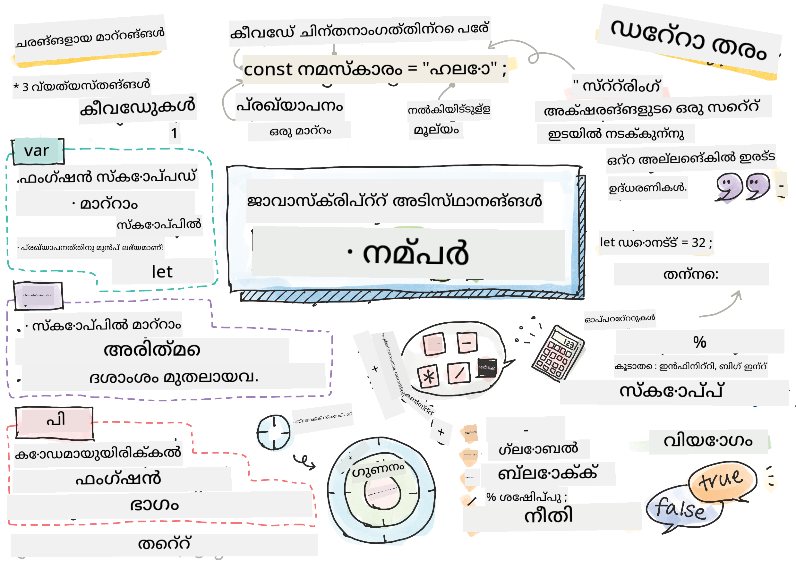
> സ്കെച്ഛ് നോട്ടു [Tomomi Imura](https://twitter.com/girlie_mac) tarafından hazırlandı.

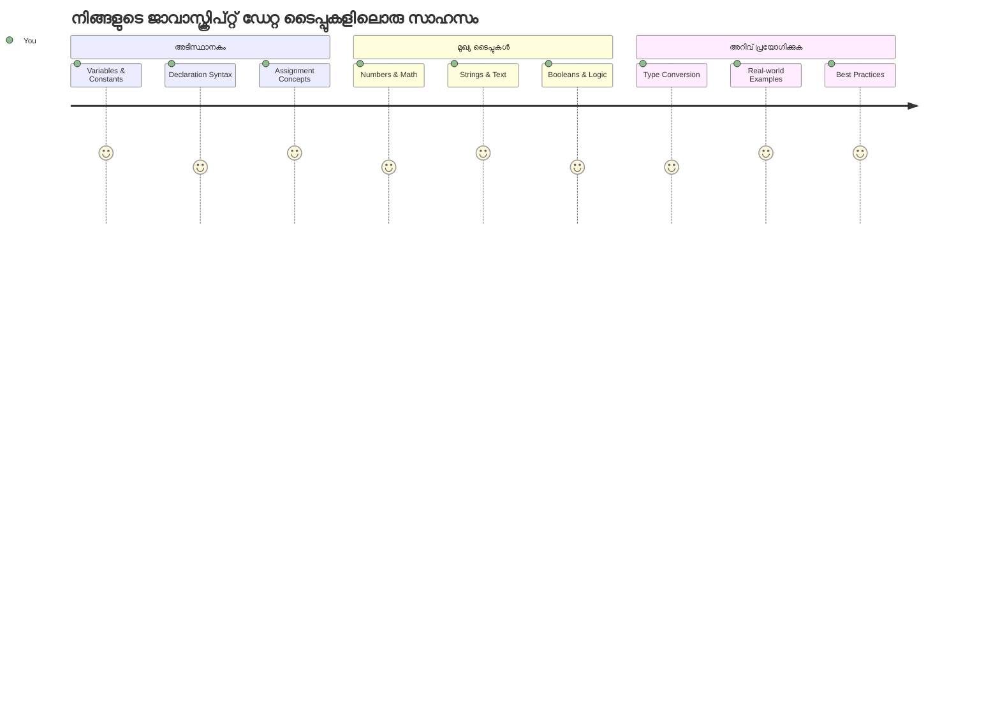
ജാവാസ്ക്രിപ്റ്റിലെ ഡേറ്റാ ടൈപ്പുകൾ നിങ്ങളുടെ ഓരോ പ്രോഗ്രാമിലും കാണാൻ ലഭിക്കുന്ന അടിസ്ഥാന ആശയങ്ങളിൽ ഒന്നാണ്. ഡേറ്റാ ടൈപ്പുകളെ നിങ്ങൾക്ക് ആലക്സാൻഡ്രിയയിലെ പ്രാചീന ഗ്രന്ഥശാലാരോഹിതാക്കൾ ഉപയോഗിച്ചിരുന്ന ഫയലിംഗ് സിസ്റ്റം പോലെ കരുതാം – അവാർക്കു വേണ്ടി പേറുകൾക്കായുള്ള പ്രത്യേക ഇടങ്ങൾ ഉണ്ടായിരുന്നു, അവയിൽ കവിത, ഗണിതം, ചരിത്ര രേഖകൾ അടങ്ങിയിരുന്നു. ജാവാസ്ക്രിപ്റ്റ് അറിഞ്ഞ കാര്യങ്ങൾ വ്യത്യസ്ഥ നിങ്ങളുടെ വിവരങ്ങൾ വ്യത്യസ്ത തരത്തിലുള്ള ഡേറ്റാകൾക്കായി വ്യത്യസ്ത വിഭാഗങ്ങളായി ക്രമീകരിക്കുന്നു.

ഈ പാഠത്തിൽ, ജാവാസ്ക്രിപ്റ്റ് പ്രവർത്തിക്കാൻ സഹായിക്കുന്ന മുൽ ഡേറ്റാ ടൈപ്പുകൾ നമ്മൾ പരിശോധിക്കും. നിങ്ങൾ നമ്പറുകൾ, പേരു, ട്രൂ/ഫാൾസ് മൂല്യങ്ങൾ കൈകാര്യം ചെയ്യുന്നത് എങ്ങനെ പോലുള്ള കാര്യങ്ങൾ പഠിക്കും, കൂടാതെ ശരിയായ ടൈപ്പ് തിരഞ്ഞെടുക്കുന്നത് നിങ്ങളുടെ പ്രോഗ്രാമുകൾക്കായി എങ്ങനെ അത്യന്താപേക്ഷണീയമാണ് എന്ന് മനസ്സിലാക്കും. ആദ്യതായി ഈ ആശയങ്ങൾ സങ്കീർണമായി തോന്നാം, എന്നാൽ പരിശീലനത്തോടെ അവ രണ്ടാമത്തെ സ്വഭാവമായിത്തീരും.

ഡേറ്റാ ടൈപ്പുകൾ മനസ്സിലാക്കുന്നത് ജാവാസ്ക്രിപ്റ്റിൽ മറ്റെല്ലാം കാര്യങ്ങളും വളരെ കൂടുതൽ വ്യക്തവും മനസ്സിലാവുകയും ചെയ്യും. ഒരു ബൃഹദാളയം നിർമ്മിക്കാൻ നിർമ്മാതാക്കൾ വിവിധ നിർമ്മാണ വസ്തുക്കൾ എങ്ങനെ പ്രവർത്തിക്കുന്നു മനസ്സിലാക്കേണ്ടതുപോലെ, ഈ അടിസ്ഥാനങ്ങളും നിങ്ങൾ നിർമ്മിക്കുന്ന എല്ലാവർഷങ്ങളും പിന്തുണയ്ക്കും.

## പ്രീ-ലെക്ചർ ക്വിസ്
[Pre-lecture quiz](https://ff-quizzes.netlify.app/web/)

വെബിൽ ഇന്ററാക്റ്റിവിറ്റി നൽകുന്ന ഭാഷയായ ജാവാസ്ക്രിപ്റ്റിന്റെ അടിസ്ഥാനങ്ങൾ ഈ പാഠത്തിൽ ഉൾക്കൊള്ളുന്നു.

> നിങ്ങൾ ഈ പാഠം [Microsoft Learn](https://docs.microsoft.com/learn/modules/web-development-101-variables/?WT.mc_id=academic-77807-sagibbon) ൽ നേടാം!

[](https://youtube.com/watch?v=JNIXfGiDWM8 "Variables in JavaScript")

[](https://youtube.com/watch?v=AWfA95eLdq8 "Data Types in JavaScript")

> 🎥 വ്യത്യസ്ത വീഡിയോകൾക്കായി മുകളിൽ കാണുന്ന ചിത്രങ്ങൾ ക്ലിക്ക് ചെയ്യുക - variableസും data types ഉം സംബന്ധിച്ച.

നമുക്ക് variableസും അവയിൽ ഡേറ്റാ ടൈപ്പുകളും കൂടെ തുടങ്ങാം!

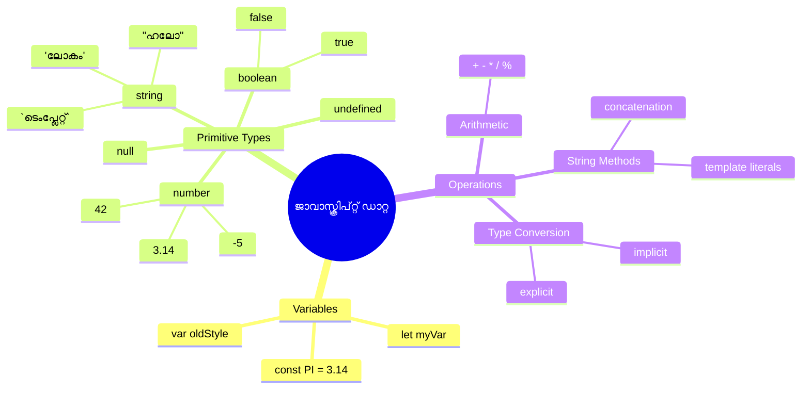
## Variables

പ്രോഗ്രാമിങ്ങിൽ മൂലഭൂത ഘടകങ്ങളാണ് variableസ്. മധ്യകാല കാലഘട്ടത്തിലെ ആൽക്കമിസ്റ്റ്മാർ വ്യത്യസ്ത പദാർത്ഥങ്ങൾ സൂക്ഷിക്കാൻ ഉപയോഗിച്ച ലേബലുചെയ്‌ത ജാർകൾ പോലെ, variableസ് നിങ്ങളെ വിവരങ്ങൾ സൂക്ഷിക്കാൻ സഹായിക്കുന്നു, പിന്നീട് അവയെ സൂചിപ്പിക്കാൻ വിവരണാത്മക നാമം നൽകാനനുവദിക്കുന്നു. ആരുടെയും വയസ് ഓർമ്മിക്കാൻ പറ്റുമോ? അത് `age` എന്ന variableൽ സൂക്ഷിക്കുക. ഒരു യൂസറിന്റെ പേര് ട്രാക്ക് ചെയ്യണമെന്ന് ആണെങ്കിൽ, അത് `userName` എന്ന variableൽ സൂക്ഷിക്കുക.

ജാവാസ്ക്രിപ്റ്റിൽ ക്ലാസ്യമായ രീതിയാണിവിടെ variableസ് സൃഷ്ടിക്കുന്നത്. നിങ്ങൾ ഇവിടെ പഠിക്കുന്ന സാങ്കേതിക വിദ്യകൾ ഭാഷയുടെ വർഷങ്ങളായ വികാസവും പ്രോഗ്രാമിങ് കമ്മ്യൂണിറ്റിയുടെ മികച്ച രീതികളും പ്രതിനിധീകരിക്കുന്നു.

ഒരു variable സൃഷ്ടിച്ച് **പ്രഖ്യാപിക്കുന്നതിന്** നിങ്ങൾക്ക് ഫോളോ ചെയ്തുള്ള സിന്ടക്‌സ് ഉണ്ട് **[keyword] [name]**. ഇരട്ട ഭാഗങ്ങളാൽ നിർമ്മിക്കപ്പെട്ടതാണ്:

- **Keyword**. മാറ്റാവുന്ന variablesക് `let`, സ്ഥിരമായ മൂല്യങ്ങൾക്ക് `const` ഉപയോഗിക്കുക.
- **Variable നാമം**, ഇത് നിങ്ങൾ തന്നെ തെരഞ്ഞെടുത്ത ഒരു വിവരണാത്മക നാമമാണ്.

✅ `let` keyword ES6 ൽ പരിചയപ്പെടുത്തി, variableന് ഒരു _block scope_ ഏർപ്പെടുത്തുന്നു. പാരമ്പര്യമായ `var` കൂടുതൽ ഉപയോഗിക്കാതെ `let` അല്ലെങ്കിൽ `const` ഉപയോഗിക്കണമെന്ന് ശുപാർശ ചെയ്യപ്പെടുന്നു. Block scope പിന്നീടുള്ള ഭാഗങ്ങളിൽ വിശദമായി പഠിക്കും.

### ടെസ്ക് - variableസുമായി ജോലി ചെയ്യുക

1. **ഒരു variable പ്രഖ്യാപിക്കു**. നമുക്ക് ആദ്യ variable സൃഷ്ടിക്കുന്നത് തുടങ്ങാം:

    ```javascript
    let myVariable;
    ```

   **ഇത് ചെയ്യുന്നത്:**
   - ജാവാസ്ക്രിപ്റ്റ് `myVariable` എന്ന് പേരുള്ള ഒരു ശേഖരണ സ്ഥാനമുണ്ടാക്കിയതായി അറിയിക്കുന്നു
   - ജാവാസ്ക്രിപ്റ്റ് ഈ variableക്ക് മെമ്മറിയിൽ സ്ഥലം നൽകുന്നു
   - variableക്ക് നിലവിൽ മൂല്യം ഇല്ല (അവ്യക്തം)

2. **മೂಲ്യം നൽകുക**. ഒന്നു variableൽ എന്തെങ്കിലും അടക്കി കാണാം:

    ```javascript
    myVariable = 123;
    ```

   **നിയമനം എങ്ങനെ പ്രവർത്തിക്കുന്നു:**
   - `=` ഓപ്പറേറ്റർ ഈ variable-ന് 123 എന്ന മൂല്യം നിയോഗിക്കുന്നു
   - variable ഇപ്പോൾ അവ്യക്തമായി നിലനിൽക്കുന്ന മൂല്യം പകരം ഈ മൂല്യം ഉറപ്പുനൽക്കുന്നു
   - `myVariable` ഉപയോഗിച്ച് ഈ മൂല്യത്തെ നിങ്ങളുടെ കോഡിലെ എവിടെയും സൂചിപ്പിക്കാം

   > ശ്രദ്ധിക്കുക: ഈ പാഠത്തിൽ `=` ഉപയോഗിക്കുന്നത് "നിയോഗ ഓപ്പറേറ്റർ" എന്നർത്ഥം, ഇതു ഒരൊറ്റ variable-ന് മൂല്യം നൽകാൻ ഉപയോഗിക്കുന്നു. സമവാക്യമല്ല.

3. **ബുദ്ധിമുട്ടില്ലാതെ ചെയ്യൂ**. നീണ്ടത് രണ്ട് പടികൾ ഒരുമാക്കി ചെയ്യാം:

    ```javascript
    let myVariable = 123;
    ```

    **ഈ രീതിയ്ര് കൂടുതൽ കാര്യക്ഷമമാണ്:**
    - ഒരു സ്ഥിരം സ്റ്റേറ്റ്‌മെന്റിൽ variable പ്രഖ്യാപിക്കുകയും മൂല്യം നൽകുകയും ചെയ്യുന്നു
    - വികസിപ്പകരുടെ ഇടയിൽ ഈ രീതിയാണ് സാധാരണം
    - ദൈർഘ്യം കുറയ്ക്കുന്നു കൂടാതെ വ്യക്തത നിലനിർത്തുന്നു

4. **മനസ്സിലൂരുന്നു**. വ്യത്യസ്ത ഒരു നമ്പർ സൂക്ഷിക്കണമെങ്കിൽ?

   ```javascript
   myVariable = 321;
   ```

   **പുന:നിയോഗം മനസ്സിലാക്കുക:**
   - variable ഇപ്പോൾ 321 അടക്കുന്നു, മുമ്പുണ്ടായിരുന്ന 123 പകരം
   - മുന്‍ മൂല്യം മാറ്റി വച്ചിരിക്കുന്നു – variableസ് ഒരേസമയം ഒരു മൂല്യം മാത്രമേ സൂക്ഷിക്കൂ
   - ഇത് `let` ഉപയോഗിച്ച് variable പ്രഖ്യാപനത്തിന്റെ മുഖ്യ ഗുണമാണ്

   ✅ പരീക്ഷിക്കൂ! നിങ്ങൾക്ക് ബ്രൗസറിൽ നേരിട്ട് ജാവാസ്ക്രിപ്റ്റ് എഴുതാനാകും. ബ്രൗസർ തുറന്ന് ഡിസെൽപ്പർ ടൂളുകളിലേക്ക് പോവുക. കോൺസോളിൽ `let myVariable = 123` എന്ന് ടൈപ്പ് ചെയ്ത് റിട്ടേൺ അമർത്തുക, തുടർന്ന് `myVariable` ടൈപ്പ് ചെയ്യുക. എന്ത് സംഭവിക്കുന്നു? ഈ ആശയങ്ങളെക്കുറിച്ച് അടുത്ത പാഠങ്ങളിൽ കൂടുതൽ പഠിക്കും.

### 🧠 **Variables മെടറിയൽ ചെയ്‌യൽ: സ്വന്തം ബോധത്തിൽ ഉറപ്പിക്കുക**

**variables സംബന്ധിച്ച നിങ്ങൾ എത്രത്തോളം മനസ്സിലാക്കുന്നു കാണാം:**
- variable പ്രഖ്യാപണവും നിയമനവും തമ്മിലുള്ള വ്യത്യാസം വിശദീകരിക്കാമോ?
- ഒരു variable പ്രഖ്യാപിക്കുന്നതിന് മുമ്പ് ഉപയോഗിക്കുമ്പോൾ എന്ത് സംഭവിക്കും?
- variableയ്‌ക്കായി `let` എന്ത് സമയത്ത് `const` നെക്കാൾ തിരഞ്ഞെടുക്കും?

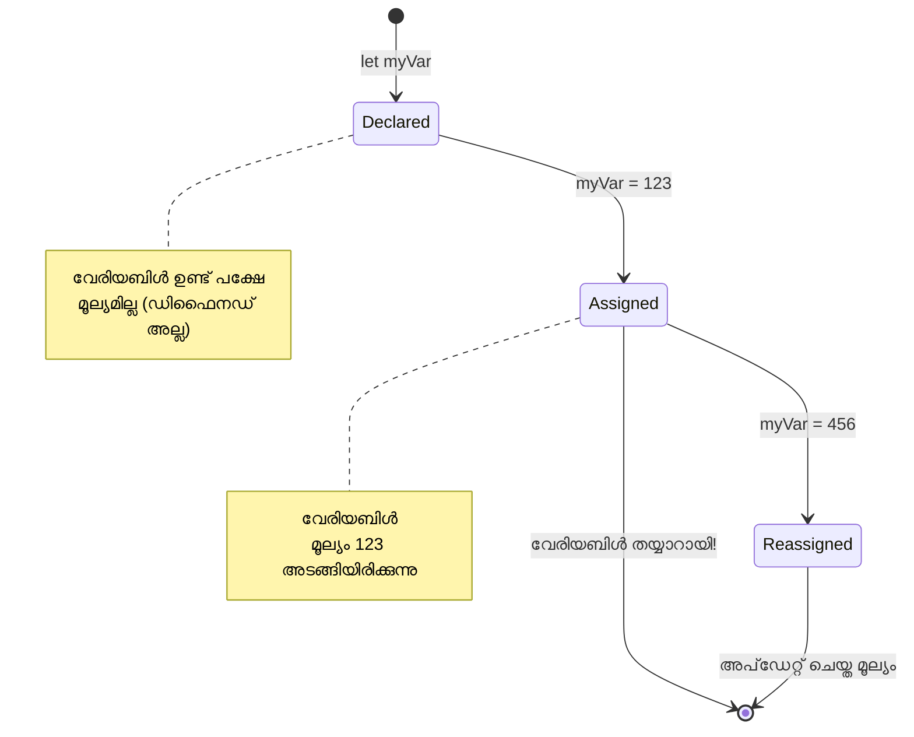
> **ശൂക്ഷ്മ നിർദേശം**: variableസ് ലേബൽ ചെയ്ത സംഭരണിയമായ ബോക്സുകൾപോലെ കരുതുക. നിങ്ങൾ ബോക്സ് ഉണ്ടാക്കുന്നു (`let`), അതിൽ ഒന്നുപിടിക്കുന്നു (`=`), പിന്നെ ആവശ്യമെങ്കിൽ ഉള്ളടക്കം മാറ്റാനും കഴിയും!

## Constants

പ്രോഗ്രാം പ്രവർത്തനത്തിനിടെ മാറ്റം വരുത്താൻ പാടില്ലാത്ത വിവരങ്ങൾ സൂക്ഷിക്കാൻ ചിലപ്പോൾ ആവശ്യമുണ്ട്. പ്രാചീന ഗ്രീസിലെ യൂക്ലിഡ് സ്ഥാപിച്ച ഗണിത സിദ്ധാന്തങ്ങളായി constants കരുതാം – ഒരിക്കൽ തെളിഞ്ഞു രേഖപ്പെടുത്തിയതിന് ശേഷം അത് മുഴുവൻ ഭാവിയിൽ സ്ഥിരതയാണ്.

constants variables പോലെ പ്രവർത്തിക്കുന്നു, എന്നാൽ ഒരു പ്രധാന നിയന്ത്രണവുമുണ്ട്: നിങ്ങൾ മൂല്യം നിയമിച്ചതിനു ശേഷം അതു മാറ്റാനാകില്ല. ഈ സ്ഥിതിസ്ഥാപകത സാങ്കേതികപ്രവർത്തനത്തിലെ പ്രധാന മൂല്യങ്ങളെ തെളിവുകൾ സംരക്ഷിക്കാൻ സഹായിക്കുന്നു.

constants പ്രഖ്യാപനവും ആരംഭവും variableപോലെയാണെങ്കിലും `const` keyword ഉപയോഗിക്കുന്നു. constants സാധാരണ നിർദ്ദേശത്തിൽ ഏതാണ്ട് മുഴുവൻ അക്ഷരങ്ങൾ capital ആണ്.

```javascript
const MY_VARIABLE = 123;
```

**ഈ കോഡ് ചെയ്യുന്നത്:**
- **`MY_VARIABLE` എന്ന പേരിൽ ഒരു constant സൃഷ്ടിക്കുന്നു, മൂല്യം 123**
- **constants ക്ക് capital നാമകരണ രീതിയാണ് ഉപയോഗിക്കുന്നത്**
- **ഇതിനുള്ള മൂല്യം ഭാവിയിൽ മാറ്റാൻ പാടില്ല**

constants ന് രണ്ട് പ്രധാന നിയമങ്ങളുണ്ട്:

- **തടവായ സ്ഥിരമായ മൂല്യം ഉടൻ നൽകണം** – ശൂന്യമായ constants അനുവദനീയമല്ല!
- **ആ മൂല്യം മാറ്റാനാകില്ല** – നിങ്ങളുടെ ശ്രമം ജാവാസ്ക്രിപ്റ്റ് പിശക് എറർ തരുമ്. താഴെ കാണിച്ചുകഴിഞ്ഞാൽ:

   **സാധാരണ മൂല്യം** - താഴെ കാണിക്കുന്നത് അനുവദനീയമല്ല:
   
      ```javascript
      const PI = 3;
      PI = 4; // അനുവദനീയമല്ല
      ```

   **സ്മരണയിൽ വയ്ക്കേണ്ടത്:**
   - constant പുന:നിയോഗത്തിനുള്ള ശ്രമം പിശക് സൃഷ്ടിക്കും
   - പ്രധാന മൂല്യങ്ങളെ തെറ്റായ മാറ്റങ്ങളിൽ നിന്നും സംരക്ഷിക്കുന്നു
   - പ്രോഗ്രാമിന്റെ മുഴുവൻ കാലയളവിൽ മൂല്യം സൃഷ്ടിക്കുന്നു
 
   **ഓബ്ജക്റ്റ് റഫറൻസ് സംരക്ഷിച്ചു** - താഴെ കാണുന്നത് അനുവദനീയമല്ല:
   
      ```javascript
      const obj = { a: 3 };
      obj = { b: 5 } // അനുവദനീയമല്ല
      ```

   **ഈ ആശയങ്ങൾ മനസ്സിലാക്കുക:**
   - മുഴുവൻ ഓബ്ജക്റ്റ് മാറ്റുന്നത് തടയുന്നു
   - ഒറിജിനൽ ഓബ്ജക്റ്റിലേക്കുള്ള റഫറൻസ് സുരക്ഷിതമാക്കുന്നു
   - ഓബ്ജക്റ്റിന്റെ മെമ്മറിയിലെ ഐഡന്റിറ്റി നിലനിർത്തുന്നു

    **ഓബ്ജക്റ്റിന്റെ മൂല്യം മാറ്റാൻ കഴിയും** - താഴെ കാണുന്നത് അനുവദനീയമാണ്:
    
      ```javascript
      const obj = { a: 3 };
      obj.a = 5;  // അനുവദനീയമാണ്
      ```

      **ഇവിടെ എന്ത് സംഭവിക്കുന്നു:**
      - ഓബ്ജക്റ്റിനുള്ളിൽ ഉള്ള പ്രോപ്പർട്ടി മൂല്യം മാറ്റുന്നു
      - റഫറൻസ് നിലനിർത്തുന്നു
      - ഓബ്ജക്റ്റ് ഉള്ളടക്കം മാറാം, എന്നാൽ റഫറൻസ് സ്ഥിരമാണ് എന്ന് കാണിക്കുന്നു

   > ശ്രദ്ധിക്കുക, `const` എന്നത് റഫറൻസിനെ പുന:നിയോഗത്തിൽ നിന്നും സംരക്ഷിക്കുന്നു. മൂല്യം _അമ്യൂറ്റബിൾ_ അല്ല, ഒരാദ്ധരം കോംപ്ലക്സ് ഘടനയായ ഓബ്ജക്റ്റ് പോലുള്ളത് മാറ്റം വരുത്താൻ കഴിയും.

## Data Types

ജാവാസ്ക്രിപ്റ്റ് വിവിധ തരത്തിലുള്ള വിവരങ്ങളെ ഡേറ്റാ ടൈപ്പുകൾ എന്ന വിഭാഗങ്ങളായി ക്രമീകരിക്കുന്നു. ഈ ആശയം പ്രാചീന പണ്ഡിതർ അറിഞ്ഞിരുന്നതുപോലെ ആണ് – അലിസ്റ്റോട്ടിൽ വേർതിരിച്ചുകൊണ്ടിരുന്നത് വിവേക തത്ത്വങ്ങൾക്കിടയിൽ വ്യത്യാസം, കാരണം ലേഖനം, ഗണിതം, പ്രകൃതി തത്ത്വശാസ്ത്രം എന്നിവയിൽ ഒരേ തരം നിയമങ്ങൾ ബാധകമല്ല.

ഡേറ്റാ ടൈപ്പുകൾ പ്രധാനമാണ് കാരണം വ്യത്യസ്ത പ്രവർത്തനങ്ങൾക്ക് വ്യത്യസ്ത വിധത്തിലുള്ള വിവരങ്ങൾ വേണം. മനുഷ്യനാമത്തിൽ ഗണിതം നടത്താനാകില്ല, ഗണിത സമവാക്യത്തിന് ആൽഫബെറ്റ് ക്രമം പാലിക്കാനാകില്ല, അതുപോലെ ജാവാസ്ക്രിപ്റ്റും ഓരോ ഓപ്പറേഷനിനും അനുയോജ്യമായ ഡേറ്റാ ടൈപ്പ് ആവശ്യപ്പെടുന്നു. ഇത് തെറ്റായി പ്രോഗ്രാമുകൾ വരുന്നത് തടയുകയും കോഡ് വിശ്വാസയോഗ്യമാക്കുകയും ചെയ്യുന്നു.

Variableസ് നിരവധി വ്യത്യസ്ത മൂല്യങ്ങൾ സൂക്ഷിക്കാനാകും, എങ്കിൽ നമ്പറുകളും ടെക്സ്റ്റുകളും ഉൾപ്പെടെ. ഈ വ്യത്യസ്ത ടൈപ്പുകളെയാണ് **ഡേറ്റാ ടൈപ്പുകൾ** എന്ന് വിളിക്കുന്നത്. സോഫ്റ്റ്വെയർ വികസനത്തിൽ ഡേറ്റാ ടൈപ്പുകൾ സുപ്രധാനമാണ്, കാരണം ഇത് ഡെവലപർമാരെ എങ്ങനെ കോഡ് എഴുതണം, സോഫ്റ്റ്വെയർ എങ്ങനെ പ്രവർത്തിക്കണം എന്ന കാര്യത്തിൽ തീരുമാനിക്കേണ്ട സഹായം നൽകുന്നു. കൂടാതെ, ചില ഡേറ്റാ ടൈപ്പുകൾ പ്രത്യേക സവിശേഷതകൾക്കായി ഉള്ളവയാണ്, മൂല്യത്തിൽ നിന്ന് കൂടുതൽ വിവരങ്ങൾ മാറ്റി പകരാനോ പ്രക്രിയചെയ്യാനോ സഹായിക്കുന്നു.

✅ ഡേറ്റാ ടൈപ്പുകൾ ജാവാസ്ക്രിപ്റ്റ് ഡേറ്റാ പ്രിമിറ്റിവുകൾ എന്നും പറയുന്നു. ഭാഷ നൽകിയ ഏറ്റവും താഴ്ന്ന നിലവാരത്തിലുള്ള ഡാറ്റാ ടൈപ്പുകളാണ് ഇവ. 7 പ്രിമിറ്റീവ് ഡേറ്റാ ടൈപ്പുകൾ ഉണ്ട്: string, number, bigint, boolean, undefined, null, symbol. ഓരോ പ്രിമിറ്റീവ് എന്തെല്ലാം പ്രതിനിധീകരിക്കാം എന്നത് ഒരു നിമിഷം മനസ്സിലാക്കുക. ഒരു `zebra` എന്താണെന്നും `0` എന്നത് എന്തെന്നും `true` എന്നത് എന്തെന്നും ചോദിക്കുക.

### Numbers

നമ്പറുകൾ ജാവാസ്ക്രിപ്റ്റിലെ ഏറ്റവും എളുപ്പത്തിലുള്ള ഡേറ്റാ ടൈപ്പാണ്. 42 പോലുള്ള പൂർണ്ണസംഖ്യകളും 3.14 പോലുള്ള ദശാംശങ്ങളും -5 പോലുള്ള നെഗറ്റീവ് സംഖ്യകളും എല്ലാ തരത്തിലുള്ള with വാഹനം ജാവാസ്ക്രിപ്റ്റ് സമാനമാകും.

നമുക്ക് മുമ്പ് variableവുമായുള്ള 123 നോർഡ്നം നമ്പർ ഡേറ്റാ ടൈപ്പ് ആണ്:

```javascript
let myVariable = 123;
```

**പ്രധാന സവിശേഷതകൾ:**
- ജാവാസ്ക്രിപ്റ്റ് സ്വയം സംഖ്യാത്മക മൂല്യങ്ങളായി തിരിച്ചറിയുന്നു
- ഈ variableസുമായി ഗണിത പ്രവർത്തനങ്ങൾ നടത്താം
- വ്യക്തമായ ടൈപ്പ് പ്രഖ്യാപനം ആവശ്യമില്ല

variableസ് എല്ലാ തരത്തിലുള്ള നബറുകളും സൂക്ഷിക്കാം, ദശാംശങ്ങളോ നെഗറ്റീവ് സംഖ്യകളോ ഉൾപ്പെടെ. നബറുകൾ ഗണിത ഓപ്പറേറ്റർമാരുമായും ഉപയോഗിക്കാം, [അടുത്ത വിഭാഗത്തിൽ](../../../../2-js-basics/1-data-types) പഠിപ്പിക്കും.

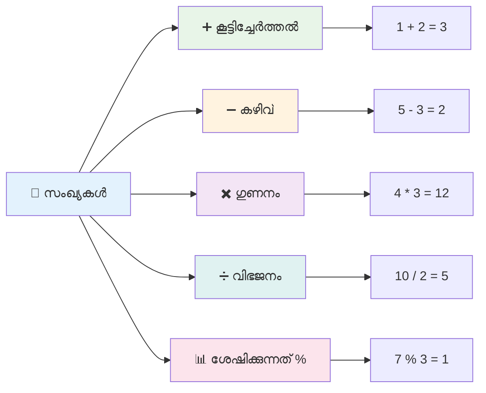
### Arithmetic Operators

ഗണിത ഓപ്പറേറ്ററുകൾ ജാവാസ്ക്രിപ്റ്റിൽ നിങ്ങൾക്ക് ഗണിത ഗ്രഹണങ്ങൾ നടത്താൻ അനുവദിക്കുന്നു. ഈ ഓപ്പറേറ്ററുകൾ പൈതൃക ഗണിതീയമായ സിദ്ധാന്തങ്ങളനുസരിച്ച് പ്രവർത്തിക്കുന്നു – ആൽഖ്വാരിസ്മി പോലുള്ള പണ്ഡിതൻ്റെ ശാസ്ത്രീയ പ്രമാണങ്ങളിൽ കാണിച്ചിരിന്ന ചിഹ്നങ്ങൾ.

ഓപ്പറേറ്ററുകൾ പാരമ്പര്യ ഗണിതത്തോടനുബന്ധിച്ച സ്വഭാവങ്ങളുള്ളതാണ്: കൂട്ടൽക്ക് പ്ലസ്, വിയോഗത്തിന് മൈനസ്, ഗുണനത്തിനും പങ്കുവയ്ക്കുന്നതിനും എന്നിവ.

നിങ്ങൾക്ക് ഗണിത പ്രവർത്തനങ്ങളിൽ ഉപയോഗിക്കുന്ന ചില പ്രധാന ഓപ്പറേറ്റർമാർ ചുവടെ നൽകുന്നു:

| ചിഹ്നം | വിവരണം                                                               | ഉദാഹരണം                         |
| ------ | -------------------------------------------------------------------- | -------------------------------- |
| `+`    | **കൂട്ടൽ**: രണ്ട് സംഖ്യകളുടെ ഫലം വെക്കുന്നു                        | `1 + 2 //പ്രതീക്ഷിക്കപ്പെട്ട ഉത്തരം 3`   |
| `-`    | **വിയോഗം**: രണ്ട് സംഖ്യകളുടെ വ്യത്യാസം കണക്കാക്കുന്നു                | `1 - 2 //പ്രതീക്ഷിക്കപ്പെട്ട ഉത്തരം -1`  |
| `*`    | **ഗുണനം**: രണ്ട് സംഖ്യകളുടെ ഉത്പന്നം കണക്കാക്കുന്നു                  | `1 * 2 //പ്രതീക്ഷിക്കപ്പെട്ട ഉത്തരം 2`   |
| `/`    | **ഭാഗം**: രണ്ട് സംഖ്യകളുടെ വിഭജനം കണക്കാക്കുന്നു                   | `1 / 2 //പ്രതീക്ഷിക്കപ്പെട്ട ഉത്തരം 0.5` |
| `%`    | **ശേഷക്കണക്കുകൾ**: രണ്ട് സംഖ്യകളുടെ വിഭജനം തുടർന്നുള്ള ശേഷി         | `1 % 2 //പ്രതീക്ഷിക്കപ്പെട്ട ഉത്തരം 1`   |

✅ പരീക്ഷിക്കൂ! നിങ്ങളുടെ ബ്രൗസറിലെ കോൺസോളിൽ ഒരു ഗണിത പ്രവർത്തനം ചെയ്യൂ. ഫലങ്ങൾ നിങ്ങളെ അമ്പരപ്പിക്കുമോ?

### 🧮 **ഗണിതക്ഷമത പരിശോധന: ആത്മവിശ്വാസത്തോടെ കണക്കുകൂട്ടൽ**

**നിങ്ങളുടെ ഗണിതഈടംപ്പിലൂടെ:**
- `/` (ഭാഗം) ഉം `%` (ശേഷി) ഉം തമ്മിലുള്ള വ്യത്യാസം എന്ത്?
- `10 % 3` എന്നത് ഇടത്തേയ്ക്ക് എന്ത് തുല്യമാണ് (ഹിങ്ക്: 3.33 അല്ല...)
- പ്രോഗ്രാമിങ്ങിൽ ശേഷിക്കണക്കുകാർഎന്തിന് പ്രയോജനപ്പെടുന്നു?

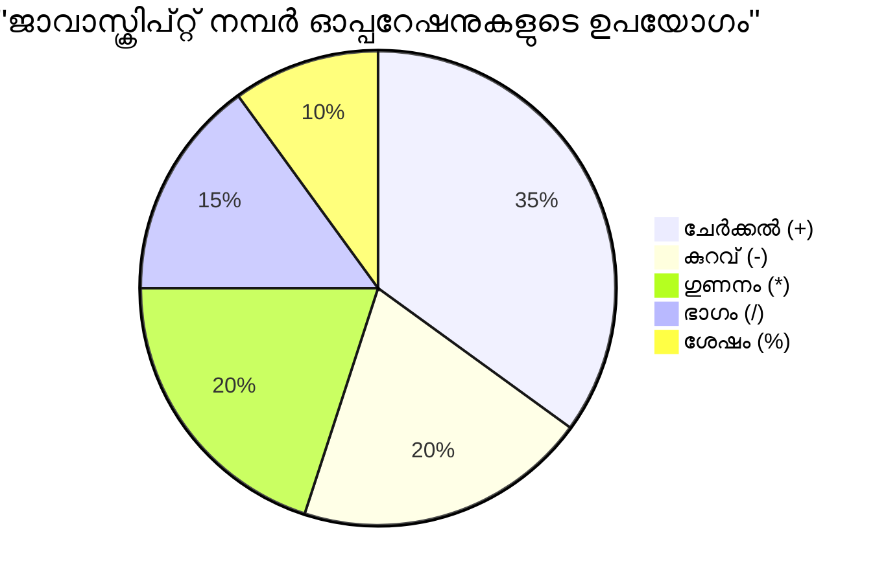
> **യഥാർത്ഥ രോഗി അവലോകനം**: ശേഷിക്കണക്കുകാർ (remainder operator %) സംഖ്യകൾ വേർതിരിയുന്നതിന്റെ എണ്ണങ്കൾ ആക്കിയിട്ടുള്ളതായി പരിശോധിക്കാൻ, പാറ്റേണുകൾ സൃഷ്ടിക്കാൻ, ലിസ്റ്റുകൾ വഴിയുള്ള ചക്രവാളം സൃഷ്ടിക്കാൻ സുപ്രധാനമാണ്!

### Strings

ജാവാസ്ക്രിപ്റ്റിൽ, ടെക്സ്റ്റ് ഡാറ്റ strings ആയി പ്രതിനിധീകരിക്കുന്നു. "string" എന്ന പദം ഒരു കൂടി ചിഹ്നങ്ങൾ കയറി നിരക്കായി ചേർക്കപ്പെടുന്നത് കാണിക്കുന്നു, മധ്യകാല സമ്മേളനങ്ങൾ എഴുതിയ ഡോക്യുമെന്റുകളിലെ അതേ പോലെ.

Strings വെബ് വികസനത്തിന് അടിസ്ഥാനം ആണ്. ഓരോ വെബ്സൈറ്റിലെ ടെക്സ്റ്റ്, യൂസർനേം, ബട്ടൺ ലേബലുകൾ, പിഴവ് സന്ദേശങ്ങൾ, ഉള്ളടക്കം എന്നിവ എല്ലാം string ഡാറ്റയായി കൈകാര്യം ചെയ്യുന്നു. strings മനസ്സിലാക്കുന്നത് ഉപയോക്തൃ ഇന്റർഫേസുകൾ സൃഷ്ടിക്കാൻ അനിവാര്യമാണ്.

Strings ഒറ്റ ഉദ്ധരണ ചിഹ്നങ്ങളോ ഇരട്ട ഉദ്ധരണ ചിഹ്നങ്ങളോ തമ്മിലുള്ള അക്ഷരശ്രേണികളാണ്.

```javascript
'This is a string'
"This is also a string"
let myString = 'This is a string value stored in a variable';
```

**ഈ ആശയങ്ങൾ മനസ്സിലാക്കുക:**
- strings നിർവചിക്കാൻ `'` ഒറ്റ ഉദ്ധരണ ചിഹ്നം അല്ലെങ്കിൽ `"` ഇരട്ട ഉദ്ധരണ ചിഹ്നം ഉപയോഗിക്കുന്നു
- അക്ഷരങ്ങൾ, സംഖ്യകൾ, ചിഹ്നങ്ങൾ ഉൾപ്പെടുന്ന ടെക്സ്റ്റ് ഡേറ്റാ സൂക്ഷിക്കുന്നു
- variableസിന് string മൂല്യം നിയമിക്കുന്നു വരാനുള്ള ഉപയോഗത്തിനായി
- variable നാമങ്ങളിൽ നിന്നു കീഴടങ്ങാതിരിക്കാൻ ഉദ്ധരണികൾ ആവശ്യമാണ്

String എഴുതുമ്പോൾ ഉദ്ധരണികൾ ഉപയോഗിക്കുക അല്ലെങ്കിൽ, ജാവാസ്ക്രിപ്റ്റ് അത് variable നാമം എന്നു കരുതും.

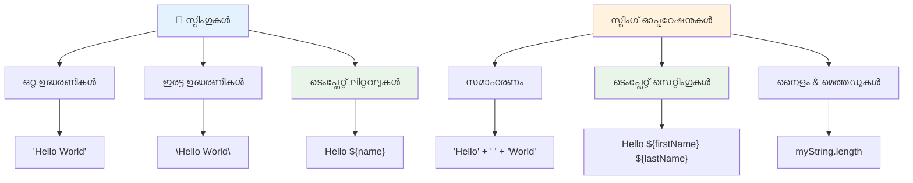
### Strings രൂപകൽപ്പന ചെയ്യൽ

String manipulation നിങ്ങളുടെ ടെക്സ്റ്റ് ഭാഗങ്ങൾ ചേർക്കാനും, variableസ് ഉൾപ്പെടുത്താനും, പ്രോഗ്രാമിന്റെ നില അനുസരിച്ച് ഗതാഗത ഉള്ളടക്കം സൃഷ്ടിക്കാനും സഹായിക്കുന്നു. ഈ പോലുള്ള സാങ്കേതിക വിദ്യ ടെക്സ്റ്റ് പ്രോഗ്രാമാറ്റിക്ക് ആയി നിർമ്മിക്കാൻ സഹായിക്കുന്നു.

സാധാരണയായി, നിങ്ങൾക്ക് പല strings ഉണ്ടാകുമ്പോൾ അവ ചേർക്കണം – ഇതാണ് concatenation എന്നു പറയുന്നു.
രണ്ട് അല്ലെങ്കിൽ അതിലധികം സ്ട്രിങ്ങുകൾ **concatenate** ചെയ്യാനും, അവയെ ചേർക്കാനും, `+` ഓപ്പറേറ്റർ ഉപയോഗിക്കുക.

```javascript
let myString1 = "Hello";
let myString2 = "World";

myString1 + myString2 + "!"; //ഹലോവേൾഡ്!
myString1 + " " + myString2 + "!"; //ഹലോ വേൾഡ്!
myString1 + ", " + myString2 + "!"; //ഹലോ, വേൾഡ്!
```

**പടിപടിയായി, സംഭവിക്കുകയാണ്:**
- `+` ഓപ്പറേറ്റർ ഉപയോഗിച്ച് നിരവധി സ്ട്രിങ്ങുകൾ **ചേർക്കുന്നു**
- ആദ്യ ഉദാഹരണത്തിൽ സ്ട്രിങ്ങുകൾ സ്പേസുകൾ ഇല്ലാതെ നേരിട്ട് **ചേർക്കുന്നു**
- വായനാസൗകര്യത്തിനായി സ്ട്രിങ്ങിനിടെ സ്‌പേസ് അക്ഷരങ്ങൾ `" "` **ചേർക്കുന്നു**
- ശരിയായ ഫോർമാറ്റിങ്ങിനായി കോമകൾ പോലുള്ള പദചിഹ്നങ്ങൾ **ചേർക്കുന്നു**

✅ ജാവാസ്ക്രിപ്റ്റിൽ `1 + 1 = 2` എങ്ങനെ ആയിട്ടും `'1' + '1' = 11` ആക്കുന്നു? താളുക. `'1' + 1` എങ്കിൽ എന്താകും?

**ടെംപ്ലേറ്റ് ലിറ്ററലുകൾ** എന്നത് സ്ട്രിങ്ങുകൾ ഫോർമാറ്റ് ചെയ്യാനുള്ള മറ്റൊരു മാർഗമാണ്, എന്നാൽ ക്വോട്ടിന്റെ പകരം ബാക്ക്‌ടിക്ക് ഉപയോഗിക്കുന്നു. സാധാരണ ടെക്സ്റ്റല്ലാത്തത് `${ }` പ്ലേസ്‌ഹോൾഡറുകളിനുള്ളിടത്ത് ചേർക്കണം. ഇത് സ്ട്രിങ്ങുകൾ ആയിരിക്കാവുന്ന ഏതെല്ലാം വെറിയബിളുകളും ഉൾപ്പെടുന്നു.

```javascript
let myString1 = "Hello";
let myString2 = "World";

`${myString1} ${myString2}!` //ഹലോ വേൾഡ്!
`${myString1}, ${myString2}!` //ഹലോ, വേൾഡ്!
```

**ഓരോ ഭാഗവും മനസ്സിലാക്കുക:**
- ടെംപ്ലേറ്റ് ലിറ്ററലുകൾ സൃഷ്ടിക്കാൻ സാധാരണ ക്വോട്ടുകളുടെ പകരം ബാക്ക്‌ടിക്കും `` ` `` ഉപയോഗിക്കുന്നു
- `${}` പ്ലേസ്‌ഹോൾഡർ സിന്‍ടാക്സ് ഉപയോഗിച്ച് വേരിയബിൾസ് നേരിട്ട് ഇടുകയാണ്
- സ്‌പേസുകൾക്കും ഫോർമാറ്റിങ്ങിനും അക്ഷരശരിയായി സംരക്ഷണം ചെയ്യുന്നു
- വേരിയബിൾസുള്ള പരികളാളമായ സ്ട്രിങ്ങുകൾ സൃഷ്ടിക്കാൻ കൂടുതൽ ശുഭ്രമായ മാർഗമാണ് നൽകുന്നത്

നിങ്ങൾക്ക് ഏതെന്തെങ്കിലും രീതിയിൽ ഫോർമാറ്റ് ലക്ഷ്യങ്ങൾ നേടാം, എന്നാൽ ടെംപ്ലേറ്റ് ലിറ്ററലുകൾ സ്‌പേസുകളും ലൈൻ ബ്രേക്കുകളും ആദരിച്ചു.

✅ plain string-നു പകരം template literal ഏപ്പോൾ ഉപയോഗിക്കും?

### 🔤 **String Mastery Check: എഴുത്ത് മാനേജുമെന്റ് വിശ്വാസം**

**നിങ്ങളുടെ സ്ട്രിംഗ് കഴിവുകൾ വിലയിരുത്തുക:**
- `'1' + '1'` ഇതിന് `2` അല്ലാതെ `'11'` എവിടെനിന്ന് ഉണ്ടാകുന്നു എന്ന് വിശദീകരിക്കാമോ?
- സ്ട്രിംഗ് մեթഡ്സിൽ ഏത് വായന സാധ്യമാക്കുന്നത് кремис്തോഹർശകര്: concatenate അല്ലെങ്കിൽ template literals?
- സ്ട്രിങ്ങിന്റെ ചുറ്റുമുള്ള ക്വോട്ടുകൾ മറക്കുകയാണെങ്കിൽ എന്ത് സംഭവിക്കും?

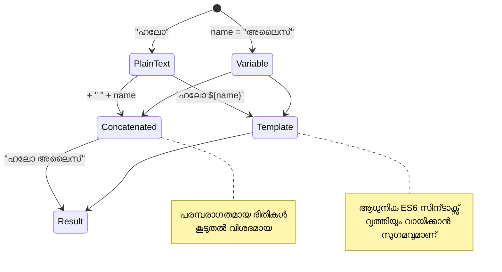
> **പ്രോ ടിപ്പ്**: ടേംപ്ലേറ്റ് ലിറ്ററലുകൾ സാധാരണയായി സങ്കീർണ്ണമായ സ്ട്രിംഗ് നിർമ്മാണത്തിന് മുൻഗണന നൽകപ്പെടുന്നു, കാരണം അവ കൂടുതൽ വായനാസുഖമുള്ളവയാണ്, ബഹുഭാഗ് വരി സ്ട്രിങ്ങുകളും മനോഹരമായി കൈകാര്യം ചെയ്യുന്നു!

### ബൂലിയൻസ്

ബൂലിയൻസ് ഏറ്റവും ലളിതമായ ഡാറ്റ ഫോമായി പ്രതിനിധീകരിക്കുന്നു: അവക്ക് രണ്ട് മൂല്യങ്ങളിൽ ഒന്നേയുള്ളൂ – `true` അല്ലെങ്കിൽ `false`. ഈ ബൈനറി ലാജിക് സിസ്റ്റം 19-ആം നൂറ്റാണ്ടിൽ ജോർജ് ബൂൽ എന്ന ഗണിതജ്ഞൻ രൂപവത്കരിച്ച ബൂലിയൻ ആൽജാബ്രയിൽ നിന്നാണ് ഉത്ഭവിച്ചത്.

വളരെ ലളിതമായിട്ടും, ബൂലിയൻസ് പ്രോഗ്രാം ലാജിക്‌ക്കായി അനിവാര്യമാണ്. ഉപയോക്താവ് ലോഗിൻ ചെയ്തു തുടങ്ങിയോ, ഒരു ബട്ടൺ ക്ലിക്ക് ചെയ്തോ തുടങ്ങിയ ശരത്കാരണങ്ങളുടെ അടിസ്ഥാനത്തിൽ നിങ്ങളുടെ കോഡ് തീരുമാനങ്ങൾ എടുക്കാൻ അവ കഴിയും.

ബൂലിയൻസ് രണ്ട് മൂല്യങ്ങളിലേ ഉള്ളവ മാത്രം: `true` അല്ലെങ്കിൽ `false`. ബൂലിയൻസ് ചില ശരത്കരണങ്ങൾ പാലിക്കുമ്പോൾ കോഡിന്റെ ഏതെവിടെ വരികൾ പ്രവർത്തിക്കുമെന്ന് തീരുമാനിക്കാൻ സഹായിക്കുന്നു. പല കേസുകളിലും, [operators](../../../../2-js-basics/1-data-types) ബൂലിയൻസ് മൂല്യം നിശ്ചയിക്കാൻ സഹായിക്കുന്നു, നിങ്ങൾ പലപ്പോഴും ഒരു വെറിയബിള്‍ ആരംഭിക്കുകയും അവരുടെ മൂല്യങ്ങൾ ഒരു ഓപ്പറേറ്ററിലൂടെ അപ്ഡേറ്റ് ചെയ്യപ്പെടുന്നത് കാണുകയും ചെയ്യും.

```javascript
let myTrueBool = true;
let myFalseBool = false;
```

**മുകളിലുള്ളത്:**
- ബൂലിയൻ മൂല്യം `true` സൂക്ഷിക്കുന്ന ഒരു വെറിയബിള്‍ **സൃഷ്ടിച്ചു**
- ബൂലിയൻ മൂല്യം `false` സൂക്ഷിക്കുന്ന വിധം **പ്രദർശിപ്പിച്ചു**
- ക്വോട്ടുകൾ ഇല്ലാതെ `true` എന്നും `false` എന്നും കീവേഡുകൾ **ഉപയോഗിച്ചു**
- ഇവ conditional statements-ൽ ഉപയോഗിക്കാൻ **സജ്ജമാക്കി**

✅ ഒരു വെറിയബിള്‍ ബൂലിയൻ `true` ആയി വ്യക്തരൂപം കണ്ടാൽ അതിനെ 'truthy' ആയി പരിഗണിക്കാം. അതിഥിയിൽ, ജാവാസ്ക്രിപ്റ്റിൽ, [അവ എല്ലാ മൂല്യങ്ങളും falsy ആയി നിർവ്വചിച്ചിട്ടില്ലെങ്കിൽ truthy ആണ്](https://developer.mozilla.org/docs/Glossary/Truthy).

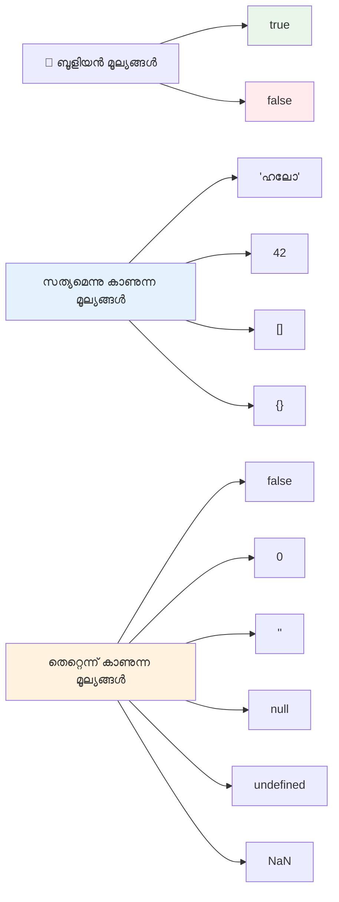
### 🎯 **Boolean Logic Check: തീരുമാനവേർതിരിക്കൽ കഴിവുകൾ**

**നിങ്ങളുടെ ബൂലിയൻ മനസ്സിലാക്കൽ പരീക്ഷിക്കുക:**
- ജാവാസ്ക്രിപ്റ്റിൽ `true` അല്ലെങ്കിൽ `false` മാത്രമല്ല, "truthy" കൂടാതെ "falsy" മൂല്യങ്ങൾ എന്തുകൊണ്ട് ഉണ്ട് എന്ന് കരുതുന്നു?
- ഇവയിൽ ഏത് falsy ആണ് എന്ന് പ്രവചിക്കാമോ: `0`, `"0"`, `[]`, `"false"`?
- പ്രോഗ്രാം ഫ്ലോ നിയന്ത്രണത്തിൽ ബൂലിയൻസ് എങ്ങനെ സഹായകരമായിരിക്കും?

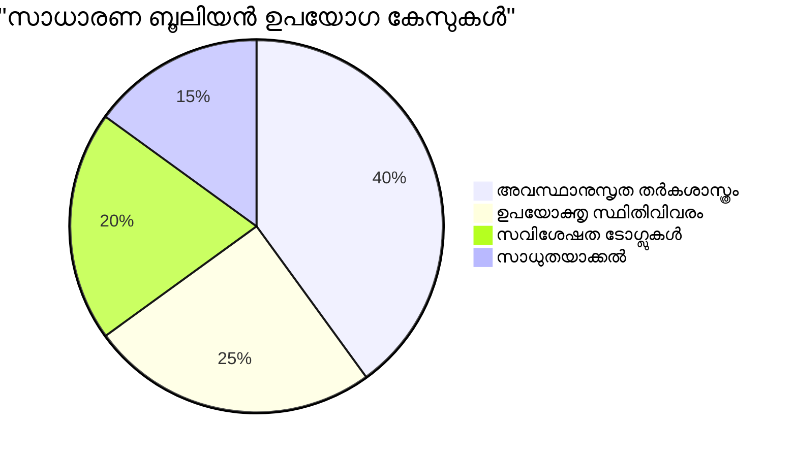
> **മനസിലിടുക**: ജാവാസ്ക്രിപ്റ്റിൽ 6 മാത്രം മൂല്യങ്ങൾ falsy ആണ്: `false`, `0`, `""`, `null`, `undefined`, `NaN`. മറ്റെല്ലാം truthy ആണ്!

---

## 📊 **നിങ്ങളുടെ ഡാറ്റാ ടൈപ്പുകളുടെ ടൂൾകിറ്റ് സംഗ്രഹം**

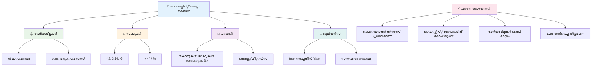
## GitHub Copilot ഏജന്റ് ചലഞ്ച് 🚀

അടുത്ത ചലഞ്ച് പൂർത്തിയാക്കാൻ ഏജന്റ് മോഡ് ഉപയോഗിക്കൂ:

**വിവരണം:** ഈ പാഠത്തിൽ പഠിച്ച എല്ലാ ജാവാസ്ക്രിപ്റ്റ് ഡാറ്റാ ടൈപ്പുകളും പ്രയോഗിച്ച്, യഥാർത്ഥ ലോക ഡാറ്റാ സീനാരിയോകൾ കൈകാര്യം ചെയ്യുന്ന വ്യക്തിഗത വിവര മാനേജറെ നിർമ്മിക്കുക.

**പ്രോമ്പ്റ്റ്:** വ്യക്തിയുടെ പേര് (സ്ട്രിംഗ്), പ്രായം (നമ്പർ), വിദ്യാർഥിയായിരിക്കുന്ന പദവി (ബിูลിയൻ), ഇഷ്ടനിറങ്ങൾ ഒരു അറേ ആയി, പത്തിടം, നഗരം, Zip കോഡ് ഉൾപ്പെടുന്ന അഡ്രസ് ഒബ്ജക്റ്റ് ഉള്ള ഒരു ഉപയോക്തൃ പ്രൊഫൈൽ ഒബ്ജക്റ്റ് ഒരുക്കുക. പ്രൊഫൈൽ വിവരങ്ങൾ പ്രദർശിപ്പിക്കുന്ന ഫങ്ഷനുകളും, വ്യക്തിഗത ഫീൽഡുകൾ അപ്‌ഡേറ്റ് ചെയ്യുന്നതിനുള്ള ഫങ്ഷനുകളും ഉൾക്കൊള്ളിക്കുക. സ്ട്രിംഗ് concatenate, ടെംപ്ലേറ്റ് ലിറ്ററൽ, പ്രായത്തോടുകൂടിയ അക്കമാറ്റങ്ങൾ, വിദ്യാർഥി നിലക്കുള്ള ബൂലിയൻ ലജിക് എന്നിവയുടെ പ്രയോഗം കാണിക്കുക.

[അജന്റ് മോഡ്](https://code.visualstudio.com/blogs/2025/02/24/introducing-copilot-agent-mode) ഇവിടെ കൂടി അറിയാം.

## 🚀 ചലഞ്ച്

ജാവാസ്ക്രിപ്റ്റിന് ചില പെരുമാറ്റങ്ങളുണ്ട് ഡെവലപ്പർമാരെ അത്ഭുതപ്പെടുത്തുന്ന. ദയവായി ഇങ്ങനെ ഒരു ക്ലാസിക് ഉദാഹരണത്തിൽ പരീക്ഷിക്കൂ: ബ്രൗസർ കോൺസോളിൽ ടൈപ്പ് ചെയ്യുക: `let age = 1; let Age = 2; age == Age` തുടർന്ന് ഫലം ഓബ്സർവ് ചെയ്യുക. ഇത് `false` ആണ് തിരിച്ചു നൽകുന്നത് – കാരണം എന്തെന്ന് കണ്ടെത്ത முடியുമോ?

ഇത് അറിഞ്ഞിരിക്കേണ്ട ജാവാസ്ക്രിപ്റ്റ് പെരുമാറ്റങ്ങൾക്കുള്ള ഒന്ന് മാത്രം ഉദാഹരണമാണ്. ഈ അർത്ഥം മനസ്സിലാക്കിയാൽ നിങ്ങളുടെ കോഡിംഗ് വിശ്വാസ്യത മെച്ചപ്പെടുത്താനും ഡീബഗ് ചെയ്യാനും സഹായിക്കും.

## ലക്ചറിന് ശേഷം ചോദ്യാവള

[Post-lecture quiz](https://ff-quizzes.netlify.app)

## അവലോകനവും സ്വയം പഠനവും

[ഈ ജാവാസ്ക്രിപ്റ്റ് വ്യായാമങ്ങളുടെ പട്ടിക](https://css-tricks.com/snippets/javascript/) ഒരു പരീക്ഷണമെടുക്കൂ. നിങ്ങൾ എന്തു പഠിച്ചു?

## അസൈന്മെന്റ്

[ഡാറ്റാ ടൈപ്പുകൾ പ്രാക്ടീസ്](assignment.md)

## 🚀 നിങ്ങളുടെ ജാവാസ്ക്രിപ്റ്റ് ഡാറ്റാ ടൈപ്പുകളുടെ മാസ്റ്ററി ടൈംലൈൻ

### ⚡ **അടുത്ത 5 മിനിറ്റിൽ എന്ത് ചെയ്യാം**
- [ ] ബ്രൗസർ കോൺസോളിൽ 3 വ്യത്യസ്ത ഡാറ്റാ ടൈപ്പുള്ള വെറിയബിളുകൾ സൃഷ്ടിക്കുക
- [ ] ചലഞ്ച് പരീക്ഷിക്കുക: `let age = 1; let Age = 2; age == Age` എന്തുകൊണ്ട് false ആണ് എന്ന് കണ്ടെത്തുക
- [ ] നിങ്ങളുടെ പേര്, ഇഷ്ട നമ്പറില്‍ സ്ട്രിംഗ് concatenate ചെയ്യൽ പ്രാക്ടീസ് ചെയ്യുക
- [ ] ഒരു നമ്പർ ഒരു സ്ട്രിംഗ് ചേർത്താൽ എന്ത് സംഭവിക്കും എന്ന് പരീക്ഷിക്കുക

### 🎯 **ഈ മണിക്കൂറിൽ നേടുമെന്ത്**
- [ ] പാഠത്തിനു ശേഷം ചോദ്യാവളം പൂർത്തിയാക്കുകയും സംശയങ്ങൾ അവലോകനം ചെയ്യുക
- [ ] രണ്ട് നമ്പറുകൾ കൂട്ടും, കുറയും, ഗുണിക്കുകയും, വിഭജിക്കുകയും ചെയ്യുന്ന സുലഭ കാൽക്കുലേറ്റർ സൃഷ്ടിക്കുക
- [ ] ടെംപ്ലേറ്റ് ലിറ്ററൽ ഉപയോഗിച്ച് ഒരു ലളിതം പേരിന്റെ ഫോർമാറ്റർ बनിക്കുക
- [ ] `==` മേൽ `===` താരതമ്യ ഓപ്പറേറ്റർമാരില്‍ വ്യത്യാസം പഠിക്കുക
- [ ] വ്യത്യസ്ത ഡാറ്റാ ടൈപ്പുകൾ തമ്മിൽ പരിവർത്തനം ചെയ്യുന്നതിനുള്ള പ്രാക്ടീസ്

### 📅 **നിങ്ങളുടെ ആഴ്ചവാരി ജാവാസ്ക്രിപ്റ്റ് ഫൗണ്ടേഷൻ**
- [ ] നിറഞ്ഞ ആത്മവിശ്വാസത്തോടെയും സൃഷ്ടിപരമായതുമായ അസൈൻമെന്റ് പൂർത്തിയാക്കുക
- [ ] പഠിച്ച എല്ലാ ഡാറ്റാ ടൈപ്പുകളും ഉപയോഗിച്ച് വ്യക്തിഗത പ്രൊഫൈൽ ഒബ്ജക്റ്റ് സൃഷ്ടിക്കുക
- [ ] [CSS-Tricks-ലെ ജാവാസ്ക്രിപ്റ്റ് വ്യായാമങ്ങൾ](https://css-tricks.com/snippets/javascript/) ഉപയോഗിച്ച് പ്രാക്ടീസ് ചെയ്യുക
- [ ] ബൂലിയൻ ലാജിക്കിനെ ഉപയോഗിച്ച് ലളിതമായ ഫോർം വാലിഡേറ്റർ നിർമ്മിക്കുക
- [ ] അറേയും ഒബ്ജക്റ്റും (എന്നും വരാനിരിക്കുന്ന പാഠങ്ങളിൽ വിശദമായി കാണും) ഉപയോഗിച്ച് പരീക്ഷണം നടത്തുക
- [ ] ജാവാസ്ക്രിപ്റ്റ് കമ്മ്യൂണിറ്റിയിൽ ചേരുകയും ഡാറ്റാ ടൈപ്പുകളെക്കുറിച്ച് ചോദ്യങ്ങൾ ചോദിക്കുകയും ചെയ്യുക

### 🌟 **നിങ്ങളുടെ മാസം നീളുന്ന മാറ്റം**
- [ ] വലിയ പ്രോഗ്രാമിംഗ് പ്രോജెక్టുകളിൽ ഡാറ്റാ ടൈപ്പ് അറിവ് സംയോജിപ്പിക്കുക
- [ ] യാഥാർത്ഥ്യ പ്രയോഗങ്ങളിൽ ഏത് ഡാറ്റാ ടൈപ്പ് എപ്പോഴും വേണം എന്ന് മനസ്സിലാക്കുക
- [ ] മറ്റ് തുടക്കക്കാരെ ജാവാസ്ക്രിപ്റ്റ് അടിസ്ഥാനങ്ങൾ മനസ്സിലാക്കാൻ സഹായിക്കുക
- [ ] വിവിധ ഉപയോക്തൃ ഡാറ്റ കൈകാര്യം ചെയ്യുന്ന സ്മോൾ ആപ്ലിക്കേഷൻ നിർമ്മിക്കുക
- [ ] ടൈപ്പ് കോപ്ഷൻ, കഠിനമായ സമത്വം പോലുള്ള ഉയർന്ന ഡാറ്റാ ടൈപ്പ് ആശയങ്ങൾ അഭ്യസിക്കുക
- [ ] ഡോകുമെന്റേഷന്‍ മെച്ചപ്പെടുത്തലുകൾ ഉൾപ്പെടുത്തി ഓപ്പൺ സോഴ്‌സ് ജാവാസ്ക്രിപ്റ്റ് പ്രോജക്ടുകളിൽ പങ്കാളിയായി

### 🧠 **അവസാന ഡാറ്റാ ടൈപ്പ് മാസ്റ്ററി പരിശോധന**

**നിങ്ങളുടെ ജാവാസ്ക്രിപ്റ്റ് അടിസ്ഥാനങ്ങൾ ആഘോഷിക്കുക:**
- അവൾ/അവൻ പെരുമാറ്റത്തിന് ഏറ്റവും അത്ഭുതമുള്ള ഡാറ്റാ ടൈപ്പ് ഏതാണ്?
- വേരിയബിളുകളെക്കാൾ കോൺസ്റ്റന്റുകൾ എങ്ങനെ വ്യത്യസ്‌തമാണ് എന്ന് ഒരു സുഹൃത്തിനോട് വിശദീകരിക്കാൻ എത്രത്തോളം ആത്മവിശ്വാസമാണ്?
- ജാവാസ്ക്രിപ്റ്റ് ടൈപ്പ് സിസ്റ്റത്തെക്കുറിച്ച് കണ്ടെത്തിയ ഏറ്റവും രസകരമായ കാര്യം എന്ത്?
- ഈ അടിസ്ഥാനങ്ങളിൽക്കൈയ്യുള്ള യാഥാർത്ഥ്യ ആപ്ലിക്കേഷൻ ഏതാണ് രചനാവിന് ഏറ്റവും അനുയോജ്യം?

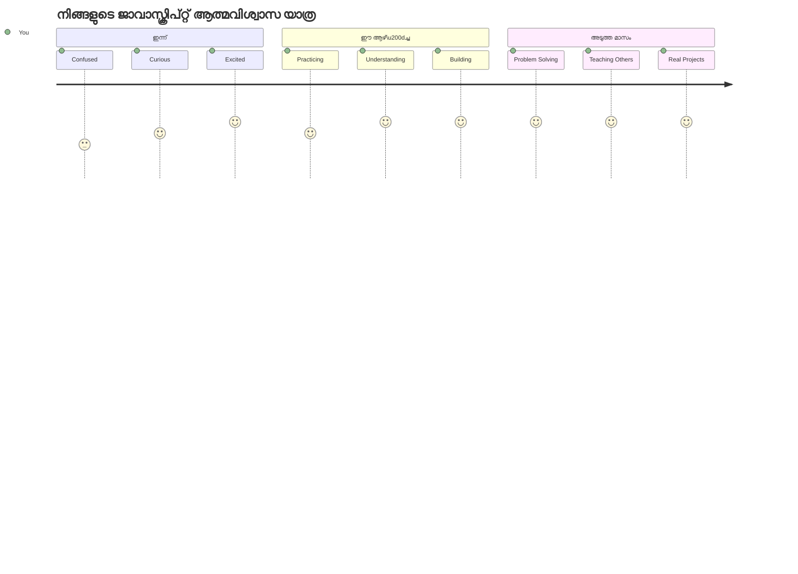
> 💡 **നിങ്ങൾ അടിസ്ഥാനങ്ങൾ നന്നായി നിർമ്മിച്ചു!** ഡാറ്റാ ടൈപ്പുകൾ മനസ്സിലാക്കുന്നത് കഥകൾ എഴുതുന്നതിന് മുമ്പ് അക്ഷരമാല പഠിക്കുന്നതുപോലെ ആണ്. നിങ്ങൾ എഴുതുന്ന എല്ലാ ജാവാസ്ക്രിപ്റ്റ് പ്രോഗ്രാമുകളും ഈ അടിസ്ഥാന ആശയങ്ങൾ ഉപയോഗിക്കും. ഇപ്പോൾ നിങ്ങൾക്ക് ഇന്ററാക്ടീവ് വെബ്സൈറ്റുകൾ, ഡൈനാമിക് ആപ്ലിക്കേഷനുകൾ സൃഷ്ടിക്കാനും യഥാർത്ഥ പ്രശ്നങ്ങൾ കോഡിലൂടെ പരിഹരിക്കാനും കഴിയും. ജാവാസ്ക്രിപ്റ്റിന്റെ അത്ഭുത ലോകത്തിലേക്ക് സ്വാഗതം! 🎉

---

<!-- CO-OP TRANSLATOR DISCLAIMER START -->
**അസാധുതാ കുറിപ്പ്**:
ഈ പ്രമാണം AI ഭാഷാന്തര സേവനം [Co-op Translator](https://github.com/Azure/co-op-translator) ഉപയോഗിച്ച് വിവർത്തനം ചെയ്തിട്ടുണ്ട്. ഞങ്ങൾ യഥാർത്ഥതയ്ക്കായി ശ്രമിക്കുനെങ്കിലും, സ്വയം പ്രവർത്തിക്കുന്ന വിവർത്തനത്തിൽ പിശകുകൾ അല്ലെങ്കിൽ തെറ്റായ വിവരങ്ങൾ ഉണ്ടാകാമെന്ന് മനസ്സിലാക്കുക. അതിന്റെ മാതൃഭാഷയിലുള്ള原始 പ്രമാണം അനുവദനീയമായ പ്രാമാണിക ഉറവിടമായിരിക്കണം. പ്രധാന വിവരങ്ങൾക്ക്, പ്രൊഫഷണൽ മനുഷ്യ വിവർത്തനം ശിപാർശ ചെയ്യുന്നു. ഈ വിവർത്തനം ഉപയോഗിക്കുന്നതിൽ നിന്നാകുന്ന quaisquer തെറ്റിദ്ധാരണകൾക്കോ തെറ്റായ വ്യാഖ്യാനങ്ങൾക്കോ ഞങ്ങൾക്ക് ഉത്തരവാദിത്വമില്ല.
<!-- CO-OP TRANSLATOR DISCLAIMER END -->