<!--
CO_OP_TRANSLATOR_METADATA:
{
  "original_hash": "71f7d7dafa1c7194d79ddac87f669ff9",
  "translation_date": "2026-01-08T12:24:14+00:00",
  "source_file": "2-js-basics/2-functions-methods/README.md",
  "language_code": "ml"
}
-->
# ജാവാസ്ക്രിപ്റ്റ് അടിസ്ഥാനങ്ങൾ: മെത്തഡുകളും ഫങ്ഷനുകളും


> സ്‌കെച്ച്നോട്ട് [Tomomi Imura](https://twitter.com/girlie_mac) tərəfindən

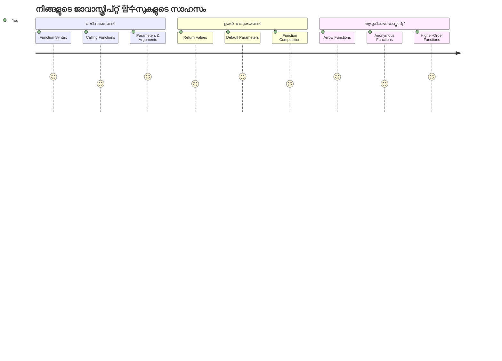
## പ്രീ-ലെക്ചർ ക്വിസ്
[പ്രി-ലെക്ചർ ക്വിസ്](https://ff-quizzes.netlify.app)

ഒരേ കോഡ് വീണ്ടും വീണ്ടും എഴുതുന്നത് പ്രോഗ്രാമിങ് രംഗത്തെ ഏറ്റവും സാധാരണമായ അസൂയകളിലൊന്നാണ്. ഫങ്ഷനുകൾ ഈ പ്രശ്നം പരിഹരിക്കുന്നു, കോഡ് പുനരുപയോഗയോഗമുള്ള ബ്ലോക്കുകളായി പാക്ക് ചെയ്യാനായി. ഫങ്ഷനുകളെ ആസംബ്ലി ലൈൻ വിപ്ലവമ 만든 ഹെൻറി ഫോർഡിന്റെ സ്റ്റാൻഡേർഡൈസുചെയ്ത് ഭാഗങ്ങളായി കരുതാം – നിങ്ങൾ ഒരു വിശ്വാസയോഗ്യമായ ഘടകം സൃഷ്ടിച്ച ശേഷം, അത് എവിടെയും ആവശ്യമുള്ളപ്പോൾ വീണ്ടും നിർമ്മിക്കാതെ ഉപയോഗിക്കാം.

ഫങ്ഷനുകൾ നിങ്ങൾക്ക് കോഡിന്റെ ഭാഗങ്ങൾ കൂട്ടിച്ചേർത്തെടുക്കാനും അവ നിങ്ങളുടെ പ്രോഗ്രാമിലൊട്ടും പുനരുപയോഗിക്കാനും അനുയോജ്യമാണ്. ഒരേ ലോജിക്ക് എല്ലായിടത്തും കോപി-പേസ്റ്റ് ചെയ്യാനിടയുടെ പകരം, ഒരു function സൃഷ്ടിച്ച് ആവശ്യമുള്ളപ്പോൾ അത് വിളിക്കാം. ഈ സമീപനം നിങ്ങളുടെ കോഡ് ക്രമപ്പെടുത്തിയതാക്കുകയും അപ്ഡേറ്റുകൾ എളുപ്പമാക്കുകയും ചെയ്യും.

ഈ പാഠത്തിൽ, നിങ്ങൾ നിങ്ങളുടെ സ്വന്തം ഫങ്ഷനുകൾ എങ്ങനെ സൃഷ്ടിക്കാമെന്ന്, അവയ്ക്ക് വിവരം എങ്ങനെ പാസ്സ് ചെയ്യാമെന്നും, അവയിൽ നിന്ന് പ്രയോജനപ്രദമായ ഫലങ്ങൾ എങ്ങനെ ലഭിക്കാമെന്നുമാണ് പഠിക്കുക. ഫങ്ഷനുകളും മെത്തഡുകളും തമ്മിലുള്ള വ്യത്യാസം, ആധുനിക സിന്താക്സ് സമീപനങ്ങൾ, ഫങ്ഷനുകൾ മറ്റൊരു ഫങ്ഷനുകളോടൊത്തുപോകുന്നത് എന്നിവ കാണും. ഈ ആശയങ്ങൾ പടിറ്റ് പടിറ്റ് നിർമ്മിക്കും.

[](https://youtube.com/watch?v=XgKsD6Zwvlc "Methods and Functions")

> 🎥 മുകളിൽ ചിത്രത്തിൽ ക്ലിക്ക് ചെയ്ത് മെത്തഡുകളും ഫങ്ഷനുകളും സംബന്ധിച്ച വീഡിയോ കാണുക.

> നിങ്ങൾ ഈ പാഠം [Microsoft Learn](https://docs.microsoft.com/learn/modules/web-development-101-functions/?WT.mc_id=academic-77807-sagibbon)ൽ എടുത്തു പഠിക്കാം!

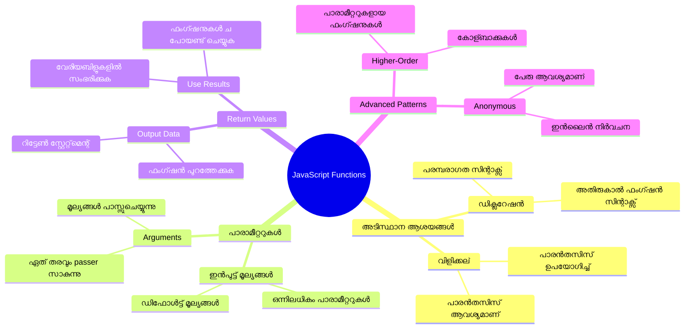
## ഫങ്ഷനുകൾ

ഒരു function എന്നത് ഒരു സ്വ-സംയുക്തമായ കോഡ് ബ്ലോക്കാണ്, പ്രത്യേകമായ ഒരു പ്രവൃത്തി നിർവഹിക്കുന്നു. നിങ്ങൾക്ക് ആവശ്യമുള്ളപ്പോൾ എപ്പോൾ വേണമെങ്കിലും പ്രവർത്തിപ്പിക്കാവുന്ന ലൊജിക്ക് ഇതിൽ ഉൾക്കൊള്ളിച്ചിരിക്കുന്നു.

പ്രോഗ്രാമിന്റെ വിവിധ ഭാഗങ്ങളിൽ ഒരേ കോഡ് ഭാവത്തിൽ കുറിപെടുത്തുന്നതിന് പകരം, അത് ഒരു ഫങ്ഷനിൽ പാക്ക് ചെയ്ത് ആവശ്യമുള്ളപ്പോൾ ആ ഫങ്ഷനു വിളിക്കുക. ഈ സമീപനം നിങ്ങളുടെ കോഡ് ശുദ്ധവും മെച്ചപ്പെട്ടതുമായതാക്കുകയും അപ്ഡേറ്റുകൾ എളുപ്പമാക്കുകയും ചെയ്യും. നിങ്ങളുടെ കോഡ്‌ബേസിലെ 20 വ്യത്യസ്ത സ്ഥലങ്ങളിൽ വ്യത്യസ്തമായ ലോജിക്ക് മാറ്റേണ്ടിവന്നാൽ അതിന്റെ പരിപാലന വെല്ലുവിളി കണക്കാക്കുക.

നിങ്ങളുടെ ഫങ്ഷനുകൾക്ക് വിവരണാത്മകമായ പേരുകൾ നൽകുന്നത് மிக പ്രധാനമാണ്. നല്ല പേരിട്ടു function-ന് അവരുടെ ഉദ്ദേശ്യം വ്യക്തമായി അറിയിക്കാം—`cancelTimer()` കാണുമ്പോൾ അത് എന്ത് ചെയ്യുമെന്ന് ചെയ്യാണെന്ന് നทันായിപ്പോകും; ഒരു വ്യക്തമായി ലേബൽ ചെയ്ത ബട്ടൺ ബട്ടൺ ക്ലിക്ക് ചെയ്താൽ എന്ത് സംഭവിക്കും എന്ന് വ്യക്തമാക്കുന്നതുപോലെ.

## ഫങ്ഷൻ സൃഷ്ടിക്കുകയും വിളിക്കുകയും ചെയ്യൽ

ഒരു function സൃഷ്ടിക്കുന്നത് പരിശോധിക്കാം. സിന്താക്സ് സ്ഥിരതയുള്ള ഒരു മാതൃക പിന്തുടരുന്നു:

```javascript
function nameOfFunction() { // ഫംഗ്ഷൻ നിർവചനം
 // ഫംഗ്ഷൻ നിർവചനം/ശരീരം
}
```

ഇത് വിശദീകരിക്കാം:
- `function` കീവേർഡ് ജാവാസ്ക്രിപ്റ്റിന് "ഞാൻ ഒരു function സൃഷ്ടിക്കുന്നു!" എന്ന സന്ദേശം നൽകുന്നു
- `nameOfFunction` നിങ്ങളുടെ function-ന് വിവരണാത്മകമായ പേര് നൽകുന്നിടം
- പരിതസ്ഥിതികളുള്ള parentheses `()` ആണ്, അവയ്ക്ക് ഞങ്ങൾ ഉടൻ എത്തും
- കർളി ബ്രേസസ് `{}` function വിളിക്കുമ്പോൾ പ്രവർത്തിക്കുന്ന യഥാർത്ഥ കോഡ് ഉൾക്കൊള്ളുന്നു

ഈ പ്രവർത്തനം കാണാൻ ഒരു ലളിതമായ ഗ്രീറ്റിങ് function സൃഷ്ടിക്കാം:

```javascript
function displayGreeting() {
  console.log('Hello, world!');
}
```

ഈ function "Hello, world!" കോൺസോളിൽ പ്രിന്റ് ചെയ്യും. നിങ്ങൾ അത് നിർവചിച്ചശേഷം, ആവശ്യമുള്ളപ്പോൾ എത്രവും ഉപയോഗിക്കാം.

നിങ്ങളുടെ function-നെ എക്സിക്യൂട്ട് അല്ലെങ്കിൽ "വിളിക്കാൻ", function നാമം യടുത്ത parentheses-നൊപ്പം എഴുതുക. ജാവാസ്ക്രിപ്റ്റ് function-നെ വിളിക്കാനുമുമ്പോ പിന്നിലോ നിർവചിക്കാൻ അനുവദിക്കുന്നു — ജാവാസ്ക്രിപ്റ്റ് എഞ്ചിൻ പ്രവർത്തനക്രമം കൈകാര്യം ചെയ്യും.

```javascript
// നമ്മുടെ ഫംഗ്ഷൻ വിളിക്കുന്നത്
displayGreeting();
```

ഈ വരി പ്രവർത്തിപ്പിക്കുമ്പോൾ, അത് നിങ്ങളുടെ `displayGreeting` function-ലുള്ള എല്ലാ കോഡും എക്സിക്യൂട്ട് ചെയ്ത്, വെബ് ബ്രൗസറിന്റെ കോൺസോളിൽ "Hello, world!" പ്രദർശിപ്പിക്കും. നിങ്ങൾ ഈ function ആവർത്തിച്ച് വിളിക്കാവുന്നു.

### 🧠 **ഫങ്ഷൻ അടിസ്ഥാന പരിശോധന: നിങ്ങളുടെ ആദ്യ ഫങ്ഷനുകൾ നിർമ്മിക്കൽ**

**ഫങ്ഷനുകളുടെ അടിസ്ഥാനങ്ങൾ എങ്ങനെ നിങ്ങൾക്ക് മനസ്സിലായെന്ന് നോക്കാം:**
- function നിർവചിക്കുമ്പോൾ മൂന്നൻത്ര curly braces `{}` ഉപയോഗിക്കുന്നത് എന്തുകൊണ്ടാണ്?
- parentheses ഇല്ലാതെ `displayGreeting` എഴുതിയാൽ എന്തായി?
- ഒരേ function പല തവണ വിളിക്കാൻ എന്തുകൊണ്ട് ആഗ്രഹിക്കണം?

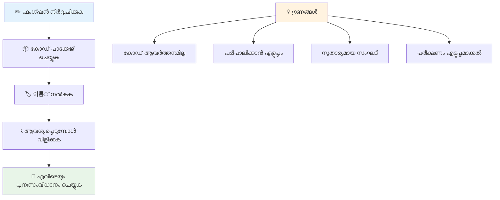
> **കുറിപ്പ്:** നിങ്ങൾ ഈ പാഠങ്ങളിലുടനീളം **methods** ഉപയോഗിച്ചിരിക്കുകയാണ്. `console.log()` ഒരു method ആണ് – അതായത് `console` ഒബ്‌ജക്റ്റിൻ്റെ ഭാഗമായ ഒരു ഫങ്ഷൻ. പ്രധാന വ്യത്യാസം methods ഒബ്‌ജക്റ്റുകളോട് ബന്ധമുള്ളവയാണ്, functions സ്വയം നിലനിൽക്കുന്നു. പല ഡെവലപ്പർമാർ ഈ പദങ്ങൾ സൗമ്യ സംഭാഷണത്തിൽ പരസ്പരം മാറി ഉപയോഗിക്കുന്നു.

### ഫങ്ഷൻ മികച്ച കരുത്തുകൾ

നിങ്ങളുടെ ഫങ്ഷനുകൾ മികച്ചതാക്കാൻ പരിഗണിക്കേണ്ട ചില ടിപ്പുകൾ:

- ഫങ്ഷനുകൾക്ക് സ്പഷ്‌ടവും വിവരണാത്മകവുമായ പേര് നൽകുക – ഭാവിയിലെ നിങ്ങൾ നന്ദി പറയുമ്!
- പലയിടങ്ങളുള്ള പേര് എഴുതുമ്പോൾ **camelCase** ഉപയോഗിക്കുക (`calculateTotal` എന്നറിയുന്നത് നല്ലത്, `calculate_total`-നേക്കാൾ)
- ഓരോ ഫങ്ഷനും ഒരു കാര്യത്തിൽ മാത്രം ശ്രദ്ധ കേന്ദ്രീകരിക്കാൻ ശ്രമിക്കുക

## function-க்கு വിവരം പാസ്സ് ചെയ്യൽ

നമ്മുടെ `displayGreeting` function പരിമിതമാണ് – എല്ലാവർക്കും "Hello, world!" മാത്രം പ്രദർശിപ്പിക്കുന്നു. പാരാമീറ്ററുകൾ function-നെ കൂടുതൽ ഫ്ലെക്സിബിളും പ്രയോജനപ്രദവുമാക്കുന്നു.

**പാരാമീറ്ററുകൾ** function ഉപയോഗിക്കുന്ന ഓരോ തവണ വ്യത്യസ്ത മൂല്യങ്ങൾ നൽകാനുള്ള പ്ലേസ്‌ഹോൾഡറുകൾ പോലെ ആണ്. ഇതുപോലെ, ഒരേ function ഓരോ വിളുപ്പിലും വ്യത്യസ്ത വിവരങ്ങളോടെ പ്രവർത്തിക്കും.

function നിർവചിക്കുമ്പോൾ parentheses-ലുള്ള പാരാമീറ്ററുകൾ comma കൊണ്ട് വേർതിരിച്ച് പട്ടികവത്‌ക്കരിക്കുന്നു:

```javascript
function name(param, param2, param3) {

}
```

ഓരോ പാരാമീറ്ററും പ്ലേസ്‌ഹോൾഡർ പോലെയാണ് – function വിളിക്കുന്നവർ യഥാർത്ഥ മൂല്യങ്ങൾ നൽകും, അവ ഇവിടെ പൂരിപ്പിക്കും.

നമുക്ക് greet ചെയ്യാനുള്ള function നംൗൻ സ്വീകരിക്കാൻ തിരുത്താം:

```javascript
function displayGreeting(name) {
  const message = `Hello, ${name}!`;
  console.log(message);
}
```

നാം backticks (`` ` ``)യും `${}` ഉപയോഗിച്ച് പേര് നേരിട്ട് സന്ദേശത്തിൽ ചേർക്കുന്നതായി ശ്രദ്ധിക്കുക – ഇതിനെ template literal എന്ന് പറയുന്നു, ഉപയോഗിച്ച് വേരിയബിൾസ് ഉള്‍പ്പെടുത്തിയുള്ള സ്ട്രിംഗ് നിർമ്മിക്കാനുള്ള വളരെ സുഖകരമായ മാർഗമാണ്.

ഇപ്പോൾ function വിളിക്കുമ്പോൾ, എല്ലാ പേരുകളും പാസ്സ് ചെയ്യാം:

```javascript
displayGreeting('Christopher');
// പ്രവർത്തിപ്പിക്കുമ്പോൾ "Hello, Christopher!" പ്രദർശിപ്പിക്കുന്നു
```

ജാവാസ്ക്രിപ്റ്റ് സ്റ്റ്രിംഗ് `'Christopher'`-നെ `name` പാരാമീറ്ററിന് നിയോഗിച്ച് "Hello, Christopher!" എന്ന വ്യക്തിഗത സന്ദേശം സൃഷ്ടിക്കുന്നു.

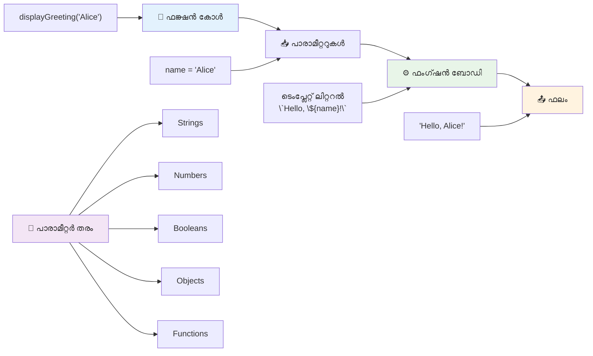
## ഡിഫോൾട്ട് മൂല്യങ്ങൾ

എന്തെങ്കിൽ ചില പാരാമീറ്ററുകൾ നിർബന്ധമല്ലാത്തതാക്കാൻ ആഗ്രഹിച്ചാൽ? അപ്പോൾ ഡിഫോൾട്ട് മൂല്യങ്ങൾ സഹായിക്കും!

നമുക്ക് പറയാം ആരും greet ചെയ്യാനുള്ള വാക്ക് തങ്ങൾ ഇച്ഛിച്ചില്ലെങ്കിൽ "Hello" എന്ന ഡിഫോൾട്ട് ഉപയോഗിക്കാം. ഡിഫോൾട്ട് മൂല്യങ്ങൾ variables സൃഷ്ടിക്കുമ്പോൾ നടക്കുന്നതാണ് പോലെ, `=` ചിഹ്നം ഉപയോഗിച്ച് നൽകാം:

```javascript
function displayGreeting(name, salutation='Hello') {
  console.log(`${salutation}, ${name}`);
}
```

ഇവിടെ, `name` ഇപ്പോഴും ആവശ്യമാണ്, പക്ഷേ `salutation`-ക്ക് `'Hello'` എന്ന ബാക്കപ്പ് മൂല്യം ഉണ്ടാകും, വേറെ greet പ്രവർത്തന ദിവസം നൽകിയില്ലെങ്കിൽ.

ഇപ്പോൾ ഈ function നാം എങ്ങനെ രണ്ട് വ്യത്യസ്ത രീതിയിൽ വിളിക്കാമെന്നും കാണാം:

```javascript
displayGreeting('Christopher');
// "ഹലോ, ക്രിസ്റ്റഫർ" പ്രദർശിപ്പിക്കുന്നു

displayGreeting('Christopher', 'Hi');
// "ഹായ്, ക്രിസ്റ്റഫർ" പ്രദർശിപ്പിക്കുന്നു
```

ആദ്യ വിളിപ്പിയിൽ, നാം `salutation` നൽകിയില്ല, അതുകൊണ്ട് ജാവാസ്ക്രിപ്റ്റ് ഡിഫോൾട്ട് "Hello" ഉപയോഗിക്കുന്നു. രണ്ടാം വിളിപ്പിയിൽ, നാം "Hi" personalizado ഉപയോഗിക്കുന്നു. ഇത് function-നെ വ്യത്യസ്ത സന്നിവേശങ്ങളിൽ അനുയോജ്യമായവതാക്കുന്നു.

### 🎛️ **പാരാമീറ്ററുകളുടെ കാര്യക്ഷമ പരിശോധന: ഫങ്ഷനുകൾ ഫ്ലെക്സിബിളാക്കൽ**

**പാരാമീറ്ററുകൾ എങ്ങനെ മനസ്സിലായെന്ന് പരിശോദിക്കാം:**
- പാരാമീറ്ററും argument-ഉം തമ്മിലുള്ള വ്യത്യാസം എന്താണ്?
- യഥാർത്ഥ പ്രോഗ്രാമിൽ ഡിഫോൾട്ട് മൂല്യങ്ങൾ എന്തുകൊണ്ട് സഹായകരമാണ്?
- പാരാമീറ്ററുകളുടെ എണ്ണംമщие argument-ന്മേൽ കൂടുതലായി പാസ്സ് ചെയ്താൽ എന്ത് സംഭവിക്കുന്നു എന്ന് പ്രവചിക്കാമോ?

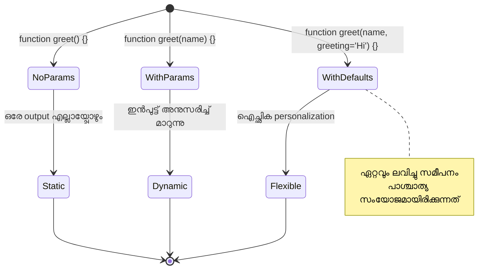
> **പ്രൊ ടിപ്പ്**: ഡിഫോൾട്ട് പാരാമീറ്ററുകൾ നിങ്ങളുടെ ഫങ്ഷനുകൾ ഉപയോക്തൃ സൗഹൃദമാക്കുന്നു. ഉപയോക്താക്കൾക്ക് സുതാര്യവും വേഗവും ലൈഫ് സ്റ്റാർട്ട് ചെയ്യാം എന്നാൽ വേണമെങ്കിൽ ഇഷ്ടാനുസൃതമാക്കാം!

## തിരിച്ചുള്ള മൂല്യങ്ങൾ

ഇപ്പോൾവരെ നമ്മുടെ ഫങ്ഷനുകൾ സന്ദേശങ്ങൾ പ്രിന്റ് ചെയ്യുകയായിരുന്നു, പക്ഷേ എന്തെങ്കിലും കണക്കാക്കാനും ഫലം തിരിച്ച് നൽകാനും ആഗ്രഹിക്കുന്നുവെങ്കിൽ?

അത് **return values** മുഖേന പറ്റും. Function വെറുതെ പ്രദർശിപ്പിക്കുന്നതിനുപകരം, ഒരു മൂല്യം തിരിച്ച് നൽകുന്നു, അത് നിങ്ങൾ വേരിയബിളിൽ സംഭരിച്ചു പ്രോഗ്രാമിന്റെ മറ്റു ഭാഗങ്ങളിൽ ഉപയോഗിക്കാം.

ഒരു മൂല്യം തിരിച്ച് നൽകാൻ, `return` കീവേർഡ് ഉപയോഗിച്ച് അതിനുശേഷം തിരികെ നൽകേണ്ട സംഖ്യ/വിവരമെന്നു എഴുതുക:

```javascript
return myVariable;
```

മുന്നറിയിപ്പ്: function `return` സ്റ്റേറ്റ്മെന്റ് കണ്ടാൽ ഉടനെ പ്രവർത്തനം നിർത്തി ആ മൂല്യം function വിളിച്ചവർക്കാണ് അയയ്ക്കുക.

നമുക്ക് greet function മാറ്റി സന്ദേശം പ്രിന്റ് ചെയ്യാതെ തിരിച്ച് നൽകാൻ ഒറ്റുവരിപോലെ എഴുതാം:

```javascript
function createGreetingMessage(name) {
  const message = `Hello, ${name}`;
  return message;
}
```

ഇപ്പോൾ function സന്ദേശം നിർമ്മിച്ച് തിരിച്ച് നൽകുന്നു, പ്രിന്റ് ചെയ്യുന്നു അല്ല.

തിരികെ ലഭിച്ച മൂല്യത്തെ ഉപയോഗിക്കാൻ, അത് ഒരു വേരിയബിളിൽ സേവ് ചെയ്യാം:

```javascript
const greetingMessage = createGreetingMessage('Christopher');
```

ഇപ്പോൾ `greetingMessage` "Hello, Christopher" വാല്യു ഇട്ടു സൂക്ഷിക്കുന്നു, അത് വെബ്പേജിലോ, ഇമെയിൽ ഉൾപ്പെടെയോ, മറ്റൊരു function-ിനും പാരാമീറ്ററായി ഉപയോഗിക്കാവുന്നുണ്ട്.

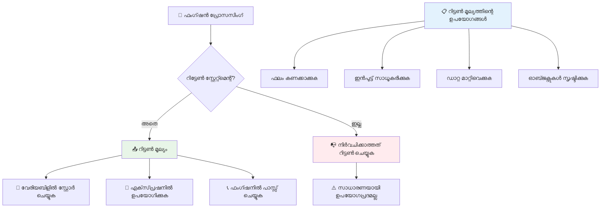
### 🔄 **തിരികെ വരുന്ന മൂല്യങ്ങൾ സംബന്ധിച്ച പരിശോധന**

**തിരികെ വരുന്ന മൂല്യങ്ങളെ കുറിച്ച് നിങ്ങൾ എന്ത് മനസ്സിലാക്കിയതായി വിലയിരുത്തുക:**
- function ഒന്ന് return statement കണ്ട ശേഷം ബാക്കിയുള്ള കോഡ് എങ്ങനെ നടക്കും?
- മൂല്യങ്ങൾ return ചെയ്യുന്നത് പ്രിന്റ് ചെയ്യുന്നതിനേക്കാൾ എന്തുകൊണ്ട് ഉത്തമമാണ്?
- function വ്യത്യസ്ത തരത്തിലുള്ള മൂല്യങ്ങൾ (string, number, boolean) തിരിച്ചു നൽകാമോ?

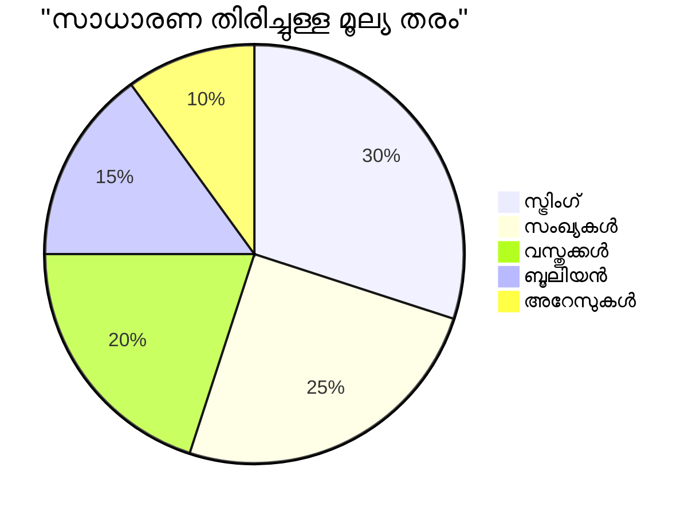
> **പ്രധാന ബിന്ദു**: return values function-കൾ കൂടുതൽ ഉപയോഗപ്രദമാണ് കാരണം വിളിച്ചവൻ ഫലം എങ്ങനെ ഉപയോഗിക്കുമെന്ന് തീരുമാനിക്കുന്നു. ഇത് നിങ്ങളുടെ കോഡ് കൂടുതൽ മൊഡുലർ, പുനർന്നിർമ്മിച്ചെടുക്കാവുന്നവയാക്കുന്നു!

## functions as parameters for functions

ഫങ്ഷനുകൾ മറ്റൊരു ഫങ്ഷന്റെ പാരാമീറ്ററായി നൽകാം. ഇത് ആദ്യം വളരെ സങ്കീർണ്ണമെന്നു തോന്നാമെങ്കിലും, ഇത് ശക്തമായ ഒരു സവിശേഷതയാണ്, ആത്മീയ പ്രോഗ്രാമിംഗ് മാതൃകകൾക്ക് സഹായകമാണിത്.

ഈ മാതൃക സാധാരണയായി "ചെയ്താൽ, ഈ ചെയ്യുക" എന്നുള്ള സന്ദേശം നൽകുമ്പോഴാണ് ഉപയോഗിക്കുന്നത്: "ടൈമർ പൂർത്തിയായാൽ ഈ കോഡ് പ്രവർത്തിപ്പിക്കുക" അല്ലെങ്കിൽ "ഉപയോക്താവ് ബട്ടൺ ക്ലിക്ക് ചെയ്യുമ്പോൾ ഈ function-നെ വിളിക്കുക."

`setTimeout` function കാണാം – ഇത് നിർദ്ദിഷ്ട സമയത്തേക്ക് കാത്തിരിപ്പു ചെയ്തു ശേഷം ചില കോഡ് പ്രവർത്തിപ്പിക്കുന്നു. നമുക്ക് അത് എന്ത് കോഡ് പ്രവർത്തിപ്പിക്കണമെന്ന് പറയണം – function പാസ്സ് ചെയ്യാനുള്ള അനുയോജ്യ അവസരം!

ഇതുപോലെ ഒരു കോഡ് പരീക്ഷിക്കുക – 3 സെക്കൻഡ് കഴിഞ്ഞാൽ സന്ദേശം കാണും:

```javascript
function displayDone() {
  console.log('3 seconds has elapsed');
}
// ടൈമർ മൂല്യം മില്ലിസെക്കൻഡുകളിൽ ആണ്
setTimeout(displayDone, 3000);
```

`displayDone` function parentheses ഇല്ലാതെ `setTimeout`-നു പാസ്സ് ചെയ്യുന്നു. നാം function വിളിക്കുന്നില്ല, സെറ്റ് ടൈമൗട്ടിന് ഞങ്ങൾ function കൈമാറി 3 സെക്കന്റ് കഴിഞ്ഞ് വിളിക്കണമെന്നു പറയുന്നു.

### അനാമിത ഫങ്ഷനുകൾ

ഒറേ function നിഷ്‌ക്കർഷമായി ഒരിക്കൽ മാത്രം ആവശ്യമുണ്ടെങ്കില്‍, അതിനൊരു പേര് നൽകാതെ നിർവചിക്കാം. കാരണം ഒരിക്കൽ മാത്രമെങ്കിലും ഉപയോഗിക്കുമ്പോൾ function-നെ പേരോടെ പുറത്തെടുക്കുന്നത് കോഡ് അട്ടുപടുക്കാൻ ഇടയാക്കും.

ജാവാസ്ക്രിപ്റ്റ് **അനോനിമസ് functions** നിർമ്മിക്കാൻ അനുവദിക്കുന്നു – പേരില്ലെ function-കൾ, നിങ്ങള്‍ അവ ആവശ്യമായിടത്ത് തന്നെ നിർവചിക്കാൻ കഴിയും.

നമുക്ക് ടൈമർ ഉദാഹരണത്തിൽ അനോനിമസ് function ഉപയോഗിച്ച് ആ ഉപായം പരീക്ഷിക്കാം:

```javascript
setTimeout(function() {
  console.log('3 seconds has elapsed');
}, 3000);
```

ഫലം സമാനമാണ്, പക്ഷേ function `setTimeout` വിളിക്കുമ്പോൾ നേരിട്ട് നിർവചിക്കുന്നു. വേറെ function നിർവചനം വേണ്ടാതിരിക്കും.

### ഫാറ്റ് ആറോ functions

ആധുനിക ജാവാസ്ക്രിപ്റ്റിന് functions എഴുതി സ്ക്രിപ്റ്റ് കുറയ്ക്കാനുള്ള ഒരു സംക്ഷിപ്ത മാർഗ്ഗം ഉണ്ട്, ഇതിനെ **ആറോ functions** എന്നാണ് വിളിക്കുന്നത്. അവയ്ക്ക് `=>` ചിഹ്നം ഉപയോഗിക്കുന്നു (ഒരു ുെറോ പോലെയാണ് – മനസ്സിലായി?), ഡെവലപ്പർമാർക്കിടയിൽ വളരെ ജനപ്രിയമാണ്.

ആറോ functions `function` കീവേർഡ് ഒഴിവാക്കി കൂടുതൽ സംക്ഷിപ്തമായി എഴുതാൻ സഹായിക്കുന്നു.

ടൈമർ ഉദാഹരണത്തിനു താഴെ കാണാം:

```javascript
setTimeout(() => {
  console.log('3 seconds has elapsed');
}, 3000);
```

`()`-ലാണ് പാരാമീറ്ററുകൾ പോകുന്നത് (ഇവിടം ശൂന്യമാണ്), തുടർന്ന് arrow `=>`, ഒടുവിൽ curly braces-ൽ function body. ഇത് ഫങ്ഷനിലെ പ്രവർത്തനം എളുപ്പത്തോടെ എത്തിക്കുന്നു.

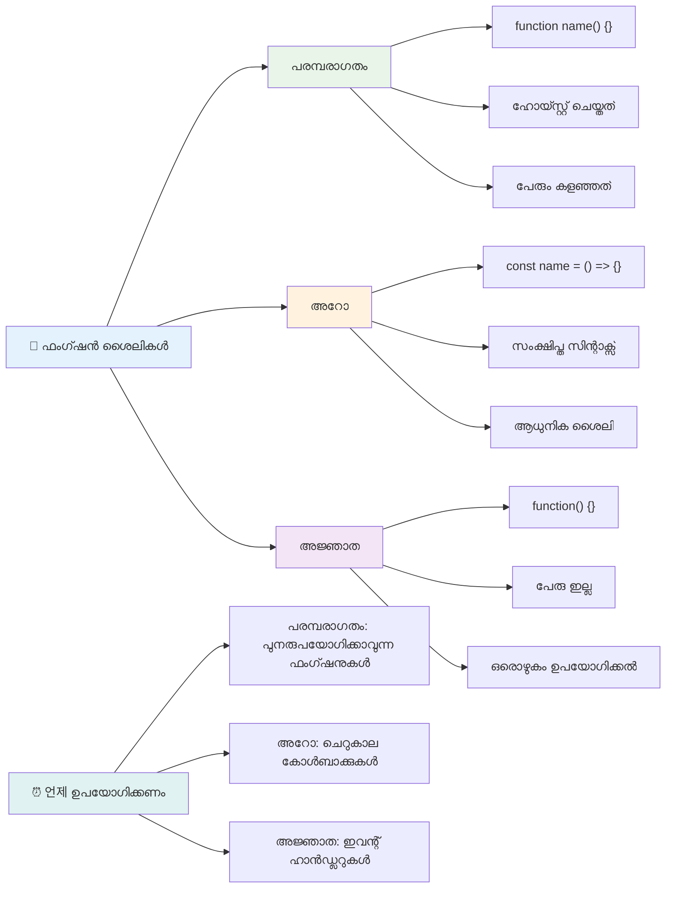
### ഓരോ വിധേയം എപ്പോൾ ഉപയോഗിക്കണം?

ഏത് സമീപനം ഏപ്പോൾ വേണ്ട? ഒരു പ്രായോഗിക മാർഗ്ഗം: function പല തവണ ഉപയോഗിക്കാൻ പോകുമ്പോൾ അതിന് പേര് നൽകുക കൂടാതെ വേർതിരിച്ച് നിർവചിക്കുക. ഒരു പ്രാവശ്യത്തിനായിരിക്കും function എങ്കിൽ അനാമിത function പരിഗണിക്കുക. ആധുനിക ജാവാസ്ക്രിപ്റ്റിൽ arrow functions വ്യത്യസ്ത രീതികളെയാണ് കാണുന്നത്, പക്ഷേ പരമ്പരാഗത function സിന്താക്സും പ്രസക്തമാണ്.

### 🎨 **ഫങ്ഷൻ ശൈലികൾ കൊഴുപ്പിക്കൽ പരീക്ഷണം: ശരിയായ സിന്താക്സ് തിരഞ്ഞെടുക്കൽ**

**നിങ്ങളുടെ സിന്താക്സ് അറിവ് പരിശോധിക്കുക:**
- പരമ്പരാഗത function സിന്താക്സിന് പകരം arrow functions എന്തുകൊണ്ട് ഇഷ്ടപ്പെടാം?
- അനാമിത functions പ്രധാന ഗുണം എന്താണ്?
- പേര് നൽകിയ function അനാമിതയിൽ നിന്ന് മെച്ചമുള്ള അവസ്ഥ എന്തൊക്കെയാണ്ിള?

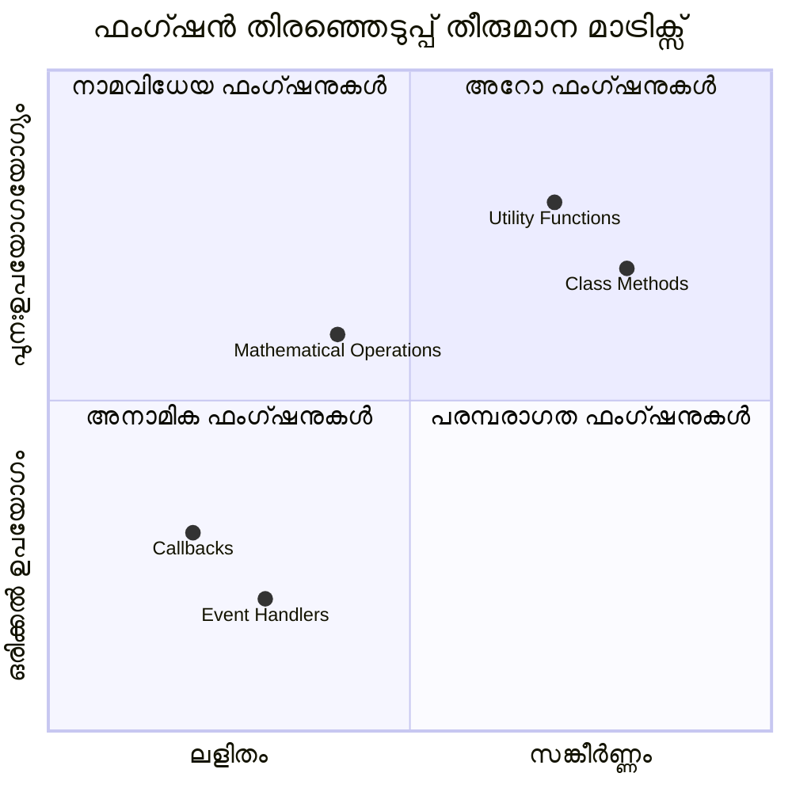
> **ആധുനിക പ്രവണത**: arrow functions സംക്ഷിപ്തമായ സിന്താക്സ് കൊണ്ടാണ് പല ഡെവലപ്പർമാർക്കും പ്രിയങ്കരമായി മാറുന്നത്, എങ്കിലും പരമ്പരാഗത functions ഇപ്പോഴും ആവശ്യമായി വന്നേക്കാം!

---


## 🚀 വെല്ലുവിളി

ഫങ്ഷനുകളുടെയും മെത്തഡുകളുടെയും വ്യത്യാസം ഒരു വാക്യത്തിൽ വിശദീകരിക്കാം? ശ്രമിക്കൂ!

## GitHub Copilot Agent വെല്ലുവിളി 🚀

Agent മോഡ് ഉപയോഗിച്ച് താഴെ കൊടുക്കുന്ന വെല്ലുവിളി പൂർത്തിയാക്കുക:

**വിവരണം:** ഈ പാഠത്തിൽ പറഞ്ഞ function ആശയങ്ങൾ ഉൾക്കൊള്ളുന്ന, പാരാമീറ്ററുകൾ, ഡിഫോൾട്ട് മൂല്യങ്ങൾ, return മൂല്യങ്ങൾ, arrow functions എന്നിവയും ഉൾപ്പെടുന്ന ഗണിത functions-യുടെ ഒരു utility ലൈബ്രറി സൃഷ്ടിക്കുക.

**പ്രോമ്പ്റ്റ്:** `mathUtils.js` എന്ന ജാവാസ്ക്രിപ്റ്റ് ഫയൽ സൃഷ്ടിച്ച് ഇതിൽ താഴെ പറയപ്പെട്ട function-കൾ ഉൾപ്പെടുത്തുക:
1. രണ്ട് പാരാമീറ്ററുകൾ സ്വീകരിച്ച് ആകെ ഗണനം ചെയ്യുന്ന `add` function
2. ഡിഫോൾട്ട് പാരാമീറ്ററൊപ്പം (രണ്ടാം പാരാമീറ്റർ 1 യായി ഡിഫോൾട്ട്) ഉള്ള `multiply` function
3. ഒരു സംഖ്യ എടുത്ത് അതിന്റെ വർഗം തിരിച്ചിടുന്ന arrow function `square`
4. മറ്റൊരു function പാരാമീറ്ററായി സ്വീകരിച്ച് രണ്ട് സംഖ്യകൾക്ക് ആ function ഉപയോഗിക്കുന്ന `calculate` function
5. ഓരോ function-ഉം യോജിച്ച പരീക്ഷണങ്ങളിൽ വിളിച്ചു പ്രదర్శിക്കുക

[agent mode](https://code.visualstudio.com/blogs/2025/02/24/introducing-copilot-agent-mode)യെക്കുറിച്ച് കൂടുതൽ അറിയുക.

## പോസ്റ്റ്-ലെക്ചർ ക്വിസ്
[പോസ്റ്റ്-ലെക്ചർ ക്വിസ്](https://ff-quizzes.netlify.app)

## റിവ്യൂ & സ്വയം പഠനം

ആറോ functions സംബന്ധിച്ച കൂടുതൽ വായിക്കാൻ [mozilla developer](https://developer.mozilla.org/docs/Web/JavaScript/Reference/Functions/Arrow_functions) പേജ് സന്ദർശിക്കുക, കാരണം കോഡ് ബേസുകളിൽ അവ വ്യാപകമായി ഉപയോഗിക്കുന്നു. ഒരു function എഴുതാനും പിന്നീട് അതിനെ ഈ സിന്താക്സിൽ പുനഃലേഖനം ചെയ്യാൻ പരിശീലിക്കുക.

## അസൈൻമെന്റ്

[Fun with Functions](assignment.md)

---

## 🧰 **നിങ്ങളുടെ ജാവാസ്ക്രിപ്റ്റ് Functions ടൂള്കിറ്റ് സംഗ്രഹം**

```mermaid
graph TD
    A["🎯 ജാവാസ്‌ക്രിപ്റ്റ് ഫംക്ഷനുകൾ"] --> B["📋 ഫംക്ഷൻ പ്രഖ്യാപനം"]
    A --> C["📥 പാരാമീറ്ററുകൾ"]
    A --> D["📤 റിട്ടേൺ മൂല്യങ്ങൾ"]
    A --> E["🎨 ആധുനിക വാക്യരचना"]
    
    B --> B1["function name() {}"]
    B --> B2["വിവരണാത്മകമായ именം"]
    B --> B3["പുനഃപ്രയോഗയോഗ്യമാക്കാവുന്ന കോഡ് ബ്ലോകുകൾ"]
    
    C --> C1["ഇൻപുട്ട് ഡാറ്റ"]
    C --> C2["ഡിഫോൾട്ട് മൂല്യങ്ങൾ"]
    C --> C3["பல പാരാമീറ്ററുകൾ"]
    
    D --> D1["return പ്രതിപാദനം"]
    D --> D2["ഫംക്ഷൻ നിന്ന് പുറത്തിറങ്ങുക"]
    D --> D3["ഡാറ്റ തിരിച്ചയക്കുക"]
    
    E --> E1["അറോ ഫംക്ഷനുകൾ: () =>"]
    E --> E2["അനോണിമസ് ഫംക്ഷനുകൾ"]
    E --> E3["ഹയർ-ഓർഡർ ഫംക്ഷനുകൾ"]
    
    F["⚡ പ്രധാന ഗുണങ്ങൾ"] --> F1["കോഡ് പുനഃപ്രയോഗം"]
    F --> F2["മെച്ചപ്പെട്ട ക്രമീകരണം"]
    F --> F3["എളുപ്പമുള്ള പരിശോധന"]
    F --> F4["മൊഡ്യൂളർ രൂപകൽപന"]
    
    style A fill:#e3f2fd
    style B fill:#e8f5e8
    style C fill:#fff3e0
    style D fill:#f3e5f5
    style E fill:#e0f2f1
    style F fill:#fce4ec
```
---

## 🚀 നിങ്ങളുടെ ജാവാസ്ക്രിപ്റ്റ് ഫങ്ഷൻ മാസ്ടറി ടൈംലൈൻ

### ⚡ **അടുത്ത 5 മിനിറ്റിൽ നിങ്ങൾ ചെയ്യാൻ കഴിയുന്നത്**
- [ ] നിങ്ങളുടെ ഇഷ്ട സംഖ്യ തിരികെ നൽകുന്ന ലളിതമായ function എഴുതുക
- [ ] രണ്ട് പാരാമീറ്ററുകളുള്ള function സൃഷ്ടിച്ച് അവ കൂട്ടാണ് ചെയ്തു നൽകുക
- [ ] പരമ്പരാഗത ഫംഗ്ഷനെ ആറോ ഫംഗ്ഷൻ സിന്റാക്സ് ആയി മാറ്റാൻ ശ്രമിക്കുക  
- [ ] ചേലഞ്ച് ചെയ്യുക: ഫംഗ്ഷനുകളും മെത്തഡുകളും തമ്മിലുള്ള വ്യത്യാസം വിശദീകരിക്കുക  

### 🎯 **ഈ മണിക്കൂറിൽ നിങ്ങൾ കൈവരിക്കാവുന്ന കാര്യങ്ങൾ**  
- [ ] പോസ്റ്റ്-പാഠം ക്വിസ് പൂർത്തിയാക്കുകയും സംശയാസ്പദമായ ആശയങ്ങൾ പുനപരിശോധിക്കുക  
- [ ] GitHub Copilot ചേലഞ്ചിൽ നിന്നുള്ള ഗണിത സഹായക ഗ്രന്ഥാലയം നിർമ്മിക്കുക  
- [ ] മറ്റൊരു ഫംഗ്ഷൻ പാരാമീറ്ററായി ഉപയോഗിക്കുന്ന ഫംഗ്ഷൻ സൃഷ്ടിക്കുക  
- [ ] ഡീഫോൾട്ട് പാരാമീറ്ററുകളുള്ള ഫംഗ്ഷനുകൾ എഴുതാൻ പരിശീലിക്കുക  
- [ ] ഫംഗ്ഷൻ റിട്ടേൺ മൂല്യങ്ങളിൽ ടെംപ്ലേറ്റ് ലിറ്ററലുകൾ പരീക്ഷിക്കുക  

### 📅 **നിങ്ങളുടെ ആഴ്ച പകുതി ഫംഗ്ഷൻ നൈപുണ്യം**  
- [ ] "ഫൺ വിത്ത് ഫംഗ്ഷൻസ്" അസൈൻമെന്റ് സൃഷ്ടിപരമായിട്ടു പൂർത്തിയാക്കുക  
- [ ] നിങ്ങൾ എഴുതിയ ആവർത്തന കോഡ് പുന: രൂപപ്പെടുത്തുകയും ഉപയോഗിക്കാവുന്ന ഫംഗ്ഷനുകളായി മാറ്റുക  
- [ ] മാത്രം ഫംഗ്ഷനുകൾ ഉപയോഗിച്ച് ഒരു ചെറിയ കാൽക്കുലേറ്റർ നിർമ്മിക്കുക (ഗ്ലോബൽ വേരിയബിളുകൾ ഇല്ലാതെ)  
- [ ] `map()` and `filter()` പോലുള്ള ആരേ മെത്തഡുകളുമായി ആറോ ഫംഗ്ഷനുകൾ പരിശീലിക്കുക  
- [ ] സാധാരണ ജോലികൾക്കായി ഉപകരണ ഫംഗ്ഷനുകളുടെ കൾക്ഷൻ സൃഷ്ടിക്കുക  
- [ ] ഹൈയർ-ഓർഡർ ഫംഗ്ഷനുകളും ഫംഗ്ഷണൽ പ്രോഗ്രാമിംഗും പഠിക്കുക  

### 🌟 **നിങ്ങളുടെ മാസത്തിലൊടുവിൽ രൂപാന്തരണം**  
- [ ] ക്ലോസറുകളും സ്കോപ്പും പോലുള്ള അഗ്രഗത ഫംഗ്ഷൻ ആശയങ്ങളിൽ നിപുണത കൈവരിക്കുക  
- [ ] ഫംഗ്ഷൻ കോംപോസിഷൻ ഗാഢമായി ഉപയോഗിക്കുന്ന പ്രോജക്റ്റ് നിർമ്മിക്കുക  
- [ ] ഓപ്പൺ സോഴ്‌സിലേക്ക് ഫംഗ്ഷൻ ഡോക്യുമെന്റേഷൻ മെച്ചപ്പെടുത്തലിൽ സംഭാവന നൽകുക  
- [ ] മറ്റാരെയെങ്കിലും ഫംഗ്ഷനുകളും വ്യത്യസ്ത സിന്റാക്സ് സ്റ്റൈലുകളും പഠിപ്പിക്കുക  
- [ ] ജാവാസ്ക്രിപ്റ്റിലുള്ള ഫംഗ്ഷണൽ പ്രോഗ്രാമിംഗ് പരി Paradigms അന്വേഷിക്കുക  
- [ ] ഭാവിയിലെ പ്രോജക്റ്റുകൾക്കായി പുന: ഉപയോഗിക്കാവുന്ന വ്യക്തിഗത ഫംഗ്ഷൻ ഗ്രന്ഥാലയം സൃഷ്ടിക്കുക  

### 🏆 **അंतിമ ഫംഗ്ഷൻസ് ചാമ്പ്യൻ ചെക്ക്-ഇൻ**  

**നിങ്ങളുടെ ഫംഗ്ഷൻ നൈപുണ്യം ആഘോഷിക്കൂ:**  
- ഇതുവരെ നിങ്ങൾ സൃഷ്ടിച്ച ഏറ്റവും പ്രയോജനപ്രദമായ ഫംഗ്ഷൻ ഏതാണ്?  
- ഫംഗ്ഷനുകൾ പഠിച്ചതിലൂടെ കോഡ് ക്രമീകരണത്തെ എങ്ങനെ വ്യത്യസ്തമായി കണ്ടു?  
- ഏത് ഫംഗ്ഷൻ സിന്റാക്സ് നിങ്ങൾക്ക് ഇഷ്ടമാണ്, എന്തുകൊണ്ട്?  
- ഒരു യാഥാർത്ഥ്യ പ്രശ്നം ഫംഗ്ഷൻ എഴുതിയാൽ നിങ്ങൾ എങ്ങനെ പരിഹരിക്കും?  

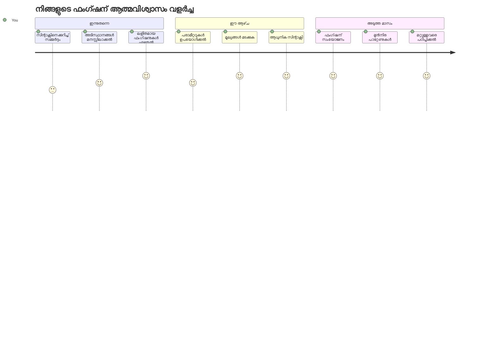
> 🎉 **നിങ്ങൾ പ്രോഗ്രാമിംഗിന്റെ ഏറ്റവും ശക്തമായ ആശയങ്ങളിൽ ഒന്നിൽ വിദഗ്ധനായി!** ഫംഗ്ഷനുകൾ വലിയ പ്രോഗ്രാമുകളുടെ നിർമാണ ഘടകങ്ങളാണ്. നിങ്ങൾ നിർമ്മിക്കുന്ന എല്ലാ ആപ്ലിക്കേഷനുകളും കോഡ് ക്രമീകരിക്കാൻ, പുന: ഉപയോഗിക്കാൻ, ഘടിപ്പിക്കാൻ ഫംഗ്ഷനുകൾ ഉപയോഗിക്കും. 이제 നിങ്ങൾ ലജിക് പുന: ഉപയോഗിക്കാവുന്ന ഘടകങ്ങളായി പാക്കേജ് ചെയ്യാൻ അറിയുന്നു, ഇത് നിങ്ങളെ കൂടുതൽ ഫലപ്രദനും കാര്യക്ഷമനുമായ പ്രോഗ്രാമറായി മാറ്റുന്നു. മോഡുലാർ പ്രോഗ്രാമിങ്ങിന്റെ ലോകത്തിൽ സ്വാഗതം! 🚀

---

<!-- CO-OP TRANSLATOR DISCLAIMER START -->
**ഡിസ്‌ക്ലെയിമർ**:  
ഈ രേഖ AI വിവർത്തന സേവനം [Co-op Translator](https://github.com/Azure/co-op-translator) ഉപയോഗിച്ച് വിവർത്തനം ചെയ്തതാണ്. നമുക്ക് വിദഗ്ധതയ്ക്കായി ശ്രമിച്ചുവെങ്കിലും, യന്ത്ര വിവർത്തനങ്ങളിൽ പിശകുകൾ അല്ലെങ്കിൽ അശുദ്ധതകൾ ഉണ്ടാകാനാകും. അതിനാൽ, ഈ രേഖയുടെ യഥാർത്ഥ ഭാഷയിലുള്ള המקורי ദਸਤാവേജിനെ അധികാരമുള്ള ഉറവിടമായി കണക്കാക്കണം. നിർണ്ണായക വിവരങ്ങൾക്കായി, ഒരു പ്രൊഫഷണൽ മനുഷ്യ വിവർത്തനം നിർദ്ദേശിക്കുന്നതാണു. ഈ വിവർത്തനം ഉപയോഗിച്ച് ഉണ്ടാകുന്ന ഏതെങ്കിലും തെറ്റായ അർത്ഥവത്കരണങ്ങൾക്കോ തെറ്റിദ്ധാരണകൾക്കോ ഞങ്ങൾ ഉത്തരവാദിത്വം വഹിക്കുന്നില്ല.
<!-- CO-OP TRANSLATOR DISCLAIMER END -->