<!--
CO_OP_TRANSLATOR_METADATA:
{
  "original_hash": "c688385d15dd3645e924ea0ffee8967f",
  "translation_date": "2026-01-08T12:48:38+00:00",
  "source_file": "2-js-basics/3-making-decisions/README.md",
  "language_code": "ml"
}
-->
# ജാവാസ്ക്രിപ്റ്റ് അടിസ്ഥാനങ്ങൾ: തീരുമാനങ്ങൾ എടുക്കൽ

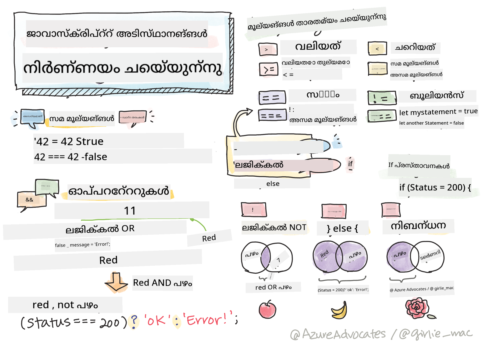

> സ്കെച്ച് നോട്ട് [Tomomi Imura](https://twitter.com/girlie_mac) രചിച്ചത്

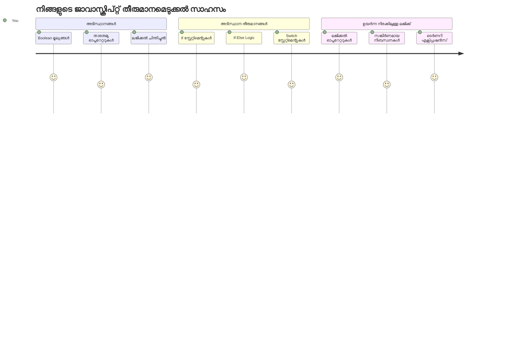
ആപ്ലിക്കേഷനുകൾ എങ്ങനെ ബുദ്ധിമുട്ടുള്ള തീരുമാനങ്ങൾ എടുക്കുന്നു എന്ന് നിങ്ങൾ ഒരിക്കലെങ്കിലും ആലോചിച്ചിട്ടുണ്ടോ? ഒരു നാവിഗേഷൻ സിസ്റ്റം എങ്ങനെ ഏറ്റവും വേഗതയുള്ള മാർഗം തിരഞ്ഞെടുക്കുന്നു, അല്ലെങ്കിൽ ഒരു തർമോസ്റ്റാറ്റ് എപ്പോൾ ഹീട്ട് ഓണാക്കണം എന്ന് എങ്ങനെ തീരുമാനിക്കുന്നു? ഇത് പ്രോഗ്രാമിംഗിലെ രചനാത്മകമായ തീരുമാനമെടുക്കലിന്റെ അടിസ്ഥാന സാധ്യതയാണ്.

ചാൾസ് ബാബേജ് നിർമിച്ച അനലിറ്റിക്കൽ എഞ്ചിനും വ്യത്യസ്ത പൊതു പ്രവർത്തനക്രമങ്ങൾ അനുസരിച്ച് ഞെളിച്ചുവരുത്താൻ രൂപകൽപ്പന ചെയ്തതുപോലെ, ആധുനിക ജാവാസ്ക്രിപ്റ്റ് പ്രോഗ്രാമുകൾ വ്യത്യസ്ത സാഹചര്യങ്ങൾ അനുസരിച്ച് തിരഞ്ഞെടുക്കേണ്ടതുണ്ട്. ഈ ശാഖാവിവരണം കഴിവാണ് സ്റ്റാറ്റിക് കോഡിനെ പ്രതികരണക്ഷമവും ബുദ്ധിമുട്ടുള്ള ആപ്ലിക്കേഷനുകളായി മാറ്റുന്നത്.

ഈ പാഠത്തിൽ, പ്രോഗ്രാമുകളിൽ സാന്ദർഭിക ബുദ്ധിമുട്ടുള്ളതിന്റെ അടിസ്ഥാനത്തിൽ രേഖപ്പെടുത്തുന്നത് എങ്ങനെ ചെയ്യാമെന്ന് നിങ്ങൾ പഠിക്കും. നാം സാഹചര്യ പ്രസ്താവനകൾ, താരതമ്യ ഓപ്പറേറ്ററുകൾ, ലജിക്കൽ പ്രകടനങ്ങൾ എന്നിവ പരീക്ഷിക്കും, കോഡ് സാഹചര്യത്തെ നിർണ്ണയിച്ച് അനുയോജ്യമായി പ്രതികരിക്കാൻ സഹായിക്കുന്നു.

## പൂർവ-പാഠം ക്വിസ്

[Pre-lecture quiz](https://ff-quizzes.netlify.app/web/quiz/11)

നെറ്റിവായി തീരുമാനങ്ങൾ എടുക്കുക, പ്രോഗ്രാം പ്രവാഹം നിയന്ത്രിക്കുക പ്രോഗ്രാമിംഗിന്റെ അടിസ്ഥാന ഘടകമാണ്. ഈ വിഭാഗം ബൂളിയൻ മൂല്യങ്ങളും സാന്ദർഭിക ബുദ്ധിമുട്ടുള്ളതും ഉപയോഗിച്ച് ജാവാസ്ക്രിപ്റ്റ് പ്രോഗ്രാമുകളുടെ പ്രവർത്തന പാത നിയന്ത്രിക്കുന്നതിനെക്കുറിച്ചു അവതരിപ്പിക്കുന്നു.

[](https://youtube.com/watch?v=SxTp8j-fMMY "Making Decisions")

> 🎥 തീരുമാനങ്ങൾ എടുക്കുന്നതിനെക്കുറിച്ചുള്ള വീഡിയോക്കായി മുകളിൽ ചിത്രത്തിൽ ക്ലിക്ക് ചെയ്യുക.

> ഈ പാഠം നിങ്ങൾക്ക് [Microsoft Learn](https://docs.microsoft.com/learn/modules/web-development-101-if-else/?WT.mc_id=academic-77807-sagibbon)ൽ പഠിക്കാം!

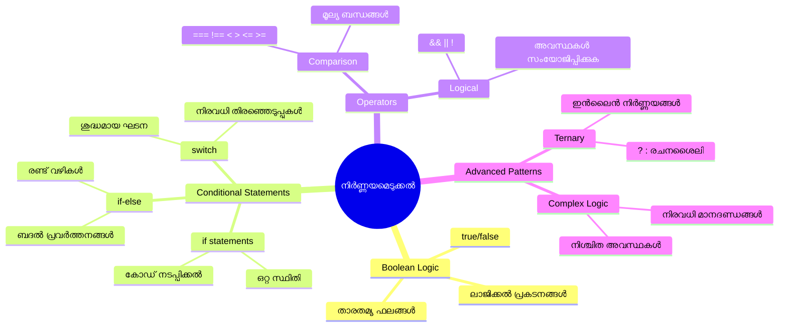
## ബൂളിയനുകളുടെ ഒരു സംക്ഷിപ്തമായ പുനരാവർത്തനം

നമ്മുടെ മുൻപത്തെ പാഠത്തിൽ നിന്ന് ബൂളിയൻ മൂല്യങ്ങളെ വീണ്ടും അവലോകനം ചെയ്യാം. ഗണിതശാസ്ത്രജ്ഞൻ ജോർജ് ബൂൾ എന്ന പേരിൽ പേരിട്ടിട്ടുള്ള ഈ മൂല്യങ്ങൾ രണ്ടു അവസ്ഥകളെ പ്രതിനിധിക്കുന്നു – `true` അല്ലെങ്കിൽ `false`. ഇത് മിഷ്രിതമായോ ഇടത്തരം നിലയോ ഉള്ളതല്ല.

ഈ ഇരട്ട മൂല്യങ്ങൾ എല്ലാ കംപ്യൂട്ടേഷണൽ ബുദ്ധിപരമായ അടിത്തറയാവും. നിങ്ങളുടെ പ്രോഗ്രാം എടുക്കുന്ന ഓരോ തീരുമാനവും അവസാനമായി ബൂളിയൻ മൂല്യനിർണയത്തിലേക്ക് അയക്കപ്പെടുന്നു.

ബൂളിയൻ വേരിയബിളുകൾ സൃഷ്ടിക്കുന്നത് വളരെ ലളിതമാണ്:

```javascript
let myTrueBool = true;
let myFalseBool = false;
```

ഇത് രണ്ട് വേരിയബിളുകൾ സൃഷ്ടിക്കുന്നു, സാന്ദർഭികമായ ബൂളിയൻ മൂല്യങ്ങളും ചേർന്ന്.

✅ ബൂളിയൻസ് ഇംഗ്ലീഷ് ഗണിതശാസ്ത്രജ്ഞന്‍, фലാസഫർ, ലജിഷൻ ജോർജ് ബൂൾ (1815-1864) ന്റെ പേരിൽ പേരിട്ടതാണ്.

## താരതമ്യ ഓപ്പറേറ്ററുകളും ബൂളിയൻമാരും

വ്യാപകമായും നാം ബൂളിയൻ മൂല്യങ്ങൾ കൈയോടെ സജ്ജീകരിക്കുന്നില്ല. പകരം, അവനെ സൂചനകളെ വിലയിരുത്തി സൃഷ്ടിക്കുന്നു: "ഈ സംഖ്യ അതിനേക്കാൾ വലിയതാണോ?" അല്ലെങ്കിൽ "ഈ മൂല്യങ്ങൾ സമാനമോ?"

ഫലിതങ്ങളെ കണ്ടെത്താൻ താരതമ്യ ഓപ്പറേറ്ററുകൾ ഉപയോഗിക്കുന്നു. ഔദ്യോഗികമായി മൂല്യങ്ങളെ താരതമ്യം ചെയ്ത് വലതുഭാഗത്തെ കാരണം അനുസരിച്ച് ബൂളിയൻ ഫലങ്ങൾ തിരികെ നൽകുന്നു.

| ചിഹ്നം | വിവരണം                                                                                                                                                       | ഉദാഹരണം             |
| ------ | ------------------------------------------------------------------------------------------------------------------------------------------------------------- | --------------------- |
| `<`    | **ചെറിയതാണ്**: രണ്ട് മൂല്യങ്ങളെ താരതമ്യം ചെയ്തുകൊണ്ട്, ഇടതുവശത്തെ മൂല്യം വലതുവശത്തെ കുറവായാൽ `true` ബൂളിയൻ മൂല്യം തിരികെ നൽകുന്നു                              | `5 < 6 // true`       |
| `<=`   | **ചെറിയതോ സമവായമോ**: രണ്ട് മൂല്യങ്ങളെ താരതമ്യം ചെയ്തുകൊണ്ട്, ഇടതുവശം വലതുവശത്തേക്കാൾ ചെറിയതോ സമമാണ് എങ്കിൽ `true` തിരികെ നൽകുന്നു                       | `5 <= 6 // true`      |
| `>`    | **വലുതാണ്**: രണ്ട് മൂല്യങ്ങളെ താരതമ്യം ചെയ്തുകൊണ്ട്, ഇടതുവശം വലതുവശത്തേക്കാൾ വലിയതാണ് എങ്കിൽ `true` തിരികെ നൽകുന്നു                                    | `5 > 6 // false`      |
| `>=`   | **വലുതോ സമവായമോ**: രണ്ട് മൂല്യങ്ങളെ താരതമ്യം ചെയ്തുകൊണ്ട്, ഇടതുവശം വലതുവശത്തേക്കാൾ വലിയതോ സമമാണ് എങ്കിൽ `true` തിരികെ നൽകുന്നു                     | `5 >= 6 // false`     |
| `===`  | **കടുത്ത സമത്വം**: രണ്ട് മൂല്യങ്ങളും വലതും ഇടത്തും സമമാണ്, കൂടാതെ അവ അതേ ഡാറ്റാ തരം ആയിരിക്കുമ്പോൾ മാത്രമേ `true` തിരികെ നൽകൂ                                    | `5 === 6 // false`    |
| `!==`  | **അസമത്വം**: കടുത്ത സമത്വം ഓപ്പറേറ്ററിന്റെ വിരുദ്ധമായ ബൂളിയൻ മൂല്യം തിരികെ നൽകുന്നു                                                                             | `5 !== 6 // true`     |

✅ നിങ്ങളുടെ അറിവ് വർദ്ധിപ്പിക്കാൻ, ചില താരതമ്യങ്ങൾ നിങ്ങളുടെ ബ്രൗസറിന്റെ കോൺസോളിൽ എഴുതുകയും പരീക്ഷിക്കുകയും ചെയ്യൂ. വരുന്ന ഫലങ്ങൾ നിങ്ങൾക്ക് പുതിയതായി തോന്നുമോ?

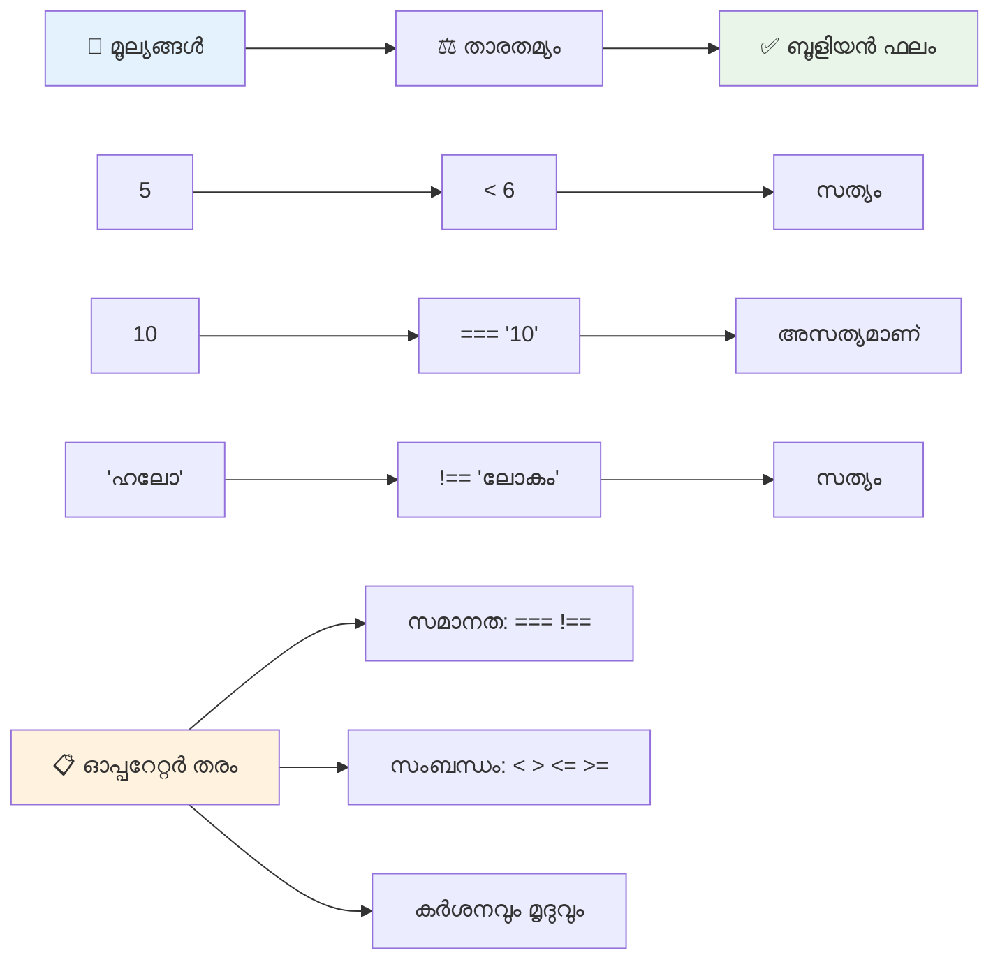
### 🧠 **തമത്യ പരിചയക്കുറിപ്പ്: ബൂളിയൻ ലജിക് മനസ്സിലാക്കുക**

**നിങ്ങളുടെ താരതമ്യ ധാരണ പരിശോധിക്കുക:**
- `===` (കടുത്ത സമത്വം) യെ സാധാരണ `==` (സരള സമത്വം) പകരം ഉപയോഗിക്കുന്നത് എന്തുകൊണ്ട്?
- `5 === '5'` ന്തിൽ എന്ത് ഫലം പ്രതീക്ഷിക്കാം? `5 == '5'` എങ്ങനെയാണ്?
- `!==` ന്റേയും `!=` ന്റേയും വ്യത്യാസം എന്താണ്?

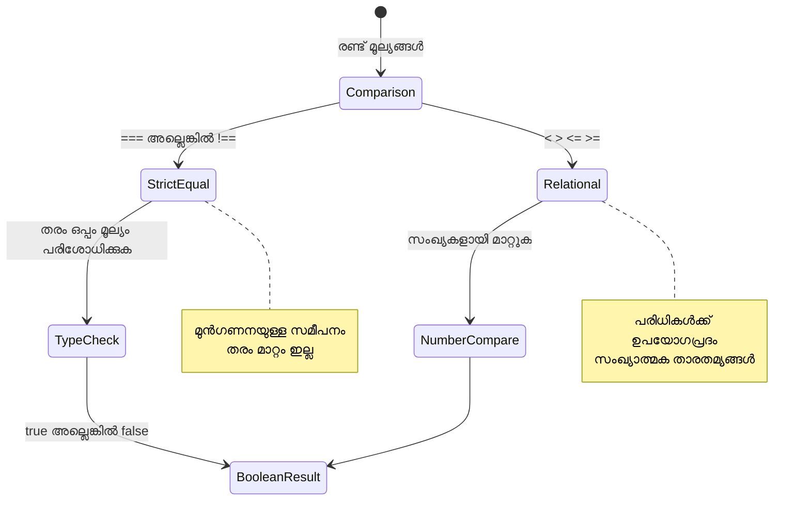
> **പ്രൊ ടിപ്**: ടൈപ്പ് പരിവർത്തനം ആവശ്യമില്ലാത്തിടത്തോളം എല്ലായ്പ്പോഴും സമത്വ പരിശോധനയ്ക്ക് `===`യും `!==`യും ഉപയോഗിക്കുക. ഇത് അനുപേക്ഷിത പെരുമാറ്റം തടയുന്നു!

## If പ്രസ്താവന

`if` പ്രസ്താവന നിങ്ങളുടെ കോഡിൽ ഒരു ചോദ്യം ചോദിക്കുന്നതു പോലെയാണ്. "ഈ സാന്ദർഭികം true ആണെങ്കിൽ, ഇത് ചെയ്യുക." ജാവാസ്ക്രിപ്റ്റിൽ നിശ്ചയങ്ങൾ എടുക്കാൻ ഏറ്റവും പ്രധാനപ്പെട്ട ഉപകരണം ഇതാണ്.

ഇതു പ്രവർത്തിക്കുന്നത് ഈ പ്രകാരം:

```javascript
if (condition) {
  // നിബന്ധന ശരിയാണ്. ഈ ബ്ലോക്കിലുള്ള കോഡ് പ്രവർത്തിക്കും.
}
```

പരീക്ഷണം പുറംകഴുകിയ ചുറ്റളവിൽ വരുന്നു, അത് `true` ആണെങ്കിൽ, ജാവാസ്ക്രിപ്റ്റ് കർളി ബ്രേസുകൾക്കകത്തുള്ള കോഡ് പ്രവർത്തിപ്പിക്കും. `false` ആണെങ്കിൽ, ജാവാസ്ക്രിപ്റ്റ് ആ ബ്ളോക്കിനെല്ലാം മറികടക്കും.

നിങ്ങൾ സാധാരണയായി താരതമ്യ ഓപ്പറേറ്ററുകൾ ഉപയോഗിച്ച് ഈ സാഹചര്യങ്ങൾ സൃഷ്ടിക്കും. ഉദാഹരണത്തിൽ നോക്കാം:

```javascript
let currentMoney = 1000;
let laptopPrice = 800;

if (currentMoney >= laptopPrice) {
  // ശരതായിടത്ത് സത്യമാകുന്നു. ഈ ബ്ലോക്കിലുള്ള കോഡ് നടന്നു.
  console.log("Getting a new laptop!");
}
```

`1000 >= 800` `true` ആയി വിലയിരുത്തുന്നുവെന്ന് കൊണ്ടു കോഡ് അവയവം പ്രവർത്തിപ്പിക്കുകയും, കോൺസോളിൽ "Getting a new laptop!" എന്നു പ്രദർശിപ്പിക്കുകയും ചെയ്യും.

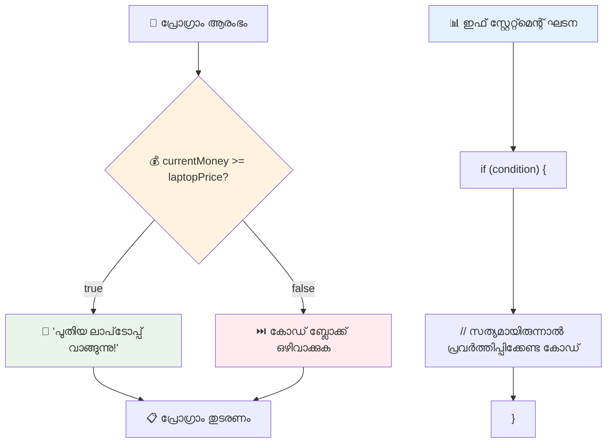
## If..Else പ്രസ്താവന

എന്ത് സംഭവിക്കും എന്നാലും നിങ്ങൾക്ക് നിങ്ങളുടെ പ്രോഗ്രാം സാന്ദർഭികം false ആണെങ്കിൽ മറ്റൊരു കാര്യം നടത്തണമെങ്കിൽ? അപ്പോൾ `else` പ്രയോഗിക്കും – ഇത് ഒരു ബാക്കപ്പ് പദ്ധതി പോലെയാണ്.

`else` പ്രസ്താവന നിങ്ങൾക്ക് പറയാനുള്ള മാർഗ്ഗമാണ്: "ഈ സാന്ദർഭികം true അല്ലെങ്കിൽ, പകരം ഇത് ചെയ്യുക."

```javascript
let currentMoney = 500;
let laptopPrice = 800;

if (currentMoney >= laptopPrice) {
  // നിബന്ധന സത്യമാണു. ഈ ബ്ലോക്കിലുള്ള കോഡ് 실행 ചെയ്യും.
  console.log("Getting a new laptop!");
} else {
  // നിബന്ധന തെറ്റാണ്. ഈ ബ്ലോക്കിലുള്ള കോഡ് 실행 ചെയ്യും.
  console.log("Can't afford a new laptop, yet!");
}
```

`500 >= 800` false ആകാൻ കാരണം, ജാവാസ്ക്രിപ്റ്റ് ആദ്യത്തെ ബ്ലോക്ക് ഒഴിവാക്കി `else` ബ്ലോക്ക് പ്രവർത്തിപ്പിക്കും. നിങ്ങൾക്ക് കോൺസോളിൽ "Can't afford a new laptop, yet!" കാണാം.

✅ ഈ കോഡ് നിങ്ങളുടെ ബ്രൗസർ കോൺസോളിൽ പ്രവർത്തിപ്പിച്ചറിയൂ. currentMoney, laptopPrice വേരിയബിളുകളുടെ മൂല്യങ്ങൾ മാറ്റി `console.log()` ഫലം മാറുന്നതു നോക്കൂ.

### 🎯 **If-Else ലജിക് പരിശോധന: ശാഖാക്കാർമങ്ങൾ**

**നിങ്ങളുടെ സാന്ദർഭിക ധാരണ വിലയിരുത്തുക:**
- currentMoney എന്നാൽ laptopPrice തുല്യം ആണെങ്കിൽ എന്ത് സംഭവിക്കും?
- യഥാർത്ഥ ലോകത്തിൽ if-else ലജികിന് പ്രയോജനമുള്ള ഒരു സാഹചര്യം നിങ്ങൾക്ക് പറയാമോ?
- ഈ കോഡ് നിരത്തിന് വ്യത്യസ്ത വില പരിധികൾക്കെന്തൊരു വികസനം നിങ്ങൾ ചെയ്യാമെന്ന് നിങ്ങൾ കരുതുന്നു?

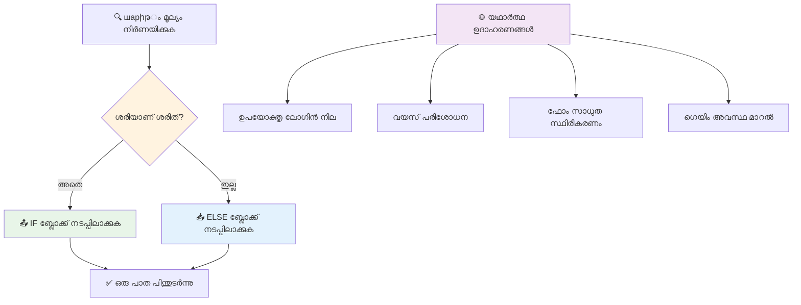
> **പ്രധാന കൂട്ടമ്മ്യം**: If-else സ്ട്രക്ചർ ഒരു മാത്ര выбран വഴി സ്വീകരിക്കാം എന്ന് ഉറപ്പാക്കുന്നു. ഇത് നിങ്ങളുടെ പ്രോഗ്രാമിന് എല്ലാ സാന്ദർഭികതയ്ക്കും ആവശ്യമുള്ള പ്രതികരണം സൃഷ്ടിക്കുന്നു!

## Switch പ്രസ്താവന

സമയം ചിലപ്പോൾ മൂല്യം ഒന്ന് പല ഓപ്ഷനുകളുമായി താരതമ്യം ചെയ്യേണ്ടി വരും. നിങ്ങൾ പല `if..else` പ്രസ്താവനകൾ ചേർക്കാമെങ്കിലും, അത് കൈകാര്യം ചെയ്യാൻ പ്രയാസമേറും. `switch` പ്രസ്താവന വിവിധ വ്യത്യസ്ത മൂല്യങ്ങൾ കൈകാര്യം ചെയ്യാനുള്ള ക്ലീൻ രൂപമാണ്.

ഈ ആശയം പ്രാഥമിക ടെലിഫോൺ എക്സ്ചേഞ്ചുകളിലെ യന്ത്രങ്ങളായ സ്വിച്ച് സിസ്റ്റങ്ങളിൽ പോലെയാണ് – ഒരു ഇൻപുട്ട് മൂല്യം എന്തു വഴി നടത്തണമെന്നും നിശ്ചയിക്കുന്നു.

```javascript
switch (expression) {
  case x:
    // കോഡ് ബ്ലോക്ക്
    break;
  case y:
    // കോഡ് ബ്ലോക്ക്
    break;
  default:
    // കോഡ് ബ്ലോക്ക്
}
```

ഇത് എങ്ങനെ ഘടിപ്പിച്ചിരിക്കുന്നു:
- ജാവാസ്ക്രിപ്റ്റ് പ്രസ്താവന ഒരിക്കൽ മാത്രം വാലുലേറ്റു ചെയ്യും
- ഓരോ `case`മും പരിശോധിച്ച് പൊരുത്തം കാണുന്നു
- പൊരുത്തമാകുമ്പോൾ ആ കോഡ് ബ്ലോക്ക് പ്രവർത്തിപ്പിക്കും
- `break` ജാവാസ്ക്രിപ്റ്റ് സ്വിച്ച് പൂർത്തിയാക്കുകയും പുറത്തേക്കു പോയും
- പൊരുത്തമില്ലായ്മയെങ്കിൽ `default` (ഉണ്ടെങ്കിൽ) പ്രവർത്തിക്കും

```javascript
// ആഴ്ചയിലെ ദിവസത്തിന് സ്വിച്ച് സ്റ്റേറ്റ്മെന്റ് ഉപയോഗിച്ച് പ്രോഗ്രാം
let dayNumber = 2;
let dayName;

switch (dayNumber) {
  case 1:
    dayName = "Monday";
    break;
  case 2:
    dayName = "Tuesday";
    break;
  case 3:
    dayName = "Wednesday";
    break;
  default:
    dayName = "Unknown day";
    break;
}
console.log(`Today is ${dayName}`);
```

ഉദാഹരണത്തിൽ, ജാവാസ്ക്രിപ്റ്റ് `dayNumber` 2 ആണെന്ന് കണ്ടു, `case 2` കണ്ടെത്തി, `dayName` "Tuesday" ആയി സജ്ജീകരിച്ച് സ്വിച്ച് ൽ നിന്നും അകന്നു. ഫലം? "Today is Tuesday" കോൺസോളിൽ പ്രദർശിപ്പിക്കുന്നു.

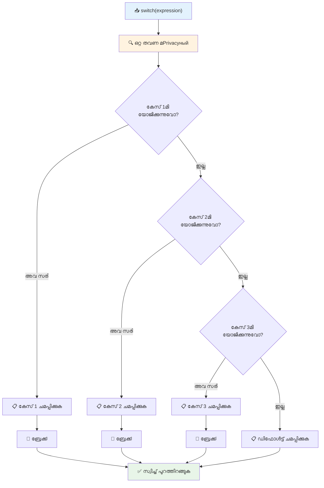
✅ ഈ കോഡ് ഇത് ഉൾപ്പെടെ ബ്രൗസർ കോൺസോളിൽ പ്രവർത്തിപ്പിച്ച് പഠിക്കുക. വ്യത്യസ്ത `a` മൂല്യങ്ങൾ നൽകി കിട്ടുന്ന `console.log()` വ്യത്യാസം കാണുക.

### 🔄 **Switch പ്രസ്താവന കാഴ്ചപ്പാട്: ഒട്ടേറെ ഓപ്ഷനുകൾ**

**നിങ്ങളുടെ Switch ബോധം പരിശോധിക്കുക:**
- നമുക്ക് `break` പ്രസ്താവന മറന്നാൽ എന്ത് സംഭവിക്കും?
- ഒരുപാട് `if-else` പ്രസ്താവനകൾക്ക് പകരം നിങ്ങൾ എപ്പോൾ `switch` ഉപയോഗിക്കും?
- നിങ്ങൾ എല്ലാ സാധ്യതകളും പരിഗണിച്ചേക്കും എന്ന് എങ്കിലും എന്തുകൊണ്ട് `default` കേസ് പ്രയോജനപ്പെടും?

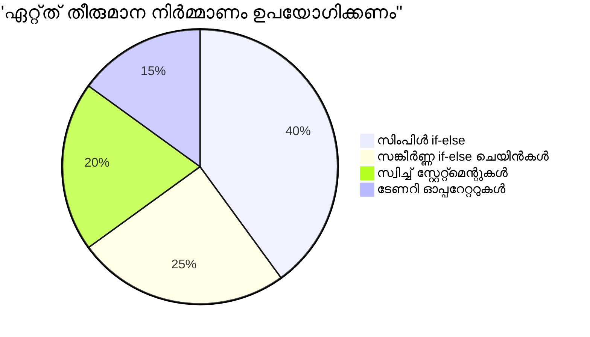
> **നല്ല പ്രവൃത്തി ശൈലി**: ഒരൊറ്റ വേരിയബിളിനെ അനേകം പ്രതിഷ്ഠിത മൂല്യങ്ങളുമായി താരതമ്യം ചെയ്യേണ്ടപ്പോൾ `switch` ഉപയോക്തൃക്ക് അനുയോജ്യമാണ്. പരിധി പരിശോധനകൾക്കും സങ്കീർണ സാന്ദർഭങ്ങൾക്കും `if-else` ഉപയോക്തൃക്കേട് കൂടുതലാണ്!

## ലജിക്കൽ ഓപ്പറേറ്ററുകളും ബൂളിയൻ

സങ്കീർണ തീരുമാനങ്ങൾ സ്‌നേഹത്തോടെ അനേകം സാന്ദർഭങ്ങൾ ഒരുമിച്ച് പരിശോധിക്കണമെന്നും വരും. ഗണിതജ്ഞർ ലജിക്കൽ എൽജിബ്ര ഉപയോഗിച്ച് ലജിക്കൽ പ്രകടനങ്ങൾ സംയോജിപ്പിച്ചതുപോലെ, പ്രോഗ്രാമിംഗിൽ ലജിക്കൽ ഓപ്പറേറ്ററുകൾ പല ബൂളിയൻ സാഹചര്യങ്ങൾ ബന്ധിപ്പിക്കുന്നു.

ഈ ഓപ്പറേറ്ററുകൾ ലളിതമായ true/false മൂല്യനിർണ്ണയങ്ങൾ കൂടുതൽ ഗർഭിതമായ സാന്ദർഭിക ബുദ്ധിമുട്ടുള്ളതായി സംയോജിപ്പിക്കാൻ സഹായിക്കുന്നു.

| ചിഹ്നം | വിവരണം                                                                                      | ഉദാഹരണം                                                    |
| ------ | -------------------------------------------------------------------------------------------- | ------------------------------------------------------------|
| `&&`   | **ലജിക്കൽ AND**: രണ്ടു ബൂളിയൻ പ്രകടനങ്ങൾ താരതമ്യം ചെയ്യുന്നു. രണ്ടു വശവും true ആണെങ്കിൽ മാത്രം true തിരികെ നൽകുന്നു | `(5 > 3) && (5 < 10) // രണ്ട് വശവും true. true തിരികെ`        |
| `\|\|` | **ലജിക്കൽ OR**: രണ്ടു ബൂളിയൻ പ്രകടനങ്ങളിൽ ഒരോളം true ആണെങ്കിൽ true തിരികെ നൽകുന്നു         | `(5 > 10) \|\| (5 < 10) // ഒരു വശം false, മറ്റൊന്നു true. true` |
| `!`    | **ലജിക്കൽ NOT**: ഒരു ബൂളിയൻ പ്രകടനത്തിന്റെ വിരുദ്ധ മൂല്യം തിരികെ നൽകുന്നു                   | `!(5 > 10) // 5 10-ക്കു വലുതല്ല, അങ്ങനെ "!" അതിനെ true ആക്കുന്നു` |

ഈ ഓപ്പറേറ്ററുകൾ ഉപയോഗിച്ച് നിങ്ങൾക്ക് സാന്ദർഭങ്ങൾ സഹായകരമായി കൂട്ടിച്ചേർക്കാം:
- AND (`&&`): രണ്ട് സാന്ദർഭങ്ങളും true ആകണം
- OR (`||`): കുറഞ്ഞത് ഒന്നു true ആകണം  
- NOT (`!`): true-നെ false ആക്കും (മറ്റുവഴി)

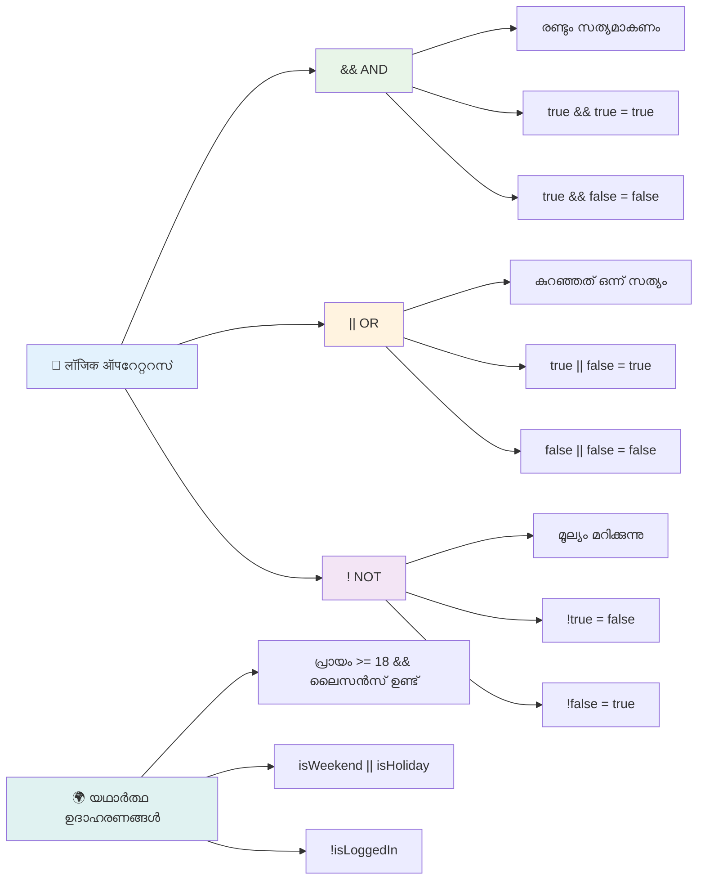
## ലജിക്കൽ ഓപ്പറേറ്ററുകളോടെയുള്ള സാഹചര്യങ്ങളും തീരുമാനങ്ങളും

ഇവയെ പ്രവർത്തനത്തിലുള്ള ഒരു യാഥാർത്ഥ്യ ഉദാഹരണത്തിൽ കാണാം:

```javascript
let currentMoney = 600;
let laptopPrice = 800;
let laptopDiscountPrice = laptopPrice - (laptopPrice * 0.2); // ലാപ്‌ടോപ്പ് വില 20 ശതമാനം ഓഫിലാണ്

if (currentMoney >= laptopPrice || currentMoney >= laptopDiscountPrice) {
  // സ്ഥിതി ശരിയാണ്. ഈ ബ്ലോക്കിലെ കോഡ് പ്രവർത്തിക്കും.
  console.log("Getting a new laptop!");
} else {
  // സ്ഥിതി തെറ്റാണ്. ഈ ബ്ലോക്കിലെ കോഡ് പ്രവർത്തിക്കും.
  console.log("Can't afford a new laptop, yet!");
}
```

ഈ ഉദാഹരണത്തിൽ: 20% ഡിസ്കൗണ്ട് വില (640) കണക്കാക്കി, ലഭ്യമായ നിധികൾ മുഴുവൻ വിലയോ ഡിസ്കൗണ്ടും നിറയ്ക്കുമോ എന്ന് പരിശോധിക്കുന്നു. 600 ആണ് കഥയെങ്കിൽ, 640ൽ കുറഞ്ഞത് വേണം, അതിനാൽ സാന്ദർഭം true ആകുന്നു.

### 🧮 **ലജിക്കൽ ഓപ്പറേറ്ററുകൾ പരിശോധന: സാന്ദർഭങ്ങൾ സംയോജിപ്പിക്കൽ**

**നിങ്ങളുടെ ലജിക്കൽ ഓപ്പറേറ്റർ ബോധം പരിശോധിക്കുക:**
- `A && B` പ്രകടനത്തിൽ A false ആണെങ്കിൽ എന്ത് സംഭവിക്കും? Bൻറെ മൂല്യം വിലയിരുത്തപ്പെടും?
- &&, ||, ! – ആ മൂന്ന് ഓപ്പറേറ്ററുകളും ഒരുമിച്ച് ഉപയോഗിക്കേണ്ടതായി വരുന്ന ഒരു സാഹചര്യം പറയാമോ?
- `!user.isActive` ന്റെയും `user.isActive !== true` ന്റേയും വ്യത്യാസം എന്താണ്?

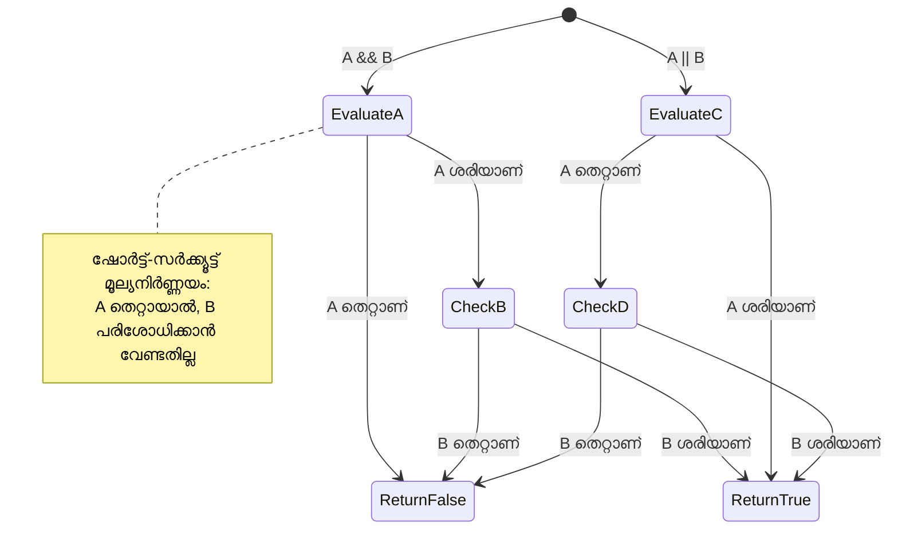
> **പ്രകടനം ടിപ്**: ജാവാസ്ക്രിപ്റ്റ് "ഷോർട്ട്-സർക്യൂട്ട് മൂല്യനിർണ്ണയം" ഉപയോഗിക്കുന്നു – `A && B`ല് A false ആണെങ്കിൽ, B വിലയിരുത്തപ്പെടുന്നില്ല. നിങ്ങൾക്ക് ഇത് പ്രയോജനപ്പെടുത്താം!

### നേഗേഷൻ ഓപ്പറേറ്റർ

ഒരിക്കൽ എന്തെങ്കിലും true അല്ല എന്ന കാര്യത്തെക്കുറിച്ച് ചിന്തിക്കുക എളുപ്പം ആകാം. ഉദാഹരണത്തിന് "ഉപയോക്താവ് ലോഗിൻ ചെയ്തിട്ടുണ്ടോ?" എന്ന പകരം "ഉപയോക്താവ് ലോഗിൻ ചെയ്തിട്ടില്ലേ?" എന്ന് ചോദിക്കാവുന്നതാണ്. `!` ഓപ്പറേറ്റർ അത്തരം ലജിക്ക് വഴിവെക്കുന്നു.

```javascript
if (!condition) {
  // സ്ഥിതി തെറ്റാണെങ്കിൽ പ്രവർത്തിക്കും
} else {
  // സ്ഥിതി ശരിയായാൽ പ്രവർത്തിക്കും
}
```

`!` ഓപ്പറേറ്റർ "viruddha..." എന്നു പറയുന്നതുപോലെയാണ് – എന്തെങ്കിലും `true` ആണെങ്കിൽ, `!` അത് `false` ആക്കും, വും.

### ടേണറി പ്രകടനങ്ങൾ

ലളിതമായ സാന്ദർഭിക നിയുക്തികൾക്കായി, ജാവാസ്ക്രിപ്റ്റ് **ടേണറി ഓപ്പറേറ്റർ** നൽകുന്നു. ഈ ചുരുക്കമാർഗ്ഗം ഒരേ സ്ട്രിങ്ങിൽ സാന്ദർഭ പ്രകടനം എഴുതാൻ അനുവദിക്കുന്നു, രണ്ടു മൂല്യങ്ങളിൽ ഒന്നിനെതിരായ തീരുമാനത്തിനായി ഉത്തമം.

```javascript
let variable = condition ? returnThisIfTrue : returnThisIfFalse;
```

ഇത് ഒരു ചോദ്യം പോലെ വായിക്കുന്നു: "ഈ സാന്ദർഭം true ആണോ? ആണെങ്കിൽ ഈ മൂല്യം ഉപയോഗിക്കുക. അല്ലെങ്കിൽ ആ മൂല്യം ഉപയോഗിക്കുക."

താഴെ ഒരു കൂടുതൽ സുസ്ഥിര ഉദാഹരണം:

```javascript
let firstNumber = 20;
let secondNumber = 10;
let biggestNumber = firstNumber > secondNumber ? firstNumber : secondNumber;
```

✅ ഈ കോഡ് കുറേതവണ വായിക്കാൻ ഒരു മിനിറ്റ് മതി. ഈ ഓപ്പറേറ്ററുകൾ എങ്ങനെയാണ് പ്രവർത്തിക്കുന്നത് നിങ്ങൾ മനസ്സിലാക്കുന്നുണ്ടോ?

ഈ വരി പറയുന്നതു: "`firstNumber` `secondNumber`-നെക്കാൾ വലിയതാണോ? ആണെങ്കിൽ, `biggestNumber`-ൽ `firstNumber` വയ്ക്കുക. അല്ലെങ്കിൽ `secondNumber` വയ്ക്കുക."

ടേണറി ഓപ്പറേറ്റർ ഈ പരമ്പരാഗത if..else പ്രസ്താവനയെ കുറിച്ച് ചുരുക്കി എഴുതാനുള്ള മാർഗ്ഗമാണ്:

```javascript
let biggestNumber;
if (firstNumber > secondNumber) {
  biggestNumber = firstNumber;
} else {
  biggestNumber = secondNumber;
}
```

രണ്ട് സമീപനങ്ങളും ഒരുപോലെ ഫലം നൽകുന്നു. ടേണറി ഓപ്പറേറ്റർ ലഘുവായി എഴുതാനാകും, എന്നാൽ പരമ്പരാഗത if-else സ്ട്രക്ചർ സങ്കീർണ സാഹചര്യങ്ങളിൽ കൂടുതൽ വായനാസൗകര്യപ്രദമാണ്.

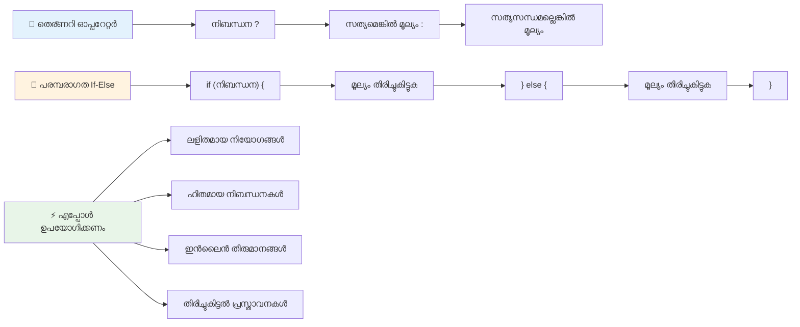
---


## 🚀 ചാലഞ്ച്

ലജിക്കൽ ഓപ്പറേറ്ററുകളാൽ എഴുതിയ ഒരു പ്രോഗ്രാം സൃഷ്ടിച്ച്, തുടർന്ന് ടേണറി പ്രകടനം ഉപയോഗിച്ച് അത് വീണ്ടും എഴുതുക. ജൂഡമായി നിങ്ങൾക്ക് ഇഷ്ടപ്പെടുന്ന സിന്താക്സ് എന്താണ്?

---

## GitHub Copilot ഏജന്റ് ചാലഞ്ച് 🚀

താഴെപ്പറയുന്ന ചാലഞ്ച് ബ്രഹത്രീകൃതമാക്കാൻ ഏജന്റ് മോഡ് ഉപയോഗിക്കുക:

**വിവരണം:** ഈ പാഠത്തിലെ വിവിധ സാന്ദർഭിക ആശയങ്ങൾ ഉൾക്കൊള്ളുന്ന സമഗ്ര ഗ്രേഡ് കാൽക്കുലേറ്റർ സൃഷ്ടിക്കുക; if-else പ്രസ്താവനകൾ, switch പ്രസ്താവനകൾ, ലജിക്കൽ ഓപ്പറേറ്ററുകൾ, ടേണറി പ്രകടനങ്ങൾ എന്നിവ ഉൾപ്പെടെയുള്ളവ ഉൾക്കൊള്ളണം.

**പ്രോംപ്റ്റ്:** ഒരു വിദ്യാർത്ഥിയുടെ സംഖ്യാത്മക സ്കോർ (0-100) സ്വീകരിച്ച്, താഴെയുള്ള മാനദണ്ഡങ്ങൾ ഉപയോഗിച്ച് അവന്റെ അക്ഷര ഗ്രേഡ് നിർണ്ണയിക്കുന്ന ജാവാസ്ക്രിപ്റ്റ് പ്രോഗ്രാം എഴുതുക:
- A: 90-100
- B: 80-89  
- C: 70-79
- D: 60-69
- F: 60-നേക്കാൾ താഴെ

ആവശ്യങ്ങൾ:
1. അക്ഷര ഗ്രേഡ് നിർണ്ണയിക്കാൻ if-else പ്രസ്താവന ഉപയോഗിക്കുക
2. വിദ്യാര്‍ത്ഥി പാസ് ചെയ്യുന്നുണ്ടോ എന്ന് പരിശോധിക്കാൻ ലൊജിക്കൽ ഓപ്പറേറ്ററുകൾ ഉപയോഗിക്കുക (grade >= 60) ഒപ്പം ഹൊണേഴ്സ് ഉണ്ടോ എന്നും (grade >= 90)
3. ഓരോ ലെറ്റർ ഗ്രേഡിനും പ്രത്യേക പ്രതികരണം നൽകാൻ switch സ്റ്റേറ്റ്മെന്റ് ഉപയോഗിക്കുക
4. വിദ്യാർത്ഥി അടുത്ത കോഴ്സ് ചെയ്യാൻ യോഗ്യൻ ആകുന്നത് (grade >= 70) ternary ഓപ്പറേറ്റർ ഉപയോഗിച്ച് നിശ്ചയിക്കുക
5. സ്കോർ 0നും 100ന്റെയും ഇടയിൽ ആണ് എന്നത് ഉറപ്പാക്കാൻ ഇൻപുട്ട് വാലിഡേഷൻ ഉൾപ്പെടുത്തുക

59, 60, 89, 90 പോലുള്ള എഡ്ജ് കേസുകൾ അടങ്ങിയ വിവിധ സ്കോറുകൾ ഉപയോഗിച്ച് നിങ്ങളുടെ പ്രോഗ്രാം പരീക്ഷിക്കുക.

[agent mode](https://code.visualstudio.com/blogs/2025/02/24/introducing-copilot-agent-mode) സംബന്ധിച്ച് കൂടുതൽ അറിയാൻ ഈ ലിങ്ക് സന്ദർശിക്കൂ.


## Post-Lecture Quiz

[Post-lecture quiz](https://ff-quizzes.netlify.app/web/quiz/12)

## Review & Self Study

ഉപയോക്താവിന് ലഭ്യമായ വിവിധ ഓപ്പറേറ്ററുകൾ [MDN-ൽ](https://developer.mozilla.org/docs/Web/JavaScript/Reference/Operators) കൂടുതൽ വായിക്കുക.

Josh Comeauയുടെ ആകർഷകമായ [operator lookup](https://joshwcomeau.com/operator-lookup/) പരിശോധിക്കുക!

## Assignment

[Operators](assignment.md)

---

## 🧠 **നിങ്ങളുടെ തീരുമാനം എടുക്കാനുള്ള ടൂൾകിറ്റ് സംഗ്രഹം**

```mermaid
graph TD
    A["🎯 ജാവാസ്ക്രിപ്റ്റ് തീരുമാനങ്ങൾ"] --> B["🔍 ബൂൾിയൻ ലജിക്"]
    A --> C["📊 ശരണിയായ പ്രഖ്യാപനങ്ങൾ"]
    A --> D["🔗 ലജിക്കൽ ഓപ്പറേറ്റർസ്"]
    A --> E["⚡ ആഡ്വാൻസ്ഡ് പാറ്റേണുകൾ"]
    
    B --> B1["true/false മൂല്യങ്ങൾ"]
    B --> B2["തുലന ഓപ്പറേറ്റർസ്"]
    B --> B3["തരുിത്രതയുടെ ആശയങ്ങൾ"]
    
    C --> C1["if പ്രസ്താവനകൾ"]
    C --> C2["if-else ചെയിനുകൾ"]
    C --> C3["switch പ്രസ്താവനകൾ"]
    
    D --> D1["&& (എൻഡ്)"]
    D --> D2["|| (ഓർ)"]
    D --> D3["! (നോട്ട്)"]
    
    E --> E1["ടെർണറി ഓപ്പറേറ്റർ"]
    E --> E2["ഷോർട്ട്-സർക്യൂട്ട് മൂല്യനിർണ്ണയം"]
    E --> E3["സങ്കീർണ്ണ സാഹചര്യങ്ങൾ"]
    
    F["💡 പ്രധാന സിദ്ധാന്തങ്ങൾ"] --> F1["വ്യക്തമായ വായിക്കാവുന്ന സാഹചര്യങ്ങൾ"]
    F --> F2["സ്ഥിരമായ താരതമ്യ ശൈലി"]
    F --> F3["ശരിയായ ഓപ്പറേറ്റർ പ്രാധാന്യം"]
    F --> F4["പ്രയോജനപ്രദമായ മൂല്യനിർണ്ണയം ക്രമം"]
    
    style A fill:#e3f2fd
    style B fill:#e8f5e8
    style C fill:#fff3e0
    style D fill:#f3e5f5
    style E fill:#e0f2f1
    style F fill:#fce4ec
```
---

## 🚀 നിങ്ങളുടെ JavaScript തീരുമാനം എടുക്കൽ മാസ്റ്ററി ടൈംലൈൻ

### ⚡ **അടുത്ത 5 മിനിറ്റിനുള്ളിൽ നിങ്ങൾ ചെയ്യാൻ കഴിയുന്ന കാര്യങ്ങൾ**
- [ ] ബ്രൗസർ കോൺസോളിൽ താരതമ്യ ഓപ്പറേറ്ററുകൾ പ്രാക്ടീസ് ചെയ്യുക
- [ ] നിങ്ങളുടെ പ്രായം പരിശോധിക്കുന്ന ഒരു ലളിതമായ if-else സ്റ്റേറ്റ്മെന്റ് എഴുതുക
- [ ] ചാരിത്രിക ഓപ്പറേറ്റർ ഉപയോഗിച്ച് if-else പുനരാഖ്യാനം ചെയ്യാനുള്ള ചാലഞ്ച് പരീക്ഷിക്കുക
- [ ] വ്യത്യസ്ത "truthy" ഒപ്പം "falsy" മൂല്യങ്ങൾ ഉപയോഗിച്ച് പരീക്ഷണം നടത്തുക

### 🎯 **ഈ മണിക്കൂറിൽ നിങ്ങൾ നേടാൻ കഴിയുന്ന കാര്യങ്ങൾ**
- [ ] പാഠം കഴിഞ്ഞ് ക്വിസ് പൂർത്തിയാക്കി ആശയക്കുഴപ്പമുള്ള ആശയങ്ങൾ അവലോകനം ചെയ്യുക
- [ ] GitHub Copilot ചാലഞ്ചിൽ നിന്ന് സമഗ്ര ഗ്രേഡ് കാൽക്കുലേറ്റർ നിർമ്മിക്കുക
- [ ] യാഥാർത്ഥ്യ സാഹചര്യത്തിന് ലളിതമായ തീരുമാന മരം സൃഷ്ടിക്കുക (ഉദാഹരണം: എന്ത് ധരിക്കണമെന്ന് തയാറാക്കൽ)
- [ ] ലൊജിക്കൽ ഓപ്പറേറ്ററുകൾ ഉപയോഗിച്ച് നിരവധി ഉൾപ്പെട്ട വ്യവസ്ഥകൾ സംയോജിപ്പിച്ച് പ്രാക്ടീസ് ചെയ്യുക
- [ ] വ്യത്യസ്ത ഉപയോഗങ്ങൾക്കായി switch സ്റ്റേറ്റ്മെന്റുകൾ പരീക്ഷിക്കുക

### 📅 **നിങ്ങളുടെ ആഴ്ചപ്പിരി ലൊജിക് മാസ്റ്ററി**
- [ ] സൃഷ്ടിപരമായ ഉദാഹരണങ്ങളോടൊപ്പം ഓപ്പറേറ്ററുകളുടെ അസൈൻമെന്റ് പൂർത്തിയാക്കുക
- [ ] വിവിധ നിബന്ധനാ ഘടനകൾ ഉപയോഗിച്ച് ഒരു മിനി ക്വിസ് ആപ്ലിക്കേഷൻ നിർമ്മിക്കുക
- [ ] ബഹുഭൂരി ഇൻപുട്ട് നിർദേശങ്ങൾ പരിശോധന ചെയ്യുന്ന ഒരു ഫോർം വാലിഡേറ്റർ സൃഷ്ടിക്കുക
- [ ] Josh Comeauയുടെ [operator lookup](https://joshwcomeau.com/operator-lookup/) വ്യായാമങ്ങൾ പ്രാക്ടീസ് ചെയ്യുക
- [ ] നിലവിലുള്ള കോഡ് കൂടുതൽ യോജിച്ച നിബന്ധനാ ഘടനകൾ ഉപയോഗിച്ച് പുനർക്രമീകരിക്കുക
- [ ] പാർശ്വികമായി വിലയിരുത്തൽ(short-circuit evaluation) ഒപ്പം പ്രവര്‍ത്തനക്ഷമതയെക്കുറിച്ചറിയുക

### 🌟 **നിങ്ങളുടെ മാസം ദൈർഘ്യമുള്ള മാറ്റം**
- [ ] സങ്കീർണ്ണമായ ന്യൂസ്റ്റഡ് നിബന്ധനകൾ പഠിച്ച് കോഡ് വായനാസൗകര്യം ഉറപ്പാക്കുക
- [ ] പുതിയ അവയവങ്ങൾ ചേർത്ത് sofisticated തീരുമാനമെടുക്കൽ ലൊജിക്ക് അടക്കിയുള്ള ആപ്ലിക്കേഷൻ നിർമ്മിക്കുക
- [ ] നിലവിലുള്ള പ്രോജക്ടുകളിൽ നിബന്ധനാ ലൊജിക്കിനെ മെച്ചപ്പെടുത്തുന്നതിലൂടെ ഓപ്പൺ സോഴ്‌സിന് സംഭാവന നൽകുക
- [ ] വിവിധ നിബന്ധനാ ഘടനകൾക്കുറിച്ച് മറ്റൊരാളിനെ പഠിപ്പിക്കുക
- [ ] നിബന്ധനാ ലൊജിക്കിനുള്ള ഫംഗ്ഷനൽ പ്രോഗ്രാമിംഗ് സമീപനങ്ങൾ അന്വേഷിക്കുക
- [ ] നിബന്ധനാ മികച്ച പ്രാക്ടീസുകൾക്കായി വ്യക്തിഗത റഫറൻസ് ഗൈഡ് സൃഷ്ടിക്കുക

### 🏆 **അവസാന തീരുമാനം-എടുക്കൽ ചാമ്പ്യൻ ചെക്ക്-ഇൻ**

**നിങ്ങളുടെ ലൊജിക്കൽ ചിന്തന മാപ്പതെടുത്ത് ആഘോഷിക്കൂ:**
- നിങ്ങൾ സഫലമായി നടപ്പിലാക്കിയ ഏറ്റവും സങ്കീർണ്ണ തീരുമാന ലൊജിക് എന്താണ്?
- ഏത് നിബന്ധനാ ഘടന നിങ്ങള്ക്ക് സ്വാഭാവികമായി അനുഭവപ്പെടുന്നു, അതിന്റെ കാരണം എന്താണ്?
- ലൊജിക്കൽ ഓപ്പറേറ്ററുകൾ പഠിച്ചതോടെ നിങ്ങളുടെ പ്രശ്നപരിഹാര സമീപനം എങ്ങനെ മാറി?
- യഥാർത്ഥ ലോക അപ്ലിക്കേഷനുകളിൽ ഏത് സങ്കീർണ്ണ തീരുമാനം എടുക്കൽ ലൊജിക്ക് കൂടുതൽ പ്രയോജനപ്പെടുത്തും?

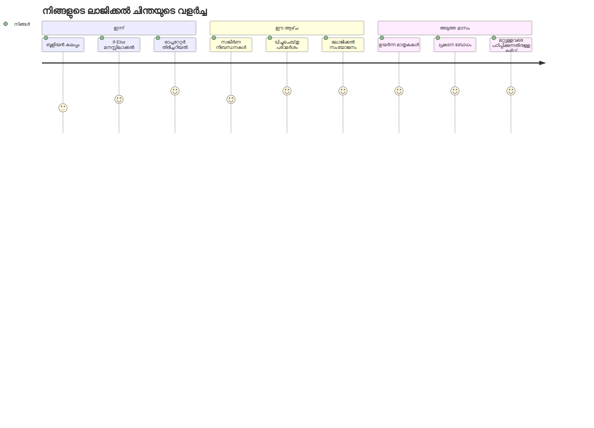
> 🧠 **നിങ്ങൾ ഡിജിറ്റൽ തീരുമാനം എടുക്കലിന്റെ കലയിൽ പൂർണ്ണമതായത്!** ഏതു ഇന്ററാക്റ്റീവ് ആപ്ലിക്കേഷനും ഉപയോക്തൃ പ്രവർത്തനങ്ങൾക്കും മാറ്റം വരുന്ന സാഹചര്യങ്ങൾക്ക് ബുദ്ധിമാനായ പ്രതികരണം നൽകാൻ നിബന്ധനാ ലൊജിക്ക് ആശ്രയിക്കുന്നതാണ്. ഇനി നിങ്ങൾക്ക് നിങ്ങളുടെ പ്രോഗ്രാമുകൾ ചിന്തിക്കാൻ, വിലയിരുത്താൻ, ഉചിതമായ പ്രതികരണങ്ങൾ തിരഞ്ഞെടുക്കാൻ സാധിക്കും. ഈ ലൊജിക്കൽ അടിസ്ഥാനമാണ് നിങ്ങൾ സൃഷ്ടിക്കുന്ന എല്ലാ ഡ്രൈനാമിക് ആപ്ലിക്കേഷനുകൾ പ്രവർത്തിപ്പിക്കുക! 🎉

---

<!-- CO-OP TRANSLATOR DISCLAIMER START -->
**പരാമർശം**:
ഈ രേഖ AI പരിഭാഷാപരിശോധനാ സേവനം [Co-op Translator](https://github.com/Azure/co-op-translator) ഉപയോഗിച്ച് പരിഭാഷപ്പെടുത്തിയതാണ്. നൂതനത്വത്തിനായി ഞങ്ങൾ ശ്രമിക്കുന്നുവെങ്കിലും, യന്ത്രത്തിൽ നിന്നുള്ള പരിഭാഷകൾ പിശകുകളോ അസ്ഥിരതകളോ ഉണ്ടായിരിക്കാമെന്നത് ശ്രദ്ധിക്കാൻ ആവശ്യമാണ്. അതിന്റെ സ്വദേശഭാഷയിലുള്ള ഒറിജിനൽ രേഖ പ്രാമാണികമായ ഉറവിടമായി പരിഗണിക്കേണ്ടതാണ്. നിർണ്ണായക വിവരങ്ങൾക്ക്, പ്രൊഫഷണൽ മനുഷ്യ പരിഭാഷ ആവശ്യമാണെന്ന് ശുപാർശ ചെയ്യപ്പെടുന്നു. ഈ പരിഭാഷ ഉപയോഗിക്കുന്നതിൽ നിന്നു സൃഷ്ടിച്ച തെറ്റിദ്ധാരണകളോ വ്യാഖ്യാന പിശകുകളോ ഞങ്ങൾക്ക് ഉത്തരവാദിത്വമില്ല.
<!-- CO-OP TRANSLATOR DISCLAIMER END -->