<!--
CO_OP_TRANSLATOR_METADATA:
{
  "original_hash": "1710a50a519a6e4a1b40a5638783018d",
  "translation_date": "2026-01-08T13:03:09+00:00",
  "source_file": "2-js-basics/4-arrays-loops/README.md",
  "language_code": "ml"
}
-->
# ജാവാസ്ക്രിപ്റ്റ് അടിസ്ഥാനങ്ങൾ: നിരകളും ലൂപ്പുകളും

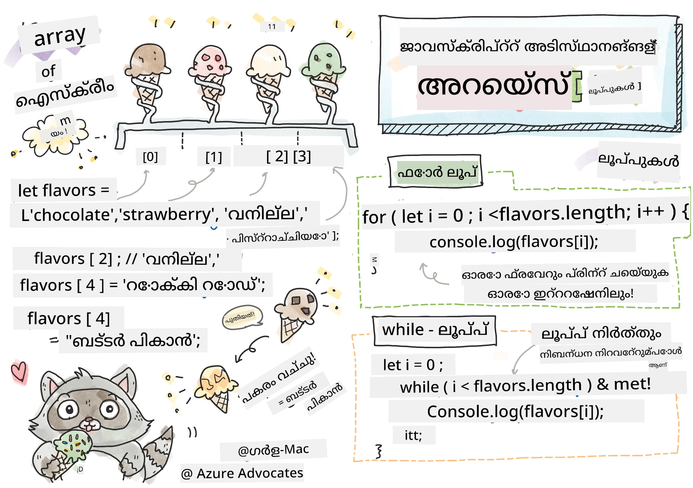
> സ്കെച്ച്നോട്ട് \- [ടോമോമി ഇമുറ](https://twitter.com/girlie_mac)

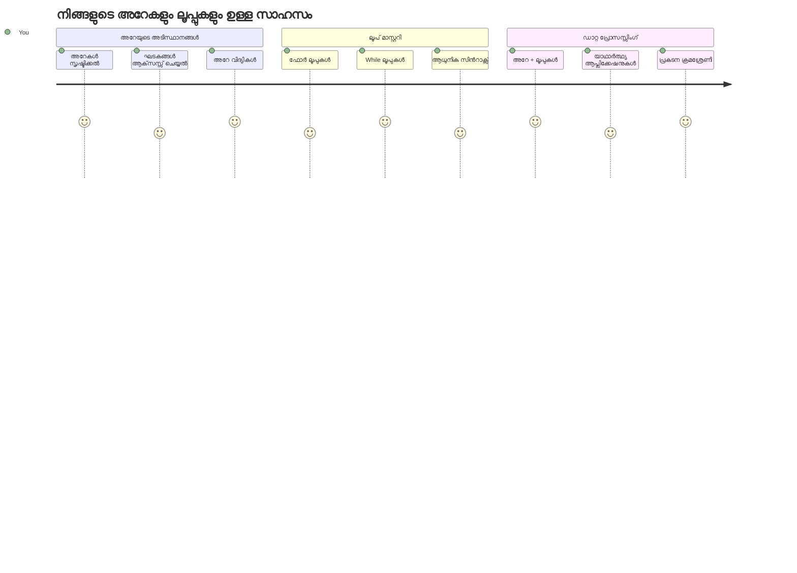
## പ്രീ-ലെക്ചർ ക്വിസ്
[പ്രി-ലെക്ചർ ക്വിസ്](https://ff-quizzes.netlify.app/web/quiz/13)

വെബ്‌സൈറ്റുകൾ ഷോപ്പിംഗ് കാർട്ട് ഇനങ്ങൾ എങ്ങനെ ട്രാക്ക് ചെയ്യുന്നു അല്ലെങ്കിൽ നിങ്ങളുടെ സ്നേഹിതർ ലിസ്റ്റ് എങ്ങനെ പ്രദർശിപ്പിക്കുന്നു എന്ന് ഒരുപാട് ചിന്തിച്ചു നോക്കിയിട്ടുണ്ടോ? അപ്പോൾ തന്നെ നിരകളും ലൂപ്പുകളും ഉപയോഗിക്കുന്നു. നിരകള്‍ അനേകം വിവരങ്ങൾ നിലനിർത്തുന്ന ഡിജിറ്റൽ കണ്ടെയ്‌നറുകളായി പ്രവർത്തിക്കുന്നു, ലൂപ്പുകൾ ആവർത്തന മുക്തമായി ആ വിവരങ്ങൾ മുഴുവനായി പ്രവര്‍ത്തിപ്പിക്കാൻ സഹായിക്കുന്നു.

ഈ രണ്ട് ആശയങ്ങളും ചേർന്ന് നിങ്ങളുടെ പ്രോഗ്രാമുകളിൽ വിവരങ്ങൾ കൈകാര്യം ചെയ്യുന്നതിനുള്ള അടിസ്ഥാനം രൂപപ്പെടുത്തുന്നു. ഓരോ ഘട്ടവും സ്വയം എഴുതുന്നതിൽ നിന്ന് നിങ്ങൾ മികവാർന്ന, കാര്യക്ഷമമായ കോഡ് എഴുതാൻ പഠിക്കും, അതേ സമയം നൂറുകളിൽ അല്ലെങ്കിൽ ആയിരത്തിലധികം ഇനങ്ങൾ വേഗത്തിൽ പ്രോസസ് ചെയ്യാം.

പാഠത്തിന്റെ അവസാനത്തേക്ക്, ചെറു ചിലവുകളും ഉപയോഗിച്ച് സമ്പ്രേക്ഷിത വിവര പ്രവർത്തനങ്ങൾ എങ്ങനെ ചെയ്യാമെന്ന് നിങ്ങൾ മനസിലാക്കും. ഈ അനിവാര്യമായ പ്രോഗ്രാമിംഗ് ആശയങ്ങൾ പര്യവേക്ഷണം ചെയ്യാം.

[](https://youtube.com/watch?v=1U4qTyq02Xw "Arrays")

[](https://www.youtube.com/watch?v=Eeh7pxtTZ3k "Loops")

> 🎥 മുകളിലുള്ള ചിത്രങ്ങളിൽ ക്ലിക്ക് ചെയ്യുക നമുക്ക് നിരകളും ലൂപ്പുകളും സംബന്ധിച്ച വീഡിയോകൾ കാണാം.

> നിങ്ങൾ ഈ പാഠം [Microsoft Learn](https://docs.microsoft.com/learn/modules/web-development-101-arrays/?WT.mc_id=academic-77807-sagibbon) ൽ പഠിക്കാം!

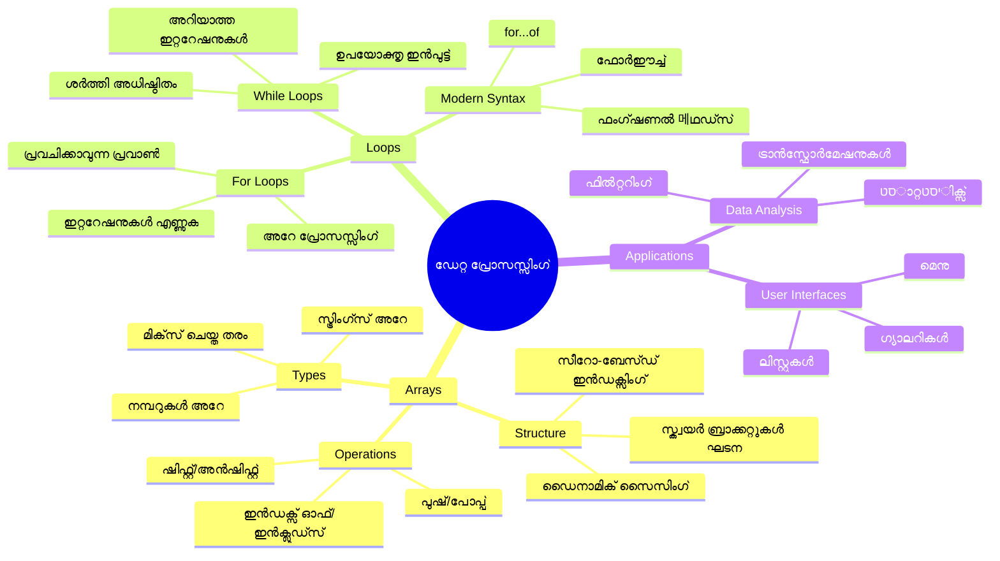
## നിരകൾ

നിരകൾ ഒരു ഡിജിറ്റൽ ഫയൽ കണ്ടെയ്‍നർ എന്ന് കരുതുക – ഓരോ ഡ്രോയർ കഴിയും ഒറ്റ ഡോക്യുമെന്റ് സൂക്ഷിക്കുന്നതിന് പകരം, നിങ്ങൾക്ക് ബന്ധപ്പെട്ട നിരവധി ഇനങ്ങൾ ഒറ്റ, ക്രമീകരിച്ച കണ്ടെയ്‌നറിൽ ഓർഗനൈസ് ചെയ്യാം. പ്രോഗ്രാമിങ്ങിൽ, നിരകൾ അനേകം വിവരങ്ങൾ ഒരുമിച്ചായി സംരക്ഷിക്കാൻ സഹായിക്കുന്നു.

നിങ്ങൾ ഫോട്ടോ ഗാലറി നിർമ്മിക്കുകയായിരിക്കുക, ടു-ഡു ലിസ്റ്റ് മാനേജ് ചെയ്യുകയായിരിക്കുക, അല്ലെങ്കിൽ ഒരു ഗെയിമിലെ ഉയർന്ന സ്കോറുകൾ ട്രാക്ക് ചെയ്യുകയായിരിക്കുക, നിബന്ധനകൾ വിവരങ്ങളുടെ ക്രമീകരണത്തിനായുള്ള അടിസ്ഥാനം നൽകുന്നു. എങ്ങനെ പ്രവർത്തിക്കുന്നു എന്ന് നോക്കാം.

✅ നിരകൾ നമ്മുടെ ചുറ്റുപാടുകളിലൊന്നായി! ഒരു യാഥാർത്ഥ്യ ഉദാഹരണമെന്നാവർത്തനം നിൽക്കൂ, ഉദാഹരണത്തിന് ഒരു സൂര്യപാനൽ നിര?

### നിരകൾ സൃഷ്ടിക്കുന്നത്

നിര സൃഷ്ടിക്കൽ വളരെ ലളിതമാണ് – വെറും ചതുരകോണം ബ്രാക്കറ്റുകൾ ഉപയോഗിക്കുക!

```javascript
// ശൂന്യമായ അറേ - ഇനങ്ങൾക്കായി കാത്തിരിക്കുന്ന ശൂന്യമായ ഷോപ്പിംഗ് കാർട്ട് പോലെ
const myArray = [];
```

**ഇവിടെ എന്ത് സംഭവിക്കുന്നു?**
നിങ്ങൾ വെറും ചതുരകോണം ബ്രാക്കറ്റുകൾ `[]` ഉപയോഗിച്ച് ഒരു ശൂന്യവായ കംടെയ്‌നർ ഉണ്ടാക്കി. ഇത് ശൂന്യമായ ലൈബ്രറി ഷെല്‍ഫ് പോലെ ചിന്തിക്കാം – നിങ്ങൾക്ക് അവിടെ ഏത് പുസ്തകങ്ങൾ ആഗ്രഹിച്ചും ക്രമീകരിക്കാം.

നിങ്ങൾക്ക് നിങ്ങളുടെ നിരക്ക് ആരംഭത്തിൽ തന്നെ ആദ്യം മൂല്യങ്ങൾ നൽകാനും കഴിയും:

```javascript
// നിങ്ങളുടെ ഐസ് ക്രീം കടയുടെ ഫ്ലേവർ മെനു
const iceCreamFlavors = ["Chocolate", "Strawberry", "Vanilla", "Pistachio", "Rocky Road"];

// ഒരു ഉപയോക്താവിന്റെ പ്രൊഫൈൽ വിവരങ്ങൾ (വിവിധ തരത്തിലുള്ള ഡാറ്റ മിശ്രിതം)
const userData = ["John", 25, true, "developer"];

// നിങ്ങളുടെ ഇഷ്ട ക്ലാസ്സിന്റെ ടെസ്റ്റ് സ്കോറുകൾ
const scores = [95, 87, 92, 78, 85];
```

**കൂൾ കാര്യം ശ്രദ്ധിക്കേണ്ടത്:**
- ഒരേ നിരയിൽ വാചകം, സംഖ്യകൾ അല്ലെങ്കിൽ true/false മൂല്യങ്ങൾ ഉൾപ്പെടുത്താം
- ഓരോ ഇനവും കോമ ഉപയോഗിച്ച് വേർതിരിക്കുക – എളുപ്പം!
- നിരകൾ ബന്ധപ്പെട്ട വിവരങ്ങൾ ഒരുമിച്ചിട്ട് സൂക്ഷിക്കാൻ അനുയോജ്യമാണ്

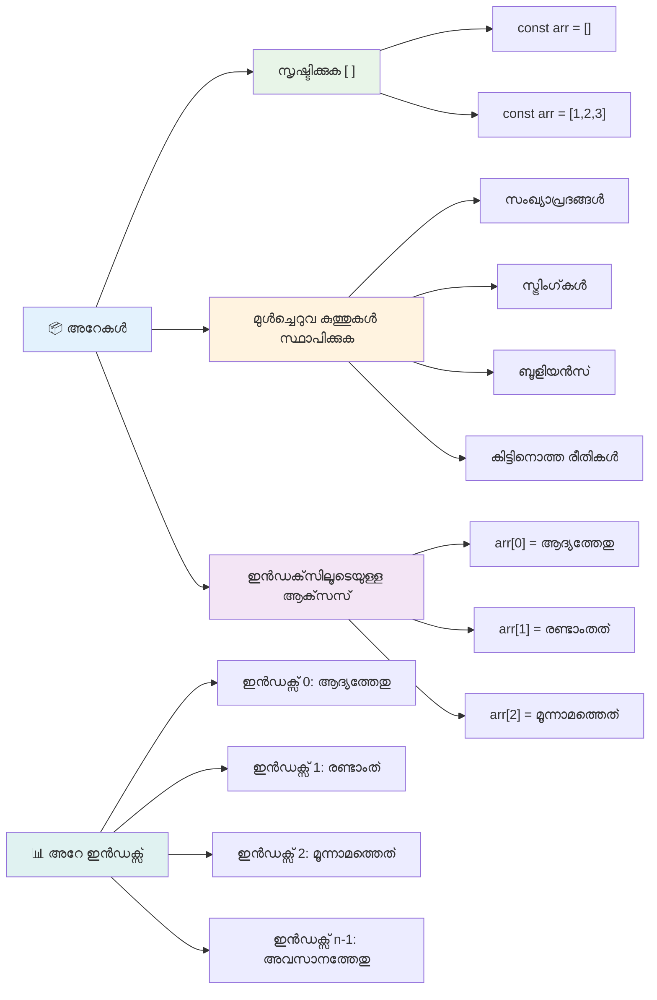
### നിര ഇൻഡക്സിങ്ങ്

ആദ്യം ചിലപ്പോൾ അന്യമായ തോന്നാം: നിരകൾ ഇനങ്ങളെ 0-ആം സ്ഥാനത്ത് നിന്ന് എണ്ണുന്നു, 1-ൽ നിന്ന് അല്ല. ഈ സീറോ അടിസ്ഥാനമുള്ള ഇൻഡക്സിങ് കമ്പ്യൂട്ടർ മെമ്മറിയുടെ പ്രവർത്തന രീതി മുതൽ ഉത്തപ്പൂർത്തിയുളളതാണ് – C പോലുള്ള പ്രോഗ്രാമിംഗ് ഭാഷകളുടെ തുടക്കക്കാലങ്ങളിൽ നിന്നുള്ള മാനദണ്ഡമാണ്. നിരയിലെ ഓരോ സ്ഥാനത്തും അതിന്റെ സ്വന്തം നമ്പർ ഉപയോഗിച്ച് **ഇൻഡക്സ്** എന്ന് വിളിക്കുന്നു.

| ഇൻഡക്സ് | മൂല്യം | വിവരണം |
|---------|---------|----------|
| 0 | "ചോക്ലേറ്റ്" | ആദ്യ ഘടകം |
| 1 | "സ്ട്രോബെറി" | രണ്ടാമത്തെ ഘടകം |
| 2 | "വാനില" | മുപ്പതാമത്തെ ഘടകം |
| 3 | "പിസ്റ്റാച്ചിയോ" | നാലാമത്തെ ഘടകം |
| 4 | "റോക്കി റോഡ്" | അഞ്ചാമത്തെ ഘടകം |

✅ നിരകൾ 0-ൽ നിന്ന് ആരംഭിക്കുന്നത് നിങ്ങൾക്ക് അത്ഭുതം തോന്നുന്നുണ്ടോ? ചില പ്രോഗ്രാമിങ് ഭാഷകളിൽ ഇൻഡക്സുകൾ 1-ൽ നിന്ന് ആരംഭിക്കുന്നു. ഇതിന് മേൽ അറിയാനായി [വിക്കിപീഡിയയിൽ](https://en.wikipedia.org/wiki/Zero-based_numbering) വായിക്കാം.

**നിര ഘടകങ്ങൾ ആക്‌സസ് ചെയ്യുക:**

```javascript
const iceCreamFlavors = ["Chocolate", "Strawberry", "Vanilla", "Pistachio", "Rocky Road"];

// ബ്രാക്കറ്റ് نوټېഷൻ ഉപയോഗിച്ച് വ്യക്തിഗത ഘടകങ്ങൾ ആക്‌സസ് ചെയ്യുക
console.log(iceCreamFlavors[0]); // "Chocolate" - ആദ്യ ഘടകം
console.log(iceCreamFlavors[2]); // "Vanilla" - മൂന്നാം ഘടകം
console.log(iceCreamFlavors[4]); // "Rocky Road" - അവസാന ഘടകം
```

**ഇവിടെ സംഭവിക്കുന്ന കാര്യം വിശദീകരണം:**
- **ഇൻഡക്സ് നമ്പർ** ഉപയോഗിച്ച് ചതുരബ്രാക്കറ്റുകാര്യം ഉപയോഗിച്ച്ിച്ച് ഘടകങ്ങൾ ആക്‌സസ് ചെയ്യുന്നു
- **നിർബന്ധമായ സ്ഥിതിയില്‍ സൂക്ഷിച്ച മൂല്യം** തിരികെ നൽകുന്നു
- **0-ൽ നിന്ന് എണ്ണൽ** ആരംഭിക്കുന്നു, അതിനാൽ ആദ്യ ഘടകത്തിൻ്റെ ഇൻഡക്സ് 0 ആണ്

**നിര ഘടകങ്ങൾ മാറ്റം വരുത്തുന്നത്:**

```javascript
// നിലവിലുള്ള ഒരു മൂല്യം മാറ്റുക
iceCreamFlavors[4] = "Butter Pecan";
console.log(iceCreamFlavors[4]); // "ബട്ടർ പെക്കൻ"

// അവസാനം ഒരു പുതിയ ഘടകം ചേർക്കുക
iceCreamFlavors[5] = "Cookie Dough";
console.log(iceCreamFlavors[5]); // "കുക്കി ഡോ"
```

**മുകളിൽ ഞങ്ങൾ ചെയ്തതിൻ്റെ വിശദീകരണം:**
- ഇൻഡക്സ് 4-ൽ තිබുന്ന "റോക്കി റോഡ്" "ബട്ടർ പീക്കൻ" ആയി മാറ്റി
- ഇൻഡക്സ് 5-ൽ പുതിയ ഘടകം "കുക്കി ഡോ" ചേർത്തു
- നിലവിലെ പരിധിക്ക് മുകളിൽ അധികം മൂല്യങ്ങൾ ചേർക്കുമ്പോൾ നിരയുടെ നീളം സ്വയം വിപുലീകരിക്കുന്നു

### നിര നീളം மற்றும் സാധാരണ രീതികൾ

നിരകൾ ഉള്ളടക്ക കാര്യക്ഷമതയ്ക്കായി പ്രയോഗിക്കാൻ ധാരാളം ആന്തരിക ഗുണങ്ങളും രീതികളും നൽകുന്നു.

**നിരയുടെ നീളം കണ്ടെത്തൽ:**

```javascript
const iceCreamFlavors = ["Chocolate", "Strawberry", "Vanilla", "Pistachio", "Rocky Road"];
console.log(iceCreamFlavors.length); // 5

// അറേ മാറുമ്പോൾ നീളം സ്വയം അപ്ഡേറ്റ് ചെയ്യും
iceCreamFlavors.push("Mint Chip");
console.log(iceCreamFlavors.length); // 6
```

**പ്രധാņa അറിയേണ്ട കാര്യങ്ങൾ:**
- നിരയിൽ ഉള്ള ഘടകങ്ങളുടെ മൊത്തം എണ്ണം തിരികെ നൽകുന്നു
- ഘടകങ്ങൾ ചേർക്കുന്നതോ അല്ലെങ്കിൽ നീക്കംചെയ്യുന്നതോ ആയപ്പോൾ സ്വയം പുതുക്കപ്പെടുന്നു
- ലൂപ്പുകൾക്കും സാധുത പരിശോധനകൾക്കും കൂട്ടിച്ചേർക്കാനുള്ള ഡൈനാമിക് എണ്ണം നൽകുന്നു

**അവശ്യമായ നിര രീതികൾ:**

```javascript
const fruits = ["apple", "banana", "orange"];

// ഘടകങ്ങൾ ചേർക്കുക
fruits.push("grape");           // അവസാനം ചേർക്കുന്നു: ["ആപ്പിൾ", "ബനാന", "ഓറഞ്ച്", "ഗ്രേപ്പ്"]
fruits.unshift("strawberry");   // ആരംഭത്തിൽ ചേർക്കുന്നു: ["സ്ട്രോബെറി", "ആപ്പിൾ", "ബനാന", "ഓറഞ്ച്", "ഗ്രേപ്പ്"]

// ഘടകങ്ങൾ നീക്കംചെയ്യുക
const lastFruit = fruits.pop();        // "ഗ്രേപ്പ്" നീക്കി തിരികെ നൽകുന്നു
const firstFruit = fruits.shift();     // "സ്ട്രോബെറി" നീക്കി തിരികെ നൽകുന്നു

// ഘടകങ്ങൾ കണ്ടെത്തുക
const index = fruits.indexOf("banana"); // 1 തിരിച്ചുകൊടുക്കുന്നു ("ബനാന" ന്റെ സ്ഥാനം)
const hasApple = fruits.includes("apple"); // സത്യം (true) തിരിച്ചുകൊടുക്കുന്നു
```

**ഈ രീതി പെട്ടെന്ന് മനസ്സിലാക്കുക:**
- `push()` ഉപയോഗിച്ച് ചേർക്കുന്നു (അവസാനത്തിൽ) `unshift()` (ആരംഭത്തിൽ)
- `pop()` ഉപയോഗിച്ച് നീക്കംചെയ്യുന്നു (അവസാനത്തിൽ) `shift()` ഉപയോഗിച്ച് (ആരംഭത്തിൽ)
- `indexOf()` ഉപയോഗിച്ച് സ്ഥാനം കണ്ടെത്തുന്നു, `includes()` ഉപയോഗിച്ച് നിലവാരം പരിശോധിക്കുന്നു
- നീക്കംചെയ്‌തിരിക്കുന്ന ഘടകങ്ങൾ, സ്ഥാനനമ്ബർ എന്നിവ തിരികെ നൽകുന്നു

✅ സ്വയം ശ്രമിക്കൂ! നിങ്ങളുടെ ബ്രൗസറിന്റെ കോൺസോളിൽ കുറച്ച് നിര സൃഷ്ടിച്ച് അവ പ്രയോഗിച്ച് നോക്കൂ.

### 🧠 **നിരമൂലാസ്ഥാനങ്ങൾ പരിശോദനം: നിങ്ങളുടെ ഡാറ്റ ക്രമീകരിക്കൽ**

**നിര മനസ്സിലാക്കൽ പരിശോധിക്കുക:**
- നിങ്ങൾക്ക് എന്തുകൊണ്ട് നിരകൾ 1-നെക്കാൾ 0-ൽ മുതൽ എണ്ണുന്നത് ഇഷ്ടമാണ്?
- നിങ്ങൾ നീലിഭാഗത്തില്ലാത്ത ഇൻഡക്സ് ഉപയോഗിച്ച് ആക്‌സസ് ചെയ്യാൻ ശ്രമിച്ചാൽ (ഉദാഹরণത്തിന് `arr[100]` 5 ഘടകങ്ങളുള്ള നിരയിൽ) എന്തായിരിക്കും?
- നിരകൾ പ്രയോജനപ്പെടുന്ന യാഥാർത്ഥ്യ സാഹചര്യങ്ങൾ മൂന്ന് ചിന്തിക്കാമോ?

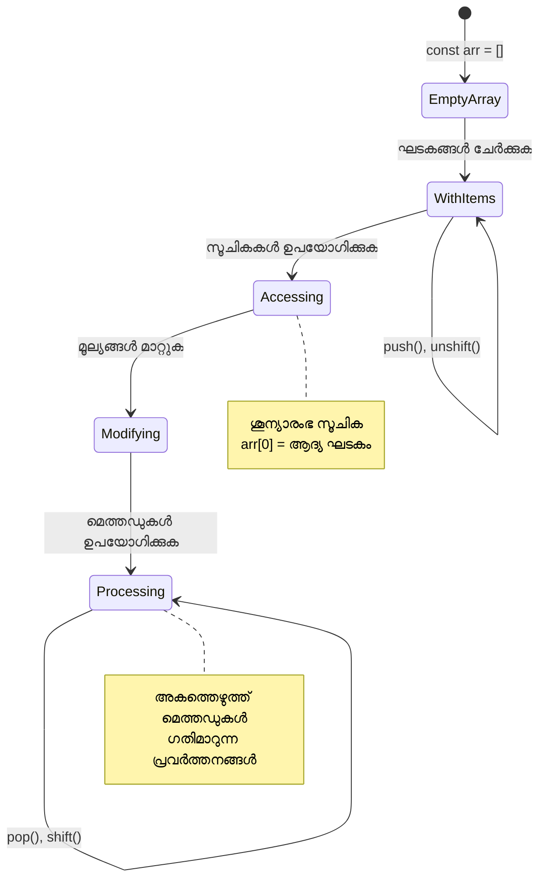
> **യാഥാർത്ഥ്യ ജ്ഞാനം**: പ്രോഗ്രാമിംഗിൽ നിരകൾ എല്ലിടത്തും കാണാം! സോഷ്യൽ മീഡിയ ഫീഡുകൾ, ഷോപ്പിംഗ് കാർട്ടുകൾ, ഫോട്ടോ ഗാലറികൾ, പ്ലേലിസ്റ്റ് ഗാനങ്ങൾ—all- ഇവയുടെ പിൻഭാഗം നിരകൾ ആണു!

## ലൂപ്പുകൾ

ചാൾസ് ഡിക്കൻസിന്റെ നോവലുകളിൽ വിദ്യാർത്ഥികൾ slate-ലേക്ക് ആവർത്തിച്ച് വരികൾ എഴുതേണ്ടി വന്ന ശിക്ഷയെപ്പറ്റി ചിന്തിക്കൂ. നിങ്ങൾക്ക് ഒരാൾക്ക് "ഈ വാചകം 100 പ്രാവശ്യം എഴുതുക" എന്നു പറഞ്ഞാൽ അത് സ്വയം സംഭവിച്ചിരുന്നെങ്കിൽ എങ്ങനെ? അങ്ങനെ, ലൂപ്പുകൾ നിങ്ങളുടെ കോഡിനായി ചെയ്യുന്നത്.

ലൂപ്പുകൾ ഒരു ക്ഷീണരഹിത സഹായി പോലെയാണ്, ജോലി പിഴച്ചില്ലാതെ ആവർത്തിക്കുന്നു. നിങ്ങൾ ഷോപ്പിംഗ് കാർട്ടിലെ ഓരോ ഇനവും പരിശോധിക്കണം, അല്ലെങ്കിൽ ഓരോ ഫോട്ടോയും ആൽബത്തിലെ പ്രദർശിപ്പിക്കണം എങ്കിൽ, ലൂപ്പുകൾ ആവർത്തനങ്ങൾ കാര്യക്ഷമമായി കൈകാര്യം ചെയ്യുന്നു.

ജാവാസ്ക്രിപ്റ്റ് ഉപയോഗത്തിനായി വിവിധ ലൂപ്പ് തരം നൽകുന്നു. ഓരോന്നും നോക്കാം, എപ്പോൾ ഉപയോഗിക്കണമെന്ന് മനസ്സിലാക്കാം.

```mermaid
flowchart TD
    A["🔄 ലൂപ് തരം"] --> B["ഫോർ ലൂപ്"]
    A --> C["വൈൽ ലൂപ്"]
    A --> D["ഫോർ...ആഫ് ലൂപ്"]
    A --> E["ഫോർഇച്ച് മെത്തഡ്"]
    
    B --> B1["ശരിചെയ്ത ആവർത്തനങ്ങൾ"]
    B --> B2["കൗണ്ടർ അധിഷ്ഠിതം"]
    B --> B3["for(init; condition; increment)"]
    
    C --> C1["അജ്ഞാത ആവർത്തനങ്ങൾ"]
    C --> C2["നിബന്ധന അധിഷ്ഠിതം"]
    C --> C3["while(condition)"]
    
    D --> D1["ആധുനിക ES6+"]
    D --> D2["അറേ ആവർത്തനം"]
    D --> D3["for(item of array)"]
    
    E --> E1["ഫംഗ്ഷനൽ ശൈലി"]
    E --> E2["അറേ മെത്തഡ്"]
    E --> E3["array.forEach(callback)"]
    
    F["⏰ എപ്പോൾ ഉപയോഗിക്കാൻ"] --> F1["ഫോർ: എണ്ണം, സൂചികകൾ"]
    F --> F2["വൈൽ: ഉപയോക്തൃ ഇൻപുട്ട്, തിരയൽ"]
    F --> F3["ഫോർ...ആഫ്: ലളിതമായ ആവർത്തനം"]
    F --> F4["ഫോർഇച്ച്: ഫംഗ്ഷനൽ പ്രോഗ്രാമിംഗ്"]
    
    style A fill:#e3f2fd
    style B fill:#e8f5e8
    style C fill:#fff3e0
    style D fill:#f3e5f5
    style E fill:#e0f2f1
    style F fill:#fce4ec
```
### ഫോർ ലൂപ്പ്

`for` ലൂപ്പ് ഒരു ടൈമർ സെറ്റ് ചെയ്യുന്നതുപോലെ ആണ് – നമ്മക്ക് എത്ര പ്രാവശ്യം ഒരു കാര്യം ഉണ്ടാകണമെന്ന് നിശ്ചിതമുണ്ട്. അതിനാൽ വളരെ ക്രമീകരിച്ചും മുൻകൂട്ടി പ്രവചിക്കാവുന്നതുമായ രീതിയിലാണ് ഇത്, പ്രത്യേകിച്ച് നിങ്ങൾ നിരകൾ കൈകാര്യം ചെയ്യുമ്പോൾ അല്ലെങ്കിൽ എണ്ണങ്ങളെ കണക്കാക്കുമ്പോൾ.

**ഫോർ ലൂപ്പ് ഘടന:**

| ഘടകം | ഉദ്ദേശ്യം | ഉദാഹരണം |
|---------|-----------|-------------|
| **ആരംഭിക്കൽ** | ആരംഭ ബിന്ദു നിശ്ചയിക്കൽ | `let i = 0` |
| **നിബന്ധന** | തുടർക്കുന്നത് എപ്പോൾ | `i < 10` |
| **ഇൻക്രീമെന്റ്** | എങ്ങനെ നവീകരിക്കണം | `i++` |

```javascript
// 0 മുതൽ 9 വരെ എണ്ണൽ
for (let i = 0; i < 10; i++) {
  console.log(`Count: ${i}`);
}

// കൂടുതൽ പ്രായോഗിക ഉദാഹരണം: സ്‌കോറുകൾ പ്രോസസ്സ് ചെയ്യൽ
const testScores = [85, 92, 78, 96, 88];
for (let i = 0; i < testScores.length; i++) {
  console.log(`Student ${i + 1}: ${testScores[i]}%`);
}
```

**ഓരോ ഘട്ടവും എന്താണ് സംഭവിക്കുന്നത്:**
- **ആരംഭിക്കുന്നു** കൗണ്ടർ വേരിയബിൾ `i` നെ 0 ആയി
- ഓരോ പടിയിലുമ്ബോഴും **നിബന്ധന പരിശോധിക്കുന്നു** `i < 10`
- **പ്രവർത്തന കോഡ് ബ്ലോക്ക്** നിബന്ധനം സത്യമെങ്കിൽ നടപ്പാക്കുന്നു
- ഓരോ പടിയിലും `i++` ഉപയോഗിച്ച് `i` 1-ന് കൂട്ടിച്ചേർക്കുന്നു
- **നിബന്ധനം തള്ളിലായത് വരെ** (i 10 ആയപ്പോൾ) നിന്നിരിക്കുന്നു

✅ ബ്രൗസർ കോൺസോളിൽ ഇത് റൺ ചെയ്യൂ. കൗണ്ടറിലെ, നിബന്ധനയിലെ, അല്ലെങ്കിൽ ഇറ്ററേഷൻ എക്സ്പ്രഷനിൽ ചെറിയ മാറ്റങ്ങൾ വരുത്തുമ്പോൾ എന്ത് സംഭവിക്കുന്നു? ഇത് റവേഴ്സ് ഓപ്പറേഷൻ ചെയ്‌താൽ, കണക്കുകൂട്ടൽ കുറവ് ഉണ്ടാക്കാമോ?

### 🗓️ **ഫോർ ലൂപ്പ് പ്രാവീണ്യ പരീക്ഷ: നിയന്ത്രിത ആവർത്തനം**

**നിങ്ങളുടെ ഫോർ ലൂപ്പ് മനസിലാക്കൽ വിലയിരുത്തുക:**
- ഫോർ ലൂപ്പിന്റെ മൂന്ന് ഭാഗങ്ങൾ എന്തെല്ലാം, ഓരോന്നും എന്ത് ചെയ്യുന്നു?
- ഒരു നിര പിന്നോട്ടു ദൃശ്യവല്‍ക്കരിക്കാന്‍ എങ്ങനെ ലൂപ്പ് ഉപയോഗിക്കും?
- ഇൻക്രീമെന്റ് (`i++`) മറന്നാൽ എന്ത് സംഭവിക്കും?

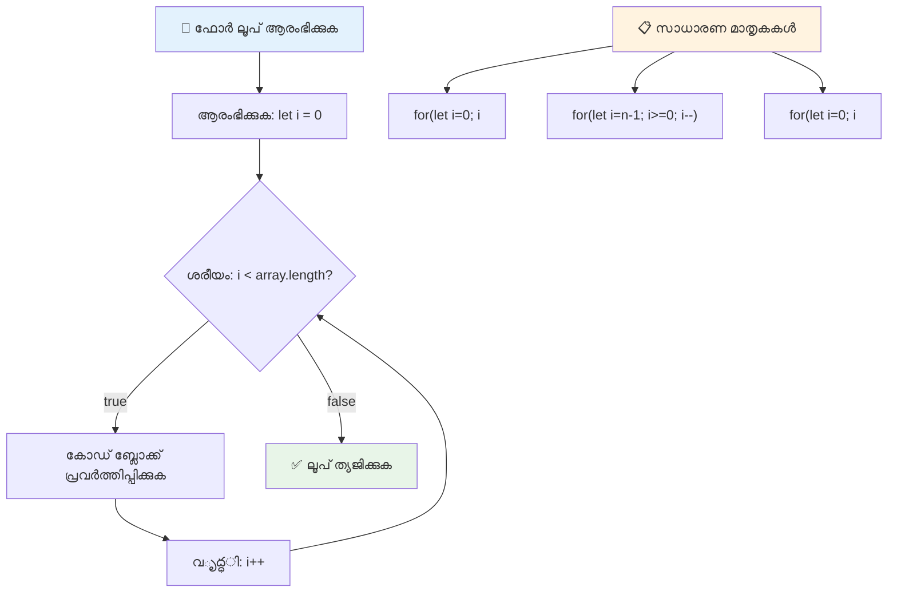
> **ലൂപ്പ് ജ്ഞാനം**: ഏതു വട്ടം എത്ര പ്രാവശ്യം ആവർത്തിക്കണമെന്ന് നിശ്ചിതമായിട്ടുണ്ടെങ്കിൽ ഫോർ ലൂപ്പ് ഏറ്റവും അനുയോജ്യം. നിർധാരിത പ്രവർത്തനങ്ങൾക്ക് ഏറ്റവും സാധാരണമായ തിരഞ്ഞെടുപ്പാണ് ഇത്!

### while ലൂപ്പ്

`while` ലൂപ്പ് "ഇത് ചെയ്യിയത് തുടർന്നുപോവുക..." എന്ന പോലെ ആണ് – എത്ര തവണ ഓടുമെന്ന് നിശ്ചയമില്ലെങ്കിലും എപ്പോൾ നിർത്തണമെന്നും അറിയാം. ഒരു ഉപയോക്താവിൽ നിന്നും ശരിയായ ഇൻപുട്ട് വരുമ്പോഴേക്കും ലൂപ്പിൽ നിന്നു നിർത്താനുള്ളതിനും, ഡയറക്ടറിയിൽ നിന്നു സാധനം കണ്ടെത്തുന്നത് വരെയാണ് ഇത് സഹായിക്കുന്നത്.

**while ലൂപ്പ് സവിശേഷതകൾ:**
- നിബന്ധനം സത്യമാകുന്ന വരെയാണ് തുടർച്ചയായി ഓടുക
- കൗണ്ടർ വേരിയബിൾകൾ മാനുവലായി നിയന്ത്രിക്കണം
- ലൂപ്പ് ഓരോ തവണയ്ക്കും മുമ്പ് നിബന്ധനം പരിശോധിക്കും
- നിബന്ധനം ഒരിക്കലും തള്ളിലാക്കാതെ വയ്ക്കുമ്പോൾ അനന്ത ലൂപ്പുകൾ ഉണ്ടാകാനുള്ള അപകടം

```javascript
// അടിസ്ഥാന എണ്ണലിന്റെ ഉദാഹരണം
let i = 0;
while (i < 10) {
  console.log(`While count: ${i}`);
  i++; // കൂട്ടുന്നത് മറക്കാതെ ചെയ്യൂ!
}

// കൂടുതൽ പ്രായോഗികമായി: ഉപയോക്താവിന്റെ ഇൻപുട്ട് പ്രോസസ്സ് ചെയ്യൽ
let userInput = "";
let attempts = 0;
const maxAttempts = 3;

while (userInput !== "quit" && attempts < maxAttempts) {
  userInput = prompt(`Enter 'quit' to exit (attempt ${attempts + 1}):`);
  attempts++;
}

if (attempts >= maxAttempts) {
  console.log("Maximum attempts reached!");
}
```

**ഈ ഉദാഹരണങ്ങൾ വിശദീകരണം:**
- ലൂപ്പ് ശരീരത്തിനുള്ളിൽ കൗണ്ടർ മാനേജ്മെന്റ്
- അനന്തം ലൂപ്പുകൾ തടയാൻ കൗണ്ടർ കൂട്ടിക്കുന്നതിന്റെ ഉദാഹരണം
- ഉപയോക്തൃ ഇൻപുട്ടും ശ്രമ പരിധിയും അടങ്ങിയ സമ്പ്രേക്ഷിത ഉപയോഗം
- അനന്തം പ്രവർത്തനങ്ങൾ തടയാൻ സുരക്ഷാ സംവിധാനങ്ങൾ

### ♾️ **while ലൂപ്പ് ജ്ഞാനം പരിശോധന: നിബന്ധന അടിസ്ഥാനമായ ആവർത്തനം**

**നിങ്ങളുടെ while ലൂപ്പ് ധാരണ പരിശോധിക്കുക:**
- while ലൂപ്പുകളിൽ പ്രധാന അപകടം എന്താണ്?
- ഫോർ ലൂപ്പിനേക്കാൾ while ലൂപ്പ് എപ്പോൾ തിരഞ്ഞെടുക്കും?
- അനന്ത ലൂപ്പുകൾ എങ്ങനെ തടയാനാകും?

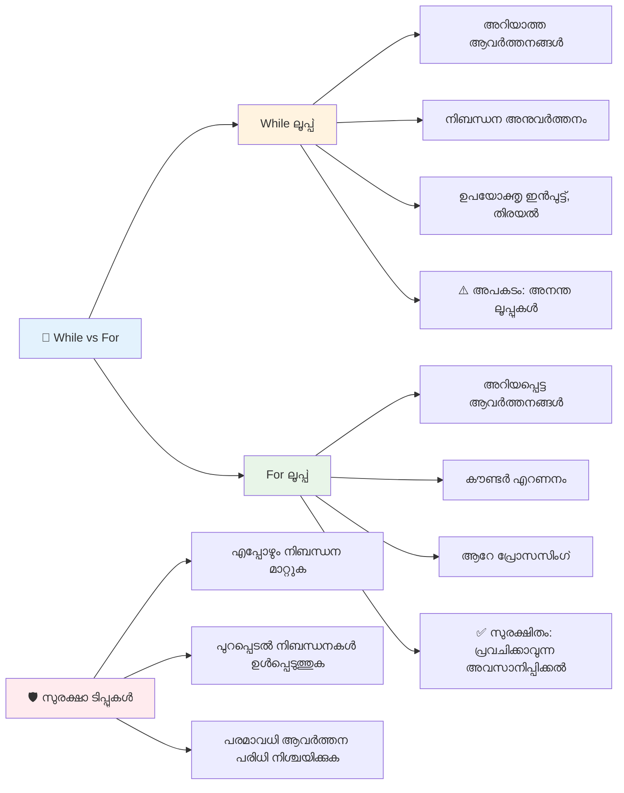
> **സുരക്ഷ മുന്‍നിര്‍ത്തി**: while ലൂപ്പുകൾ ശക്തിയുള്ളവയാണ്, എന്നാൽ നിബന്ധന മാനേജ്മെന്റ് ശ്രദ്ധാപൂർവ്വം വേണം. നിങ്ങളുടെ ലൂപ് നിബന്ധനം ഒടുവിൽ തള്ളി വരുന്നതായി ഉറപ്പാക്കുക!

### ആധുനിക ലൂപ്പ് മാറ്റുകൾ

ജാവാസ്ക്രിപ്റ്റിൽ പുതിയ ലൂപ്പ് വാക്യരചനകൾ ലഭ്യമാണ്, ഇത് നിങ്ങളുടെ കോഡ് കൂടുതൽ വായിക്കാൻ എളുപ്പവും പിശകുകൾ കുറവുമായിരിക്കും.

**For...of ലൂപ്പ് (ES6+):**

```javascript
const colors = ["red", "green", "blue", "yellow"];

// ആധുനിക സമീപനം - വൃത്തിയുള്ളതും സുരക്ഷിതവുമായ
for (const color of colors) {
  console.log(`Color: ${color}`);
}

// പരമ്പരാഗത ഫോർ ലൂപ്പുമായി താരതമ്യം ചെയ്യുക
for (let i = 0; i < colors.length; i++) {
  console.log(`Color: ${colors[i]}`);
}
```

**for...of ന്റെ പ്രധാന ഗുണങ്ങൾ:**
- ഇൻഡക്സ് മാനേജ്മെന്റ് ഒഴിവാക്കുന്നു, ഒഫ്-ബൈ-വൺ പിശകുകൾ ഒഴിവാക്കുന്നു
- നിരയുടെ ഘടകങ്ങൾക്ക് നേരിട്ടുള്ള ആക്‌സസ് നൽകുന്നു
- കോഡ് വായനവേഗം മെച്ചപ്പെടുത്തുന്നു, സിന്റാക്‌സ് സങ്കീർണ്ണത കുറയ്ക്കുന്നു

**forEach രീതി:**

```javascript
const prices = [9.99, 15.50, 22.75, 8.25];

// ഫംഗ്ഷണൽ പ്രോഗ്രാമിംഗ് സ്റ്റൈലിന് forEach ഉപയോഗിക്കുന്നു
prices.forEach((price, index) => {
  console.log(`Item ${index + 1}: $${price.toFixed(2)}`);
});

// ലളിതമായ പ്രവർത്തനങ്ങൾക്ക് forEach അമ്പൽ ഫംഗ്ഷനുകളോടുകൂടെ
prices.forEach(price => console.log(`Price: $${price}`));
```

**forEach-നെപ്പറ്റി അറിയേണ്ടത്:**
- ഓരോ നിര ഘടകത്തിനും ഒരു ഫംഗ്ഷൻ സംപ്രേഷണം ചെയ്യുന്നു
- ഘടക മൂല്യവും ഇൻഡക്സും പാരാമീറ്ററുകളായി നൽകുന്നു
- ഡിഫോൾട് ലൂപ്പുപോലെ മുൻകാലത്ത് നിർത്താൻ കഴിയില്ല
- തിരിച്ചുകൊടുക്കുന്നത് undefined ആണ് (പുതിയ നിര സൃഷ്ടിക്കാറില്ല)

✅ നിങ്ങൾ എന്തുകൊണ്ട് ഫോർ ലൂപ്പ് ഇഷ്ടപ്പെടുക അതോ while ലൂപ്പ്? StackOverflow വിൽ 17K കാണികൾക്ക് ഇതേ പ്രഷ്‌നം ഉണ്ടായിട്ടുണ്ട്, ചില അഭിപ്രായങ്ങളും [നിങ്ങൾക്ക് വിഷയത്തിൽതാൽപ്പര്യമുണ്ടാവാം](https://stackoverflow.com/questions/39969145/while-loops-vs-for-loops-in-javascript).

### 🎨 **ആധുനിക ലൂപ്പ് വാക്യരചന പരിശോധന: ES6+ സ്വീകരിക്കൽ**

**നിങ്ങളുടെ ആധുനിക ജാവാസ്ക്രിപ്റ്റ് ധാരണ വിലയിരുത്തുക:**
- പരമ്പരാഗത ഫോർ ലൂപ്പുകളോട് താരതമ്യേന `for...of` ന്റെ ഗുണങ്ങൾ എന്തെല്ലാം?
- പരമ്പരാഗത ഫോർ ലൂപ്പ് നിങ്ങൾക്ക് ഇനിയും തെരഞ്ഞെടുക്കേണ്ടതായി വരാനിടയുണ്ടോ?
- `forEach`നും `map`നും ഉള്ള വ്യത്യാസം എന്താണ്?

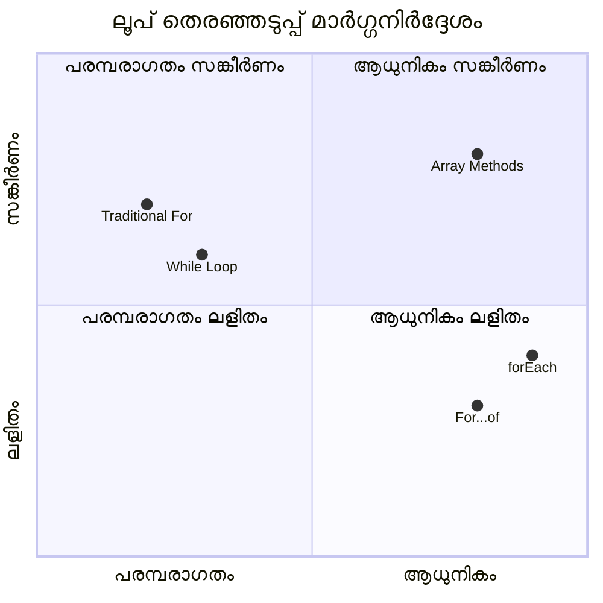
> **ആധുനിക ട്രെൻഡ്**: ES6+ ആണ്, `for...of`യും `forEach`ഉം ആയുള്ള കോഡ് എഴുതൽ മികച്ച രീതിയിലാണ് ശുപാർശ ചെയ്യപ്പെടുന്നത്, കാരണം ഇത് വൃത്തിയുള്ളതും പിശകുകൾ കുറവുമാണ്!

## ലൂപ്പുകളും നിരകളും

നിരകളും ലൂപ്പുകളും ചേർന്ന് ശക്തമായ ഡാറ്റ 프로സ്സിങ്ങ് കഴിവുകൾ നൽകുന്നു. ലിസ്റ്റുകൾ പ്രദർശിപ്പിക്കുന്നതിൽ നിന്നും ഗണിതത്തിലെ വിദഗ്ധ പ്രവർത്തനങ്ങൾ വരെയുള്ള പല പ്രോഗ്രാമിംഗ് ജോലി പൂർത്തിയാക്കാൻ ഇത് അടിസ്ഥാനമാണ്.

**പരമ്പരാഗത നിര പ്രോസസ്സിംഗ്:**

```javascript
const iceCreamFlavors = ["Chocolate", "Strawberry", "Vanilla", "Pistachio", "Rocky Road"];

// ക്ലാസിക് ഫോർ ലൂപ്പ് സമീപനം
for (let i = 0; i < iceCreamFlavors.length; i++) {
  console.log(`Flavor ${i + 1}: ${iceCreamFlavors[i]}`);
}

// ആധുനിക ഫോർ...ഓഫ് സമീപനം
for (const flavor of iceCreamFlavors) {
  console.log(`Available flavor: ${flavor}`);
}
```

**ഓരോ സമീപനം മനസ്സിലാക്കാം:**
- ലൂപ്പ് പരിധി നിർണയിക്കാൻ `length` പ്രോപ്പർട്ടി ഉപയോഗിക്കുന്നു
- പരമ്പരാഗത ഫോർ ലൂപ്പിൽ ഇൻഡക്സ് ഉപയോഗിച്ച് ഘടകങ്ങൾ ആക്‌സസ് ചെയ്യുന്നു
- for...of ലൂപ്പിൽ നേരിട്ടു ഘടകങ്ങൾ കൈകാര്യം ചെയ്യുന്നു
- ഓരോ ഘടകവും ഒരിക്കൽ മാത്രം പ്രോസസ്സ് ചെയ്യുന്നു

**പ്രായോഗിക ഡാറ്റ പ്രോസസ്സിംഗ് ഉദാഹരണം:**

```javascript
const studentGrades = [85, 92, 78, 96, 88, 73, 89];
let total = 0;
let highestGrade = studentGrades[0];
let lowestGrade = studentGrades[0];

// ഒറ്റ ലൂപ്പുമായി എല്ലാ ഗ്രേഡുകളും പ്രോസസ് ചെയ്യുക
for (let i = 0; i < studentGrades.length; i++) {
  const grade = studentGrades[i];
  total += grade;
  
  if (grade > highestGrade) {
    highestGrade = grade;
  }
  
  if (grade < lowestGrade) {
    lowestGrade = grade;
  }
}

const average = total / studentGrades.length;
console.log(`Average: ${average.toFixed(1)}`);
console.log(`Highest: ${highestGrade}`);
console.log(`Lowest: ${lowestGrade}`);
```

**ഈ കോഡ് എങ്ങനെ പ്രവർത്തിക്കുന്നു:**
- കൂട്ടിച്ചേർക്കുന്നതിനുയേർവും കുറഞ്ഞതും ട്രാക്കിങ്ങ് വേരിയബിളുകളായി ആർഭാടിക്കുന്നു
- എല്ലായ് ഗ്രേഡ് ഒറ്റ ലൂപ്പിൽ കാര്യക്ഷമമായി പ്രോസസ്സ് ചെയ്യുന്നു
- ശരാശരി കണക്കാക്കാൻ മൊത്തം കൂട്ടം ശേഖരിക്കുന്നു
- ലൂപ്പ് അന്ത്യത്തിൽ ശരാശരിയും മറ്റ് സ്റ്റാറ്റിസ്റ്റിക്സും കണക്കാക്കുന്നു

✅ നിങ്ങളുടെ സ്വന്തം നിർമിത നിര ബ്രൗസറിന്റെ കോൺസോളിൽ ഉപയോഗിച്ച് പരീക്ഷിക്കുക.

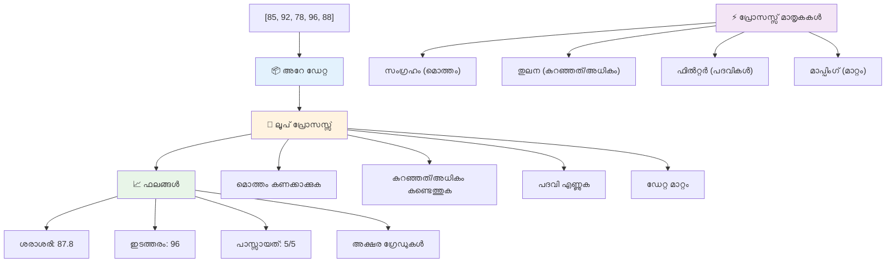
---

## GitHub Copilot ഏജന്റ് ചലഞ്ച് 🚀

ഈ ചലഞ്ച് പൂർത്തിയാക്കാൻ ഏജന്റ് മോഡ് ഉപയോഗിക്കുക:

**വിവരണം:** നിരകളും ലൂപ്പുകളും കൂട്ടിച്ച് ഡാറ്റ വിശകലനം ചെയ്ത് പ്രയോജനപ്രദമായ അറിവുകൾ നൽകുന്ന ഒരു സമഗ്ര ഡാറ്റ പ്രോസസിംഗ് ഫംഗ്ഷൻ നിർമ്മിക്കുക.

**പ്രോംപ്റ്റ്:** `analyzeGrades` എന്ന ഫംഗ്ഷൻ സൃഷ്ടിക്കുക, ഇത് വിദ്യാർത്ഥികളുടെ നാമവും സ്കോറും ഉള്ള grade ഒബ്ജക്റ്റുകളുടെ നിര സ്വീകരിച്ച്, ഉയർന്ന സ്കോർ, ഏറ്റവും കുറഞ്ഞ സ്കോർ, ശരാശരി സ്കോർ, പാസ്സായവരുടെ എണ്ണം (സ്കോർ >= 70), ശരാശരിയിലധികമുള്ള സ്കോർ നേടുന്ന വിദ്യാർത്ഥികളുടെ പേര് എന്നിവ അടങ്ങിയ ഒരു ഒബ്ജക്റ്റ് തിരികെ നൽകും. നിങ്ങളുടെ പരിഹാരത്തിൽ കുറഞ്ഞത് രണ്ട് വ്യത്യസ്ത ലൂപ്പ് തരം ഉപയോഗിക്കുക.

[agent mode](https://code.visualstudio.com/blogs/2025/02/24/introducing-copilot-agent-mode) ന്റെ കുറിച്ച് കൂടുതൽ പഠിക്കാം.

## 🚀 ചലഞ്ച്
JavaScript ആധികാരിക ജോലികൾക്ക് പരമ്പരാഗത ലൂപ്പുകളെ പകരം വെയ്ക്കാൻ കഴിയുന്ന നിരവധി ആധുനിക അരേ മെത്തഡുകൾ നൽകുന്നു. [forEach](https://developer.mozilla.org/docs/Web/JavaScript/Reference/Global_Objects/Array/forEach), [for-of](https://developer.mozilla.org/docs/Web/JavaScript/Reference/Statements/for...of), [map](https://developer.mozilla.org/docs/Web/JavaScript/Reference/Global_Objects/Array/map), [filter](https://developer.mozilla.org/docs/Web/JavaScript/Reference/Global_Objects/Array/filter), എന്നിവയും [reduce](https://developer.mozilla.org/docs/Web/JavaScript/Reference/Global_Objects/Array/reduce)യും അന്വേഷിക്കുക. 

**നിങ്ങളുടെ വെല്ലുവിളി:** കുറഞ്ഞത് മൂന്ന് വ്യത്യസ്ത അരേ മെത്തഡുകൾ ഉപയോഗിച്ച് വിദ്യാർത്ഥികളുടെ ഗ്രേഡ് ഉദാഹരണം പുനരാലോചിക്കുക. ആധുനിക ജാവാസ്ക്രിപ്റ്റ് സിന്റ്റാക്സുകൾ ഉപയോഗിക്കുമ്പോൾ കോഡ് എത്രത്തോളം ശുദ്ധവും വായിക്കാൻ എളുപ്പവുമാണ് ആകുന്നത് ശ്രദ്ധിക്കുക.

## പോസ്റ്റ്-ലക്ചർ ക്വിസ്
[Post-lecture quiz](https://ff-quizzes.netlify.app/web/quiz/14)


## അവലോകനം & സ്വയംപഠനം

ജാവാസ്ക്രിപ്റ്റിലുള്ള അരേസുകളിൽ നിരവധി മെത്തഡുകൾ ഉൾപ്പെടുത്തിയിട്ടുണ്ട്, ഇവ ഡാറ്റ മാനിപ്പുലേഷനിലേക്ക് അതിയായ ഉപയോഗപ്രദമാണ്. [ഈ മെത്തഡുകൾ വായിക്കുക](https://developer.mozilla.org/docs/Web/JavaScript/Reference/Global_Objects/Array) കൂടാതെ ഏതാനും പരീക്ഷിക്കുക (ഉദാഹരണത്തിന് push, pop, slice, splice) നിങ്ങൾ സൃഷ്ടിച്ച ഒരു അറേയിലൂടെ.

## അസൈൻമെന്റ്

[Loop an Array](assignment.md)

---

## 📊 **നിങ്ങളുടെ അറേ & ലൂപ്പ് ടൂൾകിറ്റ് സംക്ഷേപം**

```mermaid
graph TD
    A["🎯 അരേകളും ലൂപ്പുകളും വിദഗ്ധത"] --> B["📦 അറേ ബേസിക്സ്"]
    A --> C["🔄 ലൂപ്പ് തരം"]
    A --> D["🔗 ഡാറ്റ പ്രോസസിംഗ്"]
    A --> E["🎨 ആധുനിക സാങ്കേതിക വിദ്യ"]
    
    B --> B1["സൃഷ്ടി: [ ]"]
    B --> B2["ഇൻഡക്സിംഗ്: arr[0]"]
    B --> B3["മETHODസ്: push, pop"]
    B --> B4["സ്വത്ത്: length"]
    
    C --> C1["ഫോർ: മുകളായ റിപീറ്റുകൾ"]
    C --> C2["വൈൽ: നിബന്ധന അടിസ്ഥാനത്തിൽ"]
    C --> C3["For...of: നേരിട്ടുള്ള പ്രവേശനം"]
    C --> C4["ഫോർഇച്ച്: ഫംഗ്ഷണൽ"]
    
    D --> D1["സാങ്കേതിക കണക്കുകൂട്ടൽ"]
    D --> D2["ഡാറ്റ ട്രാൻസ്ഫോർമേഷൻ"]
    D --> D3["ഫിൽട്ടറിംഗ് & സെർച്ചിംഗ്"]
    D --> D4["റിയൽ-ടൈം പ്രോസസിംഗ്"]
    
    E --> E1["ആറോ ഫങ്ഷനുകൾ"]
    E --> E2["മETHOD് ചെയിനിംഗ്"]
    E --> E3["ഡിസ്ട്രക്ഷറിംഗ്"]
    E --> E4["ടെംപ്ലേറ്റ് ലിറ്ററൽസ്"]
    
    F["💡 പ്രധാന ലാഭങ്ങൾ"] --> F1["ക്ഷമതയുള്ള ഡാറ്റ കൈകാര്യം"]
    F --> F2["കോഡ് ആവർത്തനം കുറവ്"]
    F --> F3["വ്യാഖ്യാനയോഗ്യമായ പരിഹാരങ്ങൾ"]
    F --> F4["സുതാര്യമായ സിന്റാക്സ്"]
    
    style A fill:#e3f2fd
    style B fill:#e8f5e8
    style C fill:#fff3e0
    style D fill:#f3e5f5
    style E fill:#e0f2f1
    style F fill:#fce4ec
```
---

## 🚀 നിങ്ങളുടെ അറേയും ലൂപുകളും മാസ്റ്ററി ടൈംസ്ലൈൻ

### ⚡ **അടുത്ത 5 മിനിറ്റിൽ നിങ്ങൾ ചെയ്യാൻ കഴിയുന്നതുകൾ**
- [ ] നിങ്ങൾ ഇഷ്ടപ്പെടുന്ന സിനിമകളുടെ അരേ സൃഷ്‌ടിച്ച് പ്രത്യേക ഘടകങ്ങൾ ആക്സസ് ചെയ്യുക
- [ ] 1 മുതൽ 10 വരെ എണ്ണിപ്പിക്കുന്ന ഒരു for ലൂപ്പ് എഴുതുക
- [ ] പാഠത്തിൽ നിന്നുള്ള ആധുനിക അറേ മെത്തഡുകൾ വെല്ലുവിളി പരീക്ഷിക്കുക
- [ ] ബ്രൗസർ കൺസോളിൽ അറേ ഇൻഡെക്സിംഗ് അഭ്യാസം ചെയ്യുക

### 🎯 **ഈ മണിക്കൂറിൽ നിങ്ങൾ നേടുവാനുള്ളത്**
- [ ] പോസ്റ്റ്-ലെഷൻ ക്വിസ് പൂർത്തിയാക്കി ഏതെങ്കിലും പ്രയാസമുള്ള ആശയങ്ങൾ അവലോകനം ചെയ്യുക
- [ ] GitHub Copilot വെല്ലുവിളിയിൽ നിന്നുള്ള സമഗ്ര ഗ്രേഡ് വിശകലകൻ നിർമ്മിക്കുക
- [ ] വില്പന കാർട്ട് സാദാരണമായി സൃഷ്ടിച്ച് ഇനങ്ങൾ ചേർക്കുകയും നീക്കുകയും ചെയ്യുക
- [ ] വ്യത്യസ്ത ലൂപ്പ് തരം പരസ്പരം മാറ്റിത്തുടങ്ങുക
- [ ] `push`, `pop`, `slice`, `splice` പോലുള്ള അറേ മെത്തഡുകൾ പരീക്ഷിക്കുക

### 📅 **നിങ്ങളുടെ ആഴ്ചകാല ഡാറ്റ പ്രോസസ്സിങ് യാത്ര**
- [ ] "Loop an Array" അസൈൻമെന്റ് സൃഷ്ടിപരമായി മെച്ചപ്പെടുത്തുക
- [ ] അറേയും ലൂപ്പുകളും ഉപയോഗിച്ച് ടുഡു ലിസ്റ്റ് ആപ്ലിക്കേഷൻ നിർമ്മിക്കുക
- [ ] സംഖ്യാത്മക ഡാറ്റയ്ക്ക് ലളിതമായ സ്റ്റാറ്റിസ്റ്റിക്സ് കാൽക്കുലേറ്റർ നിർമ്മിക്കുക
- [ ] [MDN അറേ മെത്തഡുകൾ](https://developer.mozilla.org/docs/Web/JavaScript/Reference/Global_Objects/Array) അഭ്യാസം ചെയ്യുക
- [ ] ഫോട്ടോ ഗ്യാലറി അല്ലെങ്കിൽ മ്യൂസിക് പ്ലേലിസ്റ്റ് ഇന്റർഫേസ് സൃഷ്ടിക്കുക
- [ ] `map`, `filter`, `reduce` എന്നിവ ഉപയോഗിച്ച് ഫംഗ്ഷണൽ പ്രോഗ്രാമിംഗ് വിശദമായി മനസിലാക്കുക

### 🌟 **നിങ്ങളുടെ മാസഘട്ടം പരിവർത്തനം**
- [ ] അസംഖ്യ അറേ പ്രവർത്തനങ്ങളും പ്രകടന മെച്ചപ്പെടുത്തലുകളും പരിചയപ്പെടുക
- [ ] പരിപൂർണ ഡാറ്റ ദൃശ്യമാനം ഡാഷ്ബോർഡ് നിർമ്മിക്കുക
- [ ] ഡാറ്റ പ്രോസസ്സിങ് ഉൾപ്പെട്ട ഓപ്പൺ സോഴ്‌സ് പ്രോജക്റ്റുകളിൽ സംഭാവന നൽകുക
- [ ] പ്രായോഗിക ഉദാഹരണങ്ങളോടെ മറ്റൊരാളെ അറേയും ലൂപ്പുകളും പഠിപ്പിക്കുക
- [ ] പുനരുപയോഗയോഗ്യമാകുന്ന ഡാറ്റ പ്രോസസ്സിംഗ് ഫങ്ഷനുകളുടെ വ്യക്തിഗത ലൈബ്രറി സൃഷ്ടിക്കുക
- [ ] അറേയുടെ അടിസ്ഥാനത്തിൽ ഡാറ്റാ ഘടനകളും ആലഗോരിതങ്ങളും പഠിക്കുക

### 🏆 **അവസാന ഡാറ്റ പ്രോസസ്സിങ് ചാമ്പ്യൻ ചെക്കിൻ**

**നിങ്ങളുടെ അറേയും ലൂപ്പുകളും മാസ്റ്ററിയെ ആഘോഷിക്കുക:**
- യാഥാർത്ഥ ലോക ഉപയോക്തൃപ്രയോഗങ്ങൾക്ക് ഏറ്റവും പ്രയോജനപ്പെട്ട അറേ പ്രവർത്തനം ഏതാണ്?
- ഏത് ലൂപ്പ് തരം നിങ്ങൾക്ക് ഏറ്റവും സ്വാഭാവികമായാണ് തോന്നുന്നത്, കാരണം എന്താണ്?
- അറേയും ലൂപ്പുകളും മനസിലാകുന്നതിലൂടെ നിങ്ങളുടെ ഡാറ്റ ക്രമീകരണ സമീപനം എങ്ങനെ മാറി?
- അടുത്തതായി കൈകാര്യം ചെയ്യാൻ ആഗ്രഹിക്കുന്ന സങ്കീർണ്ണ ഡാറ്റ പ്രോസസ്സിങ് പ്രവൃത്തി ഏതാണ്?

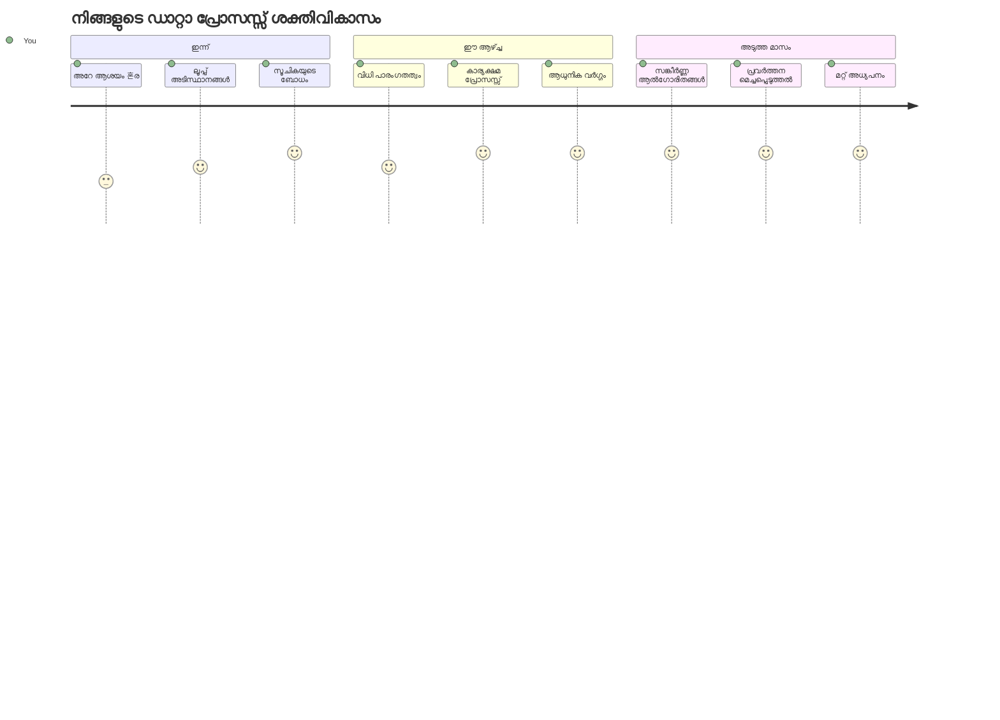
> 📦 **നിങ്ങൾ ഡാറ്റാ ക്രമീകരണവും പ്രോസസ്സിംഗും എളുപ്പമാക്കാനുള്ള കരുത്ത് ലഭിച്ചു!** അറേസുകളും ലൂപ്പുകളും നിങ്ങൾ സൃഷ്ടിക്കുന്ന ഏത് അപ്ലിക്കേഷനും അടിസ്ഥാനമാകുന്നു. ലളിതമായ ലിസ്റ്റുകളിൽ നിന്നു കൊമ്പിലകണക്കെടുപ്പുകളിൽ വരെ, നിങ്ങൾക്ക് ഡാറ്റ കൈകാര്യം ചെയ്യാനുള്ള വേണ്ട ഉപകരണങ്ങൾ ലഭിച്ചു. എല്ലാ ഡൈനാമിക് വെബ്സൈറ്റും മൊബൈൽ ആപ്പും ഡാറ്റാ-മൂട്ടമായ അപ്ലിക്കേഷനുകളും ഈ അടിസ്ഥാന ആശയങ്ങൾ ആശ്രയിക്കുന്നു. വിപുലമായ ഡാറ്റ പ്രോസസ്സിങിന്റെ ലോകത്തേക്ക് സ്വാഗതം! 🎉

---

<!-- CO-OP TRANSLATOR DISCLAIMER START -->
**വിവരണം**:  
ഈ രേഖ AI വിവർത്തന സേവനം [Co-op Translator](https://github.com/Azure/co-op-translator) ഉപയോഗിച്ച് വിവർത്തനം ചെയ്‌തതാണ്. നാം ശുദ്ധതയ്ക്കായി ശ്രമിക്കുന്നിട്ടും, യാന്ത്രിക വിവർത്തനങ്ങളിൽ പിശകുകളും തെറ്റുകളും ഉണ്ടാകാവുന്നതാണ്. അതിനാൽ, അടിസ്ഥാന ഭാഷയിലുള്ള പ്രമാണം സത്യസന്ധമായ ഉറവിടമായി കണക്കാക്കണം. പ്രധാനപ്പെട്ട വിവരങ്ങൾക്കായി പ്രൊഫഷണൽ മനുഷ്യ വിവർത്തനം ഉപയോഗിക്കേണ്ടതാണ്. ഈ വിവർത്തനം ഉപയോഗിക്കുന്നതിനാൽ ഉണ്ടാകുന്ന യാതൊരു തെറ്റിദ്ധാരണകൾക്കും ഞങ്ങൾ ഉത്തരവാദികളല്ല.
<!-- CO-OP TRANSLATOR DISCLAIMER END -->