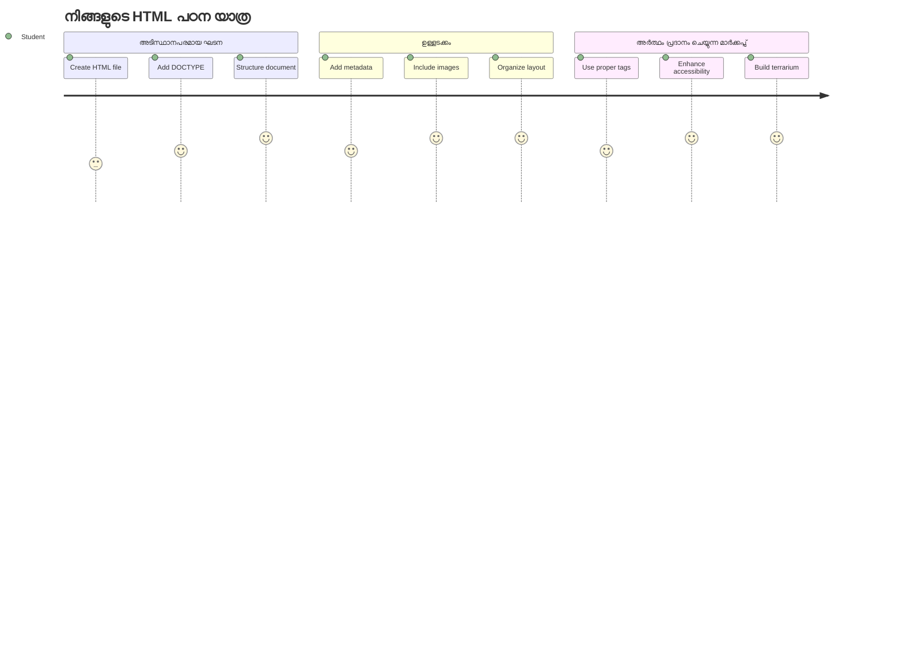
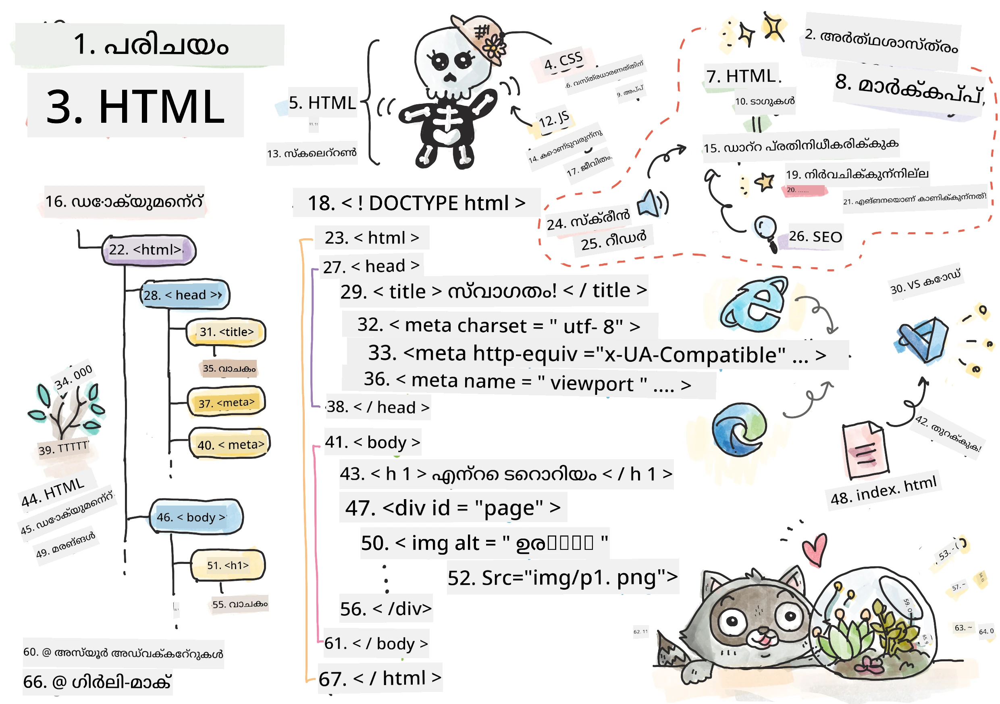
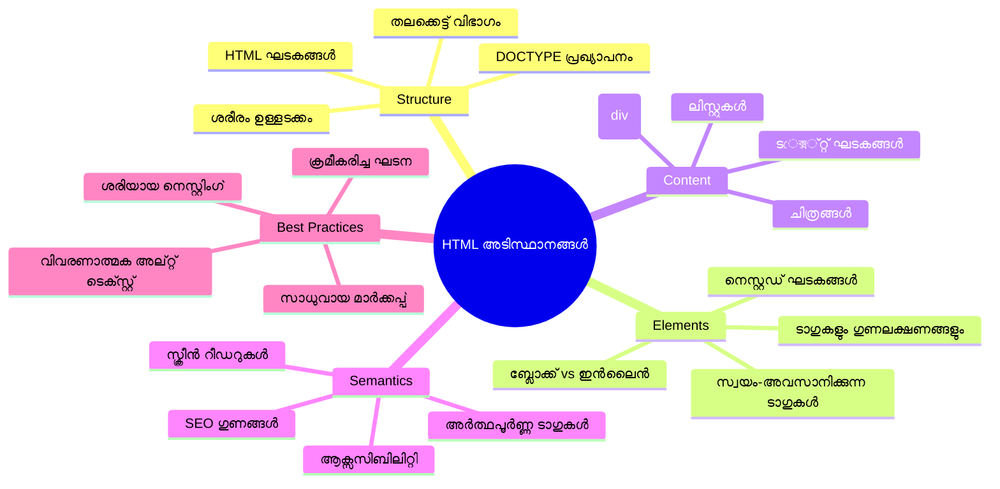
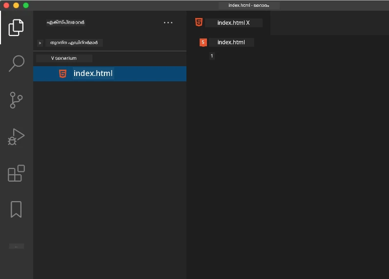
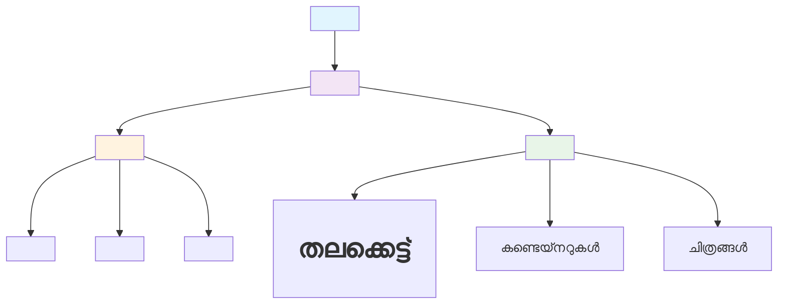
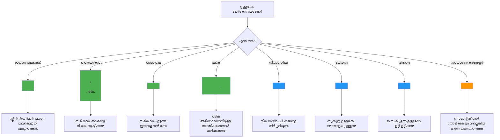
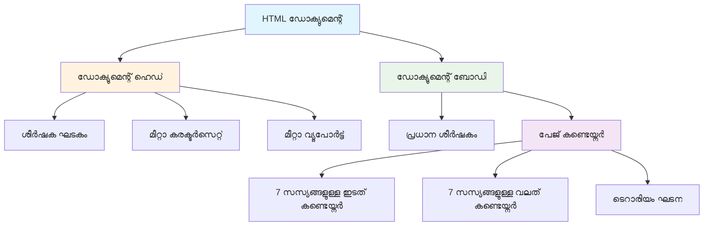
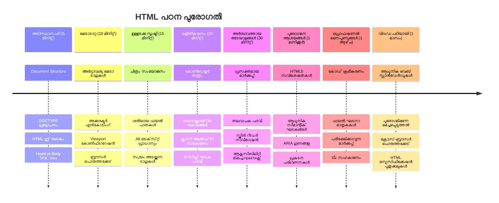

<!--
CO_OP_TRANSLATOR_METADATA:
{
  "original_hash": "3fcfa99c4897e051b558b5eaf1e8cc74",
  "translation_date": "2026-01-08T18:33:28+00:00",
  "source_file": "3-terrarium/1-intro-to-html/README.md",
  "language_code": "ml"
}
-->
# Terrarium Project Part 1: HTML പരിചയം



> സ്കെച്ച്നോട്ട് [Tomomi Imura](https://twitter.com/girlie_mac) tarafından

HTML, അല്ലെങ്കിൽ HyperText Markup Language, നിങ്ങൾ എപ്പോഴും സന്ദർശിച്ചിട്ടുള്ള എല്ലാ വെബ്‌സൈറ്റുകളുടെ അടിസ്ഥാനമാണ്. HTML-നെ വെബ് പേജുകൾക്ക് ഘടന നൽകുന്ന അറസ്റ്റിൽ വെള്ളം പോലെ കരുതുക - ഇത് ചെയ്യുന്നുണ്ട് സമവായം എവിടെയാണ് പോകേണ്ടത്, അത് എങ്ങനെ ക്രമീകരിക്കപ്പെടുന്നു, ഓരോ ഭാഗവും എന്താണ് പ്രതിനിധീകരിക്കുന്നത്. CSS പിന്നീട് നിങ്ങളുടെ HTML നിറങ്ങൾ, ലേയൗട്ടുകൾ എന്നിവ കൊണ്ട് "അലങ്കരിക്കും" ഒപ്പം ജാവാസ്ക്രിപ്റ്റ് ഇത് ജീവിക്കാൻ ഇന്റർമൂഹമായ ഇടപെടൽ നൽകും, HTML അതെല്ലാം കഴിഞ്ഞ് മറ്റ് എല്ലാം ഗുണം നേടുന്ന അടിസ്ഥാന ഘടന നൽകുന്നു.

ഈ പാഠത്തിൽ, നിങ്ങൾ ഒരു വെർച്വൽ ടെറാറിയം ഇൻറർഫേസ് HTML ഘടന സൃഷ്‌ടിക്കും. ഈ പ്രായോഗിക പ്രോജക്ട് അടിസ്ഥാനം HTML ആശയങ്ങൾ പഠിക്കാനാകും, ഒരുപാട് ആകര്‍ഷകമായ ഒന്നും നിർമ്മിക്കുന്നു. നിങ്ങൾ സെമാന്റിക് ഘടകങ്ങൾ ഉപയോഗിച്ച് ഉള്ളടക്കം എങ്ങനെ ക്രമീകരിക്കാമെന്ന്, ചിത്രങ്ങൾ ഉപയോഗിച്ച് എങ്ങനെ പ്രവർത്തിക്കാമെന്ന് പഠിക്കും, ഒരു ഇന്റർമൂഹമായ വെബ് അപ്ലിക്കേഷൻ സൃഷ്ടിക്കാനുള്ള അടിസ്ഥാനമാണ് സൃഷ്ടിക്കുന്നു.

ഈ പാഠം അവസാനിക്കുന്നത്, നിങ്ങൾ സജ്ജീകരിച്ച HTML പേജ് ഉപയോഗിച്ച് സജ്ജമായ സ്തംഭങ്ങളിൽ ക്രമീകരിച്ച സസ്യ ചിത്രങ്ങൾ പ്രദർശിപ്പിക്കും, അടുത്തപാഠത്തിൽ സ്റ്റൈലിംഗിനും തയ്യാറാകും. ആദ്യം ഇത് അടിസ്ഥാനമാക്കി കാണിച്ചാലും പേടിക്കേണ്ടതില്ല – CSS ദൃശ്യ അലങ്കാരങ്ങൾ നൽകുന്നതിനു മുൻപ് HTML ചെയ്യേണ്ടത് അതാണ്.


## പ്രിലക്ചർ ക്വിസ്

[Pre-lecture quiz](https://ff-quizzes.netlify.app/web/quiz/15)

> 📺 **കാണുക കൂടാതെ പഠിക്കൂ**: സഹായകമായ ഒരു വീഡിയോ അവലോകനം പരിശോധിക്കുക
> 
> [](https://www.youtube.com/watch?v=1TvxJKBzhyQ)

## നിങ്ങളുടെ പ്രോജക്ട് സജ്ജമാക്കൽ

HTML കോഡിലേക്ക് പ്രവേശിക്കുന്നതിന് മുമ്പ്, നിങ്ങളുടെ ടെറാറിയം പ്രോജക്ടിനായി ഒരു ശരിയായ വർക്ക്‌സ്‌പേസ് സജ്ജമാക്കാം. ആരംഭത്തിൽ മുതൽ ക്രമീകരിച്ച ഫയൽ ഘടന സൃഷ്ടിക്കൽ ഒരു പ്രധാന ശീലമാണ്, ഇത് നിങ്ങളുടെ വെബ് വികസന യാത്രയിൽ നല്ല സേവനം നൽകും.

### ടാസ്ക്: നിങ്ങളുടെ പ്രോജക്ട് ഘടന സൃഷ്ടിക്കുക

നിങ്ങൾക്ക് ടെറാറിയം പ്രോജക്ടിനായി സമർപ്പിത ഫോൾഡർ സൃഷ്ടിച്ച് നിങ്ങളുടെ ആദ്യ HTML ഫയൽ ചേർക്കാം. ഇത്രയും ഉപയോഗിക്കാൻ കഴിയുന്ന രണ്ടു ആപ്രോച്ചുകൾ:

**ഓപ്ഷൻ 1: Visual Studio Code ഉപയോഗിച്ച്**
1. Visual Studio Code തുറക്കുക
2. "ഫയൽ" → "ഫോൾഡർ തുറക്കുക" അല്ലെങ്കിൽ `Ctrl+K, Ctrl+O` (Windows/Linux) അല്ലെങ്കിൽ `Cmd+K, Cmd+O` (Mac) ഉപയോഗിക്കുക
3. `terrarium` എന്ന പുതിയ ഫോൾഡർ സൃഷ്ടിച്ച് അത് തിരഞ്ഞെടുക്കുക
4. Explorer പാനലിൽ "ന്യൂ ഫയൽ" ഐക്കൺ ക്ലിക്കുചെയ്യുക
5. നിങ്ങളുടെ ഫയലിന് `index.html` എന്ന പേര് നൽകുക



**ഓപ്ഷൻ 2: ടെർമിനൽ കമാൻഡുകൾ ഉപയോഗിച്ച്**
```bash
mkdir terrarium
cd terrarium
touch index.html
code index.html
```

**ഈ കമാൻഡുകൾ എന്ത് ചെയ്യുന്നു:**
- **പുതിയ ഡയറക്ടറി** `terrarium` എന്ന പേരിൽ നിങ്ങളുടെ പ്രോജക്ടിനായി സൃഷ്ടിക്കുന്നു
- **`terrarium` ഡയറക്ടറിയിലേക്ക്** നീങ്ങുന്നു
- **ശൂന്യമായ** `index.html` ഫയൽ സൃഷ്ടിക്കുന്നു
- **ഫയൽ** എഡിറ്റിങ്ങിന് Visual Studio Code-ൽ തുറക്കുന്നു

> 💡 **പ്രോ ടിപ്പ്**: വെബ് ഡെവലപ്പ്മെന്റിൽ `index.html` ഫയൽനാമം പ്രത്യേകമാണ്. ആരെങ്കിലും ഒരു വെബ്‌സൈറ്റ് സന്ദർശിക്കുമ്പോൾ, ബ്രൗസറുകൾ സ്വയം `index.html` ഫയൽ പേജ് ഡിസ്‌പ്ലേ ചെയ്യാൻ നോക്കുന്നു. അതുകൊണ്ടുതന്നെ `https://mysite.com/projects/` പോലുള്ള URL-ൽ `index.html` ഫയൽ നേരിട്ട് കാണിക്കേണ്ടതില്ല.

## HTML ഡോക്യുമെന്റ് ഘടന മനസിലാക്കൽ

പ്രതിയൊരു HTML ഡോക്യുമെന്റും ബ്രൗസറുകൾ മനസിലാക്കി ശരിയായി പ്രദർശിപ്പിക്കുന്നതിന് പ്രത്യേകം ഘടന പാലിക്കുന്നു. ഈ ഘടിതന്നെയാണ് ഒരു ഔദ്യോഗിക കത്ത് പോലെയാണ് – അത് നിർദ്ദേശിച്ച വ്യവസ്ഥകളിൽ നിർബന്ധമായ ഘടകങ്ങൾ ഉള്ളതാണ്, ഇത് പ്രേക്ഷകനെ (ഇവിടെ ബ്രൗസർ) ഉള്ളടക്കം ശരിയായി പ്രോസസ്സ് ചെയ്യാൻ സഹായിക്കുന്നു.


ഓരോ HTML ഡോക്യുമെന്റിനും ആവശ്യമുള്ള അടിസ്ഥാന ഘടന ചേർക്കലോടെ തുടങ്ങാം.

### DOCTYPE പ്രഖ്യാപനവും റൂട്ട് എലിമെന്റും

ഏതൊരു HTML ഫയലിന്റെ ആദ്യ രണ്ട് വരികളും ബ്രൗസർക്ക് ഡോക്യുമെന്റിന്റെ "പരിചയപത്രം" ആയാണ് സേവനം ചെയ്യുന്നത്:

```html
<!DOCTYPE html>
<html></html>
```

**ഈ കോഡ് എന്ത് ചെയ്യുന്നു മനസിലാക്കുക:**
- `<!DOCTYPE html>` ഉപയോഗിച്ച് ഡോക്യുമെന്റ് ടൈപ്പ് HTML5 ആയി പ്രഖ്യാപിക്കുന്നു
- എല്ലാ പേജ് ഉള്ളടക്കം ഉൾക്കുന്ന റൂട്ട് `<html>` എലിമെന്റ്സ് സൃഷ്ടിക്കുന്നു
- പ്രായോഗിക ബ്രൗസർ റീണ്ടറിംഗിനായി ആധുനിക വെബ് സ്റ്റാൻഡേർഡുകൾ സ്ഥാപിക്കുന്നു
- വ്യത്യസ്ത ബ്രൗസറുകളിലും ഉപകരണങ്ങളിലുമുള്ള സ്ഥിരത ഉറപ്പാക്കുന്നു

> 💡 **VS Code ടിപ്പ്**: VS Codeൽ ഏതൊരു HTML ടാഗിന്റെയും മേൽ ഹോവർ ചെയ്യുക MDN വെബ് ഡോക്സ് നൽകുന്ന സഹായകരമായ വിവരങ്ങൾ കാണാൻ, ഉപയോഗഉദാഹരണങ്ങളും ബ്രൗസർ കംപാറ്റിബിലിറ്റി വിവരങ്ങളും ഉൾപ്പെടെ.

> 📚 **കൂടുതൽ പഠിക്കുക**: DOCTYPE പ്രഖ്യാപനം ബ്രൗസറുകളെ "quirks mode"-ൽ പ്രവേശിക്കുന്നത് തടയുന്നു, അത് പഴയ വെബ്സൈറ്റുകൾ പിന്തുണയ്ക്കാൻ ഉപയോഗിച്ചിരുന്നത്. ആധുനിക വെബ് ഡെവലപ്പ്മെന്റ് ലളിതമായ `<!DOCTYPE html>` പ്രഖ്യാപനം ഉപയോഗിക്കുന്നു [സ്റ്റാൻഡേർഡുകൾ-അനുസരിച്ചുള്ള റീണ്ടറിംഗിന്](https://developer.mozilla.org/docs/Web/HTML/Quirks_Mode_and_Standards_Mode).

### 🔄 **പാഠപരമായ ചുവയൽ**
**താൽക്കാലികം നിർത്തി ആലോചിക്കുക**: മുന്നോട്ട് പോകുന്നതിനു മുന്‍പ് ഉറപ്പാക്കുക:
- ✅ എന്തുകൊണ്ട് ഓരോ HTML ഡോക്യുമെന്റും DOCTYPE പ്രഖ്യാപനം ആവശ്യമാണ്
- ✅ `<html>` റൂട്ട് എലിമെന്റിൽ എന്തുണ്ട്
- ✅ ഈ ഘടന ബ്രൗസറുകൾക്ക് പേജുകൾ ശരിയായി പ്രദർശിപ്പിക്കാൻ എങ്ങനെ സഹായിക്കുന്നു

**വേഗം സ്വയം പരിശോധന**: നിങ്ങൾക്ക് നിങ്ങളുടെ സ്വന്തം വാക്കുകളിൽ "സ്റ്റാൻഡേർഡ് അനുസൃത റീണ്ടറിംഗ്" എന്നത് എന്തിനെയാണ് അർത്ഥമെന്ന് വിശദീകരിക്കാമോ?

## അത്യാവശ്യ ഡോക്യുമെന്റ് മെടാഡേറ്റ ചേർക്കൽ

HTML ഡോക്യുമെന്റിലെ `<head>` വിഭാഗം ബ്രൗസറുകൾക്കും സെർച്ച് എഞ്ചിനുകൾക്കും ആവശ്യമായ പ്രധാന വിവരങ്ങൾ ഉൾക്കൊള്ളുന്നു, പക്ഷേ സന്ദർശകർക്ക് പേജിൽ നേരിട്ട് കാണപ്പെടണമെന്നാണ് കാണാതിരിക്കുന്നത്. ഇത് നിങ്ങളുടെ വെബ് പേജ് ശരിയായി പ്രവർത്തിക്കാനും വിവിധ ഉപകരണങ്ങളിലും പ്ലാറ്റ്ഫോമുകളിലും ശരിയായി കാണാനും സഹായിക്കുന്ന "പിന്നിലെ" വിവരമായി കരുതാം.

ഈ മെടാഡേറ്റ ബ്രൗസറുകൾക്ക് പേജ് എങ്ങനെ പ്രദർശിപ്പിക്കണമെന്ന്, ഉപയോഗിക്കേണ്ട ചാരക്റ്റർ എൻകോഡിംഗ്, വിവിധ സ്ക്രീൻ വലിപ്പങ്ങൾ കൈകാര്യം ചെയ്യേണ്ടത് എന്നിവ പറയുന്നു – അതെല്ലാം പ്രൊഫഷണൽ, ആക്സസിബിൾ വെബ് പേജുകൾ സൃഷ്ടിക്കാൻ അവശ്യമാണ്.

### ടാസ്ക്: ഡോക്യുമെന്റ് ഹെഡ് ചേർക്കുക

താഴെ കാണിച്ച `<head>` സെക്ഷൻ നിങ്ങളുടെ തുറക്കുന്ന, അട Closing `</html>` ടാഗുകൾക്കിടയിൽ ചേർക്കുക:

```html
<head>
	<title>Welcome to my Virtual Terrarium</title>
	<meta charset="utf-8" />
	<meta http-equiv="X-UA-Compatible" content="IE=edge" />
	<meta name="viewport" content="width=device-width, initial-scale=1" />
</head>
```

**ഏറ്റവും അടിസ്ഥാന ഘടകങ്ങളുടെ വിശദീകരണം:**
- ബ്രൗസർ ടാബിലും സെർച്ച് ഫലങ്ങളിലും പ്രദർശിപ്പിക്കുന്ന പേജ് ടൈറ്റിൽ സജ്ജീകരിക്കുന്നു
- സവിശേഷമായി UTF-8 ചാരക്റ്റർ എൻകോഡിംഗ് ഉപയോഗിച്ച് ലോകമാകെയുള്ള ശരിയായ ടെക്സ്റ്റ് പ്രദർശനത്തിന്
- ആധുനിക Internet Explorer പതിപ്പുകളുമായി പൊരുത്തം ഉറപ്പാക്കുന്നു
- ഉപകരണത്തിന്റെ വീതി അനുസരിച്ച് viewport സജ്ജീകരിച്ച് പ്രതികരണശേഷിയുള്ള ഡിസൈൻ നടത്തി
- ആരംഭാപരമായ സൂം ലെവൽ നിയന്ത്രിച്ചു ഉള്ളടക്കം സ്വാഭാവിക വലുപ്പത്തിൽ പ്രദർശിപ്പിക്കുന്നു

> 🤔 **ഈതെ കുറിച്ച് ആലോചിക്കൂ**: കൂടാതെ ഇങ്ങനെ viewport മെടാ ടാഗ് സജ്ജമാക്കിയാൽ എന്ത് സംഭവിക്കും: `<meta name="viewport" content="width=600">`? ഇത് പേജ് എപ്പോഴും 600 പിക്‌സലുകൾ വീതി ആയിരിക്കണമെന്നു നിർബന്ധികരിക്കും, പ്രതികരണശേഷിയുള്ള ഡിസൈന് തകരാർ! [രീതിയുള്ള viewport ക്രമീകരണത്തെക്കുറിച്ച് കൂടുതൽ വായിക്കുക](https://developer.mozilla.org/docs/Web/HTML/Viewport_meta_tag).

## ഡോക്യുമെന്റ് ബോഡി നിർമ്മാണം

`<body>` എലിമെന്റ് നിങ്ങളുടെ വെബ്‌പേജിലെ ആകർഷകമായ എല്ലാ ഉള്ളടക്കവും ഉൾക്കൊള്ളുന്നു - ഉപയോക്താക്കൾ കാണുകയും ഇടപെടുകയും ചെയ്യുന്ന എല്ലാം. `<head>` വിഭാഗം ബ്രൗസർക്ക് നിർദ്ദേശങ്ങൾ നൽകി, `<body>` വിഭാഗം ആകർഷകമായ ഉള്ളടക്കമാണ്: ടെക്സ്റ്റ്, ചിത്രങ്ങൾ, ബട്ടണുകൾ, മറ്റ് UI ഘടകങ്ങൾ എന്നിവ.

നാം ബോഡി ഘടനം ചേർക്കാം, HTML ടാഗുകൾ എങ്ങനെ ചേർന്ന് അറിയപ്പെടുന്ന ഉള്ളടക്കം സൃഷ്ടിക്കുന്നു എന്ന് മനസിലാക്കാം.

### HTML ടാഗ് ഘടന മനസിലാക്കുക

HTML ഘടകങ്ങൾ നിർവ്വചിക്കാനായി ജോഡി ടാഗുകൾ ഉപയോഗിക്കുന്നു. അധികം ടാഗുകള്ക്ക് ആരംഭ ടാഗ് `<p>` പോലെയാണ്, തുടർന്ന് അട Closing ടാഗ് `</p>` ഉണ്ട്, ഇരു ടാഗുകളുടെ ഇടയിൽ ഉള്ളടക്കം: `<p>Hello, world!</p>`. ഇതൊരു പാരഗ്രാഫ് എലിമെന്റ് സൃഷ്ടിക്കുന്നു, അകത്ത് "Hello, world!" എന്ന ടെക്സ്റ്റ് ഉണ്ട്.

### ടാസ്ക്: ബോഡി എലിമെന്റ് ചേർക്കുക

നിങ്ങളുടെ HTML ഫയൽ പുതുക്കി `<body>` എലിമെന്റ് ഉൾപ്പെടുത്തുക:

```html
<!DOCTYPE html>
<html>
	<head>
		<title>Welcome to my Virtual Terrarium</title>
		<meta charset="utf-8" />
		<meta http-equiv="X-UA-Compatible" content="IE=edge" />
		<meta name="viewport" content="width=device-width, initial-scale=1" />
	</head>
	<body></body>
</html>
```

**ഈ പൂർണ്ണ ഘടന എന്താണ് നൽകുന്നത്:**
- അടിസ്ഥാന HTML5 ഡോക്യുമെന്റ് ഫ്രെയിംവർക്ക് സ്ഥാപിക്കുന്നു
- ശരിയായ ബ്രൗസർ റീണ്ടറിംഗിനായി അവശ്യ മെടാഡേറ്റ ഉൾക്കൊള്ളുന്നു
- ദൃശ്യമാകുന്ന ഉള്ളടക്കത്തിന് ശൂന്യമായ ബോഡി സജ്ജമാക്കുന്നു
- ആധുനിക വെബ് ഡെവലപ്പ്മെന്റ് മെച്ചപ്പെട്ട പ്രാക്ടീസുകൾ പിന്തുടരുന്നു

ഇപ്പോൾ നിങ്ങളുടെ ടെറാറിയത്തിനുള്ള ദൃശ്യമാകുന്ന ഘടകങ്ങൾ ചേർക്കാൻ തയ്യാറാണ്. ഉള്ളടക്കത്തിന്റെ വിവിധ വിഭാഗങ്ങൾ ക്രമീകരിക്കാൻ കൺടെയ്‌നർസായി `<div>` എലിമെന്റുകൾ ഉപയോഗിക്കും, സസ്യ ചിത്രങ്ങൾ പ്രദർശിപ്പിക്കാൻ `` എലിമെന്റുകൾ ഉപയോഗിക്കും.

### ചിത്രങ്ങളുമായി പ്രവർത്തിക്കൽ, ലേയൗട്ട് കൺടെയ്‌നറുകൾ

HTML-ൽ ചിത്രങ്ങൾ പ്രത്യേകമാണ്, കാരണം അവ "സ്വയം അട Closing" ടാഗുകളാണ് ഉപയോഗിക്കുന്നത്. `<p></p>` പോലുള്ള ഉള്ളടക്കം ചുറ്റിപ്പറ്റാൻ ടാഗുകളിൽ നിന്ന് വ്യത്യസ്തമായി, `` ടാഗ് മാത്രമാകുന്നതിനു വേണ്ട എല്ലാ വിവരങ്ങളും അതിന്റെ അറ്റ്രിബ്യൂട്ടുകളിലൂടെ (ഉദാ., `src` ചിത്ര ഫയൽ പാത്തിനും, `alt` ആക്സസിബിലിറ്റിക്കും) ഉള്ളടക്കത്തോടൊപ്പം തന്നെയാണ്.

HTML-ിൽ ചിത്രങ്ങൾ ചേർക്കുന്നതിന് മുമ്പ്, നിങ്ങൾ പ്രോജക്ട് ഫയലുകൾ ശരിയായി ക്രമീകരിക്കണം, അതായത് images ഫോൾഡർ സൃഷ്ടിച്ച് സസ്യ ഗ്രാഫിക്സ് ചേർക്കുക.

**ആദ്യമേ, നിങ്ങളുടെ ചിത്രങ്ങൾ സജ്ജമാക്കുക:**
1. നിങ്ങളുടെ ടെറാറിയം പ്രോജക്ട് ഫോൾഡറിൽ `images` എന്നൊരു ഫോൾഡർ സൃഷ്ടിക്കുക
2. [solution folder](../../../../3-terrarium/solution/images) ല്‍നിന്ന് സസ്യ ചിത്രങ്ങൾ ഡൗൺലോഡ് ചെയ്യുക (മൊത്തം 14 സസ്യ ചിത്രങ്ങൾ)
3. എല്ലാ സസ്യ ചിത്രങ്ങളും പുതിയ `images` ഫോൾഡറിൽ പകർത്തുക

### ടാസ്ക്: സസ്യ പ്രദർശന ലേയൗട്ട് സൃഷ്ടിക്കുക

ഇപ്പോൾ `<body></body>` ടാഗുകള്ക്കിടയിൽ ക്രമീകരിച്ച രണ്ടൊറ്റ സ്തംഭങ്ങളായി സസ്യ ചിത്രങ്ങൾ ചേർക്കുക:

```html
<div id="page">
	<div id="left-container" class="container">
		<div class="plant-holder">
			
		</div>
		<div class="plant-holder">
			
		</div>
		<div class="plant-holder">
			
		</div>
		<div class="plant-holder">
			
		</div>
		<div class="plant-holder">
			
		</div>
		<div class="plant-holder">
			
		</div>
		<div class="plant-holder">
			
		</div>
	</div>
	<div id="right-container" class="container">
		<div class="plant-holder">
			
		</div>
		<div class="plant-holder">
			
		</div>
		<div class="plant-holder">
			
		</div>
		<div class="plant-holder">
			
		</div>
		<div class="plant-holder">
			
		</div>
		<div class="plant-holder">
			
		</div>
		<div class="plant-holder">
			
		</div>
	</div>
</div>
```

**നടപടിയായി, ഈ കോഡിൽ എന്ത് സംഭവിക്കുന്നു:**
- എല്ലാ ഉള്ളടക്കവും ഉൾക്കൊള്ളാൻ `id="page"` ഉള്ള പ്രധാന പേജ് കൺടെയ്‌നർ സൃഷ്ടിക്കുന്നു
- രണ്ട് സ്തംഭ കൺടെയ്‌നറുകൾ സൃഷ്ടിക്കുന്നു: `left-container` കൂടും `right-container` കൂടും
- ഇടത് സ്തംഭത്തിൽ 7 സസ്യങ്ങളും വലത് സ്തംഭത്തിൽ 7 സസ്യങ്ങളും ക്രമീകരിക്കുന്നു
- ഓരോ സസ്യ ചിത്രവും `plant-holder` ഡിവിൽ ചുറ്റിപ്പറ്റയുന്നു, വ്യക്തിഗത സ്ഥാനീകരണത്തിനായി
- CSS സ്റ്റൈലിംഗിനായി സ്ഥിരതയുള്ള ക്ലാസ് നാമങ്ങൾ ഉപയോക്തൃപഠനത്തിലേക്ക്
- JavaScript ഇടപെടലിനായി ഓരോ സസ്യ ചിത്രത്തിനും പ്രത്യേക ഐഡികൾക്ക് നൽകുന്നു
- ചിത്രങ്ങളുടെ ഫയൽ പാത്തുകൾ ശരിയായി `images` ഫോൾഡറിലേക്ക് കാണിക്കുന്നു

> 🤔 **ഇത് പരിഗണിക്കുക**: ഇപ്പോൾ എല്ലാ ചിത്രങ്ങൾക്കും ഒരുപോലെയുള്ള alt ടെക്സ്റ്റ് "plant" മാത്രമാണ്. ആക്സസിബിലിറ്റിക്കായി ഇത് ശരിയല്ല. സ്ക്രീൻ റീഡർ ഉപയോക്താക്കൾക്ക് 14 സാരവും "plant" എന്നെഴുതിയ തരത്തിലുള്ള ഫലമാണ് ലഭിക്കുന്നത്, ഓരോ സസ്യത്തിന്റെ പ്രത്യേക വിവരണമില്ല. ഓരോ ചിത്രത്തിനും കൂടുതൽ വിവരണാത്മകമായ alt ടെക്സ്റ്റുകൾ നൽകാമോ?

> 📝 **HTML എലിമെന്റ് തരം**: `<div>` എലിമെന്റുകൾ "block-level" ആണ്, മുഴുവൻ വീതിയും എടുക്കുന്നു, `<span>` എലിമെന്റുകൾ "inline" ആണ്, ആവശ്യമായ വീതിയേ മാത്രം എടുക്കുന്നു. ഈ `<div>` ടാഗുകൾക്ക് എല്ലാം `<span>` ആയി മാറ്റിയാൽ എന്ത് സംഭവിക്കും എന്നു നിങ്ങൾക്ക് തോന്നുന്നുണ്ടോ?

### 🔄 **പാഠപരമായ ചുവയൽ**
**ഘടന മനസിലാക്കൽ**: നിങ്ങളുടെ HTML ഘടന ഒരു നിമിഷം പരിശോധിക്കുക:
- ✅ നിങ്ങളുടെ ലേയൗട്ടിലെ പ്രധാന കൺടെയ്‌നറുകൾ തിരിച്ചറിഞ്ഞു കഴിഞ്ഞോ?
- ✅ ഓരോ ചിത്രത്തിനും പ്രത്യേക ഐഡി നൽകാനുള്ള കാരണം മനസ്സിലാക്കിയോ?
- ✅ `plant-holder` ഡിവുകളുടെ ലക്ഷ്യം എന്താണെന്ന് വിവരിക്കാമോ?

**ദൃശ്യ പരിശോധന**: നിങ്ങളുടെ HTML ഫയൽ ബ്രൗസറിൽ തുറക്കുക. നിങ്ങൾക്കാണേണ്ടത്:
- അടിസ്ഥാന സസ്യ ചിത്രങ്ങളുടെ പട്ടിക
- രണ്ടു സ്തംഭങ്ങളായി ക്രമീകരിച്ച ചിത്രങ്ങൾ
- ലളിതമായ, സ്റ്റൈൽ ചെയ്യാത്ത ലേയൗട്ട്

**ഓർമ്മിക്കുക**: സ്റ്റൈലിൾ CSS ഏപ്രസ്റ്റു വരയ്ക്കുന്നതിന് മുമ്പ് HTML ഇങ്ങനെ ലളിതമായിരിക്കും!

ഈ മാർക്കപ്പ് ചേർത്തതിനാൽ സസ്യങ്ങൾ സ്ക്രീനിൽ പ്രത്യക്ഷപ്പെടും, എങ്കിലും അവ ഇനി വരെ അലങ്കരിക്കപ്പെടാത്തതാണ് – അതിന് CSS അടുത്ത പാഠത്തിൽ! ഇപ്പോൾ നിങ്ങൾക്കുണ്ട് ഒരു ശക്തമായ HTML മാത്ര, പ്രസക്തമായ ഓർഗനൈസേഷൻ കൂടാതെ ആക്സസിബിലിറ്റി മികച്ച രീതിയിൽ പിന്തുടരുന്നു.

## ആക്സസിബിലിറ്റിക്ക് സെമാന്റിക് HTML ഉപയോഗിക്കൽ

സെമാന്റിക് HTML എന്ന് അർത്ഥം ഉള്ളടക്കത്തിന്റെ അർത്ഥവും ഉദ്ദേശ്യവും അടിസ്ഥാനമാക്കി HTML ഘടകങ്ങൾ തിരഞ്ഞെടുക്കുക, വെറും ദൃശ്യം മാത്രം നോക്കിയുള്ളവയല്ല. നിങ്ങൾ സെമാന്റിക് മാർക്കപ്പ് ഉപയോഗിക്കുമ്പോൾ ബ്രൗസറുകൾ, സെർച്ച് എഞ്ചിനുകൾ, സ്ക്രീൻ റീഡറുകൾ പോലുള്ള സഹായക സാങ്കേതിക വിദ്യകൾ എന്നിവയ്ക്ക് നിങ്ങളുടെ ഉള്ളടക്ക ഘടനയും അർത്ഥവും ഭാഗവാക്കുന്നു.


ഈ സമീപനം നിങ്ങളുടെ വെബ്‌സൈറ്റുകൾ വീക്ഷണസാമർത്ഥ്യമില്ലാത്തവർക്കും സഹായകമാക്കുന്നു, സെർച്ച് എഞ്ചിനുകൾക്ക് നിങ്ങളുടെ ഉള്ളടക്കം കൂടുതൽ ഫലപ്രദമായി മനസിലാക്കാൻ സഹായിക്കുന്നു. ഇത് ആധുനിക വെബ് ഡെവലപ്പ്മെന്റിന്റെ അടിസ്ഥാന സിദ്ധാന്തമാണ്, എല്ലാവർക്കും മെച്ചപ്പെട്ട അനുഭവങ്ങൾ നൽകുന്നു.

### സെമാന്റിക് പേജ് തലക്കെട്ട് ചേർക്കുക

നിങ്ങളുടെ ടെറാറിയം പേജിന് ശരിയായ തലക്കെട്ട് ചേർക്കാം. നിങ്ങളുടെ തുറക്കുന്ന `<body>` ടാഗിന് ശേഷം ഈ വരി ചേർക്കുക:

```html
<h1>My Terrarium</h1>
```

**സെമാന്റിക് മാർക്കപ്പ് എന്തിനുവേണ്ടി:**
- സ്ക്രീൻ റീഡറുകൾക്ക് പേജ് ഘടന നാവിഗേറ്റ് ചെയ്യാനും മനസ്സിലാക്കാനും സഹായിക്കുന്നു
- ഉള്ളടക്ക അവയവമെന്ന വ്യൂഹം വ്യക്തമാക്കിയുകൊണ്ട് SEO (സേര്‍ച്ച് എഞ്ചിന് ഓപ്റ്റിമൈസേഷൻ) മെച്ചപ്പെടുത്തുന്നു
- ദൃഷ്ടിബാധിതരും ബുദ്ധിരുദ്ധിമുട്ടുള്ളവരും ഉൾപ്പെടെയുള്ള ഉപഭോക്താക്കൾക്ക് ആക്സസിബിലിറ്റി മെച്ചപ്പെടുത്തുന്നു
- എല്ലാ ഉപകരണങ്ങളിലും പ്ലാറ്റ്ഫോമുകളിലും മികച്ച ഉപയോക്തൃ അനുഭവങ്ങൾ സൃഷ്ടിക്കുന്നു
- പ്രൊഫഷണൽ വളർച്ചയ്ക്കായി വെബ് സ്റ്റാൻഡേർഡുകളും മികച്ച പ്രാക്റ്റീസുകളും പിന്തുടരുന്നു

**സെമാന്റിക്-അസെമാന്റിക് എളുപ്പം:**

| ഉദ്ദേശ്യം | ✅ സെമാന്റിക് തിരഞ്ഞെടുപ്പ് | ❌ അസെമാന്റിക് തിരഞ്ഞെടുപ്പ് |
|---------|-------------------|------------------------|
| മുഖ്യ തലക്കെട്ട് | `<h1>Title</h1>` | `<div class="big-text">Title</div>` |
| നാവിഗേഷൻ | `<nav><ul><li></li></ul></nav>` | `<div class="menu"><div></div></div>` |
| ബട്ടൺ | `<button>Click me</button>` | `<span onclick="...">Click me</span>` |
| ലേഖന ഉള്ളടക്കം | `<article><p></p></article>` | `<div class="content"><div></div></div>` |

> 🎥 **പ്രവർത്തനത്തിൽ കാണുക**: സെമാന്റിക് മാർക്കപ്പ് ആക്സസിബിലിറ്റിക്കുവേണ്ടിയാണെന്ന് മനസിലാക്കാൻ [സڪريൻ റീഡറുകൾ വെബ് പേജുകളിൽ എങ്ങനെ പ്രവർത്തിക്കുന്നു എന്നത്](https://www.youtube.com/watch?v=OUDV1gqs9GA) കാണുക. ശരിയായ HTML ഘടന ഉപയോക്താക്കളെ ഫലപ്രദമായി നാവിഗേറ്റ് ചെയ്യാൻ സഹായിക്കുന്നു.

## ടെറാറിയം കൺടെയ്‌നർ സൃഷ്ടിക്കൽ

ഇപ്പോൾ ടെറാറിയത്തിനായുള്ള HTML ഘടന ചേർക്കാം – സസ്യങ്ങൾ വെച്ചിടാനുള്ള ഗ്ലാസ് കൺടെയ്‌നർ. ഈ സെക്ഷൻ ഒരു പ്രധാന ആശയം ശൂചിപ്പിക്കുന്നു: HTML ഘടന നൽകുന്നു, പക്ഷേ CSS സ്റ്റൈൽ ഇല്ലാതെ ഈ ഘടകങ്ങൾ ഇപ്പോഴും ദൃശ്യമാകില്ല.

ടെറാറിയം മാർക്കപ്പ് ക്ലാസ് നാമങ്ങൾ ഉപയോഗിക്കുന്നു, അത് അടുത്ത പാഠത്തിൽ CSS സ്റ്റൈലിങ്ങ് ആശയവിനിമയവും പരിപാലനവും സുലഭമാക്കും.

### ടാസ്ക്: ടെറാറിയം ഘടന ചേർക്കുക

പേജ് കൺടെയ്‌നറിന്റെ അവസാന `</div>` ടാഗിന് മുകളില്‍ ഈ മാർക്കപ്പ് ചേർക്കുക:

```html
<div id="terrarium">
	<div class="jar-top"></div>
	<div class="jar-walls">
		<div class="jar-glossy-long"></div>
		<div class="jar-glossy-short"></div>
	</div>
	<div class="dirt"></div>
	<div class="jar-bottom"></div>
</div>
```

**ഈ ടെറാറിയം ഘടന എന്ത് ചെയ്യുന്നു:**
- സ്റ്റൈലിംഗിന് പ്രത്യേക ID ഉള്ള മുഖ്യ ടെറാറിയം കൺടെയ്‌നർ സൃഷ്ടിക്കുന്നു
- **നിർവ്വചിക്കുന്നു** ഓരോ ദൃശ്യ ഘടകത്തിനുമുള്ള വ്യത്യസ്ത ഘടകങ്ങൾ (മുൻവശം, മതിലുകൾ, മണ്ണ്, താഴ്‌വാരം)
- **ചേര്ക്കുന്നു** ഗ്ലാസ് പ്രതിഫലന ഇഫക്‌ടുകൾക്കുള്ള അടൂർഘടകങ്ങൾ (കണികയായ ഘടകങ്ങൾ)
- **ഉപയോഗിക്കുന്നു** ഓരോ ഘടകത്തിന്റെ ഉദ്ദേശ്യം വ്യക്തമായി സൂചിപ്പിക്കുന്ന വിവരണാത്മക ക്ലാസ് നാമങ്ങൾ
- **തയാറാക്കുന്നു** ഗ്ലാസ് ടെറിയേറിയം രൂപം സൃഷ്‌ടിക്കുന്ന CSS സ്റ്റൈലിംഗിനുള്ള ഘടന

> 🤔 **കുറിച്ച് ശ്രദ്ധിച്ചോ?**: നിങ്ങൾ ഈ മാർക്ക്അപ്പ് ചേർത്തിട്ടുണ്ടെങ്കിലും, പേജിൽ നിങ്ങൾക്ക് പുതിയതായി ഒന്നും കാണുന്നില്ല! ഇത് HTML ഘടന നൽകുമ്പോൾ CSS രൂപം നൽകുന്നതെങ്ങനെയാണ് കാണിക്കുന്നു എന്നതിന് ഒരു ഉദാഹരണമാണ്. ഈ `<div>` ഘടകങ്ങൾ നിലവിലുണ്ട്, എന്നാൽ ഇപ്പോഴും കാണാൻ സംബധിച്ച സ്റ്റൈലിംഗ് ഇല്ല – അത് അടുത്ത പാഠത്തിൽ വരും!


### 🔄 **അധ്യാപനപരമായ പരിശോധന**
**HTML ഘടനയുടെ പരിപൂര്‍ണ്ണത**: മുന്നോട്ട് പോകുന്നതിന് മുമ്പ്, നിങ്ങൾക്കിവിടെ കഴിവ് ഉണ്ടെന്ന് ഉറപ്പാക്കുക:
- ✅ HTML ഘടനയും ദൃശ്യ രൂപഭേദവും തമ്മിലുള്ള വ്യത്യാസം വിശദീകരിക്കാൻ
- ✅ സംവേദനാത്മക HTML ഘടകങ്ങളും അസംവേദനാത്മക ഘടകങ്ങളും തിരിച്ചറിയാൻ
- ✅ ശരിയായ മാർക്ക്അപ്പ് ആക്സസ്‌IBILITYക്ക് എങ്ങനെ സഹായിക്കുന്നുവെന്ന് വിവരിക്കാൻ
- ✅ സമ്പൂർണ ഡോക്യുമെന്റ് ട്രീ ഘടന തിരിച്ചറിയാൻ

**നിങ്ങളുടെ മനസിലാക്കലിനെ പരീക്ഷിക്കുക**: നിങ്ങളുടെ HTML ഫയൽ ജാവാസ്ക്രിപ്റ്റ് പ്രവർത്തനരഹിതവും CSS ഇല്ലാത്തതുമായ ബ്രൗസറിൽ തുറന്ന് നോക്കുക. ഇത് നിങ്ങൾ സൃഷ്ടിച്ച ശുദ്ധമായ സംവേദനാത്മക ഘടന കാണിക്കുന്നു!

---

## GitHub Copilot ഏജന്റ് ചലഞ്ച്

താഴെ കാണുന്ന ചലഞ്ച് പൂർത്തിയാക്കാൻ ഏജന്റ് മോഡിനെ ഉപയോഗിക്കുക:

**വിവരണം:** ടെറിയേറിയം പ്രോജക്ടിൽ ചേർക്കാവുന്ന ഒരു സസ്യപരിപാലന ഗൈഡ് വിഭാഗത്തിനുള്ള സംവേദനാത്മക HTML ഘടന സൃഷ്ടിക്കുക.

**പ്രംപ്റ്റ്:** "Plant Care Guide" എന്ന മുഖ്യ തലക്കെട്ട് ഉള്ള ഒരു സംവേദനാത്മക HTML വിഭാഗം സൃഷ്ടിക്കുക, അതിനുള്ളിൽ "Watering", "Light Requirements", "Soil Care" എന്ന തലക്കെട്ടുകളുമായി മൂന്ന് ഉപവിഭാഗങ്ങൾ, ഓരോന്നിലും സസ്യപരിപാലന വിവരങ്ങൾ ഉള്ള ഒരു പാരഗ്രാഫ് ഉൾപ്പെടുന്നു. ഉള്ളടക്കം ശരിയായ രീതിയിൽ ഘടിപ്പിക്കാൻ `<section>`, `<h2>`, `<h3>`, `<p>` പോലുള്ള സംവേദനാത്മക HTML ടാഗുകൾ ഉപയോഗിക്കുക.

ഇവിടെ കൂടുതൽ അറിയുക [agent mode](https://code.visualstudio.com/blogs/2025/02/24/introducing-copilot-agent-mode).

## HTML ചരിത്രം പഠന ചലഞ്ച്

**വെബ് വികസനത്തെ കുറിച്ച് പഠനം**

HTML 1990-ൽ ടി എം ബേൺേഴ്സ്-ലി CERN-ൽ ആദ്യ വെബ്ബ് ബ്രൗസർ സൃഷ്ടിച്ചുനിന്ന以来 വലിയ പുരോഗതിയാണ് സാദ്ധ്യം. ചില പഴയ ടാഗുകൾ, ഉദാ: `<marquee>`, ഇപ്പോൾ ഡിസകണ്ടിന്യൂ ചെയ്തിട്ടുണ്ട്, കാരണം അവ പുതിയ ആക്സസിബിലിറ്റി സ്റ്റാന്റേർഡുകളോടും റെസ്പോൺസീവ് ഡിസൈനൊപ്പം സങ്കരിക്കാനാകുന്നില്ല.

**ഈ പരീക്ഷണം ചെയ്യുക:**
1. താൽക്കാലികമായി നിങ്ങളുടെ `<h1>` തലക്കെട്ട് `<marquee>` ടാഗിൽ ചുറ്റിപ്പറ്റിക്കുക: `<marquee><h1>My Terrarium</h1></marquee>`
2. ബ്രൗസറിൽ പേജ് തുറന്ന് സ്രോൾ ചെയ്യുന്ന ഇഫക്റ്റ് ശ്രദ്ധിക്കുക
3. ഈ ടാഗ് ഡിസകണ്ടിന്യൂ ചെയ്തതിന്റെ കാരണം പരിഗണിക്കുക (സംकेतം: ഉപയോക്തൃ അനുഭവം, ആക്സസിബിലിറ്റി)
4. `<marquee>` ടാഗ് നീക്കം ചെയ്തു സംവേദനാത്മക മാർക്ക്അപ്പിലേക്ക് മടങ്ങുക

**ചിന്തിക്കുന്നതിനുള്ള ചോദ്യങ്ങൾ:**
- സ്രോൾ ചെയ്യുന്ന തലക്കെട്ട് ദൃശ്യമാന വൈകല്യമോ ചലനസെൻസിറ്റിവിറ്റിയോ ഉള്ള ഉപയോക്താക്കളെ എങ്ങനെ ബാധിക്കും?
- സമാന ദൃശ്യഫലങ്ങൾ കൂടുതൽ ആക്സസിബിൾ രീതിയിൽ സൃഷ്‌ടിക്കാൻ പുതിയ CSS സാങ്കേതിക വിദ്യകൾ എന്തെല്ലാമാണ്?
- പഴങ്കാല ടാഗുകളുടെ പകരം നൂതന വെബ് സ്റ്റാൻഡേർഡുകൾ ഉപയോഗിക്കുന്നത് എന്തുകൊണ്ട് പ്രധാനമാണ്?

വെബ്ബ് സ്റ്റാൻഡേർഡുകൾ എങ്ങനെ വളർന്നുവരുന്നുവെന്ന് മനസിലാക്കാൻ [obsolete and deprecated HTML elements](https://developer.mozilla.org/docs/Web/HTML/Element#Obsolete_and_deprecated_elements) കൂടുതൽ പഠിക്കുക.

## പാഠം കഴിഞ്ഞുള്ള ക്വിസ്

[പോസ്റ്റ്-ലക്ചർ ക്വിസ്](https://ff-quizzes.netlify.app/web/quiz/16)

## പുനഃപരിശോധന & സ്വയം പഠനം

**നിങ്ങളുടെ HTML അറിവ് തളരുക**

HTML വെബ്ബിന്റെ അടിസ്ഥാനമായിട്ട് 30 വർഷത്തിലേറെയായി നിലനിൽക്കുന്നു, ഒരു ലളിത ഡോക്യുമെന്റ് മാർക്കപ്പ് ഭാഷയിൽ നിന്ന് ഇടപെടലുള്ള ആപ്ലിക്കേഷനുകൾ നിർമ്മിക്കുന്ന ഒരു സ്പാര്‍ശശീലം ആയി മാറിയിട്ടുണ്ട്. ഈ വളർച്ച മനസ്സിലാക്കുന്നതിലൂടെ നൂതന വെബ് സ്റ്റാൻഡേർഡുകൾ വിലമതിക്കുകയും മികച്ച ഡെവലപ്മെന്റ് തീരുമാനങ്ങൾ എടുക്കാനും സഹായിക്കുന്നു.

**പരിഷ്കൃത പഠന മാർഗങ്ങൾ:**

1. **HTML ചരിത്രവും വളർച്ചയും**
   - HTML 1.0 മുതൽ HTML5 വരെ ടൈംലൈൻ ഗവേഷിക്കുക
   - ചില ടാഗുകൾ എന്തുകൊണ്ട് ഡിസകണ്ടിന്യൂ ചെയ്തുവെന്ന് അന്വേഷിക്കുക (ആക്സസിബിലിറ്റി, മൊബൈൽ സൗഹൃദം, പരിപാലനക്ഷമത)
   - ഉദയം വെറും HTML ഫീച്ചറുകളും നിർദ്ദേശങ്ങളും പരിശോധിക്കുക

2. **സംവേദനാത്മക HTML സമഗ്ര പഠനം**
   - [HTML5 semantic elements](https://developer.mozilla.org/docs/Web/HTML/Element) പൂർണ്ണ പട്ടിക പഠിക്കുക
   - `<article>`, `<section>`, `<aside>`, `<main>` എപ്പോൾ ഉപയോഗിക്കേണ്ടതാണെന്ന് തിരിച്ചറിയൽ അഭ്യാസം ചെയ്യുക
   - മെച്ചപ്പെട്ട ആക്സസിബിലിറ്റിക്ക് ARIA ആട്രിബ്യൂട്ടുകളെക്കുറിച്ച് പഠിക്കുക

3. **ആധുനിക വെബ് വികസനം**
   - [responsive websites നിർമ്മിക്കുന്ന വഴി](https://docs.microsoft.com/learn/modules/build-simple-website/?WT.mc_id=academic-77807-sagibbon) Microsoft Learn-ൽ പരിശോധിക്കുക
   - HTML CSS, ജാവാസ്ക്രിപ്റ്റ് എന്നിവയുമായി എങ്ങനെ ഒന്നിച്ച് പ്രവൃത്തി നടത്തുന്നു എന്ന് മനസിലാക്കുക
   - വെബ് പെർഫോർമേൻസ്, SEO മികച്ച മാർഗങ്ങൾ പഠിക്കുക

**ചിന്തിക്കാൻ ഉള്ള ചോദ്യങ്ങൾ:**
- നിങ്ങൾ കണ്ടെത്തിയ ഡിസകണ്ടിന്യൂ ചെയ്ത HTML ടാഗുകൾ ഏവയായിരുന്നു, അവ എന്തുകൊണ്ട് നീക്കംചെയ്‌തു?
- അടുത്ത പതിപ്പുകളിൽ ഉൾപ്പെടുത്താൻ നിശ്ചയിച്ചിരിക്കുന്ന പുതിയ HTML ഫീച്ചറുകൾ എന്തെല്ലാം?
- സംവേദനാത്മക HTML വെബ് ആക്സസിബിലിറ്റിക്ക് എങ്ങനെ സഹായിക്കുന്നു? SEO-യുമായി ബന്ധം എന്താണ്?

### ⚡ **അടുത്ത 5 നിമിഷങ്ങളിൽ ചെയ്യാൻ കഴിയുന്നത്**
- [ ] DevTools (F12) തുറന്ന് നിങ്ങളുടെ ഇഷ്ട വെബ്സൈറ്റിന്റെ HTML ഘടന പരിശോധിക്കുക
- [ ] ലളിതമായ HTML ഫയൽ സൃഷ്ടിക്കുക `<h1>`, `<p>`, `` അടങ്ങിയ
- [ ] W3C HTML Validator ഓൺലൈൻ ഉപയോഗിച്ച് നിങ്ങളുടെ HTML പരിശോദിക്കുക
- [ ] HTML-ൽ `<!-- comment -->` ഉപയോഗിച്ച് ഒരു കമന്റ് ചേർക്കാൻ ശ്രമിക്കുക

### 🎯 **ഈ മണിക്കൂറിൽ നേടാം**
- [ ] പാഠം കഴിഞ്ഞു ക്വിസ് പൂർണ്ണമാക്കി സംവേദനാത്മക HTML ആശയങ്ങൾ തിരിച്ചു പരിശോധിക്കുക
- [ ] ശരിയായ HTML ഘടന ഉപയോഗിച്ച് ഒരു ലളിത വെബ് പേജ് നിർമ്മിക്കുക
- [ ] വ്യത്യസ്ത തലക്കെട്ട് തലങ്ങളിൽ പരീക്ഷണങ്ങളും ടെക്‌സ്‌റ്റ് ഫോർമാറ്റിംഗ് ടാഗുകളും പരീക്ഷിക്കുക
- [ ] മൾട്ടിമീഡിയ ഇന്റഗ്രേഷൻ അഭ്യാസത്തിന് ചിത്രങ്ങളും ലിങ്കുകളും ചേർക്കുക
- [ ] നിങ്ങൾക്ക് പരീക്ഷിക്കാത്ത HTML5 ഫീച്ചറുകൾ ഗവേഷിക്കുക

### 📅 **നിങ്ങളുടെ ആഴ്ച നൂറായ HTML യാത്ര**
- [ ] ടേറിയേറിയം പ്രോജക്ട് അസൈൻമെൻറ് സംവേദനാത്മക മാർക്കയിലൂടെ പൂർത്തിയാക്കുക
- [ ] ARIA ലേബലുകളും റോൾസും ഉപയോഗിച്ച് ആക്സസിബിൾ വെബ് പേജ് സൃഷ്ടിക്കുക
- [ ] വിവിധ ഇൻപുട്ട് തരം ഉള്ള ഫോമുകൾ നിർമ്മിച്ചുള്ള അഭ്യാസം
- [ ] localStorage, ജിയോലൊക്കേഷൻ പോലുള്ള HTML5 API-കൾ പരീക്ഷിക്കുക
- [ ] റെസ്പോൺസീവ് HTML മാതൃകകളും മൊബൈൽ-ഫസ്റ്റ് ഡിസൈനും പഠിക്കുക
- [ ] മികച്ച രീതികൾക്ക് വേണ്ടി മറ്റ് ഡെവലപ്പർമാരുടെ HTML കോഡ് അവലോകനം ചെയ്യുക

### 🌟 **നിങ്ങളുടെ മാസത്തെ വെബ് അടിസ്ഥാന പരിശീലനം**
- [ ] HTML വിജ്ഞാനം പ്രദർശിപ്പിക്കുന്ന ഒരു പോർട്ട്ഫോലിയോ വെബ്‌സൈറ്റ് നിർമ്മിക്കുക
- [ ] ഹാൻഡ്‌ബാർസ് പോലുള്ള ഫ്രെയിംവർക്ക് ഉപയോഗിച്ച് HTML ടെംപ്ലേറ്റിംഗ് പഠിക്കുക
- [ ] ഓപ്പൺ സോഴ്സ് പ്രോജക്ടുകൾക്ക് HTML ഡോക്യുമെന്റേഷൻ മെച്ചപ്പെടുത്താൻ സംഭാവന നൽകുക
- [ ] കസ്റ്റം എലിമെന്റുകൾ പോലുള്ള പ്രഗത്ഭ HTML ആശയങ്ങൾ കൈകാര്യം ചെയ്യാൻ ശ്രദ്ധിക്കുക
- [ ] CSS ഫ്രെയിംവർക്കുകളും ജാവാസ്ക്രിപ്റ്റ് ലൈബ്രറികളും സഹിതം HTML ഇന്റഗ്രേറ്റ് ചെയ്യുക
- [ ] HTML അടിസ്ഥാനങ്ങൾ പഠിക്കുന്നവരെ മാർഗനിർദേശം നൽകുക

## 🎯 നിങ്ങളുടെ HTML വിദഗ്ധതയുടെ ടൈംലൈൻ


### 🛠️ നിങ്ങളുടെ HTML ടൂൾകിറ്റ് സാരാംശം

ഈ പാഠം പൂർത്തിയാക്കിയപ്പോൾ, നിങ്ങൾക്കുണ്ട്:
- **ഡോക്യുമെന്റ് ഘടന**: ശരിയായ DOCTYPE ഉളള സംപൂർണ HTML5 അടിസ്ഥാനഘടന
- **സംവേദനാത്മക മാർ‍ക്കപ്പ്**: ആക്സസിബിലിറ്റിക്കും SEO-ക്കും സഹായിക്കുന്ന അർത്ഥമുള്ള ടാഗുകൾ
- **ഇമേജ് ഇന്റഗ്രേഷൻ**: ശരിയായ ഫയൽ സംവിധാനവും alt ടെക്സ്റ്റ് പ്രയോഗവും
- **ലേ ഔട്ട് കണ്ടെയ്‌നറുകൾ**: വിവരണാത്മക ക്ലാസ് നാമങ്ങളോട് കൂടി ഡിവുകൾ തന്ത്രപരമായി ഉപയോഗിക്കൽ
- **ആക്സസിബിലിറ്റി ബോധം**: സ്ക്രീൻ റീഡർ നാവിഗേഷൻ മനസ്സിലാക്കൽ
- **ആധുനിക സ്റ്റാൻഡേർഡുകൾ**: ഇപ്പോഴത്തെ HTML5 പ്രാക്ടീസുകളും ഡിസകണ്ടിന്യൂ ചെയ്ത ടാഗ് അറിവും
- **പ്രോജക്ട് בסיסം**: CSS സ്റ്റൈലിംഗിനും ജാവാസ്ക്രിപ്റ്റ് ഇന്ററാക്ടിവിറ്റിക്കും പ്രാവശ്യപ്പെടുത്തിയ ബേസ്

**അടുത്ത ഘട്ടങ്ങൾ**: നിങ്ങളുടെ HTML ഘടന CSS സ്റ്റൈലിംഗിനായി തയ്യാറാണ്! നിങ്ങൾ സൃഷ്ടിച്ച സംവേദനാത്മക അടിസ്ഥാന ഘടന അടുത്ത പാഠം എളുപ്പത്തിൽ മനസിലാക്കാൻ സഹായിക്കും.

## അസൈൻമെന്റ്

[Practice your HTML: Build a blog mockup](assignment.md)

---

<!-- CO-OP TRANSLATOR DISCLAIMER START -->
**അസൂചനം**:  
ഈ പ്രമാണം എ.ഐ. തർജ്ജുമാ സേവനം [Co-op Translator](https://github.com/Azure/co-op-translator) ഉപയോഗിച്ച് തർജ്ജമ ചെയ്തതാണ്. നാം കൃത്യതക്ക് ശ്രമിക്കുന്നതിനാലും, സ്വയം പ്രവർത്തിക്കുന്ന തർജ്ജുമകളില്‍ തെറ്റുകൾ അല്ലെങ്കില്‍ അപകൃതതകൾ ഉണ്ടാകാം എന്ന കാര്യം ദയവായി ശ്രദ്ധിക്കുക. സുപ്രധാനമായ വിവരങ്ങൾക്ക്, പ്രൊഫഷണൽ മനുഷ്യ തർജ്ജുമ ചെയ്യൽ ശുപാർശ ചെയ്യപ്പെടുന്നു. ഈ തർജുമയുടെ ഉപയോഗത്തിൽ നിന്നുണ്ടാകുന്ന ഏതു തെറ്റുത്തരുമാനങ്ങൾക്കും അല്ലെങ്കിൽ തെറ്റിദ്ധാരണകൾക്കും ഞങ്ങൾ ഉത്തരവാദികളല്ല.  
മൂലപ്രമാണം അതിന്റെ പ്രാദേശിക ഭാഷയിലുള്ളത് മാത്രമാണ് അതിന്റെ അധികൃത ഉറവിടം എന്നതായി കരുതണം.
<!-- CO-OP TRANSLATOR DISCLAIMER END -->