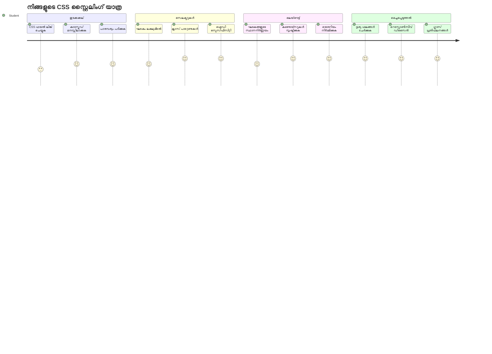
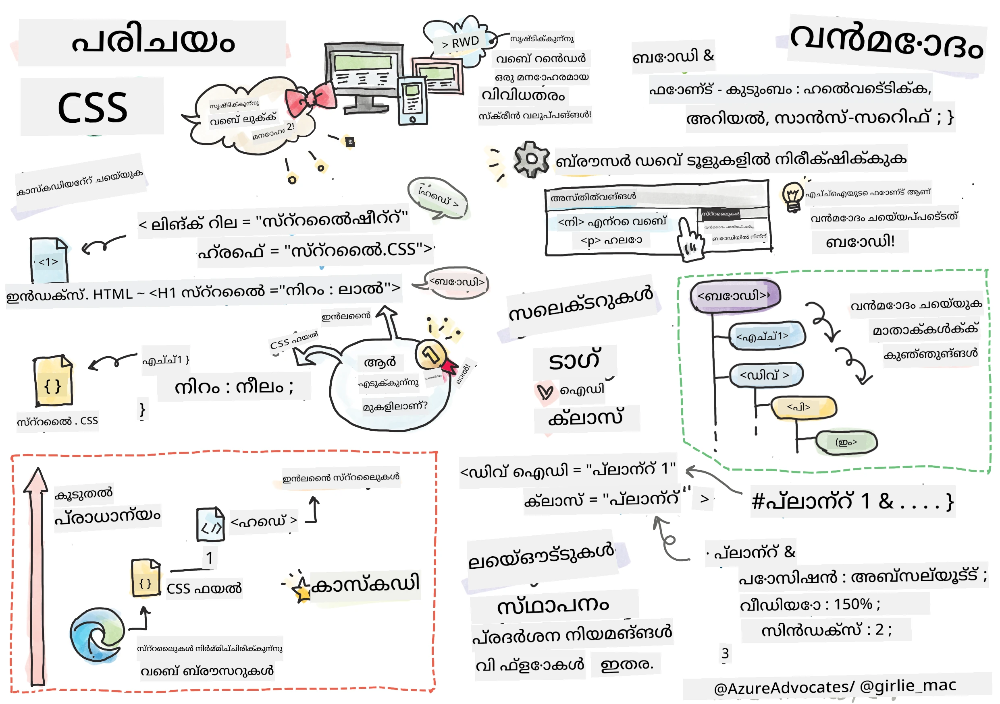
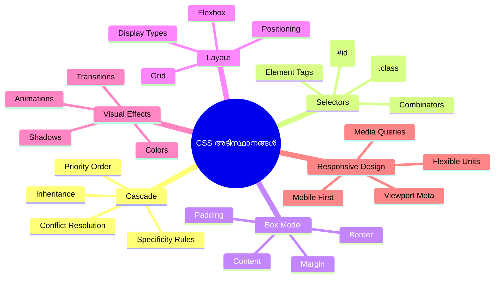
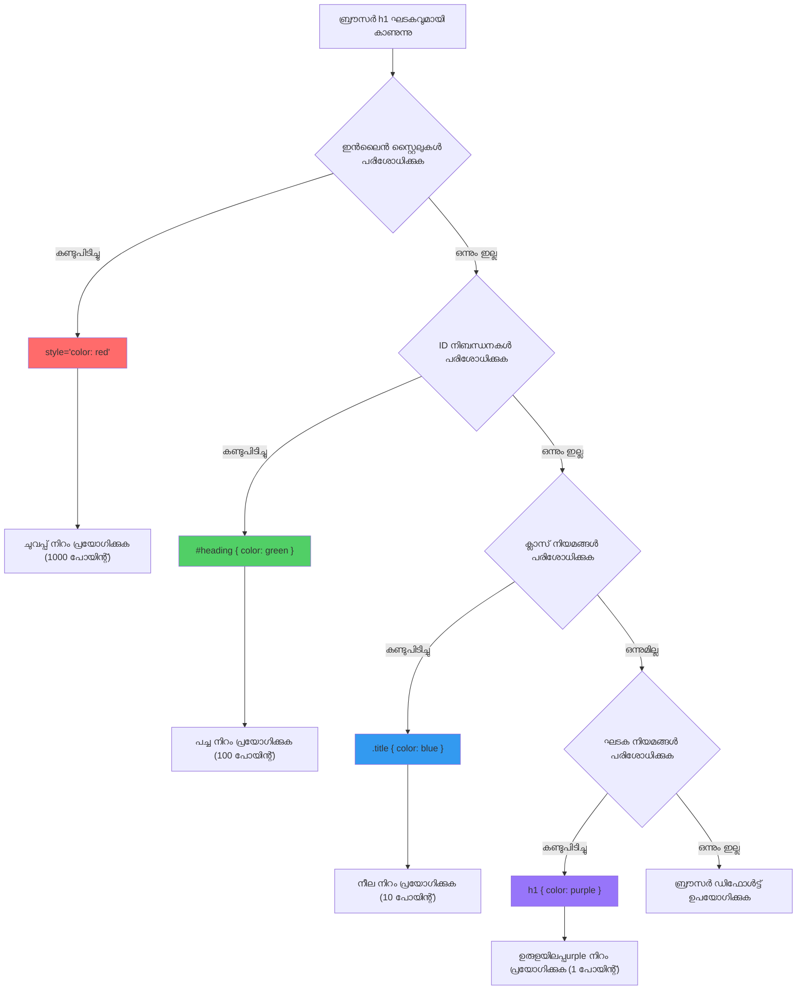
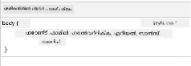
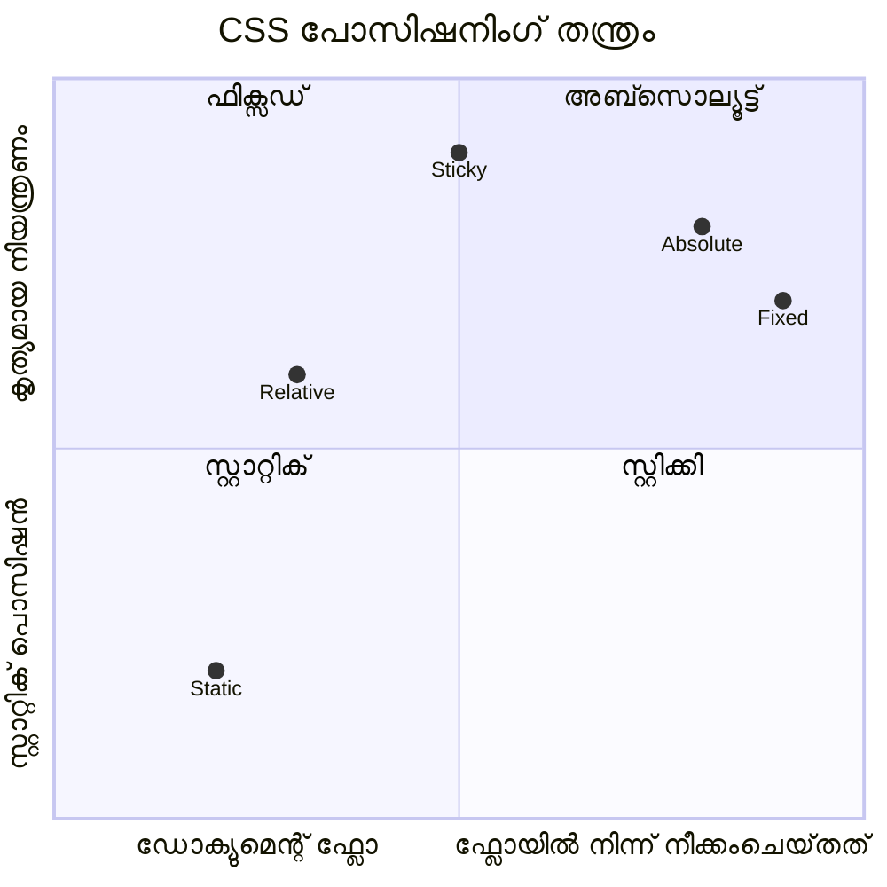
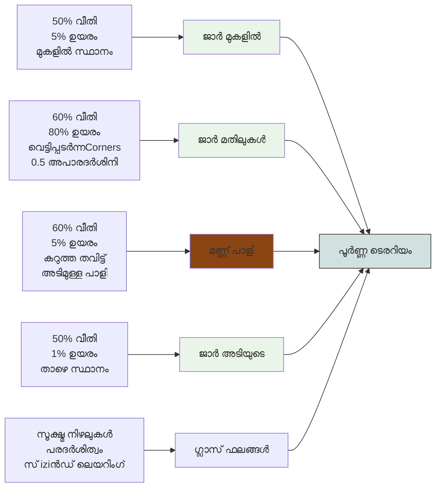
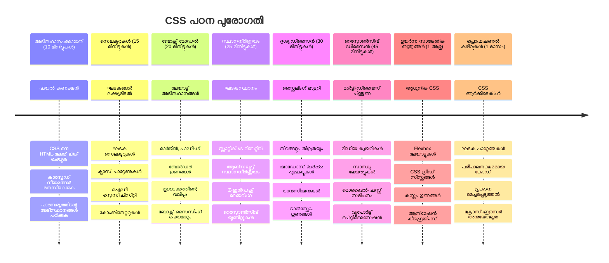

# ടെററിയം പ്രോജക్ట్ ഭാഗം 2: CSS-ഇന്റെ പരിചയം



> സ്കെച്ച്നോട്ട് [ടോമോമി ഇമുര](https://twitter.com/girlie_mac)രിടം

നിന്റെ HTML ടെററിയം എത്ര സാധാരണമായിരുന്നു എന്ന് ഓർക്കുന്നുണ്ടോ? CSS ആണ് ആ പാരിപ്പൊളിച്ച ഘടനയെ ദൃശ്യപരമായി ആകര്‍ഷകമാക്കുന്നത്.

HTML വീടിന്റെ ഫോം നിർമ്മിക്കുന്നതുപോലെ ആണെങ്കിൽ, CSS വീട്ടുപോലെ ആക്കുന്നത് ആണ് - പേൻറ് കളർ, ഫർണിച്ചർ ക്രമീകരണം, ലൈറ്റിംഗ്, മുറികളിലെ ബന്ധം. Palace of Versailles എങ്ങനെ ഒരു ലളിതമായ ഹണ്ടിംഗ് ലജ്ജായി തുടങ്ങിയതും, അലങ്കാരത്തിലും വിന്യാസത്തിലും ശ്രദ്ധ നൽകിയതുകൊണ്ടുതന്നെ ലോകത്തിലെ ഏറ്റവും മനോഹരമായ കെട്ടിടങ്ങളിലൊന്നായി മാറിയതും ആലോചിക്കു.

ഇന്ന്, നിന്റെ ടെററിയങ്ങളെ ഫംഗ്ഷണൽ നിന്ന് പോളിഷ് ചെയ്തതാക്കാം. നിനക്ക് എലമെന്റുകൾ കൃത്യമായി പൊസിഷൻ ചെയ്യാൻ, ലേയൗട്ടുകൾ വ്യത്യസ്ത സ്ക്രീൻ വലിപ്പങ്ങളെ അനുസരിച്ച് പ്രതികരിക്കാൻ, വെബ്സൈറ്റുകളെ ആകര്‍ഷകമാക്കുന്ന ദൃശ്യ രൂപത സൃഷ്ടിക്കാൻ പഠിക്കും.

ഈ പാഠത്തിന്റെ അവസാനം, സമർത്ഥമായ CSS സ്റ്റൈലിംഗ് പ്രോജക്റ്റിന്റെ പ്രകടനം വളരെയധികം മെച്ചപ്പെടുത്തുന്നുവെന്ന് കാണാനാകും. നിന്റെ ടെററിയത്തിന് സ്റ്റൈൽ ചേർക്കാം.


## പൂർവ-പാഠം ക്വിസ്

[പൂർവ-പാഠം ക്വിസ്](https://ff-quizzes.netlify.app/web/quiz/17)

## CSS-ൽ തുടക്കം കുറിക്കുക

CSS സാധാരണയായി "സുന്ദരമാക്കൽ" എന്ന പോലെ കരുതപ്പെടുന്നു, എന്നാൽ അതിന് വളരെ വിപുലമായ ലക്ഷ്യമുണ്ട്. CSS ഒരു സിനിമാ ഡയറക്ടറിന്റെപോലെ ആണ് - നിൽക്ക് എല്ലാം എങ്ങനെയാണ് പ്രത്യക്ഷപ്പെടുക മാത്രമല്ല, എങ്ങനെയാണ് സഞ്ചരിക്കുക, ഇൻററാക്ഷനോട് എങ്ങനെയാണ് പ്രതികരിക്കുക, വ്യത്യസ്ത സാഹചര്യങ്ങളിൽ എങ്ങനെയാണ് സംയോജിപ്പിക്കുക എന്നും നിയന്ത്രിക്കാം.

ആധുനിക CSS വളരെ ശേഷിയുള്ളതാണ്. ഫോൺ, ടാബ്ലറ്റ്, ഡെസ്ക്ടോപ്പ് കമ്പ്യൂട്ടറുകൾക്കായി ലേയൗട്ട് സ്വയം സജ്ജമാക്കുന്ന കുതിൾ ലേഖനം നിനക്ക് എഴുതാം. ഉപയോക്താക്കളുടെ ശ്രദ്ധക്ക് ആവശ്യമായ ഇടത്തേക്ക് നയിക്കുന്ന സ്മൂത്ത് അനിമേഷനുകൾ സൃഷ്ടിക്കാം. എല്ലാം ചേർന്ന് വളരെ പ്രഭാഷകരമായി കണ്ടു വരാം.

> 💡 **പ്രോ ടിപ്പ്**: CSS തുടർച്ചയായി നവീകരണങ്ങളും ശേഷികളും വശ്യപ്പെടുന്നു. പുതിയ CSS സവിശേഷതകൾ ഉപയോഗിക്കാൻ മുമ്പ് എല്ലാവർഷം [CanIUse.com](https://caniuse.com) പരിശോധിച്ച് ബ്രൗസർ പിന്തുണ ഉറപ്പാക്കുക.

**ഈ പാഠത്തിൽ നാം നേടുന്നത്:**
- **നിന്റെ ടെററിയത്തിന്** ആധുനിക CSS സാങ്കേതികവിദ്യകൾ ഉപയോഗിച്ച് പൂർണ്ണമായ ദൃശ്യ രൂപകൽപ്പന സൃഷ്ടിക്കുന്നു
- **ആധികാരിക ആശയങ്ങൾ** പഠിക്കുന്നു - കാസ്‌കേഡ്, പാരമ്പര്യം, CSS സെലക്ടറുകൾ
- **പ്രതികരണശീലമുള്ള** പൊസിഷനിംഗ്, ലേയൗട്ട് തന്ത്രങ്ങൾ നടപ്പിലാക്കുന്നു
- **CSS ആകൃതികളും സ്റ്റൈലുകളും ഉപയോഗിച്ച്** ടെററിയം കണ്ടെയ്‌നർ നിർമ്മിക്കുന്നു

### മുൻനിയമം

നിനക്ക് മുമ്പത്തെ പാഠത്തിൽ നിന്നുള്ള ടെററിയത്തിന്റെ HTML ഘടന പൂർത്തിയാക്കിയിരിക്കണം, അതിന് സ്റ്റൈൽ നൽകാൻ തയ്യാറാകണം.

> 📺 ** വീഡിയോ റിസോഴ്‌സ് **: സഹായകമായ ഈ വീഡിയോ വാക്ക്ത്രൂ നോക്കൂ
>
> [](https://www.youtube.com/watch?v=6yIdOIV9p1I)

### നിന്റെ CSS ഫയൽ സജ്ജമാക്കൽ

സ്റ്റൈലിംഗ് ആരംഭിക്കുന്നതിന് മുമ്പ്, CSS നു HTML-നോടു ബന്ധപ്പെടണം. ഈ ബന്ധം ബ്രൗസറിനു നിന്റെ ടെററിയത്തിന് വേണ്ട സ്റ്റൈലിംഗ് നിർദ്ദേശങ്ങൾ എവിടെയാണ് എന്ന് പറയുന്നു.

നിന്റെ ടെററിയം ഫോൾഡറിൽ, `style.css` എന്ന പുതിയ ഫയൽ സൃഷ്ടിക്കൂ, പിന്നെ HTML ഡോക്യുമെന്റിലെ `<head>` സെക്ഷനിൽ ലിങ്ക് ചേർക്കൂ:

```html
<link rel="stylesheet" href="./style.css" />
```

**ഈ കോഡ് ചെയ്യുന്നത്:**
- **HTML-നും CSS ഫയലിനും** ഇടയിൽ ഒരു ബന്ധം സൃഷ്ടിക്കുന്നു
- **ബ്രൗസറിനു** `style.css` ല് നിന്നുള്ള സ്റ്റൈലുകൾ ലോഡ് ചെയ്ത് പ്രയോഗിക്കാൻ പറയുന്നു
- **`rel="stylesheet"`** ഗുണം CSS ഫയൽ ആണ് എന്ന് നിർദ്ദേശിക്കുന്നു
- **`href="./style.css"`** വഴി ഫയൽ പാത്ത് സൂചിപ്പിക്കുന്നു

## CSS കാസ്‌കേഡ് മനസ്സിലാക്കൽ

എന്തിനാണ് CSS-നെ "കാസ്കേഡിംഗ്" സ്റ്റൈൽ ഷീറ്റുകൾ എന്നു വിളിക്കുന്നത്? സ്റ്റൈലുകൾ വെള്ളച്ചാട്ടം പോലെ താഴിറങ്ങും, കൽക്കിടയിൽ അവർ തമ്മിൽ സംഘർഷിക്കാം.

സൈനിക കമാൻഡ് ഘടനകൾ പോലെ ചിന്തിക്കൂ - ജനറൽ ഓർഡർ "എല്ലാ സേന GREEN ഉടുത്ത്" എന്നു പറയും, എന്നാല്‍ നിന്റെ യൂണിറ്റിന് പ്രത്യേക ഓർഡർ "അവാർഡ് സെറിമോനിയ്ക്ക് ഡ്രസ് ബ്ലൂസ് ധരിക്കുക" എന്ന് പറയാം. കൂടുതൽ പ്രത്യേകമായ നിർദ്ദേശം മുൻതൂക്കം നേടി. CSS ഇതുപോലെ പ്രവർത്തിക്കുന്നു, ഈ പരമാവധി മനസ്സിലാക്കുന്നത് ഡീബഗ്ഗിങ്ങ് വളരെ എളുപ്പമാക്കും.

### കാസ്കേഡ് മുൻഗണനയെപ്പറ്റി പരീക്ഷണം നടത്തുക

കാസ്‌കേഡ് പ്രവർത്തനം കാണുവാൻ സ്റ്റൈൽ സംഘർഷം സൃഷ്ടിക്കാം. ആദ്യം `<h1>` ടാഗിൽ ഇൻലൈൻ സ്റ്റൈൽ ചേർക്കൂ:

```html
<h1 style="color: red">My Terrarium</h1>
```

**ഈ കോഡ് ചെയ്യുന്നത്:**
- `<h1>` എലമെന്റിന് നേരിട്ട് ചുവപ്പ് നിറം നൽകുന്നു ഇൻലൈൻ സ്റ്റൈൽ ഉപയോഗിച്ച്
- `style` ആട്രിബ്യൂട്ട് ഉപയോഗിച്ച് CSS HTML നെ അഭിസംബോധനം ചെയ്യുന്നു
- ഈ പ്രത്യേക നീതിനിയമത്തിന് ഏറ്റവും ഉയർന്ന മുൻഗണന സൃഷ്ടിക്കുന്നു

അടുത്തത്, നിന്റെ `style.css` ഫയലിൽ താഴെ കാണുന്ന നിയമം ചേർക്കൂ:

```css
h1 {
  color: blue;
}
```

**മുകളിൽ നാം:**
- എല്ലാ `<h1>` എലമെന്റുകൾക്ക് CSS നിയമം നിർവചിച്ചു
- ബാഹ്യ സ്റ്റൈൽഷീറ്റിൽ നീല നിറമാക്കി ടെക്സ്റ്റ് നിറം സജ്ജമാക്കി
- ഇൻലൈൻ സ്റ്റൈൽസിന തികച്ചും കുറഞ്ഞ മുൻഗണന സൃഷ്ടിച്ചു

✅ **ജ്ഞാനപരിശോധന**: നിന്റെ വെബ് ആപ്പിൽ ഏതു നിറമാണ് പ്രത്യക്ഷപ്പെടുന്നത്? എന്തുകൊണ്ട് ആ നിറം ജയിക്കുന്നുവെന്ന് വിശകലനം ചെയ്യുക? സ്റ്റൈലുകൾ മറികടക്കേണ്ട സാഹചര്യങ്ങൾ ഉണ്ടാക്കാമോ?


> 💡 **CSS മുൻഗണന ക്രമം (ഉയർന്നതില്‍നിന്ന് താഴേക്ക്):**
> 1. **ഇൻലൈൻ സ്റ്റൈൽസ്** (style ആട്രിബ്യൂട്ട്)
> 2. **IDs** (#myId)
> 3. **ക്ലാസ്സുകൾ** (.myClass) & ആട്രിബ്യൂട്ടുകൾ
> 4. **എലമെന്റ് സെലക്ടറുകൾ** (h1, div, p)
> 5. **ബ്രൗസർ ഡിഫോൾട്ടുകൾ**

## CSS പാരമ്പര്യം പ്രവർത്തനം

CSS പാരമ്പര്യം ജൈവവശേഷിയുപോലെയാണ് — ഏതാനും പ്രോപ്പർട്ടികൾ മാതൃ എലമെന്റുകളിൽ നിന്നു പകർന്നു കിട്ടുന്നു. ഉദാഹരണത്തിന്, ബോഡിയുടെ ഫോണ്ട് ഫാമിലി സജ്ജമാക്കിയാൽ, അകത്ത് ഉള്ള എല്ലാ ടെക്സ്ടുകളും സ്വയം ആ ഫോണ്ട് ഉപയോഗിക്കും. ഇത് ഹാബ്സ്ബർഗ് കുടുംബത്തിന്റെ പ്രത്യേക ജോലിൻ പോലെയാണ്, ഓരോ തലമുറയ്ക്കും വ്യക്തമായിരുന്നു, വ്യക്തിക്ക് പ്രത്യേകമായി പറയാതെ.

എന്നാൽ എല്ലാം പാരമ്പര്യമല്ല. ടെക്സ്റ്റ് സ്റ്റൈലുകൾ (ഫോണ്ട്, നിറങ്ങൾ) പാരമ്പര്യം കൈവരിക്കുമ്പോൾ, ലേയൗട്ട് സ്വഭാവങ്ങൾ (മാർജിൻ, ബോർഡർ) പാരമ്പര്യമല്ല. കുട്ടികൾ മാതാപിതാക്കളുടെ ഫാഷൻ ഇഷ്ടങ്ങൾ പകർത്താതെ ശരീരഗുണങ്ങൾ പകർത്തുന്നതുപോലെ.

### ഫോണ്ട് പാരമ്പര്യം കാണുക

`<body>` എലമെന്റിന് ഫോണ്ട് ഫാമിലി സജ്ജമാക്കുക:

```css
body {
  font-family: 'Segoe UI', Tahoma, Geneva, Verdana, sans-serif;
}
```

**ഇവിടെ സംഭവിക്കുന്നത്:**
- `<body>` ലക്ഷ്യമിട്ട് പേജിന്റെ മൊത്തം ഫോണ്ട് ഫാമിലി സെറ്റ് ചെയ്യുന്നു
- മികച്ച ബ്രൗസർ പൊരുത്തത്തിനായി ഫാൾബാക്ക് ഉൾപ്പെടെയുള്ള ഫോണ്ട് സ്റ്റാക്ക് ഉപയോഗിക്കുന്നു
- വ്യത്യസ്ത ഒഎസ്-കളിൽ മികച്ച ദൃശ്യപരതയ്ക്കായി ആധുനിക സിസ്റ്റം ഫോണ്ട് ഉപയോഗിക്കുന്നു
- നിശ്ചയിച്ച് ഇല്ലാത്തപ്പോൾ എല്ലാ ചൈൽഡ് എലമെന്റുകളും ഫോണ്റ് പാരമ്പര്യം ഏറ്റെടുക്കുന്നു

നിന്റെ ബ്രൗസറിന്റെ ഡിസ്ക്കമ്പോസർ ടൂൾസ് (F12) തുറക്കൂ, Elements ടാബ് തിരഞ്ഞെടുക്കൂ, `<h1>`-നെ പരിശോധിക്കൂ. ഇത് `body`-യിൽ നിന്നുള്ള ഫോണ്ട് ഫാമിലി പാരമ്പര്യമായി സ്വീകരിച്ചത് കാണാം:



✅ **പരീക്ഷണമെടുത്ത് നോക്കൂ**: `<body>`-യ്‌ക്ക് `color`, `line-height`, അല്ലെങ്കിൽ `text-align` പോലുള്ള മറ്റേതെങ്കിലും പാരമ്പര്യ സ്വഭാവങ്ങൾ സജ്ജമാക്കൂ. നിന്റെ തലക്കെട്ടിനും മറ്റ് എലമെന്റുകൾക്കും എന്ത് സംഭവിക്കുന്നു?

> 📝 **പാരമ്പര്യം കൈവരിക്കുന്ന പ്രോപ്പർട്ടികൾ**: `color`, `font-family`, `font-size`, `line-height`, `text-align`, `visibility`
>
> **പാരമ്പര്യമില്ലാത്ത പ്രോപ്പർട്ടികൾ**: `margin`, `padding`, `border`, `width`, `height`, `position`

### 🔄 **പാഠത്തിന്റെ അവലോകനം**
**CSS അടിസ്ഥാന മനസ്സിലാക്കൽ**: സെലക്ടറുകളിലേക്ക് മുന്നോട്ട് പോകുന്നതിന് മുൻപ് ഉറപ്പാക്കുക:
- ✅ കാസ്‌കേഡും പാരമ്പര്യവും തമ്മിലുള്ള വ്യത്യാസം വ്യക്തമാക്കാൻ കഴിയുന്നു
- ✅ പ്രത്യേകത സംഘർഷത്തിൽ ഏതു സ്റ്റൈൽ വിജയിക്കും ബോധ്യപ്പെടുത്താൻ കഴിയും
- ✅ ഏത് പ്രോപ്പർട്ടികൾ പാരമ്പര്യം കൈവരിക്കുന്നുവെന്ന് തിരിച്ചറിയുന്നു
- ✅ CSS ഫയലുകൾ HTML-നൊപ്പം ശരിയായി ബന്ധിപ്പിക്കുന്നു

**പെട്ടെന്നുള്ള പരിശോധന**: ഈ സ്റ്റൈലുകൾ ഉണ്ടെങ്കിൽ, `<div class="special">` ഉള്ളിൽ ഉള്ള `<h1>`-ന്റെ നിറം എന്താകും?
```css
div { color: blue; }
.special { color: green; }
h1 { color: red; }
```
*ഉത്തരം: ചുവപ്പ് (എലമെന്റ് സെലക്ടർ നേരിട്ട് h1 നെ ലക്ഷ്യമിടുന്നു)*

## CSS സെലക്ടറുകൾ നിമിഷപൂർവ്വം കൈകാര്യം ചെയ്യുക

CSS സെലക്ടറുകൾ സവിശേഷ എലമെന്റുകൾക്ക് സ്റ്റൈൽ നൽകാനുള്ള നിനക്ക് വഴിയാണ്. "വീട്" എന്നു പറയുന്നതിനുപകരം, "മെപ്ല് സ്ട്രീറ്റിൽ റെഡ് വാതിൽ ഉള്ള നീല വീട്" എന്നതുപോലെ കൃത്യമായ മാർഗ്ഗനിർദ്ദേശമാണ്.

CSS വിവിധ തരത്തിലുള്ള സെലക്ടറുകൾ നൽകുന്നു, ശരിയായ സെലക്ടർ തിരഞ്ഞെടുക്കുന്നത് ആവശ്യത്തിനുള്ള മികച്ച ഉപകരണം തിരഞ്ഞെടുക്കുന്നതിനോട് തുല്യമാണ്. ഇടയ്ക്കിടെ എല്ലാ കെട്ടിടത്തിലെ വാതിലുകൾക്കും സ്റ്റൈൽ നല്കണം, ചിലപ്പോഴപ്പോൾ മാത്രം ഒരു പ്രത്യേക വാതിലിനു മാത്രമേ.

### എലമെന്റ് സെലക്ടറുകൾ (ടാഗുകൾ)

എലമെന്റ് സെലക്ടറുകൾ ടാഗ് നാമം അടിസ്ഥാനമാക്കി HTML എലമെന്റുകൾ ലക്ഷ്യമിടുന്നു. ഈ സെലക്ടർ പേജ് മുഴുവൻ വ്യാപകമായ അടിസ്ഥാന സ്റ്റൈൽ നല്കാൻ അനുയോജ്യമാണ്:

```css
body {
  font-family: 'Segoe UI', Tahoma, Geneva, Verdana, sans-serif;
  margin: 0;
  padding: 0;
}

h1 {
  color: #3a241d;
  text-align: center;
  font-size: 2.5rem;
  margin-bottom: 1rem;
}
```

**ഈ സ്റ്റൈലുകൾ അത്രയ്ക്കായി:**
- പേജ് മുഴുവൻ ഏകീകൃത ടൈപ്പോഗ്രഫി കാണിക്കാൻ `body` സെലക്ടർ ഉപയോഗിക്കുന്നു
- മികച്ച നിയന്ത്രണത്തിനായി ബ്രൗസറിന്റെ ഡീഫോൾട്ട് മാർജിനുകളും പാഡിംഗുകളും നീക്കം ചെയ്യുന്നു
- എല്ലാ ഹെഡിംഗ് എലമെന്റുകളെയും നിറം, സന്ധി, അലൈന്മെന്റ് നൽകുന്നു
- സ്കെയിലബിൾ, ആക്സസിബിൾ ഫോണ്ട് വലുപ്പത്തിന് `rem` യൂണിറ്റ് ഉപയോഗിക്കുന്നു

എങ്കിലും, എലമെന്റ് സെലക്ടറുകൾ സാധാരണ സ്റ്റൈലിംഗിന് നല്ലതായിരിക്കുമ്പോൾ, ഓരോ ടെററിയം ചെടികൾ പോലുള്ള പ്രത്യേക ഘടകങ്ങൾക്ക് കൂടുതൽ പ്രത്യേക സെലക്ടറുകൾ ആവശ്യമായിരിക്കും.

### ഏകാന്ത എലമെന്റുകൾക്കായി ID സെലക്ടറുകൾ

ID സെലക്ടറുകൾ `#` ചിഹ്നം ഉപയോഗിച്ച് പ്രത്യേക `id` ഉള്ള എലമെന്റുകളെ ലക്ഷ്യമിടുന്നു. പേജിൽ ഓരോ ID ഒറ്റത്തവണ മാത്രം ഉപയോഗിക്കണം, അതിനാൽ പ്രത്യേകം പ്രത്യേക ഘടകങ്ങൾക്ക് (ഉദാ: ടെററിയത്തിന്റെ ഇടത്തും വലത്തും ഉള്ള ചെടി കണ്ടെയ്‌നറുകൾ) ഇവ നല്ലതാണ്.

ടെററിയത്തിലെ സൈഡ് കണ്ടെയ്‌നറുകൾ എവിടെ ചെടികൾ താമസിക്കും, അവയ്ക്ക് വേണ്ടി സ്റ്റൈലിംഗ് തീർക്കാം:

```css
#left-container {
  background-color: #f5f5f5;
  width: 15%;
  left: 0;
  top: 0;
  position: absolute;
  height: 100vh;
  padding: 1rem;
  box-sizing: border-box;
}

#right-container {
  background-color: #f5f5f5;
  width: 15%;
  right: 0;
  top: 0;
  position: absolute;
  height: 100vh;
  padding: 1rem;
  box-sizing: border-box;
}
```

**ഇവിടെ സംഭവിക്കുന്നത്:**
- `absolute` പൊസിഷനിംഗുമായി കണ്ടെയ്‌നറുകൾ ഇടത്തും വലത്തും നീക്കുന്നു
- സ്ക്രീൻ വലിപ്പത്തിന് അനുസരിച്ച് `vh` (viewport height) യൂണിറ്റിൽ ഉയരം നൽകുന്നു
- പാഡിംഗിൽ ഉൾപ്പെടുത്തിയവയ്ക്ക് `box-sizing: border-box` ഉപയോഗിക്കുന്നു
- സോഴ്യമായ ജൂലിയൻ മൂല്യങ്ങളിൽ നിന്നുള്ള `px` യൂണിറ്റുകൾ നീക്കി ലക്ഷ്യമിടുന്നു
- കഠിനമായ കറുപ്പുപകരം കണ്ണിന് ഇതിന് സൗകര്യമുള്ള സബ്‌റ്റിൽ പശ്ചാത്തല നിറം നൽകുന്നു

✅ **കോഡ് ഗുണമേന്മ പരിശോധന**: ഈ CSS DRY (Don't Repeat Yourself) നിയമം ലംഘിക്കുന്നതാണ് കാണുന്നത്. ഒരു ID ഒപ്പം ക്ലാസ് ഉപയോഗിച്ച് ഇത് പുനഃസംഘടിപ്പിക്കാമോ?

**മികച്ച സമരയോഗം:**
```html
<div id="left-container" class="container"></div>
<div id="right-container" class="container"></div>
```

```css
.container {
  background-color: #f5f5f5;
  width: 15%;
  top: 0;
  position: absolute;
  height: 100vh;
  padding: 1rem;
  box-sizing: border-box;
}

#left-container {
  left: 0;
}

#right-container {
  right: 0;
}
```

### പുനരുപയോഗപ്പെടുത്താവുന്ന ഘടകങ്ങൾക്ക് ക്ലാസ് സെലക്ടറുകൾ

ക്ലാസ് സെലക്ടറുകൾ `.` ചിഹ്നം ഉപയോഗിച്ച് ഒടുക്കം ഒരു മുതിർന്ന ഇലമെന്റിന് പലത്തവണ സ്റ്റൈലുകൾ പ്രയോഗിക്കാം. ID-കളുടെ വ്യത്യാസം, ക്ലാസുകൾ പേജിലുടനീളം വീണ്ടും ഉപയോഗിച്ചേക്കാം, അതുകൊണ്ട് സ്ഥിരമായ സ്റ്റൈലിംഗ് മാതൃകകൾക്കായി ഇവ ഏറ്റവും അനുയോജ്യമാണ്.

നമ്മുടെ ടെററിയത്തിൽ ഓരോ ചെടിക്കും സമാനമായ സ്റ്റൈലിംഗ് ആവശ്യമായിരിക്കുന്നു എങ്കിലും വ്യക്തിഗത പൊസിഷനിംഗ് വേണം. നാം പുനരുപയോഗ ക്ലാസ്സുകളും ID-യും സംയോജിപ്പിച്ച് ഉപയോഗിക്കാം.

**ഓരോ ചെടിക്കും വേണ്ട HTML ഘടന:**
```html
<div class="plant-holder">
  
</div>
```

**പ്രധാന ഘടകങ്ങൾ:**
- എല്ലാ ചെടികൾക്കുമുള്ള പൊസിഷൻ കൺട്രോൾ ചെയ്യാൻ `class="plant-holder"` ഉപയോഗിക്കുന്നു
- ചിത്രത്തിനും പെരുമാറ്റത്തിനും `class="plant"` നൽകുന്നു
- ഓരോ ചെടിക്കും വ്യത്യസ്ത പൊസിഷനിംഗിനും ജാവാസ്ക്രിപ്റ്റ് ഉൾപെടുത്തലിനും വ്യത്യസ്ത ID `id="plant1"` ഉപയോഗിക്കുന്നു
- സ്ക്രീൻ റീഡർ സൗഹൃദം ഉറപ്പാക്കാൻ വിവരണപരമായ alt ടെക്സ്റ്റ് നൽകുന്നു

ഇപ്പൊഴിത് നിന്റെ `style.css` ഫയലിൽ വേറെ സ്റ്റൈലുകൾ ചേർക്കൂ:

```css
.plant-holder {
  position: relative;
  height: 13%;
  left: -0.6rem;
}

.plant {
  position: absolute;
  max-width: 150%;
  max-height: 150%;
  z-index: 2;
  transition: transform 0.3s ease;
}

.plant:hover {
  transform: scale(1.05);
}
```

**ഈ സ്റ്റൈലുകൾ വിശദീകരിക്കുക:**
- `plant-holder`-ന് `relative` പൊസിഷനിംഗ് വഴി പൊസിഷനിംഗ് കോൺടെക്‌സ്‌റ്റ് ഒരുക്കുന്നു
- ഓരോ `plant-holder`-നും 13% ഉയരം നൽകുന്നു, ചെടികൾ സ്ക്രോൾ ഇല്ലാതെ വീതിയിൽ പൊരുത്തപ്പെടും
- `plant-holder` ലെHolder-നെ കുറെ ഇടത്തേക്ക് മാറ്റി ചെടികളെ കൂടുതൽ കൃത്യമായി മദ്ധ്യസ്ഥമാക്കുന്നു
- `max-width` `max-height` ഉപയോഗിച്ച് ചെടികൾ പ്രതികരണശീലമായി സ്കെയിൽ ചെയ്യാനാവും
- `z-index` ഉപയോഗിച്ച് ടെററിയത്തിലെ മറ്റു ഘടകങ്ങളെ മുകളിൽ വയ്ക്കുന്നു
- CSS ട്രാനുംഷനുകൾ വഴി സാവധാനമായ ഹോവർ ഇഫക്റ്റ് ചേർക്കുന്നു

✅ **ആവശ്യക്കാഴ്ച**: `.plant-holder` ഉം `.plant` ഉം വേറിട്ടതിനുള്ള ആവശ്യകം എന്താണ്? വെറും ഒന്ന് മാത്രം ഉപയോഗിച്ചാൽ എന്താകും?

> 💡 **ഡിസൈൻ മാതൃക**: കോൺടെയ്‌നർ (.plant-holder) ലേയൗട്ടും പൊസിഷൻ നിയന്ത്രിക്കുന്നു, ഉള്ളടക്കം (.plant) ദൃശ്യഭാവവും സ്കേലും കൈകാര്യം ചെയ്യുന്നു. ഇത് കോഡ് കൂടുതൽ പുനഃസംഘടന ഉചിതമാക്കുന്നു.

## CSS പൊസിഷനിംഗ് മനസ്സിലാക്കുക

CSS പൊസിഷനിംഗ് ഒരു നാടകത്തിലെ സ്റ്റേജ് ഡയറക്ടറുടെ പോലെ - എല്ലാ അഭിനയക്കാരും എവിടെ നിൽക്കും, എങ്ങനെയാവരും എന്ന് നിർദ്ദേശിക്കുന്നു. ചില അഭിനേതാക്കൾ സാധാരണ നിലയിൽ നിന്നു പ്രവർത്തിക്കും, മറ്റുചിലർ പ്രത്യേക പൊസിഷനിംഗ് ആവശ്യമാണ്.

പോസിഷനിംഗ് മനസ്സിലാക്കിയാൽ പല ലേയൗട്ട് പ്രശ്നങ്ങളും പരിഹരിക്കാം. സ്ക്രോൾ ചെയ്യുമ്പോഴും നാവിഗേഷൻ ബാർ മുകളിൽ തന്നെ നിലനിർത്തണം? അതിന് പൊസിഷനിംഗ് ഉപയോഗിക്കുക. നിശ്ചിത ഇടത്ത് ടൂള്ടിപ്പ് കാണിക്കണം? അതും പൊസിഷനിംഗ്.

### അഞ്ച് പൊസിഷൻ മൂല്യങ്ങൾ


| പൊസിഷൻ മൂല്യം | പെരുമാറ്റം | ഉപയോഗം |
|----------------|----------|----------|
| `static` | സ്വാഭാവിക പ്രവാഹം, top/left/right/bottom അനുഗമിക്കില്ല | സാധാരണ ഡോക്യുമെന്റ് ലേയൗട്ട് |
| `relative` | സ്വാഭാവിക സ്ഥിതിക്ക് അനുഭവപരമായ പൊസിഷൻ | ചെറിയ ക്രമീകരണങ്ങൾ, പൊസിഷനിംഗ് കോൺടെക്‌സ്‌റ്റ് സൃഷ്ടിക്കൽ |
| `absolute` | അടുത്ത പൊസിഷൻ ചെയ്ത അവകാശിയായ മുൻപുള്ള എലമെന്റിനെ അടിസ്ഥാനമാക്കി | കൃത്യമായ സ്ഥാനം, ഓവർലെകൾ |
| `fixed` | viewport അടിസ്ഥാനമാക്കിയുള്ള പൊസിഷൻ | നാവിഗേഷൻ ബാറുകൾ, നിറഞ്ഞ എലമെന്റുകൾ |
| `sticky` | സ്ക്രോൾ അനുസരിച്ച് `relative`നും `fixed`ക്കും ഇടയിൽ മാറുന്നു | സ്ക്രോൾ ചെയ്യുമ്പോൾ പിടിച്ചുനിർത്തുന്ന ഹെഡറുകൾ |

### നമുക്ക് കിട്ടിയ ടെററിയത്തിൽ പൊസിഷനിംഗ്

നമ്മുടെ ടെററിയം ഉദ്ദേശിച്ച ലേയൗട്ട് സൃഷ്ടിക്കാൻ പൊസിഷനിംഗ് മൂല്യങ്ങളുടെ സമന്വയം ഉപയോഗിക്കുന്നു:

```css
/* Container positioning */
.container {
  position: absolute; /* Removes from normal flow */
  /* ... other styles ... */
}

/* Plant holder positioning */
.plant-holder {
  position: relative; /* Creates positioning context */
  /* ... other styles ... */
}

/* Plant positioning */
.plant {
  position: absolute; /* Allows precise placement within holder */
  /* ... other styles ... */
}
```

**പോസിഷനിംഗ് തന്ത്രം:**
- **Absolute കൺടെയ്‌നറുകൾ** സ്വാഭാവിക ഫ്ലോയിൽ നിന്നും നീക്കം ചെയ്ത് സ്ക്രീൻ അരികുകളിൽ പിണ്ഡ് ചെയ്യുന്നു
- **Relative ചെടി holder-കൾ** പൊസിഷനിംഗ് കോൺടെക്‌സ്‌റ്റ് സൃഷ്ടിക്കുന്നു, ഡോക്യുമെന്റ് ഫ്ലോയിൽ തുടരുന്നു
- **Absolute ചെടികൾ** അവരുടെ relative holder-ലുള്ള കൃത്യമായ പൊസിഷനം നേടുന്നു
- **ഈ സംയോജനം** ചെടികൾ കൂമ്പാരമായി മുകളിലേക്ക് ശ്രേണീകരിച്ച് വ്യക്തിഗത പൊസിഷനിംഗ് സാധ്യമാക്കുന്നു

> 🎯 **അത് എന്തിന് ആവശ്യമാണ്**: അടുത്ത പാഠത്തിൽ ചെടികൾ ഡ്രാഗ് ആൻഡ് ഡ്രോപ്പ് ചെയ്യാവുന്നവയാക്കാൻ absolute പൊസിഷനിംഗ് വേണം. ഇത് അവരെ സാധാരണ ലേയൗട്ട് ഫ്ലോയിൽ നിന്നും നീക്കം ചെയ്യുന്നു.

✅ **പരീക്ഷണം**: പൊസിഷൻ മൂല്യങ്ങൾ മാറ്റി ഫലങ്ങൾ കാണൂ:
- `.container`-ന് `absolute` ന്റെ പകരം `relative` നു മാറ്റിയാൽ സംഭവിക്കുന്നത് എന്താകും?
- `.plant-holder` `relative` പകരം `absolute` ഉപയോഗിച്ചാൽ ലേയൗട്ട് എങ്ങനെയാണ് മാറുക?
- `.plant`-നെ `relative` പോസിഷൻ ചെയ്യുമ്പോൾ എന്ത് സംഭവിക്കും?

### 🔄 **പെടഗോഗിക്കൽ ചെക്ക്- ഇൻ**
**CSS പോസിഷനിംഗ് മാസ്ററീ**: നിങ്ങളുടെ മനസിലാക്കലുകൾ പരിശോധിക്കുക:
- ✅ പ്ലാന്റുകൾക്ക് ഡ്രാഗ്-അൻഡ്-ഡ്രോപ്പ് സജ്ജമാക്കാൻ ആബ്സല്യൂട്ട് പോസിഷനിംഗ് എങ്ങനെ സഹായിക്കുന്നു എന്ന് വിശദീകരിക്കാമോ?
- ✅ റീലേറ്റീവ് കോൺടൈനറുകൾ പോസിഷനിംഗ് കോൺടെക്സ്റ്റ് എങ്ങനെ സൃഷ്ടിക്കുന്നു എന്ന് മനസിലായോ?
- ✅ സൈഡ് കോൺടൈനറുകൾ ആബ്സല്യൂട്ട് പോസിഷനിംഗ് ഉപയോഗിക്കുന്നത് എന്തുകൊണ്ട്?
- ✅ പ്ലേസ്‌മന്റും പൊസിഷൻ ഡിക്ലറേഷനുകളും മാറിക്കളയുമ്പോൾ എന്ത് സംഭവിക്കും?

**യഥാർത്ഥ ലോക ബന്ധം**: CSS-ലെ പോസിഷനിംഗ് യാഥാർത്ഥ്യത്തിലെ ലേയൗട്ടുമായി എങ്ങനെ പാരമ്പര്യമുള്ളതാണെന്ന് കാണുക:
- **സ്റ്റാറ്റിക്**: മുറ്റത്തുള്ള പുസ്തകങ്ങൾ (സ്വാഭാവിക ക്രമം)
- **രീലേറ്റീവ്**: ഒരു പുസ്തകം അല്പം നസുക്കിയെങ്കിലും അതിന്റെ സ്ഥാനം സൂക്ഷിക്കുക
- **ആബ്സല്യൂട്ട്**: ഒരു മാർക്കർ കൃത്യമായ പേജിൽ സ്ഥാപിക്കൽ
- **ഫിക്‌സ്**: വായിക്കുമ്പോൾ ചുരുളുന്ന സ്റ്റിക്കി നോട്ട്

## CSS ഉപയോഗിച്ച് ടെറിയം നിർമ്മാണം

ഇപ്പോൾ CSS മാത്രം ഉപയോഗിച്ച് ഗ്ലാസ് ജാർ നിർമ്മിക്കാം - ചിത്രങ്ങൾ അല്ലെങ്കിൽ ഗ്രാഫിക്സ് സോഫ്റ്റ്‌വേർ ആവശ്യമില്ല.

പോസിഷനിംഗ്, ട്രാൻസ്പറൻസി എന്നിവ ഉപയോഗിച്ച് യാഥാർത്ഥ്യസമമായ ഗ്ലാസ്, ഷാഡോസ്, ആഴം സൃഷ്ടിക്കുന്നത് CSS–ന്റെ ദൃശ്യശേഷിയെ കാണിക്കുന്നു. ബൗഹൗസ് പ്രസ്ഥാനത്തിലെ ആർക്കിടെക്റ്റുകൾ എങ്ങനെ ലളിതമായ ജ്യാമിതീയ രൂപങ്ങൾ ഉപയോഗിച്ച് സങ്കീർണ്ണവും മനോഹരവുമായ ഘടനകൾ സൃഷ്ടിച്ചു എന്ന പോലെ, ഈ സിദ്ധാന്തങ്ങൾ മനസിലാക്കിയാൽ നീ רבות വെബ് ഡിസൈനുകളിലെ CSS സാങ്കേതിക വിദ്യ തിരിച്ചറിയാം.


### ഗ്ലാസ്സ് ജാർ ഘടകങ്ങൾ ഉണ്ടാക്കൽ

ടെറിയം ജാറിന്റെ ഘടകങ്ങൾ ഓരോന്നായി ഉണ്ടാക്കാം. ഓരോ ഭാഗവും ആബ്സല്യൂട്ട് പോസിഷനിംഗ് ഉപയോഗിക്കുകയും ശതമാനത്തിലുള്ള അളവുകൾ ഉപയോഗിച്ച് റെസ്പോമ്സീവ് ഡിസൈൻ ഉറപ്പുവരുത്തുകയും ചെയ്യുന്നു:

```css
.jar-walls {
  height: 80%;
  width: 60%;
  background: #d1e1df;
  border-radius: 1rem;
  position: absolute;
  bottom: 0.5%;
  left: 20%;
  opacity: 0.5;
  z-index: 1;
  box-shadow: inset 0 0 2rem rgba(0, 0, 0, 0.1);
}

.jar-top {
  width: 50%;
  height: 5%;
  background: #d1e1df;
  position: absolute;
  bottom: 80.5%;
  left: 25%;
  opacity: 0.7;
  z-index: 1;
  border-radius: 0.5rem 0.5rem 0 0;
}

.jar-bottom {
  width: 50%;
  height: 1%;
  background: #d1e1df;
  position: absolute;
  bottom: 0;
  left: 25%;
  opacity: 0.7;
  border-radius: 0 0 0.5rem 0.5rem;
}

.dirt {
  width: 60%;
  height: 5%;
  background: #3a241d;
  position: absolute;
  border-radius: 0 0 1rem 1rem;
  bottom: 1%;
  left: 20%;
  opacity: 0.7;
  z-index: -1;
}
```

**ടെറിയം നിർമ്മിതിയുടെ അറിവ്:**
- സ്ക്രീൻ വലുപ്പങ്ങളിൽ രേഖാത്മകമായ സ്കെയ്ലിംഗിന് ശതമാന അടിസ്ഥാനത്തിലുള്ള അളവുകൾ ഉപയോഗിക്കുന്നു
- ഘടകങ്ങളെ കൃത്യമായി ചേർക്കാനും ക്രമീകരിക്കാനും ആബ്സല്യൂട്ട് പോസിഷനിംഗ് ഉപയോഗിക്കുന്നു
- ഗ്ലാസ് ട്രാൻസ്പറൻസി ഫലത്തിനായി വ്യത്യസ്ത ഒപ്പസിറ്റി മൂല്യങ്ങൾ നോക്കുന്നു
- വനaspാപങ്ങൾ ജാറിന് ഉള്ളിൽ കാണാനും `z-index` ലെയർ ചെയ്യുന്നു
- യഥാർത്ഥത കൂടിയ എഫക്ടിനായി നേർത്ത ബോക്‌സ് ഷാഡോയും ബോർഡർ-റേഡിയസും കൂട്ടിക്കുന്നു

### ശതമാന അടിസ്ഥാനത്തിലുള്ള റെസ്പോൺസീവ് ഡിസൈൻ

എല്ലാ അളവുകളും പിക്സൽ സ്ഥിരമല്ല, ശതമാനമാണ് ഉപയോഗിക്കുന്നത്:

**കാര്യതമ്യം:**
- എന്ത് വലുപ്പമുള്ള സ്ക്രീനിലും ടെറിയം ശരിയായി സ്കെയിൽ ചെയ്യാൻ സഹായിക്കുന്നു
- ജാർ ഘടകങ്ങൾ തമ്മിലുള്ള ദൃശ്യ ബന്ധം നിലനിർത്തുന്നു
- മൊബൈൽ ഫോണിൽ നിന്നും വലിയ ഡെസ്‌ക്ക്ടോപ്പ് മോണിറ്ററുകൾ വരെ സമാന അനുഭവം നൽകുന്നു
- ശൈലി തുടർന്നും തകർക്കാതെ അനുയോജ്യമായി ഒത്തുചേരാൻ സാധിക്കുന്നു

### CSS ഘടകങ്ങളുടെ പ്രവർത്തനം

`rem` യൂണിറ്റുകൾ ബോർഡർ-റേഡിയസിനായി ഉപയോഗിക്കുന്നതാണ്, ഇത് റൂട്ട് ഫോണ്ട് സൈസിനെ അടിസ്ഥാനമാക്കി സ്കെയിൽ ചെയ്യുന്നു. ഇത് ഉപയോക്താക്കളുടെ ഫോണ്ട് ഇഷ്ടാനുസരണം രോഗിപോകുന്നതിന് അനുയോജ്യമാണ്. കൂടുതൽ പഠിക്കാൻ [CSS.Relative Units](https://www.w3.org/TR/css-values-3/#font-relative-lengths) സന്ദർശിക്കുക.

✅ **ദൃശ്യപര പരീക്ഷണം**: താഴെ പറയുന്ന മൂല്യങ്ങൾ മാറ്റി കാണൂ:
- ജാറിന്റെ ഒപ്പസിറ്റി 0.5-ൽനിന്ന് 0.8-ലേക്ക് മാറ്റുക – ഗ്ലാസ് എങ്ങനെ മാറുന്നു?
- മണ്ണിന്റെ നിറം `#3a241d`-നിന്ന് `#8B4513`-ലേക്ക് മാറ്റുക – ദൃശ്യപരമായി എന്ത് വ്യത്യാസം കാണുന്നു?
- മണ്ണിന്റെ `z-index` 2 ആക്കി മാറ്റുക – ലെയറിംഗ് എങ്ങനെയാണ് മാറുന്നത്?

### 🔄 **പെഡഗോഗിക്കൽ ചെക്കിൻ**
**CSS ദൃശ്യ ഡിസൈൻ മനസ്സിലാക്കൽ**: നിങ്ങളുടെ അറിവ് സ്ഥിരീകരിക്കുക:
- ശതമാന അടിസ്ഥാനത്തിലുള്ള അളവുകൾ റെസ്പോൺസീവ് ഡിസൈൻ എങ്ങനെ സൃഷ്ടിക്കുന്നു?
- ഒപ്പസിറ്റി ഗ്ലാസ് ട്രാൻസ്പറൻസി എങ്ങനെ ഉണ്ടാക്കുന്നു?
- ലെയറിങ്ങിൽ `z-index` എന്ത് പങ്കുവഹിക്കുന്നു?
- ബോർഡർ-റേഡിയസ് മൂല്യങ്ങൾ ജാർ ആകൃതി എങ്ങനെ സൃഷ്ടിക്കുന്നു?

**ഡിസൈൻ സിദ്ധാന്തം**: ലളിതമായ രൂപങ്ങളിൽ നിന്ന് സങ്കീർണ്ണ ദൃശ്യങ്ങളുണ്ടാകുന്നത് ശ്രദ്ധിക്കുക:
1. **റെക്റ്റേംഗിളുകൾ** → **റൗണ്ടഡ് റെക്റ്റേംഗിളുകൾ** → **ജാർ ഘടകങ്ങൾ**
2. **സാധാരണ നിറങ്ങൾ** → **ഒപ്പസിറ്റി** → **ഗ്ലാസ് ഇഫക്ട്**
3. **വ്യക്തിഗത ഘടകങ്ങൾ** → **ലെയേർ ചെയ്‌ത ഘടന** → **3D ദൃശ്യപ്രഭാവം**

---

## GitHub Copilot ഏജന്റ് ചാലഞ്ച് 🚀

ഏജന്റ് മോഡ് ഉപയോഗിച്ച് താഴെയുള്ള ചാലഞ്ച് പൂർത്തിയാക്കുക:

**വിവരണം:** ടെറിയത്തിലെ സസ്യങ്ങൾ സ്വാഭാവിക ഗాలിയുടെ സുവിശേഷം പോലെ ഹൃദയസ്പർശിയായപ്പോൾ മുമ്പ്-പിന്നിലേക്ക് അലഞ്ഞു നടക്കാൻ CSS ആനിമേഷൻ സൃഷ്ടിക്കുക. CSS ആനിമേഷനുകൾ, ട്രാൻസ്ഫോംസ്, കീഫ്രെയിംസ് അഭ്യാസം ചെയ്യാൻ ഇത് സഹായിക്കും കൂടാതെ ടെറിയം ദൃശ്യശോഭ വർധിപ്പിക്കും.

**പ്രോംപ്റ്റ്:** ടെറിയത്തിലെ സസ്യങ്ങൾ ഇളംമറയുന്ന തരത്തിൽ മുന്നേയ്ക്കും പിൻവാങ്ങിയും അലഞ്ഞു നടക്കാൻ CSS കീഫ്രെയിം ആനിമേഷൻ ചേർക്കുക. ഓരോ സസ്യവും (2-3 ഡിഗ്രി) നേരെ ഇടത്തും വലത്തും തിരിയുന്ന 3-4 സെക്കൻഡ് ദൈർഘ്യമുള്ള സ്വേയിങ് ആനിമേഷൻ സൃഷ്ടിച്ച് `.plant` ക്ലാസ്സിന് നൽകുക. ആനിമേഷൻ നിർവഹിച്ചു ഇൻഫിനിറ്റ് ലൂപ്പ് ചെയ്യുകയും പ്രകൃതിദൃശ്യ ചലനത്തിനായി ഈസിങ്ങ് ഫങ്ഷൻ ഉപയോഗിക്കുകയും ചെയ്യണം.

**കൂടുതൽ വിവരങ്ങൾക്ക്** [ഏജന്റ് മോഡ്](https://code.visualstudio.com/blogs/2025/02/24/introducing-copilot-agent-mode) സന്ദർശിക്കുക.

## 🚀 ചാലഞ്ച്: ഗ്ലാസ് പരിഭ്രംശങ്ങൾ കൂട്ടുക

റിയലിസ്റ്റിക് ഗ്ലാസ് പരിഭ്രംശങ്ങൾ जोड़ാൻ തയ്യാറാവൂ? ഇത് ഡിസൈൻക്ക് ഗാഢതയും യാഥാർത്ഥ്യവും നൽകും.

കുറച്ച് വെളുത്ത അല്ലെങ്കിൽ ഏകദേശം വെളിച്ചമുള്ള ഒവൽ ആകൃതികൾ സൃഷ്ടിക്കുക, ജാറിന്റെ ഇടത് ഭാഗത്ത് നിർദ്ദേശിത സ്ഥാനങ്ങളിൽ വைக்கുക. യഥാർത്ഥതയുള്ള വെളിച്ചം പ്രതിഫലിപ്പിക്കുന്നതിനായി അനുയോജ്യമായ ഒപ്പസിറ്റി, ബ്ലർ എഫക്ടുകൾ പ്രയോഗിക്കുക. ഓർഗാനിക് ബബിള്‍ ആകൃതികൾക്കായി `border-radius` ഉപയോഗിക്കുക. മികച്ച യഥാർത്ഥതക്കായി ഗ്രേഡിയന്റ് അല്ലെങ്കിൽ ബോക്‌സ്-ഷാഡോസ് പരീക്ഷിക്കുക.

## പൂർവ്വ ലക്ചർ ക്വിസ്

[Post-lecture quiz](https://ff-quizzes.netlify.app/web/quiz/18)

## നിങ്ങളുടെ CSS അറിവ് വികസിപ്പിക്കുക

ആദ്യമായി CSS ചിലപ്പോൾ സങ്കീർണ്ണമായിരിക്കാം, എന്നാൽ ഈ അടിസ്ഥാന സിദ്ധാന്തങ്ങൾ മനസിലാക്കുന്നത് ഉയർന്ന തലത്തിലുള്ള സാങ്കേതിക വിദ്യകൾക്ക് നല്ല അടിസ്ഥാനം നൽകുന്നു.

**നിങ്ങളുടെ അടുത്ത CSS പഠന മേഖലകൾ:**
- **ഫ്ലെക്സ്ബോക്സ്** - ഘടകങ്ങളുടെ അലൈന്മെന്റും വിതരണവും ലളിതമാക്കുന്നു
- **CSS ഗ്രിഡ്** - സങ്കീർണ്ണ ലേയൗട്ടുകൾ സൃഷ്ടിക്കാൻ ശക്തമായ ഉപകരണങ്ങൾ നൽകുന്നു
- **CSS വേരിയബിള്‍സ്** - പുനരാവർത്തനത്തിനെ കുറയ്ക്കുകയും നിലനിർത്തലും മെച്ചപ്പെടുത്തുകയും ചെയ്യുന്നു
- **റെസ്പോൺസീവ് ഡിസൈൻ** - വ്യത്യസ്ത സ്ക്രീൻ വലുപ്പങ്ങളിൽ സൈറ്റുകൾ പ്രവർത്തിക്കുന്നതായി ഉറപ്പാക്കുന്നു

### ഇന്ററാക്ടീവ് ലേണിംഗ് സ്രോതസുകൾ

ഈ ആശയങ്ങൾ പ്രായോഗികമായി അഭ്യാസിക്കാം ഈ രസകരമായ ഗെയിമുകൾ വഴി:
- 🐸 [Flexbox Froggy](https://flexboxfroggy.com/) - രസകരമായ ചാലഞ്ചുകൾ വഴി ഫ്ലെക്സ്ബോക്സ് പഠിക്കുക
- 🌱 [Grid Garden](https://codepip.com/games/grid-garden/) - CSS ഗ്രിഡ് പരിശീലനം വെച്ച കർഷിണി വളർത്തുക
- 🎯 [CSS Battle](https://cssbattle.dev/) - CSS കഴിവുകൾ കോഡിംഗ് ചാലഞ്ചുകളിൽ പരീക്ഷിക്കുക

### അധിക പഠനം

CSS അടിസ്ഥാനപരമായും വിശദമായും പഠിക്കാനുള്ള ഈMicrosoft Learn മോഡ്യൂൾ പൂർത്തിയാക്കുക: [Style your HTML app with CSS](https://docs.microsoft.com/learn/modules/build-simple-website/4-css-basics/?WT.mc_id=academic-77807-sagibbon)

### ⚡ **നിമിഷം 5-ൽ ചെയ്യാനുള്ളത്**
- [ ] ഡെവ്‌ടൂൾസ് തുറന്ന് Elements പാനലിൽ വെബ്സൈറ്റിലെ CSS സ്റ്റൈലുകൾ പരിശോധിക്കുക
- [ ] ലളിതമായ CSS ഫയൽ ഉണ്ടാക്കി HTML പേജുമായി ലിങ്ക് ചെയ്യുക
- [ ] നിറം മാറ്റാൻ തെളിയിക്കാം: ഹെക്സ്, RGB, പേരിട്ട നിറങ്ങൾ എന്നിവ ഉപയോഗിക്കുക
- [ ] പാഡിംഗും മാർജിനും ചേർത്ത് ബോക്‌സ് മോഡൽ അഭ്യാസിക്കുക

### 🎯 **ഈ മണിക്കൂർ ചെയ്യാൻ സാധിക്കുന്ന കാര്യങ്ങൾ**
- [ ] പോസ്റ്റ്-ലെഷൻ ക്വിസ് പൂർത്തിയാക്കി CSS അടിസ്ഥാനങ്ങൾ അവലോകനം ചെയ്യുക
- [ ] HTML പേജ് ഫോണ്റ്, നിറം, ശൂന്യത എന്നിവ കൊണ്ട് സ്റ്റൈൽ ചെയ്യുക
- [ ] ഫ്ലെക്സ്ബോക്സോ ഗ്രിഡ് ഉപയോഗിച്ച് ലളിതമായ ലേയൗട്ട് സൃഷ്ടിക്കുക
- [ ] CSS ട്രാൻസിഷനുകൾ പരീക്ഷിച്ച് സ്മൂത്ത് എഫക്ടുകള്‍ ആസ്വദിക്കുക
- [ ] മീഡിയ ക്വയറികളിലൂടെ റെസ്പോൺസീവ് ഡിസൈനിൽ അഭ്യാസം നടത്തുക

### 📅 **നിങ്ങളുടെ ആഴ്ച നീണ്ട CSS സാഹസം**
- [ ] സൃഷ്ടിപരമായ രീതിയിൽ ടെറിയം സ്റ്റൈലിംഗ് അസൈൻമെന്റ് പൂർത്തിയാക്കുക
- [ ] ഫോട്ടോ ഗാലറി ലേയൗട്ട് നിർമാണത്തിന് CSS ഗ്രിഡ് മ-striped
- [ ] CSS ആനിമേഷനുകൾ പഠിച്ച് ഡിസൈൻകൾക്ക് ജീവൻ നൽകുക
- [ ] SASS, LESS പോലുള്ള CSS പ്രീപ്രോസസ്സറുകൾ അന്വേഷിക്കുക
- [ ] ഡിസൈൻ തത്ത്വങ്ങൾ പഠിച്ച് CSS- ൽ പ്രയോഗിക്കുക
- [ ] ആസ്വദനീയമായ ഡിസൈനുകൾ അനാലൈസ് ചെയ്ത് പുനഃസംസ്കരണം ചെയ്യുക

### 🌟 **നിങ്ങളുടെ മാസം നീണ്ട ഡിസൈൻ മാസ്റ്ററി**
- [ ] സമ്പൂർണ റെസ്പോൺസീവ് വെബ്‌സൈറ്റ് ഡിസൈൻ സിസ്റ്റം നിർമ്മിക്കുക
- [ ] CSS-IN-JS അല്ലെങ്കിൽ utility-first ഫ്രെയിംവർക്കുകൾ (Tailwind) പഠിക്കുക
- [ ] CSS മെച്ചപ്പെടുത്തലുകൾ കൊണ്ട് ഓപ്പൺ സോഴ്‌സ് പ്രോജക്റ്റുകളിൽ പങ്കുചേരുക
- [ ] CSS കസ്റ്റം പ്രോപ്പർട്ടീസും containment പോലുള്ള ആധുനിക ആശയങ്ങളില്‍ മ-striped
- [ ] മോഡുലാർ CSS ഉപയോഗിച്ച് പുനരുപയോഗയോഗ്യമായ 컴്പോണെന്റ് ലൈബ്രറികൾ സൃഷ്ടിക്കുക
- [ ] പുതുതായി CSS പഠിക്കുന്നവരെ മോർഗനൈസുചെയ്യുകയും ഡിസൈൻ അറിവ് പങ്കിടുകയുമാണ്

## 🎯 നിങ്ങളുടെ CSS മാസ്റ്ററി ടൈംലൈൻ


### 🛠️ നിങ്ങളുടെ CSS ഉപകരണപ്പെട്ടി സംഗ്രഹം

ഈ പാഠം പൂർത്തിയാക്കിയതിനു ശേഷം, നിങ്ങക്കുണ്ട്:
- **കാസ്കേഡ് മനസ്സിലാക്കൽ**: സ്റ്റൈലുകൾ എങ്ങനെ ഒരുമിച്ച് വമ്പിച്ചു അതിരുകളെ മറികടക്കുന്നു
- **സെലക്ടർ മാസ്റ്ററി**: ഏലമെന്റുകൾ, ക്ലാസ്സുകൾ, ഐഡിയーズ വഴി കൃത്യമായ ലക്ഷ്യമിടൽ
- **പോസിഷനിംഗ് നൈപുണ്യം**: ഘടകങ്ങളുടെ സമർത്ഥമായ സ്ഥാനമാറ്റവും ലെയറിങ്ങും
- **ദൃശ്യമാന ഡിസൈൻ**: ഗ്ലാസ് ഇഫക്ട്, ഷാഡോസ്, ട്രാൻസ്പറൻസി സൃഷ്ടിക്കൽ
- **റെസ്പോൺസീവ് സാങ്കേതിക വിദ്യകൾ**: ഏതൊരു സ്ക്രീനിലും പൊരുത്തപ്പെടുന്ന ശതമാന അടിസ്ഥാന ലേയൗട്ട്
- **കോഡ് സംഘടന**: ശുചിത്വം പാലിച്ച, നിലതിരുന്നതുമായ CSS ഘടന
- **ആധുനിക പ്രയോഗങ്ങൾ**: റിലേറ്റീവ് യൂണിറ്റുകളും ആക്സസിബിൾ ഡിസൈൻ പാറ്റേണുകളും ഉപയോഗിക്കൽ

**അടുത്തു ചെയ്യേണ്ടത്**: ടെറിയത്തിന് ഇപ്പോൾ ഘടന (HTML) കൂടാതെ സ്റ്റൈൽ (CSS) ഉണ്ട്. അവസാന പാഠത്തിൽ ജാവാസ്ക്രിപ്റ്റ് ഉപയോഗിച്ച് ഇന്ററാക്ടിവിറ്റിഫ് കൂട്ടും!

## അസൈൻമെന്റ്

[CSS Refactoring](assignment.md)

---

<!-- CO-OP TRANSLATOR DISCLAIMER START -->
**വിമര്‍ശനം**:  
ഈ ദസ്താവേജ് AI പരിഭാഷ സേവനം [Co-op Translator](https://github.com/Azure/co-op-translator) ഉപയോഗിച്ച് പരിഭാഷ ചെയ്തതാണ്. നാം പരിഭാഷയുടെ കൃത്യതയ്ക്ക് ശ്രമിക്കുമ്പോഴും, സ്വയംമാറ്റത്തിലുള്ള പരിഭാഷകളിൽ പിശകുകളും അകൃത്യതകളും ഉണ്ടാകാമെന്നത് ശ്രദ്ധിക്കുക. ജന്മഭാഷയിലുള്ള originele ദസ്താവേ俺也去 അധികാരמקൂലം കണക്കാക്കണം. പ്രധാനപ്പെട്ട വിവരങ്ങൾക്ക് പ്രൊഫഷണൽ മനുഷ്യ പരിഭാഷ ശിപാർശ ചെയ്യപ്പെടുന്നു. ഈ പരിഭാഷയുടെ ഉപയോഗത്തിലുണ്ടാകുന്ന ഏതെങ്കിലും തെറ്റിദ്ധാരണക്കോ തെറ്റായ വ്യാഖ്യാനത്തൊഴിച്ചുകൂടി ഞങ്ങൾ ഉത്തരവാദിത്വം വരുത്തുകയില്ല.
<!-- CO-OP TRANSLATOR DISCLAIMER END -->