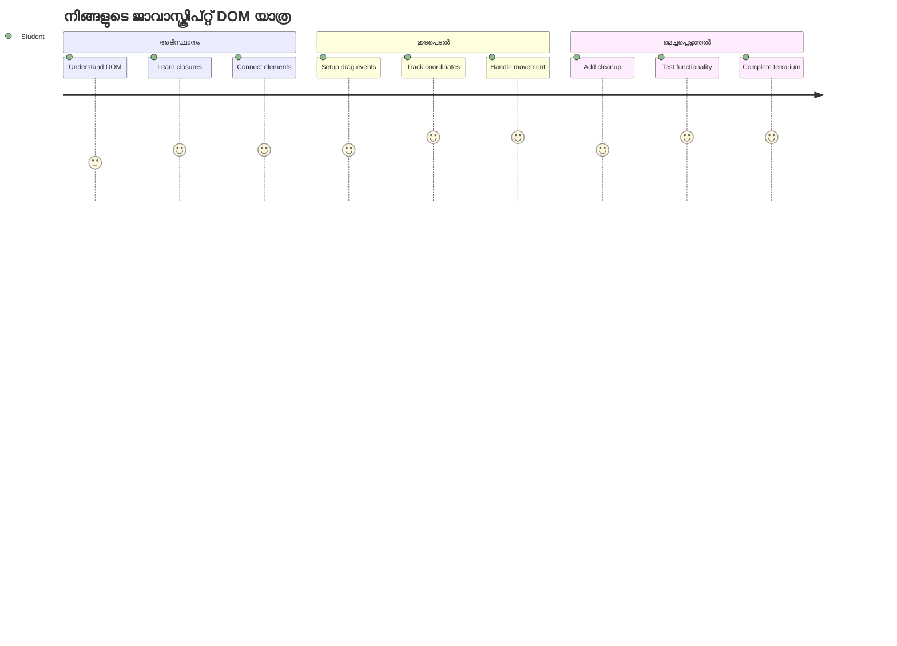
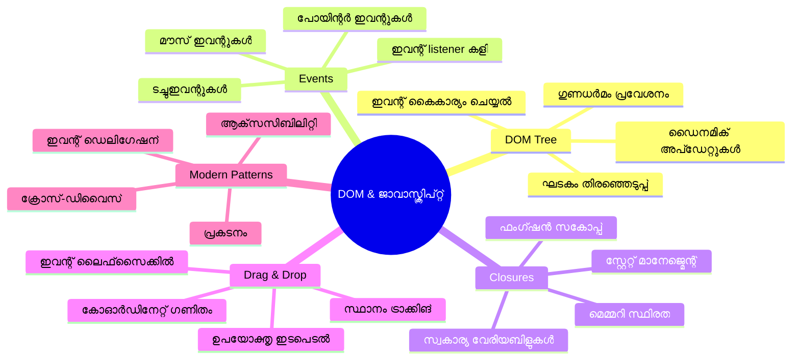
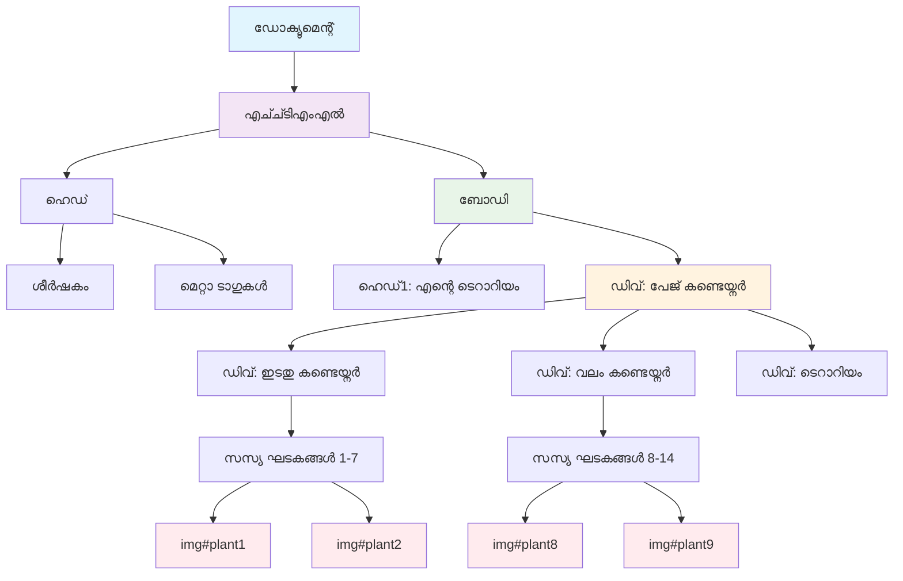
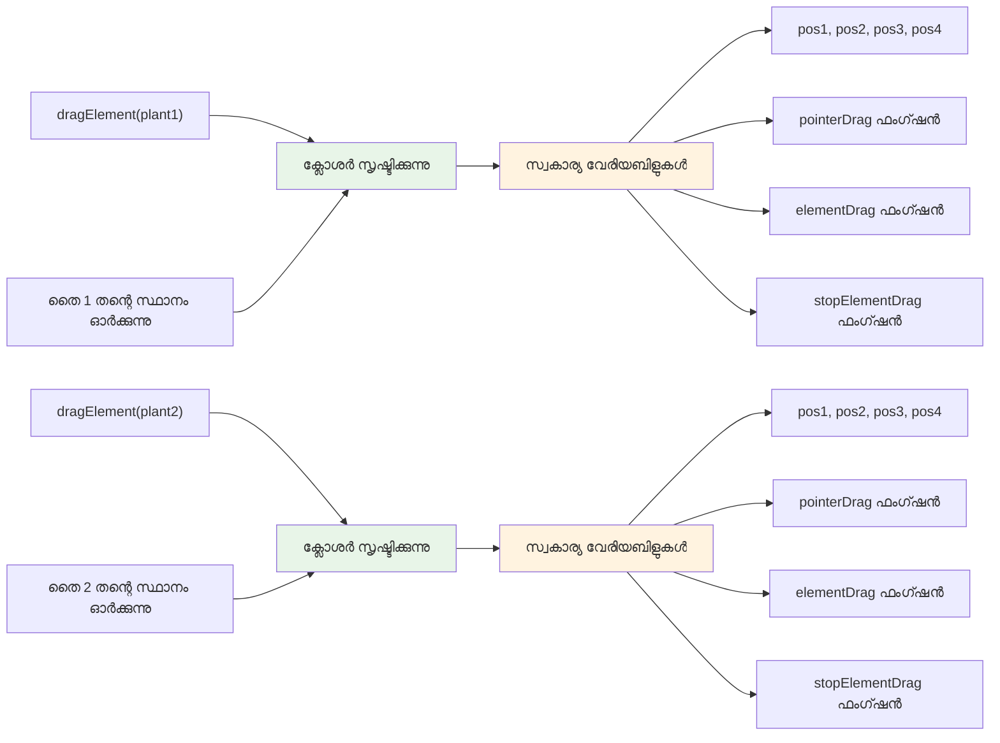
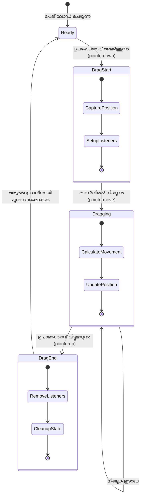
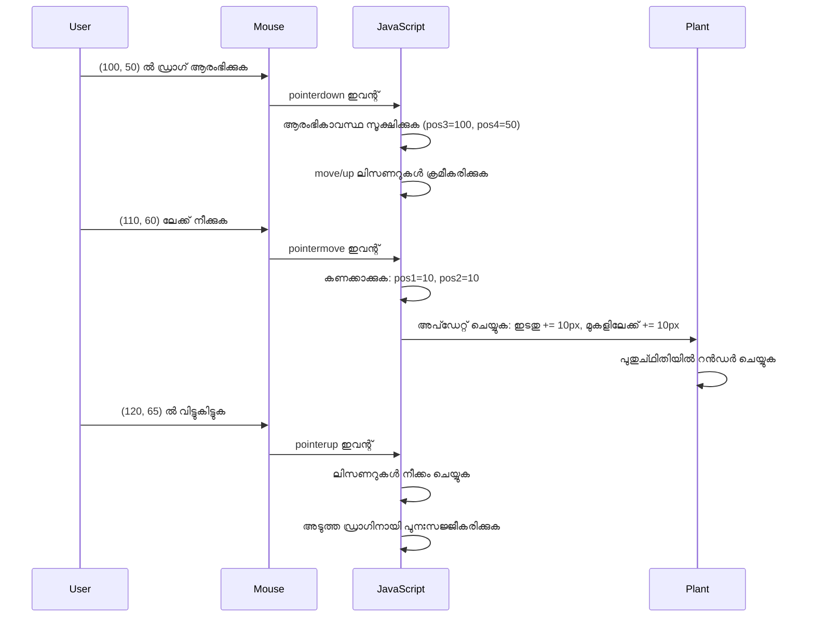
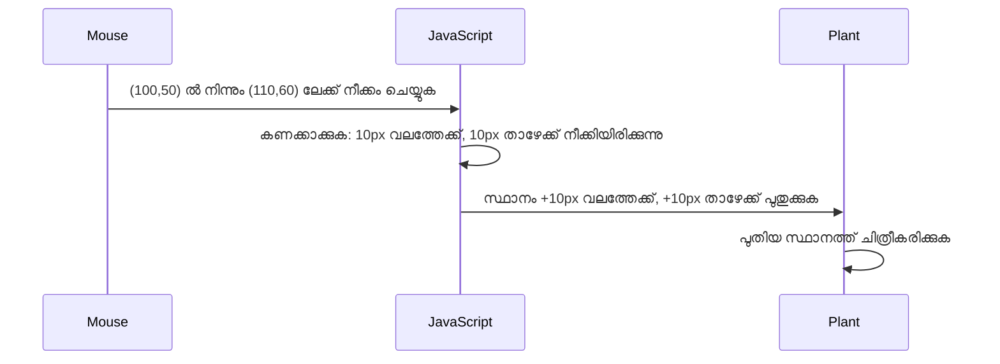
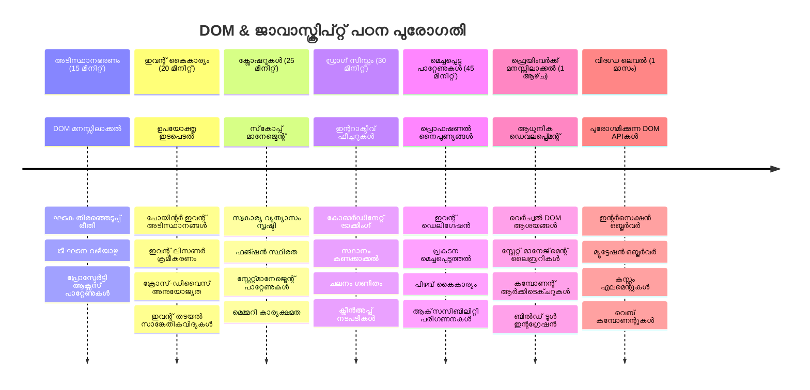

<!--
CO_OP_TRANSLATOR_METADATA:
{
  "original_hash": "973e48ad87d67bf5bb819746c9f8e302",
  "translation_date": "2026-01-08T18:58:02+00:00",
  "source_file": "3-terrarium/3-intro-to-DOM-and-closures/README.md",
  "language_code": "ml"
}
-->
# ടെറാരിയം പ്രോജക്ട് ഭാഗം 3: DOM മാനിപ്പുലേഷൻയും ജാവാസ്ക്രിപ്റ്റ് ക്ലോസറുകളും



> സ്കെച്ച് നോട്ടു [Tomomi Imura](https://twitter.com/girlie_mac) എഴുതിയത്

വെബ് ഡെവലപ്പ്മെന്റിന്റെ ഏറ്റവും ആകർഷകമായ ഭാഗങ്ങളിൽ ഒന്നിലേക്ക് സ്വാഗതം - ഇന്ററാക്ടീവ് ചെയ്യുന്നത്! ഡോക്യുമെന്റ് ഒബ്ജക്ട് മോഡൽ (DOM) നിങ്ങളുടെ HTML നും ജാവാസ്ക്രിപ്റ്റിനും ഇടയിലുള്ള ഒരു പാലമുപോലെയാണ്, ഇങ്ങനെ ഇന്ന് നിങ്ങളുടേ ടെറാരിയം ജീവിപ്പിക്കാൻ നാം ഇത് ഉപയോഗിക്കാം. ടിം ബേണേഴ്സ്-ലി ആദ്യ വെബ് ബ്രൗസർ സൃഷ്ടിച്ചതിനു ശേഷം, ഡോക്യുമെന്റുകൾ ഡൈനാമിക് ആയും ഇന്ററാക്ടീവ് ആയും ഉണ്ടാകുമെന്ന് വിചാരിച്ചിരുന്നു - DOM ആ വിചാരത്തെ സാധ്യമാക്കുന്നു.

നാം കൂടാതെ ജാവാസ്ക്രിപ്റ്റ് ക്ലോസറുകൾ പരിശോധിക്കും, തുടക്കത്തിൽ ഇതു ഭീഷണിപ്പെടുത്തുംപോലെയാണ് തോന്നുക. ക്ലോസറുകൾ "മെമ്മറി പോക്കറ്റുകൾ" സൃഷ്ടിക്കുന്നതാണ്, നിങ്ങളുടെ ഫംഗ്ഷനുകൾ പ്രധാന വിവരങ്ങൾ ഓർക്കാൻ കഴിയുന്ന ഒരു സങ്കൽപ്പം. ഇത് നിങ്ങളുടെ ടെറാരിയത്തിലുള്ള ഓരോ സസ്യത്തിനും സ്വതന്ത്രമായി അവയുടെ സ്ഥാനം ട്രാക്ക് ചെയ്യാൻ ഉള്ള ഡാറ്റ റെക്കോർഡുകൾ ഉണ്ടായിരിക്കുന്നതുപോലെ ആണെന്ന് കരുതാം. ഈ പാഠത്തിന്റെ സമാപനത്തിൽ, നിങ്ങൾ ഇവ എത്രത്തോളം സ്വാഭാവികവും പ്രയോജനകരവും ആണെന്ന് മനസിലാക്കും.

നാം നിർമ്മിക്കുന്നത്: ഉപഭോക്താക്കൾ സസ്യങ്ങളെ എവിടെയും ഡ്രാഗ് ആന്റ് ഡ്രോപ്പ് ചെയ്യാനാകുന്ന ഒരു ടെറാരിയം. എല്ലാ ഡ്രാഗ് ആന്റ് ഡ്രോപ്പ് ഫയൽ അപ്‌ലോഡുകളും ഇന്ററാക്ടീവ് ഗെയിമുകളും പ്രവർത്തിപ്പിക്കുന്ന DOM മാനിപ്പുലേഷൻ സാങ്കേതികവിദ്യ നിങ്ങൾക്ക് പഠിക്കാം. നിങ്ങളുടെ ടെറാരിയത്തെ ജീവിപ്പിക്കാം.


## പ്രീലക്ചർ ക്വിസ്

[പ്രീലക്ചർ ക്വിസ്](https://ff-quizzes.netlify.app/web/quiz/19)

## DOM മനസ്സിലാക്കൽ: ഇന്ററാക്ടീവ് വെബ് പേജുകളിലേക്ക് നിങ്ങളുടെ കവാടം

ഡോക്യുമെന്റ് ഒബ്ജക്ട് മോഡൽ (DOM) ജാവാസ്ക്രിപ്റ്റ് നിങ്ങളുടെ HTML ഘടകങ്ങളുമായി സംവദിക്കുന്ന രീതിയാണ്. നിങ്ങളുടെ ബ്രൗസർ ഒരു HTML പേജ് ലോഡ് ചെയ്യുന്നപ്പോൾ, അത് ആ പേജിന്റെ ഘടനയുള്ള പ്രതിനിധാനം മെമ്മറിയിൽ സൃഷ്ടിക്കുന്നു - അതാണ് DOM. ഇത് ഒരു കുടുംബ വൃക്ഷം പോലെയാണ് കരുതുക, ശാസ്ത്രീയമായി ഓരോ HTML ഘടകവും ഒരു കുടുംബ അംഗമായി കാണുക, ജാവാസ്ക്രിപ്റ്റ് ആ ഘടകത്തെ ആക്‌സസ് ചെയ്തു, മാറ്റം വരുത്തി, പുനഃക്രമീകരിക്കാമെന്ന്.

DOM മാനിപ്പുലേഷൻ സ്റ്റാറ്റിക് പേജുകൾ ഇന്ററാക്ടീവ് വെബ്‌സൈറ്റുകളാക്കുന്നു. നിങ്ങൾ കാണുന്ന ഒരിക്കൽ ബട്ടൺ ഹോവറിൽ നിറം മാറുന്നത്, പേജിന്റെ റിഫ്രഷ് കൂടാതെ ഉള്ളടക്കം അപ്‌ഡേറ്റ് ചെയ്യുന്നത്, അല്ലെങ്കിൽ നിങ്ങൾക്ക് ഘടകങ്ങൾ ഡ്രാഗ് ചെയ്യാൻ കഴിയുന്നത് ഇതിന്റെ ഉദാഹരണങ്ങളാണ്.




> DOM ഉം അതിലെ HTML മാർക്കപ് നമ്മളിത് കാണിക്കുന്ന വിധം. [Olfa Nasraoui](https://www.researchgate.net/publication/221417012_Profile-Based_Focused_Crawler_for_Social_Media-Sharing_Websites) നൽകിയത്

**DOM പ്രയോജനകരമാക്കുന്ന കാര്യങ്ങൾ:**
- **ഒരുപാട്** ഘടകങ്ങളിൽ നിന്ന് ഉപാധികൾ എളുപ്പത്തിൽ ലഭ്യമാക്കുന്നു
- **ഇടയ്ക്കുള്ള** പേജിന്റെ റിഫ്രഷ് ഇല്ലാതെ ഉള്ളടക്കം പുതുക്കലുകൾ സാധ്യമാക്കുന്നു
- **ഉപഭോക്തൃ** സഹായ മതികൾക്ക് റിയൽ-ടൈം പ്രതികരണം അനുവദിക്കുന്നു
- **ആധുനിക** ഇന്ററാക്ടീവ് വെബ് അപ്ലിക്കേഷനുകൾക്കുള്ള അടിസ്ഥാന നിർമ്മിക്കുന്നു

## ജാവാസ്ക്രിപ്റ്റ് ക്ലോസറുകൾ: ക്രമീകരിച്ച, ശക്തമായ കോഡ് സൃഷ്ടിക്കൽ

ഒരു [ജാവാസ്ക്രിപ്റ്റ് ക്ലോസർ](https://developer.mozilla.org/docs/Web/JavaScript/Closures) ഒരു ഫംഗ്ഷനിനുവേണ്ടി സ്വന്തം സ്വകാര്യ വർക്ക്‌സ്പേസ് persistent മെമ്മറിയോടെ നൽകുന്നതുപോലെയാണ്. ഗാലാപഗോസ് ദ്വീപുകളിലെ ഡാർവിന്റെ ഫിഞ്ചുകൾ ഓരോന്നും പ്രത്യേക പരിസ്ഥിതി അടിസ്ഥാനത്തിലാണ് പ്രത്യേക തത്വ സൃഷ്ടിച്ചിരിക്കുന്നത് എന്ന രീതിയിൽ ക്ലോസറുകൾ പ്രവർത്തിക്കുന്നു; അവ സ്വന്തമായ സങ്കേതം "ഓർമ്മ" വയ്ക്കുന്നു, മാതൃക ഫംഗ്ഷൻ പൂർത്തിയാക്കിയ ശേഷവും.

നമ്മുടെ ടെറാരിയത്തിൽ, ക്ലോസറുകൾ ഓരോ സസ്യത്തിനും സ്വതന്ത്രമായി അവയുടെ സ്ഥാനം ഓർക്കാൻ സഹായിക്കുന്നു. ഇത് ജാവാസ്ക്രിപ്റ്റ് പ്രൊഫഷണൽ ഡെവലപ്പ്മെന്റിൽ ഇടക്ക് ഇടക്ക് കാണപ്പെടുന്ന വലിയ ആശയമാണ്, അതിനാൽ ഇത് മനസ്സിലാക്കാം.


> 💡 **ക്ലോസറുകൾ മനസ്സിലാക്കൽ**: ക്ലോസറുകൾ ജാവാസ്ക്രിപ്റ്റിൽ പ്രധാന വിഷയം ആണ്, പല ഡെവലപ്പർമാർ ഇത് തങ്ങളുടെ കരുത്തിലും കാലയളവിലും ഉപയോഗിക്കുമ്പോഴും അതിന്റെ സാക്ഷര理论 പൂർണ്ണമായി മനസ്സിലാക്കാറില്ല. ഇന്ന് നാം പ്രായോഗിക പ്രയോഗത്തിൽ ശ്രദ്ധിക്കുകയാണ - നിങ്ങൾ നമ്മുടെ ഇന്ററാക്ടീവ് ഫീച്ചറുകൾ നിർമ്മിക്കുന്നപ്പോൾ ക്ലോസറുകൾ സ്വാഭാവികമായി തെളിയുമ്പോൾ മനസ്സിലാക്കും.


> DOM ഉം അതിലെ HTML മാർക്കപ് നമ്മളിത് കാണിക്കുന്നത്. [Olfa Nasraoui](https://www.researchgate.net/publication/221417012_Profile-Based_Focused_Crawler_for_Social_Media-Sharing_Websites) നൽകിയത്

ഈ പാഠത്തിൽ, പേജിലെ സസ്യങ്ങളെ നിയന്ത്രിക്കാനുള്ള ജാവാസ്ക്രിപ്റ്റ് സൃഷ്ടിച്ച് നമ്മുടെ ഇന്ററാക്ടീവ് ടെറാരിയം പ്രോജക്ട് പൂർത്തിയാക്കും.

## തുടങ്ങുന്നതിനു മുമ്പ്: വിജയത്തിനുള്ള സജ്ജീകരണം

മുൻ ടെറാരിയം പാഠങ്ങളിൽ നിന്നുള്ള നിങ്ങൾക്കു ഉള്ള HTML, CSS ഫയലുകൾ നിങ്ങൾക്ക് വേണം - നമുക്ക് ആ സ്റ്റാറ്റിക് ഡിസൈൻ ഇന്ററാക്ടീവാക്കാനായി. ആദ്യത്തവണ ചേരുന്നവർക്ക് ആ പാഠങ്ങൾ ആദ്യം പൂർത്തിയാക്കണം, അത് പ്രധാന സന്ധർഭം നൽകും.

നാം നിർമ്മിക്കുന്നത്:
- **രചന സാധാരണമായ** ടെറാരിയത്തിലെ എല്ലാ സസ്യങ്ങൾക്കും ഡ്രാഗ് ആന്റ് ഡ്രോപ്പ്
- **കോ-ഓർഡിനേറ്റ് ട്രാക്കിംഗ്** സസ്യങ്ങൾ അവയുടെ സ്ഥാനം ഓർക്കാൻ
- **വാനില ജാവാസ്ക്രിപ്റ്റ്** ഉപയോഗിച്ച് പൂർണ ഇന്ററാക്ടീവ് ഇന്റർഫേസ്
- **ക്ലീനും ക്രമവൃത്തിയുള്ള** കോഡ് ക്ലോസർ മാതൃകകൾ ഉപയോഗിച്ച്

## നിങ്ങളുടെ ജാവാസ്ക്രിപ്റ്റ് ഫയൽ സജ്ജമാക്കൽ

നിങ്ങളുടെ ടെറാരിയം ഇന്ററാക്ടീവ് ആക്കാൻ ജാവാസ്ക്രിപ്റ്റ് ഫയൽ സൃഷ്ടിക്കാം.

**പടി 1: നിങ്ങളുടെ സ്ക്രിപ്റ്റ് ഫയൽ സൃഷ്ടിക്കുക**

നിങ്ങളുടെ ടെറാരിയം ഫോൾഡറിൽ പുതിയ ഫയൽ എന്ന് പേരില്ലാതെ `script.js` എന്ന പേരിൽ സൃഷ്ടിക്കുക.

**പടി 2: ജാവാസ്ക്രിപ്റ്റ് നിങ്ങളുടെ HTML-ലേക്ക് ലിങ്ക് ചെയ്യുക**

താങ്കളുടെ `index.html` ഫയലിന്റെ `<head>` സെക്ഷനിൽ താഴെ കൊടുത്തിരിക്കുന്ന സ്ക്രിപ്റ്റ് ടാഗ് ചേർക്കുക:

```html
<script src="./script.js" defer></script>
```

**`defer` ആട്രിബ്യൂട്ട് എന്തുകൊണ്ട് പ്രധാനമാണ്:**
- **എല്ലാ HTML ലോഡ് ആയി തീർന്നതിനുശേഷം** ജാവാസ്ക്രിപ്റ്റ് പ്രവർത്തിക്കാൻ ഉറപ്പാക്കുന്നു
- **ജാവാസ്ക്രിപ്റ്റ് സാധനങ്ങൾ വരുമ്പോൾ പിഴവ് വരാതിരിക്കാൻ** തടയുന്നു
- **എല്ലാ സസ്യ ആകൃതി കണക്ട് ചെയ്യുന്നതിനായി തയ്യാറാക്കി** ഉറപ്പ് നൽകുന്നു
- **സ്ക്രിപ്റ്റുകൾ പേജിന്റെ താഴെ ഇട്ടുകൊള്ളുന്നതിനെക്കാൾ മികച്ച പ്രകടനം നൽകുന്നു**

> ⚠️ **പ്രധാന കുറിപ്പ്**: `defer` ആട്രിബ്യൂട്ട് സാധാരണ സമയ നിയന്ത്രണ പ്രശ്നങ്ങൾ തടയും. ഇതില്ലാതെ, ജാവാസ്ക്രിപ്റ്റ് HTML ഘടകങ്ങൾ ലോഡ് ആയതിനു മുമ്പ് ആക്‌സസ് ചെയ്യാൻ ശ്രമിച്ച് പിഴവുകൾ ഉണ്ടാകും.

---

## ജാവാസ്ക്രിപ്റ്റ് നമ്മുടെ HTML ഘടകങ്ങളുമായി ബന്ധിപ്പിക്കൽ

ഘടകങ്ങളെ ഡ്രാഗ് ചെയ്യാവുന്നതാക്കും മുമ്പ്, ജാവാസ്ക്രിപ്റ്റ് അവ DOM-ൽ കണ്ടെത്തണം. ഇതിനെ ലൈബ്രറി കാറ്റലോഗ് സംവിധാനമായി കാണാം - നടത്തിവന്ന കാറ്റലോഗ് നമ്പറുടെ സഹായത്തോടെ നിങ്ങൾക്ക് ആ കൃത്യമായ പുസ്തകം കണ്ടെത്താനും അതിന്റെ ഉള്ളടക്കം ആക്‌സസ് ചെയ്യാനും കഴിയും.

നാം ഇത് നടത്താൻ `document.getElementById()` എന്ന രീതിയാണ് ഉപയോഗിക്കുന്നത്. ഇത് കൃത്യമായ ഫയലിംഗ് സംവിധാനം പോലെയാണ് - നിങ്ങൾ ഒരു ID നൽകുമ്പോൾ അതിനെ DOM-യിൽ നിന്ന് കൃത്യമായി കണ്ടെത്തും.

### എല്ലാ സസ്യങ്ങൾക്കും ഡ്രാഗ് ഫംഗ്ഷനാലിറ്റി സജ്ജമാക്കൽ

താങ്കളുടെ `script.js` ഫയലിൽ താഴെത്തന്നെ കൊടുത്തിരിക്കുന്ന കോഡ് ചേർക്കുക:

```javascript
// എല്ലാ 14 സസ്യങ്ങൾക്കും ഡ്രാഗ് പ്രവർത്തനം സജ്ജമാക്കുക
dragElement(document.getElementById('plant1'));
dragElement(document.getElementById('plant2'));
dragElement(document.getElementById('plant3'));
dragElement(document.getElementById('plant4'));
dragElement(document.getElementById('plant5'));
dragElement(document.getElementById('plant6'));
dragElement(document.getElementById('plant7'));
dragElement(document.getElementById('plant8'));
dragElement(document.getElementById('plant9'));
dragElement(document.getElementById('plant10'));
dragElement(document.getElementById('plant11'));
dragElement(document.getElementById('plant12'));
dragElement(document.getElementById('plant13'));
dragElement(document.getElementById('plant14'));
```

**ഈ കോഡ് ചെയ്യുന്നത്:**
- **ഓരോ സസ്യ ഘടകവും DOM-ൽ അതിന്റെ പ്രത്യേക ID ഉപയോഗിച്ച് കണ്ടെത്തുന്നു**
- **ഓരോ HTML ഘടകത്തിന്റെയും ജാവാസ്ക്രിപ്റ്റ് റഫറൻസ് നേടുന്നു**
- **ഓരോ ഘടകത്തെയും `dragElement` ഫംഗ്ഷനിലേക്ക് പാസ്സ് ചെയ്യുന്നു (ഇത് നമുക്ക് പിന്നീട് സൃഷ്ടിക്കാം)**
- **എല്ലാ സസ്യങ്ങൾക്കും ഡ്രാഗ്-ആൻഡ്-ഡ്രോപ്പ് സജ്ജമാക്കുന്നു**
- **HTML ഘടനയെ ജാവാസ്ക്രിപ്റ്റ് ഫംഗ്ഷനാലിറ്റിക്കുമായി ബന്ധിപ്പിക്കുന്നു**

> 🎯 **അടയാളം ഉപയോഗിക്കാനുള്ള കാരണം:** IDs ഓരോ ഘടകത്തിനും അംഗീകൃതമായ പലവ്യക്തമാണ്, CSS ക്ലാസുകൾ സ്റ്റൈലിങ്ങിന്റെ കാര്യത്തിൽ കൂട്ടങ്ങളായുള്ള ഘടകങ്ങൾക്കായി രൂപകല്‍പ്പന ചെയ്തതാണ്. ജാവാസ്ക്രിപ്റ്റിന്റെ കാര്യത്തിൽ വ്യക്തിഗത ഘടകത്തെ മാനിപ്പുലേറ്റ് ചെയ്യേണ്ടപ്പോൾ, IDs വേണ്ടിതന്നെയാണ്.

> 💡 **പ്രൊ ടിപ്പ്**: നിങ്ങൾ കാണുന്ന പോലെ, ഓരോ സസ്യത്തിനും `dragElement()` സ്വതന്ത്രമായി പ്രയോഗിക്കുന്നത്, ഓരോ സസ്യത്തിനും വേറിട്ട ഡ്രാഗിംഗ് പെരുമാറ്റം ഉറപ്പാക്കുന്നു, ഇത് ഉപയോഗിക്കുന്നവർക്ക് സുഗമമായ അനുഭവം നൽകാൻ അനിവാര്യമാണ്.

### 🔄 **പാഠം പരിശോധിക്കൽ**
**DOM ബന്ധം മനസ്സിലാക്കൽ**: ഡ്രാഗ് ഫംഗ്ഷനാലിറ്റിയിലേക്ക് താഴെ കടക്കുന്നതിന് മുൻപ് എളുപ്പത്തിൽ മനസ്സിലാക്കുക:
- ✅ `document.getElementById()` എങ്ങനെ HTML ഘടകങ്ങൾ കണ്ടെത്തുന്നു വിശദീകരിക്കാം
- ✅ ഓരോ സസ്യത്തിനും നാം എങ്ങനെയാണ് പ്രത്യേക IDs ഉപയോഗിക്കുന്നത് മനസ്സിലാക്കുക
- ✅ സ്ക്രിപ്റ്റ് ടാഗുകളുടെ `defer` ആട്രിബ്യൂട്ടിന്റെ പ്രാധാന്യം അറിയുക
- ✅ ജാവാസ്ക്രിപ്റ്റും HTML DOM വഴി എങ്ങിനെയാണ് ബന്ധപ്പെടുന്നത് മനസ്സിലാക്കുക

**സ്വയം പരീക്ഷണം:** രണ്ട് ഘടകങ്ങൾക്ക് ഒരേ ID എങ്കിൽ എന്ത് സംഭവിക്കും? `getElementById()` എത്ര ഘടകം വീണ്ടെടുക്കും?  
*ഉത്തരം: IDs പ്രത്യേകമായിരിക്കണം; ആവർത്തിച്ചാൽ, ആദ്യം കണ്ട ഘടകം മാത്രം തിരിച്ചുകിട്ടും*

---

## ഡ്രാഗ് എലമെന്റ് ക്ലോസർ നിർമ്മിക്കൽ

ഇപ്പൊഴാണ് നമ്മുടെ ഡ്രാഗിംഗ് ഫംഗ്ഷനാലിറ്റിക്ക് ഹൃദയം സൃഷ്ടിക്കുന്നത്: ഓരോ സസ്യത്തിനും വേണ്ടി ഡ്രാഗിംഗ് പെരുമാറ്റം നിയന്ത്രിക്കുന്ന ക്ലോസർ. ഈ ക്ലോസറിൽ മൾട്ടിപ്പിള്‍ اندر ഫംഗ്ഷൻസ് ഉണ്ടാകും, അവ ചേർന്ന് മൗസ് ചലനങ്ങൾ അനുഗമിച്ച് ഘടകങ്ങളിലെ സ്ഥാനം പുതുക്കും.

ക്ലോസറുകൾ ഈ ടാസ്കിന് അത്രയ്ക്ക് അനുയോജ്യമാണ്, കാരണം ഇവ "സ്വകാര്യ" വേരിയബിളുകൾ സൃഷ്ടിച്ച് ഫംഗ്ഷൻ കോളുകൾക്കിടയിൽ ജൈവികമായി അവ നിലനിൽക്കാൻ ഇടയാക്കുന്നു, അപ്പോഴേക്കും ഓരോ സസ്യത്തിനും സ്വതന്ത്രമായ കോ-ഓർഡിനേറ്റ് ട്രാക്കിംഗ് ഉണ്ട്.

### ഒരു ലളിതമായ ഉദാഹരണത്തോടെ ക്ലോസറുകൾ മനസ്സിലാക്കൽ

ക്ലോസറുകളുടെ ആശയം വ്യക്തമാക്കാൻ ഒരു ലളിതമായ ഉദാഹരണം:

```javascript
function createCounter() {
    let count = 0; // ഇത് ഒരു സ്വകാര്യ വ്യത്യാസം പോലെയാണ്
    
    function increment() {
        count++; // ആന്തരിക ഫംഗ്ഷൻ പുറം വേരിയബിള്‍ ഓർത്തിരിക്കുന്നു
        return count;
    }
    
    return increment; // നാം ആന്തരിക ഫംഗ്ഷൻ തിരിച്ചുകൊടുക്കുന്നു
}

const myCounter = createCounter();
console.log(myCounter()); // 1
console.log(myCounter()); // 2
```

**ഈ ക്ലോസർ മാതൃകയിൽ നടക്കുന്നത്:**
- **സ്വകാര്യമായ `count` വേരിയബിൾ സൃഷ്ടിക്കുന്നു, ഇത് ക്ലോസർ ഇനറിലെ മാത്രമേ ഉള്ളൂ**
- **ഇനറിലെ ഫംഗ്ഷൻ ആ ഔട്ടർ വേരിയബിൾ ആക്‌സസ് ചെയ്തു മാറ്റാനും കഴിയും (ക്ലോസർ മെക്കാനിസം)**
- **നാം ഇനറിലെ ഫംഗ്ഷൻ റിട്ടേൺ ചെയ്യുന്നപ്പോൾ, അതിന്റെ പ്രൈവറ്റ് ഡാറ്റയുമായി ബന്ധം നിലനിൽക്കുന്നു**
- **`createCounter()` ഫംഗ്ഷൻ പൂർത്തിയായാലും `count` നിലനിൽക്കുകയും അതിന്റെ മൂല്യം ഓർക്കുകയും ചെയ്യുന്നു**

### എന്തുകൊണ്ട് ക്ലോസറുകൾ ഡ്രാഗ് ഫംഗ്ഷനാലിറ്റിക്ക് അനുയോജ്യമാണ്

നമ്മുടെ ടെറാരിയത്തിൽ, ഓരോ സസ്യവും പ്രത്യേകം ശരിയായ സ്ഥാനം കോ-ഓർഡിനേറ്റുകൾ ഓർക്കണം. ക്ലോസറുകൾ നിങ്ങൾക്കായി ഇതു പൂർണമായ പരിഹാരമാണ്:

**പ്രോജക്ടിന് പ്രധാനം:**
- **ഓരോ സസ്യത്തിനും സ്വകാര്യ സ്ഥാന വേരിയബിളുകൾ സൂക്ഷിക്കുന്നു സ്വതന്ത്രമായി**
- **ഡ്രാഗ് ഇവന്റുകൾക്കിടയിൽ കോ-ഓർഡിനേറ്റ് ഡാറ്റ നിലനിർത്തുന്നു**
- **വ്യത്യസ്ത ഡ്രാഗ്ഗബിൾ ഘടകങ്ങളുടെ ഇടയിൽ വേരിയബിൾ കലക്കലുകൾ തടയുന്നു**
- **ക്ലീനും ക്രമവുമായ കോഡ് ഘടന സൃഷ്ടിക്കുന്നു**

> 🎯 **പഠന ലക്ഷ്യം**: ഇപ്പോൾ ക്ലോസറുകളുടെ എല്ലാ ഭാഗങ്ങളും നിപുണത കൈവരിക്കേണ്ടതില്ല. അവ എങ്ങനെ നമുക്ക് കോഡ് ക്രമീകരിക്കുകയും ഡ്രാഗിംഗ് സ്റ്റേറ്റ് നിലനിർത്തുകയും ചെയ്യുന്നതെന്ന് ശ്രദ്ധിക്കുക.


### dragElement ഫംഗ്ഷൻ സൃഷ്ടിക്കൽ

ഇപ്പോൾ എല്ലാ ഡ്രാഗിംഗ് ലാജിക് കൈകാര്യം ചെയ്യുന്ന പ്രധാന ഫംഗ്ഷൻ നിർമ്മിക്കാം. സസ്യങ്ങളുടെ ഘടകങ്ങളുടെ വൃത്താന്തങ്ങൾക്കു താഴെ ഈ ഫംഗ്ഷൻ ചേർക്കുക:

```javascript
function dragElement(terrariumElement) {
    // സ്ഥാനത്തെ പ-tracking ഇനം തുടങ്ങിയെടുത്തു
    let pos1 = 0,  // മുമ്പത്തെ മൗസ് X സ്ഥലം
        pos2 = 0,  // മുമ്പത്തെ മൗസ് Y സ്ഥലം
        pos3 = 0,  // നിലവിലെ മൗസ് X സ്ഥലം
        pos4 = 0;  // നിലവിലെ മൗസ് Y സ്ഥലം
    
    // പ്രാഥമിക ഡ്രാഗ് ഇവന്റ് ശ്രുതിസ്‌ഥാപനം നടത്തുക
    terrariumElement.onpointerdown = pointerDrag;
}
```

**സ്ഥിതി ട്രാക്കിംഗ് സിസ്റ്റം മനസ്സിലാക്കൽ:**
- **`pos1` & `pos2`**: പഴയ മൗസ് സ്ഥിതിയും പുതിയ സ്ഥിതിയും തമ്മിലുള്ള വ്യത്യാസം സൂക്ഷിക്കുന്നു
- **`pos3` & `pos4`**: നിലവിലെ മൗസ് കോ-ഓർഡിനേറ്റുകൾ ട്രാക്ക് ചെയ്യുന്നു
- **`terrariumElement`**: നാം ഡ്രാഗ് ആക്കാൻ പോകുന്ന പ്രത്യേക സസ്യ ഘടകം
- **`onpointerdown`**: ഉപയോക്താവ് ഡ്രാഗ് തുടങ്ങുമ്പോൾ സൃഷ്ടിക്കുന്ന ഇവന്റ്

**ക്ലോസർ മാതൃക ഇങ്ങനെ പ്രവർത്തിക്കുന്നു:**
- **ഓരോ സസ്യ ഘടകത്തിനും സ്വകാര്യ സ്ഥാനം വേരിയബിളുകൾ സൃഷ്ടിക്കുന്നു**
- **ഡ്രാഗിംഗ് ലൈഫ് സൈക്കിൾ മുഴുവൻ ഈ വേരിയബിളുകൾ നിലനിർത്തുന്നു**
- **ഓരോ സസ്യവും സ്വതന്ത്രമായി അവയുടെ കോ-ഓർഡിനേറ്റുകൾ ട്രാക്ക് ചെയ്യുന്നു**
- **`dragElement` ഫംഗ്ഷന്റെ മുഖാന്തിരം ക്ലീനായും സുലഭമായും സൗകര്യം നൽകുന്നു**

### pointerevents ഉപയോഗിക്കുന്നതിന്റെ കാരണം

നിങ്ങൾക്ക് `onclick`-നെക്കാൾ `onpointerdown` ഉപയോഗിക്കുന്നതിന്റെ കാരണമറിയാമോ? കാരണം ഇതാ:

| ഇവന്റ് തരം | അനുയോജ്യമായ ഉപയോഗം | അതിന്റെ കുറവ് |
|------------|----------|-------------|
| `onclick` | ലഘു ബട്ടൺ ക്ലിക്കുകൾ | ഡ്രാഗിംഗ് കൈകാര്യം ചെയ്യില്ല (ക്ലിക്ക് - റിലീസ് മാത്രം) |
| `onpointerdown` | മൗസ്, ടച്ച് എന്നിങ്ങനെ രണ്ട് വിഭാഗത്തിലും | പുതിയ ഒപ്പം കൃത്യമായ പിന്തുണയുള്ളത് |
| `onmousedown` | ഡെസ്ക്ടോപ്പ് മൗസ് മാത്രം | മൊബൈൽ ഉപയോക്താക്കളെ ഒഴിഞ്‌ക്കുന്നു |

**pointerevents നമുക്ക് അനുയോജ്യമായത്:**
- **മൗസ്, വിരൽ, സ്റ്റൈലസ് എല്ലാം ഇവിടെ കാര്യക്ഷമമായി പ്രവർത്തിക്കുന്നു**
- **ലാപ്‌ടോപ്പ്, ടാബ്‌ലെറ്റ്, ഫോണിൽ ഒരുപോലെ അനുഭവം നൽകുന്നു**
- **ക്ലിക്ക് അതേസമയം സഞ്ചാരമുണ്ടല്ലോ, അതിനെയാണ് ശരിയായി കൈകാര്യം ചെയ്യുന്നത്**
- **ഉപഭോക്താക്കൾ പ്രതീക്ഷിക്കുന്ന മൃദുവായ അനുഭവം സൃഷ്ടിക്കുന്നു**

> 💡 **ഭാവിയിൽ സുരക്ഷിതമാക്കിയെടുക്കൽ**: pointerevents ഏറ്റവും പുതിയ ഉപയോക്തൃ ഇടപെടല്‍ കൈകാര്യം ചെയ്യൽ രീതിയാണ്. മൗസ്, ടച്ച് നമുക്ക് വേർതിരിക്കുക അവശ്യമായില്ല, രണ്ടിനും ഒരേസമയം പിന്തുണ ലഭിക്കുന്നു. അതേ സമയം കുറ്റമറ്റതാണ്.

### 🔄 **പാഠം പരിശോധിക്കൽ**
**ഇവന്റ് കൈക്കൊള്ളൽ മനസ്സിലാക്കൽ**: ഇവന്റുകൾക്കു പറ്റിയുള്ള അറിവ് പരിശോധിക്കുക:
- ✅ pointerevents ഉപയോഗിക്കുന്നത് mouse events പകരം എന്തുകൊണ്ട്?
- ✅ ക്ലോസറിലെ വേരിയബിളുകൾ ഫംഗ്ഷൻ കോളുകൾക്കിടയിൽ എങ്ങനെ നിലനിർത്തുന്നു?
- ✅ smooth dragging-നുള്ള `preventDefault()` ന്റെ ജോലി എന്താണ്?
- ✅ പ്രത്യേക ഘടകങ്ങൾക്കുപകരം ചരിത്രത്തിലെ പേജ് ഡോക്യുമെന്റിൽ listeners എന്തുകൊണ്ട് ചേർക്കുന്നു?

**യഥാർഥ അനുഭവം:** നിങ്ങളുടെ ദിവസേന ഉപയോഗിക്കുന്ന ഡ്രാഗ് ആൻഡ് ഡ്രോപ്പ് ഇന്റർഫേസുകൾ വിശകലനം ചെയ്യുക:
- **ഫയൽ അപ്‌ലോഡുകൾ:** ഫയലുകൾ ബ്രൗസർ പരിശോധകനിൽ വലിച്ച് വിടുക
- **കന്ബാൻ ബോർഡ്:** ടാസ്കുകൾ കോളങ്ങളിലിടംമാറ്റൽ
- **ഇമേജ് ഗാലറികൾ:** ഫോട്ടോ ക്രമത്തിൽ മാറ്റം വരുത്തൽ
- **മൊബൈൽ ഇന്റർഫേസുകൾ:** ടച്ച് സ്ക്രീനുകളിൽ സ്വൈപ്പ്, ഡ്രാഗ് ചെയ്യൽ

---

## pointerDrag ഫംഗ്ഷൻ: ഡ്രാഗിന്റെ ആരംഭം ക്യാച്ച് ചെയ്യൽ

ഒരു ഉപയോക്താവ് സസ്യത്തിലേക്ക് മൗസ് ക്ലിക്ക് അല്ലെങ്കിൽ വിരൽ ടച്ച് ചെയ്യുമ്പോൾ `pointerDrag` ഫംക്ഷൻ പ്രവർത്തനമാരംഭിക്കുന്നു. ഇത് ആദ്യം കോ-ഓർഡിനേറ്റുകൾ പിടിച്ചെടുത്ത് ഡ്രാഗിംഗ് സംവിധാനം സജ്ജമാക്കുന്നു.

`terrariumElement.onpointerdown = pointerDrag;` എന്ന പത്തിനുശേഷം നിങ്ങളുടെ `dragElement` ക്ലോസറിനുള്ളിൽ ഈ ഫംഗ്ഷൻ ചേർക്കുക:

```javascript
function pointerDrag(e) {
    // നിഗമനഡിഫോൾട്ട് ബ്രൗസർ പെരുമാറ്റം തടയുക (ഉദാഹരണം, ടെക്സ്റ്റ് തിരഞ്ഞെടുപ്പ്)
    e.preventDefault();
    
    // പ്രാരംഭ മൗസ്/ടച്ച് സ്ഥാനം പിടിക്കുക
    pos3 = e.clientX;  // ഡ്രാഗ് ആരംഭിച്ച X കോർഡിനേറ്റ്
    pos4 = e.clientY;  // ഡ്രാഗ് ആരംഭിച്ച Y കോർഡിനേറ്റ്
    
    // ഡ്രാഗിംഗ് പ്രക്രിയയ്ക്കായി ഇവന്റ് ലിസനറുകൾ സജ്ജീകരിക്കുക
    document.onpointermove = elementDrag;
    document.onpointerup = stopElementDrag;
}
```

**പടി പടിയായി സംഭവിക്കുന്നത്:**
- **ഡ്രാഗിംഗ് തടസ്സപ്പെടുത്തുന്ന സാധാരണ ബ്രൗസർ പെരുമാറ്റങ്ങൾ തടയുന്നു**
- **ഉപയോക്താവ് ഡ്രാഗ് തുടങ്ങിയ കൃത്യമായ സ്ഥിതികൾ റെക്കോർഡ് ചെയ്യുന്നു**
- **ബോധപൂർവ്വ ഡ്രാഗ് ചലനത്തിനുള്ള ഇവന്റ് ലിസ്റ്റനറുകൾ സജ്ജീകരിക്കുന്നു**
- **മൗസ്/ടച്ച് മാഫിയയിൽ മുഴുവൻ ഡോക്യുമെന്റിലും സഞ്ചാരം ട്രാക്കുചെയ്യാൻ സജ്ജമാക്കുന്നു**

### ഇവന്റ് പ്രതിരോധം മനസ്സിലാക്കൽ

`e.preventDefault()` വരി മൃദുവായി ഡ്രാഗ് നടത്തുന്നതിനായി അത്യാവശ്യമാണ്:

**പ്രതിരോധം ഇല്ലാതെയെങ്കിലോ ബ്രൗസറുകൾ:**
- **പേജിൽ ടെക്സ്റ്റ് സെലക്‌ട് ചെയ്യാൻ തുടങ്ങും**
- **കൺടെക്സ്റ്റ് മെനു റൈറ്റ് ക്ലിക്കിൽ ട്രിഗർ ചെയ്യാം**
- **നമ്മുടെ കസ്റ്റം ഡ്രാഗിംഗ് പെരുമാറ്റം തടസ്സപ്പെടും**
- **ഡ്രാഗ് ചെയ്യുമ്പോൾ ദൃശ്യമാന പിശകുകൾ വരാം**

> 🔍 ** പരീക്ഷണം**: ഈ പാഠം പൂർത്തിയായി കഴിഞ്ഞ് `e.preventDefault()` നീക്കം ചെയ്ത് ഡ്രാഗിംഗ് അനുഭവം പരിശോധിക്കുക. നിങ്ങൾക്ക് എത്ര അവശ്യമാണ് ഈ വരി ഉടനെ മനസ്സിലാകും!

### കോ-ഓർഡിനേറ്റ് ട്രാക്കിംഗ് സിസ്റ്റം

`e.clientX` ഉം `e.clientY` ഉം മൗസ്/ടച്ച് കൃത്യമായ കോ-ഓർഡിനേറ്റുകൾ നൽകുന്നു:

| പ്രോപ്പർട്ടി | ഇത് അളക്കുന്ന സ്ഥിതി | ഉപയോഗം |
|----------|------------------|----------|
| `clientX` | വീക്ഷണപാളിയിലെ പ്രതിഫലമായ ആഡംബരം അക്ഷാംശം | ഇടതുവലകുള്ള ചലനം ട്രാക്ക് ചെയ്യൽ |
| `clientY` | വീക്ഷണപാളിയിലെ പ്രതിഫലമായ നേർബന്ധം രേഖാംശം | മേൽ താഴെയുള്ള ചലനം ട്രാക്ക് ചെയ്യൽ |
**ഈ കോഓർഡിനേറ്റുകളെ അഭിരുചിപ്പെടുത്തൽ:**
- **നൽകുന്നു** പിക്‌സൽ-സൂക്ഷ്മമായ സ്ഥാനമിടിപ്പ് വിവരങ്ങൾ
- **പ്രവർത്തിക്കുന്നു** യഥാർത്ഥ സമയം ഉപയോക്താവ് അവരുടെ പോയിന്റർ നയിക്കുമ്പോൾ
- **നിലവാരം സൂക്ഷിക്കുന്നു** വ്യത്യസ്ത സ്ക്രീൻ വലിപ്പങ്ങളിലൂടെയും സൂം നിലവാരങ്ങളിലൂടെയും
- **സкത്സ്യപ്പെടുത്തുന്നു** മൃദുവായി, പ്രതികരണശീലമുള്ള ഡ്രാഗ് ഇടപാടുകൾ

### ഡോക്യുമെന്റ്-നിലവാര ഇവന്റ് ലിസണറുകൾ സജ്ജീകരിക്കൽ

പ്രമാണത്തിന്റെ മുഴുവൻ `document`-ലും move, stop ഇവന്റ്-കளை ഞങ്ങൾ എങ്ങനെ ചേര്ക്കുന്നതാണെന്ന് ശ്രദ്ധിക്കുക, മാത്രമല്ല പ്ലാൻ്റ് എലമെന്റിൽ മാത്രം പാലിക്കാറില്ല:

```javascript
document.onpointermove = elementDrag;
document.onpointerup = stopElementDrag;
```

**എന്തുകൊണ്ട് ഡോക്യുമെന്റിൽ ചേർക്കണം:**
- **തുടരുന്നു** പ്ലാൻ്റ് എലമെന്റ് വിട്ടപോവുമ്പോഴും ട്രാക്കിംഗ്
- **തേറ്റം തടയുന്നു** ഉപയോക്താവ് വേഗത്തിൽ നീങ്ങുമ്പോൾ ഡ്രാഗ് ഇടപാട് നിലക്കുന്നുവെന്നുണ്ടാകാതിരിക്കാൻ
- **നൽകുന്നു** തൊട്ട് അവസരം മുഴുവൻ സ്ക്രീനിൽ മൃദുവായ ഡ്രാഗ്
- **കൈകാര്യം ചെയ്യുന്നു** കേഴ്സർ ബ്രൗസർ വിൻഡോയ്ക്ക് പുറത്തേക്കു നീങ്ങുമ്പോൾ ഉണ്ടാകുന്ന വ്യത്യസ്ത സാഹചര്യങ്ങൾ

> ⚡ **പ്രകടന കുറിപ്പ്**: ഡ്രാഗിംഗ് അനേഭവിച്ചതിനു ശേഷം, മെമ്മറി ലീക്കുകളും പ്രകടന പ്രശ്‌നങ്ങളും ഒഴിവാക്കാൻ ഈ ഡോക്യുമെന്റ്-നിലവാര ലിസണറുകൾ നീക്കം ചെയ്യുന്നതാണ്.

## ഡ്രാഗ് സിസ്റ്റം പൂർണ്ണമാക്കൽ: മോഷണം, ക്ലീൻഅപ്പ്

ഇപ്പോൾ നാം രണ്ട് ശേഷിക്കുള്ള ഫങ്ഷനുകൾ ചേർക്കും, അവ യഥാർത്ഥ ഡ്രാഗിംഗ് മോഷണം കൈകാര്യം ചെയ്യുകയും ഡ്രാഗിങ് നിർത്തുമ്പോൾ ക്ലീൻഅപ്പ് നടത്തുകയും ചെയ്യും. ഈ ഫങ്ഷനുകൾ ചേർന്ന് നിങ്ങളുടെ ടെറേരിയം മുഴുവനും മൃദുവായി, പ്രതികരണശീലമുള്ള പ്ലാൻ്റ് മോഷണം സൃഷ്ടിക്കുന്നു.

### elementDrag ഫങ്ഷൻ: മോഷണ ട്രാക്കിംഗ്

`pointerDrag`-ന്റെ ക്ലോസിംഗ് കർളി ബ്രാക്കറ്റിനു ശേഷം `elementDrag` ഫങ്ഷൻ ചേർക്കുക:

```javascript
function elementDrag(e) {
    // കഴിഞ്ഞ സംഭവത്തിൽ നിന്നുള്ള മാറിയ ദൂരം കണക്കാക്കുക
    pos1 = pos3 - e.clientX;  // കൂനലറ്റമായ ദൂരം
    pos2 = pos4 - e.clientY;  // ലംബമായ ദൂരം
    
    // നിലവിലെ സ്ഥിതിസൂചന അപ്ഡേറ്റ് செய்யുക
    pos3 = e.clientX;  // പുതിയ നിലവിലെ X സ്ഥാനം
    pos4 = e.clientY;  // പുതിയ നിലവിലെ Y സ്ഥാനം
    
    // ഘടകത്തിന്റെ സ്ഥാനത്തേക്കുള്ള മാറൽ പ്രയോഗിക്കുക
    terrariumElement.style.top = (terrariumElement.offsetTop - pos2) + 'px';
    terrariumElement.style.left = (terrariumElement.offsetLeft - pos1) + 'px';
}
```

**കോഓർഡിനേറ്റ് ഗണിതശാസ്ത്രം മനസ്സിലാക്കൽ:**
- **`pos1` & `pos2`**: കഴിഞ്ഞ അപ്‌ഡേറ്റിനും താരതമ്യപ്പെടുത്തി ജനറേറ്റ് ചെയ്തത് എത്രമാത്രം മൈസ് നീങ്ങി എന്നത് കണക്കാക്കുന്നു
- **`pos3` & `pos4`**: അടുത്ത ഗണിതത്തിലെ കണക്കെടുപ്പിനായി നിലവിലെ മൈസ് സ്ഥാനം സൂക്ഷിക്കുന്നു
- **`offsetTop` & `offsetLeft`**: പേജിൽ എലമെന്റിന്റെ നിലവിലെ സ്ഥാനം നേടുന്നു
- **കുറയ്‌ക്കൽ ലാജിക്**: മൗസ് നീക്കിയ അളവിന് തുല്യമായി എലമെന്റ് നീക്കുന്നു


**ഇത് മോഷണ കണക്കെടുപ്പ് ആവിഷ്കാരം:**
1. **കൊടുക്കുന്നു** പഴയയും പുതിയ മൗസ് സ്ഥാനങ്ങൾക്കുള്ള വ്യത്യാസം
2. **കണക്കാക്കുന്നു** എലമെന്റ് എത്രത്തോളം നീക്കണം എന്നത് മൗസ് നീക്കത്തിന്റെ അടിസ്ഥാനത്തിൽ
3. **അപ്‌ഡേറ്റ് ചെയ്യുന്നു** എലമെന്റിന്റെ CSS സ്ഥാന സന്നദ്ധതകൾ യഥാർത്ഥ സമയത്ത്
4. **സൂക്ഷിക്കുന്നു** പുതിയ സ്ഥാനം അടുത്ത മോഷണ കണക്കെടുപ്പിന്റെ അടിസ്ഥാനമായി

### ഗണിതത്തിന്റെ ദൃശ്യപരമായി പ്രതിനിധാനം


### stopElementDrag ഫങ്ഷൻ: ക്ലീൻഅപ്പ്

`elementDrag`-ന്റെ ക്ലോസിംഗ് കർളി ബ്രാക്കറ്റിനു ശേഷം ക്ലീൻഅപ്പ് ഫങ്ഷൻ ചേർക്കുക:

```javascript
function stopElementDrag() {
    // ഡോക്യുമെന്റ്-നിരത്തി ഇവന്റ് ലിസ്ണറുകൾ നീക്കം ചെയ്യുക
    document.onpointerup = null;
    document.onpointermove = null;
}
```

**ക്ലീൻഅപ്പ് എന്തുകൊണ്ട് അനിവാര്യമാണ്:**
- **തടയുന്നു** ലിസണറുകൾилет്ഞ് അനാവശ്യമായി പ്രവർത്തിക്കാതിരിക്കാൻ മെമ്മറി ചോർച്ചകൾ
- **മുടക്കുന്നു** ഉപയോക്താവ് പ്ലാന്റ് വിട്ടപ്പോൾ ഡ്രാഗിങ് ബിഹേവിയർ
- **അനുവദിക്കുന്നു** മറ്റു എലമെന്റുകൾ സ്വതന്ത്രമായി ഡ്രാഗ് ചെയ്യാൻ
- **പുതുക്കുന്നു** അടുത്ത ഡ്രാഗ് ഓപ്പറേഷനിനായി സിസ്റ്റം പുനഃസജ്ജമാക്കുന്നു

**ക്ലീൻഅപ്പ് ഇല്ലാതെ സംഭവിക്കുക:**
- ഡ്രാഗ് നിർത്തുമ്പോഴും ഇവന്റ് ലിസണറുകൾ പ്രവർത്തനം തുടരുന്നു
- ഉപയോഗിക്കാതിരിക്കുന്ന ലിസണറുകൾ കൂട്ടത്തിൽ പ്രകടനം കുറയും
- മറ്റു എലമെന്റുകളുമായി ഇടപഴകുമ്പോൾ അനുപേക്ഷിത പ്രവർത്തനം
- അനാവശ്യ ഇവന്റ് ഹാൻഡ്ലിങ്ങിനായി ബ്രൗസർ സ്രോതസ്സുകൾ വിനിയോഗം

### CSS സ്ഥാന സannen്ധതകളുടെ అవബോധം

നമ്മുടെ ഡ്രാഗ് സിസ്റ്റം രണ്ടു പ്രധാന CSS സannen്ധതകൾ മാനിപ്പുലേറ്റ് ചെയ്യുന്നു:

| സannen്ധത | എന്ത് നിയന്ത്രിക്കുന്നു | നാം എങ്ങനെ ഉപയോഗിക്കുന്നു |
|----------|------------------|---------------|
| `top` | മുകളിൽ ക്രമരേഖയിൽ നിന്ന് ദൂരം | ഡ്രാഗിയ്ക്കുമ്പോൾ ഉയരിന്റെ സ്ഥാനമിടുപ്പ് |
| `left` | ഇടത് ക്രമരേഖയിൽ നിന്ന് ദൂരം | ഡ്രാഗിയ്ക്കുമ്പോൾ കവിഞ്ഞ സ്ഥാനമിടുപ്പ് |

**offset സannen്ധതകളെ കുറിച്ചുള്ള പ്രധാന അറിവുകൾ:**
- **`offsetTop`**: സ്ഥിതിചെയ്യുന്ന മാതൃകയുടെ മുകളിൽ നിന്നും നിലവിലെ ദൂരം
- **`offsetLeft`**: സ്ഥിതിചെയ്യുന്ന മാതൃകയുടെ ഇടത്തരം നിന്നും നിലവിലെ ദൂരം
- **സ്ഥാനമിടൽ സാന്ദർഭ്യം**: ഈ മൂല്യങ്ങൾ അടുത്തുവന്ന സ്ഥാനമിട്ട മാതാവിന് അനുസൃതമാണ്
- **യഥാർത്ഥ സമയ അപ്‌ഡേറ്റ്**: CSS സannen്ധതകൾ മാറ്റുമ്പോൾ തന്നെ മാറ്റങ്ങൾ സംഭവിക്കുന്നു

> 🎯 **ഡിസൈൻ തത്ത്വം**: ഈ ഡ്രാഗ് സിസ്റ്റം ഉദ്ദേശപ്രകാരം ലവിച്ചിട്ടുണ്ട് – "ഡ്രോപ്പ് മേഖലകൾ" അല്ലെങ്കിൽ നിയന്ത്രണങ്ങളില്ല. ഉപയോക്താക്കൾക്ക് പ്ലുന്നത് എവിടെ വേണമെങ്കിലും വെക്കാവുന്നതാണ്, അവരുടെ ടെറേരിയം ഡിസൈനിനോട് പൂർണ നിർമ്മാണാത്മക നിയന്ത്രണം നൽകുന്നു.

## എല്ലാം ഒരുമിച്ചുകൊണ്ട്: നിങ്ങളുടെ പൂർണ്ണ ഡ്രാഗ് സിസ്റ്റം

അഭിനന്ദനം! നിങ്ങളുടെ വാനില്ല ജാവാസ്ക്രിപ്റ്റ് ഉപയോഗിച്ച് സങ്കീർണ്ണമായ ഡ്രാഗ്-അൻഡ്-ഡ്രോപ് സിസ്റ്റം നിർമിച്ചു കഴിഞ്ഞു. നിങ്ങളുടെ പൂർണ്ണ `dragElement` ഫങ്ഷൻ ഇപ്പോൾ ശക്തമായ ക്ലോഷർ ഉൾക്കൊള്ളുന്നു, അത് കൈകാര്യം ചെയ്യുന്നു:

**നിങ്ങളുടെ ക്ലോഷർ ചെയ്യുന്നത്:**
- **സ്വന്തമായ സ്ഥിരമായ നിലകൾ** ഓരോ പ്ലാന്റിനും പ്രൈവറ്റ് ആയി നിലനിർത്തുന്നു
- **ഡ്രാഗ് ലൈഫ്സൈക്കിൾ** സംരംഭം മുതൽ അവസാനമുവരെ കൈകാര്യം ചെയ്യുന്നു
- **മൃദുവായ, പ്രതികരണശീലമുള്ള** മോഷണം മുഴുവൻ സ്ക്രീനിൽ നൽകുന്നു
- **സാധനങ്ങൾ ക്ലീൻ ചെയ്യുന്നു** മെമ്മറി ചോർച്ചകൾ തടയാൻ നല്ല രീതിയിൽ
- **ആവശ്യഹമായ, സൃഷ്ടിപ്പൂർണമായ** ടെറേരിയം ഡിസൈൻ ഇന്റർഫേസ് സൃഷ്ടിക്കുന്നു

### നിങ്ങളുടെ ഇന്ററാക്ടീവ് ടെറീരിയം ടെസ്റ്റിംഗ്

ഇപ്പോൾ നിങ്ങളുടെ ഇന്ററാക്ടീവ് ടെറീരിയം പരീക്ഷിക്കുക! നിങ്ങളുടെ `index.html` ഫയൽ വെബ് ബ്രൗസറിൽ തുറന്ന് ഫംഗ്ഷനാലിറ്റി പരീക്ഷിക്കുക:

1. **ഏതെങ്കിലും പ്ലാൻ്റ് ക്ലിക്ക് ചെയ്ത് പിടിക്കുക** ഡ്രാഗിംഗ് ആരംഭിക്കാൻ
2. **മൗസ് അല്ലെങ്കിൽ വിരലിൾ നീക്കുക** പ്ലാൻറെ മൃദുവായി പിന്തുടരുന്നത് കാണുക
3. **വിട്ടു വിടുക** പുതിയ സ്ഥാനത്ത് പ്ലാൻ്റ് വിടാൻ
4. **വ്യത്യസ്ത ക്രമീകരണങ്ങൾ പരീക്ഷിച്ച്** ഇന്റർഫേസ് പരിചയപ്പെടുത്തുക

🥇 **സാഫലം**: നിങ്ങൾ കോർ ആശയങ്ങൾ ഉപയോഗിച്ച് ഒരു പൂർണ്ണമായ ഇന്ററാക്ടീവ് വെബ് ആപ്ലിക്കേഷൻ സൃഷ്ടിച്ചു. ഡ്രാഗ്-അൻഡ്-ഡ്രോപ് ഫംഗ്ഷനാലിറ്റി ഫയൽ അപ്‌ലോഡുകൾ, കാൻബാൻ ബോർഡുകൾ, മറ്റു നിരവധി ഇന്ററാക്ടീവ് ഇന്റർഫേസുകൾ ബഹുവിധ ആശയങ്ങൾക്ക് അടിസ്ഥാനമാണ്.

### 🔄 **പഠന പരിശോധന**
**പൂർണ്ണ സിസ്റ്റം മനസ്സിലാക്കൽ**: നിങ്ങളുടെ ഡ്രാഗ് സിസ്റ്റം നിപുണത പരിശോധിക്കുക:
- ✅ എങ്ങനെ ക്ലോഷറുകൾ ഓരോ പ്ലാന്റിനും സ്വതന്ത്ര നില നിലനിർത്തുന്നു?
- ✅ മൃദുവായ മോഷണത്തിനു കോഓർഡിനേറ്റ് ഗണിതം എങ്ങനെ അനിവാര്യമാണ്?
- ✅ ഇവന്റ് ലിസണറുകൾ ക്ലീൻ ചെയ്യാൻ മറന്നാൽ എന്താകും?
- ✅ ഈ പാറ്റേൺ കൂടുതൽ സങ്കീർണ്ണ ഇടപാടുകളിൽ എങ്ങനെ സ്കെയിൽ ചെയ്യാം?

**കോഡ് ഗുണനിലവാരം പ്രതിഫലം**: നിങ്ങളുടെ പൂർണ്ണ പരിഹാരം അവലോകനം ചെയ്യുക:
- **മോഡുലാർ ഡിസൈൻ**: ഓരോ പ്ലാൻ്റിനും തങ്ങളുടെ ക്ലോഷർ ഇൻസ്റ്റൻസ്
- **ഇവന്റ് കാര്യക്ഷമത**: ലിസണറുകളുടെ ശരിയായ സജ്ജീകരണവും ക്ലീൻഅപ്പും
- **ക്രാസ്-ഡിവൈസ് പിന്തുണ**: ഡെസ്ക്ടോപ്പിലും മൊബൈലിലും പ്രവർത്തിക്കുന്നു
- **പ്രകടന കാര്യക്ഷമത**: മെമ്മറി ചോർച്ചകളോ ആവർത്തിക്കുന്ന കണക്കെടുപ്പുകളോ ഇല്ല


---

## GitHub Copilot ഏജന്റ് ചലഞ്ച് 🚀

ഏജന്റ് മോഡ് ഉപയോഗിച്ച് താഴെ പറയുന്ന ചലഞ്ച് പൂർത്തിയാക്കുക:

**വിവരണം:** എല്ലാ പ്ലാന്റുകളും അവരുടെ മിഴിവായ സൈഡ്‌ബാർ സ്ഥാനങ്ങളിലേക്ക് നയിക്കുന്ന സ്മൂത്ത് ആനിമേഷനുകൾ ഉപയോഗിച്ച് സജ്ജമാക്കുന്ന റീസറ്റ് ഫംഗ്ഷണാലിറ്റി ടെറീരിയം പ്രോജക്ടിൽ ചേർക്കുക.

**പ്രോംപ്റ്റ്:** ക്ലിക്കുചെയ്താൽ സൈഡ്‌ബാറിലെ ആദ്യസ്ഥിതികളിലേക്ക് എല്ലാ പ്ലാന്റുകളും 1 സെക്കന്റ് ദൈർഘ്യമുള്ള CSS ട്രാൻസിഷൻ ഉപയോഗിച്ച് മിടുക ആനിമേറ്റ് ചെയ്യുന്ന റീസറ്റ് ബട്ടൺ സൃഷ്ടിക്കുക. പേജ് ലോഡ് ചെയ്തത് സമയത്ത് ആദ്യസ്ഥിതികൾ സൂക്ഷിക്കുകയും റീസറ്റ് ബട്ടൺ അമർത്തുമ്പോൾ മൃദുവായി ആനിമേറ്റ് ചെയ്യുകയും ചെയ്യണം.

[agent mode](https://code.visualstudio.com/blogs/2025/02/24/introducing-copilot-agent-mode) പറ്റി കൂടുതൽ അറിയുക.

## 🚀 അധിക ചലഞ്ച്: നിങ്ങളുടെ കഴിവുകൾ വിപുലീകരിക്കുക

താങ്കളുടെ ടെറേരിയം അടുത്ത പദത്തിലേക്ക് കൊണ്ടുപോകാൻ തയ്യാറാണോ? താഴെ കൊടുത്തിരിക്കുന്ന വിപുലീകരണങ്ങൾ നടപ്പാക്കുക:

**സൃഷ്ടിപരമായ വിപുലീകരണങ്ങൾ:**
- **ഡബിൾ ക്ലിക്ക്** ഒരു പ്ലാൻ്റ് മുൻനിരയിലേക്ക് കൊണ്ടുപോകുക (z-index മാനിപ്പുലേഷൻ)
- **വിഷ്വൽ ഫീഡ്‌ബാക്ക് ചേർക്കുക** പ്ലാന്റിന്മീതെ ഹോവർ ചെയ്യുമ്പോൾ സുറളമായി തെളിയുന്ന ആസ്വാദനങ്ങൾ
- **പരിധികൾ നടപ്പിലാക്കുക** പ്ലാന്റുകൾ ടെറേരിയം പുറത്തേക്ക് കടക്കുന്നത് തടയാൻ
- **സേവ് ഫങ്ഷൻ സൃഷ്ടിക്കുക** പ്ലാന്റുകളുടെസ്ഥാനം localStorage ഉപയോഗിച്ച് ഓർമ്മിക്കാനുള്ള
- **ശബ്ദഫലങ്ങൾ ചേർക്കുക** പ്ലാൻ്റ് എടുക്കുകയും വയ്ക്കുകയും ചെയ്യുമ്പോൾ

> 💡 **പഠന അവസരം**: ഈ ഓരോ ചലഞ്ചുകളും DOM മാനിപ്പുലേഷൻ, ഇവന്റ് ഹാൻഡ്ലിങ്, ഉപയോക്തൃ അനുഭവം ഡിസൈനിന്റെ പുതിയ അംശങ്ങൾ പഠിപ്പിക്കും.

## പോസ്റ്റ്-ലെക്ചർ ക്വിസ്

[Post-lecture quiz](https://ff-quizzes.netlify.app/web/quiz/20)

## അവലോകനവും സ്വയം പഠനവും: നിങ്ങളുടെ അറിവ് ആഴപ്പെടുത്തൽ

നീങ്ങൾ DOM മാനിപ്പുലേഷന്റെ അടിസ്ഥാനങ്ങൾ നിപുണമായി, പക്ഷേ പഠിക്കാൻ ഉപയോഗപ്പെടുത്താനുതകുന്നവ കൂടുതലുണ്ട്! അറിവും കഴിവുകളും വിപുലീകരിക്കാൻ ചില മാർഗ്ഗങ്ങൾ:

### പര്യായമായ ഡ്രാഗ്-അൻഡ്-ഡ്രോപ്പ് സമീപനങ്ങൾ

Pointer events പരമാവധി ലവ്ചെയ്യുന്നതിനാണ് ഞങ്ങൾ ഉപയോഗിച്ചിട്ടുള്ളത്, പക്ഷേ വെബ് ഡെവലപ്പ്മെന്റിൽ സമാനമായി എത്രപ്പേരിലാണ്:

| സമീപനം | മികച്ചത് | പഠന മൂല്യം |
|----------|----------|------------|
| [HTML Drag and Drop API](https://developer.mozilla.org/docs/Web/API/HTML_Drag_and_Drop_API) | ഫയൽ അപ്‌ലോഡുകൾ, ഔദ്യോഗിക ഡ്രാഗ് മേഖലകൾ | നെടുനാളിലൂടെ ബ്രൗസറിൻറെ സ്വാഭാവിക ശേഷികൾ മനസ്സിലാക്കൽ |
| [Touch Events](https://developer.mozilla.org/docs/Web/API/Touch_events) | മൊബൈൽ-പ്രത്യേക ഇടപാടുകൾ | മൊബൈൽ-ഫസ്റ്റ് ഡെവലപ്പ്മെന്റ് പാറ്റേണുകൾ |
| CSS `transform` സannen്ധതകൾ | മൃദുവായ ആനിമേഷനുകൾ | പ്രകടന മെച്ചപ്പെടുത്തൽ സാങ്കേതികവിദ്യകൾ |

### പുരോഗമന DOM മാനിപ്പുലേഷൻ വിഷയങ്ങൾ

**അടുത്ത പഠനപടവുകൾ:**
- **ഇവന്റ് ഡെലിഗേഷൻ**: പല എലമെന്റുകൾക്കായി ഇവന്റ് നിർവഹണ കാര്യക്ഷമതയോടെ
- **Intersection Observer**: എലമെന്റുകൾ viewport-ൽ പ്രവേശിക്കുകയോ വിടുകയോ ചെയ്യുന്നുവോ കണ്ടെത്തൽ
- **Mutation Observer**: DOM ഘടനയിൽ മാറ്റങ്ങൾ കാണൽ
- **Web Components**: ആവർത്തനയോഗ്യമായ, സംയോജിത UI എലമെന്റുകൾ സൃഷ്ടിക്കൽ
- **Virtual DOM ആശയങ്ങൾ**: ഫ്രെയിംവർക്കുകൾ DOM അപ്‌ഡേറ്റുകൾ എങ്ങനെ മെച്ചപ്പെടുത്തുന്നു മനസ്സിലാക്കൽ

### തുടർന്നുള്ള പഠനത്തിനുള്ള പ്രധാന സ്രോതസ്സുകൾ

**ടെക്നിക്കൽ ഡോക्यുമെന്റേഷൻ:**
- [MDN Pointer Events Guide](https://developer.mozilla.org/docs/Web/API/Pointer_events) - സമഗ്ര pointer event റഫറൻസ്
- [W3C Pointer Events Specification](https://www.w3.org/TR/pointerevents1/) - ഔദ്യോഗിക സ്റ്റാൻഡേർഡ് ഡോക്യുമെന്റ്
- [JavaScript Closures Deep Dive](https://developer.mozilla.org/docs/Web/JavaScript/Closures) - ഉയർന്ന തലത്തിലുള്ള ക്ലോഷർ പാറ്റേണുകൾ

**ബ്രൗസർ സാമർത്ഥ്യം:**
- [CanIUse.com](https://caniuse.com/) - ബ്രൗസറുകളിൽ ഫീച്ചർ പിന്തുണ പരിശോധിക്കുക
- [MDN Browser Compatibility Data](https://github.com/mdn/browser-compat-data) - വിശദമായ സാമർത്ഥ്യ വിവരങ്ങൾ

**പ്രായോഗിക അവസരങ്ങൾ:**
- സമാന ഡ്രാഗ് മെക്കാനിക് ഉപയോഗിച്ച് പസിൽ ഗെയിം നിർമ്മിക്കുക
- ഡ്രാഗ്-അൻഡ്-ഡ്രോപ്പ് ടാസ്‌ക് മാനേജ്‌മെന്റുള്ള കാൻബാൻ ബോർഡ് സൃഷ്ടിക്കുക
- ഡ്രാഗ് ചെയ്യാവുന്ന ഫോട്ടോ ക്രമീകരണങ്ങളുള്ള ഇമേജ് ഗ്യാലറി രൂപപ്പെടുത്തുക
- മൊബൈൽ ഇന്റർഫേസുകൾക്കായുള്ള ടച്ച് ജെസ്ചർ പരീക്ഷിക്കുക

> 🎯 **പഠന തന്ത്രം**: ഈ ആശയങ്ങൾ ഉറപ്പാക്കാനാകുന്നത് പരിശീലനത്തിലൂടെ മാത്രമാണ്. ഡ്രാഗബിള്‍ ഇന്റർഫേസുകളുടെ വ്യത്യസ്ത പദവർഗ് നിർമ്മിച്ച് പ്രയോഗിക്കുക – ഓരോ പ്രോജക്ടും ഉപയോക്തൃ ഇടപെടലിന്റെയും DOM മാനിപ്പുലേഷന്റെയും പറ്റി പുതിയ പാഠങ്ങൾ നൽകും.

### ⚡ **അടുത്ത 5 മിനിറ്റിൽ ചെയ്യാൻ കഴിയുന്നത്**
- [ ] ബ്രൗസർ ഡെവ് ടൂൾസ് തുറന്ന് കൺസോളിൽ `document.querySelector('body')` ടൈപ്പ് ചെയ്യുക
- [ ] വെബ്‌പേജിന്റെ ടെക്സ്റ്റ് `innerHTML` അല്ലെങ്കിൽ `textContent` ഉപയോഗിച്ച് മാറ്റാൻ ശ്രമിക്കുക
- [ ] വെബ്‌പേജിലെ ഏതെങ്കിലും ബട്ടൺ അല്ലെങ്കിൽ ലിങ്കില് ക്ലിക്ക് ഇവന്റ് ലിസണർ ചേർക്കുക
- [ ] എലമെന്റുകൾ പടിവാതിൽ ഉപയോഗിച്ച് DOM ട്രീ ഘടന പരിശോധിക്കുക

### 🎯 **ഈ മണിക്കൂർ പൂർണ്ണമാക്കിയാൽ നേടാൻ കഴിയുന്നത്**
- [ ] പോസ്റ്റ്-ലെഷൻ ക്വിസ് പൂർത്തിയായിട്ട് DOM മാനിപ്പുലേഷൻ ആശയങ്ങൾ അവലോകനം ചെയ്യുക
- [ ] ഉപയോക്തൃ ക്ലിക്കുകൾക്ക് പ്രതികരിക്കുന്ന ഒരു ഇന്ററാക്ടീവ് വെബ്‌പേജ് രൂപപ്പെടുത്തുക
- [ ] വ്യത്യസ്ത ഇവന്റ് തരം (click, mouseover, keypress) ഉപയോഗിച്ച് ഇവന്റ് ഹാൻഡ്ലിങ് പരിശീലിക്കുക
- [ ] ഒരു ലളിതമായ ടു-ഡു ലിസ്റ്റ് അല്ലെങ്കിൽ കൗണ്ടർ DOM മാനിപ്പുലേഷൻ ഉപയോഗിച്ച് നിർമ്മിക്കുക
- [ ] HTML എലമെന്റുകളും ജാവാസ്ക്രിപ്റ്റ് ഒബ്ജക്ടുകളും തമ്മിലുള്ള ബന്ധം കണ്ടെത്തുക

### 📅 **നിങ്ങളുടെ ആഴ്ച നീളമുള്ള ജാവാസ്‌ക്രിപ്റ്റ് യാത്ര**
- [ ] ഡ്രാഗ്-അൻഡ്-ഡ്രോപ്പ് ഫങ്ഷനാലിറ്റിയടങ്ങിയ ഇന്ററാക്ടീവ് ടെറീരിയം പ്രോജക്ട് പൂർണ്ണമാക്കുക
- [ ] കാര്യക്ഷമ ഇവന്റ് ഹാൻഡ്ലിങ്ങിന് ഇവന്റ് ഡെലിഗേഷൻ അഭ്യസിക്കുക
- [ ] ഇവന്റ് ലൂപ്പും അസിങ്ക്രോണസ് ജാവാസ്ക്രിപ്റ്റും പഠിക്കുക
- [ ] പ്രൈവറ്റ് സ്റ്റേറ്റ് ഉള്ള മൊഡ്യൂളുകൾ ഉണ്ടാക്കി ക്ലോഷറുകൾ അഭ്യസിക്കുക
- [ ] Intersection Observer പോലുള്ള ആധുനിക DOM APIs വിനിയോഗിക്കുക
- [ ] ഫ്രെയിംവർക്ക് ഉപയോഗിക്കാതെ ഇന്ററാക്ടീവ് കോംപൊനന്റ് നിർമ്മിക്കുക

### 🌟 **നിങ്ങളുടെ മാസം നീളമുള്ള ജാവാസ്‌ക്രിപ്റ്റ് മാസ്റ്ററി**
- [ ] വാനിഷ്യൽ ജാവാസ്ക്രിപ്റ്റ് ഉപയോഗിച്ച് സങ്കീർണ്ണമായ സിംഗിൾ-പേജ് ആപ്ലിക്കേഷൻ സൃഷ്ടിക്കുക
- [ ] ആധുനിക ഫ്രെയിംവർക്ക് (React, Vue, Angular) പഠിച്ച് വാനിഷ്യൽ DOM-നോട് താരതമ്യം ചെയ്യുക
- [ ] ഓപ്പൺ സോഴ്‌സ് ജാവാസ്ക്രിപ്റ്റ് പ്രോജക്ടുകളിൽ പങ്ക് വഹിക്കുക
- [ ] വെബ് കോംപൊനന്റ്‌സ്, കസ്റ്റം എലമെന്റുകൾ പോലുള്ള പുരോഗമന ആശയങ്ങളിൽ നിപുണത നേടുക
- [ ] നല്ല പ്രകടനമുള്ള വെബ് ആപ്ലിക്കേഷനുകൾ നിർമ്മിക്കുക, ഒപ്റ്റിമൽ DOM പാറ്റേണുകൾ ഉപയോഗിച്ച്
- [ ] DOM മാനിപ്പുലേഷനും ജാവാസ്ക്രിപ്റ്റ് അടിസ്ഥാനങ്ങളും മറ്റുള്ളവരിലേക്ക് പഠിപ്പിക്കുക

## 🎯 നിങ്ങളുടെ ജാവാസ്‌ക്രിപ്റ്റ് DOM മാസ്റ്ററി സമയംരേഖ


### 🛠️ നിങ്ങളുടെ ജാവാസ്ക്രിപ്റ്റ് ടൂള്കിറ്റ് സംഗ്രഹം

ഈ പാഠം പൂര്‍ത്തിയാക്കിയതിനുശേഷം, നിങ്ങള്‍ക്ക് ഉള്ളത്:
- **DOM മാസ്റ്ററി**: എലമെന്റ് തിരഞ്ഞെടുപ്പ്, സannen്ധത മാനിപ്പുലേഷൻ, ട്രീ നാവിഗേഷന്‍
- **ഇവന്റ് നിപുണത**: Pointer events ഉപയോഗിച്ച് ക്രോസ്-ഡിവൈസ് ഇന്ററാക്ഷൻ കൈകാര്യം ചെയ്യല്‍
- **ക്ലോഷർ മനസ്സിലാക്കല്‍**: സ്വകാര്യ സ്റ്റേറ്റ് മാനേജ്മെന്റ്, ഫങ്ഷൻ സ്ഥിരത
- **ഇന്ററാക്ടീവ് സിസ്റ്റങ്ങൾ**: ഡ്രാഗ്-അൻഡ്-ഡ്രോപ്പ് പൂർണ്ണ നടപ്പിലാക്കൽ
- **പ്രകടന ബോധ്യം**: ശരിയായ ഇവന്റ് ക്ലീൻഅപ്പ്, മെമ്മറി മാനേജ്മെന്റ്
- **ആധുനിക പാറ്റേണുകൾ**: പ്രഫഷണൽ ഡെവലപ്പ്മെന്റിലെ കോഡ് സംഘടി
- **ഉപയോക്തൃ അനുഭവം**: മനസിലാക്കാവുന്ന, പ്രതികരണശീലമുള്ള ഇന്റർഫേസുകൾ

**പ്രഫഷണൽ കഴിവുകൾ നേടിയതിലൊടു:**
- **ട്രെല്ലോ/കാൻബാൻ ബോർഡുകൾ**: കാർഡ് ഡ്രാഗ് കോളങ്ങൾക്കിടയിൽ
- **ഫയൽ അപ്‌ലോഡ് സിസ്റ്റങ്ങൾ**: ഡ്രാഗ്-അൻഡ്-ഡ്രോപ്പ് ഫയൽ കൈകാര്യം ചെയ്യൽ
- **ഇമേജ് ഗ്യാലറികൾ**: ഫോട്ടോ ക്രമീകരണ ഇന്റർഫേസുകൾ
- **മൊബൈൽ ആപ്ലിക്കേഷനുകൾ**: ടച്ച് അടിസ്ഥാന ഇന്ററാക്ഷൻ പാറ്റേണുകൾ

**അടുത്ത പടി**: ഈ അടിസ്ഥാന DOM മാനിപ്പുലേഷൻ ആശയങ്ങളുടെ മുകളിൽ നിർമ്മിച്ച ആധുനിക ഫ്രെയിംവർക്കുകൾ (React, Vue, Angular) പഠിക്കാൻ തയാറാണ്!

## അസൈൻമെന്റ്

[DOM-ഇൽ കുറച്ച് കൂടുതൽ പ്രവർത്തിക്കുക](assignment.md)

---

<!-- CO-OP TRANSLATOR DISCLAIMER START -->
**വാർത്താക്കുറിപ്പ്**:  
ഈ രേഖ AI പരിഭാഷ സേവനമായ [Co-op Translator](https://github.com/Azure/co-op-translator) ഉപയോഗിച്ച് പരിഭാഷപ്പെടുത്തിയതാണ്. തോറ്റകൾ ഒഴിവാക്കാൻ ശ്രമിക്കുന്നതിനുശേഷമാണ് എങ്കിലും, ഓട്ടോമാറ്റഡ് പരിഭാഷകളിൽ പിഴവുകൾ ഉണ്ടാകാമെന്നത് ദയവായി ഉൾക്കൊള്ളുക. അതിന്റെ മാതൃഭാഷയിലുള്ള ഒറിജിനൽ രേഖയാണ് അധികാരമുള്ള സ്രോതസ്സെന്ന നിലയിൽ പരിഗണിക്കപ്പെടേണ്ടത്. നിർണായക വിവരങ്ങൾക്ക്, പ്രൊഫഷണൽ മനുഷ്യ പരിഭാഷ ശുപാർശ ചെയ്യപ്പെടുന്നു. ഈ പരിഭാഷയുടെ ഉപയോഗത്തിൽ നിന്നുണ്ടാകാവുന്ന തെറ്റിദ്ധാരണകൾക്കോ തെറ്റായ വ്യാഖ്യാനങ്ങൾക്കോ ഞങ്ങൾ ഉത്തരവാദികളല്ല.
<!-- CO-OP TRANSLATOR DISCLAIMER END -->