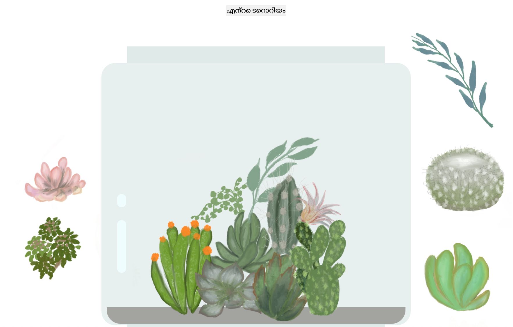

<!--
CO_OP_TRANSLATOR_METADATA:
{
  "original_hash": "6329fbe8bd936068debd78cca6f09c0a",
  "translation_date": "2026-01-08T19:10:00+00:00",
  "source_file": "3-terrarium/solution/README.md",
  "language_code": "ml"
}
-->
# എന്റെ ടെറാറിയം: ജാവാസ്ക്രിപ്റ്റ് ഉപയോഗിച്ച് HTML, CSS, DOM മാനിപുലേഷൻ പഠിക്കാനുള്ള ഒരു പ്രോജക്ട് 🌵🌱

ഒരു ചെറിയ ഡ്രാഗ് ആൻഡ് ഡ്രോപ്പ് കോഡ്-ധ്യാനം. ചെറിയ HTML, JS, CSS ഉപയോഗിച്ച്, നിങ്ങൾക്ക് ഒരു വെബ് ഇന്റർഫേസ് നിർമ്മിക്കാൻ, അതിനെ സ്റ്റൈൽ ചെയ്യാൻ, ഒരു ഇന്ററാക്ഷൻ ചേർക്കാൻ കഴിയും.

## ക്രെഡിറ്റുകൾ

♥️ കൊണ്ട് എഴുതിയത് [Jen Looper](https://www.twitter.com/jenlooper)

CSS വഴി സൃഷ്ടിച്ച ടെറാറിയം Jakub Mandraയുടെ ഗ്ലാസ് ജാർ [codepen](https://codepen.io/Rotarepmi/pen/rjpNZY) ൽ നിന്നുള്ള പ്രചോദനമാണ്.

കലാസൃഷ്ടി Procreate ഉപയോഗിച്ച് [Jen Looper](http://jenlooper.com) കൈവയറ്റു വരച്ചതാണ്.

## നിങ്ങളുടെ ടെറാറിയം ഡിപ്ലോയ് ചെയ്യുക

Azure Static Web Apps ഉപയോഗിച്ച് നിങ്ങളുടെ ടെറാറിയം വെബിൽ ഡിപ്ലോയ് ചെയ്യാം അല്ലെങ്കിൽ പ്രസിദ്ധീകരിക്കാം.

1. ഈ റെപ്പോ ഫോർക്കുചെയ്യുക

2. ഈ ബട്ടൺ ഞെക്കുക

3. നിങ്ങളുടെ ആപ്പ് സൃഷ്ടിക്കുന്ന വിചാരണ പാതികയിലൂടെ നീങ്ങുക. ആപ്പ് റൂട്ട് `/solution` ആകുകയോ അല്ലെങ്കിൽ നിങ്ങളുടെ കോഡ്‌بേസ് റൂട്ട് ആകുകയോ എന്നതിൽ ഉറപ്പാക്കുക. ഈ ആപ്പിൽ API ഇല്ല, അതു ചേർക്കുന്നതിൽ ആശങ്കപ്പെടേണ്ടതില്ല. നിങ്ങളുടെ ഫോർക്കുചെയ്ത റെപ്പോയിൽ .github ഫോൾഡർ സൃഷ്ടിക്കും, ഇത് Azure Static Web Appsയുടെ ബിൽഡ് സർവീസ് നിങ്ങളുടെ ആപ്പ് പുതിയ URLലിലേക്ക് ബിൽഡ് ചെയ്ത് പ്രസിദ്ധീകരിക്കാൻ സഹായിക്കും.

---

<!-- CO-OP TRANSLATOR DISCLAIMER START -->
**അസ്വീകരണം**:  
ഈ പ്രമാണം AI വിവർത്തന സേവനമായ [Co-op Translator](https://github.com/Azure/co-op-translator) ഉപയോഗിച്ച് വിവർത്തനം ചെയ്യപ്പെട്ടതാണ്. ഞങ്ങൾ ശരിവെപ്പിന് ശ്രമിക്കുന്നതെങ്കിലും, സ്വയം പ്രവർത്തിക്കുന്ന വിവർത്തനങ്ങളിൽ പിശകുകൾ അല്ലെങ്കിൽ തെറ്റുകൾ ഉണ്ടാകാമെന്ന് ദയവായി അറിയുക. മൗലിക പ്രമാണം അതിന്റെ സ്വദേശംഭാഷയിൽ ഔദ്യോഗികമായ സ്രോതസ്സായി കരുതപ്പെടണം. നിർണായക വിവരങ്ങൾക്ക് പ്രൊഫഷണൽ മനുഷ്യ വിവർത്തനം ശുപാർശ ചെയ്യപ്പെടുന്നു. ഈ വിവർത്തനം ഉപയോഗിക്കുന്നതിൽ ഉണ്ടാകുന്ന ഏതെങ്കിലും തെറ്റായ ധാരണകൾക്കും അർത്ഥാഘാതങ്ങൾക്കും ഞങ്ങൾ ഉത്തരവാദികളല്ല.
<!-- CO-OP TRANSLATOR DISCLAIMER END -->