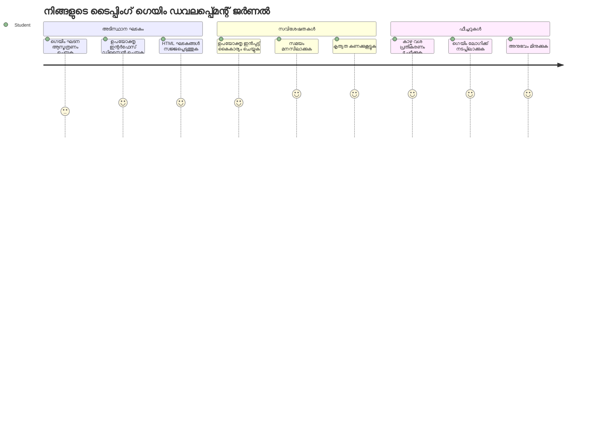
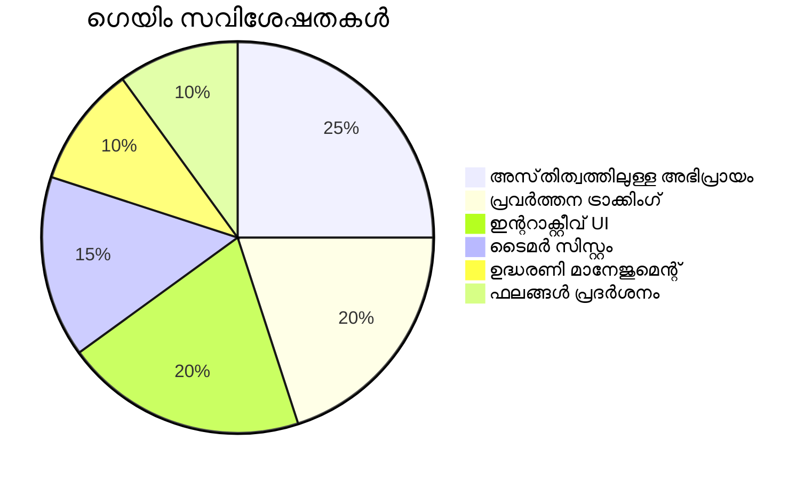
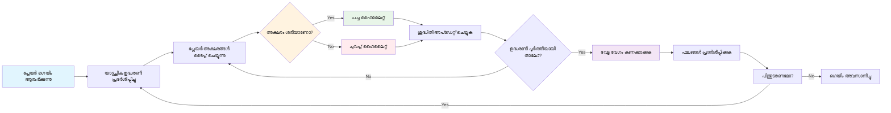
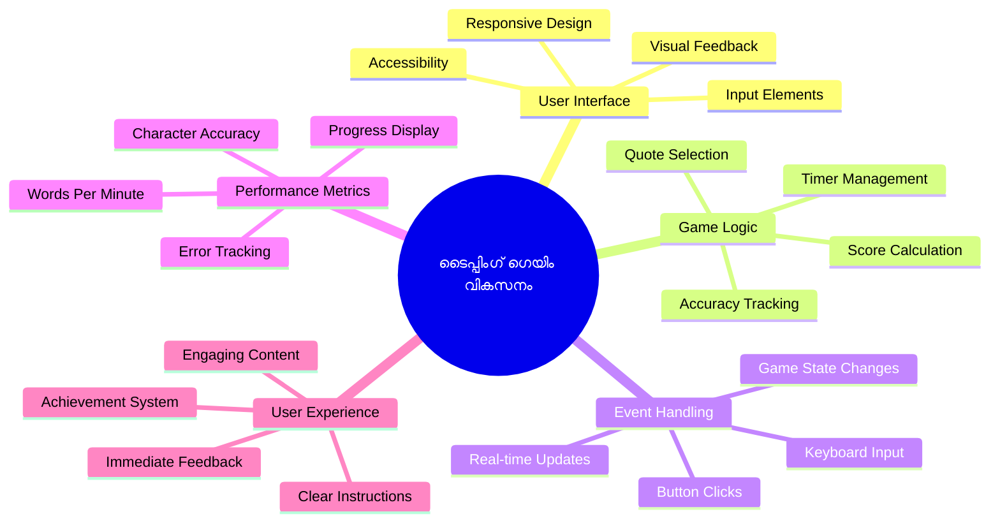
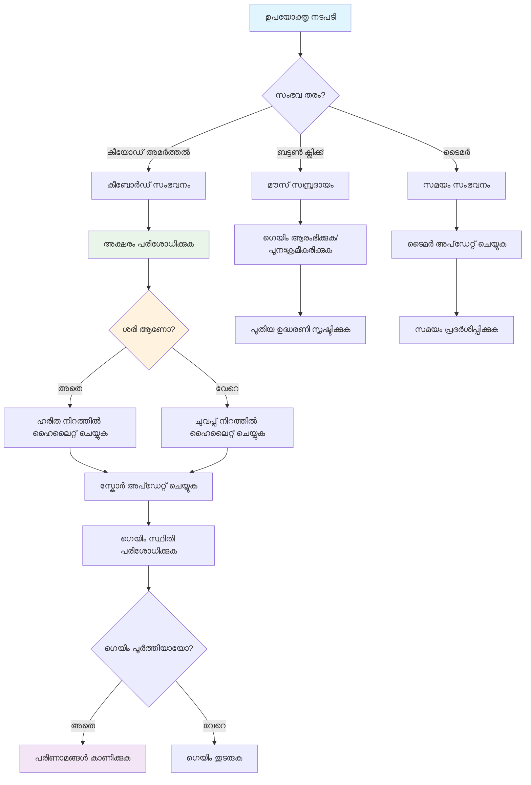
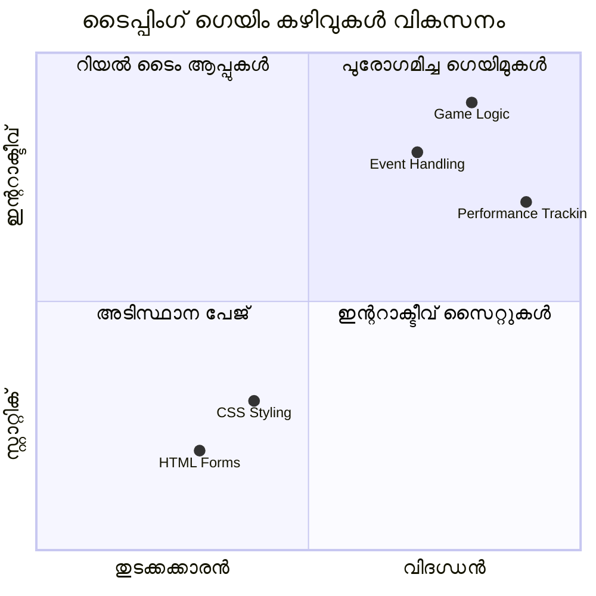
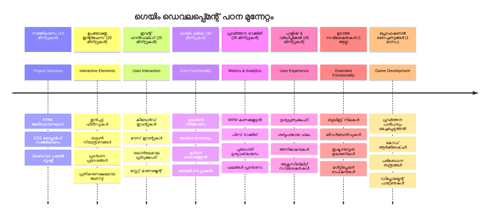

# ഇവന്റ്-ഡ്രിറെൻ പ്രോഗ്രാമിംഗ് - ടൈപ്പിംഗ് ഗെയിം നിർമ്മിക്കുക

## പരിചയം

എല്ലാ ഡെവലപ്പറും അറിയുന്ന, പക്ഷെ വിരളമായി സംസാരിക്കുന്ന ഒരു കാര്യം ഇതാണ്: വേഗത്തിൽ ടൈപ്പ് ചെയ്യുക ഒരു സൂപ്പർപവർ ആണ്! 🚀 ആശ്രയിക്കു - നിങ്ങളുടെ മസ്തിഷ്കത്തില് നിന്നുള്ള ആശയങ്ങൾ എത്ര വേഗം നിങ്ങളുടെ കോഡ് എഡിറ്ററിൽ എത്തിക്കുന്നത്, അത്രമേൽ നിങ്ങളുടെ സൃഷ്ടിപരമായ ചൈതന്യം ഒഴുകാൻ കഴിയും. ഇത്, നിങ്ങളുടെ ചിന്തകളും സ്ക്രീനുമിടയിലെ നേരിട്ടുള്ള പൈപ്ലൈനായി കണക്കാക്കാം.

ഈ കഴിവ് മെച്ചപ്പെടുത്താനുള്ള ഏറ്റവും മികച്ച ഒരു മാർഗം അറിയാമോ? നിങ്ങൾ കണക്കാക്കിയത് പോലെ - നാം ഒരു ഗെയിം നിർമ്മിക്കാൻ പോകുന്നു!

> നല്ലൊരു ടൈപ്പിംഗ് ഗെയിം ഒത്തുചേർക്കാം!

നിങ്ങൾ പഠിച്ച ജാവാസ്ക്രിപ്റ്റ്, HTML, CSS കഴിവുകൾ പ്രയോഗിക്കാൻ തയ്യാറായി? നാം ഒരു ടൈപ്പിംഗ് ഗെയിം നിർമ്മിക്കും, ഇതിൽ പ്രശസ്തമായ അന്വേഷണകാരൻ [ശെർലോക് ഹോംസ്](https://en.wikipedia.org/wiki/Sherlock_Holmes) ന്റെ യാദൃച്ചികമായ ഉദ്ധരണികളാൽ നിങ്ങൾക്ക് വെല്ലുവിളി നൽകും. ഗെയിം നിങ്ങൾ എത്ര വേഗം, എത്ര കൃത്യമായി ടൈപ്പ് ചെയ്യുമ്പോൾ ട്രാക്ക് ചെയ്യും - വിശ്വാസിക്കൂ, ഇത് നിങ്ങൾ കരുതുന്നതിലേക്കാളും കൂടുതലായി ആകര്‍ഷകമാണ്!

## നിങ്ങൾ അറിയേണ്ടതെന്താണ്

ആരാശ്സ് തുടങ്ങുന്നതിന് മുൻപായി, ഈ ആശയങ്ങളെ പറ്റി ഉറപ്പാക്കൂ (കോർത്തു പായാൻ സമയമുണ്ടെങ്കിൽ വിഷമിക്കേണ്ട, നമ്മല്ല എല്ലാവരും അതിലൂടെയാണ് കടന്നുപോയത്):

- ടെക്സ്റ്റ് ഇൻപുട്ടും ബട്ടൺ നിയന്ത്രണങ്ങളും സൃഷ്ടിക്കൽ
- CSS ക്ലാസ്സുകളും സ്റ്റെൈലുകൾ ക്രമീകരിക്കൽ  
- ജാവാസ്ക്രിപ്റ്റ് അടിസ്ഥാനങ്ങൾ
  - ഒരു ആറെ സൃഷ്ടിക്കൽ
  - യാദൃച്ചിക സംഖ്യ നിർമ്മിക്കൽ
  - നിലവിലുള്ള സമയം ലഭ്യമാക്കൽ

ഈ എല്ലാം കുഴപ്പമേയെങ്കിൽ, അവർക്ക് നന്നായി! ചിലപ്പോൾ നിങ്ങളുടെ അറിവ് ഉറപ്പപെടാൻ ഏറ്റവും മികച്ച മാർഗം ഒരു പ്രോജക്ടിൽ ചാടിയും അതിലൂടെ പഠിക്കുന്നതുമാണ്.

### 🔄 **പാഠശാലാ പരിശോധന**
**അടിസ്ഥാന വിലയിരുത്തൽ**: വികസനം തുടങ്ങുന്നതിന് മുമ്പ്, ഉറപ്പാക്കുക:
- ✅ HTML ഫോമുകളും ഇൻപുട്ടും എങ്ങനെ പ്രവർത്തിക്കുന്നു
- ✅ CSS ക്ലാസ്സുകളും സജീവ ശൈലിയും
- ✅ ജാവാസ്ക്രിപ്റ്റ് ഇവന്റ് ലിസണറുകളും ഹാൻഡ്ലറുകളും
- ✅ ആറെ മാനിപ്പുലേഷനും യാദൃച്ചിക തിരഞ്ഞെടുപ്പും
- ✅ സമയം അളക്കും വിധവും കണക്കുകൂട്ടലുകളും

**വേഗം സ്വയംപരിജ്ഞാനം**: ഈ ആശയങ്ങൾ ഒരു ബഹിരാകാശ ഗെയിമിൽ എങ്ങനെ സംയോജിപ്പിച്ചിരിക്കുന്നുവെന്ന് നിങ്ങൾ വിശദീകരിക്കാമോ?
- **ഇവന്റ്‌സ്** ഉപയോക്താക്കൾ കൺട്രോളുകളുമായി ഇടപഴകുമ്പോൾ ആകുമാണ്
- **ഹാൻഡ്ലറുകൾ** ഇവന്റ് പ്രോസസ്സ് ചെയ്ത് ഗെയിം സ്റ്റേറ്റ് അപ്ഡേറ്റ് ചെയ്യും
- **CSS** ഉപയോക്തൃ പ്രവർത്തനങ്ങൾക്ക് ദൃശ്യ പ്രതികരണം നൽകുന്നു
- **സമയം** പ്രകടന അളവും ഗെയിം പുരോഗതിക്കും സാധ്യമാക്കുന്നു

## ഈ കാര്യം നാം നിർമ്മിക്കാം!

[ഇവന്റ് ഡ്രിറെൻ പ്രോഗ്രാമിംഗ് ഉപയോഗിച്ച് ടൈപ്പിംഗ് ഗെയിം സൃഷ്ടിക്കൽ](./typing-game/README.md)

### ⚡ **അടുത്ത 5 മിനിറ്റിൽ ചെയ്യാൻ കഴിയും**
- [ ] ബ്രൗസറിന്റെ കോൺസോൾ തുറന്ന് `addEventListener` ഉപയോഗിച്ച് കീബോർഡ് ഇവന്റ്‌സ് കേൾക്കാൻ ശ്രമിക്കുക
- [ ] ലളിതമായ HTML പേജ് സൃഷ്ടിച്ച് ഇൻപുട്ട് ഫീൽഡ് ഉപയോഗിച്ച് ടൈപ്പിംഗ് തിരിച്ചറിയണം പരീക്ഷിക്കുക
- [ ] ടൈറ്റായ ടെക്സ്റ്റും ലക്ഷ്യ ടെക്സ്റ്റും താരതമ്യം ചെയ്യുക കൊണ്ട് സ്ട്രിംഗ് മാനിപ്പുലേഷൻ അഭ്യാസം ചെയ്യുക
- [ ] സമയ ഫങ്ക്ഷനുകൾ മനസ്സിലാക്കാൻ `setTimeout` പരീക്ഷിക്കുക

### 🎯 **ഈ മണിക്കൂറിൽ നേടാനാകുന്നത്**
- [ ] പാഠശേഷി ക്വിസ് പൂർത്തിയാക്കി ഇവന്റ്-ഡ്രിറെൻ പ്രോഗ്രാമിംഗ് മനസ്സിലാക്കുക
- [ ] വാക്കുകളുടെ സാധുത അടങ്ങിയ ടൈപ്പിംഗ് ഗെയിമിന്റെ അടിസ്ഥാന പതിപ്പ് നിർമ്മിക്കുക
- [ ] ശരിയായതു തെറ്റായതു ടൈപ്പിങിന് ദൃശ്യ പ്രതികരണം ചേർക്കുക
- [ ] വേഗതയും കൃത്യതയും അടിസ്ഥാനമാക്കിയുള്ള എളുപ്പമായ സ്കോറിംഗ് സിസ്റ്റം നടപ്പാക്കുക
- [ ] CSS ഉപയോഗിച്ച് ഗെയിംക്ക് അതൃപ്തികരമായ ശൈലി നൽകുക

### 📅 **നിങ്ങളുടെ വാരാന്ത്യ ഗെയിം ഡെവലപ്പ്മെന്റ്**
- [ ] മുഴുവൻ ടൈപ്പിംഗ് ഗെയിം എല്ലാ സവിശേഷതകളും ഒരുമച്ച് പൂർത്തിയാക്കുക
- [ ] വാക്കുകൾക്കുള്ള പവിട്ട കഠിനത ലെവലുകൾ ചേർക്കുക
- [ ] ഉപയോക്തൃ സ്ഥിതിവിവരങ്ങൾ ട്രാക്കിംഗ് നടപ്പിലാക്കുക (WPM, സമയം ഉണ്ടാകുന്ന കൃത്യത)
- [ ] മികച്ച ഉപയോക്തൃ അനുഭവത്തിന് ശബ്ദഫലങ്ങളും അനിമേഷനുകളും സൃഷ്ടിക്കുക
- [ ] മൊബൈൽ സൗഹൃദമായ ഗെയിം നിർമ്മിക്കുക
- [ ] ഗെയിം ഓൺലൈനിൽ ഷെയർ ചെയ്ത് ഉപയോക്താക്കളുടെ അഭിപ്രായം ശേഖരിക്കുക

### 🌟 **നിങ്ങളുടെ മാസാന്ത ഇന്ററാക്ടീവ് ഡെവലപ്പ്മെന്റ്**
- [ ] വ്യത്യസ്ഥ ഇടപെടൽ മാതൃകകൾ പരീക്ഷിച്ച് ഒട്ടനവധി ഗെയിമുകൾ നിർമ്മിക്കുക
- [ ] ഗെയിം ലൂപ്പുകളെയും സ്റ്റേറ്റ് മാനേജ്മെന്റും പ്രകടന മെച്ചപ്പെടുത്തലും പഠിക്കുക
- [ ] ഓപ്പൺ സോഴ്‌സ് ഗെയിം ഡെവലപ്പ്മെൻറ് പ്രോജക്ടുകൾക്കു സംഭാവന ചെയ്യുക
- [ ] ഉയർന്നനിലയിലെ സമയ ബന്ധിത ആശയങ്ങളും മിതമായ അനിമേഷനുകളും ആസ്പദമാക്കുക
- [ ] വിവിധ ഇന്ററാക്ടീവ് അപ്ലിക്കേഷനുകൾ പ്രദർശിപ്പിക്കുന്ന പോർട്ട്ഫോളിയോ സൃഷ്ടിക്കുക
- [ ] ഗെയിം ഡെവലപ്പ്മെന്റിലും ഉപയോക്തൃ ഇടപെടലിലും താൽപ്പര്യമുള്ളവരെ മാർഗ്ഗനിർദേശപ്പെടുത്തി

## 🎯 നിങ്ങളുടെ ടൈപ്പിംഗ് ഗെയിം മാസ്റ്ററി ടൈമ്ലൈൻ

### 🛠️ നിങ്ങളുടെ ഗെയിം ഡെവലപ്പ്മെന്റ് ടൂൾകിറ്റ് സംക്ഷിപ്തം

ഈ പ്രോജക്ട് പൂർത്തിയായപ്പോൾ, നിങ്ങൾ കൈവരിക്കുന്നതാണ്:
- **ഇവന്റ്-ഡ്രിറെൻ പ്രോഗ്രാമിംഗ്**: ഇൻപുട്ടിൽ പ്രതികരിക്കുന്ന പ്രതികരണക്ഷമമായ ഉപയോക്തൃ ഇന്റർഫേസുകൾ
- **റിയൽ-ടൈം ഫീഡ്ബാക്ക്**: തത്സമയ ദൃശ്യവും പ്രകടന അപ്ഡേറ്റുകളും
- **പ്രകടന അളവ്**: കൃത്യമായ ടൈമിംഗ്, സ്‌കോറിംഗ് സിസ്റ്റങ്ങൾ
- **ഗെയിം സ്റ്റേറ്റ് മാനേജ്മെന്റ്**: അപ്പ്ലിക്കേഷൻ ഫ്ലോയും ഉപയോക്തൃ അനുഭവവും നിയന്ത്രിക്കൽ
- **ഇന്ററാക്ടീവ് ഡിസൈൻ**: ആകർഷകവും ലഹരിമയാണ് ഉപയോക്തൃ അനുഭവങ്ങൾ സൃഷ്ടിക്കൽ
- **ആധുനിക വെബ് APIകൾ**: സമ്പന്ന ഇടപെടലിനായി ബ്രൗസർ ശേഷികൾ ഉപയോഗിക്കുക
- **ആക്സസിബിലിറ്റി മാതൃകകൾ**: എല്ലാ ഉപയോക്താക്കൾക്കും ഉൾപ്പെടുത്തുന്ന ഡിസൈൻ

**യഥാർത്ഥ ലോക പ്രയോഗങ്ങൾ**: ഈ കഴിവുകൾ നേരിട്ട് ബാധിക്കുന്നവ:
- **വെബ് ആപ്ലിക്കേഷനുകൾ**: ഏതൊരു ഇന്ററാക്ടീവ് ഇന്റർഫേസ് അല്ലെങ്കിൽ ഡാഷ്ബോർഡ്
- **അധ്യാപന സോഫ്റ്റ്വെയർ**: പഠന പ്ലാറ്റ്ഫോമുകളും കഴിവ് വിലയിരുത്തൽ ഉപകരണങ്ങളും
- **പ്രോഡക്ടിവിറ്റി ഉപകരണങ്ങൾ**: ടെക്സ്റ്റ് എഡിറ്ററുകൾ, ഐ.ഡി.ഇകൾ, സഹകരണമുള്ള സോഫ്‌ട്വെയർ
- **ഗെയിം വ്യവസായം**: ബ്രൗസർ ഗെയിമുകളും ഇന്ററാക്ടീവ് വിനോദങ്ങളും
- **മൊബൈൽ ഡെവലപ്പ്മെന്റ്**: ടച്ച് അടിസ്ഥാനമാക്കിയ ഇന്റർഫേസുകളും ജസ്റ്റർ ഹാൻഡ്ലിംഗും

**അടുത്ത പടി**: ഉയർന്ന ഗെയിം ഫ്രെയിംവർക്കുകൾ, റിയൽ-ടൈം മൾട്ടിപ്ലേയറുകൾ അല്ലെങ്കിൽ സങ്കീർണ്ണ ഇന്ററാക്ടീവ് ആപ്ലിക്കേഷനുകൾ അന്വേഷിക്കാൻ തയ്യാറാണ്!

## ക്രെഡിറ്റ്സ്

♥️ കൂടെ എഴുതിയത് [ക്രിസ്റ്റോഫർ ഹാരിസൺ](http://www.twitter.com/geektrainer)

---

<!-- CO-OP TRANSLATOR DISCLAIMER START -->
**അസ്വീകരണം**:  
ഈ രേഖ AI ഭാഷാന്തര സേവനം [Co-op Translator](https://github.com/Azure/co-op-translator) ഉപയോഗിച്ച് വിവർത്തനം ചെയ്തതാണ്. നാം ശരിയായ വിവർത്തനത്തിനായി ശ്രമിക്കുന്നുവെങ്കിലും, യന്ത്ര വിവർത്തനങ്ങളിൽ പിഴവുകൾ അല്ലെങ്കിൽ ദോഷങ്ങൾ ഉണ്ടായിരിക്കാമെന്ന് ദയവായി മനസിലാക്കുക. പ്രാഥമിക ഭാഷയിൽ ഉള്ള യഥാർത്ഥ രേഖയെ അധികാരം ഉള്ള ഉറവിടമായി പരിഗണിക്കേണ്ടതാണ്. അത്യാവശ്യ വിവരങ്ങൾക്ക്, പ്രൊഫഷണൽ മാനവ വിവർത്തനം ശുപാർശ ചെയ്യുന്നു. ഈ വിവർത്തനത്തിന്റെ ഉപയോഗത്തിൽ നിന്നുണ്ടാകുന്ന ഏതെന്തെങ്കിലും തെറ്റിദ്ധാരണകൾക്കും തെറ്റായ വ്യാഖ്യാനങ്ങൾക്കും ഞങ്ങൾ ഉത്തരവാദികളല്ല.
<!-- CO-OP TRANSLATOR DISCLAIMER END -->