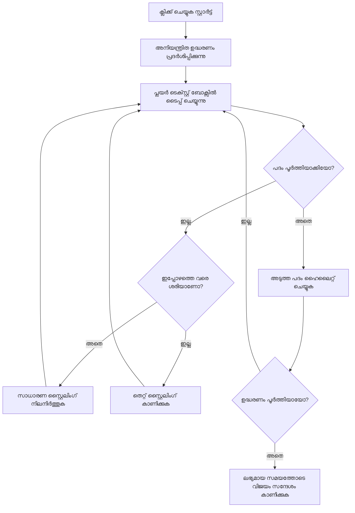
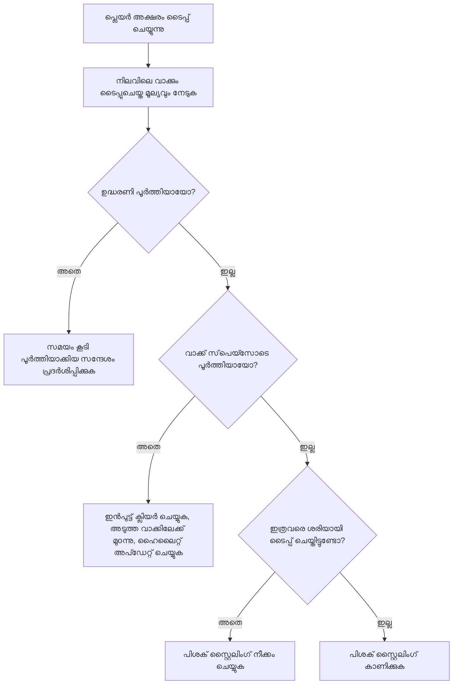
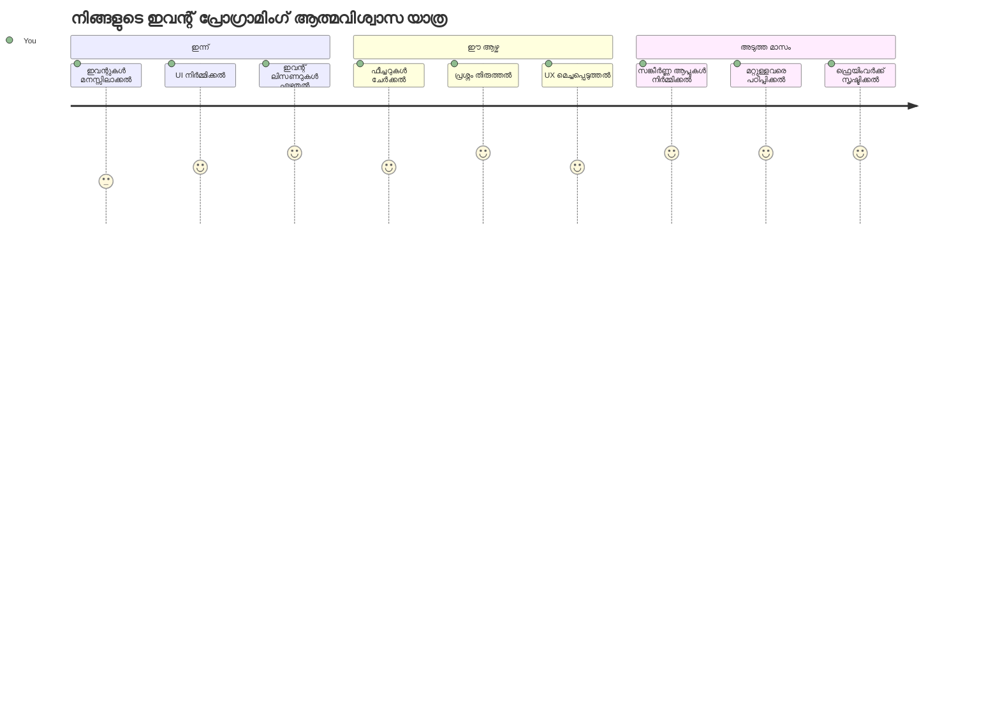

# ഇവന്റുകൾ ഉപയോഗിച്ച് ഒരു ഗെയിം സൃഷ്ടിക്കൽ

നിങ്ങൾ ബട്ടൺ ക്ലിക്ക് ചെയ്യുമ്പോൾ അല്ലെങ്കിൽ ടെക്സ്റ്റ് ബോക്സിൽ ടൈപ്പ് ചെയ്യുമ്പോൾ വെബ്‌സൈറ്റുകൾ എങ്ങനെ അറിയുന്നു എന്ന് ഒരിക്കൽ നിങ്ങൾക്ക് വിചാരിച്ചിട്ടുണ്ടോ? അതാണ് ഇവന്റ് ഡ്രിവൻ പ്രോഗ്രാമിങ്ങിന്റെ മായാജാലം! നിങ്ങൾ ചെയ്യുന്ന ഓരോ കീസ്റ്റ്രോക്കും പ്രതികരിക്കുന്ന ഒരു ടൈപ്പിംഗ് വേഗം ഗെയിം നിർമ്മിച്ച് ഈ അടിസ്ഥാന കഴിവ് നേടുന്നതിന് ഇതു വർഗ്ഗം മികച്ച രീതിയാണ്.

വെബ് ബ്രൗസറുകൾ നിങ്ങളുടെ ജാവാസ്‌ക്രിപ്റ്റ് കോഡുമായി എങ്ങനെ "സംസരിക്കുന്നു" എന്ന് നിങ്ങൾ നേരിട്ട് കാണുകയും ചെയ്യും. നിങ്ങൾ ക്ലിക്ക് ചെയ്യുമ്പോഴും, ടൈപ്പ് ചെയ്യുമ്പോഴും, മൗസ് നീക്കുമ്പോഴും, ബ്രൗസർ ചെറു സന്ദേശങ്ങൾ (ഇവരെ ഇവന്റുകൾ എന്ന് വിളിക്കുന്നു) നിങ്ങളുടെ കോഡിലേക്ക് അയയ്ക്കുന്നു, നിങ്ങൾ മറുപടി എങ്ങനെ നൽകണമെന്ന് തീരുമാനിക്കാം!

നാം ഇവിടെ വായിക്കുന്നത് കൊണ്ട് നിങ്ങൾ ഒരു യാഥാർത്ഥ്യ ടൈപ്പിംഗ് ഗെയിം നിർമ്മിച്ചിരിക്കും, അത് നിങ്ങളുടെ വേഗതയും കൃത്യതയും ട്രാക്ക് ചെയ്യുന്നു. അതിലും പ്രധാനമായി, നിങ്ങൾ ഇവന്റ് ഡ്രിവൻ വെബ്‌സൈറ്റുകളുടെ അടിസ്ഥാന ആശയങ്ങൾ മനസ്സിലാക്കും. തുടങ്ങാം!

## ഉപദേശം മുൻകൂട്ടി ചോദ്യോത്തരങ്ങൾ

[Pre-lecture quiz](https://ff-quizzes.netlify.app/web/quiz/21)

## ഇവന്റ് ഡ്രിവൻ പ്രോഗ്രാമിങ്ങ്

നിങ്ങളുടെ പ്രിയപ്പെട്ട ആപ്പ് അല്ലെങ്കിൽ വെബ്‌സൈറ്റ് - അത് എങ്ങനെ ജീവിക്കുന്നതും പ്രതികരണ ശേഷിയുള്ളതും ആണ് എന്നു നിങ്ങൾക്ക് തോന്നിക്കേണ്ടത് എന്താണെന്ന് ചിന്തിക്കൂ? നിങ്ങൾ ചെയ്യുന്നതിന് എങ്ങനെ അതു പ്രതികരിക്കുന്നു എന്നതാണ് കാര്യം! ഓരോ ട്യാപ്, ക്ലിക്ക്, സ്വൈപ്പ്, അല്ലെങ്കിൽ കീസ്റ്റ്രോക്കും നമ്മൾ "ഇവന്റ്" എന്ന് വിളിക്കുന്നതും സൃഷ്ടിക്കുന്നു, അതാണ് വെബ് ഡെവലപ്പ്മെന്റിന്റെ യഥാർത്ഥ മായാജാലം.

വെബിനുള്ള പ്രോഗ്രാമിങ്ങ് ഭേദമാക്കുന്നത് ഇതാണ്: ആരോ ആ ബട്ടൺ ക്ലിക്ക് ചെയ്യുമോ അല്ലെങ്കിൽ ടെക്സ്റ്റ് ബോക്സിൽ ടൈപ്പ് തുടങ്ങുമോ എന്ന് നമുക്ക് ഒരിക്കലും അറിയില്ല. അവർ ഉടനെ ക്ലിക്ക് ആകാം, അഞ്ചു മിനിറ്റ് കാത്തിരിക്കാം, ആദ്യങ്ങൾ എക്കാലവും ക്ലിക്ക് എവിടെയുമാകുമെന്നും! ഈ അനിശ്ചിതത്വം കൊണ്ട് നമ്മൾ നമ്മുടെ കോഡ് എഴുതുന്നത് വ്യത്യസ്ഥമായി ആലോചിക്കേണ്ടിവരും.

മുകളിൽ നിന്ന് താഴേക്ക് ഒരു രെസിപ്പി പോലെ ഓടുന്ന കോഡ് എഴുതുന്നത് പകരം, എന്തെങ്കിലും സംഭവിക്കാന്‍ കാത്തിരിക്കുoതുകൊണ്ട് നിശ്ചലമായി നില്‍ക്കുന്ന കോഡ് എഴുതുന്നു. 1800 കളിൽ ടെലഗ്രാഫ് ഓപ്പറേറ്റർമാർ അവരുടെ മെഷീനുകളുടെ സമീപം ഇരുന്ന് സന്ദേശം കേബിളിലൂടെ വന്നവട്ടം പ്രതികരിക്കാൻ തയ്യാറായി നിന്നതുപോലെ.

അതിനാൽ "ഇവന്റ്" എന്ന് കൃത്യമായി എന്താണ്? അതത് സംഭവിക്കുന്ന ഒന്നാണ്! നിങ്ങൾ ഒരു ബട്ടൺ ക്ലിക്ക് ചെയ്താൽ - അത് ഒരു ഇവന്റ് ആണ്. നിങ്ങൾ ഒരു അക്ഷരം ടൈപ്പ് ചെയ്താൽ - അത് ഒരു ഇവന്റ് ആണ്. നിങ്ങൾ മൗസ് നീക്കുമ്പോൾ - അത് മറ്റൊരു ഇവന്റ് ആണ്.

ഇവന്റ് ഡ്രിവൻ പ്രോഗ്രാമിങ്ങ് നമ്മുടെ കോഡ് ലൈസൻ ചെയ്യാനും പ്രതികരിക്കാനും ഒരുക്കി വെക്കാൻ സഹായിക്കുന്നു. നാം **ഇവന്റ് ലിസ്സണറുകൾ** എന്ന പ്രത്യേക ഫംഗ്ഷനുകൾ സൃഷ്ടിക്കുന്നു, ഇവ നിശ്ചിത കാര്യങ്ങൾ സംഭവിക്കാൻ കാത്തിരിക്കുന്നു, സംഭവിക്കുമ്പോൾ പ്രവർത്തനക്ഷമമാകുന്നു.

ഇവന്റ് ലിസ്സണറുകളെ നിങ്ങൾ നിങ്ങളുടെ കോഡിന് വേണ്ടി ദ്വാരക്കണിഞ്ഞു കാത്തിരിക്കുന്ന ഡോർബെൽപോലെ കരുതാം. നിങ്ങൾ ഡോർബെൽ (`addEventListener()`) സെറ്റ് ചെയ്യുന്നു, ഏത് ശബ്ദം കേൾക്കണമെന്ന് (ഉദാ: 'click' അല്ലെങ്കിൽ 'keypress') പറയുന്നു, പിന്നെ ആരെങ്കിലും അത് തട്ടി വിളിച്ചതോടെ എന്ത് സംഭവിക്കുമെന്ന് (നിങ്ങളുടെ ഇഷ്ടാനുസൃത ഫങ്ഷൻ) വ്യക്തമാക്കുന്നു.

**ഇവന്റ് ലിസ്സണറുകൾ എങ്ങനെ പ്രവർത്തിക്കുന്നു:**
- **നിശ്ചിത ഉപയോക്തൃ പ്രവർത്തനങ്ങൾ** വഴി കേൾക്കുന്നത്, ഉദാ: ക്ലിക്കുകൾ, കീസ്റ്റ്രോക്കുകൾ, മൗസ് ചലനങ്ങൾ
- **നിശ്ചിത ഇവന്റ് സംഭവിക്കുമ്പോൾ** നിങ്ങളുടെ ഇഷ്ടാനുസൃത കോഡ് പ്രവർത്തിപ്പിക്കുന്നു
- **ഉപയോക്തൃ ഇടപെടലുകൾക്ക്** ഉടൻ പ്രതികരിച്ച് സുഗമ അനുഭവം സൃഷ്ടിക്കുന്നു
- **അതിരായ listener ഉപയോഗിച്ച്** ഒരേ എലമെന്റിൽ നിരവധി ഇവന്റുകൾ കൈകാര്യം ചെയ്യുന്നു

> **കുറിപ്പ്:** ഇവന്റ് ലിസ്സണറുകൾ സൃഷ്ടിക്കാൻ അനേകം മാർഗ്ഗങ്ങൾ ഉണ്ട്. നിങ്ങൾ നാമരഹിത ഫംഗ്ഷനുകളോ, പേരുള്ളവയോ ഉപയോഗിക്കാം. `click` പ്രോപ്പർട്ടി സജ്ജീകരിക്കൽ പോലുള്ള ഷോർട്ട്‌കട്ടുകൾ ഉപയോഗിക്കാം, അല്ലെങ്കിൽ `addEventListener()` ഉപയോഗിക്കാം. ഈ പരിശീലനത്തിൽ നാം `addEventListener()`യും നാമരഹിത ഫംഗ്ഷനുകളും ഉപയോഗിക്കുകയാണ്, അതാണ് വെബ് ഡെവലപ്പർമാർ സാധാരണയായി ഉപയോഗിക്കുന്ന ഏറ്റവും സാധാരണമായ രീതിയെന്നും ഇത് ഏറ്റവും ലളിതവുമാണ്. `addEventListener()` എല്ലാ ഇവന്റുകൾക്കും പ്രവർത്തിക്കുന്നു, ഇവന്റ് നാമം പാരാമീറ്ററായി നൽകാം.

### സാധാരണ ഇവന്റുകൾ

വെബ് ബ്രൗസറുകൾ അനേകം വ്യത്യസ്ത ഇവന്റുകൾ കേൾക്കുവാൻ നിങ്ങൾക്ക് അനുവദിക്കുന്നു, എന്നാൽ ഭൂരിഭാഗം ഇന്ററാക്ടീവ് ആപ്പ്ലിക്കേഷനുകൾ ആവശ്യമായ ചില പ്രധാന ഇവന്റുകളിൽ അടിച്ചമർത്തുന്നു. ഈ അടിസ്ഥാന ഇവന്റുകൾ മനസ്സിലാക്കുന്നത് പ്രഗത്ഭ ഉപയോക്തൃ ഇടപെടലുകൾ നിർമ്മിക്കാൻ സഹായിക്കും.

ഒരു ആപ്ലിക്കേഷൻ സൃഷ്ടിക്കുമ്പോൾ കേൾക്കാൻ ലഭ്യമായ [മിക്ക ഇവന്റുകളും](https://developer.mozilla.org/docs/Web/Events) ഉണ്ട്. അടിസ്ഥാനത്തിൽ ഒരു പേജിൽ ഉപയോക്താവ് ചെയ്യുന്ന ഏതൊരു പ്രവർത്തനവും ഒരു ഇവന്റ് ഉയർത്തും, ഇതു നിങ്ങളെ ഉപയോഗിച്ച് വളരെയധികം ശക്തി നൽകുന്നു ഉപയോക്തൃ അനുഭവം നിയന്ത്രിക്കാൻ. ഭാഗ്യം വശാൽ, സാധാരണയായി നിങ്ങൾക്ക് ചെറിയ ചില ഇവന്റുകൾ മാത്രം വേണ്ടതാണ്. ചില സാധാരണ ഇവന്റുകൾ (നമുക്ക് ഗെയിം സൃഷ്ടിക്കുമ്പോൾ ഉപയോഗിക്കാനുള്ള രണ്ട് ഇവന്റുകൾ ഉൾപ്പെടെ):

| ഇവന്റ് | വിവരണം | സാധാരണ ഉപയോഗങ്ങൾ |
|--------|----------|--------------------|
| `click` | ഉപയോക്താവ് ഒന്നിനെ ക്ലിക്ക് ചെയ്തു | ബട്ടണുകൾ, ലിങ്കുകൾ, ഇന്ററാക്ടീവ് ഘടകങ്ങൾ |
| `contextmenu` | ഉപയോക്താവ് മൗസിന്റെ വലത് ബട്ടൺ ക്ലിക്ക് ചെയ്തു | റൈറ്റ് ക്ലിക്ക് മെനുകളും കസ്റ്റം മെനുകളും |
| `select` | ഉപയോക്താവ് ചില ടെക്സ്റ്റ് ഹൈലൈറ്റ് ചെയ്തു | ടെക്സ്റ്റ് എഡിറ്റിംഗ്, കോപി പ്രവർത്തനങ്ങൾ |
| `input` | ഉപയോക്താവ് ടെക്സ്റ്റ് ഇൻപുട്ട് ചെയ്തു | ഫോറം പരിശോധന, റിയൽ-ടൈം സേച്ച് |

**ഈ ഇവന്റ് തരം മനസ്സിലാക്കുക:**
- **ട്രിഗർ ചെയ്യുന്നു** ഉപയോക്താക്കൾ നിങ്ങളുടെ പേജിലെ നിശ്ചിത ഘടകങ്ങളുമായി ഇടപെടുമ്പോൾ
- **നൽകുന്നു** ഇവന്റ് ഒബ്ജക്ടുകൾ വഴി ഉപയോക്താവിന്റെ പ്രവർത്തനങ്ങളുടെ വിശദാംശങ്ങൾ
- **സാധ്യമാക്കുന്നു** പ്രതികരണശീലമുള്ള, ഇന്ററാക്ടീവ് വെബ് ആപ്ലിക്കേഷനുകൾ സൃഷ്ടിക്കുന്നത്
- **പ്രവർത്തിക്കുന്നു** വ്യത്യസ്ത ബ്രൗസറുകളിൽ, ഉപകരണങ്ങളിൽ സ്ഥിരമായി

## ഗെയിം സൃഷ്ടിക്കൽ

ഇവന്റുകൾ എങ്ങനെ പ്രവർത്തിക്കുന്നു എന്ന് നിങ്ങൾ മനസ്സിലാക്കിയതിനുശേഷം, പ്രായോഗികമായി എന്തെങ്കിലും ഉപകാരപ്രദം നിർമ്മിക്കാം. നാം ഒരു ടൈപ്പിംഗ് വേഗം ഗെയിം സൃഷ്ടിക്കാം, ഇത് ഇവന്റ് ഹാൻഡ്ലിംഗിനെ പ്രദർശിപ്പിക്കുമ്പോൾ പ്രധാന ഡെവലപ്പർ കഴിവ് വികസിപ്പിക്കാനും സഹായിക്കും.

നാം ജാവാസ്‌ക്രിപ്റ്റിൽ ഇവന്റുകൾ എങ്ങനെ പ്രവർത്തിക്കുന്നതെന്ന് വിശദീകരിക്കാൻ ഒരു ഗെയിം സൃഷ്ടിക്കാം. നമ്മുടെ ഗെയിം ഒരു പ്ലെയറുടെ ടൈപ്പിംഗ് കഴിവ് പരിശോധിക്കും, എല്ലാ ഡെവലപ്പർമാർക്കും വേണമെന്ന് പരിഗണിക്കപ്പെടാത്ത ഒരു പ്രധാന കഴിവ്. രസകരമായ വസ്തുത: നാം ഇന്ന് ഉപയോഗിക്കുന്ന QWERTY കീബോർഡ് ലേഔട്ട് പിറവിപെടുത്തിയത് 1870 കളിൽ ടൈപ്പไรട്ടറുകൾക്കായി ആയിരുന്നു - ഇപ്പോഴും നല്ല ടൈപ്പിംഗ് കഴിവുകൾ പ്രോഗ്രാമർമാർക്ക് അതേ രീതിയിൽ പ്രയോജനപ്പെടുന്നു! ഗെയിമിന്റെ പൊതുവായ പ്രവാഹം ഇങ്ങനെ കാണാം:


**ഞങ്ങളുടെ ഗെയിം എങ്ങനെ പ്രവർത്തിക്കും:**
- **ആരംഭിക്കും** പ്ലേയർ സ്റ്റാർട്ട് ബട്ടൺ ക്ലിക് ചെയ്യുമ്പോൾ ഒരു യാദൃച്ഛിക ഉദ്ധരണം പ്രദർശിപ്പിച്ചു
- **ട്രാക്ക് ചെയ്യും** പ്ലേയറിന്റെ ടൈപ്പിംഗ് പുരോഗതി വാക്കു വാക്കായി റിയൽ ടൈമിൽ
- **മികച്ചവാക്കുകൾക്ക് ഹൈലൈറ്റ് നൽകും** പ്ലേയറുടെ ശ്രദ്ധ നിർദ്ദേശിക്കാൻ
- **തീർച്ചയായ തെറ്റുകൾക്ക്** ഉടൻ ദൃശ്യഫീഡ്ബാക്ക് നൽകും
- ** calculates**  ഉദ്ധരണി പൂർത്തിയായപ്പോൾ മൊത്തം സമയം കണക്കാക്കി പ്രദർശിപ്പിക്കും

നമുക്ക് ഗെയിം നിർമ്മിക്കാം, ഇവന്റുകൾ കുറിച്ച് പഠിക്കാം!

### ഫയൽ ഘടന

കോഡിംഗ് തുടങ്ങുന്നതിന് മുമ്പ്, ക്രമത്ത് വരൂ! ആരംഭത്തിൽ ഒറ്റനോട്ടത്തിൽ മനസ്സിലാകുന്ന ഫയൽ ഘടന ഉണ്ടെങ്കിൽ പിന്നീട് ഇത്തരം പ്രശ്നങ്ങളിൽ കുറവ് ഉണ്ടായിരിക്കും, പ്രൊഫഷണൽ പ്രോജക്ടായി മാറുന്നതിന് ഇത് സഹായിക്കുന്നു. 😊

നാം മൂന്ന് ഫയലുകൾ മാത്രമാണ് സാദ്ധ്യമാക്കുന്നത്: `index.html` പേജ് ഘടനക്ക്, `script.js` ഗെയിം ലജിക്ക് കൈകാര്യം ചെയ്യാൻ, `style.css` എല്ലാം മനോഹരമായി കാണിക്കുന്നതിനായി. ഇതാണ് വെബ് പ്രവർത്തനത്തിന്റെ ക്ലാസിക് കൂട്ടുകെട്ട്!

** പുതിയ ഫോൾഡർ സൃഷ്ടിക്കാൻ കൺസോൾ അല്ലെങ്കിൽ ടെർമിനൽ തുറന്ന് താഴെ കാണിക്കുന്ന കമാൻഡ് നൽകുക:**

```bash
# ലിനക്സ് അല്ലെങ്കിൽ മാക്ഓഎസ്
mkdir typing-game && cd typing-game

# വിൻഡോസ്
md typing-game && cd typing-game
```

**ഈ കമാൻഡുകൾ എന്താണ് ചെയ്യുന്നത്:**
- നിങ്ങളുടെ പ്രോജക്ട് ഫയലുകള്ക്ക് പുതിയ ഒരു ഡയറക്ടറി `typing-game` സൃഷ്ടിക്കുന്നു
- പുതിയ ഡയറക്ടറിയിലേക്ക് സ്വയം ഓടുന്നു
- ഗെയിം ഡെവലപ്പ്മെന്റിനായി ഒരു വൃത്തിയുള്ള വർക്ക്സ്പേസ് ഒരുക്കുന്നു

**വിഷ്വൽ സ്റ്റുഡിയോ കോഡ് തുറക്കൂ:**

```bash
code .
```

**ഈ കമാൻഡ്:**
- നിലവിലെ ഡയറക്ടറിയിൽ വിഷ്വൽ സ്റ്റുഡിയോ കോഡ് ഓപ്പൺ ചെയ്യുന്നു
- നിങ്ങളുടെ പ്രോജക്ട് ഫോൾഡർ എഡിറ്ററിൽ തുറക്കുന്നു
- നിങ്ങൾക്ക് ആവശ്യമുള്ള എല്ലാ ഡെവലപ്പ്മെന്റ് ടൂൾസിലേക്ക് പ്രവേശനമനുവദിക്കുന്നു

**വിഷ്വൽ സ്റ്റുഡിയോ കോഡിൽ താഴെ പറയുന്ന പേരുകൾ ഉപയോഗിച്ച് ഫോൾഡറിൽ മൂന്ന് ഫയലുകൾ ചേർക്കുക:**
- `index.html` - നിങ്ങളുടെ ഗെയിംയുടെ ഘടനയും ഉള്ളടക്കവും ഉൾക്കൊള്ളുന്നു
- `script.js` - എല്ലാ ഗെയിം ലജിക്കും ഇവന്റ് ലിസ്സണറുകൾക്കും കൈകാര്യം ചെയ്യുന്നു
- `style.css` - ദൃശ്യരൂപവും സ്റ്റൈലിംഗും നിർവചിക്കുന്നു

## ഉപയോക്തൃ ഇന്റർഫേസ് സൃഷ്ടിക്കുക

ഇപ്പോൾ നമുക്ക് ഗെയിമിലെ എല്ലാ പ്രവർത്തനങ്ങളും നടക്കാൻ പോകുന്ന സ്റ്റേജ് നിർമ്മിക്കാം! ഒരു സ്പേസ്‌ഷിപ്പിന്റെ കൺട്രോൾ പാനൽ ഡിസൈൻ ചെയ്യുന്നതുപോലെ ചിന്തിക്കൂ - പ്ലേയർമാർക്ക് വേണ്ടത് എല്ലാം അവരുടെ പ്രതീക്ഷിച്ചിടത്തേതായി ഉറപ്പാക്കണം.

ഗെയിംക്ക് വേണ്ടത് എന്താണെന്ന് നമുക്ക് ഉറപ്പാക്കാം. നിങ്ങൾ ഒരു ടൈപ്പിംഗ് ഗെയിം കളിക്കുകയാണെങ്കിൽ, സ്ക്രീൻ എന്തെല്ലാം കാണിക്കണമെന്നു നിങ്ങൾ ആഗ്രഹിക്കും? ഇതാ നമ്മുക്ക് വേണ്ടതെന്നുള്ളത്:

| UI ഘടകം | ലക്ഷ്യം | HTML ഘടകം |
|----------|---------|-------------|
| ഉദ്ധരണി പ്രദർശനം | ടൈപ്പ് ചെയ്യാനുള്ള ടെക്സ്റ്റ് കാണിക്കുന്നു | `<p>` `id="quote"` ഉപയോഗിച്ച് |
| സന്ദേശ പ്രദേശം | നിലയും വിജയ സന്ദേശങ്ങളും കാണിക്കുന്നു | `<p>` `id="message"` ഉപയോഗിച്ച് |
| ടെക്സ്റ്റ് ഇൻപുട്ട് | പ്ലേയർമാർ ഉദ്ധരണി ടൈപ്പ് ചെയ്യുന്നത് ഇവിടെ | `<input>` `id="typed-value"` ഉപയോഗിച്ച് |
| സ്റ്റാർട്ട് ബട്ടൺ | ഗെയിം ആരംഭിക്കുന്നു | `<button>` `id="start"` ഉപയോഗിച്ച് |

**UI ഘടന മനസ്സിലാക്കുക:**
- **ഉളളടക്കം** ലജിക് അനുസരിച്ച് മേൽനിന്ന് താഴേക്ക് ക്രമീകരിക്കുന്നു
- **വ്യത്യസ്ത ഘടകങ്ങൾക്ക്** ജാവാസ്‌ക്രിപ്റ്റ് ലക്ഷ്യമിട്ട് μοναദ IDs നൽകുന്നു
- **മുകളിലുള്ളവിധത്തിലുള്ള ദൃശ്യക്രമീകരണം** ഉപയോഗിക്ക്തുന്നു ഉപയോക്തൃ അനുഭവം മെച്ചപ്പെടുത്താൻ
- **സെമാന്റിക് HTML ഘടകങ്ങൾ ഉൾക്കൊള്ളുന്നത്** ആക്സസിബിലിറ്റിക്കായി

ജാവാസ്‌ക്രിപ്റ്റിൽ അവ ഉപയോഗിക്കാൻ ഓരോ ഘടകത്തിനും IDs വേണം. നാം സൃഷ്ടിക്കാൻ പോകുന്ന CSS, ജാവാസ്‌ക്രിപ്റ്റ് ഫയലുകൾക്കും റഫറൻസുകൾ നമുക്ക് ചേർക്കണം.

`index.html` എന്ന പുതിയ ഫയൽ സൃഷ്ടിക്കുക. താഴെ കാണുന്ന HTML ചേർക്കുക:

```html
<!-- inside index.html -->
<html>
<head>
  <title>Typing game</title>
  <link rel="stylesheet" href="style.css">
</head>
<body>
  <h1>Typing game!</h1>
  <p>Practice your typing skills with a quote from Sherlock Holmes. Click **start** to begin!</p>
  <p id="quote"></p> <!-- This will display our quote -->
  <p id="message"></p> <!-- This will display any status messages -->
  <div>
    <input type="text" aria-label="current word" id="typed-value" /> <!-- The textbox for typing -->
    <button type="button" id="start">Start</button> <!-- To start the game -->
  </div>
  <script src="script.js"></script>
</body>
</html>
```

**ഈ HTML ഘടന എന്ത് സാദ്ധ്യമാക്കുന്നു:**
- സ്റ്റൈലിംഗിനായി `<head>`-ൽ CSS സ്റ്റൈൽഷീറ്റ് ബന്ധിപ്പിക്കുന്നു
- ഉപയോക്താക്കൾക്ക് വ്യക്തമായ തലക്കെട്ടും നിർദേശങ്ങളും സൃഷ്ടിക്കുന്നു
- ഡൈനാമിക് ഉള്ളടക്കത്തിനായി പ്രത്യേക IDs ഉള്ള പ്ലേസ്‌ഹോൾഡർ പാരഗ്രാഫുകൾ സജ്ജമാക്കുന്നു
- ആക്സസിബിലിറ്റിക്കായി ഇൻപുട്ട് ഫീൽഡ് ഉൾക്കൊള്ളിക്കുന്നു
- ഗെയിം ആരംഭിക്കാൻ സ്റ്റാർട്ട് ബട്ടൺ നൽകുന്നു
- പരമാവധി പ്രകടനത്തിനായി അവസാനം ജാവാസ്‌ക്രിപ്റ്റ് ഫയൽ ലോഡ് ചെയ്യുന്നു

### ആപ്ലിക്കേഷൻ ആരംഭിക്കുക

ഡെവലപ്പ്മെന്റ് സമയത്ത് ആപ്ലിക്കേഷൻ രൂപം പരിശോധിക്കുന്നത് പിഴവുകൾ അർദ്ധമായി കണ്ടെത്താനും, പുരോഗതി യഥാർത്ഥ സമയത്ത് കാണാനും സഹായിക്കുന്നു. Live Server എന്ന വളരെ വിലപ്പെട്ട ഉപകരണം നിങ്ങൾ മാറ്റങ്ങൾ സേവ് ചെയ്യുമ്പോഴെല്ലാം ബ്രൗസർ ഓട്ടോമാറ്റിക്കായി പുതുക്കുന്നു, ഇതിലൂടെ വികസനം വളരെ കാര്യക്ഷമമാകും.

ഇത് ഏറ്റവും നല്ലത് ഇടനില ക്രമത്തിൽ വികസിപ്പിക്കുന്നത് ആണ്. നമുക്ക് ആപ്ലിക്കേഷൻ ആരംഭിക്കാം. വിഷ്വൽ സ്റ്റുഡിയോ കോഡിനായി ഒരു അതുല്യമായ എക്സ്റ്റൻഷൻ ഉണ്ട് അതാണ് [Live Server](https://marketplace.visualstudio.com/items?itemName=ritwickdey.LiveServer&WT.mc_id=academic-77807-sagibbon), ഇത് നിങ്ങളുടെ ആപ്ലിക്കേഷൻ സാദ്ധ്യമായ പ്രാദേശികമായി ഹോസ്റ്റ് ചെയ്ത് നിങ്ങൾ സേവ് ചെയ്യുന്നപ്പോള്‍ ബ്രൗസർ പുതുക്കും.

**[Live Server](https://marketplace.visualstudio.com/items?itemName=ritwickdey.LiveServer&WT.mc_id=academic-77807-sagibbon) സ്ഥാപിക്കാൻ ലിങ്ക് ഓപ്പൺ ചെയ്ത് Install ക്ലിക്ക് ചെയ്യുക:**

**സ്ഥാപന സമയത്ത് നടക്കുന്നത്:**
- നിങ്ങളുടെ ബ്രൗസർ വിസ്വൽ സ്റ്റുഡിയോ കോഡ് ഓപ്പൺ ചെയ്യാൻ പ്രോമ്പ്റ്റ് ചെയ്യുന്നു
- എക്സ്റ്റൻഷൻ ഇൻസ്റ്റലേഷൻ പ്രക്രിയ വഴി നിങ്ങൾക്ക് മാർഗനിർദ്ദേശം നല്‍കുന്നു
- ഇൻസ്റ്റലേഷൻ പൂർത്തിയാക്കാൻ വിസ്വൽ സ്റ്റുഡിയോ കോഡ് റീസ്റ്റാർട്ട് ആവശ്യമാകും

**ഇൻസ്റ്റാൾ ചെയ്തശേഷം, വിസ്വൽ സ്റ്റുഡിയോ കോഡിൽ Ctrl-Shift-P (അഥവാ Cmd-Shift-P) അമർത്തി കമാൻഡ് പാലറ്റ് തുറക്കുക:**

**കമാൻഡ് പാലറ്റ് മനസ്സിലാക്കുക:**
- എല്ലാ VS കോഡ് കമാൻഡുകൾക്കും വേഗം ആക്‌സസ് നൽകുന്നു
- നിങ്ങൾ ടൈപ്പ് ചെയ്യുമ്പോൾ കമാൻഡുകൾ തിരയുന്നു
- വേഗത്തിലുള്ള ഡെവലപ്പ്മെന്റിന് കീബോർഡ് ഷോർട്‌കട്ടുകൾ നൽകുന്നു

** "Live Server: Open with Live Server" ടൈപ്പ് ചെയ്യുക:**

**Live Server ചെയ്യുന്നത്:**
- നിങ്ങളുടെ പ്രോജക്ട് ഫയലുകൾക്കായി പ്രാദേശിക ഡെവലപ്‌മെന്റ് സര്‍വദേശം ആരംഭിക്കുന്നു
- നിങ്ങൾ സേവ് ചെയ്യുന്ന files നെ വെച്ചു ബ്രൗസർ ഓട്ടോമാറ്റിക് പുനരാരംഭിക്കുന്നു
- സാധാരണ `localhost:5500` എന്ന പ്രാദേശിക URL വഴി ഫയലുകൾ സേവിക്കുന്നു

**ഒരു ബ്രൗസർ തുറക്കുക, `https://localhost:5500` സന്ദർശിക്കുക:**

ഇപ്പോൾ നിങ്ങൾ സൃഷ്ടിച്ച പേജ് കാണണം! കുറച്ച് പ്രവർത്തനക്ഷമത ചേർക്കാം.

## CSS ചേർക്കുക

ഇപ്പോൾ കാര്യങ്ങൾ മനോഹരമായി കാണിക്കണം! ദൃശ്യ ഫീഡ്ബാക്ക് ഉപയോക്തൃ ഇന്റർഫേസുകൾക്ക് പ്രാരംഭ കാലം മുതൽ അനിവാര്യമാണ്. 1980-കളിൽ ഗവേഷകർ കണ്ടെത്തിയത് ഒറ്റത്തവണ ദൃശ്യ ഫീഡ്ബാക്ക് ഉപയോക്തൃ പ്രകടനവും പിഴവുകളും ചെറുക്കുന്നതിൽ ഗണ്യമായ സഹായം ചെയ്യുന്നു. നാം ഇത് തന്നെ സൃഷ്ടിക്കാനാണ് പോകുന്നത്.

നമ്മുടെ ഗെയം എന്ത് സംഭവിക്കുകയാണ് എന്ന് പൂർണ്ണമായും വ്യക്തമാക്കണം. പ്ലേയർമാർ കൃത്യമായി ഏത് വാക്ക് ടൈപ്പ് ചെയ്യണമെന്നറിയണം, തെറ്റ് ഉണ്ടെങ്കിൽ ഉടൻ അത് കാണണം. ഇതാ ചില ലളിതമെങ്കിലും ഫലപ്രദമായ സ്റ്റൈലിംഗ്:

`style.css` എന്ന പുതിയ ഫയൽ സൃഷ്ടിച്ച് താഴെ കാണിക്കുന്ന സിന്താക്സ് ചേർക്കുക.

```css
/* inside style.css */
.highlight {
  background-color: yellow;
}

.error {
  background-color: lightcoral;
  border: red;
}
```

**ഈ CSS ക്ലാസുകൾ എന്താണെന്ന് മനസ്സിലാക്കുക:**
- നല്ല ದೃശ്യനിർദ്ദേശത്തിനായി നിലവിലുള്ള വാക്ക് മഞ്ഞ ബാക്ക്‌ഗ്രൗണ്ടോടെ ഹൈലൈറ്റ് ചെയ്യുന്നു
- ടൈപ്പിംഗ് പിഴവുകൾക്ക് ലളിതമായ കൊറൽ നിറമുള്ള ബാക്ക്‌ഗ്രൗണ്ട് സിഗ്നൽ നൽകുന്നു
- ഉപയോക്താവിന്റെ ടൈപ്പിംഗ് പ്രവാഹം തടസ്സപ്പെടുത്താതെ ഉടൻ പ്രതികരണവും നൽകുന്നു
- ആക്സസിബിലിറ്റിക്കായി വൈവിധ്യമാർന്ന നിറങ്ങൾ ഉപയോഗിക്കുന്നു, വ്യക്തമായ ദൃശ്യ പരസ്പരം

✅ CSS-ന് വരുമ്പോൾ നിങ്ങളുടെ പേജ് എങ്ങിനെയാണ് ഇഷ്ടപ്പെടുന്നതെന്ന് ലേഔട്ട് ചെയ്യാം. കുറച്ച് സമയം എടുക്കുക പേജ് കൂടുതൽ ആകർഷകമാക്കാൻ:

- വ്യത്യസ്ത ഫോണ്ട് തിരഞ്ഞെടുക്കുക
- തലക്കെട്ടുകൾ നിറം കൊടുക്കുക
- ഇനങ്ങളുടെ വലിപ്പം ക്രമീകരിക്കുക

## ജാവാസ്ക്രിപ്റ്റ്

ഇവിടെ കാര്യങ്ങൾ രസകരമാണ്! 🎉 ഞങ്ങൾക്കും HTML ഘടനയും CSS സ്റ്റൈലിംഗും ഉണ്ടാക്കി, പക്ഷെ ഇപ്പോള്‍ നമ്മുടെ ഗെയിം ഒരു യന്ത്രമില്ലാത്ത മനോഹര കാറുപോലെ ആണ്. ജാവാസ്ക്രിപ്റ്റ് ആ എഞ്ചിൻ ആണ് - പ്ലേയർമാർ ചെയ്യുന്ന കാര്യങ്ങൾക്ക് പ്രതികരിക്കുന്നതും എല്ലാം പ്രവർത്തനക്ഷമമാക്കുന്നതുമായത്.

ഇവിടെ നിങ്ങളുടെ സൃഷ്ടി ജീവിക്കുന്നു. നാം അതെളുപ്പമാക്കാൻ ഘട്ടം ഘട്ടമായി നോക്കാം:

| ഘട്ടം | ഉദ്ദേശ്യം | നിങ്ങൾ പഠിക്കേണ്ടത് |
|-------|----------|-----------------|
| [സ്ഥിരങ്ങൾ സൃഷ്ടിക്കുക](../../../../4-typing-game/typing-game) | ഉദ്ധരണികളും DOM റഫറൻസുകളും സജ്ജമാക്കുക | വെരറിയബിൾ മാനേജ്മെന്റ്, DOM തിരഞ്ഞെടുപ്പ് |
| [ഗെയിം ആരംഭിക്കാൻ ഇവന്റ് ലിസ്സണർ](../../../../4-typing-game/typing-game) | ഗെയിം ആരംഭിക്കൽ കൈകാര്യം ചെയ്യുക | ഇവന്റ് ഹാൻഡ്ലിംഗ്, UI അപ്‌ഡേറ്റുകൾ |
| [ടൈപ്പിംഗിനുള്ള ഇവന്റ് ലിസ്സണർ](../../../../4-typing-game/typing-game) | ഉപയോക്തൃ ഇൻപുട്ട് റിയൽ-ടൈമിൽ ഹാൻഡിൽ ചെയ്യുക | ഇൻപുട്ട് പരിശോധനയും ഡൈനാമിക് ഫീഡ്ബാക്കും |

**ഈ ഘടനയുള്ള സമീപനം നിങ്ങൾക്ക്:**
- കോഡ് ലജിക്കൽ, കൈകാര്യം ചെയ്യാക്കാവുന്ന ഭാഗങ്ങളായി ക്രമീകരിക്കാൻ സഹായിക്കുന്നു
- ഫംഗ്ഷണാലിറ്റി ഘട്ടം ഘട്ടമായി നിർമ്മിക്കുമ്പോൾ എളുപ്പത്തിൽ ഡീബഗ് ചെയ്യാം
- നിങ്ങളുടെ ആപ്ലിക്കേഷന്റെ വിവിധ ഭാഗങ്ങൾ എങ്ങനെ ചേർന്ന് പ്രവർത്തിക്കുന്നതായി മനസ്സിലാക്കാം
- ഭാവിയിലെ പ്രോജക്ടുകൾക്കായി പുനരുപയോഗയോഗ്യമായ മാതൃകകൾ സൃഷ്ടിക്കാൻ

പക്ഷെ ആദ്യം, `script.js` എന്ന ഒരു പുതിയ ഫയൽ സൃഷ്ടിക്കുക.

### സ്ഥിരങ്ങൾ ചേർക്കുക

പ്രവർത്തനത്തിലേയ്ക്ക് നമുക്ക് കുതിക്കുമുമ്പ് എല്ലാ വിഭവങ്ങളും ഒരുക്കാം!  നാസ മിഷൻ കൺട്രോൾ എല്ലാ നിരീക്ഷണ സംവിധാനങ്ങളും തുടങ്ങും മുൻപ് ഒരുക്കുന്നതുപോലെ തന്നെ, ഒന്നും വൈകാതെ എല്ലാം തയ്യാറാക്കുമ്പോൾ കാര്യങ്ങൾ എളുപ്പമാകും. കളയേണ്ട വസ്തുക്കളെ വേറെയും തിരയുന്നതു ഒഴിവാക്കും, ടൈ‌പോകളും കുറയും.

അടിസ്ഥാനപരമായി നമുക്ക് ആദ്യം സജ്ജമാക്കേണ്ടത്:

| ഡാറ്റ ടൈപ്പ് | ഉദ്ദേശ്യം | ഉദാഹരണം |
| ഉദ്ധരണികളുടെ അരേ | ഗെയിമിനുവേണ്ടി എല്ലാ શક્ય ഉദ്ധരണികളും സൂക്ഷിക്കുക | `['Quote 1', 'Quote 2', ...]` |
| വാക്കുകളുടെ അറേ | നിലവിലെ ഉദ്ധരണം വ്യക്തമായ വാക്കുകളായി വിഭജിക്കുക | `['When', 'you', 'have', ...]` |
| വാക്കുകളുടെ ഇൻഡക്സ് | കളിക്കെട്ടാവുന്ന വാക്ക് ഏതാണ് എന്ന് ട്രാക്ക് ചെയ്യുക | `0, 1, 2, 3...` |
| ആരംഭ സമയo | സ്കോറിംഗ് കണക്കാക്കാൻ elapsed സമയം കണക്കാക്കുക | `Date.now()` |

**നമ്മുടെ UI ഘടകങ്ങൾക്ക് റഫറൻസുകളും ആവശ്യമാണ്:**
| ഘടകം | ഐഡി | ഉദ്‌ദ്ദേശ്യം |
|---------|----|---------|
| ടെക്സ്റ്റ് ഇൻപുട്ട് | `typed-value` | പ്ലെയറുകൾ ടൈപ്പുചെയ്യുന്നത് ഇവിടെ |
| ഉദ്ധരണം പ്രദർശനം | `quote` | ടൈപ്പിക്കേണ്ട ഉദ്ധരണം കാണിക്കുന്നു |
| സന്ദേശ മേഖല | `message` | നിലഅവകാശങ്ങൾ പ്രദർശിപ്പിക്കുന്നു |

```javascript
// script.js-ന്റെ ഉൾപരം
// നമ്മുടെ എല്ലാം ഉദ്ധരണികൾ
const quotes = [
    'When you have eliminated the impossible, whatever remains, however improbable, must be the truth.',
    'There is nothing more deceptive than an obvious fact.',
    'I ought to know by this time that when a fact appears to be opposed to a long train of deductions it invariably proves to be capable of bearing some other interpretation.',
    'I never make exceptions. An exception disproves the rule.',
    'What one man can invent another can discover.',
    'Nothing clears up a case so much as stating it to another person.',
    'Education never ends, Watson. It is a series of lessons, with the greatest for the last.',
];
// കളിക്കാരൻ ഇപ്പോൾ ടൈപ്പ് ചെയ്യുകയാണ് എന്ന വാക്കിന്റെ പട്ടികയും സൂചികയും സൂക്ഷിക്കുക
let words = [];
let wordIndex = 0;
// തുടക്ക സമയം
let startTime = Date.now();
// പേജിന്റെ ഘടകങ്ങൾ
const quoteElement = document.getElementById('quote');
const messageElement = document.getElementById('message');
const typedValueElement = document.getElementById('typed-value');
```

**ഈ സെറ്റ് അപ്പ് കോഡ് എന്ത് കൈപിടിക്കുന്നു എന്നു വിശദീകരിക്കുന്നു:**
- **ശേഖരിക്കുന്നു** ഷെർലോക് ഹോംസിന്റെ ഉദ്ധരണികൾ `const` ഉപയോഗിച്ച്, കാരണം ഇനം മാറ്റമില്ല
- **ക്രമീകരിക്കുന്നു** ട്രാക്കിങ് വേറിയബിൾസ് `let` ഉപയോഗിച്ച്, കാരണം ഗെയിം സമയത്ത് മാറാം
- **ക്യാപ്പ്ചർ ചെയ്യുന്നു** DOM ഘടകങ്ങളുടെ റഫറൻസുകൾ `document.getElementById()` ഉപയോഗിച്ചു കാര്യക്ഷമമായ ആക്സസിന്
- **സജ്ജമാക്കുന്നു** ഗെയിം ഫംഗ്ഷണാലിറ്റിക്ക് അടിസ്ഥാന ഘടകങ്ങൾ സുതാര്യമായ കണ്ണിയോട്
- **സംഘടിപ്പിക്കുന്നു** ബന്ധപ്പെട്ട ഡാറ്റയും ഘടകങ്ങളും കോഡ് പരിപാലനത്തിന് എളുപ്പമുള്ള രീതിയിൽ

✅ നിങ്ങളുടെ ഗെയിമിന് കൂടുതൽ ഉദ്ധരണികൾ ചേർക്കുക

> 💡 **പ്രോ ടിപ്പ്**: ആവശ്യമുള്ളപ്പോൾ `document.getElementById()` ഉപയോഗിച്ച് എപ്പോഴും ഘടകങ്ങൾ ലഭ്യമാക്കാം. ഈ ഘടകങ്ങളെ സ്ഥിരമായി പരാമർശിക്കുമ്പോൾ typo ഒഴിവാക്കാൻ constants ഉപയോഗിക്കുക ഉത്തമം. [Vue.js](https://vuejs.org/) അല്ലെങ്കിൽ [React](https://reactjs.org/) പോലുള്ള ഫ്രെയിംവർക്ക്‌കൾ കേന്ദ്രീകരിച്ച കോഡ് മാനേജ്മെന്റിന് സഹായിക്കും.
>
**ഈ സമീപനം എങ്ങനെ മികച്ചതാണ്:**
- **തെറ്റായ അക്ഷരങ്ങൾ ഒഴിവാക്കുന്നു** പല തവണ ഘടകങ്ങൾ പരാമർശിക്കുമ്പോൾ
- **വരവായി വായനയ്ക്ക് സഹായിക്കുന്നു** വിശദമായ നിർദേശം നൽകുന്ന constant നാമങ്ങൾ കൊണ്ട്
- **IDE പിന്തുണ മെച്ചപ്പെടുത്തുന്നു** ഓട്ടോകംപ്ലീറ്റ്, പിശക് പരിശോധിക്കുന്നതിൽ
- **Refactoring എളുപ്പമാണ്** തുടർന്ന് ID മാറുമ്പോൾ

`const`, `let` & `var` ഉപയോഗിച്ച് ഒരു വീഡിയോകൾ നോക്കാൻ സമയം ചിലവിടുക

[](https://youtube.com/watch?v=JNIXfGiDWM8 "Types of variables")

> 🎥 മുകളിൽ ചിത്രം 클릭 ചെയ്ത് വേരിയബിൾസിനെക്കുറിച്ചുള്ള വീഡിയോ കാണുക.

### സ്റ്റാർട്ട് ലൊജിക്ക് ചേർക്കുക

ഇവിടെ എല്ലാം പൊരുത്തപ്പെടുന്നു! 🚀 നിങ്ങൾ ആദ്യ യഥാർത്ഥ ഇവന്റ് ലിസ്റ്റണർ എഴുതാൻ പോകുന്നുണ്ട്, ബട്ടൺ ക്ലിക്കിന് കോഡ് പ്രതികരിക്കുന്നതിൽ സന്തോഷം ഉണ്ടാകും.

ആലോചിക്കൂ: ആരോ ഒരിടത്ത് "Start" ബട്ടൺ ക്ലിക്ക് ചെയ്യാനിരിക്കുകയാണ്, നിങ്ങളുടെ കോഡ് തയ്യാറാകണം. എപ്പോൾ ക്ലിക്ക് ചെയ്യും എന്ന് അറിയില്ല - ഉടൻ അല്ലെങ്കിൽ കോഫി എടുത്ത് തിരിച്ചു വന്നതിന് ശേഷം - എന്നാൽ ക്ലിക്ക് ചെയ്ത് കയ്യിൽ ഗെയിം തുടങ്ങും.

ഉപയോക്താവ് `start` ക്ലിക്ക് ചെയ്യുമ്പോൾ, ഉദ്ധരണി തിരഞ്ഞെടുത്തു, UI സജ്ജമാക്കും, ഇപ്പോഴുള്ള വാക്കും സമയം ട്രാക്ക് ചെയ്യാനും പരിശീലനം തുടങ്ങും. താഴെ നൽകിയിരിക്കുന്ന ജാവാസ്ക്രിപ്റ്റ് ചേർക്കുക; സ്ക്രിപ്റ്റ് ബ്ലോക്കിനു ശേഷം വിശദീകരിക്കുന്നു.

```javascript
// script.js ന്റെ അവസാനം
document.getElementById('start').addEventListener('click', () => {
  // ഒരു ക്വോട്ട് നേടുക
  const quoteIndex = Math.floor(Math.random() * quotes.length);
  const quote = quotes[quoteIndex];
  // ക്വോട്ട് ഒരു വാക്കുകളുടെ അരേരിയിലെ ഇടുക
  words = quote.split(' ');
  // ട്രാക്ക് ചെയ്യുന്നതിനായി വാക്കുകളുടെ സൂചിക പുനരാരംഭിക്കുക
  wordIndex = 0;

  // UI അപ്ഡേറ്റുകൾ
  // ഒരു ക്ലാസ് സജ്ജീകരിക്കാൻ സ്പാൻ ഘടകങ്ങളുടെ ഒരു അരേ സൃഷ്ടിക്കുക
  const spanWords = words.map(function(word) { return `<span>${word} </span>`});
  // സ്ട്രിങ്ങിലാക്കുക, ക്വോട്ട് പ്രദർശനത്തിൽ innerHTML ആയി സജ്ജീകരിക്കുക
  quoteElement.innerHTML = spanWords.join('');
  // ആദ്യ വാക്ക് ഹൈലൈറ്റ് ചെയ്യുക
  quoteElement.childNodes[0].className = 'highlight';
  // മുൻ സന്ദേശങ്ങൾ മായ്ക്കുക
  messageElement.innerText = '';

  // ടെക്സ്റ്റ്ബോക്സ് സജ്ജമാക്കുക
  // ടെക്സ്റ്റ്ബോക്സ് മായ്ക്കുക
  typedValueElement.value = '';
  // ഫോക്കസ് സജ്ജമാക്കുക
  typedValueElement.focus();
  // ഇവന്റ് ഹാൻഡ്ലർ സജ്ജമാക്കുക

  // ടൈമർ തുടങ്ങുക
  startTime = new Date().getTime();
});
```

**കോഡ് ലൊജിക്ക് വിഭാഗങ്ങൾ ആയി വിഭജിക്കുക:**

**📊 വാക്ക് ട്രാക്കിങ് സജ്ജീകരണം:**
- **തിരഞ്ഞെടുക്കുന്നു** വ്യത്യസ്തമായി ഒരോ സൃഷ്ടിക്കാൻ `Math.floor()` & `Math.random()` ഉപയോഗിച്ച് റാൻഡം ഉദ്ധരണം
- **മാറ്റുന്നു** ഉദ്ധരണി വാക്കുകളുടെ അറേ ആയി `split(' ')` വഴി
- **പുനഃക്രമീകരിക്കുന്നു** `wordIndex` നെ 0ൽ, കാരണം കളിക്കാർ ആദ്യ വാക്കിലൂടെ തുടങ്ങും
- **ഉറപ്പാക്കുന്നു** പുതിയ റൗണ്ട് ഗെയിം നില

**🎨 UI സജ്ജീകരണം & പ്രദർശനം:**
- **സൃഷ്ടിക്കുന്നു** `<span>` ഘടകങ്ങളുടെ അറേ, ഓരോ വാക്കും സ്വതന്ത്ര സ്റ്റൈലിംഗിനായി വട്ടിപ്പഴുക്ക് ചെയ്യും
- **ചേർക്കുന്നു** ആ സ്പാൻ ഘടകങ്ങൾ ഒരൊറ്റ സ്ട്രിങായി DOM അപ്‌ഡേറ്റിന്
- **പ്രധാനമാണ്** ആദ്യ വാക്ക് `highlight` CSS ക്ലാസ് ചേർത്ത്
- **മാറ്റുന്നു** മുൻഗാമി സന്ദേശങ്ങൾ നീക്കി ക്ലീൻ സ്റ്റേറ്റ് നൽകുന്നു

**⌨️ ടെക്സ്റ്റ് ബോക്സ് ഒരുക്കൽ:**
- **നീക്കം ചെയ്യുന്നു** നിലവിലെ ടെക്സ്റ്റ് ഇൻപുട്ടിൽ നിന്നും
- **പ്രധാന ശ്രദ്ധ** ഇൻപുട്ട് ബോക്സിലേക്ക് നല്‍കി ഉടനടി ടൈപ്പ് ആരംഭിക്കാനായി
- **തയാറാക്കുന്നു** പുതിയ ഗെയിം സെഷനായി

**⏱️ ടൈമർ ആരംഭിക്കൽ:**
- **പിടിക്കുന്നു** നിലവിലെ സമയമുദ്ര `new Date().getTime()` ഉപയോഗിച്ച്
- **സജ്ജമാക്കുന്നു** ടൈപ്പിംഗ് സ്പീഡ് കണക്കാക്കാനും സമയബന്ധിത പ്രവർത്തനം തുടങ്ങാനും
- **തുടക്കുന്നു** പെർഫോർമൻസ് ട്രാക്കിംഗ്

### ടൈപ്പിംഗ് ലോജിക്ക് ചേർക്കുക

ഇപ്പോൾ ഗെയിമിന്റെ ഹൃദയം കൈകാര്യം ചെയ്യാം! ആദ്യമായി സങ്കീർണ്ണമെന്നുചിത്രം വരാമെങ്കിലും ഓരോ ഭാഗവും കിടിലനായിരുന്നു. ഒടുവിൽ മുഴുവനായും ലൊജികായി തോന്നും.

നാം നിർമിക്കുന്നത് ഏറെ ജടിലമാണ്: ഓരോ അക്ഷരം ടൈപ് ചെയ്യുമ്പോഴും, കോഡ് ചെക്ക് ചെയ്ത് ഫീഡ്‌ബാക് നൽകുകയും അടുത്ത് ചെയ്യേണ്ടത് നിരീക്ഷിക്കുകയും ചെയ്യും. 1970-കളിൽ WordStar പോലുള്ള വേഗത്തിലുള്ള പലര്‍ക്ക്实时 ഫീഡ്‌ബാക് നൽകിവന്ന മാതൃക കൂടിയാണ്.

```javascript
// script.js ന് അവസാനം
typedValueElement.addEventListener('input', () => {
  // ഇപ്പോഴത്തെ വാക്ക് നേടുക
  const currentWord = words[wordIndex];
  // നിലവിലെ മൂല്യം നേടുക
  const typedValue = typedValueElement.value;

  if (typedValue === currentWord && wordIndex === words.length - 1) {
    // വാക്യത്തിന്റെ അവസാനം
    // വിജയത്തെ പ്രദർശിപ്പിക്കുക
    const elapsedTime = new Date().getTime() - startTime;
    const message = `CONGRATULATIONS! You finished in ${elapsedTime / 1000} seconds.`;
    messageElement.innerText = message;
  } else if (typedValue.endsWith(' ') && typedValue.trim() === currentWord) {
    // വാക്കിന്റെ അവസാനം
    // പുതിയ വാക്കിനായി typedValueElement ക്ലിയർ ചെയ്യുക
    typedValueElement.value = '';
    // അടുത്ത വാക്കിലേക്ക് നീങ്ങുക
    wordIndex++;
    // quote ൽ ഉള്ള എല്ലാ എലമെന്റുകൾക്കും ക്ലാസ് നാമം റീസെറ്റ് ചെയ്യുക
    for (const wordElement of quoteElement.childNodes) {
      wordElement.className = '';
    }
    // പുതിയ വാക്കിനെ ഹൈലൈറ്റ് ചെയ്യുക
    quoteElement.childNodes[wordIndex].className = 'highlight';
  } else if (currentWord.startsWith(typedValue)) {
    // നിലവിൽ ശരിയാണ്
    // അടുത്ത വാക്കിനെ ഹൈലൈറ്റ് ചെയ്യുക
    typedValueElement.className = '';
  } else {
    // പിശക് സ്ഥിതി
    typedValueElement.className = 'error';
  }
});
```

**ടൈപ്പിംഗ് ലോജിക്ക് ഫ്ലോ മനസ്സിലാക്കുക:**

ഫങ്‌ഷൻ വാട്ടർഫോൾ രീതിയിൽ, ഏറ്റവും പ്രത്യേകതയുള്ള സ്ഥിതികളിൽ നിന്ന് പൊതുവെകിലേക്ക് പരിശോധിക്കുന്നു. ഓരോ കാഴ്ച്ചയും വിശകലനം ചെയ്യാം:


**🏁 ഉദ്ധരണം പൂര്‍ത്തിയായി (സിനിമ 1):**
- **പരിശോദിക്കുന്നു** ടൈപ്പ് ചെയ്ത വാചകം നിലവിലെ വാക്ക് ഒപ്പം അവസാന വാക്കിലാണ് എന്ന്
- **കണക്കാക്കുന്നു** സ്റ്റാർട്ട് സമയം മുതൽ ഇപ്പോൾ വരെ_elapsed_ സമയം ആയി
- **മില്ലിസെക്കൻഡ് സെക്കന്റ് ആയി** 1,000ൽ 部ിഷിക്കു
- **പ്രകടിപ്പിക്കുന്നു** വിജയ സന്ദേശം സമയത്തോടുകൂടി

**✅ വാക്ക് പൂര്‍ത്തിയായി (സിനിമ 2):**
- **ഗ്രഹിക്കുന്നു** വാക്ക് പൂർത്തിയായപ്പോൾ ഇൻപുട്ട് സ്‌പേസ് കൊണ്ട് അവസാനിക്കുന്നതു
- **സ്ഥാപിക്കുന്നു** നീക്കിയ ഇൻപുട്ട് മുഴുവനായും നിലവിലെ വാക്കുമായി ഒത്തിരിക്കുന്നു എന്ന്
- **സോഷ കൾ വാക്ക് വേണ്ടി** ഇൻപുട്ട് ബോക്സ് ക്ലിയർ ചെയ്യുന്നു
- **മുന്നോട്ട് നീങ്ങുന്നു** `wordIndex` വർദ്ധിപ്പിച്ച്
- **പ്രകടിപ്പിക്കുന്നു** ഹൈലൈറ്റ് മാറ്റം എല്ലാ ക്ലാസ്സുകളും നീക്കി പുതുതായി

**📝 ടൈപ്പിംഗ് തുടരുന്നു (സിനിമ 3):**
- **പരിശോധിക്കുന്നു** ഇപ്പോഴത്തെ വാക്ക് ടൈപ് ചെയ്തതിലൂടെ തുടങ്ങുന്നതായി
- **നീക്കം ചെയ്യുന്നു** പിശക് ക്ലാസ്സ് നീക്കി സങ്കേതം ശരിയാണ് എന്ന് തെളിയിക്കാൻ
- **അനുവദിക്കുന്നു** തുടരെ ടൈപ്പിങ്ങ് തടസ്സമില്ലാതെ

**❌ പിശക് സ്ഥിതി (സിനിമ 4):**
- **പ്രവർത്തിക്കുന്നു** ടൈപ്പ് ചെയ്ത വാചകം പ്രതീക്ഷിക്കുന്ന വാക്കിന്റെ തുടക്കത്തിനൊപ്പം ഒത്തില്ലെങ്കിൽ
- **ചേർക്കുന്നു** പിശക് CSS ക്ലാസ് ഉടൻ ദൃശ്യ പ്രതിഫലനത്തിന്
- **സഹായിക്കുന്നു** കളിക്കാർ പിശകുകൾ അടിയന്തിരമായി കണ്ടെത്താനും പുനർത്തപ്പിക്കാനും

## നിങ്ങളുടെ അപ്ലിക്കേഷൻ പരിശോധിക്കുക

നിങ്ങൾ പൂർത്തിയാക്കി! 🎉 നിങ്ങൾ ഒരു യഥാർത്ഥ പ്രവർത്തനക്ഷമമായ ടൈപ്പിംഗ് ഗെയിം സംഭവാടകര ഫംഗ്ഷനിലൂടെയായി നിർമ്മിച്ചു. ഈ നേട്ടം വിലമതിക്കാൻ ചില നിമിഷം ചിരിച്ച് സ്വീകാര്യമാണ്.

ഇപ്പോൾ പരിശോധന യാഥാർത്ഥ്യത്തിൽ. ഇത് സാധാരണപ്രകാരം പ്രവർത്തിക്കുന്നുണ്ടോ? നമ്മൾ ഒന്നും മിണ്ടിയിട്ടില്ലേ? പൊതുവിൽ, ഉടൻ മിസ്സ് ആയാൽ സാധാരണംം, പരിചയസമ്പന്നരും അപാകതകൾ കണ്ടെത്താറുണ്ട് ഇത് വികസനമാണ്!

`start` ക്ലിക്ക് ചെയ്ത് ടൈപ്പിംഗ് ആരംഭിക്കൂ! ഇത് മുൻ കാണിച്ച ആനിമേഷനോട് ചുരുങ്ങിയ ലഹരിയിൽ കാണും.


**പരിശോധിക്കേണ്ട ഘടകങ്ങൾ:**
- **നിർണയിക്കുന്നു** Start ക്ലിക്കു റാൻഡം ഉദ്ധരണി പ്രദർശിപ്പിക്കുന്നുണ്ടോ എന്ന്
- **സഹായിക്കുന്നു** ടൈപ്പുചെയ്യുമ്പോൾ ഇപ്പോഴത്തെ വാക്ക് ശരിയായി ഹൈലൈറ്റ് ആകുന്നതെന്ന്
- **പരിശോധിക്കുന്നു** തെറ്റായി ടൈപ്പിങ്ങിന് പിശക് സ്റ്റൈലുകൾ കാണിക്കപ്പെടുന്നുവോ
- **ഉറപ്പാക്കുന്നു** വാക്ക് പൂർത്തിയായാൽ ഹൈലൈറ്റ് പ്രവേശിപ്പിക്കുന്നു
- **പ്രവർത്തിക്കുന്നു** ഉദ്ധരണം പൂർത്തിയായി മെസേജ് സമയത്തോടെ പ്രദർശിപ്പിക്കുന്നു

**സാധാരണ ഡീബഗിംഗ് ടിപ്പുകൾ:**
- **പരിശോധിക്കുക** ബ്രൗസറിന്റെ കോൺസോൾ (F12) ജാവാസ്ക്രിപ്റ്റ് പിശകുകൾക്കായി
- **ഉറപ്പാക്കുക** ഫയൽ നാമങ്ങൾ കെയ്‌സ്-സെൻസിറ്റീവ് ആയി ശരിയായിട്ടാണെന്ന്
- **പരിശോധിക്കുക** ലൈവ് സർവർ പ്രവർത്തിക്കുന്നുവോ, പുതുക്കുന്നു എന്ന്
- **വിവിധ ഉദ്ധരണികൾ ശ്രമിക്കുക** റാൻഡം തിരഞ്ഞെടുപ്പ് ശരിയാണെന്ന്

---

## GitHub Copilot ഏജന്റ് ചാലഞ്ച് 🎮

ഈ ചാലഞ്ച് പൂർത്തിയാക്കാൻ ഏജന്റ് മോഡ് ഉപയോഗിക്കുക:

**വിവരണം:** കളിക്കാരന്റെ പ്രകടനത്തെ അടിസ്ഥാനമാക്കി ഗെയിമിന്റെ ബുദ്ധിമുട്ട് ക്രമീകരിക്കുന്ന difficulty system ഔട്ട്പുട്ട് ചെയ്യുക. ഈ ചാലഞ്ചിൽ പുരോഗമന ഇവന്റ് കൈകാര്യം, ഡാറ്റ വിശകലനം, ഡൈനാമിക് UI അപ്‌ഡേറ്റ് പരിശീലനങ്ങൾ ഉൾപ്പെടും.

**പ്രോംപ്റ്റ്:** ടൈപ്പിംഗ് ഗെയിമിനായി difficulty adjustment system ഇത് നിർമിക്കുക:
1. കളിക്കാരന്റെ ടൈപ്പിംഗ് സ്പീഡ് (മിനിറ്റിൽ വാക്കുകൾ) & ആക്യുറസി ശതമാനം ട്രാക്ക് ചെയ്യുക
2. സജ്ജമാക്കുക മൂന്ന് difficulty നിലകൾ: Easy (സരള ഉദ്ധരണികൾ), Medium (നിലവിലുള്ള ഉദ്ധരണികൾ), Hard (പങ്കങ്ങൾ ഉൾപ്പെടുന്ന കഠിന ഉദ്ധരണികൾ)
3. നിലവിലെ difficulty ലെവലും കളിക്കാരന്റെ സ്റ്റാറ്റിസ്റ്റിക്കുകളും UIയിൽ കാണിക്കുക
4. 3 തുടർച്ചയായ നല്ല പ്രകടനങ്ങൾക്കു ശേഷം difficulty വർദ്ധിപ്പിക്കുന്ന streak കാപ്പി നടപ്പിലാക്കുക
5. difficulty മാറ്റങ്ങൾ കാണിക്കാൻ ദൃശ്യ ഫീഡ്‌ബാക്ക് (നിറങ്ങൾ, ആനിമേഷനുകൾ) ചേർക്കുക

ഈ സവിശേഷത നടപ്പിലാക്കാൻ ആവശ്യമായ HTML ഘടകങ്ങൾ, CSS ഷൈലുകൾ, ജാവാസ്ക്രിപ്റ്റ് ഫംഗ്ഷനുകൾ ചേർക്കുക. ശരിയായ പിശക് കൈകാര്യം ഉൾപ്പെടുത്തുക; ARIA ലേബലുകൾ ഉപയോഗിച്ച് ഗെയിം ആക്‌സസിബിൾ ആക്കുക.

[agent mode](https://code.visualstudio.com/blogs/2025/02/24/introducing-copilot-agent-mode) ഇവിടെ കൂടുതൽ പഠിക്കൂ.

## 🚀 ചാലഞ്ച്

നിങ്ങളുടെ ടൈപ്പിംഗ് ഗെയിം അടുത്ത നിലയിലേക്കു കൂട്ടാൻ തയ്യാറാണോ? ഇവന്റ് ഹാൻഡ്ലിംഗ് & DOM മാനിപुलेഷൻ കൂടുതൽ ആഴത്തിലുള്ള അറിവിനായി ഈ വർദ്ധിപ്പിച്ച സവിശേഷതകൾ പരീക്ഷിക്കൂ:

**കൂടുതൽ പ്രവർത്തനങ്ങൾ ചേർക്കുക:**

| സവിശേഷത | വിവരണം | പരിശീലനം കിട്ടുന്നത് |
|---------|-------------|------------------------|
| **ഇൻപുട്ട് നിയന്ത്രണം** | പൂർത്തിയായപ്പോൾ `input` ഇവന്റ് ലിസ്റ്റണർ ഡിസ്‌എബിള്‍ ചെയ്ത്, ബട്ടൺ ക്ലിക്കിൽ അത് വീണ്ടും എനേബിൾ ചെയ്യുക | ഇവന്റ് മാനേജ്‌മെന്റ് & സ്റ്റേറ്റ് നിയന്ത്രണം |
| **UI സ്റ്റേറ്റ് മാനേജ്‌മെന്റ്** | കളിക്കാരൻ ഉദ്ധരണം പൂർത്തിയാക്കിയാൽ ടൈപ് ബോക്സ് ഡിസ്‌എബിള്‍ ചെയ്യുക | DOM പ്രോപ്പർട്ടി മാനിപുലേഷൻ |
| **മോഡൽ ഡയലോഗ്** | വിജയം മെസേജ് അടങ്ങിയ മോഡൽ ഡയലോഗ് പ്രദർശിപ്പിക്കുക | മുൻനിര UI പാറ്റേണുകൾ & ആക്സസിബിലിറ്റി |
| **ഹൈ സ്കോർ സിസ്റ്റം** | `localStorage` ഉപയോഗിച്ച് ഹൈ സ്കോർ സൂക്ഷിക്കുക | ബ്രൗസർ സ്‌റ്റോറേജ് APIകൾ & ഡാറ്റ സ്ഥിരത |

**നിർവ്വഹണ ടിപ്പുകൾ:**
- സ്ഥിരതയ്ക്കായി `localStorage.setItem()`, `localStorage.getItem()` പഠിക്കുക
- ഇവന്റ് ലിസ്റ്റണർ ഡൈനാമിക്കും ആയി ചേർക്കുന്നതിനും നീക്കം ചെയ്യുന്നതിലും പരിശീലിക്കുക
- HTML dialog ഘടകങ്ങൾ അല്ലെങ്കിൽ CSS മോഡൽ പാറ്റേണുകൾ പരിശോദിക്കുക
- ഫോം നിയന്ത്രണങ്ങൾ ഡിസ്‌എബിള്‍ ചെയ്ത്, എനേബിള്‍ ചെയ്യുമ്പോൾ ആക്സസിബിലിറ്റി പരിഗണിക്കുക

## പോസ്റ്റ്-ലെക്ചർ ക്വിസ്

[പോസ്റ്റ്-ലെക്ചർ ക്വിസ്](https://ff-quizzes.netlify.app/web/quiz/22)

---

## 🚀 നിങ്ങളുടെ ടൈപ്പിംഗ് ഗെയിം മാസ്റ്ററി ടൈംലൈൻ

### ⚡ **അടുത്ത 5 മിനിറ്റിൽ നിങ്ങള് ചെയ്യേണ്ടത്**
- [ ] വിവിധ ഉദ്ധരണികളോടെ നിങ്ങളുടെ ടൈപ്പിംഗ് ഗെയിം ടെസ്റ്റ് ചെയ്യുക, സുതാര്യമായി പ്രവർത്തിക്കുന്നുണ്ടോ എന്ന്
- [ ] CSS സ്റ്റൈലിംഗ് പരിശ്രമിക്കുക - ഹൈലൈറ്റ് & പിശക് നിറങ്ങൾ മാറ്റി നോക്കുക
- [ ] ബ്രൗസറിന്റെ DevTools (F12) തുറന്നു Console കാണുക കളിക്കുമ്പോൾ
- [ ] ഒരു ഉദ്ധരണം അവസാനം വേഗത്തിൽ തീർക്കാൻ ശ്രമിക്കുക

### ⏰ **ഈ മണിക്കൂറിൽ നിങ്ങൾ സാധിക്കാവുന്നത്**
- [ ] അറേയിൽ കൂടുതൽ ഉദ്ധരണികൾ ചേർക്കുക (തീർച്ചയായും ഇഷ്ടപുസ്തകങ്ങളിൽ നിന്നോ കൂടുതൽ സിനിമകളിൽ നിന്നോ)
- [ ] ചാലഞ്ച് സെക്ഷനിൽ നിന്ന് localStorage ഹൈ സ്കോർ സിസ്റ്റം നടപ്പിലാക്കുക
- [ ] ഓരോ ഗെയിമിനുശേഷം വാക്കുകൾ പ്രತಿ മിനിറ്റിൽ കാണിക്കുന്ന കല്കുലേറ്റർ നടപ്പാക്കുക
- [ ] ശരിയായ ടൈപ്പ്, പിശക്, പൂർത്തീകരണം തുടങ്ങിയവയ്ക്ക് ഓഡിയോ ഫീൽഡ് ചേർക്കുക

### 📅 **നിങ്ങളുടെ ആഴ്ച്ച മുഴുവനായുള്ള യാത്ര**
- [ ] ഒരേ സമയം ഒരുപ_accessor ഏറ്റവുമുള്ള മൾട്ടിപ്പ്ലെയർ പതിപ്പ് അധിഷ്ഠിതമാക്കുക
- [ ] വ്യത്യസ്ത ബുദ്ധിമുട്ട് തലങ്ങൾ വേണ്ടി വ്യത്യസ്ത ഉദ്ധരണികൾ ഉപയോഗിക്കുക
- [ ] ഉദ്ധരണിയുടെ പുരോഗതിയുടെ progress ബാർ ചേർക്കുക
- [ ] വ്യക്തിഗത സ്ഥിതിവിവരങ്ങൾ ട്രാക്ക് ചെയ്യുന്ന യുസർ അക്കൗണ്ടുകൾ നടപ്പിലാക്കുക
- [ ] ഉപയോക്താക്കളെ ഇഷ്ടാനുസൃതമായി സ്റ്റൈലിൻഗിന്റെ തീമുകൾ തെരഞ്ഞെടുക്കാം

### 🗓️ **നിങ്ങളുടെ മാസം മുഴുവൻ രൂപांतരം**
- [ ] യഥാർത്ഥ മാനസിക സ്ഥിതി പരിശീലനത്തിനായി ഒരു ടൈപ്പിംഗ് കോഴ്‌സ് സൃഷ്ടിക്കുക
- [ ] ഏത് അക്ഷരങ്ങൾ/വാക്കുകൾ കൂടുതലായ പിശക് സൃഷ്ടിക്കുന്നു എന്നത് വിശകലനം ചെയ്യുന്ന അനലിറ്റിക്സ് നിർമ്മിക്കുക
- [ ] വിവിധ ഭാഷകൾക്കും കീബോർഡ് ലേ ഔട്ടുകൾക്കും പിന്തുണ ചേർക്കുക
- [ ] സാഹിത്യമേഖലകളിൽ നിന്നുള്ള ഉദ്ധരണികൾ കോഴ്‌സിന്റേയും API മുഖേന ഇറക്കുമതി ചെയ്യുക
- [ ] നിങ്ങളുടെ മെച്ചപ്പെട്ട ടൈപ്പിംഗ് ഗെയിം മറ്റുള്ളവർക്ക് ഉപയോഗിക്കാൻ പൊതുവായി പ്രസിദ്ധീകരിക്കുക

### 🎯 **അവസാന ഇടപാട് പരിശോധന**

**മുന്നോട്ട് പോകുന്നതിന് മുമ്പ്, ഒരു നിമിഷം ആഘോഷിക്കൂ:**
- ഈ ഗെയിം നിർമ്മിക്കുമ്പോൾ ഏറ്റവും സന്തോഷകരമായ നിമിഷം ഏത്?
- ഇവന്റ്-ഡ്രിവൻ പ്രോഗ്രാമിംഗ് എങ്ങനെ അനുഭവപ്പെടുന്നു തുടങ്ങി ഇപ്പോൾ എങ്ങനെ?
- ഈ ഗെയിംക്ക് വ്യക്തമായ ഒരു സവിശേഷത ചേർക്കാൻ നിങ്ങൾ ഏറ്റവും ആഗ്രഹിക്കുന്നത് എന്ത്?
- ഇവന്റ് കൈകാര്യം ആശയങ്ങൾ മറ്റു പ്രോജക്ടുകളിൽ എങ്ങനെ പ്രയോഗിക്കാമെന്ന് നിങ്ങൾക്കു തോന്നുന്നു?


> 🌟 **ഓർമ്മിക്കുക**: ഇന്ററാക്ടീവ് വെബ്സൈറ്റുകളും ആപ്ലിക്കേഷനുകളുടെയും പവർ അടങ്ങിയ പ്രധാന ആശയങ്ങൾ നിങ്ങൾ ഈ സമയത്ത് കൈവരിച്ചു. ഇവന്റ്-ഡ്രിവൻ പ്രോഗ്രാമിംഗ് വെബ് ജീവിച്ചിരിക്കുന്നതും പ്രതികരണശേഷിയുള്ളതും ആക്കുന്നു. ഓരോ തവണ നിങ്ങൾ ഒരു ഡ്രോപ്‌ഡൗൺ മെനു, ടൈപ്പിക്കൽ ഫോർം, ക്ലിക്ക് പ്രതികരിക്കുന്ന ഗെയിം കാണുമ്പോഴും നിങ്ങൾ അതിൻ്റെ മായാജാലം മനസ്സിലാക്കുന്നു. നിങ്ങൾ വെറും കോഡ് പഠിക്കുന്നില്ല - സൂക്ഷ്മവും ആകർഷകവുമായി അനുഭവങ്ങൾ സൃഷ്ടിക്കുന്നു! 🎉

---

## അവലോകനവും സ്വയം അധ്യയനവും

വെബ്ബ് ബ്രൗസറിലൂടെ ഡെവലപ്പറിന് ലഭ്യമായ [സകല ഇവന്റുകളും](https://developer.mozilla.org/docs/Web/Events) വായിച്ച് അവ ഉപയോഗിക്കേണ്ട സാഹചര്യങ്ങൾ ആലോചിക്കുക.

## അസൈന്‍മെന്റ്

[പുതിയ കീബോർഡ് ഗെയിം സൃഷ്ടിക്കുക](assignment.md)

---

<!-- CO-OP TRANSLATOR DISCLAIMER START -->
**അസാധുതാ പ്രസ്താവന**:  
ഈ രേഖ AI വിവർത്തന സേവനം [Co-op Translator](https://github.com/Azure/co-op-translator) ഉപയോഗിച്ച് വിവർത്തനം ചെയ്തതാണ്. ഞങ്ങൾ കൃത്യത ലക്ഷ്യമിടുന്നുവെങ്കിലും, ഓട്ടോമേറ്റഡ് വിവർത്തനങ്ങളിൽ പിശകുകൾ അല്ലെങ്കിൽ തെറ്റായ വിവരം ഉൾപ്പെടാം എന്ന് മനസിലാക്കണം. അസൽ രേഖയിലെ എഴുത്ത് ഭാഷയിൽ ഉള്ള പ്രമാണം മാത്രമേ അതിന്റേതായ പ്രാമാണികമായ ഉറവിടം ആയി കരുതപ്പെടൂ. പ്രധാനപ്പെട്ട വിവരങ്ങൾക്ക്, പ്രൊഫഷണൽ മനുഷ്യ വിവർത്തനം നിർബന്ധമായി നിർദ്ദേശിക്കുന്നു. ഈ വിവർത്തനം ഉപയോഗിക്കുന്നതിനാൽ ഉണ്ടാകുന്ന ഏതെങ്കിലും തെറ്റിദ്ധാരണകൾക്കോ തെറ്റായ വ്യാഖ്യാനങ്ങൾക്കോ ഞങ്ങളുടെ ഉത്തരവാദിത്വം ഇല്ല.
<!-- CO-OP TRANSLATOR DISCLAIMER END -->