# ബ്രൗസർ എക്സ്റ്റെൻഷൻ പ്രോജക്ട് ഭാഗം 1: ബ്രൗസറുകളെക്കുറിച്ചു മുഴുവന്‍

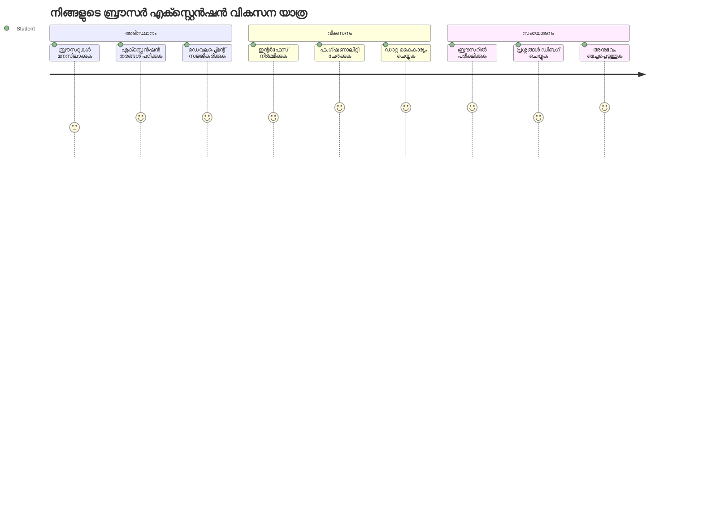
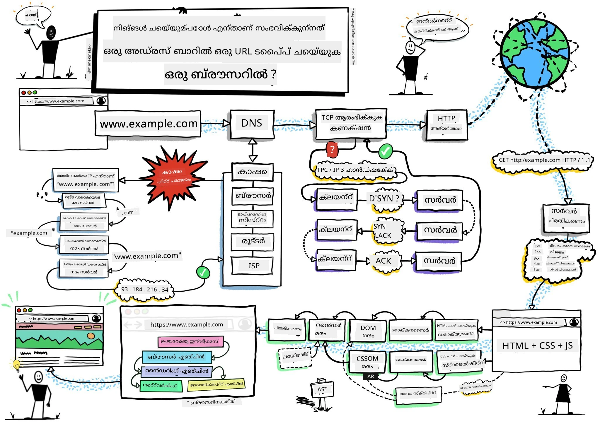
> സ്കെച്ച്നോട്ട് [Wassim Chegham](https://dev.to/wassimchegham/ever-wondered-what-happens-when-you-type-in-a-url-in-an-address-bar-in-a-browser-3dob)ലെ

## പ്രീ-ലക്ചർ ക്വിസ്

[പ്രീ-ലക്ചർ ക്വിസ്](https://ff-quizzes.netlify.app/web/quiz/23)

### പരിചയം

ബ്രൗസർ എക്സ്റ്റെൻഷനുകൾ നിങ്ങളുടെ വെബ് ബ്രൗസിംഗ് അനുഭവം മെച്ചപ്പെടുത്തുന്ന മിനി ആപ്ലിക്കേഷനുകളാണ്. ടിം ബേർണേഴ്‌സ്-ലിയുടെ സംവേദനാത്മക വെബിന്റെ ആദിത്യ കാഴ്ചപ്പാടുപോലെ, എക്സ്റ്റെൻഷനുകൾ ലളിതമായ ഡോക്യുമെന്റ് കാണുന്നതിനെക്കാൾ വരെ ബ്രൗസറിന്റെ ശേഷികളെ വ്യാപിപ്പിക്കുന്നു. നിങ്ങളുടെ അക്കൗണ്ടുകൾ സുരക്ഷിതമാക്കുന്ന പാസ്‌വേഡ് മാനേജരുകളിൽ നിന്ന് ഡിസൈനർമാർക്ക് തണുത്ത നിറങ്ങൾ ലഭ്യമാക്കുന്ന കളർ പിക്കർമാരിലേക്ക്, എക്സ്റ്റെൻഷനുകൾ പ്രതിദിനം നേരിടുന്ന ബ്രൗസിംഗ് വെല്ലുവിളികൾ പരിഹരിക്കുന്നു.

നിങ്ങളുടെ ആദ്യ എക്സ്റ്റെൻഷൻ നിർമ്മിക്കാനുള്ള മുന്‍പ്, ബ്രൗസറുകൾ എങ്ങനെ പ്രവർത്തിക്കുന്നു എന്ന് മനസ്സിലാക്കാം. അലക്സാണ്ടർ ഗ്രഹാം ബെല്ലിനു ടെലിഫോൺ കണ്ടുപിടിക്കുന്നതിന് മുമ്പ് ശബ്‌ദ സംപ്രേഷണം മനസിലാകേണ്ടതുപോലെ, ബ്രൗസറിന്റെ അടിസ്ഥാനങ്ങൾ അറിവുള്ളത് നിലവിലുള്ള ബ്രൗസർ സംവിധാനങ്ങളോട് സുഗമമായി സംയോജിപ്പിക്കുന്ന എക്സ്റ്റെൻഷനുകൾ സൃഷ്ടിക്കാൻ സഹായിക്കും.

ഈ പാഠത്തിന്റെ അവസാനം, നിങ്ങൾ ബ്രൗസർ ആർക്കിടെക്‌ചർ മനസ്സിലാക്കി നിങ്ങളുടെ ആദ്യ എക്സ്റ്റെൻഷൻ നിർമ്മിക്കാൻ തുടങ്ങിയിരിക്കുമെന്ന് ഉറപ്പാക്കാം.

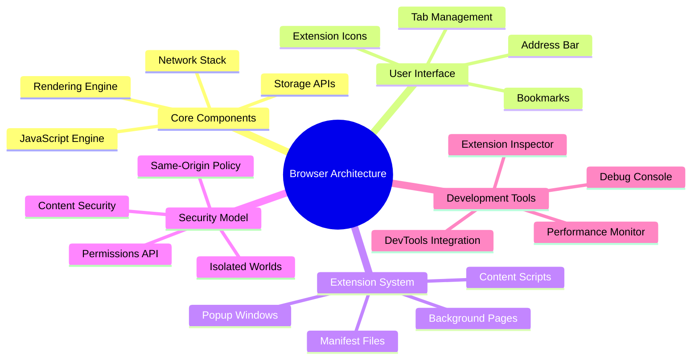
## വെബ് ബ്രൗസറുകൾ മനസ്സിലാക്കുക

ഒരു വെബ് ബ്രൗസർ അടിസ്ഥാനപരമായി ഒരു സങ്കീർണ്ണമായ ഡോക്യുമെന്റ് വ്യാഖ്യാതാവാണ്. നിങ്ങൾ അഡ്രസ് ബാറിൽ "google.com" type ചെയ്യുന്നപ്പോൾ, ബ്രൗസർ നിരവധി പ്രവർത്തനങ്ങൾ നടത്തുന്നു - ലോകമെമ്പാടുമുള്ള സെർവറുകളിൽ നിന്നുള്ള ഉള്ളടക്കം അഭ്യർത്ഥിച്ച്, പിന്നീട് ആ കോഡ് വിശകലനം ചെയ്ത് നിങ്ങൾ കാണുന്ന സംവേദനാത്മക വെബ് പേജുകളായി മാറ്റുന്നു.

ഈ പ്രക്രിയ 1990-ൽ ടിം ബേർണേഴ്‌സ്-ലിയുടെ രൂപകല്പന ചെയ്ത ആദ്യ വെബ് ബ്രൗസർ, WorldWideWeb, എല്ലാവർക്കും ഹൈപ്പർലിങ്കുചെയ്ത ഡോക്യുമെന്റുകൾ ലഭ്യമാക്കുന്നതിന്റെ സമാനത ആണ്.

✅ **ചെറിയ ചരിത്രം**: ആദ്യ ബ്രൗസർ 'WorldWideWeb' എന്നായിരുന്നു, 1990-ൽ സാർ ടിമോത്തി ബേർണേഴ്‌സ്-ലിയുടെ സൃഷ്ടി.

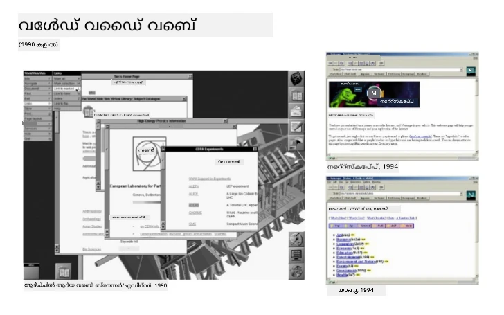
> ചില പ്രാരംഭ ബ്രൗസറുകൾ, [Karen McGrane](https://www.slideshare.net/KMcGrane/week-4-ixd-history-personal-computing) വഴി

### ബ്രൗസറുകൾ വെബ് ഉള്ളടക്കം എങ്ങനെ പ്രോസസ്സുചെയ്യുന്നു

ഒരു URL type ചെയ്ത ശേഷം ഒരു വെബ് പേജ് കാണുന്നതുവരെ നിരവധി സമന്വയപ്പെടുത്തിയ ഘട്ടങ്ങൾ സെക്കന്റുകളിൽ സംഭവിക്കുന്നു:

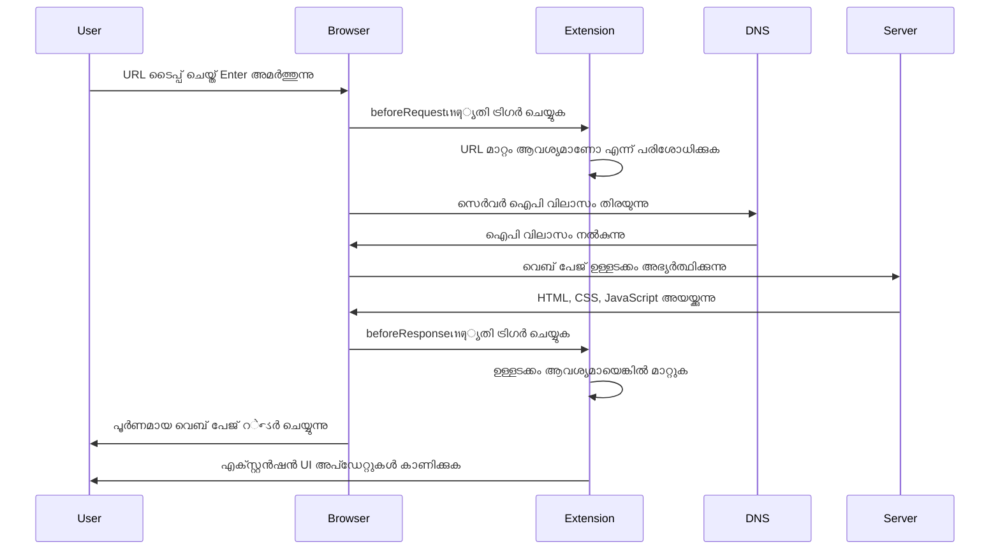
**ഈ പ്രക്രിയ എന്ത് ചെയ്യും:**
- **URL** മനുഷ്യർക്ക് വായിക്കാൻ കഴിയുന്നതിനേ DNS ലുക്കപ്പ് വഴി സെർവർ IP വിലാസമായി മാറ്റുന്നു
- **സുരക്ഷിത ബന്ധം സ്ഥാപിക്കുന്നു** HTTP അഥവാ HTTPS പ്രോട്ടോകോളുകൾ ഉപയോഗിച്ച് വെബ് സെർവറുമായി
- **വിശിഷ്ട വെബ് പേജ് ഉള്ളടക്കം** സെർവറിൽ നിന്ന് അഭ്യർത്ഥിക്കുന്നു
- **HTML മാർക്കപ്പ്, CSS സ്റ്റൈലിംഗ്, ജാവാസ്ക്രിപ്റ്റ് കോഡ്** സെർവറിൽ നിന്ന് സ്വീകരിക്കുന്നു
- **എല്ലാ ഉള്ളടക്കവും സംവേദനാത്മകമായ വെബ് പേജായി** മാറ്റുന്നു

### ബ്രൗസർ കോർ ഫീച്ചറുകൾ

അവധി ബ്രൗസറുകൾ പ്രക്രിയയിൽ എക്സ്റ്റെൻഷൻ ഡെവലപ്പർമാർക്ക് ഉപയോഗപ്പെടുത്താവുന്ന ധാരാളം ഫീച്ചറുകൾ ഉണ്ട്:

| ഫീച്ചർ | ലക്ഷ്യം | എക്സ്റ്റെൻഷൻ അവസരങ്ങൾ |
|---------|---------|------------------------|
| **Rendering Engine** | HTML, CSS, ജാവാസ്ക്രിപ്റ്റ് പ്രദർശിപ്പിക്കൽ | ഉള്ളടക്ക പരിഷ്‌ക്കരണം, സ്റ്റൈലിംഗ് സംയോജനം |
| **JavaScript Engine** | ജാവാസ്ക്രിപ്റ്റ് കോഡ് നിർവഹണം | കസ്റ്റം സ്ക്രിപ്റ്റുകൾ, API ഇടപെടലുകൾ |
| **Local Storage** | ഡാറ്റ ലൊക്കൽ ആയി സംരക്ഷിക്കൽ | ഉപയോക്തൃ പ്രാധാന്യങ്ങൾ, ക്യാഷ് ചെയ്ത ഡാറ്റ |
| **Network Stack** | വെബ് അഭ്യർത്ഥനകൾ കൈകാര്യം ചെയ്യുന്നു | അഭ്യർത്ഥന നിരീക്ഷണം, ഡാറ്റ വിശകലനം |
| **Security Model** | ഉപയോക്താക്കളെ ദുഷ്ട ഉള്ളടക്കം നിന്ന് സംരക്ഷിക്കുന്നു | ഉള്ളടക്ക ഫിൽറ്ററിങ്, സുരക്ഷാ മെച്ചപ്പെടുത്തലുകൾ |

**ഈ ഫീച്ചറുകൾ മനസ്സിലാക്കുന്നത് നിങ്ങളെ സഹായിക്കുന്നു:**
- **എവിടെ ഏറ്റവും വിലക്കേടുള്ളതാണ് എന്ന് കണ്ടെത്തുക** എക്സ്റ്റെൻഷൻ ചേർക്കാനുള്ളിടം
- **തികച്ചും അനുയോജ്യമായ ബ്രൗസർ API-കൾ തിരഞ്ഞെടുക്കുക** നിങ്ങളുടെ എക്സ്റ്റെൻഷന്റെ പ്രവർത്തനത്തിനായി
- **ബ്രൗസർ സംവിധാനങ്ങളോടും സംയോജിച്ചുള്ള കാര്യക്ഷമമായ എക്സ്റ്റെൻഷനുകൾ ഡിസൈൻ ചെയ്യുക**
- **എക്സ്റ്റെൻഷൻ ബ്രൗസർ സുരക്ഷാ മികച്ച രീതികൾ പാലിക്കുന്നതായി ഉറപ്പാക്കുക**

### ക്രോസ്-ബ്രൗസർ ഡെവലപ്മെന്റ് പരിഗണനകൾ

വിവിധ ബ്രൗസറുകൾ നിശ്ചിത സാങ്കേതികവിദ്യകൾ അല്പം വ്യത്യസ്തമായി നടപ്പിലാക്കുന്നു, പ്രോഗ്രാമിങ് ഭാഷകൾ ഒരേ ആൾഗോരിഥം വ്യത്യസ്തമായി കൈകാര്യം ചെയ്യുന്നതുപോലെ. ക്രോം, ഫയർഫോക്സ്, സഫാരി എന്നിവയിൽ ഓരോന്നിലും പ്രത്യേകതകൾ ഉണ്ട്, ഇത് എക്സ്റ്റെൻഷൻ വികസനത്തിൽ ഡെവലപ്പർ ശ്രദ്ധിക്കേണ്ടതാണ്.

> 💡 **പ്രൊ טיפ്**: [caniuse.com](https://www.caniuse.com) ഉപയോഗിച്ച് ഏത് വെബ് സാങ്കേതിക വിദ്യ ബ്രൗസറുകളിൽ പിന്തുണയ്ക്കപ്പെടുന്നുവെന്ന് പരിശോധിക്കുക. ഇത് നിങ്ങളുടെ എക്സ്റ്റെൻഷന്റെ ഫീച്ചറുകൾ പ്ലാൻ ചെയ്യുമ്പോൾ അനമോല്യം.

**എക്സ്റ്റെൻഷൻ ഡെവലപ്മെന്റിനുള്ള പ്രധാന പരിഗണനകൾ:**
- **ക്രോം, ഫയർഫോക്സ്, എഡ്ജ്** ബ്രൗസറുകളിൽ നിങ്ങളുടെ എക്സ്റ്റെൻഷൻ പരീക്ഷിക്കുക
- വ്യത്യസ്ത ബ്രൗസർ എക്സ്റ്റെൻഷൻ API-കളും മാനിഫെസ്റ്റ് ഫോർമാറ്റുകളും **അനുസരിക്കുക**
- വ്യത്യസ്ത പ്രകടന സ്വഭാവങ്ങളും പരിധികളും **കാര്യംകൊണ്ട് കൈകാര്യംചെയ്യുക**
- ലഭ്യമല്ലാത്ത ബ്രൗസർ-നിഷ്കർഷിത ഫീച്ചറുകൾക്കായി **വ്യാപാര മാർഗ്ഗങ്ങൾ നൽകുക**

✅ **ആനലിറ്റിക്സ്洞察നം**: നിങ്ങളുടെ വെബ് ഡെവലപ്മെന്റ് പ്രോജക്ടുകളിൽ ആനലിറ്റിക്സ് പാക്കേജുകൾ ഇൻസ്റ്റാൾ ചെയ്ത് നിങ്ങളുടെ ഉപയോക്താക്കൾ ഏതു ബ്രൗസർ ഉപയോഗിക്കുന്നത് അറിയാം. ഇത് ആദ്യം പിന്തുണയ്ക്കേണ്ട ബ്രൗസറുകളുടെ മുൻഗണന നൽകാൻ സഹായിക്കും.

## ബ്രൗസർ എക്സ്റ്റെൻഷനുകൾ മനസ്സിലാക്കുക

ബ്രൗസർ എക്സ്റ്റെൻഷനുകൾ സാധാരണ വെബ് ബ്രൗസിംഗ് വെല്ലുവിളികൾ പരിഹരിച്ചുകൊണ്ട് ബ്രൗസർ ഇന്റർഫെയ്‌സിൽ പ്രവർത്തക്ഷമത കൂട്ടുന്നു. ഏറെ സങ്കീർണ്ണമായ മറ്റ് ആപ്ലിക്കേഷനുകൾ അല്ലെങ്കിൽ പ്രവർത്തനപ്രവാഹങ്ങൾ ആവശ്യമില്ലാതെ എക്സ്റ്റെൻഷനുകൾ ഉപകരണങ്ങൾക്കും ഫീച്ചറുകൾക്ക് തൽക്ഷണ പ്രവേശനം നൽകുന്നു.

ഈ ആശയം ആദ്യകാല കമ്പ്യൂട്ടർ പയൻസ് ഡഗ്ലസ് എംഗൽബാർട്ടിന്റെ മനുഷ്യ ശേഷികൾ സാങ്കേതികവിദ്യ ഉപയോഗിച്ച് വർദ്ധിപ്പിക്കാനുള്ള കാഴ്ചപ്പാടിനെ അനുസരിക്കുന്നു - എക്സ്റ്റെൻഷനുകൾ നിങ്ങളുടെ ബ്രൗസറിന്റെ അടിസ്ഥാന പ്രവർത്തക്ഷമത വർദ്ധിപ്പിക്കുന്നു.

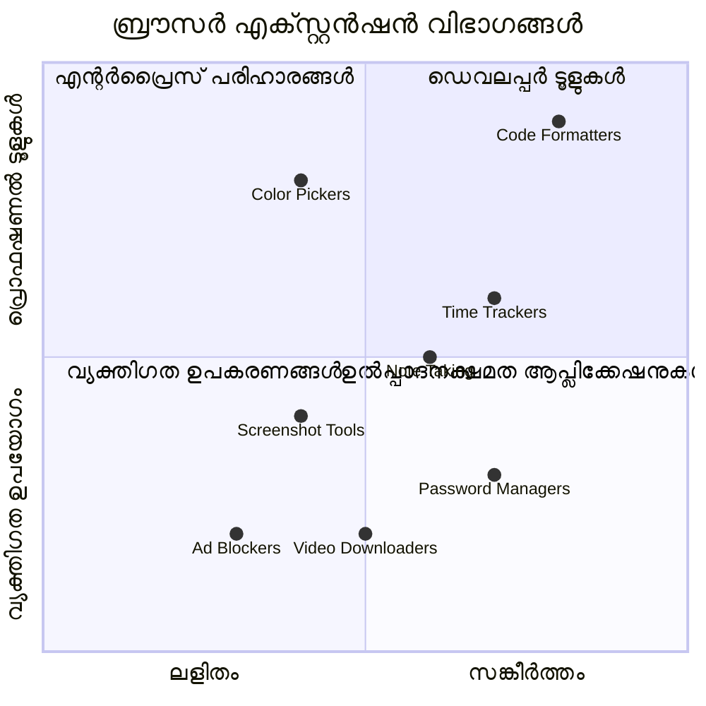
**പ്രസിദ്ധമായ എക്സ്റ്റെൻഷൻ വർഗ്ഗങ്ങളും അവയുടെ പ്രയോജനങ്ങളും:**
- **പ്രോഡക്ടിവിറ്റി ടൂളുകൾ**: ടാസ്‌ക് മാനേജർമാർ, നോട്ടെടുക്കൽ ആപ്പുകൾ, സമയം റnowrapട്രാക്കർമാർ നിങ്ങളുടെ സംഘടനയിൽ സഹായിക്കുന്നു
- **സുരക്ഷാ മെച്ചപ്പെടുത്തലുകൾ**: പാസ്‌വേര്‍ഡ് മാനേജർമാർ, അഡ്ബ്ലോക്കറുകൾ, ഗോപനീയതാ ഉപകരണങ്ങൾ നിങ്ങളുടെ ഡാറ്റ സംരക്ഷിക്കുന്നു
- **ഡെവലപ്പർ ടൂളുകൾ**: കോഡ് ഫോർമാറ്ററുകൾ, കളർ പിക്കറുകൾ, ഡീബഗ്ഗിംഗ് ഉപകരണങ്ങൾ ഡെവലപ്മെന്റ് ലളിതമാക്കുന്നു
- **ഉള്ളടക്കം മെച്ചപ്പെടുത്തൽ**: വായന മോഡുകൾ, വീഡിയോ ഡൌൺലോഡറുകൾ, സ്‌ക്രീൻഷോട്ട് ടൂളുകൾ നിങ്ങളുടെ വെബ് അനുഭവം മെച്ചപ്പെടുത്തുന്നു

✅ **പ്രതിഫലന ചോദ്യo**: നിങ്ങളുടെ പ്രിയപ്പെട്ട ബ്രൗസർ എക്സ്റ്റെൻഷനുകൾ ഏതൊക്കെയാണ്? അവ എന്ത് പ്രത്യേക ജോലികൾ ചെയ്യുന്നു, എങ്ങനെ നിങ്ങളുടെ ബ്രൗസിംഗ് അനുഭവം മെച്ചപ്പെടുത്തുന്നു?

### 🔄 **ശൈക്ഷിക പരിശോധന**
**ബ്രൗസർ ആർക്കിടെക്‌ചർ മനസ്സിലാക്കൽ**: എക്സ്റ്റെൻഷൻ വികസനത്തിലേക്ക് പോകുന്നതിന് മുമ്പ്, നിങ്ങൾക്ക് കഴിയേണ്ടത്:
- ✅ ബ്രൗസർ വെബ് അഭ്യർത്ഥനകൾ പ്രോസസ്സുചെയ്യുന്നതിനും ഉള്ളടക്കം എങ്ങനെ പ്രദർശിപ്പിക്കുന്നതും വിശദീകരിക്കുക
- ✅ ബ്രൗസർ ആർക്കിടെക് ചറിന്റെ പ്രധാന ഘടകങ്ങൾ തിരിച്ചറിയുക
- ✅ എക്സ്റ്റെൻഷനുകൾ ബ്രൗസർ പ്രവർത്തനക്ഷമതയുമായി എങ്ങനെ സംയോജിപ്പിക്കപ്പെടുന്നു എന്ന് മനസ്സിലാക്കുക
- ✅ ഉപയോക്താക്കളെ സംരക്ഷിക്കുന്ന സുരക്ഷാ മോഡൽ തിരിച്ചറിയുക

**വേഗമുള്ള സ്വയംപരിശോധന**: URL ടൈപ്പ് ചെയ്ത് ഒരു വെബ് പേജ് കാണുന്നതുവരെ പാത നിങ്ങൾക്ക് പിന്തുടരാം?
1. **DNS ലുക്കപ്പ്** URL IP വിലാസമായി മാറ്റുന്നു
2. **HTTP അഭ്യർത്ഥന** സെർവറിൽ നിന്നുള്ള ഉള്ളടക്കം നേടുന്നു
3. **പാഴ്സിംഗ്** HTML, CSS, ജാവാസ്ക്രിപ്റ്റ് പ്രോസസ്സിംഗ്
4. **റെൻഡറിംഗ്** അവസാന വെബ് പേജ് പ്രദർശിപ്പിക്കൽ
5. **എക്സ്റ്റെൻഷനുകൾ** ബഹുമുഖ ഘട്ടങ്ങളിൽ ഉള്ളടക്കം മാറ്റാം

## എക്സ്റ്റെൻഷനുകൾ ഇൻസ്റ്റാൾ ചെയ്യൽ, നിയന്ത്രണം

എക്സ്റ്റെൻഷൻ ഇൻസ്റ്റാളേഷൻ പ്രക്രിയ മനസ്സിലാക്കുന്നത് ഉപയോക്തൃ അനുഭവം പ്രതീക്ഷിക്കാനും സഹായിക്കുന്നു. ഇന്നത്തെ ആധുനിക ബ്രൗസറുകളിൽ ഈ പ്രക്രിയ മാനദണ്ഡം പോലെ സാന്ദ്രമായി ഈന്റർഫെയ്‌സ് രൂപകല്‍പ്പനയിൽ ചെറിയ വ്യത്യാസങ്ങളോടെ ഉണ്ട്.

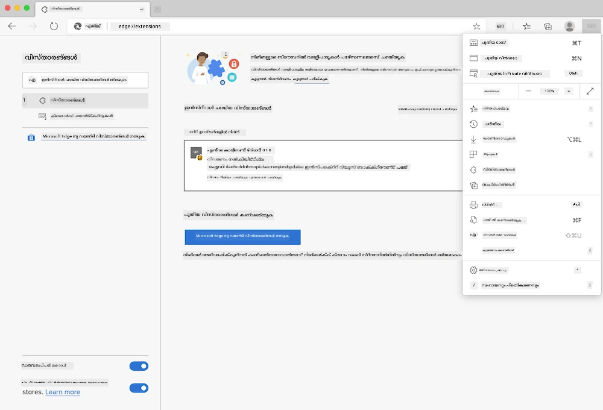

> **പ്രധാനത്തിന്**: നിങ്ങളുടെ സ്വന്തം എക്സ്റ്റെൻഷനുകൾ പരീക്ഷിക്കുമ്പോൾ ഡെവലപ്പർ മോഡ് സ്വിച്ച് ഓണാക്കി മറ്റു സ്റ്റോറുകളിൽ നിന്ന് എക്സ്റ്റെൻഷനുകൾ അനുവദിക്കുക.

### ഡെവലപ്പ്മെന്റ് എക്സ്റ്റൻഷൻ ഇൻസ്റ്റാളേഷൻ പ്രക്രിയ

സ്വന്തം എക്സ്റ്റെൻഷനുകൾ വികസിപ്പിക്കുകയും പരീക്ഷിക്കുകയും ചെയ്യുമ്പോൾ ഈ പ്രവൃത്തി പ്രവാഹം പിന്തുടരുക:

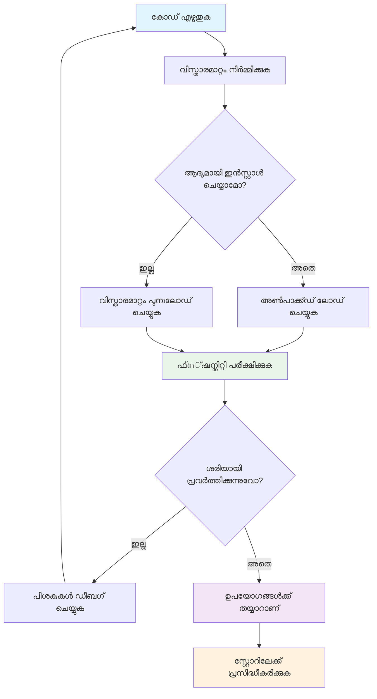
```bash
# ഘട്ടം 1: നിങ്ങളുടെ എക്സ്റ്റൻഷൻ നിർമ്മിക്കുക
npm run build
```

**ഈ കമാൻഡ് എന്ത് ചെയ്യും:**
- **ബ്രൗസർ പരിശീലിക്കാവുന്ന ഫയലുകളായി** നിങ്ങളുടെ സോഴ്‌സ് കോഡ് കമ്പൈൽ ചെയ്യുന്നു
- **ജാവാസ്ക്രിപ്റ്റ് മാഡ്യൂളുകൾ** മികച്ച പാക്കേജുകളായി കൂട്ടിച്ചേർക്കുന്നു
- **അവസാന എക്സ്റ്റെൻഷൻ ഫയലുകൾ** `/dist` ഫോൾഡറിൽ സൃഷ്ടിക്കുന്നു
- **ഇൻസ്റ്റാളേഷൻ, ടെസ്റ്റിംഗ് വേണ്ടി** എക്സ്റ്റെൻഷൻ തയ്യാറാക്കുന്നു

**പടി 2: ബ്രൗസർ എക്സ്റ്റെൻഷൻ പരിപാലന പേജ് തുറക്കുക**
1. നിങ്ങളുടെ ബ്രൗസറിന്റെ എക്സ്റ്റെൻഷൻ മാനേജ്‌മെന്റ് പേജ് **തുറക്കുക**
2. മുകളിൽ വലതുവശം "Settings and more" ബട്ടൺ (`...` ഐക്കൺ) **ക്ലിക്ക് ചെയ്യുക**
3. ഡ്രോപ്പ്ഡൗൺ മെനുവിൽ നിന്ന് "Extensions" **തിരഞ്ഞെടുക്കുക**

**പടി 3: നിങ്ങളുടെ എക്സ്റ്റൻഷൻ ലോഡ് ചെയ്യുക**
- **പുതിയ ഇൻസ്റ്റാളേഷനുകൾക്കായി**: `load unpacked` തിരഞ്ഞെടുക്കുകയും `/dist` ഫോൾഡർ തിരഞ്ഞെടുക്കുകയും ചെയ്യുക
- **അപ്ഡേറ്റുകൾക്കായി**: ഇതിനകം ഇൻസ്റ്റാൾ ചെയ്ത എക്സ്റ്റെൻഷന്റെ അടുത്തുള്ള `reload` ക്ലിക്ക് ചെയ്യുക
- **പരിശോധനയ്ക്കായി**: കൂടുതൽ ഡീബഗ്ഗിംഗ് ഫീച്ചറുകൾക്ക് "Developer mode" എനേബിൾ ചെയ്യുക

### പ്രൊഡക്ഷൻ എക്സ്റ്റെൻഷൻ ഇൻസ്റ്റാളേഷൻ

> ✅ **കുറിപ്പ്**: ഈ ഡെവലപ്പ്മെന്റ് നിർദ്ദേശങ്ങൾ നിങ്ങളുടെ സ്വന്തം നിർമ്മിച്ച എക്സ്റ്റെൻഷനുകൾക്കായേയുള്ളതാണ്. പ്രസിദ്ധീകരിച്ച എക്സ്റ്റെൻഷനുകൾ ഇൻസ്റ്റാൾ ചെയ്യാൻ ഔദ്യോഗിക ബ്രൗസർ എക്സ്റ്റെൻഷൻ സ്റ്റോറുകൾ സന്ദർശിക്കുക, എ.ഗ., [Microsoft Edge Add-ons store](https://microsoftedge.microsoft.com/addons/Microsoft-Edge-Extensions-Home).

**വ്യത്യാസം മനസ്സിലാക്കുക:**
- **ഡെവലപ്പ്മെന്റ് ഇൻസ്റ്റാളേഷനുകൾ** വികസനത്തിനിടെ പ്രസിദ്ധീകരിക്കാത്ത എക്സ്റ്റെൻഷനുകൾ പരിശോധന നടത്താൻ അനുവദിക്കുന്നു
- **സ്റ്റോർ ഇൻസ്റ്റാളേഷനുകൾ** പരിശാലനം കഴിഞ്ഞ പ്രസിദ്ധീകരിച്ച എക്സ്റ്റെൻഷനുകൾ സ്വയം അപ്ഡേറ്റ് ചെയ്യുന്നതോടൊപ്പം നൽകുന്നു
- **സൈഡ്‌ലോഡിങ്** ഔദ്യോഗിക സ്റ്റോറിന് പുറത്തുനിന്നും എക്സ്റ്റെൻഷനുകൾ ഇൻസ്റ്റാൾ ചെയ്യാൻ അനുവദിക്കുന്നു (ഡെവലപ്പർ മോദ് ആവശ്യമാണ്)

## നിങ്ങളുടെ കാർബൺ പാദച്ചിഹ്നം എക്സ്റ്റെൻഷൻ നിർമ്മിക്കൽ

നിങ്ങളുടെ പ്രദേശത്തിന്റെ ഊർജ്ജ ഉപയോഗത്തിന്‍റെ കാർബൺ പാദം പ്രദർശിപ്പിക്കുന്ന ഒരു ബ്രൗസർ എക്സ്റ്റെൻഷൻ സൃഷ്ടിക്കും. ഈ പ്രോജക്റ്റ് എക്സ്റ്റെൻഷൻ വികസനത്തിന്റെ അടിസ്ഥാന സിദ്ധാന്തങ്ങൾ പ്രദർശിപ്പിക്കുന്നതായും പരിസ്ഥിതി ബോധവൽക്കരണത്തിന് പ്രായോഗികമായ ഉപകരണം ഒരുക്കുന്നതായും സേവിക്കും.

ജോൺ ഡ്യൂയിയുടെ വിദ്യാഭ്യാസ സിദ്ധാന്തങ്ങൾ പോലെ "നടന്ന് പഠിക്കുക" എന്ന തത്വം പിന്തുടരുന്ന സമീപനമാണ് ഇത് - സാങ്കേതിക കഴിവുകളും പ്രവർത്തിപ്പിക്കുന്ന യഥാർത്ഥ ലോക പ്രയോഗങ്ങളിലും സംയോജിപ്പിക്കുന്നു.

### പ്രോജക്റ്റ് ആവശ്യകതകൾ

വർക്ക് ആരംഭിക്കുമ്ബോൾ ആവശ്യമായ വിഭവങ്ങളും ആശ്രിതങ്ങളും ശേഖരിക്കാം:

**ആവശ്യമായ API ആക്സസ്:**
- **[CO2 Signal API കി](https://www.co2signal.com/)**: നിങ്ങളുടെ ഇമെയിൽ വിലാസം നൽകുക, നിങ്ങളുടെ സൗജന്യ API കീ ലഭിക്കും
- **[പ്രദേശിക കോഡ്](http://api.electricitymap.org/v3/zones)**: [Electricity Map](https://www.electricitymap.org/map) ഉപയോഗിച്ച് നിങ്ങളുടെ പ്രദേശ കോഡ് കണ്ടെത്തുക (ഉദാ. Boston-ന് 'US-NEISO')

**ഡെവലപ്പ്മെന്റ് ഉപകരണങ്ങൾ:**
- **[Node.js and NPM](https://www.npmjs.com)**: പ്രോജക്റ്റ് ആശ്രിതങ്ങൾ ഇൻസ്റ്റാൾ ചെയ്യുന്നതിനുള്ള പാക്കേജ് മാനേജർ
- **[സ്റ്റാർട്ടർ കോഡ്](../../../../5-browser-extension/start)**: വികസനം ആരംഭിക്കാൻ `start` ഫോൾഡർ ഡൗൺലോഡ് ചെയ്യുക

✅ **കൂടുതൽ പഠിക്കൂ**: നിങ്ങളുടെ പാക്കേജ് മാനേജ്മെന്റ് കഴിവുകൾ മെച്ചപ്പെടുത്താൻ ഈ [സമ്പൂർണമായ Learn മൊഡ്യൂൾ](https://docs.microsoft.com/learn/modules/create-nodejs-project-dependencies/?WT.mc_id=academic-77807-sagibbon) ഉപയോഗിക്കുക

### പ്രോജക്റ്റ് ഘടന മനസ്സിലാക്കൽ

പ്രോജക്റ്റ് ഘടന മനസ്സിലാക്കുന്നത് വികസന ജോലി കാര്യക്ഷമമാക്കുന്നതിന് സഹായിക്കുന്നു. അലക്സാൻഡ്രിയ ലൈബ്രറിയെല്ലാം അറിവ് എളുപ്പത്തിൽ തിരയാൻ ക്രമീകരിക്കപ്പെട്ടതുപോലെ, നല്ല ക്രമീകരിച്ച കോഡ് ബേസ് വികസനം കാര്യക്ഷമമാക്കും:

```
project-root/
├── dist/                    # Built extension files
│   ├── manifest.json        # Extension configuration
│   ├── index.html           # User interface markup
│   ├── background.js        # Background script functionality
│   └── main.js              # Compiled JavaScript bundle
├── src/                     # Source development files
│   └── index.js             # Your main JavaScript code
├── package.json             # Project dependencies and scripts
└── webpack.config.js        # Build configuration
```

**പ്രതിയോഗികളുടെ ബോധ്യത്തിൽ ഫയലുകൾ അധികം ചെയ്യുന്നത്:**
- **`manifest.json`**: എക്സ്റ്റെൻഷന്റെ മmetadata, അനുമതികൾ, എൻട്രി പോയിന്റുകൾ നിർവ്വചിക്കുന്നു
- **`index.html`**: എക്സ്റ്റെൻഷന് ക്ലിക്ക് ചെയ്തപ്പോൾ കാണുന്ന ഉപയോക്തൃ ഇന്റർഫേസ് സൃഷ്ടിക്കുന്നു
- **`background.js`**: പശ്ചാത്തല ടാസ്കുകളും ബ്രൗസർ ഇവന്റ് ലിസ്സനറുകളും കൈകാര്യം ചെയ്യുന്നു
- **`main.js`**: ബിൽഡ് പ്രക്രിയക്ക് ശേഷം അവസാനബന്ധിപ്പിച്ച ജാവാസ്ക്രിപ്റ്റ് ഫയൽ
- **`src/index.js`**: പ്രധാന വികസന കോഡ്, ഇത് `main.js` ആയി കമ്പൈൽ ചെയ്യപ്പെടുന്നു

> 💡 **സംഘടന ടിപ്**: API കിയും പ്രദേശിക കോഡും സുരക്ഷിതമായ കുറിപ്പിൽ സൂക്ഷിക്കുക. വികസന സമയത്ത് ഈ മൂല്യങ്ങൾ എളുപ്പത്തിൽ കണ്ടെത്താം. 

✅ **സുരക്ഷാ കുറിപ്പ്**: നിങ്ങളുടെ API കീകളും സენსിറ്റീവ് ക്രെഡൻഷ്യലുകളും കോഡ് റപ്പോസിറ്ററിയിൽ കമിറ്റ് ചെയ്യരുത്. അടുത്ത ഘട്ടങ്ങളിൽ ഈ സുരക്ഷിത കൈകാര്യം എങ്ങനെ നടത്താമെന്ന് കാണിക്കും.

## എക്സ്റ്റെൻഷൻ ഇന്റർഫേസ് സൃഷ്ടിക്കൽ

ഇപ്പോള്‍ ഉപയോക്തൃ ഇന്റർഫേസ് ഘടകങ്ങൾ നിർമ്മിക്കും. എക്സ്റ്റെൻഷൻ രണ്ട് സ്ക്രീൻ രീതിയിൽ പ്രവര്‍ത്തിക്കുന്നു: പ്രാരംഭ ക്രമീകരണത്തിനുള്ള കോൺഫിഗറേഷൻ സ്‌ക്രീൻ, ഡാറ്റ പ്രദർശനത്തിനുള്ള റിസൾട്‌സ് സ്‌ക്രീൻ.

ഈ സമീപനം ഇൻറർഫേസ് ഡിസൈനിലെ പ്രോഗ്രസീവ് ഡിസ്ക്ലോഷർ തത്വം പിന്തുടരുന്നു - ലളിതമായ ഓർഡറിൽ വിവരങ്ങളും ഓപ്ഷനുകളും വെളിപ്പെടുത്തി ഉപഭോക്താക്കളെ അമിതമായുള്ള ബാധ്യതയിൽ നിന്ന് രക്ഷിക്കുന്നു.

### എക്സ്റ്റെൻഷൻ കാഴ്ചകൾ അവലോകനം

**സെറ്റപ്പ് കാഴ്ച** - ആദ്യകാല ഉപയോക്തൃ ക്രമീകരണം:  
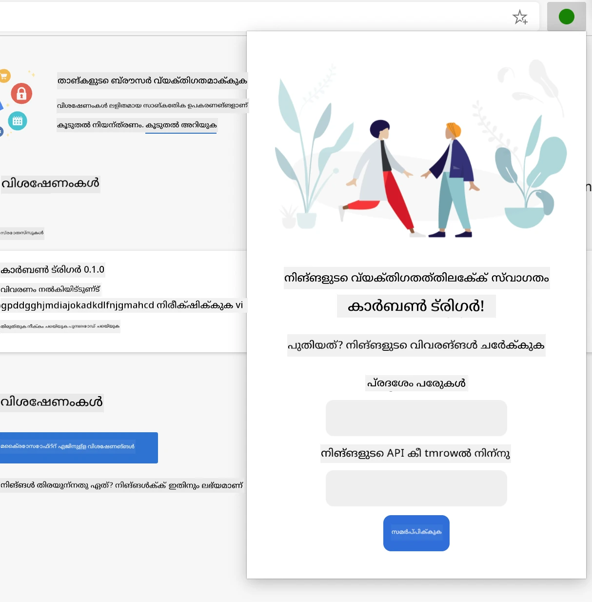

**ഫല കാഴ്ച** - കാർബൺ പാദച്ചിഹ്ന ഡാറ്റാ പ്രദർശനം:  
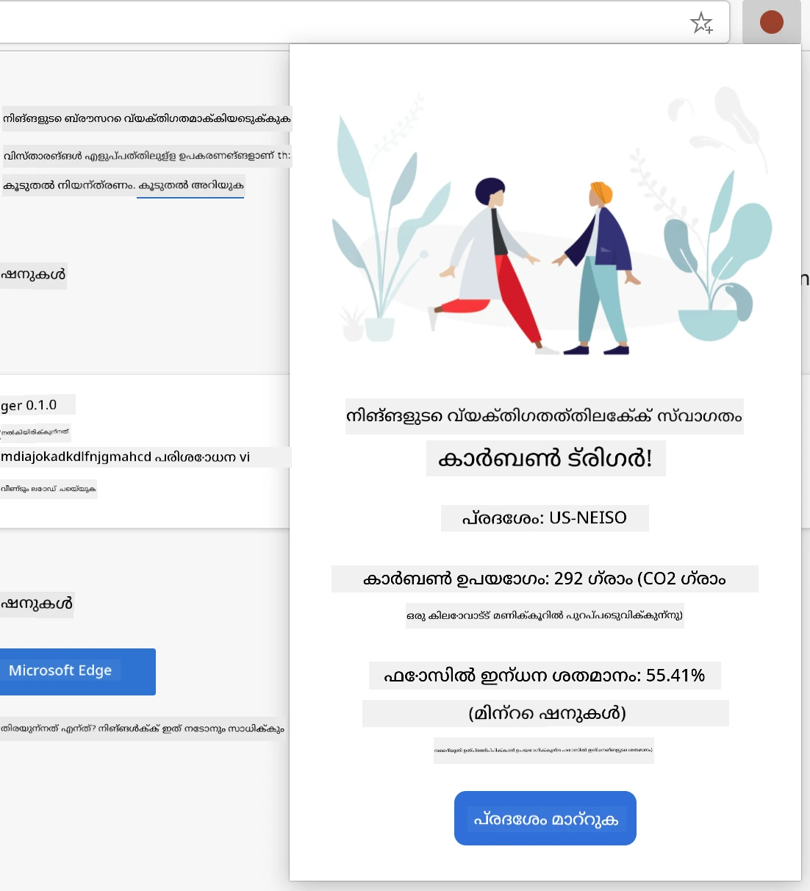

### ക്രമീകരണ ഫോം നിർമ്മിക്കല്‍

സെറ്റപ്പ് ഫോം ആദ്യ ഉപയോക്തൃ ഉപയോഗത്തിനിടെ ക്രമീകരണ ഡാറ്റ ശേഖരിക്കുന്നു. ക്രമീകരിച്ചതിനു ശേഷം, ഈ വിവരം ബ്രൗസർ സ്റ്റോറേജിൽ സംരക്ഷിക്കപ്പെടുന്നു ഭാവി സെഷനുകൾക്ക്.

`/dist/index.html` ഫയലിൽ, ഈ ഫോം ഘടന ചേർക്കുക:

```html
<form class="form-data" autocomplete="on">
    <div>
        <h2>New? Add your Information</h2>
    </div>
    <div>
        <label for="region">Region Name</label>
        <input type="text" id="region" required class="region-name" />
    </div>
    <div>
        <label for="api">Your API Key from tmrow</label>
        <input type="text" id="api" required class="api-key" />
    </div>
    <button class="search-btn">Submit</button>
</form>
```

**ഈ ഫോം എന്ത് ചെയ്യുന്നു:**
- **സെമാന്റിക് ഫോം ഘടന** ശരിയായ ലേബലുകളും ഇൻപുട്ട് അസോസിയേഷനുകളും ചേർത്ത് സൃഷ്ടിക്കുന്നു
- മെച്ചപ്പെട്ട ഉപയോക്തൃ അനുഭവത്തിന് ബ്രൗസർ ഓട്ടോ-കമ്പ്ലീറ്റ് ഫംഗ്ഷണാലിറ്റി കഴിയും
- ജനനത്തിനുമുമ്പ് രണ്ട് ഫീൽഡുകളും പൂരിപ്പിക്കേണ്ടത് ആവശ്യമാണ് (`required` അറ്റ്രിബ്യൂട്ട് ഉപയോഗിച്ച്)
- ലളിതമായ സ്റ്റൈലിംഗിനും ജാവാസ്ക്രിപ്റ്റ് ലക്ഷ്യമിടുന്നതിനും വിവരിക്കുന്ന ക്ളാസ് നെയിമുകൾ ഉപയോഗിക്കുന്നു
- എക്സ്റ്റെൻഷൻ ആദ്യം ക്രമീകരിക്കുന്ന ഉപയോക്താക്കള്ക്ക് വ്യക്തമായ നിർദ്ദേശങ്ങൾ നൽകുന്നു

### ഫല പ്രദർശനം നിർമ്മിക്കൽ

അടുത്തത്, കാർബൺ പാദച്ചിഹ്ന ഡാറ്റ പ്രദർശിപ്പിക്കുന്ന ഫലം ഏരിയ സൃഷ്ടിക്കുക. ഫോം താഴെ ഈ HTML ചേർക്കുക:

```html
<div class="result">
    <div class="loading">loading...</div>
    <div class="errors"></div>
    <div class="data"></div>
    <div class="result-container">
        <p><strong>Region: </strong><span class="my-region"></span></p>
        <p><strong>Carbon Usage: </strong><span class="carbon-usage"></span></p>
        <p><strong>Fossil Fuel Percentage: </strong><span class="fossil-fuel"></span></p>
    </div>
    <button class="clear-btn">Change region</button>
</div>
```

**ഈ ഘടന നൽകുന്നത്:**
- **`loading`**: API ഡാറ്റ ലഭിക്കുന്നതിനിടെ ലോഡിംഗ് സന്ദേശം കാണിക്കുന്നു
- **`errors`**: API വിളികൾ പരാജയപ്പെട്ടാൽ അല്ലെങ്കിൽ ഡാറ്റ അസാധുവായാൽ പിശകുകൾ പ്രദർശിപ്പിക്കുന്നു
- **`data`**: ഡീബഗ്ഗിംഗിന് കോഴിക്കുള്ള വാസ്തവ ഡാറ്റ സൂക്ഷിക്കുന്നു
- **`result-container`**: ഉപയോഗപ്രദമായ കാർബൺ പാദച്ചിഹ്ന വിവരങ്ങൾ ഫോർമാറ്റ് ചെയ്ത് കാണിക്കുന്നു
- **`clear-btn`**: ഉപഭോക്താക്കൾക്ക് പ്രദേശം മാറ്റാനും എക്സ്റ്റെൻഷൻ വീണ്ടും ക്രമീകരിക്കാനും അനുവദിക്കുന്നു

### ബിൽഡ് പ്രക്രിയ സജ്ജമാക്കൽ

ഇപ്പോൾ പ്രോജക്റ്റ് ആശ്രിതങ്ങൾ ഇൻസ്റ്റാൾ ചെയ്ത് ബിൽഡ് പ്രക്രിയ പരീക്ഷിക്കാം:

```bash
npm install
```

**ഈ ഇൻസ്റ്റാളേഷൻ പ്രക്രിയ ചെയ്യുന്നത്:**
- `package.json`ൽ സൂചിപ്പിച്ച വെബ്‌പാക്കും മറ്റ് ഡെവലപ്പ്മെന്റ് ആശ്രിതങ്ങളും അത下载് ചെയ്യുന്നു
- ആധുനിക ജാവാസ്ക്രിപ്റ്റ് കമ്പൈലിംഗിനായി ബിൽഡ് ടൂൾചെയ്ന് ക്രമീകരിക്കുന്നു
- എക്സ്റ്റെൻഷൻ നിർമ്മാണത്തിനും പരീക്ഷണത്തിനും ഡെവലപ്പ്മെന്റ് പരിസരം തയ്യാറാക്കുന്നു
- കോഡ് ബണ്ട്ലിംഗ്, മെച്ചപ്പെടുത്തൽ, ക്രോസ്-ബ്രൗസർ അനുയോജ്യകത ലഭ്യമാക്കുന്നു

> 💡 **ബിൽഡ് പ്രക്രിയ വിവരം**: വെബ്പാക്ക് `/src/index.js` നിന്നുള്ള നിങ്ങളുടെ സോഴ്‌സ് കോഡ് `/dist/main.js` ആയി ബണ്ടിൾ ചെയ്യുന്നു. ഈ പ്രക്രിയ പ്രൊഡക്ഷൻ ന്റെ കാണിനും ബ്രൗസർ അനുയോജ്യതയ്‍ക്ക് ഏറ്റവും അനുയോജ്യമായി കോഡ് മെച്ചപ്പെടുത്തുന്നു.

### നിങ്ങളുടെ പുരോഗതി പരീക്ഷിക്കുക

ഇപ്പോൾ നിങ്ങൾക്ക് നിങ്ങളുടെ എക്സ്റ്റെൻഷൻ പരീക്ഷിക്കാം:
1. **നടത്തുക** നിങ്ങളുടെ കോഡ് కంపൈൽ ചെയ്യാൻ build കമാൻഡ്  
2. **ലോഡ് ചെയ്യുക** വികസക മോഡ് ഉപയോഗിച്ച് ബ്രൗസറിൽ എക്സ്റ്റൻഷൻ  
3. **സ്ഥിരീകരിക്കുക** ഫॉर्म ശരിയായി പ്രദർശിപ്പിക്കുന്നതും പ്രൊഫഷണലായി കാണപ്പെടുന്നതും  
4. **പരിശോധിക്കുക** എല്ലാ ഫോർം ഘടകങ്ങളും ശരിയായി നിലനിൽക്കുന്നുവെന്ന്, പ്രവർത്തനക്ഷമമാണെന്ന്  

**നിങ്ങൾ നേടിയതായി:**  
- **തയാറാക്കി** നിങ്ങളുടെ എക്സ്റ്റൻഷനിന്റെ അടിസ്ഥാന HTML ഘടന  
- **സൃഷ്ടിച്ചു** കോൺഫിഗറേഷൻ, ഫലം ഇന്റർഫേസുകൾ ശ്രേഷ്ടമായ സെമാന്റിക്ക് മാർക്കപ്പുമായി  
- **അട്ടിച്ചെറിഞ്ഞു** ആധുനിക ഡവലപ്പ്മെന്റ് വർക്ക്‌ഫ്ലോ സ്ഥാപനത്തിൽ നിലവാരപരമായ ടൂളുകൾ ഉപയോഗിച്ച്  
- **തയാറാക്കി** ഇൻററാക്ടീവ് ജാവാസ്ക്രിപ്റ്റ് ഫംഗ്ഷണാലിറ്റി ചേർക്കാനുള്ള ആധാരം  

### 🔄 **പഠനപരപരിശോധന**  
**എക്സ്റ്റൻഷൻ വികസന പുരോഗതി**: തുടരെ പോകുന്നതിന് മുമ്പ് നിങ്ങളുടെ അറിവ് പരിശോധിക്കുക:  
- ✅ പ്രോജക്ട് ഘടനയിലെ ഓരോ ഫയലിന്റെയും ഉദ്ദേശ്യം വിശദീകരിക്കാൻ നിങ്ങൾക്ക് സാധിക്കുമോ?  
- ✅ build പ്രക്രിയ നിങ്ങളുടെ സോഴ്സ് കോഡ് എങ്ങനെ പരിവർത്തനം ചെയ്യുന്നതെന്ന് നിങ്ങൾക്ക് മനസ്സിലാണോ?  
- ✅ കോൺഫിഗറേഷനും ഫലങ്ങളും വ്യത്യസ്ത UI വിഭാഗങ്ങളിലേക്ക് തിരിച്ചറിയുന്നതിനുള്ള കാരണം എന്താണ്?  
- ✅ ഫോർം ഘടന അതിന്റെ ഉപയോഗപ്രദതക്കും ലഭ്യതക്കും എങ്ങനെ സഹായമാകുന്നു?  

**ഡവലപ്പ്മെന്റ് വർക്ക്‌ഫ്ലോ ബോധം**: ഇനി നിങ്ങളൊക്കെ അനുസരിച്ചു കഴിയും:  
1. **സാധുവാക്കുക** നിങ്ങളുടെ എക്സ്റ്റൻഷൻ ഇന്റർഫേസിനായി HTML, CSS മാറ്റങ്ങൾ  
2. **നടത്തുക** build കമാൻഡ് നിങ്ങളുടെ മാറ്റങ്ങൾ സംസ്കരിക്കാൻ  
3. **രീലോഡ് ചെയ്യുക** എക്സ്റ്റൻഷൻ ബ്രൗസറിൽ പുതുക്കലുകൾ പരീക്ഷിക്കാൻ  
4. **ഡീബഗ് ചെയ്യുക** ബ്രൗസർ ഡവലപ്പർ ടൂളുകൾ ഉപയോഗിച്ച് പ്രശ്നങ്ങൾ  

നിങ്ങൾ ബ്രൗസർ എക്സ്റ്റൻഷൻ വികസനത്തിന് ആദ്യഘട്ടം പൂർത്തിയാക്കി. Wright സഹോദരങ്ങൾ പറക്കുന്നതിന് മുമ്പ് എയറോഡൈനാമിക്സ് മനസ്സിലാക്കേണ്ടതുപോലെ, ഈ അടിസ്ഥാന ആശയങ്ങൾ മനസ്സിലാക്കുന്നത് ഇനി കൂടുതൽ സങ്കീർണമായ ഇടപെടൽ ഫീച്ചറുകൾ നിർമ്മിക്കാൻ സഹായിക്കും.  

## GitHub Copilot ഏജന്റ് ചലഞ്ച് 🚀  

ഏജന്റ് മോഡ് ഉപയോഗിച്ച് താഴെ പറയുന്ന അനുബന്ധം പൂർത്തിയാക്കുക:  

**വിവരണം:** API കീകൾ, മേഖലാ കോഡുകൾ നൽകുമ്പോൾ ഉപയോക്തൃ അനുഭവം മെച്ചപ്പെടുത്താൻ ഫോം സാധുത പരിശോധനയും ഫീഡ്‌ബാക്കും ചേർക്കുക.  

**പ്രോമ്പ്റ്റ്:** API കീ ഫീൽഡ് കുറഞ്ഞത് 20 അക്ഷരങ്ങൾ ഉള്ളതായി പരിശോധിക്കുന്ന, മേഖലാ കോഡ് ശരിയായ ഫോർമാറ്റ് (ഉദാ: 'US-NEISO') പാലിക്കുന്നുവെന്ന് പരിശോധിക്കുന്ന ജാവാസ്ക്രിപ്റ്റ് സാധുത ഫംഗ്ഷനുകൾ സൃഷ്ടിക്കുക. ശരിയായ ഇൻപുട്ടുകൾക്ക് പഴുത്തു പോയ, തെറ്റായവയ്ക്ക് ചുവപ്പ് ബോർഡർ നിറം വിസ്വൽ ഫീഡ്‌ബാക്കായി നൽകുക. സുരക്ഷാലක්ෂണങ്ങളായി API കീ കാണിച്ചോ മറച്ചോ ചെയ്യാനുള്ള ടോഗിൾ ഫീച്ചറും ചേർക്കുക.  

[agent mode](https://code.visualstudio.com/blogs/2025/02/24/introducing-copilot-agent-mode) സംബന്ധിച്ച് കൂടുതൽ അറിയുക.  

## 🚀 ചലഞ്ച്  

ഒരു ബ്രൗസർ എക്സ്റ്റൻഷൻ സ്റ്റോർ പരിശോധിച്ച് നിങ്ങളുടെ ബ്രൗസറിൽ ഒന്നാമമായി ഇൻസ്റ്റാൾ ചെയ്യുക. അതിന്റെ ഫയലുകൾ താൽപര്യമുള്ള രീതികളിൽ പരിശോധിക്കുക. നിങ്ങൾ എന്താണ് കണ്ടെത്തുന്നത്?  

## പോസ്റ്റ്-ലെക്ചർ ക്വിസ്  

[Post-lecture quiz](https://ff-quizzes.netlify.app/web/quiz/24)  

## അവലോകനം & സ്വയം പഠനം  

ഈ പാഠത്തിൽ നിങ്ങൾ വെബ് ബ്രൗസറിന്റെ ചരിത്രത്തെ കുറിച്ച് കുറച്ച് പഠിച്ചു; ലോകവ്യാപക വെബിന്റെ വെബ് കണ്ടുപിടുത്തക്കാരൻമാർ അതിന്റെ ഉപയോഗത്തെ എങ്ങനെ കണക്കാക്കി എന്നതിൽ കൂടുതൽ അറിയാൻ ഈ അവസരം ഉപയോഗിക്കുക. ചില ഉപകാരപ്രദമായ സൈറ്റുകൾ:  

[The History of Web Browsers](https://www.mozilla.org/firefox/browsers/browser-history/)  

[History of the Web](https://webfoundation.org/about/vision/history-of-the-web/)  

[An interview with Tim Berners-Lee](https://www.theguardian.com/technology/2019/mar/12/tim-berners-lee-on-30-years-of-the-web-if-we-dream-a-little-we-can-get-the-web-we-want)  

### ⚡ **അടുത്ത 5 മിനിറ്റുകൾക്കുള്ളിൽ നിങ്ങൾ ചെയ്യാവുന്ന കാര്യങ്ങൾ**  
- [ ] Chrome/Edge എക്സ്റ്റൻഷൻസ് പേജ് (chrome://extensions) തുറന്ന് ഇൻസ്റ്റാൾ ചെയ്ത എക്സ്റ്റൻഷനുകൾ പരിശോധിക്കുക  
- [ ] ഒരു വെബ് പേജ് ലോഡ് ചെയ്യുമ്പോൾ ബ്രൗസറിന്റെ DevTools നെറ്റ്‌വർക്ക് ടാബ് കാണുക  
- [ ] പേജ് സോഴ്‌സ് (Ctrl+U) കാണാൻ ശ്രമിക്കുക, HTML ഘടന അവലോകനം ചെയ്യുക  
- [ ] ഏതെങ്കിലും വെബ് പേജ് ഘടകം ഇൻസ്പെക്ട് ചെയ്ത് ദി CSS മാറ്റങ്ങൾ പരീക്ഷിക്കുക  

### 🎯 **ഈ മണിക്കൂറിൽ നിങ്ങൾ നേടാവുന്ന കാര്യങ്ങൾ**  
- [ ] പോസ്റ്റ്-ലെക്ക്ചർ ക്വിസ് പൂർത്തിയാക്കി ബ്രൗസർ അടിസ്ഥാനങ്ങളിലായി മനസ്കരിക്കുക  
- [ ] ഒരു അടിസ്ഥാന manifest.json ഫയൽ ക്രിയേറ്റ് ചെയ്യുക ബ്രൗസർ എക്സ്റ്റൻഷന്വിനായി  
- [ ] ഒരു ലളിത "Hello World" എക്സ്റ്റൻഷൻ_popup പ്രദർശിപ്പിക്കുന്നതുമായുള്ള നിർമ്മിക്കുക  
- [ ] ഡവലപ്പർ മോഡിൽ നിങ്ങളുടെ എക്സ്റ്റൻഷൻ ലോഡ് ചെയ്ത് പരീക്ഷിക്കുക  
- [ ] ലക്ഷ്യമിടുന്ന ബ്രൗസറിന്റെ എക്സ്റ്റൻഷൻ ഡോക്യുമെന്റേഷൻ പരിശോധിക്കുക  

### 📅 **നിങ്ങളുടെ ആഴ്ചപോലുള്ള എക്സ്റ്റൻഷൻ യാത്ര**  
- [ ] യഥാർത്ഥ ഉപയോഗപ്രദതയുള്ള പ്രവർത്തനക്ഷമമായ ബ്രൗസർ എക്സ്റ്റൻഷൻ പൂരിപ്പിക്കുക  
- [ ] കണ്ടന്റ് സ്രിപ്റ്റുകൾ, ബാക്ക്ഗ്രൗണ്ട് സ്രിപ്റ്റുകൾ, പൊപ്പപ്പ് ഇടപെടലുകൾ പഠിക്കുക  
- [ ] സ്റ്റോറേജ്, ടാബുകൾ, മെസ്സേജിങ് പോലുള്ള ബ്രൗസർ APIs നുദ്ധരണ മുന്പു നേടുക  
- [ ] എക്സ്റ്റൻഷന്റെ ഉപയോക്തൃ സൗഹൃദ ഇന്റർഫേസുകൾ രൂപകല്പന ചെയ്യുക  
- [ ] വ്യത്യസ്ത വെബ്സൈറ്റുകളിൽ, സാഹചര്യങ്ങളിൽ നിങ്ങളുടെ എക്സ്റ്റൻഷൻ പരിശോധിക്കുക  
- [ ] എക്സ്റ്റൻഷൻ ബ്രൗസർ സ്റ്റോറിലേക്ക് പ്രസിദ്ധീകരിക്കുക  

### 🌟 **നിങ്ങളുടെ മാസാന്തം ബ്രൗസർ വികസനം**  
- [ ] വ്യത്യസ്ത ഉപയോക്തൃ പ്രശ്നങ്ങൾ പരിഹരിക്കുന്ന നീണ്ടവർഗ്ഗ എക്സ്റ്റൻഷനുകൾ നിർമ്മിക്കുക  
- [ ] ഉന്നത ബ്രൗസർ API കളും സുരക്ഷാ മികച്ച രീതികളും പഠിക്കുക  
- [ ] ഓപ്പൺ സോഴ്‌സ് എക്സ്റ്റൻഷൻ പ്രോജക്ടുകളിൽ സംഭാവനകൾ നൽകുക  
- [ ] ക്രോസ്-ബ്രൗസർ കംപാറ്റിബിലിറ്റി, പ്രോഗ്രസീവ് എൻഹാൻസ്‌മെന്റ് കൈവരിക്കുക  
- [ ] മറ്റ് ഡവലപ്പർമാർക്കായി എക്സ്റ്റൻഷൻ വികസന ടൂളുകളും ടെംപ്ലേറ്റുകളും സൃഷ്ടിക്കുക  
- [ ] മറ്റു ഡവലപ്പർമാരെ സഹായിക്കുന്ന എക്സ്റ്റൻഷൻ വിദഗ്ധനായി വളരുക  

## 🎯 നിങ്ങളുടെ ബ്രൗസർ എക്സ്റ്റൻഷൻ പ്രാവീണ്യ സമയരേഖ  

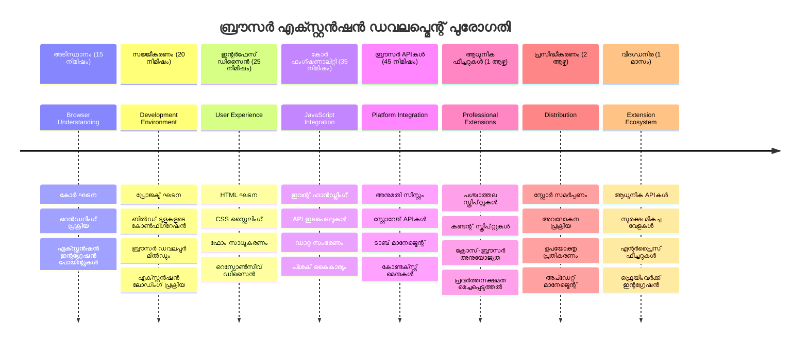
### 🛠️ നിങ്ങളുടെ എക്സ്റ്റൻഷൻ ഡവലപ്പ്മെന്റ് ടൂള്കിറ്റ് സംക്ഷേപം  

ഈ പാഠം പൂർത്തിയാക്കിയ ശേഷം നിങ്ങൾക്കുണ്ട്:  
- **ബ്രൗസർ ആർക്കിടെക്ചർ നോളedge**: റൻഡറിംഗ് എൻജിനുകൾ, സുരക്ഷാ മോഡലുകൾ, എക്സ്റ്റൻഷൻ ഇന്റഗ്രേഷൻ മനസ്സിലാക്കൽ  
- **ഡവലപ്പ്മെന്റ് എൻവയൺമെന്റ്**: Webpack, NPM എന്ന ആധുനിക ടൂൾചെയിൻ, ഡീബഗ് കഴിവുകൾ  
- **UI/UX അടിസ്ഥാനങ്ങൾ**: പ്രോഗ്രസീവ് ഡിസ്ക്ലോഷർ പാറ്റേൺ ഉപയോഗിച്ചുള്ള സെമാന്റിക് HTML ഘടന  
- **സുരക്ഷാ ബോധവൽക്കരണം**: ബ്രൗസർ അനുമതികളും സുരക്ഷിത ഡവലപ്പ്മെന്റ് ആചരണങ്ങളും മനസ്സിലാക്കൽ  
- **ക്രോസ്-ബ്രൗസർ ആശയങ്ങൾ**: സായൂഹ്യക്കുറിപ്പുകളും ടെസ്റ്റിങ്ങ് സമീപനങ്ങളും  
- **API ഇന്റഗ്രേഷൻ**: ബാഹ്യ ഡാറ്റ സ്രോതസുകളുമായി പ്രവർത്തിക്കുന്നതിന് മൂലാധാരം  
- **പ്രൊഫഷണൽ വർക്ക്‌ഫ്ലോ**: വ്യവസായ നിലവാരത്തിലുള്ള വികസന, ടെസ്റ്റിംഗ് രീതികൾ  

**യഥാർത്ഥ ലോക അപേക്ഷകൾ**: ഈ നൈപുണ്യങ്ങൾ നേരിട്ട് ബാധിക്കുന്നു:  
- **വെബ് ഡവലപ്പ്മെന്റ്**: സിംഗിൾ-പേജ് അപ്ലിക്കേഷനുകളും പ്രോഗ്രസീവ് വെബ് ആപ്പുകളും  
- **ഡെസ്‌ക്ക്ടോപ് അപ്ലിക്കേഷനുകൾ**: Electron, വെബ് അധിഷ്ഠിത ഡെസ്‌ക്ക്ടോപ് സോഫ്റ്റ്‌വെയർ  
- **മൊബൈൽ ഡവലപ്പ്മെന്റ്**: വിപ്രിത ആപ്പുകളും വെബ് ആധിഷ്ഠിത മൊബൈൽ പരിഹാരങ്ങളും  
- **എന്റർപ്രൈസ് ടൂളുകൾ**: ആന്തരിക ഉൽപാദകത്വം, വർക്ക്‌ഫ്ലോ ഓട്ടോമേഷൻ  
- **ഓപ്പൺ സോഴ്‌സ്**: ബ്രൗസർ എക്സ്റ്റൻഷൻ പ്രോജക്ടുകളിലും വെബ് സ്റ്റാൻഡേർഡുകളിലും സംഭാവനകൾ  

**അടുത്ത ഘട്ടം**: നിങ്ങൾക്ക് ഇപ്പോൾ ഇൻററാക്ടീവ് ഫംഗ്ഷണാലിറ്റി ചേർക്കാനും, ബ്രൗസർ APIs ഉപയോഗിച്ച് പ്രവർത്തിക്കാനും, ഉപയോക്തൃ പ്രശ്നങ്ങൾ പരിഹരിക്കുന്ന എക്സ്റ്റൻഷനുകൾ സൃഷ്ടിക്കാനും സാധിക്കും!  

## അസൈൻമെന്റ്  

[നിങ്ങളുടെ എക്സ്റ്റൻഷൻ പുനഃരൂപകൽപ്പന ചെയ്ത്](assignment.md)

---

<!-- CO-OP TRANSLATOR DISCLAIMER START -->
**അസൂയക്കുറിപ്പ്**:  
ഈ പ്രമാണം AI മൊഴിമാറ്റ സേവനമായ [Co-op Translator](https://github.com/Azure/co-op-translator) ഉപയോഗിച്ച് വിവർത്തനം ചെയ്തതാണ്. കൃത്യതയ്ക്ക് ഞങ്ങൾ ശ്രമിച്ചുവെങ്കിലും, ഓട്ടോമേറ്റഡ് വിവർത്തനങ്ങളിൽ പിഴവുകൾ അല്ലെങ്കിൽ അസത്യതകൾ ഉണ്ടാകാമെന്ന് ദയവായി ശ്രദ്ധിക്കുക. അദ്യന്തഭാഷയിലുള്ള ആയസ്ഥമൽകാമ്പ്രമാണുള്ള പ്രമാണം അധികാരമുള്ള ഉറവിടമായി കരുതണം. പ്രധാനപ്പെട്ട വിവരങ്ങൾക്കായി പ്രൊഫഷണൽ മാനവ വിവർത്തനം നിർദേശിക്കുന്നു. ഈ വിവർത്തനം ഉപയോഗിച്ചതിൽ നിന്നുണ്ടാകുന്ന യാതൊരു തെറ്റിദ്ധാരണകൾക്കും അല്ലെങ്കിൽ വ്യാഖ്യാനക്കുറവുകൾക്കുമായി ഞങ്ങൾ ഉത്തരവാദികളല്ല.
<!-- CO-OP TRANSLATOR DISCLAIMER END -->