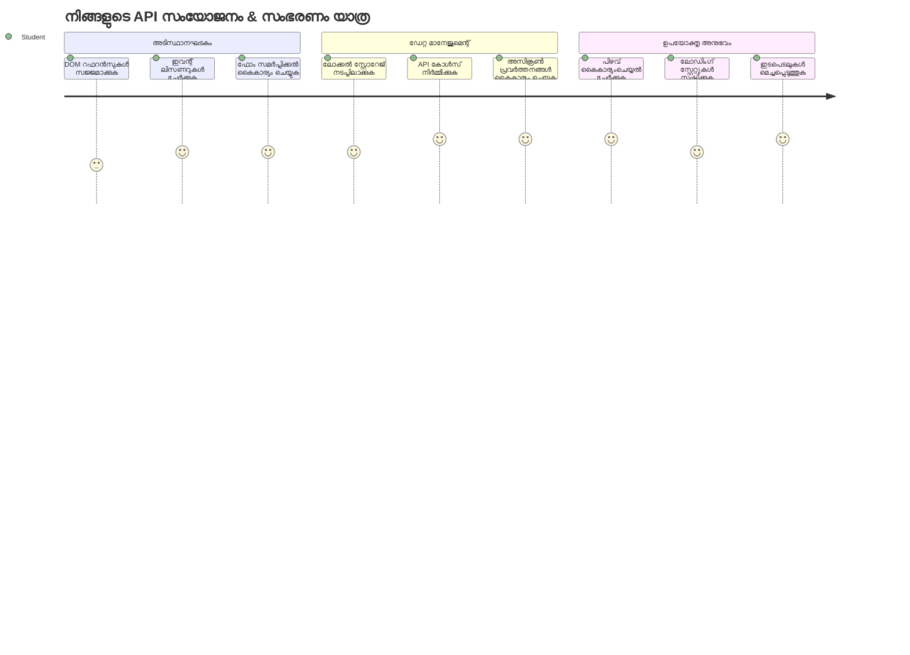
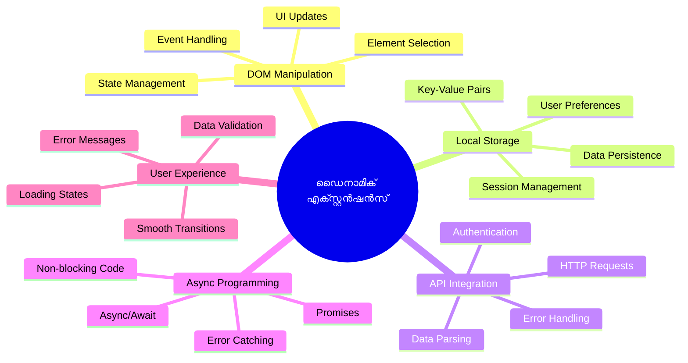
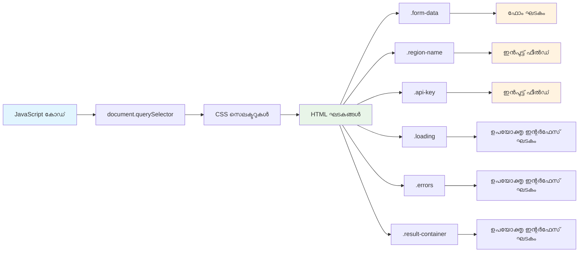
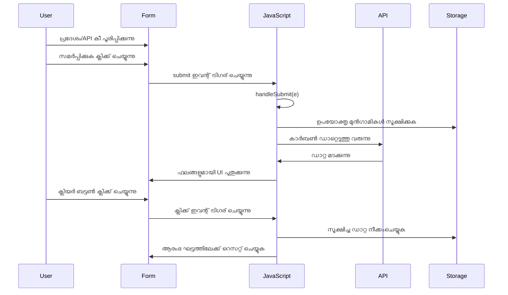
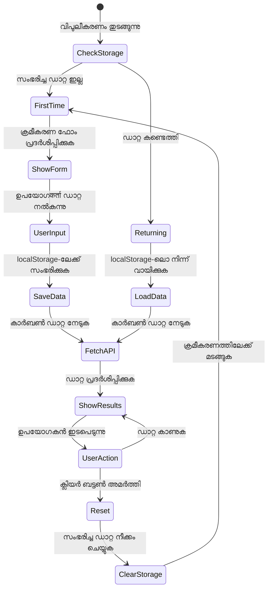
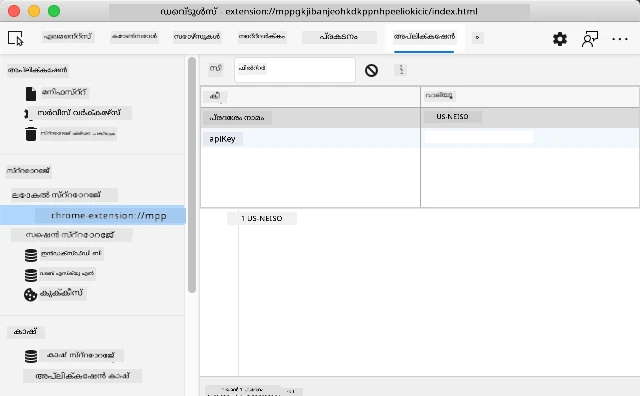
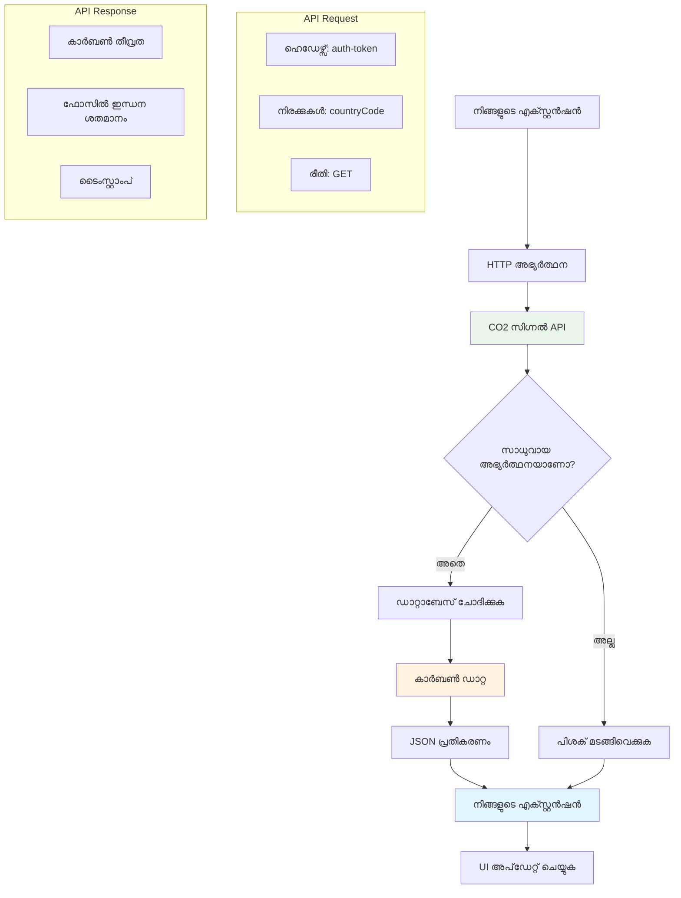
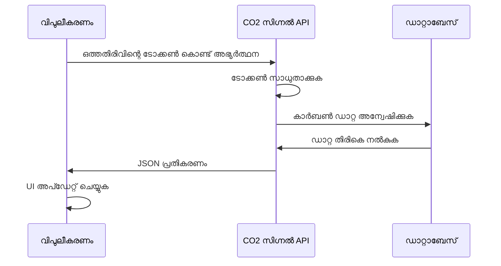
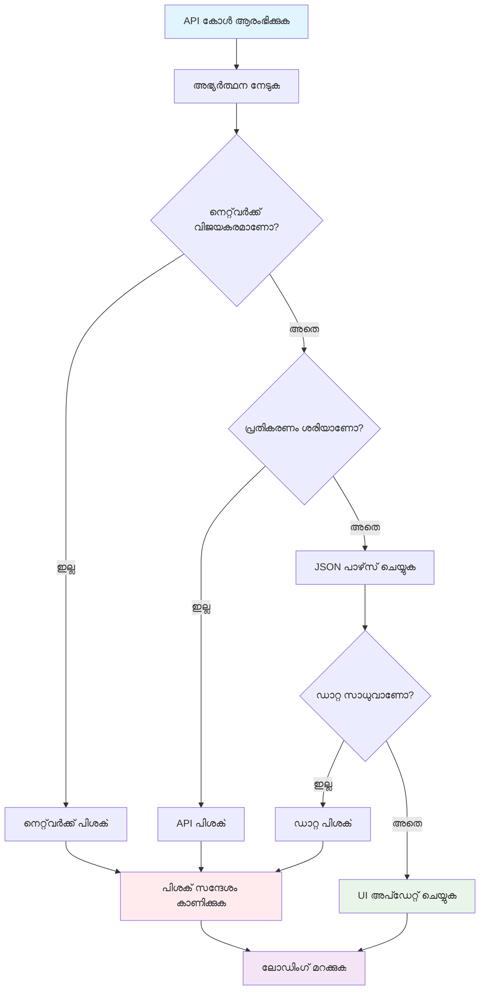
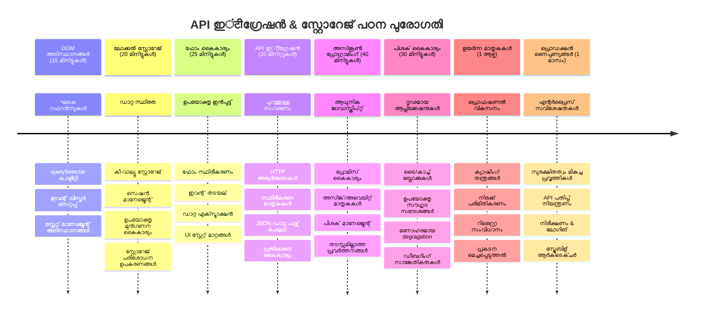

# Browser Extension Project ഭാഗം 2: ഒരു API കോളുചെയ്യുക, Local Storage ഉപയോഗിക്കുക


## പ്രീ-ലെക്ചർ ക്വിസ്

[Pre-lecture quiz](https://ff-quizzes.netlify.app/web/quiz/25)

## പരിചയം

നിങ്ങള്‍ തുടങ്ങിയത് ആ ബ്രൗസർ എക്സ്റ്റൻഷൻ ഓർമയുണ്ടോ? ഇപ്പോൾ നിങ്ങൾക്കൊരു സുന്ദരമായ ഫോം ഉണ്ട്, പക്ഷേ അത് ആധാരമായിട്ടാണ് നിലകൊള്ളുന്നത്. ഇന്ന് നാം അതിനെ സജീവമായി മാറ്റാനാണ് പോകുന്നത്, യാഥാർത്ഥ്യ ഡാറ്റയുമായി ബന്ധിപ്പിച്ച്, അത് ഓർമ്മിക്കുന്നതും ചേർത്തു.

അപ്പോളോ ദൗത്യ നിയന്ത്രണ കമ്പ്യൂട്ടറുകളെ ചിന്തിക്കുക - അവ ഓരേകമായ വിവരങ്ങൾ മാത്രം പ്രദർശിപ്പിക്കുന്നില്ല. അവ നിരന്തരം חלലാക്ഷയുമായി സംവദിച്ചു, ടെലിമെട്രി ഡാറ്റ പുതുക്കി, ദൗത്യത്തിന്റെ പ്രധാന പാരാമീറ്ററുകൾ ഓർക്കുകയും ചെയ്തു. ഇതാണ് നമ്മുടെ στόχος. നിങ്ങളുടെ എക്സ്റ്റൻഷൻ ഇന്റർനെറ്റിൽ നിന്ന് യാഥാർത്ഥ്യ പരിസ്ഥിതി ഡാറ്റ പിടിക്കുകയും, അടുത്ത തവണയുള്ള ക്രമീകരണങ്ങൾ ഓർക്കുകയും ചെയ്യും.

API സംയോജനം സങ്കീർണ്ണമായിരിക്കാമെന്ന് തോന്നാം, പക്ഷേ ഇതു വളരെ എളുപ്പമാണ് - നിങ്ങളുടെ കോഡ് മറ്റ് സേവനങ്ങളുമായി സംസാരിക്കാൻ പഠിപ്പിക്കുന്നു. നിങ്ങൾ കാലാവസ്ഥാ ഡാറ്റ, സോഷ്യൽ മീഡിയ ഫീഡുകൾ, അല്ലെങ്കിൽ നാം ഇന്ന് ചെയ്യുന്നതുപോലെ കാർബൺ ഫുട്ഷ്പ്രിന്റ് വിവരങ്ങൾ എടുക്കുകയാണെങ്കിൽ, ഡിജിറ്റൽ ബന്ധങ്ങൾ സ്ഥാപിക്കുന്നത് അതാണ്. ബ്രൗസറുകൾ വിവരങ്ങൾ നിലനിർത്തുന്ന രീതികൾ - പുസ്തകങ്ങൾ എവിടെയാണെന്ന് ഓർക്കാൻ ലൈബ്രറികൾ എങ്ങനെ കാർഡ് കാറ്റലോഗുകൾ ഉപയോഗിച്ചതുപോലെ - നാം അവയെയും പരിശോധിക്കും.

ഈ പാഠത്തിന്റെ അവസാനം നിങ്ങൾക്ക് യഥാർത്ഥ ഡാറ്റ എടുക്കാവുന്ന, ഉപയോക്തൃ ഇഷ്ടങ്ങൾ സംരക്ഷിക്കുന്ന, മൃദുവായ അനുഭവം നൽകുന്ന ഒരു ബ്രൗസർ എക്സ്റ്റൻഷൻ ഉണ്ടാകും. തുടങ്ങാം!


✅ നിങ്ങളുടെ കോഡ് ഏത് ഫയലിൽ ഏത് നമ്പർപ്പെട്ട ഭാഗത്തേക്ക് ഇടണമെന്ന് അറിയാൻ അനുയോജ്യമായ ഫയലിൽ നമ്പർപ്പെട്ട സეგმ്മെന്റുകൾ പിന്തുടരുക

## എക്സ്റ്റൻഷനിൽ കൈകാര്യം ചെയ്യേണ്ട ഘടകങ്ങൾ ക്രമീകരിക്കുക

നിങ്ങളുടെ ജാവാസ്ക്രിപ്റ്റ് ഇൻറർഫേസ് കൈകാര്യം ചെയ്യാൻ തുടങ്ങുന്നതിനു മുൻപ്, അതിനായി പ്രത്യേകം HTML ഘടകങ്ങളിലേക്ക് റഫറൻസുകൾ വേണം. ഗാലിലിയോ ജുപിറ്ററിന്റെ ചന്ദ്രന്മാരെ അവലോകനം ചെയ്യുന്നതിനു മുമ്പ് ജുപിറ്ററിനെ കണ്ടെത്തി ശ്രദ്ധ കേന്ദ്രീകരിക്കേണ്ടതുപോലെ.

നിങ്ങളുടെ `index.js` ഫയലിൽ, ഓരോ പ്രധാന ഫോമുഘടകത്തിനും റഫറൻസ് പിടിക്കാൻ `const` വ്യത്യാസങ്ങൾ സൃഷ്ടിക്കാം. ഇതെങ്ങനെ ശാസ്ത്രജ്ഞർ അവരുടെ ഉപകരണങ്ങൾ ലേബലാക്കുന്നു എന്നതുപോലെ - എല്ലാ ലാബോറട്ടറിയും തിരയാതെ ആവശ്യമായതേ നേരിട്ട് ആക്സസ് ചെയ്യാൻ.


```javascript
// ഫോം ഫീൽഡുകൾ
const form = document.querySelector('.form-data');
const region = document.querySelector('.region-name');
const apiKey = document.querySelector('.api-key');

// ഫലങ്ങൾ
const errors = document.querySelector('.errors');
const loading = document.querySelector('.loading');
const results = document.querySelector('.result-container');
const usage = document.querySelector('.carbon-usage');
const fossilfuel = document.querySelector('.fossil-fuel');
const myregion = document.querySelector('.my-region');
const clearBtn = document.querySelector('.clear-btn');
```

**ഈ കോഡ് ചെയ്യുന്നത്:**
- CSS ക്ലാസ് സെലെക്ടറുകൾ ഉപയോഗിച്ച് `document.querySelector()` വഴി ഫോമുഘടകങ്ങൾ പിടിക്കുന്നു
- പ്രദേശത്തിന്റെ പേര് மற்றும் API കീയുടെ ഇൻപുട് ഫീൽഡുകൾക്ക് റഫറൻസുകൾ സൃഷ്ടിക്കുന്നു
- കാർബൺ ഉപയോഗ ഡാറ്റ പ്രദർശിപ്പിക്കുന്ന ഘടകങ്ങളിലും ബന്ധം സ്ഥാപിക്കുന്നു
- ലോഡിംഗ് സൂചകങ്ങൾ, പിഴവു സന്ദേശങ്ങൾ പോലുള്ള UI ഘടകങ്ങൾ ക്രമീകരിക്കുന്നു
- ഓരോ ഘടക റഫറൻസും `const` വ്യത്യാസങ്ങളിൽ സൂക്ഷിക്കുന്നു, പുനഃഉപയോഗത്തിന് എളുപ്പമാക്കും

## ഇവന്റ് ലിസ്റ്റനറുകൾ ചേർക്കുക

ഇപ്പോൾ നാം നിങ്ങളുടെ എക്സ്റ്റൻഷൻ ഉപയോക്തൃ പ്രവർത്തനങ്ങൾക്ക് പ്രതികരിക്കട്ടെ. ഇവന്റ് ലിസ്റ്റനറുകൾ നിങ്ങളുടെ കോഡിന് ഉപയോക്തൃ ഇടപെടലുകൾ നിരീക്ഷിക്കാനുള്ള മാർഗമാണ്. ഇത് പൂർവ്വകാല ടെലിഫോൺ എക്സ്ചേഞ്ച് ഓപ്പറേറ്റർമാരെപോലെ - അവർ ഇപ്പോഴുണ്ടായ കോൾ കേട്ടുചേർത്ത് ശരിയായ സർക്യുട്ട് കണക്ട് ചെയ്തു.


```javascript
form.addEventListener('submit', (e) => handleSubmit(e));
clearBtn.addEventListener('click', (e) => reset(e));
init();
```

**ഈ ആശയങ്ങൾ മനസ്സിലാക്കുക:**
- ഉപയോക്താക്കൾ എന്റർ അമർത്തുമ്പോൾ അല്ലെങ്കിൽ സമർപ്പിച്ചപ്പോൾ ട്രിഗർ ചെയ്യുന്നതിനായി ഫോമിന് സമിറ്റ് ലിസ്റ്റനർ അനുബന്ധിപ്പിക്കുന്നു
- ക്ലിയർ ബട്ടണിൽ ക്ലിക്ക് ലിസ്റ്റനർ കണക്ട് ചെയ്യുന്നു, ഫോമും പുനഃക്രമീകരിക്കും
- ഇവന്റ് ഒബ്‌ജെക്റ്റ് `(e)` കൈകാര്യം ചെയ്യുന്ന ഫംഗ്ഷനുകളിലേക്ക് നേരുന്നു
- എക്സ്റ്റൻഷന്റെ ആരംഭാവസ്ഥ ക്രമീകരിക്കാൻ ഉടൻ `init()` ഫംഗ്ഷൻ വിളിക്കുന്നു

✅ ഇവിടെ ഉപയോഗിച്ചിട്ടുള്ള ചുരുക്കമായ അറോ ഫംഗ്ഷൻ സിന്തക്സിനോടുകൂടിയ അസ്പഷ്ടത ശ്രദ്ധിക്കുക. ഇത് പരമ്പരാഗത ഫംഗ്ഷൻ എക്‌സ്പ്രെഷനുകളുടെ പകരം ശുദ്ധമായ രീതിയാണ്, എങ്കിലും ഇരുവരും ശരിയായി പ്രവർത്തിക്കുന്നു!

### 🔄 **പഠന പരിശോധന**
**ഇവന്റ് കൈകാര്യം ചെയ്യൽ മനസിലാക്കൽ**: ആരംഭത്തിലേകുന്നതിനു മുമ്പ്, നിങ്ങൾക്ക് ചെയ്തു നോക്കേണ്ടത്:
- ✅ എങ്ങനെ `addEventListener` ഉപയോക്തൃ പ്രവർത്തനങ്ങളെ ജാവാസ്ക്രിപ്റ്റ് ഫംഗ്ഷനുകളുമായി ബന്ധിപ്പിക്കുന്നു എന്ന് വിശദീകരിക്കുക
- ✅ എന്തുകൊണ്ട് ഇവന്റ് ഒബ്‌ജെക്റ്റ് `(e)` കൈകാര്യം ചെയ്യുന്ന ഫംഗ്ഷനുകളിൽ അയയ്ക്കുന്നു എന്ന് മനസ്സിലാക്കുക
- ✅ `submit`യ്ക്കും `click`യ്ക്കും തമ്മിലുള്ള വ്യത്യാസം തിരിച്ചറിയുക
- ✅ `init()` ഫംഗ്ഷൻ എപ്പോഴും പ്രവർത്തിച്ചും എന്തുകൊണ്ട് അതുപോലെയാണ് എന്ന് വിവരിക്കുക

**ഏറ്റവും പെട്ടെന്ന് സ്വയം പരിശോധിക്കുക**: ഫോം സമർപ്പണത്തിൽ നിങ്ങൾ `e.preventDefault()` മറന്നാൽ എന്താകും?
*ഉത്തരം: പേജ് പുനർ ലോഡ് ചെയ്യുകയും എല്ലാ ജാവാസ്ക്രിപ്റ്റ് സ്റ്റേറ്റ് നഷ്ടപ്പെട്ടു ഉപയോക്തൃ അനുഭവം തടസ്സപ്പെടും*

## സംരംഭാവസ്ഥയും പുനഃക്രമീകരണ ഫംഗ്ഷനുകളും നിർമ്മിക്കുക

നിങ്ങളുടെ എക്സ്റ്റൻഷന്റെ ആരംഭത്തിന്റെ യുക്തി നാം സൃഷ്ടിക്കാം. `init()` ഫംഗ്ഷൻ ഒരു കപ്പലിന്റെ നാവിഗേഷൻ സംവിധാനമായിരിക്കും - ഇതുവഴി നിലവിലെ നില പരിശോധിച്ച് ഇൻറർഫേസ് ക്രമീകരിക്കുന്നു. ആരെങ്കിലും നിങ്ങളുടെ എക്സ്റ്റൻഷൻ ഉപയോഗിച്ചതാണോ എന്ന് നോക്കി അവരുടെ മുൻ ക്രമീകരണങ്ങൾ ലോഡ് ചെയ്യുന്നു.

`reset()` ഫംഗ്ഷൻ ശാസ്ത്രജ്ഞർ പരീക്ഷണങ്ങൾ തമ്മിൽ ഉപകരണങ്ങൾ പുനഃക്രമീകരിക്കുന്നത് പോലെ ഉപയോക്താക്കളെ പുതിയ തുടക്കം നൽകുന്നു.

```javascript
function init() {
	// ഉപയോക്താവ് മുമ്പ് API ക്രെഡൻഷ്യലുകൾ സംഭരിച്ചു കൊണ്ടുണ്ടോ എന്ന് പരിശോധിക്കുക
	const storedApiKey = localStorage.getItem('apiKey');
	const storedRegion = localStorage.getItem('regionName');

	// എക്സ്റ്റൻഷൻ ഐക്കൺ പൊതുവായ പച്ചയാക്കി (ഭാവിയിലെ പാഠത്തിനുള്ള പ്ലേസ്‌ഹോൾഡർ) സജ്ജമാക്കുക
	// TODO: അടുത്ത പാഠത്തിൽ ഐക്കൺ അപ്ഡേറ്റ് നടപ്പാക്കുക

	if (storedApiKey === null || storedRegion === null) {
		// ആദ്യം ഉപയോഗിച്ചുസംഭവിക്കുന്നവർ: സജ്ജീകരണ ഫോം കാണിക്കുക
		form.style.display = 'block';
		results.style.display = 'none';
		loading.style.display = 'none';
		clearBtn.style.display = 'none';
		errors.textContent = '';
	} else {
		// മടങ്ങി വരുന്ന ഉപയോക്താവ്: അവരുടെ സംഭരിച്ച ഡാറ്റ സ്വയം ലോഡ് ചെയ്യുക
		displayCarbonUsage(storedApiKey, storedRegion);
		results.style.display = 'none';
		form.style.display = 'none';
		clearBtn.style.display = 'block';
	}
}

function reset(e) {
	e.preventDefault();
	// ഉപയോക്താവിന് പുതിയ സ്ഥലം തിരഞ്ഞെടുക്കാൻ നിലവിലുള്ള പ്രദേശം മായ്ക്കുക
	localStorage.removeItem('regionName');
	// ആരംഭീകരണ പ്രക്രിയ പുനരാരംഭിക്കുക
	init();
}
```

**ഇവിടെ സംഭവിക്കുന്നത്:**
- ബ്രൗസറിലെ ലോക്കൽ സ്റ്റോറേജിൽ സംഭരിച്ച API കീയും പ്രദേശവും കണ്ടെത്തുന്നു
- പുതിയ ഉപയോക്താവാണോ അല്ലെങ്കിൽ മടങ്ങിച്ചെത്തുന്നയാളാണോ എന്ന് പരിശോധിക്കുന്നു
- പുതിയ ഉപയോക്താക്കൾക്കായി സജ്ജീകരണ ഫോം കാണിക്കുകയും മറ്റു UI ഘടകങ്ങൾ മറയ്ക്കുകയും ചെയ്യുന്നു
- മടങ്ങിച്ചെത്തുന്നവർക്കായി സൂക്ഷിച്ച ഡാറ്റ സ്വയം ലോഡ് ചെയ്യുകയും പുനഃക്രമീകരണ ഓപ്ഷൻ പ്രദർശിപ്പിക്കുകയും ചെയ്യുന്നു
- ലഭ്യമായ ഡാറ്റയുടെ അടിസ്ഥാനത്തിൽ ഉപയോക്തൃ ഇന്റർഫേസ് നില കൈകാര്യം ചെയ്യുന്നു

**Local Storage കാര്യങ്ങൾ:**
- ബ്രൗസർ സെഷനുകൾക്കിടയിൽ ഡാറ്റ സംരക്ഷിക്കുന്നു (session storage പോലല്ലാത്തത്)
- `getItem()`യും `setItem()`ഉം ഉപയോഗിച്ച് കീ-മൂല്യ ജോഡികളായി ഡാറ്റ സൂക്ഷിക്കുന്നു
- ഒരു കിക്ക് നിലവിലില്ലായ്മയിൽ `null` തിരികെ നൽകുന്നു
- ഉപയോക്തൃ ഇഷ്ടങ്ങളെയും ക്രമീകരണങ്ങളെയും ഓർക്കാൻ എളുപ്പമായ മാർഗ്ഗം നൽകുന്നു

> 💡 **ബ്രൗസർ സ്റ്റോറേജിന്റെ മനസ്സിലാക്കൽ**: [LocalStorage](https://developer.mozilla.org/docs/Web/API/Window/localStorage) നിങ്ങളുടെ എക്സ്റ്റൻഷന് സ്ഥിരതയുള്ള ഓർമ നൽകുന്നു. പുരാതന അലക്സാന്ദ്രിയ ലൈബ്രറിയിലെ സ്ക്രോളുകൾ എങ്ങനെ സൂക്ഷിച്ചിരുന്നു എന്ന് ചിന്തിക്കുക - പാഠശാലക്കാർ പോയാലും തിരിച്ചുവന്നാലും വിവരങ്ങൾ ലഭ്യമായിരുന്നു.
>
> **പ്രധാന ശാസ്ത്രീയ സവിശേഷതകൾ:**
> - ബ്രൗസർ അടച്ചതിനുശേഷവും ഡാറ്റ നിലനിൽക്കുന്നു
> - കമ്പ്യൂട്ടർ പുനരാരംഭം, ബ്രൗസർ ക്രാഷ് എന്നിവയെല്ലാം സജീവമായി മറികടക്കുന്നു
> - ഉപയോക്തൃ ഇഷ്ടങ്ങൾക്കായി വലിയ സംഭരണക്ഷമത നൽകുന്നു
> - നെറ്റ്വർക്ക് വൈകിപ്പിക്കാതെ തൽക്ഷണ ആക്സസ് നല്‍കുന്നു

> **പ്രധാന കുറിപ്പ്**: നിങ്ങളുടെ ബ്രൗസർ എക്സ്റ്റൻഷന് അതിന്റെ নিজത Local Storage ഉണ്ട്, സാധാരണ വെബ് പേജുകളിൽ നിന്നും വേർതിരിച്ചിരിക്കുന്നു. ഇത് സുരക്ഷ നൽകുകയും മറ്റ് വെബ്‌സൈറ്റുകളുമായി സംഘർഷം തടയുകയും ചെയ്യുന്നു.

ഡേറ്റ സംരക്ഷിച്ചതായി കാണാൻ, ബ്രൗസർ ഡിവലപ്പർ ടൂളുകൾ (F12) തുറന്ന് **Application** ടാബിലേക്കു പോവുക, പിന്നെ **Local Storage** സെക്ഷൻ വിപുലീകരിക്കുക.




> ⚠️ **സുരക്ഷാ പരിഗണന**: ഉത്പാദന പ്രയോഗങ്ങളിൽ, API കീകൾ LocalStorage-ൽ സൂക്ഷിക്കുന്നത് സുരക്ഷാ അപകടങ്ങൾ ഉണ്ടാക്കാം, കാരണം ജാവാസ്ക്രിപ്റ്റ് ഈ ഡാറ്റ ആക്സസ് ചെയ്യാം. പഠനത്തിന് ഇത് ശരിയാണെങ്കിലും, യാഥാർത്ഥ്യ հավելു മാത്രം കുട്ടികളായ ക്രെഡൻഷ്യലുകൾ സർവർ-സൈഡ് സംഭരണം ഉപയോഗിക്കണം.

## ഫോം സമർപ്പണം കൈകാര്യം ചെയ്യുക

ഇപ്പോൾ, ഒരാൾ നിങ്ങളുടെ ഫോമു സമർപ്പിക്കുമ്പോൾ സംഭവിക്കുന്നതിനെ കൈകാര്യം ചെയ്യാം. സാധാരണയായി, ഫോം സമർപ്പിക്കുമ്പോൾ ബ്രൗസർ പേജ് പുനഃലോഡു ചെയ്യും, പക്ഷേ നാം ഈ പ്രവൃത്തി തടയികൊണ്ട് മൃദുവായ അനുഭവം സൃഷ്ടിയ്ക്കും.

ഇത് ദൗത്യ നിയന്ത്രണം ബഹിരാകാശ കപ്പലുകളുമായി സംവദിക്കുന്ന രീതിയെ അനുസരിക്കുന്നു - ഓരോ സംവരണത്തിനും മുഴുവൻ സിസ്റ്റം പുനഃസജ്ജമാക്കാൻ പകരം, അവർ തുടർച്ചയായി പ്രവർത്തിച്ച് പുതിയ വിവരങ്ങൾ കൈകാര്യം ചെയ്യുന്നു.

ഫോം സമർപ്പണ ഇവന്റ് പിടിച്ച് ഉപയോക്തൃ ഇൻപുട്ട് എടുക്കുന്ന ഫംഗ്ഷൻ സൃഷ്ടിക്കുക:

```javascript
function handleSubmit(e) {
	e.preventDefault();
	setUpUser(apiKey.value, region.value);
}
```

**മുകളിൽ നമ്മൾ ചെയ്തതു:**
- പേജ് പുതുക്കപ്പെടുന്നത് തടയാൻ ഡീഫോൾട്ട് ഫോം സമർപ്പണം തടയുന്നു
- API കീയും പ്രദേശം ഫീൽഡുകളിൽ നിന്നും ഉപയോക്തൃ മൂല്യങ്ങൾ എടുക്കുന്നു
- ഫോമിന്റെ ഡാറ്റ `setUpUser()` ഫംഗ്ഷന് കൈമാറുന്നു പ്രോസസ് ചെയ്യാനായി
- പേജ് പുനൽലോഡുകൾ ഒഴിവാക്കി സിംഗിൾ പേജ് അപ്ലിക്കേഷൻ ഉപയോഗാനുഭവം നിലനിർത്തുന്നു

✅ ശ്രദ്ധിക്കുക, നിങ്ങളുടെ HTML ഫോമിൽ `required` ആട്രിബ്യൂട്ട് അടങ്ങിയതിനാൽ, ഫോം സമർപ്പിക്കുന്നതിനു മുമ്പ് ബ്രൗസർ API കീയും പ്രദേശവും നൽകുന്നുണ്ടോ എന്ന് താനേ പരിശോധന നടത്തും.

## ഉപയോക്തൃ ഇഷ്ടങ്ങൾ ക്രമീകരിക്കുക

`setUpUser` ഫംഗ്ഷൻ ഉപയോക്താവിന്റെ ക്രെഡൻഷ്യലുകൾ സംരക്ഷിച്ച് ആദ്യം API കോളും ആരംഭിക്കുന്നു. ഇത് ക്രമീകരണത്തിൽ നിന്നും ഫലങ്ങൾ പ്രദർശിപ്പിക്കുന്നതിനുള്ള മൃദുവായ മാറ്റത്തെ സൃഷ്ടിക്കുന്നു.

```javascript
function setUpUser(apiKey, regionName) {
	// ഭാവി സെഷനുകൾക്കായി ഉപയോക്തൃ ക്രഡൻഷ്യലുകൾ സംരക്ഷിക്കുക
	localStorage.setItem('apiKey', apiKey);
	localStorage.setItem('regionName', regionName);
	
	// ലോഡിങ് സ്റ്റേറ്റ് കാണിക്കാൻ UI അപ്ഡേറ്റ് ചെയ്യുക
	loading.style.display = 'block';
	errors.textContent = '';
	clearBtn.style.display = 'block';
	
	// ഉപയോക്തൃ ക്രഡൻഷ്യലുകൾ ഉപയോഗിച്ച് കാർബൺ ഉപയോഗം ഡാറ്റ നേടുക
	displayCarbonUsage(apiKey, regionName);
}
```

**കാൽപ്പനികമായി വാക്കുകൾ:**
- API കീയും പ്രദേശവും ഭാവിയിലെ ഉപയോഗത്തിനു Local Storage-ൽ സൂക്ഷിക്കുന്നു
- ഡാറ്റ എടുക്കുന്നതായി ഉപയോക്താക്കളെ അറിയിക്കാൻ ലോഡിംഗ് സൂചകം കാണിക്കുന്നു
- മുൻ പിഴവ് സന്ദേശങ്ങൾ ഫ്ളാഷിൽ നിന്നും നീക്കം ചെയ്യുന്നു
- ഉപയോക്താക്കൾക്ക് ക്രമീകരണങ്ങൾ പുനഃക്രമീകരിക്കാൻ ക്ലിയർ ബട്ടൺ പ്രദർശിപ്പിക്കുന്നു
- യഥാർത്ഥ കാർബൺ ഉപയോഗ ഡാറ്റ എടുക്കാൻ API കോളു തുടങ്ങുന്നു

ഈ ഫംഗ്ഷൻ ഡാറ്റ സംരക്ഷണം കൂടാതെ UI അപ്ഡേറ്റുകളും ഏകദേശമായി കൈകാര്യം ചെയ്ത് സുതാര്യമായ അനുഭവം സൃഷ്ടിക്കുന്നു.

## കാർബൺ ഉപയോഗ ഡാറ്റ പ്രദർശിപ്പിക്കുക

ഇപ്പോൾ നാം എക്സ്റ്റൻഷനെ API മുഖാന്തിരം ബാഹ്യ ഡാറ്റാ ഉറവിടങ്ങളുമായി ബന്ധിപ്പിക്കാം. ഇത് আপনার എക്സ്റ്റൻഷനെ സ്വതന്ത്ര ഉപകരണത്തിൽ നിന്ന് ഇന്റർനെറ്റിൽ നിന്നും യഥാർത്ഥ സമയ വിവരങ്ങൾ ആക്‌സസ് ചെയ്യുന്നതായി മാറ്റുന്നു.

**API-കൾ മനസ്സിലാക്കൽ**

[APIs](https://www.webopedia.com/TERM/A/API.html) എങ്ങനെ വ്യത്യസ്ത ആപ്ലിക്കേഷനുകൾ തമ്മിൽ ആശയവിനിമയം നടത്തുന്നു എന്നാണ്. ഇത് 19-അം നൂറ്റാണ്ടിലെ ടെലിഗ്രാഫ് സംവിധാനത്തെപോലെ - ഓപ്പറേറ്റർമാർ ദൂരെ സ്റ്റേഷനുകളിലേക്ക് അഭ്യർത്ഥനകൾ അയച്ചും ആവശ്യപ്പെട്ട വിവരം ലഭിച്ചും. നിങ്ങൾ സോഷ്യൽ മീഡിയ പരിശോധിക്കുമ്പോഴും, വോയിസ് അസിസ്റ്റന്റിനോട് ചോദിക്കുമ്പോഴും, ഡെലിവറി ആപ്പ് ഉപയോഗിക്കുമ്പോഴും, API-കൾ ഈ ഡാറ്റ ഇടപാടുകൾ സാന്ദ്രമാക്കുന്നു.


**REST API-കളെക്കുറിച്ചുള്ള പ്രധാന ആശയങ്ങൾ:**
- REST എന്നത് 'Representational State Transfer' ആണ്
- ഡാറ്റയുമായി ഇടപെടാൻ സ്റ്റാൻഡേർഡ് HTTP മേത്തഡുകൾ (GET, POST, PUT, DELETE) ഉപയോഗിക്കുന്നു
- സാധാരണയായി JSON പോലുള്ള മുൻകൂട്ടി നിർവ്വചിച്ച ഫോർമാറ്റുകളിൽ ഡാറ്റ ലഭ്യമാക്കുന്നു
- വിവിധ അഭ്യർത്ഥനകൾക്കുള്ള സ്ഥിരമായ URL അടിസ്ഥാനത്തിലുള്ള എൻഡ്‌പോയിന്റുകൾ നൽകുന്നു

✅ നാം ഇന്ന് ഉപയോഗിക്കുന്ന [CO2 Signal API](https://www.co2signal.com/) חש provides വൈദ്യുതി ഗ്രിഡുകളുടെ യഥാർത്ഥ സമയ കാർബൺ തീവ്രത ഡാറ്റ. ഇത് ഉപയോക്താക്കൾക്ക് തങ്ങളുടെ വൈദ്യുതി ഉപഭോഗത്തിന്റെ പരിസ്ഥിതി സ്വാധീനം മനസ്സിലാക്കാൻ സഹായിക്കുന്നു!

> 💡 **അസിങ്ക്രണസ് ജാവാസ്ക്രിപ്റ്റ് മനസ്സിലാക്കൽ**: [`async` കീബോർഡ്](https://developer.mozilla.org/docs/Web/JavaScript/Reference/Statements/async_function) നിങ്ങളുടെ കോഡിനു ഒരേ സമയം നിരവധി പ്രവർത്തനങ്ങൾ കൈകാര്യം ചെയ്യാൻ അനുവദിക്കുന്നു. ഒരു സെർവറിൽ നിന്നുള്ള ഡാറ്റ ആവശ്യപ്പെടുമ്പോൾ, പൂർണ്ണമായി എക്സ്റ്റൻഷൻ തളർന്ന് കിടക്കരുത് - അത് എയർ ട്രാഫിക് കൺട്രോൾ ഒരു വിമാനത്താവളം മുഴുവനായി നിർത്തുന്നത് പോലെയാണ്.
>
> **പ്രധാന ഗുണങ്ങൾ:**
> - ഡാറ്റ ലോഡാകുമ്പോഴും എക്സ്റ്റൻഷൻ പ്രതികരണശീലം നിലനിർത്തുന്നു
> - നെറ്റ്വർക്ക് അഭ്യർത്ഥനകൾക്കിടയിൽ മറ്റ് കോഡുകൾക്ക് പ്രവർത്തനം തുടരുമാകുന്നു
> - പാരമ്പര്യ കോൾബാക്ക് രീതികളേക്കാൾ കോഡ് വായിക്കാൻ എളുപ്പമാണ്
> - നെറ്റ്വർക്ക് പിഴവുകൾ മെച്ചമാർന്ന രീതിയിൽ കൈകാര്യം ചെയ്യുന്നു

ഇവിടെ async-നെ കുറിച്ചുള്ള ഒരു ഷോർട്ട് വീഡിയോകും:

[](https://youtube.com/watch?v=YwmlRkrxvkk "Async and Await for managing promises")

> 🎥 async/await-നെപ്പറ്റി വീഡിയോ കാണാൻ മേൽ ചിത്രം ക്ലിക്ക് ചെയ്യുക.

### 🔄 **പഠന പരിശോധന**
**Async പ്രോഗ്രാമിംഗിന്റെ മനസിലാക്കൽ**: API ഫംഗ്ഷനിലേക്ക് പോകുന്നതിന് മുമ്പ് സ്ഥിരീകരിക്കുക:
- ✅ എന്തുകൊണ്ട് എക്സ്റ്റൻഷൻ മുഴുവൻ തടഞ്ഞ് നിർത്താതെ `async/await` ഉപയോഗിക്കുന്നു
- ✅ നെറ്റ്വർക്ക് പിശകുകൾ `try/catch` ബ്ലോക്കുകൾ എങ്ങനെ നന്നായി കൈകാര്യം ചെയ്യുന്നു
- ✅ സിങ്ക്രോണസ് vs അസിങ്ക്രോണസ് പ്രവർത്തനങ്ങൾ തമ്മിലുള്ള വ്യത്യാസം
- ✅ API കോളുകൾ പരാജയപ്പെടാനാകാനുള്ള കാരണങ്ങളും അതു കൈകാര്യം ചെയ്യാനുള്ള മാർഗ്ഗങ്ങളും

**യഥാർത്ഥ ജീവിത ഉദാഹരണങ്ങൾ:**
- **ഭക്ഷണം ഓർഡർ ചെയ്യൽ**: അടുക്കളയിൽ നിന്ന് കാത്തിരിക്കാതെ, പാസ്സായ രസീത് എടുത്ത് മറ്റൊക്കെ ചെയ്യുക
- **ഇമെയിൽ അയക്കൽ**: അയയ്ക്കുമ്പോൾ അപ്ലിക്കേഷൻ തകരാതെ മറ്റൊരു ഇമെയിൽ തയ്യാറാക്കുക
- **വെബ് പേജുകൾ ലോഡുചെയ്യൽ**: ചിത്രങ്ങൾ ഘട്ടം ഘട്ടമായി ലോഡ് ചെയ്‌തുകൊണ്ടിരിക്കുമ്പോൾ നിങ്ങൾ ഇതിനകം ടെക്സ്റ്റ് വായിക്കും

**API प्रमाणीकरण പ്രവാഹം**:

കാർബൺ ഉപയോഗ ഡാറ്റ എടുക്കാനും പ്രദർശിപ്പിക്കാനും ഫംഗ്ഷൻ സൃഷ്ടിക്കുക:

```javascript
// ആധുനിക ഫെച്ച് API സമീപനം (പുറം ആശ്രിതങ്ങൾ ആവശ്യമില്ല)
async function displayCarbonUsage(apiKey, region) {
	try {
		// CO2 Signal API-യിൽനിന്ന് കാർബൺ തീവ്രത ഡാറ്റ ഫെച്ച് ചെയ്യുക
		const response = await fetch('https://api.co2signal.com/v1/latest', {
			method: 'GET',
			headers: {
				'auth-token': apiKey,
				'Content-Type': 'application/json'
			},
			// പ്രത്യേക മേഖലയ്ക്കായി ക്വറി പാരാമീറ്ററുകൾ ചേർക്കുക
			...new URLSearchParams({ countryCode: region }) && {
				url: `https://api.co2signal.com/v1/latest?countryCode=${region}`
			}
		});

		// API അഭ്യർത്ഥന വിജയകരമായിരുന്നോ എന്ന് പരിശോധിക്കുക
		if (!response.ok) {
			throw new Error(`API request failed: ${response.status}`);
		}

		const data = await response.json();
		const carbonData = data.data;

		// റൗണ്ടുചെയ്ത കാർബൺ തീവ്രത മൂല്യം കണക്കാക്കുക
		const carbonIntensity = Math.round(carbonData.carbonIntensity);

		// ഫെച്ച് ചെയ്ത ഡാറ്റ ഉപയോഗിച്ച് ഉപയോക്തൃ ഇന്റർഫേസ് അപ്ഡേറ്റ് ചെയ്യുക
		loading.style.display = 'none';
		form.style.display = 'none';
		myregion.textContent = region.toUpperCase();
		usage.textContent = `${carbonIntensity} grams (grams CO₂ emitted per kilowatt hour)`;
		fossilfuel.textContent = `${carbonData.fossilFuelPercentage.toFixed(2)}% (percentage of fossil fuels used to generate electricity)`;
		results.style.display = 'block';

		// TODO: calculateColor(carbonIntensity) - അടുത്ത പാഠത്തിൽ നടപ്പിലാക്കുക

	} catch (error) {
		console.error('Error fetching carbon data:', error);
		
		// ഉപയോക്തൃ സൗഹൃദമായ പിഴവ് സന്ദേശം പ്രദർശിപ്പിക്കുക
		loading.style.display = 'none';
		results.style.display = 'none';
		errors.textContent = 'Sorry, we couldn\'t fetch data for that region. Please check your API key and region code.';
	}
}
```

**ഇവിടെ സംഭവിക്കുന്നത്:**
- ലൈബ്രറികൾ പോലുള്ള Axios-നെ ഒഴിവാക്കി, മോഡേൺ `fetch()` API ഉപയോഗിക്കുന്നു, ആശയവിനിമയത്തിന് വ്യക്തവും സ്വതന്ത്രവുമായ കോഡ് നൽകാൻ
- API പരാജയം വേഗത്തിൽ പിടിക്കാൻ `response.ok` ഉപയോഗിച്ച് പിഴവുകൾ പരിശോധിക്കുന്നു
- `async/await` ഉപയോഗിച്ച് അസിങ്ക്രണസ് പ്രവർത്തനങ്ങൾ ഡോക്യുമെന്റബിൾ രൂപത്തിൽ കൈകാര്യം ചെയ്യുന്നു
- CO2 Signal API-വുമായുള്ള ഓതന്റിക്കേഷൻ `auth-token` ഹെഡർ വഴി നടത്തുന്നു
- JSON മറുപടി ഡാറ്റ പാര്സ് ചെയ്ത് കാർബൺ തീവ്രത വിവരങ്ങൾ എടുക്കുന്നു
- പല UI ഘടകങ്ങളിലും ചിട്ടപ്പെടുത്തിയ പരിസ്ഥിതി ഡാറ്റ അപ്ഡേറ്റുചെയ്യുന്നു
- API കോളുകൾ പരാജയപ്പെടുമ്പോൾ ഉപയോക്തൃ സൗഹൃദപിഴവ് സന്ദേശങ്ങൾ പ്രദർശിപ്പിക്കുന്നു

**പ്രധാന മോഡേൺ ജാവാസ്ക്രിപ്റ്റ് തത്വങ്ങൾ ഈ ഫംഗ്ഷനിൽ കാണാം:**
- ക്ലീൻ സ്ട്രിംഗ് ഫോർമാറ്റിംഗിനായി `${}` സിന്തക്സിൽ ടെംപ്ലേറ്റ് ലിറ്ററലുകൾ
- പിഴവുകൾ കരുതുന്നതിനായി `try/catch` ബ്ലോക്കുകൾ
- നെറ്റ്‌വർക്ക് അഭ്യർത്ഥനകൾ നിരീക്ഷിക്കാൻ `async/await` പാറ്റേൺ
- API മറുപടിയിൽ നിന്നുള്ള പ്രത്യേക ഡാറ്റ എടുക്കാൻ ഒബ്ജക്ട് ഡിസ്ട്രക്ടറിംഗ്
- ഒന്നിലധികം DOM മാനിപ്പുലേഷനുകൾക്കായി മെത്തഡ് ചെയിനിംഗ്

✅ ഈ ഫംഗ്ഷൻ പല വെബ് ഡെവലപ്പ്മെന്റ് തത്വങ്ങളും പ്രദർശിപ്പിക്കുന്നു - ബാഹ്യ സെർവറുകളുമായി സംവദിക്കൽ, ഓതന്റിക്കേഷൻ, ഡാറ്റ പ്രോസസ്സിംഗ്, ഇൻറർഫേസുകൾ അപ്ഡേറ്റ് ചെയ്യൽ, പിഴവുകൾ കരുതൽ എന്നിവ. പ്രൊഫഷണൽ ഡെവലപ്പർമാരുടെ അടിസ്ഥാന കഴിവുകൾ.


### 🔄 **പഠന പരിശോധന**
**സമ്പൂർണ്ണ സിസ്റ്റം മനസിലാക്കൽ**: മുഴുവൻ പ്രവാഹവും മനസ്സിലായുണ്ടെന്ന് സ്ഥിരീകരിക്കുക:
- ✅ DOM റഫറൻസുകൾ എങ്ങനെ ജാവാസ്ക്രിപ്റ്റിന് ഇൻറർഫേസ് നിയന്ത്രിക്കാനുമാകുന്നു
- ✅ ബ്രൗസർ സെഷനുകളിടയിൽ സ്ഥിരതയ്ക്ക് local storage എന്തുകൊണ്ട് നിർണ്ണായകമാണ്
- ✅ എങ്ങനെ async/await API കോളുകൾ എളുപ്പത്തിൽ, എക്സ്റ്റൻഷൻ തടസ്സപ്പെടാതെ നടത്തുന്നു
- ✅ API കോൾ പരാജയപ്പെട്ടപ്പോൾ എന്താകും; പിശകുകൾ എങ്ങനെ കൈകാര്യം ചെയ്യുന്നു
- ✅ ഉപയോക്തൃ അനുഭവത്തിൽ ലോഡിംഗ് സ്റ്റേറ്റുകൾ, പിഴവ് സന്ദേശങ്ങൾ ഉൾപ്പെടുന്നതിന്റെ പ്രധാന്യം

🎉 **നിങ്ങൾ നേടിയെടുത്തത്:** ഇന്റർനെറ്റ് ബന്ധിപ്പിച്ചും യഥാർത്ഥ പരിസ്ഥിതി ഡാറ്റ സ്വീകരിക്കുന്ന,
ഉപയോക്തൃ ക്രമീകരണങ്ങൾ സെഷനുകൾക്കിടയിൽ നിലനിർത്തുന്ന,
പിഴവുകൾ gracefully കൈകാര്യം ചെയ്യുന്ന,
നർത്തകമായ, പ്രൊഫഷണൽ യൂസർ അനുഭവം നൽകുന്ന ഒരു ബ്രൗസർ എക്സ്റ്റൻഷൻ നിർമിച്ചു.

നിങ്ങളുടെ പ്രവൃത്തി ചെക്ക് ചെയ്യാൻ `npm run build` ഓടിച്ച് ബ്രൗസറിൽ എക്സ്റ്റൻഷൻ റിഫ്രഷ് ചെയ്യുക. ഇനി നിങ്ങൾക്ക് പ്രായോഗികമായ ഒരു കാർബൺ ഫുട്പ്രിന്റ് ട്രാക്കർ ഉണ്ടായി. അടുത്ത പാഠം ഡൈനാമിക് ഐകൺ പ്രവർത്തനം ചേർക്കും.

---

## GitHub Copilot Agent Challenge 🚀

Agent മോഡ് ഉപയോഗിച്ച് താഴെ പറയുന്ന വെല്ലുവിളി പൂർത്തിയാക്കുക:
**വിവരണം:** എറർ ഹാൻഡ്ലിംഗ് മെച്ചപ്പെടുത്തലുകളും ഉപയോക്തൃ അനുഭവ സവിശേഷതകളും ചേർത്തു ബ്രൗസർ എക്സ്റ്റൻഷൻ മെച്ചപ്പെടുത്തുക. API-കൾ, ലോക്കൽ സ്റ്റോറേജ്, DOM മാനിപ്പുലേഷൻ എന്നിവ ഇപ്പോൾ ഉപയോഗിക്കുന്ന ആധുനിക ജാവാസ്ക്രിപ്റ്റ് പാറ്റേണുകൾ ഉപയോഗിച്ച് ചെയ്യാൻ ഈ ചാലഞ്ച് സഹായിക്കും.

**പ്രോംപ്റ്റ്:** താഴെ പറയുന്ന സവിശേഷതകളുള്ള displayCarbonUsage ഫംഗ്ഷന്റെ മെച്ചപ്പെടുത്തിയ പതിപ്പ് ഉണ്ടാക്കുക: 1) ആഘാതകരമായ API കോൾഫെയില്യറുകൾക്കായി എക്സ്പോണൻഷ്യൽ ബാക്ക്ഓഫ് ഉപയോഗിച്ച് റീട്രൈ മെക്കാനിസം, 2) API കോൾ ചെയ്യുന്നതിനുമ മുൻപ്_REGION_ കോഡിന്റെ ഇൻപുട്ട് വെരിഫിക്കേഷൻ, 3) പ്രോഗ്രസ് സൂചിപ്പിക്കുന്ന ലോഡിംഗ് ആനിമേഷൻ, 4) API പ്രതികരവുകൾ localStorage-ലേക്ക് 30 മിനിറ്റുകൾക്കുള്ള കാലാവധി ടൈമ്സ്റ്റാമ്പിനൊപ്പം കാഷ് ചെയ്യൽ, 5) മുൻ API കോൾകളിൽ നിന്നുള്ള ചരിത്ര ഡാറ്റ പ്രദർശിപ്പിക്കുന്ന ഫീച്ചർ. ഫംഗ്ഷൻ പാരാമീറ്ററുകളും റിട്ടേൺ ടൈപ്പുകളും വിശദീകരിക്കുന്ന ടൈപ്പ്‌സ്‌ക്രിപ്റ്റ്-സ്റ്റൈൽ JSDoc കമന്റുകളും ചേർക്കുക.

[agent mode](https://code.visualstudio.com/blogs/2025/02/24/introducing-copilot-agent-mode) സംബന്ധിച്ച് കൂടുതൽ അറിയൂ.

## 🚀 ചാലഞ്ച്

ബ്രൗസർ അടിസ്ഥാനമാക്കിയുള്ള APIs-ന്റെ സമ്പത്ത് അന്വേഷിച്ച് നിങ്ങളുടെ API പഠന പരിധി വിപുലീകരിക്കുക. താഴെയുള്ള ബ്രൗസർ APIs-ലിലുള്ള ഒരു API തിരഞ്ഞെടുക്കി സാങ്കേതിക പ്രദർശനം നിർമ്മിക്കുക:

- [Geolocation API](https://developer.mozilla.org/docs/Web/API/Geolocation_API) - ഉപയോക്താവിന്റെ നിലവിലെ സ്ഥലം ലഭിക്കുക
- [Notification API](https://developer.mozilla.org/docs/Web/API/Notifications_API) - ഡെസ്ക്‌ടോപ്പ് നോട്ടിഫിക്കേഷനുകൾ അയയ്ക്കുക
- [HTML Drag and Drop API](https://developer.mozilla.org/docs/Web/API/HTML_Drag_and_Drop_API) - ഇന്ററാക്ടീവ് ഡ്രാഗ് ഇന്റർഫേസുകൾ സൃഷ്ടിക്കുക
- [Web Storage API](https://developer.mozilla.org/docs/Web/API/Web_Storage_API) - അവലംബമുള്ള ലോക്കൽ സ്റ്റോറേജ് സാങ്കേതികവിദ്യകൾ
- [Fetch API](https://developer.mozilla.org/docs/Web/API/Fetch_API) - XMLHttpRequest-ന്റെ ആധുനിക പകരം

**ആശയങ്ങൾ പരിശോധിക്കുക:**
- ഈ API യഥാർത്ഥ ലോക പ്രശ്നങ്ങൾ എങ്ങനെ പരിഹരിക്കുന്നു?
- API പിഴവുകളും അതിരുകളും എങ്ങനെ കൈകാര്യം ചെയ്യുന്നു?
- ഈ API ഉപയോഗിക്കുന്നപ്പോൾ ഏതു സുരക്ഷാ പരിഗണനകൾ ഉണ്ട്?
- വ്യത്യസ്ത ബ്രൗസറുകളിൽ ഈ API എത്രത്തോളം പിന്തുണയ്ക്കുന്നുണ്ട്?

നിങ്ങളുടെ ഗവേഷണത്തിന് ശേഷം, ഒരു API വികസകർക്കുള്ള സൗഹൃദവും വിശ്വസനീയവുമായ ലക്ഷണങ്ങൾ തിരിച്ചറിയുക.

## ലൈവ് ക്ലാസ് ശേഷം ക്വിസ്

[Post-lecture quiz](https://ff-quizzes.netlify.app/web/quiz/26)

## റിവ്യൂ & സ്വയം പഠനം

ഈ പാഠത്തിൽ LocalStorage, APIs എന്നിവയെ കുറിച്ച് നിങ്ങൾ പഠിച്ചു, പ്രൊഫഷണൽ വെബ് ഡെവലപ്പർക്കും വളരെ പ്രയോജനപ്പെടുന്ന വിഷയങ്ങളാണ്. ഈ രണ്ട് കാരികളും എങ്ങനെ ചേർന്ന് പ്രവർത്തിക്കുന്നു എന്ന് ചിന്തിക്കൂ. API ഉപയോഗിക്കുന്ന ഒരു വെബ് സൈറ്റ് ആർക്കിടെക്ചർ എങ്ങനെ രൂപകൽപ്പന ചെയ്യുമെന്നു വിചാരിക്കൂ.

### ⚡ **അടുത്ത 5 മിനിറ്റിൽ ചെയ്യാൻ കഴിയുന്നതു**
- [ ] DevTools Application ടാബ് തുറന്ന് ഏതെങ്കിലും വെബ്സൈറ്റിലെ localStorage പരിശോധിക്കുക
- [ ] ഒരു ലളിതമായ HTML ഫോറം സൃഷ്ടിച്ച് ബ്രൗസറിലെ ഫോം വാലിഡേഷൻ പരീക്ഷിക്കുക
- [ ] localStorage ഉപയോഗിച്ച് ഡാറ്റ സംഭരിച്ചു പുനരുദ്ധരിപ്പിക്കുക ബ്രൗസർ കൺസോളിൽ
- [ ] നെറ്റ്‌വർക്കിനുള്ള ടാബ് വഴി സമർപ്പിക്കുന്ന ഫോം ഡാറ്റ പരിശോധിക്കുക

### 🎯 **ഈ മണിക്കൂറിൽ നേടാനാകുന്നതു**
- [ ] പോസ്റ്റ്-ലക്ചർ ക്വിസ് പൂരിപ്പിച്ച് ഫോം ഹാൻഡ്ലിംഗ് ആശയങ്ങൾ മനസിലാക്കുക
- [ ] ഉപയോക്തൃ മുൻഗണനകൾ സേവ് ചെയ്യുന്ന ബ്രൗസർ എക്സ്റ്റൻഷൻ ഫോർം നിർമ്മിക്കുക
- [ ] ഉപകാരപ്രദമായ പിഴവു സന്ദേശങ്ങളോട് ക്ലയന്റ്-സൈഡ് ഫോം വാലിഡേഷൻ നടപ്പിലാക്കുക
- [ ] ബ്രൗസർ എക്സ്റ്റൻഷൻ ഡാറ്റ സ്ഥിരപ്പെടുത്തുന്നതിനായി chrome.storage API ഉപയോഗിച്ച് പരിചയപ്പെടുക
- [ ] സേവ് ചെയ്ത ഉപയോക്തൃ ക്രമീകരണങ്ങളെ പ്രതികരിക്കുന്ന ഉപയോക്തൃ ഇന്റർഫേയ്സ് സൃഷ്ടിക്കുക

### 📅 **നിങ്ങളുടെ ആഴ്ചക്കാല എക്സ്റ്റൻഷൻ നിർമ്മാണം**
- [ ] ഫുൾ-ഫീച്ചർ ചെയ്ത ബ്രൗസർ എക്സ്റ്റൻഷൻ ഫോർം ഫംഗ്ഷണാലിറ്റി സഹിതം പൂർത്തിയാക്കുക
- [ ] വിവിധ സ്റ്റോറേജ് ഓപ്ഷനുകൾ അഭ്യസിക്കുക: local, sync, session storage
- [ ] ഓട്ടോകംപ്ലീറ്റ്, വാലിഡേഷൻ പോലുള്ള ഉയർന്ന തലത്തിലുള്ള ഫോം ഫീച്ചറുകൾ നടപ്പിലാക്കുക
- [ ] ഉപയോക്തൃ ഡാറ്റയ്ക്ക് ഇറക്കുമതി/റഫായി ചുമത്തൽ ഫീച്ചറുകൾ ചേർക്കുക
- [ ] വിവിധ ബ്രൗസറുകളിൽ എക്സ്റ്റൻഷൻ നന്നായി പരീക്ഷിക്കുക
- [ ] എക്സ്റ്റൻഷന്റെ ഉപയോക്തൃ അനുഭവവും പിഴവ് കൈകാര്യംവും മെച്ചപ്പെടുത്തുക

### 🌟 **നിങ്ങളുടെ മാസം മുഴുവൻ വെബ് API മാസ്റ്ററി**
- [ ] വിവിധ ബ്രൗസർ സ്റ്റോറേജ് APIs ഉപയോഗിച്ച് സമ്പീഠമായ അപ്ലിക്കേഷൻസ് നിർമ്മിക്കുക
- [ ] ഓഫ്ലൈൻ-ഫസ്റ്റ് വികസന പാറ്റേണുകൾ പഠിക്കുക
- [ ] ഡാറ്റ സ്ഥിരതയുള്ള ഓപ്പൺ സോഴ്‌സ് പ്രോജക്ടുകളിൽ സംഭാവന നൽകുക
- [ ] പ്രൈവസി-കേന്ദ്രികമായ ഡവലപ്പ്മെന്റ്, GDPR അനുയോജ്യതയിൽ വിദഗ്ധത വികസിപ്പിക്കുക
- [ ] ഫോം ഹാൻഡ്ലിംഗ്, ഡാറ്റ മാനേജ്മെന്റ് සඳහා പുനരുപയോഗിക്കാവുന്ന ലൈബ്രറികൾ സൃഷ്ടിക്കുക
- [ ] വെബ് API-കൾക്കെന്തും എക്സ്റ്റൻഷൻ ഡവലപ്പ്മെന്റ് സംബന്ധിച്ച അറിവുകൾ പങ്കിടുക

## 🎯 നിങ്ങളുടെ എക്സ്റ്റൻഷൻ ഡവലപ്പ്മെന്റ് മാസ്റ്ററി ടൈംലൈൻ


### 🛠️ നിങ്ങളുടെ ഫുൾ-സ്റ്റാക്ക് ഡെവലപ്പ്മെന്റ് ടൂൾകിറ്റ് സംഗ്രഹം

ഈ പാഠം കഴിഞ്ഞ് നിങ്ങൾക്ക് ഇപ്പോൾ:

- **DOM മാടറിംഗ്**: സമ്യകമായ എലമെന്റ് ലക്ഷ്യമിടലും മാനിപ്പുലേഷനും  
- **സ്റ്റോറേജ് വിദഗ്ധത**: localStorage ഉപയോഗിച്ച് സ്ഥിരമായ ഡാറ്റ കൈകാര്യം ചെയ്യൽ  
- **API സംയോജനം**: റിയൽ ടൈം ഡാറ്റ ഫെട്ടിങ്, ഓതെൻറിക്കേഷൻ  
- **അസിങ്ക്രോണസ് പ്രോഗ്രാമിംഗ്**: ആധുനിക ജാവാസ്ക്രിപ്റ്റ് ഉപയോഗിച്ച് ബ്ലോക്ക് ചെയ്യാത്ത പ്രവർത്തികൾ  
- **എറർ ഹാൻഡ്ലിംഗ്**: പരാജയങ്ങളെ സൗമ്യമായി കൈകാര്യം ചെയ്യുന്ന ശക്തമായ അപ്ലിക്കേഷനുകൾ  
- **ഉപയോക്തൃ അനുഭവം**: ലോഡിംഗ് സ്റ്റേറ്റുകൾ, വാലിഡേഷൻ, സുന്ദരമായ ഇടപെടലുകൾ  
- **ആധുനിക പാറ്റേണുകൾ**: fetch API, async/await, ES6+ ഫീച്ചറുകൾ  

**പ്രൊഫഷണൽ കഴിവുകൾ**: നിങ്ങൾ നടപ്പിലാക്കിയ പാറ്റേണുകൾ ഉപയോഗിച്ചിരിക്കുന്നത്:  
- **വെബ് അപ്ലിക്കേഷനുകൾ**: ഒറ്റ-പേജ് ആപ്പുകൾ, ബാഹ്യ ഡാറ്റ ഉറവിടങ്ങൾ  
- **മൊബൈൽ ഡെവലപ്പ്മെന്റ്**: ഓഫ്ലൈൻ കഴിവുള്ള API-നിർമ്മിത ആപ്പുകൾ  
- **ഡെസ്ക്‌ടോപ്പ് സോഫ്റ്റ്‌വെയർ**: Electron ആപ്പുകൾ സ്ഥിരമായ സ്റ്റോറേജ് ഉപയോഗിച്ച്  
- **എൻറ്റർപ്രൈസ് സിസ്റ്റങ്ങൾ**: ഓതെൻറിക്കേഷൻ, കാഷിംഗ്, പിഴവ് കൈകാര്യം  
- **ആധുനിക ഫ്രെയിംവർക്കുകൾ**: React/Vue/Angular ഡാറ്റ മാനേജ്മെന്റ് പാറ്റേണുകൾ  

**മുകളില്‍ നിന്ന് അടുത്തതും:** കാഷിംഗ് രണനിയമങ്ങൾ, റിയൽ-ടൈം വെബ്‌സോക്കറ്റ് കണക്ഷനുകൾ, സങ്കീർണ സ്റ്റേറ്റ് മാനേജ്മെന്റ് പോലുള്ള മുൻനിര വിഷയങ്ങൾ അന്വേഷിക്കാൻ നിങ്ങൾ തയ്യാറാണ്!

## നിയോഗം

[Adopt an API](assignment.md)

---

<!-- CO-OP TRANSLATOR DISCLAIMER START -->
**തള്ളിപ്പറച്ചിൽ**:
ഈ ദസ്താവೇಜ് AI തർജ്ജമ സേവനം [Co-op Translator](https://github.com/Azure/co-op-translator) ഉപയോഗിച്ച് തർജ്ജമ ചെയ്തതാണ്. ഞങ്ങൾ കൃത്യതയ്ക്കായി ശ്രമിക്കുന്നിട്ടും, യാന്ത്രിക തർജ്ജമയിൽ പിശകുകളോ തികച്ചും ശരിയല്ലാത്തവരോ ഉണ്ടാകാവുന്നതാണ്. നേരിട്ടുള്ള ഭാഷയിലെ മൗലിക ദസ്താവേജിനെ അധികാരപരമായ ഉറവിടമായി കാണണം. പ്രധാന വിവരങ്ങൾക്ക്, പ്രൊഫഷണൽ മനുഷ്യ തർജ്ജമ ശുപാർശ ചെയ്യുന്നു. ഈ തർജ്ജമ ഉപയോഗിക്കുന്നതിൽ നിന്നുണ്ടാകുന്ന തെറ്റിദ്ധാരണകൾക്കോ തെറ്റായ വ്യാഖ്യാനങ്ങൾക്കോ ഞങ്ങൾ ഉത്തരവാദികളല്ല.
<!-- CO-OP TRANSLATOR DISCLAIMER END -->