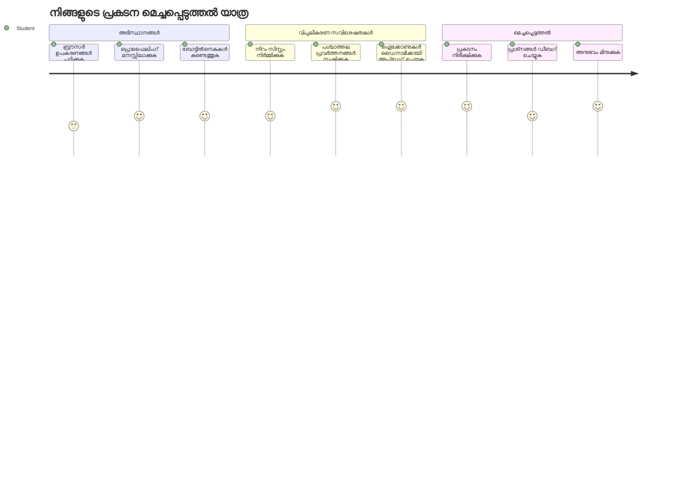
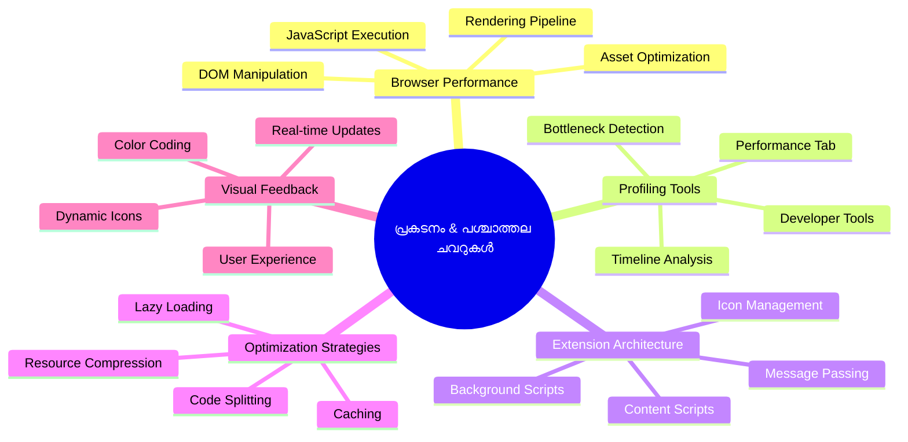
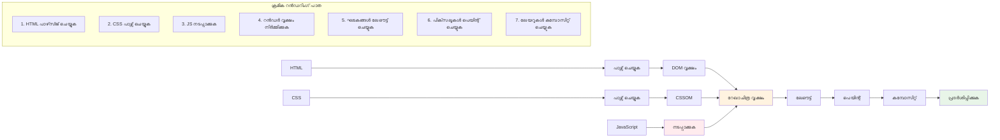
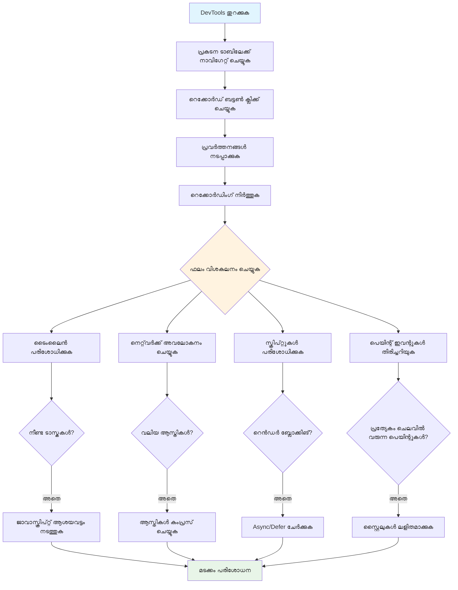
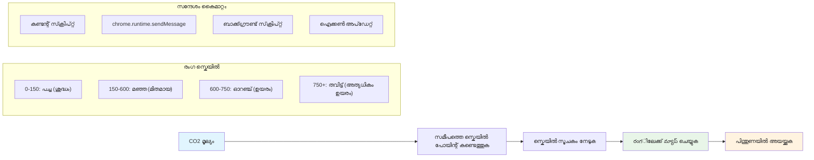
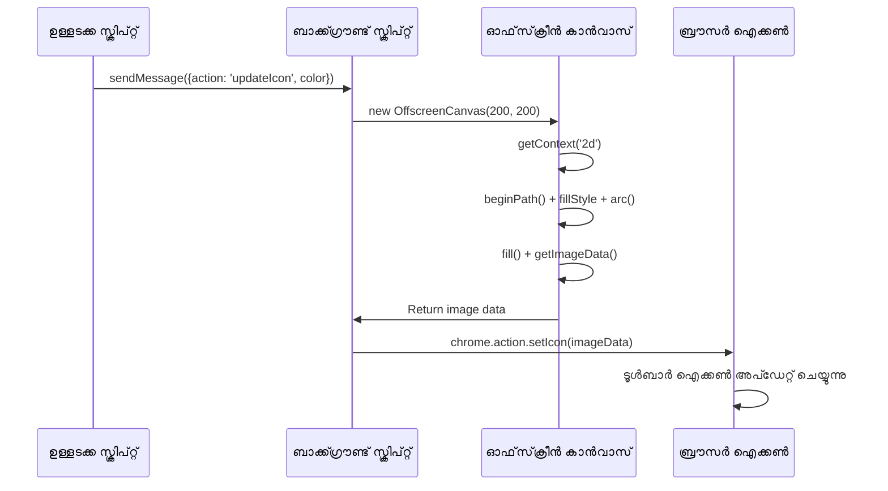
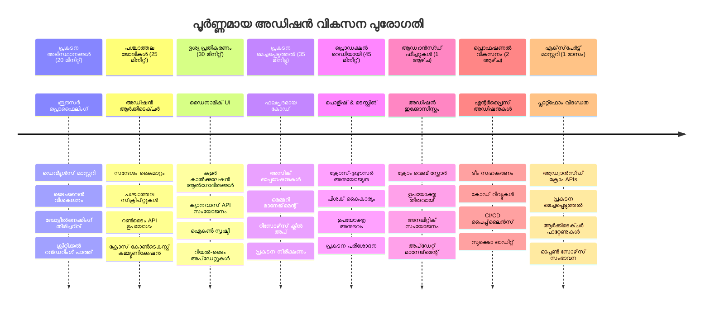

<!--
CO_OP_TRANSLATOR_METADATA:
{
  "original_hash": "b275fed2c6fc90d2b9b6661a3225faa2",
  "translation_date": "2026-01-08T15:24:41+00:00",
  "source_file": "5-browser-extension/3-background-tasks-and-performance/README.md",
  "language_code": "ml"
}
-->
# ബ്രൗസർ എക്സ്ടൻഷൻ പ്രോജക്റ്റ് ഭാഗം 3: പശ്ചാത്തല ടാസ്കുകളും പ്രകടനവും അറിയുക


ചില ബ്രൗസർ എക്സ്ടൻഷനുകൾ എങ്ങനെ തിരക്കുള്ളതും പ്രതികരണശേഷിയുള്ളതും തോന്നിക്കുന്നു, മറ്റാൽ മൂർച്ച കുറഞ്ഞതായാണ് തോന്നുന്നത് എന്ന് നിങ്ങൾ ഒരിക്കലെങ്കിലും ആലോചിച്ചിട്ടുണ്ടോ? രഹസ്യം സീനിന്റെ പിന്‍ഭാഗത്താണ് നടക്കുന്നത്. ഉപയോക്താക്കൾ നിങ്ങളുടെ എക്സ്ടൻഷന്റെ ഇന്റർഫേസ് ക്ലിക്ക് ചെയ്യുമ്പോൾ, ഡാറ്റ ഫെട്ടിംഗ്, ഐക്കൺ അപ്‌ഡേറ്റുകൾ, സിസ്റ്റം റിസോഴ്സുകൾ തുടങ്ങിയവ ശാന്തമായി കൈകാര്യം ചെയ്യുന്ന പശ്ചാത്തല പ്രക്രിയകളുടെ ഒരു ലോകം ഉണ്ട്.  

ഇത് ബ്രൗസർ എക്സ്ടൻഷൻ സീരീസിലെ vårt അവസാന പാഠമാണ്, നാം നിങ്ങളുടെ കാർബൺ ഫുട്പ്രിന്റ് ട്രാക്കറെ സുഖമായും മടുപ്പോടെയും പ്രവർത്തിപ്പിക്കും. നിങ്ങൾ ജീവൻമാറ്റം പുലർത്തുന്ന ഡൈനാമിക് ഐക്കൺ അപ്‌ഡേറ്റുകൾ ചേർക്കുകയും പ്രവർത്തന പ്രശ്നങ്ങൾ പ്രശ്നങ്ങളായി മാറുന്നതിനുമുമ്പ് കണ്ടെത്താൻ പഠിക്കുകയുമാണ്. ഇത് ഒരു റേസ് കാറിനെ ട്യൂൺ ചെയ്യുന്നതുപോലെയാണ് - ചെറിയ മെച്ചപ്പെടുത്തലുകൾ എല്ലാം പ്രവർത്തിക്കുന്ന രീതിയിൽ വലിയ വ്യത്യാസങ്ങൾ സൃഷ്ടിക്കും.  

നാം പൂർത്തീകരിക്കുമ്പോൾ, നിങ്ങൾക്ക് ഒരു സുന്ദരമായി നിർമ്മിക്കപ്പെട്ട എക്സ്ടൻഷൻ ഉണ്ടായിരിക്കും, നല്ല വെബ് ആപ്പുകൾ മികച്ചവയിൽ നിന്നും വേർതിരിക്കുന്ന പ്രകടന സിദ്ധാന്തങ്ങളും മനസ്സിലാക്കാം. ബ്രൗസർ ഓപ്റ്റിമൈസേഷന്റെ ലോകത്തിലേക്ക് നമുക്ക് ചാടി നോക്കാം.  

## പ്രീ-ലക്ടർ ക്വിസ്  

[Pre-lecture quiz](https://ff-quizzes.netlify.app/web/quiz/27)  

### പരിചയം  

മുന്‍പുള്ള പാഠങ്ങളിൽ, നിങ്ങൾ ഒരു ഫോമുണ്ടാക്കി, അത് ഒരു API-യുമായി ബന്ധിപ്പിച്ച് അസിങ്ക്രോണസ് ഡാറ്റ ഫെട്ടിംഗും അഭിമുഖീകരിച്ചു. നിങ്ങളുടെ എക്സ്ടൻഷൻ നല്ല രൂപത്തിൽ വളരുന്നു.  

ഇപ്പോൾ അവസാന സ്പർശനങ്ങൾ ചേർക്കേണ്ടതാണ് - ആ എക്സ്ടൻഷൻ ഐക്കൺ കാർബൺ ഡേറ്റ അടിസ്ഥാനമാക്കി നിറങ്ങൾ മാറ്റുന്നതുപോലെ. ആപോളോ സ്‌പേസ്‌ക്രാഫ്റ്റിലെ എല്ലാ സിസ്റ്റങ്ങളും ഒപ്റ്റിമൈസ് ചെയ്യേണ്ടി വന്നതുപോലെ ഇത് എനിക്ക് ഓർക്കുന്നു. ജീവൻസുരക്ഷ შესრულത്തിന്മേലെ ആശ്രയിച്ചിരുന്നുണ്ടെന്നതിനാൽ അവർക്കു ഒരു വൃത്താന്തം പോലും കളയാനാവാത്തത്. നമ്മുടേതു അത്ര നിർണായകമല്ലെങ്കിലും, అదే സിദ്ധാന്തങ്ങൾ ബാധകമാണ് - കാര്യക്ഷമമായ കോഡ് മികച്ച ഉപയോക്തൃ പരിചയങ്ങൾ സൃഷ്ടിക്കുന്നു.  


## വെബ് പ്രകടന അടിസ്ഥാനങ്ങൾ  

നിങ്ങളുടെ കോഡ് കാര്യക്ഷമമായി പ്രവർത്തിക്കുമ്പോൾ ആളുകൾ വ്യത്യാസം *അനുഭവിക്കുന്നു*. ഒരു പേജ് ഇൻസ്റ്റന്റ് ലോഡ് ആകുമ്പോൾ അല്ലെങ്കിൽ അനിമേഷൻ തണ്ടാതെ ഒഴുകുമ്പോൾ നിങ്ങൾ ആ സമയത്തെ അറിയില്ലേ? ആയാണ് നല്ല പ്രകടനം.  

പ്രകടനം വെറും വേഗത മാത്രമല്ല - ഇത് നൈസർഗികവും തടസ്സമില്ലാത്തതുമായ വെബ് അനുഭവങ്ങൾ സൃഷ്ടിക്കുന്നതായും ബാധിക്കുന്നു. കംപ്യൂട്ടിംഗിന്റെ പ്രാരംഭ കാലത്ത്, ഗ്രേസ് ഹോപ്പർ ഒരു നാനോസെക്കന്റ് (ഒരു അടിപൊടിക്ക് ഏകദേശം തുല്യമായ വയർ) തന്റെ മേശയിൽ വച്ചുപയോഗിച്ച് ഒരു ബില്ല്യൺആം ഭാഗം സെക്കൻഡിൽ പ്രകാശം എത്ര ദൂരം സഞ്ചരിക്കുന്നുവെന്ന് കാണിച്ചു. കംപ്യൂട്ടിംഗിൽ ഓരോ മൈക്രോസെക്കന്റും എത്ര പ്രധാനമാണെന്ന് വിശദീകരിക്കാൻ അതായിരുന്നു അവളുടെ വഴി. കാര്യങ്ങൾ മന്ദഗതിയാകുന്നതെന്താണെന്ന് കണ്ടെത്താൻ സഹായിക്കുന്ന അന്വേഷണ ഉപകരണങ്ങൾ നാം പരിശോധിക്കാം.  

> "വെബ്‌സൈറ്റ് പ്രകടനം രണ്ട് കാര്യങ്ങളിൽ ആണ്: പേജ് എത്ര വേഗം ലോഡാകും, അതിലെ കോഡ് എത്ര വേഗം പ്രവർത്തിക്കും." -- [Zack Grossbart](https://www.smashingmagazine.com/2012/06/javascript-profiling-chrome-developer-tools/)  

നിങ്ങളുടെ വെബ്‌സൈറ്റുകൾ എല്ലാ തരത്തിലുള്ള ഉപകരണങ്ങളിലും, എല്ലാ തരത്തിലുള്ള ഉപഭോക്താക്കളിലുമുള്ള എല്ലാ സാഹചര്യങ്ങളിലും വല്ലാതെ വേഗത്തിൽ പ്രവർത്തിക്കുന്നതെങ്ങനെ എന്ന വിഷയത്തിൽ അല്പം വ്യാപകം കൂടിയാണ്. യാതൊരു സ്റ്റാൻഡേർഡ് വെബ് പ്രോജക്റ്റ് അല്ലെങ്കിൽ ബ്രൗസർ എക്സ്ടൻഷൻ നിർമ്മിക്കുമ്പോൾ ശ്രദ്ധിക്കേണ്ട ചില കാര്യങ്ങൾ ഇവിടെ കാണാം.  

നിങ്ങളുടെ സൈറ്റ് ഒപ്റ്റിമൈസ് ചെയ്യാനുള്ള ആദ്യ പടിയെന്നും അടിച്ചുമാറ്റം എന്താണെന്ന് മനസ്സിലാക്കലും ആണ്. ഭാഗ്യവശാൽ, നിങ്ങളുടെ ബ്രൗസറിന് ശക്‌തമായ അന്വേഷണ ഉപകരണങ്ങൾ അതിൽ ഉൾക്കൊള്ളിച്ചിരിക്കുന്നു.  


എഡ്ജിൽ ഡവലപ്പർ ടൂൾസ് തുറക്കാൻ, മുകളിൽ വലത് മൂലയിൽ ഉള്ള മൂന്ന് ഡോട്ടുകൾ ക്ലിക്ക് ചെയ്ത് More Tools > Developer Tools ൽ പോകുക. അല്ലെങ്കിൽ കീബോർഡ് ഷോർട്ട്കട്ട് ഉപയോഗിക്കുക: Windows-ൽ `Ctrl` + `Shift` + `I`, Mac-ൽ `Option` + `Command` + `I`. അവിടെ എത്തിയാൽ Performance ടാബിൽ ക്ലിക്ക് ചെയ്യുക - ഇവിടെ നിങ്ങൾ അന്വേഷണം നടത്തും.  

**ഇതാണ് നിങ്ങളുടെ പ്രകടന അന്വേഷണ ടൂൾകിറ്റ്:**  
- **Developer Tools തുറക്കുക** (നിങ്ങൾ ഡെവലപ്പറായി ഇതെപ്പോളും ഉപയോഗിക്കും!)  
- **Performance ടാബിലേക്കു പോകുക** - ഇത് നിങ്ങളുടെ വെബ് ആപ്പിന്റെ ഫിറ്റ്നസ് ട്രാക്കറാണ്  
- **റെക്കോർഡ് ബട്ടൺ അമർത്തുക** നിങ്ങളുടെ പേജ് പ്രവർത്തനം കാണാൻ  
- **ഫലങ്ങൾ പഠിച്ച്** വിനാശം സൃഷ്ടിക്കുന്നതെന്താണെന്ന് കണ്ടെത്തുക  

ഇത് പരീക്ഷിക്കാം. ഒരു വെബ്‌സൈറ്റ് തുറക്കൂ (Microsoft.com നല്ലതാണ്) 'Record' ബട്ടൺ അമർത്തൂ. പിന്നീട് പേജ് റിഫ്രഷ് ചെയ്ത് പ്രൊഫൈലർ എല്ലാം രേഖപ്പെടുത്തിയതിൽ ശ്രദ്ധിക്കൂ. റെക്കോർഡ് നിർത്തുമ്പോൾ ബ്രൗസർ സൈറ്റിനെ 'സ്ക്രിപ്റ്റ്', 'റെൻഡർ', 'പെയിന്റ്' ചെയ്യുന്ന രീതിയുടെ വിശദാംശം കാണിക്കും. ഇത് മിസൺ കൺട്രോൾ ഒരു റോക്കറ്റ് വിന്യാസ സമയത്ത് ഓരോ സിസ്റ്റത്തെയും നിരീക്ഷിക്കുന്നതുപോലെയാണ് - നിങ്ങൾക്ക് യഥാർത്ഥ സമയം സംഭവിക്കുന്നതും എപ്പോഴാണെന്നും ഡാറ്റ ലഭിക്കുന്നു.  

  

✅ കൂടുതൽ വിശദാംശങ്ങൾക്ക് [Microsoft Documentation](https://docs.microsoft.com/microsoft-edge/devtools-guide/performance/?WT.mc_id=academic-77807-sagibbon) കാണുക  

> പ്രൊ ടിപ്: ഒരു പേജ് ആദ്യമായി സന്ദർശിക്കുന്നവരുടെ പ്രകടനം കാണാൻ ടെസ്റ്റു് ചെയ്യുന്നതിന് മുമ്പ് ബ്രൗസർ കാഷെ ക്ലിയർ ചെയ്യുക - തുടർച്ചയായ സന്ദർശനങ്ങളിൽ നിന്ന് വ്യത്യാസമുള്ളതായിരിക്കും!  

ദിവസം സമയത്ത് സംഭവിക്കുന്ന ഇവന്റുകള്‍ നിജപ്പെടുത്തിയ профൈല്‍ ടൈംലൈന്‍ സെലക്ട് ചെയ്ത് സൂക്ഷ്മമായി നോക്കാം.  

പ്രൊഫൈല് ടൈംലൈന്റെ ഒരു ഭാഗം തിരഞ്ഞെടുക്കുക, സംഗ്രഹ പാനൽ കാണുക:  

  

ഇവന്റ് ലോഗ് പാനലിൽ 15 മില്ലിസെക്കൻഡിനും മുകളിൽ സമയം എടുത്ത ഇവന്റുകൾ പരിശോധിക്കുക:  

  

✅ നിങ്ങളുടെ പ്രൊഫൈലറിനെ പരിചയപ്പെടൂ! ഈ സൈറ്റിൽ ഡവലപ്പർ ടൂൾസ് തുറന്നിട്ട് ബോട്ടിൽനെക്കുകൾക്കുള്ള സാധ്യത നോക്കൂ. ഏറ്റവും സ്ലോ ആയി ലോഡ് ചെയ്യുന്ന ആസറ്റോ? ഏറ്റവും വേഗം?


## പ്രൊഫൈലിംഗ് ചെയ്യുമ്പോൾ എന്തു നോക്കണം  

പ്രൊഫൈലർ പ്രവർത്തിപ്പിക്കുന്നത് തുടങ്ങലായിരിക്കും - എന്നാൽ വാസ്തവിക കഴിവ് ആ കോറുളള വർണ്ണാഭമായ ചാർട്ടുകളിൽ എന്താണെന്ന് മനസ്സിലാക്കലിലുണ്ട്. ആശങ്ക വേണ്ട, വായിക്കൽ ആലോചിക്കുക എങ്ങനെ എന്നതു കൾപ്പിക്കാം. പരിചയസമ്പന്നരായ ഡവലപ്പർമാർ വലിയ പ്രശ്നങ്ങളായി മാറുന്നതിനുമുമ്പ് മുന്നറിയിപ്പ് ലക്ഷണങ്ങൾ തിരിച്ചറിയാൻ പഠിച്ചു.  

വെബ്പ്രോജക്റ്റുകളിൽ എത്തുന്ന പ്രകടന പ്രശ്നങ്ങൾ സാധാരണയായി എന്തെല്ലാമാണെന്നു പരിചയപ്പെടാം - മേരി ക്യൂറിയുടെ ലബോറട്ടറിയിലെ റഡിയേഷൻ നിരക്കുകൾ സൂക്ഷ്മമായി നിരീക്ഷിച്ചതുപോലെ, നമ്മൾ ശ്രദ്ധിക്കേണ്ട ചില മാന്ദ്യങ്ങളും പിഴവുകളും കഴിഞ്ഞു മുന്നറിയിപ്പ് നൽകുന്ന പാറ്റേണുകളെ കണ്ടെത്തണം. ഈ മുൻകൂട്ടൽ നിങ്ങൾക്കും ваших ഉപയോക്താക്കൾക്കും വിഷമം കുറക്കും.  

**ആസറ്റ് വലുപ്പങ്ങൾ**: വർഷങ്ങളായി വെബ്‌സൈറ്റുകൾ "ഭാരം കൂടിയ"തായി - അതിന്റെ പലപ്പോഴും കാരണം ചിത്രങ്ങളുടെ വലുപ്പം ആണ്. ഇത് നമ്മുടെ ഡിജിറ്റൽ സ്യൂട്ട്കേസുകളില്‍ കൂടിയിരിക്കുന്ന ഭാരത്തിന്റെ പോലെയാണ്.  

✅ പേജ് വലിപ്പം എങ്ങനെ വളർന്നുവെന്ന് കാണാൻ [Internet Archive](https://httparchive.org/reports/page-weight) സന്ദർശിക്കുക - ഇത് ഒരു വെളിച്ചം നൽകുന്നുണ്ട്.  

**ആസറ്റുകൾ എങ്ങനെ ഉചിതമായി ഒപ്റ്റിമൈസ് ചെയ്യാം:**  
- **ചിത്രങ്ങൾ കംപ്രസ് ചെയ്യുക!** WebP പോലുള്ള ആധുനിക ഫോർമാറ്റുകൾ ഫയൽ വലുപ്പം കുറയ്ക്കുന്നു  
- **ഓരോ ഉപകരണത്തിനും അനുയോജ്യമായ ചിത്രം മാത്രം നൽകുക** - ഫോണുകളിൽ വലുതായ മുകളിൽ പകർപ്പുകൾ അയക്കേണ്ട ആവശ്യം ഇല്ല  
- **CSS, JavaScript സൂക്ഷ്മമാക്കുക** - ഓരോ ബൈറ്റ് വിലവെക്കണം  
- **Lazy Loading ഉപയോഗിക്കുക** - ഉപയോക്താക്കൾ സ്ക്രോൾ ചെയ്യുമ്പോൾ മാത്രമേ ചിത്രങ്ങൾ ഡൗൺലോഡ് ചെയ്യൂ  

**DOM ട്രാവേഴ്സലുകൾ**: ബ്രൗസർ എഴുതുന്ന കോഡിന്റെ അടിസ്ഥാനത്തിൽ Documento Object Model നിർമ്മിക്കുന്നത് നിർണ്ണായകമാണ്‌, അതിനാൽ അടുക്കളയുടെ എളുപ്പം കൈകാര്യം ചെയ്യുന്നതിന് HTML ടാഗുകൾ നിർബന്ധമായും കുറവായിരിക്കണം, പേജ് ആവശ്യത്തിനുള്ളത് മാത്രം ഉപയോഗിക്കുക. അതേ രീതിയിൽ ആവശ്യമില്ലാത്ത CSS ഒഴിവാക്കുക; ഉദാഹരണത്തിന് ഒരു പേജിൽ മാത്രം ഉപയോഗിക്കാൻ വേണ്ട സ്റ്റെൽഷീറ്റുകൾ പ്രധാന സ്റ്റൈൽഷീറ്റിൽ ഉൾപ്പെടുത്തേണ്ടതില്ല.  

**DOM ഒപ്റ്റിമൈസേഷനുള്ള പ്രധാന തന്ത്രങ്ങൾ:**  
- **HTML ഘടകങ്ങളുടെ എണ്ണം, നെസ്റ്റിങ് സൗരഭ്യം കുറയ്ക്കുക**  
- **വേറെ ഉപയോഗിക്കാത്ത CSS നിയമങ്ങൾ ഒഴിവാക്കുകയും സ്റ്റൈൽഷീറ്റുകൾ ആഘടിപ്പെട്ട് സംയോജിപ്പിക്കുകയും ചെയ്യുക**  
- **ഓരോ പേജിനും ആവശ്യമായ CSS മാത്രമേ ലോഡ് ചെയ്യുക**  
- **HTML പുസ്‌തകം-ഇടപ്പെടുത്തൽ വർഗ്ഗീകരണം മെച്ചപ്പെടുത്തുക**  

**ജാവാസ്ക്രിപ്റ്റ്**: എല്ലാ ജാവാസ്ക്രിപ്റ്റ് ഡെവലപ്പർമാർക്കും 'render-blocking' സ്ക്രിപ്റ്റുകൾ ശ്രദ്ധിക്കണം - DOM പെയിന്റ് ചെയ്യുന്നതിന് മുമ്പ് ഇവ ലോഡ് ചെയ്യേണ്ടതാണ്. തന്നെറിയം മോഡ്യൂളിൽ ഉപയോഗിക്കുന്നതു പോലെ, ഇൻലൈൻ സ്‌ക്രിപ്റ്റുകളോട് defer ഉപയോഗിക്കുക പരിഗണിക്കുക.  

**ആധുനിക ജാവാസ്ക്രിപ്റ്റ് ഒപ്റ്റിമൈസേഷൻ സാങ്കേതികതകൾ:**  
- **defer** അറ്റ്രിബ്യൂട്ട് ഉപയോഗിച്ച് DOM പാഴ്സിംഗ് കഴിഞ്ഞു സ്ക്രിപ്റ്റുകൾ ലോഡ് ചെയ്യുക  
- **കോഡ് സ്പ്ലിറ്റിംഗ്** ഉപയോഗിച്ച് ആവശ്യമായ ജാവാസ്ക്രിപ്റ്റ് മാത്രം ലോഡ് ചെയ്യുക  
- ഏറ്റവും പ്രധാനപ്പെട്ട പ്രവർത്തനങ്ങൾക്ക് **lazy loading** നടപ്പിലാക്കുക  
- ഭാരം കൂടിയ ലൈബ്രറികളും ഫ്രെയിമ്വർക്കുകളും ഉപയോഗം കുറയ്ക്കുക  

✅ ചില സൈറ്റുകൾ [Site Speed Test website](https://www.webpagetest.org/) വഴി പരിശോധിച്ച് സൈറ്റ് പ്രകടനം വിലയിരുത്തുന്നതിലെ സാധാരണ പരിശോധനകൾ പഠിക്കാം.  

### 🔄 **പാഠ്യപരമായ പരിശോധന**  
**പ്രകടന മനസിലാക്കൽ**: എക്സ്ടൻഷനിലേക്ക് ഫീച്ചറുകൾ നിർമ്മിക്കുമ്പോളുളള മുൻ‌കൂട്ടി സാങ്കേതിക തത്വങ്ങൾ അറിഞ്ഞിരിക്കണം:  
- ✅ HTML മുതൽ പിക്സലുകളിലേക്കുള്ള വിമർശന മാർഗ്ഗം വിശദീകരിക്കാൻ കഴിയും  
- ✅ വെബ് ആപ്ലിക്കേഷനുകളിലെ സാധാരണ പ്രകടന തടസ്സങ്ങൾ തിരിച്ചറിയാൻ  
- ✅ ബ്രൗസർ ഡെവലപ്പർ ടൂൾസ് ഉപയോഗിച്ച് പേജ് പ്രകടനം പ്രൊഫൈൽ ചെയ്യാമോ  
- ✅ ആസറ്റ് വലുപ്പവും DOM സങ്കീർണതയും വേഗതയെ എങ്ങനെ ബാധിക്കുന്നു എന്ന് മനസ്സിലാക്കുക  

**ദ്രുത സ്വയം പരീക്ഷണം**: render-blocking ജാവാസ്ക്രിപ്റ്റ് ഉണ്ടായാൽ എന്താകും?  
*ഉത്തരം: ബ്രൗസർ HTML പാഴ്സിംഗ് ആയും പേജ് റെൻഡറിംഗ് പുരോഗമിക്കാനുമപ്പുറം അവ മൊത്തം സ്ക്രിപ്റ്റ് ഡൗൺലോഡും പ്രവർത്തിപ്പിക്കേണ്ടത് നിർബന്ധമാണ്*  

**നിജജീവിതത്തിലെ പ്രകടനഫലങ്ങൾ**:  
- **100 മില്ലിസെക്കന്റ് താമസം**: ഉപയോക്താക്കൾ മന്ദഗതിയുടെ വ്യത്യാസം കാണുന്നു  
- **1 സെക്കന്റ് താമസം**: ഉപയോക്താക്കൾ ശ്രദ്ധ നഷ്ടപ്പെടുന്നു  
- **3+ സെക്കന്റ്**: 40% ഉപയോക്താക്കൾ പേജ് കൈവിടുന്നു  
- **മൊബൈൽ നെറ്റ്വർക്കുകൾ**: പ്രകടനം കൂടുതൽ നിർണ്ണായകം  

നിങ്ങൾ അയക്കുന്ന ആസറ്റുകളെ ബ്രൗസർ എങ്ങനെ റെൻഡർ ചെയ്യും എന്നുള്ള ഒരു ധാരണ സ്വന്തമാണെന്ന് ഇപ്പോൾ നമ്മുക്ക് ഞങ്ങൾ എക്സ്ടൻഷൻ പൂർത്തിയാക്കാൻ വേണ്ട അവസാന കാര്യങ്ങൾ നോക്കാം:  

### നിറം കണക്കാക്കാൻ ഒരു ഫംഗ്ഷൻ സൃഷ്ടിക്കുക  

ഇപ്പോൾ സംഖ്യാത്മക ഡാറ്റയെ അർത്ഥമുള്ള നിറങ്ങൾ ആയി മാറ്റുന്ന ഒരു ഫംഗ്ഷൻ സൃഷ്ടിക്കാം. ഇത് ട്രാഫിക് ലൈറ്റ് സംവിധാനം പോലെയാണ് - ക്ലീൻ എനർജിയ്ക്ക് പച്ച, ഉയർന്ന കാർബൺ ഇൻറൻസിറ്റിക്ക് ചുവപ്പ്.  

ഈ ഫംഗ്ഷൻ നമ്മുടെ API-യിൽ നിന്ന് CO2 ഡാറ്റ എടുത്ത് പരിസ്ഥിതി ബാധയെ ഏറ്റവും നല്ല പ്രതിനിധാനം ചെയ്യുന്ന നിറം കണ്ടെത്തും. ഇത് ശാസ്ത്രജ്ഞർ ഹീറ്റ് മാപ്പുകളിൽ കംപ്ലക്സായ ഡാറ്റ പാറ്റേണുകളെ കാണിക്കാൻ നിറം നൽകുന്ന രീതിയുടെ സാമ്യം കൊണ്ട് ഉണ്ട് - സമുദ്ര താപനിലകൾ മുതൽ നക്ഷത്ര രൂപീകരണത്തിന് വരെ. ഇതു /src/index.js-ൽ, മുമ്പ് സജ്ജീകരിച്ച const മാറ്റിയുള്ളവക്ക് 바로 പിന്നിൽ ചേർക്കാം:  


```javascript
function calculateColor(value) {
	// CO2 ഗാഡന ശക്തി സ്‌കെയിൽ നിർവചിക്കുക (ഗ്രാംസ് പ്രതി kWh)
	const co2Scale = [0, 150, 600, 750, 800];
	// ഹരിതം (ശുദ്ധം) മുതൽ ഇരുണ്ട തവിട്ട് (ഉയർന്ന کار്ബൺ) വരെ അനുയോജ്യമായ നിറങ്ങൾ
	const colors = ['#2AA364', '#F5EB4D', '#9E4229', '#381D02', '#381D02'];

	// നമുക്ക് കൊടുത്ത ഇൻപുട്ടിനോട് ഏറ്റവും അടുത്ത സ്‌കെയിൽ മൂല്യം കണ്ടെത്തുക
	const closestNum = co2Scale.sort((a, b) => {
		return Math.abs(a - value) - Math.abs(b - value);
	})[0];
	
	console.log(`${value} is closest to ${closestNum}`);
	
	// നിറം മാപ്പിങിനുള്ള ഇൻഡക്സ് കണ്ടെത്തുക
	const num = (element) => element > closestNum;
	const scaleIndex = co2Scale.findIndex(num);

	const closestColor = colors[scaleIndex];
	console.log(scaleIndex, closestColor);

	// പൂഴികായിക സ്ക്രിപ്റ്റിലേക്കുള്ള നിറം അപ്ഡേറ്റ് സന്ദേശം അയയ്‌ക്കുക
	chrome.runtime.sendMessage({ action: 'updateIcon', value: { color: closestColor } });
}
```
  
**ഈ തുറക്കുന്നFunction ചുരുക്കത്തിൽ:**
- **രണ്ട് അറേകൾ സജ്ജീകരിക്കുന്നു** - ഒന്ന് CO2 തലങ്ങൾക്കായി, മറ്റൊന്ന് നിറങ്ങൾക്കായി (പച്ച = ശുചിത്വം, കട്ടി = മാലിന്യം!)  
- **സമ്മിലിപ്പിക്കപ്പെട്ട CO2 മൂല്യത്തിന് ഏറ്റവും അടുത്ത സംഗതി കണ്ടെത്തുന്നു**, ഒരു രസകരമായ അരെയ് സോർട്ടിംഗ് ഉപയോഗിച്ച്  
- **findIndex() വഴി** പാടുള്ള നിറം പിടിക്കുന്നു  
- **ഈ തിരഞ്ഞെടുത്ത നിറം** ക്രോം ബാക്ക്ഗ്രൗണ്ട് സ്ക്രിപ്റ്റിലേക്ക് സന്ദേശമായി അയക്കുന്നു  
- **ടെംപ്ലേറ്റ് ലിറ്ററൽസ്** (അത്തരം ബാക്ക്‌ടിക്കുകൾ) ഉപയോഗിച്ച് സ്ട്രിംഗ് ശേഷിയം വൃത്തിയാക്കുന്നു  
- **എല്ലാം const പ്രഖ്യാപനങ്ങൾ ഉപയോഗിച്ച് സിസ്റ്റമാറ്റിക് ആക്കുന്നു**  

`chrome.runtime` [API](https://developer.chrome.com/extensions/runtime) നിങ്ങളുടെ എക്സ്ടൻഷന്റെ നാഡീവ്യവസ്ഥ പോലെ ആണ് - പശ്ചാത്തലത്തിലെ എല്ലാത്തരം ആശയവിനിമയം, ടാസ്കുകൾ കൈകാര്യം ചെയ്യുന്നു:  

> "chrome.runtime API ഉപയോഗിച്ച് ബാക്ക്ഗ്രൗണ്ട് പേജ് ലഭിക്കുക, മാനിഫസ്റ്റ് വിവരങ്ങൾ തിരികെ നൽകുക, ആപ്പ് അല്ലെങ്കിൽ എക്സറ്റൻഷൻ ജീവചക്രത്തിലെ ഇവന്റുകൾക്കായി കേൾക്കുകയും പ്രതികരിക്കുകയും ചെയ്യുക. ഈ API URLs ന്റെ സാന്ദർഭ പാതകൾ പൂർണ്ണ യോഗ്യ URLs ആയി മാറ്റുന്നതിനും ഉപയോഗിക്കാം."  

**Chrome Runtime API ഉപകാരങ്ങൾ:**  
- **എക്സ്ടൻഷന്റെ വേർതിരിച്ചിട്ടുള്ള ഭാഗങ്ങൾ തമ്മിൽ ആശയവിനിമയം സാധ്യമാക്കുന്നു**  
- **ഉപയോക്തൃ ഇന്റർഫേസിന് തടസ്സം ഇല്ലാതെ ബാക്ക്ഗ്രൗണ്ട് ജോലികൾ കൈകാര്യം ചെയ്യുന്നു**  
- **എക്സ്റംഷൻ ജീവചക്രം മാനേജ് ചെയ്യുന്നു**  
- **സ്ക്രിപ്റ്റുകൾ തമ്മിലുള്ള സന്ദേശ കൈമാറ്റം എളുപ്പമാക്കുന്നു**  

✅ ഈ ബ്രൗസർ എക്സ്ടൻഷൻ എഡ്ജിനാണ് വികസിപ്പിക്കുന്നത് എങ്കിൽ, ക്രോം API ഉപയോഗിക്കുന്നത് тандി അറിയാമാകും. പുതിയ എഡ്ജ് ബ്രൗസർ ക്രോംയിം ബർ ബ്രൗസർ എഞ്ചിൻ ഉപയോഗിക്കുന്നതിനാൽ ഈ ഉപകരണങ്ങൾ പ്രയോജനപ്പെടുത്താം.  


> **പ്രൊ ടിപ്**: ഒരു ബ്രൗസർ എക്സ്ടൻഷൻ പ്രൊഫൈൽ ചെയ്യാൻ ആഗ്രഹിക്കുന്നുവെങ്കിൽ, എങ്കിൽ ഡെവ് ടൂൾസ് അതിന്റെ തന്നെ സ്വതന്ത്ര ബ്രൗസർ ഇൻസ്റ്റൻസ് ആകുന്നതിനാൽ എക്സ്ടൻഷനിലെ നിന്നും ആരംഭിക്കുക. ഇത് എക്സ്ടൻഷൻ-നിർദ്ദിഷ്ട പ്രകടന സൂചികകൾക്ക് ആക്‌സസ് നൽകുന്നു.  

### എൻറെ ആശയം ഡിഫോൾട്ട് ഐക്കൺ നിറം സജ്ജമാക്കുക  

ഇപ്പോൾ യഥാർത്ഥ ഡാറ്റ ഫെട്ടിംഗ് തുടങ്ങുന്നതിന് മുമ്പ് നമ്മുടെ എക്സ്റംഷന് ഒരു തുടക്കം നൽകാം. ആരും ശൂന്യമോ തകരാറുള്ളതുപോലുള്ള ഐക്കണെ നോക്കിത്തീരുമെന്നില്ല. അതിനാൽ ഇൻസ്റ്റാൾ ചെയ്ത ഉടൻ ഉപയോക്താക്കൾക്ക് എക്സ്റംഷൻ പ്രവർത്തനക്ഷമമായിട്ടുണ്ടെന്നുകാണിക്കാൻ മടുത്ത പച്ച നിറം നൽകാം.  

നിങ്ങളുടെ `init()` ഫംഗ്ഷനിൽ ഡിഫോൾട്ട് പച്ച ഐക്കൺ സജ്ജമാക്കാം:  

```javascript
chrome.runtime.sendMessage({
	action: 'updateIcon',
	value: {
		color: 'green',
	},
});
```
  
**ഈ തുടക്കഘട്ടം നേടുന്നത്:**  
- **നിഷ്പക്ഷമായ പച്ച നിറം ഡിഫോൾട്ട് ആയി സജ്ജമാക്കുന്നു**  
- **എക്സ്റംഷൻ ലോഡുചെയ്യുമ്പോൾ ഉടൻ കാഴ്ച മുന്നറിയിപ്പ് നൽകുന്നു**  
- **ബാക്ക്ഗ്രൗണ്ട് സ്ക്രിപ്റ്റുമായി ആശയവിനിമയ മാതൃക സ്ഥാപിക്കുന്നു**  
- **ഡാറ്റ ലോഡ് ആകരുത് ഉപയോക്താക്കൾക്ക് പ്രവർത്തനക്ഷമമായ എക്സ്റംഷൻ കാണിക്കുന്നു**  

### ഫംഗ്ഷന് വിളിക്കുക, ഫോൺ റഫ്രഷ് ചെയ്യുക  

ഇപ്പോൾ എല്ലാം ബന്ധിപ്പിച്ച്, പുതിയ CO2 ഡാറ്റ വന്നു കിട്ടുമ്പോൾ നിങ്ങളുടെ ഐക്കൺ തട്ടിയ കളർ കൊണ്ട് സ്വയം അപ്‌ഡേറ്റ് ആവട്ടെ. ഇലക്‌ട്രോണിക് ഉപകരണത്തിലെ അവസാന സർക്യൂട്ടുമായി ബന്ധിപ്പിക്കുന്നതുപോലെ - ഒരുമിച്ചുള്ള ഒറ്റ സംവിധാനം പോലെ ഘടകങ്ങൾ പ്രവർത്തിക്കുന്നു.  

API-യിൽ നിന്ന് CO2 ഡാറ്റ കിട്ടിയ ഉടൻ ഈ വരി ചേർക്കുക:  

```javascript
// API-യിൽ നിന്നും CO2 ഡാറ്റ പിടിക്കുന്നതിന് ശേഷം
// let CO2 = data.data[0].intensity.actual;
calculateColor(CO2);
```
  
**ഈ സംയോജനം നേടുന്നത്:**  
- **API ഡാറ്റ ഫ്ലോയെ ദൃശ്യ സൂചികയുമായി ബന്ധിപ്പിക്കുന്നു**  
- **പുതിയ ഡാറ്റ വന്നു കൊണ്ട് ഐക്കൺ അപ്‌ഡേറ്റുകൾ പടിപടിയായി പരിമിതിക്കുന്നു**  
- **നിലവിലെ കാർബൺ ഇൻറൻസിറ്റി അടിസ്ഥാനമാക്കി യഥാർത്ഥ കാര്യക്ഷമ ദൃശ്യമാനം ഉറപ്പാക്കുന്നു**  
- **ഡാറ്റ ഫെട്ടിംഗും പ്രദർശന ലജിക് വേർതിരിച്ചുകൊള്ളുന്നു**  

അവസാനമായി, `/dist/background.js`-ലിൽ ഈ പശ്ചാത്തല കാൾസ് കേൾക്കുന്നListener ചേർക്കുക:  

```javascript
// കോൺറെന്റ് സ്ക്രിപ്റ്റിൽ നിന്നുള്ള സന്ദേശങ്ങൾ கேட்டുക
chrome.runtime.onMessage.addListener(function (msg, sender, sendResponse) {
	if (msg.action === 'updateIcon') {
		chrome.action.setIcon({ imageData: drawIcon(msg.value) });
	}
});

// Canvas API ഉപയോഗിച്ച് ഡൈനാമിക് ഐക്കൺ വരയ്ക്കുക
// energy lollipop എക്സ്റ്റൻഷൻ നിന്ന് വായിച്ചത് - നല്ല ഫീച്ചർ!
function drawIcon(value) {
	// മെച്ചപ്പെട്ട പ്രകടനത്തിനായി ഓഫ്സ്ക്രീൻ കാൻവാസ് നിർമ്മിക്കുക
	const canvas = new OffscreenCanvas(200, 200);
	const context = canvas.getContext('2d');

	// കാർബൺ തീവ്രത പ്രദർശിപ്പിക്കുന്ന നിറമുള്ള വൃത്തം വരയ്ക്കുക
	context.beginPath();
	context.fillStyle = value.color;
	context.arc(100, 100, 50, 0, 2 * Math.PI);
	context.fill();

	// ബ്രൗസർ ഐക്കണായി ഉപയോഗിക്കാനുള്ള ഇമേജ് ഡാറ്റ റിട്ടൺ ചെയ്യുക
	return context.getImageData(50, 50, 100, 100);
}
```
  
**ഈ ബാക്ക്ഗ്രൗണ്ട് സ്ക്രിപ്റ്റ് ചെയ്യുന്നത്:**  
- **പ്രധാന സ്ക്രിപ്റ്റ്കരിൽ നിന്നുള്ള സന്ദേശങ്ങൾ കേൾക്കുന്നു** (ഒരു റിസപ്ഷനിസ്റ്റ് ഫോണുകൾ സ്വീകരിക്കുന്നതു പോലെ)  
- **'updateIcon' അഭ്യർത്ഥനകൾ പ്രോസസ് ചെയ്ത് ടൂൾബാർ ഐക്കൺ മാറ്റുന്നു**  
- **Canvas API ഉപയോഗിച്ച് പുതിയ ഐക്കണുകൾ സൃഷ്ടിക്കുന്നു**  
- **നേരത്തെ കാർബൺ ഇൻറൻസിറ്റി കാണിക്കുന്ന ഒരു ലളിതമായ നിറം വൃത്തം വരയ്ക്കുന്നു**  
- **തെളിവുതരുന്ന പുതിയ ഐക്കൺ ബ്രൗസർ ടൂൾബാറിൽ അപ്‌ഡേറ്റ് ചെയ്യുന്നു**  
- **OffscreenCanvas ഉപയോഗിച്ച് മികച്ച പ്രകടനം ഉറപ്പാക്കുന്നു (UI തടസ്സമില്ലാതെ)**  

✅ Canvas API-നെ കുറിച്ച് കൂടുതൽ [സ്പേസ് ഗെയിം പാഠങ്ങളിൽ](../../6-space-game/2-drawing-to-canvas/README.md) നിങ്ങളെ പഠിപ്പിക്കും.  


### 🔄 **പാഠ്യപരമായ പരിശോധന**  
**പൂർണ്ണ എക്സ്ടൻഷൻ മനസ്സിലാക്കൽ**: ഉള്ള പാടുംബുകളിലെ ജീവചരിത്രം ഉറപ്പാക്കുക:  
- ✅ എക്സ്ടൻഷൻ സ്ക്രിപ്റ്റുകൾ തമ്മിലുള്ള സന്ദേശ കൈമാറ്റം എങ്ങനെ പ്രവർത്തിക്കുന്നു?  
- ✅ പ്രകടനത്തിന് സാധാരണ Canvas-ലേക്ക് പകരം OffscreenCanvas ആവശ്യമാകുന്നതെന്തുകൊണ്ട്?
- ✅ ക്രോം റൺടൈം API എക്സ്റൻഷൻ ആർക്കിടെക്ചറിൽ എന്തു പങ്ക് വഹിക്കുന്നു?
- ✅ വർണ്ണം കണക്കാക്കുന്ന ആൾഗോരിതം ഡാറ്റയെ ദൃശ്യപ്രതികരണത്തിലേക്ക് എങ്ങനെ മാപ്പ് ചെയ്യുന്നു?

**പ്രകടന ശ്രദ്ധകൾ**: നിങ്ങളുടെ എക്സ്റൻഷൻ ഇപ്പോൾ കാണിക്കുന്നു:
- **സമ്പ്രേഷണ കാര്യക്ഷമത**: സ്ക്രിപ്റ്റ് പശ്ചാത്തലങ്ങൾക്കിടയിൽ തിളക്കമുള്ള ആശയവിനിമയം
- **ഒപ്റ്റിമൈസ്ഡ് റെൻഡറിംഗ്**: UI തടസ്സം കൂട്ടുന്ന OffscreenCanvas ഒഴിവാക്കുന്നു
- **പ്രതീക്ഷയുടെ ആധികാരിക അപ്ഡേറ്റ്**: സജീവ ഡേറ്റയുടെ അടിസ്ഥാനത്തിൽ ചിഹ്നം ഡൈനാമിക് മാറ്റങ്ങൾ
- **മെമ്മറി മാനേജ്മെന്റ്**: ശരിയായ ക്ലീനപ്പ് നിലവാരണവും ഉറവിടം കൈകാര്യം ചെയ്യലും

**നിങ്ങളുടെ എക്സ്റ്റൻഷൻ പരിശോധിക്കാനുള്ള സമയം:**
- **എല്ലാം നിർമ്മിക്കുക** `npm run build` ഉപയോഗിച്ച്
- **മറുപരിശോധിക്കുക** നിങ്ങളുടെ എക്സ്റൻഷൻ ബ്രൗസറിൽ (ഈ പടി മറക്കരുത്)
- **തുറക്കൂ** നിങ്ങളുടെ എക്സ്റൻഷനും ആ ചിഹ്നം നിറങ്ങൾ മാറുന്നത് കാണൂ
- **പരിശോധിക്കൂ** ലോകമാകെയുള്ള യഥാർത്ഥ കാർബൺ ഡാറ്റയെ എങ്ങനെ പ്രതികരിക്കുന്നു എന്ന്

ഇപ്പൊഴും അങ്ങയുടെ ലോഡർ ലൊൺഡറി എപ്പോൾ ഒരു നല്ല സമയം ആണെന്ന് ശരിയായ മനസ്സിലാക്കും അല്ലെങ്കിൽ വിശുദ്ധമായ ഊർജ്ജം കാത്തിരിക്കണം. നിനക്ക് സത്യമായും ഉപകാരപ്രദമായ ഒന്നുപണിചെയ്തു, ബ്രൗസർ പ്രകടനം പറ്റിയുള്ള ധാരാളം കാര്യങ്ങളും പഠിച്ചു.

## GitHub Copilot ഏജന്റ് ചലഞ്ച് 🚀

ഈ ചലഞ്ച് പൂർത്തിയാക്കാൻ ഏജന്റ് മോഡ് ഉപയോഗിക്കുക:

**വിവരണം:** എക്സ്റൻഷന്റെ പ്രകടന നിരീക്ഷണ ശേഷികൾ മെച്ചപ്പെടുത്തുക, വിവിധ ഘടകങ്ങളുടെ ലോഡ് സമയം ട്രാക്ക് ചെയ്ത് പ്രദർശിപ്പിക്കാൻ ഒരു ഫീച്ചർ ചേർക്കുക.

**പ്രോംപ്റ്റ്:** ബ്രൗസർ എക്സ്റൻഷനിലെ പ്രകടനം നിരീക്ഷിക്കുന്ന ഒരു സിസ്റ്റം സൃഷ്ടിക്കുക, API യിൽ നിന്നുള്ള CO2 ഡാറ്റ എടുക്കാൻ, വർണ്ണം കണക്കാക്കാൻ, ചിഹ്നം അപ്ഡേറ്റ് ചെയ്യാൻ വേണ്ടി എടുക്കുന്ന സമയം അളക്കുകയും ലോഗ് ചെയ്യുകയും ചെയ്യുക. Performance API ഉപയോഗിച്ച് ഈ പ്രവർത്തനങ്ങൾ അളക്കുന്ന `performanceTracker` എന്ന ഒരു ഫംഗ്ഷൻ ചേർക്കുക. കാലസൂചികകളും ദൈർഘ്യ മെട്രिक्स ഉൾപ്പെടെ ബ്രൗസർ കോൺസോളിൽ ഫലങ്ങൾ പ്രദർശിപ്പിക്കണം.

[agent mode](https://code.visualstudio.com/blogs/2025/02/24/introducing-copilot-agent-mode) പറ്റി കൂടുതൽ അറിയൂ.

## 🚀 ചലഞ്ച്

ഇതാണ് ഒരു രസകരമായ അന്വേഷണ ദൗത്യവും: പുരാതനകാലം മുതല്‍ പ്രവർത്തനക്ഷമമായ കമ്യൂണിറ്റി സൈറ്റുകൾ (വിക്കിപീഡിയ, GitHub, Stack Overflow പോലെ) തിരഞ്ഞെടുക്കുക, അവരുടെ കമ്മിറ്റ് ചരിത്രം പരിശോധിക്കുക. എവിടെ പ്രകടന മെച്ചപ്പെടുത്തലുകൾ നടന്നു എന്നു കണ്ടെത്താമോ? എവിടെ പ്രശ്നങ്ങൾ ആവർത്തിച്ച് പൊഞ്ഞിത്തുടർന്നുള്ളതായി നിങ്ങൾ കാണുന്നുണ്ടോ?

**നിങ്ങളുടെ അന്വേഷണം:**
- **സേർച്ച് ചെയ്യുക** "optimize", "performance", "faster" പോലുള്ള വാക്കുകൾക്ക് കമ്മിറ്റ് മെസേജുകളിൽ
- **നോക്കൂ** പാറ്റേണുകൾ – ഒരേ തരം പ്രശ്നങ്ങൾ അവര്‍ തുടർച്ചയായി പരിഹരിക്കുന്നുണ്ടോ?
- **നോക്കുക** വെബ്സൈറ്റുകൾ പെട്ടെന്ന് മന്ദഗതിയിലേക്ക് എത്തുന്നതിന് കാരണമായ സാധാരണ പ്രശ്നങ്ങൾ
- **പങ്കുവെക്കുക** കണ്ടെത്തലുകൾ – മറ്റുള്ള ഡെവലപ്പർമാർക്ക് യാഥാർഥ ഉദാഹരണങ്ങളിൽനിന്ന് പഠിക്കാൻ

## ക്ലാസ് കഴിഞ്ഞ് ക്വിസ്

[Post-lecture quiz](https://ff-quizzes.netlify.app/web/quiz/28)

## അവലോകനം & സ്വയം പഠനം

[performance newsletter](https://perf.email/) സബ്സ്ക്രൈബ് ചെയ്യാൻ പരിഗണിക്കൂ

ബ്രൗസറുകളുടെ പെർഫോർമൻസ് ടാബുകൾ പരിശോധിച്ച് വേഗം അളക്കാൻ ഉപയോഗിക്കുന്ന മികവുകൾ പരിശോധിക്കുക. പ്രധാന വ്യത്യാസങ്ങളൊന്നും കണ്ടെത്തും?

### ⚡ **അടുത്ത 5 മിനിറ്റിൽ നിങ്ങൾ ചെയ്യാൻ കഴിയും**
- [ ] ബ്രൗസറിലെ ടാസ്‌ക് മാനേജർ തുറക്കൂ (Chrome ൽ Shift+Esc)
- [ ] DevTools-ലെ Performance ടാബ് ഉപയോഗിച്ച് വെബ് പേജിന്റെ പ്രകടനം റെക്കോർഡ് ചെയ്യുക
- [ ] എക്സ്റൻഷൻ പേജ് പരിശോധിക്കുക ചുരുങ്ങിയ-startup സമയമുള്ള എക്സ്റൻഷനുകൾ കണ്ടെത്താൻ
- [ ] താൽക്കാലികമായി ചില നംമ്പുകളെ അപ്രാപ്യവാക്കി പ്രകടന വ്യത്യാസങ്ങൾ നോക്കൂ

### 🎯 **ഈ മണിക്കൂറിൽ നിങ്ങൾ നേടാനാവുന്ന കാര്യങ്ങൾ**
- [ ] ക്ലാസ് കഴിഞ്ഞ് ക്വിസ് പൂർത്തിയാക്കി പ്രകടന ആശയങ്ങൾ മനസ്സിലാക്കുക
- [ ] നിങ്ങളുടെ ബ്രൗസർ എക്സ്റൻഷൻ-നായി പിന്‍ഭാഗ സ്ക്രിപ്റ്റ് ആസൂത്രണം ചെയ്യുക
- [ ] browser.alarms ഉപയോഗിച്ച് ഫലപ്രദമായ പിന്‍ഭാഗ ടാസ്കുകൾ കൈകാര്യം ചെയ്യൽ
- [ ] കണ്ടൻറ് സ്ക്രിപ്റ്റും പിന്‍ഭാഗ സ്ക്രിപ്റ്റും തമ്മിലുള്ള മെസേജ് പാസ്സിങ് പരിശീലനം
- [ ] നിങ്ങളുടെ എക്സ്റൻഷന്റെ ഉറവിട ഉപയോഗം അളക്കുകയും പരിഷ്കരിക്കുകയും ചെയ്യുക

### 📅 **നിങ്ങളുടെ ആഴ്ചകളോളം പ്രകടന യാത്ര**
- [ ] മികച്ച പ്രകടനമുള്ള ഒരു എക്സ്റൻഷൻ പിന്‍ഭാഗ പ്രവർത്തനവുമായി നിർമ്മിക്കുക
- [ ] സർവീസ് വർക്കറുകളും ആധുനിക എക്സ്റൻഷൻ ആർക്കിടെക്ചറും ആൽക്കുക
- [ ] ഫലപ്രദമായ ഡാറ്റയുടെ സിങ്ക്രണൈസേഷൻ, കാഷിംഗ് തന്ത്രങ്ങൾ നടപ്പിലാക്കുക
- [ ] എക്സ്റൻഷൻ പ്രകടനത്തിനുള്ള മുൻനിര ഡീബഗിംഗ് സുഷ്‌ടമായ മാർഗങ്ങൾ പഠിക്കുക
- [ ] പ്രവർത്തനവും ഉറവിട കാര്യക്ഷമതയും തമ്മിൽ സന്തുലിതപ്പെടുത്തുക
- [ ] പ്രകടനത്തെ സംബന്ധിച്ച പരീക്ഷണങ്ങളും ഉപയോഗകേടുകളും നിർമ്മിക്കുക

### 🌟 **നിങ്ങളുടെ മാസങ്ങളോളം മതിമറക്കൽ മികവ്**
- [ ] എന്റർപ്രൈസ് ക്ലാസ്സിലുള്ള, മികച്ച പ്രകടനമുള്ള ബ്രൗസർ എക്സ്റൻഷൻ നിർമ്മിക്കുക
- [ ] വെബ് വർക്കേഴ്സും സർവീസ് വർക്കേഴ്സും ഉടനടി വെബ് പ്രകടനം പഠിക്കുക
- [ ] പ്രകടന മെച്ചപ്പെടുത്തൽ ലക്ഷ്യമാക്കിയ ഓപ്പൺ സോഴ്‌സ് പദ്ധതികൾക്ക് സംഭാവന നൽകുക
- [ ] ബ്രൗസർ ആഭ്യന്തരങ്ങളും മുൻനിര ഡീബഗിംഗ് പരിജ്ഞാനവും നേടുക
- [ ] പ്രകടന നിരീക്ഷണ ഉപകരണങ്ങളും മികച്ച പ്രവർത്തന മാർഗരേഖകളും രൂപകൽപ്പന ചെയ്യുക
- [ ] വെബ് അപ്ലിക്കേഷനുകളുടെ പ്രകടനം മെച്ചപ്പെടുത്തുന്നതിന് വിദഗ്ദ്ധനായി വളരുക

## 🎯 നിങ്ങളുടെ ബ്രൗസർ എക്സ്റൻഷൻ മാസ്റ്ററി ടൈംലൈൻ


### 🛠️ നിങ്ങളുടെ സമ്പൂർണ്ണ എക്സ്റൻഷൻ ഡെവലപ്മെന്റ് ടൂൾകിറ്റ്

ഈ ട്രിലജി പൂർത്തിയാക്കിയ ശേഷം നിങ്ങൾ മറികടന്നിരിക്കുന്നു:
- **ബ്രൗസർ ആർക്കിടെക്ചർ**: എക്സ്റൻഷനുകൾ ബ്രൗസർ സിസ്റ്റങ്ങളുമായി എങ്ങനെ സംയോജിപ്പിക്കപ്പെടുന്നു എന്ന് ആഴത്തിലുള്ള ബോധ്യവും
- **പ്രകടന പ്രൊഫൈലിംഗ്**: ഡെവലപ്പർ ടൂളുകൾ ഉപയോഗിച്ച് ബാധ്യതകൾ കണ്ടെത്താനും പരിഹരിക്കാനും കഴിവ്
- **ആസിങ്ക് പ്രോഗ്രാമിംഗ്**: പ്രതികരണപരവും തടസ്സരहितവും പ്രവർത്തനങ്ങൾക്കുള്ള ആധുനിക ജാവാസ്ക്രിപ്റ്റ് മാതൃകകൾ
- **API സംയോജനം**: അംഗപരിമിതിയും പിശകു കൈകാര്യം ചെയ്യലും ഉള്ള പുറമെ ഡാറ്റ എടുത്തുകൂടി പ്രവർത്തനങ്ങൾ
- **ദൃശ്യ രൂപകൽപ്പന**: ഡൈനാമിക് UI അപ്ഡേറ്റുകളും കാൻവാസ് അടിസ്ഥാന ചിത്രരചനയും
- **മെസേജ് പാസ്സിങ്**: എക്സ്റൻഷൻ ആർക്കിടെക്ചറുകളിൽ സ്ക്രിപ്റ്റുക്കൾ തമ്മിലുള്ള ആശയവിനിമയം
- **ഉപയോക്തൃ അനുഭവം**: ലോഡിംഗ് സ്റ്റേറ്റുകളും പിശക് കൈകാര്യം ചെയ്യലും, മനോഹരമായ ഇടപെടലുകൾ
- **സവിശേഷ കഴിവുകൾ**: യാഥാർത്ഥ്യമാണ് പരിശോധനയും, ഡീബഗിംഗും, പുതിയ വെബ്സ്റ്റാൻഡേർഡുകൾക്കും അനുയോജ്യം

**യഥാർത്ഥ ലോകം അപ്ലിക്കേഷനുകൾ**: നിങ്ങളുടെ എക്സ്റൻഷൻ വികസന കഴിവുകൾ നേരിട്ട് ബാധിക്കുന്നു:
- **പ്രോഗ്രസീവ് വെബ് ആപ്പുകൾ**: സമാനമായ ആർക്കിടെക്ചറും പ്രകടന മാതൃകകളും
- **ഇലക്ട്രോൺ ഡെസ്ക്ടോപ്പ് ആപ്പുകൾ**: വെബ് സാങ്കേതിക വിദ്യകൾ ഉപയോഗിച്ച് പോര്സംഗഭേദമില്ലാത്ത ആപ്പുകൾ
- **മൊബൈൽ ഹൈബ്രിഡ് ആപ്പുകൾ**: Cordova/PhoneGap ഡെവലപ്പ്മെന്റ് വെബ് API വഴിയാണ്
- **എന്റർപ്രൈസ് വെബ് ആപ്പുകൾ**: സമ്ബൃദ്ധമായ ഡാഷ്ബോർഡ്-പ്രോഡക്ഷൻ ഉപകരണങ്ങൾ
- **ക്രോം ഡെവടൂൾസ് എക്സ്റൻഷനുകൾ**: മുൻനിര ഡെവലപ്പർ ടൂളുകളും ഡീബഗ്ഗും
- **വെബ് API സംയോജനം**: പുറം ലോക സേവനങ്ങളുമായി ബന്ധപ്പെട്ടിരിക്കുന്ന ഏതൊരു ആപ്പും

**പ്രൊഫഷണൽ സ്വാധീനം**: ഇപ്പോൾ നിങ്ങൾക്ക് കഴിയുന്നത്:
- **പ്രൊഡക്ഷൻ-സജ്ജമായ എക്സ്റൻഷനുകൾ നിർമ്മിക്കുക** ആശയപ്പിൽ നിന്നും ദിശാനിർദ്ദേശം വരെ
- **വെബ് അപ്ലിക്കേഷൻ പ്രകടനം മെച്ചപ്പെടുത്തുക** വ്യവസായ നിലവാരമുള്ള പ്രൊഫൈലിംഗ് ഉപകരണങ്ങൾ ഉപയോഗിച്ച്
- **ആർക്കിടെക്ചർ സൃഷ്ടിക്കുക** ശരിയായ പ്രധാന പ്രവൃത്തിപ്രവാഹ വ്യതിരിക്തകൃത്യങ്ങളും
- **ഡീബഗ് ചെയ്യുക** സങ്കീർണ്ണമായ ആസിങ്ക് പ്രവർത്തനങ്ങളും കൺടെക്സ്റ്റുകൾ ഇടയിൽ ആശയവിനിമയം
- **ഓപ്പൺ സോഴ്‌സിൽ സംഭാവന നൽകുക** എക്സ്റൻഷൻ പദ്ധതികളിലും ബ്രൗസർ സ്റ്റാൻഡേർഡുകളിലും

**അടുത്ത പടിവാതിൽ അവസരങ്ങൾ**:
- **ക്രോം വെബ് സ്റ്റോർ ഡെവലപ്പർ**: മില്ല്യണുകൾക്ക് എക്സ്റൻസ്‌പബ്ലിഷ് ചെയ്യുക
- **വെബ് പ്രകടന എഞ്ചിനീയർ**: ഒപ്റ്റിമൈസേഷൻ specialization കൂടാതെ ഉപയോക്തൃ അനുഭവം മെച്ചപ്പെടുത്തൽ
- **ബ്രൗസർ പ്ലാറ്റ്ഫോം ഡെവലപ്പർ**: ബ്രൗസർ എഞ്ചിൻ വികസനത്തിൽ സംഭാവന
- **എക്സ്റ്റൻഷൻ ഫ്രെയിംവർക്ക് സൃഷ്ടികർത്താവ്**: മറ്റ് ഡെവലപ്പർമാർക്കായുള്ള ഉപകരണം നിർമ്മിക്കൽ
- **ഡെവലപ്പർ റിലേഷൻസ്**: പഠനവും ഉള്ളടക്ക സൃഷ്ടിയും വഴി അറിവ് പങ്കുവെക്കൽ

🌟 **കാഴ്ചപ്പാട് അനലോകനം**: നിങ്ങൾ ഒരു സമ്പൂർണ്ണ, പ്രവർത്തനക്ഷമ ബ്രൗസർ എക്സ്റൻഷൻ നിർമ്മിച്ചു, പ്രൊഫഷണൽ വികസന രീതികളും ആധുനിക വെബ് സ്റ്റാൻഡേർഡുകളും പ്രകടിപ്പിക്കുന്നു!

## അസൈമെന്റ്

[ഒരു സൈറ്റ് പ്രകടനത്തിനായി വിശകലനം ചെയ്യുക](assignment.md)

---

<!-- CO-OP TRANSLATOR DISCLAIMER START -->
**പ്രത്യക്ഷാന്വേഷണം**:  
ഈ ഡോക്യുമെന്റ് AI വിവർത്തന സേവനം [Co-op Translator](https://github.com/Azure/co-op-translator) ഉപയോഗിച്ച് അനുഭവസ്ഥമായി വിവർത്തനം ചെയ്തു. നാം ശുദ്ധിത്വത്തിന് തയ്യാറെടുക്കുന്നുവെങ്കിലും, യാന്ത്രിക വിവർത്തനങ്ങളിൽ പിഴവുകൾ ഉണ്ടായേക്കാമെന്നും അന്യമായ അര്‍ഥക്കേടുകൾ സംഭവിക്കാമെന്നും ദയവായി ശ്രദ്ധിക്കുക. സ്വദേശ ഭാഷയിൽ ഉള്ള മൊഴിപ്രമാണം അധികാരപരമായ ഉറവിടമായി പരിഗണിക്കണം. നിർണ്ണായകമായ വിവരങ്ങൾക്ക് പ്രൊഫഷണൽ മനുഷ്യ വിവർത്തനം ശുപാർശ ചെയ്യുന്നു. ഈ വിവർത്തനത്തിന്റെ ഉപയോഗത്തിൽ നിന്നു ഉണ്ടായ любуваат വ്യത്യാസങ്ങൾക്ക് ഞങ്ങൾ ഉത്തരവാദികളല്ല.
<!-- CO-OP TRANSLATOR DISCLAIMER END -->