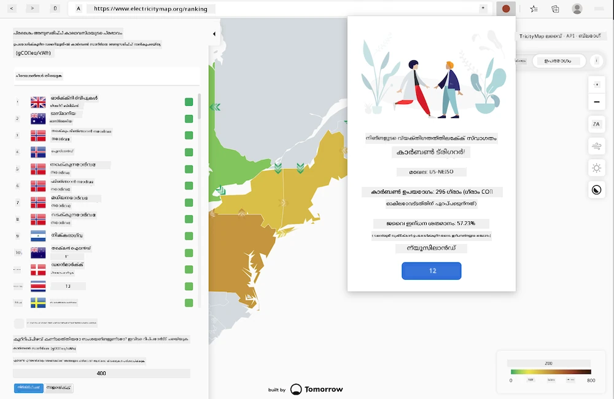
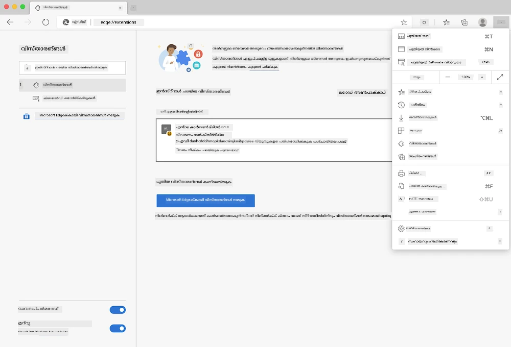

<!--
CO_OP_TRANSLATOR_METADATA:
{
  "original_hash": "9361268ca430b2579375009e1eceb5e5",
  "translation_date": "2026-01-08T16:12:18+00:00",
  "source_file": "5-browser-extension/solution/translation/README.fr.md",
  "language_code": "ml"
}
-->
# Carbon Trigger ബ്രൗസർ എക്‌സ്ടൻഷൻ: പൂർത്തിയായ കോഡ്

tmrow ൽ നിന്നുള്ള C02 സിഗ്നൽ API ഉപയോഗിച്ച് വൈദ്യുതി ഉപയോഗം നിരീക്ഷിക്കാൻ, നിങ്ങളുടെ പ്രദേശത്തിന്റെ വൈദ്യുതി ഉപയോഗത്തെപ്പറ്റി നേരിട്ടുള്ള ഓർമ്മപ്പെടുത്തലിനായി ഒരു ബ്രൗസർ എക്‌സ്ടൻഷൻ സൃഷ്ടിക്കുക. ഈ പഴയകാല എക്‌സ്ടൻഷൻ ഉപയോഗിക്കുന്നത് ഈ വിവരങ്ങളുടെ അടിസ്ഥാനത്തിൽ നിങ്ങളുടെ പ്രവർത്തനങ്ങളെക്കുറിച്ച് നീതിപാലനം നടത്താൻ സഹായിക്കും.



## തുടക്കം

നിങ്ങൾക്ക് [npm](https://npmjs.com) ഇൻസ്റ്റാൾ ചെയ്തിരിക്കുന്നത് ഉണ്ടായിരിക്കണം. നിങ്ങളുടെ കമ്പ്യൂട്ടറിലെ ഒരു ഫോൾഡറിൽ ഈ കോഡിൻറെ കോപ്പി ഡൗൺലോഡ് ചെയ്യുക.

ആവശ്യമുള്ള എല്ലാ പാക്കേജുകളും ഇൻസ്റ്റാൾ ചെയ്യുക:

```
npm install
```

Webpack ൽ നിന്നുള്ള എക്‌സ്ടൻഷൻ നിർമ്മിക്കുക

```
npm run build
```

Edge ൽ ഇൻസ്റ്റാൾ ചെയ്യാൻ, ബ്രൗസറിന്റെ മുകളിൽ വലതുവശത്തുള്ള 'മൂന്നു പോയിന്റ്' മെനു ഉപയോഗിച്ച് ഇക്സ്റ്റൻഷൻസ് പാനൽ കണ്ടെത്തുക. അവിടെ നിന്നും 'Unpacked Extension Load' തിരഞ്ഞെടുക്കുക, പുതിയ എക്‌സ്ടൻഷൻ ലോഡ് ചെയ്യാൻ. പ്രോമ്പ്റ്റിൽ 'dist' ഫോൾഡർ തുറക്കുക, എക്‌സ്ടൻഷൻ ലോഡ് ചെയ്യും. ഉപയോഗിക്കാൻ ആഗ്രഹിക്കുന്ന നിങ്ങളുടെ പ്രദേശത്തേക്ക് അനുയോജ്യമായ CO2 സിഗ്നൽ API കേ (അവിടെ [ഇമെയിൽ വഴി ഒരു കീ നേടുക](https://www.co2signal.com/) - ഈ പേജിൽ നിങ്ങളുടെ ഇമെയിൽ നൽകി) കൂടാതെ [ഇലക്ട്രിസിറ്റി മാപ്പിൽ](https://www.electricitymap.org/map) ഉള്ള [പ്രദേശ കോഡ്](http://api.electricitymap.org/v3/zones) ഉണ്ടാകണം (ബോസ്റ്റണിൽ, ഉദാഹരണത്തിന്, ഞാൻ 'US- NEISO' ഉപയോഗിക്കുന്നു).



API കിയും പ്രദേശവും എക്‌സ്ടൻഷൻ ഇന്റർഫേസിൽ നൽകുന്നതിനു ശേഷം, ബ്രൗസർ എക്‌സ്ടൻഷൻ ബാറിലുള്ള നിറമുള്ള പോയിന്റ് നിങ്ങളുടെ പ്രദേശം ഉപയോഗിക്കുന്ന വൈദ്യുതി തീവ്രതയെ പ്രതിബിംബിപ്പിക്കും, കൂടാതെ ഏത് ഊർജ്ജം കൂടുതൽ ഉപയോഗിക്കുന്ന പ്രവർത്തനങ്ങൾ ചെയ്യാൻ ശരിയായ സമയം എന്നതിന് നിങ്ങൾക്ക് സൂചകമാകും. ഈ 'പോയിന്റ്' സിസ്റ്റത്തിന്റെ ആശയം കാലിഫോർണിയൻ ഉமிழ്പൈനോടുള്ള [Energy Lollipop എക്സ്ടൻഷൻ](https://energylollipop.com/) ൽ നിന്നാണ് കിട്ടുന്നത്.

---

<!-- CO-OP TRANSLATOR DISCLAIMER START -->
**വിമർശന കുറിപ്പ്**:  
ഈ പ്രമാണം AI തർജ്ജമ സർവീസ് [Co-op Translator](https://github.com/Azure/co-op-translator) ഉപയോഗിച്ച് തർജ്ജമചെയ്തതാണ്. ഞങ്ങൾ ശരിതോറും ശ്രമിച്ചുവെങ്കിലും, സ്വയം പ്രവർത്തിക്കുന്ന തർജ്ജമകളിൽ പിഴവുകൾ അല്ലെങ്കിൽ പകഴിപ്പുകൾ ഉണ്ടാകാൻ സാധ്യതയുണ്ട്. മൗലിക പ്രമാണം അതിന്റെ സ്വന്തം ഭാഷയിൽ അസിസ്റ്റന്റ് സ്രോതസ്സായി കണക്കാക്കപ്പെടുന്നതാണ്. പ്രധാനപ്പെട്ട വിവരങ്ങൾക്ക്, പ്രൊഫഷണൽ മനുഷ്യ തർജ്ജമ നിർദേശിക്കും. ഈ തർജ്ജമയുടെ ഉപയോഗത്തിൽ നിന്നു ഉണ്ടാകുന്ന ഏതു തെറ്റിദ്ധാരണകൾക്കും അല്ലെങ്കിൽ മറുപറയലുകൾക്കുമോ ഞങ്ങൾ ഉത്തരവാദികളല്ല.
<!-- CO-OP TRANSLATOR DISCLAIMER END -->