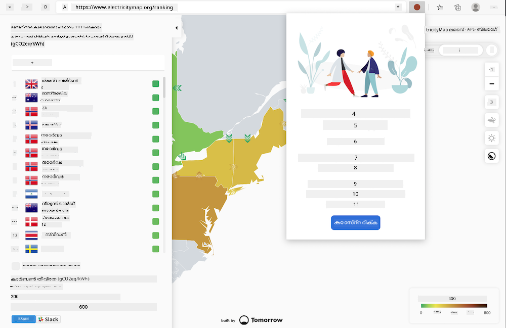
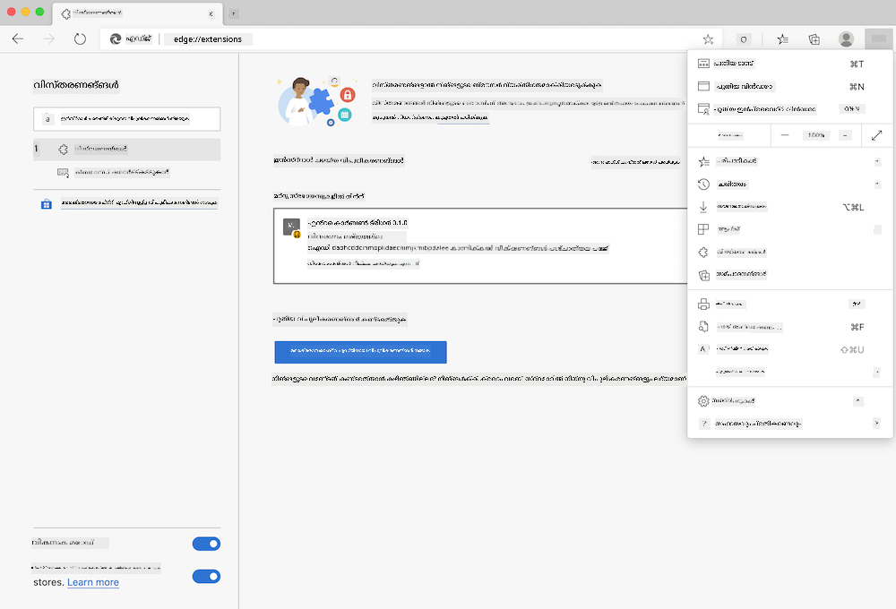

<!--
CO_OP_TRANSLATOR_METADATA:
{
  "original_hash": "21b364c158c8e4f698de65eeac16c9fe",
  "translation_date": "2026-01-08T16:15:52+00:00",
  "source_file": "5-browser-extension/solution/translation/README.ms.md",
  "language_code": "ml"
}
-->
# കാർബൺ ട്രിഗർ ബ്രൗസർ എക്സ്ടൻഷൻ: പൂർണ്ണ കോഡ്

CO2 സിഗ്നൽ tmrow API ഉപയോഗിച്ച് വൈദ്യുതി ഉപയോഗം കണ്ടെത്താൻ, നിങ്ങളുടെ പ്രദേശത്തിന്റെ വൈദ്യുതി ഉപഭോഗം എത്ര ഭാരമുള്ളതാണെന്ന് കണ്ടെത്താൻ ബ്രൗസറിൽ മുന്നറിയിപ്പ് ലഭിക്കുന്നതുവരെ ബ്രൗസർ എക്സ്ടൻഷൻ നിർമ്മിക്കുക. ഈ എക്സ്ടൻഷൻ പ്രത്യേകിച്ച് ഉപയോഗിക്കുന്നത് ഈ വിവരത്തിന്റെ അടിസ്ഥാനത്തിൽ നിങ്ങളുടെ പ്രവർത്തനങ്ങളെക്കുറിച്ച് പരിഗണന നടത്താൻ സഹായിക്കും.



## ഇതുവരെ തുടങ്ങുക

നിങ്ങൾക്ക് [npm](https://npmjs.com) ഇൻസ്റ്റാൾ ചെയ്തിരിക്കണം. ഈ കോഡിന്റെ പകർപ്പ് നിങ്ങളുടെ കമ്പ്യൂട്ടറിലെ ഫോൾഡറിൽ ഡൗൺലോഡ് ചെയ്യുക.

ആവശ്യമുള്ള എല്ലാ പാക്കേജുകളും ഇൻസ്റ്റാൾ ചെയ്യുക:

```
npm install
```

webpack ഉപയോഗിച്ച് എക്സ്ടൻഷൻ നിർമ്മിക്കുക

```
npm run build
```

Edge-ൽ ഇൻസ്റ്റാൾ ചെയ്യാൻ, ബ്രൗസറിന്റെ മുകളിൽ വലതുഭാഗത്ത് ഉള്ള 'മൂന്ന് ഡോട്ട്' മെനുവിൽ നിന്ന് എക്സ്‌റ്റൻഷനുകൾ പാനൽ കണ്ടെത്തുക. അവിടെ നിന്ന് 'Load Unpacked' തിരഞ്ഞെടുക്കുക പുതിയ എക്സ്‌റ്റൻഷൻ ലോഡ് ചെയ്യുന്നതിന്. ആവശ്യമായതു 'dist' ഫോൾഡർ തുറക്കുക, എക്സ്ടൻഷൻ ലോഡ് ചെയ്യപ്പെടും. ഇത് ഉപയോഗിക്കാൻ, CO2 സിഗ്നൽ API-ക്കായി ഒരു API കീ ([ഇമെയിൽ വഴി ഇവിടെ നേടുക](https://www.co2signal.com/) - ഈ പേജിലെ ബോക്സിൽ നിങ്ങളുടെ ഇമെയിൽ നൽകുക) ഉം [നിങ്ങളുടെ പ്രദേശം ക്വാളിഫൈ ചെയ്യുന്ന കോഡ്](http://api.electricitymap.org/v3/zones) ([എലക്ട്രിസിറ്റിമാപ്പ്](https://www.electricitymap.org/map) നു համապատասխանമായി) ഉണ്ടാവണം. (ഉദാഹരണംയായി Boston-ൽ ഞാൻ 'US-NEISO' ഉപയോഗിക്കുന്നു).



API കീയും പ്രദേശം ഇന്റഫേസിൽ നൽകുമ്പോൾ, ബ്രൗസർ എക്സ്ടൻഷന്റെ ബാറിൽ നിറമുള്ള ഡോട്ട് നിങ്ങളുടെ പ്രദേശത്തിന്റെ വൈദ്യുതി ഉപഭോഗം പ്രതിഫലിപ്പിക്കും, നിങ്ങള്ക്ക് അനുയോജ്യമായ ഭാരമുള്ള പ്രവർത്തനങ്ങൾക്കായി സൂചന നൽകും. ഈ 'ഡോട്ട്' സിസ്റ്റത്തിന്റെ ആശയം California-ലെ Energy Lollipop [ബ്രൗസർ എക്സ്‌റ്റൻഷൻ](https://energylollipop.com/) എന്നതിനാൽ ലഭിച്ചിരിക്കുന്നു.

---

<!-- CO-OP TRANSLATOR DISCLAIMER START -->
**അസ്വീകര്‍പ്പു**:
ഈ രേഖ AI വിവര്‍ത്തന സേവനം [Co-op Translator](https://github.com/Azure/co-op-translator) ഉപയോഗിച്ച് പരിഭാഷ ചെയ്തതാണ്. wirhs വഷളാക്കുന്നതിനായി പരിശ്രമിക്കുന്നു, എങ്കിലും ഓട്ടോമേറ്റഡ് വിവര്‍ത്തനങ്ങളില്‍ പിഴവ് അല്ലെങ്കില്‍ തെറ്റുകള്‍ ഉണ്ടാകാമെന്ന് ശ്രദ്ധിക്കുക. അതിന്റെ മാതൃഭാഷയിലെ സ原ലേഖനം പ്രാമാണികമായ ഉറവിടമായി കണക്കാക്കപ്പെടേണ്ടതാണ്. അത്യാവശ്യമായ വിവരങ്ങള്‍ക്കായി, പ്രൊഫഷണല്‍ മനുഷ്യ വിവര്‍ത്തനം ശിപാര്‍ശ ചെയ്യുന്നു. ഈ വിവര്‍ത്തന ഉപയോഗത്തില്‍ ഉണ്ടാകുന്ന തെറ്റായ മനസ്സിലാക്കലുകള്‍ക്കും തെറ്റായ വ്യാഖ്യാനങ്ങള്‍ക്കും ഞങ്ങൾ ഉത്തരവാദികളല്ല.
<!-- CO-OP TRANSLATOR DISCLAIMER END -->