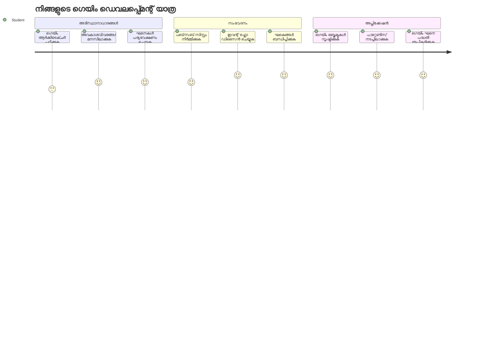
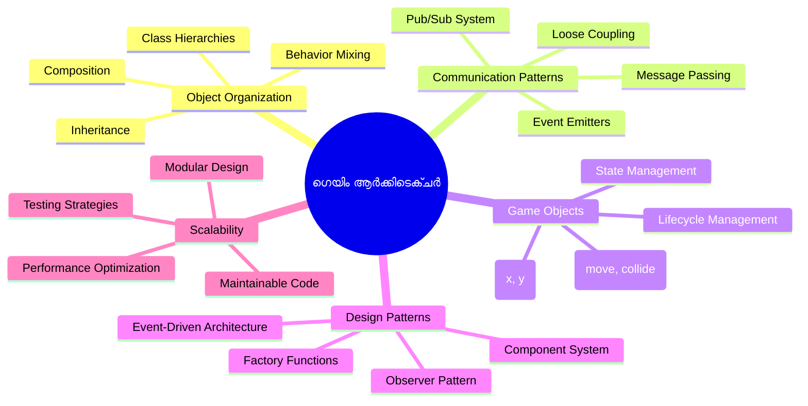
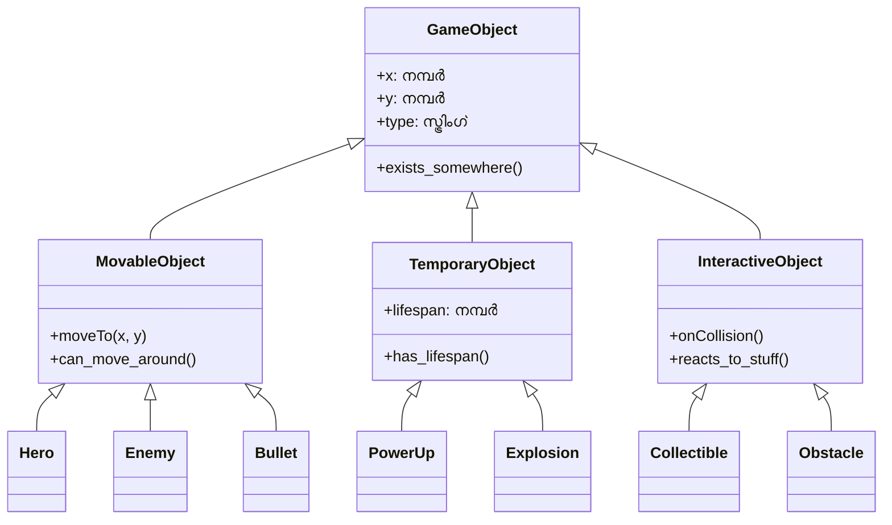
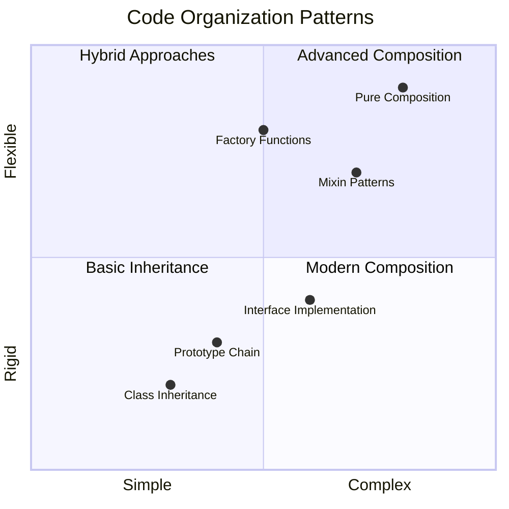
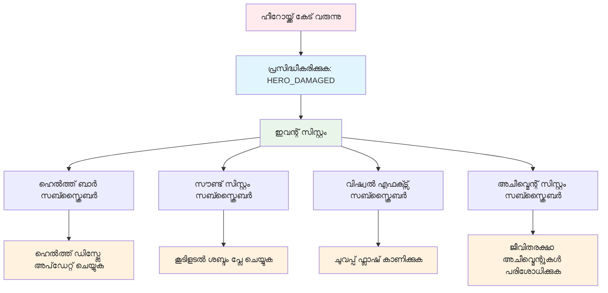
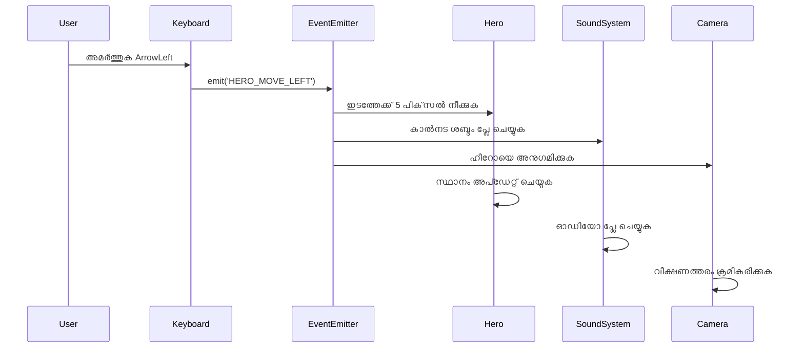
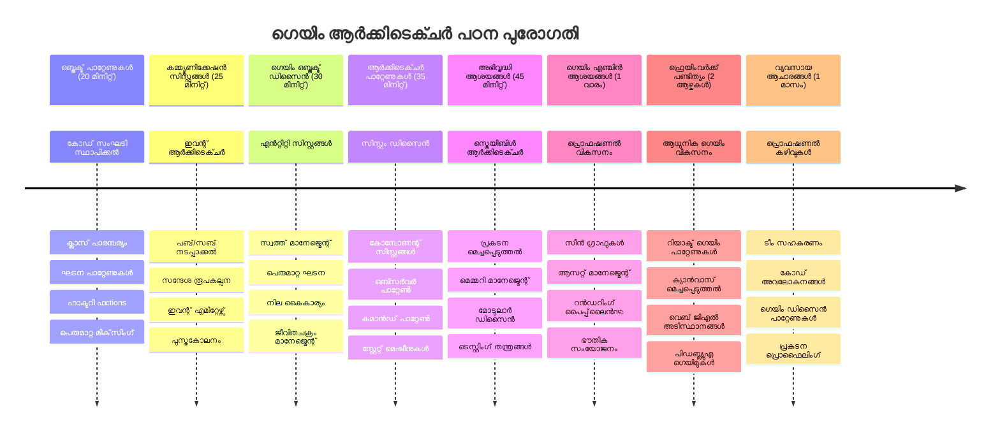

# സ്പേസ് ഗെയിം നിർമ്മാണം ഭാഗം 1: Parichayam




നാസയുടെ മിഷൻ കൺട്രോൾ സ്പേസ് ലോഞ്ചിനിടെ നിരവധി സംവിധാനങ്ങൾ സംയോജിപ്പിക്കുന്നവയുപോലെ, വിവിധ പ്രോഗ്രാം ഭാഗങ്ങൾ എങ്ങനെ അസംക്രമിതമായി സഹകരിക്കാമെന്ന് കാണിക്കുന്നൊരു സ്പേസ് ഗെയിം നിർമ്മിക്കാൻ പോകുകയാണ്. എല്ലാവർക്കും കളിക്കാൻ സാധിക്കുമ്പോൾ, നിങ്ങൾക്ക് ഏതെങ്കിലും സോഫ്റ്റ്‌വെയർ പ്രോജക്റ്റിനും ബാധകമായ അടിസ്ഥാന പ്രോഗ്രാമിംഗ് ആശയങ്ങൾ പഠിക്കാം.

കോഡ് സംഘടിപ്പിക്കാൻ രണ്ട് അടിസ്ഥാന സമീപനങ്ങൾ പരിശോധിക്കാനാകും: ഇൻഹെറിറ്റൻസ്, കോൺപോസിഷൻ. ഇത് ശാസ്ത്രീയ ആശയങ്ങൾ മാത്രമല്ല, വീഡിയോ ഗെയിമുകളേയും ബാങ്കിംഗ് സംവിധാനങ്ങളേയും പ്രവർത്തിപ്പിക്കുന്ന മാതൃകകളാണ്. ബഹിരാകാശ ഒളിപ്പിച്ചുതന്നാലും സമ്പ്രേഷണം നടത്തുന്ന pub/sub എന്ന ഒരു സംവാദ സിസ്റ്റം നടപ്പാക്കും, ഇത് വ്യത്യസ്ത ഘടകങ്ങൾ പരിഭവം ഇല്ലാതെ വിവരങ്ങൾ പങ്കിടുവാൻ സഹായിക്കുന്നു.

ഈ പരമ്പരാവസാനത്തിൽ, നിങ്ങൾ സ്കെയിൽ ചെയ്യാനും വികസിപ്പിക്കാനും കഴിയുന്ന ആപ്ലിക്കേഷനുകൾ നിർമ്മിക്കാൻ അറിയും - നിങ്ങൾ ഗെയിമുകൾ, വെബ് ആപ്ലിക്കേഷനുകൾ, അല്ലെങ്കിൽ ഏതെങ്കിലും മറ്റൊരു സോഫ്റ്റ്‌വെയർ സംവിധാനമുണ്ടാക്കുകയാണെങ്കിലും.


## പൂർവ-ലെക്ചർ ക്വിസ്

[Pre-lecture quiz](https://ff-quizzes.netlify.app/web/quiz/29)

## ഗെയിം വികസനത്തിൽ ഇൻഹെറിറ്റൻസ്, കോൺപോസിഷൻ

പ്രോജക്റ്റുകൾ സങ്കീർണ്ണമാകുമ്പോൾ, കോഡ് ക്രമീകരണം നിർണ്ണായകമാണ്. ലളിതമായ സ്ക്രിപ്റ്റ് തുടങ്ങുമ്പോൾ ശരിയായ ഘടനയില്ലാതെ പരിപാലിക്കൽ പ്രയാസമായി മാറും – അപ്പോളോ മിഷനുകൾ ആയിരം ഘടകങ്ങൾ തമ്മിൽ സൂക്ഷ്മമായി ഏകോപിപ്പിച്ച പോലെ.

കോഡ് ക്രമീകരിക്കാൻ രണ്ട് അടിസ്ഥാന സമീപനങ്ങൾ പരിശോധിക്കാം: ഇൻഹെറിറ്റൻസ്, കോൺപോസിഷൻ. ഓരോതിൽ പ്രത്യേകം ഗുണങ്ങൾ ഉണ്ട്, ഇരണ്ടും മനസ്സിലാക്കുന്നത് വ്യത്യസ്ത സാഹചര്യങ്ങൾക്ക് ശരിയായ സമീപനം തിരഞ്ഞെടുക്കാൻ സഹായിക്കും. നമ്മുടെ സ്പേസ് ഗെയിമിൽ ഈ ആശയങ്ങൾ പ്രയോഗിക്കാം, അവിടെയുള്ള നായകർ, ശത്രുക്കൾ, പവർ-അപ്പുകൾ, മറ്റ് വസ്തുക്കൾ മികവുറ്റിനായി ഇടപെടണം.

✅ പ്രശസ്തമായ പ്രോഗ്രാമിംഗ് പുസ്തകങ്ങളിൽ ഒന്ന് [ഡിസൈൻ.Patterns](https://en.wikipedia.org/wiki/Design_Patterns) സംബന്ധിച്ചതാണ്.

ഏതെങ്കിലും ഗെയിമിൽ, `game objects` ഉണ്ടാകുന്നു – ആ ഘടകങ്ങൾ ഗെയിം ലോകത്ത് ഇടപെടാൻ സഹായിക്കുന്നു. നായകർ, ശത്രുക്കൾ, പവർ-അപ്പുകൾ, ദൃശ്യ ഫലങ്ങൾ എല്ലാം game objects ആണ്. ഓരോ ഒബ്ജക്റ്റും സ്ക്രീൻ കോഓർഡിനേറ്റുകൾ `x` , `y` ഉപയോഗിച്ചാണ് നിലനിർത്തുന്നത്, കോഓർഡിനേറ്റ് പ്ലെയിനിൽ പോയിന്റുകൾ ആക്‌സീസ് ചെയ്യുന്നതുപോലെ.

വിസ്വൽ വ്യത്യാസങ്ങൾ ഉണ്ടായാലും, ഈ_objs സാധാരണ സ്വഭാവങ്ങൾ പങ്കിടുന്നു:

- **അവ എവിടെങ്കിലും ഉണ്ട്** – ഓരോ ഒബ്ജക്റ്റിനും x, y കോഓർഡിനേറ്റുകൾ ഉണ്ട്, അതിനാൽ ഗെയിം എവിടെ വരയ്ക്കണം എന്ന് അറിയാം
- **ബഹുദൂരം ചലിക്കാം** – നായകർ ഓടും, ശത്രുക്കൾ പിന്തുടരും, ബുള്ളറ്റുകൾ സ്ക്രീനിലൂടെയും പറക്കും
- **ജീവിതകാലം ഉണ്ട്** – ചിലവ വല്ലതും നിലനിൽക്കും, ചിലത് (ഫലകങ്ങൾ പോലുള്ള) കുറേ നിമിഷം മാത്രമേ കാണപ്പെടുന്നുള്ളൂ
- **സങ്കടങ്ങൾ വെട്ടിച്ചുമാറ്റുക** – കാര്യങ്ങൾ കൂട്ടിയിടിക്കുമ്പോൾ, പവർ-അപ്പുകൾ ശേഖരിക്കപ്പെടുമ്പോൾ, ഹെൽത്ത് ബാർ അപ്ഡേറ്റ് ചെയ്യുമ്പോൾ

✅ പാക്ക്മാൻ പോലൊരു ഗെയിമിൽ മേൽപറഞ്ഞ നാലു ഒബ്ജക്റ്റ് തരം തിരിച്ചറിയാൻ കഴിയുമോ?


### പ്രവൃത്തികളുടെ പ്രവർത്തനം കോഡിലൂടെ പ്രകടിപ്പിക്കൽ

ഇപ്പോൾ game objects പങ്കിടുന്ന സാധാരണ സ്വഭാവങ്ങൾ മനസ്സിലായ മുന്നിൽ, ഇത്തരത്തിലുള്ള സ്വഭാവങ്ങൾ ജാവാസ്ക്രിപ്റ്റിൽ എങ്ങനെ നടപ്പാക്കാമെന്ന് നോക്കാം. ഒബ്ജക്റ്റ് സ്വഭാവം ക്ലാസുകളിലോ വ്യക്തിഗത ഒബ്ജക്റ്റുകളിലോ methods വഴിയാണ് പ്രകടിപ്പിക്കാവുന്നത്, വ്യത്യസ്ത സമീപനങ്ങൾ തിരഞ്ഞെടുക്കാം.

**ക്ലാസ്സ്-കേന്ദ്രമായ സമീപനം**

ക്ലാസ്‌లు, ഇൻഹെറിറ്റൻസ് ഉപയോഗിച്ച് game objects ക്രമീകരിക്കുന്ന ഘടനാപരമായ മാർഗ്ഗമാണ്. കാര്‍ല്‍ ലിനിയസിന്‍റെ വർഗീകരണ സിസ്റ്റം പോലെ, അടിസ്ഥാന ക്ലാസ് ഒരു പൊതുവായ ഗുണങ്ങൾ ഉൾക്കൊള്ളുന്നു, പിന്നീട് പ്രത്യേക കഴിവുകൾ ചേർക്കുന്ന പ്രത്യേക ക്ലാസുകൾ ഉണ്ടാക്കുന്നു.

✅ ഇൻഹെറിറ്റൻസ് പ്രധാനം. കൂടുതൽ അറിയാൻ [MDN ലേഖനം](https://developer.mozilla.org/docs/Web/JavaScript/Inheritance_and_the_prototype_chain) കാണുക.

ഈ രീതിയിൽ game objects പണിയുന്നതിന്റെ ഉദാഹരണം:

```javascript
// ഘട്ടം 1: അടിസ്ഥാന GameObject ക്ലാസ് സൃഷ്ടിക്കുക
class GameObject {
  constructor(x, y, type) {
    this.x = x;
    this.y = y;
    this.type = type;
  }
}
```

**ദാ നാം ഓരോ പടിയിലും പരിശോധിക്കാം:**
- അതിന്റെ അടിസ്ഥാനത്തിന്റെ ഒരു ഫോർമാറ്റ് സൃഷ്ടിക്കുന്നു
- കൺസ്ട്രക്ടർ ഒബ്ജക്റ്റിന്റെ സ്ഥാനം(`x`, `y`)യും തരവും സൂക്ഷിക്കുന്നു
- ഇതാണ് എല്ലാ game objects നിര്‍മ്മിക്കുന്ന അടിസ്ഥാന

```javascript
// ഘട്ടം 2: പാരമ്പര്യത്തിലൂടെ ചലനം ശേഷി ചേർക്കുക
class Movable extends GameObject {
  constructor(x, y, type) {
    super(x, y, type); // മാതൃ കൺസ്ട്രക്ടർ ആഹ്വാനം ചെയ്യുക
  }

  // പുതിയ സ്ഥാനത്തിലേക്ക് ചലിക്കുന്ന കഴിവ് ചേർക്കുക
  moveTo(x, y) {
    this.x = x;
    this.y = y;
  }
}
```

**മുകളിൽ:**
- GameObject ക്ലാസ് നീട്ടി მოძრാന ലോജിക് ചേർത്തു
- തപാൽ കൺസ്ട്രക്ടർ `super()` ഉപയോഗിച്ച് വിളിച്ചു സവിശേഷതകൾ സജ്ജമടി
- ഒബ്ജക്ടിന്റെ സ്ഥാനം പുതുക്കുന്ന `moveTo()` മെത്തഡും ചേർത്തു

```javascript
// ചുവടു 3: പ്രത്യേക ഗെയിം ഓബ്ജക്ട് ടൈപ്പുകൾ സൃഷ്ടിക്കുക
class Hero extends Movable {
  constructor(x, y) {
    super(x, y, 'Hero'); // ടൈപ്പ് സ്വയമേഘം സജ്ജമാക്കുക
  }
}

class Tree extends GameObject {
  constructor(x, y) {
    super(x, y, 'Tree'); // മരങ്ങൾക്ക് ചലനമില്ലാതെ മതി
  }
}

// ചുവടു 4: നിങ്ങളുടെ ഗെയിം ഓബ്ജക്ടുകൾ ഉപയോഗിക്കുക
const hero = new Hero(0, 0);
hero.moveTo(5, 5); // ഹീറോ ചലിക്കാൻ കഴിയും!

const tree = new Tree(10, 15);
// tree.moveTo() പിഴവ് ഉണ്ടാക്കും - മരങ്ങൾക്കു ചലിക്കാമെന്ന് ഇല്ല
```

**ഈ ആശയങ്ങൾ മനസ്സിലാക്കുക:**
- പ്രത്യേക ഒബ്ജക്റ്റ് തരം സൃഷ്ടിക്കുന്നു, ആവശ്യമായ സ്വഭാവങ്ങൾ ഉൾക്കൊള്ളുന്നു
- inheritance ഉപയോഗിച്ച് തിരഞ്ഞെടുക്കപ്പെട്ട ഫീച്ചറുകൾ ഉൾപ്പെടുത്താൻ സഹായിക്കുന്നു
- നായകർ ചലിപ്പിക്കും, മരങ്ങൾ സ്ഥിതി ചെയ്യും, ക്ലാസ്സ് ക്രമം തെറ്റായ പ്രവർത്തനം തടയുന്നു

✅ പാക്മാൻ നായകനായ മറ്റ് കഥാപാത്രങ്ങളെ (Inky, Pinky, Blinky) ജാവാസ്ക്രിപ്റ്റിൽ എഴുതിയത് എങ്ങനെ ആയിരിക്കും എന്ന് നാലു മിനിറ്റ് വിഷ്‌ടരിച്ച് നോക്കൂ.

**കോംപോസ്‌ഷൻ സമീപനം**

കോംപോസ്‌ഷൻ ഘടകങ്ങളുടെ ഒരു മോഡ്യൂളർ രൂപകൽപ്പന തത്വം പിന്തുടരുന്നു, ബഹിരാകാശ യന്ത്രങ്ങൾ എങ്ങനെ മാറ്റാം കഴിയുന്ന ഘടകങ്ങളായി രൂപകൽപ്പന ചെയ്തിരിക്കുന്നുവോ പോലെ. പാരന്റ് ക്ലാസ്സിൽ നിന്ന് ഇൻഹെറിറ്റ് ചെയ്യുന്നതിനു പകരം, ആവശ്യമായ പ്രവൃത്തികൾ ചേർത്ത് ആവശ്യമായ പ്രവർത്തനങ്ങൾ ഉള്ള ഒബ്ജക്റ്റുകൾ സൃഷ്ടിക്കുന്നു. ഇരുമ്പ് ക്രമം ഇല്ലാത്ത സൌകര്യമാണ്.

```javascript
// പടി 1: അടിസ്ഥാന പെരുമാറ്റ വസ്തുക്കള്‍ ഉണ്ടാക്കുക
const gameObject = {
  x: 0,
  y: 0,
  type: ''
};

const movable = {
  moveTo(x, y) {
    this.x = x;
    this.y = y;
  }
};
```

**ഈ കോഡ് ചെയ്യുന്നതു:**
- അടിസ്ഥാന `gameObject` സ്ഥാനം, തര സവിശേഷതകൾ കൈവരിക്കുന്നു
- മടങ്ങാനുള്ള പ്രവൃത്തികളുള്ള `movable` ഒബ്ജക്റ്റ് സൃഷ്ടിക്കുന്നു
- സ്ഥാനം, നീക്കം സ്വതന്ത്രമായ നിലയിൽ വയ്ക്കുന്നു

```javascript
// ഘട്ടം 2: പെരുമാറ്റങ്ങൾ ചേർത്ത് ഓબ્જക്റ്റുകൾ രൂപപ്പെടുത്തുക
const movableObject = { ...gameObject, ...movable };

// ഘട്ടം 3: വ്യത്യസ്ത ഓബ്രജക്റ്റ് തരങ്ങൾക്ക് ഫാക്ടറി ഫങ്ക്ഷനുകൾ സൃഷ്ടിക്കുക
function createHero(x, y) {
  return {
    ...movableObject,
    x,
    y,
    type: 'Hero'
  };
}

function createStatic(x, y, type) {
  return {
    ...gameObject,
    x,
    y,
    type
  };
}
```

**മുകളിൽ:**
- base ഒബ്ജക്റ്റ് സവിശേഷതകളെ മികവ് ചേർത്തു
- വ്യത്യസ്ത ആവശ്യങ്ങൾക്കായി ഫാക്ടറി ഫംഗ്ഷനുകൾ സൃഷ്ടിച്ചു
- കർശന ക്ലാസ് പൈരങ്ങ് ഇല്ലാതെ ഒബ്ജക്റ്റുകൾ മനോഹരമായി സൃഷ്ടിക്കുന്നു
- ഒബ്ജക്റ്റുകൾക്ക് ആവശ്യമായ സ്വഭാവം മാത്രം ഉണ്ട്

```javascript
// പടി 4: നിങ്ങളുടെ ചേർന്ന ഒബ്ജക്റ്റുകൾ സൃഷ്ടിച്ച് ഉപയോഗിക്കുക
const hero = createHero(10, 10);
hero.moveTo(5, 5); // നന്നായി പ്രവര്‍ത്തിക്കുന്നു!

const tree = createStatic(0, 0, 'Tree');
// tree.moveTo() നിർവചിക്കപ്പെട്ടിട്ടില്ല - ഏതെങ്കിലും ചലന പെരുമാറ്റം ചേർക്കപ്പെട്ടിട്ടില്ല
```

**പ്രധാന കാര്യങ്ങൾ:**
- ഇൻഹെറിറ്റൻസ് അല്ലാതെ പ്രവർത്തനങ്ങൾ കലർത്തി ഒബ്ജക്റ്റുകൾ നിർമിക്കുന്നു
- കർശന ക്ലാസ് പൈരങ്ങിനേക്കാൾ കൂടുതൽ സൗകര്യം
- ഒബ്ജക്റ്റുകൾക്ക് ആവശ്യമായ ഫീച്ചറുകൾ മാത്രം
- ആധുനിക ജാവാസ്ക്രിപ്റ്റ് സ്പ്രെഡ് സിന്താക്സ് ഉപയോഗിക്കുന്നു
```

**Which Pattern Should You Choose?**

**Which Pattern Should You Choose?**



> 💡 **പ്രൊ ടിപ്പ്**: രണ്ടു മാതൃകകളും ജാവാസ്ക്രിപ്റ്റ് വികസനത്തില്‍ ആവശ്യമാണ്. ക്ലാസുകൾ നിർവ്വചിത പൈരങ്ങുകൾക്കായി നല്ലത്, കോൺപോസിഷൻ പരമാവധി സൗകര്യം ആവശ്യമുള്ളപ്പോള്‍.
> 
**എപ്പോൾ ഏത് ഉപയോഗിക്കണം:**
- "is-a" ബന്ധങ്ങളിൽ inheritance തിരഞ്ഞെടുക്കുക (ഹീറോ *is-a* movable ഒബ്ജക്റ്റ്)
- "has-a" ബന്ധങ്ങളിൽ composition തെരഞ്ഞെടുക്കുക (ഹീറോയ്ക്ക് *has* movement കഴിവുകൾ)
- ടീം ഇഷ്ടങ്ങൾ, പ്രോജക്ട് അനുവർത്തനങ്ങൾ പരിഗണിക്കുക
- ഒരേ ആപ്ലിക്കേഷനിൽ ഇരണ്ടും കലർത്താം

### 🔄 **പാഠപദ്ധതി പരിശോധന**
**ഒബ്ജക്റ്റ് ക്രമീകരണം മനസ്സിലാക്കുക**: സമ്പ്രേഷണ മാതൃകകൾ മുൻപ്,
- ✅ ഇൻഹെറിറ്റൻസും കോൺപോസിഷനും വ്യത്യാസം പറയാൻ കഴിയും
- ✅ ക്ലാസുകൾക്കും ഫാക്ടറി ഫംഗ്ഷനുകൾക്കുമിടയിൽ ഉൾക്കൊള്ളിക്കാം
- ✅ inheritanceൽ `super()` കിവേഡിന്റെ പ്രവർത്തനം മനസ്സിലാക്കുക
- ✅ ഗെയിം വികസനത്തിലെ ഓരോ സമീപനത്തിന്റെ ഗുണങ്ങൾ മനസ്സിലാക്കുക

**വേഗം സ്വയം പരീക്ഷണം**: പറന്നു വീഴാൻ സാധിക്കുന്ന ശത്രുവിനെ (Flying Enemy) എങ്ങനെ സൃഷ്ടിക്കും?
- inheritance: `class FlyingEnemy extends Movable`
- composition: `{ ...movable, ...flyable, ...gameObject }`

**യഥാർത്ഥ ലോകം**: ഈ മാതൃകകൾ എല്ലായിടത്തും കാണുന്നു:
- React ഘടകങ്ങൾ: Props (composition) vs ക്ലാസ് inheritance
- ഗെയിം എഞ്ചിനുകൾ: Entity-component സംവിധാനങ്ങൾ composition ഉപയോഗിക്കുന്നു
- മൊബൈൽ ആപ്ലിക്കേഷനുകൾ: UI ഫ്രെയിംവർക്കുകൾ പലപ്പോഴും inheritance

## സംവാദ മാതൃകകൾ: Pub/Sub സിസ്റ്റം

ആപ്ലിക്കേഷനുകൾ സങ്കീർണ്ണമാകുമ്പോൾ, ഘടകങ്ങൾ തമ്മിലുള്ള സംവാദം നിയന്ത്രിക്കുന്നത് ബുദ്ധിമുട്ടാകുന്നു. പ്രസാധന-subscribe മാതൃക(pub/sub) ഈ പ്രശ്നം പരിഹരിക്കുന്നു, റേഡിയോ സംപ്രേഷണ സമാനമായ പ്രിൻസിപ്പിൾ ഉപയോഗിച്ച് – ഒരു ട്രാൻസ്മിറ്റർ ഒരേ സമയം പല റിസീവേഴ്‌സിനും എത്തുമല്ലോ.

ഹീറോക്ക് കേടുപാടുണ്ടായപ്പോൾ സംഭവിക്കാൻ പോകുന്നത് കരുതുക: ഹെൽത്ത് ബാർ അപ്ഡേറ്റ്, ശബ്‌ദങ്ങൾ, ദൃശ്യ ഫീഡ്ബാക്ക്. ഹീറോ ഒബ്ജക്റ്റ് നേരിട്ട് ഈ സിസ്റ്റങ്ങളുമായി ബന്ധിപ്പിക്കാതെ pub/sub "ഹാനി നേരിട്ടു" സന്ദേശം പ്രക്ഷേപിക്കും. ഇത് subscribe ചെയ്ത സിസ്റ്റങ്ങൾ അത് സ്വീകരിച്ച് പ്രതികരിക്കും.

✅ **Pub/Sub** അതിന്റെ പൂർണ്ണരൂപം - 'publish-subscribe'


### Pub/Sub ഘടന മനസ്സിലാക്കുക

Pub/sub മാതൃക നിങ്ങളുടെ ആപ്ലിക്കേഷന്റെ മേഖലകൾ തമ്മിൽ ഇളവുള്ള ബന്ധം നിലനിർത്തുന്നു, അതായത് അവ പരസ്പരം നേരിട്ട് ആശ്രയപ്പെടുത്തി പോകരുത്. ഈ വ്യത്യാസം നിങ്ങളുടെ കോഡ് പരിപാലനയോഗ്യം, പരീക്ഷണയോഗ്യവും മാറ്റങ്ങൾക്ക് സൗകര്യമാകും.

**Pub/Subയിലെ പ്രധാന ഘടകങ്ങൾ:**
- **സന്ദേശങ്ങൾ** – `'PLAYER_SCORED'` പോലുള്ള ലേബലുകൾ, സംഭവിച്ചതു വിവരിക്കുന്നത് (പലവട്ടം കൂടി ഡാറ്റയും)
- **പ്രസാധകർ** – "ഒരു സംഭവം സംഭവിച്ചു!" എന്ന് ഏവരോടും അറിയിക്കുന്ന ഒബ്ജക്റ്റുകൾ
- **സബ്സ്ക്രൈബർമാർ** – "ആ സംഭവത്തിൽ താൽപ്പര്യമുണ്ടു" എന്ന് പറഞ്ഞു പ്രതികരിക്കുന്നവ
- **ഇവന്റ് സിസ്റ്റം** – അനുയോജ്യമായ രീസീവ്‌ർമാർക്ക് സന്ദേശങ്ങൾ എത്തിക്കുന്ന ഒരു ഇടനിലക്കാരൻ

### ഒരു ഇവന്റ് സിസ്റ്റം നിർമ്മിക്കുക

ഈ ആശയങ്ങൾ കാണിക്കുന്ന, ലളിതമായ ശക്തമായ ഒരു ഇവന്റ് സിസ്റ്റം ഉണ്ടാക്കാം:

```javascript
// ഘട്ടം 1: EventEmitter ക്ലാസ് സൃഷ്ടിക്കുക
class EventEmitter {
  constructor() {
    this.listeners = {}; // എല്ലാ ഇവന്റ് ലിസനേഴ്സും സൂക്ഷിക്കുക
  }
  
  // ഒരു പ്രത്യേക സന്ദേശ തരംക്കായി ഒരു ലിസ്നർ രജിസ്റ്റർ ചെയ്യുക
  on(message, listener) {
    if (!this.listeners[message]) {
      this.listeners[message] = [];
    }
    this.listeners[message].push(listener);
  }
  
  // രജിസ്റ്റർ ചെയ്ത എല്ലാ ലിസ്നർമാർക്കുമൊരു സന്ദേശം അയയ്ക്കുക
  emit(message, payload = null) {
    if (this.listeners[message]) {
      this.listeners[message].forEach(listener => {
        listener(message, payload);
      });
    }
  }
}
```

**ഇവിടെ എന്ത് നടക്കുന്നു:**
- ലളിതമായ ക്ലാസ് ഉപയോഗിച്ച് കേന്ദ്ര ഇവന്റ് മാനേജ്‌മെന്റ് സിസ്റ്റം സൃഷ്ടിക്കുന്നു
- സന്ദേശ തരം അനുസരിച്ചു ലിസ്റ്റനർമാരെ ഓർമ്മക്കുള്ളിൽ സൂക്ഷിക്കുന്നു
- `on()` മെത്തഡ് ഉപയോഗിച്ച് ലിസ്റ്റനർമാർ രജിസ്റ്റർ ചെയ്യുന്നു
- `emit()` ഉപയോഗിച്ച് എല്ലാ താൽപ്പര്യമുള്ള ലിസ്റ്റനർമാർക്കു സന്ദേശം പ്രക്ഷേപിക്കുന്നു
- ആവശ്യമായ ഡാറ്റ പാസ് ചെയ്യാനും പിന്തുണ

### എല്ലാം ചേർത്തുകൂട്ടൽ: പ്രായോഗിക ഉദാഹരണം

നമുക്ക് pub/sub എങ്ങനെ വൃത്തിയുള്ളതും എളുപ്പമുള്ളതും ആണോ എന്ന് കാണിക്കാൻ ലളിതമായ ഒരു മൂവിങ് സിസ്റ്റം നിർമ്മിക്കാം:

```javascript
// ഘട്ടം 1: നിങ്ങളുടെ സന്ദേശ തരം നിർവചിക്കുക
const Messages = {
  HERO_MOVE_LEFT: 'HERO_MOVE_LEFT',
  HERO_MOVE_RIGHT: 'HERO_MOVE_RIGHT',
  ENEMY_SPOTTED: 'ENEMY_SPOTTED'
};

// ഘട്ടം 2: നിങ്ങളുടെ ഇവന്റ് സിസ്റ്റവും ഗെയിം ഒബ്ജക്റ്റുകളും സൃഷ്ടിക്കുക
const eventEmitter = new EventEmitter();
const hero = createHero(0, 0);
```

**ഈ കോഡ് ചെയ്യുന്നതു:**
- സന്ദേശ നാമങ്ങളിൽ ടൈപ്പുകൾ ഒഴിവാക്കാൻ ഒരു constants ഒബ്ജക്റ്റ് നിർവ്വചിക്കുന്നു
- എല്ലാ സംവാദവും കൈകാര്യം ചെയ്യാനുള്ള ഇവന്റ് എമിറ്റർ ഉദാഹരണം സൃഷ്ടിക്കുന്നു
- നായകന്റെ തുടക്ക സ്ഥാനത്തിന് ഒരു ഒബ്ജക്റ്റും ഒരുക്കുന്നു

```javascript
// പടി 3: ഇയവന്റ് ശ്രവണികൾ (सब्स്ക്രൈബർമാർ) സജ്ജീകരിക്കുക
eventEmitter.on(Messages.HERO_MOVE_LEFT, () => {
  hero.moveTo(hero.x - 5, hero.y);
  console.log(`Hero moved to position: ${hero.x}, ${hero.y}`);
});

eventEmitter.on(Messages.HERO_MOVE_RIGHT, () => {
  hero.moveTo(hero.x + 5, hero.y);
  console.log(`Hero moved to position: ${hero.x}, ${hero.y}`);
});
```

**മുകളിൽ:**
- ചലന സന്ദേശങ്ങൾക്ക് പ്രതികരിക്കുന്ന ഇവന്റ് ലിസ്റ്റനർമാർ രജിസ്റ്റർ ചെയ്തു
- നായകന്റെ സ്ഥാനം ചലന ദിശ അനുസരിച്ചു അപ്ഡേറ്റ് ചെയ്തു
- നോവൽ ലോഗിംഗും ചേർത്തു സ്ഥാനം ട്രാക്ക് ചെയ്യാൻ
- ഉള്ളിക്ക് ഹാൻഡ്ലിംഗ് നിന്നു ചലന ലാജിക്ക് വേർതിരിച്ചു

```javascript
// ഘട്ടം 4: കീബോർഡ് ഇൻപുട്ട് ഇവന്റുകളുമായി (പ്രകാശകർ) ബന്ധിപ്പിക്കുക
window.addEventListener('keydown', (event) => {
  switch(event.key) {
    case 'ArrowLeft':
      eventEmitter.emit(Messages.HERO_MOVE_LEFT);
      break;
    case 'ArrowRight':
      eventEmitter.emit(Messages.HERO_MOVE_RIGHT);
      break;
  }
});
```

**ഈ ആശയങ്ങൾ മനസ്സിലാക്കുക:**
- ഗെയിം ഇവന്റുകളുമായി കീബോർഡ് ഇന്പുട്ട് ബന്ധിപ്പിക്കുന്നു, കൃത്യമായ ബന്ധമില്ലാതെ
- ഇന്പുട്ട് സിസ്റ്റം താൽക്കാലികമായി game objects-നോട് സംവദിക്കുന്നു
- ഒരേ കീബോർഡ് ഇവന്റിനാൽ നിരവധി സിസ്റ്റങ്ങൾ പ്രതികരിക്കുന്നു
- കീ ബൈൻഡിംഗുകൾ മാറ്റാനും പുതിയ ഇൻപുട്ട് മേത്തഡുകൾ കൂട്ടാനും എളുപ്പമാണ്


> 💡 **പ്രൊ ടിപ്പ്**: ഈ മാതൃകയുടെ സൗന്ദര്യം സൗകര്യത്തിലാണ്! നിങ്ങൾക്ക് പവർ, ആസ്പർത്തികളുടെ വേർഷനുകൾ മാത്രം ഇവന്റ് ലിസ്റ്റനറുകൾ കൂടി ചേർത്തു എളുപ്പത്തിൽ കൂട്ടാം – നിലവിലുള്ള കീബോർഡ് അല്ലെങ്കിൽ മൂവിങ് കോഡ് മാറ്റേണ്ടതില്ല.
> 
**ഈ സമീപനം നിങ്ങൾക്കു ഇഷ്ടപ്പെടുന്നതിന്റെ കാരണങ്ങൾ:**
- പുതിയ ഫീച്ചറുകൾ കൂട്ടുക എളുപ്പം – നിങ്ങൾ ശ്രദ്ധിക്കുന്ന ഇവന്റുകൾ കേൾക്കുക മാത്രം
- ഒരേ സമയം നിരവധി ഘടകങ്ങൾ പ്രതികരിക്കും, പരസ്പരം തെറ്റാൻ പാടില്ല
- ടെസ്റ്റിംഗ് വളരെ ലളിതം, ഓരോ ഭാഗവും സ്വതന്ത്രമായി പ്രവർത്തിക്കുന്നു
- എന്തെങ്കിലും തകരാറ് വരുമ്പോൾ ഏത് ഭാഗം സംബന്ധിച്ചതെന്ന് നിർത്തിക്കാണാം

### Pub/Sub എങ്ങനെ ഫലപ്രദമായി സ്കെയിൽ ചെയ്യുന്നു

പ്രോജക്റ്റുകൾ സങ്കീർണ്ണമാകുമ്പോൾ pub/sub മാതൃക ലളിതമായ നിലനിർത്തുന്നു. പത്തിരുപതോളം ശത്രുക്കൾ, ഡൈനാമിക് UI അപ്‌ഡേറ്റുകൾ, ശബ്‌ദ സംവിധാനം എന്നിവയും കൈകാര്യം ചെയ്യാം; സ്കെയ്ല് ലഭിച്ചു മാറില്ല. പുതിയ ഫീച്ചറുകൾ നിലവിലുള്ള ഇവന്റ് സിസ്റ്റത്തിലേക്ക് എളുപ്പത്തിൽ ഒത്തുചേരുന്നു.

> ⚠️ **സാധാരണ പിഴവ്**: ആദ്യം വളരെ പ്രത്യേക സന്ദേശ തരം സൃഷ്ടിക്കരുത്. വിശാലമായ വിഭാഗത്തിൽ തുടങ്ങിയ് ഗെയിം ആവശ്യങ്ങൾ വ്യക്തി വരുത്തുക.
> 
**പാലനം ചെയ്യേണ്ട മികച്ച ആചാരങ്ങൾ:**
- ബന്ധപ്പെട്ട സന്ദേശങ്ങൾ തന്ത്രത്തിൽ ജഡ്ജിക്കണം
- സംഭവിച്ചത് വ്യക്തമാക്കുന്ന പേരുകൾ പേർപ്പിക്കുക
- സന്ദേശ ഡാറ്റ ലളിതവും ലക്ഷ്യമിട്ടതുമാക്കുക
- ടീം സഹകരണത്തിന് സന്ദേശ തരം ഡോക്യുമെന്റുചെയ്യുക

### 🔄 **പാഠപദ്ധതി പരിശോധന**
**ഇവന്റ് ഹെൻഡ്ലിംഗ് സിസ്റ്റത്തിന്റെ അറിവ്**:
- ✅ pub/sub tight coupling എങ്ങനെ തടയുന്നു?
- ✅ ഇവന്റ് ഡ്രിവൻ ആർക്കിടെക്ചറിൽ പുതിയ ഫീച്ചറുകൾ കൂട്ടാൻ എളുപ്പം എങ്ങനെ?
- ✅ EventEmitter സംവാദത്തിൽ എന്ത് പങ്കു വഹിക്കുന്നു?
- ✅ സന്ദേശ കൺസ്റ്റന്റുകൾ എങ്ങനെ പിഴവുകൾ തടയും, പരിപാലനം മെച്ചപ്പെടുത്തും?

**ഡിസൈൻ വെല്ലുവിളി**: pub/sub ഉപയോഗിച്ച് ഗെയിം സംഭവങ്ങൾ എങ്ങനെ കൈകാര്യം ചെയ്യുന്നു?
1. ശത്രു മരിക്കുന്നു: സ്കോർ അപ്ഡേറ്റ്, ശബ്‌ദം, പവർ-അപ്പ് ഉല്പത്തി, സ്ക്രീനിൽ നിന്ന് നീക്കം
2. ലെവൽ പൂര്‍ത്തിയായി: സംഗീതം നിർത്തുക, UI കാണിക്കുക, പ്രോഗ്രസ് സേവ് ചെയ്യുക, അടുത്ത ലെവൽ ലോഡ് ചെയ്യുക
3. പവർ-അപ്പ് ശേഖരിച്ചത്: കഴിവുകൾ മെച്ചപ്പെടുത്തുക, UI അപ്ഡേറ്റ്, ഫലങ്ങൾ പ്ലേ, ടൈമർ തുടങ്ങുക

**പ്രൊഫഷണൽ കണക്ഷൻ**: ഈ മാതൃക കണ്ടെത്താം:
- ഫ്രണ്ട്എൻഡ് ഫ്രെയിംവർക്ക്‌സ്: React/Vue events
- ബാക്ക്‌എൻഡ് സർവീസുകൾ: മിക്രോസർവീസ് സംവാദം
- ഗെയിം എഞ്ചിനുകൾ: Unity events
- മൊബൈൽ ഡെവലപ്പ്മെന്റ്: iOS/Android notifications

---

## GitHub Copilot Agent വെല്ലുവിളി 🚀

Agent മോഡ് ഉപയോഗിച്ച് താഴെ കാണുന്ന വെല്ലുവിളി പൂർത്തീകരിക്കുക:

**വിവരണം:** inheritance ഉം pub/sub മാതൃകയും ഉപയോഗിച്ചുള്ള ലളിതമായ ഗെയിം ഒബ്ജക്റ്റ് സിസ്റ്റം സൃഷ്ടിക്കുക. വിവിധ ഒബ്ജക്റ്റുകൾ പരസ്പരം അറിയാതെ ഇവന്റുകൾ വഴി ആശയവിനിമയം നടത്തും.

**പ്രോംപ്റ്റ്:** താഴെ പറയുന്ന ആവശ്യങ്ങൾ ഉള്ള ജാവാസ്ക്രിപ്റ്റ് ഗെയിം സിസ്റ്റം സൃഷ്ടിക്കുക: 1) x, y കോഓർഡിനേറ്റുകളും തരവും ഉള്ള GameObject അടിസ്ഥാന ക്ലാസ് നിർമ്മിക്കുക. 2) GameObject-നെ എക്സ്റ്റെണ്ടുചെയ്തു മാറാവുന്ന Hero ക്ലാസ് സൃഷ്ടിക്കുക. 3) GameObject-നെ എക്സ്റ്റെണ്ടുചെയ്തു നായകനെ പിന്തുടരുന്ന Enemy ക്ലാസ് സൃഷ്ടിക്കുക. 4) pub/sub മാതൃകയ്ക്കായി EventEmitter ക്ലാസ് നടപ്പാക്കുക. 5) ഹീറോ നീങ്ങുമ്പോൾ സമീപമുള്ള ശത്രുക്കൾ 'HERO_MOVED' ഇവന്റ് സ്വീകരിച്ച് നായകന്റെ ദിശയിൽ മാറ്റം വരുത്തുന്നതിനായി ഇവന്റ് ലിസ്റ്റനർമാർ സജ്ജമാക്കുക. ഒരുപോലെ കൺസോൾ.log ഉപയോഗിച്ച് ഒബ്ജക്റ്റുകൾ തമ്മിലുള്ള സംഭാഷണം കാണിക്കുക.

[agent mode](https://code.visualstudio.com/blogs/2025/02/24/introducing-copilot-agent-mode) കുറിച്ച് കൂടുതൽ പഠിക്കൂ.

## 🚀 വെല്ലുവിളി
Pub-sub പാറ്റേൺ ഗെയിം ആർക്itekture മെച്ചപ്പെടുത്തുന്നതിനെ കുറിച്ച് പരിഗണിക്കുക. ഏത് ഘടകങ്ങൾ ഇവന്റ് എമിറ്റ് ചെയ്യണം എന്നും സിസ്റ്റം എങ്ങനെ പ്രതികരിക്കണം എന്നും തിരിച്ചറിയുക. ഒരു ഗെയിം ആശയം രൂപീകരിച്ച് അതിന്റെ ഘടകങ്ങൾ തമ്മിലുള്ള കമ്മ്യൂണിക്കേഷൻ പാറ്റേണുകൾ മാനപെടുത്തുക.

## പാസ്റ്റ്-ലെക്ചർ ക്വിസ്

[പാസ്റ്റ്-ലെക്ചർ ക്വിസ്](https://ff-quizzes.netlify.app/web/quiz/30)

## റിവ്യൂ & സ്വയം പഠനം

പബ്/സബ് ന്റെ കാര്യത്തിൽ കൂടുതൽ അറിയാൻ [ഇതെഴുതിയിരിക്കുന്നത് വായിക്കുക](https://docs.microsoft.com/azure/architecture/patterns/publisher-subscriber/?WT.mc_id=academic-77807-sagibbon).

### ⚡ **അടുത്ത 5 മിനിറ്റിനുള്ളിൽ നിങ്ങൾ ചെയ്യാവുന്ന കാര്യങ്ങൾ**
- [ ] ഓൺലൈനിൽ ഏതെങ്കിലും HTML5 ഗെയിം തുറന്ന് അതിന്റെ കോഡ് ഡെവ്ടൂള്സിൽ പരിശോധന നടത്തുക
- [ ] അടിസ്ഥാനങ്ങളായ ഒരു രൂപം വരച്ചുകൊണ്ടുള്ള ഒരു ലളിതമായ HTML5 കാൻവാസ് ഘടകം സൃഷ്ടിക്കുക
- [ ] ലളിതമായ അനിമേഷൻ ലൂപ്പ് സൃഷ്ടിക്കാൻ `setInterval` ഉപയോഗിച്ച് ശ്രമിക്കുക
- [ ] കാൻവാസ് API ഡോക്യുമെന്റേഷൻ പര്യവേക്ഷണം ചെയ്യുകയും ഒരു ഡ്രോയിംഗ് മെത്തഡ് പരീക്ഷിക്കുക

### 🎯 **ഈ മണിക്കൂറിൽ നിങ്ങൾ നേടാവുന്ന കാര്യങ്ങൾ**
- [ ] പാഠശേഷം ക്വിസ് പൂർത്തിയാക്കി ഗെയിം ഡെവലപ്‌മെന്റ് ധാരണകൾ മനസിലാക്കുക
- [ ] HTML, CSS, ജാവാസ്ക്രിപ്റ്റ് ഫയലുകളോടെ നിങ്ങളുടെ ഗെയിം പ്രോജക്റ്റ് സ്ട്രക്ചർ ക്രമപ്പെടുത്തുക
- [ ] സ്ഥിരമായ അപ്ഡേറ്റും റენდറിംഗ് അടങ്ങിയ ലളിതമായ ഗെയിം ലൂപ്പ് സൃഷ്ടിക്കുക
- [ ] കാൻവാസിൽ നിങ്ങളുടെ ആദ്യ ഗെയിം സ്പ്രൈറ്റുകൾ വരയ്ക്കുക
- [ ] ഇമേജുകളും ശബ്ദങ്ങളും ലോഡ് ചെയ്യാൻ അടിസ്ഥാന അസറ്റ് ലോഡിംഗ് നടപ്പിലാക്കുക

### 📅 **നിങ്ങളുടെ ആഴ്‌ചകാല ഗെയിം സൃഷ്ടി**
- [ ] എല്ലാ പദ്ധതികളോടും പൂര്‍ണ്ണമായ സ്‌പേസ് ഗെയിം പൂര്‍ത്തിയാക്കുക
- [ ] നന്നായി തയ്യാറാക്കപ്പെട്ട ഗ്രാഫിക്സുകൾ, ശബ്ദ എഫക്ടുകൾ, മൃദുവായ അനിമേഷനുകൾ ചേർക്കുക
- [ ] ഗെയിം സ്റ്റേറ്റുകൾ (ആരംഭ സ്ക്രീൻ, ഗെയിംപ്ലേ, ഗെയിം ഓവർ) നടപ്പിലാക്കുക
- [ ] സ്കോറിംഗ് സിസ്റ്റം, പ്ലെയർ പുരോഗതി ട്രാക്കിംഗ് സൃഷ്ടിക്കുക
- [ ] നിങ്ങളുടെ ഗെയിം എല്ലായ്‌പ്പോഴും റെസ്പോൺസീവ് ആയി പല ഉപകരണങ്ങളിലും ഉപയോഗിക്കാൻ തയാറാക്കുക
- [ ] നിങ്ങളുടെ ഗെയിം ഓൺലൈനിൽ പങ്കുവെച്ച് പ്ലെയേഴ്സിൽ നിന്ന് ഫീഡ്ബാക്ക് ശേഖരിക്കുക

### 🌟 **നിങ്ങളുടെ മാസംകാല ഗെയിം ഡെവലപ്പ്മെന്റ്**
- [ ] വ്യത്യസ്ത ശേഖരങ്ങളും മെക്കാനിക്കുകളും പരിശോധിച്ച് നിരവധി ഗെയിംസ് നിർമ്മിക്കുക
- [ ] Phaser അല്ലെങ്കിൽ Three.js പോലുള്ള ഗെയിം ഡെവലപ്പ്മെന്റ് ഫ്രെയിംവർക്ക് പഠിക്കുക
- [ ] ഓപ്പൺ സോഴ്‌സ് ഗെയിം ഡെവലപ്പ്മെന്റ് പ്രോജക്റ്റുകളിലേക്ക് സംഭാവന നൽകുക
- [ ] ഉയർന്ന ഗെയിം പ്രോഗ്രാമിംഗ് പാറ്റേണുകളും ഓപ്റ്റിമൈസേഷനുകളും ആധിപത്യപ്പെടുത്തുക
- [ ] നിങ്ങളുടെ ഗെയിം ഡെവലപ്പ്മെന്റ് കഴിവുകൾ പ്രദർശിപ്പിക്കുന്ന ഒരു പോർട്ട്ഫോളിയോ നിർമ്മിക്കുക
- [ ] ഗെയിം ഡെവലപ്പ്മെന്റിലും ഇന്ററാക്ടീവ് മീഡിയയിലും താൽപ്പര്യം ഉള്ളവർക്കു നിർദേശം നൽകുക

## 🎯 നിങ്ങളുടെ ഗെയിം ഡെവലപ്പ്മെന്റ് മാസ്റ്ററി ടൈംലൈൻ


### 🛠️ നിങ്ങളുടെ ഗെയിം ആർക്itekture ഉപകരണ ശേഖരത്തിന്റെ സംഗ്രഹം

ഈ പാഠം പൂര്‍ത്തിയാക്കിയതിനു ശേഷം, നിങ്ങൾക്കിത് ലഭിക്കുന്നു:
- **ഡിസൈൻ പാറ്റേൺ മാസ്റ്ററി**: ഇൻഹെറിറ്റൻസ് vs. കമ്പോസിഷൻ ട്രേഡ്-ഓഫുകൾ മനസ്സിലാക്കൽ
- **ഇവന്റ്-ഡ്രിവൻ ആർക്itekture**: സ്കെയിലബിൾ കമ്മ്യൂണിക്കേഷനു വേണ്ടി പബ്/സബ് നടപ്പാക്കൽ
- **ഓബ്‌ജക്ട് ഓറിയന്റഡ് ഡിസൈൻ**: ക്ലാസ് ഹിയറാർകികൾയും ബിഹേവിയർ കമ്പോസിഷനും
- **ആധുനിക ജാവാസ്ക്രിപ്റ്റ്**: ഫാക്ടറി ഫംഗ്ഷൻസ്, സ്പ്രെഡ്ഡിനിസ്സ്യൂ, ES6+ പാറ്റേണുകൾ
- **സ്കെയിലബിൾ ആർക്itekture**: ലോസ് കപ്പ്ലിംഗ്, മോഡുലാർ ഡിസൈൻ സിദ്ധാന്തങ്ങൾ
- **ഗെയിം ഡെവലപ്പ്മെന്റ് ഫൗണ്ടേഷൻ**: എന്റിറ്റി സിസ്റ്റങ്ങൾ, കമ്പോണന്റ് പാറ്റേണുകൾ
- **പ്രൊഫഷണൽ പാറ്റേണുകൾ**: ഇൻഡസ്റ്റ്രീ-സ്റ്റാൻഡേർഡ് കോഡ് ഓർഗനൈസേഷൻ വഴി

**റിയൽ വേൾഡ് അപ്ലിക്കേഷനുകൾ**: ഈ പാറ്റേണുകൾ നേരിട്ട് ബാധിക്കുന്നു:
- **ഫ്രണ്ട്‌എന്റ് ഫ്രെയിംവർക്ക്‌സ്**: React/Vue ഘടക ആർക്itekture, സ്റ്റേറ്റ് മാനേജ്മെന്റ്
- **ബാക്ക്‌എന്റ് സേവനങ്ങൾ**: മൈക്രോസെർവീസ് കമ്മ്യൂണിക്കേഷൻ, ഇവന്റ്-ഡ്രിവൻ സിസ്റ്റങ്ങൾ
- **മൊബൈൽ ഡെവലപ്പ്മെന്റ്**: iOS/Android ആപ്പിൻ്റെ ആർക്itekture, നോട്ടിഫിക്കേഷൻ സിസ്റ്റങ്ങൾ
- **ഗെയിം എന്‍ജിനുകൾ**: Unity, Unreal, വെബ്-ബേസ്ഡ് ഗെയിം ഡെവലപ്പ്മെന്റ്
- **എന്റർപ്രൈസ് സോഫ്റ്റ്‌വെയർ**: ഇവന്റ് സോഴ്‌സിംഗ്, വിതരണ സമ്പ്രദായ ഡിസൈൻ
- **API ഡിസൈൻ**: RESTful സേവനങ്ങൾ, റിയൽ-ടൈം കമ്മ്യൂണിക്കേഷൻ

**പ്രൊഫഷണൽ കഴിവുകൾ നേടിയത്**: നിങ്ങൾക്ക് ഇപ്പോൾ കഴിയുന്നത്:
- **ഡിസൈൻചെയ്യുക** തെളിഞ്ഞ പാറ്റേണുകൾ ഉപയോഗിച്ച് സ്കെയിലബിൾ സോഫ്റ്റ്‌വെയർ ആർക്itekture
- **ഇമ്പ്ലിമെന്റ് ചെയ്യുക** സങ്കീർണ്ണ ഇടപെടലുകൾ കൈകാര്യം ചെയ്യുന്ന ഇവന്റ്-ഡ്രിവൻ സിസ്റ്റങ്ങൾ
- **തിരഞ്ഞെടുക്കുക** വ്യത്യസ്ത സാഹചര്യങ്ങൾക്ക് അനുയോജ്യമായ കോഡ് ഓർഗനൈസേഷൻ നയങ്ങൾ
- **ഡീബഗ് ചെയ്യുക** ലൂസ് കപ്പിൾഡ് സിസ്റ്റങ്ങൾ ഫലപ്രଦമായി പരിപാലിക്കുക
- **കമ്മ്യൂണിക്കേറ്റ് ചെയ്യുക** ടെക്നിക്കൽ തീരുമാനങ്ങൾ ഇൻഡസ്റ്റ്രീ-സ്റ്റാൻഡേർഡ് പദസമ്പട്ടൈപ്പിൽ

**അടുത്ത നില**: നിങ്ങൾക്ക് ഈ പാറ്റേണുകൾ ഒരു യഥാർത്ഥ ഗെയിമിൽ നടപ്പിലാക്കാനും, ആധുനിക ഗെയിം ഡെവലപ്പ്മെന്റ് വിഷയങ്ങൾ അന്വേഷിക്കാനും, വെബ് ആപ്പ്ലിക്കേഷനുകളിൽ ഈ ആർക്itekture ആശയങ്ങൾ പ്രയോഗിക്കാനും തയ്യാറാണ്!

🌟 **സിദ്ധി നേടിയിരിക്കുന്നു**: ലളിതമായ ഗെയിമുകളിൽ നിന്ന് സങ്കീർണ്ണ എന്റർപ്രൈസ് സിസ്റ്റങ്ങളും ഉള്ളതുവരെയുള്ള അടിസ്ഥാന സോഫ്റ്റ്‌വെയർ ആർക്itekture പാറ്റേണുകൾ നിങ്ങൾക്കു കരസ്ഥമാക്കി!

## അസൈൻമെന്റ്

[ഒരു ഗെയിം മോക്ക് അപ്പ്](assignment.md)

---

<!-- CO-OP TRANSLATOR DISCLAIMER START -->
**മൊഴിമാറ്റ അറിയിച്ചു**:  
ഈ രേഖ AI ഭാഷാമാറ്റ സേവനമായ [Co-op Translator](https://github.com/Azure/co-op-translator) ഉപയോഗിച്ച് മൊഴിമാറ്റം ചെയ്തതാണ്. നമുക്ക് നിഷ്‌ക്കളങ്കത കഴിവുണ്ടെങ്കിലും, ഓട്ടോമേറ്റഡ് മൊഴിമാറ്റങ്ങളിൽ തെറ്റുകളോ അനിശ്ചിതത്വങ്ങളോ ഉണ്ടാകാൻ സാധ്യത ഉണ്ടെന്ന് ദയവായി ശ്രദ്ധിക്കുക. ഇതിന്റെ യഥാർത്ഥ രേഖ മാതൃഭാഷയിലുള്ളത് മാത്രമേ പ്രാമാണിക ഉറവിടമായിരുന്നുള്ളൂ. നിർണായകമായ വിവരങ്ങൾക്ക് പ്രൊഫഷണൽ മനുഷ്യ മൊഴിമാറ്റം നിർദ്ദേശിക്കുന്നു. ഈ മൊഴിമാറ്റം ഉപയോഗിക്കുന്നതിനാൽ ഉണ്ടാകുന്ന തെറ്റു വിവർത്തനങ്ങളോ തെറ്റിദ്ധാരണങ്ങളോ ഞങ്ങൾ ഉത്തരവാദിയല്ല.
<!-- CO-OP TRANSLATOR DISCLAIMER END -->