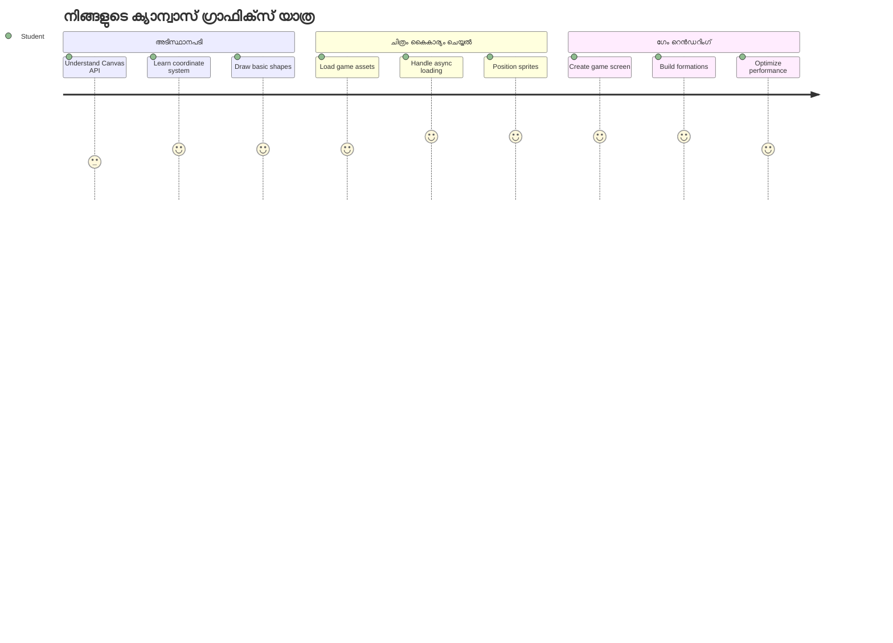
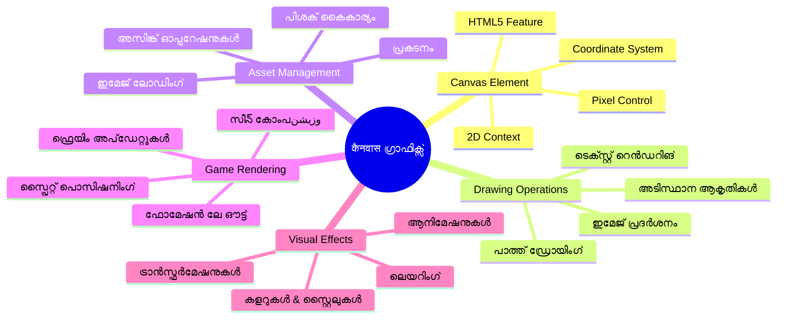
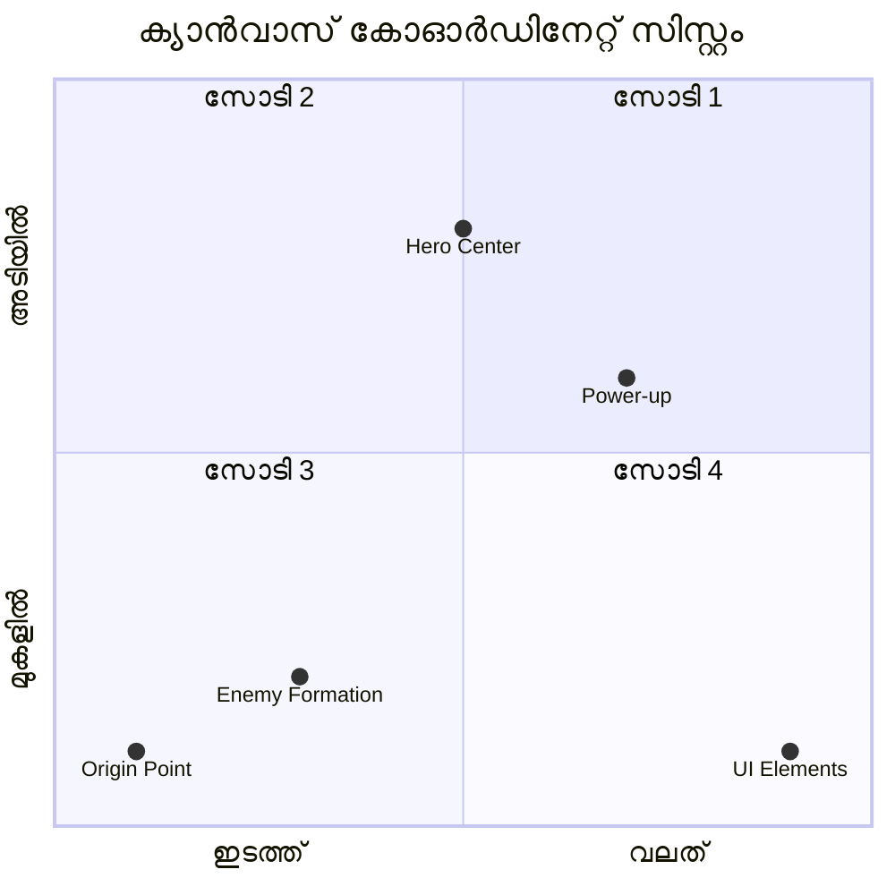
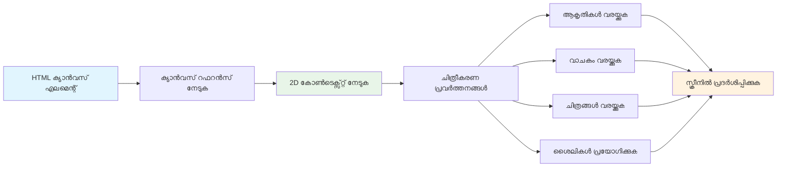
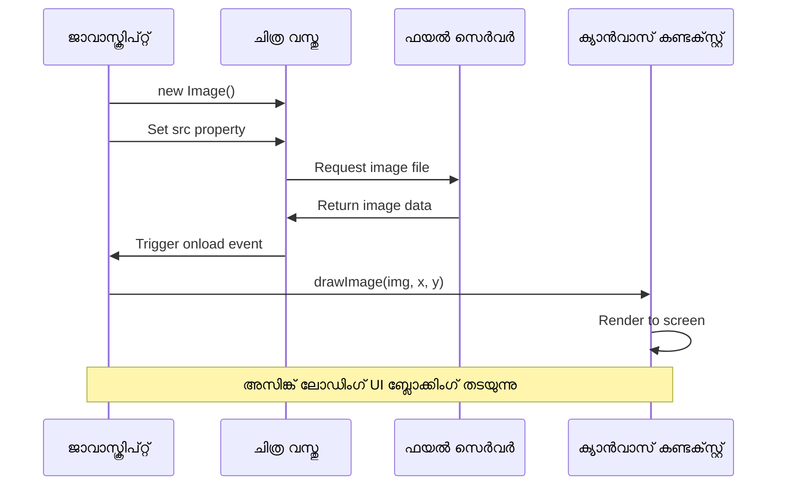
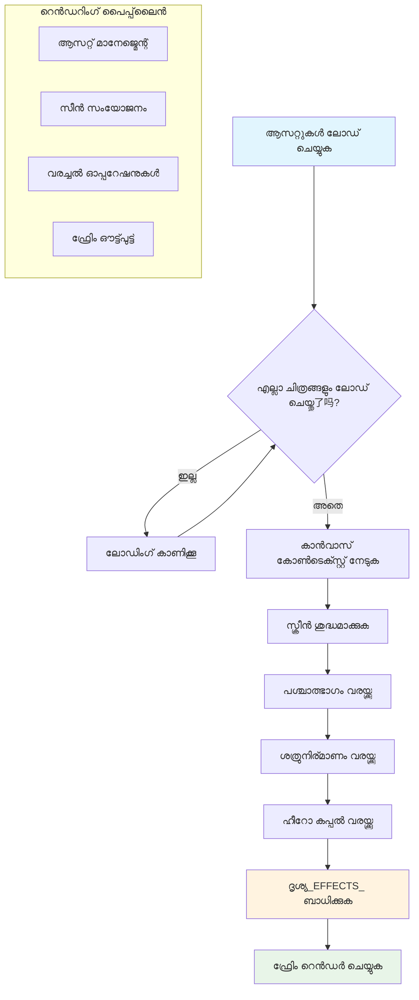
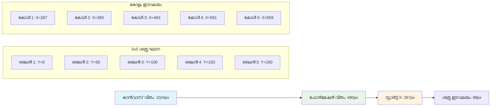
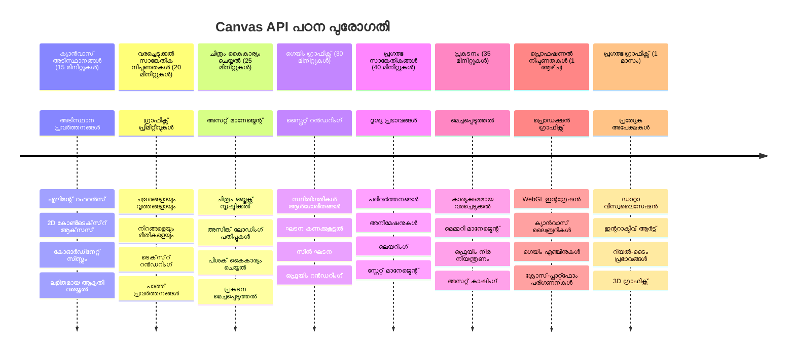

<!--
CO_OP_TRANSLATOR_METADATA:
{
  "original_hash": "7994743c5b21fdcceb36307916ef249a",
  "translation_date": "2026-01-08T13:41:44+00:00",
  "source_file": "6-space-game/2-drawing-to-canvas/README.md",
  "language_code": "ml"
}
-->
# സ്പേസ് ഗെയിം അംശം 2: ഹീറോയും ഭീകരനും കാൻവാസിൽ വരയ്ക്കുക


Canvas API വെബ് ഡെവലപ്പ്മെന്റിലെ ഏറ്റവും ശക്തമായ ഫീച്ചറുകളിലൊന്നാണ്, ഇത് നിങ്ങളുടെ ബ്രൗസറിൽ നിസ്സാരമായി, ഇന്ററാക്ടീവ് ഗرافيക്സ് സൃഷ്ടിക്കാൻ സഹായിക്കുന്നു. ഈ പാഠത്തിൽ, ആ ശൂന്യമായ HTML `<canvas>` ഘടകം ഒരു ഹീറോകളും ഭീകരന്മാരും നിറഞ്ഞ ഒരു ഗെയിം ലോകവുമായിരിക്കും മാറുന്നത്. കാൻവാസിനെ നിങ്ങളുടെ ഡിജിറ്റൽ ആർട്ട് ബോർഡായി ചിന്തിക്കാം, അവിടെ കോഡ് ദൃശ്യമായി മാറും. 

നിങ്ങൾ കഴിഞ്ഞ പാഠത്തിൽ പഠിച്ചതിന്റെ അടിസ്ഥാനത്തിൽ, ഇപ്പോൾ നാം ദൃശ്യ ഘടകങ്ങളിൽ ഇറങ്ങും. ഗെയിം സ്‌പ്രൈറ്റ്‌സ് എങ്ങനെ ലോഡ് ചെയ്യാം, എലമെന്റുകൾ എങ്ങനെ കൃത്യമായി സ്ഥിതി ചെയ്യാം, നിങ്ങളുടെ സ്പേസ് ഗെയിമിനുള്ള ദൃശ്യ അടിസ്ഥാനങ്ങൾ എങ്ങനെ സൃഷ്ടിക്കാമെന്ന് നിങ്ങൾ പഠിക്കും. ഈ പിരിമുറുക്കം സ്റ്റാറ്റിക് വെബ് പേജുകളുടെയും ഡൈനാമിക്, ഇന്ററാക്ടീവ് അനുഭവങ്ങളുടെയും ഇടയിൽ ഒരു പാലമാണ്.

ഈ പാഠം കഴിഞ്ഞാൽ, നിങ്ങൾക്കൊരു പൂർണ്ണമായ ഗെയിം രംഗം ഉണ്ടാകും, നിങ്ങളുടെ ഹീറോ ഷിപ്പ് ശരിയായ രീതിയിൽ നിലനിർത്തുകയും, യുദ്ധത്തിന് തയ്യാറായിരിക്കുന്ന ഭീകര നിർമ്മിതികൾ കാണിക്കുകയും ചെയ്യും. നിങ്ങൾ അറിഞ്ഞേക്കും ആധുനിക ഗെയിമുകൾ ബ്രൗസറുകളിൽ എങ്ങനെ ഗرافيക്സ് റൻഡർ ചെയ്യുന്നുവെന്ന്, കൂടാതെ സ്വന്തമായി ഇന്ററാക്ടീവ് ദൃശ്യ അനുഭവങ്ങൾ സൃഷ്ടിക്കാനുള്ള കഴിവ് ലഭിയ്ക്കും. കാൻവാസ് ഗ്രാഫിക്സിനെ അന്വേഷിച്ച്, നിങ്ങളുടെ സ്പേസ് ഗെയിം ജീവിപ്പിക്കാം!


## പ്രീലക്ചർ ക്വിസ്

[Pre-lecture quiz](https://ff-quizzes.netlify.app/web/quiz/31)

## കാൻവാസ്

അപ്പോ, ഈ `<canvas>` ഘടകം യഥാർത്ഥത്തിൽ എന്താണ്? വെബ് ബ്രൗസറുകളിൽ ഡൈനാമിക് ഗ്രാഫിക്സും ആനിമേഷനും സൃഷ്ടിക്കാൻ HTML5 നൽകിയ പരിഹാരമാണ് ഇത്. സാധാരണ ചിത്രങ്ങളും വീഡിയോകളും സ്റ്റാറ്റിക്ക് ആണെന്നു കൊണ്ടാണ്, കാൻവാസ് ഓരോ പക്സ്‌വലഞ്ഞിലെയും നിയന്ത്രണം നിങ്ങൾക്ക് നൽകുന്നത്. ഇത് ഗെയിമുകൾ, ഡാറ്റാ വിസ്വലൈസേഷനുകൾ, ഇന്ററാക്ടീവ് ആർട്ടുകൾ എന്നിവയ്ക്ക് അനുയോജ്യമാണ്. ജാവാസ്ക്രിപ്റ്റ് നിങ്ങളുടെ പെയിൻറ്ബ്രഷ് ആകുന്ന പ്രോഗ്രാമബിൾ ഡ്രോയിംഗ് സർഫേസായി ഇത് ചിന്തിക്കാം.

സ്വാഭാവികമായി, കാൻവാസ് ഘടകം തുറന്ന, പാരദർശകമായി ഒരു ലക്ഷംചതുരം പോലെ തോന്നും. പക്ഷേ അവിടെയാണ് സാധ്യത സഞ്ചരിച്ചു നിൽക്കുന്നത്! ജാവാസ്ക്രിപ്റ്റ് ഉപയോഗിച്ച് ആകൃതികൾ വരയ്ക്കാനും, ചിത്രങ്ങൾ ലോഡ് ചെയ്യാനും, ആനിമേഷനുകൾ സൃഷ്ടിക്കാനും, ഉപയോക്തൃ ഇടപെടലുകളോട് പ്രതികരിക്കാനും ഇത് യഥാർത്ഥ ശക്തി കാണിക്കും. 1960കളിലെ ബെൽ ലാബ്‌സ് ആദ്യകാല കമ്പ്യൂട്ടർ ഗ്രാഫിക്സ് വിങ്ങൽക്കാർ ഓരോ പിക്സലും പ്രോഗ്രാം ചെയ്ത് പ്രഥമ ഡിജിറ്റൽ ആനിമേഷനുകൾ സൃഷ്ടിച്ചതുപോലെ.

✅ [Canvas API-യെ കുറിച്ച് കൂടുതൽ വായിക്കുക](https://developer.mozilla.org/docs/Web/API/Canvas_API) MDN-ൽ.

ഇത് സാധാരണയായി പേജിന്റെ ബോഡിയിൽ ഇങ്ങനെ പ്രഖ്യാപിക്കാറുണ്ട്:

```html
<canvas id="myCanvas" width="200" height="100"></canvas>
```

**ഈ കോഡ് ചെയ്യുന്നത് എന്താണെന്ന് കാണാം:**
- **`id`** ആട്രിബ്യൂട്ട് സജ്ജമാക്കുന്നു, അതിലൂടെ ജാവാസ്ക്രിപ്റ്റിൽ താങ്കൾക്ക് ഈ canvas-നെ റഫറൻസു ചെയ്യാം
- കാൻവാസിന്റെ ദിശാനിരോധനത്തിലായി **`width`** പിക്സലുകളിൽ നിർണ്ണയം ചെയ്യുന്നു
- കാൻവാസിന്റെ ഉരുളഴവോളം നിർണ്ണയിക്കാൻ **`height`** പിക്സലുകൾ നൽകുന്നു

## എളുപ്പമുള്ള ജ്യാമിതീയ വരച്ചിടൽ

ഇപ്പോൾ നിങ്ങൾക്ക് കാൻവാസ് ഘടകം എന്താണെന്ന് അറിയുന്നു, ശരിയാണ്, വരച്ചുണരാം! കാൻവാസ് ഒരു കോ-ഓർഡിനേറ്റ് സിസ്റ്റം ഉപയോഗിക്കുന്നു, അത് നിങ്ങൾക്ക് മാത്ത് ക്ലാസിൽ പരിചിതമായിരിക്കാം, പക്ഷേ കമ്പ്യൂട്ടർ ഗ്രാഫിക്സിന് പ്രത്യേകമായ ഒരു വളർച്ചയുണ്ട്.

കാൻവാസ് ഉയർന്ന ദിശയിലും (x-അക്ഷം) ലംബ ദിശയിലും (y-അക്ഷം) കോ-ഓർഡിനേറ്റുകളിൽ എല്ലാം നിശ്ചയിക്കപ്പെടുന്നു. എന്നാൽ പ്രധാന വ്യത്യാസം: ഗണിതം പഠിച്ച കോ-ഓർഡിനേറ്റ് സിസ്റ്റത്തിൽ നിന്ന് വ്യത്യസ്തമായി, ഓറിയിജിനായ (0,0) ഇരുന്നതാണ് മേൽവലത്ത് ഇടതു കോണിൽ, x-മൂല്യങ്ങൾ വലത്തേക്ക് കൂടുകയും y-മൂല്യങ്ങൾ താഴേക്ക് കൂടുകയും ചെയ്യും. ഇത് 1960കളിലെ കമ്പ്യൂട്ടർ ഡിസ്പ്ലേ ലേഖനങ്ങളിൽ നിന്നുള്ള രീതിയാണ്, എലക്ട്രോൺ ബീം മുകളിൽ നിന്ന് താഴേക്ക് സ്കാൻ ചെയ്യാറുള്ളത് മൂലമാണ് മേൽവലത്ത് ഇടത് പൊയിന്റ് സ്വാഭാവിക തുടക്കമാകുന്നത്.



> ചിത്രം [MDN](https://developer.mozilla.org/docs/Web/API/Canvas_API/Tutorial/Drawing_shapes)

കാൻവാസ് ഘടകത്തിൽ വരയ്ക്കാൻ, നിങ്ങൾ എല്ലാ കാൻവാസ് ഗ്രാഫിക്സിന്റെയും അടിസ്ഥാനമായ മൂന്ന് പടികളുടെ പ്രക്രിയ പിന്തുടരും. ഇത് കുറച്ച് പ്രാവശ്യം ചെയ്താൽ എളുപ്പത്തിൽ മനസ്സിലാക്കാം:


1. DOM-ഇൽ നിന്നും കാൻവാസ് ഘടകത്തിനുള്ള റഫറൻസ് നേടുക (പിങ്കുള്ള HTML എലമെന്റ് പോലെ)
2. 2D റൻഡറിംഗ് കോൺടെക്സ്റ്റ് (context) നേടുക – ഇത് എല്ലാ വരയ്ക്കൽ മെത്തഡുകളും നൽകും
3. വരക്ക തുടങ്ങുക! കോൺടെക്സ്റ്റിന്റെ ഇൻബിൽട്ട് മെത്തഡുകൾ ഉപയോഗിച്ച് നിങ്ങളുടെ ഗ്രാഫിക്സ് സൃഷ്ടിക്കുക

ഇതെങ്ങനെ കോഡിൽ കാണാം:

```javascript
// പതിപ്പ് 1: ക്യാന്‍വാസ് ഘടകം നേടുക
const canvas = document.getElementById("myCanvas");

// പതിപ്പ് 2: 2D റെന്‍ഡറിംഗ് സാന്ദ്രത നേടുക
const ctx = canvas.getContext("2d");

// പതിപ്പ് 3: നിറം സെറ്റ് ചെയ്ത് ഒരു ചതുരം വരയ്ക്കുക
ctx.fillStyle = 'red';
ctx.fillRect(0, 0, 200, 200); // x, y, വീതി, ഉയരം
```

**ഇതെന്താണെന്നും ബിംബമായി മനസ്സിലാക്കാം:**
- ID ഉപയോഗിച്ച് കാൻവാസ് എലമെന്റിനെ സംഘടിപ്പിച്ച് വേരിയബിളിൽ സൂക്ഷിക്കുന്നു
- 2D റൻഡറിംഗ് കോൺടെക്സ്റ്റ് ലഭിക്കുന്നു – വരയ്ക്കാനുള്ള ഉപകരണങ്ങൾ എല്ലാം ഇവിടെ ഉണ്ട്
- കാൻവാസിന് വെള്ളം നിറയ്‌ക്കണമെന്നു `fillStyle` ഇലക്ഷൻ ചെയ്യുന്നു
- മേൽക്കൈയും ഇടതുവശവും കൂടിയ (0,0) പോയിന്റിൽ നിന്നും 200 പിക്സൽ വീതിയുള്ള പരിക്കർത്തം വരക്കും

✅ കാൻവാസ് API മുഖ്യമായും 2D ആകൃതികളിൽ കേന്ദ്രീകരിച്ചിരിക്കുകയാണ്, എന്നാൽ 3D ഇലമെന്റുകളും വെബ്‌സൈറ്റിൽ വരക്കാവുന്നതാണ്; അതിനായി [WebGL API](https://developer.mozilla.org/docs/Web/API/WebGL_API) ഉപയോഗിക്കാം.

Canvas API-യോട് നിങ്ങൾ ഈപോലെ എല്ലാത്തരം വരക്കാവുന്നതാണ്:

- **ജ്യാമിതീയ ആകൃതികളിൽ**, ഞങ്ങൾ ഒരു പരിക്കർത്തം വരയ്ക്കാനുള്ള ഉദാഹരണം കാണിച്ചിരുന്നു, പക്ഷേ നിങ്ങൾക്ക് കൂടുതൽ പലതും വരക്കാമെന്ന് മനസ്സിലാക്കാം.
- **ടെക്സ്‌റ്റ്**, നിങ്ങൾക്ക് ഇഷ്ടപ്പെട്ട ഫോണ്ടും നിറവും ഉപയോഗിച്ച് ടെക്സ്‌റ്റ് വരക്കാം.
- **ചിത്രങ്ങൾ**, .jpg അല്ലെങ്കിൽ .png പോലുള്ള ചിത്ര ആസ്തി അടിസ്ഥാനമാക്കി ചിത്രങ്ങൾ വരക്കാവുന്നതാണ്.

✅ പരീക്ഷിച്ച് നോക്കൂ! ഒരു പരിക്കർത്തം വരച്ചത് നിങ്ങൾക്ക് അറിയാം, ഇപ്പോൾ ഒരു വൃത്തം വരക്കാമോ? CodePenൽ കാണുന്ന ചില ആകർഷകമായ കാൻവാസ് വരച്ചിടലുകൾ നോക്കൂ. ഇതാ [പ്രത്യേകം ശക്തമായ ഒരു ഉദാഹരണം](https://codepen.io/dissimulate/pen/KrAwx).

### 🔄 **അധ്യാപന പരിശോധന**
**കാൻവാസ് അടിസ്ഥാനങ്ങളുടെ ബോധം**: ചിത്രങ്ങൾ ലോഡ് ചെയ്യുന്നതിന് മുൻപ് ഉറപ്പു വരുത്തുക:
- ✅ കാൻവാസ് കോ-ഓർഡിനേറ്റ് സിസ്റ്റം ഗണിത കോ-ഓർഡിനേറ്റുകളിൽ നിന്ന് എങ്ങനെ വ്യത്യസ്തമാണെന്ന് വിശദീകരിക്കാം
- ✅ കാൻവാസ് വരച്ചിടൽ പ്രവർത്തനങ്ങൾക്ക് മൂന്ന് അടിസ്ഥാനം ഘട്ടങ്ങൾ അറിയാം
- ✅ 2D റൻഡറിംഗ് കോൺടെക്സ്റ്റ് എന്താണ് നൽകുന്നത് തിരിച്ചറിയാം
- ✅ fillStyle-ഉം fillRect-ഉം എങ്ങനെ ചേർന്ന് പ്രവർത്തിക്കുന്നു എന്നു പറയാനാകണം

**ദ്രുത സ്വയം പരിശേധ:** (100, 50) സ്ഥാനത്ത് radius 25 ഉള്ള നീല വൃത്തം എങ്ങനെ വരയ്ക്കും?
```javascript
ctx.fillStyle = 'blue';
ctx.beginPath();
ctx.arc(100, 50, 25, 0, 2 * Math.PI);
ctx.fill();
```

**നീங்கள் ഇപ്പോൾ അറിയുന്ന കാൻവാസ് വരച്ചിടൽ മെത്തഡുകൾ**:
- **fillRect()**: നിറഞ്ഞ പരിക്കർത്തങ്ങൾ വരയ്ക്കുന്നു
- **fillStyle**: നിറങ്ങളും പാറ്റേണുകളും സജ്ജീകരിക്കുന്നു
- **beginPath()**: പുതിയ വരച്ചിടൽ പാതകൾ തുടങ്ങുന്നു
- **arc()**: വൃത്തങ്ങളും വളക്കളും സൃഷ്ടിക്കുന്നു

## ഒരു ചിത്രം ലോഡ് ചെയ്ത് വരയ്ക്കുക

അടിസ്ഥാന ആകൃതികൾ വരയ്ക്കുന്നത് തുടക്കംകാണാനാവശ്യകമാണ്, എന്നാൽ ഭൂരിപക്ഷ ഗെയിമുകൾക്ക് യഥാർത്ഥ ചിത്രങ്ങൾ ആവശ്യമുണ്ട്! സ്‌പ്രൈറ്റ്‌സ്, പശ്ചാത്തലങ്ങൾ, ടെക്സ്ചറുകൾ എന്നിവ ഗെയിമിന് ദൃശ്യ ആകർഷണം നൽകുന്നു. കാൻവാസിൽ ചിത്രം ലോഡ് ചെയ്ത് കാണിക്കാൻ ജ്യാമിതീയ ആകൃതികളിൽ വരയ്ക്കുന്നതിനേക്കാളും വ്യത്യസ്ത രീതിയുണ്ട്, പക്ഷേ നിങ്ങളുടെ മനസ്സിലാകുമ്പോൾ വളരെ ലളിതമാണ്.

നമുക്ക് ഒരു `Image` ഒബ്ജക്റ്റ് സൃഷ്ടിക്കേണ്ടതുണ്ട്, അതിന്റെ ചിത്രം (അസിങ്ക്രോണസായി, അർത്ഥം "പശ്ചാത്തലത്തിൽ") ലോഡ് ചെയ്യണം, ശേഷം അത് ഒരുങ്ങുമ്പോൾ കാൻവാസിൽ വരയ്ക്കണം. ഇത് ചിത്രങ്ങൾ ശരിയായി പ്രദർശിപ്പിക്കാൻ ഉറപ്പാക്കും, ഉപയോഗം തടയാതെ.


### അടിസ്ഥാന ചിത്രം ലോഡിങ്

```javascript
const img = new Image();
img.src = 'path/to/my/image.png';
img.onload = () => {
  // ചിത്രം ലോഡുചെയ്്ത് ഉപയോഗത്തിന് തയ്യാറാണ്
  console.log('Image loaded successfully!');
};
```

**ഈ കോഡിൽ സംഭവിക്കുന്നത്:**
- നമ്മുടെ സ്‌പ്രൈറ്റ് അല്ലെങ്കിൽ ടെക്സ്ചർ ചേർത്തുവയ്ക്കാൻ പുതിയ Image ഒബ്ജക്റ്റ് നിർമ്മിക്കുന്നു
- ലോഡ് ചെയ്യേണ്ട ചിത്രത്തിന്റെ സോഴ്‌സ് പാത സജ്ജീകരിക്കുന്നു
- ചിത്രം ഉപയോഗത്തിന് ഒരുങ്ങുമ്പോൾ അറിയാൻ ലോഡ് ഇവന്റ് കേൾക്കുന്നു

### കൂടുതൽ ഉറപ്പുള്ള ചിത്രം ലോഡ് ചെയ്യൽ

വ്യവസായ ഡെവലപ്പർമാർ പൊതുവേ ഉപയോഗിക്കുന്ന, ചിത്രം ലോഡിങ്ങ് കൈകാര്യം ചെയ്യാനുള്ള ഒരു മികച്ച മാർഗമാണ് ഇത്. Promise അടിസ്ഥാനമാക്കിയ ഫംഗ്ഷനിൽ ചിത്രം ലോഡിങ്ങ് കവർ ചെയ്യാം – JavaScript Promises ES6-ൽ സാധാരണമായതിന്റെ പേരിൽ പ്രചാരമായ ഈ രീതിയിൽ നിങ്ങളുടെ കോഡ് കൂടുതൽ ക്രമസമയമായും പിശകുകൾ കരുതിയും പ്രവർത്തിക്കും:

```javascript
function loadAsset(path) {
  return new Promise((resolve, reject) => {
    const img = new Image();
    img.src = path;
    img.onload = () => {
      resolve(img);
    };
    img.onerror = () => {
      reject(new Error(`Failed to load image: ${path}`));
    };
  });
}

// അസിങ്ക്/അവെയിറ്റ് ഉപയോഗിച്ച് ആധുനിക ഉപയോഗം
async function initializeGame() {
  try {
    const heroImg = await loadAsset('hero.png');
    const monsterImg = await loadAsset('monster.png');
    // ചിത്രങ്ങൾ ഇപ്പോൾ ഉപയോഗിക്കാൻ സജ്ജമാണ്
  } catch (error) {
    console.error('Failed to load game assets:', error);
  }
}
```

**ഇവിടെ ചെയ്ത കാര്യം:**
- Promise-ൽ എല്ലാം പാക്ക് ചെയ്തു, അത് നല്ല കൈകാര്യം സാദ്ധ്യമാകും
- പിശകുകൾ സംഭവിക്കുമ്പോൾ അറിയിക്കുന്ന error handling ചേർത്തു
- തൻ asynchronous await സിന്റക്ഷ് ഉപയോഗിച്ചു, വായിക്കാൻ കൂടുതൽ സുതാര്യവും
- try/catch ബ്ലോക്കുകൾ ചേർന്ന് ലോഡിങ് പരാജയങ്ങൾ സൗമ്യമായി കൈകാര്യം ചെയ്യുന്നു

ചിത്രങ്ങൾ ലോഡ് ചെയ്യപ്പെട്ടാൽ, അവ കാൻവാസിൽ വരയ്ക്കുന്നത് വളരെ ലളിതമാണ്:

```javascript
async function renderGameScreen() {
  try {
    // ഗെയിം ആസ്തികൾ ലോഡ് ചെയ്യുക
    const heroImg = await loadAsset('hero.png');
    const monsterImg = await loadAsset('monster.png');

    // കാൻവാസ് மற்றும் കോൺടക്‌സ്‌റ്റ് നേടുക
    const canvas = document.getElementById("myCanvas");
    const ctx = canvas.getContext("2d");

    // ചിത്രങ്ങൾ നിർദ്ദിഷ്ട സ്ഥാനങ്ങളിൽ വരയ്ക്കുക
    ctx.drawImage(heroImg, canvas.width / 2, canvas.height / 2);
    ctx.drawImage(monsterImg, 0, 0);
  } catch (error) {
    console.error('Failed to render game screen:', error);
  }
}
```

**ഇവിടത്തെ ഓരോ ഘട്ടവും വിശദീകരിക്കാം:**
- await ഉപയോഗിച്ച് ഹീറോയും ഭീകരനുമായ ചിത്രങ്ങളെയും പശ്ചാത്തലത്തിൽ ലോഡ് ചെയ്യുന്നു
- കാൻവാസ് ഘടകം പിടിച്ച് 2D റൻഡറിംഗ് കോൺടെക്സ്റ്റും എടുക്കുന്നു
- ഹീറോ ചിത്രം തരംതിരിച്ച് കോ-ഓർഡിനേറ്റുകൾക്കനുസരിച്ച് കുത്തനെ സ്ഥിതി ചെയ്യുന്നു
- ഭീകരൻ ചിത്രത്തെ വയലത്ത് മുകളിൽ വച്ചുകൊണ്ട് ശത്രുക്കളുടെ രൂപം തുടങ്ങുന്നു
- ലോഡിങ് അല്ലെങ്കിൽ റൻഡറിംഗ് സമയത്ത് സംഭവിക്കുന്ന പിശകുകൾ പിടിക്കുന്നത് ഉറപ്പുവരുത്തുന്നു


## ഇപ്പോൾ നിങ്ങളുടെ ഗെയിം നിർമ്മിക്കാൻ സമയം

ഇപ്പോൾ എല്ലാം ചേർത്ത് നിങ്ങളുടെ സ്പേസ് ഗെയിം ദൃശ്യ അടിസ്ഥാനമൊക്കാനാണ് വരുന്നത്. നിങ്ങൾക്കുണ്ട് കാൻവാസ് അടിസ്ഥാനവും ചിത്രം ലോഡിംഗ് സാങ്കേതിക വിദ്യകളും ബോധമുള്ളത്, ഈ പ്രായോഗിക ഭാഗം പൂർണ്ണമായ ഒരു ഗെയിം സ്ക്ക്രീൻ നിർമ്മിക്കാനായി നയിക്കും, സ്‌പ്രൈറ്റ്‌സിന്റെ ശരിയായ സ്ഥിതിവിവരക്കൊപ്പം.

### എന്തൊക്കെയാണ് നിർമ്മിക്കേണ്ടത്

നിങ്ങൾ ഒരു വെബ് പേജ് കാൻവാസ് ഘടകത്തോടുകൂടി നിർമ്മിക്കും. അതിൽ കറുത്ത സ്ക്രീൻ (black screen) `1024*768` പ്രദർശിപ്പിക്കും. ഞങ്ങൾ നിങ്ങൾക്ക് രണ്ട് ചിത്രങ്ങൾ നൽകുന്നു:

- ഹീറോ ഷിപ്പ്

   

- 5*5 ഭീകരൻ

   

### വികസനം തുടങ്ങാനുള്ള ശുപാർശ ചെയ്ത ഘട്ടങ്ങൾ

`your-work` സബ് ഫോളഡറിലാണ് സ്റ്റാർട്ടർ ഫയലുകൾ നിങ്ങൾക്കു നൽകിയിരിക്കുന്നത്. നിങ്ങളുടെ പ്രോജക്റ്റിന്റെ ഘടനയിൽ അടങ്ങേണ്ടത്:

```bash
your-work/
├── assets/
│   ├── enemyShip.png
│   └── player.png
├── index.html
├── app.js
└── package.json
```

**നിങ്ങൾ യാതൊരു പദാർത്ഥത്തിലാണെന്ന് കാണാം:**
- ഗെയിം സ്‌പ്രൈറ്റുകൾ `assets/` ഫോൾഡറിലുള്ളവ, എല്ലാം ക്രമസമയമായി സൂക്ഷിക്കപ്പെടുന്നു
- മുഖ്യ HTML ഫയൽ കാൻവാസ് ഘടകം സജ്ജമാക്കുകയും എല്ലാം ഒരുക്കുകയും ചെയ്യുന്നു
- ഒരു ജാവാസ്ക്രിപ്റ്റ് ഫയൽ നിങ്ങള്‍ എത്രയും വേഗം നിങ്ങളുടെ ഗെയിം റൻഡറിംഗ് മാസ്റ്ററി എഴുതുവാന്‍ ഉപയോഗിക്കുന്നതു
- ഒരു package.json വെബ് ഡെവലപ്പ്മെന്റ് സർവർ സജ്ജീകരിക്കാൻ സഹായിക്കുന്നു, സ്ഥാനാന്തരമായി ടെസ്റ്റ് ചെയ്യുന്നതിന്

വികസനം തുടങ്ങാൻ Visual Studio Code-ൽ ഈ ഫോൾഡർ തുറക്കുക. നിങ്ങൾക്ക് Visual Studio Code, NPM, Node.js എന്നിവ അടങ്ങിയ ഒരു പ്രാദേശിക ഡെവലപ്പ്മെന്റ് പരിസ്ഥിതി വേണ്ടതാണ്. നിങ്ങളുടെ കമ്പ്യൂട്ടറിൽ `npm` ഇല്ലെങ്കിൽ, [ഇവിടെ അതു ഇൻസ്റ്റാൾ ചെയ്യുന്നത്](https://www.npmjs.com/get-npm) കാണാം.

`your-work` ഫോളഡറിലേക്ക് ജയംതുടങ്ങി സർവർ തുടങ്ങുക:

```bash
cd your-work
npm start
```

**ഈ കമാൻഡ് ചെയ്യുന്നത്:**
- `http://localhost:5000` ലൊകൽ സർവർ ആരംഭിക്കുന്നു, അതിലൂടെ നിങ്ങളുടെ ഗെയിം ടെസ്റ്റ് ചെയ്യാം
- നിങ്ങളുടെ എല്ലാ ഫയലുകളും ശരിയായി സേവിക്കുന്നു, അതുകൊണ്ട് ബ്രൗസർ അവ ശരിയായ രീതിയിൽ ലോഡ് ചെയ്യും
- ഫയലുകളിൽ മാറ്റം സംഭവിക്കുന്നതിന് നിരീക്ഷിച്ച് നിങ്ങൾക്ക് മൃദുവായ വികസനം സാദ്ധ്യമാക്കുന്നു
- പ്രൊഫഷണൽ ഡെവലപ്പ്മെന്റ് എൻവയോൻമെന്റ് നൽകുന്നു, എല്ലാം പരിശോധിക്കുന്നതിന്

> 💡 **കുറിപ്പ്**: നിങ്ങളുടെ ബ്രൗസർ പ്രാഥമികമായി ശൂന്യമുള്ള ഒരു പേജ് കാണിക്കും – ഇത് പ്രതീക്ഷിച്ച കാര്യമാണ്! നിങ്ങൾ കോഡ് ചേർക്കുമ്പോൾ ബ്രൗസർ റിഫ്രഷ് ചെയ്ത് മാറ്റങ്ങൾ കാണുക. ഈ പിരിവ്-പിരിവായി വികസന ദൃശ്യം NASA-യുടെ അപ്പോളോ ഗൈഡൻസ് കമ്പ്യൂട്ടർ നിർമ്മാണത്തിലും ഏൽപ്പിച്ചതാണ് – ഓരോ ഘടകവും പരീക്ഷിച്ച്, ശേഷം വലിയ സംവിധാനത്തിലെത്തിച്ചിരിക്കുന്നു.

### കോഡ് കൂട്ടിച്ചേർക്കുക

താഴെത്തന്നെ കൊടുത്ത താൽപ്പര്യവും പ്രവർത്തനവും പൂർത്തിയാക്കാൻ `your-work/app.js`-ൽ ആവശ്യമായ കോഡ് ചേർക്കുക:

1. **കറുത്ത പശ്ചാത്തലവും ഉള്ള കാൻവാസ് വരയ്ക്കുക**
   > 💡 **ഇങ്ങനെ ചെയ്യാം**: `/app.js` എന്ന ഫയലിൽ TODO കാണുകയും ctx.fillStyle-നെ കറുത്ത് സജ്ജീകരിക്കുകയും ctx.fillRect() ഉപയോഗിച്ച് കാൻവാസിന്റെ വലിപ്പത്തിൽ (0,0) മുതൽ നിറക്കുകയും ചെയ്യുക. എളുപ്പം!

2. **ഗെയിം ടെക്സ്ചറുകൾ ലോഡ് ചെയ്യുക**
   > 💡 **ഇങ്ങനെ ചെയ്യാം**: await loadAsset() ഉപയോഗിച്ച് പ്ലേയറും എനമിയും ചിത്രങ്ങൾ ലോഡ് ചെയ്യുക. പിന്നീട് ഉപയോഗിക്കാൻ വേരിയബിളുകളിൽ സൂക്ഷിക്കുക. ഇവ വരയ്ക്കുന്നത് വരെ ചിത്രങ്ങൾ കാണാനാകില്ല!

3. **ഹീറോ ഷിപ്പ് സെന്റർ ബോട്ടത്തിൽ വരയ്ക്കുക**
   > 💡 **ഇങ്ങനെ ചെയ്യാം**: ctx.drawImage() ഉപയോഗിച്ച് ഹീറോ സ്ഥാനമിടുക. x-കോഓർഡിനേറ്റ് വേണ്ടി `canvas.width / 2 - 45` ഉപയോഗിച്ച് സെൻറർ ചെയ്യുക, y-കോഓർഡിനേറ്റ് വേണ്ടി `canvas.height - canvas.height / 4` ഉപയോഗിച്ച് താഴെ ഉള്ള ഭാഗത്ത് ഇടുക.

4. **5×5 ഭീകരനുകളുടെ രൂപമാറ്റം വരയ്ക്കുക**
   > 💡 **ഇങ്ങനെ ചെയ്യാം**: `createEnemies` ഫംഗ്ഷനിൽ നേസ്റ്റ് ലൂപ്പ് സജ്ജമാക്കുക. സ്പേസിംഗ്, സ്ഥിതിവിവരങ്ങൾക്കായി ഗണിതം ചെയ്യേണ്ടതുണ്ട്, പക്ഷേ ഞാൻ നിങ്ങളെ കൃത്യമായി നിർദ്ദേശിക്കും!

ആദ്യമായി ശരിയായ ഭീകരൻ നിർമാണത്തിനായി സ്ഥിര ഊർജിതങ്ങളൊരുക്കുക:

```javascript
const ENEMY_TOTAL = 5;
const ENEMY_SPACING = 98;
const FORMATION_WIDTH = ENEMY_TOTAL * ENEMY_SPACING;
const START_X = (canvas.width - FORMATION_WIDTH) / 2;
const STOP_X = START_X + FORMATION_WIDTH;
```

**ഈ സ്ഥിര ഊർജിതങ്ങൾ എന്ത് ചെയ്യുന്നു എന്ന് കാണാം:**
- ഓരോ വരിയിലും ഒപ്പം 5 ഭീകരന്മാരും (നല്ലൊരു 5×5 ഗ്രിഡ്) നിശ്ചയിക്കുന്നു
- ഭീകരന്മാരും ഇടയിൽ എത്ര ഇടവഴി ഇരിക്കണം എന്ന് നിർണ്ണയിക്കുന്നു
- ആകുടവും വലിപ്പവും കണക്കാക്കുന്നു
- രൂപമാറ്റം എവിടെയാണ് തുടങ്ങുകയും അവസാനിക്കുന്നതും ആദ്യം സജ്ജമാക്കുന്നു, ഇതിലൂടെ രൂപം സെൻററിൽ കാണിക്കും


പിന്നീട് ഭീകരൻ രൂപമാറ്റത്തിനായി നേസ്റ്റ്‌ലൂപ്പുകൾ സൃഷ്ടിക്കുക:

```javascript
for (let x = START_X; x < STOP_X; x += ENEMY_SPACING) {
  for (let y = 0; y < 50 * 5; y += 50) {
    ctx.drawImage(enemyImg, x, y);
  }
}
```

**ഈ നേസ്റ്റ് ലൂപ്പ് ചെയ്യുന്നത്:**
- പുറം ലൂപ്പ് രൂപമാറ്റം ഇടത് മുതൽ വലത്തേക്ക് നീങ്ങുന്നു
- ഉള്ളിലെ ലൂപ്പ് മുകളിൽ നിന്ന് താഴേക്ക് വരി സൃഷ്ടിക്കുന്നു
- കണക്കാക്കിയ x,y കോ-ഓർഡിനേറ്റുകളിൽ ഓരോ ഭീകരൻ സ്‌പ്രൈറ്റ് വരയ്ക്കുന്നു
- എല്ലാം സമമായി വ്യവസ്ഥാപിതമായി കാഴ്ചമുണ്ട്

### 🔄 **അധ്യാപന പരിശോധന**
**ഗെയിം റൻഡറിംഗ് മെന്നും**: സമ്പൂർണ റൻഡറിംഗ് സിസ്റ്റം മനസ്സിലായെന്ന് ഉറപ്പാക്കുക:
- ✅ അസിങ്ക്രോൺ ചിത്ര ലോഡിങ് ഗെയിം സ്റ്റാർട്ടപ്പിൽ UI തടസ്സം ഉണ്ടാകാതിരിക്കാൻ എങ്ങനെ സഹായിക്കുന്നു?
- ✅ ഭീകരൻ രൂപമാറ്റം സ്ഥിതിവിവരങ്ങൾ സ്ഥിര ഊർജിതങ്ങൾ ഉപയോഗിച്ച് ഗണിതം നടത്തുന്നതിന് പ്രത്യേകിച്ച് എന്തുകൊണ്ട്?
- ✅ വരയ്ക്കലുകൾക്കായുള്ള 2D റൻഡറിംഗ് കോൺടെക്സ്റ്റിന്റെ പങ്ക് എന്താണ്?
- ✅ നേസ്റ്റ് ലൂപ്പുകൾ സ്‌പ്രൈറ്റ് രൂപമാറ്റങ്ങൾ എങ്ങനെ ക്രമീകരിക്കുന്നു?

**പ്രവർത്തന പരിഗണനകൾ**: നിങ്ങളുടെ ഗെയിം ഇതിന്റെ പ്രകടനം കാണിക്കുന്നു:
- **ക്ഷമതയുള്ള അസറ്റ് ലോഡിങ്**: പ്രോമിസ് അടിസ്ഥാനമാക്കിയ ചിത്രം മാനേജ്മെന്റ്
- **ക്രമീകരിച്ച റൻഡറിംഗ്**: ഘടക വകഭേദത്തിലുള്ള വരയ്ക്കൽ പ്രവർത്തനങ്ങൾ
- **ഗണിതബദ്ധമായ സ്ഥിതിവിവരം**: കണക്കാക്കിയ സ്‌പ്രൈറ്റ് സ്ഥാനമിടൽ
- **പിശക് കൈകാര്യം ചെയ്തൽ**: ശാന്തമായ പരാജയ മാനേജ്മെന്റ്

**ദൃശ്യ പ്രോഗ്രാമിംഗ് ആശയങ്ങൾ**: നിങ്ങൾ പഠിച്ചതാണ്:
- **കോഓർഡിനേറ്റ് സിസ്റ്റങ്ങൾ**: സ്വഭാവത്തെ സ്ക്രീൻ നിലകളിലേക്ക് വിവർത്തനം ചെയ്യുക  
- **സ്പ്രൈറ്റ് മാനേജ്മെന്റ്**: ഗെയിം ഗ്രാഫിക്സ് ലോഡ് ചെയ്യുകയും പ്രദർശിപ്പിക്കുകയും ചെയ്യുക  
- **ഫോർമേഷൻ ആൽഗോറിത്തങ്ങൾ**: സജ്ജീകരിച്ച ലേഔട്ടുകൾക്കുള്ള ഗണിത മാതൃകകൾ  
- **അസിങ്ക്രൺ ഓപ്പറേഷൻസ്**: മൃദുവായ ഉപയോക്തൃ അനുഭവത്തിനുള്ള ആധുനിക ജാവാസ്ക്രിപ്‌റ്റ്    

## ഫലം

പരിപൂർണ്ണമായ ഫലം വേണ്ട വിധത്തിൽ ഇങ്ങനെ കാണുന്നതാണ്:  


## പരിഹാരം

ദയവായി ആദ്യം നിങ്ങൾ തന്നെ ഇതു പരിഹരിക്കാന कोशिश ചെയ്യുക; പക്ഷേ തടസപ്പെട്ടാൽ, ഒരു [പരിഹാരം](../../../../6-space-game/2-drawing-to-canvas/solution/app.js) നോക്കുക  

---

## GitHub Copilot ഏജന്റ് ചലഞ്ച് 🚀

നിങ്ങളുടെ സ്പേസ് ഗെയിം ക്യാന്വാസിൽ Canvas API സാങ്കേതികവിദ്യ ഉപയോഗിച്ച് ദൃശ്യ പ്രഭാവങ്ങളും ഇന്ററാക്ടീവ് ഘടകങ്ങളും ചേർക്കാൻ ഏജന്റ് മോഡ് ഉപയോഗിക്കുക.  

**വിവരണം:** Canvas API ഉപയോഗിച്ച് ദൃശ്യങ്ങളെയും ഇന്ററാക്ഷനുകളെയും കൂട്ടിച്ചേർക്കുന്നൊരു സ്പേസ് ഗെയിം ക്യാന്വാസിനെ (canvas) മെച്ചപ്പെടുത്തുക.  

**പ്രോമ്പ്റ്റ്:** `enhanced-canvas.html` എന്ന പുതിയ ഫയൽ ഉണ്ടാക്കുക. അതിൽ പൃഥ്വി നായകളോട് പ്ചഞ്ഞു പുലഞ്ഞ് നക്ഷത്രങ്ങൾ അനിമേറ്റ് ചെയ്യുകയും, ഹീറോ കപ്പലിന്റെ ഹീൽത്ത് ബാർ ദൃശ്യമായി പൾസ് ചെയ്യുകയും, ശത്രു കപ്പലുകൾ മന്ദഗതിയിൽ താഴേയ്ക്ക് നീങ്ങുന്നതായി കാണിക്കുകയും ചെയ്യണം. പൂർവ്വനിർണ്ണയത്തോടൊപ്പം പ്ലാജർചെയ്യുന്നതും, കളിക്കുന്ന നക്ഷത്രങ്ങളായുള്ള അനിമേഷൻ പാക്സിലെ റാൻഡം സ്ഥാനവും ഓപാസിറ്റി ഉപയോഗിച്ച് കോഡിംഗ് ചെയ്‌തു, ഹീൽത്ത് ലെവല് അടിസ്ഥാനമാക്കി നിറം മാറ്റുന്ന ഹീൽത്ത് ബാർ ഉൾപ്പെടുത്തുക (ആലോചനം: ഹരിതം > മഞ്ഞ > ചുവപ്പ്), വിവിധ വേഗതകളിൽ ഷിപ്മാർ ആണ് താഴേക്ക് എറിയപ്പെടുന്നത് എന്ന അനിമേഷൻ വേണമെന്ന് ജാവാസ്ക്രിപ്റ്റ് കോഡ് നൽകുക.  

[എജന്റ് മോഡ്](https://code.visualstudio.com/blogs/2025/02/24/introducing-copilot-agent-mode) സംബന്ധിച്ച് കൂടുതൽ അറിയുക.  

## 🚀 ചലഞ്ച്

നിങ്ങൾ 2D-ഫോക്കസ് ചെയ്‌ത Canvas API ഉപയോഗിച്ച് വരയ്ക്കുന്നത് പഠിച്ചു; ഇപ്പോൾ [WebGL API](https://developer.mozilla.org/docs/Web/API/WebGL_API) നോക്കി ഒരു 3D ഒბიექტ് വരയ്ക്കാൻ ശ്രമിക്കുക.  

## പോസ്റ്റ്-ലെക്‌ചർ ക്വിസ്

[പോസ്റ്റ്-ലെക്‌ചർ ക്വിസ്](https://ff-quizzes.netlify.app/web/quiz/32)  

## അവലോക്കനവും സ്വയം പഠനവും  

Canvas API സംബന്ധിച്ച് കൂടുതൽ അറിയാൻ [ഇത് വായിക്കുക](https://developer.mozilla.org/docs/Web/API/Canvas_API).  

### ⚡ **അടുത്ത 5 മിനിറ്റിനുള്ളിൽ നിങ്ങൾ ചെയ്യാൻ കഴിയുന്നത്**  
- [ ] ബ്രൌസർ കോൺസോൾ തുറക്കുക, `document.createElement('canvas')` ഉപയോഗിച്ച് ഒരു ക്യാന്വാസ് എലമെന്റ് സൃഷ്ടിക്കുക  
- [ ] ക്യാന്വാസ് കോൺടെക്സ്റ്റിൽ `fillRect()` ഉപയോഗിച്ച് ഒരു ചതുരം വരയ്ക്കാൻ ശ്രമിക്കുക  
- [ ] വ്യത്യസ്ത നിറങ്ങളുമായി പരീക്ഷണം നടത്തുക `fillStyle` പ്രോപ്പർട്ടി ഉപയോഗിച്ച്  
- [ ] `arc()` മെത്തഡ് ഉപയോഗിച്ച് ഒരു ലളിതമായ വൃത്തം വരയ്ക്കുക  

### 🎯 **ഈ മണിക്കൂറിൽ നിങ്ങൾ നേടാനാകുന്നതത്**  
- [ ] പോസ്റ്റ്-പാഠം ക്വിസ് പൂർത്തിയാക്കി ക്യാന്വാസ് അടിസ്ഥാനങ്ങൾ മനസിലാക്കുക  
- [ ] നിരവധി ആകൃതികളും നിറങ്ങളുമായി ക്യാന്വാസ് വരച്ചിടൽ അപ്ലിക്കേഷൻ സൃഷ്ടിക്കുക  
- [ ] ഗെയിമിനായി ഇമേജ് ലോഡിംഗ് ആന്റ് സ്പ്രൈറ്റ് റെൻഡറിംഗ് നടപ്പിലാക്കുക  
- [ ] സിമ്പിൾ അനിമേഷൻ നിർമ്മിക്കുക — ക്യാന്വാസ് വ്യവസായങ്ങളിലൂടെ വസ്തുക്കൾ നീങ്ങുന്നു  
- [ ] സ്കെയ്ലിംഗ്, റൊട്ടേഷൻ, ട്രാൻസ്‌ലേഷൻ പോലുള്ള ക്യാന്വാസ് രൂപാന്തരണങ്ങൾ അഭ്യാസം ചെയ്യുക  

### 📅 **നിങ്ങളുടെ ആഴ്ചകൊണ്ടുള്ള ക്യാന്വാസ് യാത്ര**  
- [ ] ഇളകിയ ഗ്രാഫിക്‌സും സ്പ്രൈറ്റ് അനിമേഷനുമുള്ള സ്പേസ് ഗെയിം നിർമ്മിക്കുക  
- [ ] ഗ്രേഡിയന്റുകൾ, പാറ്റേണുകൾ, കോമ്പോസിറ്റിംഗ് പോലുള്ള ആധുനിക ക്യാന്വാസ് സങ്കേതങ്ങൾ മികവുറ്റവനാകുക  
- [ ] ഡാറ്റ പ്രദർശനത്തിന് വേഗതയുള്ള ഇന്ററാക്ടീവ് ചിത്രീകരണങ്ങൾ സൃഷ്ടിക്കുക  
- [ ] സ്മൂത് പ്രകടനത്തിന് ക്യാന്വാസ് ഒപ്റ്റിമൈസേഷൻ സാങ്കേതികവിദ്യകൾ പഠിക്കുക  
- [ ] വിവിധ ഉപകരണങ്ങളുള്ള ഒരു വരക്ക് അല്ലെങ്കിൽ പെയിന്റിങ് അപ്ലിക്കേഷൻ നിർമ്മിക്കുക  
- [ ] ക്രിയേറ്റീവ് കോഡിംഗ് പാറ്റേണുകളും ജനറേറ്റീവ് ആർട്ടും ക്യാന്വാസിൽ പരീക്ഷിക്കുക  

### 🌟 **നിങ്ങളുടെ മാസംകൊണ്ടുള്ള ഗ്രാഫിക്സ് വൈദഗ്ധ്യം**  
- [ ] ക്യാന്വാസ് 2D, WebGL ഉപയോഗിച്ച് സങ്കീർണ്ണ ദൃശ്യ അപ്ലിക്കേഷനുകൾ നിർമ്മിക്കുക  
- [ ] ഗ്രാഫിക്സ് പ്രോഗ്രാമിംഗിന്റെ ആശയങ്ങളും ഷേഡർ അടിസ്ഥാനങ്ങളും പഠിക്കുക  
- [ ] ഓപ്പൺ സോഴ്‌സ് ഗ്രാഫിക്സ് ലൈബ്രറികളിലും ദൃശ്യീകരണ ഉപകരണങ്ങളിലും സംഭാവന ചെയ്യുക  
- [ ] ഗ്രാഫിക്സ് കർശനമായ അപ്ലിക്കേഷനുകളുടെ പ്രകടനം മെച്ചപ്പെടുത്തുക  
- [ ] ക്യാന്വാസിന്റെ പ്രോഗ്രാമിംഗ്, കമ്പ്യൂട്ടർ ഗ്രാഫിക്സ് വിഷയങ്ങളിൽ വിദ്യാഭ്യാസ ഉള്ളടക്കം സൃഷ്ടിക്കുക  
- [ ] മറ്റുള്ളവർക്കു സഹായമുള്ള ഗ്രാഫിക്സ് പ്രോഗ്രാമിംഗ് വിദഗ്ധനാകുക, ദൃശ്യ അനുഭവങ്ങൾ സൃഷ്ടിക്കാൻ  

## 🎯 നിങ്ങളുടെ ക്യാന്വാസ് ഗ്രാഫിക്‌സ് മാസ്ടറിയ്റെ ടൈംലൈൻ


### 🛠️ നിങ്ങളുടെ ക്യാന്വാസ് ഗ്രാഫിക്സ് ടൂള്കിറ്റ് സംഗ്രഹം

ഈ പാഠം പൂർത്തിയാക്കിയതോടെ, നിങ്ങൾക്ക് ഇപ്പോൾ ലഭ്യമായിരിക്കുന്നു:  
- **ക്യാന്വാസ് API നൈപുണ്യം**: 2D ഗ്രാഫിക്‌സ് പ്രോഗ്രാമിംഗിൽ സമ്പൂർണ്ണ മനസ്സിലാക്കൽ  
- **കോഓർഡിനേറ്റ് ഗണിതം**: തുരുത്തവും ലേഔട്ട് ആൽഗോറിത്തവും  
- **ആസറ്റ് മാനേജ്മെന്റ്**: പ്രൊഫഷണൽ ഇമേജ് ലോഡിംഗും പിശക് കൈകാര്യം ചെയ്യലും  
- **റെൻഡറിംഗ് പൈപ്പ്‌ലൈൻ**: ദൃശ്യ ദൃശ്യഘടനയ്ക്ക് ഘടനാപരമായ സമീപനം  
- **ഗെയിം ഗ്രാഫിക്സ്**: സ്പ്രൈറ്റ് സ്ഥാനം നിശ്ചയിക്കൽ, ഫോർമേഷൻ കണക്കുകൾ  
- **അസിങ്ക്രൺ പ്രോഗ്രാമിംഗ്**: മൃദുവായ പ്രകടനത്തിനുള്ള ആധുനിക ജാവാസ്ക്രിപ്റ്റ് മാതൃകകൾ  
- **വിജ്വൽ പ്രോഗ്രാമിംഗ്**: ഗണിത ആശയങ്ങളെ സ്ക്രീൻ ഗ്രാഫിക്സിലേക്ക് പരിഭാഷപ്പെടുത്തൽ  

**വാസ്തവ ലോക ഉപയോഗങ്ങൾ**: നിങ്ങളുടെ ക്യാന്വാസ് കഴിവുകൾ നേരിട്ടു പ്രയോജനപ്പെടുന്നു:  
- **ഡാറ്റാ ദൃശ്യമാക്കൽ**: ചാർട്ടുകൾ, ഗ്രാഫുകൾ, ഇന്ററാക്ടീവ് ഡാഷ്ബോർഡുകൾ  
- **ഗെയിം വികസനം**: 2D ഗെയിമുകൾ, സിമുലേഷനുകൾ, ഇന്ററാക്ടീവ് അനുഭവങ്ങൾ  
- **ഡിജിറ്റൽ ആർട്ട്**: ക്രിയേറ്റീവ് കോഡിംഗ്, ജനറേറ്റീവ് ആർട്ട് പ്രൊജക്റ്റുകൾ  
- **UI/UX ഡിസൈൻ**: കസ്റ്റം ഗ്രാഫിക്‌സ്, ഇന്ററാക്ടീവ് ഘടകങ്ങൾ  
- **വിദ്യാഭ്യാസ സോഫ്റ്റ്‌വെയർ**: ദൃശ്യ പഠന ഉപകരണങ്ങളും സിമുലേഷനുകളും  
- **വെബ് അപ്ലിക്കേഷനുകൾ**: ഡൈനാമിക് ഗ്രാഫിക്‌സ്, റിയൽ ടൈം ദൃശ്യീകരണങ്ങൾ  

**പ്രൊഫഷണൽ കഴിവുകൾ നിങ്ങൾ നേടിയത്**: ഇപ്പോൾ നിങ്ങൾക്ക് കഴിയും:  
- **ക്യാന്വാസ് ഗ്രാഫിക്‌സ് പരിഹാരങ്ങൾ** ലൈബ്രറികൾ ഇല്ലാതെ നിർമ്മിക്കുക  
- **റെൻഡറിങ് പ്രകടനം** മെച്ചപ്പെട്ടു അതിനായി ഓപ്റ്റിമൈസ് ചെയ്യുക  
- **കമ്പ്ലക്‌സ് ദൃശ്യ പ്രശ്നങ്ങൾ** ബ്രൗസർ ഡെവലപ്പർ ടൂളുകൾ ഉപയോഗിച്ച് ഡി‌ബഗ് ചെയ്യുക  
- **സ്കെന്ന്, ഗ്രാഫിക്‌സ് സിസ്റ്റങ്ങൾ** ഗണിത സിദ്ധാന്തം ഉപയോഗിച്ച് ഡിസൈൻ ചെയ്യുക  
- **ആധുനിക വെബ് അപ്ലിക്കേഷൻ ഫ്രെയിംവര്‍ക്കുകൾ** ക്യാന്വാസ് ഗ്രാഫിക്സിൽ ഇന്റഗ്രേറ്റ് ചെയ്യുക  

**നീ പരിചയപ്പെട്ട ക്യാന്വാസ് API മെത്തഡുകൾ**:  
- **എലമെന്റ് മാനേജ്മെന്റ്**: getElementById, getContext  
- **ഡ്രോയിംഗ് ഓപ്പറേഷനുകൾ**: fillRect, drawImage, fillStyle  
- **ആസറ്റ് ലോഡിംഗ്**: ഇമേജ് ഒബ്‌ജക്ടുകൾ, പ്രോമിസ് മാതൃകകൾ  
- **ഗണിതമാതൃകിച്ച സ്ഥിതിയിടം**: കോഓർഡിനേറ്റ് കണക്കുകൾ, ഫോർമേഷൻ ആൽഗോറിതങ്ങൾ  

**അടുത്ത നില**: ഇനി നിങ്ങൾക്ക് അനിമേഷൻ, ഉപയോക്തൃ ഇടപെടൽ, ഘർഷണ പരിശോധന എന്നിവ ചേർക്കാനും 3D ഗ്രാഫിക്‌സിനായി WebGL പഠിക്കുന്നതും ഉണ്ട്!  

🌟 **സാധനം നേടിയത്**: അടിസ്ഥാന ക്യാന്വാസ് API സാങ്കേതികവിദ്യകൾ ഉപയോഗിച്ച് സമ്പൂർണ്ണ ഗെയിം റെൻഡറിങ് സിസ്റ്റം നിങ്ങൾ നിർമ്മിച്ചു!  

## അസൈൻമെന്റ്

[ക്യാന്വാസ് API ഉപയോഗിച്ച് കളിക്കൂ](assignment.md)

---

<!-- CO-OP TRANSLATOR DISCLAIMER START -->
**പരിധിക്കുറിപ്പ്**:  
ഈ രേഖ [Co-op Translator](https://github.com/Azure/co-op-translator) എന്ന എഐ പരിഭാഷാ സേവനം ഉപയോഗിച്ച് വിവര്‍ത്തനം ചെയ്തതാണ്. ശരിതിന്മകള്‍ക്കായി ഞങ്ങള്‍ ശ്രമിച്ചിട്ടുണ്ടെങ്കിലും, യാന്ത്രിക പരിഭാഷകള്‍ തെറ്റുകളോ ശരിതിന്മകളോ ഉണ്ടായിരിക്കാനിടയുള്ളതായി ദയവായി മനസ്സിലാക്കുക. യഥാര്‍ത്ഥ ഭാഷയില്‍ ഉള്ള മൂല രേഖ അധികാരമുള്ള ഉറവിടമായി കരുതപ്പെടണം. അത്യാവശ്യമുള്ള വിവരങ്ങള്‍ക്കായി പ്രൊഫഷണല്‍ മനുഷ്യ പരിഭാഷ നിര്‍ദ്ദേശിക്കുന്നു. ഈ പരിഭാഷ ഉപയോഗിച്ചതിനാല്‍ ഉണ്ടാകാവുന്ന തെറ്റിദ്ധാരണകളോ വ്യാഖ്യാനസംബന്ധമായ ബുദ്ധിമുട്ടുകളോയ്ക്ക് ഞങ്ങള്‍ ഉത്തരവാദിത്വം വഹിക്കരുത്.
<!-- CO-OP TRANSLATOR DISCLAIMER END -->