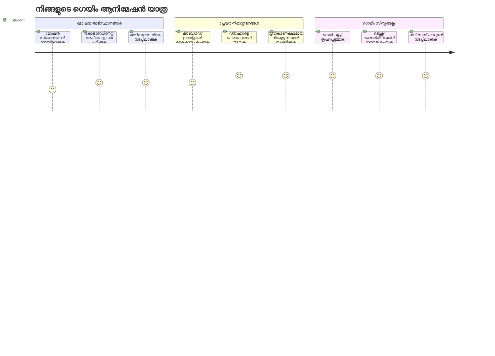
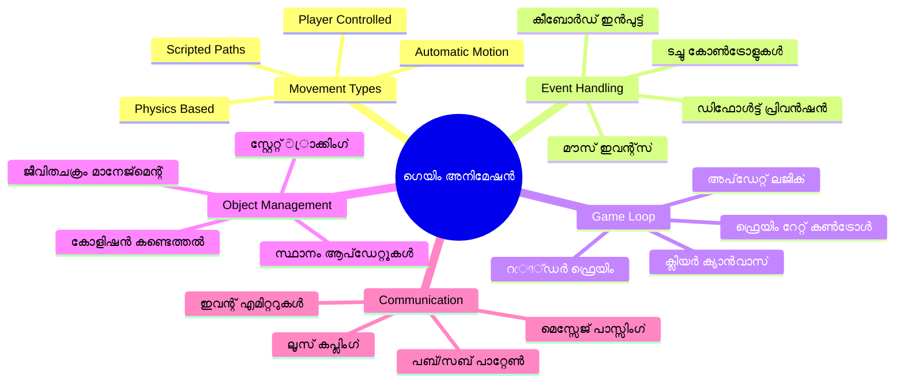
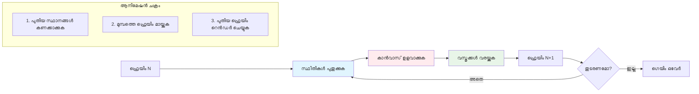
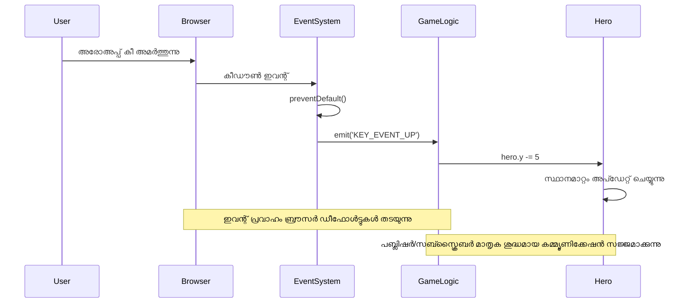
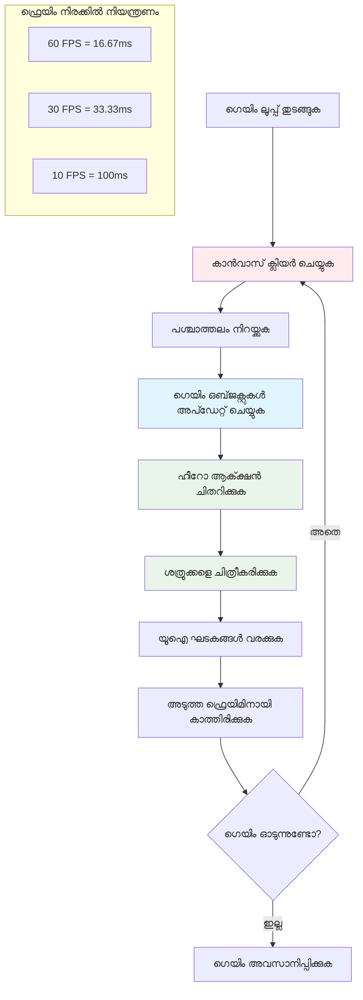
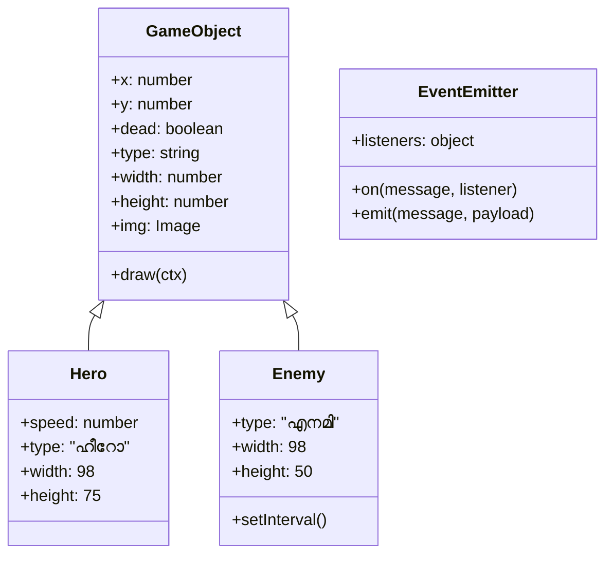
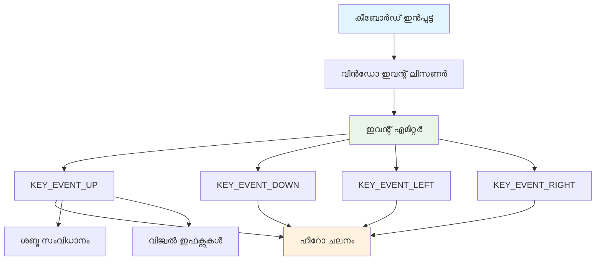
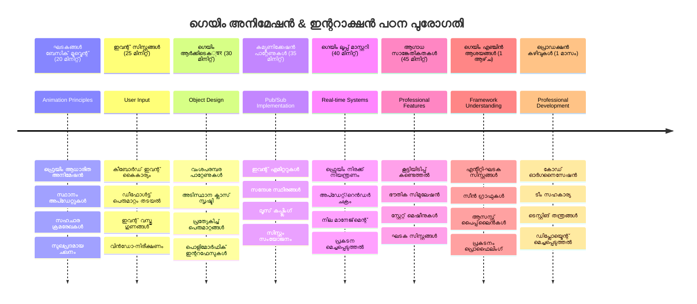

<!--
CO_OP_TRANSLATOR_METADATA:
{
  "original_hash": "8c55a2bd4bc0ebe4c88198fd563a9e09",
  "translation_date": "2026-01-08T14:42:20+00:00",
  "source_file": "6-space-game/3-moving-elements-around/README.md",
  "language_code": "ml"
}
-->
# സ്റ്റെപ്പിൽ സ്പേസ് ഗെയിം നിർമാണം ഭാഗം 3: മോഷൻ ചേർക്കൽ


നിങ്ങളുടെ ഇഷ്ടപ്പെട്ട ഗെയിമുകളെ കുറിച്ച് ചിന്തിക്കൂ – അവയെ ആകർഷകമാക്കുന്നത് സുന്ദരമായ ഗ്രാഫിക്ക്സുകൾ മാത്രമല്ല, അത് എല്ലാം നീങ്ങുകയും നിങ്ങളുടെ പ്രവർത്തനങ്ങൾക്ക് പ്രതികരിക്കുകയും ചെയ്യുന്ന രീതിയാണ്. ഇടശേഷം, നിങ്ങളുടെ സ്പേസ് ഗെയിം ഒരു മനോഹരമായ ചിത്രപതത്തിൽപോലെ ആണ്, പക്ഷേ നാം അതിലേക്ക് ജീവൻ നിറച്ച് ചലനം ചേർക്കാനിരിക്കുകയാണ്.

NASA എഞ്ചിനീയർമാർ അപോളോ മിഷനുകൾക്കായി ഗൈഡൻസ് കമ്പ്യൂട്ടർ പ്രോഗ്രാം ചെയ്യുമ്പോൾ അവർ അഭിമുഖീകരിച്ച പ്രശ്നം ഇതുപോലെയാണ്: പയലറ്റിന്റെ ഇൻപുട്ടിന് ഒരു സ്പേസ്‌ക്രാഫ്റ്റ് എങ്ങനെ പ്രതികരിക്കണം എന്നും സ്വയമേധയാ ദിശാസൂചന പരിഷ്കാരങ്ങൾ എങ്ങനെ നിലനിർത്തണം എന്നും. ഇന്നു നാം പഠിക്കാനിരിക്കുന്ന സിദ്ധാന്തങ്ങൾ ഈ സമാന ആശയങ്ങളെ പ്രതിഫലിപ്പിക്കുന്നു – കളിക്കovu തുടർന്ന് നിയന്ത്രിതമായ നിധികള്‍ സാമ്പത്തിക സ്വയം പ്രവർത്തന സിസ്റ്റങ്ങളോ ല്качилാ.

ഈ പాఠത്തിൽ, നിങ്ങൾ സ്‌പേസ്‌ഷിപ്പുകൾ സ്ക്രീനിലൂടെ സ്ലൈഡ് ചെയ്യുന്നതും കളിക്കാരന്റെ കമാൻഡുകൾക്കെ പ്രതികരിക്കുന്നതും സുന്ദരമായ ചലന മാതൃകകൾ സൃഷ്ടിക്കുന്നതും പഠിക്കും. എല്ലാം സ്വാഭാവികമായി ഒന്നിൽ ഒന്ന് കെട്ടിയെടുത്തുകൊണ്ട് നിയന്ത്രിക്കാവുന്ന ആശയങ്ങളായി നാം വിഭജിക്കും.

അവസാനിക്കുമ്പോൾ, കളിക്കാർ അവരുടെ ഹീറോ ജഹാജ് സ്ക്രീനിലുടനീളം പറക്കുകയും ശത്രു ജഹാജുകൾ മുകളിൽ പട്രോൾ നടത്തുന്നതും കാണാൻ കഴിയും. കൂടുതൽ പ്രധാനമായി, ഗെയിം ചലന സിസ്റ്റങ്ങളെ ശക്തിപ്പെടുത്തുന്ന മുൾ സിദ്ധാന്തങ്ങൾ നിങ്ങൾ മനസ്സിലാക്കും.


## മുൻപത്തെ പാഠം-മുൻപരീക്ഷ

[Pre-lecture quiz](https://ff-quizzes.netlify.app/web/quiz/33)

## ഗെയിം ചലനം മനസ്സിലാക്കൽ

വസ്‌തുക്കൾ ചലിച്ചുതുടങ്ങുമ്പോൾ ഗെയിംകൾ ജീവൻ പകരുന്നു, ഇത് രണ്ടുതരം അടിസ്ഥാനരீதിയിലാണ് നടക്കുന്നത്:

- **കളിക്കാരൻ നിയന്ത്രിക്കുന്ന ചലനം**: നിങ്ങൾ ഒരു കീ ഞെക്കുമ്പോൾ അല്ലെങ്കിൽ മൗസ് ക്ലിക്ക് ചെയ്യുമ്പോൾ എന്തെങ്കിലും ജീവിക്കുന്നു. ഇത് നിങ്ങളും നിങ്ങളുടെ ഗെയിംലോകവും തമ്മിലുള്ള നേരിട്ടുള്ള ബന്ധമാണ്.
- **സ്വയമേധയാ ചലനം**: ഗെയിം തന്നെ നീക്കാനുള്ള തീരുമാനം എടുക്കുമ്പോൾ – ഉദാഹരണത്തിന്, നിങ്ങൾ എന്തും ചെയ്താലും കാണാനാകുന്ന ആ ശത്രു ജഹാജുകൾ സ്‌ക്രീൻ വഴി പട്രോൾ ചെയ്യുന്നത്.

കമ്പ്യൂട്ടർ സ്ക്രീനിൽ വസ്തുക്കൾ നീക്കുന്നത് നിങ്ങൾക്ക് തോന്നുന്നതേക്കാൾ എളുപ്പമാണ്. ഗണിത പാഠത്തിലെ x, y കോർഡിനേറ്റുകൾ ഓർക്കൂ? നമ്മൾ ഇതെന്താണ് കൈകാര്യം ചെയ്യുന്നിരുന്നത്. 1610 ആസൂലിക്കപ്പുറം ഗാലിലിയോ ജുപിറ്ററിന്റെ ചന്ദ്രന്മാരെ നിരീക്ഷിച്ചപ്പോൾ, അദ്ദേഹവും തുല്യമായ ഒരു പ്രവൃത്തി നിർവഹിച്ചിരുന്നു – ചലന മാതൃകകൾ മനസിലാക്കാൻ സമയക്രമത്തിൽ സ്ഥാനങ്ങൾ രേഖപ്പെടുത്തൽ.

സ്ക്രീനിൽ വസ്തുക്കൾ നീക്കുന്നത് ഫ്ലിപ്ബുക്ക് അനിമേഷൻ സൃഷ്ടിക്കുന്നതുപോലെ ആണ് – ഈ മൂന്ന് ലളിതമായവ പിന്തുടരേണ്ടതാണ്:


1. **പൊസിഷൻ അപ്ഡേറ്റ് ചെയ്യുക** – നിങ്ങളുടെ വസ്തു എവിടെയാണ് എന്ന് മാറ്റുക (ഉദാഹരണം: 5 പിക്‌സൽ വലത്തേക്ക് നീക്കം ചെയ്യുക)  
2. **പഴയ ഫ്രെയിം നീക്കംചെയ്യുക** – സ്ക്രീൻ ശൂന്യമാക്കുക, അത് കൊണ്ട് പുറന്തള്ളിയ വഴികൾ കാണുന്നില്ല  
3. **പുതിയ ഫ്രെയിം വരയ്ക്കുക** – വസ്തു പുതിയ സ്ഥാനത്ത് വെക്കുക

ഇത് വേഗത്തിൽ ചെയ്താൽ, സൂപ്പർ! നിങ്ങൾക്ക് സുന്ദരമായ, സ്വാഭാവികമായ തോന്നൽ വരുന്ന ചലനം നൽകാം.

കೋഡിൽ ഇത് ഇങ്ങനെ കാണാം:

```javascript
// ഹീറോയുടെ സ്ഥാനം സജ്ജമാക്കുക
hero.x += 5;
// ഹീറോയെ ഹോസ്റ്റ് ചെയ്യുന്ന ചതുരഭുജം മായ്ക്കുക
ctx.clearRect(0, 0, canvas.width, canvas.height);
// ഗെയിം പശ്ചാത്തലവും ഹീറോയും പുനരാഖ്യാനം ചെയ്യുക
ctx.fillRect(0, 0, canvas.width, canvas.height);
ctx.fillStyle = "black";
ctx.drawImage(heroImg, hero.x, hero.y);
```
  
**ഈ കോഡ് ചെയ്യുന്നത്:**
- ഹീറോയുടെ x-കോ-ഓർഡിനേറ്റ് 5 പിക്‌സൽ വലത്തേക്ക് മാറ്റി *അപ്‌ഡേറ്റ്* ചെയ്യുന്നു  
- മുമ്പത്തെ ഫ്രെയിം നീക്കം ചെയ്യാൻ കാൻവാസ് മുഴുവൻ ശൂന്യമാക്കുന്നു  
- പിന്നീടുള്ള പശ്ചാത്തലം കറുത്ത നീലബർണ്ണമായി പൂരിപ്പിക്കുന്നു  
- ഹീറോ ചിത്രത്തെ പുതിയ സ്ഥാനത്ത് വീണ്ടും വരയ്ക്കുന്നു

✅ ഹീറോ ഉടനീളം നിരവധി ഫ്രെയിമുകൾ ഓരോ സെക്കന്റിലും വീണ്ടും വരയ്ക്കുന്നത് പ്രകടന ചിലവ് ഉണ്ടാക്കാൻ കാരണമാകാമോയെന്നു ഗുമാനിക്കാമോ? ഈ മാതൃകയ്ക്ക് മറ്റു ബദൽ മാർഗങ്ങൾ [ഇവിടെ](https://developer.mozilla.org/en-US/docs/Web/API/Canvas_API/Tutorial/Optimizing_canvas) വായിക്കൂ.

## കീബോർഡ് ഇവന്റ് കൈകാര്യം ചെയ്യൽ

ഇവിടെയാണ് കളിക്കാരന്റെ ഇൻപുട്ടും ഗെയിം പ്രവർത്തനവും ബന്ധിപ്പിക്കുന്നത്. ആരെങ്കിലും ലേസർ അടിക്കാൻ സ്പേസ്ബാർ ഞെക്കുകയോ അസ്ഥിരകാന്തിയെ ഇടിഞ്ഞുകെട്ടാൻ അരിപ്പിൽ അണഞ്ഞു കീ അമർത്തുകയോ ചെയ്താൽ, ഗെയിം ആ ഇൻപുട്ട് തിരിച്ചറിയുകയും പ്രതികരിക്കുകയും വേണം.

കീബോർഡ് ഇവന്റ്‌സ് വിൻഡോ നിലവാരത്തിലാണ് നടക്കുന്നത്, അർത്ഥം ഒരു മുഴുവൻ ബ്രൗസർ വിൻഡോ ആകെയുള്ള കീപ്രസുകൾ കേൾക്കുന്നു. പക്ഷേ മൗസ് ക്ലിക്കുകൾ പ്രത്യേക ഘടകങ്ങളോടെ ബന്ധപ്പെട്ടിരിക്കുന്നു (ഉദാഹരണത്തിന് ഒരു ബട്ടൺ ക്ലിക്ക് ചെയ്യുക). നമ്മുടെ സ്പേസ് ഗെയിമിനായി, കീബോർഡ് നിയന്ത്രണങ്ങളിൽ മാത്രമേ നാം കേന്ദ്രീകരിക്കൂ, കാരണം അത് കളിക്കാർക്ക് ആർക്കെയ്ഡ് അനുഭവം നൽകുന്നു.

1800 കമോൺ കാലത്ത് ടെലിഗ്രാഫ് ഓപ്പറേറ്റർമാർ മോഴ്‌സ് കോഡ് ഇൻപുട്ടുകളെ അർത്ഥംനൽകുന്ന സന്ദേശങ്ങളായി തർജ്ജമ ചെയ്യേണ്ടി വന്നതുപോലെ, നാം കീപ്രസ് ഗെയിം കമാൻഡുകളാക്കി തർജ്ജമ ചെയ്യുന്നുണ്ട്.

ഒരു ഇവന്റ് കൈകാര്യം ചെയ്യാൻ, `window`യുടെ `addEventListener()` മെത്തഡ് ഉപയോഗിച്ച് രണ്ട് ഇൻപുട്ട് പാരാമീറ്ററുകൾ നൽകേണ്ടതാണ്. ആദ്യപാരാമീറ്റർ ഇവന്റിന്റെ പേര് (ഉദാ. `keyup`), രണ്ടാം പാരാമീറ്റർ ഇവന്റ് സംഭവിക്കുമ്പോൾ വിളിക്കേണ്ട ഫങ്ഷനാണ്.

ഉദാഹരണം:

```javascript
window.addEventListener('keyup', (evt) => {
  // evt.key = കിയുടെ സ്ട്രിംഗ് പ്രത്യക്ഷം
  if (evt.key === 'ArrowUp') {
    // എന്തോ ചെയ്യുക
  }
});
```
  
**ഇവിടെ നടക്കുന്ന കാര്യങ്ങൾ:**
- തീരെ വിൻഡോയിൽ നിന്ന് കീബോർഡ് ഇവന്റ് കേൾക്കുന്നു  
- ഇവന്റ് ഒബ്ജക്റ്റ് പിടിക്കുന്നുണ്ട്, അതിൽ ഏതു കീ അമർത്തപ്പെട്ടുവെന്ന വിവരം ഉണ്ട്  
- അമർത്തിയ കീ പ്രത്യേക കീ (ഈ കേസ്: അപ് അറോ) ആണെന്ന് പരിശോധിക്കുന്നു  
- നിബന്ധന പൂർത്തിയായാൽ കോഡ് പ്രവർത്തിപ്പിക്കുന്നു

കീഇവന്റുകളിലായി താഴെപ്പറയുന്ന രണ്ട് പ്രോപ്പർട്ടികൾ ഉപയോഗിക്കാം:

- `key` - അമർത്തിയ കീയുടെ സ്ട്രിംഗ് പ്രതിനിധാനം (ഉദാ. `'ArrowUp'`)  
- `keyCode` - അതിന്റെ സംഖ്യാത്മക പ്രതിനിധാനം (ഉദാ. `37`, ഇത് `ArrowLeft` подойдет)

✅ ഗെയിം വികസനത്തിന് പുറമെ കീഇവന്റ് നിയന്ത്രണങ്ങൾ ഉപയോഗപ്രദമാണ്. ഇതിന് ഏത് മറ്റ് ഉപയോഗങ്ങൾ നിങ്ങൾക്ക് തോന്നുന്നു?


### പ്രത്യേക കീകൾ: മുന്നറിയിപ്പ്!

കീകൾക്കെല്ലത്രേ നിർമ്മിതമായ ബ്രൗസർ പെരുമാറ്റങ്ങൾ ഉണ്ടാകാം, ഇത് നിങ്ങളുടെ ഗെയിം ഇടയാക്കാം. അറോകീസ് പേജ് സ്ക്രോൾ ചെയ്യുന്നു സ്പേസ്ബാർ താഴേക്ക് ചാടുന്നു – കളിക്കാരൻ ജഹാജ് നിയന്ത്രിക്കുമ്പോൾ ഇത് ആഗ്രഹിക്കാത്തതാണ്.

നാം ഈ നിഷിദ്ധമായ പെരുമാറ്റങ്ങൾ തടയാം, ഗെയിം തന്നെ ഇൻപുട്ട് കൈകാര്യം ചെയ്യട്ടെ. ആദ്യകാല കമ്പ്യൂട്ടർ പ്രോഗ്രാമർമാർ സിസ്റ്റം ഇൻററപ്പ്റ്റുകൾ മറികടന്ന് ഇങ്ങനെ ചെയ്തതുപോലെ – എന്നാൽ ഇപ്പോൾ ബ്രൗസർ നിലവാരത്തിലാണ്.

ഇതിലേക്കുള്ള മാർഗം:

```javascript
const onKeyDown = function (e) {
  console.log(e.keyCode);
  switch (e.keyCode) {
    case 37:
    case 39:
    case 38:
    case 40: // ആൺബാണ ചാവികളുകൾ
    case 32:
      e.preventDefault();
      break; // സ്പെയ്‌സ്
    default:
      break; // മറ്റ് ചാവികളുകൾ തടസ്സപ്പെടുത്തരുത്
  }
};

window.addEventListener('keydown', onKeyDown);
```
  
**ഈ തടയൽ കോഡ് മനസിലാക്കൽ:**
- മത്സരിച്ച കീ കോഡുകൾ browser ല് പ്രത്യാഘാതം ഉണ്ടാക്കാതിരിക്കാൻ പരിശോധിക്കുന്നു  
- അറോകീസിനും സ്പേസ്ബാറിനും ഡിഫോൾട്ട് ബ്രൗസർ പ്രവർത്തനം തടയുന്നു  
- മറ്റുള്ള കീകൾ സ്വാഭാവികമായി പ്രവർത്തിക്കാൻ അനുവദിക്കുന്നു  
- ബ്രൗസറിന്റെ ഡിഫോൾട്ട് പെരുമാറ്റം മുടക്കാൻ `e.preventDefault()` ഉപയോഗിക്കുന്നു

### 🔄 **പാഠപരിശോധന**  
**ഇവന്റ് ഹാൻഡ്ലിംഗ് മനസ്സിലാക്കൽ**: സ്വയം പരിശോധിക്കുക –  
- ✅ `keydown`യും `keyup`യും തമ്മിലുള്ള വ്യത്യാസം വിശദീകരിക്കാം  
- ✅ നിഷിദ്ധമായ ബ്രൗസർ പെരുമാറ്റം ഞങ്ങൾ തടയുന്നതെന്തുകൊണ്ടാണ് എന്ന് മനസ്സിലാക്കുക  
- ✅ ഇവന്റ് ലിസണർ ഉപയോക്തൃ ഇൻപുട്ടും ഗെയിം ലജിക്കും എങ്ങനെ ബന്ധപ്പെടുന്നു എന്ന് വിവരിക്കുക  
- ✅ ഗെയിം നിയന്ത്രണങ്ങൾ തടസ്സപ്പെടുത്താവുന്ന കീകൾ ഏതെല്ലാമാണെന്ന് തിരിച്ചറിയുക

**വേഗം-ടെസ്റ്റ്**: അറോ കീകൾക്കുള്ള ഡിഫോൾട്ട് പെരുമാറ്റം നിങ്ങൾ തടയാതിരുന്നാൽ എന്തു സംഭവിക്കും?  
*ഉത്തരം: ബ്രൗസർ പേജ് സ്ക്രോൾ ചെയ്ത് ഗെയിം ചലനത്തെ തടസമാക്കും*

**ഇവന്റ് സിസ്റ്റം ആർക്കിടെക്ചർ**: നിങ്ങൾ ഇതിൽ ഇപ്പോൾ വാക്‌ഫലമായിട്ടുണ്ട്:  
- **വിൻഡോ നിലവാരത്തിൽ കേൾക്കൽ**: ബ്രൗസർ തലത്തിൽ ഇവന്റ് പിടിക്കുക  
- **ഇവന്റ് ഒബ്ജക്റ്റ് പ്രോപ്പർട്ടികൾ**: `key` സ്ട്രിംഗുകളും `keyCode` സംഖ്യകളും  
- **ഡിഫോൾട്ട് തടയൽ**: അനിഷ്ട ബ്രൗസർ പെരുമാറൽ തടയൽ  
- **നിബന്ധനാ ലജിക്ക്**: പ്രത്യേക കീ കൂട്ടികൾക്ക് പ്രതിയോഗം

## ഗെയിം സൃഷ്ടിക്കുന്ന ചലനം

ഇപ്പോൾ മരക്കാട്ടിൽ മനസ്സിലാക്കൂ, കളിക്കാരന്റെ ഇൻപുട്ടില്ലാതെ വസ്തുക്കൾ നീങ്ങുന്നു. നിമിഷം മുതൽ സ്ക്രീനിലൂടെ പട്രോൾ ചെയ്യുന്ന ശത്രുക്കളുടെ ജഹാജുകൾ, നേരിയ രേഖകളിൽ പറക്കുന്ന ബുള്ളറ്റുകൾ, പശ്ചാത്തലത്തിൽ മന്ദഗതിയായ മേഘങ്ങൾ. ഈ സ്വയംപ്രേരിതമായ ചലനം നിങ്ങളുടെ ഗെയിം ലോകം ജീവനുള്ളതുപോലെ തോന്നിക്കാൻ സഹായിക്കുന്നു.

നമുക്ക് ജാവാസ്ക്രിപ്റ്റിന്റെ ഇൻബിൽറ്റ് ടൈമറുകൾ ഉപയോഗിച്ച് പോസിഷനുകൾ തുടർച്ചയായി അപ്ഡേറ്റ് ചെയ്യാം. ഇത് നടപ്പാക്കുന്നത് പെൻഡുലം ക്ലോക്കുകൾ എങ്ങനെ പ്രവർത്തിക്കുന്നു എന്നതുപോലെ – സ്ഥിരം തീയർമരയും ക്രമിതമായ സമയ നടപടികളും. എളുപ്പത്തിൽ കാണാം:

```javascript
const id = setInterval(() => {
  // എതിരാളിയെ y അക്ഷത്തിൽ ചേർത്ത് നീക്കുക
  enemy.y += 10;
}, 100);
```
  
**ഈ ചലന കോഡ് ചെയ്യുന്നത്:**  
- ഓരോ 100 മില്ലിസെക്കന്റിലും പ്രവർത്തിക്കുന്ന ടൈമർ സൃഷ്ടിക്കുന്നു  
- ഓരോ തവണയും ശത്രുവിന്റെ y-കോ-ഓർഡിനേറ്റ് 10 പിക്‌സൽ കുറഞ്ഞ് അപ്ഡേറ്റ് ചെയ്യുന്നു  
- ഇടവേള ഐഡി സൂക്ഷിക്കുന്നു, ആവശ്യത്തിൽ ആണെങ്കിൽ നിർത്താനാകും  
- ശത്രുവിനെ സ്വയം സ്ക്രീനിൽ താഴേക്ക് സഞ്ചടിപ്പിക്കുന്നു

## ഗെയിം ലൂപ്പ്

എല്ലാം ബന്ധിപ്പിക്കുന്ന ആശയം ഇത് – ഗെയിം ലൂപ്പ്. നിങ്ങളുടെ ഗെയിം ഒരു ചിത്രം ആണെങ്കിൽ, ഗെയിം ലൂപ്പ് ചിത്രപ്രൊജക്ടറാണ്, ഫ്രെയിം ഒന്നുകിൽ അനിരവധി വേഗത്തിൽ പ്രദർശിപ്പിച്ച് എല്ലാം സുഖപ്രദമായി ചലിക്കുന്നതുപോലെ കാണിക്കുന്നു.

ആൾക്കുന്ന ഗെയിമുകൾക്ക് പിന്നിൽ പ്രവർത്തിക്കുന്ന ഒരൊരു ഫംഗ്ഷൻ ഇതാണ്. എല്ലാ ഗെയിം വസ്തുക്കളും അപ്ഡേറ്റ് ചെയ്യുകയും, സ്ക്രീൻ വീണ്ടും വരയ്ക്കുകയും, തുടർച്ചയായി ഈ പ്രക്രിയ തുടരുമ്. ഇത് നിങ്ങളുടെ ഹീറോയുടെ സ്ഥാനം, എല്ലാ ശത്രുക്കളും, ലേസറുകളും എല്ലാം നേരത്തെ ട്രാക്ക് ചെയ്യുന്നു.

പ്രാരംഭ സിനിമ അനിമേറ്റർമാർ വാൾറ്റ് ഡിസ്നി പോലുള്ളവർ ഒരു കഥാപാത്രം ഫ്രെയിം ബൈ ഫ്രെയിമായി വീണ്ടും വരയ്ക്കേണ്ടി വന്നതുപോലെ – നമ്മൾ അതു കോഡുമായ് ചെയ്യുകയാണ്.

ഗെയിം ലൂപ്പ് സാധാരണയായി ഇങ്ങനെ കാണാം:


```javascript
const gameLoopId = setInterval(() => {
  function gameLoop() {
    ctx.clearRect(0, 0, canvas.width, canvas.height);
    ctx.fillStyle = "black";
    ctx.fillRect(0, 0, canvas.width, canvas.height);
    drawHero();
    drawEnemies();
    drawStaticObjects();
  }
  gameLoop();
}, 200);
```
  
**ഗെയിം ലൂപ് ഘടന മനസ്സിലാക്കൽ:**  
- മുമ്പത്തെ ഫ്രെയിം നീക്കം ചെയ്യാൻ കാൻവാസ് മുഴുവൻ ശൂന്യമാക്കുന്നു  
- പശ്ചാത്തല നിറം പൂരിപ്പിക്കുന്നു  
- എല്ലാ ഗെയിം വസ്തുക്കളും തങ്ങളുടെ നിലവിലെ സ്ഥാനങ്ങളിൽ വരയ്ക്കുന്നു  
- ഓരോ 200 മില്ലിസെക്കന്റിലും ഇത് ആവർത്തിക്കുന്നു, മൃദുവായ അനിമേഷൻ സൃഷ്ടിക്കുന്നു  
- ഇടവേളയുടെ സമയക്രമം നിയന്ത്രിച്ച് ഫ്രെയിംനിരക്ക് നിയന്ത്രിക്കുന്നു

## സ്പേസ് ഗെയിം തുടർക്കഥ

നീണ്ടിരിക്കുന്ന സ്റ്റെപ്പിൽ നാം മുമ്പ് നിർമിച്ചിരിക്കുന്ന നിശ്ചല ദൃശ്യത്തിന് ചലനം ചേർക്കാം. സ്ക്രീൻഷോട്ട് നിന്നൊരു ഇടപെടു അനുഭവമായി മാറ്റിക്കൊടുക്കുകയാണ്. ഓരോ ഘട്ടവും മുൻ ഘട്ടത്തിനൊപ്പം ചേർന്ന് നിർമ്മിക്കാനുള്ളത്.

മുമ്പത്തെ പാഠത്തിൽ നിന്നു തുടങ്ങിയത് കോഡ് പിടിച്ച് നോക്കുക (അല്ലെങ്കിൽ പുതുതായി തുടങ്ങേണ്ടെങ്കിൽ [Part II- starter](../../../../6-space-game/3-moving-elements-around/your-work) ഫോൾഡറിൽ നിന്ന് സ്റ്റാർട്ട് ചെയ്യാം).

**ഇന്ന് നാം നിർമ്മിക്കേണ്ടതെന്ത്:**  
- **ഹീറോ നിയന്ത്രണങ്ങൾ**: അരോ കീസുകൾ കൊണ്ട് നിങ്ങളുടെ സ്പേസ്‌ഷിപ്പ് സ്ക്രീൻ ചുറ്റി പറക്കും  
- **ശത്രുചലനം**: ആ വിദേശ ജഹാജുകൾ അവരുടെ ആക്രമണം ആരംഭിക്കും

ഇവ നടപ്പിലാക്കാം.

## ശിപാർശ ചെയ്തപടി നിവർത്തുക

`your-work` ഉപഫോൾഡറിൽ నిర్మിച്ചിട്ടുള്ള ഫയലുകൾ കണ്ടെത്തുക. ഈ ഫയലുകൾ അടങ്ങിയിരിക്കണം:

```bash
-| assets
  -| enemyShip.png
  -| player.png
-| index.html
-| app.js
-| package.json
```
  
പ്രോജക്റ്റ് `your-work` ഫോൾഡറിൽ തുടങ്ങാൻ ടൈപ്പ് ചെയ്യുക:

```bash
cd your-work
npm start
```
  
**ഈ കമാൻഡ് ചെയ്യുന്നത്:**  
- പ്രോജക്റ്റ് ഡയറക്ടറിയിലേക്കു പോകുന്നു  
- `http://localhost:5000` എന്ന വിലാസത്തിൽ HTTP സർവർ ആരംഭിക്കുന്നു  
- ഗെയിം ഫയലുകൾ ബ്രൗസറിൽ പരീക്ഷിക്കാനായി സർവ് ചെയ്യുന്നു

മുകളിൽ പറഞ്ഞത് `http://localhost:5000` വിലാസത്തിൽ HTTP സർവർ ചാലിക്കുന്നത്. ഇപ്പോൾ ഒരു ബ്രൗസർ ഓപ്പൺ ചെയ്ത് ആ വിലാസം നൽകുക, ഹീറോയും എല്ലാ ശത്രുകളും দেখা മാത്രമാണ്, ഇന്നുവരെ ഒന്നും ചലിക്കുന്നില്ല!

### കോഡ് ചേർക്കുക

1. `hero`, `enemy` နှင့် `game object` എന്ന കാര്യത്തിന് പ്രത്യേക ഒബ്ജക്റ്റുകൾ ചേർക്കുക. അവയ്ക്ക് `x` , `y` പ്രോപ്പർട്ടികൾ ഉണ്ടാകണം. ([ഇറ наследം അല്ലെങ്കിൽ സംയോജനം](../README.md) എന്ന ഭാഗം ഓർമിക്കുക).

   *HINT* `game object` ആയിരിക്കേണ്ടത് `x`, `y` ഉള്ള ക്ലാസ്‌ ആകുന്നു, അതും കാൻവാസിലേക്ക് സ്വയം വരയ്ക്കുന്ന ശേഷി ഉള്ളത്.

   > **ടിപ്പ്**: ആദ്യം പുതിയ `GameObject` ക്ലാസ് ചേർക്കുക, അതിന്റെ കൺസ്ട്രക്ടർ താഴെപ്പറഞ്ഞിട്ടുള്ളതുപോലെ നിർവചിക്കുക, ശേഷം കാൻവാസ്‌യിൽ വരയ്ക്കുക:

    ```javascript
    class GameObject {
      constructor(x, y) {
        this.x = x;
        this.y = y;
        this.dead = false;
        this.type = "";
        this.width = 0;
        this.height = 0;
        this.img = undefined;
      }
    
      draw(ctx) {
        ctx.drawImage(this.img, this.x, this.y, this.width, this.height);
      }
    }
    ```
  
**ഈ അടിസ്ഥാന ക്ലാസ് മനസ്സിലാക്കൽ:**  
- എല്ലാ ഗെയിം ഒബ്ജക്റ്റുകളും പങ്കിടുന്ന പൊതുവായ പ്രോപ്പർട്ടികൾ നിർവചിക്കുന്നു (സ്ഥാനവും വലിപ്പവും ചിത്രം)  
- ഒബ്ജക്റ്റ് നീക്കം ചെയ്യേണ്ടതായിരുന്നെങ്കിൽ ട്രാക്ക് ചെയ്യാൻ `dead` ഫ്ലാഗ് ഉണ്ട്  
- ഒബ്ജക്റ്റ് കാൻവസ്‌ൽ വരയ്ക്കുന്ന `draw()` മേധം ഉണ്ട്  
- ബാല്യ ക്ലാസുകൾക്ക് വിവാഹം നിശ്ചയിക്കാവുന്ന എല്ലാ പ്രോപ്പർട്ടികൾക്കും ഡിഫോൾട്ട് മൂല്യങ്ങൾ സെറ്റ് ചെയ്യുന്നു


`GameObject` വിപുലീകരിച്ച് `Hero` എന്നും `Enemy` എന്നും സൃഷ്ടിക്കുക:

    ```javascript
    class Hero extends GameObject {
      constructor(x, y) {
        super(x, y);
        this.width = 98;
        this.height = 75;
        this.type = "Hero";
        this.speed = 5;
      }
    }
    ```
  
    ```javascript
    class Enemy extends GameObject {
      constructor(x, y) {
        super(x, y);
        this.width = 98;
        this.height = 50;
        this.type = "Enemy";
        const id = setInterval(() => {
          if (this.y < canvas.height - this.height) {
            this.y += 5;
          } else {
            console.log('Stopped at', this.y);
            clearInterval(id);
          }
        }, 300);
      }
    }
    ```
  
**ഈ ക്ലാസുകളിൽ പ്രധാന ആശയങ്ങൾ:**  
- `extends` കീവേഡ് ഉപയോഗിച്ച് `GameObject` മുതൽ അവകാശപ്പെടുന്നു  
- `super(x, y)` ഉപയോഗിച്ച് പാരന്റ് കൺസ്ട്രക്ടർ വിളിക്കുന്നു  
- ഓരോ വസ്തുവിനും പ്രത്യേക വലിപ്പങ്ങളും ലക്ഷണങ്ങളും സജ്ജമാക്കുന്നു  
- `setInterval()` ഉപയോഗിച്ച് ശത്രുക്കളുടെ സ്വയംചലനം നടപ്പിലാക്കുന്നു

2. കീ ന്യൂനസംഖ്യകൾ കൈകാര്യം ചെയ്യുന്ന കീഇവന്റ് ഹാൻഡ്ലറുകൾ ചേർക്കുക (ഹീറോയ്‌ക്ക് മുകളിലെയും കീഴിലെയും ഇടത്തും വലത്തും നീക്കം ചെയ്യാൻ)

   *ഓർക്കുക* പരമാവധി സിസ്റ്റം കാർട്ടീഷ്യൻ ഓഫീസാണു, മുകളിൽ-ഇടത്തുകൈത് ആയിരിക്കും `0,0`. കൂടാതെ ഡിഫോൾട്ട് പെരുമാറ്റം തടയാനുള്ള കോഡ് ചേർക്കുക.

   > **ടിപ്പ്**: നിങ്ങളുടെ `onKeyDown` ഫങ്ഷൻ സൃഷ്ടിച്ച് അത് വിൻഡോയിൽ കൂട്ടി:

   ```javascript
   const onKeyDown = function (e) {
     console.log(e.keyCode);
     // ഡിഫോൾട്ട് പെരുമാറ്റം നിർത്താൻ മുകളിലുള്ള പാഠത്തിലെ കോഡ് ചേർക്കുക
     switch (e.keyCode) {
       case 37:
       case 39:
       case 38:
       case 40: // ഇറങ്കി താറുകൾ
       case 32:
         e.preventDefault();
         break; // സ്പേസ്
       default:
         break; // മറ്റ് കീകൾ തടയരുത്
     }
   };

   window.addEventListener("keydown", onKeyDown);
   ```
  
**ഈ ഇവന്റ് ഹാൻഡ്ലർ ചെയ്യുന്നത്:**  
- വിൻഡോയിലെ കീഡൗൺ ഇവന്റ് കേൾക്കുന്നു  
- അമർത്തിയ കീകോഡ് ഡിബഗിന് ലോഗ് ചെയ്യുന്നു  
- അറോകീകൾക്കും സ്പേസ്ബാറിനും വേണ്ടി ഡിഫോൾട്ട് ബ്രൗസർ പെരുമാറ്റം തടയുന്നു  
- മറ്റുള്ള കീകൾ സാധാരണപ്രകാരമാണ് പ്രവർത്തിക്കുന്നത്

ഈ ഘട്ടത്തിൽ ബ്രൗസർ കോൺസോൾ പരിശോധിച്ച് കീസ്റ്റ്രോക്ക് ലോഗിംഗ് നിരീക്ഷിക്കുക.

3. [Pub sub പാറ്റേൺ](../README.md) നടപ്പാക്കുക, ഇത് ബാക്കി ഭാഗങ്ങൾക്കായുള്ള കോഡ് സുസ്ഥിരമാക്കും.

പബ്ലീഷ്-സബ്സ്ക്രൈബ് പാറ്റേൺ ഇവന്റ് കണ്ടെത്തലും ഇവന്റ് കൈകാര്യം ചെയ്യലും വേർതിരിച്ചും കോഡ് ക്രമീകരിക്കുകയും ചെയ്യുന്നു. ഇത് കോഡ് കൂടുതൽ മെയിന്റെയിനേബിളും.

ഈ അവസാനഭാഗം ചെയ്യാൻ:

1. വിൻഡോയിൽ ഒരു ഇവന്റ് ലിസണർ ചേർക്കുക:

       ```javascript
       window.addEventListener("keyup", (evt) => {
         if (evt.key === "ArrowUp") {
           eventEmitter.emit(Messages.KEY_EVENT_UP);
         } else if (evt.key === "ArrowDown") {
           eventEmitter.emit(Messages.KEY_EVENT_DOWN);
         } else if (evt.key === "ArrowLeft") {
           eventEmitter.emit(Messages.KEY_EVENT_LEFT);
         } else if (evt.key === "ArrowRight") {
           eventEmitter.emit(Messages.KEY_EVENT_RIGHT);
         }
       });
       ```
  
**ഈ ഇവന്റ് സിസ്റ്റം ചെയ്യുന്നത്:**  
- കീബോർഡ് ഇൻപുട്ട് കണ്ടെത്തി അത് മാന്ദ്യ ഗെയിം ഇവന്റുകളായി മാറുന്നു  
- ഇൻപുട്ട് കണ്ടെത്തലും ഗെയിം ലജിക്കാൻ വേർതിരിക്കുന്നു  
- നിയന്ത്രണങ്ങൾ പിന്നീട് എളുപ്പത്തിൽ മാറ്റാൻ കഴിയും  
- ഒരേ ഇൻപുട്ടിന് പല സിസ്റ്റങ്ങൾ പ്രതികരിക്കാൻ അനുമതിയുണ്ട്


2. സന്ദേശങ്ങൾ പ്രസിദ്ധീകരിക്കുകയും സബ്സ്ക്രൈബ് ചെയ്യുകയും ചെയ്യാനുള്ള EventEmitter ക്ലാസ് സൃഷ്ടിക്കുക:

       ```javascript
       class EventEmitter {
         constructor() {
           this.listeners = {};
         }
       
         on(message, listener) {
           if (!this.listeners[message]) {
             this.listeners[message] = [];
           }
           this.listeners[message].push(listener);
         }
       
  
3. കോൺസ്റ്റന്റ് വേരിയബിളുകളും EventEmitter ക്രമീകരണവും ചേർക്കുക:

       ```javascript
       const Messages = {
         KEY_EVENT_UP: "KEY_EVENT_UP",
         KEY_EVENT_DOWN: "KEY_EVENT_DOWN",
         KEY_EVENT_LEFT: "KEY_EVENT_LEFT",
         KEY_EVENT_RIGHT: "KEY_EVENT_RIGHT",
       };
       
       let heroImg, 
           enemyImg, 
           laserImg,
           canvas, ctx, 
           gameObjects = [], 
           hero, 
           eventEmitter = new EventEmitter();
       ```
  
**സജ്ജീകരണം മനസ്സിലാക്കുക:**  
- ചീട്ട് പിഴവുകൾ ഒഴിവാക്കാൻ മെസ്സേജ് കോൺസ്റ്റന്റുകൾ നിർവചിക്കുന്നു, പുനസംഘടിപ്പിക്കൽ സുഗമമാക്കുന്നു  
- ചിത്രങ്ങൾ, കാൻവാസ് കോൺടെക്സ്‌, ഗെയിം സ്റ്റേറ്റ് എന്നിവയ്ക്കുള്ള വേരിയബിളുകൾ പ്രഖ്യാപിക്കുന്നു  
- പബ്ലിഷ്-സബ്‌സ്‌ക്രൈബ് സിസ്റ്റത്തിനായി ഒരു ആഗോള ഇവന്റ് എമിറ്റർ സൃഷ്ടിക്കുന്നു
   - **എല്ലാ ഗെയിം ഒബ്ജക്ടുകളും കൈവശം വെയ്ക്കാനായി** ഒരു അറേ ആരംഭിക്കുന്നു

   4. **ഗെയിം ആരംഭിക്കുക**

       ```javascript
       function initGame() {
         gameObjects = [];
         createEnemies();
         createHero();
       
         eventEmitter.on(Messages.KEY_EVENT_UP, () => {
           hero.y -= 5;
         });
       
         eventEmitter.on(Messages.KEY_EVENT_DOWN, () => {
           hero.y += 5;
         });
       
         eventEmitter.on(Messages.KEY_EVENT_LEFT, () => {
           hero.x -= 5;
         });
       
4. **ഗെയിം ലൂപ്പ് ക്രമീകരിക്കുക**

   ഗെയിം ആരംഭിക്കുകയും നല്ല ഇടവേളയിൽ ഗെയിം ലൂപ്പ് ക്രമീകരിക്കുകയും ചെയ്യാൻ `window.onload` ഫംഗ്ഷൻ റിഫാക്ടർ ചെയ്യുക. നിങ്ങൾ ഒരു ലേസർ ബീം കൂടി കൂട്ടിച്ചേർക്കും:

    ```javascript
    window.onload = async () => {
      canvas = document.getElementById("canvas");
      ctx = canvas.getContext("2d");
      heroImg = await loadTexture("assets/player.png");
      enemyImg = await loadTexture("assets/enemyShip.png");
      laserImg = await loadTexture("assets/laserRed.png");
    
      initGame();
      const gameLoopId = setInterval(() => {
        ctx.clearRect(0, 0, canvas.width, canvas.height);
        ctx.fillStyle = "black";
        ctx.fillRect(0, 0, canvas.width, canvas.height);
        drawGameObjects(ctx);
      }, 100);
    };
    ```

   **ഗെയിം ക്രമീകരണത്തെ മനസ്സിലാക്കുക:**
   - **പേജ് മുഴുവൻ ലോഡ് ആവുന്നത് വരെ കാത്തിരിക്കുന്നു**
   - **കാൻവാസ് എലമെന്റ് ആയും അതിന്റെ 2D റെന്ററിംഗ് കോൺടെക്സ്റ്റും എടുക്കുന്നു**
   - **`await` ഉപയോഗിച്ച് എല്ലാ ചിത്രം ആസറ്റുകളും അസിൻക്രോണസ് ആയി ലോഡ് ചെയ്യുന്നു**
   - **100ms ഇടവേളകളിൽ (10 FPS) ഗെയിം ലൂപ്പ് ആരംഭിക്കുന്നു**
   - **തൊഴുത്തുന്ന ഓരോ ഫ്രെയിമിലും പൂർണ സ്ക്രീൻ ക്ലിയർ ചെയ്യുകയും पुന:രേഖ ചെയ്യുകയും ചെയ്യുന്നു**

5. **എനിമികളെ ഒരു നിശ്ചിത് ഇടവേളയിൽ സഞ്ചരിക്കാൻ കോഡ് ചേർക്കുക**

    `createEnemies()` ഫംഗ്ഷൻ റിഫാക്ടർ ചെയ്ത് എനിമികൾ സൃഷ്ടിക്കുകയും അവയെ പുതിയ gameObjects ക്ലാസ്-ലേക്ക് ചേർക്കുകയും ചെയ്യുക:

    ```javascript
    function createEnemies() {
      const MONSTER_TOTAL = 5;
      const MONSTER_WIDTH = MONSTER_TOTAL * 98;
      const START_X = (canvas.width - MONSTER_WIDTH) / 2;
      const STOP_X = START_X + MONSTER_WIDTH;
    
      for (let x = START_X; x < STOP_X; x += 98) {
        for (let y = 0; y < 50 * 5; y += 50) {
          const enemy = new Enemy(x, y);
          enemy.img = enemyImg;
          gameObjects.push(enemy);
        }
      }
    }
    ```

    **എനമി സൃഷ്ടിയുടെ പ്രവർത്തനം:**
    - **എനിമികളെ സ്ക്രീന്റിന്റെ മദ്ധ്യത്തിൽ വയ്ക്കാനുള്ള സ്ഥാനം കണക്കാക്കുന്നു**
    - **നസ്റ്റഡ് ലൂപ്പുകൾ ഉപയോഗിച്ച് എനമികളുടെ ഗ്രിഡ് സൃഷ്ടിക്കുന്നു**
    - **ഏതൊരു എനമിക്കും എനമി ചിത്രം നിയോഗിക്കുന്നു**
    - **പ്രതിയൊരു എനമിയും ഗ്ലോബൽ game objects അറേയിൽ ചേർക്കുന്നു**
    
    കൂടാതെ, ഹീറോയ്ക്ക് സമാനമായ പ്രക്രിയ നടത്താൻ `createHero()` ഫംഗ്ഷൻ ചേർക്കുക.
    
    ```javascript
    function createHero() {
      hero = new Hero(
        canvas.width / 2 - 45,
        canvas.height - canvas.height / 4
      );
      hero.img = heroImg;
      gameObjects.push(hero);
    }
    ```

    **ഹീറോ സൃഷ്ടിയുടെ പ്രവർത്തനം:**
    - **ഹീറോയെ സ്ക്രീന്റെ താഴ്‌വശ മദ്ധ്യത്തിൽ സ്ഥിതിചെയ്യുന്നു**
    - **ഹീറോ ഒബ്ജക്ടിൽ ഹീറോ ചിത്രം നിയോഗിക്കുന്നു**
    - **റെന്ററിംഗിനായി ഹീറോ game objects അറേയിൽ ചേർക്കുന്നു**

    ഒടുവിൽ, ഡ്രോയിംഗ് ആരംഭിക്കാൻ `drawGameObjects()` ഫംഗ്ഷൻ ചേർക്കുക:

    ```javascript
    function drawGameObjects(ctx) {
      gameObjects.forEach(go => go.draw(ctx));
    }
    ```

    **ഡ്രോയിംഗ് ഫംഗ്ഷൻ മനസ്സിലാക്കുക:**
    - **അറേയിലെ എല്ലാ ഗെയിം ഒബ്ജക്ടുകൾക്കും ഇറ്ററേറ്റ് ചെയ്യുന്നു**
    - **പ്രതിയൊരു ഒബ്ജക്ടിലും `draw()` മേത്തഡ്സ്സ് വിളിക്കുന്നു**
    - **ഓബ്ജക്ടുകൾ സ്വയം റെന്റർ ചെയ്യുന്നുണ്ടാകാൻ കാൻവാസ് കോൺടെക്സ്റ്റ് പാസ്സ് ചെയ്യുന്നു**

    ### 🔄 **വിദ്യാഭ്യാസ പരിശോധന**
    **സമ്പൂർണ ഗെയിം സിസ്റ്റം മനസിലാക്കൽ**: മുഴുവൻ ആർക്കിടെക്ചർ നിങ്ങൾ എങ്ങനെ കൈകാര്യം ചെയ്യുന്നു എന്ന് പരിശോധിക്കുക:
    - ✅ എന്റെറിട്ടൻസ് ഹീറോയും എനമിയും പൊതുവായ GameObject ഗുണങ്ങൾ പങ്കിടാൻ എങ്ങനെ സഹായിക്കുന്നു?
    - ✅ pub/sub പേടർൺ നിങ്ങളുടെ കോഡ് എങ്ങനെ കൂടുതൽ റক্ষণാധിക്യമായാക്കുന്നു?
    - ✅ സ്മൂത്ത് ആനിമേഷൻ സൃഷ്ടിക്കുന്നതിന് ഗെയിം ലൂപ്പ് എന്ത് പാതവഹിക്കുന്നു?
    - ✅ യുസർ ഇൻപുട്ടും ഗെയിം ഒബ്ജക്ട് പെരുമാറ്റവും ഇവന്റ് ലിസണറുകൾ എങ്ങനെ ബന്ധിപ്പിക്കുന്നു?

    **സിസ്റ്റം ഇന്റഗ്രേഷൻ**: നിങ്ങളുടെ ഗെയിം ഇപ്പോൾ കാണിക്കുന്നു:
    - **ഓബ്ജക്ട്-ഓറിയന്റഡ് ഡിസൈൻ**: സ്പെഷ്യലൈസ്ഡ് എൻറിട്ടൻസ് ഉള്ള ബേസ് ക്ലാസുകൾ
    - **ഇവന്റ്-ഡ്രിവൻ ആർക്കിടെക്ചർ**: പബ്/സബ് പേടർൺ ലൂസ് കപ്പ്ലിങ്ങിനായി
    - **ആനിമേഷൻ ഫ്രെയിംവർക്ക്**: സ്ഥിരമായ ഫ്രെയിം അപ്‌ഡേറ്റുകൾ ഉള്ള ഗെയിം ലൂപ്പ്
    - **ഇൻപുട്ട് ഹാൻഡ്ലിങ്**: ഡിഫോൾട്ട് പ്രിവെൻഷനോടെ കീബോർഡ് ഇവന്റുകൾ
    - **ആസറ്റ് മാനേജ്മെന്റ്**: ഇമേജ് ലോഡിങ്ങും സ്പ്രൈറ്റ് റെന്ററിംഗും

    **പ്രൊഫഷണൽ പേടർണുകൾ**: നിങ്ങൾ നടപ്പിലാക്കിയതെന്തെന്നാൽ:
    - **കാര്യങ്ങൾ വേർതിരിക്കൽ**: ഇൻപുട്ട്, ലൊജിക്സ്, റെന്ററിംഗ് വേർതിരിച്ച് നടത്തുന്നു
    - **പോളിമോർഫിസം**: എല്ലാ ഗെയിം ഒബ്ജക്ടുകളും പൊതുവായ ഡ്രോയിംഗ് ഇന്റർഫേസ് പങ്കിടുന്നു
    - **മെസേജ് പാസ്സിംഗ്**: ഘടകങ്ങൾക്കിടയിൽ ശുചിത്വപ്പെട്ട ആശയവിനിമയം
    - **റിസോഴ്‌സ് മാനേജ്മെന്റ്**: കാര്യക്ഷമമായ സ്പ്രൈറ്റ്, ആനിമേഷൻ ഹാൻഡ്ലിംഗ്
    
    നിങ്ങളുടെ എനിമികൾ ഹീറോ സ്പേസ്‌ഷിപ്പിലേക്ക് മുന്നോട്ടു തുടങ്ങും!
      }
    }
    ```
    
    and add a `createHero()` function to do a similar process for the hero.
    
    ```javascript
    function createHero() {
      hero = new Hero(
        canvas.width / 2 - 45,
        canvas.height - canvas.height / 4
      );
      hero.img = heroImg;
      gameObjects.push(hero);
    }
    ```

    ഒടുവിൽ, ഡ്രോയിംഗ് ആരംഭിക്കാൻ `drawGameObjects()` ഫംഗ്ഷൻ ചേർക്കുക:

    ```javascript
    function drawGameObjects(ctx) {
      gameObjects.forEach(go => go.draw(ctx));
    }
    ```

    നിങ്ങളുടെ എനിമികൾ ഹീറോ സ്പേസഷിപ്പിലേക്ക് മുന്നോട്ടു തുടങ്ങും!

---

## GitHub Copilot ഏജന്റ് ചാലഞ്ച് 🚀

ഇതാണ് നിങ്ങളുടെ ഗെയിം മെച്ചപ്പെടുത്താനുള്ള ഒരു ചാലഞ്ച്: പരിധികളും സ്മൂത്ത് കൺട്രോളുകളും ചേർക്കുക. ഇപ്പോൾ നിങ്ങളുടെ ഹീറോ സ്ക്രീനിൽ നിന്നു പറക്കുന്നു, അതും സഞ്ചാരം കുറച്ചേ തിളക്കമുള്ളതാണ്.

**നിങ്ങളുടെ ദൗത്യം:** സ്ക്രീൻ പരിധികൾ നടപ്പിലാക്കി സ്മൂത്ത് മൂവ്മെന്റ് അനുഭവമാക്കുക, ഹീറോ സ്പേസ്‌ഷിപ്പ് സ്ക്രീനിൽ നിന്ന് പുറത്തു പോകുന്നത് തടയുക. പ്ലേയേഴ്‌സ് ഒരു അ്റോ കീ അമർത്തുമ്പോൾ കപ്പലുകൾ മുഴുവനായി മൃദുവായി നീങ്ങണമെന്നും ദിവസത്തിലല്ല അതാണ് ലക്ഷ്യം. സ്ക്രീൻ പരിധികളിൽ എത്തുമ്പോൾ ദൃശ്യമാകുന്ന ഫീഡ്‌ബാക്ക് ചേർക്കാനും പരിഗണിക്കുക – കളിസ്ഥലത്തിന്റെ അറ്റം സൂചിപ്പിക്കുന്ന സൂക്ഷ്മ ദൃശ്യഫലമാണ് അത്.

[agent mode](https://code.visualstudio.com/blogs/2025/02/24/introducing-copilot-agent-mode) കുറിച്ച് കൂടുതൽ പഠിക്കുക.

## 🚀 ചാലഞ്ച്

പദ്ധതികൾ വലുതാകുന്നതോടെ കോഡ് ഓർഗനൈസേഷൻ കൂടുതൽ പ്രധാനമാകുന്നു. നിങ്ങളുടെ ഫയൽ ഫംക്ഷനുകൾ, വേരിയബിളുകൾ, ക്ലാസുകൾ എല്ലാം ഒറ്റക്കെട്ടായി മാറുന്നതു നിങ്ങൾ കാണാം. ഇത് Apollo മിഷൻ കോഡ് എഞ്ചിനീയർമാർ എങ്ങനെ വൺടെമ്റ്റ് സിസ്റ്റങ്ങൾ സ്‌ഥാപിച്ചുവെന്ന് ഓർമ്മിപ്പിക്കുന്നു.

**നിങ്ങളുടെ ദൗത്യം:**
സോഫ്റ്റ്‌വെയർ ആർക്കിടെക്റ്റ് ആയി ചിന്തിക്കുക. ആറ് മാസം കഴിഞ്ഞ് നിങ്ങൾ അല്ലെങ്കിൽ ടീമിലെ മറ്റാരെങ്കിലും ഇത് എങ്ങനെ പ്രവർത്തിക്കുന്നു എന്ന് എളുപ്പത്തിൽ മനസ്സിലാക്കാൻ എങ്ങനെ കോഡ് ക്രമീകരിക്കും? ഇപ്പോൾ എല്ലാം ഒറ്റ ഫയലിൽ തന്നെയാണ് എങ്കിൽ പോലും നന്നായി ക്രമീകരിക്കാൻ കഴിയുന്ന മാർഗ്ഗങ്ങൾ:

- **സംബന്ധപ്പെട്ട ഫംഗ്ഷനുകൾ കൂട്ടിച്ചേർക്കുക** വ്യക്തമായ കമന്റ് ഹെഡറുകൾ ഉപയോഗിച്ച്
- **കാര്യങ്ങൾ വേർതിരിക്കുക** - ഗെയിം ലൊജിക്ക് റെന്ററിംഗിൽ നിന്നും വേർതിരിക്കുക
- **സ്ഥിരമായ നാമകരണം** വേരിയബിളുകൾക്കും ഫംഗ്ഷനുകൾക്കും
- **മൊഡ്യൂളുകൾ** അല്ലെങ്കിൽ നെയ്‌സ്പേസുകൾ ഉപയോഗിച്ച് ഗെയിം വ്യത്യസ്ത തലങ്ങൾ ക്രമീകരിക്കുക
- **പ്രതിപാദനം** പ്രധാന വിഭാഗങ്ങളുടെ ഉദ്ദേശം വിശദീകരിക്കുന്ന ഡോക്യുമെന്റേഷൻ ചേർക്കുക

**പ്രതിബിംബിക്കുന്ന ചോദ്യങ്ങൾ:**
- മടങ്ങി വന്നപ്പോൾ നിങ്ങളുടെ കോഡിന്റെ ഏത് ഭാഗങ്ങൾ ഏറ്റവും ബുദ്ധിമുട്ടുള്ളതാണ്?
- മറ്റൊരാൾക്ക് സുലഭമായി സംഭാവന ചെയ്യാൻ എങ്ങനെ കോഡ് ക്രമീകരിക്കാം?
- പവർ-അപ്പ്‌സ് അല്ലെങ്കിൽ വ്യത്യസ്ത എനമി തരം ചേർക്കുമ്പോൾ പുതിയ കഷ്ടതകൾ വരുമോ?

## പാഠശേഷി ക്വിസ്

[പാഠശേഷി ക്വിസ്](https://ff-quizzes.netlify.app/web/quiz/34)

## റിവ്യൂ & സ്വയം പഠനം

ഞങ്ങൾ യഥാർത്ഥത്തിൽ എല്ലാം നുള്ളിൽ നിന്നും നിർമ്മിച്ചു, പഠിക്കാൻ അതിന് മികച്ചതാണെങ്കിലും ഒരു ചെറിയ രഹസ്യമുണ്ട് – അത്ഭുതകരമായ ജാവാസ്ക്രിപ്റ്റ് ഫ്രെയിംവർക്ക്‌സ് ഉണ്ട്, നിങ്ങള്‍ക്ക് ബുദ്ധിമുട്ടുകള്‍ ഒഴിവാക്കാന്‍ സഹായിക്കുന്നതും. അടിസ്ഥാനങ്ങള്‍ നന്നായി മനസ്സിലായ ശേഷം, [ലഭ്യമായവ പരിശോധിക്കുക](https://github.com/collections/javascript-game-engines) ഉചിതമാണ്.

ഫ്രെയിംവർക്ക്‌സ് നമ്മള്‍ക്ക് എല്ലാ ടൂളുകളും സ്വന്തം കയ്യൊഴിവിടാതെ തന്നെ ലഭ്യമാകുന്ന ഒരു പെട്ടി പോലെ ആണ്. വിദ്യാഭ്യാസത്തിനും ചുരുക്കിയായവര്ക്കുംفوൾ ഫീച്ചറുകൾ നൽകുന്നു.

**പരിശോധിക്കേണ്ട കാര്യങ്ങൾ:**
- ഗെയിം എൻജിനുകൾ കോഡ് എങ്ങനെ ക്രമീകരിക്കുന്നു – അവ മനോഹരമായ പേടർണുകൾ ഉപയോഗിക്കുന്നു
- കാൻവാസ് ഗെയിംസ് മികച്ച രീതിയിൽ നടത്താനുള്ള പെർഫോമൻസ് ട്രിക്കുകൾ  
- മോഡേൺ ജാവാസ്ക്രിപ്റ്റ് ഫീച്ചറുകൾ കോഡ് കൂടുതൽ ശുചിത്വം കൂടിയതും പരിചരണയോഗ്യമായതും ആക്കുന്നു
- ഗെയിം ഒബ്ജക്ടുകൾക്കും അവയുടെ ബന്ധങ്ങൾക്കും വ്യത്യസ്ത സമീപനങ്ങൾ

## 🎯 നിങ്ങളുടെ ഗെയിം ആനിമേഷൻ മാസ്ടറി ടൈംലൈൻ


### 🛠️ നിങ്ങളുടെ ഗെയിം ഡെവലപ്പ്മെന്റ് ടൂൾകിറ്റ് സംഗ്രഹം

ഈ പಾಠം പൂർത്തിയായ ശേഷം നിങ്ങൾ മാസ്റ്റർ ചെയ്തിട്ടുണ്ട്:
- **ആനിമേഷൻ സ 원പ്രിൻസിപ്പിൾസ്**: ഫ്രെയിം അടിസ്ഥാനമാക്കിയ സഞ്ചാരവും സ്മൂത് ട്രാൻസിഷൻഉം
- **ഇവന്റ് ഡ്രിവൻ പ്രോഗ്രാമിംഗ്**: കീബോർഡ് ഇൻപുട്ട് ഹാൻഡ്ലിംഗ് കൃത്യമായ ഇവന്റ് മാനേജ്മെന്റോടെ
- **ഓബ്ജക്ട് ഓറിയന്റഡ് ഡിസൈൻ**: എൻറിട്ടൻസ് ഹിയരാർകികളും പോളിമോർഫിക് ഇന്റർഫേസുകളും
- **കമ്മ്യൂണിക്കേഷൻ പേടർണുകൾ**: പബ്/സബ് ആർക്കിടെക്ചർ റক্ষণാധിക്യത്തിന്
- **ഗെയിം ലൂപ്പ് ആർക്കിടെക്ചർ**: റിയൽ-ടൈം അപ്‌ഡേറ്റ് & റെന്ററിംഗ് സൈക്കിളുകൾ
- **ഇൻപുട്ട് സിസ്റ്റംസ്സ്**: യൂസർ നിയന്ത്രണം നോട്ിഫ് ചെയ്യപ്പെട്ട പെരുമാറ്റത്തോടെ
- **ആസിറ്റ് മാനേജ്മെന്റ്**: സ്പ്രൈറ്റ് ലോഡിങ്ങും കാര്യക്ഷമമായ റെന്ററിംഗ് സാങ്കേതികവിദ്യയും

### ⚡ **അടുത്ത 5 മിനിറ്റ് ചെയ്തേക്കാവുന്നവ**
- [ ] ബ്രൗസർ കോൺസോൾ തുറന്ന് `addEventListener('keydown', console.log)` പരീക്ഷിക്കുക കീബോർഡ് ഇവന്റ് കാണാനായി
- [ ] ഒരു ലഘു div എലമെന്റ് സൃഷ്ടിച്ച് അറായികങ്ങളാൽ ചലിപ്പിക്കുക
- [ ] `setInterval` ഉപയോഗിച്ച് തുടർച്ചയായ സഞ്ചാരം സൃഷ്ടിക്കുക
- [ ] `event.preventDefault()` ഉപയോഗിച്ച് ഡിഫോൾട്ട് പെരുമാറ്റം തടയാൻ ശ്രമിക്കുക

### 🎯 **ഈ മണിക്കൂറിൽ നേടാൻ സാധിക്കുന്നവ**
- [ ] പാഠശേഷി ക്വിസ് പൂർത്തിയാക്കി ഇവന്റ് ഡ്രിവൻ പ്രോഗ്രാമിംഗ് മനസ്സിലാക്കുക
- [ ] ഫുൾ കീബോർഡ് കൺട്രോളോടുകൂടിയ ഹീറോ സ്പേസ്‌ഷിപ്പ് നിർമ്മിക്കുക
- [ ] സ്മൂത് എനമി മൂവ്മെന്റ് പാറ്റേണുകൾ നടപ്പിലാക്കുക
- [ ] ഗെയിം ഒബ്ജക്ടുകൾ സ്ക്രീൻ കൂടെ പോകുന്നത് തടയാൻ പരിധി ചേർക്കുക
- [ ] ലഘു കോൾഷൻ കണ്ടക്ഷൻ സൃഷ്ടിക്കുക

### 📅 **നിങ്ങളുടെ ആഴ്ച നീണ്ട ആനിമേഷൻ യാത്ര**
- [ ] പൂർണ്ണ സ്പേസ് ഗെയിം സൃഷ്ടിച്ച് നന്നായി മൂവ്മെന്റ്, ഇന്ററാക്ഷനുകൾ ചേർക്കുക
- [ ] കർവ്‌സ്, ആക്‌സലറേഷൻ, ഫിസിക്സ് പോലുള്ള മൂവ്മെന്റ് പാറ്റേണുകൾ ചേർക്കുക
- [ ] സ്മൂത്ത് ട്രാൻസിഷനുകളും ഇസി ഫങ്‌ഷനുകളും നടപ്പിലാക്കുക
- [ ] പാർട്ടിൾ എഫക്റ്റുകളും ദൃഷ്ടിമാതൃക ഫീഡ്‌ബാക്ക് സംവിധാനം നിർമ്മിക്കുക
- [ ] 60fps കളി അനുഭവം ഉറപ്പു വരുത്തുന്നതിനുള്ള പർഫോമൻസ് ഒപ്റ്റിമൈസേഷന്‍ ചെയ്യുക
- [ ] മൊബൈൽ ടച്ച് കോൺട്രോളുകളും പ്രതികരണശേഷിയുള്ള ഡിസൈനും ചേർക്കുക

### 🌟 **നിങ്ങളുടെ മാസം നീണ്ട ഇൻററാക്ടീവ് ഡെവലപ്പ്മെന്റ്**
- [ ] സങ്കീർണ്ണമായ ഇൻററാക്ടീവ് ആപ്ലിക്കേഷനുകൾ വികസിപ്പിക്കുക
- [ ] GSAP പോലുള്ള ആനിമേഷൻ ലൈബ്രററികള്‍ പഠിക്കുക അല്ലെങ്കിൽ സ്വന്തം ആനിമേഷൻ എൻജിൻ സൃഷ്ടിക്കുക
- [ ] ഓപ്പൺ സോഴ്സ് ഗെയിം ഡെവലപ്പ്മെന്റിനും ആനിമേഷനും സംഭാവന നൽകുക
- [ ] ഗ്രാഫിക്സ് ബലിച്ചുള്ള പ്രൊഫോമൻസ് ഒപ്റ്റിമൈസേഷൻ മാസ്റ്റർ ചെയ്യുക
- [ ] ഗെയിം ഡെവലപ്പ്മെന്റ്, ആനിമേഷൻ സംബന്ധിച്ച വിദ്യാഭ്യാസ ഉള്ളടക്കം ഒരുക്കുക
- [ ] ആധുനിക ഇന്ററാക്ടീവ് പ്രോഗ്രാമിങ്ങ് കഴിവുകൾ പ്രദർശിപ്പിക്കുന്ന പോർട്ട്ഫോളിയോ നിർമ്മിക്കുക

**യാഥാർത്ഥ ലോക പ്രയോഗങ്ങൾ**: നിങ്ങളുടെ ഗെയിം ആനിമേഷൻ കഴിവുകൾ നേരിട്ട് ബാധിക്കുന്നു:
- **ഇന്ററാക്ടീവ് വെബ് ആപ്ലിക്കേഷനുകൾ**: ഡൈനാമിക് ഡാഷ്‌ബോർഡുകളും റിയൽ-ടൈം ഇന്റർഫേസുകളും
- **ഡാറ്റാ വിഷ്വലൈസേഷൻ**: ആനിമേറ്റഡ് ചാർട്ടുകളും ഇന്ററാക്ടീവ് ഗ്രാഫിക്ക്സും
- **ശിക്ഷണസോഫ്റ്റ്വేర్**: ഇന്ററാക്ടീവ് സിമുലേഷൻകളും പഠന സഹായികളും
- **മൊബൈൽ വികസനം**: ടച്ച് അടിസ്ഥാനമാക്കിയ ഗെയിമുകളും പ്രയോഗങ്ങളും
- **ഡെസ്ക്ടോപ്പ് ആപ്ലിക്കേഷനുകൾ**: ഇലക്ട്രോൺ ആപ്ലിക്കേഷനുകൾ സ്മൂത്ത് ആനിമേഷനുകളോടെ
- **വെബ് ആനിമേഷനുകൾ**: CSS, ജാവാസ്ക്രിപ്റ്റ് ആനിമേഷൻ ലൈബ്രററികൾ

**പ്രൊഫഷണൽ കഴിവുകൾ**: നിങ്ങൾ ഇനി:
- **ആർക്കിടെക്റ്റ് ചെയ്യാൻ** ഇവന്റ്-ഡ്രിവൻ സിസ്റ്റങ്ങൾ വലിയ തലത്തിൽ വിജയകരമായി
- **സൃഷ്ണീകരിക്കാൻ** ഗണിത സ 원പ്രിൻസിപ്പിൾസ് ഉപയോഗിച്ച് സ്മൂത്ത് ആനിമേഷനുകൾ
- **ഡീബഗ് ചെയ്യാൻ** ബ്രൗസർ ഡെവലപ്പർ ടൂൾസ് ഉപയോഗിച്ച് സങ്കീർണ്ണ ഇന്ററാക്ഷൻ സിസ്റ്റങ്ങൾ
- **ഒപ്റ്റിമൈസ് ചെയ്യാൻ** വ്യത്യസ്ത ഉപകരണങ്ങൾക്കും ബ്രൗസറുകൾക്കും അനുയോജ്യമായി ഗെയിം പ്രകടനം
- **ഡിസൈൻ ചെയ്യാൻ** തെളിയിച്ച പേടർണുകൾ ഉപയോഗിച്ച് പരിചരണയോഗ്യമായ കോഡ് ഘടനകൾ

**ഗെയിം ഡെവലപ്പ്മെന്റ് ആശയങ്ങൾ മാസ്റ്റർ ചെയ്തിരിക്കുന്നു**:
- **ഫ്രെയിം റേറ്റ് മാനേജ്മെന്റ്**: FPSയും ടൈമിങ് നിയന്ത്രണങ്ങളുടെയും മനസ്സിലാക്കൽ
- **ഇൻപുട്ട് ഹാൻഡ്ലിങ്**: പ്ലാറ്റ്ഫോം അതിരുകൾ മറികടന്ന് കീബോർഡ്, ഇവന്റ് സിസ്റ്റങ്ങൾ
- **ഓബ്ജക്ട് ലൈഫ്‌സൈക്കിൾ**: സൃഷ്ടി, അപ്‌ഡേറ്റ്, നശിക്കൽ പേടർണുകൾ
- **സ്റ്റേറ്റ് സിങ്ക്രണൈസേഷൻ**: ഫ്രെയിമുകൾക്കിടയിൽ ഗെയിം സ്റ്റേറ്റ് സ്ഥിരത ഉറപ്പാക്കുന്നു
- **ഇവന്റ് ആർക്കിടെക്ചർ**: ഗെയിം സിസ്റ്റങ്ങളിൽത്തുള്ള വിച്ഛേദിച്ച ആശയവിനിമയം

**അടുത്ത നില**: നിങ്ങൾ തയ്യാറാണ് കോൾഷൻ കണ്ടെത്തൽ, സ്കോറിംഗ് സിസ്റ്റങ്ങൾ, ശബ്ദപ്രഭാഷണം എന്നിവ ചേർക്കാൻ അല്ലെങ്കിൽ Phaser, Three.js പോലുള്ള ആധുനിക ഗെയിം ഫ്രെയിംവർക്സ് അന്വേഷിക്കാൻ!

🌟 **അധികാരം നേടിയത്**: പ്രൊഫഷണൽ ആർക്കിടെക്ചർ പേടർണുകൾ ഉൾക്കൊള്ളുന്ന ഒരു സമ്പൂർണ്ണ ഇന്ററാക്ടീവ് ഗെയിം സിസ്റ്റം നിങ്ങൾ നിർമ്മിച്ചിട്ടുണ്ട്!

## അസൈൻമെന്റ്

[Comment your code](assignment.md)

---

<!-- CO-OP TRANSLATOR DISCLAIMER START -->
**വിമർശന കുറിപ്പ്**:  
ഈ പ്രമാണം AI പരിഭാഷ സേവനം [Co-op Translator](https://github.com/Azure/co-op-translator) ഉപയോഗിച്ച് പരിഭാഷപ്പെടുത്തിയതാണ്. നാം ശരിയായി വിവർത്തനം ചെയ്യാൻ ശ്രമിച്ചെങ്കിലും, സ്വയമാറ്റ അനువാദങ്ങളിൽ തെറ്റുകളും കൃത്യതയില്ലായ്മകളും ഉണ്ടാകാമെന്ന് ദയവായി ശ്രദ്ധിക്കുക. അതിന്റെ യഥാർത്ഥ ഭാഷയിലുള്ള പ്രമാണം അദ്ധിഷ്ഠിത സ്രോതസ്സായി പരിഗണിക്കണം. അനിവാര്യ വിവരങ്ങൾക്കായി, പ്രൊഫഷണൽ മനുഷ്യ പരിഭാഷ നിർദ്ദേശിക്കുന്നു. ഈ പരിഭാഷ ഉപയോഗത്തിൽ നിന്നുള്ള ഏതൊരു തെറ്റിദ്ധാരണകൾക്കും ഞങ്ങൾ ബാധ്യസ്ഥരാകില്ല.
<!-- CO-OP TRANSLATOR DISCLAIMER END -->