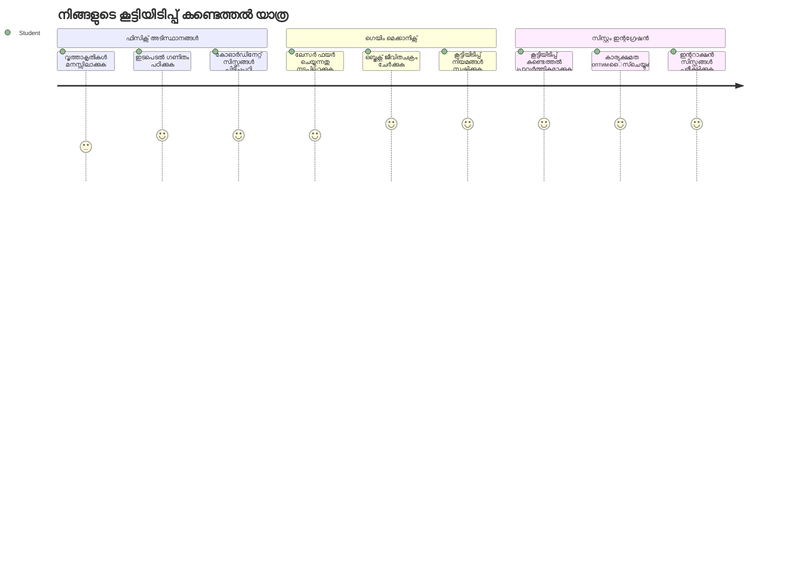
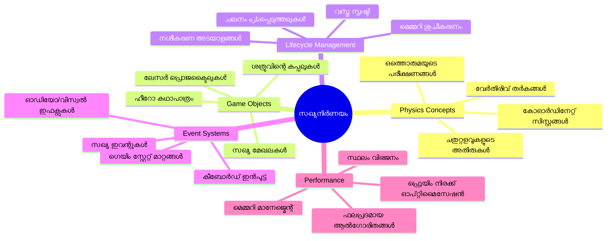
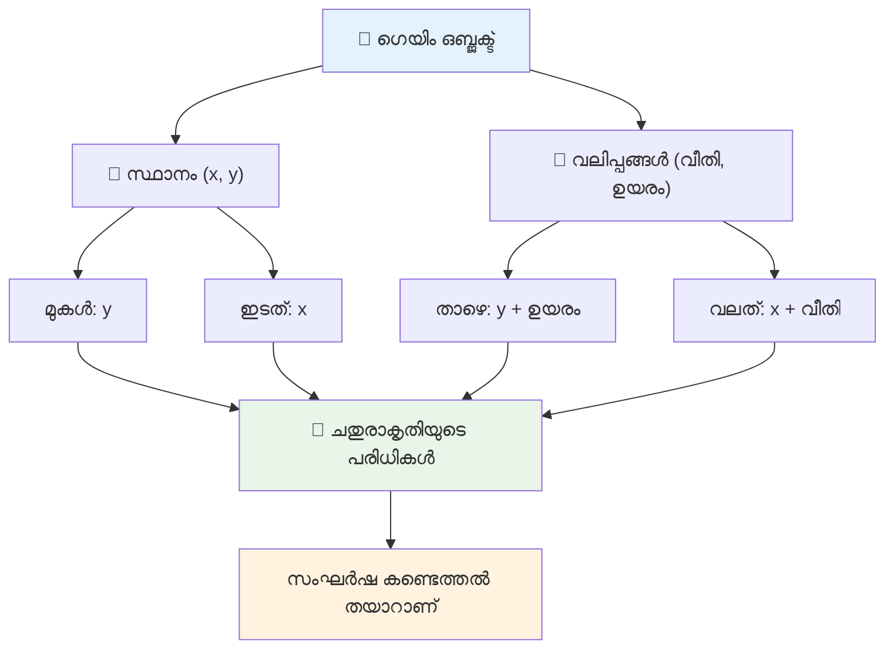
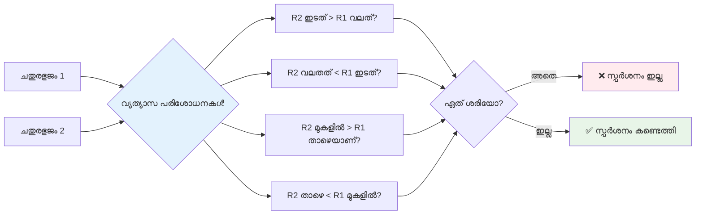
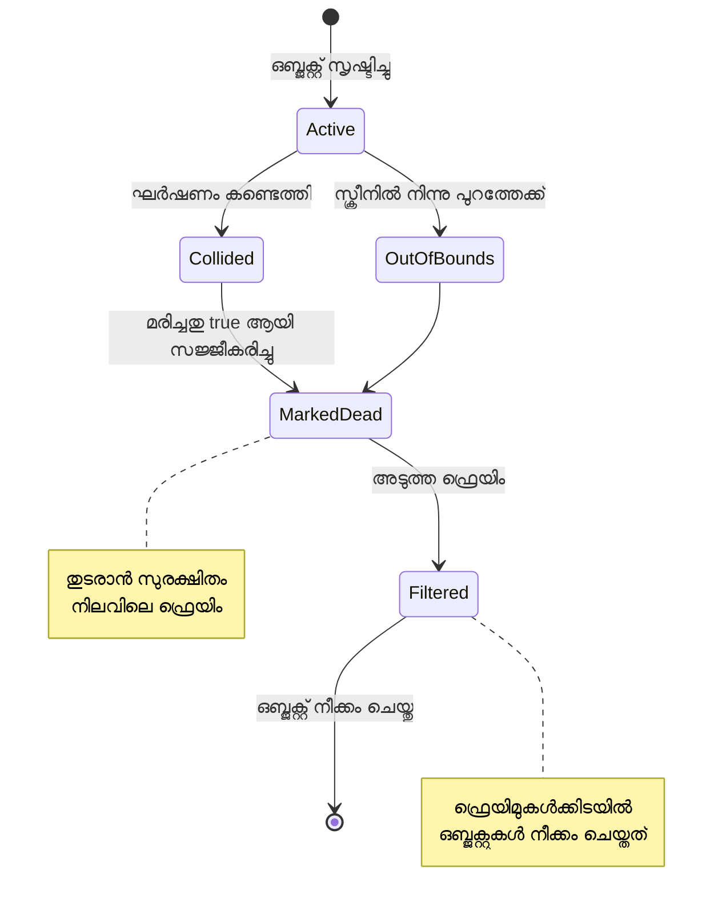
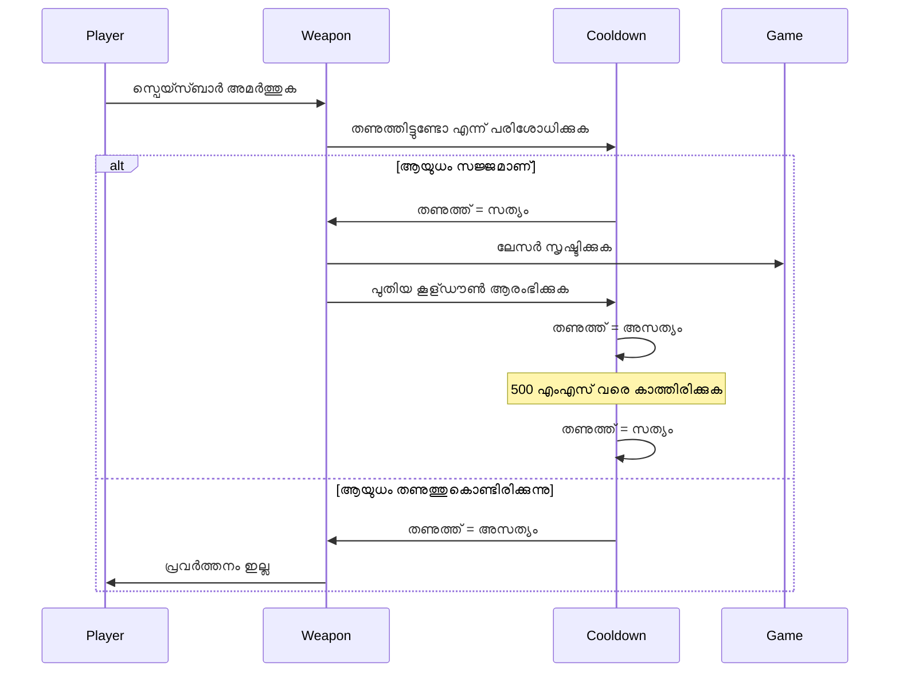
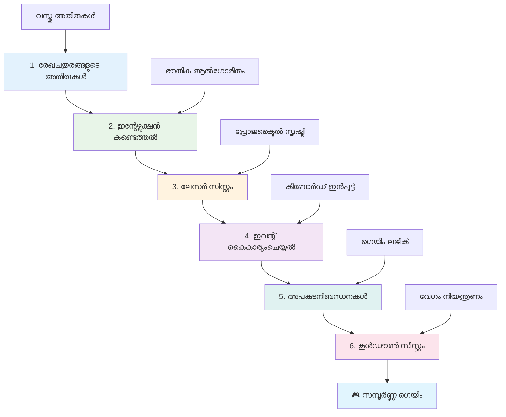
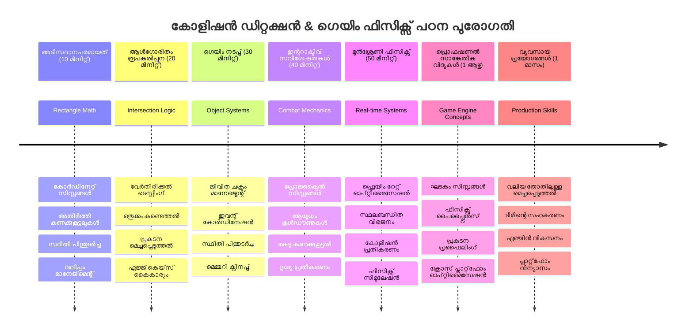

# ഒരു സ്പെയ്‌സ് ഗെയിം നിർമ്മിക്കൽ ഭാഗം 4: ലേസർ ചേർക്കൽ ഒപ്പം ഘർഷണം കണ്ടെത്തൽ


## മുൻപുള്ള ക്ലാസിനുള്ള ക്വിസ്

[Pre-lecture quiz](https://ff-quizzes.netlify.app/web/quiz/35)

സ്റ്റാർ വാർസിലെ ലൂക്കിന്റെ പ്രോട്ടോൺ ടോർപ്പിഡോകൾ ഡെത്ത് സ്റ്റാറിന്റെ എക്സോസ്റ്റ് പോർട്ടിൽ എപ്പോൾ തൊട്ടു എന്ന് ചിന്തിക്കുക. ആ കൃത്യമായ ഘർഷണം ആലയ്ക്കു വിധി മാറ്റി! ഗെയിമുകളിൽ, ഘർഷണം കണ്ടെത്തൽ അതുപോലെ പ്രവർത്തിക്കുന്നു - ഒബ്ജക്റ്റുകൾ എപ്പോൾ ഇടപെടുകയാണ് എന്നതും തുടർന്ന് എന്താകും എന്നതും നിർണ്ണയിക്കുന്നു.

ഈ പാഠത്തിൽ, നിങ്ങളുടെ സ്പെയ്‌സ് ഗെയിമിലേക്ക് ലേസർ അമ്പുകൾ ചേർക്കുകയും ഘർഷണം കണ്ടെത്തൽ നടപ്പിലാക്കുകയും ചെയ്യും. NASAയുടെ മിഷൻ പ്ലാനർമാർ ബ്ളാസ്റ്റ് കഷണങ്ങൾ ഒഴിവാക്കി ബഹിരാകാശക്കപ്പലുകളുടെ ട്രാജക്ടറികൾ കണക്കാക്കുന്നതുപോലെ, നിങ്ങൾ ഗെയിം ഒബ്ജക്റ്റുകൾ എപ്പോൾ ഒട്ടും പരം സമാന്തരിക്കുന്നു എന്ന് കണ്ടെത്താൻ പഠിക്കും. നാം ഇത് ക്രമമായ ഘട്ടങ്ങളായി വിഭജിക്കും.

അവസാനിപ്പിച്ചപ്പോൾ, ലേസറുകൾ എനിമികൾ നശിപ്പിക്കുകയും ഘർഷണങ്ങൾ ഗെയിം ഇവന്റുകൾ പ്രേരിപ്പിക്കുകയും ചെയ്യുന്ന ഫംഗ്ഷണൽ കോംബാറ്റ് സിസ്റ്റം ഉണ്ടാകും. ഇതുപോലുള്ള ഘർഷണ സിദ്ധാന്തങ്ങൾ ഭൗതിക സിമുലേഷനുകളിൽ നിന്നുയർന്ന് ഇന്ററാക്ടീവ് വെബ് ഇന്റർഫേസുകൾ വരെ എല്ലായിടത്തും ഉപയോഗിക്കുന്നു.


✅ ഏറ്റവും ആദ്യം എഴുതിയ കമ്പ്യൂട്ടർ ഗെയിമിനെ കുറിച്ച് ചെറിയൊരു റിസേർച്ച്ച് ചെയ്യുക. അതിന്റെ ഫംഗ്ഷണാലിറ്റി എന്തായിരുന്നു?

## ഘർഷണം കണ്ടെത്തൽ

ഘർഷണം കണ്ടെത്തൽ Apollo ല്യൂണാർ മോഡ്യൂളിലെ പ്രോക്സിമിറ്റി സെൻസറുകൾ പോലെ പ്രവർത്തിക്കുന്നു - കണുകൂടി ദൂരം പരിശോധിച്ച് ഒബ്ജക്റ്റുകൾ വളരെ അടുത്തുവന്നാൽ അലർട്ട് നൽകുന്നു. ഗെയിമുകളിൽ, ഈ സിസ്റ്റം ഒബ്ജക്റ്റുകൾ എപ്പോൾ ഇടപെടുകയാണ് എന്ന് നിർണ്ണയിക്കുകയും തുടർന്ന് എന്താകണം എന്ന് നിബന്ധിക്കുന്നു.

നാം ഉപയോഗിക്കുന്ന സമീപനം എല്ലാ ഗെയിം ഒബ്ജക്റ്റുകളെയും ഒരു ചതുരേക്കോണം (_rectangle_) ആയി കാണുന്നു, വിമാന ട്രാഫിക് നിയന്ത്രണ സിസ്റ്റങ്ങൾ എയർക്രാഫ്റ്റ് ട്രാക്ക് ചെയ്യുന്നതുപോലെ ലളിതമായ ജ്യാമിതീയ ആകൃതികൾ ഉപയോഗിക്കുന്നത് പോലെ. ഈ ചതുരേക്കോണ പద్ధതി എളുപ്പമുള്ളതെങ്കിലും കണക്ക് കാര്യക്ഷമവും കൂടുതലായി ഗെയിം ദ്രശ്യങ്ങളിൽ മികച്ചതാണ്.

### ചതുരേകോണ പ്രതിനിധാനം

എല്ലാ ഗെയിം ഒബ്ജക്റ്റിനും കോർഡിനേറ്റ് അതിരുകൾ വേണം, മാർസ് പാത്ത്‌ഫൈൻഡർ റോവർ മാരിയൻ ഭൂപ്രകൃതിയിലെ സ്ഥാനം മാപ്പ് ചെയ്തതുപോലെ. അതിരിനിർവ്വചനം ഇപ്രകാരം:


```javascript
rectFromGameObject() {
  return {
    top: this.y,
    left: this.x,
    bottom: this.y + this.height,
    right: this.x + this.width
  }
}
```

**ഇത് വിഭജിച്ചാൽ:**
- **മുകളിൽ ഉള്ള അതിരു**: നിങ്ങൾക്ക് ഒബ्जക്റ്റ് ഉയരം ആരംഭിക്കുന്ന y- സ്ഥാനം
- **ഇടത് അതിരു**: ദിശാനുയായ ഫലകം ആരംഭിക്കുന്ന x- സ്ഥാനം
- **താഴെ അതിരു**: y-സ്ഥാനത്തേക്ക് ഉയരം ചേർക്കുക - ഒടുവിൽ എത്തുന്ന സ്ഥലം
- **വലത് അതിരു**: x-സ്ഥാനത്തേക്ക് വീതി ചേർക്കുക - സമ്പൂർണ്ണ അതിരാണു ലഭിച്ചത്

### ഒട്ടുമെത്തിയാൽ പ്രവർത്തിക്കുന്ന ആൽഗോറിതം

ചതുരേക്കോണ ഒട്ടുമെത്തൽ കണ്ടെത്തൽ ഹൈബിൾ സ്‌പേസ് ടെലിസ്കോപ് ആകാശ വസ്തുക്കൾ ഒട്ടുമെത്തിച്ചിട്ടുണ്ടോ എന്ന് പരിശോധിക്കുന്ന പ്രക്രിയയിലേതുപോലെ ആണ് പ്രവർത്തിക്കുന്നത്. ഈ ആൽഗോറിതം ഓർമ്മപ്പെടുത്തുന്നു രാജ്ഡാർ സമ്പ്രദായം:


```javascript
function intersectRect(r1, r2) {
  return !(r2.left > r1.right ||
    r2.right < r1.left ||
    r2.top > r1.bottom ||
    r2.bottom < r1.top);
}
```

**വിവരണമടിയിൽ വിലയിരുത്തൽ ചെയ്യുന്നത്:**
- റെക്റ്റാംഗിൾ 2 പൂർണമായും റെക്റ്റാംഗിൾ 1-ന്റെ വലത് ഭാഗത്താണോ?
- റെക്റ്റാംഗിൾ 2 പൂർണമായും റെക്റ്റാംഗിൾ 1-ന്റെ ഇടത് ഭാഗത്താണോ?
- റെക്റ്റാംഗിൾ 2 പൂർണമായും റെക്റ്റാംഗിൾ 1-ന്റെ താഴെ ഭാഗത്താണോ?
- റെക്റ്റാംഗിൾ 2 പൂർണമായും റെക്റ്റാംഗിൾ 1-ന്റെ മേൽ ഭാഗത്താണോ?

ഇവയിൽ ഒന്നും ശരിയല്ലെങ്കിൽ, റെക്റ്റാംഗിളുകൾ ഒട്ടുമെത്തിച്ചിരിക്കണം. ഇത് തന്നെയാണ് റഡാർ ഓപ്പറേറ്റർമാർ വിമാനങ്ങൾ സുരക്ഷിത ദൂരത്താണെന്ന് കണ്ടെത്തുന്നത് പോലെയാണ്.

## ഒബ്ജക്റ്റുകളുടെ ലൈഫ്‌സൈകിൾ മാനേജ്‌മെന്റ്

ഒരു ലേസർ ഒരു എനിമിയെ തൊട്ടാൽ, രണ്ടു ഒബ്ജക്റ്റുകളും ഗെയിമിൽ നിന്ന് അഴിക്കാൻ വേണം. പക്ഷേ, ലൂപ്പ് നടപ്പിലായി ഘട്ടത്തിൽ ഒബ്ജക്റ്റുകൾ നീക്കം ചെയ്യുന്നത് ക്രാഷ് സംഭവിക്കും - അപ്പോളോ ഗൈഡൻസ് കമ്പ്യൂട്ടറിൽ നേരിട്ട പാഠം. പകരം, "ഡീലക്ഷൻ മാർക്ക്" വഴികള് ഉപയോഗിച്ച് ഫ്രെയിമുകൾക്കിടയിൽ സുരക്ഷിതമായ നീക്കം നടപ്പാക്കുന്നു.


ഇങ്ങനെ ഒരു ഒബ്ജക്റ്റ് നീക്കംക്കായി മാർക്ക് ചെയ്യുന്നു:

```javascript
// ഒബ്ജക്ട് നീക്കംചെയ്യാൻ സംചിഹ്നീകരിക്കുക
enemy.dead = true;
```

** എങ്ങനെ ഇത് പ്രവർത്തിക്കുന്നു:**
- ഒബ്ജക്റ്റ് "മൂടിയ" എന്ന് അടയാളപ്പെടുത്തുന്നു പക്ഷേ ഉടൻ നീക്കംചെയ്യരുത്
- നിലവിലെ ഗെയിം ഫ്രെയിം സുരക്ഷിതമായി പൂർത്തിയാക്കുന്നു
- ഇപ്പോഴത്തെ ഇല്ലാതായ ഒന്നിനെ ഉപയോഗിക്കാൻ ശ്രമിച്ച് പിഴവ് വരുന്നതില്ല!

തിൻറെ തുടർന്ന് ഓരോ റൻഡർ ചക്രത്തിനും മുൻപ് മാർക്ക് ചെയ്ത ഒബ്ജക്റ്റുകൾ ഫിൽട്ടർ ചെയ്യുക:

```javascript
gameObjects = gameObjects.filter(go => !go.dead);
```

**ഈ ഫിൽട്ടർ ചെയ്യുന്നത്:**
- "സജീവ" ഒബ്ജക്റ്റുകൾ മാത്രം ഉള്ള പുതുക്കിയ പട്ടിക സൃഷ്ടിക്കുന്നു
- മരിച്ചവയും ഇല്ലാതാക്കുന്നു
- ഗെയിം നീക്കമർച്ച് തുടരുന്നു
- നശിച്ച ഒബ്ജക്റ്റുകൾ പെരുകാതിരിക്കാൻ സഹായിക്കുന്നു

## ലേസർ മെക്കാനിക്‌സ് നടപ്പിലാക്കൽ

ഗെയിമിലെ ലേസർ പ്രൊജക്ടൈലുകൾ സ്റ്റാർ ട്രെക്കിലെ ഫോട്ടോൺ ടോർപ്പിഡോകളുടെ പോലെ പ്രവർത്തിക്കുന്നു - അവ้วน സമാന്തര രേഖകളിൽ സഞ്ചരിക്കുമ്പോൾ ഒന്നിനെ തൊട്ടാൽ അവസാനിക്കും. ഓരോ സ്പേസ്‌ബാർ അമർത്തലും പുതിയ ലേസർ ഒബ്ജക്റ്റ് സൃഷ്ടിക്കുന്നു, അത് സ്ക്രീനിൽ താണ്ടിയടിക്കുന്നു.

ഇത് പ്രവർത്തിക്കാൻ ചില ഘടകങ്ങൾ ഏകോപിപ്പിക്കണം:

**നിർവ്വഹണ ഇനങ്ങൾ:**
- **സൃഷ്ടിക്കുക** നായകന്റെ സ്ഥാനം മുതൽ ലേസർ ഒബ്ജക്റ്റുകൾ
- **ഹാൻഡ്ൾ** കീബോർഡ് ഇന്റപുട്ട് ലേസർ സൃഷ്ടിക്കാനായി
- **മാനേജ് ചെയ്യുക** ലേസർ നീക്കം ഒപ്പം ലൈഫ് സൈകിൾ
- **നിർവ്വഹിക്കുക** ലേസർ പ്രൊജക്ടൈലുകളുടെ ദൃശ്യ പ്രതിനിധാനം

## ഷൂട്ടിംഗ് നിരക്ക് നിയന്ത്രണം നടപ്പിലാക്കൽ

അപരിമിതമായ ഷൂട്ടിംഗ് നിരക്കുകൾ ഗെയിം എൻജിൻ അത്തരമൊരു ഭ്രമം ആക്കി കളി വളരെ എളുപ്പമാക്കും. യഥാർത്ഥ ആയുധ സിസ്റ്റങ്ങൾക്കും തീവ്രമായ നിയന്ത്രണങ്ങൾ ഉണ്ട് - USS എൻറ്പ്രൈസിന്റെ ഫേസേഴ്സിനും ഷൂട്ടിംഗിനുണ്ടായ ഇടവേളകൾ പോലെ.

നാം കൂൾഡൗൺ സിസ്റ്റം നടപ്പിലെത്തിക്കും, ഇത് റെസ്പോൺസീവ് നിയന്ത്രണങ്ങളെ വെറും സ്പാം ക്ലിക്കിങ് തടയും:


```javascript
class Cooldown {
  constructor(time) {
    this.cool = false;
    setTimeout(() => {
      this.cool = true;
    }, time);
  }
}

class Weapon {
  constructor() {
    this.cooldown = null;
  }
  
  fire() {
    if (!this.cooldown || this.cooldown.cool) {
      // ലേസർ പ്രോജക്ടൈൽ സൃഷ്ടിക്കുക
      this.cooldown = new Cooldown(500);
    } else {
      // ആയുധം ഇപ്പോഴും തണുപ്പുകയാണ്
    }
  }
}
```

**കൂൾഡൗൺ എങ്ങനെ പ്രവർത്തിക്കുന്നു:**
- സൃഷ്ടിച്ചപ്പോൾ ആയുധം "ഹോട്ട്" ആയി ആരംഭിക്കുന്നു (ഇപ്പോൾ ഷൂട്ട് ചെയ്യാൻ കഴിയില്ല)
- സമയ പരിധി കഴിഞ്ഞാൽ അത് "കൂൾ" ആകുന്നു (ഷൂട്ടിന് തയ്യാറാണ്)
- ഷൂട്ടിങ്ങിന് മുമ്പ് പരിശോധിക്കുന്നു: "ആയുധം കൂൾ ആണോ?"
- ഇത് സ്പാം ക്ലിക്കിങ് തടഞ്ഞു കൂട്ടിയതും റെസ്പോൺസീവ് നിയന്ത്രണങ്ങളോടെയാണ്

✅ സ്പേസ് ഗെയിം സീരീസിലെ പാഠം 1-നെ മത്സരിപ്പിക്കാൻ കൂൾഡൗൺ ഓർമ്മിക്കുക.

## ഘർഷണ സിസ്റ്റം നിർമ്മിക്കൽ

നിങ്ങളുടെ നിലവിലുള്ള സ്പെയ്‌സ് ഗെയിം കോഡ് വിപുലീകരിച്ച് ഘർഷണം കണ്ടെത്തൽ സിസ്റ്റം സൃഷ്ടിക്കും. ഇന്റർനാഷണൽ സ്പേസ് സ്റ്റേഷന്റെ സ്വയം ഘർഷണം ഒഴിവാക്കൽ സംവിധാനത്തിന്റെ പോലെയാണ് നിങ്ങളുടെ ഗെയിം ഒബ്ജക്റ്റുകളെ നിരന്തരം നിരീക്ഷിക്കുകയും ഒട്ടുമെത്തൽ സംഭവിക്കുമ്പോൾ പ്രതികരിക്കുകയും ചെയ്യും.

മുൻപത്തെ പാഠത്തിലെ കോഡിൽ നിന്നു തുടങ്ങി, ഘർഷണം കണ്ടെത്തൽ പ്രത്യേക നിയമങ്ങളോടെ ഒബ്ജക്റ്റുകൾ ഇടപെടലുകൾ നിയന്ത്രിക്കും.

> 💡 **പ്രൊ ടിപ്**: ലേസർ സ്പ്രൈറ്റ് നിങ്ങളുടെ അസറ്റുകൾ ഫോൾഡറിൽ ഇതിനകം ഉൾപ്പെടുത്തിയതിനാൽ എളുപ്പത്തിൽ നടപ്പിലാക്കാം.

### നടപ്പാക്കേണ്ട ഘർഷണ നിയമങ്ങൾ

**കേംമെറ്റിക്‌സ് ചേർക്കേണ്ടത്:**
1. **ലേസർ എനിമിയെ തൊടുന്നു**: ലേസർ പ്രൊജക്ടൈൽ എനിമിയെ തൊടുമ്പോൾ നശിക്കുന്നു
2. **ലേസർ സ്ക്രീൻ അതിരിലേറി**: ലേസർ മുകളിൽ എത്തുമ്പോൾ നീക്കം ചെയ്യുക
3. **എനിമി ഒപ്പം നായകൻ ഘർഷിക്കുന്നു**: രണ്ടു ഒബ്ജക്റ്റുകളും ഒട്ടിയാൽ നശിക്കുന്നു
4. **എനിമി താഴെയെത്തുന്നു**: സ്ക്രീൻ താഴെ എത്തിയാൽ ഗെയിം ഓവർ

### 🔄 **പഠന സ്ഥിതി പരിശോധന**
**ഘർഷണം കണ്ടെത്തൽ അടിസ്ഥാനങ്ങൾ**: നടപ്പിലാക്കുന്നതിനുമുമ്പ് ഉറപ്പാക്കാം:
- ✅ ചതുരേക്കോൺ അതിരുകൾ ഘർഷണ മേഖല നിർവ്വചിക്കുന്നത് എങ്ങനെ?
- ✅ വേർതിരിയൽ പരിശോധന ഒട്ടുമെത്തൽ തുകൽക്കാൾ കാര്യക്ഷമമെന്ന് എന്തുകൊണ്ട്?
- ✅ ഗെയിം ലൂപുകളിൽ ഒബ്ജക്റ്റ് ലൈഫ്സൈക്ൾ മാനേജ്മെന്റ് പ്രധാനത
- ✅ ഇവന്റുകൾ ചലിക്കുന്ന ഘർഷണ പ്രതികരണങ്ങൾ എങ്ങനെ ഏകോപിപ്പിക്കുന്നു

**ഷോർട്ട് സെൽഫ്-ടെസ്റ്റ്**: ഒബ്ജക്റ്റുകൾ ഉടനടി നീക്കം ചെയ്‌താൽ എന്താകും?
*ഉത്തരം: മിഡ്-ലൂപ്പ് ഡീലക്ഷന്റെ പിഴവ് അല്ലെങ്കിൽ ഐറ്ററേഷൻ ഒഴിവാക്കൽ സംഭവിക്കും*

**ഭൗതിക ബോധം**: നിങ്ങൾക്കു മനസ്സിലായി:
- **കോഓർഡിനേറ്റ് സിസ്റ്റങ്ങൾ**: സ്ഥാനം വീതിയും അതിരുകൾ നിർണയിച്ചുവരുന്നു
- **ഒട്ടുമെത്തൽ ലെജിക്**: ഘർഷണം കണ്ടെത്തലിന്റെ ഗണിത സിദ്ധാന്തങ്ങൾ
- **പരഫോമൻസ് ഒപ്റ്റിമൈസേഷൻ**: റിയൽ-ടൈം സിസ്റ്റങ്ങൾക്കു പ്രയോജനം
- **മെമ്മറി മാനേജ്മെന്റ്**: സുരക്ഷിതമായ ഒബ്ജക്റ്റ് ലൈഫ്‌സൈകിൾ രീതികൾ

## ഡെവലപ്മെന്റ് പരിസരം സജ്ജമാക്കൽ

സുഖവാർത്ത - എല്ലാ ആസറ്റുകളും നിഗൂഢ ഘടനകളും `your-work` സബ് ഫോളഡറിൽ സജ്ജമാണ്, നിങ്ങൾക്ക് ഇപ്പോൾ തണുത്ത ഘർഷണ ഫീച്ചറുകൾ ചേർക്കാം.

### പ്രോജക്റ്റ് ഘടന

```bash
-| assets
  -| enemyShip.png
  -| player.png
  -| laserRed.png
-| index.html
-| app.js
-| package.json
```

**ഫയൽ ഘടന മനസ്സിലാക്കുക:**
- ഗെയിം ഒബ്ജക്റ്റുകൾക്കുള്ള എല്ലാ സ്പ്രൈറ്റ് ചിത്രങ്ങളും ഉള്ളത്
- പ്രധാന HTML ഡോക്യൂമെന്റും ജാവാസ്ക്രിപ്റ്റ് ആപ്പ് ഫയൽ ഉൾക്കൊള്ളുന്നു
- പ്രാദേശിക ഡെവലപ്മെന്റ് സർവർ പാക്കേജ് കോൺഫിഗറേഷൻ

### ഡെവലപ്മെന്റ് സർവർ ആരംഭിക്കൽ

നിങ്ങളുടെ പ്രോജക്റ്റ് ഫോൾഡറിൽ പോയി ലോക്കൽ സർവർ ആരംഭിക്കുക:

```bash
cd your-work
npm start
```

**ഈ കമാൻഡ് ക്രമം:**
- പ്രോജക്റ്റ് ഡയറക്ടറിയിലേക്ക് മാറുന്നു
- `http://localhost:5000` ലെ ലോക്കൽ HTTP സർവർ ആരംഭിക്കുന്നു
- ഗെയിം ഫയലുകൾ ടെസ്റ്റിംഗിനും ഡെവലപ്‌മെന്റിനും സർവുചെയ്യുന്നു
- ലൈവ് ഡെവലപ്‌മെന്റ് എളുപ്പമാക്കാൻ ഓട്ടോംറിലോഡ് സജ്ജീകരിക്കുന്നു

ബ്രൗസർ തുറന്ന് `http://localhost:5000` സന്ദർശിക്കുക; നായകൻ, എനിമികൾ സ്ക്രീനിൽ കാഴ്ചവെക്കും.

### ഘട്ടം ഘട്ടമായ നടപ്പാക്കൽ

നാസ ഓണറുകളായ വോയ്‌ജർ ബഹിരാകാശ ബോധിയുടെ പ്രോഗ്രാമിംഗുപോലെ നാം ഘർഷണം കണ്ടെത്തൽ ക്രമമായി നടപ്പിലാക്കാം, ഓരോ ഘടകവും ഉടനടി സൃഷ്ടിച്ച്.


#### 1. ചതുരേക്കോൺ ഘർഷണ അതിരുകൾ ചേർക്കുക

 ആദ്യം, നിങ്ങളുടെ ഗെയിം ഒബ്ജക്റ്റുകൾ അതിരുകൾ നിർവ്വചിക്കുന്ന രീതിയെ പഠിപ്പിക്കൂ. ഇത് `GameObject` ക്ലാസിൽ ചേർക്കുക:

```javascript
rectFromGameObject() {
    return {
      top: this.y,
      left: this.x,
      bottom: this.y + this.height,
      right: this.x + this.width,
    };
  }
```

**ഈ മെത്തേഡ് ചെയ്യുന്നത്:**
- കൃത്യമായ അതിരുകൾ ഉള്ള ഒരു റ്റെക്റ്റാംഗിൾ ഒബ്ജക്റ്റ് സൃഷ്ടിക്കുന്നു
- സ്ഥാനത്തും അളവുകളும் ചേർത്ത് താഴെയും വലത്തെയും കണക്കാക്കുന്നു
- ഘർഷണം കണ്ടെത്തൽ ആൽഗോറിതങ്ങൾക്ക് ക്രമത്തിൽ ഡാറ്റ നൽകുന്നു
- എല്ലാ ഗെയിം ഒബ്ജക്റ്റുകൾക്കും സ്ഥിരതയുള്ള ഇന്റർഫേസ് നൽകുന്നു

#### 2. ഒട്ടുമെത്തൽ കണ്ടെത്തൽ നടപ്പിലാക്കുക

ഇപ്പോൾ രണ്ട് റ്റെക്റ്റാംഗിൾ ഒട്ടുമെത്തുന്നുണ്ടോ എന്ന് കണ്ടെത്തുന്ന ഫംഗ്ഷൻ സൃഷ്ടിക്കുക:

```javascript
function intersectRect(r1, r2) {
  return !(
    r2.left > r1.right ||
    r2.right < r1.left ||
    r2.top > r1.bottom ||
    r2.bottom < r1.top
  );
}
```

**ആൽഗോറിതം ചെയ്യുന്നത്:**
- റ്റെക്റ്റാംഗിളുകൾ തമ്മിലുള്ള നാല് വേർതിരിയൽ ഘട്ടങ്ങൾ പരീക്ഷിക്കുന്നു
- വേർതിരിയൽ സംഭവിച്ചാൽ 'false' തിരിച്ചുവിടുന്നു
- വേർതിരിയൽ ഇല്ലെങ്കിൽ ഒട്ടുമെത്തൽ നിർദ്ദിഷ്ടമാക്കുന്നു
- നെഗേഷൻ ലൊജിക് ഉപയോഗിച്ച് കാര്യക്ഷമ പരിശോധന

#### 3. ലേസർ ഷൂട്ടിംഗ് സിസ്റ്റം നടപ്പിലാക്കുക

ഇവിടെ രസകരമായ ഘട്ടം! ലേസർ ഷൂട്ടിംഗ് സിസ്റ്റം ക്രമീകരിക്കുക.

##### സന്ദേശ സ്ഥിരം വാക്കുകൾ

ക്ലാസുകൾ തമ്മിൽ സംവദിക്കാൻ വിവിധ ഈവന്റ് പേര് നിർവചിക്കുക:

```javascript
KEY_EVENT_SPACE: "KEY_EVENT_SPACE",
COLLISION_ENEMY_LASER: "COLLISION_ENEMY_LASER",
COLLISION_ENEMY_HERO: "COLLISION_ENEMY_HERO",
```

**ചില സ്ഥിരം വാക്കുകൾ:**
- അപ്പ്ലിക്കേഷനിൽ അവസാനത്തോളം ഈവന്റ് നാമങ്ങൾ ഒരുപോലാക്കുന്നു
- ഗെയിം സിസ്റ്റങ്ങൾ തമ്മിൽ സ്ഥിരതയുള്ള ആശയവിനിമയം
- ഈവന്റ് രജിസ്ട്രേഷനിൽ ടൈപ്പോ ഒഴിവാക്കുന്നു

##### കീബോർഡ് ഇൻപുട്ട് കൈകാര്യം

നിങ്ങളുടെ കീ ഇവന്റ് ലിസ്തനറിൽ സ്പേസ് കീ കണ്ടുപിടിക്കുക:

```javascript
} else if(evt.keyCode === 32) {
  eventEmitter.emit(Messages.KEY_EVENT_SPACE);
}
```

**ഈ ഇൻപുട്ട് ഹാൻഡ്ലർ:**
- keyCode 32 ഉപയോഗിച്ച് സ്പേസ് കീ അമർത്തലുകൾ കണ്ടെത്തുന്നു
- സ്റ്റാൻഡേർഡ് ഈവന്റ് സന്ദേശം പുറപ്പെടുവിക്കുന്നു
- ഷൂട്ടിംഗ് ലോജിക് ഡിഗ്നൈമാക്കി വിടുന്നു

##### ഈവന്റ് ലിസ്തനർ സജ്ജമാക്കൽ

`initGame()` ഫംഗ്ഷനിൽ ഷൂട്ടിംഗ് പെരുമാറ്റം രജിസ്റ്റർ ചെയ്യുക:

```javascript
eventEmitter.on(Messages.KEY_EVENT_SPACE, () => {
 if (hero.canFire()) {
   hero.fire();
 }
});
```

**ഈ ഈവന്റ് ലിസ്തനർ:**
- സ്പേസ് കീ സംഭവങ്ങൾക്ക് പ്രതികരിക്കുന്നു
- ഷൂട്ടിംഗ് കൂൾഡൗൺ നില ഞെക്കുന്നു
- അനുമതിയുള്ളപ്പോൾ ലേസർ സൃഷ്ടിക്കുന്നു

ലേസർ-എനമി ഘർഷണം കൈകാര്യം ചെയ്യുക:

```javascript
eventEmitter.on(Messages.COLLISION_ENEMY_LASER, (_, { first, second }) => {
  first.dead = true;
  second.dead = true;
});
```

**ഘർഷണം ഹാൻഡ്ലർ:**
- രണ്ട് ഒബ്ജക്റ്റുകൾ ഉള്ള ഘർഷണം ഡാറ്റ സ്വീകരിക്കുന്നു
- രണ്ട് ഒബ്ജക്റ്റും നീക്കം ചെയ്യാൻ അടയാളപ്പെടുത്തുന്നു
- ശരിയായ ക്ലീനപ്പ് ഉറപ്പാക്കുന്നു

#### 4. ലേസർ ക്ലാസ് സൃഷ്ടിക്കുക

സ്വയം നീങ്ങുകയും ലൈഫ് സൈകിൾ മാനേജുമെന്റ് ചെയ്യുന്ന ലേസർ പ്രൊജക്ടൈൽ രൂപീകരിക്കുക:

```javascript
class Laser extends GameObject {
  constructor(x, y) {
    super(x, y);
    this.width = 9;
    this.height = 33;
    this.type = 'Laser';
    this.img = laserImg;
    
    let id = setInterval(() => {
      if (this.y > 0) {
        this.y -= 15;
      } else {
        this.dead = true;
        clearInterval(id);
      }
    }, 100);
  }
}
```

**ക്ലാസ് നടപ്പിലാക്കൽ:**
- GameObjectക്ലാസിൽ നിന്നു വൻദ്ധാനം ചെയ്യുന്നു
- ലേസർ സ്പ്രൈറ്റിന് യോജിച്ച അളവുകൾ സജ്ജമാക്കുന്നു
- സജ്ജീകരിച്ച setInterval() വഴി സ്വയം മുകളിൽ നീങ്ങുന്നു
- സ്ക്രീൻ മുകളില്‍ എത്തുമ്പോൾ സ്വയം നശിക്കുന്നു
- സ്വയം അനിമേഷൻ ടൈമിംഗും ക്ലീനപ്പും കൈകാര്യം ചെയ്യുന്നു

#### 5. ഘർഷണം കണ്ടെത്തൽ സിസ്റ്റം നടപ്പിലാക്കുക

കൺപ്രഹെൻസീവ് ഘർഷണം കണ്ടെത്തൽ ഫംഗ്ഷൻ സൃഷ്ടിക്കുക:

```javascript
function updateGameObjects() {
  const enemies = gameObjects.filter(go => go.type === 'Enemy');
  const lasers = gameObjects.filter(go => go.type === "Laser");
  
  // ലേസർ-മതിലുകൾ തമ്മിലുള്ള കൂട്ടിയിടിപ്പ് പരിശോധിക്കുക
  lasers.forEach((laser) => {
    enemies.forEach((enemy) => {
      if (intersectRect(laser.rectFromGameObject(), enemy.rectFromGameObject())) {
        eventEmitter.emit(Messages.COLLISION_ENEMY_LASER, {
          first: laser,
          second: enemy,
        });
      }
    });
  });

  // നശിച്ച വസ്തുക്കൾ നീക്കം ചെയ്യുക
  gameObjects = gameObjects.filter(go => !go.dead);
}
```

**ചടങ്ങിൽ:**
- ഫിൽട്ടർ ചെയ്തു ലേസറുകളും എനമികളും ടെസ്റ്റ് ചെയ്യുന്നു
- ഓരോ ലേസറിനും എല്ലാ എനമിയോടും ഒട്ടുമെത്തൽ പരിശോധിക്കുന്നു
- ഒട്ടുമെത്തലുണ്ടായാൽ ഘർഷണം ഇവന്റ് പുറപ്പെടുവിക്കുന്നു
- ഘർഷണം പൂർത്തിയാകുമ്പോൾ നശിച്ച ഒബ്ജക്റ്റുകൾ നീക്കം ചെയ്യുന്നു

> ⚠️ **മഹത്വം**: `window.onload`യിലെ പ്രധാന ഗെയിം ലൂപിൽ `updateGameObjects()` ചേർക്കുക ഘർഷണം കണ്ടെത്തൽ സജ്ജമാക്കാൻ.

#### 6. ഹീറോ ക്ലാസിൽ കൂൾഡൗൺ സിസ്റ്റം ചേർക്കുക

ഷൂട്ടിംഗ് മെക്കാനിക്‌സ് അടങ്ങുന്ന ഹീറോ ക്ലാസ് മെച്ചപ്പെടുത്തുക:

```javascript
class Hero extends GameObject {
  constructor(x, y) {
    super(x, y);
    this.width = 99;
    this.height = 75;
    this.type = "Hero";
    this.speed = { x: 0, y: 0 };
    this.cooldown = 0;
  }
  
  fire() {
    gameObjects.push(new Laser(this.x + 45, this.y - 10));
    this.cooldown = 500;

    let id = setInterval(() => {
      if (this.cooldown > 0) {
        this.cooldown -= 100;
      } else {
        clearInterval(id);
      }
    }, 200);
  }
  
  canFire() {
    return this.cooldown === 0;
  }
}
```

**വികസിച്ച ഹീറോ ക്ലാസ്:**
- കൂൾഡൗൺ ടൈമർ ശൂന്യത്തിൽ തുടങ്ങിയിരിക്കുന്നു (ഷൂട്ടിനു സജ്ജം)
- നായകന്റെ ആകാശത്തിലേക്ക് ലേസർ ഒബ്ജക്റ്റുകൾ സൃഷ്ടിക്കുന്നു
- തോക്ക് വേഗത നിയന്ത്രിക്കാൻ കൂൾഡൗൺ കാലം സജ്ജമാക്കുന്നു
- ഇന്റർവൽ അടിസ്ഥാനത്തിൽ കൂൾഡൗൺ ടൈമർ കുറയ്ക്കുന്നു
- `canFire()` വഴി ഷൂട്ടിംഗ് സാധ്യമായിരിക്കുന്നെന്ന് പരിശോധിക്കുന്നു

### 🔄 **പഠന സ്ഥിതി പരിശോധന**
**സിസ്റ്റം പൂർണ്ണ ബോധം**: നിങ്ങളുടെ ഘർഷണ സിസ്റ്റം മേൽനോട്ടം ശരിയെന്ന് ഉറപ്പാക്കൂ:
- ✅ ചതുരേക്കോൺ അതിരുകൾ എങ്ങനെ കാര്യക്ഷമ ഘർഷണം കണ്ടെത്തലിനുള്ള വഴിയൊരുക്കുന്നു?
- ✅ ഒബ്ജക്റ്റ് ലൈഫ്‌സൈകിൾ മാനേജ്മെന്റ് ഗെയിം സ്ഥിരതയിൽ എന്തു പങ്ക് വഹിക്കുന്നു?
- ✅ കൂൾഡൗൺ സിസ്റ്റം പ്രകടനം മെച്ചപ്പെടുത്തുന്നതെങ്ങിനെ തടയുന്നു?
- ✅ ഇവന്റ് ഡ്രിവൺ ആർക്കിടെക്ചർ ഘർഷണം കൈകാര്യം ചെയ്യുന്നതിൽ എങ്ങനെ പ്രവർത്തിക്കുന്നു?

**സിസ്റ്റം ഇന്റിഗ്രേഷൻ**: നിങ്ങളുടെ ഘർഷണം കണ്ടെത്തൽ:
- **ഗണിത കൃത്യത**: റ്റെക്റ്റാംഗിൾ ഒട്ടുപിടിപ്പ് ആൽഗോറിതങ്ങൾ
- **പ്രകടന മെച്ചപ്പെടുത്തൽ**: കാര്യക്ഷമ ടെസ്റ്റിംഗ് മാതൃകകൾ
- **മെമ്മറി മാനേജ്മെന്റ്**: സുരക്ഷിത ഒബ്ജക്റ്റ് സൃഷ്ടിയും നശീകരണവും
- **ഇവന്റ് ഏകോപനം**: ഡികപ്പിള്‍ഡ് സിസ്റ്റം ആശയവിനിമയം
- **റിയൽ-ടൈം പ്രോസസ്സിംഗ്**: ഫ്രെയിം അധിഷ്ഠിത അപ്‌ഡേറ്റ് ചക്രങ്ങൾ

**പ്രൊഫഷണൽ പാറ്റേണുകൾ**: നിങ്ങൾ നടപ്പിലാക്കിയിരിക്കുന്നത്:
- **പൃഥകിച്ച പിന്തുണകൾ**: ഫിസിക്സ്, റെൻഡറിംഗ്, ഇൻപുട്ട് വിഭജനം
- **ഒബ്‌ജക്റ്റ്-ഓറിയന്റഡ് ഡിസൈൻ**: ഇൻഹെറിട്ടൻസ്, પોલിമോർഫിസം
- **സ്റ്റേറ്റ് മാനേജ്മെന്റ്**: ഒബ്‌ജക്റ്റ് ലൈഫ്‌സൈകിൾ, ഗെയിം സ്റ്റേറ്റ് ട്രാക്കിംഗ്
- **പ്രകടന മെച്ചപ്പെടുത്തൽ**: റിയൽ-ടൈം ആൽഗോറിതങ്ങൾ

### നിങ്ങളുടെ നടപ്പാക്കൽ പരീക്ഷിക്കുക

നിങ്ങളുടെ സ്പെയ്‌സ് ഗെയിം ഇപ്പോൾ പൂർണ്ണമായ ഘർഷണം കണ്ടെത്തലും കോംബാറ്റ് മെക്കാനിക്സും ഉൾക്കൊള്ളുന്നു. 🚀 ഈ പുതിയ ഫീച്ചറുകൾ പരീക്ഷിക്കുക:
- അറോ കീകൾ ഉപയോഗിച്ച് നീക്കം നിയന്ത്രണം പരിശോദിക്കുക
- സ്പേസ്‌ബാർ ഉപയോഗിച്ച് ലേസറുകൾ ഉത്ഭവിപ്പിക്കുക - കൂൾഡൗൺ സ്പാം ക്ലിക്കിങ് തടയുന്നുണ്ടെന്ന് ശ്രദ്ധിക്കുക
- ലേസറുകൾ എനിമികളെ തൊടുമ്പോൾ സംഭവിക്കുന്ന ഘർഷണങ്ങൾ കാണുക
- നശിച്ച ഒബ്ജക്റ്റുകൾ ഗെയിമിൽ നിന്നും അലയുന്നത് പരിശോധിക്കുക

നിങ്ങൾ ബഹിരാകാശ യാത്രകളെയും റോബോട്ടിക്‌സിനെ ആസ്പദമാക്കി ഉപയോഗിക്കുന്ന ഗണിത സിദ്ധാന്തങ്ങൾ ഉപയോഗിച്ച് ഘർഷണം കണ്ടെത്തൽ സിസ്റ്റം വിജയകരമായി നടപ്പിലാക്കിയിരിക്കുന്നു.

### ⚡ **അടുത്ത 5 മിനുട്ടിൽ ചെയ്യാവുന്നതുകൾ**
- [ ] ബ്രൗസറിലെ ഡെവ്ടൂൾസ് খুলി, ഘർഷണം കണ്ടെത്തൽ ഫംഗ്ഷനിൽ ബ്രേക്ക്പോയിന്റുകൾ സെറ്റുചെയ്യുക
- [ ] ലേസർ വേഗത അല്ലെങ്കിൽ എനമി നീക്കം മാറ്റി ഘർഷണ ഫലങ്ങൾ പരിശോധിക്കുക
- [ ] വ്യത്യസ്ത കൂൾഡൗൺ മൂല്യങ്ങൾ പരീക്ഷിച്ച് ഷൂട്ടിംഗ് നിരക്ക് വിലയിരുത്തുക
- [ ] കോൾഷൻ ഇവന്റുകൾ റിയൽ ടൈമിൽ ട്രാക്ക് ചെയ്യാൻ `console.log` സ്റ്റേറ്റ്‌മെന്റുകൾ ചേർക്കുക

### 🎯 **ഈ മണിക്കൂറിൽ თქვენ സാധ്യമാക്കാൻ കഴിയും**
- [ ] പാഠത്തിനുശേഷമുള്ള ക്വിസ് പൂർത്തിയാക്കി കോൾഷൻ ഡിറ്റക്ഷൻ ആൽഗോരിതങ്ങൾ മനസിലാക്കുക
- [ ] കോൾഷനുകൾ സംഭവിക്കുമ്പോൾ സ്‌ഫോടനങ്ങൾ പോലുള്ള ദൃശ്യ പ്രഭാവങ്ങൾ ചേർക്കുക
- [ ] വിവിധ സ്വഭാവമുള്ള/projectiles ടൈപ്പുകൾ നടപ്പിലാക്കുക
- [ ] കളിക്കാരന്റെ കഴിവുകൾ താൽക്കാലികമായി മെച്ചപ്പെടുത്തുന്ന പവർ-അപ്പുകൾ സൃഷ്‌ടിക്കുക
- [ ] കോൾഷനുകൾ കൂടുതല്‍ സന്തോഷമാക്കാൻ ശബ്ദ പ്രഭാവങ്ങൾ ചേർക്കുക

### 📅 **നിങ്ങളുടെ ആഴ്ചപ്പഴക്കം ഫിസിക്സ് പ്രോഗ്രാമിങ്**
- [ ] പരിപൂണമായ കോൾഷൻ സിസ്റ്റങ്ങളോടുകൂടിയ പൂർണ്ണ സ്‌പേസ് ഗെയിം പൂർത്തിയാക്കുക
- [ ] റെക്ടാംഗിളുകൾക്ക് മുകളിൽ ഉയർന്ന കോൾഷൻ ആകൃതികളായ (സർക്കിള്‍, പോളിഗൺ എന്നിവ) നടപ്പിലാക്കുക
- [ ] യാഥാർത്ഥ്യമാണ് സ്‌ഫോടന പ്രഭാവങ്ങൾക്കായി പാർട്ടിക്കിൾ സിസ്റ്റങ്ങൾ ചേർക്കുക
- [ ] കോൾഷൻ ഒഴിവാക്കൽ പ്രകടനമുള്ള കോംപ്ലക്സ് എനറ്മി പെരുമാറ്റം സൃഷ്‌ടിക്കുക
- [ ] അനവധി ഒബ്‌ജക്ടുകളോടുള്ള മികച്ച പ്രകടനത്തിനായി കോൾഷൻ ഡിറ്റക്ഷൻ ഒപ്പോറ്ത്തിമൈസ് ചെയ്യുക
- [ ] മോമെന്റം പോലുള്ള ഫിസിക്സ് സിമുലേഷൻ ചേർക്കുക, യാഥാർത്ഥ്യശെയ്യുന്ന ചലനം

### 🌟 **നിങ്ങളുടെ മാസംനാളത്തെ ഗെയിം ഫിസിക്സ് മാസ്റ്ററി**
- [ ] പരിപൂർണ്ണ ഫിസിക്സ് എഞ്ചിനുകളും യാഥാർത്ഥ്യശെയ്യുന്ന സിമുലേഷനുകളും ഉള്ള ഗെയിമുകൾ നിർമ്മിക്കുക
- [ ] 3D കോൾഷൻ ഡിറ്റക്ഷനും സ്ഥലം തിരിച്ചറിയൽ ആൽഗോരിതങ്ങളും പഠിക്കുക
- [ ] ഓപ്പൺ സോഴ്‌സ് ഫിസിക്സ് ലൈബ്രറികളിലും ഗെയിം എഞ്ചിനുകളിലും സംഭാവന നൽകുക
- [ ] ഗ്രാഫിക്സ്-ഇൻറൻസീവ് ആപ്ലിക്കേഷനുകൾക്കുള്ള പ്രകടന ഒപ്പോറ്ത്തിമൈസേഷൻ മാസ്റ്റർ ചെയ്യുക
- [ ] ഗെയിം ഫിസിക്സും കോൾഷൻ ഡിറ്റക്ഷനും സംബന്ധിച്ച വിദ്യാഭ്യാസ ഉള്ളടക്കം സൃഷ്‌ടിക്കുക
- [ ] പരിപൂർണ്ണ ഫിസിക്സ് പ്രോഗ്രാമിങ് കഴിവുകൾ പ്രദർശിപ്പിക്കുന്ന പോർട്ട്ഫോളിയോ നിർമ്മിക്കുക

## 🎯 നിങ്ങളുടെ കോൾഷൻ ഡിറ്റക്ഷൻ മാസ്റ്ററി ടൈംലൈൻ


### 🛠️ നിങ്ങളുടെ ഗെയിം ഫിസിക്സ് ടൂൾകിറ്റ് സംഗ്രഹം

ഈ പാഠം പൂർത്തിയാക്കിയശേഷം, നിങ്ങൾ ഇപ്പോൾ മാസ്റ്റർ ചെയ്കട് ചെയ്തു:
- **കൊളിഷൻ ഗണിതശാസ്ത്രം**: റെക്ടാംഗിൾ ഇന്റേഴ്‌സെക്ഷൻ ആൽഗോരിതങ്ങളും കോഓർഡിനേറ്റ് സിസ്റ്റവും
- **പ്രകടന ഒപ്പോറ്ത്തിമൈസേഷൻ**: റിയൽ-ടൈം ആപ്ലിക്കേഷനുകൾക്കുള്ള ഫലപ്രദമായ കോൾഷൻ ഡിറ്റക്ഷൻ
- **ഒബ്‌ജക്ട് ലൈഫ്‌സൈക്കിൾ മാനേജ്മെന്റ്**: സുരക്ഷിതമായ സൃഷ്ടി, अपडेट്, നശീകരണ പാറ്റേൺസ്
- **ഇവന്റ്ഡ്രിവൻ ആർക്കിടെക്ചർ**: കോൾഷൻ പ്രതികരണത്തിനായുള്ള അവിടറിഞ്ഞ സംവിധാനങ്ങൾ
- **ഗെയിം ലൂപ്പ് ഇന്റഗ്രേഷൻ**: ഫ്രെയിം അടിസ്ഥാന ഫിസിക്സ് അപ്ഡേറ്റുകളും റെൻഡറിംഗ് കോർഡിനേഷനും
- **ഇൻപുട്ട് സിസ്റ്റങ്ങൾ**: റേറ്റ് ലിമിറ്റിങ്ങോടും ഫീഡ്‌ബാക്കോടും കൂടിയ പ്രതികരണ ശക്തമായ നിയന്ത്രണങ്ങൾ
- **മെമ്മറി മാനേജ്മെന്റ്**: ഫലപ്രദമായ ഒബ്‌ജക്ട് പൂളിംഗ്, ക്ലീനപ്പ് തന്ത്രങ്ങൾ

**യാഥാർത്ഥ ലോക ഉപയോഗങ്ങൾ**: നിങ്ങളുടെ കോൾഷൻ ഡിറ്റക്ഷൻ കഴിവുകൾ നേരിട്ട് ബാധിക്കുന്നു:
- **ഇന്ററാക്ടിവ് സിമുലേഷനുകൾ**: ശാസ്ത്രീയ മോഡലിംഗും വിദ്യാഭ്യാസ ഉപകരണങ്ങളും
- **യൂസർ ഇന്റർഫേസ് ഡിസൈൻ**: ഡ്രാഗ്-ആന്റ്-ഡ്രോപ്പ് ഇടപെടലുകളും ടച്ച് ഡിറ്റക്ഷനും
- **ഡാറ്റാ വിസ്വലൈസേഷൻ**: ഇന്ററാക്ടിവ് ചാർട്ടുകളും ക്ലിക്കബിൾ ഘടകങ്ങളും
- **മൊബൈൽ ഡെവലപ്പ്മെന്റ്**: ടച്ച് ജെഷ്ചർ തിരിച്ചറിയലും കോൾഷൻ കൈകാര്യം ചെയ്യലും
- **റോബോട്ടിക്‌സ് പ്രോഗ്രാമിങ്**: പാത്ത് പ്ലാനിംഗ്, തടസ്സം ഒഴിവാക്കൽ
- **കമ്പ്യൂട്ടർ ഗ്രാഫിക്സ്**: റേ ട്രേസിങ്ങും സ്ഥല പാഠ്യവ്യവസ്ഥകളും

**പ്രൊഫഷണൽ കഴിവുകൾ നേടിയത്**: നിങ്ങൾ ഇനി കഴിയും:
- **ഡിസൈൻ** ഫലപ്രദമായ ആൽഗോരിതങ്ങൾ റിയൽ-ടൈം കോൾഷൻ ഡിറ്റക്ഷനിലേക്കായി 
- **ഇംപ്ലിമെന്റ്** ഒബ്‌ജക്ട് സങ്കീർണ്ണത അനുസരിക്കുന്ന ഫിസിക്സ് സിസ്റ്റങ്ങൾ
- **ഡീബഗ്** ഗണിത സിദ്ധാന്തങ്ങൾ ഉപയോഗിച്ച് കോംപ്ലക്സ് ഇടപെടലുകൾ
- **ഒപ്പോർ‌റ്ത്തിമൈസ്** വ്യത്യസ്ത ഹാർഡ്‌വെയർ, ബ്രൗസർ കഴിവുകൾക്കായി പ്രകടനം
- **ആർക്കിടെക്റ്റ്** തെളിയിച്ച ഡിസൈൻ പാറ്റേൺസ്ബദ്ധമായ സൂക്ഷ്മ ഗെയിം സിസ്റ്റങ്ങൾ

**ഗെയിം ഡെവലപ്പ്മെന്റ് ആശയങ്ങൾ മാസ്റ്റർ ചെയ്തു**:
- **ഫിസിക്സ് സിമുലേഷൻ**: റിയൽ-ടൈം കോൾഷൻ ഡിറ്റക്ഷനും പ്രതികരണവും
- **പ്രകടന എഞ്ചിനീയറിംഗ്**: ഇന്ററാക്ടിവ് ആപ്ലിക്കേഷനുകൾക്കുള്ള ഒപ്പോർ‌റ്ത്തിമൈസ് ചെയ്ത ആൽഗോരിതങ്ങൾ
- **ഇവന്റ് സിസ്റ്റങ്ങൾ**: ഗെയിം ഘടകങ്ങൾ തമ്മിലുള്ള അവിടറിഞ്ഞ ആശയവിനിമയം
- **ഒബ്‌ജക്ട് മാനേജ്മെന്റ്**: ഡൈനാമിക് ഉള്ളടക്കത്തിന് ഫലപ്രദമായ ലൈഫ്‌സൈക്കിൾ പാറ്റേൺസ്
- **ഇൻപുട്ട് ഹാൻഡ്ലിംഗ്**: അനുയായി ഫീഡ്‌ബാക്കോടെയുള്ള പ്രതികരണസാധ്യത

**അടുത്ത നില**: നിങ്ങൾക്കെ ഇപ്പോൾ Matter.js പോലുള്ള ആധുനിക ഫിസിക്സ് എഞ്ചിനുകൾ പരീക്ഷിക്കാനും, 3D കോൾഷൻ ഡിറ്റക്ഷൻ നടപ്പിലാക്കാനും, കോംപ്ലക്സ് പാർട്ടിക്കിൾ സിസ്റ്റങ്ങൾ നിർമ്മിക്കാനും ഒരുങ്ങി!

🌟 **അപാര നേട്ടം നേടി**: പ്രൊഫഷണൽ ഗ്രേഡ് കോൾഷൻ ഡിറ്റക്ഷനോടുകൂടിയ ഒരു പൂർണ്ണമായ ഫിസിക്സ് അടിസ്ഥാന ഇടപെടലുലളി നിങ്ങൾ നിർമ്മിച്ചു!

## GitHub Copilot ഏജന്റ് ചാലഞ്ച് 🚀

എജന്റ് മോഡ് ഉപയോഗിച്ച് താഴെ പറയുന്ന വെല്ലുവിളി പൂർത്തിയാക്കുക:

**വിവരണം:** հերോ ഷിപ്പ് ഒത്തു ചേർന്നപ്പോൾ താൽക്കാലിക കഴിവുകൾ നൽകുന്ന പവർ-അപ്പുകൾ എത്രയും വേഗം സൃഷ്ടിക്കുന്ന പതിപ്പു ചേർത്ത് കോൾഷൻ ഡിറ്റക്ഷൻ സിസ്റ്റം മെച്ചപ്പെടുത്തുക.

**പ്രോംപ്റ്റ്:** GameObject-നെ പകർപ്പിച്ച് ഒരു PowerUp ക്ലാസ് സൃഷ്‌ടിക്കുക, ഹീറോയും പവർ-അപ്പുകളും തമ്മിലുള്ള കോൾഷൻ ഡിറ്റക്ഷൻ നടപ്പിലാക്കുക. অন্তിക്കായി രണ്ട് തരം പവർ-അപ്പുകൾ: ഒന്നു തീ വേഗത വർദ്ധിപ്പിക്കുന്നതും (കൂടാതെ കൂള്ഡൗൺ കുറയ്ക്കുന്ന), മറ്റൊന്ന് താൽക്കാലിക ഷീൽഡ് സൃഷ്‌ടിക്കുന്നത്. പവർ-അപ്പുകൾ ഓർത്തിരിക്കുകയും പദവി തിരഞ്ഞെടുക്കുകയും ചെയ്യുന്ന ലോഗിക് ഉൾപ്പെടുത്തുക.

---


## 🚀 വെല്ലുവിളി

ഒരു സ്‌ഫോടനം ചേർക്കുക! [Space Art repo](../../../../6-space-game/solution/spaceArt/readme.txt) ലെ ഗെയിം ആസറ്റുകൾ നോക്കി, ലേസർ ഒരു എലിയനെ തട്ടുമ്പോൾ സ്‌ഫോടനം ഉണ്ടാക്കാൻ ശ്രമിക്കുക

## പാഠാനന്തര ക്വിസ്

[പോസ്റ്റ്-ലെക്ചർ ക്വിസ്](https://ff-quizzes.netlify.app/web/quiz/36)

## അവലോകനം & സ്വയം പഠനം

ഇതുവരെ നിങ്ങളുടെ ഗെയിമിലെ ഇന്റർവലുകൾ പരീക്ഷിക്കുക. അവ മാറ്റുമ്പോൾ എന്ത് സംഭവിക്കുന്നു? [ജാവാസ്ക്രിപ്റ്റ് ടൈമിംഗ് ഇവന്റുകൾ](https://www.freecodecamp.org/news/javascript-timing-events-settimeout-and-setinterval/) കുറിച്ച് കൂടുതൽ വായിക്കുക.

## അസൈൻമെന്റ്

[കോൾഷനുകൾ അവലോകനം ചെയ്യുക](assignment.md)

---

<!-- CO-OP TRANSLATOR DISCLAIMER START -->
**സ്പഷ്ടീകരണം**:  
ഈ രേഖ AI പരിഭാഷാ സേവനം [Co-op Translator](https://github.com/Azure/co-op-translator) ഉപയോഗിച്ച് വിവർത്തനം ചെയ്തതായിരിക്കുന്നു. ഞങ്ങൾ കൃത്യതയ്ക്ക് ശ്രമിക്കുന്നുണ്ടെങ്കിലും, автоматം വിവർത്തനങ്ങളിൽ പിഴവുകൾ അല്ലെങ്കിൽ അസാധുതകൾ ഉണ്ടായിരിക്കാമെന്ന് ദയവായി ജാഗ്രത പുലർത്തുക. അസൽ ഭാഷയിലെ അടിസ്ഥാനം രേഖയാണ് അംഗീകരിക്കേണ്ട പ്രാധാനിക ഉറവിടം. പ്രധാന വിവരങ്ങൾക്ക്, പ്രൊഫഷണൽ മാനവ പരിഭാഷ നിർദേശിക്കുന്നു. ഈ വിവർത്തനത്തിന്റെ ഉപയോഗത്തിൽ ഉണ്ടായേക്കാവുന്ന തെറ്റിദ്ധാരണകൾക്കോ അർത്ഥക്ഷതിയിൽ ഉണ്ടായേക്കാവുന്ന പ്രശ്നങ്ങൾക്ക് ഞങ്ങൾ ഉത്തരവാദിത്വം ഏറ്റെടുക്കുകയില്ല.
<!-- CO-OP TRANSLATOR DISCLAIMER END -->