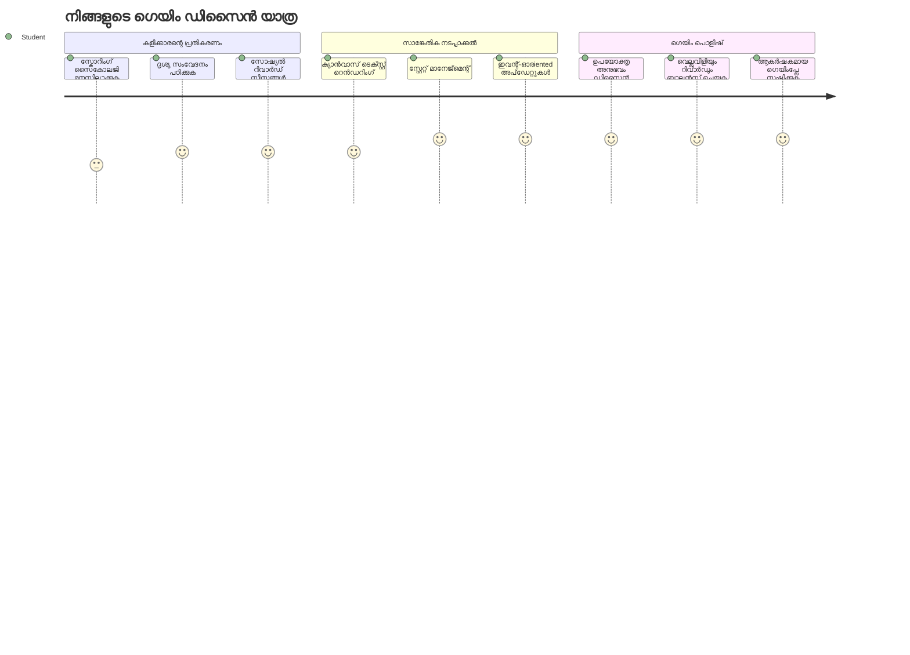
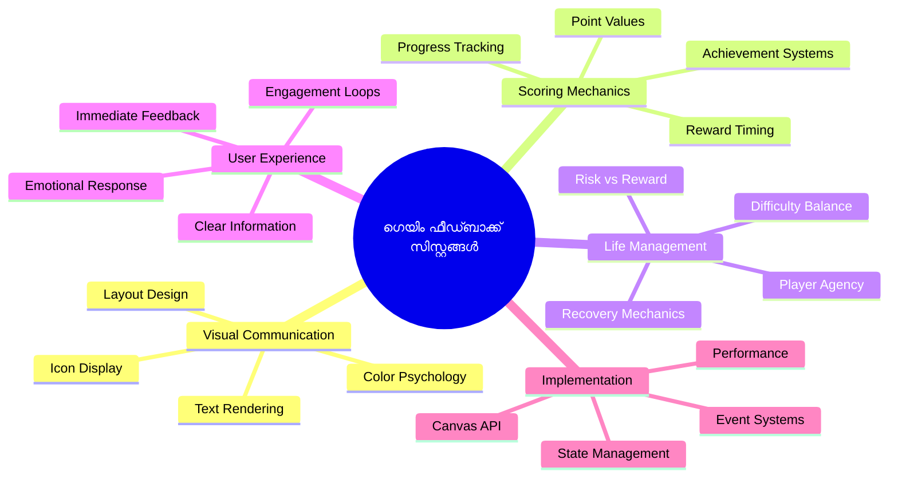
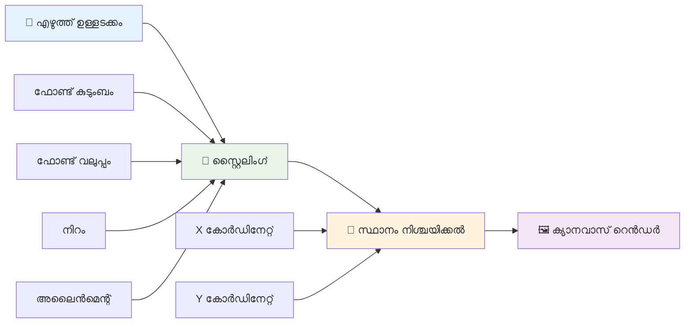
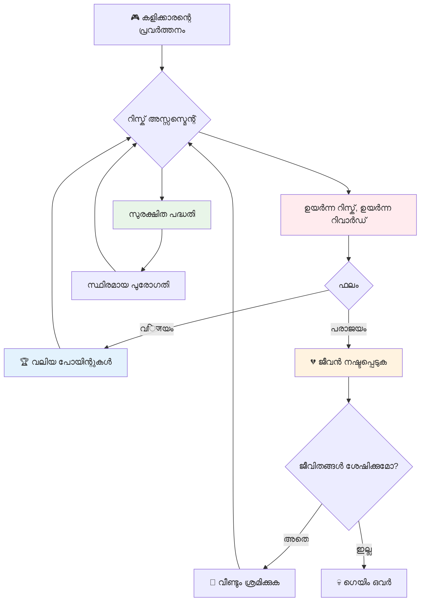
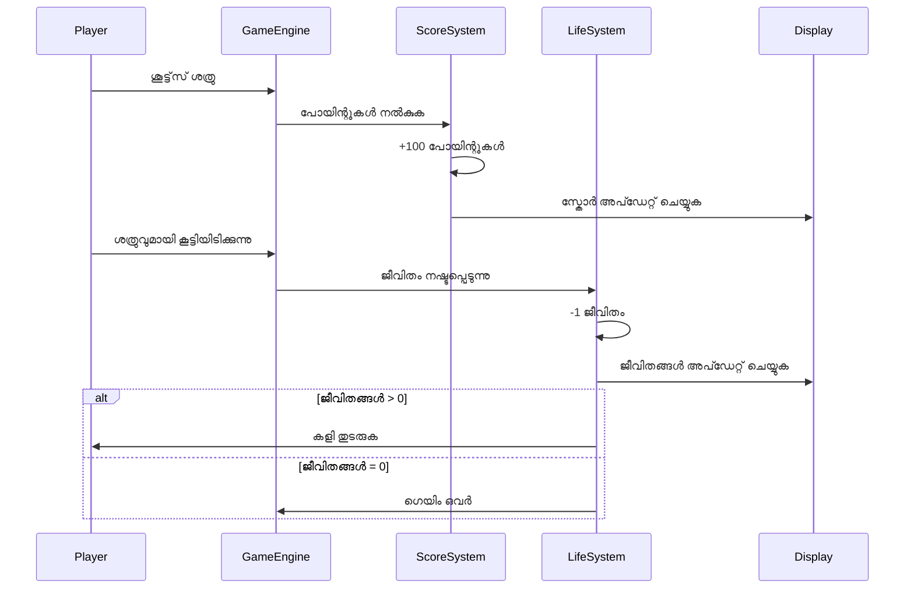
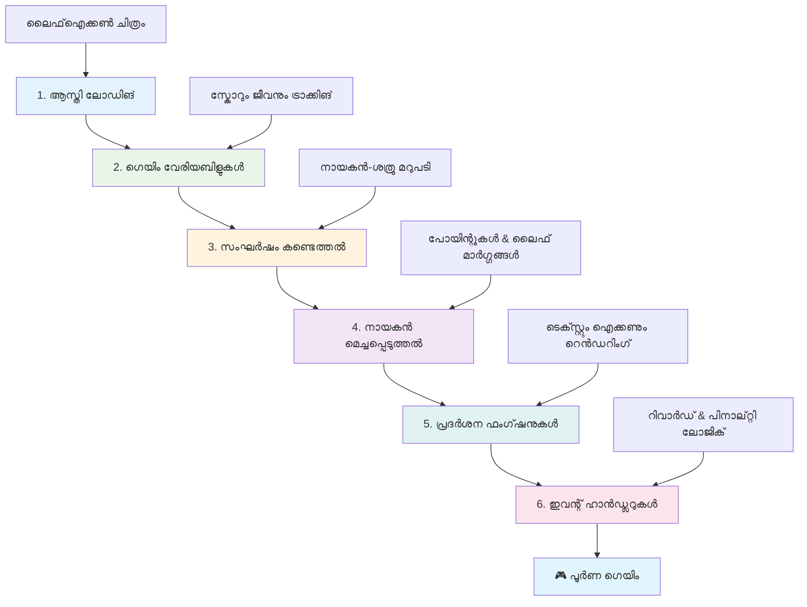
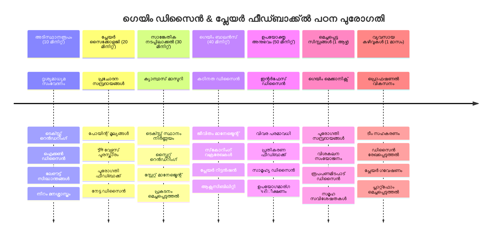

<!--
CO_OP_TRANSLATOR_METADATA:
{
  "original_hash": "2ed9145a16cf576faa2a973dff84d099",
  "translation_date": "2026-01-08T14:10:21+00:00",
  "source_file": "6-space-game/5-keeping-score/README.md",
  "language_code": "ml"
}
-->
# സ്പെയ്‌സ് ഗെയിം പണി 5: സ്കോറിംഗ് ആൻഡ് ലൈവ്‌സ്


## പ്രീ-ലെക്ചർ ക്വിസ്

[Pre-lecture quiz](https://ff-quizzes.netlify.app/web/quiz/37)

നിങ്ങളുടെ സ്പെയ്‌സ് ഗെയിം ഒരു യഥാർത്ഥ ഗെയിം പോലെ തോന്നാൻ സജ്ജമാണോ? പോയിന്റുകൾ ഉൾപ്പെടുത്തലും ലിവുകൾ മാനേജ്മെന്റും ചേർക്കാം - ആദ്യകാല ആർക്കേഡ് ഗെയിമുകൾ പോലുള്ള സ്പെയ്‌സ് ഇൻവേഡേഴ്സ് പോലുള്ള ലളിത പ്രദർശനങ്ങളിൽ നിന്ന് ആഡ്‌ഡിക്ക്ടീവ് എന്റർടെയ്ൻമെന്റിലേക്കുള്ള കോർ മെക്കാനിക്സുകൾ. ഇവിടെ നിങ്ങളുടെ ഗെയിം യഥാർത്ഥത്തിൽ കളിക്കാൻ പാടുള്ളതാകും.


## സ്‌ക്രീനിലെ ടെക്സ്റ്റ് വരയ്ക്കൽ - നിങ്ങളുടെ ഗെയിമിന്റെ ശബ്‌ദം

നിങ്ങളുടെ സ്കോർ പ്രദർശിപ്പിക്കാൻ, ക്യാൻവാസിൽ ടെക്സ്റ്റ് എങ്ങനെ റെണ്ടർ ചെയ്യാമെന്ന് പഠിക്കേണ്ടതാണ്. `fillText()` മെത്തഡ് ഇതിന് പ്രധാന ഉപകരണം - ക്ലാസ്സിക് ആർക്കേഡ് ഗെയിമുകളിൽ സ്കോർസ്, സ്റ്റാറ്റസ് വിവരങ്ങൾ കാണിക്കാനായി ഉപയോഗിച്ച സമാന സാങ്കേതിക വിദ്യ.


നിങ്ങൾക്ക് ടെക്സ്റ്റ് രൂപം പൂർണ്ണമായി നിയന്ത്രിക്കാം:

```javascript
ctx.font = "30px Arial";
ctx.fillStyle = "red";
ctx.textAlign = "right";
ctx.fillText("show this on the screen", 0, 0);
```

✅ [ക്യാൻവാസിൽ ടെക്സ്റ്റ് ചേർക്കൽ](https://developer.mozilla.org/docs/Web/API/Canvas_API/Tutorial/Drawing_text) കൂടുതൽ ദൈർഘ്യമേറിയ പഠനം എളുപ്പം ചെയ്യൂ - ഫോണ്ടുകളും സ്റ്റൈലിംഗും സംബന്ധിച്ചാൽ നിങ്ങൾക്ക് ഏറ്റവും സൃഷ്ടിപരമായ കാര്യങ്ങൾ കണ്ടെത്താൻ സാധിക്കും!

## ലൈവ്സ് - ഒരു സംഖ്യയെ വെറും നോക്കി മാത്രം കാണാതെ

ഗെയിം ഡിസൈനിൽ, "ലൈഫ്" എന്നത് പ്ലെയറുടെ പിഴവ് പാടവത്തിന് മാർജിന് ആണ്. ഈ ആശയം പിന്‍ബോൾ മെഷീനുകളിൽ നിന്ന് ഉദ്ഭവിച്ചു, അവിടെ നിങ്ങൾക്ക് കളിക്കാനായി പല ബോളുകളും ലഭിച്ചിരുന്നു. അഴ്സ്റ്റ്രോയിഡ്‌സ് പോലുള്ള ആദിമ വീഡിയോ ഗെയിമുകളിൽ, ലൈവുകൾ പ്ലെയർമാർക്ക് റിസ്കുകൾ എടുക്കാനും പിഴവുകളിൽ നിന്നു പഠിക്കാനും അനുവാദം നൽകി.


ദൃശ്യ പ്രതിനിധാനം വളരെ പ്രധാനമാണ് - "Lives: 3" എന്ന എഴുത്തിനേക്കാളും കപ്പല്‍ ഐകോണുകൾ പ്രദർശിപ്പിക്കുന്നത് ഉടൻ ദൃശ്യപര തിരിച്ചറിവു നൽകുന്നു, ഇത് ആദിമ ആർക്കേഡ് കാബിനറ്റുകൾ ഭാഷാ ബാരിയറുകളെ മറികടക്കാൻ ഐകോനോഗ്രഫി ഉപയോഗിച്ചതുപോലെ.

## നിങ്ങളുടെ ഗെയിമിന്റെ റിവാർഡ് സിസ്റ്റം നിർമ്മിക്കൽ

ഇപ്പോൾ നാം പ്ലെയർമാരെ ആകർഷിക്കുകയും നിരന്തരമായി ഉൾപ്പെടുത്തുകയും ചെയ്യുന്ന കോർ ഫീഡ്‌ബാക്ക് സിസ്റ്റങ്ങൾ നടപ്പിലാക്കാം:


- **സ്കോറിംഗ് സിസ്റ്റം**: ഓരോ നശിച്ച ശത്രു കപ്പലും 100 പോയിന്റ് നൽകുന്നു (ചുറ്റും പറ്റിയ സംഖ്യകൾ മental കണക്കാക്കാൻ എളുപ്പമാണ്). സ്കോർ സ്ക്രീന്റെ താഴ് വലത് കോണിൽ പ്രദർശിപ്പിക്കും.
- **ലൈഫ് കൗണ്ടർ**: നിങ്ങളുടെ ഹീറോ മൂന്നു ലൈവുകളുമായാണ് ആരംഭിക്കുക - ആദിമ ആർക്കേഡ് ഗെയിമുകൾ സ്ഥാപിച്ച സ്റ്റാൻഡേർഡ്, ഈ ചെറിയ সংখ্যা പ്ലേയ്‌ബിലിറ്റിക്കൊപ്പം വെല്ലുവിളി കൂട്ടുന്നു. ഓരോ ശത്രു കൂട്ടിയിടിപ്പും ഒരു ലൈഫ് നഷ്ടപ്പെടുന്നു. ബാക്കിയുള്ള ലൈവുകൾ താഴ് വലതു കോണിൽ കപ്പൽ ഐക്കണുകളിലായി (  ) കാണിക്കും.

## നമുക്ക് ആരംഭിക്കാം!

ആദ്യമായി, നിങ്ങളുടെ വർക്ക്സ്‌പേസ് സജ്ജമാക്കൂ. `your-work` സബ് ഫോൾഡറിലുള്ള ഫയലുകളിലേക്ക് നയിക്കൂ. നിങ്ങൾക്ക് താഴെ കാണുന്ന ഫയലുകൾ കാണാനാകും:

```bash
-| assets
  -| enemyShip.png
  -| player.png
  -| laserRed.png
-| index.html
-| app.js
-| package.json
```

നിങ്ങളുടെ ഗെയിം ടെസ്റ്റ് ചെയ്യുന്നതിന്, `your_work` ഫോൾഡറിൽ നിന്ന് ഡെവലപ്പ്മെന്റ് സർവർ തുടങ്ങി:

```bash
cd your-work
npm start
```

ഇത് `http://localhost:5000` എന്ന ലൊക്കൽ സെർവർ പ്രവർത്തിപ്പിക്കും. നിങ്ങളുടെ ബ്രൗസറിൽ ഈ അഡ്രസ് തുറക്കൂ. കോണ്ട്രോളുകൾ അരോ കീകൾ ഉപയോഗിച്ച് പരീക്ഷിച്ച്, ശത്രുക്കളെ വെടിവെച്ചു പരിശോധിക്കൂ എല്ലാ പ്രവർത്തനങ്ങളും ശരിയായിട്ടാണെന്ന്.


### കോഡ് എഴുതാൻ സമയം!

1. **ആവശ്യമുള്ള ദൃശ്യ വസ്തുക്കൾ പിടിക്കുക**. `solution/assets/` ഫോൾഡറിൽ നിന്നുള്ള `life.png` ആസ്തി നിങ്ങളുടെ `your-work` ഫോൾഡറിൽ കോപ്പി ചെയ്യുക. പിന്നീട് lifeImg നിങ്ങളുടെ window.onload ഫังก്ഷനിൽ ചേർക്കുക:

    ```javascript
    lifeImg = await loadTexture("assets/life.png");
    ```

1. `lifeImg` നിങ്ങളുടെ ആസ്തി ലിസ്റ്റിൽ ചേർക്കുന്നത് മറക്കരുത്:

    ```javascript
    let heroImg,
    ...
    lifeImg,
    ...
    eventEmitter = new EventEmitter();
    ```
  
2. **ഗെയിം വേരിയബിളുകൾ സജ്ജമാക്കുക**. മൊത്തം സ്കോർ (0 മുതൽ തുടങ്ങിയ) ഒപ്പം ശേഷിച്ച ലൈവുകൾ (3 മുതൽ) ട്രാക്ക് ചെയ്യാൻ ചില കോഡ് ചേർക്കുക. ഞങ്ങൾ ഇത് സ്ക്രീനിൽ പ്രദർശിപ്പിക്കും, എന്നിങ്ങനെ പ്ലേയേഴ്സ് എവിടെ നിന്നാണ് എന്ന് അറിയാം.

3. **കാളിഷൻ ഡിറ്റക്ഷൻ നടപ്പിലാക്കുക**. ശത്രുക്കൾ നിങ്ങളുടെ ഹീറോയുമായുള്ള കൂട്ടിയിടിപ്പുകൾ കണ്ടെത്താൻ `updateGameObjects()` ഫംഗ്ഷൻ വ്യാപിപ്പിക്കുക:

    ```javascript
    enemies.forEach(enemy => {
        const heroRect = hero.rectFromGameObject();
        if (intersectRect(heroRect, enemy.rectFromGameObject())) {
          eventEmitter.emit(Messages.COLLISION_ENEMY_HERO, { enemy });
        }
      })
    ```

4. **ഹീറോയിലേക്ക് ലൈഫ്, പോയിന്റ് ട്രാക്കിങ് ചേർക്കുക**.
   1. **കൗണ്ടറുകൾ ആരംഭിക്കുക**. നിങ്ങളുടെ `Hero` ക്ലാസിലുന് `this.cooldown = 0` താഴെ, ലൈഫ്, പോയിന്റുകൾ സജ്ജമാക്കൂ:

        ```javascript
        this.life = 3;
        this.points = 0;
        ```

   1. **ഈ മൂല്യങ്ങൾ പ്ലെയറിന് കാണിക്കുക**. സ്‌ക്രീനിൽ ഇതൊക്കെ വരയ്ക്കാൻ ഫംഗ്ഷനുകൾ സൃഷ്ടിക്കുക:

        ```javascript
        function drawLife() {
          // ചെയ്യാനുള്ളത്, 35, 27
          const START_POS = canvas.width - 180;
          for(let i=0; i < hero.life; i++ ) {
            ctx.drawImage(
              lifeImg, 
              START_POS + (45 * (i+1) ), 
              canvas.height - 37);
          }
        }
        
        function drawPoints() {
          ctx.font = "30px Arial";
          ctx.fillStyle = "red";
          ctx.textAlign = "left";
          drawText("Points: " + hero.points, 10, canvas.height-20);
        }
        
        function drawText(message, x, y) {
          ctx.fillText(message, x, y);
        }

        ```

   1. **എല്ലാം ഗെയിം ലൂപിൽ കണക്ട് ചെയ്യുക**. `updateGameObjects()` ന് ശേഷം നിങ്ങളുടെ window.onload ഫംഗ്ഷനിൽ ഈ ഫംഗ്ഷനുകൾ ചേർക്കുക:

        ```javascript
        drawPoints();
        drawLife();
        ```

### 🔄 **പഠനചെക്ക്-ഇൻ**  
**ഗെയിം ഡിസൈൻ ഗ്രഹിക്കൽ**: പ്രത്യാഘാതങ്ങളും ഫലങ്ങളും നടപ്പിലാക്കുന്നതിനു മുമ്പ്:
- ✅ ദൃശ്യ ഫീഡ്‌ബാക്ക് ഗെയിം സ്റ്റേറ്റ് പ്ലയർമാർക്ക് എങ്ങനെ അറിയിക്കുന്നു
- ✅ UI ഘടകങ്ങളുടെ സ്ഥിരത യുസബിൾ ആയിരിക്കാൻ എങ്ങനെ സഹായിക്കുന്നു
- ✅ പോയിന്റ് മൂല്യങ്ങളും ലൈഫ് മാനേജ്മെന്റ് പിന്നെയുള്ള മനോവശേഷി
- ✅ ക്യാൻവാസ് ടെക്സ്റ്റ് റെണ്ടറിങ്ങിന്റെ HTML ടെക്സ്റ്റിൽ നിന്ന് വ്യത്യാസം

**വേഗം സ്വയംപരിശോധനം**: ആർക്കേഡ് ഗെയിമുകൾ സാധാരണയായി പോയിന്റ് മൂല്യങ്ങൾക്ക് ചുറ്റുപാട് സംഖ്യകൾ ഉപയോഗിക്കുന്നത് എന്തുകൊണ്ട്?  
*ഉത്തരം: ചുറ്റുപാട് സംഖ്യകൾ കണക്കാക്കാൻ എളുപ്പമാണ്, മനസ്സിലേക്ക് സമ്മതസ്ഥായമായ പ്രതിഫലങ്ങൾ നൽകുന്നു*

**ഉപയോക്തൃ അനുഭവത്തിന്റെ സിദ്ധാന്തങ്ങൾ**:
- **ദൃശ്യ ക്രമീകരണം**: പ്രധാന വിവരങ്ങൾ പ്രാമുഖ്യത്തോടെ കാണിക്കുക
- **തക്ഷണ പ്രതികരണം**: പ്ലെയർ പ്രവർത്തനങ്ങൾക്ക് റിയൽ-ടൈം അപ്‌ഡേറ്റുകൾ
- **സങ്കല്പ ചുമതും മനോവിജ്ഞാനവും**: ലളിതവും വ്യക്തവുമായ വിവര പ്രദർശനം
- **ഭാവന രൂപകൽപ്പന**: ഐക്കണുകളും നിറങ്ങളും പ്ലെയർ ബന്ധം ഓർമ്മപ്പെടുത്തുന്നു

1. **ഗെയിം ഫലം പ്രവൃത്തിയിൽ വരുത്തുക**. ഇപ്പോൾ പ്ലെയർ പ്രവർത്തനങ്ങൾ അസൽ‌മാർത്തമാക്കുന്ന ഫീഡ്‌ബാക്ക് സിസ്റ്റങ്ങൾ ചേർക്കാം:

   1. **കാളിഷൻ പാലിക്കുന്നത് ലൈഫ് നഷ്ടപ്പെടുന്നത് ആക്കുന്നു**. നിങ്ങളുടെ ഹീറോ ഒരു ശത്രുവിനോടു കൂട്ടിയിടിച്ചാൽ ഒരുങ്ങി ഒരു ലൈഫ് നഷ്ടപ്പെടും.

      ഈ മെത്തഡ് നിങ്ങളുടെ `Hero` ക്ലാസിൽ ചേർക്കുക:

        ```javascript
        decrementLife() {
          this.life--;
          if (this.life === 0) {
            this.dead = true;
          }
        }
        ```

   2. **ശത്രുക്കളെ വെടിവെക്കുന്നതിൽ പോയിന്റുകൾ നേടും**. ഓരോ വിജയകരമായ ഷോട്ട് 100 പോയിന്റ് നൽകുന്നു, കൃത്യമായ ഷൂട്ടിങ്ങിന് തಕ್ಷಣ ഫലപ്രദമായ പോസിറ്റീവ് ഫീഡ്‌ബാക്ക്.

      നിങ്ങളുടെ Hero ക്ലാസിൽ മറ്റു മെത്തഡായി ഇത് ചേർക്കുക:
    
        ```javascript
          incrementPoints() {
            this.points += 100;
          }
        ```

        ഇനി ഈ ഫംഗ്ഷനുകൾ നിങ്ങളുടെ കൂട്ടിയിടിപ്പ് ഇവന്റുകളുമായി ബന്ധിപ്പിക്കുക:

        ```javascript
        eventEmitter.on(Messages.COLLISION_ENEMY_LASER, (_, { first, second }) => {
           first.dead = true;
           second.dead = true;
           hero.incrementPoints();
        })

        eventEmitter.on(Messages.COLLISION_ENEMY_HERO, (_, { enemy }) => {
           enemy.dead = true;
           hero.decrementLife();
        });
        ```

✅ ജാവാസ്ക്രിപ്റ്റും ക്യാൻവാസും ഉപയോഗിച്ച് നിർമ്മിച്ച മറ്റു ഗെയിമുകളെക്കുറിച്ച് അറിയാൻ ആഗ്രഹമുണ്ടോ? കുറച്ച് തിരയൂ - നിങ്ങൾക്കു ആശ്ചര്യം തോന്നും!

ഈ പ്രവർത്തനങ്ങൾ നടപ്പിലാക്കിയതിന് ശേഷം ഗെയിം ടെസ്റ്റ് ചെയ്ത് മുഴുവൻ ഫീഡ്‌ബാക്ക് സിസ്റ്റം പ്രവർത്തനം പരിശോധിക്കൂ. താഴ് വലതു ലൈഫ് ഐക്കണുകൾ കാണിച്ചിരിക്കും, ബാക്ക് ഡോക്ടർ സ്കോർ താഴ് ഇടത് കാണും, കൂട്ടിയിടുപ്പ് ലൈവ് കുറയ്ക്കുമ്പോഴും വിജയകരമായ ഷോട്ടുകൾ സ്കോർ കൂട്ടുമ്പോഴും കാണാം.

നിങ്ങളുടെ ഗെയിം ആദ്യകാല ആർക്കേഡ് ഗെയിമുകൾ പോലെ പ്രേരകവും വ്യക്തവും ആകുന്നതിന് ആവശ്യമായ കോർ മെക്കാനിക്സുകൾ ഉൾക്കൊള്ളുന്നു - വ്യക്തമുളള ലക്ഷ്യങ്ങൾ, തത്സമയം ഫീഡ്‌ബാക്ക്, പ്ലെയർ പ്രവർത്തനങ്ങൾക്ക് ഫലം കാണിക്കൽ.

### 🔄 **പഠനചെക്ക്-ഇൻ**  
**പരിപൂർണ്ണ ഗെയിം ഡിസൈൻ സിസ്റ്റം**: പ്ലെയർ ഫീഡ്‌ബാക്ക് തന്റെ മേൽനോട്ടം ഉറപ്പാക്കുക:  
- ✅ സ്കോറിംഗ് മെക്കാനിസങ്ങൾ പ്ലെയർ പ്രേരണയും ഉൾപ്പെടും സംഭവിപ്പിക്കുന്നത് എങ്ങനെ?  
- ✅ ദൃശ്യ സ്ഥിരത യൂസർ ഇന്റർഫേസ് ഡിസൈനിൽ എങ്ങനെ പ്രാധാന്യമാർന്നതാണ്?  
- ✅ ലൈഫ് സിസ്റ്റം വെല്ലുവിളിയും പ്ലെയർ നിലനിർത്തലും എങ്ങനെ ബലൻസ് ചെയ്യുന്നു?  
- ✅ തൽക്ഷണ ഫീഡ്‌ബാക്ക് സുഖപ്രദമായ ഗെയിംപ്ലേ സൃഷ്ടിക്കുവാൻ എന്താണ് പങ്ക്?

**സിസ്റ്റം സംയോജനം**: നിങ്ങളുടെ ഫീഡ്‌ബാക്ക് സംവിധാനം കാണിച്ചു തരുന്നത്:  
- **ഉപയോക്തൃ അനുഭവം ഡിസൈൻ**: വ്യക്തവും മികവുറ്റ ദൃശ്യ സമ്പ്രേഷണം  
- **ഇവന്റ്-ഡ്രൈവ് ആർകിടെക്ചർ**: പ്ലെയർ പ്രവർത്തനങ്ങൾക്ക് ഫലപ്രദമായ അപ്‌ഡേറ്റുകൾ  
- **സംസ്ഥിതി മാനേജ്മെന്റ്**: ഡൈനാമിക് ഗെയിം ഡാറ്റ ട്രാക്ക് ചെയ്യ অল  
- **ക്യാൻവാസ് മാസ്റ്ററി**: ടെക്സ്റ്റ് റെണ്ടറിംഗ്, സ്പ്രൈറ്റ് സ്ഥാനം  
- **ഗെയിം സൈക്കോളജി**: പ്ലെയർ പ്രേരണയും ഉൾപ്പെടുത്തലും മനസ്സിലാക്കൽ

**പ്രൊഫഷണൽ പാറ്റേണുകൾ**: നിങ്ങൾ നടപ്പിലാക്കിയിരിക്കുന്നത്:  
- **MVC ആർകിടെക്ചർ**: ഗെയിം ലോജിക്, ഡാറ്റ, പ്രദർശനം വേർതിരിച്ച സ്വഭാവം  
- **ഓബ്ജർവർ പാറ്റേൺ**: ഗെയിം സ്റ്റേറ്റ് മാറ്റങ്ങൾക്ക് ഇവന്റ്-ഡ്രൈവ് അപ്‌ഡേറ്റുകൾ  
- **കമ്പോണന്റ് ഡിസൈൻ**: റെൻഡറിങ്, ലോജിക് വീണ്ടും ഉപയോഗിക്കാവുന്ന ഫംഗ്ഷൻ  
- **പ്രദർശന മെച്ചപ്പെടുത്തൽ**: ഗെയിം ലൂപ്പുകളിൽ ഫലപ്രദമായ റെന്ററിംഗ്

### ⚡ **അടുത്ത 5 മിനിറ്റിൽ നിങ്ങൾ ചെയ്യാൻ കഴിയുന്നത്**  
- [ ] സ്കോർ പ്രദർശനത്തിന് വ്യത്യസ്ത ഫോണ്ട് വലിപ്പങ്ങളും നിറങ്ങളും പരീക്ഷിക്കുക  
- [ ] പോയിന്റ് മൂല്യങ്ങൾ മാറ്റി ഗെയിംപ്ലേ അനുഭവം എങ്ങനെ മാറുന്നു చూడുക  
- [ ] പോയിന്റ്, ലൈഫ് മാറ്റം ട്രാക്ക് ചെയ്യാൻ console.log സ്റ്റേറ്റ്മെന്റുകൾ ചേർക്കുക  
- [ ] ലൈഫുകൾหมดതായാലോ ഉയർന്ന സ്കോറ് നേടുന്നതിന്റെയും എഡ്ജ് കേസ് പരീക്ഷണം

### 🎯 **ഈ മണിക്കൂറിൽ നിങ്ങൾ കൈവരിക്കാൻ കഴിയും**  
- [ ] പോസ്റ്റ്-ലെസൺ ക്വിസ് പൂർത്തിയാക്കി ഗെയിം ഡിസൈൻ സൈക്കോളജി മനസിലാക്കുക  
- [ ] സ്കോറിംഗ്, ലൈഫ് നഷ്ടപരിഹാരത്തിന് ശബ്ദഫലങ്ങൾ ചേർക്കുക  
- [ ] localStorage ഉപയോഗിച്ച് ഹൈ സ്കോർ സിസ്റ്റം നടപ്പിലാക്കുക  
- [ ] വ്യത്യസ്ത ശത്രു തരം ലെ വ്യത്യസ്ത പോയിന്റ് മൂല്യങ്ങൾ ചേർക്കുക  
- [ ] ലൈഫ് നഷ്ടമായപ്പോൾ സ്‌ക്രീൻ ഷെയ്ക്ക് പോലുള്ള ദൃശ്യ പ്രഭാകങ്ങൾ ചേർക്കുക

### 📅 **നിങ്ങളുടെ ആഴ്ചപ്പ-long ഗെയിം ഡിസൈൻ ജേർണി**  
- [ ] എതാണ് ഞയ്ക്ക് പൂർണ്ണമായ സ്പെയ്‌സ് ഗെയിം പരിപൂർണ്ണ ഫീഡ്‌ബാക്ക് സിസ്റ്റങ്ങൾ  
- [ ] കംബോ മൾടിപ്പ്ലയറുകൾ പോലുള്ള അത്യാധുനിക സ്കോറിംഗ് മെക്കാനികുകൾ നടപ്പിലാക്കുക  
- [ ] അച്ചിവ്മെന്റുകളും അൺലോക്കബിൾ ഉള്ളടക്കവും ചേർക്കുക  
- [ ] ദുർത്തിയ പ്രോഗ്രഷൻ, ബാലൻസിംഗ് സിസ്റ്റങ്ങൾ രൂപകൽപ്പന ചെയ്യുക  
- [ ] മെനു, ഗെയിം ഒവർ സ്‌ക്രീനുകളുടെ UI രൂപകൽപ്പന  
- [ ] വിവിധ ഗെയിമുകൾ പഠിച്ച് ഉൾപ്പെടെ മെക്കാനിസങ്ങൾ മനസിലാക്കുക

### 🌟 **നിങ്ങളുടെ മാസം-നീളെയുള്ള ഗെയിം ഡവലപ്പ്മെന്റ് മാസ്റ്ററി**  
- [ ] സമ്പൂർണ്ണ ഗെയിമുകൾ നിർമ്മിച്ച് സുപ്രധാന പ്രോഗ്രഷൻ സിസ്റ്റങ്ങൾ  
- [ ] ഗെയിം അനലിറ്റിക്സ്, പ്ലെയർ പെരുമാറ്റം അളക്കൽ പഠിക്കുക  
- [ ] ഓപ്പൺ സോഴ്‌സ് ഗെയിം ഡവലപ്പ്മെന്റ് പ്രോജക്ടുകളിലേക്ക് സംഭാവന നൽകുക  
- [ ] ഉയർന്ന തലത്തിലുള്ള ഗെയിം ഡിസൈൻ പാറ്റേണുകൾ, മണിറ്റൈസേഷൻ  
- [ ] ഗെയിം ഡിസൈൻ, ഉപയോക്തൃ അനുഭവത്തെക്കുറിച്ചുള്ള വിദ്യാഭ്യാസ ഉള്ളടക്കം സൃഷ്ടിക്കുക  
- [ ] ഗെയിം ഡിസൈൻ, ഡവലപ്പ്മെന്റ് സkillset നിരൂപണം ഉൾപ്പെടുന്ന പോർട്ട്ഫോളിയോ നിർമ്മിക്കുക

## 🎯 നിങ്ങളുടെ ഗെയിം ഡിസൈൻ മാസ്റ്ററി ടൈംലൈൻ


### 🛠️ നിങ്ങളുടെ ഗെയിം ഡിസൈൻ ടൂൾകിറ്റ് സംഗ്രഹം

ഈ പാഠമൂലം പൂർത്തിയാക്കിയതിന് ശേഷം നിങ്ങൾക്ക് താഴെക്കാലത്തേക്കുള്ള വൈദഗ്ധ്യം ലഭിച്ചു:  
- **പ്ലെയർ സൈക്കോളജി**: പ്രേരണ, റിസ്ക്/റിവാർഡ്, ഉൾപ്പെടുത്തലുകളുടെ ലൂപ്പുകൾ  
- **ദൃശ്യ സമ്പ്രേക്ഷണം**: ടെക്സ്റ്റ്, ഐക്കൺസ്, ലെയൗട്ട് ഉപയോഗിച്ച ഫലപ്രദ UI  
- **ഫീഡ്‌ബാക്ക് സിസ്റ്റങ്ങൾ**: പ്ലെയർ പ്രവർത്തനങ്ങൾക്കും ഗെയിം ഇവന്റുകൾക്കും തൽക്ഷണ പ്രതികരണം  
- **സംസ്ഥിതി മാനേജ്മെന്റ്**: ഡൈനാമിക് ഗെയിം ഡാറ്റ ഫലപ്രദമായി ട്രാക്ക് ചെയ്യൽ  
- **ക്യാൻവാസ് ടെക്സ്റ്റ് റെണ്ടറിംഗ്**: പ്രൊഫഷണൽ സ്റ്റൈലും സ്ഥിതനിർണ്ണയവും ഉള്ള ടെക്സ്റ്റ് പ്രദർശനം  
- **ഇവന്റ് ഇന്റഗ്രേഷൻ**: ഉപയോക്തൃ പ്രവർത്തനങ്ങളുമായി ഫലംössüyor കണക്ട് ചെയ്യൽ  
- **ഗെയിം ബാലൻസ്**: വെല്ലുവിളി വളയങ്ങളും പ്ലെയർ പ്രോഗ്രഷൻ സിസ്റ്റങ്ങളും രൂപകൽപ്പന

**യഥാർത്ഥ ലോക ആപ്ലിക്കേഷനുകൾ**:  
- **യുസർ ഇന്റർഫേസ് ഡിസൈൻ**: ആകർഷകവും ഇൻറ്യൂട്ടീവ് അനുഭവങ്ങൾ സൃഷ്ടിക്കൽ  
- **ഉൽപ്പന്ന വികസനം**: ഉപയോക്തൃ പ്രേരണയും ഫീഡ്‌ബാക്ക് ലൂപ്പുകളും മനസിലാക്കൽ  
- **വിദ്യാഭ്യാസ ടെക്നോളജി**: ഗാമിഫിക്കേഷൻ, പഠന ഉൾപ്പെടുത്തൽ സിസ്റ്റങ്ങൾ  
- **ഡാറ്റാ വിസ്വലൈസേഷൻ**: ക്ലിഷ്ടമായ വിവരങ്ങൾ ആക്സസിബിൾ ആയി മാറ്റൽ  
- **മൊബൈൽ ആപ്പ് ഡവലപ്പ്മെന്റ്**: റിട്ടെൻഷൻ മെക്കാനിക്‌സ്, ഉപയോക്തൃ അനുഭവ രൂപകൽപ്പന  
- **മാർക്കറ്റിംഗ് ടെക്നോളജി**: ഉപയോക്തൃ പെരുമാറ്റവും കൺവേർഷൻ മെച്ചപ്പെടുത്തൽ

**പ്രൊഫഷണൽ സ്കിൽസുകൾ**:  
- **ഡിസൈൻ** ഉപയോക്തൃ അനുഭവങ്ങൾ പ്രേരിപ്പിക്കുന്നതിനും ഉൾപ്പെടുത്തുന്നതിനും  
- **നടപ്പിലാക്കുക** ഫീഡ്‌ബാക്ക് സിസ്റ്റങ്ങൾ ഫലപ്രദമായി ഉപയോക്തൃ പെരുമാറ്റം ഗൈഡ് ചെയ്യാൻ  
- **ബാലൻസ്** വെല്ലുവിളിയും ആക്സസിബിലിറ്റിയും ഇന്ററാക്റ്റീവ് സിസ്റ്റങ്ങൾ  
- **സൃഷ്ടിക്കുക** ദൃശ്യ സമ്പ്രേക്ഷണം വ്യത്യസ്ത ഉപയോക്തൃ ഗ്രൂപ്പുകൾക്കായി  
- **വിശകലനം** ഉപയോക്തൃ പെരുമാറ്റം, ഡിസൈൻ മെച്ചപ്പെടുത്തലുകൾ

**ഗെയിം ഡവലപ്പ്മെന്റ് കോൺസെപ്റ്റുകൾ**:  
- **പ്ലെയർ പ്രേരണ**: പ്രവേശനം, തുടർച്ച മനസിലാക്കുക  
- **ദൃശ്യ ഡിസൈൻ**: വ്യക്തവും ആകര്‍ഷകവുമായ ഫംഗ്ഷണൽ ഇന്റർഫേസുകൾ  
- **സിസ്റ്റം സംയോജനം**: ഒത്തുചേരുന്ന അനുഭവത്തിന് ഗെയിം സിസ്റ്റങ്ങൾ ബന്ധിപ്പിക്കൽ  
- **പ്രവർത്തനം മെച്ചപ്പെടുത്തൽ**: എഫിഷ്യന്റ് റെണ്ടറിംഗ്, സ്റ്റേറ്റ് മാനേജ്മെന്റ്  
- **ആക്സസിബിലിറ്റി**: വ്യത്യസ്ത കഴിവ് തലങ്ങളും പ്ലെയർ ആവശ്യങ്ങൾക്കായുള്ള ഡിസൈൻ

**അടുത്ത ഘട്ടം**: നിങ്ങൾക്ക് ആഡ്വാൻസ്ഡ് ഗെയിം ഡിസൈൻ പാറ്റേണുകൾ ആഴത്തിൽ പഠിക്കാനും, അനലിറ്റിക് സിസ്റ്റങ്ങൾ നടപ്പിലാക്കാനും, ഗെയിം മണിറ്റൈസേഷൻ, പ്ലെയർ റിട്ടെൻഷൻ സ്ട്രാറ്റജികൾ വിശകലനം ചെയ്യാനുമാണ് തയ്യാറാണ്!

🌟 **അചീവ്മെന്റ് അൺലോക്കിങ്**: പ്രൊഫഷണൽ ഗെയിം ഡിസൈൻ സിദ്ധാന്തങ്ങളാൽ സമ്പൂർണ്ണ പ്ലെയർ ഫീഡ്‌ബാക്ക് സിസ്റ്റം നിങ്ങൾ നിർമ്മിച്ചു!

---

## GitHub Copilot ഏജന്റ് ചലഞ്ച് 🚀

ഏജന്റ് മോഡ് ഉപയോഗിച്ച് താഴെ പറയുന്ന ചലഞ്ച് പൂർത്തിയാക്കുക:

**വിവരണം:** സ്പെയ്‌സ് ഗെയിമിന്റെ സ്കോറിംഗ് സിസ്റ്റം വികസിപ്പിച്ച് ഹൈ സ്കോർ ഫീച്ചർ സ്ഥിരമായി സംഭരിക്കുന്ന സാങ്കേതികവിദ്യയും ബോണസ് പോയിന്റ് മെക്കാനിസവും നടപ്പിലാക്കുക.

**പ്രോംപ്റ്റ്:** പ്ലെയറുടെ മികച്ച സ്കോർ localStorage-ലേക്ക് സൂക്ഷിക്കുന്ന ഹൈസ്കോർ സിസ്റ്റം സൃഷ്ടിക്കുക. തുടര്‍ച്ചയായ ശത്രു വധങ്ങൾക്ക് ബോണസ് പോയിന്റ് (കംബോ സിസ്റ്റം) ചേർക്കുക, വ്യത്യസ്ത ശത്രു തരങ്ങൾക്ക് അഭിന്ന point മൂല്യങ്ങൾ നടപ്പിലാക്കുക. പ്ലെയർ പുതിയ ഹൈസ്കോർ നേടിയപ്പോൾ ദൃശ്യ സൂചന നൽകുകയും നിലവിലെ ഹൈസ്കോർ ഗെയിം സ്‌ക്രീനിൽ പ്രദർശിപ്പിക്കുകയും ചെയ്യുക.

## 🚀 ചലഞ്ച്

ഇപ്പോൾ നിങ്ങൾക്ക് സ്കോറിംഗ്, ലൈവുകളോടെ പ്രവർത്തനക്ഷമമായ ഗെയിം ഉണ്ടായിട്ടുണ്ട്. പ്ലെയർ അനുഭവം മെച്ചപ്പെടുത്താനുള്ള അധിക ഫീച്ചറുകൾ എന്തൊണെന്ന് പരിഗണിക്കൂ.

## പോസ്റ്റ്-ലെക്ചർ ക്വിസ്

[Post-lecture quiz](https://ff-quizzes.netlify.app/web/quiz/38)

## റിവ്യൂ & സ്വയം പഠനം

കൂടുതൽ അറിയാൻ ആഗ്രഹമുണ്ടോ? ഗെയിം സ്കോറിംഗും ലൈഫ് സിസ്റ്റവും സംബന്ധിച്ച വ്യത്യസ്ത സമീപനങ്ങൾ പരിശോധിക്കൂ. [PlayFab](https://playfab.com) പോലുള്ള ആകർഷകമായ ഗെയിം എൻജിനുകൾ സ്കോറിംഗ്, ലീഡ്‌ബോർഡുകൾ, പ്ലെയർ പ്രോഗ്രഷൻ എന്നിവ കൈകാര്യം ചെയ്യുന്നു. അതുപോലേന്ത integrating ചെയ്യുന്നത് നിങ്ങളുടെ ഗെയിം അടുത്ത തലത്തിലേക്ക് എങ്ങനെ കൊണ്ടുപോകും എന്നു ചിന്തിക്കൂ.

## അസൈൻമെന്റ്

[Build a Scoring Game](assignment.md)

---

<!-- CO-OP TRANSLATOR DISCLAIMER START -->
**അസൂയ കുറിപ്പ്**:  
ഈ ഡോക്യുമെന്റ് AI പരിഭാഷ сервисായ [Co-op Translator](https://github.com/Azure/co-op-translator) ഉപയോഗിച്ച് പരിഭാഷ ചെയ്തിരിക്കുന്നു. നാം കൃത്യതയ്ക്കായി ശ്രമിച്ചുവെങ്കിലും, ആട്ടോമേറ്റഡ് വിവർത്തനങ്ങളിൽ പിഴവുകൾ അല്ലെങ്കിൽ അസത്യതകൾ ഉണ്ടാകാം എന്നത് ശ്രദ്ധിക്കുക. അസൽ ഡോക്യുമെന്റ് അതിന്റെ സ്വതന്ത്ര ഭാഷയിലുള്ളത് പ്രാമാണിക സ്രോതസ്സ് എന്നായി പരിഗണിക്കണം. നിർണ്ണായകമായ വിവരങ്ങൾക്ക് പ്രൊഫഷണൽ മനുഷ്യ പരിഭാഷ നിർദ്ദേശിക്കുന്നു. ഈ വിവർത്തനം ഉപയോഗിക്കുന്നത് കൊണ്ട് ഉണ്ടായ ഏതെങ്കിലും തെറ്റിദ്ധാരണക്കോ തെറ്റായ വ്യാഖ്യാനംക്കോ ഞങ്ങൾ ഉത്തരവാദിത്വമെടുത്തിരിക്കില്ല.
<!-- CO-OP TRANSLATOR DISCLAIMER END -->