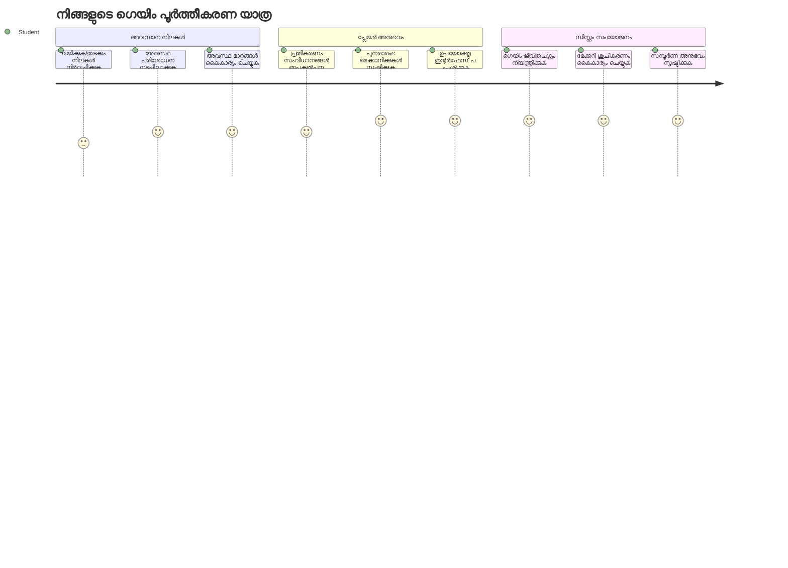
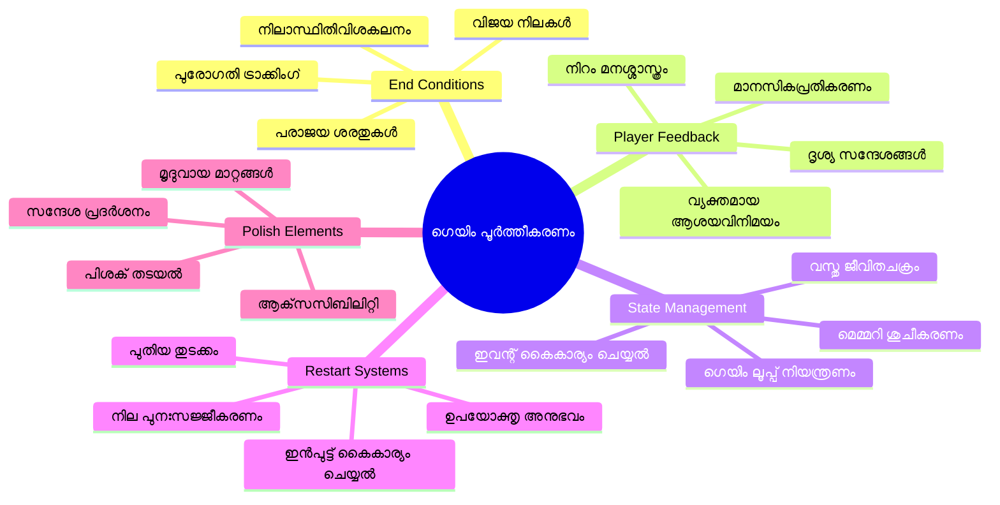
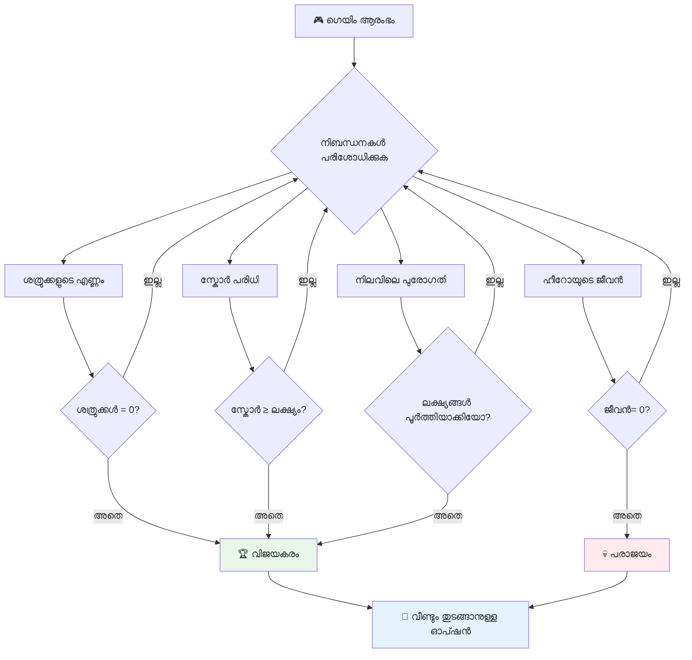
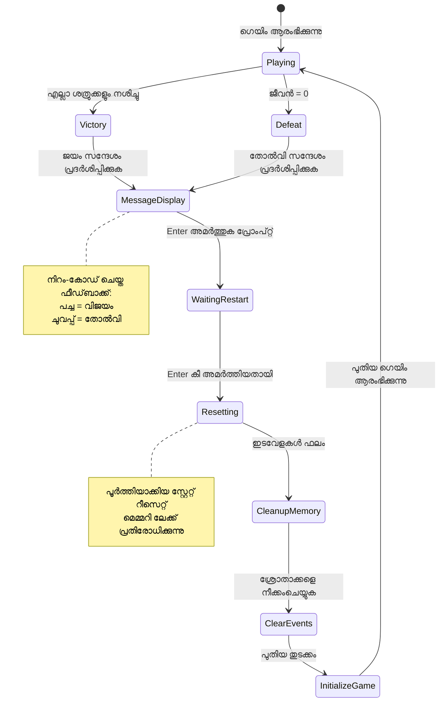
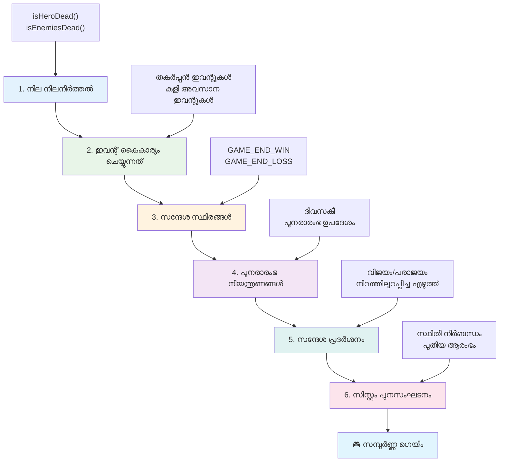
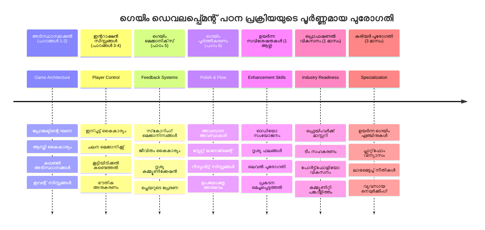

<!--
CO_OP_TRANSLATOR_METADATA:
{
  "original_hash": "a4b78043f4d64bf3ee24e0689b8b391d",
  "translation_date": "2026-01-08T13:53:10+00:00",
  "source_file": "6-space-game/6-end-condition/README.md",
  "language_code": "ml"
}
-->
# ബിൽഡ് എ സ്‌പേസ് ഗെയിം ഭാഗം 6: അവസാനവും പുനരാരംഭവും


ഏല്പ്പെട്ട ഗെയിമുകൾക്കു് വ്യക്തമായ അവസാന നിബന്ധനകളും മൃദുലമായ പുനരാരംഭ സംവിധാനംയും ആവശ്യമുണ്ട്. നീ മെച്ചപ്പെട്ട സ്പേസ് ഗെയിം സൃഷ്ടിച്ചു, ചലനം, പോരാട്ടം, സ്കോറിംഗ് എന്നിവ ഉൾപ്പെടുത്തി - ഇപ്പോൾ അത് പരിപൂർണമായി അനുഭവപ്പെടാൻ വേണ്ട അവസാന ഘടകങ്ങൾ ചേർക്കേണ്ട സമയം.

നിന്റെ ഗെയിം ഇപ്പോൾ അനന്തകാലം പ്രവർത്തിക്കുന്നു, 1977-ൽ NASA പുറത്തിറക്കിയ Voyager പ്രൊബുകൾ പോലെ - ദശകങ്ങളായി സ്പേസ് വഴി സഞ്ചരിച്ചു നടക്കുകയാണ്. സ്പേസ് അന്വേഷണത്തിന് അത് ശരിയാണെങ്കിലും, ഗെയിമുകൾക്ക് തൃപ്തികരമായ അനുഭവങ്ങൾ സൃഷ്ടിക്കാൻ നിർവ്വചിതമായ അവസാന ബിന്ദുക്കൾ ആവശ്യമാണ്.

ഇന്ന് നാം ശരിയായ ജയ/തെറ്റു നിബന്ധനകളും പുനരാരംഭ സംവിധാനം നടപ്പിലാക്കും. ഈ പാഠത്തിനുശേഷം, പ്ലേയർമാര്‍ക്ക് പൂര്‍ത്തിയാക്കി വീണ്ടും കളിക്കാൻ കഴിയുന്ന, ക്ലാസിക് ആർക്കേഡ് ഗെയിമുകളുപോലെ, പറ്റിയ ഒരു ഗെയിം ഉണ്ടാകും.


## പ്രീ-ലെക്ക്ചർ ക്വിസ്

[Pre-lecture quiz](https://ff-quizzes.netlify.app/web/quiz/39)

## ഗെയിം അവസാന നിബന്ധനകൾ മനസ്സിലാക്കൽ

നിന്റെ ഗെയിം എപ്പോൾ അവസാനിക്കണം? ഈ അടിസ്ഥാന ചോദ്യമാണ് ആദ്യം ആർക്കേഡ് കാലഘട്ടം മുതൽ ഗെയിം ഡിസൈനെ രൂപപ്പെടുത്തിയിരിക്കുന്നത്. Pac-Man‌ ഗHOSTS പിടിച്ചെടുക്കുമ്പോൾ അല്ലെങ്കിൽ എല്ലാ ഡോട്ടുകളും നീക്കം ചെയ്തപ്പോഴാണ് അവസാനിക്കുന്നത്, Space Invaders അലിയനുകൾ താഴേക്ക് അടിയുമ്പോൾ അല്ലെങ്കിൽ അവയെല്ലാം നശിപ്പിച്ചാൽ അവസാനിക്കുന്നു.

ഗെയിം സൃഷ്ടിക്കാരനായി, നീ ജയത്തിലും തോൽവിയിലും നിബന്ധനകൾ നിർവ്വചിക്കുന്നു. നമ്മുടെ സ്പേസ്ഗെയിമിന്, ഇവിടെ ചില പരീക്ഷിച്ചുറപ്പുള്ള സമീപനങ്ങളുണ്ട്, അത് ആകർഷകമായ ഗെയിംപ്ലേ സൃഷ്ടിക്കുന്നു:


- **`N` എനമി കപ്പലുകൾ നശിപ്പിച്ചതായിരിക്കും**: ഗെയിമിനെ വ്യത്യസ്ത ലെവലുകളായി വിഭജിക്കുന്നുവെങ്കിൽ, ഒരു ലെവൽ പൂരിപ്പിക്കാൻ `N` എനമി കപ്പലുകൾ നശിപ്പിക്കേണ്ടതുണ്ട് എന്നത് സാധാരണമാണ്
- **നിന്റെ കപ്പൽ നശിച്ചു പോയിട്ടുണ്ട്**: നിന്റെ കപ്പൽ നശിച്ചാൽ നീ ഗെയിം നഷ്ടപ്പെടുത്തുന്ന ഗെയിമുകൾ ഉണ്ട്. മറ്റൊരു സാധാരണ സമീപനം, നീ *ലൈഫുകൾ* എന്ന ആശയം ഉപയോഗിക്കുന്നു. ഓരോ തവണയും നിന്റെ കപ്പൽ നശിക്കും പൊതു ഒരു ലെഫ് കുറയുന്നു. എല്ലാ ലൈഫുകളും നഷ്ടമായപ്പോഴാണ് നീ ഗെയിം നഷ്ടപ്പെടുന്നത്.
- **`N` പോയിന്റുകൾ സമാഹരിച്ച് കഴിഞ്ഞിരിക്കുന്നു**: മറ്റൊരു സാധാരണ അവസാന നിബന്ധന, നീ പോയിന്റുകൾ സമാഹരിക്കുന്നതാണ്. നീ എങ്ങനെ പോയിന്റ് നേടും എന്നത് നിന്റെ ഇഷ്ടത്തിനാണ്, എന്നാൽ എനമി കപ്പൽ നശിപ്പിക്കൽ പോലുള്ള വിവിധ പ്രവർത്തനങ്ങൾക്ക് പോയിന്റുകൾ നൽകുന്നത് സാധാരണമാണ്. അല്ലെങ്കിൽ നശിപ്പിക്കുമ്പോൾ *മുഴുക്കുള്ള* വസ്തുക്കൾ ശേഖരിക്കാനും സാധിക്കും.
- **ഒരു ലെവൽ പൂരിപ്പിക്കുക**: ഇതിൽ പല നിബന്ധനകളും ഉൾപ്പെടാം, ഉദാ. `X` എനമി കപ്പലുകൾ നശിപ്പിക്കൽ, `Y` പോയിന്റുകൾ ശേഖരിക്കൽ, അല്ലെങ്കിൽ ഒരു പ്രത്യേക വസ്തു ശേഖരിക്കൽ

## ഗെയിം പുനരാരംഭ പ്രവർത്തനം നടപ്പിലാക്കൽ

മികച്ച ഗെയിമുകൾ മൃദുവായ പുനരാരംഭ സംവിധാനത്തിലൂടെ വീണ്ടും കളിക്കാനായി പ്രോത്സാഹിപ്പിക്കുന്നു. കളിക്കാർ ഒരു ഗെയിം പൂർത്തിയാക്കിയാൽ (അല്ലെങ്കിൽ തോറ്റാൽ), Scores ഭേദഗതി ചെയ്യാനും പ്രകടനം മെച്ചപ്പെടുത്താനുമുള്ള ശ്രമം ഉടനെ തുടരാൻ ആഗ്രഹിക്കുന്നു.


Tetris ഇത് നന്നായി കാണിക്കുന്നു: നിന്റെ ബ്ലോകുകള് മുകളിൽ എത്തിയാൽ, ആശങ്കമില്ലാതെ പുതിയത് തത്സമയം തുടങ്ങാം. നാം സമാനമായ പുനരാരംഭ സംവിധാനം നിർമ്മിക്കും, ഇത് ഗെയിം സ്റ്റേറ്റ് സമർപ്പിച്ച് കളിക്കാർക്ക് ഉടനടി പ്രവർത്തനത്തിന് തിരികെ എത്താനുള്ള മാർഗം നൽകും.

✅ **പരിശോധന**: നീ കളിച്ച ഗെയിമുകളെ കുറിച്ച് ചിന്തിക്കൂ. അവ എപ്പോൾ അവസനംബന്ധപ്പെട്ടു? പുനരാരംഭിക്കാൻ നിന്നെ എങ്ങനെയാണ് പ്രചോദിപ്പിക്കുന്നത്? മൃദുവായ പുനരാരംഭ അനുഭവം സൃഷ്ടിക്കുന്നത് എന്തുകൊണ്ടാണ്?

## നീ അണിചേരുക

നിന്റെ വികസന പരിസ്ഥിതി തയ്യാറാക്കാം. മുൻപുള്ള പാഠങ്ങളിൽ നിന്നുള്ള എല്ലാ സ്പേസ്ബേസ് ഗെയിം ഫയലുകളും ഉണ്ടായിരിക്കണം.

**നിന്റെ പ്രോജക്റ്റ് ഇങ്ങനെ കാണുന്നിരിക്കണം:**

```bash
-| assets
  -| enemyShip.png
  -| player.png
  -| laserRed.png
  -| life.png
-| index.html
-| app.js
-| package.json
```

**വികസന സർവറു തുടങ്ങുക:**

```bash
cd your-work
npm start
```

**ഈ കമാൻഡ്:**
- `http://localhost:5000` എന്ന ലൊക്കൽ സർവറിൽ പ്രവർത്തിക്കുന്നു
- നിന്റെ ഫയലുകൾ ശരിയായി സർവ് ചെയ്യുന്നു
- മാറ്റങ്ങൾ സംഭവിച്ചപ്പോൾ സ്വയം പുതുക്കുന്നു

`http://localhost:5000` തുറന്ന് നിന്റെ ഗെയിം പ്രവർത്തിക്കുന്നുണ്ടോ എന്ന് പരിശോധിക്കൂ. നീ നീങ്ങാനും, ഷൂട്ട് ചെയ്യാനും, എനമികളെ ഇടപെടാനും കഴിയണം. ഉറപ്പായത് ശേഷം, നടപ്പാക്കലിലേക്ക് മുന്നോട്ട് പോകാം.

> 💡 **പ്രോ ടിപ്പ്**: Visual Studio Code ലെ മുന്നറിയിപ്പുകൾ ഒഴിവാക്കാൻ, `gameLoopId` നിന്റെ ഫയലിന്റെ മുകളിലായി `let gameLoopId;` എന്ന് പ്രഖ്യാപിക്കുക, `window.onload` ഫംഗ്ഷനിനുള്ളിൽ പ്രഖ്യാപിക്കുന്നത് ഒഴിവാക്കുക. ഇത് ആധുനിക ജാവാസ्क്രിപ്റ്റ് ഏറ്റവും മികച്ച പ്രാക്ടീസുകൾ പാലിക്കുന്നു.


## നടപ്പാക്കൽ ഘട്ടങ്ങൾ

### ഘട്ടം 1: അവസാന നിബന്ധനകൾ ട്രാക്ക് ചെയ്യുന്ന ഫംഗ്ഷനുകൾ സൃഷ്ടിക്കുക

ഗെയിം എപ്പോൾ അവസാനിക്കണമെന്ന് നിരീക്ഷിക്കാൻ ഫംഗ്ഷനുകൾ വേണം. അന്താരാഷ്ട്ര സ്പേസ് സ്റ്റേഷനിൽ കൃത്യമായി പ്രവർത്തിക്കുന്ന സെൻസറുകൾ പോലെ, ഈ ഫംഗ്ഷനുകൾ ഗെയിം സ്റ്റേറ്റ് തുടർച്ചയായി പരിശോധിക്കും.

```javascript
function isHeroDead() {
  return hero.life <= 0;
}

function isEnemiesDead() {
  const enemies = gameObjects.filter((go) => go.type === "Enemy" && !go.dead);
  return enemies.length === 0;
}
```

**ഇവിടെ എന്താണ് നടക്കുന്നത്:**
- **നമ്മുടേരുടെ നായകൻ ലൈഫുകൾ കളയിച്ചിട്ടുണ്ടോ എന്നു പരിശോധിക്കുന്നു (ഓവ്!)**
- **എത്ര എനമികൾ ജീവനോടെ തുടരുന്നു എന്ന് എണ്ണുന്നു**
- **എനമികൾ അകറ്റിയപ്പോൾ `true` മടക്കുന്നു**
- **സরাসരമായ true/false ലാജിക്ക് ഉപയോഗിക്കുന്നു**
- **എല്ലാ ഗെയിം ഒബ്ജക്റ്റുകളും നോക്കി ജീവനുള്ളവർ കണ്ടെത്തുന്നു**

### ഘട്ടം 2: അവസാന നിബന്ധനകളെ ഇവന്റ് ഹാൻഡ്ലറുകൾക്ക് അപ്ഡേറ്റ് ചെയ്യുക

ഇപ്പോൾ ഈ നിബന്ധന പരിശോധനകൾ ഗെയിംയുടെ ഇവന്റ് സിസ്റ്റത്തോട് ബന്ധിപ്പിക്കാം. ഓരോ തവണയും ടക്കൊണ്ടു സംഭവിക്കുമ്പോൾ, അത് അവസാന നിബന്ധന ഉണ്ടാക്കുന്നുണ്ടോ എന്ന് പരിശോധിക്കും. ഇതോടെ അവബോധം ഉടനടി ലഭിക്കുന്നു.

```mermaid
sequenceDiagram
    participant Collision
    participant GameLogic
    participant Conditions
    participant EventSystem
    participant Display
    
    Collision->>GameLogic: ലേസർ ശത്രുവിനെയിടിച്ച്
    GameLogic->>GameLogic: വസ്തുക്കൾ നശിപ്പിക്കുക
    GameLogic->>Conditions: isEnemiesDead() പരിശോധിക്കുക
    
    alt എല്ലാ ശത്രുക്കളും തോറ്റു
        Conditions->>EventSystem: GAME_END_WIN പുറപ്പെടുവിക്കുക
        EventSystem->>Display: വിജയം സന്ദേശം കാണിക്കുക
    else ശത്രുക്കൾ ബാക്കിയുണ്ട്
        Conditions->>GameLogic: ഗെയിം തുടരുക
    end
    
    Collision->>GameLogic: ശത്രു ഹീറോയെ കുത്തുന്നത്
    GameLogic->>GameLogic: ജീവൻ കുറയ്‌ക്കുക
    GameLogic->>Conditions: isHeroDead() പരിശോധിക്കുക
    
    alt ജീവിതം = 0
        Conditions->>EventSystem: GAME_END_LOSS പുറപ്പെടുവിക്കുക
        EventSystem->>Display: പരാജയ സന്ദേശം കാണിക്കുക
    else ജീവൻ ബാക്കിയുണ്ട്
        GameLogic->>Conditions: isEnemiesDead() പരിശോധിക്കുക
        alt എല്ലാ ശത്രുക്കളും തോറ്റു
            Conditions->>EventSystem: GAME_END_WIN പുറപ്പെടുവിക്കുക
        end
    end
```


```javascript
eventEmitter.on(Messages.COLLISION_ENEMY_LASER, (_, { first, second }) => {
    first.dead = true;
    second.dead = true;
    hero.incrementPoints();

    if (isEnemiesDead()) {
      eventEmitter.emit(Messages.GAME_END_WIN);
    }
});

eventEmitter.on(Messages.COLLISION_ENEMY_HERO, (_, { enemy }) => {
    enemy.dead = true;
    hero.decrementLife();
    if (isHeroDead())  {
      eventEmitter.emit(Messages.GAME_END_LOSS);
      return; // വിജയം നേടുന്നതിന് മുമ്പുള്ള നഷ്ടം
    }
    if (isEnemiesDead()) {
      eventEmitter.emit(Messages.GAME_END_WIN);
    }
});

eventEmitter.on(Messages.GAME_END_WIN, () => {
    endGame(true);
});
  
eventEmitter.on(Messages.GAME_END_LOSS, () => {
  endGame(false);
});
```

**ഇവിടെ നടന്നുകൂടിയ കാര്യങ്ങൾ:**
- **ലേസർ എനമിയെ തട്ടി**: ഇരുവരും കാണാതാകുന്നു, നീ പോയിന്റുകൾ നേടുന്നു, ജയിച്ചോ എന്ന് പരിശോധിക്കുന്നു
- **എനമി നിന്നെ തട്ടി**: നീ ഒരു ലൈഫ് നഷ്‌ടപ്പെടുന്നു, ഇതുവരെ ജീവിക്കുന്നുണ്ടോ എന്ന് പരിശോധിക്കുന്നു
- **ബുദ്ധിയുള്ള ക്രമീകരണം**: ആദ്യം തോൽവിയെ പരിശോധിക്കുന്നു (അവനോട് ഒരുമിച്ച് ജയിക്കാനും തോൽക്കാനും ആഗ്രഹിക്കാറില്ല!)
- **ആശയങ്ങൾ స్పందിക്കാൻ തയ്യാറായി**: എന്ത് പ്രധാനമുണ്ട് ഉടനെ അറിയുന്നു

### ഘട്ടം 3: പുതിയ സന്ദേശ സ്ഥിരാങ്കങ്ങൾ ചേർക്കുക

നിന്റെ `Messages` സ്ഥിരം ഒബ്ജക്റ്റിലേക്ക് പുതിയ സന്ദേശ തരം ചേർക്കണം. ഇത് തയ്യാറായി തുടരാൻ സഹായിക്കും, തെറ്റ് വരാതെ നടത്താൻ സഹായിക്കുന്നു.

```javascript
GAME_END_LOSS: "GAME_END_LOSS",
GAME_END_WIN: "GAME_END_WIN",
```

**ഇവയിൽ നമ്മൾ:**
- **ഗെയിം അവസാന ഇവന്റുകൾക്കായി സ്ഥിരങ്ങൾ ചേർത്തു** സാന്ദ്രത നിലനിർത്താൻ
- **സംവേദനാത്മകമായ പേരുകൾ ഉപയോഗിച്ചു**, ഇവന്റിന്റെ ഉദ്ദേശം വ്യക്തമാക്കുന്നവ
- **മുൻപ് ഉപയോഗിച്ച പേരിന്റെ നയങ്ങൾ പിന്തുടർന്നു**

### ഘട്ടം 4: പുനരാരംഭ നിയന്ത്രണങ്ങൾ നടപ്പിലാക്കുക

ഇപ്പോൾ കളിക്കാർക്ക് ഗെയിം പുനരാരംഭിക്കാനായി കീവണ കൾ ആഡ് ചെയ്യണം. Enter കീ സ്വാഭാവികമായ തിരഞ്ഞെടുപ്പാണ്, കാരണം അത് സാധാരണയായി കാൻഫേർമേഷൻ, പുതിയ ഗെയിം തുടങ്ങിയ գործողികൾക്കായി ഉപയോഗിക്കപ്പെടുന്നു.

**നിന്റെ നിലവിലുള്ള keydown ഇവന്റ് ലിസിമർക്ക് Enter കീ സെൻസർ ചേർക്കുക:**

```javascript
else if(evt.key === "Enter") {
   eventEmitter.emit(Messages.KEY_EVENT_ENTER);
}
```

**പുതിയ സന്ദേശ സ്ഥിരം ചേർക്കുക:**

```javascript
KEY_EVENT_ENTER: "KEY_EVENT_ENTER",
```

**നീയറിയേണ്ടത്:**
- **നിന്റെ ഇപ്പോഴുള്ള കീബോർഡ് ഇവന്റ് ഹാൻഡ്ലിങ്ങിനെ വികസിപ്പിക്കുന്നു**
- **പുനരാരംഭത്തിന് Enter കീ ഉപയോഗിക്കുന്നു, അത് ഉപയോക്തൃ അനുഭവത്തിന് ഹിതം**
- **ഇതാ പ്രത്യേക ഇവന്റ് പുറപ്പെടുവിക്കുന്നു, ഗെയിമിന്റെ മറ്റ് ഭാഗങ്ങൾ കേൾക്കാൻ കഴിയും**
- **ഇതിന്റെ മാതൃകനുസരിച്ചു മറ്റു കീബോർഡ് നിയന്ത്രണങ്ങളുമായി പൊരുത്തപ്പെടുത്തി**

### ഘട്ടം 5: സന്ദേശങ്ങൾ പ്രദർശിപ്പിക്കുന്ന സിസ്റ്റം സൃഷ്ടിക്കുക

നിന്റെ ഗെയിം വിജയവും പരാജയവും സ്പഷ്ടമായി അറിയിക്കണം. അതിനായി ഒരു സന്ദേശ സംവിധാനം ഉണ്ടാക്കാം, അതിൽ കളർ കോഡുചെയ്ത് ടെക്സ്റ്റായി കാണിക്കും, പഴയ കമ്പ്യൂട്ടർ ടെർമിനലുകളിലെ പോലെ - ഹരിതം വിജയത്തിനും ചുവപ്പ് തെറ്റിനും.

**`displayMessage()` ഫംഗ്ഷൻ സൃഷ്ടിക്കുക:**

```javascript
function displayMessage(message, color = "red") {
  ctx.font = "30px Arial";
  ctx.fillStyle = color;
  ctx.textAlign = "center";
  ctx.fillText(message, canvas.width / 2, canvas.height / 2);
}
```

**വിശദീകരണം, നിനെന്താണ് നടക്കുന്നത്:**
- **ഫോണ്ട് വലുപ്പവും കുടുംബവും സജ്ജമാക്കുന്നു, വ്യക്തമായ വായനയ്ക്കായി**
- **കറുത്ത നിറം മുന്നറിയിപ്പിന് ഡീഫോൾട്ട് ഉപയോഗിച്ചു, കളർ പാരാമീറ്റർ സ്വീകരിക്കുന്നു**
- **ടെക്സ്റ്റ് ക്യാൻവസ് കാനവാസിൽ ഒറ്റക്കെട്ടായി കേന്ദ്രമാക്കി**
- **ജാവാസ്ക്രിപ്റ്റ് ഡീഫോൾട്ട് പാരാമ്‌വാഗ്യൻസുകൾ ഉപയോഗിച്ച് നിറം നിയന്ത്രണം**
- **ക്യാൻവാസ് 2D കംടെക്സ്റ്റ് ഉപയോഗിച്ച് നേരിട്ട് ടെക്സ്റ്റ് വരയ്ക്കൽ**

**`endGame()` ഫംഗ്ഷൻ സൃഷ്ടിക്കുക:**

```javascript
function endGame(win) {
  clearInterval(gameLoopId);

  // യോജിച്ചുള്ള എല്ലാ റെൻഡറുകളും പൂർണമാകുന്നതിന് ഒരു വൈകിപ്പിക്കൽ സജ്ജമാക്കുക
  setTimeout(() => {
    ctx.clearRect(0, 0, canvas.width, canvas.height);
    ctx.fillStyle = "black";
    ctx.fillRect(0, 0, canvas.width, canvas.height);
    if (win) {
      displayMessage(
        "Victory!!! Pew Pew... - Press [Enter] to start a new game Captain Pew Pew",
        "green"
      );
    } else {
      displayMessage(
        "You died !!! Press [Enter] to start a new game Captain Pew Pew"
      );
    }
  }, 200)  
}
```

**ഈ ഫംഗ്ഷൻ ചെയ്യുന്നത്:**
- **എല്ലാം നിർത്തുന്നു - കപ്പലുകളോ ലേസറുകളോ സഞ്ചര്യമില്ലാതെ**
- **ചെറിയ ഒരു ഇടവേള (200ms) നൽകുന്നു, അവസാന ഫ്രെയിം വരയ്ക്കാൻ**
- **സ്ക്രീൻ ശുചിയാക്കി കറുപ്പ് നിറത്താക്കി വിദ്ഗ്ധമാക്കുന്നു**
- **ജയിച്ചവർക്കും തോറ്റവർക്കും വ്യത്യസ്ത സന്ദേശങ്ങൾ പ്രദർശിപ്പിക്കുന്നു**
- **പച്ചയും ചുവപ്പും ഉപയോഗിച്ച് സന്ദേശങ്ങളെ നിറകൊടുക്കുന്നു**
- **പ്ലെയർമാർക്ക് പുനരാരംഭിക്കാനുള്ള പരിപാടികൾ വ്യക്തമാക്കുന്നു**

### 🔄 **അധ്യാപന പരിശോധനം**
**ഗെയിം സ്റ്റേറ്റ് മാനേജ്മെന്റ്**: പുനരാരംഭ പ്രവർത്തനം നടപ്പാക്കുന്നതിനു മുന്‍പ് മനസ്സിലാക്കേണ്ടതു്:
- ✅ അവസാന നിബന്ധനകൾ എങ്ങനെ ഗെയിംപ്ലേ ലക്ഷ്യങ്ങൾ സൃഷ്ടിക്കുന്നു
- ✅ കളിക്കാരന്റെ മനസിലാക്കലിന് ദൃശ്യ പ്രതികരണം എങ്ങനെ ആവശ്യമാണ്
- ✅ മെമ്മറി ചോർച്ചകളെ തടയുന്നതിന് ശരിയായ ക്ലീൻഅപ്പ് നിർബന്ധമാണ്
- ✅ ഇവന്റ്-ഡ്രിവൻ ആർക്കിടെക്ചർ എങ്ങനെ ശുദ്ധമായ സ്റ്റേറ്റ് മാറ്റങ്ങൾ അനുവദിക്കുന്നു

**വേഗ പരിശോധന**: പുനസജ്ജീകരിക്കുമ്പോൾ ഇവന്റ് ലിസനറുകൾ നീക്കം ചെയ്യാത്തത് എന്താകും?
*ഉത്തരം: മെമ്മറി ചോർച്ചയും ഇവന്റ് ഹാൻഡ്ലർ മടങ്ങും, അനിഷ്ടമായ പെരുമാറ്റം*

**ഗെയിം ഡിസൈൻ സിദ്ധാന്തങ്ങൾ**: നീ ഇപ്പോൾ നടപ്പിലാക്കുന്നത്:
- **വ്യക്തമായ ലക്ഷ്യങ്ങൾ**: വിജയവും പരാജയവും വ്യക്തമായിരിക്കുന്നു
- **ഉടൻ പ്രതികരണം**: ഗെയിം സ്റ്റേറ്റുകൾ ഉടനെ അറിയിക്കുന്നു
- **ഉപയോക്തൃ നിയന്ത്രണം**: കളിക്കാർക്ക് ആവശ്യമുള്ളപ്പോൾ പുനരാരംഭിക്കാൻ കഴിയും
- **സിസ്റ്റം വിശ്വാസ്യത**: ശരിയായ ക്ലീൻ അപ്പ് ബഗുകളും പ്രകടന പ്രശ്‌നങ്ങളും തടയുന്നു

### ഘട്ടം 6: ഗെയിം റിസെറ്റ് പ്രവർത്തനം നടപ്പിലാക്കുക

റിസെറ്റ് സംവിധാനം നിലവിലുള്ള ഗെയിം സ്റ്റേറ്റ് പൂര്‍ണമായി ശുചിയാക്കി, പുതിയ ഗെയിം സെഷൻ ആരംഭിക്കണം. മുൻഗെയിമിൽ നിന്നുള്ള ഡാറ്റ അവശേഷിക്കാതെ സമയബന്ധിത തുടക്കം ലഭ്യമാകും.

**`resetGame()` ഫംഗ്ഷൻ സൃഷ്ടിക്കുക:**

```javascript
function resetGame() {
  if (gameLoopId) {
    clearInterval(gameLoopId);
    eventEmitter.clear();
    initGame();
    gameLoopId = setInterval(() => {
      ctx.clearRect(0, 0, canvas.width, canvas.height);
      ctx.fillStyle = "black";
      ctx.fillRect(0, 0, canvas.width, canvas.height);
      drawPoints();
      drawLife();
      updateGameObjects();
      drawGameObjects(ctx);
    }, 100);
  }
}
```

**പ്രത്യേകാംശങ്ങൾ മനസ്സിലാക്കൂ:**
- **ഗെയിം ലൂപ് ഇപ്പോൾ പോലെ പ്രവർത്തിക്കുന്നുണ്ടോ എന്ന് പരിശോധിക്കുന്നു**
- **നിലവിലെ ഗെയിം ലൂപ് നശിപ്പിക്കുന്നു, എല്ലാ പ്രവർത്തനവും നിർത്തുന്നു**
- **എല്ലാ ഇവന്റ് ലിസിൻറുകളും നീക്കം ചെയ്ത് മെമ്മറി ചോർച്ച ഒഴിവാക്കുന്നു**
- **പുതിയ ഒബ്ജക്റ്റുകൾ, വേരിയബിളുകൾ ഉപയോഗിച്ച് ഗെയിം സ്റ്റേറ്റ് പുനഃസജ്ജമാക്കുന്നു**
- **അവസാനം എല്ലാ ഗെയിം ഫംഗ്ഷനുകളും ചേർത്ത് പുതിയ ഗെയിം ലൂപ് പുരോഗമിപ്പിക്കുന്നു**
- **ഓരോ 100ms ലും ഗെയിം ലെവലും തുടരുന്നു, സ്ഥിരതയ്ക്കായി**

**നിന്റെ `initGame()` ഫംഗ്ഷനിൽ Enter കീ ഇവന്റ് ഹാൻഡ്ലർ ചേർക്കുക:**

```javascript
eventEmitter.on(Messages.KEY_EVENT_ENTER, () => {
  resetGame();
});
```

**നിന്റെ EventEmitter ക്ലാസിന് `clear()` മെത്തഡ് ചേർക്കുക:**

```javascript
clear() {
  this.listeners = {};
}
```

**പ്രധാന കാര്യങ്ങൾ:**
- **Enter കീ അമർത്തൽ റിസെറ്റ് ഗെയിം പ്രവർത്തനത്തിൽ ബന്ധിപ്പിക്കുന്നു**
- **ഗെയിം ഇൻഷോസ്യലൈസേഷനിൽ ഇത് റജിസ്റ്റർ ചെയ്യുന്നു**
- **പുനരാരംഭത്തിനിടെ ഈവന്റ് ലിസൻറുകൾ നീക്കം ചെയ്യാനുള്ള ശുചിത്വ മാർഗം നൽകുന്നു**
- **മറികഴിഞ്ഞ ഗെയിമുകളിൽ മെമ്മറി ചോർച്ച ഒഴിവാക്കുന്നു**
- **നിലവിലെ ലിസനർ ഒബ്ജക്റ്റ് ശൂന്യമാക്കി പുതിയ തുടക്കത്തിനുള്ളതിനായി**

## അഭിനന്ദനങ്ങൾ! 🎉

👽 💥 🚀 നീ അടിസ്ഥാനം മുതൽ പൂര്ണ്ണമായ ഗെയിം നിർമ്മിച്ചു. 1970കളിലെ ആദ്യ വീഡിയോ ഗെയിമുകൾ സൃഷ്ടിച്ച പ്രോഗ്രാമർമാരുപോലെ, നീ കോഡ് വരികളിൽ നിന്ന് ഉൾപ്പടെയുള്ള ഗെയിം മെക്കാനിക്സുകളും ഉപയോക്തൃ പ്രതികരണവും ഉള്ള പിൻഗാമി അനുഭവമായി മാറ്റി. 🚀 💥 👽

**നീ നേടിയതെല്ലാം:**
- **പൂർണ്ണമായ ജയവും തോൽവിയും നിബന്ധനകളും ഉപയോക്തൃ പ്രതികരണവുമായിട്ടുണ്ടാക്കി**
- **നിരന്തരമായ ഗെയിംപ്ലേയ്ക്കായി മൃദുവായ പുനരാരംഭ സംവിധാന നിർമ്മിച്ചു**
- **ഗെയിം സ്റ്റേറ്റുകൾക്കായുള്ള വ്യക്തമായ ദൃശ്യ സംവരണം രൂപകൽപ്പന ചെയ്തു**
- **സങ്കീർണ്ണമായ ഗെയിം സ്റ്റേറ്റ് മാറ്റങ്ങളും ക്ലീൻ അപ്പും മാനേജ് ചെയ്തു**
- **എല്ലാ ഘടകങ്ങളും ചേർത്ത് ഏകോപിതവും കളിക്കാൻ കഴിയും ഗെയിം ഒരുമാക്കി**

### 🔄 **അധ്യാപന പരിശോധനം**
**പൂർണ്ണ ഗെയിം വികസന സംവിധാനം**: താങ്കളുടെ പൂർണ്ണ ഗെയിം വികസന ചക്രത്തിന്റെ പ്രാവീണ്യം ആഘോഷിക്കുക:
- ✅ അവസാന നിബന്ധനകൾ എങ്ങനെ തൃപ്തികരമായ കളിക്കാരനുഭവങ്ങൾ സൃഷ്ടിക്കുന്നു?
- ✅ ഗെയിം നിലനിൽപ്പിന്റെ കാര്യത്തിൽ ശരിയായ സ്റ്റേറ്റ് മാനേജ്മെന്റിന്റെ പ്രാധാന്യം എന്താണ്?
- ✅ ദൃശ്യ പ്രതികരണം കളിക്കാരന്റെ മനസ്സിലാക്കൽ എങ്ങനെ മെച്ചപ്പെടുത്തുന്നു?
- ✅ പുനരാരംഭ സംവിധാനം കളിക്കാരനെ ഒരിക്കൽ കൂടി തിന്നിപ്പിക്കുന്നതിന് എന്ത് സംഭാവന നൽകുന്നു?

**സിസ്റ്റം പ്രാവീണ്യം**: നിന്റെ പൂർണ്ണ ഗെയിം:
- **ഫുൾ-സ്റ്റാക്ക് ഗെയിം ഡവലപ്പ്മെന്റ്**: ഗ്രാഫിക്‌സ് മുതൽ ഇൻപുട്ട് വരെ സ്റ്റേറ്റ് മാനേജ്മെന്റുവരെ
- **പ്രൊഫഷണൽ ആർക്കിടെക്ചർ**: ഇവന്റ്-ഡ്രിവൻ സിസ്റ്റങ്ങൾ ശരിയായ ക്ലീനപ്പോടുകൂടി
- **ഉപയോക്തൃ അനുഭവ ഡിസൈൻ**: വ്യക്തമായ പ്രതികരണവും എളുപ്പത്തിലുള്ള നിയന്ത്രണവും
- **പ്രകടന മെച്ചപ്പെടുത്തൽ**: കാര്യക്ഷമമായ റെൻഡറിംഗ്, മെമ്മറി മാനേജ്മെന്റ്
- **പോളിഷ്‌വും പരിപൂർണതയും**: ഗെയിം പരിപൂർണമായ അനുഭവമാക്കുന്ന എല്ലാ വിശേഷങ്ങളിലും

**വ്യവസായത്തിന് തയാറായത്തക്ക കഴിവുകൾ**: നീ നടപ്പിലാക്കിയവ:
- **ഗെയിം ലൂപ് ആർക്കിടെക്ചർ**: യഥാർത്ഥ സമയ സിസ്റ്റങ്ങൾ സ്ഥിരതയുള്ള പ്രകടനത്തോടെ
- **ഇവന്റ്-ഡ്രിവൻ പ്രോഗ്രാമിംഗ്**: ഡികപ്പ്ലഡ് സിസ്റ്റങ്ങൾ കാര്യക്ഷമമായി സ്‌ക്കെയ്ൽ ചെയ്യുന്നു
- **സ്റ്റേറ്റ് മാനേജ്മെന്റ്**: സങ്കീർണ്ണമായ ഡാറ്റ കൈകാര്യം ചെയ്യലും ജീവിതചക്ര നിയന്ത്രണവും
- **ഉപയോക്തൃ ഇന്റർഫേസ് ഡിസൈൻ**: വ്യക്തമായ സന്ദേശവും പ്രതികരണാർഹമായ നിയന്ത്രണങ്ങളും
- **ടെസ്റ്റിംഗ്, ഡീബഗ്ഗിംഗ്**: പരിരക്ഷണമുള്ള വികസനവും പ്രശ്‌നപരിഹാരവും

### ⚡ **അടുത്ത 5 മിനുട്ടിൽ ചെയ്യാവുന്ന കാര്യങ്ങൾ**
- [ ] നീ നിർമിച്ച പൂർണ്ണ ഗെയിം കളിച്ച് എല്ലാ ജയ/തെറ്റു നിബന്ധനകളും പരീക്ഷിക്കുക
- [ ] വ്യത്യസ്ത അവസാന നിബന്ധ നാപാമാനങ്ങളുമായി പരീക്ഷണം നടത്തുക
- [ ] ഗെയിം സ്റ്റേറ്റ് മാറ്റം ട്രാക്ക് ചെയ്യാൻ console.log സ്റ്റേറ്റ്മെന്റുകൾ ചേർക്കാൻ ശ്രമിക്കുക
- [ ] നിന്റെ ഗെയിം സുഹൃത്തുക്കളുമായി പങ്കുവെക്കൂ, അഭിപ്രായങ്ങൾ ശേഖരിക്കൂ

### 🎯 **ഈ മണിക്കൂറിൽ പൂർത്തിയാക്കാം**
- [ ] പാഠാനന്തര ക്വിസ് പൂർത്തിയാക്കി നിന്റെ ഗെയിം ഡവലപ്പ്മെന്റ് യാത്ര കുറിച്ച് ആലോചിക്കുക
- [ ] വിജയത്തിനും പരാജയത്തിനും ഓഡിയോ എഫക്റ്റുകൾ ചേർക്കുക
- [ ] സമയ പരിധികൾ പോലുള്ള അധിക അവസാന നിബന്ധനകൾ നടപ്പിലാക്കുക
- [ ] വ്യത്യസ്ത എനമി എണ്ണങ്ങളുള്ള വിഷയ തീവ്രത ലെവലുകൾ സൃഷ്ടിക്കുക
- [ ] മെച്ചപ്പെട്ട ഫോണ്ടുകൾ, നിറങ്ങൾ ഉപയോഗിച്ച് ദൃശ്യ പ്രദർശനം തിളപ്പിക്കുക

### 📅 **നിന്റെ ഒരു ആഴ്ച നീണ്ട ഗെയിം ഡവലപ്പ്മെന്റ് പ്രാവീണ്യം**
- [ ] ബഹു ലെവലുകളും പുരോഗതികളുമുള്ള ഉയർന്ന നിലവാരത്തിലുള്ള സ്പേസ്ബേസ് ഗെയിം പൂർത്തിയാക്കുക
- [ ] പവർ-അപ്പ്, വ്യത്യസ്ത എനമി തരം, പ്രത്യേകആയുധങ്ങൾ പോലുള്ള പരിഷ്കരിച്ച ഫീച്ചറുകൾ ചേർക്കുക
- [ ] സ്ഥിരമായ സ്റ്റോറേജ് ഉപയോഗിച്ച് ഹൈ സ്കോർ സംവിധാനം സൃഷ്ടിക്കുക
- [ ] മെനുകൾ, സെറ്റിംഗ്‌സ്, ഗെയിം ഓപ്ഷനുകൾക്കുള്ള ഉപയോക്തൃ ഇന്റർഫേസ് രൂപകൽപ്പന ചെയ്യുക
- [ ] വ്യത്യസ്ത ഉപകരണങ്ങൾക്കും ബ്രൗസറുകൾക്കും പ്രകടനം മെച്ചപ്പെടുത്തുക
- [ ] ഗെയിം ഓൺലൈൻ റിലീസ് ചെയ്ത് സമൂഹത്തോടൊപ്പം പങ്കുവെക്കുക
### 🌟 **നിങ്ങളുടെ ഒരു മാസത്തെ ഗെയിം ഡെവലപ്പ്മെന്റ് കരിയർ**
- [ ] വ്യത്യസ്ത രീതികളും മെക്കാനിക്സും പരീക്ഷിച്ച് നിറഞ്ഞ പൂർണ്ണ ഗെയിമുകൾ നിർമ്മിക്കുക
- [ ] Phaser അല്ലെങ്കിൽ Three.js പോലുള്ള ഉയർന്ന തലത്തിലുള്ള ഗെയിം ഡെവലപ്പ്മെന്റ് ഫ്രെയിംവർകുകൾ പഠിക്കുക
- [ ] ഓപ്പൺ സോഴ്‌സ് ഗെയിം ഡെവലപ്പ്മെന്റ് പ്രോജക്ടുകളിൽ സംഭാവന നൽകുക
- [ ] ഗെയിം ഡിസൈൻ സിദ്ധാന്തങ്ങൾക്കും പ്ലേയറൊരുടെ മനোবലം പഠിക്കുക
- [ ] നിങ്ങളുടെ ഗെയിം ഡെവലപ്പ്മെന്റ് দক্ষതകൾ പ്രദർശിപ്പിക്കുന്ന ഒരു പോർട്ട്ഫോളിയോ സൃഷ്ടിക്കുക
- [ ] ഗെയിം ഡെവലപ്പ്മെന്റ് സമുദായത്തോടു ബന്ധപ്പെട്ടു കൂടി പഠനം തുടരെ നടത്തുക

## 🎯 നിങ്ങളുടെ സകലഗെയിം ഡെവലപ്പ്മെന്റ് മാസ്റ്ററി ടൈംലൈൻ


### 🛠️ നിങ്ങളുടെ സകലഗെയിം ഡെവലപ്പ്മെന്റ് ടൂൾകിറ്റ് സംഗ്രഹം

ഈ മുഴുവനായ സ്പേസ് ഗെയിം പരമ്പര പൂർത്തിയാക്കിയപ്പോൾ, നിങ്ങൾ ഇപ്പോൾ തകർത്തിട്ടുണ്ട്:
- **ഗെയിം ആർക്കിടെക്ചർ**: ഇവന്റ്-ഡ്രിവൻ സിസ്റ്റങ്ങൾ, ഗെയിം ലൂപ്പുകൾ, സ്റ്റേറ്റ് മാനേജ്മെന്റ്
- **ഗ്രാഫിക് പ്രോഗ്രാമിംഗ്**: കാൻവാസ് API, സ്പ്രൈറ്റ് റെൻഡറിങ്, ദൃശ്യ ഫലങ്ങൾ
- **ഇൻപുട്ട് സിസ്റ്റങ്ങൾ**: കീബോർഡ് കൈകാര്യം ചെയ്യൽ, കൂട്ടിയിടുപ്പ് കണ്ടെത്തൽ, പ്രതികരണക്ഷമമായ നിയന്ത്രണങ്ങൾ
- **ഗെയിം ഡിസൈൻ**: പ്ലയർ ഫീഡ്ബാക്ക്, പ്രോഗ്രഷൻ സിസ്റ്റങ്ങൾ, ആകർഷകമായ മെക്കാനിക്സുകൾ
- **പരിപാലന ഓപ്റ്റിമൈസേഷൻ**: ഫലപ്രദമായ റെൻഡറിങ്, മെമ്മറി മാനേജ്മെന്റ്, ഫ്രെയിം റേറ്റ് നിയന്ത്രണം
- **ഉപയോക്തൃ അനുഭവം**: സുതാര്യമായ ആശയവിനിമയം, ചുരുങ്ങിയ നിയന്ത്രണങ്ങൾ, പൊളിഷ് വിശദാംശങ്ങൾ
- **പ്രൊഫഷണൽ പാറ്റേണുകൾ**: ക്ലീൻ കോഡ്, ഡീബഗ്ഗിംഗ് സാങ്കേതികതകൾ, പ്രോജക്ട് ഓർഗനൈസേഷൻ

**ഉയിര്‍ത്താവിലേക്കുള്ള പ്രയോഗങ്ങൾ**: നിങ്ങളുടെ ഗെയിം ഡെവലപ്പ്മെന്റ് കഴിവുകൾ നേരിട്ടായി പ്രയോഗിക്കാം:
- **ഇന്ററാക്ടീവ് വെബ് അപ്ലിക്കേഷനുകൾ**: ഡൈനാമിക് ഇന്റർഫേസും റിയൽ-ടൈം സിസ്റ്റങ്ങളും
- **ഡാറ്റ വിന്യാസവും**: പ്രാണവായു ചാർട്ടുകളും ഇന്ററാക്ടീവ് ഗ്രാഫിക്സും
- **എജ്യൂക്കേഷൻ ടെക്നോളജി**: ഗെയിമിഫിക്കേഷൻ, ആകർഷകമായ പഠന അനുഭവങ്ങൾ
- **മൊബൈൽ ഡെവലപ്പ്മെന്റ്**: ടച്ച്-അധിഷ്ഠിത ഇന്ററാക്ഷനുകളും പ്രകടന മെച്ചപ്പെടുത്തലും
- **സിമുലേഷൻ സോഫ്റ്റ്‌വെയർ**: ഫിസിക്സ് എഞ്ചിനുകളും റിയൽ-ടൈം മാതൃകകളും
- **സൃഷ്ടിപരമായ വ്യവസായങ്ങൾ**: ഇന്ററാക്ടീവ് ആർട്ട്, വിനോദം, ഡിജിറ്റൽ അനുഭവങ്ങൾ

**പ്രൊഫഷണൽ കഴിവുകൾ**: ഇപ്പോൾ നിങ്ങൾക്ക് കഴിയും:
- **ആർക്കിടെക്റ്റ്** സങ്കീർണ്ണ ഇന്ററാക്ടീവ് സിസ്റ്റങ്ങൾ പൂർത്തിയാക്കുക
- **ഡീബഗ്** റിയൽ-ടൈം അപ്ലിക്കേഷനുകൾ സംവിധാനം ചെയ്ത രീതിയിൽ
- **ഓപ്റ്റിമൈസ്** പ്രകടനം സുതാര്യമായ ഉപയോക്തൃ അനുഭവങ്ങൾക്ക്
- **ഡിസൈൻ** ആകർഷകമായ ഉപയോക്തൃ ഇന്റർഫേസുകളും ഇടപെടൽ മാതൃകകളും
- **സഹകരിക്കുക** സാങ്കേതിക പ്രോജക്ടുകളിൽ ശരിയായ കോഡ് ഓർഗനൈസേഷനോടെ

**ഗെയിം ഡെവലപ്പ്മെന്റ് ആശയങ്ങൾ ദക്ഷിണമാക്കിയത്**:
- **റിയൽ-ടൈം സിസ്റ്റങ്ങൾ**: ഗെയിം ലൂപ്പുകൾ, ഫ്രെയിം റേറ്റ് മാനേജ്മെന്റ്, പ്രകടനം
- **ഇവന്റ്-ഡ്രിവൻ ആർക്കിടെക്ചർ**: വേർതിരിച്ച സിസ്റ്റങ്ങളും സന്ദേശ കൈമാറ്റവും
- **സ്റ്റേറ്റ് മാനേജ്മെന്റ്**: സങ്കീർണ്ണ ഡാറ്റ കൈകാര്യംചെയ്യൽ, ലൈഫ് സൈക്കിൾ മാനേജ്മെന്റ്
- **ഉപയോക്തൃ ഇന്റർഫേസ് പ്രോഗ്രാമിംഗ്**: കാൻവാസ് ഗ്രാഫിക്സ്, പ്രതികരണക്ഷമ ഡിസൈൻ
- **ഗെയിം ഡിസൈൻ സിദ്ധാന്തം**: പ്ലേയർ മനശാസ്ത്രം, ആകർഷകമായ മെക്കാനിക്കുകൾ

**അടുത്ത തലമുറ**: പുതിയ മികവുള്ള ഗെയിം ഫ്രെയിംവർക്ക്, 3D ഗ്രാഫിക്‌സ്, മൾട്ടിപ്ലെയർ സിസ്റ്റങ്ങൾ പരീക്ഷിക്കാമോ, അല്ലെങ്കിൽ പ്രൊഫഷണൽ ഗെയിം ഡെവലപ്പ്മെന്റ് ജോലികൾക്ക് കടക്കാനോ തയ്യാറാണ്!

🌟 **വിജയം നേടി**: നിങ്ങൾ ഒരു പൂർണ്ണ ഗെയിം ഡെവലപ്പ്മെന്റ് യാത്ര പൂർത്തിയാക്കി, ഒരു പ്രൊഫഷണൽ നിലവാരത്തിലുള്ള ഇന്ററാക്ടീവ് അനുഭവം തകർന്ന് സമ്പാദിച്ചു!

**ഗെയിം ഡെവലപ്പ്മെന്റ് സമുദായത്തിലേക്ക് സ്വാഗതം!** 🎮✨

## GitHub Copilot ഏജന്റ് ചലഞ്ച് 🚀

എജന്റ് മോഡ് ഉപയോഗിച്ച് താഴെയുള്ള ചലഞ്ച് പൂർത്തിയാക്കുക:

**വിവരണം:** സ്‌പേസ് ഗെയിം മെച്ചപ്പെടുത്തുക, ഉയരുന്ന ബുദ്ധിമുട്ടും ബോണസ് സവിശേഷതകളും ഉള്ള ഒരു ലെവൽ പ്രോഗ്രഷൻ സിസ്റ്റം നടപ്പിലാക്കുക.

**പ്രമ്പ്റ്റ്:** ഓരോ ലെവലിലും അധിക എനമി ഷിപ്പുകൾ കൂടിയ വേഗതയോടെയും ആരോഗ്യത്തോടെയും ഉള്ള ഒരു മൾട്ടി-ലെവൽ സ്പേസ് ഗെയിം സിസ്റ്റം സൃഷ്ടിക്കുക. ഓരോ ലെവലിലും വർദ്ധിക്കുന്ന സ്കോറിംഗ് മൾട്ടി‌പ്ലയർ ഉൾപ്പെടുത്തുക, എനമികൾ തകർത്തപ്പോഴായി (റാപിഡ് ഫയർ അല്ലെങ്കിൽ ഷീൽഡ് പോലുള്ള) പവർ-അപ്പുകൾ പ്രയോഗിക്കുക. ലെവൽ പൂർത്തിയാക്കൽ ബോണസ് ഉൾപ്പെടുത്തുക, നിലവിലുള്ള സ്കോർ, ലൈഫ് എന്നിവയ്ക്കൊപ്പം നിലവിലെ ലെവൽ സ്ക്രീനിൽ പ്രദർശിപ്പിക്കുക.

[agent mode](https://code.visualstudio.com/blogs/2025/02/24/introducing-copilot-agent-mode) കുറിച്ച് കൂടുതൽ അറിയുക.

## 🚀 ഓപ്ഷണൽ മെച്ചപ്പെടുത്തൽ ചലഞ്ച്

**നിങ്ങളുടെ ഗെയിമിൽ ഓഡിയോ ചേർക്കുക**: ശബ്ദ ഫലങ്ങൾ പ്രയോഗിച്ച് നിങ്ങളുടെ കളി അനുഭവം മെച്ചപ്പെടുത്തൂ! അടുത്തുള്ള ശബ്ദങ്ങൾ ചേർക്കുക:

- കളിക്കാരൻ ഷൂട്ട് ചെയ്യുമ്പോൾ **ലേസർ ഷോട്ടുകൾ**
- എനമികൾ തകരുമ്പോൾ **എനമി നശീകരണം**
- കളിക്കാരൻ പരിക്കു വരുമ്പോൾ **ഹീറോ ഡാമേജ്**
- ഗെയിം ജയിച്ചപ്പോൾ **വിജയ സംഗീതം**
- ഗെയിം തോറ്റപ്പോൾ **പരാജയ ശബ്ദം**

**ഓഡിയോ പ്രയോഗ ഉദാഹരണം:**

```javascript
// ഓഡിയോ объക്ടുകള് സൃഷ്ടിക്കുക
const laserSound = new Audio('assets/laser.wav');
const explosionSound = new Audio('assets/explosion.wav');

// ഗെയിം സംഭവങ്ങളുടെ സമയത്ത് ശബ്ദങ്ങള് പ്ലേ ചെയ്യുക
function playLaserSound() {
  laserSound.currentTime = 0; // ആരംഭത്തില്‍ മടങ്ങി പോകൂ
  laserSound.play();
}
```

** നിങ്ങൾ അറിയേണ്ടത്:**
- വിവിധ ശബ്ദ ഫലങ്ങൾക്ക് ഓഡിയോ ഒബ്ജക്റ്റുകൾ സൃഷ്ടിക്കുന്നു
- റാപിഡ് ഫയർ ശബ്ദങ്ങൾക്കായി `currentTime` പുനഃക്രമീകരിക്കുന്നു
- യൂസർ ഇടപെടലുകളിൽ നിന്നു ശബ്ദം പടർത്തി ബ്രൗസർ ഓട്ടോപ്ലേ നയം കൈകാര്യം ചെയ്യുന്നു
- മികച്ച ഗെയിം അനുഭവത്തിനായി ഓഡിയോ വോള്യും, സമയക്രമീകരണം നിയന്ത്രിക്കുന്നു

> 💡 **പഠന വിഭവം**: ജാവാസ്ക്രിപ്റ്റ് ഗെയിമുകളിൽ ഓഡിയോ നടപ്പിലാക്കൽ പഠിക്കാന്‍ ഈ [ഓഡിയോ സാൻഡ്‌ബോക്സ്](https://www.w3schools.com/jsref/tryit.asp?filename=tryjsref_audio_play) നോക്കുക.

## ലക്ചർ കഴിഞ്ഞുള്ള ക്വിസ്

[Post-lecture quiz](https://ff-quizzes.netlify.app/web/quiz/40)

## റിവ്യൂ & സ്വയം പഠനം

നിങ്ങളുടെ അസൈൻമെന്റ് പുതിയ ഒരു സാമ്പിൾ ഗെയിം സൃഷ്ടിക്കലാണ്, അതിനാൽ വിവിധ ആകർഷകമായ ഗെയിമുകൾ പരിശോധിച്ച് നിങ്ങൾ ഏത് തരത്തിലുള്ള ഗെയിം നിർമ്മിക്കാമെന്ന് കണ്ടെത്തുക.

## അസൈൻമെന്റ്

[Build a Sample Game](assignment.md)

---

<!-- CO-OP TRANSLATOR DISCLAIMER START -->
**ശrevetിപ്പ്**:  
ഈ ഡോക്യുമെന്റ് AI തർജുമാൺ സേവനമായ [Co-op Translator](https://github.com/Azure/co-op-translator) ഉപയോഗിച്ച് തർജ്ജമ ചെയ്തതാണ്. നമുക്ക് ശരിയായ വിവർത്തനത്തിന് ശ്രമിച്ചിരുന്നതിനാലും ഓട്ടോമാറ്റിക് തർജുമാനങ്ങളിൽ പിശകുകളും അക്ഷതകളും ഉണ്ടാകാമെന്ന് ദയവായി ശ്രദ്ധിക്കുക. മാതൃഭാഷയിലുള്ള മൗലിക ഡോക്യുമെന്റാണ് പ്രാമാണിക സ്രോതസ്സെന്ന് കണക്കാക്കേണ്ടതാണ്. നിർണായകമായ വിവരങ്ങൾക്കായി പ്രൊഫഷണൽ മനുഷ്യഭാഷ തർജുമാനെൻറെ സഹായം അഭ്യർത്ഥിക്കുകയാണ്. ഈ തർജുമാനത്തിന്റെ ഉപയോഗത്തിൽ സംഭവിക്കുന്ന എന്തെങ്കിലും തെറ്റിദ്ധാരണയ്ക്കോ ദുരവബോധത്തിനോ ഞങ്ങൾ ഉത്തരവാദികളല്ല.
<!-- CO-OP TRANSLATOR DISCLAIMER END -->