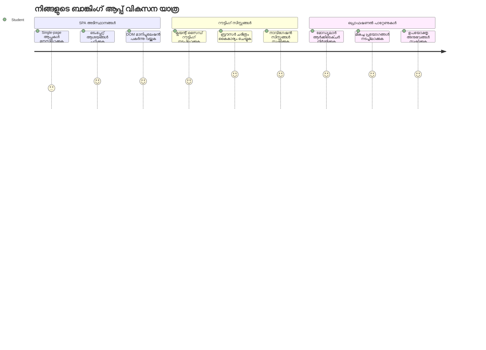
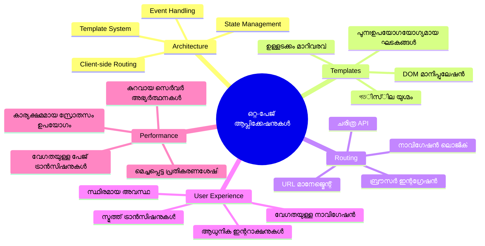
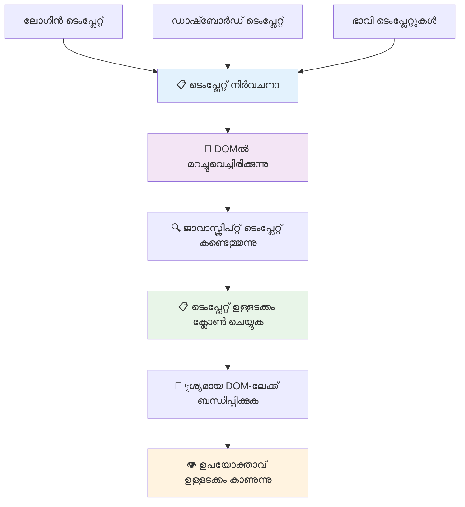
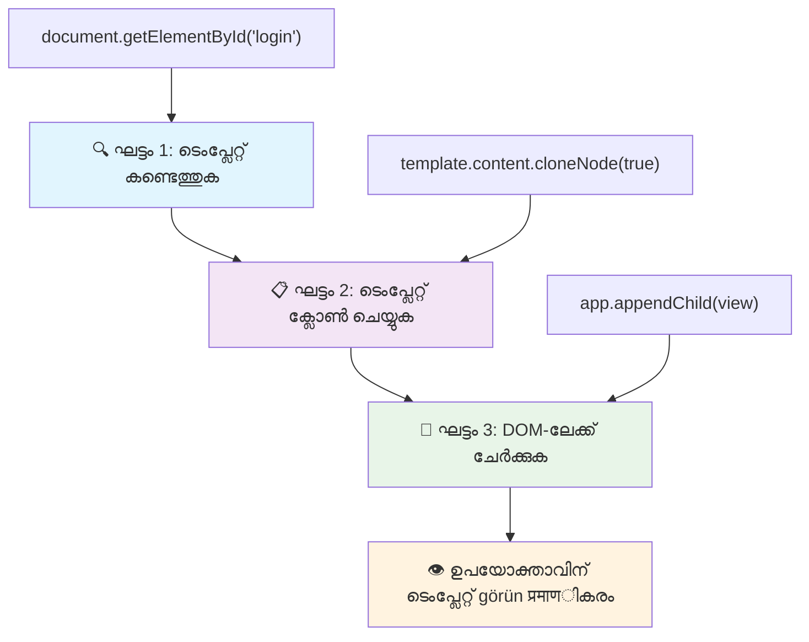
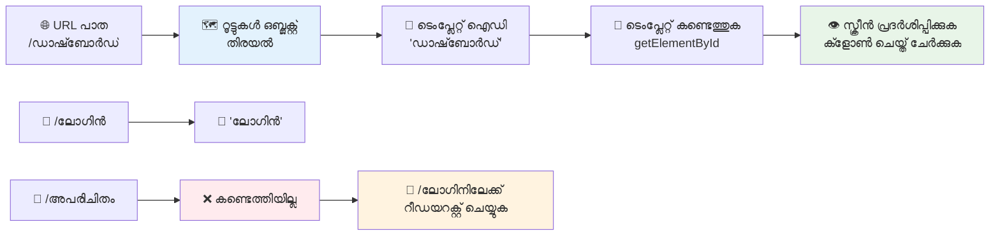
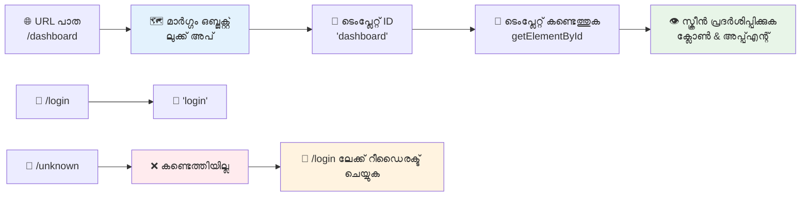
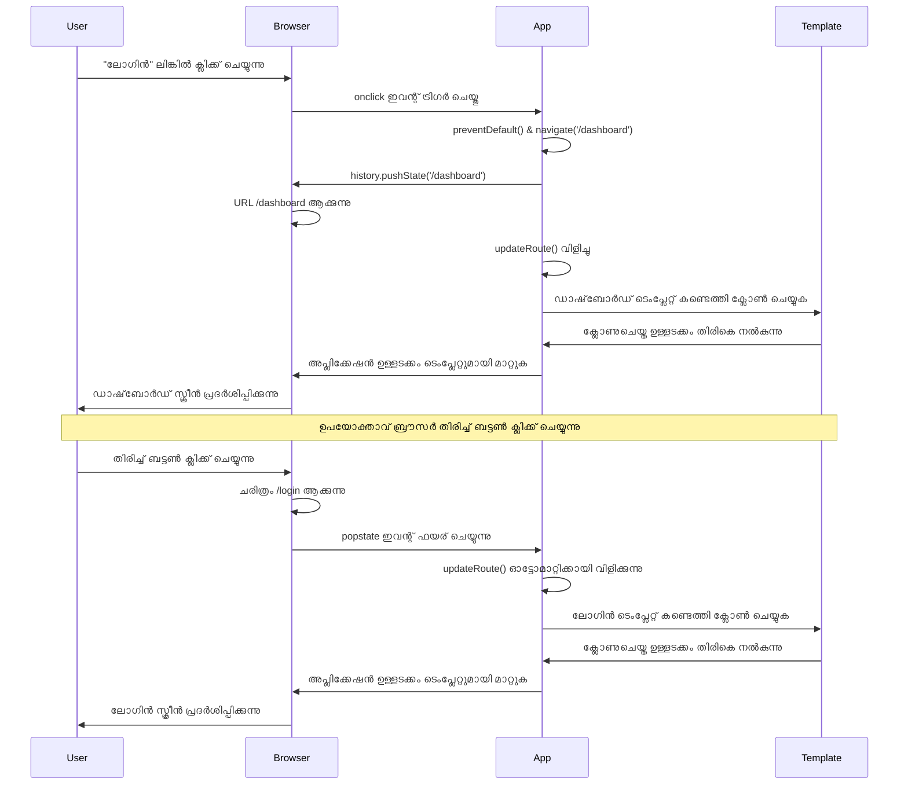
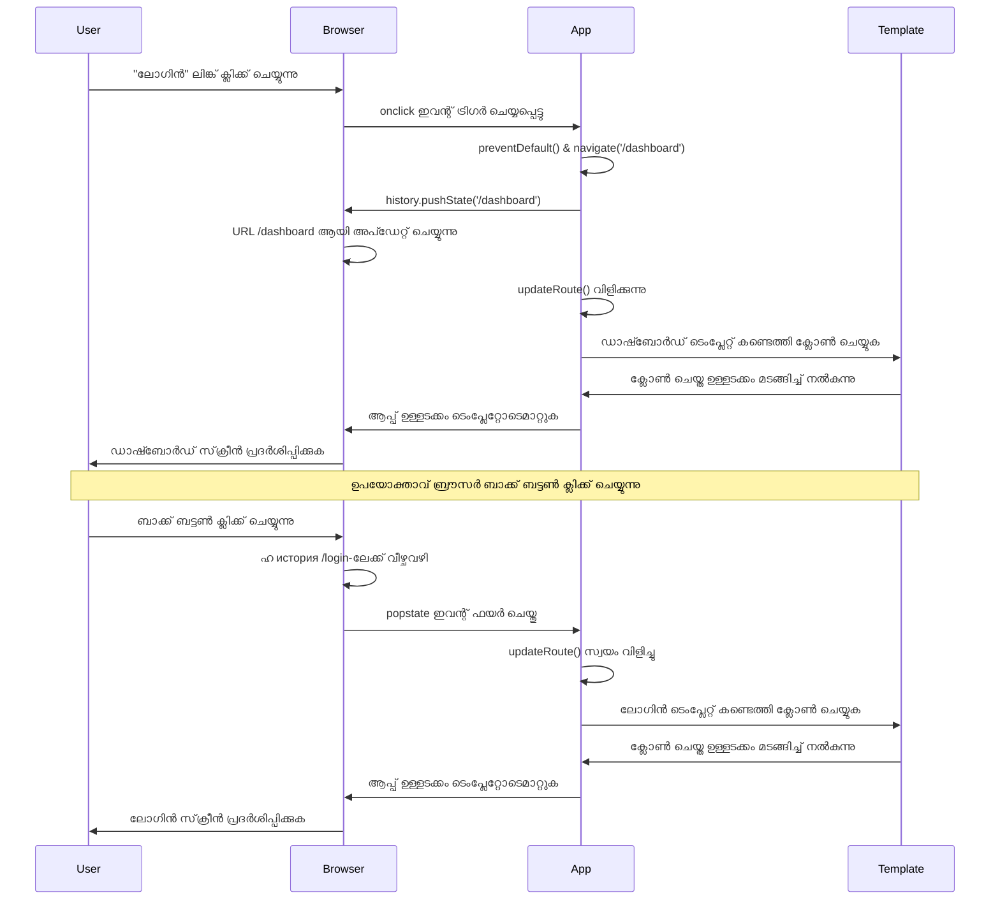
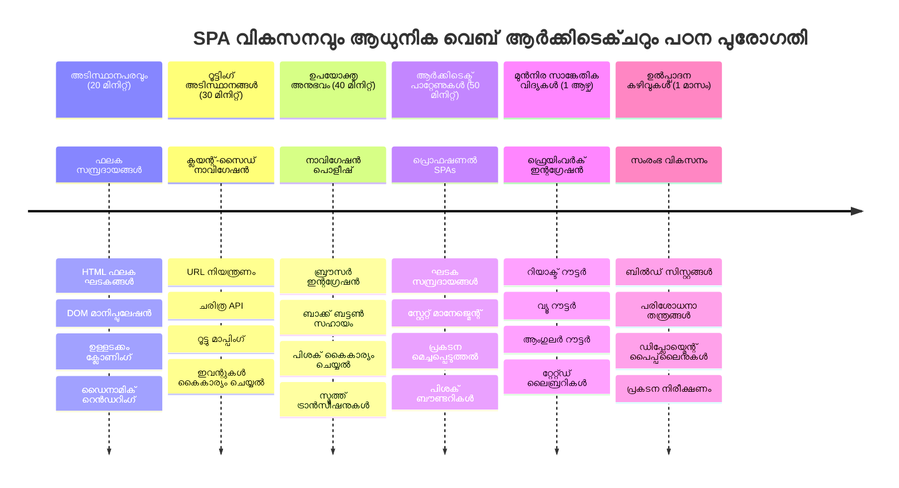

<!--
CO_OP_TRANSLATOR_METADATA:
{
  "original_hash": "351678bece18f07d9daa987a881fb062",
  "translation_date": "2026-01-08T16:54:11+00:00",
  "source_file": "7-bank-project/1-template-route/README.md",
  "language_code": "ml"
}
-->
# ബാങ്കിംഗ് ആപ്പ് നിർമ്മിക്കൽ ഭാഗം 1: വെബ് ആപ്ലിക്കേഷനിലെ HTML ടൈംപ്ലേറ്റുകളും റൂട്ടുകളും


1969-ൽ അപ്പോളോ 11-ന്റെ ഗൈഡൻസ് കമ്പ്യൂട്ടർ ചന്ദ്രനെ ലക്ഷ്യമിട്ട് നാവിഗേറ്റ് ചെയ്യുമ്പോൾ, സമഗ്ര സിസ്റ്റം പുനരാരംഭിക്കാതെ വിവിധ പ്രോഗ്രാമുകളിൽ മാറേണ്ടി വന്നു. ആധുനിക വെബ് ആപ്ലിക്കേഷനുകളും ഇതുപോലെയാണ് – നിങ്ങള്‍ കാണുന്നതും പുനരാരോംഭിക്കാതെ മാറ്റുകയും ചെയ്യുന്നു. ഇത് ഉപയോക്താക്കൾ പ്രതീക്ഷിക്കുന്ന സുതാര്യവും പ്രതികരണക്ഷമവുമായ അനുഭവം സൃഷ്ടിക്കുന്നു.

പരമ്പരാഗത വെബ്‌സൈറ്റുകളിൽ ഓരോ ഇടപെടലിനും മുഴുവൻ പേജ് പുനഃലോഡ് ചെയ്യുന്നതിന് പകരം, ആധുനിക വെബ് ആപ്ലിക്കേഷനുകൾ മാറ്റം ആവശ്യമുള്ള ഭാഗങ്ങൾ മാത്രമെ അപ്ഡേറ്റ് ചെയ്യൂ. മിഷൻ കൺട്രോൾ വിവിധ ഡിസ്‌പ്ലേകൾ തമ്മിൽ മാറുമ്പോൾ തുടർച്ചയായ കമ്മ്യൂണിക്കേഷൻ നിലനിർത്തുന്ന രീതിയിൽ, ഇത് ഒരുവട്ടയും സുതാര്യവും വേഗമേറിയ അനുഭവം ഒരുക്കുന്നു.

ഈ വ്യത്യാസം നിർണായകം ആകുന്നത് ഇതാണ്:

| പരമ്പരാഗത മൾട്ടി-പേജ് ആപ്ലിക്കേഷനുകൾ | ആധുനിക സിംഗിൾ-പേജ് ആപ്ലിക്കേഷനുകൾ |
|----------------------------|-------------------------|
| **നാവിഗേഷൻ** | ഓരോ സ്ക്രീൻ മുറുക്കി മുഴുവൻ പേജ് പുനഃലോഡ് ചെയ്യുന്നു | ഉടൻ ഉള്ളടക്കം മാറ്റം |
| **പ്രകടനം** | സമ്പൂർണ്ണ HTML ഡൗൺലോഡ് കാരണം മന്ദം | ഭാഗിക അപ്ഡേറ്റ് കാരണം വേഗം |
| **ഉപയോക്തൃ അനുഭവം** | പേജ് കത്തി മാറ്റങ്ങള്‍ | സുതാര്യവും ആപ്പ് പോലുള്ള ട്രാൻസിഷനുകൾ |
| **ഡാറ്റ പങ്കിടൽ** | പേജുകളിൽ കഠിനം | ലളിതമായ സ്റ്റേറ്റ് മാനേജ്മെന്റ് |
| **ഡെവലപ്പ്മെന്റ്** | നിരവധി HTML ഫയലുകൾ നിയന്ത്രിക്കേണ്ടത് | ഡൈനാമിക് ടൈംപ്ലേറ്റുകളോടെ ഏകദേശം HTML |

**ഭവന തകർക്കൽ മനസ്സിലാക്കൽ:**
- **പരമ്പരാഗത ആപ്ലിക്കേഷനുകൾ** ഓരോ നാവിഗേഷനും സേർവറുമായി ഒരു അഭ്യർത്ഥന ആവശ്യപ്പെടുന്നു
- **ആധുനിക SPAs** ഒരിക്കൽ ലോഡ് ചെയ്ത് ജാവാസ്ക്രിപ്റ്റ് ഉപയോഗിച്ച് ഉള്ളടക്കം ഡൈനാമിക് ആയി അപ്ഡേറ്റ് ചെയ്യുന്നു
- **ഉപയോക്തൃ പ്രതീക്ഷകൾ** ഇപ്പോൾ ഉടന്‍ സുതാര്യ ഇടപെടലുകളിലേക്ക് മാറിയിട്ടുണ്ട്
- **പ്രകടന ലാഭം** ബാന്റ്‌വിഡ്ത് കുറഞ്ഞു വേഗത കൂടുന്നു

ഈ പാഠത്തിൽ, പല സ്ക്രീനുകളുള്ള ഒരു ബാങ്കിംഗ് ആപ്പ് കെട്ടിയെടുക്കും, ഒന്നിലേറെ സ്ക്രീനുകൾ സഹായത്തോടെ സഹപ്രവഹനം സൃഷ്ടിക്കും. ശാസ്ത്രജ്ഞർ വിവിധ പരീക്ഷണങ്ങൾക്ക് പുനരഗ്ഗഠിക്കാവുന്ന ഘടകങ്ങൾ ഉപയോഗിക്കുന്നതുപോലെ, HTML ടൈംപ്ലേറ്റുകളെ പുനരുപയോഗ ശേഷിയുള്ള ഘടകങ്ങളായി ഉപയോഗിക്കും.

നിങ്ങൾ HTML ടൈംപ്ലേറ്റുകളുമായി (വ്യത്യസ്ത സ്ക്രീനുകളിലെ പുനരുപയോഗ ബ്ലൂപ്രിന്റുകൾ), ജാവാസ്ക്രിപ്റ്റ് റൂട്ടിംഗ് (സ്ക്രീനുകൾ തമ്മിൽ മാറുന്ന സംവിധാനം) ഇങ്ങനെ പ്രവർത്തിക്കും; ബ്രൗസറിന്റെ ഹിസ്റ്ററി API (പിന്നോട്ട് ബട്ടൺ പ്രതീക്ഷിച്ചതുപോലെ പ്രവർത്തിക്കുന്നു) എന്നിവയുമായി പ്രവർത്തിക്കും. ഇങ്ങനെ പ്രവർത്തിക്കുന്നത് React, Vue, Angular പോലുള്ള ഫ്രെയിംവർക്ക് മാദ്ധ്യമങ്ങളുടേതും ആണ്.

അവസാനിക്കുമ്പോൾ, താങ്കൾക്ക് പ്രൊഫഷണൽ സിംഗിൾ-പേജ് ആപ്ലിക്കേഷൻ സംവിധാനങ്ങൾ പ്രദർശിപ്പിക്കുന്ന ഒരു പ്രവർത്തിക്കുന്ന ബാങ്കിംഗ് ആപ്പ് ഉണ്ടാകും.


## പ്രീ-ലെക്ചർ ക്വിസ്

[Pre-lecture quiz](https://ff-quizzes.netlify.app/web/quiz/41)

### നിങ്ങള്‍ക്കു വേണ്ടത് എന്ത്

നമ്മുടെ ബാങ്കിംഗ് ആപ്പ് പരീക്ഷിക്കാൻ ഒരു ലോക്കൽ വെബ് സെർവർ ആവശ്യമാണ് – അത്രയെങ്കിലും ഭയപ്പെടേണ്ടതില്ല! നിങ്ങൾക്കു മുൻപ് സജ്ജീകരിച്ചിട്ടില്ലെങ്കിൽ, വെറും [Node.js](https://nodejs.org) ഇൻസ്റ്റാൾ ചെയ്ത് `npx lite-server` നിങ്ങളുടെയുള്ളോയുള്ള പ്രോജക്ട് ഫോൾഡറിൽ നിന്ന് പ്രവർത്തിപ്പിക്കൂ. ഈ കമാൻഡ് ഒരു ലോക്കൽ സെർവർ സ്റ്റാർട്ട് ചെയ്ത് ബ്രൗസറിൽ സ്വയം നിങ്ങളുടെ ആപ്പ് തുറക്കും.

### തയ്യാറെടുപ്പ്

നിങ്ങളുടെ കമ്പ്യൂട്ടറിൽ `bank` എന്ന ഫോൾഡർ സൃഷ്ടിച്ച് അതിന്റെ ഉള്ളിൽ `index.html` എന്ന ഫയൽ ഉണ്ടാക്കിയെടുക്കുക. നമുക്ക് ഈ HTML [boilerplate](https://en.wikipedia.org/wiki/Boilerplate_code) ഉപയോഗിച്ച് ആരംഭിക്കാം:

```html
<!DOCTYPE html>
<html lang="en">
  <head>
    <meta charset="UTF-8">
    <meta name="viewport" content="width=device-width, initial-scale=1.0">
    <title>Bank App</title>
  </head>
  <body>
    <!-- This is where you'll work -->
  </body>
</html>
```

**ഈ ബോയിലർപ്ലേറ്റ് നിങ്ങൾക്ക് നൽകുന്നത്:**
- **HTML5 ഡോക്യുമെന്റ് ഘടന** ശരിയായ DOCTYPE പ്രഖ്യാപനത്തോടുകൂടെ സ്ഥാപിക്കുന്നു
- **ചരിത്രം എൻകോഡിംഗ്** UTF-8 ആയി ക്രമീകരിക്കുന്നു, രാജ്യാന്തര ടെക്സ്റ്റിനെ പിന്തുണയ്ക്കാൻ
- **വിഭവത്തോടു ചേർന്ന് റിസ്പോൺസീവ് ഡിസൈൻ** viewport മെറ്റാ ടാഗ് ഉപയോഗിച്ച് ആക്ടിവേറ്റ് ചെയ്യുന്നു
- **ബ്രൗസർ ടാബിൽ കാണിക്കുന്ന** വിവരണാത്മകമായ തലക്കെട്ട് സജ്ജമാക്കുന്നു
- **ആപ്ലിക്കേഷനു വേണ്ടി ശുദ്ധമായ ബോഡി സെക്ഷൻ** സൃഷ്ടിക്കുന്നു

> 📁 **പ്രോജക്റ്റ് ഘടനാരൂപരേഖ**
> 
> **ഈ പാഠത്തിന്റെ അവസാനം, നിങ്ങളുടെ പ്രോജക്റ്റിൽ ഉണ്ടാകുന്നത്:**
> ```
> bank/
> ├── index.html      <!-- Main HTML with templates -->
> ├── app.js          <!-- Routing and navigation logic -->
> └── style.css       <!-- (Optional for future lessons) -->
> ```
> 
> **ഫയൽ ഉത്തരവാദിത്വങ്ങൾ:**
> - **index.html**: എല്ലാ ടൈംപ്ലേറ്റുകളും ആപ്പ് ഘടനയുമടങ്ങുന്നു
> - **app.js**: റൂട്ടിംഗ്, നാവിഗേഷൻ, ടൈംപ്ലേറ്റ് മാനേജ്മെന്റ് കൈകാര്യം ചെയ്യുന്നു
> - **Templates**: ലോഗിൻ, ഡാഷ്ബോർഡ്, മറ്റ് സ്ക്രീനുകളുടെ UI നിർവചിക്കുന്നു

---

## HTML Templates

ടൈംപ്ലേറ്റുകൾ വെബ് ഡവലപ്പ്മെന്റിലെ ഒരു അസാമാന്യ പ്രശ്‌നം പരിഹരിക്കുന്നു. 1440 കളിൽ ഗൂട്ടൻബർഗ് മൂവബിള്‍ ടൈപ്പ് പ്രിന്റിംഗ് കണ്ടുപിടിച്ചപ്പോൾ, പൂർണ്ണ പേജുകൾ ശില്പം ചെയ്യാതെ പുനരുപയോഗയോഗ്യമായ അക്ഷര ബ്ലോക്കുകൾ സൃഷ്ടിച്ച് ആവശ്യത്താലും ക്രമീകരിക്കാമെന്ന് കണ്ടെത്തി. HTML ടൈംപ്ലേറ്റ് അതേ സിദ്ധാന്തത്തിലാണ് – ഓരോ സ്ക്രീനും വേറിട്ട HTML ഫയലുകൾ തയ്യാറാക്കുന്നതിന് പകരം, പുനരുപയോഗയോഗ്യമായ ഘടനകൾ നിർവചിച്ച് അവ ആവശ്യപ്പെട്ടപ്പൊഴാണ് പ്രദർശിപ്പിക്കുന്നത്.


ടൈംപ്ലേറ്റുകൾ നിങ്ങളുടെ ആപ്പിന്റെ വ്യത്യസ്ത ഭാഗങ്ങളിലേക്കുള്ള ബ്ലൂപ്രിന്റുകളായി വിചാരിക്കുക. ഒരു архитക്ട് ഒരേ ബ്ലൂപ്രിന്റ് പല തവണ ഉപയോഗിച്ച് ഒരേ തരത്തിലുള്ള മുറികൾ വീണ്ടും വരയ്ക്കാതിരിക്കാൻ ചെയ്യുന്നതുപോലെ, നാം ടൈംപ്ലേറ്റുകൾ ഒറ്റ തവണ സൃഷ്ടിച്ച് ആവശ്യമായി വന്നപ്പോഴാകും അത് ഉപയോഗിക്കുന്നത്. ജാവാസ്ക്രിപ്റ്റ് പ്രവർത്തിപ്പിക്കുന്നതുവരെ ബ്രൗസർ ഈ ടൈംപ്ലേറ്റുകൾ മറച്ചുവയ്ക്കുന്നു.

ഒരു വെബ് പേജിന് നിരവധി സ്ക്രീനുകൾ സൃഷ്ടിക്കാൻ നിങ്ങള്‍ ഒരു ഒറ്റ HTML ഫയൽ ഓരോ സ്ക്രീനിനും സൃഷ്ടിക്കാമെന്നതാണ് ഒരു പരിഹാരമെന്ന് വിചാരിക്കാം. എന്നാൽ, ഇത് ചില അസൗകര്യങ്ങളുണ്ടാക്കുന്നു:

- സ്ക്രീൻ മാരുന്നതിന് മുഴുവൻ HTML പുനഃലോഡ് ചെയ്യേണ്ടി വരും, അതത് സമയം മാനസികത്തിൽ പതിയില്ല.
- വ്യത്യസ്ത സ്ക്രീനുകൾക്കിടയിലെ ഡേറ്റ പങ്കുവെയ്ക്കുക ബുദ്ധിമുട്ടാണ്.

മറ്റ് മാർഗമാണ് `<template>` എന്ന എലമെന്റ് ഉപയോഗിച്ച് ഒറ്റ HTML ഫയലിൽ നിരവധി [HTML ടൈംപ്ലേറ്റുകൾ](https://developer.mozilla.org/docs/Web/HTML/Element/template) നിർവചിക്കുക. ടൈംപ്ലേറ്റ് ബ്രൗസർ പ്രദർശിപ്പിക്കാത്ത പുനരുപയോഗയോഗ്യമായ HTML ബ്ലോക്ക് ആണ്, അത് ജാവാസ്ക്രിപ്റ്റ് ഉപയോഗിച്ച് റൺടൈമിൽ സൃഷ്ടിക്കപ്പെടേണ്ടതാണ്.

### നമുക്ക് ഇത് നിർമ്മിക്കാം

ഓരു ബാങ്ക് ആപ്പ് രണ്ടു പ്രധാന സ്ക്രീനുകൾക്കായി നിർമ്മിക്കാനാണ് നാം പോകുന്നത്: ലോഗിൻ പേജ് এবং ഡാഷ്ബോർഡ്. ആദ്യം, HTML ബോഡി-യിൽ ഒരു Placeholder ഘടകം ചേർക്കാം – ഇവിടെ നമ്മുടെ വിവിധ സ്ക്രീനുകൾ പ്രദർശിപ്പിക്കപ്പെടും:

```html
<div id="app">Loading...</div>
```

**ഈ Placeholder മനസ്സിലാക്കാം:**
- **"app" എന്ന ഐഡിയുള്ള ഒരു കണ്ടെയ്നർ സൃഷ്ടിക്കുന്നു, എല്ലാ സ്ക്രീനുകളും ഇവിടെ പ്രദർശിപ്പിക്കും**
- **ജാവാസ്ക്രിപ്റ്റ് ആദ്യ സ്ക്രീൻ പ്രവർത്തിപ്പിക്കാൻ തയ്യാറാകുന്നത് വരെ ലോഡിംഗ് സന്ദേശം കാണിക്കുന്നു**
- **ഡൈനാമിക് ഉള്ളടക്കത്തിന് ഏക വിസ്ഫോടക പോയിന്റ് ഒരുക്കുന്നു**
- **`document.getElementById()` ഉപയോഗിച്ച് സൗകര്യമായി ലക്ഷ്യമിടാൻ സാധിക്കും**

> 💡 **പ്രൊ ടിപ്പ്**: ഈ എലമെന്റിന്റെ ഉള്ളടക്കം മാറ്റപ്പെടും അതിനാൽ ആപ്പ് ലോഡ് ആകുന്നത് വരെ കാണിക്കാൻ ഒരു ലോഡിംഗ് സന്ദേശമോ സൂചകമോ ഇട്ടുകൂടാം.

ഇതിനുശേഷം HTML ടൈംപ്ലേറ്റിൽ ലോഗിൻ പേജിനായി ഒരു ടൈംപ്ലേറ്റ് ചേർക്കാം. ഇപ്പോൾ തലക്കെട്ട് മാത്രം ഉണ്ട്, അതുപോലെ നാം നാവിഗേഷൻ നടത്താനായി ഒരു ലിങ്ക് ഉൾപ്പെടുത്തിയ ഒരു സെക്ഷൻ ചേർക്കും.

```html
<template id="login">
  <h1>Bank App</h1>
  <section>
    <a href="/dashboard">Login</a>
  </section>
</template>
```

**ലോഗിൻ ടൈംപ്ലേറ്റ് വിശകലനം:**
- **ജാവാസ്ക്രിപ്റ്റ് ടാർഗറ്റിംഗിനായി "login" എന്ന യുണീക്ക് ഐഡിയുള്ള ടൈംപ്ലേറ്റ് നിർവചിക്കുന്നു**
- **ആപ്പിന്റെ ബ്രാൻഡിംഗ് സ്ഥാപിക്കുന്ന പ്രധാന തലക്കെട്ട് ഉൾക്കൊള്ളുന്നു**
- **ബന്ധപ്പെട്ട ഉള്ളടക്കം ഗ്രൂപ്പ് ചെയ്യാൻ ഒരു സെമാന്റിക് `<section>` ഉപയോഗിക്കുന്നു**
- **ഉപയോക്താക്കളെ ഡാഷ്ബോർഡിലേക്ക് റൂട്ടുചെയ്യാൻ നാവിഗേഷൻ ലിങ്ക് നൽകുന്നു**

പിന്നീട് ഡാഷ്ബോർഡ് പേജിന്റെ മറ്റൊരു HTML ടൈംപ്ലേറ്റും ചേർക്കാം. ഈ പേജ് വിവിധ സെക്ഷനുകൾ അടങ്ങിയിരിക്കും:

- തലക്കെട്ട്, ഒരു തലക്കെട്ടും ലോഗൗട്ട് ലിങ്കും ഉള്ള ഹെഡർ
- ബാങ്ക് അക്കൗണ്ടിന്റെ നിലവിലെ ബാലൻസ്
- ഇടപാടുകളുടെ പട്ടിക, ഒരു പട്ടികയിൽ പ്രദർശിപ്പിക്കുക

```html
<template id="dashboard">
  <header>
    <h1>Bank App</h1>
    <a href="/login">Logout</a>
  </header>
  <section>
    Balance: 100$
  </section>
  <section>
    <h2>Transactions</h2>
    <table>
      <thead>
        <tr>
          <th>Date</th>
          <th>Object</th>
          <th>Amount</th>
        </tr>
      </thead>
      <tbody></tbody>
    </table>
  </section>
</template>
```

**ഡാഷ്ബോർഡിന്റെ ഓരോ ഭാഗവും മനസ്സിലാക്കാം:**
- **സെമാന്റിക് `<header>` ഉൾക്കൊള്ളുന്ന പേജ് ഘടന സൃഷ്ടിക്കുന്നു, നാവിഗേഷൻ ഉൾപ്പെടെ**
- **സ്ക്രീനുകളിൽ ബ്രാൻഡിങ്ങിനായി ആപ്പ് തലക്കെട്ട് സ്ഥിരമായി പ്രദർശിപ്പിക്കുന്നു**
- **ലോഗൗട്ട് ലിങ്ക് വഴി ലോഗിൻ സ്ക്രീനിലേക്ക് റൂട്ടുചെയ്യുന്നു**
- **നിലവിലെ അക്കൗണ്ട് ബാലൻസ് വിന്യാസ സെക്ഷനിൽ കാണിക്കുന്നു**
- **വ്യവസായപ്പെട്ട HTML പട്ടികയിൽ ഇടപാട് ഡാറ്റ സംഘടിപ്പിക്കുന്നു**
- **തിയതി, объект്, തുകയുള്ള പട്ടിക തലക്കെട്ടുകൾ നിർവചിക്കുന്നു**
- **ഡൈനാമിക് ഉള്ളടക്കത്തിനായി പട്ടിക ശരീരം ശൂന്യമായി bırakുന്നു**

> 💡 **പ്രൊ ടിപ്പ്**: HTML ടൈംപ്ലേറ്റുകൾ കാണാൻ ആഗ്രഹിക്കുന്നത് കാണാനായി `<template>` എലമെന്റുകളുടെ ആറ് തലകുറighton `<!-- -->` ഉപയോഗിച്ച് കമന്റ് ചെയ്താൽ ദൃശ്യത്തിൽ കാണാം.

### 🔄 **വിദ്യാഭ്യാസ പരിശോധന**
**ടൈംപ്ലേറ്റ് സിസ്റ്റം മനസ്സിലാക്കുക**: ജാവാസ്ക്രിപ്റ്റ് നടപ്പിലാക്കുന്നതിന് മുമ്പ് ഇത് മനസ്സിലാക്കുക:
- ✅ ടൈംപ്ലേറ്റുകൾ സാധാരണ HTML ഘടകങ്ങളിൽ നിന്ന് എങ്ങനെ വ്യത്യസ്തമാണെന്ന്
- ✅ ടൈംപ്ലേറ്റുകൾ ജാവാസ്ക്രിപ്റ്റ് പ്രവർത്തിപ്പിക്കാൻ മുമ്പ് മറഞ്ഞതായി ഉണ്ടാകുന്നത്
- ✅ ടൈംപ്ലേറ്റുകളുടെ സെമാന്റിക് HTML ഘടനയുടെ പ്രാധാന്യം
- ✅ ടൈംപ്ലേറ്റുകൾ പുനരുപയോഗ UI ഘടകങ്ങൾ എങ്ങനെ സജ്ജീകരിക്കുന്നു

**ത്വരിത സ്വയംപരിശോധന**: നിങ്ങളുടെ HTML-നു ചുറ്റുപാടുകളിൽ `<template>` ടാഗുകൾ നീക്കം ചെയ്യുകയാണെങ്കിൽ എന്ത് സംഭവിക്കും?
*ഉത്തരം: ഉള്ളടക്കം ഉടൻ കാണിക്കപ്പെടും, ടൈംപ്ലേറ്റ് ഫംഗ്ഷനാലിറ്റി നഷ്ടപ്പെടും*

**ആർക്കിടെക്ചർ ലാഭം**: ടൈംപ്ലീറ്റുകൾ നൽകുന്നത്:
- **പുനരുപയോഗം**: ഒറ്റ നിർവചനത്തിൽ നിരവധി ഉദാഹരണങ്ങൾ
- **പ്രകടനം**: അനാവശ്യ HTML പാഴ്‌വവിലാസം ഇല്ലാതെ
- **പരിപാലനം**: കേന്ദ്രീകൃത UI ഘടന
- **സ്വകാര്യത**: ഡൈനാമിക് ഉള്ളടക്ക മാറ്റം

✅ ടൈംപ്ലേറ്റുകളിൽ എന്ത് കൊണ്ട് `id` ഇവന്റുകൾ ഉപയോഗിക്കുന്നത് നിങ്ങൾക്ക് തോന്നുന്നു? ക്ലാസുകൾ പോലുള്ള മറ്റ് രീതികൾ ഉപയോഗിക്കാമോ?

## ജാവാസ്ക്രിപ്റ്റ് ഉപയോഗിച്ച് ടൈംപ്ലേറ്റുകൾ സജീവമാക്കുക

ഇപ്പോൾ നമുക്ക് ടൈംപ്ലേറ്റുകൾ പ്രവർത്തനക്ഷമമാക്കാം. 3D പ്രിന്റർ ഒരു ഡിജിറ്റൽ ബ്ലൂപ്രിന്റ് എടുത്ത് ഭൗതിക വസ്തുവാക്കുന്നതുപോലെ, ജാവാസ്ക്രിപ്റ്റ് ഞങ്ങളുടെ മറഞ്ഞിരിക്കുന്ന ടൈംപ്ലേറ്റുകൾ എടുത്ത് ദൃശ്യമായ, ഇടപഴകാവുന്ന ഘടകങ്ങളാക്കി മാറ്റുന്നു.

ഈ പ്രക്രിയ ആധുനിക വെബ് ഡവലപ്പ്മെന്റിന്റെ അടിസ്ഥാനമായ മൂന്ന് സ്ഥിരമായ ഘട്ടങ്ങളാൽ നടക്കുന്നു. ഈ രീതി മനസ്സിലാക്കുമ്പോൾ, നിങ്ങൾ വ്യത്യസ്ത ഫ്രെയിംവർക്കുകളിലും ലൈബ്രറികളിലും ഇതു കാണും.

നിങ്ങളുടെ നിലവിലെ HTML ഫയൽ ബ്രൗസറിൽ പരീക്ഷിച്ചാൽ, അത് `Loading...` എന്ന സ്റ്റാറ്റിക് സന്ദേശത്തിൽ കുടുങ്ങിയതായി തോന്നും. കാരണം ജാവാസ്ക്രിപ്റ്റ് കോഡ് ചേർത്തുള്ള ടൈംപ്ലേറ്റുകൾ പ്രദർശിപ്പിക്കാൻ അതുപോലെ ഇല്ലെന്നതാണ്.

ടൈംപ്ലേറ്റ് ഇൻസ്റ്റാൻഷ്യേറ്റ് ചെയ്യുന്നത് സാധാരണയായി മൂന്ന് ഘട്ടങ്ങളിലാകും:

1. DOM-ൽ ടൈംപ്ലേറ്റ് എലമെന്റ് കണ്ടെത്തുക, ഉദാഹരണത്തിന് [`document.getElementById`](https://developer.mozilla.org/docs/Web/API/Document/getElementById) ഉപയോഗിച്ച്.
2. ടൈംപ്ലേറ്റ് എലമെന്റ് ക്ലോൺ ചെയ്യുക, [`cloneNode`](https://developer.mozilla.org/docs/Web/API/Node/cloneNode) ഉപയോഗിച്ച്.
3. ദൃശ്യമാകുന്ന എലമെന്റിൽ (DOM-ൽ) ചേർക്കുക, ഉദാഹരണത്തിന് [`appendChild`](https://developer.mozilla.org/docs/Web/API/Node/appendChild) ഉപയോഗിച്ച്.


**പ്രക്രിയയുടെ ദൃശ്യ വിശദീകരണം:**
- **ഘട്ടം 1** മറഞ്ഞിരിക്കുന്ന ടൈംപ്ലേറ്റ് DOM ഘടനയിൽ കണ്ടെത്തുന്നു
- **ഘട്ടം 2** സുരക്ഷിതമായി മാറ്റാൻ കഴിയും എന്ന പ്രവർത്തനക്ഷമ കോപ്പി സൃഷ്ടിക്കുന്നു
- **ഘട്ടം 3** കോപ്പി ദൃശ്യമായ പേജ് മേഖലയിലേക്ക് ചേർക്കുന്നു
- **ഫലം** ഉപയോക്താക്കൾക്ക് ഇടപഴകാവുന്ന പ്രവർത്തനക്ഷമ സ്ക്രീൻ

✅ ടൈംപ്ലേറ്റ് DOM-ൽ ചേർക്കുന്നതിന് മുൻപ് ക്ലോൺ ചെയ്യേണ്ടത് എന്തുകൊണ്ടാണ്? ഈ ഘട്ടം ഒഴിവാക്കി എങ്കിൽ എന്ത് സംഭവിക്കുമെന്നാണ് നിങ്ങൾക്ക് തോന്നുന്നത്?

### പ്രവർത്തി

നിങ്ങളുടെ പ്രോജക്ട് ഫോൾഡറിൽ ഒരു പുതിയ ഫയൽ `app.js` സൃഷ്ടിച്ച് അത് `<head>` സെക്ഷനിൽ ഇറക്കുമതി ചെയ്യുക:

```html
<script src="app.js" defer></script>
```

**ഈ സ്‌ക്രിപ്റ്റ് ഇറക്കുമതിയുടെ അർത്ഥം:**
- **ജാവാസ്ക്രിപ്റ്റ് ഫയൽ HTML ഡോക്യുമെന്റുമായി ലിങ്ക് ചെയ്യുന്നു**
- **`defer` ആട്രിബ്യൂട്ട് ഉപയോഗിച്ച് HTML പാഴ്‌സ് ചെയ്യൽ പൂർത്തിയാകുമ്പോൾ മാത്രമേ സ്‌ക്രിപ്റ്റ് ഓടൂ**
- **DOM മുഴുവൻ ലോഡ് ചെയ്യപ്പെട്ടതിനാൽ എല്ലാ എലമെന്റുകളിലേയും ആക്സസ് ലഭ്യമാണ്**
- **സ്‌ക്രിപ്റ്റ് ലോഡിംഗിന്റെയും പ്രകടനത്തിന്റെയും ആധുനിക ചിട്ടി പാലിക്കുന്നു**

ഇപ്പോൾ `app.js`ൽ, പുതിയ ഫംഗ്ഷൻ `updateRoute` സൃഷ്ടിക്കും:

```js
function updateRoute(templateId) {
  const template = document.getElementById(templateId);
  const view = template.content.cloneNode(true);
  const app = document.getElementById('app');
  app.innerHTML = '';
  app.appendChild(view);
}
```

**ഈ ഘട്ടങ്ങളുടെ വിശദീകരണം:**
- **ടൈംപ്ലേറ്റ് എലമെന്റ് അതിന്റെ ഐഡി ഉപയോഗിച്ച് കണ്ടെത്തുന്നു**
- **`cloneNode(true)` ഉപയോഗിച്ച് ടൈംപ്ലേറ്റിന്റെ ഉള്ളടക്കം ആഴത്തിലുള്ള കോപ്പിയാക്കുന്നു**
- **ഉള്ളടക്കം പ്രദർശിപ്പിക്കാനുള്ള ആപ് കണ്ടെയ്നർ കണ്ടെത്തുന്നു**
- **ആപ് കണ്ടെയ്നറിൽ നിലവിലുള്ള ഉള്ളടക്കം മുഖത്ത് നീക്കം ചെയ്യുന്നു**
- **ക്ലോൺ ചെയ്ത ടൈംപ്ലേറ്റ് ഉള്ളടക്കം DOM-ൽ സജ്ജമാക്കുന്നു**

ഇപ്പോൾ ഈ ഫംഗ്ഷൻ ഒരു ടൈംപ്ലേറ്റ് ഐഡി ഉപയോഗിച്ച് വിളിച്ചു ഫലം നോക്കാം.

```js
updateRoute('login');
```

**ഈ ഫംഗ്ഷൻ വിളിയുടെ ലാഭം:**
- **ലോഗിൻ ടൈംപ്ലേറ്റ് ഐഡി നൽകി സജീവമാക്കുന്നു**
- **വ്യത്യസ്ത ആപ്പ് സ്ക്രീനുകൾക്കിടയിൽ പ്രോഗ്രാമാറ്റിക് മാറൽ കാണിക്കുന്നു**
- **"Loading..." സന്ദേശത്തിന് പകരം ലോഗിൻ സ്ക്രീൻ പ്രദർശിപ്പിക്കുന്നു**

✅ ഈ കോഡ് `app.innerHTML = '';` യുടെ ഉദ്ദേശം എന്താണ്? അതിന്റെ അഭാവത്തിൽ എന്ത് സംഭവിക്കും?

## റൂട്ടുകൾ സൃഷ്ടിക്കൽ

Routing എന്നത് URL-നെ ശരിയായ ഉള്ളടക്കത്തിലേക്ക് ബന്ധിപ്പിക്കുന്നതിന് വേണ്ടിയാണ്. മുന്‍കാല ഫോൺ ഓപ്പറേറ്റർമാർ സ്വിച്ച്‌ബോർഡുകൾ ഉപയോഗിച്ചു കോളുകൾ നടത്തുന്നത് പോലെ, വെബ് റൂട്ടിംഗ് URL അഭ്യർത്ഥനയെടുത്ത് ഇത് എവിടേക്ക് പോവണമെന്ന് തീരുമാനിക്കുന്നു.


പരമ്പരാഗതമായി വെബ് സർവറുകൾ വിവിധ URL-ങ്ങൾക്ക് വ്യത്യസ്ത HTML ഫയലുകൾ സർവ് ചെയ്തു. നാം സിംഗിൾ പേജ് ആപ്പ് നിർമ്മിക്കുകയാണ്, അതിനാൽ ജാവാസ്ക്രിപ്റ്റ് ഉപയോഗിച്ച് റൂട്ടിംഗ് ഞങ്ങള്ക്ക് തന്നെ കൈകാര്യം ചെയ്യേണ്ടതാണ്. ഇത് ഉപയോക്തൃ അനുഭവത്തിനും പ്രകടനത്തിനും കൂടുതൽ നിയന്ത്രണം നൽകുന്നു.


**റൂട്ടിംഗ് പ്രവാഹം മനസ്സിലാക്കുക:**
- **URL മാറ്റങ്ങൾ റൂട്ടിംഗ് കോൺഫിഗറേഷൻ പരിശോധിക്കാൻ ട്രിഗർ ചെയ്യുന്നു**
- **ശരിയായ റൂട്ടുകൾ പ്രത്യേക ടൈംപ്ലേറ്റ് ഐഡികൾക്ക് മാപ്പ് ചെയ്യുന്നു**
- **തെറ്റായ റൂട്ടുകൾ റൂർച്ച് സ്റ്റേറ്റുകൾ തടയാൻ ഫാൾബാക്ക് ചെയ്തുവരുന്നു**
- **ടൈംപ്ലേറ്റ് റൻഡറിംഗ് മുകളിൽ പഠിച്ച മൂന്ന് ഘട്ടങ്ങളനുസരിച്ച് നടപ്പിലാക്കുന്നു**

വെബ് ആപ്പിനെക്കുറിച്ച് സംസാരിക്കുമ്പോൾ, ഞങ്ങൾ *Routing* എന്നത് **URLs**-നെ പ്രദർശിപ്പിക്കേണ്ട പ്രത്യേക സ്ക്രീനുകളുമായി യോജിപ്പിക്കുന്നതും എന്നാണ് പറയുന്നത്. നിരവധി HTML ഫയലുകളുള്ള വെബ്‌സൈറ്റിൽ, ഫയൽ പാത്തുകൾ URL-ൽ പ്രതിഫലിക്കപ്പെടുന്നതുകൊണ്ട് ഇത് സ്വയമേവ നടക്കും. ഉദാഹരണത്തിന്, നിങ്ങള്‍ക്കുണ്ട് ഈ ഫയലുകൾ:

```
mywebsite/index.html
mywebsite/login.html
mywebsite/admin/index.html
```

നിങ്ങൾ `mywebsite` എന്ന റൂട്ടുമായി ഒരു വെബ് സെർവർ ഉണ്ടാക്കിയാൽ, URL മാപ്പിംഗ് ഇങ്ങനെ ആയിരിക്കും:

```
https://site.com            --> mywebsite/index.html
https://site.com/login.html --> mywebsite/login.html
https://site.com/admin/     --> mywebsite/admin/index.html
```

എങ്കിലും, ഞങ്ങളുടെ വെബ് ആപ്പ് ഒരു HTML ഫയലിൽ എല്ലാ സ്ക്രീനുകളും ഉള്‍ക്കൊള്ളുന്നതിനാൽ ഈ ഡിഫോൾട്ട് പെരുമാറ്റം സഹായിക്കില്ല. ഞങ്ങൾ ഈ മാപ്പ് സ്വയം സജ്ജമാക്കി ജാവാസ്ക്രിപ്റ്റ് ഉപയോഗിച്ച് പ്രദർശിപ്പിക്കപ്പെട്ട ടൈംപ്ലേറ്റ് അപ്ഡേറ്റ് ചെയ്യേണ്ടതാണ്.

### പ്രവർത്തി

URL പാത്തുകളും ടൈംപ്ലേറ്റുകളുമായുള്ള [മാപ്പ്](https://en.wikipedia.org/wiki/Associative_array) ഒരു ലളിതമായ ഒബ്ജക്റ്റ് ഉപയോഗിച്ച് നടപ്പിലാക്കാം. ഈ ഒബ്ജക്റ്റ് `app.js` ഫയലിന്റെ മുകളിൽ ചേർക്കുക.

```js
const routes = {
  '/login': { templateId: 'login' },
  '/dashboard': { templateId: 'dashboard' },
};
```

**ഈ റൂട്ടുകൾ കോൺഫിഗറേഷൻ മനസ്സിലാക്കുക:**
- **URL പാത്തുകളും ടൈംപ്ലേറ്റുകൾക്കുമിടയിലെ മാപ്പിംഗ് നിർവ്വചിക്കുന്നു**
- **കീസ് URL പാത്തുകളും വാല്യൂസ് ടൈംപ്ലേറ്റിന്റെ വിവരങ്ങളും ആണ്**
- **URL അനുസരിച്ച് പ്രദർശിപ്പിക്കേണ്ട ടൈംപ്ലേറ്റ് എളുപ്പത്തിൽ കണ്ടെത്താൻ കഴിയുന്നു**
- **പുതിയ റൂട്ടുകളും സാന്ദർഭികമായി കൂട്ടിച്ചേർക്കാനുള്ള വികാസനക്ഷമ ഘടന നൽകുന്നു**
നമുക്ക് `updateRoute` ഫംഗ്ഷൻ കുറച്ചായി മാറ്റാം. നേരിട്ട് `templateId` പരാമർശിക്കാനുള്ള പകരം, ആദ്യം നിലവിലെ URL നോക്കി, പിന്നീട് നമ്മുടെ മാനപ്പെടുത്തിയത് ഉപയോഗിച്ച് അനുയോജ്യമായ template ID മൂല്യം എടുക്കണം. URL-യിൽ നിന്നും മാര്‍ഗഭാഗം മാത്രം എടുക്കാൻ ഉപയോഗിക്കാം [`window.location.pathname`](https://developer.mozilla.org/docs/Web/API/Location/pathname).

```js
function updateRoute() {
  const path = window.location.pathname;
  const route = routes[path];

  const template = document.getElementById(route.templateId);
  const view = template.content.cloneNode(true);
  const app = document.getElementById('app');
  app.innerHTML = '';
  app.appendChild(view);
}
```
  
**ഇവിടെ സംഭവിക്കുന്ന കാര്യങ്ങൾ പിരിവ്:**  
- **നിലവിലുള്ള പാത** ബ്രൗസറിന്റെ URL-യിൽ നിന്ന് `window.location.pathname` ഉപയോഗിച്ച് എടുക്കുന്നു  
- **അനുരൂപമായ റൂട്ടിന്റെ കോൺഫിഗറേഷൻ** routes ഒബ്ജക്ടിൽ നിന്നും നോക്കുന്നു  
- **റൂട്ടിന്റെ കോൺഫിഗറേഷനിൽ നിന്ന്** template ID പിന്‍വലിക്കുന്നു  
- **മുന്‍പുള്ളതുപോലെ** തന്നെ template rendering പ്രക്രിയ പിന്തുടരുന്നു  
- **URL മാറ്റങ്ങൾക്ക്** പ്രതികരിക്കുന്ന ഡൈനാമിക് സിസ്റ്റം സൃഷ്ടിക്കുന്നു  

നാം പ്രഖ്യാപിച്ച റൂട്ടുകൾ അനുയോജ്യമായ ടേംപ്ലേറ്റുകളിലേക്ക് കണക്ഷൻ ചെയ്യുന്നു. ബ്രൗസറിൽ URL മാനുവലായി മാറ്റി ഇത് ശരിയായി പ്രവർത്തിക്കുന്നുണ്ടെന്ന് പരീക്ഷിക്കാം.

✅ URL-ൽ ഒരു അറിയപ്പെടാത്ത പാത നൽകി എങ്ങനെ പ്രതികരിക്കും? നമ്മൾ ഇത് എങ്ങനെ പരിഹരിക്കാമെന്ന് കണ്ടെത്താം.

## നാവിഗേഷൻ ചേർക്കൽ

റൂട്ടിംഗ് ഉറപ്പാക്കിയതിന് ശേഷം, ഉപയോക്താക്കൾക്ക് ആප් വഴി നീങ്ങാനുള്ള മാർഗം വേണം. പരമ്പരാഗത വെബ്‌സൈറ്റുകൾ, ലിങ്കുകൾ ക്ലിക്കുചെയ്യുമ്പോൾ പേജുകൾ പൂർണമായി റീലോഡ് ചെയ്യും, പക്ഷേ ഞങ്ങൾ URL യും ഉള്ളടക്കവും പേജിന്റെ പുനർലോഡിങ്ങില്ലാതെ അപ്‌ഡേറ്റ് ചെയ്യാൻ ആഗ്രഹിക്കുന്നു. ഇത് ഡെസ്‌ക്ക്ടോപ്പ് ആപ്ലിക്കേഷനുകൾ വ്യത്യസ്ത വ്യൂകൾക്കിടയിൽ നീങ്ങുന്നതുപോലെ നിശ്ചലമായ അനുഭവം സൃഷ്ടിക്കുന്നു.

നമുക്ക് രണ്ട് കാര്യം ഏകോപിപ്പിക്കേണ്ടതാണ്: ഉപയോക്താക്കൾക്ക് പേജ് ബുക്ക്മാർക്ക് ചെയ്യാനും ലിങ്ക് പങ്കിടാനും അനുവദിക്കുന്നതിനായി ബ്രൗസറിന്റെ URL അപ്‌ഡേറ്റ് ചെയ്യൽ, ശരിയായ ഉള്ളടക്കം പ്രദർശിപ്പിക്കൽ. ശരിയായ രീതിയിൽ നടപ്പിലാക്കിയാൽ, മോടേൺ ആപ്ലിക്കേഷനുകളിൽ നിന്നും ഉപയോക്താക്കൾ പ്രതീക്ഷിക്കുന്ന സ്മൂത്ത് നാവിഗേഷൻ ലഭിക്കും.


### 🔄 **പാഠഭാഗം പരിശോധന**  
**സിംഗിൾ പേജ് ആപ്ലിക്കേഷൻ ആർക്കിടെക്ചർ**: സമ്പൂർണ സിസ്റ്റത്തിന്റെ മനസ്സിലാക്കലിന്:  
- ✅ ക്ലയന്റ്-സൈഡ് റൂട്ടിംഗ് പരമ്പരാഗത സർവർ-സൈഡ് റൂട്ടിംഗിനേക്കാൾ എങ്ങനെ വ്യത്യസ്തമാണ്?  
- ✅ SPA നാവിഗേഷനിൽ History API എന്തുകൊണ്ട് ആവശ്യമാണ്?  
- ✅ പേജിന്റെ പുനർലോഡിങ്ങില്ലാതെ മൊഡലാറ്റിവായി ഉള്ളടക്കം എങ്ങനെ ഉണ്ടാക്കാം?  
- ✅ നാവിഗേഷൻ തടയുന്നതിൽ ഇവന്റ് ഹാൻഡ്ലിംഗ് എന്ത് പങ്ക് വഹിക്കുന്നു?  

**സിസ്റ്റം സംയോജനം**: നിങ്ങളുടെ SPA ചെയ്യുന്നത്:  
- **ടേംപ്ലേറ്റ് മാനേജ്മെന്റ്**: ഡൈനാമിക് ഉള്ളടക്കമുള്ള പുനരുപയോഗ യോഗ്യമായ UI ഘടകങ്ങൾ  
- **ക്ലയന്റ്-സൈഡ് റൂട്ടിംഗ്**: സർവർ അഭ്യർത്ഥനകളില്ലാതെ URL മാനേജ്‌മെന്റ്  
- **ഇവന്റ്-ഡ്രിവൻ ആർക്കിടെക്ചർ**: പ്രതികരണാത്മക നാവിഗേഷൻ, ഉപയോക്തൃ ഇടപെടൽ  
- **ബ്രൗസർ സംയോജനം**: History API ഉപയോഗിച്ച് മുൻ/ശേഷം ബട്ടൺ പിന്തുണ  
- **പ്രധാനമാക്കൽ**: വേഗത്തിലുള്ള ട്രാൻസിഷനുകൾ, കുറഞ്ഞ സർവർ ഭാരം  

**പ്രൊഫഷണൽ പാറ്റേണുകൾ**: നിങ്ങൾ നടപ്പിലാക്കിയിരിക്കുന്നത്:  
- **മോഡൽ-വ്യൂ വേർതിരിക്കൽ**: ആപ്പ് ലോജിക് നിന്ന് വ്യത്യസ്തമായ ടേംപ്ലേറ്റുകൾ  
- **സ്റ്റേറ്റ് മാനേജ്മെന്റ്**: URL സ്റ്റേറ്റ് പ്രദർശിത ഉള്ളടക്കത്തിന് ഒത്തുചേരുന്നു  
- **പ്രോഗ്രസീവ് എൻഹാൻസ്മെന്റ്**: സാധാരണ HTML പ്രവർത്തനക്ഷമതയ്ക്ക് ജാവാസ്ക്രിപ്റ് ആധിക്യം  
- **ഉപയോക്തൃ അനുഭവം**: പേജിലെ പുനർലോഡിങ് ഇല്ലാതെ സ്മൂത്ത് അപ്ലിക്കേഷൻ പോലുള്ള നാവിഗേഷൻ  

> � **ആർക്കിടെക്ചർ വിവരം**: നാവിഗേഷൻ സിസ്റ്റം ഘടകങ്ങൾ  
>  
> **നിങ്ങൾ നിർമ്മിക്കുന്നത്:**  
> - **🔄 URL മാനേജ്മെന്റ്**: പേജ് റീ-ലോഡിങ്ങില്ലാതെ ബ്രൗസർ അഡ്രസ് ബാർ അപ്‌ഡേറ്റ് ചെയ്യുന്നു  
> - **📋 ടേംപ്ലേറ്റ് സിസ്റ്റം**: നിലവിലെ റൂട്ടിന്റെ അടിസ്ഥാനത്തിൽ ഉള്ളടക്കം ഡൈനാമിക് ആയി മാറുന്നു  
> - **📚 ഹിസ്റ്ററി സംയോജനം**: മുൻ/ശേഷം ബട്ടണുകളുടെ പ്രവർത്തനം സംരക്ഷിക്കുന്നു  
> - **🛡️ പിശക് കൈകാര്യം**: അസാധുവായ അല്ലെങ്കിൽ കാണാത്ത റൂട്ടുകൾക്കായുള്ള സൂക്ഷ്മ പിന്തുണ  
>  
> **ഘടകങ്ങൾ ഒരുമിച്ചുള്ള പ്രവർത്തനം:**  
> - **നാവിഗേഷൻ ഇവന്റുകൾ** (ക്ലിക്കുകൾ, ഹിസ്റ്ററി മാറ്റങ്ങൾ) കേൾക്കുന്നു  
> - **History API** ഉപയോഗിച്ച് URL അപ്‌ഡേറ്റ് ചെയ്യുന്നു  
> - **പുതിയ റൂട്ടിനുള്ള ടേംപ്ലേറ്റും** റെൻഡർ ചെയ്യുന്നു  
> - **നിരന്തരവും സുതാര്യവുമായ ഉപയോക്തൃ അനുഭവം** ഉറപ്പാക്കുന്നു  

ഞങ്ങളുടെ ആപ്പിന് അടുത്തത്, URL മാനുവലായി മാറ്റേണ്ടതില്ലാതെ പേജുകൾക്കിടയിൽ നാവിഗേറ്റ് ചെയ്‌തുകൊള്ളാനുള്ള സാധ്യത ചേർക്കൽ ആണ്. ഇതിന് രണ്ട് കാര്യങ്ങൾ ഉണ്ട്:

  1. നിലവിലെ URL അപ്‌ഡേറ്റ് ചെയ്യുക  
  2. പുതിയത് ഉപയോഗിച്ചുള്ള URL അടിസ്ഥാനമാക്കി പ്രദർശിപ്പിക്കുന്ന ടേംപ്ലേറ്റ് അപ്‌ഡേറ്റ് ചെയ്യുക  

`updateRoute` ഫംഗ്ഷനോടെന്ന് രണ്ടാം ഭാഗത്തെ ഞങ്ങൾക്കായ് പരിഗണിച്ചിരുന്നു, ഇപ്പോൾ നിലവിലെ URL എടുക്കാനുള്ള തന്ത്രം കാണാം.

നാം റീ-ലോഡിങ്ങ് കൂടാതെ URL അപ്‌ഡേറ്റ് സാധ്യമാക്കാൻ ജാവാസ്ക്രിപ്റ്റിലെ [`history.pushState`](https://developer.mozilla.org/docs/Web/API/History/pushState) ഉപയോഗിക്കേണ്ടതാണ്.

> ⚠️ **പ്രധാന കുറിപ്പ്**: HTML ലിങ്ക് defining angle bracket `<a href>` സ്വയം ഉപയോഗിച്ച് ഹൈപ്പർലിങ്കുകൾ സൃഷ്ടിക്കാവുന്നതാണ്, പക്ഷേ ഇത് സാധാരണയായി പേജ് റീ-ലോഡ് ചെയ്യും. Routing കൈകാര്യം ചെയ്യുന്ന ദിശയിൽ, ഈ പേജ് റീലോഡ് തടയാൻ പ്രത്യേകമായി `preventDefault()` ഫംഗ്ഷൻ ലോറെ(click event) ഉപയോഗിക്കാൻ ആവശ്യമാണ്.

### ടാസ്‌ക്

നമുക്ക് ആപ്പിനുള്ളിൽ നാവിഗേറ്റ് ചെയ്യാൻ കഴിയുന്ന പുതിയ ഫംഗ്ഷൻ സൃഷ്ടിക്കാം:

```js
function navigate(path) {
  window.history.pushState({}, path, path);
  updateRoute();
}
```
  
**ഈ നാവിഗേഷൻ ഫംഗ്ഷൻ മനസ്സിലാക്കൽ:**  
- **Browser URL** പുതിയ പാതയിലേക്ക് `history.pushState` ഉപയോഗിച്ച് അപ്‌ഡേറ്റ് ചെയ്യുന്നു  
- **Browser history stack**-ത്തിലേക്ക് പുതിയ എൻട്രി ചേർക്കുന്നു, മുൻ/ശേഷം ബട്ടൺ പിന്തുണയ്ക്കായി  
- **`updateRoute()`** വിളിച്ച് അനുയോജ്യമായ ടേംപ്ലേറ്റ് പ്രദർശിപ്പിക്കുന്നു  
- **പേജ് പുനർലോഡിങ്ങ് ഇല്ലാതെ** സിംഗിൾ പേജ് ആപ്പിന്റെ അനുഭവം തുടരുന്നു  

ഈ രീതിയിൽ ആദ്യം നിലവിലെ URL പത്തിനെ അടിസ്ഥാനമാക്കി അപ്‌ഡേറ്റ് ചെയ്യുന്നു, പിന്നീടു ടേംപ്ലേറ്റ് മാറുന്നു. `window.location.origin` പ്രോപ്പർട്ടി URL റൂട്ട് നൽകും, ഇതുപയോഗിച്ച് പൂർണ്ണ URL പുന:സൃഷ്ടി ചെയ്യാം.

ഇപ്പോൾ ഈ ഫംഗ്ഷൻ ഉണ്ടെങ്കിൽ, നിർവ്വചിച്ച റൂട്ടിൽ പൊരുത്തപ്പെടാത്ത പാത എങ്കിൽ പരിഹാരമായി ഒരു ഫോള്ബാക്ക് ചേർത്തുകൊണ്ട് `updateRoute` മാറ്റാം.

```js
function updateRoute() {
  const path = window.location.pathname;
  const route = routes[path];

  if (!route) {
    return navigate('/login');
  }

  const template = document.getElementById(route.templateId);
  const view = template.content.cloneNode(true);
  const app = document.getElementById('app');
  app.innerHTML = '';
  app.appendChild(view);
}
```
  
** സാഹിത്യമായി ശ്രദ്ധിക്കേണ്ടത്: **  
- നിലവിലെ പാതയ്‌ക്കായി റൂട്ടുണ്ടോ എന്ന് പരിശോധിക്കുന്നു  
- തെറ്റായ റൂട്ടിലേക്ക് നയിക്കുമ്പോൾ ലോഗിൻ പേജിലേക്ക് റീ-ഡയറക്ട് ചെയ്യുന്നു  
- തകരാറില്ലാത്ത നാവിഗേഷൻ അനുവദിക്കുന്ന ഫോള്ബാക്ക് സംവിധാനം നൽകുന്നു  
- തെറ്റായ URL ഉണ്ടെങ്കിലും ഉപയോക്താക്കൾക്ക് സാധുവായ പേജ് കാണിക്കുന്നു  

റൂട്ടുകൾ കണ്ടെത്താനായില്ലെങ്കിൽ ഇനി ലോഗിൻ പേജിലേക്ക് നയിക്കും.

ഇപ്പോൾ ലിങ്കിന് ക്ലിക്ക് ചെയ്യുമ്പോൾ URL നേടാനും, ബ്രൗസറിന്റെ ഡീഫോൾട്ട് ലിങ്ക് പ്രവർത്തനം തടയാനുമായി ഫംഗ്ഷൻ സൃഷ്ടിക്കാം:

```js
function onLinkClick(event) {
  event.preventDefault();
  navigate(event.target.href);
}
```
  
**ഈ ക്ലിക്ക് ഹാൻഡ്ലർ വിശദീകരണം:**  
- ബ്രൗസറിന്റെ ഡീഫോൾട്ട് ലിങ്ക് പ്രവർത്തനം `preventDefault()` ഉപയോഗിച്ച് തടയുന്നു  
- ക്ലിക്കുചെയ്ത ലിങ്കിൽ നിന്നും ലക്ഷ്യ URL എടുക്കുന്നു  
- പേജ് പുനർലോഡുചെയ്യാതെ നമുടെ നാവിഗേറ്റ് ഫംഗ്ഷൻ വിളിക്കുന്നു  
- സിംഗിൾ പേജ് ആപ്പ് സ്മൂത്ത് അനുഭവം നിലനിർത്തുന്നു  

```html
<a href="/dashboard" onclick="onLinkClick(event)">Login</a>
...
<a href="/login" onclick="onLinkClick(event)">Logout</a>
```
  
**ഈ `onclick` ബൈൻഡിങ് നിർവ്വഹിക്കുന്നത്:**  
- ഓരോ ലിങ്കും നമുടെ കസ്റ്റം നാവിഗേഷൻ സിസ്റ്റത്തിലേക്ക് കണക്ട് ചെയ്യുന്നു  
- ക്ലിക് ഇവന്റ് നമ്മുടെ `onLinkClick` ഫംഗ്ഷനിലേക്ക് അയയ്ക്കുന്നു  
- പേജ് പുനർലോഡ് ഇല്ലാതെ സ്മൂത്ത് നാവിഗേഷൻ സാധ്യമാക്കുന്നു  
- ഉപയോക്താക്കൾക്ക് ബുക്ക്മാർക്ക് ചെയ്യാനും ലിങ്ക് പങ്കിടാനുമായി ശരിയായ URL ഘടന നിലനിർത്തുന്നു  

[`onclick`](https://developer.mozilla.org/docs/Web/API/GlobalEventHandlers/onclick) സവിശേഷത ജാവാസ്ക്രിപ്റ്റ് കോഡിന് ക്ലിക്ക് ഇവന്റ绑定ചെയ്യുന്നു, ഇവിടെ `navigate()` വിളിക്കാനുള്ള കോഡ്.

ഇവയിൽ ക്ലിക്ക് ചെയ്ത്, ആപ്പിന്റെ വിവിധ സ്ക്രീനുകൾക്കിടയിൽ നീങ്ങാൻ സാധിക്കുന്നുവെന്ന് പരിശോധിക്കുക.

✅ `history.pushState` HTML5 സ്റ്റാൻഡേർഡിൽ ഉൾപ്പെടുത്തിയെന്നും [ആധുനിക ബ്രൗസറുകളിൽ എല്ലായിടത്തും](https://caniuse.com/?search=pushState) പ്രവർത്തിക്കുന്നുവെന്നും ശ്രദ്ധിക്കുക. പഴക്കമുള്ള ബ്രൗസറുകൾക്കായി, URL പാതയ്ക്ക് മുമ്പ് [ഹാഷ് (#)](https://en.wikipedia.org/wiki/URI_fragment) ഉപയോഗിച്ച് റൂട്ടിംഗ് നടപ്പിലാക്കാം, ഇത് സാധാരണ എങ്കിൽ അങ്കർ നാവിഗേഷന്റെ ഭാഗമായാണ് പ്രവർത്തിക്കുന്നത്, പേജ് പുനർലോഡ് ആവുകയില്ല.

## 'Back' & 'Forward' ബട്ടണുകൾ പ്രവർത്തിക്കാനാക്കൽ

Back, forward ബട്ടണുകൾ വെബ് ബ്രൗസിംഗ്‌ക്കു അത്യന്താപേക്ഷിതമാണ്, ഇവിടെ NASA മിഷൻ കൺട്രോളർമാർ പഴയ സിസ്റ്റം നിലകൾ പരിശോധിക്കിവാനായി ഉപയോഗിക്കുമ്പോളുള്ള വിധം. ഉപയോക്താക്കൾ ഈ ബട്ടണുകൾ പ്രവർത്തിക്കണമെന്നു പ്രതീക്ഷിക്കുന്നു, അതായത് തിരക്ക് ഉണ്ടാകുമ്പോൾ ഇത് തകരാറു വരുത്തും.

നമ്മുടെ SPA-യ്ക്കു ഇത് പിന്തുണ നൽകാൻ അധിക ക്രമീകരണം വേണം. ബ്രൗസറിൽ history stack ഉണ്ട് (`history.pushState` ഉപയോഗിച്ച് ഞങ്ങൾ ഇതിനകം ഇടുന്നുവെന്ന് കാണിച്ചു), ഉപയോക്താക്കളെ ഈ ചരിത്രത്തിലൂടെ നാവിഗേറ്റ് ചെയുമ്പോൾ, ആപ്പും പ്രദർശിപ്പിക്കുന്ന ഉള്ളടക്കം അപ്‌ഡേറ്റ് ചെയ്യണം.


**പ്രധാന ഇടപെടലുകൾ:**  
- ഉപയോക്തൃ ഇടപെടലുകൾ (ക്ലിക്കുകൾ, ബ്രൗസർ ബട്ടണുകൾ) നാവിഗേഷൻ തുടങ്ങുന്നു  
- ആപ്പ് ലിങ്ക് ക്ലിക്കുകൾ തടഞ്ഞ് പേജ് പുനർലോഡിങ്ങുനടത്താതെ നിലനിർത്തുന്നു  
- History API URL മാറ്റങ്ങളും ബ്രൗസർ ചരിത്ര സ്റ്റാക്ക് മാനേജു ചെയ്യുന്നു  
- ടേംപ്ലേറ്റുകൾ ഓരോ സ്ക്രീനിനും ഉള്ളടക്ക ഘടന നൽകുന്നു  
- ഇവന്റ് ലിസനറുകൾ എല്ലാ നാവിഗേഷൻ ഘടകങ്ങൾക്കും പ്രതികരിച്ചു യ-haspopup തമ  
  
`history.pushState` ഉപയോഗിച്ചുകൊണ്ട് ബ്രൗസറിന്റെ നാവിഗേഷൻ ചരിത്രത്തിൽ പുതിയ എൻട്രികൾ സൃഷ്ടിക്കുന്നു. ബ്രൗസറിന്റെ പിന്നിലെ ബട്ടൺ നാളെ നീട്ടി നോക്കിയാൽ കാണാനാകും:


പിന്നിലെ ബട്ടൺ കുറേക്കാലം അമർത്തി നോക്കിയാൽ നിലവിലെ URL മാറി, ചരിത്രം അപ്‌ഡേറ്റ് ആയാലും അടുത്ത ടേംപ്ലേറ്റ് ഒരുപോലെയാണ് കാണിക്കുന്നത്.

ഇതിനോർക്കുവാൻ കാരണം, ആപ്പ് `updateRoute()` വിളിക്കേണ്ടതാണെന്ന് അറിയുന്നില്ല ചരിത്രം മാറിയപ്പോൾ. [`history.pushState` ഡോക്യുമെന്റേഷന്‍](https://developer.mozilla.org/docs/Web/API/History/pushState) പരിശോധിക്കുമ്പോൾ കണ്ടെത്താം, സ്റ്റേറ്റ് മാറ്റുമ്ബോൾ URL മാറുന്നതോടെ [`popstate`](https://developer.mozilla.org/docs/Web/API/Window/popstate_event) ഇവന്റ് ഉളവാകുന്നു. ഈ ഇവന്റ് ഉപയോഗിച്ച് ഈ പ്രശ്നം പരിഹരിക്കാം.

### ടാസ്‌ക്

ബ്രൗസർ ചരിത്രം മാറുമ്പോൾ ശരിയായ ടേംപ്ലേറ്റ് അപ്‌ഡേറ്റ് ആക്കാൻ, `updateRoute()` വിളിക്കുന്ന ഒരു ഫംഗ്ഷൻ പുതുക്കുക. ഇത് ഞങ്ങളുടെ `app.js` ഫയലിന്റെ അവസാനത്തിൽ ചേർക്കാം:

```js
window.onpopstate = () => updateRoute();
updateRoute();
```
  
**ഇതിന്റെ ഹിസ്റ്ററി സംയോജന മനസ്സിലാക്കൽ:**  
- ഉപയോക്താക്കൾ ബ്രൗസർ ബട്ടണുകൾ ഉപയോഗിച്ച് നാവിഗേറ്റ് ചെയ്യുന്നപ്പോൾ ഉണ്ടാകുന്ന `popstate` ഇവന്റ് കേൾക്കുന്നു  
- സംക്ഷിപ്ത സിന്താക്സ് നൽകാൻ arrow function ഉപയോഗിക്കുന്നു  
- ചരിത്രം മാറുമ്പോൾ `updateRoute()` സ്വയം വിളിക്കുന്നു  
- പേജ് ആദ്യമായി ലോഡ് ചെയ്യുന്ന സമയത്ത് `updateRoute()` വിളിച്ച് ആപ്പ് ആരംഭിക്കുന്നു  
- ഉപയോക്താക്കൾ എങ്ങിനെയാണ് നാവിഗേറ്റ് ചെയ്‌താലും ശരിയായ ടേംപ്ലേറ്റ് പ്രദർശിപ്പിക്കുന്നതായി ഉറപ്പാക്കുന്നു  

> 💡 **പ്രൊ ടിപ്പ്**: ഇവിടെ `popstate` ഇവന്റ് ഹാൻഡ്ലറിനായി [arrow function](https://developer.mozilla.org/docs/Web/JavaScript/Reference/Functions/Arrow_functions) ഉപയോഗിച്ചതാണ്, ഡിസ്പ്രസിഷൻ കുറയ്ക്കാനായിരിക്കും, സാധാരണ ഫങ്ഷൻ ഉപയോഗിച്ചാലും സാരമാണ്.

ഈ arrow function-യുടെ ഓര്‍മ്മപ്പെടുത്തൽ വീഡിയോ:

[](https://youtube.com/watch?v=OP6eEbOj2sc "Arrow Functions")

> 🎥 മുകളില്‍ കാണുന്ന ചിത്രം ക്ലിക്ക് ചെയ്ത് arrow functions സംബന്ധിച്ച വീഡിയോ കാണാം.

ഇപ്പോൾ നിങ്ങളുടെ ബ്രൗസറിന്റെ അടുത്തത്, പിന്നിൽ എന്നിവ ഉപയോഗിച്ച് പരീക്ഷിച്ച്, പ്രദർശിപ്പിക്കുന്ന റൂട്ടുകളെ ശരിയായി അപ്‌ഡേറ്റ് ചെയ്യുന്നതാണെന്ന് പരിശോധിക്കുക.

### ⚡ **അടുത്ത 5 മിനിറ്റ് നിങ്ങള്‍ ചെയ്യാവുന്നതെല്ലാം**  
- [ ] ബ്രൗസർ ബാക്ക്/ഫോർവേർഡ്ബട്ടണുകൾ ഉപയോഗിച്ച് ബാങ്കിങ്ങ് ആപ്പിന്റെ നാവിഗേഷൻ പരിശോധിക്കുക  
- [ ] അഡ്രസ് ബാറിൽ ഇൻപുട്ട് മാറ്റി റൂട്ടിംഗ് പരീക്ഷിക്കുക  
- [ ] ബ്രൗസർ ഡെവ്ടൂൾസ് തുറന്ന് ടേംപ്ലേറ്റുകൾ DOM-ലേക്ക് എങ്ങനെ ക്ലോൺ ചെയ്യുന്നു എന്ന് പരിശോധിക്കുക  
- [ ] റൂട്ടിംഗ് ഫ്ലോ ട്രാക്ക് ചെയ്യാൻ console.log ഉപയോഗിച്ച് പരീക്ഷണം നടത്തുക  

### 🎯 **ഈ മണിക്കൂറിൽ നേടാവുന്ന കാര്യങ്ങൾ**  
- [ ] പാഠത്തിന് ശേഷമുള്ള ക്വിസ് പൂർത്തിയാക്കി SPA ആർക്കിടെക്ചർ ആശയങ്ങൾ മനസ്സിലാക്കുക  
- [ ] ബാങ്കിങ് ആപ്പ് ടേംപ്ലേറ്റുകൾ സ്റ്റൈലിംഗോടെ പ്രൊഫഷണലാക്കുക  
- [ ] 404 പേജ് എറർ രക്ഷാധികാര പരീക്ഷണങ്ങൾ അടങ്ങുന്ന വിജയകരമായ എറർ ഹാൻഡ്ലിങ്  
- [ ] ക്രെഡിറ്റ്സ് പേജ് ചലഞ്ചും കൂടുതൽ റൂട്ടിംഗ് പ്രവർത്തനക്ഷമതയും  
- [ ] ലോഡിംഗ് സ്റ്റേറ്റുകളും ടേംപ്ലേറ്റ് സ്വിച്ച് ചെയ്യുന്ന ട്രാൻസിഷനുകളും ചേർക്കുക  

### 📅 **നിങ്ങളുടെ ആഴ്ചയോളം SPA വികസന യാത്ര**  
- [ ] ഫോർമുകൾ, ഡാറ്റ മാനേജ്മെന്റ്, സ്ഥിരത ചേരുന്ന മുഴുവൻ ബാങ്കിങ് ആപ്പ് പൂർത്തിയാക്കുക  
- [ ]  റൂട്ടിംഗ് അധിക ഫീച്ചറുകൾ (പാരാമീറ്ററുകൾ, നേസ്റ്റഡ് റൂട്ടുകൾ) ചേർക്കുക  
- [ ]  നാവിഗേഷൻ ഗാർഡുകളും പ്രാമാണീകരണ അടിസ്ഥാന റൂട്ടിംഗും നടപ്പിലാക്കുക  
- [ ] പുനരുപയോഗ യോഗ്യമായ ടേംപ്ലേറ്റ് ഘടകങ്ങളും കമ്പോണന്റ് ലൈബ്രറിയും സൃഷ്ടിക്കുക  
- [ ] അനിമേഷനുകളും ട്രാൻസിഷനുകളും ചേർത്ത് ഉപയോക്തൃ അനുഭവം മെച്ചപ്പെടുത്തുക  
- [ ] SPA-хോസ്റ്റിങ്ങും റൂട്ടിംഗ് ക്രമീകരണവും  

### 🌟 **നിങ്ങളുടെ മാസംവഴിയുള്ള ഫ്രണ്ട് എൻഡ് ആർക്കിടെക്ചർ ക്ലാസുകൾ**  
- [ ] React, Vue, Angular പോലുള്ള ആധുനിക ഫ്രെയിംവർക്ക് ഉപയോഗിച്ച് ദുർഘടമായ SPA-കൾ നിർമ്മിക്കുക  
- [ ] State management പാറ്റേണുകളും ലൈബ്രറികളും പഠിക്കുക  
- [ ] SPA വികസനത്തിനുള്ള build tools, development workflows കൈകാര്യം ചെയ്യുക  
- [ ] പ്രോഗ്രസീവ് വെബ് ആപ്പിന്റെ offline പ്രവർത്തനവും ഉൾപ്പെടെ നടപ്പിലാക്കുക  
- [ ] വലിയ പ്രോജെക്ടുകളിലെ പ്രകടന മൂല്യനിർണയം പഠിക്കുക  
- [ ] ഓപ്പൺ സോഴ്‌സ് SPA പ്രൊജക്ടുകളിൽ സംഭാവനകൾ ചെയ്യുക, അറിവ് പങ്കുവെക്കുക  

## 🎯 നിങ്ങളുടെ Single-Page Application നൈപുണ്യ മാപ്പ്  


### 🛠️ നിങ്ങളുടെ SPA വികസന ഉപകരണങ്ങൾ സംഗ്രഹം  

ഈ പാഠം പൂർത്തിയാക്കിയിട്ടു നിങ്ങൾ കൈവരിച്ചു ഒന്നാം:  
- **ടേംപ്ലേറ്റ് ആർക്കിടെക്ചർ**: ഡൈനാമിക് ഉള്ളടക്കും പുനരുപയോഗം ചെയ്യാവുന്ന HTML ഘടകങ്ങളും  
- **ക്ലയന്റ്-സൈഡ് റൂട്ടിംഗ്**: പേജ് റീ-ലോഡ് ഇല്ലാതെ URL മാനേജ്മെന്റ്  
- **ബ്രൗസർ സംയോജനം**: History API ഉപയോഗവും ബാക്ക്/ഫോർവേർഡ് ബട്ടൺ പിന്തുണയും  
- **ഇവന്റ്-ഡ്രിവൻ സിസ്റ്റം**: നാവിഗേഷൻ കൈകാര്യം ചെയ്യലും ഉപയോക്തൃ ഇടപെടലും  
- **DOM മാനിപുലേഷൻ**: ടേംപ്ലേറ്റ് ക്ലോണിംഗ്, ഉള്ളടക്കം മാറ്റിയലും ഘടക മാനേജ്മെന്റ്  
- **എറർ ഹാൻഡ്ലിംഗ്**: തെറ്റായ റൂട്ടുകളും കാണാത്ത ഉള്ളടക്കവും വശം വെയ്ക്കുന്ന വീഴ്ചകൾ  
- **പ്രകടനം പാറ്റേണുകൾ**: കാര്യക്ഷമ ഉള്ളടക്ക ലോഡിങ്ങും റെന്ററിങ്ങും  

**യഥാർത്ഥ പ്രയോജനം**: നിങ്ങളുടെ SPA വികസന കഴിവുകൾ നേരിട്ട് ബാധിക്കുന്നു:  
- **ആധുനിക വെബ് ആപ്ലിക്കേഷനുകൾ**: React, Vue, Angular മറ്റ് ഫ്രെയിംവർക്ക് വികസനം  
- **പ്രോഗ്രസീവ് വെബ് ആപ്പുകൾ**: ഓഫ്‌ലൈന് സൗകര്യവുമുള്ള, ആപ്പ് പോലുള്ള അനുഭവങ്ങൾ  
- **എന്റർപ്രൈസ് ഡാഷ്ബോർഡുകൾ**: ബിസിനസ്സ് അപ്ലിക്കേഷനുകൾ ഒരു മുകളിൽ പ്രവർത്തനങ്ങളിലൂടെ  
- **ഇ-കൊമേഴ്സ് പ്ലാറ്റ്‌ഫോംസ്**: ഉൽപ്പന്ന കാറ്റലോഗുകൾ, ഷോപ്പിംഗ് കാർട്ടുകൾ, ചെക്കൗട്ട് ഫ്ലോകൾ  
- **ഉള്ളടക്കം മാനേജ്മെന്റ്**: ഡൈനാമിക് ഉള്ളടക്കം സൃഷ്ടിക്കുകയും പരിഷ്കരിക്കുകയും ചെയ്യുക  
- **മൊബൈൽ ഡെവലപ്പ്മെന്റ്**: ഹ്രിഡ് ആപ്പുകൾ വെബ് സാങ്കേതിക വിദ്യകൾ ഉപയോഗിച്ച്  

**പ്രൊഫഷണൽ കഴിവുകൾ**: ഇനി നിങ്ങളുടെ കഴിവ്:
- **സ്ഥാപിക്കുക** ശ്രേഷ്ഠമായ വ്യത്യാസങ്ങളുമായി സിംഗിൾ-പേജ് ആപ്ലിക്കേഷനുകൾ
- **പ്രവർത്തിപ്പിക്കുക** അപ്ലിക്കേഷൻ സങ്കീർണതയോടൊപ്പം സ്‌കെയിൽ ചെയ്യുന്ന ക്ലയന്റ്-സൈഡ് റൂട്ടിങ് സിസ്റ്റങ്ങൾ
- **ഡിബഗ് ചെയ്യുക** ബ്രൗസർ ഡെവലപ്പർ ടൂൾസ് ഉപയോഗിച്ച് സങ്കീർണമായ നാവിഗേഷൻ ഫ്‌ളോകൾ
- **ഒപ്റ്റിമൈസ് ചെയ്യുക** കാര്യക്ഷമമായ ടെംപ്ലേറ്റ് മാനേജ്മെന്റ് വഴിയാണ് ആപ്ലിക്കേഷൻ പ്രകടനം 
- **ഡിസൈൻ ചെയ്യുക** നേറ്റീവ് ആൻഡ് റെസ്പോൺസീവ് അനുഭവങ്ങൾ

**ഫ്രണ്ട്‌എൻഡ് ഡെവലപ്പ്മെന്റ് ആശയങ്ങൾ കൈവശം വെച്ചിട്ടുണ്ട്**:
- **കമ്പോണന്റ് ആർക്കിടെക്ചർ**: പുനരുപയോഗയോഗ്യമായ UI പാറ്റേണുകളും ടെംപ്ലേറ്റ് സിസ്റ്റങ്ങളും
- **സ്റ്റേറ്റ് സിങ്ക്രണൈസേഷൻ**: URL സ്റ്റേറ്റ് മാനേജ്മെന്റും ബ്രൗസർ ഹിസ്റ്ററിയും
- **ഇവന്റ്-ഡ്രിവൺ പ്രോഗ്രാമിംഗ്**: ഉപയോക്തൃ ഇടപെടൽ കൈകാര്യം ചെയ്യൽ, നാവിഗേഷൻ
- **പെർഫോമൻസ് ഒപ്റ്റിമൈസേഷൻ**: കാര്യക്ഷമമായ DOM മാനിപ്പുലേഷനും ഉള്ളടക്കം ലോഡിംഗും
- **ഉപയോക്തൃ അനുഭവ ഡിസൈൻ**: സ്മൂത്ത് ട്രാന്സിഷനുകളും ബുദ്ധിമുട്ടില്ലാത്ത നാവിഗേഷനും

**അടുത്ത നില**: നിങ്ങൾ ആധുനിക ഫ്രണ്ട്‌എൻഡ് ഫ്രെയിംവർക്ക്‌സ്, ആധുനിക സ്റ്റേറ്റ് മാനേജ്‌മെന്റ്, അല്ലെങ്കിൽ സങ്കീർണ എന്റർപ്രൈസ് ആപ്ലിക്കേഷനുകൾ നിർമ്മിക്കാൻ സജ്ജമാണ്!

🌟 **അഭിനന്ദനങ്ങൾ**: നിങ്ങൾ ആധുനിക വെബ് ആർക്കിടെക്ചർ പാറ്റേണുകളോടുകൂടിയ പ്രൊഫഷണൽ സിംഗിൾ-പേജ് ആപ്ലിക്കേഷൻ അടിസ്ഥാന രൂപപ്പെടുത്തിയിരിക്കുന്നു!

---

## GitHub Copilot ഏജന്റ് ചാലഞ്ച് 🚀

എജന്റ് മോഡ് ഉപയോഗിച്ച് താഴെയുള്ള വെല്ലുവിളി പൂരിപ്പിക്കുക:

**വിവരണം:** ബാൻകിംഗ് ആപ്പ് മെച്ചപ്പെടുത്തുക, തെറ്റായ റൂട്ടുകൾക്കായി തകരാറുകൾ കൈകാര്യം ചെയ്യൽ, 404 പേജ് ടെംപ്ലേറ്റ് നടപ്പിലാക്കി, സാന്നിധ്യമില്ലാത്ത പേജുകളിലേക്ക് പോകുമ്പോൾ ഉപയോക്തൃ അനുഭവം മെച്ചപ്പെടുത്തുക.

**പ്രംപ്റ്റ്:** "not-found" ഐഡി ഉള്ള പുതിയ HTML ടെംപ്ലേറ്റ് സൃഷ്ടിക്കുക, ഉപയോഗിക്കാൻ സൗഹൃദപരമായ 404 പേജ് ശൈലി സഹിതം പ്രദർശിപ്പിയ്ക്കുന്നു. തുടർന്ന് ജാവാസ്ക്രിപ്റ്റ് റൂട്ടിങ് ലൊജിക് തിരുത്തി തെറ്റായ URL-കൾക്കായി ഈ ടെംപ്ലേറ്റ് കാണിക്കുക, "Go Home" ബട്ടൺ ചേർക്കുക, അത് ലോഗിൻ പേജിലേയ്ക്ക് തിരികെ നയിക്കും.

[എജന്റ് മോഡ്](https://code.visualstudio.com/blogs/2025/02/24/introducing-copilot-agent-mode) സംബന്ധിച്ച് കൂടുതൽ അറിയുക.

## 🚀 വെല്ലുവിളി

ഈ ആപ്പിന്റെ ക്രെഡിറ്റ്സ് കാണിക്കുന്ന മൂന്നാം പേജിനായി പുതിയ ടെംപ്ലേറ്റ്, റൂട്ടു ചേർക്കുക.

**ചാലഞ്ച് ലക്ഷ്യങ്ങൾ:**
- **പുതിയ HTML ടെംപ്ലേറ്റ് സൃഷ്ടിക്കുക** അനുയോജ്യമായ ഉള്ളടക്കം ഘടനയോടെ
- **പുതിയ റൂട്ടു** നിങ്ങളുടെ റൂട്ടു കോൺഫിഗറേഷൻ ഒബ്ജക്റ്റിൽ ചേർക്കുക
- **നാവിഗേഷൻ ലിങ്കുകൾ ഉൾപ്പെടുത്തുക** ക്രെഡിറ്റ്സ് പേജിലേക്കും അവിടെനിന്നും
- **സാധുത പരിശോധിക്കുക** ബ്രൗസർ ഹിസ്റ്ററിയുമായി ശരിയായ നാവിഗേഷൻ

## ലക്ചർ കഴിഞ്ഞു ക്വിസ്

[ലക്ചർ കഴിഞ്ഞു ക്വിസ്](https://ff-quizzes.netlify.app/web/quiz/42)

## അവലോകനവും സ്വയം പഠനവും

റൂട്ടിങ് വെബ് ഡെവലപ്പ്മെന്റിലെ അത്ഭുതകരമായി സങ്കീർണമായ ഭാഗങ്ങളിലൊന്നാണ്, പ്രത്യേകിച്ചും വെബ് പേജിന്റെ റിഫ്രഷ് സ്വഭാവം സിംഗിൾ പേജ് ആപ്ലിക്കേഷനിലേക്ക് മാറുമ്പോൾ. [ആസ്യൂർ സ്റ്റാറ്റിക് വെബ് ആപ്പ് സേവനം റൂട്ടിങ് എങ്ങനെ കൈകാര്യം ചെയ്യുന്നു](https://docs.microsoft.com/azure/static-web-apps/routes/?WT.mc_id=academic-77807-sagibbon) എന്നത് വായിക്കുക. ആ ഡോക്യുമെന്റിലെ ചില തീരുമാനങ്ങൾ എന്തുകൊണ്ട് ആവശ്യമാണ് എന്ന് വിശദീകരിക്കുവാൻ സാധിക്കുമോ?

**കൂടുതൽ പഠന വിഭവങ്ങൾ:**
- **പഠിക്കുക** React Router, Vue Router പോലുള്ള ജനപ്രിയ ഫ്രെയിംവർകുകൾ ക്ലയന്റ്-സൈഡ് റൂട്ടിങ് എങ്ങനെ നടപ്പിലാക്കുന്നു എന്ന്
- **അന്വേഷിക്കുക** ഹാഷ്-ബേസ്ഡ് റൂട്ടിങും ഹിസ്റ്ററി API റൂട്ടിങും തമ്മിലുള്ള വ്യത്യാസങ്ങൾ
- **ശിക്ഷിക്കുക** സെർവർ-സൈഡ് റെൻഡറിംഗിന്റെ (SSR) റൂട്ടിങ് നയങ്ങളിലെ സ്വാധീനം
- **പഠിക്കുക** പ്രോഗ്രസ്സീവ് വെബ് ആപുകൾ (PWAs) റൂട്ടിങ്, നാവിഗേഷൻ എങ്ങനെ കൈകാര്യം ചെയ്യുന്നു

## അസൈൻമെന്റ്

[റൂട്ടിങ് മെച്ചപ്പെടുത്തുക](assignment.md)

---

<!-- CO-OP TRANSLATOR DISCLAIMER START -->
**മൊഴിവാരം**:  
ഈ രേഖ AI വിവർത്തന സേവനം [Co-op Translator](https://github.com/Azure/co-op-translator) ഉപയോഗിച്ച് വിവർത്തനം ചെയ്തതാണ്. നാം ശരിതരം സാധിക്കുന്നതിനായി പരിശ്രമിക്കുന്നുവെങ്കിലും, സ്വയംഭരണ വിവർത്തനങ്ങളിൽ പിശകുകൾ അല്ലെങ്കിൽ തെറ്റുകൾ ഉണ്ടാകാനിടയുള്ളതാണ്. മാനദണ്ഡപരമായ ഭാഷയിലാണ് യഥാർത്ഥ രേഖ നിലനിൽക്കുന്നത്. അത്യന്ത важാനമായ വിവരങ്ങൾക്കായി പ്രൊഫഷണൽ മനുഷ്യ വിവർത്തനം നിർവഹിക്കുന്നതാണ് ശുപാർശ. ഈ വിവർത്തനം ഉപയോഗിച്ചതിലൂടെ ഉണ്ടായ ഏതെങ്കിലും തെറ്റിദ്ധാരണകൾ അല്ലെങ്കിൽ തത്വമാറ്റങ്ങൾക്കായി ഞങ്ങൾ ഉത്തരവാദിത്വം വഹിക്കുന്നില്ല.
<!-- CO-OP TRANSLATOR DISCLAIMER END -->