<!--
CO_OP_TRANSLATOR_METADATA:
{
  "original_hash": "7cbdbd132d39a2bb493e85bc2a9387cc",
  "translation_date": "2026-01-08T16:24:10+00:00",
  "source_file": "7-bank-project/2-forms/README.md",
  "language_code": "ml"
}
-->
# ബാങ്കിങ് ആപ്പ് നിർമ്മിക്കുക ഭാഗം 2: ലോഗിൻ & രജിസ്ട്രേഷൻ ഫോർം നിർമ്മിക്കുക

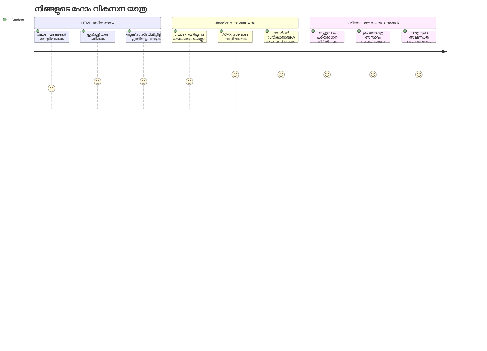
## പ്രീ-ലെക്ചർ ക്വിസ്

[Pre-lecture quiz](https://ff-quizzes.netlify.app/web/quiz/43)

ഓൺലൈനിൽ ഫോർം പൂരിപ്പിച്ച് നിങ്ങളുടെ ഇമെയിൽ ഫോർമാറ്റ് തള്ളി മറികടന്നിട്ടുണ്ടോ? അല്ലെങ്കിൽ സബ്മിറ്റ് കണ്ണി അമർത്തിയപ്പോഴെല്ലാ വിവരങ്ങളും നഷ്ടപ്പെട്ടിട്ടുണ്ടോ? ഇവിടെയുണ്ട് നാം എല്ലാവരും നേരിട്ട അനുഭവങ്ങൾ.

ഫോർമുകൾ നിങ്ങളുടെ ഉപയോക്താക്കളും ആപ്പിന്റെ പ്രവർത്തനങ്ങളും തമ്മിലുള്ള പാലമാണ്. വിമാനങ്ങളെത്തന്നെ സുരക്ഷിതമായി അവരുടെ ലക്ഷ്യസ്ഥാനത്തേക്ക് നയിക്കുന്ന വിമാന നിയന്ത്രകർ പോലുള്ള ചികിത്സാനിയമങ്ങൾ പോലെയാണ് നന്നായി രൂപകല്‍പ്പന ചെയ്ത ഫോറങ്ങൾ വ്യക്തമായ പ്രതികരണം നൽകുകയും ചെലവേറിയ പിഴവുകൾ തടയുകയും ചെയ്യുന്നത്. മോശമായ ഫോർമുകൾ, മറുവശത്ത്, തിരക്കുള്ള വിമാനത്താവളത്തിലെ തെറ്റായ ആശയവിനിമയത്തേക്കാൾ വേഗം ഉപയോക്താക്കളെ വിട്ടുമാറാൻ തുടങ്ങിയേക്കാം.

ഈ പാഠത്തിൽ, നിങ്ങളുടെ സ്റ്റാറ്റിക് ബാങ്കിങ് ആപ്പിനെ ഇന്ററാക്ടീവ് ആപ്പായി മാറ്റാം. ഉപയോക്തൃ ഇൻപുട്ട് വാലിഡേറ്റ് ചെയ്യുന്ന, സർവറുകളുമായി സംവദിക്കുന്ന, സഹായകരമായ പ്രതികരണം നൽകുന്ന ഫോർമുകൾ നിർമ്മിക്കാൻ പഠിക്കാം. ഇതിനെ നിങ്ങളുടെ ആപ്പിന്റെ ഫീച്ചറുകൾ നയിക്കാൻ ഉപയോക്താക്കളെ സഹായിക്കുന്ന കൺട്രോൾ ഇന്റർഫേസ് നിർമ്മിക്കുന്നതെന്ന് കരുതുക.

അവസാനത്തോടെ, വിജയത്തിനായി ഉപയോക്താക്കളെ മാന്ദ്യമാക്കാതെ നയിക്കുന്ന ഒരു പൂർത്തിയായ ലോഗിൻ & രജിസ്ട്രേഷൻ സിസ്റ്റം വാലിഡേഷൻ സഹിതം ഉണ്ടാകുമെന്ന് ഉറപ്പുവരുത്താം.

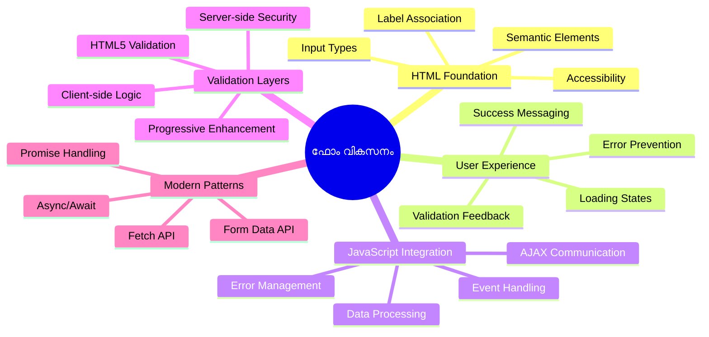
## മുൻകൂട്ടി ആവശ്യശേഷികൾ

ഫോർമുകൾ നിർമ്മിക്കുന്നതിനു മുൻപ്, നിങ്ങൾക്ക് എല്ലാ ഘടകങ്ങളും ശരിയായി സജ്ജീകരിച്ചിട്ടുണ്ടോ എന്ന് ഉറപ്പാക്കാം. ഈ പാഠം മുൻ പാഠത്തിൽ നിന്ന് തുടരുമെങ്കിൽ, നിങ്ങൾ മുന്നോട്ട് പോയെങ്കിൽ ആദ്യം അടിസ്ഥാനങ്ങൾ പ്രവർത്തിക്കുന്നുണ്ടെന്ന് ഉറപ്പാക്കുക.

### ആവശ്യമായ സജ്ജീകരണം

| ഘടകം | സ്ഥിതി | വിവരണം |
|-----------|--------|-------------|
| [HTML ടെംപ്ലേറ്റുകൾ](../1-template-route/README.md) | ✅ ആവശ്യമായതം | നിങ്ങളുടെ അടിസ്ഥാന ബാങ്കിങ് ആപ്പ് ഘടന |
| [Node.js](https://nodejs.org) | ✅ ആവശ്യമാണ് | സർവർക്ക് ജാവാസ്ക്രിപ്റ്റ് റൺടൈം |
| [ബാങ്ക് API സർവർ](../api/README.md) | ✅ ആവശ്യമായത് | ഡാറ്റാ സ്റ്റോറേജിന് ബാക്ക്എൻഡ് സേവനം |

> 💡 **ഡവലപ്പ്മെന്റ് ടിപ്പ്**: നിങ്ങൾ ഒരേസമയം രണ്ട് വേർതിരിച്ച സർവറുകൾ ഓടിക്കുന്നുണ്ട് – ഫ്രണ്ട് എന്റിനായി ഒരു ബാങ്കിങ് ആപ്പ്, ബാക്ക്എൻഡ് API-ക്കായി മറ്റുഒന്ന്. ഇത് യാഥാർത്ഥ്യവൽക്കരണ ഘടനയെ അനുകരിക്കുന്നു, ഫ്രണ്ട്‌എന്റ് & ബാക്ക്എൻഡ് സേവനങ്ങൾ സ്വതന്ത്രമായി പ്രവർത്തിക്കുമ്പോൾ.

### സർവർ కాన്ഫിഗറേഷൻ

**നിങ്ങളുടെ ഡവലപ്പ്മെന്റ് പരിസ്ഥിതി ഉൾപ്പെടുന്നത്:**
- **ഫ്രണ്ട്‌എൻഡ് സർവർ**: നിങ്ങളുടെ ബാങ്കിങ് ആപ്പ് സേവനം (പൊതുയായി പോർട്ട് `3000`)
- **ബാക്ക്എൻഡ് API സർവർ**: ഡാറ്റാ സംഭരണം & പുനരധിപതനം (പോർട്ട് `5000`)
- **ഇരുവർഗവും** സങ്കടങ്ങളില്ലാതെ ഒരുപോലെ പ്രവർത്തിക്കാവുന്നവ

**നിങ്ങളുടെ API കണക്ഷൻ ടെസ്റ്റ് ചെയ്യുക:**
```bash
curl http://localhost:5000/api
# പ്രതീക്ഷിച്ച പ്രതിക്കരണം: "ബാംക് API v1.0.0"
```

**API പതിപ്പിന്റെ പ്രതികരണം കാണുകയാണെങ്കിൽ, നിങ്ങൾ മുന്നോട്ട് പോകാൻ തയ്യാറാണ്!**

---

## HTML ഫോമുകളും കൺറോളുകളും മനസിലാക്കുക

HTML ഫോമുകൾ നിങ്ങളുടെ വെബ് ആപ്പുമായി ഉപയോക്താക്കൾ എങ്ങനെ സംവദിക്കുന്നു എന്നതാണ്. 19-ാം നൂറ്റാണ്ടിലെ ടെലിഗ്രാഫ് സംവിധാനത്തിന് സമാനമാണ് – ഉപയോക്തൃ ഉദ്ദേശവും ആപ്പ് പ്രതികരണവും തമ്മിലുള്ള ആശയവിനിമയ പ്രോട്ടോക്കോൾ. ചിന്താപൂർവം രൂപകല്‍പ്പന ചെയ്താൽ, പിഴവുകൾ പിടികൂടുന്നു, ഇൻപുട്ട് ഫോർമാറ്റിംഗ് നയിക്കുന്നു, സഹായക നിർദേശങ്ങൾ നൽകുന്നു.

ആധുനിക ഫോമുകൾ അടിസ്ഥാന ടെക്സ്റ്റ് ഇൻപുട്ടുകളേക്കാൾ സങ്കീർണമാണ്. HTML5 വൈശിഷ്ട്യമർന്ന ഇൻപുട്ട് തരം പരിചയപ്പെടുത്തിയത് - ഇമെയിൽ വാലിഡേഷൻ, നമ്പർ ഫോർമാറ്റിംഗ്, തീയതി തിരഞ്ഞെടുപ്പു തുടങ്ങി സ്വതന്ത്രമായി കൈകാര്യം ചെയ്യുന്നു. ഈ വികസനങ്ങൾ ആക്‌സസിബിലിറ്റിക്കും മൊബൈൽ ഉപയോഗ അനുഭവങ്ങൾക്കും ഗുണകരമാണ്.

### അനിവാര്യമായ ഫോർം ഘടകങ്ങൾ

**ഓരോ ഫോമിനും ആവശ്യമായ കെട്ടുകെട്ട് ഘടകങ്ങൾ:**

```html
<!-- Basic form structure -->
<form id="userForm" method="POST">
  <label for="username">Username</label>
  <input id="username" name="username" type="text" required>
  
  <button type="submit">Submit</button>
</form>
```

**ഈ കോഡ് ചെയ്യുന്നത്:**
- **ഒരിക്കൽപ്പെടുത്തുന്നു** പ്രത്യേക ഐഡിയിൽ ഫോർം കണ്ടെയ്നർ
- **വ്യക്തമാക്കുന്നു** ഡാറ്റ സമർപ്പിക്കാൻ HTTP մեթഡ്
- **ബന്ധിപ്പിക്കുന്നു** ലേബലുകൾ ഇൻപുട്ടുകൾക്കൊപ്പം ആക്‌സസിബിലിറ്റിക്ക്
- **നിർവഹിക്കുന്നു** ഫോർം പ്രോസസ്സ് ചെയ്യാനുള്ള സബ്മിറ്റ് ബട്ടൺ

### ആധുനിക ഇൻപുട്ട് തരം & കഴിവുകൾ

| ഇൻപുട്ട് തരം | ഉപയോഗം | ഉദാഹരണം |
|------------|---------|---------------|
| `text` | പൊതുവായ ടെക്സ്റ്റ് എൻട്രി | `<input type="text" name="username">` |
| `email` | ഇമെയിൽ പരിശോധന | `<input type="email" name="email">` |
| `password` | മറഞ്ഞ ടെക്സ്റ്റ് എൻട്രി | `<input type="password" name="password">` |
| `number` | സംഖ്യ ഇൻപുട്ട് | `<input type="number" name="balance" min="0">` |
| `tel` | ഫോൺ നമ്പറുകൾ | `<input type="tel" name="phone">` |

> 💡 **ആധുനിക HTML5 പ്രയോജനം**: പ്രത്യേക ഇൻപുട്ട് തരം ഉപയോഗിക്കുന്നത് സ്വയം വാലിഡേഷൻ, അനുയോജ്യമായ മൊബൈൽ കീബോർഡ്, മികച്ച ആക്‌സസിബിലിറ്റി പിന്തുണ നൽകുന്നു, അധിക ജാവാസ്ക്രിപ്റ്റ് ഇല്ലാതെ!

### ബട്ടൺ തരം & പ്രവർത്തനം

```html
<!-- Different button behaviors -->
<button type="submit">Save Data</button>     <!-- Submits the form -->
<button type="reset">Clear Form</button>    <!-- Resets all fields -->
<button type="button">Custom Action</button> <!-- No default behavior -->
```

**ബട്ടൺ തരം ചെയ്യുന്നത്:**
- **സബ്മിറ്റ് ബട്ടണുകൾ**: ഫോർം സമർപ്പനം ട്രിഗർ ചെയ്യുക, ഡാറ്റ എൻഡ്‌പോയിന്റിലേക്ക് അയയ്ക്കുക
- **റിസെറ്റ് ബട്ടണുകൾ**: എല്ലാ ഫീൽഡുകളും ആദ്യം നിലയിലേക്ക് വീണ്ടെടുക്കുക
- **രേദി ബട്ടണുകളും**: രീതി ഇല്ലാതെ പ്രവർത്തിച്ച്കാരണം കസ്റ്റം ജാവാസ്ക്രിപ്റ്റ് ആവശ്യമാണ്

> ⚠️ **പ്രധാന കുറിപ്പ്**: `<input>` ഒരു സ്വയം അടയ്ക്കുന്ന ഘടകമാണ്, ക്ലോസിംഗ് ടാഗ് ആവശ്യമില്ല. ആധുനിക ശൈലി `<input>` ഇത്തരമാണ് എഴുതുന്നത്, സ്‌ളാഷ് ഇല്ലാതെ.

### ലോഗിൻ ഫോർം നിർമ്മാണം

ഇപ്പോൾ ആധുനിക HTML ഫോർം പ്രാക്ടിസുകൾ പ്രദർശിപ്പിക്കുന്ന പ്രായോഗിക ലോഗിൻ ഫോമിനെ ഉണ്ടാക്കാം. അടിസ്ഥാന ഘടനയിൽ തുടക്കി ആക്‌സസിബിലിറ്റി സവിശേഷതകളും വാലിഡേഷനും കൂട്ടിച്ചേർക്കാം.

```html
<template id="login">
  <h1>Bank App</h1>
  <section>
    <h2>Login</h2>
    <form id="loginForm" novalidate>
      <div class="form-group">
        <label for="username">Username</label>
        <input id="username" name="user" type="text" required 
               autocomplete="username" placeholder="Enter your username">
      </div>
      <button type="submit">Login</button>
    </form>
  </section>
</template>
```

**ഇവിടെ സംഭവിക്കുന്നത്:**
- **ഘടിപ്പിക്കുന്നു** സെമാന്റിക് HTML5 ഘടകങ്ങളെ കൈകാര്യം ചെയ്ത് ഫോർം അടിച്ചതായി
- **ഗ്രൂപ്പുചെയ്യുന്നു** പ്രസക്തമായ ഘടകങ്ങൾ `div` കണ്ടെയ്‌നർ ക്ലാസ്സുകൾ ഉപയോഗിച്ച്
- **ബന്ധിപ്പിക്കുന്നു** ലേബലുകളും ഇൻപുട്ടുകളും `for` & `id` ഉപയോഗിച്ച്
- **ചേർക്കുന്നു** ആധുനിക ഗുണങ്ങൾ പോലെ `autocomplete`, `placeholder` മെച്ചപ്പെട്ട UX നു
- **ഉള്ളടക്കുന്നു** `novalidate` ബ്രൗസർ ഡിഫോൾട്ട് മാറ്റി ജാവാസ്ക്രിപ്റ്റ് വാ്ലിഡേഷൻ നടത്താൻ

### ശരിയായ ലേബലുകളുടെ ശക്തി

**ആധുനിക വെബ് വികസനത്തിൽ ലേബലുകൾ എന്തുകൊണ്ട് പ്രധാനം:**

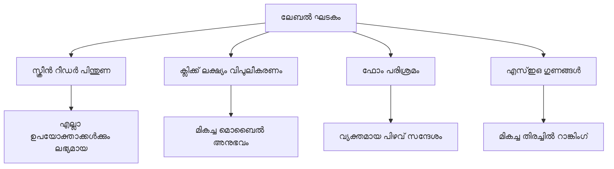
**ശ്രദ്ധയോടെ ലേബലുകൾ നൽകുന്നത് ചെയ്യുന്നത്:**
- **സ്ക്രീൻ റീഡറുകൾക്ക്** ഫോർം ഫീൽഡുകൾ മികച്ച രീതിയിൽ പ്രഖ്യാപിക്കാൻ
- **ക്ലിക്കു പരിധി** വർദ്ധിപ്പിക്കുന്നു (ലേബൽ ക്ലിക്കുചെയ്യുമ്പോൾ ഇൻപുട്ടിൽ ഫോകസ്)
- **മൊബൈൽ ഉപയോഗം മെച്ചപ്പെടുത്തി** കൂടുതൽ ടച്ച് ടാർഗെറ്റുകൾ നൽകുന്നു
- **ഫോർം വാലിഡേഷൻ** സൗകര്യപ്രദം പിഴവ് സന്ദേശങ്ങളോടൊപ്പം
- **SEO മെച്ചപ്പെടുത്തുന്നു** ഫോർം ഘടകങ്ങളിൽ സെമാന്റിക് അർത്ഥം നൽകിയും

> 🎯 **ആക്‌സസിബിലിറ്റി ലക്ഷ്യം**: എല്ലാ ഫോർം ഇൻപുട്ടിനും അനുബന്ധമായ ലേബൽ വേണം. ഈ ലളിതമായ പാടവ് എല്ലാ ഉപയോക്താക്കൾക്കും, വിവിധ കഴിവുകൾ ഉള്ളവർക്കും നിങ്ങളുടെ ഫോമുകൾ പ്രയോജനപ്രദമാക്കും, അനുഭവം മെച്ചപ്പെടുത്തും.

### രജിസ്ട്രേഷൻ ഫോർം നിർമ്മാണം

പൂർണ്ണ ഉപയോക്തൃ അക്കൗണ്ട് സൃഷ്ടിക്കുവാൻ രജിസ്ട്രേഷൻ ഫോർത്തിൽ കൂടുതൽ വിശദ വിവരങ്ങൾ ആവശ്യമാണ്. മുഖ്യ ആധുനിക HTML5 സവിശേഷതകളും വളർത്തിയ ആക്‌സസിബിലിറ്റി സവിശേഷതകളും ഉൾപ്പെടുത്താം.

```html
<hr/>
<h2>Register</h2>
<form id="registerForm" novalidate>
  <div class="form-group">
    <label for="user">Username</label>
    <input id="user" name="user" type="text" required 
           autocomplete="username" placeholder="Choose a username">
  </div>
  
  <div class="form-group">
    <label for="currency">Currency</label>
    <input id="currency" name="currency" type="text" value="$" 
           required maxlength="3" placeholder="USD, EUR, etc.">
  </div>
  
  <div class="form-group">
    <label for="description">Account Description</label>
    <input id="description" name="description" type="text" 
           maxlength="100" placeholder="Personal savings, checking, etc.">
  </div>
  
  <div class="form-group">
    <label for="balance">Starting Balance</label>
    <input id="balance" name="balance" type="number" value="0" 
           min="0" step="0.01" placeholder="0.00">
  </div>
  
  <button type="submit">Create Account</button>
</form>
```

**ഇവിടെ ചെയ്തു:**
- **ഫീൽഡുകൾ** ഓരോന്നും കണ്ടെയ്‌നർ ഡിവുകളിൽ ക്രമീകരിച്ച് മെച്ചപ്പെട്ട ലേ ഔട്ടിനായി
- **ഉപയോഗിച്ചു** അനുയോജ്യമായ `autocomplete` ബ്രൗസർ ഓട്ടോഫിൽ പിന്തുണയ്ക്ക്
- **ഉൾപ്പെടുത്തിയ** ഉപയോക്തൃ ഇൻപുട്ട് നയിക്കാൻ ഉപകാരപ്രദമായ പ്ലേര്ഹോൾഡർ ടെക്സ്റ്റ്
- **നൽ‌കി** യുക്തിപരമായ ഡീഫോൾറ്റ് മൂല്യം `value` ഉപയോഗിച്ച്
- **പ്രയോഗിച്ചു** വാലിഡേഷൻ പ്രവർത്തനങ്ങൾ `required`, `maxlength`, `min`
- **ഉപയോഗിച്ചു** ബേലൻസ് ഫീൽഡിനായ `type="number"` ഇൽ ഡെസിമൽ പിന്തുണ കൂടെ

### ഇൻപുട്ട് തരം & പ്രവർത്തനം വിശകലനം

**ആധുനിക ഇൻപുട്ട് തരം കൂടുതൽ കഴിവുകൾ നൽകുന്നു:**

| സവിശേഷത | പ്രയോജനം | ഉദാഹരണം |
|---------|---------|----------|
| `type="number"` | മൊബൈൽ സംഖ്യ കീബോർഡ് | ലളിതമായ ബാലൻസ് ഇൻപുട്ടിലേക്ക് |
| `step="0.01"` | ഡെസിമൽ നിർണ്ണയം | കറൻസിയിൽ സെന്റുകൾ അനുവദിക്കുന്നു |
| `autocomplete` | ബ്രൗസർ ഓട്ടോഫിൽ | ഫോമുകൾ വേഗത്തിൽ പൂരിപ്പിക്കാൻ |
| `placeholder` | പ്രസ്താവനാത്മക സൂചനകൾ | ഉപയോക്താവിന്റെ പ്രതീക്ഷകൾ നയിക്കുന്നു |

> 🎯 **ആക്‌സസിബിലിറ്റി വെല്ലുവിളി**: ഫോമകൾ കീബോർഡ് മാത്രം ഉപയോഗിച്ച് സംവഹിക്കാൻ ശ്രമിക്കുക! `Tab` ഉപയോഗിക്കുക ഫീൽഡുകൾക്കിടയിൽ പോകാൻ, `Space` ബോക്സുകൾ പരിശോധിക്കാൻ, `Enter` സമർപ്പിക്കാൻ. ഇത് സ്ക്രീൻ റീഡർ ഉപയോക്താക്കൾ ഫോമുകൾക്ക് എങ്ങനെ സമീപിക്കുന്നു എന്ന് മനസ്സിലാക്കാൻ സഹായിക്കും.

### 🔄 **ഫലിതപരമായ പരിശോധന**
**ഫോം അടിസ്ഥാന سمجھല്‍:**
ജാവാസ്ക്രിപ്റ്റ് പ്രവർത്തിപ്പിക്കാതെ മുൻപ് ഉറപ്പാക്കുക:
- ✅ സെമാന്റിക് HTML ആക്‌സസിബിള്‍ ഫോമുകൾ സൃഷ്ടിക്കുന്നു
- ✅ ഇൻപുട്ട് തരം മൊബൈൽ കീബോർഡ് & വാലിഡേഷന്‍ പ്രാധാന്യം
- ✅ ലേബലുകളും ഫോർം കൺട്രോളുകളും ബന്ധം
- ✅ ഫോർം അറ്റ്രിബ്യൂട്ടുകൾ ബ്രൗസർ ഡിഫോൾട്ട് പ്രവർത്തനത്തെ എങ്ങനെ ബാധിക്കുന്നു

**ത്വരിത സ്വയം പരിശോദനം**: ജാവാസ്ക്രിപ്റ്റ് ഇല്ലാതെ ഫോർം സമർപ്പിച്ചാൽ എന്ത് സംഭവിക്കും?
*ഉത്തരം: ബ്രൗസർ ഡിഫോൾട്ട് സമർപ്പണം നടത്തും, സാധാരണയായി ആക്ഷൻ URL-ൽ റീഡയറക്ട് ചെയ്യും*

**HTML5 ഫോർം ഗുണങ്ങൾ**:
- **അകമ്പടി വാലിഡേഷൻ**: സ്വതന്ത്ര ഇമെയിൽ & നമ്പർ ഫോർമാറ്റ് പരിശോധന
- **മൊബൈൽ സൗഹൃദം**: അനുസൃത കീബോർഡുകൾ
- **ആക്‌സസിബിലിറ്റി**: സ്ക്രീൻ റീഡർ പിന്തുണ & കീബോർഡ് നയനം
- **പ്രോഗ്രസീവ് എൻഹാൻസ്‌മെന്റ്**: ജാവാസ്ക്രിപ്റ്റ് ഇല്ലാതെ പോലും പ്രവർത്തിപ്പിക്കാൻ കഴിയുന്നത്

## ഫോർം സമർപ്പിക്കൽ രീതികൾ മനസിലാക്കുക

ആയിരിക്കും അടുത്തുള്ളപ്പോൾ, അപേക്ഷ ഫോർം പൂരിപ്പിച്ച് സബ്മിറ്റ് ചെയ്തപ്പോൾ, ആ ഡാറ്റ എവിടെ പോകുന്നു – സാധാരണയായി ഒരു സർവറിലേക്ക് പോകും, അത് ഡാറ്റയെ സംരക്ഷിക്കുന്നു. ഇത് വിവിധ രീതികളിൽ നടക്കാം, ശരിയായ ഒരു വഴిని തിരഞ്ഞെടുക്കുന്നത് ഭാവിയിൽ സുഖകരമാക്കും.

സബ്മിറ്റ് ബട്ടൺ ഞെക്കുമ്പോൾ എന്ത് സംഭവിക്കുന്നു എന്ന് നോക്കാം.

### ഡിഫോൾട്ട് ഫോർം പ്രവർത്തനം

ആദ്യം, അടിസ്ഥാന ഫോർം സമർപ്പണം എന്ത് സംഭവിക്കുന്നു എന്നും നോക്കുക:

**നിങ്ങളുടെ നിലവിലെ ഫോമുകൾ പരീക്ഷിക്കുക:**
1. നിങ്ങളുടെ ഫോമിൽ *Register* ബട്ടൺ അമർത്തുക
2. ബ്രൗസറിന്റെ അഡ്രസ് ബാറിലെ മാറ്റം ശ്രദ്ധിക്കുക
3. പേജ് റീലോഡ് ആകുകയും URL-ൽ ഡാറ്റ കാണപ്പെടുകയും ചെയ്യുന്നുവെന്ന് ശ്രദ്ധിക്കുക


### HTTP മെഥഡുകൾ താരതമ്യം

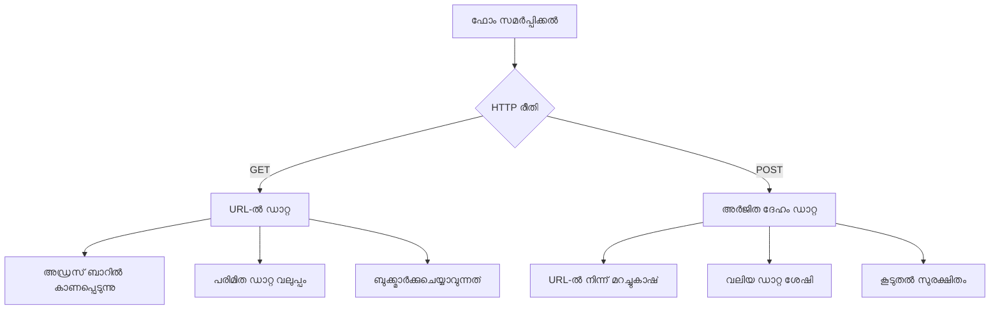
**വ്യത്യാസങ്ങൾ മനസ്സിലാക്കുക:**

| മെഥഡ് | ഉപയോഗം | ഡാറ്റ സ്ഥലം | സുരക്ഷാ നില | വലിപ്പ പരിധി |
|--------|----------|---------------|----------------|-------------|
| `GET` | തിരയൽ, ഫിൽറ്ററുകൾ | URL പാരാമീറ്ററുകൾ | താഴ്ന്നത് (കാണാവുന്നത്) | ~2000 അക്ഷരങ്ങൾ |
| `POST` | ഉപയോക്തൃ അക്കൗണ്ടുകൾ, സംവേദനാത്മക ഡാറ്റ | അഭ്യർത്ഥന ശരീരം | ഉയർന്നത് (മറഞ്ഞത്) | യഥാർത്ഥപരിധിയില്ല |

**പ്രധാന വ്യത്യാസങ്ങൾ:**
- **GET**: ഫോർം ഡാറ്റ URL ക്വറി പാരാമീറ്ററുകളായി ചേർക്കുന്നു (തിരയൽ പ്രക്രിയകൾക്ക് അനുയോജ്യം)
- **POST**: ഡാറ്റ അന്വേഷണം ശരീരത്തിലേക്ക് ഉൾക്കൊള്ളുന്നു (സർവേദനാത്മക വിവരങ്ങൾക്ക് പ്രധാനമാണ്)
- **GET-ന് പരിമിതികൾ**: വലിപ്പ പരിധി, കാഴ്ച, ബ്രൗസർ ചരിത്രം
- **POST-ന് ആനുകൂല്യങ്ങൾ**: വലിയ ഡാറ്റ കൈകാര്യം ചെയ്യൽ, സ്വകാര്യത, ഫയൽ അപ്‌ലോഡ് പിന്തുണ

> 💡 **മിക്കവ് നല്ലതാകേണം**: തിരയൽ ഫോമുകൾക്ക് GET ഉപയോഗിക്കുക (ഡാറ്റ ഉയർത്തൽ), രജിസ്ട്രേഷൻ, ലോഗിൻ തുടങ്ങിയതിനായി POST ഉപയോഗിക്കുക.

### ഫോർം സമർപ്പിക്കൽ ക്രമീകരിക്കൽ

നിങ്ങളുടെ രജിസ്ട്രേഷൻ ഫോർം POST മെഥഡ് ഉപയോഗിച്ച് ബാക്ക്എൻഡ് API-യുമായി ശരിയായി ആശയവിനിമയം നടത്തും രീതിയിൽ ക്രമീകരിക്കാം:

```html
<form id="registerForm" action="//localhost:5000/api/accounts" 
      method="POST" novalidate>
```

**ഈ ക്രമീകരണം ചെയ്യുന്നത്:**
- **ഫോർം സമർപ്പിക്കൽ** API എൻഡ്‌പോയിന്റിലേക്ക് നയിക്കുന്നു
- **POST മെഥഡ്** സുരക്ഷിത ഡാറ്റ സമർപ്പണത്തിനായി ഉപയോഗിക്കുന്നു
- **`novalidate`** ജാവാസ്ക്രിപ്റ്റ് ഉപയോഗിച്ച് വാലിഡേഷൻ കൈകാര്യം ചെയ്യാൻ

### ഫോർം സമർപ്പിക്കൽ പരീക്ഷണം

**ഫോർം പരീക്ഷിക്കാൻ ഇങ്ങനെ ചെയ്യുക:**
1. രജിസ്ട്രേഷൻ ഫോർം വിവരങ്ങൾ പൂരിപ്പിക്കുക
2. "Create Account" ബട്ടൺ അമർത്തുക
3. നിങ്ങളുടെ ബ്രൗസറിൽ സർവർ പ്രതികരണം ശ്രദ്ധിക്കുക

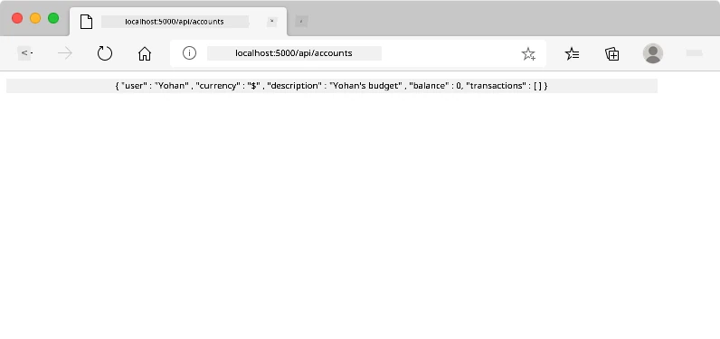

**നിങ്ങൾ കാണേണ്ടത്:**
- **ബ്ലൗസർ API എൻഡ്‌പോയിന്റിലേക്ക് റീഡയറക്ട് ചെയ്യുന്നു**
- **നിങ്ങൾ സൃഷ്ടിച്ച അക്കൗണ്ട് ഡാറ്റയുടെ JSON പ്രതികരണം**
- **അക്കൗണ്ട് വിജയകരമായി സൃഷ്ടിച്ചതായി സർവർ സ്ഥിരീകരണം**

> 🧪 **പ്രയോഗ സമയം**: ഒരേ യൂസർനെയിം ഉപയോഗിച്ച് വീണ്ടും രജിസ്റ്റർ ചെയ്യാൻ ശ്രമിക്കുക. എന്ത് പ്രതികരണമാണ് കിട്ടുന്നത്? ഇത് സർവർ ഇരട്ടി ഡാറ്റയും പിഴവും എങ്ങനെ കൈകാര്യം ചെയ്യുന്നതായിരിക്കും മനസിലാക്കാൻ സഹായിക്കുന്നു.

### JSON പ്രതികരണങ്ങൾ മനസിലാക്കുക

**സർവർ നിങ്ങളുടെ ഫോർം വിജയകരമായി പ്രോസസ്സ് ചെയ്തപ്പോള്‍:**
```json
{
  "user": "john_doe",
  "currency": "$",
  "description": "Personal savings",
  "balance": 100,
  "id": "unique_account_id"
}
```

**ഈ പ്രതികരണം സ്ഥിരീകരിക്കുന്നു:**
- **നിങ്ങളുടെ നൽകിയ ഡാറ്റയോടെ** പുതിയ അക്കൗണ്ട് സൃഷ്ടിക്കുന്നു
- **വിശിഷ്ട തിരിച്ചറിയൽ** ഭാവിയിൽ വാഗ്ദാനം ചെയ്യുന്നു
- **ഉൾക്കൊള്ളുന്നു** മുഴുവൻ അക്കൗണ്ട് വിവരങ്ങൾ സ്ഥിരീകരണത്തിന്
- **സൂചിപ്പിക്കുന്നത്** ഡാറ്റാബേസ് വിജയകരമായി സൂക്ഷിച്ചതായി

## ജാവാസ്ക്രിപ്റ്റ് ഉപയോഗിച്ച് ആധുനിക ഫോർം കൈകാര്യം ചെയ്യൽ

പാരമ്പര്യ ഫോർം സമർപ്പണം പേജിനെ പൂർണമായും പുനഃലോഡ് ചെയ്യുന്നു, ആദ്യകാല സ്പേസ് മിഷനുകൾ പോലെ എല്ലാ സിസ്റ്റങ്ങളും പൂർണ്ണമായി പുനഃസജ്ജമാക്കേണ്ടിവരുമേൽ വഴി കോഴ്സ് ശരിയാക്കാൻ. ഇത് ഉപയോഗകർത്തൃ അനുഭവം തടസ്സപ്പെടുത്തുകയും ആപ്പിന്റെ നില നഷ്ടപ്പെടുകയും ചെയ്യുന്നു.

ജാവാസ്ക്രിപ്റ്റ് ഫോർം കൈകാര്യം ചെയ്യൽ ആധുനിക ബഹിരാകാശയാത്രകളുടെ തുടർച്ചയായ മാർഗ്ഗനിർദ്ദേശ സംവിധാനങ്ങളെപ്പോലെ പ്രവർത്തിക്കുന്നു – റിയൽ-ടൈം പരിഷ്കരണങ്ങൾ കൈകാര്യം ചെയ്യുന്നു, കൈമാറ്റം നഷ്ടമാകാതെ. നാം ഫോർം സമർപ്പണം തടഞ്ഞ്, ഉടൻ പ്രതികരണം നൽകുകയും പിശകുകൾ സുഗമമായി കൈകാര്യം ചെയ്യുകയും, സർവർ പ്രതികരണങ്ങളിൽ അടിസ്ഥാനമാക്കി ഇന്റർഫേസ് അപ്ഡേറ്റ് ചെയ്യുകയും ഉപയോക്താവ് ആപ്പിൽ തുടരാൻ കഴിയും.

### പേജ് പുനഃലോഡ് ഒഴിവാക്കുന്നത് എന്തിന്?

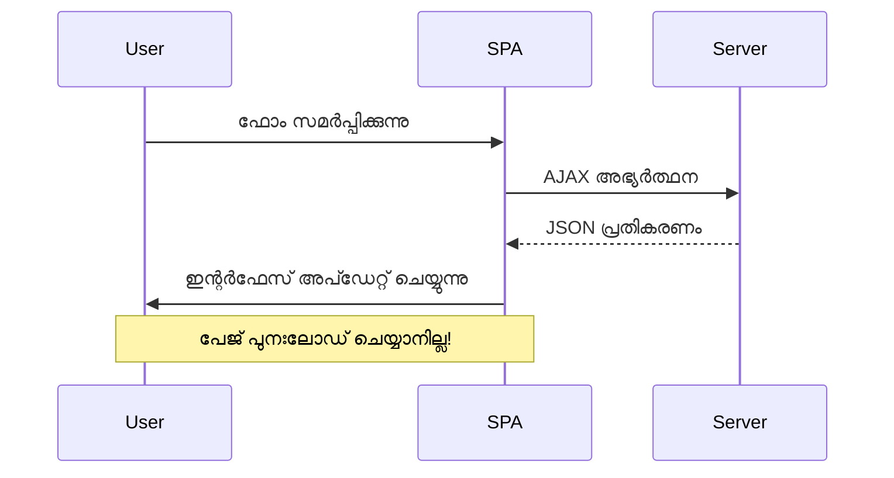
**ജാവാസ്ക്രിപ്റ്റ് ഫോർം കൈകാര്യം ചെയ്യലിനുള്ള ഗുണങ്ങൾ:**
- **ആപ്പ് നിലയും ഉപയോക്തൃ കോൺടെക്സ്റ്റും** നിലനിർത്തുന്നു
- **തत്കാൽ പ്രതികരണവും ലോഡിംഗ് സൂചകങ്ങളും** നൽകുന്നു
- **ഡൈനമിക് പിശക് കൈകാര്യം ചെയ്യലും വാലിഡേഷനും** സജ്ജമാക്കുന്നു
- **സ്വതന്ത്രമായ, ആപ്പ് പോലെയുള്ള അനുഭവങ്ങൾ സൃഷ്ടിക്കുന്നു**
- **സർവർ പ്രതികരണങ്ങളുടെ അടിസ്ഥാനത്തിൽ വ്യത്യസ്ത ലോജിക് അനുകൂലമാണ്**

### പാരമ്പര്യ മുതൽ ആധുനിക ഫോമിലേക്ക് മാറൽ

**പാരമ്പര്യ സമീപനത്തിന്റെ വെല്ലുവിളികൾ:**
- **ഉപയോക്താക്കളെ ആപ്പിൽനിന്ന് മാറ്റിവയ്ക്കുന്നു**
- **നിലവിലെ ആപ്പ് നിലയും കോൺടെക്സ്റ്റും നശിക്കുന്നു**
- **ലളിതമായ പ്രവർത്തനങ്ങൾക്ക് പൂർണ പേജ് പുനഃലോഡ് വേണ്ടിവരുന്നു**
- **ഉപയോക്തൃ പ്രതികരണത്തിന്റെ നിയന്ത്രണം കുറവാണ്**

**ആധുനിക ജാവാസ്ക്രിപ്റ്റ് സമീപനത്തിന്റെ പ്രയോജനം:**
- **ഉപയോക്താക്കളെ ആപ്പിനുള്ളിൽ തന്നെ പാലിക്കുന്നു**
- **എല്ലാ ആപ്പ് നിലയും ഡാറ്റയും നിലനിർത്തുന്നു**
- **റിയൽ-ടൈം വാലിഡേഷൻ & പ്രതികരണം നിയന്ത്രണം**
- **പ്രോഗ്രസീവ് എൻഹാൻസ്മെന്റ് & ആക്‌സസിബിലിറ്റി പിന്തുണ**

### ജാവാസ്ക്രിപ്റ്റ് ഫോർം കൈകാര്യം എങ്ങനെ നടപ്പിലാക്കാം

പാരമ്പര്യ ഫോർം സമർപ്പണം ആധുനിക ജാവാസ്ക്രിപ്റ്റ് ഇവന്റ് കൈകാര്യം ചെയ്യലിൽ മാറ്റാം:

```html
<!-- Remove the action attribute and add event handling -->
<form id="registerForm" method="POST" novalidate>
```

**നിങ്ങളുടെ `app.js` ഫയലിൽ രജിസ്ട്രേഷന്റ ലോജിക് ചേർക്കുക:**

```javascript
// ആധുനിക ഇവന്റ്-ഡ്രിവൻ ഫോം കൈകാര്യംചെയ്യൽ
function register() {
  const registerForm = document.getElementById('registerForm');
  const formData = new FormData(registerForm);
  const data = Object.fromEntries(formData);
  const jsonData = JSON.stringify(data);
  
  console.log('Form data prepared:', data);
}

// പേജ് ലോഡ് ചെയ്യുമ്പോൾ ഇവന്റ് ലിസണർ ചേർക്കുക
document.addEventListener('DOMContentLoaded', () => {
  const registerForm = document.getElementById('registerForm');
  registerForm.addEventListener('submit', (event) => {
    event.preventDefault(); // ഡിഫോള்ட் ഫോം സമർപ്പണം തടയുക
    register();
  });
});
```

**ഇവിടെ സംഭവിക്കുന്നത്:**
- `event.preventDefault()` ഉപയോഗിച്ച് ഡിഫോൾട്ട് സമർപ്പണം തടയുന്നു
- ആധുനിക DOM സെലക്ഷൻ വഴി ഫോർം എലമെന്റ് തിരയുന്നു
- ശക്തമായ `FormData` API ഉപയോഗിച്ച് ഫോർം ഡാറ്റ പ്രതിനിധാനം ചെയ്യുന്നു
- `Object.fromEntries()` ഉപയോഗിച്ച് FormData നും പLAIN ഒബ്‌ജക്ടായി പരിവർത്തനം ചെയ്യുന്നു
- JSON ഫോർമാറ്റിലേക്ക് സീരിയലൈസ് ചെയ്യുന്നു സർവർ ആശയവിനിമയത്തിനായി
- പിശകുകൾ കണ്ടെത്താനും സ്ഥിരീകരിക്കാനുമുള്ള ഡാറ്റ Console ലോഗ് ചെയ്യുന്നു

### FormData API മനസിലാക്കുക

**FormData API ശക്തമായ ഫോർം മാനേജ്‌മെന്റ് നൽകുന്നു:**
```javascript
// FormData എങ്ങനെയാണ് വിവരങ്ങൾ പിടിച്ചെടുക്കുന്നത് എന്നതു ഉദാഹരണം
const formData = new FormData(registerForm);

// FormData സ്വയം പിടിച്ചെടുക്കുന്നു:
// {
//   "ഉപയോക്താവ്": "ജോൺ_ഡോ",
//   "കറൻസി": "$",
//   "വിവരണം": "വ്യക്തിഗത അക്കൗണ്ട്",
//   "ബാലൻസ്": "100"
// }
```

**FormData API ആനുകൂല്യങ്ങൾ:**
- **സമഗ്ര ശേഖരണം**: ടെക്‌സ്‌ട്, ഫയലുകൾ, സങ്കീർണ്ണ ഇൻപുട്ടുകൾ ഉൾപ്പെടെ എല്ലാ ഫോർം ഘടകങ്ങളും പിടിക്കുന്നു
- **ടൈപ്പ് ബോധം**: കസ്റ്റം കോഡിങ്ങ് വേണ്ടാതെ fərറൈ തരം കൈകാര്യം ചെയ്യുന്നു
- **പ്രവർത്തകത്വം**: ഏക API കോളിലൂടെ മാനുവൽ ഫീൽഡ് ശേഖരം ഒഴിവാക്കുന്നു
- **സാന്ദ്രത**: ഫോർം ഘടന വികസിക്കുമ്പോഴും പ്രവർത്തനം നിലനിർത്തുന്നു

### സെർവർ കമ്മ്യൂണിക്കേഷൻ ഫങ്‌ഷൻ സൃഷ്ടിക്കൽ

ഇപ്പോൾ ആധുനിക ജാവാസ്ക്രിപ്റ്റ് പാറ്റേണുകൾ ഉപയോഗിച്ച് നിങ്ങളുടെ API സെർവറുമായി പരിപൂർണമായ സംവാദം നടത്താൻ സുസ്ഥിര ഫങ്‌ഷൻ നിർമ്മിക്കാം:

```javascript
async function createAccount(account) {
  try {
    const response = await fetch('//localhost:5000/api/accounts', {
      method: 'POST',
      headers: { 
        'Content-Type': 'application/json',
        'Accept': 'application/json'
      },
      body: account
    });
    
    // പ്രതികരണം വിജയകരമായിരുന്നുവെന്ന് പരിശോധിക്കുക
    if (!response.ok) {
      throw new Error(`HTTP error! status: ${response.status}`);
    }
    
    return await response.json();
  } catch (error) {
    console.error('Account creation failed:', error);
    return { error: error.message || 'Network error occurred' };
  }
}
```

**അസിങ്ക്രണസ് ജാവാസ്ക്രിപ്റ്റ് മനസ്സിലാക്കൽ:**

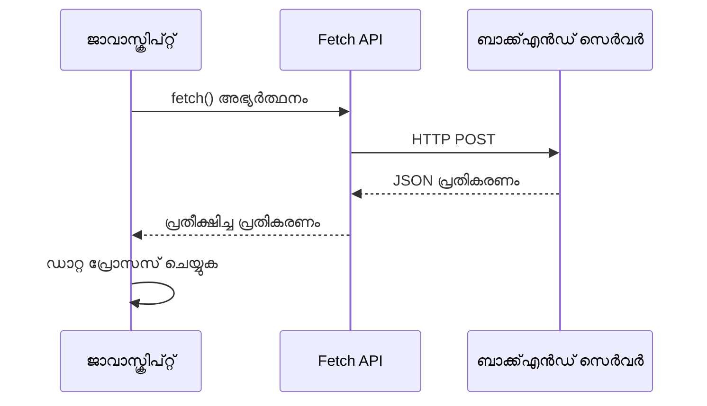
**ഈ ആധുനിക നടപ്പാക്കലിന്റെ നേട്ടങ്ങൾ:**
- **`async/await` ഉപയോഗിച്ച്** വായിക്കാൻ സുലഭമായ അസിങ്ക്രണസ് കോഡ്
- **try/catch ബ്ലോക്കുകൾ കൊണ്ട്** ശരിയായ തെറ്റ് കൈകാര്യനം ഉൾപ്പെടുത്തുന്നു
- **ഡാറ്റ പ്രോസസ്സ് ചെയ്യുന്നതിന് മുമ്പ്** പ്രതികരണ നില പരിശോധിക്കുന്നു
- **JSON സംവാദത്തിനായി** അനുയോജ്യമായ ഹെഡറുകൾ സജ്ജമാക്കുന്നു
- **ഡീബഗിന് വിശദമായ തെറ്റ് സന്ദേശങ്ങൾ നല്‍കുന്നു**
- **വിജയം, പിശക് കേസുകൾക്ക്** സ്മൃശമായ ഡാറ്റ ഘടന തിരിച്ചുകൊടുക്കുന്നു

### ആധുനിക Fetch API ശക്തി

**പഴയ രീതികൾക്കുനേരെ Fetch API ആനുകൂല്യങ്ങൾ:**

| സവിശേഷത | ഗുണം | നടപ്പാക്കൽ |
|---------|---------|----------------|
| Promise അടിസ്ഥാനമാക്കി | വൃത്തിയുള്ള അസിങ്ക്രണസ് കോഡ് | `await fetch()` |
| അഭ്യർത്ഥന ഇച്ഛാനുസൃതമാക്കൽ | പൂർണ്ണ HTTP നിയന്ത്രണം | ഹെഡറുകൾ, രീതികൾ, ബോഡി |
| പ്രതികരണം കൈകാര്യം ചെയ്യൽ | ലച്ചിലായ ഡാറ്റ പാഴ്സിങ് | `.json()`, `.text()`, `.blob()` |
| പിശക് കൈകാര്യനം | സമഗ്ര പിശക് പിടിക്കൽ | Try/catch ബ്ലോക്കുകൾ |

> 🎥 **കൂടുതൽ പഠിക്കുക**: [Async/Await Tutorial](https://youtube.com/watch?v=YwmlRkrxvkk) - ആധുനിക വെബ് വികസനത്തിന് അസിങ്ക്രണസ് ജാവാസ്ക്രിപ്റ്റ് പാറ്റേണുകൾ മനസ്സിലാക്കൽ.

**സെർവർ കമ്മ്യൂണിക്കേഷനുമായി ബന്ധപ്പെട്ട പ്രധാന ആശയങ്ങൾ:**
- **അസിങ്ക്രൺ functions** സെർവർ പ്രതികരണങ്ങൾക്കായി നിർവഹണം താറζίചെയ്യാൻ അനുവദിക്കുന്നു
- **Await കീവേഡ്** അസിങ്ക്രണസ് കോഡ് സമകാലിക കോഡുപോലെ വായിക്കാൻ സഹായിക്കുന്നു
- **Fetch API** ആധുനിക, പ്രോമിസ്-അടിസ്ഥാന HTTP അഭ്യർത്ഥനകൾ നൽകുന്നു
- **പിശക് കൈകാര്യനം** നെറ്റ്‌വർക്കിലെ പ്രശ്നങ്ങൾക്ക്Gracefully പ്രതികരിക്കാൻ സഹായിക്കുന്നു

### രജിസ്‌ട്രേഷൻ ഫങ്‌ഷൻ പൂർത്തിയാക്കൽ

ഒരു സമ്പൂർണ്ണ, ഉത്പാദക തയാറായ രജിസ്‌ട്രേഷൻ ഫങ്‌ഷൻ എല്ലാം ഒരുമിച്ച് കൊണ്ടുവരാം:

```javascript
async function register() {
  const registerForm = document.getElementById('registerForm');
  const submitButton = registerForm.querySelector('button[type="submit"]');
  
  try {
    // ലോഡിംഗ് അവസ്ഥ കാണിക്കുക
    submitButton.disabled = true;
    submitButton.textContent = 'Creating Account...';
    
    // ഫോം ഡാറ്റ പ്രോസസ്സ് ചെയ്യുക
    const formData = new FormData(registerForm);
    const jsonData = JSON.stringify(Object.fromEntries(formData));
    
    // സെർവറിലേക്ക് അയയ്ക്കുക
    const result = await createAccount(jsonData);
    
    if (result.error) {
      console.error('Registration failed:', result.error);
      alert(`Registration failed: ${result.error}`);
      return;
    }
    
    console.log('Account created successfully!', result);
    alert(`Welcome, ${result.user}! Your account has been created.`);
    
    // വിജയകരമായ രജิส്ട്രേഷന്ക്ക് ശേഷം ഫോം പുനഃസജ്ജമാക്കുക
    registerForm.reset();
    
  } catch (error) {
    console.error('Unexpected error:', error);
    alert('An unexpected error occurred. Please try again.');
  } finally {
    // ബട്ടൺ അസ്ഥിത്വം പുനഃസ്ഥാപിക്കുക
    submitButton.disabled = false;
    submitButton.textContent = 'Create Account';
  }
}
```

**ഈ വർദ്ധിപ്പിച്ച നടപ്പാക്കൽ ഉൾക്കൊള്ളിക്കുന്നു:**
- **ഫോം സബ്‌മിഷൻ സമയത്ത് കാഴ്ചപരമായ പ്രതികരണം നൽകുന്നു**
- **ഡ്യൂപ്ലിക്കേറ്റ് സബ്‌മിഷനുകൾ തടയാൻ സബ്മിറ്റ് ബട്ടൺ അപ്രാപ്യം വയ്ക്കുന്നു**
- **अपേക്ഷിതവും അപേക്ഷിതവുമായ പിശകുകളും ക്രമീകരപ്രദമായി കൈകാര്യം ചെയ്യുന്നു**
- **ഉപയോക്തൃ സൗഹൃദ വിജയം/പിശക് സന്ദേശങ്ങൾ കാണിക്കുന്നു**
- **വിജയകരമായ രജിസ്ട്രേഷനിന് ശേഷം ഫോർം പുനസജ്ജമാക്കുന്നു**
- **ഫലം എങ്കിലും UI നില പുനസ്ഥാപിക്കുന്നു**

### നിങ്ങളുടെ നടപ്പാക്കൽ പരിശോധിക്കൽ

**ബ്രൗസർ ഡെവലപ്പർ ടൂളുകൾ തുറന്ന് രജിസ്ട്രേഷൻ പരിശോധിക്കുക:**

1. **ബ്രൗസർ കോൺസോൾ തുറക്കുക** (F12 → Console tab)
2. **രജിസ്‌ട്രേഷൻ ഫോം പൂരിപ്പിക്കുക**
3. **"Create Account" ക്ലിക്ക് ചെയ്യുക**
4. **കോൺസോൾ സന്ദേശങ്ങളും ഉപയോക്തൃ പ്രതികരണങ്ങളും കണ്ട് ആസ്വദിക്കുക**

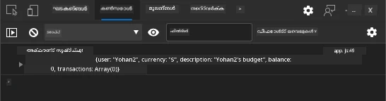

**നിങ്ങൾ കാണേണ്ടത്:**
- **സബ്‌മിറ്റ് ബട്ടണിൽ ലോഡിംഗ് സ്വീകരണം**
- **പ്രക്രിയയുടെ വിശദാംശങ്ങൾ കോൺസോൾ ലോഗുകളിലൂടെ**
- **അക്കൗണ്ട് സൃഷ്ടി വിജയിച്ചാൽ വിജയം സന്ദേശം**
- **വിജയകരമായ സബ്മിഷൻ കഴിഞ്ഞ് ഫോർം ആത്മനിർമ്മിതമായി പുനഃസജ്ജമാക്കി**

> 🔒 **സുരക്ഷാ പരിഗണന**: ഇപ്പോൾ ഡാറ്റ HTTP മുഖേന സഞ്ചരിക്കുന്നതാണ്, ഇത് ഉത്പാദനത്തിന് സുരക്ഷിതമല്ല. യഥാർത്ഥ ആപ്പുകളിൽ ഡാറ്റ എൻക്രിപ്റ്റ് ചെയ്യാൻ എപ്പോഴും HTTPS ഉപയോഗിക്കുക. കൂടുതൽ അറിയുക [HTTPS security](https://en.wikipedia.org/wiki/HTTPS) എന്തുകൊണ്ട് ഉപയോക്തൃ ഡാറ്റ സംരക്ഷിക്കാൻ ഇത് അനിവാര്യമാണ്.

### 🔄 **പഠന പരിശോധന**
**ആധുനിക ജാവാസ്ക്രിപ്റ്റ് ഇന്റഗ്രേഷൻ**: അസിങ്ക്രണസ് ഫോം കൈകാര്യം ചെയ്യൽ നന്നായി മനസ്സിലാക്കിയോ പരിശോധിക്കാം:
- ✅ `event.preventDefault()` ന്റെ പ്രവർത്തനം എങ്ങനെ ഫോർംയുടെ ഡീഫോൾട്ട് പെരുമാറ്റം മാറ്റുന്നു?
- ✅ FormData API കൈമാനുവൽ ഫീൽഡ് ശേഖരണത്തേക്കാൾ കൂടുതൽ കാര്യക്ഷമമാണ് എങ്ങനെ?
- ✅ async/await പാറ്റേണുകൾ കോഡ് വായന കക്ഷമം ആക്കുന്നതെങ്ങനെ?
- ✅ ഉപയോക്തൃ അനുഭവത്തിൽ തെറ്റ് കൈകാര്യനത്തിന് എത്രത്തോളം പങ്കുണ്ട്?

**സിസ്റ്റം ഘടന**: നിങ്ങളുടെ ഫോം കൈകാര്യം ചെയ്യൽ പ്രകടനങ്ങൾ:
- **ഇവന്റ്-ഡ്രിവൻ പ്രോഗ്രാമിംഗ്**: ഫോമുകൾ പേജ് റീലോഡ് ആവാതെയാണ് ഉപയോക്തൃ ഇടപാടുകൾക്ക് പ്രതികരിക്കുന്നത്
- **അസിങ്ക്രണസ് കമ്മ്യൂണിക്കേഷൻ**: സെർവർ അഭ്യർത്ഥനകൾ UI ബ്ലോക്ക് ചെയ്യുന്നില്ല
- **പിശക് കൈകാര്യനം**: നെറ്റ്‌വർക്ക് തകരാറുകൾ gracefully കൈകാര്യം ചെയ്യുന്നു
- **സ്ഥിതി മാനേജ്മെന്റ്**: UI അപ്ഡേറ്റുകൾ സെർവർ പ്രതികരണങ്ങൾ അനുസരിച്ച്
- **പ്രോഗ്രസീവ് എന്‍ഹാൻസ്‌മെന്റ്**: അടിസ്ഥാന ഫംഗ്ഷൻ പ്രവർത്തിക്കുന്നു, ജാവാസ്ക്രിപ്റ്റ് അതിനെ മെച്ചപ്പെടുത്തുന്നു

**പൊതു രീതികൾ**: നിങ്ങൾ നടപ്പിലാക്കിയിരിക്കുന്നത്:
- **ഒറ്റ ഉത്തരവാദിത്വം**: ഫ്‌ക്ക്ഷനുകൾ വ്യക്തമായ, കേന്ദ്രീകൃത ലക്ഷ്യങ്ങൾ ഉള്ളത്
- **പിശക് അതിരുകൾ**: Try/catch ബ്ലോക്കുകൾ അപ്ലിക്കേഷൻ ക്രാഷ് തടയുന്നു
- **ഉപയോക്തൃ പ്രതികരണം**: ലോഡിംഗ് സ്ഥിതികൾ, വിജയം/പിശക് സന്ദേശങ്ങൾ
- **ഡാറ്റ ട്രാൻസ്ഫർമേഷൻ**: FormData ന്റെ JSON ലേക്ക് പരിവർത്തനം സെർവർ കമ്മ്യൂണിക്കേഷനായി

## സമഗ്രമായ ഫോർം സാധുത പരിശോധന

ഫോർം സമർപ്പിച്ചതിനു ശേഷം പിശകുകൾ കണ്ടെത്തുന്ന ദുഖകരമായ അനുഭവം തടയാൻ സാധുത പരിശോധന അനിവാര്യമാണ്. അന്താരാഷ്ട്ര അവകാശവാദ സ്തോത്രേയം പോലുള്ള പുനરാവർത്തന സിസ്റ്റങ്ങൾ പോലെയാണ് കിടിലൻ ഫോർം സാധുത പരിശോധനകൾ ഒരുाधिक പടി സുരക്ഷ ഉറപ്പാക്കുന്നു.

അതീന്ദ്രിയമായ സമീപനമായി ബ്രൗസർ നിലവാര പരിശോധന ഉടനടി നിലപാട് നൽകും, ജാവാസ്ക്രിപ്റ്റ് പരിശോധന ഉപയോക്തൃ അനുഭവം മെച്ചപ്പെടുത്തും, സെർവർ-ഭാഗം സാധുത പരിശോധന സുരക്ഷയും ഡാറ്റ സമഗ്രതയും ഉറപ്പാക്കും. ഈ മൾട്ടി-ലെവൽ പരിശോധന ഉപയോക്തൃ സംതൃപ്തിയെയും സിസ്റ്റം സുരക്ഷയെയും ഉറപ്പാക്കുന്നു.

### സാധുത പരിശോധന പാളികൾ മനസ്സിലാക്കൽ

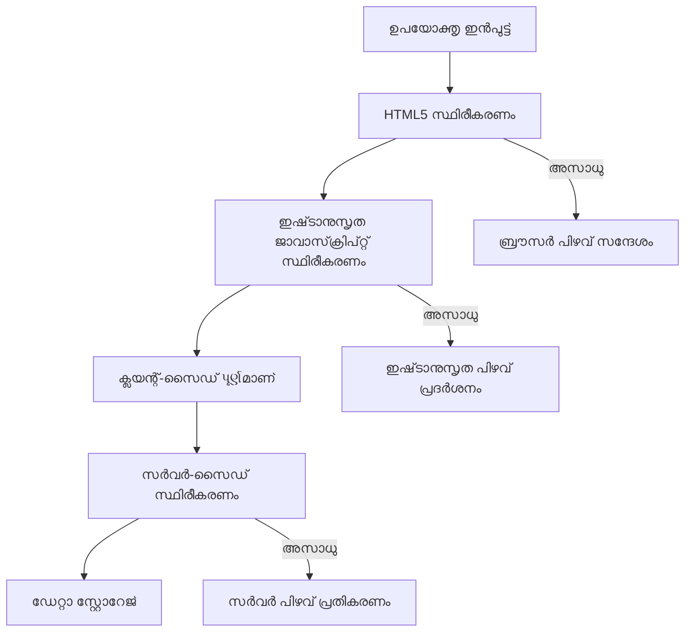
**മൾട്ടി-ലെവൽ സാധുത പരിശോധന രീതി:**
- **HTML5 സാധുത പരിശോധന**: ഉടൻ ബ്രൗസറിൽ പരിശോധിക്കുന്നു
- **ജാവാസ്ക്രിപ്റ്റ് പരിശോധന**: കസ്റ്റം ലോജിക്, ഉപയോക്തൃ അനുഭവം മെച്ചപ്പെടുത്തുന്നു
- **സെർവർ സാധുത പരിശോധന**: അന്തിമ സുരക്ഷയും ഡാറ്റ ശുദ്ധിയും ഉറപ്പാക്കുന്നു
- **പ്രോഗ്രസ്‌ siv e എൻഹാൻസ്മെന്റ്**: ജാവാസ്ക്രിപ്റ്റ് അപ്രാപ്യമാകുമ്പോഴും പ്രവർത്തിക്കുന്നു

### HTML5 സാധുത പരിശോധന ഗുണനിലവാരങ്ങൾ

**നിങ്ങൾക്കായ് ആധുനിക പരിശോധന ഉപകരണങ്ങൾ:**

| ആട്രിബ്യൂട്ട് | ഉദ്ദേശ്യം | ഉദാഹരണ ഉപയോഗം | ബ്രൗസർ പെരുമാറ്റം |
|-----------|---------|---------------|------------------|
| `required` | നിർബന്ധമായ ഫീൽഡുകൾ | `<input required>` | ശൂന്യമാകാൻ അനുവദിക്കില്ല |
| `minlength`/`maxlength` | ടെക്സ്റ്റ് നീളം നിയന്ത്രണം | `<input maxlength="20">` | അക്ഷര പരിധികൾ നിഷ്പ്രഭമാക്കുന്നു |
| `min`/`max` | സംഖ്യാ പരിധികൾ | `<input min="0" max="1000">` | സംഖ്യാതലപരിധികൾ ഉറപ്പാക്കുന്നു |
| `pattern` | കസ്റ്റം Regex ചട്ടങ്ങൾ | `<input pattern="[A-Za-z]+">` | പ്രത്യേക ഫോർമാറ്റുകൾക്ക് പൊരുത്തം |
| `type` | ഡാറ്റ തരം പരിശോധന | `<input type="email">` | ഫോർമാറ്റ്-ലക്ഷ്യ് പരിശോധന |

### CSS സ്റ്റൈലിംഗ് കൊണ്ട് സാധുത പരിശോധന

**സാധുതാ അവസ്ഥകൾക്ക് കാഴ്ച്ച प्रतिक्रिया സൃഷ്ടിക്കുക:**

```css
/* Valid input styling */
input:valid {
  border-color: #28a745;
  background-color: #f8fff9;
}

/* Invalid input styling */
input:invalid {
  border-color: #dc3545;
  background-color: #fff5f5;
}

/* Focus states for better accessibility */
input:focus:valid {
  box-shadow: 0 0 0 0.2rem rgba(40, 167, 69, 0.25);
}

input:focus:invalid {
  box-shadow: 0 0 0 0.2rem rgba(220, 53, 69, 0.25);
}
```

**ഈ കാഴ്ച്ച സൂചനകൾ നേടുന്നത്:**
- **പച്ച അതിരുകൾ**: വിജയകരമായ സാധുത തെളിയിക്കുന്നു, മിഷൻ കൺട്രോളിലെ പച്ച ലൈറ്റുകളായി
- ** കാരുണ്യ ചുവപ്പ് വരകൾ**: ശ്രദ്ധ ആവശ്യമായ പിശക് സൂചനകൾ
- **ഫോക്കസ് ഹൈലൈറ്റുകൾ**: നിലവിലെ ഇൻപുട്ടിന്റെ സ്ഥലം വ്യക്തമാക്കുന്നു
- **സ്ഥിരതയുള്ള സ്റ്റൈലിംഗ്**: ഉപയോക്താക്കൾ പഠിക്കാൻ കഴിയുന്ന പ്രവചിക്കാവുന്ന ഇന്റർഫേസ് മാതൃകകൾ

> 💡 **പ്രോ ടിപ്പ്**: ഉപയോക്താക്കൾ ടൈപ്പുചെയ്യുമ്പോൾ `:valid` ൽ `:invalid` CSS പ്സ്യൂഡോ ക്ലാസുകൾ ഉപയോഗിച്ച് ഉടൻ കാഴ്ച പ്രതികരണം നൽകുക, പ്രതികരിക്കുന്ന സഹായക ഇന്റർഫേസ് സൃഷ്ടിക്കാൻ.

### സമഗ്രമായ സാധുത പരിശോധന നടപ്പാക്കൽ

നിങ്ങളുടെ രജിസ്ട്രേഷൻ ഫോമിൽ മികച്ച ഉപയോക്തൃ അനുഭവവും ഡാറ്റ നിലവാരവും നൽകുന്ന ഉറപ്പുള്ള സാധുത പരിശോധന കൂട്ടിച്ചേർക്കാം:

```html
<form id="registerForm" method="POST" novalidate>
  <div class="form-group">
    <label for="user">Username <span class="required">*</span></label>
    <input id="user" name="user" type="text" required 
           minlength="3" maxlength="20" 
           pattern="[a-zA-Z0-9_]+" 
           autocomplete="username"
           title="Username must be 3-20 characters, letters, numbers, and underscores only">
    <small class="form-text">Choose a unique username (3-20 characters)</small>
  </div>
  
  <div class="form-group">
    <label for="currency">Currency <span class="required">*</span></label>
    <input id="currency" name="currency" type="text" required 
           value="$" maxlength="3" 
           pattern="[A-Z$€£¥₹]+" 
           title="Enter a valid currency symbol or code">
    <small class="form-text">Currency symbol (e.g., $, €, £)</small>
  </div>
  
  <div class="form-group">
    <label for="description">Account Description</label>
    <input id="description" name="description" type="text" 
           maxlength="100" 
           placeholder="Personal savings, checking, etc.">
    <small class="form-text">Optional description (up to 100 characters)</small>
  </div>
  
  <div class="form-group">
    <label for="balance">Starting Balance</label>
    <input id="balance" name="balance" type="number" 
           value="0" min="0" step="0.01" 
           title="Enter a positive number for your starting balance">
    <small class="form-text">Initial account balance (minimum $0.00)</small>
  </div>
  
  <button type="submit">Create Account</button>
</form>
```

**വർദ്ധിപ്പിച്ച സാധുത പരിശോധനിന്റെ മനസ്സിലാക്കൽ:**
- **ആവശ്യമായ ഫീൽഡ് സൂചനകളുമായി** സംയോജിപ്പിക്കുന്നു
- **ഫോർമാറ്റ് സാധുതക്കായി** `pattern` ആട്രിബ്യൂട്ടുകൾ ഉൾപ്പെടുത്തുന്നു
- **ആക്സസിബിലിറ്റി, ടൂൾടിപ്പുകൾക്കായി** `title` ആട്രിബ്യൂട്ടുകൾ നൽകുന്നു
- **ഉപയോക്തൃ ഇൻപുട്ട് വഴി പിന്തുണയ്ക്കാൻ** സഹായക വാചകം ചേർക്കുന്നു
- **മികച്ച ആക്സസിബിലിറ്റിക്ക്** സെമാന്റിക് HTML ഘടന ഉപയോഗിക്കുന്നു

### ഉയർന്ന നിലവാരത്തിലുള്ള സാധുത പരിശോധന നിയമങ്ങൾ

**പ്രത്യേകമുള്ള സാധുത നിയമങ്ങൾ എന്തു നടത്തുന്നു:**

| ഫീൽഡ് | സാധുത നിയമങ്ങൾ | ഉപയോക്തൃ ഗുണം |
|-------|------------------|--------------|
| യൂസർനെയിം | `required`, `minlength="3"`, `maxlength="20"`, `pattern="[a-zA-Z0-9_]+"` | ശരിയായ, പ്രത്യേകം തിരിച്ചറിയാവുന്ന ഐഡന്റിഫയർ ഉറപ്പാക്കുന്നു |
| കറൻസി | `required`, `maxlength="3"`, `pattern="[A-Z$€£¥₹]+"` | സാധാരണ കറൻസി ചിഹ്നങ്ങൾ സ്വീകരിക്കുന്നു |
| ബാലൻസ് | `min="0"`, `step="0.01"`, `type="number"` | നെഗറ്റീവ് ബാലൻസ് തടയുന്നു |
| വിവരണം | `maxlength="100"` | യുക്തമായ നീള പരിധി |

### സാധുത പരിശോധന പെരുമാറ്റം പരീക്ഷിക്കുക

**പരീക്ഷണങ്ങൾക്ക്:**
1. **അപൂർണ്ണ ആവശ്യമായ ഫീൽഡുകൾ ഉള്ള രൂപം സബ്‌മിറ്റ് ചെയ്യു**
2. **3 അക്ഷരങ്ങൾക്കു താഴെയുള്ള യൂസർനെയിം നൽകുക**
3. **യൂസർനെയിം ഫീൽഡിൽ പ്രത്യേക ചിഹ്നങ്ങൾ ഉപയോഗിക്കാൻ ശ്രമിക്കുക**
4. **നെഗറ്റീവ് ബാലൻസ് നൽകുക**

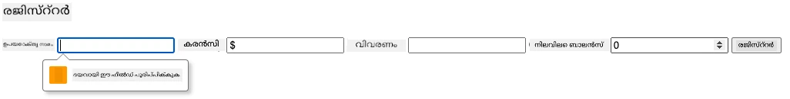

**നിങ്ങൾ കാണുന്നതെന്താണെന്ന്:**
- **ബ്രൗസർ സ്വതന്ത്ര സാധുത സന്ദേശങ്ങൾ പ്രദർശിപ്പിക്കുന്നു**
- **`:valid` കോളും `:invalid` അധിഷ്ഠിതമായ സ്റ്റൈലിംഗ് മാറ്റങ്ങൾ**
- **സകല സാധുതകൾ പാസ്സാകുന്നതുവരെ ഫോർം സബ്‌മിഷൻ തടയുന്നു**
- **സ്വയം ഫോക്കസ് ആദ്യം തെറ്റായ ഫീൽഡിലേയ്ക്ക് മാറുന്നു**

### ക്ലയന്റ്-സൈഡ് vs സെർവർ-സൈഡ് സാധുത പരിശോധന

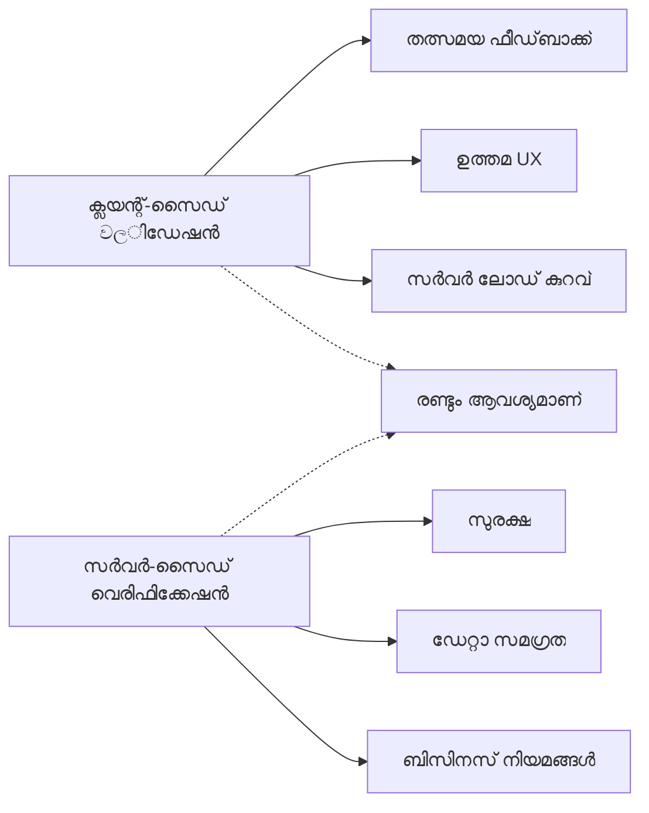
**രണ്ടു പാളികളും ആവശ്യമായ കാരണം:**
- **ക്ലയന്റ്-സൈഡ് സാധുത പരിശോധന**: ഉടൻ പ്രതികരണം നൽകുന്നു, ഉപയോക്തൃ അനുഭവം മെച്ചപ്പെടുത്തുന്നു
- **സെർവർ-സൈഡ് സാധുത പരിശോധന**: സുരക്ഷ ഉറപ്പാക്കുകയും സങ്കീർണ്ണ ബിസിനസ് നിയമങ്ങൾ കൈകാര്യം ചെയ്യുകയും ചെയ്യുന്നു
- **കൂട്ടിച്ചേർത്ത സമീപനം**: ശക്‌തമായ, ഉപയോക്തൃ സൗഹൃദമുള്ള, സുരക്ഷിത ആപ്ലിക്കേഷനുകൾ സൃഷ്ടിക്കുന്നു
- **പ്രോഗ്രസീവ് എൻഹാൻസ്മെന്റ്**: ജാവാസ്ക്രിപ്റ്റ് അപ്രാപ്യമാകുമ്പോഴും പ്രവർത്തിക്കുന്നു

> 🛡️ **സുരക്ഷാ ഓർമപ്പെടുത്തൽ**: ക്ലയന്റ്-സൈഡ് സാധുത പരിശോധനം മാത്രം എപ്പോഴും വിശ്വസിക്കരുത്! ഒറ്റപ്പാടുള്ളർ ഈ പരിശോധനകൾ മറികടക്കാമെന്ന് അറിയണം, അക്കാര്യത്തിൽ സുരക്ഷയ്ക്ക് സെർവർ-പക്ഷം സാധുത പരിശോധന നിർണ്ണായകം.

### ⚡ **അടുത്ത 5 മിനിറ്റിൽ നിങ്ങൾ ചെയ്യാവുന്നത്**
- [ ] നിങ്ങളുടെ ഫോം തെറ്റായ ഡാറ്റയോടെ ടെസ്റ്റ് ചെയ്ത് സാധുത സന്ദേശങ്ങൾ കണ്ടു നോക്കുക
- [ ] ജാവാസ്ക്രിപ്റ്റ് അപ്രാപ്യമാക്കി ഫോം സബ്‌മിറ്റ് ചെയ്ത് HTML5 സാധുത പരിശോധന കാണുക
- [ ] ബ്രൗസർ ഡെവ് ടൂൾസ് തുറന്ന് സെർവറിലേക്ക് പോകുന്ന ഫോർം ഡാറ്റ പരിശോധിക്കുക
- [ ] വ്യത്യസ്ത ഇൻപുട്ട് തരങ്ങൾ പരീക്ഷിച്ച് മൊബൈൽ കീബോർഡ് മാറ്റങ്ങൾ കാണുക

### 🎯 **ഈ മണിക്കൂറിൽ നിങ്ങൾ ചെയ്യാനാകുന്നത്**
- [ ] പാഠശേഷം ക്വിസ് പൂർത്തിയാക്കി ഫോർം കൈകാര്യം സമ്പ്രദായങ്ങൾ മനസ്സിലാക്കുക
- [ ] യഥാർത്ഥ സമയ ഫീഡ്ബാക്ക് ഉള്ള സമഗ്ര സാധുത പരിശോധന പരീക്ഷിക്കുക
- [ ] CSS സ്റ്റൈലിംഗ് ചേർത്ത് പ്രൊഫഷണൽ രൂപത്തിലുള്ള ഫോമുകൾ സൃഷ്ടിക്കുക
- [ ] ഡ്യൂപ്ലിക്കേറ്റ് യൂസർനെയിംകൾക്കും സെർവർ പിശകുകൾക്കും തെറ്റ് കൈകാര്യനം ചേർക്കുക
- [ ] പാസ്സ്‌വേർഡ് സ്ഥിരീകരണ ഫീൽഡുകൾ ചേർക്കുകയും പൊരുത്തപ്പെടുന്ന പരിശോധന നടത്തുക

### 📅 **നിങ്ങളുടെ ആഴ്ച ലംഘിച്ച ഫോർം മാസ്റ്ററി യാത്ര**
- [ ] പ്രഗത്ഭതയേറിയ ഫീച്ചറുകൾ ഉള്ള പൂർണ്ണമായ ബാങ്കിംഗ് ആപ്പ് നിർമ്മിക്കുക
- [ ] പ്രൊഫൈൽ ചിത്രങ്ങൾ അല്ലെങ്കിൽ രേഖകൾ അപ്‌ലോഡ് ചെയ്യാനുള്ള പ്രവർത്തനങ്ങൾ നടപ്പാക്കുക
- [ ] പുരോഗതി സൂചികകളും സംസ്ഥാന നിയന്ത്രണവും ഉള്ള മൾട്ടി-സ്റ്റെപ്പ് ഫോമുകൾ ചേർക്കുക
- [ ] ഉപയോക്തൃ തിരഞ്ഞെടുപ്പിനെ അടിസ്ഥാനമാക്കി രൂപങ്ങൾ പ്രതിരൂപിപ്പിക്കുന്ന ഡൈനാമിക് ഫോമുകൾ സൃഷ്ടിക്കുക
- [ ] മെച്ചപ്പെട്ട ഉപയോക്തൃ അനുഭവത്തിനായി ഫോർം ഓട്ടോസേവ്, റിക്കവറി സംവിധാനം നടപ്പാക്കുക
- [ ] ഇമെയിൽ സ്ഥിരീകരണം, ഫോൺ നമ്പർ ഫോർമാറ്റിംഗ് പോലുള്ള ഉയർന്ന ശരിതപ്പുള്ള സാധുത ചേർക്കുക

### 🌟 **നിങ്ങളുടെ മാസം നീണ്ട ഫ്രണ്ട്‌എന്റ് വികസന മാസ്റ്ററി**
- [ ] നിലവാരുള്ള തർക്കങ്ങൾ, പ്രവാഹങ്ങൾ, ലോജിക്‌كلاتുമായി സങ്കീർണ്ണ ഫോർം ആപ്ലിക്കേഷനുകൾ നിർമ്മിക്കുക
- [ ] വേഗത്തിലുള്ള വികസനത്തിനായി ഫോർം ലൈബ്രറികളും ഫ്രെയിംവർക്കുകളും പഠിക്കുക
- [ ] ആക്സസിബിലിറ്റി മാർഗനിർദേശങ്ങളും ഉൾക്കൊള്ളുന്ന ഡിസൈൻ സിദ്ധാന്തങ്ങളും മികവുറ്റ രീതിയിൽ അഭ്യസിക്കുക
- [ ] ആഗോള ഫോമുകൾക്കായി അന്തർദേശീയവൽക്കരണം, കമ്മ്യൂണിക്കേഷൻ പാടവം വരുത്തുക
- [ ] പുനരുപയോഗയോഗ്യമായ ഫോർം ഘടക ലൈബ്രറികൾ, ഡിസൈൻ സിസ്റ്റങ്ങൾ സൃഷ്ടിക്കുക
- [ ] ഓപ്പൺ സോഴ്സ് ഫോർം പ്രോജക്റ്റുകളിൽ സംഭാവന നൽകി മികച്ച പ്രവൃത്തികളുമായി പങ്കുവെക്കുക

## 🎯 നിങ്ങളുടെ ഫോർം ഡവലപ്പ്മെന്റ് മാസ്റ്ററി ടൈംലൈൻ

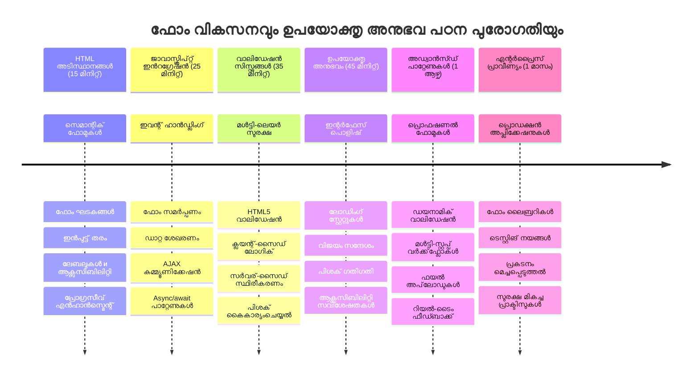
### 🛠️ നിങ്ങളുടെ ഫോർം ഡവലപ്പ്മെന്റ് ടൂൾകിറ്റ് സംഗ്രഹം

ഈ പാഠം പൂർത്തിയാക്കിയാൽ നിങ്ങൾ ഇപ്പോൾ കൈപ്പറ്റിയിരിക്കുന്നു:
- **HTML5 ഫോമുകൾ**: സെമാന്റ്റിക് ഘടന, ഇൻപുട്ട് തരം, ആക്സസിബിലിറ്റി ഫീച്ചറുകൾ
- **ജാവാസ്ക്രിപ്റ്റ് ഫോർം കൈകാര്യം**: ഇവന്റ് മാനേജ്മെന്റ്, ഡാറ്റ ശേഖരണം, AJAX സംവാദം
- **സാധുത അടിസ്ഥാനഘടന**: സുരക്ഷക്കും ഉപയോക്തൃ അനുഭവത്തിനും മൾട്ടി-ലെവൽ സാധുത പരിശോധന
- **അസിങ്ക്രണസ് പ്രോഗ്രാമിംഗ്**: ആധുനിക Fetch API, async/await പാറ്റേണുകൾ
- **പിശക് നിയന്ത്രണം**: സമഗ്രമായ പിശക് കൈകാര്യം, ഉപയോക്തൃ ഫീഡ്‌ബാക്ക് സിസ്റ്റങ്ങൾ
- **ഉപയോക്തൃ അനുഭവ ഡിസൈൻ**: ലോഡിംഗ് ഘട്ടങ്ങൾ, വിജയ/പിശക് സന്ദേശങ്ങൾ, പിശക് പുനരുദ്ധാരം
- **പ്രോഗ്രസീവ് എൻഹാൻസ്മെന്റ്**: എല്ലു ബ്രൗസറുകളിലും സജ്ജമായ ഫോമുകൾ

**യഥാർത്ഥ ലോക ആപ്ലിക്കേഷനുകൾ**: നിങ്ങളുടെ ഫോർം ഡവലപ്പ്മെന്റ് കഴിവുകൾ നേരിട്ട് ബാധിക്കുന്നു:
- **ഇ-കൊമേഴ്സ് ആപ്ലിക്കേഷനുകൾ**: ചതുപ്പുചെയ്യൽ പ്രക്രിയകൾ, അക്കൗണ്ട് രജിസ്ട്രേഷൻ, പേയ്‌മെന്റ് ഫോമുകൾ
- **എന്റർപ്രൈസ് സോഫ്റ്റ്‌വെയർ**: ഡാറ്റ എൻട്രി സിസ്റ്റങ്ങൾ, റിപ്പോർട്ടിംഗ് ഇന്റർഫേസുകൾ, പ്രവാഹ ആപ്ലിക്കേഷനുകൾ
- **കണ്ടന്റ് മാനേജ്മെന്റ്**: പ്രസിദ്ധീകരണ പ്ലാറ്റ്‌ഫോമുകൾ, ഉപയോക്തൃ സൃഷ്ടിച്ച ഉള്ളടക്കം, അഡ്മിനിസ്ട്രേറ്റീവ് ഇന്റർഫേസുകൾ
- **ഫിനാൻഷ്യൽ ആപ്ലിക്കേഷനുകൾ**: ബാങ്കിംഗ് ഇന്ററൈസുകൾ, നിക്ഷേപ പ്ലാറ്റ്‌ഫോമുകൾ, ഇടപാട് സിസ്റ്റങ്ങൾ
- **ഹെൽത്ത്‌കെയർ സിസ്റ്റങ്ങൾ**: രോഗി പോർട്ടലുകൾ, അപ്പോയിൻമെന്റ് ഷെഡ്യൂളിംഗ്, മെഡിക്കൽ രേഖ ഫോമുകൾ
- **വിദ്യാഭ്യാസ പ്ലാറ്റ്‌ഫോമുകൾ**: കോഴ്സ് രജിസ്ട്രേഷൻ, ആസെസ്മെന്റ് ടൂൾസ്, ലേണിംഗ് മാനേജ്മെന്റ്

**പ്രൊഫഷണൽ അഭിനിവേശങ്ങൾ**: നിങ്ങൾക്കു കഴിയും:
- **സൗകര്യമുള്ള ഫോമുകൾ ഡിസൈൻ ചെയ്യുക** - വൈകല്യം ഉള്ളവ ഉൾപ്പെടെ എല്ലാ ഉപയോക്താക്കൾക്കും ഉപയോഗപ്രദം
- **സുരക്ഷിതമായ ഫോർം സാധുത നടപ്പാക്കുക** - ഡാറ്റ അബദ്ധം, സുരക്ഷാ ദുർബലതകൾ തടയുന്നു
- **പ്രതികരിക്കുന്ന UI സൃഷ്ടിക്കുക** - വ്യക്തമായ ഫീഡ്‌ബാക്കും മാർഗനിർദ്ദേശവും നൽകുന്നു
- **ബ്രൗസർ ഡെവലപ്പർ ടൂളുകളും നെറ്റ്‌വർക്ക് വിശകലനവും ഉപയോഗിച്ച് സങ്കീർണ്ണ ഫോർം ഇടപെടലുകൾ ഡീബഗ് ചെയ്യുക**
- **ക്ഷമതയുള്ള ഡാറ്റ കൈകാര്യം, സാധുത നിരീക്ഷണ തന്ത്രങ്ങളെക്കായി ഫോർം പ്രകടനം പ്രവര്‍ത്തനക്ഷമമാക്കുക**

**ഫ്രണ്ട്‌എന്റ് ഡവലപ്പ്മെന്റ് ആശയങ്ങൾ കൈവിട്ടു:**
- **ഇവന്റ്-ഡ്രിവൻ ഘടന**: ഉപയോക്തൃ ഇടപാട് കൈകാര്യം, പ്രതികരണം സംവിധാനങ്ങൾ
- **അസിന്ക്രോണസ് പ്രോഗ്രാമിംഗ്**: ബ്ലോക്ക് ചെയ്യാത്ത സെർവർ സംവാദവും പിശക് കൈകാര്യംചെയ്യലും
- **ഡാറ്റ സാധുത**: ക്ലയന്റ്-സൈഡ്, സെർവർ-സൈഡ് സുരക്ഷയും സമഗ്രതയും
- **ഉപയോക്തൃ അനുഭവ ഡിസൈൻ**: ഉപയോക്താവിനെ വിജയത്തിലേക്ക് നയിക്കുന്ന സുനിരവധി ഇന്റർഫേസുകൾ
- **ആക്സസിബിലിറ്റി എഞ്ചിനീയർ**: വ്യത്യസ്ത ആവശ്യങ്ങളെ അനുയോജ്യമായി പ്രവർത്തിക്കുന്ന ഉൾക്കൊള്ളുന്ന ഡിസൈൻ

**അടുത്ത നില**: നിങ്ങൾക്ക് ആഴത്തിലുള്ള ഫോർം ലൈബ്രറികൾ, സങ്കീർണ്ണ സാധുത നിയമങ്ങൾ നടപ്പാക്കണമെങ്കിൽ, അല്ലെങ്കിൽ എന്റർപ്രൈസ് ഗ്രേഡ് ഡാറ്റ ശേഖരണ സംവിധാനങ്ങൾ നിർമ്മിക്കണമെങ്കിൽ സജ്ജരാണ്!

🌟 **പ്രാപ്തി നേടി**: നിങ്ങൾ പ്രൊഫഷണൽ സാധുത പരിശോധന, പിശക് കൈകാര്യനം, ഉപയോക്തൃ അനുഭവ മാതൃകകളുമായി ഒരു സമ്പൂർണ ഫോർം കൈകാര്യം സിസ്റ്റം നിർമ്മിച്ചു!

---


---

## GitHub Copilot ഏജന്റ് ചാലഞ്ച് 🚀

ഏജന്റ് മോഡ് ഉപയോഗിച്ച് താഴെ കാണുന്ന ചാലഞ്ച് പൂർത്തിയാക്കുക:

**വിവരണം:** രജിസ്ട്രേഷൻ ഫോർമിൽ സമഗ്രമായ ക്ലയന്റ്-സൈഡ് സാധുത പരിശോധനയും ഉപയോക്തൃ പ്രതികരണവും വർദ്ധിപ്പിക്കുക. ഈ ചാലഞ്ച് ഫോർം സാധുത, പിശക് കൈകാര്യനം, പരസ്പര പ്രവർത്തനാത്മക ഫീഡ്ബാക്കുമായി ഉപയോക്തൃ അനുഭവം മെച്ചപ്പെടുത്താനുള്ള പരിശീലനം നൽകും.
**പ്രോംപ്‌ട്:** രജിസ്ട്രേഷൻ ഫോം പൂർണ്ണമായും ഫോർം സ്ഥിരീകരണ സംവിധാനമാക്കി സൃഷ്ടിക്കുക, ഇതിൽ ഉൾപ്പെടുന്നത്: 1) ഉപയോക്താവ് ടൈപ്പ് ചെയ്യുമ്പോൾ ഓരോ ഫീൽഡിനും സംവേദന-സമയം സ്ഥിരീകരണ പ്രതികരണം, 2) ഓരോ ഇൻപുട്ട് ഫീൽഡിന് താഴെ കസ്റ്റം സ്ഥിരീകരണ സന്ദേശങ്ങൾ, 3) പാസ്‌വേഡ് സ്ഥിരീകരണ ഫീൽഡ് മാച്ചിംഗ് സ്ഥിരീകരണത്തോടെ, 4) ദൃശ്യ സൂചനകൾ (സമാനമായ ഫീൽഡിനുള്ള പച്ച ചെക്ക്മാർക്കും തെറ്റ് ഫീൽഡിനുള്ള ചുവന്ന മുന്നറിയിപ്പുകൾക്ക്), 5) എല്ലാ സ്ഥിരീകരണങ്ങളും കടന്നുവന്ന ശേഷം മാത്രമേ സബ്മിറ്റ് ബട്ടൺ സജീവമാവൂ. HTML5 സ്ഥിരീകരണഗുണങ്ങൾ ഉപയോഗിക്കുക, പരിശോധനാ അവസ്ഥകൾ ക്ലാസ്‌ ഉപയോഗിച്ച് സ്റ്റൈൽ ചെയ്യുക, മൾട്ടിഫംഗ്ഷണൽ പെരുമാറ്റം ജാവാസ്ക്രിപ്റ്റ് ഉപയോഗിച്ച് സൃഷ്ടിക്കുക.

[agent mode](https://code.visualstudio.com/blogs/2025/02/24/introducing-copilot-agent-mode) എന്നതിനെക്കുറിച്ച് കൂടുതൽ അറിയൂ.

## 🚀 ചാലഞ്ച്

ഉപയോക്താവ് ഇതിനകം നിലവിലുള്ള പക്ഷം, HTML-ൽ ഒരു പിശക് സന്ദേശം കാണിക്കുക.

ചെറിയൊരു സ്റ്റൈലിങ്ങ് ചെയ്ത് അവസാന ലോഗിൻ പേജ് നോക്കിനോക്കൂ:

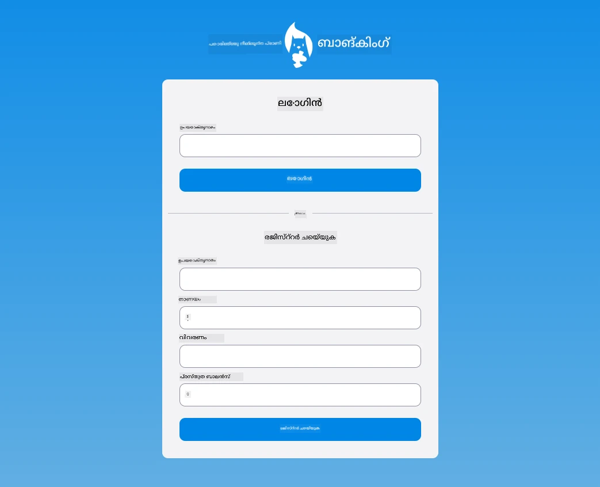

## പോസ്റ്റ് ലക്ചർ ക്വിസ്

[Post-lecture quiz](https://ff-quizzes.netlify.app/web/quiz/44)

## അവലോകനവും സ്വയംപഠനവും

ഡവലപ്പർമാർ അവരുടെ ഫോർം നിർമ്മാണ ശ്രമങ്ങളിൽ വളരെ സൃഷ്ടിപരമായ സമീപനം സ്വീകരിച്ചിട്ടുണ്ട്, പ്രത്യേകിച്ച് സ്ഥിരീകരണ തന്ത്രങ്ങൾ സംബന്ധിച്ച്. വ്യത്യസ്ത ഫോർം ഫ്‌ളോകളെക്കുറിച്ച് അറിവ് നേടാൻ [CodePen](https://codepen.com) പരിശോധിക്കുക; നിങ്ങൾക്ക് ചില രോചനയുള്ള, പ്രചോദനമാർന്ന ഫോമുകൾ കണ്ടെത്താനാകും.

## അസൈൻമെന്റ്

[Style your bank app](assignment.md)

---

<!-- CO-OP TRANSLATOR DISCLAIMER START -->
**പരിഭവകര്യം**:  
ഈ രേഖ AI പരിഭാഷ സേവനം [Co-op Translator](https://github.com/Azure/co-op-translator) ഉപയോഗിച്ച് ഭാഷാന്തരപ്പെടുത്തപ്പെട്ടതാണ്. നിശ്ചിതത്വത്തിനായി ഞങ്ങൾ ശ്രമിച്ചിരിക്കുമ്പോഴും, സ്വയമേഖലാ (ഓട്ടോമേറ്റഡ്) പരിഭാഷകളിൽ പിശകുകൾ അല്ലെങ്കിൽ തെറ്റുകൾ ഉണ്ടാകാൻ സാധ്യതയുള്ളതാണ്. പ്രാഥമികമായി, ഈ രേഖയുടെ മൂലഭാഷയിൽ ഉള്ള പതിപ്പ് അധികാരപരമായ ഉറവിടമായി കണക്കാക്കണമെന്നും ശ്രദ്ധിക്കുക. നിർണ്ണായക വിവരങ്ങൾക്കായി വിദഗ്ദ്ധമായ മനുഷ്യ പരിഭാഷ ശുപാർശ ചെയ്യുന്നു. ഈ പരിഭാഷ ഉപയോഗിക്കുന്നതിൽ നിന്നുണ്ടാകുന്ന യാതൊരു തെറ്റിദ്ധാരണകളിനും ഞങ്ങൾ ഉത്തരവാദിയല്ല.
<!-- CO-OP TRANSLATOR DISCLAIMER END -->