<!--
CO_OP_TRANSLATOR_METADATA:
{
  "original_hash": "86ee5069f27ea3151389d8687c95fac9",
  "translation_date": "2026-01-08T17:18:59+00:00",
  "source_file": "7-bank-project/3-data/README.md",
  "language_code": "ml"
}
-->
# ബാങ്കിംഗ് ആപ്പ് നിർമ്മിക്കൽ ഭാഗം 3: ഡാറ്റ സ്വീകരിക്കുകയും ഉപയോഗിക്കുകയും ചെയ്യാനുള്ള രീതികൾ

സ്റ്റാർ ട്രെക്കിലെ എന്റർപ്രൈസിന്റെ കമ്പ്യൂട്ടർ ചിന്തിക്കുക - ക്യാപ്റ്റൻ പिकार്ഡ് കപ്പൽ നിലവ് ചോദിച്ചാൽ, സമ്പൂർണ ഇന്റർഫേസ് അടച്ച് പുനഃസംഘടിപ്പിക്കാതെ ഉടൻ തന്നെ വിവരം പ്രത്യക്ഷപ്പെടുന്നു. ഈ സുതാര്യമായ വിവര പ്രവാഹം ആണ് നാം ഇവിടെ ഡയനാമിക് ഡാറ്റ ഫെച്ചിംഗിലൂടെ നിർമ്മിക്കുന്നത്.

ഇപ്പോൾ, നിങ്ങളുടെ ബാങ്കിംഗ് ആപ്പ് അച്ചടിച്ച ന്യൂസ്‌പേപ്പർ പോലെയാണ് - വിവരപ്രദമായിരുന്നാലും സ്റ്റാറ്റിക് ആണ്. നാം ഇത് NASAയിലെ മിഷൺ കൺട്രോളിനെ പോലെ മാറ്റാൻ പോകുന്നു, എവിടെ ഡാറ്റ കൃത്യസമയം വ്യത്യസ്തമായി ഒഴുകി ഉപയോക്താവിന്റെ പ്രവാഹം തടസ്സപ്പെടുത്താതെ പുതുക്കുന്നു.

നിങ്ങൾ സർവർസുമായി അസിങ്ക്രോണസ് ആയി ആശയവിനിമയം ചെയ്യാൻ, വ്യത്യസ്ത സമയങ്ങളിൽ ലഭിക്കുന്ന ഡാറ്റ കൈകാര്യം ചെയ്യാൻ, അവയെ അർത്ഥവത്തായ വിവരങ്ങളായി മാറ്റാൻ പഠിക്കും. ഇത് ഡെമോയും പ്രൊഡക്ഷൻ റെഡി സോഫ്റ്റ്‌വെയറിനുമിടയിലെ വ്യത്യാസം ആണ്.

## ⚡ അടുത്ത 5 മിനിറ്റിൽ നിങ്ങൾ ചെയ്യാൻ കഴിയുന്നത്

**നിശ്ചിത സമയമുള്ള ഡെവലപ്പർമാർക്കുള്ള ക്വിക്ക് സ്റ്റാർട്ട് മാർഗ്ഗം**

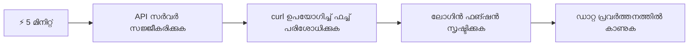
- **മിനിറ്റ് 1-2**: നിങ്ങളുടെ API സർവർ ആരംഭിക്കുക (`cd api && npm start`)യും കണക്ഷൻ പരിശോധിക്കുക
- **മിനിറ്റ് 3**: fetch ഉപയോഗിച്ച് ഒരു അടിസ്ഥാന `getAccount()` ഫങ്ഷൻ സൃഷ്ടിക്കുക
- **മിനിറ്റ് 4**: login ഫോമിൽ `action="javascript:login()"` വയർ ചെയ്യുക
- **മിനിറ്റ് 5**: ലോഗിൻ പരീക്ഷിച്ച് അക്കൗന്റ് ഡാറ്റ കൺസോളിൽ പ്രത്യക്ഷപ്പെടുന്നത് കാണുക

**ക്വിക്ക് ടെസ്റ്റ് കമാൻഡുകൾ**:
```bash
# API പ്രവർത്തിക്കുന്നുണ്ടെന്ന് സൂചിപ്പിക്കുക
curl http://localhost:5000/api

# അക്കൗണ്ട് ഡാറ്റ എടുത്ത് പരിശോധിക്കുക
curl http://localhost:5000/api/accounts/test
```
  
**ഇത് എവിടെ പ്രയോജനപ്പെടുന്നു**: 5 മിനിറ്റിനുള്ളിൽ, പരസ്പരം കാത്തു നിൽക്കാതെ ഡാറ്റ സ്വീകരിക്കുന്ന അസിങ്ക്രോണസ് ഫെച്ചിംഗിന്റെ മായാജാലം നിങ്ങള് കാണും. ഇത് എല്ലാ ആധുനിക വെബ് ആപ്പുകൾക്ക് പ്രതികരണശീലവും സജീവതയും നൽകുന്ന അടിസ്ഥാനം ആണ്.

## 🗺️ ഡാറ്റാ-ഓര്യൻറഡ് വെബ് ആപ്പുകളുടെ നിങ്ങളുടെ പഠനയാത്ര

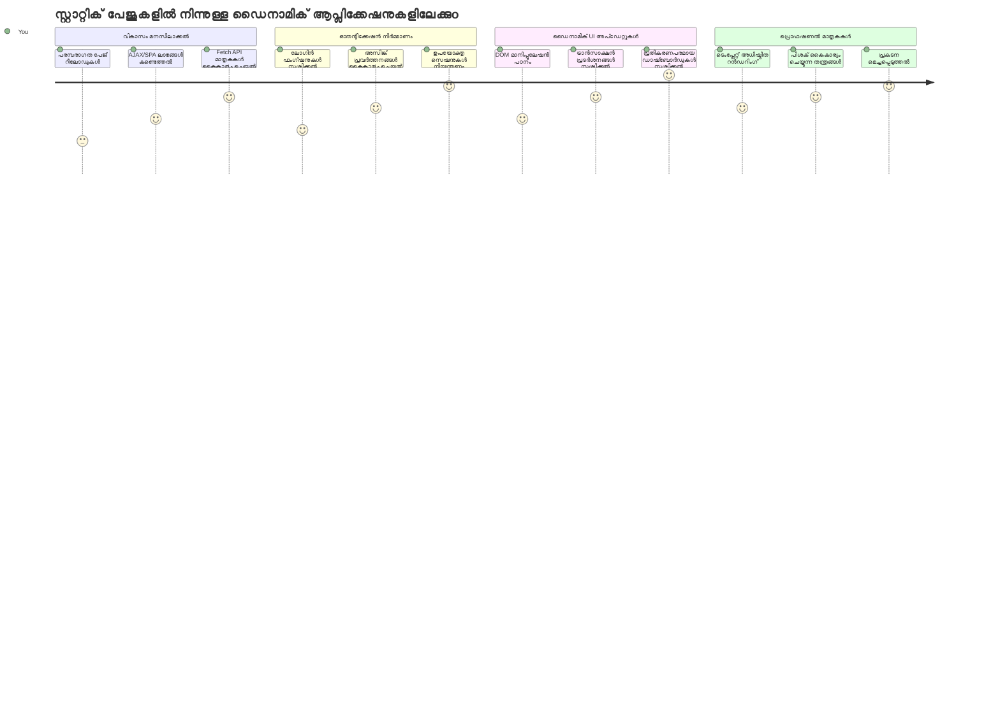
**നിങ്ങളുടെ പഠനലക്ഷ്യം**: ഈ പാഠം പൂര്‍ത്തിയാക്കുമ്പോൾ, ആധുനിക വെബ് ആപ്പുകൾ ഡാറ്റ എങ്ങനെ ഫെച്ച് ചെയ്ത് പ്രോസസ്സ് ചെയ്ത് ഗുണമേന്മയുള്ള ഉപയോക്തൃാനുഭവങ്ങൾ സൃഷ്ടിക്കുന്നുവെന്ന് നിങ്ങൾ മനസ്സിലാക്കും.

## പ്രിലക്ചർ ക്വിസ്

[Pre-lecture quiz](https://ff-quizzes.netlify.app/web/quiz/45)

### മുൻകൂട്ടി requisito കളും

ഡാറ്റ ഫെച്ചിയ്ക്ക് മുമ്പ്, ഈ ഘടകങ്ങൾ തയ്യാറാക്കുക:

- **മുൻപത്തെ പാഠം**: [Login and Registration Form](../2-forms/README.md) പൂർത്തിയാക്കിയിരിക്കണം - ഇതിൽ നിന്ന് തുടർച്ചയായും നിർമ്മിക്കാം
- **ലോകൽ സർവർ**: [Node.js](https://nodejs.org) ഇൻസ്റ്റാൾ ചെയ്ത് [API സർവർ](../api/README.md) റൺ ചെയ്യുക, അക്കൗണ്ട് ഡാറ്റ ലഭ്യമാക്കാൻ
- **API കണക്ഷൻ**: താഴെയുള്ള കമാൻഡ് ഉപയോഗിച്ച് സർവർ കണക്ഷൻ പരിശോധിക്കുക:

```bash
curl http://localhost:5000/api
# പ്രതീക്ഷിക്കുന്ന പ്രതികരണം: "ബാങ്ക് API v1.0.0"
```
  
ഈ ക്വിക് ടെസ്റ്റ് എല്ലാ ഘടകങ്ങളും ശരിയായി കമ്മ്യൂണിക്കേറ്റ് ചെയ്യുന്നതാണ് ഉറപ്പാക്കുന്നത്:
- നിങ്ങളുടെ സിസ്റ്റത്തിൽ Node.js ശരിയായി പ്രവർത്തിക്കുന്നുവെന്ന് സ്ഥിരീകരിക്കുന്നു
- API സർവർ സജീവവും പ്രതികരിക്കുകയുമാണ്
- നിങ്ങളുടെ ആപ്പ് സർവറിനെ എത്താൻ കഴിയുന്നു (മിഷനിനു മുൻപ് റേഡിയോ കോൺടാക്റ്റ് പരിശോധിക്കുന്നതുപോലെ)

## 🧠 ഡാറ്റ മാനേജ്‌മെന്റ് പരിസ്ഥിതി അവലോകനം

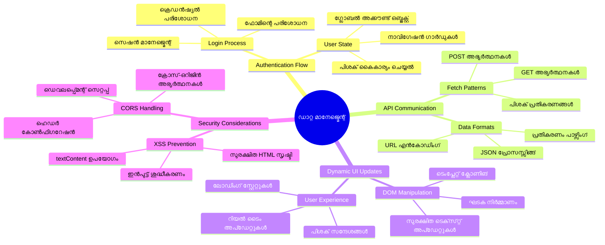
**മുല്യവദ്ധി പ്രിൻസിപ്പിൾ**: ആധുനിക വെബ് ആപ്പുകൾ ഡാറ്റ സംഘാടക സംവിധാനങ്ങളാണ് - ഉപയോക്തൃ ഇന്റർഫേസുകൾ, സർവർ APIകൾ, ബ്രൗസർ സെക്യൂരിറ്റി മോഡലുകൾ എന്നിവ തമ്മിൽ ഏകോപിപ്പിച്ചും സുതാര്യവും പ്രതികരണക്ഷമവുമായ അനുഭവങ്ങൾ സൃഷ്ടിക്കുന്നു.

---

## ആധുനിക വെബ് ആപ്പുകളിൽ ഡാറ്റ ഫെച്ചിംഗ് മനസ്സിലാക്കുക

കഴിഞ്ഞ ഇരുപതു വർഷത്തിലേയ്ക്ക് വെബ് ആപ്പുകൾ ഡാറ്റ കൈകാര്യം ചെയ്യാനുള്ള രീതി നाटകീയമായി മാറിയിട്ടുണ്ട്. ഈ പരിണാമം മനസ്സിലാക്കുന്നത് AJAX, Fetch API തുടങ്ങിയ ആധുനിക സാങ്കേതിക വിദ്യകൾ എത്രത്തോളം ശക്തമാണെന്ന് നിങ്ങളെ അറിഞ്ഞുതരാനാണ് സഹായിക്കുക.

പരമ്പരാഗത വെബ്സൈറ്റുകൾ എങ്ങനെ പ്രവർത്തിച്ചിരുന്നുവെന്ന് കൊള്ളാം സയതിദ്ധാർഥമായി ഇന്ന് നാം നിർമ്മിക്കുന്ന ഡൈനാമിക്, പ്രതികരണക്ഷമ ആപ്പുകൾക്ക് എതിരെ.

### പരമ്പരാഗത മൾട്ടി-പേജ് ആപ്ലിക്കേഷനുകൾ (MPA)

പഴയ വെബിലെ എല്ലാ ക്ലിക്കുകളും പഴയ ഒരു ടിവി ചാനല് മാറ്റുന്നത് പോലെ ആയിരുന്നു - സ്‌ക്രീൻ ശൂന്യം ആക്കി പിന്നെ പുതിയ ഉള്ളടക്കം ട്യൂൺ ചെയ്‌തു. ഇതായിരുന്നു തുടക്കകാല വെബ് ആപ്പുകളുടെ യാഥാർത്ഥ്യം, ഓരോ ഇന്ററാക്ഷനും പേജിന്റെ മുഴുവൻ ഭാഗം പുനഃസംഘടിപ്പിക്കുന്നത് നിർബന്ധമായിരുന്നു.

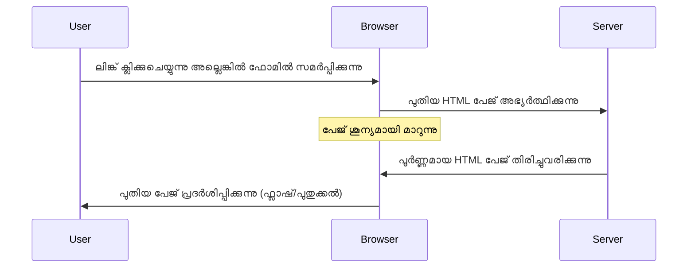
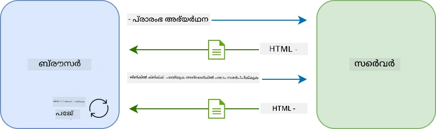

**ഇപ്പോൾ ഈ രീതിയെന്തുകൊണ്ട് ബുദ്ധിമുട്ടായി തോന്നി:**
- ഓരോ ക്ലിക്കിനും പേജ് മുഴുവൻ പുനർനിർമ്മണം വേണമെന്ന് ആവശ്യപ്പെട്ടു
- ഉപയോക്താക്കൾ വിചാരത്തിലെ ഇടവേളകൾക്ക് പേജിന്റെ അപ്രത്യക്ഷമായ പടങ്ങൾ കൊണ്ട് ഇടപെട്ടു
- നിങ്ങൾക് ഒരേ ഹെഡറും ഫൂട്ടറും നാനൂറു തവണ ഡൗൺലോഡ് ചെയ്യേണ്ടിവന്നു
- ആപ്പുകൾ സോഫ്റ്റ്‌വെയർ ഉപയോഗിക്കാതെ ഫയൽ കാബിനറ്റ് വഴിയുള്ള ക്ലിക്കുകളായിരുന്നു

### ആധുനിക സിംഗിൾ-പേജ് ആപ്ലിക്കേഷനുകൾ (SPA)

AJAX (Asynchronous JavaScript and XML) ഈ പാരഡൈം പൂർണമായി മാറ്റി കളഞ്ഞു. അന്താരാഷ്ട്ര സ്പേസ് സ്റ്റേഷനിലെ മോഡൂളാർ ഡിസൈൻ പോലെ, അവിടെ ഒരു ഘടകം പുനഃസംഘടിപ്പിക്കാതെ മാറ്റാൻ സാധിക്കുന്നത് പോലെയാണ് AJAX വെബ്പേജിന്റെ പ്രത്യേക ഭാഗങ്ങൾ അപ്ഡേറ്റ് ചെയ്യാൻ അനുവദിക്കുന്നത്. XML എന്ന് പേര് പറയുന്നുവെങ്കിലും, ഇന്ന് JSON ആണ് കൂടുതലായി ഉപയോഗിക്കുന്നത്, എന്നാൽ പ്രിൻസിപ്പിൾ ഒറ്റ - ഈ മാറ്റങ്ങൾ മാത്രം പുതുക്കുക എന്നതാണ്.

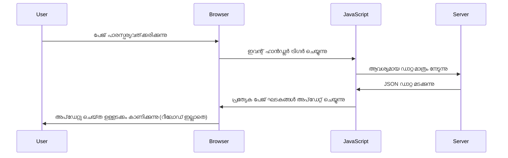
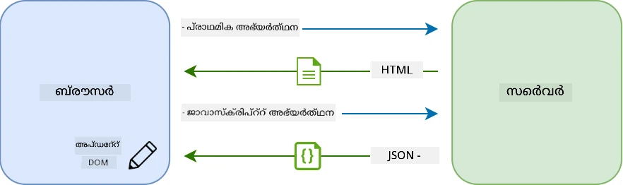

**SPAകൾക്ക് ഇത് എവിടെ ഫണ്ട് നൽകുന്നു:**
- വെറും മാറ്റപ്പെട്ട ഭാഗങ്ങൾ മാത്രം പുതുക്കുന്നു (അർത്ഥശാസ്ത്രപരമായ രീതിയിലാണ്)
- കടുത്ത ഇടപെടലുകൾ ഇല്ല - ഉപയോക്താക്കൾ പിന്തുടർന്ന് ഇരിക്കാം
- നെറ്റ്വർക്ക് വഴി കുറഞ്ഞ ഡാറ്റയൊഴുകുന്നു, അത്കൊണ്ട് ലോഡ് സമയവും കുറഞ്ഞു
- അപ്ലിക്കേഷനുകൾ നിങ്ങളുടെ ഫോണിലേതുപോലെ പെട്ടെന്ന് പ്രതികരിക്കുന്നു

### ആധുനിക Fetch API യിലേക്ക് പരിണാമം

ആധുനിക ബ്രൗസറുകൾ [`Fetch` API](https://developer.mozilla.org/docs/Web/API/Fetch_API) നൽകുന്നു, ഇത് പഴയ [`XMLHttpRequest`](https://developer.mozilla.org/docs/Web/API/XMLHttpRequest/Using_XMLHttpRequest)നെ മാറ്റിവെക്കുന്നു. ടെലിഗ്രാഫ് പ്രവർത്തിപ്പിക്കുന്നതിനും ഇമെയിൽ ഉപയോഗിക്കുന്നതിനുമിടയിലെ വ്യത്യാസം പോലെയാണ്, Fetch API വാഗ്ദാനങ്ങൾ ഉപയോഗിച്ച് അസിങ്ക്രോണസ് കോഡ് ക്ലീനാക്കുകയും JSON നേരിട്ട് കൈകാര്യം ചെയ്യുകയും ചെയ്യുന്നു.

| സവിശേഷത | XMLHttpRequest | Fetch API |
|---------|----------------|----------|
| **സിന്താക്‌സ്** | കോംപ്ലക്സായ കാൾബാക്ക് ശക്തി | ക്ലീനായ വാഗ്ദാനം അടിസ്ഥാനമാക്കി |
| **JSON കൈകാര്യം** | മാനുവൽ പാർസിങ് വേണം | ഓഫ്ഷണായി `.json()` മെത്തിൽ ഉണ്ട |
| **പിശക് കൈകാര്യം** | പരിമിതമായ പിശക് വിവരങ്ങൾ | വിപുലമായ പിശക് വിശദാംശങ്ങൾ |
| **ആധുനിക പിന്തുണ** | പഴയ വെർഷനുകൾക്കും | ES6+ വാഗ്ദാനങ്ങളും async/await ഉപയോഗവും |

> 💡 **ബ്രൗസർ പൊരുത്തക്കേട്**: നല്ല വാർത്ത - Fetch API ആധുനിക എല്ലാ ബ്രൗസറുകളിലും പ്രവർത്തിക്കുന്നു! പ്രത്യേക പതിപ്പുകൾക്ക് [caniuse.com](https://caniuse.com/fetch) വഴി മുഴുവൻ പൊരുത്തക്കേട് അറിയാം.
> 
**താഴെ സാരാംശം:**
- ക്രോം, ഫയർഫോക്സ്, സ്വിഫ്റ്റ്, എഡ്ജ് മുഴുവനും പ്രവർത്തിക്കുന്നു (ഉപയോക്താക്കൾക്കിടയിൽ അടിവസ്ത്രമാകുന്നു)
- ഇന്റർനെറ്റ് എക്സ്പ്ലോറർ മാത്രമാണ് കൂടുതൽ സഹായം ആവശ്യപ്പെടുന്നത് (ഇപ്പോൾ IE വിടേണ്ട സമയമായിരിക്കുന്നു)
- പിന്നീട് ഉപയോഗിക്കുന്ന async/await പാറ്റേണുകളിലേക്ക് മികച്ച തുടക്കം നൽകുന്നു

### ഉപയോക്തൃ ലോഗിൻ এবং ഡാറ്റ റിറ്റ്രീവൽ നടപ്പിലാക്കൽ

ഇപ്പോൾ നിങ്ങളുടെ ബാങ്കിംഗ് ആപ്പ് സ്റ്റാറ്റിക് ഡിസ്പ്ലേയിൽ നിന്നു പ്രവർത്തനക്ഷമ ആപ്പായി മാറ്റുന്ന ലോഗിൻ സിസ്റ്റം നടപ്പിലാക്കാം. സൈനിക സുരക്ഷാ സൗകര്യങ്ങളിൽ ഉപയോഗിക്കുന്ന ഉറപ്പ് പ്രോട്ടോക്കോളുകൾ പോലെയാണ് നാം ഉപയോക്തൃ ക്രെഡൻഷ്യലുകൾ ശരിയായതായി പരിശോധിച്ച് അവരുടേതായ ഡാറ്റ നൽകുക.

നാം ഇത് ക്രമേണ നിർമ്മിക്കുക, ആദ്യം അടിസ്ഥാന പഠനപരമായ മുറികൾ ഉണ്ടാക്കി പിന്നെ ഡാറ്റ ഫെച്ചിങ് പ്രവർത്തനമാണ് കൂട്ടുക.

#### ഘട്ടം 1: ലോഗിൻ ഫങ്ഷന്റെ അടിസ്ഥാനം സൃഷ്ടിക്കുക

നിങ്ങളുടെ `app.js` ഫയൽ തുറന്ന് പുതിയ `login` ഫങ്ഷൻ ചേർക്കുക. ഇത് ഉപയോക്തൃ സ്ഥിരീകരണം കൈകാര്യം ചെയ്യും:

```javascript
async function login() {
  const loginForm = document.getElementById('loginForm');
  const user = loginForm.user.value;
}
```
  
**ഇത് വിശദീകരിക്കുന്നു:**
- ആ `async` കീവേഡ് എന്തിന്? — ജാവാസ്‌ക്രിപ്റ്റിന് "ഈ ഫങ്ഷൻ കാത്തിരിക്കേണ്ടി വരാം" എന്ന് പറയുകയായിരുന്നു
- ഫോം പേജ് നിന്നും പിടിക്കുന്നു (സ്വാഭാവികമായും, ID ഉപയോഗിച്ച്)
- പിന്നീട് ഉപയോക്താവ് എഴുതിയ ഉപയോക്തൃനാമം നേടുന്നു
- നന്നായൊരു മാർഗം: നിങ്ങളുടെ ഫോമിലെ ഏതെങ്കിലും ഇൻപുട്ട് `name` ആട്രിബ്യൂട്ട് ഉപയോഗിച്ച് നേരിട്ട് ആക്‌സസ് ചെയ്യാം - getElementById ആവശ്യം ഇല്ല!

> 💡 **ഫോമിൽ ആക്‌സസ് ചെയ്യാനുള്ള മാതൃക**: ഓരോ ഫോമിന്റെ കൺട്രോൾ നീങ്ങുന്നിടത്ത് `name` ആട്രിബ്യൂട്ട് ഉപയോഗിച്ച് അതിന്റെ പ്രോപ്പർട്ടിയായി ആക്‌സസ് ചെയ്യാം. ഇത് ക്ലിയർ, വായിക്കാൻ സുഖമുള്ള മാർഗമാണ്.

#### ഘട്ടം 2: അക്കൗണ്ട് ഡാറ്റ ഫെച്ചിങ് ഫങ്ഷൻ സൃഷ്ടിക്കുക

അടുത്തതായി, സെർവർ നിന്ന് അക്കൗണ്ട് ഡാറ്റ സ്വീകരിക്കാൻ പ്രത്യേകം ഒരു ഫങ്ഷൻ നിർമ്മിക്കാം. ഇത് മുൻപ് ചെയ്ത രജിസ്ട്രേഷൻ ഫങ്ഷന്റെ പോലെ തന്നെ ആഗിരണം ചെയ്യുന്നു, പക്ഷേ ഡാറ്റ റിട്ട്രീവലിൽ കേന്ദ്രീകരിക്കുന്നു:

```javascript
async function getAccount(user) {
  try {
    const response = await fetch('//localhost:5000/api/accounts/' + encodeURIComponent(user));
    return await response.json();
  } catch (error) {
    return { error: error.message || 'Unknown error' };
  }
}
```
  
**ഈ കോഡ് നേടുന്നത്:**
- ആധുനിക `fetch` API ഉപയോഗിച്ച് അസിങ്ക്രോണസ് ഡാറ്റ അഭ്യർത്ഥിക്കുന്നു
- ഉപയോക്തൃനാമം പാരാമീറ്ററായി ഉൾപ്പെടുത്തി GET അഭ്യർത്ഥന URL നിർമ്മിക്കുന്നു
- URLs ൽ സ്പെഷ്യൽ കരക്ടറുകൾ സുരക്ഷിതമായി കൈകാര്യം ചെയ്യാൻ `encodeURIComponent()` ഉപയോഗിക്കുന്നു
- ജോൺസൺ ഫോർമാറ്റിലേക്ക് മറിക്കുന്നു
- പിശകുകൾ മെനജ്മെന്റ് gracefully ചെയ്ത് പോലും എറർ ഒബ്ജക്ട് തിരിച്ചുവിടുന്നു

> ⚠️ **സുരക്ഷാ നോട്ടീസ്**: `encodeURIComponent()`funkചൻ URLs ൽ പ്രത്യേക ചിഹ്നങ്ങൾ "#", "&" തുടങ്ങിയവ തെറ്റായി വ്യാഖ്യാനിക്കുന്നതിൽ നിന്നും സംരക്ഷിക്കുന്നു. കപ്പലിൽ നാവിക ആശയവിനിമയം പോലെ, സന്ദേശം നിശ്ചിതമായ രൂപത്തിൽ എത്തിക്കുന്നതു ഉറപ്പാക്കുന്നു.
> 
**ഇത് എന്തുകൊണ്ട് പ്രസക്തമാണ്:**
- URLs പൊളിക്കാൻ പ്രത്യേക ഗ്രതികൾ തടയുന്നു
- URL മാൻപുലേഷൻ അറ്റാക്കുകളിൽ നിന്നും സംരക്ഷിക്കുന്നു
- നിങ്ങളുടെ സർവർ തദ്ദേശീയ ഡാറ്റ ലഭിക്കും
- സുരക്ഷിത കോഡിങ്ങ് പ്രാക്ടീസുകൾ പിന്തുടരുന്നു

#### HTTP GET അഭ്യർത്ഥനകൾ മനസ്സിലാക്കുക

നിങ്ങൾ `fetch` ഏതെങ്കിലും അധിക ഓപ്ഷനുകൾ ഇല്ലാതെ ഉപയോഗിക്കുമ്പോൾ, അത് തനിക്കും [`GET`](https://developer.mozilla.org/docs/Web/HTTP/Methods/GET) അഭ്യർത്ഥന സൃഷ്ടിക്കുന്നു. ഇത് നമ്മുടെ ആവശ്യത്തിനോട് വളരെ അനുയോജ്യമാണ് - "നിൻ്റെ ഉപയോക്തൃ അക്കൗണ്ട് ഡാറ്റ കാണാമോ?" എന്നാണ് സർവറിനെ ചോദിക്കുന്നത്.

GET അഭ്യർത്ഥനകൾ ഒരു ലൈബ്രറിയിൽ നിന്നു പുസ്തകം കടം എടുക്കുന്നതുപോലെയാണ് - മുമ്പ് തന്നെ ഉള്ളതുള്ളത് കാണണമെന്ന്. POST അഭ്യർത്ഥനകൾ (നാം രജിസ്ട്രേഷനിൽ ഉപയോഗിച്ചത്) പുതിയ പുസ്തകം ഒരു ശേഖരത്തിലേക്ക് അയക്കുന്നതാണ്.

| GET അഭ്യർത്ഥന | POST അഭ്യർത്ഥന |
|-------------|-------------|
| **ഉദ്ദേശ്യം** | നിലവിലുള്ള ഡാറ്റ വീണ്ടെടുക്കുക | പുതിയ ഡാറ്റ സർവറിലേക്ക് അയയ്ക്കുക |
| **പാരാമീറ്റർ** | URL പാത്തിലും ക്വറി സ്ട്രിംഗിലും | അഭ്യർത്ഥന ബോഡിയിലായുള്ളത് |
| **കാഷിംഗ്** | ബ്രൗസറുകൾ കാഷ് ചെയ്യാം | സാധാരണ കാഷിംഗ് ആവശ്യമില്ല |
| **സുരക്ഷ** | URL / ലോഗിൽ ദൃശ്യമാകും | അഭ്യർത്ഥന ബോഡിയിൽ ദൃശ്യമല്ല |

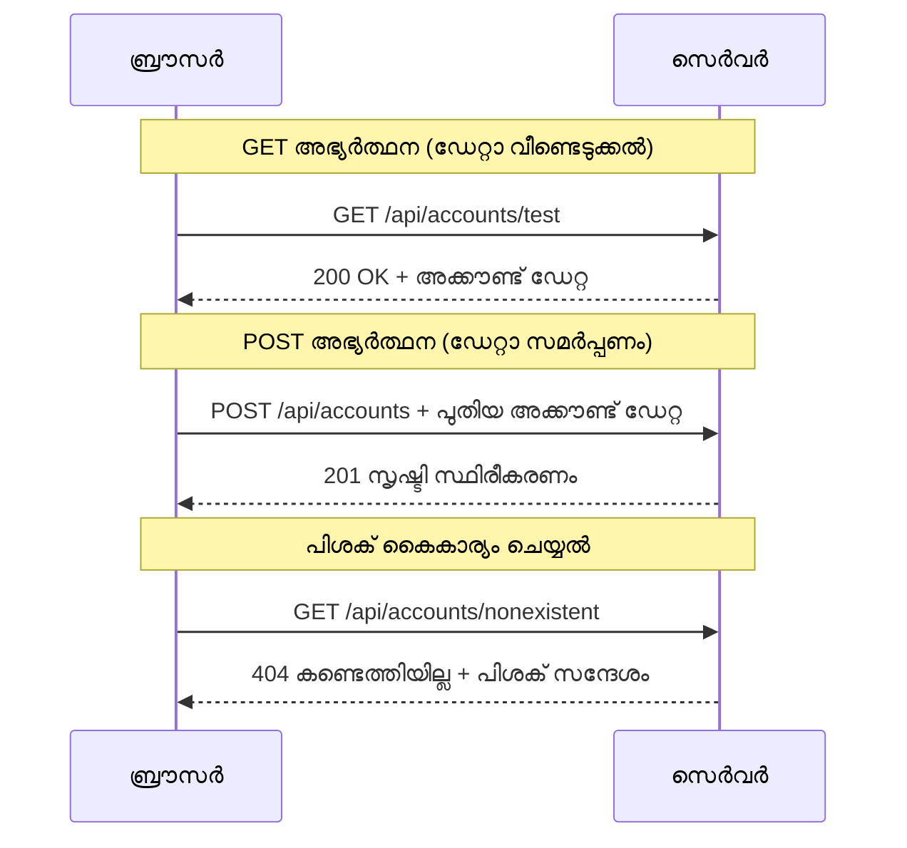
#### ഘട്ടം 3: എല്ലാം ചേർക്കുന്നു

ഇപ്പോൾ രസകരമായ ഭാഗം - നിങ്ങളുടെ അക്കൗണ്ട് ഫെച്ചിംഗ് ഫങ്ഷനെ ലോഗിൻ പ്രക്രിയയുമായി ബന്ധിപ്പിക്കുക. എല്ലാം പാടലമായി പൊരുത്തപ്പെടുന്നിടം:

```javascript
async function login() {
  const loginForm = document.getElementById('loginForm');
  const user = loginForm.user.value;
  const data = await getAccount(user);

  if (data.error) {
    return console.log('loginError', data.error);
  }

  account = data;
  navigate('/dashboard');
}
```
  
ഈ ഫങ്ഷൻ ഒരു കൃത്യമായ ക്രമത്തിൽ പ്രവർത്തിക്കുന്നു:
- ഫോം ഇന്പുട്ടിൽ നിന്നുള്ള ഉപയോക്തൃനാമം എടുക്കുന്നു
- സെർവറിൽ നിന്നും ആ ഉപയോക്താവിന്റെ അക്കൗണ്ട് ഡാറ്റ അഭ്യർത്ഥിക്കുന്നു
- പിശകുകൾ സംഭവിച്ചാൽ അത് കൈകാര്യം ചെയ്യുന്നു
- വിജയപ്രാപ്തിയോടെ അക്കൗണ്ട് ഡാറ്റ സംഭരിച്ചു ഡാഷ്ബോർഡിലേക്ക് പോകുന്നു

> 🎯 **Async/Await മാതൃക**: `getAccount` അസിങ്ക്രോണസ് ഫങ്ഷനാകുന്നതിനാൽ സെർവർ പ്രതികരിക്കാൻ പ്രോഗ്രാം കാത്തിരിക്കുവാൻ `await` കീവേഡ് ഉപയോഗിക്കുന്നു. ഇതിലൂടെ അർത്ഥമില്ലാത്ത ഡാറ്റ കൊണ്ട് കോഡ് മുന്നോട്ട് പോകരുത്.

#### ഘട്ടം 4: നിങ്ങളുടെ ഡാറ്റയ്ക്ക് ഒരു ഹോം ചെയ്യുക

ലോഡ് ചെയ്ത അക്കൗണ്ട് വിവരങ്ങൾ ഓർമ്മിക്കാൻ നിങ്ങളുടെ ആപ്പിന് ഒരു സ്ഥലം വേണം. ഇത് നിങ്ങളുടെ ആപ്പ് ഷോർട്ട്-ടേം മെമ്മറിയായി ചിന്തിക്കുക - നിലവിലെ ഉപയോക്തൃ ഡാറ്റ എളുപ്പത്തിൽ കൈകാര്യം ചെയ്യാനുള്ള സ്ഥലം. നിങ്ങളുടെ `app.js` ഫയലിന്റെ മുകളിൽ ഈ ലൈൻ ചേർക്കുക:

```javascript
// ഇത് നിലവിലെ ഉപയോക്താവിന്റെ അക്കൗണ്ട് ഡാറ്റയാണ്
let account = null;
```
  
**എന്തുകൊണ്ട് ഇത് വേണം:**
- ആപ്പിന്റെ എവിടെയും അക്കൗണ്ട് ഡാറ്റ ലഭ്യമാക്കുന്നു
- ആദ്യം `null` ആയതായി സൂചിപ്പിക്കുന്നത് "യാർക്കും ഇപ്പോൾ ലോഗിൻ ചെയ്തിട്ടില്ല" എന്ന്
- ഒരാൾ വിജയകരമായി ലോഗിൻ ചെയ്‌താൽ അല്ലെങ്കിൽ രജിസ്റ്റർ ചെയ്താൽ അപ്‌ഡേറ്റ് ചെയ്യപ്പെടും
- ഒരു ഏക സത്യം ഉറപ്പാക്കുന്ന ഉറവിടം പോലെ പ്രവർത്തിക്കുന്നു - ആരാണ് ലോഗിൻ ചെയ്തത് ഒരുപാട് ആശയക്കുഴപ്പമില്ല

#### ഘട്ടം 5: ഫോമിന് വയർ ചെയ്യുക

ഇപ്പോൾ നിങ്ങളുടെ പുതിയ ലോഗിൻ ഫങ്ഷനെ HTML ഫോമുമായി ബന്ധിപ്പിക്കുക. നിങ്ങളുടെ form ടാഗ് ഇങ്ങനെ അപ്ഡേറ്റ് ചെയ്യുക:

```html
<form id="loginForm" action="javascript:login()">
  <!-- Your existing form inputs -->
</form>
```
  
**ഈ ചെറിയ മാറ്റം എന്തുപകരുന്നു**:
- ഫോമിന്റെ "പേജ് റീലോഡ് ചെയ്യൽ" സ്വാഭാവിക പ്രവർത്തനം തടയുന്നു
- കോഡ് നിങ്ങളുടെ കസ്റ്റം ജാവാസ്‌ക്രിപ്റ്റ് ഫങ്ഷൻ വിളിക്കുന്നു
- എല്ലാം അടങ്ങിയ, സിംഗിൾ-പേജ് ആപ്പ് പോലെയാണ് പ്രവർത്തിക്കുന്നത്
- ഉപയോക്താക്കൾ "Login" ബട്ടൺ അമർത്തുമ്പോൾ എന്ത് ഉണ്ടാകണമെന്ന് നിങ്ങളുടെ നിയന്ത്രണത്തിലാക്കുന്നു

#### ഘട്ടം 6: രജിസ്റ്റർ ഫങ്ഷൻ മെച്ചപ്പെടുത്തുക

സുസ്ഥിരതയ്ക്കായി, നിങ്ങളുടെ `register` ഫങ്ഷനും അക്കൗണ്ട് ഡാറ്റ സംഭരിച്ച് ഡാഷ്ബോർഡിലേക്ക് തിരിയാൻ അപ്ഡേറ്റ് ചെയ്യുക:

```javascript
// നിങ്ങളുടെ രജിസ്റ്റർ ഫംഗ്ഷന്റെ അവസാനം ഈ വരികൾ ചേർക്കുക
account = result;
navigate('/dashboard');
```
  
**ഈ മെച്ചപ്പെടുത്തലുകൾ നൽകുന്നത്:**
- **മসൃണം** രജിസ്ട്രേഷനും ഡാഷ്ബോർഡിലേക്കുള്ള ട്രാൻസിഷൻ
- **സുസ്ഥിരമായ** ഉപയോക്തൃ അനുഭവം ലോഗിൻ, രജിസ്ട്രേഷൻ ഫ്ലോകൾക്ക് ഇടയിൽ
- **ഏറ്റവും നേരത്തെ** അക്കൗണ്ട് ഡാറ്റ ലഭ്യമാക്കൽ വിജയകരമായ ശേഷം

#### നിങ്ങളുടെ പ്രവർത്തനം പരിശോധിക്കൽ

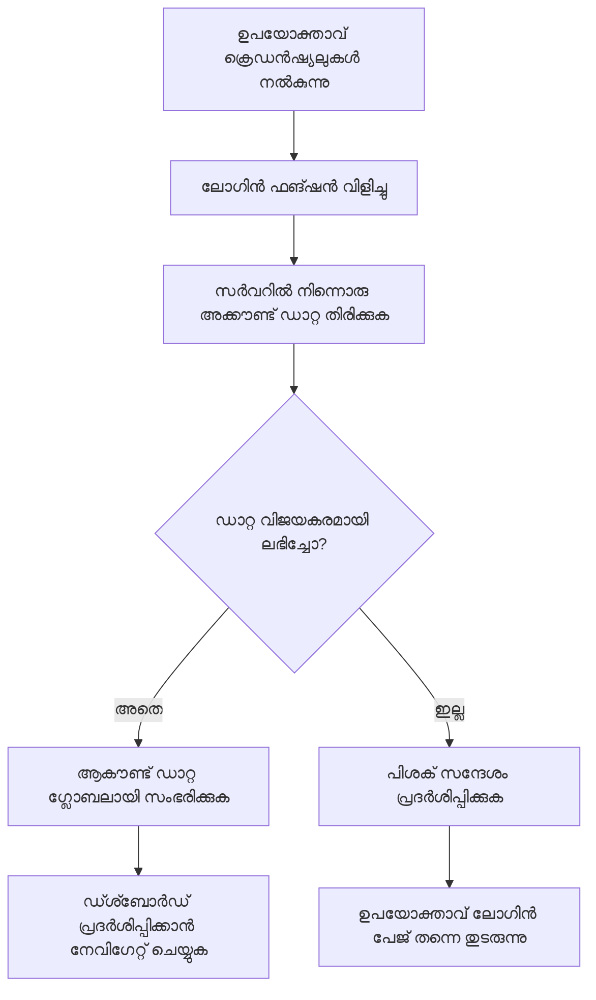
**ഇപ്പോൾ പരീക്ഷിക്കാൻ സമയമായി:**
1. ഒരു പുതിയ അക്കൗണ്ട് സൃഷ്ടിച്ച് എല്ലാം പ്രവർത്തിക്കുന്നതായി ഉറപ്പാക്കുക
2. അതേ ക്രെഡൻഷ്യലുകളിൽ ലോഗിൻ പരീക്ഷിക്കുക
3. ബ്രൗസർ കൺസോൾ (F12) നോക്കുക എന്തെങ്കിലും തകരാറുണ്ടോ എന്ന്  
4. വിജയകരമായ ലോഗിൻ ശേഷം ഡാഷ്ബോർഡിലേക്കെത്തുന്നത് ഉറപ്പാക്കുക

എന്തെങ്കിലും പ്രവർത്തിക്കുന്നില്ലങ്കിലൊഴിച്ച എളുപ്പത്തിലെ പിശകുകൾ - സംവിധാനം ഓടാത്തത്, ടൈപ്പോ മുതലായവ.

#### ക്രോസ്-ഓറിജിൻ മാജിക്ക് കുറിച്ച് ചെറിയ കുറിപ്പ്

നിങ്ങൾക്ക് സംശയമുണ്ടാകാം: "എന്താണ് വ്യത്യസ്ത പോർട്ടുകളിൽ പ്രവർത്തിക്കുന്ന ഈ API സർവറുമായി എന്റെ വെബ് ആപ്പ് സംസാരിക്കുന്നത് എങ്ങനെ?” മികച്ച ചോദ്യം! എല്ലാ വെബ് ഡെവലപ്പർമാരും ഏറ്റവും ഒടുവിൽ നേരിടുന്ന വിഷയം.

> 🔒 **ക്രോസ്-ഓറിജിൻ സെക്യൂരിറ്റി**: ബ്രൗസറുകൾ "സേം-ഓറിജിൻ നയം" നടപ്പിലാക്കുന്നു വ്യത്യസ്ത ഡൊമെയ്‌നുകൾക്ക് അനധികൃത ആശയവിനിമയം തടയാൻ. പേന്റഗണിലെ ചെക്ക്പോയിന്റ് പോലെയാണ്, ഇത് ബന്ധപ്പെട്ട ആശയവിനിമയം അംഗീകരിച്ചിരിക്കുകയാണ് എന്നത് പരിശോധിക്കുന്നു.
> 
**നമ്മൾ ക്രമീകരിച്ചത്:**
- നിങ്ങളുടെ വെബ് ആപ്പ് `localhost:3000` ൽ പ്രവർത്തിക്കുന്നു (ഡെവലപ്പ്മെന്റ് സർവർ)
- API സർവർ `localhost:5000` ൽ (ബാക്ക്‌എന്റ് സർവർ)
- API സർവർ [CORS ഹെഡറുകൾ](https://developer.mozilla.org/docs/Web/HTTP/CORS) ഉൾപ്പെടുത്തിയിരിക്കുന്നു, വെബ് ആപ്പിൽ നിന്ന് അനുമതി നൽകി ആശയവിനിമയം അനുവദിക്കുന്നത്

ഫ്രണ്ട്‌എൻഡ്, ബാക്ക്‌എൻഡ് ആപ്ലിക്കേഷനുകൾ സാധാരണയായി വേർതിരിച്ച് പ്രവർത്തിക്കുന്ന യാഥാർത്ഥ്യവുമായുള്ള താരതമ്യം.

> 📚 **കൂടുതൽ പഠിക്കുക**: APIകളെയും ഡാറ്റ ഫെച്ചിങ്ങിനെയും സംബന്ധിച്ച് കൂടുതൽ പഠിക്കാൻ ഈ സമഗ്രമായ [Microsoft Learn API മോഡ്യൂൾ](https://docs.microsoft.com/learn/modules/use-apis-discover-museum-art/?WT.mc_id=academic-77807-sagibbon) സന്ദർശിക്കുക.

## നിങ്ങളുടെ ഡാറ്റ HTML-ൽ ജീവൻ പകരുക

ഇപ്പോൾ നാം ഫെച്ച് ചെയ്ത ഡാറ്റ ഉപഭോക്താക്കൾക്ക് ദൃശ്യമായ രീതിയിൽ DOM മാനിപ്പുലേഷൻ മുഖേന കാണിക്കാൻ പോകുന്നു. ഡാർക്ക് റൂമിലെ ഫോട്ടോഗ്രഫി വികസന പ്രക്രിയ പോലെയാണ്, അപ്രത്യക്ഷമായ ഡാറ്റയെ മനുഷ്യർ കാണാനും ഇടപഴിക്കാനുമുള്ള രൂപത്തിലാക്കുന്നു.
DOM മാനിപ്പുലേഷൻ എന്നത് സ്റ്റാറ്റിക് വെബ് പേജുകളെ ഡൈനാമിക് ആപ്പ്ലിക്കേഷനുകളാക്കി മാറ്റുന്ന സാങ്കേതിക വിദ്യയാണ്, ഇത് ഉപയോക്തൃ ഇടപെടലുകൾക്കും സെർവർ പ്രതികരണങ്ങൾക്കും ആധാരമായി ഉള്ളടക്കം അപ്ഡേറ്റ് ചെയ്യുന്നു.

### ജോലിക്കായി അനുയോജ്യമായ ഉപകരണം തിരഞ്ഞെടുക്കൽ

ജാവാസ്ക്രിപ്റ്റ് ഉപയോഗിച്ച് നിങ്ങളുടെ HTML അപ്ഡേറ്റ് ചെയ്യുമ്പോൾ, നിങ്ങൾക്ക് പല തിരഞ്ഞെടുപ്പുകളും ഉണ്ട്. ഇവ toolbox-ലുള്ള വ്യത്യസ്ത ഉപകരണങ്ങളെ പോലെ പരിഗണിക്കാം - ഓരോന്നും പ്രത്യേക ജോലികൾക്കായി പാടുള്ളതാണ്:

| വിധി | എന്തിന് ഉത്തമം | എപ്പോൾ ഉപയೋಗിക്കണം | സുരക്ഷാ നില |
|--------|---------------------|----------------|--------------|
| `textContent` | ഉപയോക്തൃ ഡാറ്റ സുരക്ഷിതമായി പ്രദർശിപ്പിക്കൽ | നിങ്ങൾ ടെക്സ്റ്റ് കാണിക്കുമ്പോൾ എപ്പോഴും | ✅ ഉറപ്പുള്ളത് |
| `createElement()` + `append()` | സങ്കീർണ്ണ ലേഔട്ടുകൾ നിർമ്മിക്കൽ | പുതിയ സെക്ഷനുകൾ/ലിസ്റ്റുകൾ സൃഷ്ടിക്കുമ്പോൾ | ✅ ഉറപ്പുള്ളത് |
| `innerHTML` | HTML ഉള്ളടക്കം സജ്ജമാക്കൽ | ⚠️ ഇത് ഒഴിവാക്കാൻ ശ്രമിക്കുക | ❌ അപകടകരം |

#### ടെക്സ്റ്റ് സുരക്ഷിതമായി കാണിക്കുന്ന മാർഗ്ഗം: textContent

[`textContent`](https://developer.mozilla.org/docs/Web/API/Node/textContent) പ്രോപ്പർടി ഉപയോക്തൃ ഡാറ്റ പ്രദർശിപ്പിക്കുമ്പോൾ നിങ്ങളുടെ ഏറ്റവും നല്ല കൂട്ടുകാരനാണ്. ഇത് നിങ്ങളുടെ വെബ് പേജിന് ഒരു ബൗൺസറായി കാര്യക്ഷമമാണ് - ഒരു അപകടകരമായത് കടക്കാൻ അനുവദിക്കുന്നില്ല:

```javascript
// എഴുത്ത് പുതുക്കുന്നതിനുള്ള സുരക്ഷിതവും വിശ്വസനീയവുമായ മാർഗം
const balanceElement = document.getElementById('balance');
balanceElement.textContent = account.balance;
```
  
**textContent-ന്റെ ഗുണങ്ങൾ:**  
- എല്ലാം പ്ളെയിന് ടെക്സ്റ്റായി പരിഗണിക്കുന്നു (സ്ക്രിപ്റ്റ് എക്സിക്യൂഷൻ തടയുന്നു)  
- നിലവിലുള്ള ഉള്ളടക്കം ഓട്ടോമാറ്റിക് ക്ലിയർ ചെയ്യുന്നു  
- ലളിതമായ ടെക്സ്റ്റ് അപ്ഡേറ്റുകൾക്കായി കാര്യക്ഷമം  
- ദുഷ്ട ഉള്ളടക്കത്തിൽ നിന്നുള്ള സുരക്ഷ നൽകുന്നു  

#### ഡൈനാമിക് HTML എഴുക്കൾ സൃഷ്ടിക്കൽ

കൂടുതൽ സങ്കീർണ്ണ ഉള്ളടക്കങ്ങൾക്കായി [`document.createElement()`](https://developer.mozilla.org/docs/Web/API/Document/createElement) നെ [`append()`](https://developer.mozilla.org/docs/Web/API/ParentNode/append) എന്ന രീതിയുമായി കൂട്ടിച്ചേർത്തു ഉപയോഗിക്കുക:

```javascript
// പുതിയ ഘടകങ്ങൾ സൃഷ്ടിക്കുന്നതിന് സുരക്ഷിതമായ മാർഗ്ഗം
const transactionItem = document.createElement('div');
transactionItem.className = 'transaction-item';
transactionItem.textContent = `${transaction.date}: ${transaction.description}`;
container.append(transactionItem);
```
  
**ഈ സമീപനം മനസ്സിലാക്കൽ:**  
- ഒരു പ്രോഗ്രാമാറ്റിക് വിധത്തിൽ പുതിയ DOM ഘടകങ്ങൾ സൃഷ്ടിക്കുന്നു  
- ഘടകങ്ങളുടെ അടയാളങ്ങളും ഉള്ളടക്കവും പൂർണ്ണ നിയന്ത്രണം നിലനിർത്തുന്നു  
- സങ്കീർണ്ണമായ, ന喜്ചിത ഘടക ഘടനകൾ അനുവദിക്കുന്നു  
- ഘടനയും ഉള്ളടക്കവും വേർതിരിച്ച് സുരക്ഷ ഉറപ്പാക്കുന്നു  

> ⚠️ **സുരക്ഷ പരിഗണന**: പല ട്യൂട്ടോറിയലുകളിലും [`innerHTML`](https://developer.mozilla.org/docs/Web/API/Element/innerHTML) കാണപ്പെടുമ്പോൾ, ഇത് ഉൾക്കൊള്ളിച്ച സ്ക്രിപ്റ്റുകൾ പ്രവർത്തിപ്പിക്കാമെന്ന അഭയം ഉണ്ട്. CERN-ന്റെ അനധികൃത കോഡ് പ്രവർത്തനം തടയുന്ന സുരക്ഷാ പ്രോട്ടോകോളുകൾ പോലെ, `textContent`യും `createElement`ഉം കൂടുതൽ സുരക്ഷിതവും നല്ല സംവിധാനങ്ങളും നൽകുന്നു.  
>   
**innerHTML-ന്റെ അപകടങ്ങൾ:**  
- ഉപയോക്തൃ ഡാറ്റയിലെ `<script>` ടാഗുകൾ പ്രവർത്തിപ്പിക്കുന്നു  
- കോഡ് ഇन्जെക്ഷൻ ആക്രമണങ്ങൾക്ക് തളർന്നിരിക്കുന്നു  
- സാങ്കേതിക സുരക്ഷാ ചർമ്മങ്ങൾ സൃഷ്ടിക്കുന്നു  
- നാം ഉപയോഗിക്കുന്ന സുരക്ഷിത രീതികൾ തുല്യ പ്രവർത്തനം നൽകുന്നു  

### പിശകുകൾ ഉപയോക്തൃ സൗഹൃദമാകുന്നത്

ഇപ്പോൾ, ലോഗിൻ പിശകുകൾ ബ്രൗസർ കോൺസോളിൽ മാത്രം കാണപ്പെടുന്നു, ഉപയോക്താക്കൾക്ക് അവ ദൃശ്യമായില്ല. ഒരു പൈലറ്റിന്റെ അകത്തള പരിശോധനകളും യാത്രക്കാരുടെ വിവര സംവിധാനവും തമ്മിലുള്ള വ്യത്യാസം പോലെ, നമുക്ക് പ്രാധാനപ്പെട്ട വിവരങ്ങൾ യഥാർത്ഥ ചാനലിലൂടെ հաղորդിക്കേണ്ടതുണ്ട്.

ദൃശ്യമായ പിശകു സന്ദേശം നൽ‌കുന്നത് ഉപയോക്താക്കൾക്ക് എന്തു തെറ്റായി, അങ്ങനെ എങ്ങനെ മുന്നോട്ട് പോവാമെന്നത് ഉടനെ അറിയിക്കുന്നതിനുള്ള മാർഗമാണ്.

#### ഘട്ടം 1: പിശകു സന്ദേശങ്ങൾക്ക് സ്ഥലം ചേർക്കുക

ആദ്യം, നിങ്ങളുടെ HTML-ൽ പിശകുകൾ കാണിക്കുന്നതിനുള്ള ഒരു സ്ഥലമിടം നൽകുക. ഇത് ലോഗിൻ ബട്ടണിന് മുമ്പ് ചേർക്കൂ, അതുകൊണ്ട് ഉപയോക്താക്കൾ പ്രകൃത്യാ ശ്രദ്ധിക്കും:

```html
<!-- This is where error messages will appear -->
<div id="loginError" role="alert"></div>
<button>Login</button>
```
  
**ഇവിടെ എന്താണ് നടക്കുന്നത്:**  
- ആവശ്യമായതിന് മുൻപ് അത് ദൃശ്യമല്ലാത്ത, ശൂന്യമായ ഒരു ഡിവ് സൃജിക്കുന്നു  
- ഉപയോക്താക്കൾ "Login" ക്ലിക്ക് ചെയ്തതിനുശേഷം സ്വാഭാവികമായും നോക്കാറായ ഇടത്തിലും ഉണ്ടാക്കുന്നു  
- `role="alert"` സ്ക്രീൻ റീഡർമാർക്ക് സഹായകമാണ് - ഇത് സഹായ വിതരണ സാങ്കേതികതയ്ക്ക് "ഇത് പ്രധാനമാണ്!" എന്നാണ് അറിയിക്കുന്നത്  
- യൂണിക്ക് `id` ജാവാസ്ക്രിപ്റ്റിനെ ലളിതമായി ലക്ഷ്യമിടാൻ സഹായിക്കുന്നു  

#### ഘട്ടം 2: സൗകര്യപ്രദമായ ഹെൽപ്പർ ഫังก്ഷൻ സൃഷ്ടിക്കുക

ഏത് ഘടകത്തിന്റെയും ടെക്സ്റ്റ് സുരക്ഷിതമായി അപ്ഡേറ്റ് ചെയ്യാൻ സാധിക്കുന്ന ഒരു ചെറിയ യുട്ടിലിറ്റി ഫൺക്ഷൻ സൃഷ്ടിയ്ക്കാം. എഴുതാൻ ഒന്നു, എല്ലായി ഉപയോഗിക്കുന്ന വിധം:

```javascript
function updateElement(id, text) {
  const element = document.getElementById(id);
  element.textContent = text;
}
```
  
**ഫംഗ്ഷൻ ഗുണങ്ങൾ:**  
- ലളിതമായ ഇന്റർഫേസിൽൊരു ഘടക ID മാത്രമേ ആവശ്യപ്പെടൂ  
- DOM ഘടകങ്ങളെ സുരക്ഷിതമായി കണ്ടെത്തി അപ്ഡേറ്റ് ചെയ്യുന്നു  
- കോഡ് പുനരുപയോഗം കുറയ്ക്കുന്നു  
- ആപ്ലിക്കേഷനിൽ സ്ഥിരതയുള്ള അപ്ഡേറ്റ് പെരുമാറ്റം നിലനിർത്തുന്നു  

#### ഘട്ടം 3: പിശകുകൾ ഉപയോക്താക്കൾക്ക് ദൃശ്യമായിടത്ത് കാണിക്കുക

ഇപ്പോൾ മറഞ്ഞിരിക്കുന്ന കോൺസോൾ സന്ദേശം ഉപയോക്താക്കൾക്ക് കാണാനുള്ള വിധം മാറ്റൂ. നിങ്ങളുടെ ലോഗിൻ ഫംഗ്ഷൻ അപ്ഡേറ്റ് ചെയ്യുക:

```javascript
// കൺസോളിൽ ലോഗ് ചെയ്യുന്നതിനേക്കാൾ ഉപയോക്താവിനും തെറ്റ് എന്താണെന്ന് കാണിക്കൂ
if (data.error) {
  return updateElement('loginError', data.error);
}
```
  
**ഇത് ചെറിയ മാറ്റം വലിയ വ്യത്യാസം സൃഷ്ടിക്കുന്നു:**  
- പിശകു സന്ദേശങ്ങൾ ഉപയോക്താക്കൾ നോക്കുകയുള്ള സ്ഥലത്ത് നേരിട്ട് കണ്ടുവരുന്നു  
- മിസ്റ്റീരിയസ് മൗന പരാജയങ്ങൾ ഇല്ലാതാക്കുന്നു  
- ഉടൻ, പ്രായോഗികമായ പ്രതികരണം ഉപയോക്താക്കൾക്ക് ലഭിക്കുന്നു  
- നിങ്ങളുടെ ആപ്പ് പ്രൊഫഷണൽ, ധൈര്യവാൻ അനുഭവം നൽകുന്നു  

ഇപ്പോൾ, അസാധുവായ അക്കൗണ്ട് ഉപയോഗിച്ച് പരിശോധന നടത്തുമ്പോൾ, പേജ് തനിച്ചുതന്നെ സഹായകരമായ പിശകു സന്ദേശം കാണിക്കും!


#### ഘട്ടം 4: ആക്സസ്‌ബിലിറ്റിയിൽ ഉൾപ്പെടുത്തൽ

മുൻപ് ചേർത്ത `role="alert"` ഏതു അലങ്കാരമല്ല! ഇത് ഒരു [ലൈവ് റീജിയൻ](https://developer.mozilla.org/docs/Web/Accessibility/ARIA/ARIA_Live_Regions) സൃഷ്ടിക്കുന്നു, സ്ക്രീൻ റീഡറുകൾക്ക് മാറ്റങ്ങൾ ഉടൻ അറിയിക്കുന്നു:

```html
<div id="loginError" role="alert"></div>
```
  
**ഇത് കാര്യമാകുന്നത്:**  
- സ്ക്രീൻ റീഡർ ഉപയോക്താക്കൾ പിശകു സന്ദേശം ഉടനെ കേൾക്കും  
- എല്ലാവർക്കും ഒരേ പ്രധാന വിവരങ്ങൾ ലഭിക്കും, അവർ എങ്ങനെ സഞ്ചരിച്ചാലും  
- നിങ്ങളുടെ ആപ്പ് കൂടുതൽ ആളുകൾക്കായി പ്രവർത്തിക്കുന്നതിനുള്ള ലളിത മാർഗ്ഗം  
- ആമുഖപരമായ അനുഭവങ്ങൾ സൃഷ്ടിക്കാൻ നിങ്ങൾക്കിഷ്ടമാണെന്ന് കാണിക്കുന്നു  

ഇത്തരത്തിലുള്ള ചെറിയ കാഴ്‌ച്ചകൾ നല്ല ഡെവലപ്പർമാരിൽ നിന്ന് മികവുറ്റവരെ വേർതിരിക്കുന്നു!

### 🎯 ശിക്ഷണപരമായ പരിശോധന: ആധികാരികത മാതൃകകൾ

**നിന്നു നിർത്തി ചിന്തിക്കുക**: നിങ്ങൾ ഈ സംറഭത്തിലൂടെ പൂർണ്ണമായ ഒരു ആധികാരികത പ്രവാഹം നടപ്പാക്കിയിരിക്കുന്നു. ഈ മാതൃക വെബ് ഡവലപ്പ്മെന്റിൽ അടിസ്ഥാന ഘടകമാണ്.

**തെറ്റായ ഓർത്തെടുക്കൽ:**  
- API കോൾസ് async/await ഉപയോഗിക്കുന്നത് എന്തിന്?  
- `encodeURIComponent()` മറന്നാൽ എന്ത് സംഭവിക്കും?  
- എങ്കിൽ ഞങ്ങളുടെ പിശകുകളുടെ കൈകാര്യം ഉപയോക്തൃ അനുഭവം എങ്ങനെ മെച്ചപ്പെടുത്തുന്നു?  

**യാഥാർത്ഥ ലോക ബന്ധം**: ഇവിടെ പഠിച്ച മാതൃകകൾ (ആസിന്ത ഡേറ്റ ഫെച്ചിംഗ്, പിശകു കൈകാര്യം, ഉപയോക്തൃ പ്രതികരണം) എല്ലാ പ്രധാന വെബ് ആപ്പുകളിലും ഉപയോഗിക്കുന്നു, സോഷ്യൽ മീഡിയ മുതൽ ഇ-കൊമേഴ്സ് വരെ. നിങ്ങൾ പ്രൊഡക്ഷൻ തലത്തിലുള്ള കഴിവുകൾ നിർമ്മിക്കുന്നു!

**സവ deserializee ചോദ്യങ്ങൾ**: ഈ ആധികാരികത സംവിധാനം ഒരേ സമയം മൾട്ടി യൂസർ റോളുകൾ (ഉദാ. കസ്റ്റമർ, അഡ്മിൻ, ടെല്ലർ) കൈകാര്യം ചെയ്യുന്നതിനായി നിങ്ങൾ എങ്ങനെ മാറ്റം വരുത്തിതീർക്കും? ഡേറ്റാ ഘടനയും UI മാറ്റങ്ങളും എന്തൊക്കെയാകും?

#### ഘട്ടം 5: രജിസ്‌ട്രേഷനിലും സമാന മാതൃക പ്രയോഗിക്കുക

സമവായമായ അനുഭവത്തിന്, നിങ്ങളുടെ രജിസ്‌ട്രേഷൻ ഫോമിലും സമാന പിശക് കൈകാര്യം നടപ്പിലാക്കുക:

1. രജിസ്‌ട്രേഷൻ HTML-ൽ പിശക് പ്രദർശന ഘടകം ചേർക്കുക:  
```html
<div id="registerError" role="alert"></div>
```
  
2. രജിസ്റ്റർ ഫങ്ഷനെ സമാന പിശക് പ്രദർശന മാതൃകയോടെ അപ്ഡേറ്റ് ചെയ്യുക:  
```javascript
if (data.error) {
  return updateElement('registerError', data.error);
}
```
  
**സമാനപിശക് കൈകാര്യംയുടെ ഗുണങ്ങൾ:**  
- എല്ലാ ഫോമുകളിലും ഏകീകൃത ഉപയോക്തൃ അനുഭവം നൽകുന്നു  
- പരിചിത രീതികൾ ഉപയോഗിച്ച് മാനസിക ഭാരം കുറയ്ക്കുന്നു  
- പുനരുപയോഗാവശ്യമുള്ള കോഡ് കൊണ്ട് പരിരക്ഷണം ലളിതമാക്കുന്നു  
- ആപ്ലിക്കേഷനിൽ ആക്സസ്‌ബിലിറ്റി നിലനിർ‍ത്തുന്നു  

## നിങ്ങളുടെ ഡൈനാമിക് ഡാഷ്ബോർഡ് സൃഷ്ടിക്കൽ

ഇപ്പോൾ നിങ്ങളുടെ സ്റ്റാറ്റിക് ഡാഷ്ബോർഡ് ഒരു ഡൈനാമിക് ഇന്റർഫേസായി മാറ്റാം, ഇത് യഥാർത്ഥ അക്കൗണ്ട് ഡാറ്റ പ്രദർശിപ്പിക്കുന്നു. പ്രിന്റ് ചെയ്ത ഫ്ലൈറ്റ് ഷെഡ്യൂളും വിമാനത്താവളത്തിലെ ലൈവ് ഡിപ്പാർച്ചർ ബോർഡും തമ്മിലുള്ള വ്യത്യാസം പോലെ, നാം സ്റ്റാറ്റിക് വിവരങ്ങളിൽനിന്ന് യാഥാർത്ഥ-സമയ പ്രതികരണങ്ങളിലേക്ക് മാറുകയാണ്.

നിങ്ങൾ പഠിച്ച DOM മാനിപ്പുലേഷൻ സാങ്കേതിക വിദ്യ ഉപയോഗിച്ച്, ഇപ്പോൾ ഞങ്ങൾ ഒരു ഡാഷ്ബോർഡ് സൃഷ്ടിക്കും, സജീവ അക്കൗണ്ട് വിവരങ്ങളുമായി ഓട്ടോമാറ്റിക്കമായി അപ്ഡേറ്റ് ചെയ്യും.

### നിങ്ങളുടെ ഡാറ്റയ്ക്ക് പരിചയം നേടുക

നിർമ്മാണം ആരംഭിക്കുന്നതിനുമുമ്പ്, നിങ്ങളുടെ സെർവർ തിരികെ നൽകുന്ന ഡാറ്റ എന്താണെന്ന് നോക്കാം. ആരെങ്കിലും വിജയകരമായി ലോഗിൻ ആയാൽ, നിങ്ങൾക്ക് ലഭിക്കുന്ന വിവരങ്ങൾ:

```json
{
  "user": "test",
  "currency": "$",
  "description": "Test account",
  "balance": 75,
  "transactions": [
    { "id": "1", "date": "2020-10-01", "object": "Pocket money", "amount": 50 },
    { "id": "2", "date": "2020-10-03", "object": "Book", "amount": -10 },
    { "id": "3", "date": "2020-10-04", "object": "Sandwich", "amount": -5 }
  ]
}
```
  
**ഈ ഡാറ്റ ഘടന നൽകുന്നത്:**  
- **`user`**: അനുഭവം വ്യക്തിഗതമാക്കാൻ (ഉദാ. "സ്വാഗതം, Sarah!")  
- **`currency`**: പണത്തിന്റെ മൂല്യം ശരിയായി പ്രദർശിപ്പിക്കാൻ  
- **`description`**: അക്കൗണ്ടിന്റെ സൗഹൃദപൂർവ്വമായ പേര്  
- **`balance`**: ഏറ്റവും പ്രധാനം ഉള്ള നിലവിലെ ബാലൻസ്  
- **`transactions`**: എല്ലാ വിശദാംശങ്ങളോടൊപ്പം മുഴുവൻ ഇടപാടുകളുടെ ചരിത്രം  

നിങ്ങൾക്കൊരു പ്രൊഫഷണൽ ബാങ്കിംഗ് ഡാഷ്ബോർഡ് നിർമ്മിക്കാൻ വേണ്ട സൗകര്യങ്ങൾ ഇവിടെ ഉണ്ട്!

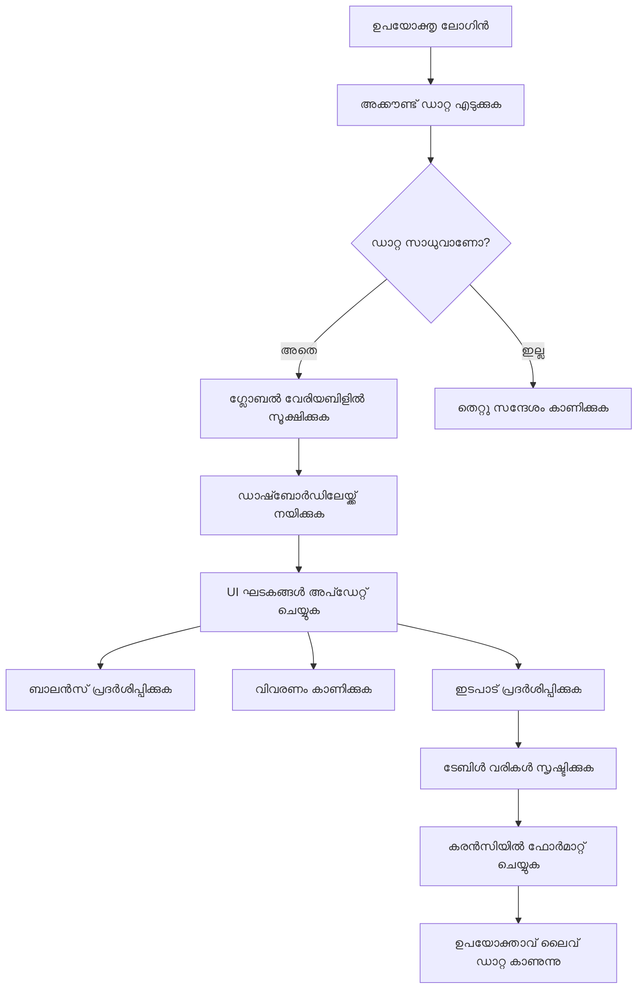
> 💡 **പ്രോ ടിപ്പ്**: ഡാഷ്ബോർഡ് വേഗത്തിൽ പരീക്ഷിക്കാൻ `test` എന്ന യൂസർനെയിം ഉപയോഗിച്ച് ലോഗിൻ ചെയ്യൂ - ഇത് സാമ്പിൾ ഡാറ്റ മുൻകൂട്ടി ലോഡ് ചെയ്യുന്നുണ്ട്, നിങ്ങൾക്ക് ആദ്യമായി ഇടപാട് സൃഷ്ടിക്കാതെ എല്ലാം കാണാൻ കഴിയും.  
>   
**ടെസ്റ്റ് അക്കൗണ്ട് എത്രത്തോളം സഹായിക്കുന്നു:**  
- യഥാർത്ഥസമാനമായ സാമ്പിൾ ഡാറ്റ മുൻകൂട്ടി ലോഡ് ചെയ്ത്  
- ഇടപാട് പ്രദർശിപ്പിക്കുന്നത് കാണാൻ ഉത്തമം  
- ഡാഷ്ബോർഡ് ഫീച്ചറുകൾ പരിശോധിക്കാൻ  
- നকল ഡാറ്റ കാൽമാനുവായി സൃഷ്ടിക്കേണ്ടതുണ്ടാവാതെ saves ചെയ്യുന്നു  

### ഡാഷ്ബോർഡ് പ്രദർശന ഘടകങ്ങൾ സൃഷ്ടിക്കൽ

നിങ്ങളുടെ ഡാഷ്ബോർഡ് ഇന്റർഫേസ് നിലനിൽക്കാൻ തുടക്കത്തിൽ അക്കൗണ്ട് സംക്ഷേപ വിവരങ്ങൾ ചേർത്ത് പിന്നീട് കൂടുതൽ സങ്കീർണ്ണമായ ഫീച്ചറുകളിലേക്ക് (ഇടപാട് ലിസ്റ്റുകൾ) നീങ്ങാം.

#### ഘട്ടം 1: HTML ഘടന അപ്ഡേറ്റ് ചെയ്യുക

ആദ്യം, സ്റ്റാറ്റിക് "ബാലൻസ്" സെക്ഷൻ മാറ്റി, നിങ്ങളുടെ ജാവാസ്ക്രിപ്റ്റ് ഡൈനാമിക് ആയി നിറയ്ക്കാനുള്ള പ്ലേസ്ഹോൾഡർ ഘടകങ്ങൾ ചേർക്കുക:

```html
<section>
  Balance: <span id="balance"></span><span id="currency"></span>
</section>
```
  
പിന്നീട്, അക്കൗണ്ട് വിവരണത്തിന് ഒരു സെക്ഷൻ ചേർക്കുക. ഡാഷ്ബോർഡ് ഉള്ളടക്കത്തിന് തലക്കെട്ടായി പ്രവർത്തിക്കുന്നതിനാൽ സെമാന്റിക് HTML ഉപയോഗിക്കുക:

```html
<h2 id="description"></h2>
```
  
**HTML ഘടന മനസ്സിലാക്കൽ:**  
- ബാലൻസിനും കറൻസിക്കും വ്യത്യസ്ഥ `<span>` ഘടകങ്ങൾ ഉപയോഗിച്ച് വ്യത്യസ്ത നിയന്ത്രണം  
- ജാവാസ്ക്രിപ്റ്റ് ലക്‌ഷ്യപ്പെടുത്താൻ ഓരോ ഘടകത്തിനും വ്യത്യസ്ത IDs  
- അക്കൗണ്ട് വിവരണത്തിന് `<h2>` ഉപയോഗിച്ച് സെമാന്റിക് HTML പാലനം  
- സ്ക്രീൻ റീഡർമാർക്കും SEO-ക്കും ലജിക്കൽ ഹയർകാർക്കി സൃഷ്ടിക്കൽ  

> ✅ **ആക്സസ്ബിലിറ്റി അറിവ്**: അക്കൗണ്ട് വിവരണം ഡാഷ്ബോർഡ് ഉള്ളടക്കത്തിനുള്ള തലക്കെട്ടായി പ്രവർത്തിക്കുന്നു, അവ സെമാന്റിക് തലക്കെട്ടായി അടയാളപ്പെടുത്തുന്നു. [heading structure](https://www.nomensa.com/blog/2017/how-structure-headings-web-accessibility) ആക്സസ്‌ബിലിറ്റിയിൽ എങ്ങനെ സ്വാധീനം ചെലുത്തുന്നു എന്നത് മനസ്സിലാക്കുക. നിങ്ങളുടെ പേജിലെ മറ്റ് ഘടകങ്ങൾ തലയ്ക്കടയാളം ഉപയോഗിച്ച് മെച്ചപ്പെടാൻ സാധ്യത വേണ്ടായിരിക്കുന്നു എന്നു കണ്ടെത്തുക.  

#### ഘട്ടം 2: ഡാഷ്ബോർഡ് അപ്ഡേറ്റ് ഫംഗ്ഷൻ സൃഷ്ടിക്കുക

ഇപ്പോൾ, യഥാർത്ഥ അക്കൗണ്ട് ഡാറ്റ ഉപയോഗിച്ച് ഡാഷ്ബോർഡ് നിറയ്ക്കുന്ന ഒരു ഫംഗ്ഷൻ സൃഷ്ടിക്കാം:

```javascript
function updateDashboard() {
  if (!account) {
    return navigate('/login');
  }

  updateElement('description', account.description);
  updateElement('balance', account.balance.toFixed(2));
  updateElement('currency', account.currency);
}
```
  
**ഈ ഫംഗ്ഷൻ ഘട്ടംഘട്ടമായി ചെയ്യുന്ന കാര്യങ്ങൾ:**  
- അക്കൗണ്ട് ഡാറ്റ അശേഷമില്ലെന്ന് ഉറപ്പാക്കുന്നു  
- അംഗീകൃതമല്ലാത്ത ഉപയോക്താക്കളെ ലോഗിനിലേക്ക് തിരിച്ചയക്കുന്നു  
- പുനരുപയോഗയോഗ്യമായ `updateElement` ഫംഗ്ഷൻ ഉപയോഗിച്ച് അക്കൗണ്ട് വിവരണങ്ങൾ അപ്ഡേറ്റ് ചെയ്യുന്നു  
- ബാലൻസിനെ എപ്പോഴും രണ്ടു ദശാംശ സ്ഥാനം കാണിക്കുന്ന വിധത്തിൽ ഫോർമാറ്റ് ചെയ്യുന്നു  
- അനുയോജ്യമായ കറൻസി ചിഹ്നം പ്രദർശിപ്പിക്കുന്നു  

> 💰 **പണത്തിന്റെ ഫോർമാറ്റിംഗ്**: [`toFixed(2)`](https://developer.mozilla.org/docs/Web/JavaScript/Reference/Global_Objects/Number/toFixed) മെതഡ് ഒരു രക്ഷകനാണ്! ഇത് നിങ്ങളുടെ ബാലൻസ് എപ്പോഴും യഥാർത്ഥ പണത്തിനെ പോലെയായി കാണിക്കുന്നു - "75.00" എന്ന പോലെ, വെറും "75" അല്ല. നിങ്ങളുടെ ഉപയോക്താക്കൾക്ക് പതിവായി കാണുന്ന കറൻസി ഫോർമാറ്റിംഗ് ഇഷ്ടപ്പെടും.  

#### ഘട്ടം 3: ഡാഷ്ബോർഡ് ഉറപ്പാക്കൽ അപ്ഡേറ്റ് ചെയ്യുന്നു

ഓരോ സന്ദർശനത്തിലും ഡാഷ്ബോർഡ് പുതിയ ഡാറ്റ ഉപയോഗിച്ച് പുതുക്കുന്നതിന്, നമുക്ക് നിങ്ങളുടെ നാവിഗേഷൻ സിസ്റ്റത്തിലേക്ക് ഇടുക. നിങ്ങൾ [lesson 1 assignment](../1-template-route/assignment.md) പൂർത്തിയാക്കിയിട്ടുണ്ടെങ്കിൽ, ഇത് പരിചിതമായിരിക്കണം. ഇല്ലെങ്കിൽ, നിങ്ങൾക്കാവശ്യമുള്ളത് ഇതു:

`updateRoute()` ഫംഗ്ഷനിന്റെ അവസാനം ഇതു ചേർക്കുക:

```javascript
if (typeof route.init === 'function') {
  route.init();
}
```
  
അപ്പുറത്ത് നിങ്ങളുടെ റൂട്ടുകൾ ഡാഷ്ബോർഡ് ഇൻഷ്യലൈസേഷൻ ഉൾപ്പെടുത്തുന്നതായി അപ്ഡേറ്റ് ചെയ്യുക:

```javascript
const routes = {
  '/login': { templateId: 'login' },
  '/dashboard': { templateId: 'dashboard', init: updateDashboard }
};
```
  
**ഈ സൂക്ഷ്മ ക്രമീകരണം ചെയ്യുന്നത്:**  
- ഒരു റൂട്ട് പ്രത്യേക ഇൻഷ്യലൈസേഷൻ കോഡ് ഉണ്ടായിരിക്കാമെന്ന് പരിശോധിക്കുന്നു  
- റൂട്ട് ലോഡ് ചെയ്യുമ്പോൾ ആ കോഡ് ഓട്ടോമാറ്റിക്കായി പ്രവർത്തിപ്പിക്കുന്നു  
- നിങ്ങളുടെ ഡാഷ്‌ബോർഡ് എപ്പോഴും പുതിയ ഡാറ്റ കാണിക്കുന്നു  
- നിങ്ങളുടെ റൂട്ടിംഗ് ലോജിക് ശുചിത്വവും ക്രമവും നിലനിർത്തുന്നു  

#### ഡാഷ്ബോർഡ് പരീക്ഷണം

ഈ മാറ്റങ്ങൾ നടപ്പിലാക്കിയ ശേഷം ഡാഷ്ബോർഡ് പരിശോധിക്കുക:

1. ടെസ്റ്റ് അക്കൗണ്ട് ഉപയോഗിച്ച് ലോഗിൻ ചെയ്യുക  
2. ഡാഷ്ബോർഡിലേക്ക് തിരിച്ചയക്കപ്പെടുന്നതു പരിശോധിക്കുക  
3. അക്കൗണ്ട് വിവരണം, ബാലൻസ്, കറൻസി ശരിയായി പ്രദർശിക്കുമോ എന്ന് പരിശോധിക്കുക  
4. ലോഗ്ഔട്ട് ചെയ്ത് വീണ്ടും ലോഗിൻ ചെയ്യുക, ഡാറ്റ ശരിയായി പുതുക്കുന്നുണ്ടോ എന്ന് ഉറപ്പാക്കുക  

നിങ്ങളുടെ ഡാഷ്ബോർഡ് ഇപ്പോൾ പ്രധാനപ്പെട്ട, ലോഗിൻ ചെയ്ത ഉപയോക്താവിന്റെ ഡാറ്റ അനുസരിച്ച് ഡൈനാമിക് ആയി അപ്ഡേറ്റ് ചെയ്യും!

## സ്മാർട്ട് ട്രാൻസാക്ഷൻ ലിസ്റ്റ് ടെമ്പ്‌ളേറ്റുകളോടെ നിർമ്മിക്കൽ

ഓരോ ട്രാൻസാക്ഷൻക്കും HTML കൈയടികൾ നിർമ്മിക്കുകയാണ് പകരം, ടെമ്പ്‌ളേറ്റുകൾ ഉപയോഗിച്ച് സ്ഥിരതയുള്ള ഫോർമാറ്റിംഗ് സ്വയം സൃഷ്ടിക്കും. ബഹിരാകാശ യന്ത്ര നിർമ്മാണത്തിൽ ഉപയോഗിക്കുന്ന സ്റ്റാൻഡേർഡ് ഘടകങ്ങളുപോലെ, എല്ലാ ട്രാൻസാക്ഷൻ റോേയും സമാന ഘടന, രൂപത്തിൽ പിന്തുടരാൻ ടേംപ്ലേറ്റുകൾ ഉറപ്പാക്കുന്നു.

ഈ സാങ്കേതിക വിദ്യ കുറച്ച് ട്രാൻസാക്ഷനുകളிலിന്നു മുതൽ ആയിരക്കണക്കിന് വരെ സ്കെയിൽ ചെയ്യാനാവും, പ്രകടനം സ്ഥിരമായി നിലനിർത്തി.

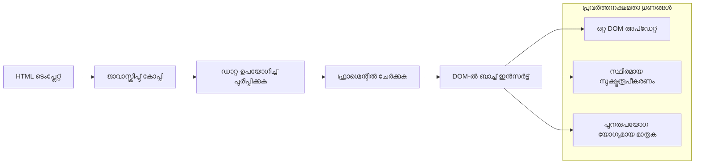
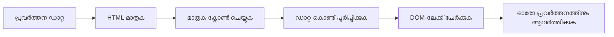
### ഘട്ടം 1: ട്രാൻസാക്ഷൻ ടെമ്പ്‌ളേറ്റ് സൃഷ്ടിക്കുക

ആദ്യം, നിങ്ങളുടെ HTML `<body>`യിൽ ട്രാൻസാക്ഷൻ റോയുടെ പുനരുപയോഗ യോഗ്യമായ ടെമ്പ്‌ളേറ്റ് ചേർക്കുക:

```html
<template id="transaction">
  <tr>
    <td></td>
    <td></td>
    <td></td>
  </tr>
</template>
```
  
**HTML ടെമ്പ്‌ളേറ്റുകൾ മനസ്സിലാക്കൽ:**  
- ഒരു table row-യ്ക്ക് ഘടന നിർവചിക്കുന്നു  
- ജാവാസ്ക്രിപ്റ്റ് ക്ലോൺ ചെയ്ത് പൂരിപ്പിക്കുവോളം ദൃശ്യമായിട്ടില്ല  
- തീയതി, വിവരണം, തുക എന്നിവയ്ക്ക് മൂന്നത്തെല്ല വാചകങ്ങള് അടങ്ങിയിരിക്കുന്നു  
- അധികം സ്ഥിരതയുള്ള ഫോർമാറ്റിംഗ് ഉറപ്പാക്കുന്ന പുനരുപയോഗ മാതൃക നൽകുന്നു  

### ഘട്ടം 2: ഡൈനാമിക് ഉള്ളടക്കത്തിനു വേണ്ടി ടേബിൾ തയ്യാറാക്കുക

അടുത്തതായി, ജാവാസ്ക്രിപ്റ്റ് എളുപ്പത്തിൽ ലക്ഷ്യമിടാന്‍ നിങ്ങളുടെ table body-ക്ക് ഒരു `id` നല്കുക:

```html
<tbody id="transactions"></tbody>
```
  
**ഇത് നേടുന്നത്:**  
- ട്രാൻസാക്ഷൻ റോകൾ ചേർക്കാനുളള മനസ്സിലാകുന്ന ലക്ഷ്യം സൃഷ്ടിക്കുന്നു  
- ടേബിൾ ഘടന ഡൈനാമിക് ഉള്ളടക്കത്തിൽ നിന്നു വേർതിരിക്കുന്നു  
- ട്രാൻസാക്ഷൻ ഡാറ്റ സുതാര്യമായി ക്ലിയർ ചെയ്ത് പുനര്‍നിർമ്മിക്കുക  

### ഘട്ടം 3: ട്രാൻസാക്ഷൻ റോ ഫാക്ടറി ഫംഗ്ഷൻ നിർമ്മിക്കുക

ഇപ്പോൾ ട്രാൻസാക്ഷൻ ഡാറ്റ HTML ഘടകങ്ങളായി മാറ്റുന്ന ഒരു ഫംഗ്ഷൻ സൃഷ്ടിക്കുക:

```javascript
function createTransactionRow(transaction) {
  const template = document.getElementById('transaction');
  const transactionRow = template.content.cloneNode(true);
  const tr = transactionRow.querySelector('tr');
  tr.children[0].textContent = transaction.date;
  tr.children[1].textContent = transaction.object;
  tr.children[2].textContent = transaction.amount.toFixed(2);
  return transactionRow;
}
```
  
**ഈ ഫാക്ടറി ഫംഗ്ഷൻ വിശകലനം:**  
- ടെമ്പ്‌ളേറ്റ് ഘടകത്തെ ID വഴി കണ്ടെത്തുന്നു  
- സുരക്ഷിതമായി കൈകാര്യം ചെയ്യാൻ ടെമ്പ്‌ളേറ്റ് ഉള്ളടക്കം ക്ലോൺ ചെയ്യുന്നു  
- ക്ലോൺ ചെയ്ത ഉള്ളടക്കത്തിൽ ടേബിൾ റേ തിരഞ്ഞെടുക്കുന്നു  
- ഓരോ സെല്ലിലും ട്രാൻസാക്ഷൻ ഡാറ്റ പൂരിപ്പിക്കുന്നു  
- തുക ശരിയായ ദശാംശങ്ങൾ കൊണ്ട് ഫോർമാറ്റ് ചെയ്യുന്നു  
- സജ്ജമായ റേ തിരികെ നൽകുന്നു  

### ഘട്ടം 4: ബഹുഭൂരി ട്രാൻസാക്ഷൻ റോ സുസ്ഥിരമായി സൃഷ്ടിക്കുക

`updateDashboard()` ഫംഗ്ഷനിൽ താഴെ കൊടുത്ത കോഡ് ചേർക്കുക എല്ലാ ഇടപാടുകളും പ്രദർശിപ്പിക്കാൻ:

```javascript
const transactionsRows = document.createDocumentFragment();
for (const transaction of account.transactions) {
  const transactionRow = createTransactionRow(transaction);
  transactionsRows.appendChild(transactionRow);
}
updateElement('transactions', transactionsRows);
```
  
**ഈ കാര്യക്ഷമ സമീപനം മനസ്സിലാക്കൽ:**  
- DOM പ്രവർത്തനങ്ങൾ കൂട്ടായി നടത്താൻ ഡോക്യുമന്റ് ഫ്രാഗ്മെന്റ് സൃഷ്ടിക്കുന്നു  
- അക്കൗണ്ട് ഡാറ്റയിലെ എല്ലാ ഇടപാടുകളും തിരിച്ചറിയുന്നു  
- ഫാക്ടറി ഫംഗ്ഷൻ ഉപയോഗിച്ച് ഓരോ ഇടപാട് റേ സൃഷ്ടിക്കുന്നു  
- എല്ലാ റേകളും ഫ്രാഗ്മെന്റിലാക്കി DOM ലേക്ക് ചേർക്കുന്നു  
- അധിക റ്റിൾ DOM അപ്ഡേറ്റുകൾ ഒഴിവാക്കി ഏകകരണമായി അപ്ഡേറ്റ് നടത്തുന്നു  
> ⚡ **പ്രകടന മെച്ചപ്പെടുത്തൽ**: [`document.createDocumentFragment()`](https://developer.mozilla.org/docs/Web/API/Document/createDocumentFragment) ബോയിംഗ് അസംബ്ലി പ്രക്രിയ പോലെ പ്രവർത്തിക്കുന്നു - ഘടകങ്ങൾ പ്രാഥമിക ലൈനിന് ബാഹ്യമായി തയ്യാറാക്കപ്പെടുന്നു, പിന്നീട് ഒറ്റക്ക് ഒരுங்கമായി ഇൻസ്റ്റാൾ ചെയ്യപ്പെടുന്നു. ഈ ബാച്ചിംഗ് സമീപനം ഒന്നുകൂടി ഇൻസെർഷൻ നടത്തുന്നതിലൂടെ പലതവണ ഉള്ള പ്രവർത്തനങ്ങളെക്കാൾ കൂട്ടിയിടിച്ചുകൊണ്ട് DOM പുനർക്രമീകരണം കുറയ്ക്കുന്നു.

### ഘട്ടം 5: മിശ്രിത ഉള്ളടക്കത്തിന് അപ്ഡേറ്റ് ഫംഗ്ഷൻ മെച്ചപ്പെടുത്തൽ

നിന്റെ `updateElement()` ഫംഗ്ഷൻ ഇപ്പോൾ ടെക്സ്റ്റ് ഉള്ളടക്കമേ കൈകാര്യം ചെയ്യാത്തത്. ഇത് ടെക്സ്റ്റും DOM നോഡുകളും ഒരുമിച്ച് പ്രവർത്തിക്കാൻ അപ്ഡേറ്റ് ചെയ്യുക:

```javascript
function updateElement(id, textOrNode) {
  const element = document.getElementById(id);
  element.textContent = ''; // എല്ലാ കുട്ടികളും നീക്കം ചെയ്യുന്നു
  element.append(textOrNode);
}
```

**ഈ അപ്ഡേറ്റിൽ പ്രധാനപ്പെട്ട മെച്ചപ്പെടുത്തലുകൾ:**
- **ഉണ്ട്** ഉള്ളടക്കം പുതിയത് ചേർക്കുന്നതിന് മുമ്പ് ഒഴിവാക്കുന്നു
- **സ്വീകാര്യമാക്കുന്നു** പാരാമീറ്ററായി ടെക്സ്റ്റ് സ്ട്രിംഗ്‌സോ DOM നോഡ്സോ
- **ഉപയോഗിക്കുന്നു** [.append()](https://developer.mozilla.org/docs/Web/API/ParentNode/append) മെത്തഡ് കൂടുതൽ സൗകര്യത്തിന്
- **പരിപാലിക്കുന്നു** നിലവിലുള്ള ടെക്സ്റ്റ് അടിസ്ഥാനമായ ഉപയോഗത്തെ മടങ്ങിയുള്ള പിന്തുണ

### നിങ്ങളുടെ ഡാഷ്‌ബോർഡിനെ ടെസ്റ്റ് ഡ്രൈവ്‌ക്ക് കൂട്ടുക

സത്യം തെളിയിക്കാനുള്ള സമയം! നിങ്ങളുടേതായ ഡൈനാമിക് ഡാഷ്‌ബോർഡ് പ്രവർത്തനത്തിൽ കാണാം:

1. `test` അക്കൗണ്ട് ഉപയോഗിച്ച് ലോഗിൻ ചെയ്യുക (സാമ്പിൾ ഡാറ്റ റെഡി ആയി ഉണ്ട്)
2. നിങ്ങളുടെ ഡാഷ്‌ബോർഡിലേക്ക് പോകുക
3. ഇടപാട് ശ്രേണികൾ ശരിയായ ഫോർമാറ്റിംഗ് ഒപ്പം കാണുന്നുണ്ടോയെന്ന് പരിശോധിക്കുക
4. തീയതികൾ, വിവരണങ്ങൾ, തുകയും എല്ലാം ശരിയായിരിക്കണോ എന്ന് ഉറപ്പാക്കുക

എല്ലാം ശരിയായി പ്രവർത്തിച്ചാൽ, നിങ്ങൾക്കാർഡിൽ പൂർണ്ണമായ ഒരു ഫംഗ്ഷണൽ ഇടപാട് പട്ടിക കാണാം! 🎉

**നിങ്ങൾ നേടിയതെന്താണെന്ന്:**
- ഏത് അളവിലെ ഡാറ്റയ്ക്കും അനുയോജ്യമായ ഡാഷ്‌ബോർഡ് നിർമ്മിച്ചു
- സ്ഥിരതയുള്ള ഫോർമാറ്റിങ്ങിനായി പുനരുപയോഗയോഗ്യ ടെംപ്ലേറ്റുകൾ സൃഷ്ടിച്ചു
- ഫലപ്രദമായ DOM കൈകാര്യം ചെയ്യൽ സാങ്കേതിക വിദ്യകൾ നടപ്പിലാക്കി
- പ്രൊഡക്ഷൻ ബാങ്കിംഗ് ആപ്പുകൾ പോലെയുള്ള പ്രവർത്തനം വികസിപ്പിച്ചു

നിങ്ങൾ ഒരു സ്ഥിര ചിതറിയ വെബ് പേജിനെ ഒരു ഡൈനാമിക് വെബ് ആപ്പായി വിജയകരമായി മാറ്റി.

### 🎯 പഠനപരമായ പരിശോധ: ഡൈനാമിക് ഉള്ളടക്കം സൃഷ്ടിക്കൽ

**കെട്ടിടരേഖ മനസിലാക്കൽ**: നിങ്ങൾ'React, Vue, Angular പോലുള്ള ഫ്രെയിംവർക്കുകളിൽ ഉപയോഗിക്കുന്ന മാതൃകകൾ അനുകരിക്കുന്ന ബഹുഭാഗം ഡാറ്റ-തെരഞ്ഞെടുത്ത UI പൈപ്പ്‌ലൈൻ നടപ്പിലാക്കി.

**പ്രധാന ആശയങ്ങൾ കൈവരിച്ചു**:
- **ടെംപ്ലേറ്റ് അടിസ്ഥാന രാണനം**: പുനരുപയോഗ സാദ്ധ്യമാകുന്ന UI ഘടകങ്ങൾ സൃഷ്ടിക്കൽ
- **ഡോക്യുമെന്റ് ഫ്രാഗ്മെന്റുകൾ**: DOM പ്രകടനം മെച്ചപ്പെടുത്തൽ
- **സുരക്ഷിത DOM കൈകാര്യം**: സുരക്ഷാ മെച്ചപ്പെടുത്തലുകൾ
- **ഡാറ്റ പരിവർത്തനം**: സെർവർ ഡാറ്റ ഉപയോക്തൃ ഇന്റർഫേസ്ഗൾമായി മാറ്റി തീർത്തൽ

**കാർഷിക ബന്ധം**: ഈ സാങ്കേതിക വിദ്യകൾ ആധുനിക ഫ്രണ്ട്‌എൻഡ് ഫ്രെയിംവർക്കുകളുടെ അടിസ്ഥാനമാണ്. React ന്റെ വിർച്വൽ DOM, Vue ന്റെ ടെംപ്ലേറ്റ് സിസ്റ്റം, Angular ന്റെ ഘടക സ്ഥാപനം ഇവ എല്ലാ ഈ അടിസ്ഥാന ആശയങ്ങളിൽ ഇഴഞ്ഞിരിക്കുന്നു.

**ആലോചന ചോദ്യങ്ങൾ**: പുതിയ ഇടപാടുകൾ ഓട്ടോമാറ്റിക് കാണിച്ചു നീങ്ങുന്ന പോലെ യഥാർത്ഥ-സമയ അപ്ഡേറ്റുകൾ കൈകാര്യം ചെയ്യാൻ നിങ്ങൾ ഈ സിസ്റ്റം എങ്ങനെ വികസിപ്പിക്കും? WebSockets അല്ലെങ്കിൽ Server-Sent Events പരിഗണിക്കുക.

---

## 📈 നിങ്ങളുടെ ഡാറ്റ മാനേജ്മെന്റ് കൃഷിരീതി സമയരേഖ

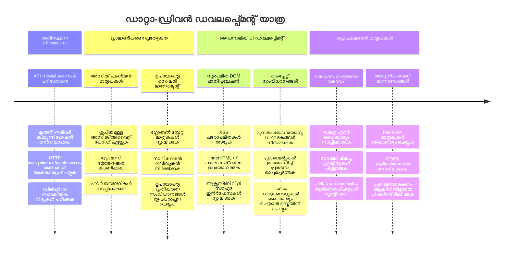
**🎓 ഗ്രാജുവേഷൻ മൈൽസ്റ്റോൺ**: നിങ്ങൾ ആധുനിക JavaScript പാറ്റേണുകൾ ഉപയോഗിച്ച് പരിപൂർണമായ ഡാറ്റ-ഓഗമാണമായി ഒരു വെബ് ആപ്പ് വിജയകരമായി നിർമ്മിച്ചു. ഈ കഴിവുകൾ React, Vue, Angular പോലുള്ള ഫ്രെയിംവർക്കുകളുമായി നേരിട്ട് പ്രവർത്തനക്ഷമമാണ്.

**🔄 അടുത്ത തലമുറ കഴിവുകൾ**:
- ഈ ആശയങ്ങളുടെ അടിസ്ഥാനത്തിൽ വികസിക്കുന്ന ഫ്രണ്ട്‌എൻഡ് ഫ്രെയിംവർക്കുകൾ അന്വേഷിക്കാൻ തയ്യാറാണ്
- WebSockets ഉപയോഗിച്ച് യഥാർത്ഥ-സമയം ഫീച്ചറുകൾ നടപ്പിലാക്കാൻ സജ്ജമാണ്
- ഓഫ്‌ലൈൻ സജ്ജീകരണങ്ങളോടുകൂടിയ പ്രോഗ്രസീവ് വെബ് ആപ്പുകൾ നിർമ്മിക്കാൻ ഉള്ള കഴിവുകൾ
- ഉയർന്ന നിലവാരത്തിലുള്ള സ്റ്റേറ്റ് മാനേജ്മെന്റ് മാതൃകകൾ പഠിക്കാൻ അടിസ്ഥാനമൊഴിഞ്ഞു

## GitHub Copilot ഏജന്റ് ചലഞ്ച് 🚀

ഈ ഏജന്റ് മോഡ് ഉപയോഗിച്ച് താഴെയുള്ള വെല്ലുവിളി പൂർത്തിയാക്കുക:

**വിവരണം:** നടപടി തിരഞ്ഞെടുത്ത് ഫിൽട്ടർ ചെയ്യുന്നതിനുള്ള ഫീച്ചർ യഥാർത്ഥ ബാങ്കിംഗ് ആപ്പിൽ കൂട്ടിച്ചേർക്കുക. ഉപയോക്താക്കൾക്ക് തീയതി പരിധി, തുക, വിവരണം തുടങ്ങിയവയുടെ അടിസ്ഥാനത്തിൽ പ്രത്യേക ഇടപാട് കണ്ടെത്താൻ സഹായിക്കും.

**പ്രോമ്പ്റ്റ്:** ബാങ്കിംഗ് ആപ്പിനായി താഴെയുള്ള ഫീച്ചറുകൾ ഉൾപ്പെടുന്ന തെരച്ചിൽ ഫംഗ്ഷനാലിറ്റി സൃഷ്ടിക്കുക: 1) തീയതി പരിധി (നിന്നും/വരെ), കുറഞ്ഞ/ഉയർന്ന തുക, ഇടപാട് വിവരണ കീവേഡുകൾ എന്നിവയ്‌ക്കുള്ള ഇൻപുട്ട് ഫീൽഡുകൾ ഉള്ള സേർച് ഫോം, 2) `filterTransactions()` ഫംഗ്ഷൻ അക്കൗണ്ടിലെ `transactions` മാര്ത്ത്തം തിരഞ്ഞെടുത്ത മാനദണ്ഡങ്ങൾ അനുസരിച്ച് ഫിൽട്ടർ ചെയ്യുന്നു, 3) ഫിൽട്ടർ ചെയ്ത ഫലം പ്രദർശിപ്പിക്കാൻ `updateDashboard()` ഫംഗ്ഷൻ അപ്ഡേറ്റ് ചെയ്യുക, 4) കാഴ്ച പുനഃസ്ഥാപിക്കാൻ "Clear Filters" ബട്ടൺ ചേർക്കുക. `filter()` പോലുള്ള ആധുനിക ജാവാസ്ക്രിപ്റ്റ് ആറെ മെത്തഡുകൾ ഉപയോഗിച്ച് വേണ്ട മുൻകരുതലുകൾ കൈകാര്യം ചെയ്യുക.

[agent mode](https://code.visualstudio.com/blogs/2025/02/24/introducing-copilot-agent-mode) വിശദമായി അറിയാൻ ഈ ലിങ്ക് പരിശോധിക്കുക.

## 🚀 വെല്ലുവിളി

നിങ്ങളുടെ ബാങ്കിംഗ് ആപ്പ് അടുത്ത നിലയിലേക്ക് എടുത്തുയർത്താൻ തയ്യാറാണോ? ഇത് ഉപയോഗിക്കാൻ നിങ്ങൾക്ക് ആഗ്രഹമുള്ളതുപോലെ രൂപത്തിൽ മാറ്റാം. ഇനിപ്പറയുന്ന ചില ആശയങ്ങൾ പ്രേരണയ്ക്കായി:

**സുന്ദരമാക്കൂ**: CSS സ്റ്റൈലിങ് ചേർത്ത് നിങ്ങളുടെ ഫംഗ്ഷണൽ ഡാഷ്ബോർഡ് ദൃശ്യപരമായി ആകർഷകമായ രൂപത്തിലേക്ക് മാറ്റുക. ശുചിത്വമുള്ള വരികൾ, നന്നായ ഇടവേളകൾ, ചില സുതാര്യമായ അനിമേഷനുകൾ എന്നിവ ചിന്തിക്കുക.

**റെസ്പോൺസിവാക്കുക**: [മീഡിയ ക്വേരികൾ](https://developer.mozilla.org/docs/Web/CSS/Media_Queries) ഉപയോഗിച്ച് ഫോൺ, ടാബ്ലெட், ഡെസ്ക്ടോപ്പിൽ മികച്ച അനുഭവം നൽകുന്ന [റെസ്പോൺസിവ് ഡിസൈൻ](https://developer.mozilla.org/docs/Web/Progressive_web_apps/Responsive/responsive_design_building_blocks) സൃഷ്ടിച്ചുനോക്കുക. നിങ്ങളുടെ ഉപയോക്താക്കൾ നന്ദി പറയും!

**കുറച്ച് മനോഹാരിത ചേർക്കുക**: ഇടപാടുകൾക്ക് നിറം നൽകുക (ആദായങ്ങൾക്ക് പച്ച, ചെലവുകൾക്ക് ചുവപ്പ്), ഐക്കോണുകൾ കൂട്ടുക, അതിലൂടെയും ഹോവർ എഫക്റ്റ് എന്നിവ ഉപയോഗിച്ച് ഇന്ററാക്ടീവ് അനുഭവം സൃഷ്ടിക്കുക.

ഇതാണ് ഒരു സ്റ്റൈലിംഗ് ചെയ്ത ഡാഷ്‌ബോർഡിന്റെ ഉദാഹരണ സ്ക്രീൻഷോട്ട്:

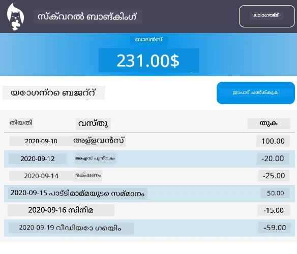

ഇതിനെ പകർത്തേണ്ടതില്ല - ഇതിനെ പ്രചോദനമായി ഉപയോഗിച്ച് നിന്റെ ആപ്പിനെ രൂപമാക്കൂ!

## പോസ്റ്റ്-ലക്ചർ ക്വിസ്

[Post-lecture quiz](https://ff-quizzes.netlify.app/web/quiz/46)

## അസൈൻമെന്റ്

[Refactor and comment your code](assignment.md)

---

<!-- CO-OP TRANSLATOR DISCLAIMER START -->
**അസൂയ കുറിപ്പ്**:  
ഈ രേഖ AI വിവർത്തന സേവനം [Co-op Translator](https://github.com/Azure/co-op-translator) ഉപയോഗിച്ചുകൊണ്ട് വിവർത്തനം ചെയ്തതാണ്. ഞങ്ങൾ ശരിയായ വിവർത്തനത്തിന് ശ്രമിച്ചിട്ടുണ്ടെങ്കിലും, ഓട്ടോമേറ്റഡ് വിവർത്തനങ്ങളിൽ പിഴവ് അല്ലെങ്കിൽ തെറ്റുകൾ ഉണ്ടാകാൻ സാധ്യതയുണ്ട്. അതിന്റെ മാതൃഭാഷയിലെ യഥാർത്ഥ രേഖയെ അധികാരപരമായ ഉറവിടമായി പരിഗണിക്കേണ്ടതാണ്. പ്രധാന വിവരങ്ങൾക്ക് പ്രൊഫഷണൽ മനുഷ്യ വിവർത്തനം ശിപാർശ ചെയ്യുന്നു. ഈ വിവർത്തനത്തിന്റെ ഉപയോഗം മൂലം സംഭവിക്കാവുന്ന തെറ്റിദ്ധാരണകൾക്കോ തെറ്റായ വ്യാഖ്യാനങ്ങൾക്കോ ഞങ്ങൾ ഉത്തരവാദിത്തം വകപെടുത്തുന്നില്ല.
<!-- CO-OP TRANSLATOR DISCLAIMER END -->