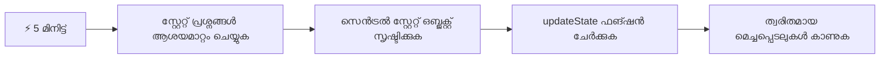
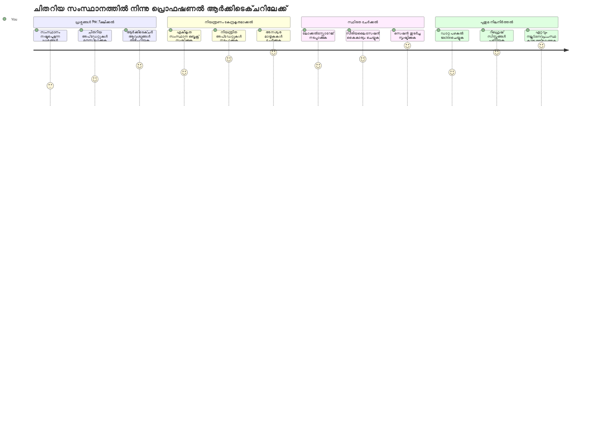
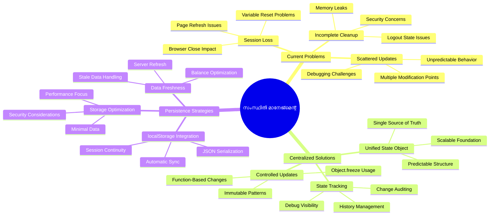
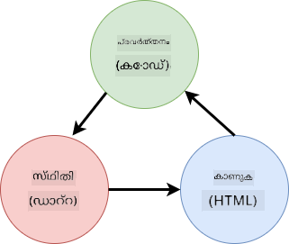
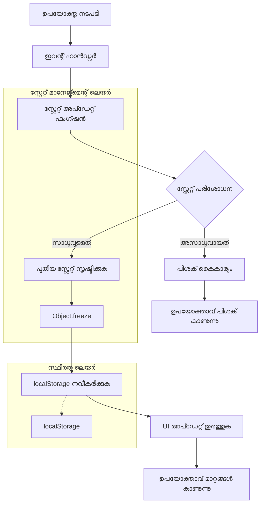
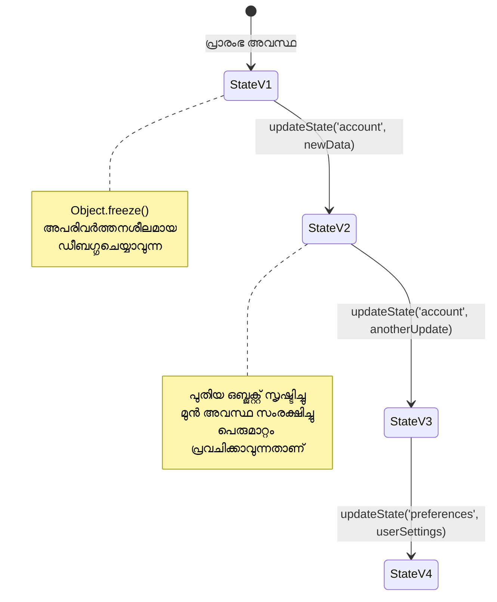
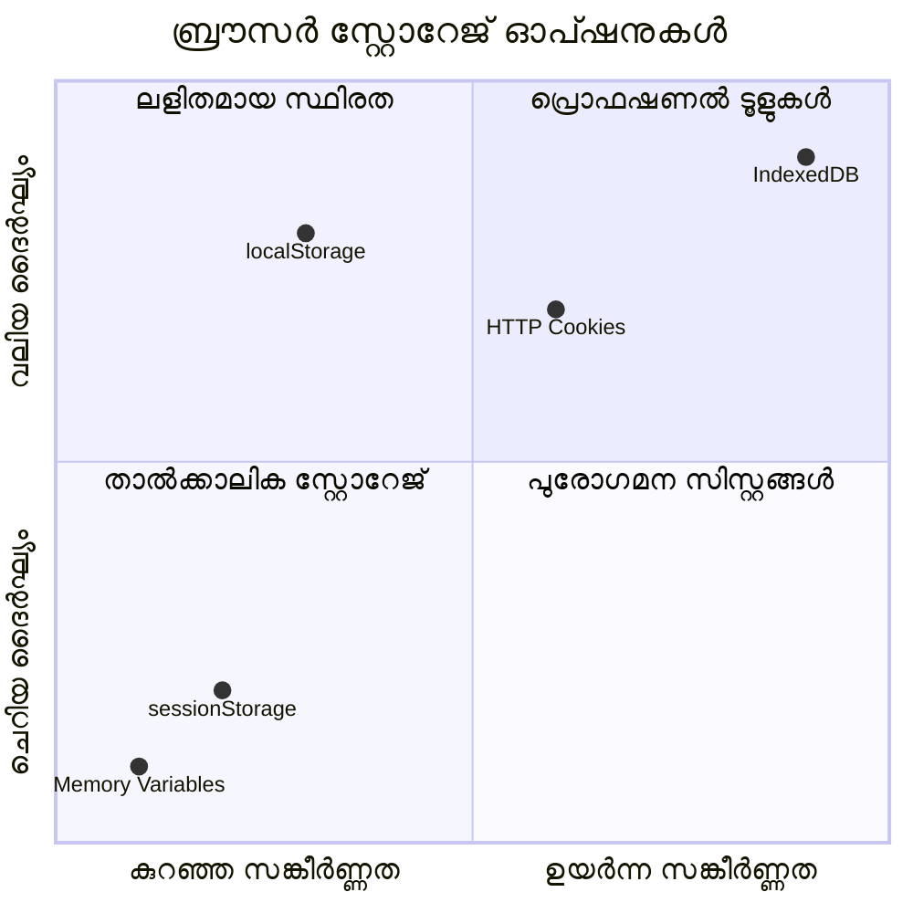
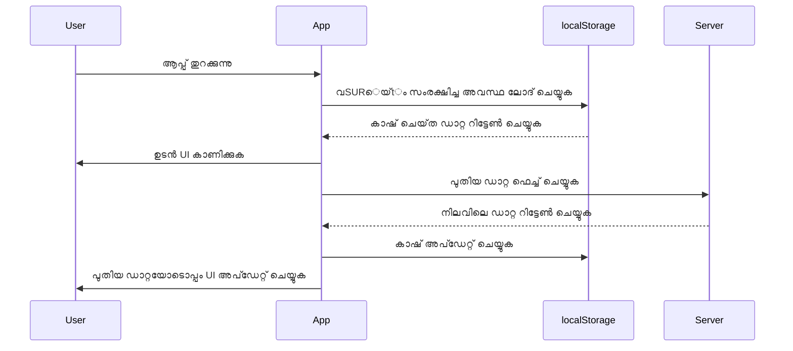
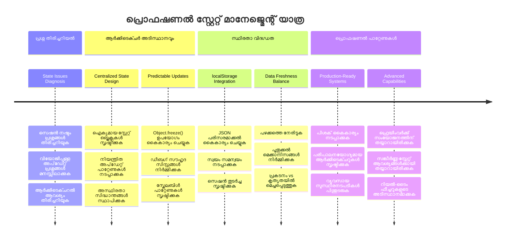
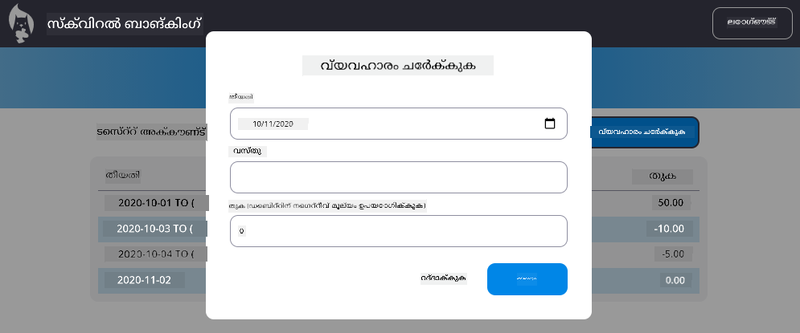

<!--
CO_OP_TRANSLATOR_METADATA:
{
  "original_hash": "b807b09df716dc48a2b750835bf8e933",
  "translation_date": "2026-01-08T17:46:18+00:00",
  "source_file": "7-bank-project/4-state-management/README.md",
  "language_code": "ml"
}
-->
# ബാങ്കിംഗ് ആപ്പ് നിർമ്മാണം ഭാഗം 4: സ്റ്റേറ്റ് മാനേജ്മെന്റ് ആശയങ്ങൾ

## ⚡ അടുത്ത 5 മിനുട്ടിൽ നിങ്ങൾ ചെയ്യാൻ പറ്റുന്നത്

**ശ്രദ്ധയുടെ കുറഞ്ഞ utviksaകർക്കുള്ള വേഗം തുടങ്ങൽ മാർഗം**


- **മിനിറ്റ് 1**: നിലവിലെ സ്റ്റേറ്റ് പ്രശ്നം പരിശോദിക്കുക - ലോഗിൻ ചെയ്യുക, പേജ് റിഫ്രെഷ് ചെയ്യുക, ലോഗൗട്ട് ശ്രദ്ധിക്കുക
- **മിനിറ്റ് 2**: `let account = null` ഇനത്തെ `let state = { account: null }` ആയി മാറ്റുക
- **മിനിറ്റ് 3**: നിയന്ത്രിത അപ്ഡേറ്റുകൾക്ക് ഒരു ലളിതമായ `updateState()` ഫംഗ്ഷൻ സൃഷ്ടിക്കുക
- **മിനിറ്റ് 4**: പുതിയ പാറ്റേൺ ഉപയോഗിച്ച് ഒരു ഫംഗ്ഷൻ അപ്ഡേറ്റ് ചെയ്യുക
- **മിനിറ്റ് 5**: മെച്ചപ്പെടുത്തിയ പ്രവചന ശേഷിയും ഡിബഗിംഗ് കഴിവും പരിശോധിക്കുക

**വേഗം പരിശോധന ടെസ്റ്റ്**:  
```javascript
// മുമ്പ്: വിശരിഞ്ഞ അവസ്ഥ
let account = null; // പുനഃപൂർവം ചെയ്യുമ്പോൾ നഷ്ട്ടമായി!

// ശേഷം: സാന്ദ്രമായ അവസ്ഥ
let state = Object.freeze({ account: null }); // നിയന്ത്രണയുള്ളതും ട്രാക്ക് ചെയ്യാവുന്നതുമായത്!
```
  
**ഇത് എന്തുകൊണ്ടാണ് പ്രധാനമാകുന്നത്**: 5 മിനുട്ടിനുള്ളിൽ, നിങ്ങൾ അനിയന്ത്രിത സ്റ്റേറ്റ് മാനേജ്മെന്റിൽ നിന്ന് പ്രവചനശേഷിയുള്ള, ഡിബഗ്ഗിംഗ് സൗകര്യമുള്ള പാറ്റേണുകളിലേക്ക് മാറ്റം അനുഭവിക്കും. സങ്കീർണ്ണമായ ആപ്ലിക്കേഷനുകൾ പരിപാലിക്കാൻ ഇത് അടിസ്ഥാനമാണ്.

## 🗺️ സ്റ്റേറ്റ് മാനേജ്മെന്റ് മാസ്റ്ററി വഴി നിങ്ങളുടെ പഠനയാത്ര


**നിങ്ങളുടെ യാത്രയുടെ ലക്ഷ്യം**: ഈ പാഠം 끝ാകുമ്പോൾ, സ്ഥിരത, ഡാറ്റയുടെ പുതുവൽക്കരണം, പ്രവച്യമായ അപ്ഡേറ്റുകൾ എന്നിവ കൈകാര്യം ചെയ്യുന്ന പ്രൊഫഷണൽ-തരം ഒരു സ്റ്റേറ്റ് മാനേജ്മെന്റ് സിസ്റ്റം നിങ്ങൾ നിർമ്മിച്ചിരിക്കും - പ്രൊഡക്ഷൻ ആപ്ലിക്കേഷനുകളിൽ ഉപയോഗിക്കപ്പെടുന്ന അതേ പാറ്റേണുകൾ.

## പ്രീ-ലെക്ചർ ക്വിസ്

[Pre-lecture quiz](https://ff-quizzes.netlify.app/web/quiz/47)

## പരിചయం

സ്റ്റേറ്റ് മാനേജ്മെന്റ് വോയേജർ ഉപഗ്രഹത്തിന്റെ നാവിഗേഷൻ സിസ്റ്റത്തിനുപോലെയാണ് – എല്ലാം സുഖകരമായി പ്രവർത്തിച്ചാൽ അതിന്റെ ഉണ്ടായിരുന്നതും നിങ്ങൾക്ക് മനസ്സിലാകാറില്ല. പക്ഷേ, പിഴവു വന്നാൽ, അത് മധ്യനക്ഷത്രാന്തരമേഖലയിലെത്തുന്നതും കോസ്മിക് വ്യോമശൂന്യതയിൽ നഷ്ടപ്പെടുന്നതിലുമുള്ള വ്യത്യാസമാണ്. വെബ് ഡെവലപ്പ്മെന്റിൽ, സ്റ്റേറ്റ് എന്ന് പറയുന്നത് നിങ്ങളുടെ ആപ്ലിക്കേഷനും ഓർമ്മിക്കേണ്ടതെല്ലാം ആണ്: ഉപയോക്താവ് ലോഗിൻ ചെയ്തിട്ടുണ്ടോ, ഫോം ഡാറ്റ, നാവിഗേഷൻ ചരിത്രം, താത്ക്കാലിക ഇന്റർഫീസ് സ്റ്റേറ്റുകൾ എന്നിവ.

നിങ്ങളുടെ ബാങ്കിംഗ് ആപ്പ് ലളിതമായ ലോഗിൻ ഫോം മുതൽ കൂടുതൽ സങ്കീര്‍ണമായ ആപ്ലിക്കേഷനായി വികസിച്ചതിനാൽ, ചില സാധാരണ സവാലുകൾ നേരിട്ടിരിക്കും. പേജ് റിഫ്രെഷ് ചെയ്താൽ ഉപയോക്താക്കൾ അനന്തരം ലോഗ്ഔട്ട് ആയി പോവുന്നു. ബ്രൗസർ അടച്ചാൽ എല്ലാ പുരോഗതിയും നീങ്ങിയുപോകുന്നു. ഒരു പ്രശ്നം ഡിബഗ് ചെയ്യുമ്പോൾ, ഒരേസമയം പല ഫംഗ്ഷനുകളും വ്യത്യസ്ത രീതിയിൽ അതേ ഡാറ്റ മാറ്റുന്നവ കൂടിയുള്ള പാതിക വാളയമാണെന്ന് കണ്ടു.

ഇവ ദോഷപരമായ കോഡിങ്ങിന്റെ ലക്ഷണങ്ങൾ അല്ല– മറിച്ച്, ആപ്ലിക്കേഷനുകൾ ഒരു നിർദ്ധിഷ്ട സങ്കീര്‍ണ്ണത ത്രെഷ്‌ഹോൾഡ് കൈവന്നപ്പോഴുള്ള സ്വാഭാവിക വളർച്ചാസങ്കടങ്ങളാണ്. ഓരോ ഡവലപ്പർക്കും ഇത് നേരിടേണ്ടി വരാറുണ്ട്, അവരുടെ ആപ്പുകൾ "സാധ്യമത്രമായ ദൃശ്യത്തിന്" നിസ്സാരമായിരിക്കുമ്പോൾ മുതൽ "പ്രൊഡക്ഷൻ റെഡി" ആകുമ്പോൾ വരെ.

ഈ പാഠത്തിൽ, നിങ്ങളുടെ ബാങ്കിംഗ് ആപ്പിനെ വിശ്വസനീയവും പ്രൊഫഷണൽ ആവും എന്ന് മാറ്റുന്ന കേന്ദ്രഭൂതമായ സ്റ്റേറ്റ് മാനേജ്മെന്റ് സിസ്റ്റം ഞങ്ങൾ നടപ്പിലാക്കും. ഡാറ്റാ പ്രവാഹങ്ങൾ പ്രവച്യമായും, ഉപയോക്തൃ സെഷനുകൾ അനുയോജ്യമായി സ്ഥിരമാക്കാനും, ആധുനിക വെബ് ആപ്ലിക്കേഷനുകൾ ആവശ്യപ്പെടുന്ന സുഖപ്രദമായ അനുഭവം സൃഷ്ടിക്കാനും നിങ്ങൾ പഠിക്കും.

## മുൻപുള്ള അറിവുകൾ

സ്റ്റേറ്റ് മാനേജ്മെന്റ് ആശയങ്ങളിലേക്ക് ചാടി‌നൽകുവാൻ മുമ്പ്, നിങ്ങളുടെ ഡെവലപ്പ്മെന്റ് പരിസ്ഥിതി ശരിയായ രീതിയിൽ സജ്ജീകരിച്ചിട്ടുണ്ടെന്നും, നിങ്ങളുടെ ബാങ്കിംഗ് ആപ്പ് അടിസ്ഥാന ഘടന സജ്ജമായി ഉണ്ടെന്നും ഉറപ്പാക്കുക. ഈ പാഠം ഈ സീരിസിന്റെ മുമ്പത്തെ ഭാഗങ്ങളിൽ നിന്നുള്ള ആശയങ്ങൾക്കും കോഡിനും നേരിട്ട് അധിഷ്ഠിതമാണ്.

തുടരുന്നതിന് മുൻപ് താഴെ പറയുന്ന ഘടകങ്ങൾ തയ്യാറാക്കിയിട്ടുണ്ടെന്ന് ഉറപ്പാക്കുക:

**ആവശ്യമായ സജ്ജീകരണങ്ങൾ:**  
- [ഡാറ്റാ ഫെട്ജിംഗ് പാഠം](../3-data/README.md) പൂർത്തിയാക്കുക - നിങ്ങളുടെ ആപ്പ് സഫലമായി അക്കൗണ്ട് ഡാറ്റ ലോഡ് ചെയ്ത് പ്രദർശിപ്പിക്കണം  
- ബാക്ക്എൻഡ് API പ്രവർത്തിപ്പിക്കാൻ നിങ്ങളുടെ സിസ്റ്റത്തിൽ [Node.js](https://nodejs.org) ഇൻസ്റ്റാൾ ചെയ്യുക  
- [സെർവർ API](../api/README.md) ലൊക്കലായി സ്റ്റാർട്ട് ചെയ്ത് അക്കൗണ്ട് ഡാറ്റാ പ്രവർത്തനങ്ങൾ കൈകാര്യം ചെയ്യുക  

**നിങ്ങളുടെ പരിസ്ഥിതിയെ പരിശോധന ചെയ്യുക:**

ടെർമിനൽ ഉപയോഗിച്ച് താഴെ കൊടുത്ത കമാൻഡ് പ്രവർത്തിപ്പിച്ച് നിങ്ങളുടെ API സെർവർ നന്നായി പ്രവർത്തിക്കുന്നുണ്ടെന്ന് ഉറപ്പാക്കുക:  

```sh
curl http://localhost:5000/api
# -> ഫലം ആയി "ബാങ്ക് API v1.0.0" നൽകണം
```
  
**ഈ കമാൻഡ് ചെയ്യുന്നത് എന്ത്:**  
- നിങ്ങളുടെ ലൊക്കൽ API സെർവറിലേക്ക് GET അഭ്യർത്ഥന അയയ്ക്കുന്നു  
- കണക്ഷൻ പരിശോധിച്ച് സെർവർ പ്രതികരിക്കുന്നുണ്ടെന്നു ഉറപ്പാക്കുന്നു  
- എല്ലാം ശരിയായിരുന്നാൽ API 버전 വിവരങ്ങൾ തിരിച്ചറിയിക്കുന്നു  

## 🧠 സ്റ്റേറ്റ് മാനേജ്മെന്റ് ആർക്കിറ്റെക്ചർ അവലോക്കനം


**പ്രധാന തത്വം**: പ്രൊഫഷണൽ സ്റ്റേറ്റ് മാനേജ്മെന്റ് പ്രവചനക്ഷമത, സ്ഥിരത, പ്രകടനം എന്നിവുടെയും മികച്ച തുൽ‌യസംതുലിതം പാലിച്ച് വിശ്വസനീയമായ ഉപയോക്തൃ അനുഭവങ്ങൾ സൃഷ്ടിക്കുന്നു, ലളിതമായ ഇടപെടലുകളിൽ നിന്നു സങ്കീർണ ആപ്ലിക്കേഷൻ പ്രവാഹങ്ങളിലേക്കും വ്യവസ്ഥയ്ക്കും നീട്ടുന്നു.

---

## നിലവിലുള്ള സ്റ്റേറ്റ് പ്രശ്നങ്ങൾ പൂർവ്വനിർണയം

ഷെർലോക്ക് ഹോംസ് കുറ്റകൃത്യ സ്ഥലത്തിന് പരിശോധന നടത്തി ശരിയായി മനസ്സിലാക്കിയത് പോലെ, കാണാതാകുന്ന ഉപയോക്തൃ സെഷനുകളുടെ രഹസ്യം പരിഹരിക്കാൻ മുമ്പ് നമ്മുടെ നിലവിലെ നടപ്പിലാക്കലിൽ എന്താണ് നടക്കുന്നത് എന്നത് നന്നായി മനസ്സിലാക്കണം.

നടത്താം ഒരു ലളിത പരീക്ഷണം ആ സ്റ്റേറ്റ് മാനേജ്മെന്റ് സവാലുകൾ വെളിപ്പെടുത്തുന്നു:

**🧪 ഈ പരിശോധന പരീക്ഷിക്കുക:**  
1. നിങ്ങളുടെ ബാങ്കിംഗ് ആപ്പിൽ ലോഗിൻ ചെയ്ത് ഡാഷ്ബോർഡിലേക്ക് പോവുക  
2. ബ്രൗസർ പേജ് റിഫ്രെഷ് ചെയ്യുക  
3. നിങ്ങളുടെ ലോഗിൻ നിലയെ ശ്രദ്ധിക്കുക  

ലോഗിൻ സ്ക്രീനിലേക്ക് പുനരധിവസിപ്പിച്ചാൽ, നിങ്ങൾ പരമ്പരാഗത സ്റ്റേറ്റ് സ്ഥിരത പ്രശ്നം കണ്ടെത്തിയിട്ടുണ്ട്. ഈ പെരുമാറ്റം സംഭവിക്കുന്നത് കാരണം നിലവിലെ നടപ്പിലാക്കൽ ജാവാസ്ക്രിപ്റ്റ് വേരിയബിളുകളിൽ ഉപയോക്തൃ ഡാറ്റ സംഭരിക്കുന്നു, അത് ഓരോ പേജ് ലോഡോടും പുനസജ്ജമാകുന്നു.

**നിലവിലെ നടപ്പിലാക്കലിലെ പ്രശ്നങ്ങൾ:**

നമ്മുടെ [മുന്‍പ് പാഠം](../3-data/README.md) ലെ ലളിതമായ `account` വേരിയബിൾ മൂന്ന് പ്രധാന പ്രശ്നങ്ങൾ സൃഷ്ടിക്കുന്നു, ഉപയോക്തൃ അനുഭവത്തെയും കോഡ് പരിപാലനക്ഷമതയെയും ബാധിക്കുന്ന:  

| പ്രശ്നം | സാങ്കേതിക കാരണം | ഉപയോക്തൃ സ്വാധീനം |
|---------|----------------|------------------|
| **സെഷന് നഷ്ടം** | പേജ് റിഫ്രെഷ് ജാവാസ്ക്രിപ്റ്റ് വേരിയബിളുകൾ കഴുകുന്നു | ഉപയോക്താക്കൾ അവസരത്തിൽ വീണ്ടും ലോഗിൻ ചെയ്യണം |
| **വിതരിപ്പിച്ച അപ്‌ഡേറ്റുകൾ** | പലയിടങ്ങളിലും ധാരാളം ഫംഗ്ഷനുകൾ സ്റ്റേറ്റ് നേരിട്ട് മാറ്റുന്നു | ഡിബഗിംഗും ബുദ്ധിമുട്ട് കൂടുന്നു |
| **അപര്യാപ്തമായ ക്ലീനപ്പ്** | ലോഗ്ഔട്ട് എല്ലാ സ്റ്റേറ്റ് റഫറൻസുകളും ഇല്ലാതാക്കുന്നില്ല | സുരക്ഷാPrivacy സംബന്ധിച്ച പ്രശ്നങ്ങൾ ഉണ്ടാകാം |

**ആർക്കിടെക്ചറൽ വെല്ലുവിളി:**

ടൈറ്റാനിക് നാവിക സമ്പ്രദായത്തിന്റെ ഭാഗികമായി റോബസ്റ്റ് രൂപകൽപന പോലെ അതേപോലെ, വിവിധ ഭാഗങ്ങൾ ഒറ്റക്കൊണ്ടു വെള്ളത്തിൽ നിറഞ്ഞപ്പോൾ പൂർണ്ണമായി വീഴ്ച സംഭവിച്ചപ്പോഴുള്ള പ്രശ്നം, ഈ പ്രശ്നങ്ങളെ ത ന്നിൽ നിന്നും പരിഹരിക്കാനാകില്ല. ഒരു സമഗ്ര സ്റ്റേറ്റ് മാനേജ്മെന്റ് പരിഹാരമാണ് വേണ്ടത്.

> 💡 **നമുക്ക് സാധ്യമായ ലക്ഷ്യം എന്താണ്?**

[State management](https://en.wikipedia.org/wiki/State_management) എന്നത് അടിസ്ഥാനപരമായി രണ്ട് നിർണ്ണായക ചോദ്യങ്ങൾക്ക് ഉത്തരം കണ്ടെത്താൻ ഉള്ളതാണ്:

1. **എവിടെ എന്റെ ഡാറ്റ?**: നമ്മുടെ കൈവശമുള്ള വിവരങ്ങൾ എന്തെല്ലാം ആണെന്നും അവ എവിടെ നിന്നാണ് വരുന്നെന്നും പിന്തുടരുക  
2. **എല്ലാവരും ഒരേ പേജിലാണോ?**: ഉപയോക്താക്കൾ കാണുന്നത് യാഥാർത്ഥ്യത്തോട് യോജിക്കുന്നുണ്ടോ എന്നു ഉറപ്പു വരുത്തുക  

**നമ്മുടെ ആസൂത്രണം:**

പിന്നിലേക്ക് തിരിയാതെ, നാം ഒരു **കേന്ദ്രികൃത സ്റ്റേറ്റ് മാനേജ്മെന്റ്** സിസ്റ്റം സൃഷ്ടിക്കും. ഇത് എല്ലാ പ്രധാന കാര്യങ്ങളും നിയന്ത്രിക്കുന്ന ഒരാൾ ഉണ്ടാകുന്ന പോലെ ആലോചിക്കുക:  




**ഈ ഡാറ്റ പ്രവാഹം മനസ്സിലാക്കുക:**  
- എല്ലാ ആപ്ലിക്കേഷൻ സ്റ്റേറ്റ് ഒരു സ്ഥലത്തും കേന്ദ്രീകൃതമാക്കുന്നു  
- എല്ലാ സ്റ്റേറ്റ് മാറ്റങ്ങളും നിയന്ത്രിത ഫംഗ്ഷനുകളാൽ വഴി ചേർക്കുന്നു  
- UI നിലവിലെ സ്റ്റേറ്റുമായി സംരക്ഷണത്തിലുള്ളതാക്കുന്നു  
- ഡാറ്റ മാനേജ്മെന്റിന് വ്യക്തമാക്കിയ, പ്രവചനനിരപ്പിലുള്ള പാറ്റേൺ നൽകുന്നു  

> 💡 **പ്രൊഫഷണൽ അറിവ്**: ഈ പാഠം കേന്ദ്ര ആശയങ്ങളിൽ ശ്രദ്ധ കേന്ദ്രീകരിച്ചിരിക്കുന്നു. സങ്കീർണ ആപ്ലിക്കേഷനുകൾക്കായി, [Redux](https://redux.js.org) പോലുള്ള ലൈബ്രറികൾ കൂടുതൽ പുരോഗമന സൗകര്യങ്ങൾ നൽകുന്നു. ഈ അടിസ്ഥാന സിദ്ധാന്തങ്ങൾ മനസ്സിലാക്കുന്നത് ഏതൊരു സ്റ്റേറ്റ് മാനേജ്മെന്റ് ലൈബ്രറിയും നയിക്കാൻ സഹായിക്കും.

> ⚠️ **ഉന്നത വിഷയം**: സ്റ്റേറ്റ് മാറ്റങ്ങൾ കാരണം സ്വയം UI അപ്ഡേറ്റുകൾ സജ്ജമാക്കുന്നത് (Reactive Programming ആശയവുമായി ബന്ധപ്പെട്ടതു) ഞങ്ങൾ ഇവിടെ ഉൾപ്പെടുത്തുന്നില്ല. നിങ്ങളുടെ പഠനയാത്രക്ക് ഇത് മികച്ച അടുത്ത നടപടിയാകും!

### ദൗത്യം: സ്റ്റേറ്റ് ഘടന കേന്ദ്രികരിക്കുക

നാം വിതറിയ സ്റ്റേറ്റ് മാനേജ്മെന്റ് ഒരു കേന്ദ്രീയ സംവിധാനമായി മാറ്റണമെന്ന് തുടക്കം കുറിക്കാം. ഈ ആദ്യപടി വരുന്ന എല്ലാ മെച്ചപ്പെടുത്തലുകൾക്കും അടിത്തറ ഒരുക്കും.

**പടി 1: ഒരു കേന്ദ്ര സ്റ്റേറ്റ് ഒബ്ജക്റ്റ് സൃഷ്ടിക്കുക**

ലളിതമായ `account` പ്രഖ്യാപനം മാറ്റുക:  

```js
let account = null;
```
  
നിങ്ങൾക്ക് താഴെ പറയുന്ന ഘടനയുള്ള ഒരു സ്റ്റേറ്റ് ഒബ്ജക്റ്റ് ഉപയോഗിക്കുക:  

```js
let state = {
  account: null
};
```
  
**ഈ മാറ്റം എന്തിനുള്ളതെന്ന് ഇതാ:**  
- എല്ലാ ആപ്ലിക്കേഷൻ ഡാറ്റ ഒരിടത്തും കേന്ദ്രീകരിക്കുന്നു  
- ഇനി കൂടുതൽ സ്റ്റേറ്റ് പ്രോപ്പർട്ടികൾ കൂട്ടാം എന്ന എത്തിയ്ക്കുന്ന ഘടന ഒരുക്കുന്നു  
- സ്റ്റേറ്റ് മറ്റ് വേരിയബിളുകളിൽ നിന്ന്പ്പെടുന്ന വ്യക്തമായ അതിർത്തി സൃഷ്ടിക്കുന്നു  
- നിങ്ങളുടെ ആപ്പ് വളർന്നപ്പോഴുള്ള സ്കെയിലിംഗ് മുറിയാക്കുന്നു  

**പടി 2: സ്റ്റേറ്റ് ആക്സസ് പാറ്റേണുകൾ അപ്‌ഡേറ്റ് ചെയ്യുക**

പുതിയ സ്റ്റേറ്റ് ഘടന ഉപയോഗിച്ച് നിങ്ങളുടെ ഫംഗ്ഷനുകൾ അപ്ഡേറ്റ് ചെയ്യുക:

**`register()` അറ്റവയും `login()` ഫംഗ്ഷനുകളിലും**,  
ഇത് മാറ്റുക:  
```js
account = ...
```
  
ഇതാണ് മാറ്റം:  
```js
state.account = ...
```
  

**`updateDashboard()` ഫംഗ്ഷനിൽ**, ഇപ്രകാരമുള്ള ഒരു വരി പുറമേ ചേർക്കുക:  
```js
const account = state.account;
```
  
**ഇവ നൽകുന്ന പ്രയോജനങ്ങൾ:**  
- നിലവിലുള്ള പ്രവർത്തനം നിലനിറുത്തുകയും ഘടന മെച്ചപ്പെടുത്തുകയും ചെയ്യുന്നു  
- കൂടുതൽ സങ്കീർണമായ സ്റ്റേറ്റ് മാനേജ്മെന്റ് ആശയങ്ങൾക്ക് നിങ്ങളുടെ കോഡ് തയ്യാറാക്കുന്നു  
- സ്റ്റേറ്റ് ഡാറ്റ ആക്സസ് ചെയ്യുന്നതിന് പൊരുത്തമുള്ള പാറ്റേണുകൾ സൃഷ്ടിക്കുന്നു  
- കേന്ദ്രിയകൃത സ്റ്റേറ്റ് അപ്ഡേറ്റുകളുടെ അടിത്തറ സ്ഥാപിക്കുന്നു  

> 💡 **കുറിപ്പ്**: ഈ റിഫാക്ടറിംഗ് ഉടൻ പ്രശ്നങ്ങൾ എല്ലാം പരിഹരിക്കില്ല, പക്ഷെ ശക്തമായ മെച്ചപ്പെടുത്തലുകൾക്കായുള്ള അടിസ്ഥാനമായി പ്രവർത്തിക്കും!

### 🎯 പാഠഗതി പരിശോധന: കേന്ദ്രികരണ തത്വങ്ങൾ

**താൽക്കാലിക നിർത്തുക, ആലോചിക്കുക**: നിങ്ങൾ ഇപ്പോൾ കേന്ദ്രികൃത സ്റ്റേറ്റ് മാനേജ്മെന്റിന്റെ അടിസ്ഥാന അടിസ്ഥാന രൂപം നടപ്പിലാക്കിയിട്ടുണ്ട്. ഇത് സുപ്രധാനമായ ഒരു ആർക്കിടെക്ചറൽ തീരുമാനമാണ്.

**വേഗം സ്വയം പരിശോധന**:  
- സ്റ്റേറ്റ് ഒരേ ഒബ്ജക്റ്റിലാക്കുന്നത് വിവിധ വേരിയബിളുകളിൽ നിന്നും മെച്ചമാണ് എന്ന് നിങ്ങൾ വിശദീകരിക്കാമോ?  
- ഒരു ഫംഗ്ഷൻ മാറ്റാൻ മറന്നാൽ `state.account` എന്നത് ഉപയോഗിക്കാൻ വേണ്ടാത്ത പക്ഷം എന്താകും?  
- ഈ പാറ്റേൺ നിങ്ങളുടെ കോഡ് കൂടുതൽ സമർത്ഥമായ ഫീച്ചറുകൾക്ക് എങ്ങനെ തയ്യാറാക്കുന്നു?  

**യഥാർത്ഥ ലോക ബന്ധം**: നിങ്ങൾ പഠിച്ച കേന്ദ്രികരണ പാറ്റേൺ Redux, Vuex, React Context പോലുള്ള ആധുനിക ഫ്രെയിം‌വർക്കുകളുടെ അടിസ്ഥാനമാണ്. നിങ്ങൾ പ്രധാന ആപ്ലിക്കേഷനുകളിൽ ഉപയോഗിക്കുന്ന ആർക്കിടെക്ചറൽ ചിന്തം സൃഷ്ടിക്കുന്നു.

**സവാൽ**: ഉപയോക്തൃ ഇഷ്ടതകൾ (തീം, ഭാഷ) ആപ്പിൽ ചേർക്കണമെങ്കിൽ, സ്റ്റേറ്റ് ഘടനയിൽ എവിടെ ചേർക്കണം? ഇത് എങ്ങനെ സ്കെയിൽ ചെയ്യും?

## നിയന്ത്രിത സ്റ്റേറ്റ് അപ്ഡേറ്റുകൾ നടപ്പിലാക്കൽ

സ്റ്റേറ്റ് കേന്ദ്രികൃതമാക്കിയ ശേഷം, അടുത്തത് ഡാറ്റാ മാറ്റങ്ങൾ നിയന്ത്രിത രീതിയിൽ നടപ്പിലാക്കാനുള്ള ഘടനകൾ സ്ഥാപിക്കുകയാണ്. ഇത് പ്രവചനശേഷമുള്ള സ്റ്റേറ്റ് മാറ്റങ്ങളും ലളിതമായ ഡിബഗിംഗും ഉറപ്പുവരുത്തും.

അന്തരീക്ഷയാന നിയന്ത്രണത്തോട് സാമ്യമുള്ളതാണ് ഈ തത്വം: പല ഫംഗ്ഷനുകൾ സ്റ്റേറ്റ് സ്വാതന്ത്ര്യത്തോടെ മാറ്റാൻ അനുവദിക്കാതെ, എല്ലാം ഒരൊറ്റ നിയന്ത്രിത ഫംഗ്ഷനിലൂടെ മാറ്റങ്ങൾ പാസ്സാക്കും. ഇതിലൂടെ ഡാറ്റ മാറ്റങ്ങൾ എപ്പോൾ എങ്ങനെ സംഭവിക്കുന്നു എന്ന് വ്യക്തമായ നിയന്ത്രണം കിട്ടും.

**അപരിവർത്തനീയ (Immutable) സ്റ്റേറ്റ് മാനേജ്മെന്റ്:**

ഞങ്ങൾ `state` ഒബ്ജക്റ്റ് [*അപരിവർത്തനീയ*](https://en.wikipedia.org/wiki/Immutable_object) എന്ന് പരിഗണിക്കും, അതായത് അത് നേരിട്ട് മാറ്റാൻ ശ്രമിക്കില്ല. ഓരോ മാറ്റവും പുതിയ ഒരു സ്റ്റേറ്റ് ഒബ്ജക്റ്റ് സൃഷ്ടിക്കും, അതിൽ പുതുക്കിയ ഡാറ്റ ഉൾപ്പെടും.

ആരമ്പത്തിൽ ഇത് നേരിട്ടുള്ള മാറ്റങ്ങളിൽനിന്നുള്ള കാര്യക്ഷമത കുറവായി തോന്നിയേക്കാം, എന്നാൽ ഡിബഗ്ഗിംഗിനും ടെസ്റ്റിംഗിനും ആപ്ലിക്കേഷൻ പ്രവചനശേഷിക്കും വലിയ ലാഭങ്ങൾ ഈ രീതിയിൽ ലഭിക്കും.

**അപരിവർത്തനീയ സ്റ്റേറ്റ് മാനേജ്മെന്റിന്റെ ഗുണങ്ങൾ:**

| ഗുണം | വിവരണം | സ്വാധീനം |
|---------|-------------|--------|
| **പ്രവചനക്ഷമത** | മാറ്റങ്ങൾ നിയന്ത്രിത ഫംഗ്ഷനുകൾ വഴി മാത്രമേ നടക്കൂ | ഡിബഗ് ചെയ്യാനും ടെസ്റ്റ് ചെയ്യാനും എളുപ്പം |
| **ചരിത്ര നിരീക്ഷണം** | സ്റ്റേറ്റ് മാറ്റം ഓരോ തവണ പുതിയ ഒബ്ജക്റ്റ് സൃഷ്ടിക്കുന്നു | undo/redo പ്രവർത്തനം സാധ്യമാകുന്നു |
| **പരിഹാരഫല തടയൽ** | ഇതര ഫംഗ്ഷനുകൾ അനാവശ്യമായി മാറ്റം ചെയ്യുന്നില്ല | അസംബന്ധമായ പിഴവുകൾ ഉണ്ടാകുന്നത് തടയുന്നു |
| **പ്രകടന മെച്ചപ്പെടുത്തൽ** | സ്റ്റേറ്റ് യാഥാർത്ഥ്യത്തിൽ മാറ്റപ്പെട്ടപ്പോഴെന്ത് എളുപ്പത്തിൽ കണ്ടെത്താമെങ്കിലും | UI അപ്ഡേറ്റുകൾ കൂടുതൽ കാര്യക്ഷമമാക്കുന്നു |

**`Object.freeze()` ഉപയോഗിച്ചുള്ള ജാവാസ്ക്രിപ്റ്റ് അപരിവർത്തനീയത:**

ജാവാസ്ക്രിപ്റ്റ് ഓബ്ജക്റ്റ് മാറ്റങ്ങൾ തടയാൻ [`Object.freeze()`](https://developer.mozilla.org/docs/Web/JavaScript/Reference/Global_Objects/Object/freeze) നൽകുന്നു:

```js
const immutableState = Object.freeze({ account: userData });
// immutableState മാറ്റാൻ任何 ശ്രമം പിശക് ഉണ്ടാക്കും
```
  
**ഇവിടെ നടക്കുന്നത് വിശദീകരിക്കുന്നു:**  
- സ്വാഭാവികമായി പ്രോപ്പർട്ടികൾക്ക് നേരിട്ടുള്ള അസൈൻമെന്റ് അല്ലെങ്കിൽ ഡിലീഷൻ തടയുന്നു  
- മാറ്റാൻ ശ്രമിച്ചാൽ എക്സെപ്ഷനുകൾ മറികടക്കുന്നു  
- സ്റ്റേറ്റ് മാറ്റങ്ങൾ നിർബന്ധിതമായി നിയന്ത്രിത ഫംഗ്ഷനുകളിൽ നിന്നു നടക്കണം  
- സ്റ്റേറ്റ് എങ്ങനെ അപ്ഡേറ്റ് ചെയ്യാമെന്ന് വ്യക്തമായ ഒരു കരാറും സൃഷ്ടിക്കുന്നു  

> 💡 **ഗഹന പഠനം**: [MDN ഡോക്യുമെന്റേഷൻ](https://developer.mozilla.org/docs/Web/JavaScript/Reference/Global_Objects/Object/freeze#What_is_shallow_freeze) ഇൽ *ശാലോ* (mild)‌യും *ഡീപ്പ്* (ഗഹനം)‌യുമായ അപരിവർത്തനീയ ഓബ്ജക്റ്റുകൾ തമ്മിലുള്ള വ്യത്യാസം മനസ്സിലാക്കുക. സങ്കീർണ സ്റ്റേറ്റ് ഘടനകൾക്കാണ് ഇത് പ്രധാനപ്പെട്ടത്.


### ദൗത്യം

ഒരു പുതിയ `updateState()` ഫംഗ്ഷൻ സൃഷ്ടിക്കാം:  

```js
function updateState(property, newData) {
  state = Object.freeze({
    ...state,
    [property]: newData
  });
}
```
  
ഈ ഫംഗ്ഷനിൽ, പഴയ സ്റ്റേറ്റ് ഡാറ്റ പകർപ്പ് ചെയ്ത് പകരം പുതിയ ഒരു സ്റ്റേറ്റ് ഒബ്ജക്റ്റ് സൃഷ്ടിക്കുന്നു, [*സ്പ്രെഡു (`...`) ഓപ്പറേറ്റർ*](https://developer.mozilla.org/docs/Web/JavaScript/Reference/Operators/Spread_syntax#Spread_in_object_literals) ഉപയോഗിച്ച്. പിന്നെ, സ്റ്റേറ്റ് ഓബ്ജക്റ്റിന്റെ പ്രത്യേക പ്രോപ്പർട്ടി പുതിയ ഡാറ്റ ഉപയോഗിച്ച് [ബ്രാക്കറ്റ് നോട്ടേഷൻ](https://developer.mozilla.org/docs/Web/JavaScript/Guide/Working_with_Objects#Objects_and_properties) `[property]` ൽ അപ്ഡേറ്റ് ചെയ്യുന്നു. അവസാനമായി, `Object.freeze()` കൊണ്ട് ഒബ്ജക്റ്റ് മാറ്റാൻ തടയുന്നു. ഇപ്പോൾ സ്റ്റേറ്റിൽ മാത്രമേ `account` പ്രോപ്പർട്ടി ഉണ്ടായുള്ളൂ, എന്നാൽ ഈ രീതിയിൽ സ്റ്റേറ്റിൽ ഇഷ്ടാനുസൃത പ്രോപ്പർട്ടികൾ കൂട്ടിക്കൊള്ളാം.

സ്റ്റേറ്റ് ആരംഭത്തിലെന്വേഷണത്തിനും നിലവാരം പാലിക്കാൻ സ്റ്റേറ്റ് ആരംഭിക്കുമ്പോൾ അത് ഫ്രീസുചെയ്യാൻ ഈ പുതിയ രീതിയും അധികരിക്കുക:  

```js
let state = Object.freeze({
  account: null
});
```
  
പിന്നീട് `register` ഫംഗ്ഷൻ മാറ്റി, `state.account = result;` എന്ന ഒഴിവാക്കി, ഇതിലേക്ക് മാറ്റുക:  

```js
updateState('account', result);
```
  
അതുപോലെ `login` ഫംഗ്ഷനിലും `state.account = data;` മാറി:  

```js
updateState('account', data);
```
  
ഉപയോക്താവ് *Logout* ക്ലിക്കുചെയ്യുമ്പോൾ അക്കൗണ്ട് ഡാറ്റ ഇല്ലാതാക്കാത്ത പ്രശ്നം പരിഹരിക്കാനുള്ള അവസരം ഇപ്പോൾ വരുന്നു.

പുതിയ `logout()` ഫംഗ്ഷൻ സൃഷ്ടിക്കുക:  

```js
function logout() {
  updateState('account', null);
  navigate('/login');
}
```
  
`updateDashboard()`-ലുള്ള പുനദിശാസൂചന `return navigate('/login');` മാറ്റി `return logout();` ആയി മാറ്റുക;

ഒരു പുതിയ അക്കൗണ്ട് രജിസ്റ്റർ ചെയ്ത്, ലോഗ്ഔട്ട് ചെയ്ത് വീണ്ടും ലോഗിൻ ചെയ്തു എല്ലാ കാര്യങ്ങളും ശരിയായി പ്രവർത്തിക്കുന്നുണ്ടോ എന്ന് പരിശോധിക്കുക.

> ടിപ്പ്: എല്ലാ സ്റ്റേറ്റ് മാറ്റങ്ങളും പരിശോധിക്കാൻ, `updateState()` ന് താഴെ `console.log(state)` ചേർക്കാം, ബ്രൗസറിന്റെ ഡെവലപ്പർ ടൂൾസ് കണ്ടോടി ഒപ്പി കൊണ്ടുപോകാം.

## ഡാറ്റ സ്ഥിരത നടപ്പിലാക്കൽ

മുൻപായി കണ്ടെത്തിയ സെഷൻ നഷ്ടം പ്രശ്നം പരിഹരിക്കാൻ, ബ്രൗസർ സെഷനുകൾക്കിടയിൽ ഉപയോക്തൃ സ്റ്റേറ്റ് നിലനിർത്താനുള്ള സ്ഥിരതാ പരിഹാരമാണ് ആവശ്യമായത്. ഇത് നമ്മുടെ ആപ്പിനെ താൽക്കാലിക അനുഭവത്തിൽ നിന്ന് വിശ്വസനീയവും പ്രൊഫഷണൽ ഉപാധിയായി മാറ്റുന്നു.

അണു ഗഡുങ്ങൾ അത്യന്താപേക്ഷിത സമയം കൃത്യമായി സൂക്ഷിക്കുന്നതുപോലെ, പ്രധാനപ്പെട്ട സ്റ്റേറ്റ് ബ്രൗസർ സെഷനുകൾക്കും പേജ് റിഫ്രെഷുകൾക്കും über góðu വണ്മത്താണ്. 

**ഡാറ്റ സ്ഥിരതയ്ക്ക് വേണ്ടി അത്യന്താപേക്ഷിതമായ ചിന്തനം:**

സ്ഥിരത നടപ്പിലാക്കാൻ മുൻപ് ഈ നിർണ്ണായക കണക്കുകൾ പരിഗണിക്കുക:

| ചോദ്യങ്ങൾ | ബാങ്കിംഗ് ആപ്പ് സാഹചര്യങ്ങൾ | തീരുമാന സ്വാധീനം |
|----------|-------------------|----------------|
| **ഡാറ്റ സെൻസിറ്റീവ് ആണോ?** | അക്കൗണ്ട് ബാലൻസ്, ഇടപാട് ചരിത്രം | സുരക്ഷിത സംഭരണ രീതികൾ തിരഞ്ഞെടുക്കാൻ |
| **എങ്ങനെ നീണ്ടകാലം നിലനിൽക്കണം?** | ലോഗിൻ സ്ഥിതി ബുദ്ധിമുട്ടുകൾ vs. താത്കാലിക UI ക്രമീകരണങ്ങൾ | അനുയോജ്യമായ സ്ടോറേജ് ദൈർഘ്യം തിരഞ്ഞെടുക്കുക |
| **സെർവർക്ക് അത് ആവശ്യമുണ്ടോ?** | തിരിച്ചറിയൽ ടോക്കണുകൾ vs. UI ക്രമീകരണങ്ങൾ | പങ്കിടൽ ആവശ്യകതകൾ നിർണ്ണയിക്കുക |

**ബ്രൗസർ സ്ടോറേജ് ഓപ്ഷനുകൾ:**

ആധുനിക ബ്രൗസറുകൾ വിവിധ സംഭരണ രീതി നൽകുന്നു, ഓരോന്നും വ്യത്യസ്ത ഉപയോഗകേസുകൾക്കായി രൂപകൽപ്പന ചെയ്തതാണ്:

**പ്രാഥമിക സ്ടോറേജ് APIകൾ:**

1. **[`localStorage`](https://developer.mozilla.org/docs/Web/API/Window/localStorage)**: സ്ഥിരം [കീ/വാല്യു സംഭരണം](https://en.wikipedia.org/wiki/Key%E2%80%93value_database)
   - ബ്രൗസർ സെഷനുകൾക്ക് ഇടയിലെ ഡാറ്റ **സ്ഥിരമായി** നിലനിൽക്കുന്നു  
   - ബ്രൗസർ റീസ്റ്റാർട്ടും കമ്പ്യൂട്ടർ റീബൂട്ടും **താണ്ടും**
   - പ്രത്യേക വെബ്സൈറ്റ് ഡൊമെയ്ൻക്ക് **സ്വതന്ത്രം**
   - ഉപയോക്തൃ ക്രമീകരണങ്ങൾക്കും ലോഗിൻ നിലകൾക്കുമായി **സൗഹൃദം**

2. **[`sessionStorage`](https://developer.mozilla.org/docs/Web/API/Window/sessionStorage)**: താത്കാലിക സെഷൻ സംഭരണം
   - സജീവ സെഷനുകളിൽ localStorage പോലെയാണ് **പ്രവർത്തിക്കുന്നത്**
   - ബ്രൗസർ ടാബ് അടയ്ക്കുമ്പോൾ **സ്വയം മായ്ക്കുന്നു**
   - നിലനിൽക്കാതെ ഉണ്ടാകേണ്ട താത്കാലിക ഡാറ്റക്കായി **ഉപയോഗം**

3. **[HTTP കുക്കീസ്](https://developer.mozilla.org/docs/Web/HTTP/Cookies)**: സെർവർ പങ്കുവെക്കുന്ന സംഭരണം
   - ഓരോ സെർവർ അഭ്യർത്ഥനയ്ക്കും **സ്വയമേവ** അയയ്ക്കപ്പെടുന്നു
   - [പുറപ്പാട്](https://en.wikipedia.org/wiki/Authentication) ടോക്കണുകൾക്കായി **സൗഹൃദം**
   - വലിപ്പം പരിമിതമാണ്, പ്രകടനത്തിലും ബാധിക്കുന്നു

**ഡാറ്റ സീരിയലൈസേഷൻ ആവശ്യം:**

`localStorage` ഉം `sessionStorage` ഉം [സ്ട്രിംഗ്‍കൾ](https://developer.mozilla.org/docs/Web/JavaScript/Reference/Global_Objects/String) മാത്രം സൂക്ഷിക്കുന്നു:

```js
// സംഭരണത്തിനായിobjects നെ JSON strings ആക്കുക
const accountData = { user: 'john', balance: 150 };
localStorage.setItem('account', JSON.stringify(accountData));

// തിരിച്ച്objects ആക്കാൻ JSON strings parse ചെയ്യുക
const savedAccount = JSON.parse(localStorage.getItem('account'));
```

**സീരിയലൈസേഷൻ മനസ്സിലാക്കാം:**
- ജാവാസ്ക്രിപ്റ്റ് ഒബ്ജക്റ്റുകളെ JSON സ്ട്രിങ്ങുകളായി മാറ്റുന്നത് [`JSON.stringify()`](https://developer.mozilla.org/docs/Web/JavaScript/Reference/Global_Objects/JSON/stringify) ഉപയോഗിച്ച്
- JSON മുതലെടുത്ത് ഒബ്ജെക്റ്റുകൾ പുന: രൂപപ്പെടുത്തുന്നത് [`JSON.parse()`](https://developer.mozilla.org/docs/Web/JavaScript/Reference/Global_Objects/JSON/parse) ഉപയോഗിച്ച്
- സങ്കീർണമായ നസ്റ്റ് ചെയ്ത ഒബ്ജക്റ്റുകളും അറേയും സ്വയം കൈകാര്യം ചെയ്യുന്നു
- ഫംഗ്ഷനുകൾ, അജ്ഞാതമായ മൂല്യങ്ങൾ, സർക്കുലർ റഫറൻസുകൾ ഇത് പരാജയപ്പെടുന്നു

> 💡 **ഉന്നത ഓപ്ഷൻ**: വലിയ ഡാറ്റാസെറ്റുകളുള്ള സങ്കീർണ ഒഫ്ലൈൻ അപ്ലിക്കേഷനുകൾക്കായി [`IndexedDB` API](https://developer.mozilla.org/docs/Web/API/IndexedDB_API) പരിഗണിക്കുക. ഇത് പൂര്‍ണ ക്ലയന്റ്-സൈഡ് ഡേറ്റാബേസ് നൽകുന്നു, പക്ഷേ കൂടുതൽ സങ്കീർണ നടപ്പിലാക്കലാണ് ആവശ്യമായത്.


### ടാസ്ക്: localStorage സ്ഥിരത നടപ്പാക്കുക

ഉപയോക്താക്കൾ വ്യക്തമായി ലോഗ്ഔട്ട് ചെയ്യുന്നത് വരെ ലോഗ്ഡിൽ നിൽക്കാൻ സ്ഥിരതയുള്ള സംഭരണം നടപ്പാക്കാം. ബ്രൗസർ സെഷനുകൾക്ക് ഇടയിൽ അക്കൗണ്ട് ഡാറ്റ സൂക്ഷിക്കാൻ `localStorage` ഉപയോഗിക്കും.

**പടി 1: സംഭരണം കോൺഫിഗർ ചെയ്യുക**

```js
const storageKey = 'savedAccount';
```

**ഈ കോൺസ്റ്റന്റ് നൽകുന്നത്:**
- സംഭരിക്കുന്ന ഡാറ്റയ്ക്ക് സ്ഥിരമായ ഐഡന്റിഫയർ സൃഷ്ടിക്കുന്നു
- സ്ടോറേജ് കീ റഫറൻസുകളിൽ തെറ്റുകൾ തടയുന്നു
- സ്ടോറേജ് കീ മാറ്റേണ്ടതുണ്ടെങ്കിൽ അത് എളുപ്പമാണ്
- പരിപാലനയോഗ്യമുള്ള കോഡിനായി മികച്ച രീതികൾ പിന്തുടരുന്നു

**പടി 2: ഓട്ടോമാറ്റിക് സ്ഥിരത ചേർക്കുക**

`updateState()` 함수യുടെ അവസാനം ഈ ലൈൻ ചേർക്കുക:

```js
localStorage.setItem(storageKey, JSON.stringify(state.account));
```

**ഇവിടെ സംഭവിക്കുന്ന കാര്യങ്ങൾ:**
- അക്കൗണ്ട് ഒബ്ജക്റ്റ് JSON സ്ട്രിങ്ങായി പരിവർത്തനം ചെയ്യുന്നു
- നമ്മുടെ സ്ഥിരമായ സ്ടോറേജ് കീ ഉപയോഗിച്ച് ഡാറ്റ സംഭരിക്കുന്നു
- സംസ്ഥാനത്തിൽ മാറ്റംവന്നപ്പോഴെല്ലാം സ്വയമേവ പ്രക്രിയ നടപ്പാക്കുന്നു
- സൂക്ഷിച്ച ഡാറ്റ നിലവിലുള്ള സംസ്ഥാനത്തോടൊത്ത് ഒത്തുതീർപ്പാണ് ഉറപ്പാക്കുന്നത്

> 💡 **ആർക്കിടെക്ചർ ഗുണം**: എല്ലാ സ്റ്റേറ്റ് അപ്‌ഡേറ്റുകളും `updateState()` വഴി ആകുന്നത് കൊണ്ടാണ് സ്ഥിരത ഒരു മാത്രം കോഡ് ലൈനിൽ നടപ്പാക്കാനായത്. നല്ല ആർക്കിടെക്ചറിന്റെ ശക്തി ഇതിൽ കാണാം!

**പടി 3: ആപ്പ് ലോഡിൽ സ്റ്റേറ്റ് പുനഃസ്ഥാപിക്കുക**

സംരക്ഷിച്ച ഡാറ്റ പുനഃസ്ഥാപിക്കുന്ന തുടക്ക ഫംഗ്ഷൻ സൃഷ്ടിക്കുക:

```js
function init() {
  const savedAccount = localStorage.getItem(storageKey);
  if (savedAccount) {
    updateState('account', JSON.parse(savedAccount));
  }

  // ഞങ്ങളുടെ മുൻപ് ആരംഭം കോഡ്
  window.onpopstate = () => updateRoute();
  updateRoute();
}

init();
```

**തുടക്ക പ്രക്രിയ മനസ്സിലാകുന്നു:**
- മുമ്പ് `localStorage`യില്‍ സൂക്ഷിച്ച അക്കൗണ്ട് ഡാറ്റ പഴയവണ്ണം വീണ്ടെടുക്കുന്നു
- JSON സ്ട്രിങ് തിരിച്ചുള്ള ജാവാസ്ക്രിപ്റ്റ് ഒബ്ജക്റ്റായി പാഴ്‌സ് ചെയ്യുന്നു
- നിയന്ത്രിത അപ്ഡേറ്റ് ഫംഗ്ഷൻ ഉപയോഗിച്ച് സ്റ്റേറ്റ് അപ്ഡേറ്റ് ചെയ്യുന്നു
- പേജ് ലോഡിൽ ഉപയോക്തൃ സെഷൻ സ്വയം പുനഃസ്ഥാപിക്കുന്നു
- റൂട്ടുകൾ അപ്ഡേറ്റ് ചെയ്യുന്നതിന് മുമ്പ് പ്രവർത്തിക്കുന്നു

**പടി 4: ഡിഫോൾട്ട് റൂട്ടിന്റെ ദക്ഷിണം മെച്ചപ്പെടുത്തുക**

സ്ഥിരത ഉപയോഗിച്ച് ലാഭം കൈവരിക്കാൻ `updateRoute()`യിൽ താഴെ നൽകിയ കോഡ് മാറ്റുക:

```js
// മാറ്റുക: return navigate('/login');
return navigate('/dashboard');
```

**ഈ മാറ്റം മനസ്സിലാകുന്നത്:**
- പുതിയ സ്ഥിരത സിസ്റ്റം ഫലപ്രദമായി ഉപയോഗപ്പെടുത്തുന്നു
- ഡാഷ്ബോർഡിൽ തിരിച്ചറിയലു പരിശോധന നടത്താൻ അനുവദിക്കുന്നു
- ലോഗിൻ ചെയ്ത സെഷൻ ഇല്ലെങ്കിൽ സ്വയം ലോഗിൻ പേജിലേക്ക് റീഡയറക്റ്റ് ചെയ്യുന്നു
- ഉപയോക്തൃ അനുഭവം കൂടുതൽ സുഗമമാക്കുന്നു

**നിങ്ങളുടെ നടപ്പിലാക്കൽ പരീക്ഷണങ്ങൾ:**

1. നിങ്ങളുടെ ബാങ്കിംഗ് ആപ്പിൽ ലോഗിൻ ചെയ്യൂ
2. ബ്രൗസർ പേജ് റിഫ്രെഷ് ചെയ്യൂ
3. നിങ്ങൾ ഇപ്പോഴും ലോഗ്ഡിൽ ആണ് എന്ന് പരിശോധിക്കൂ, ഡാഷ്ബോർഡിലാണ് എന്ന് ഉറപ്പാക്കൂ
4. ബ്രൗസർ അടച്ചു വീണ്ടും തുറക്കൂ
5. ആപ്പിലേക്ക് തിരിച്ച് പോയി നിങ്ങൾ ഇപ്പോഴും ലോഗ്ഡിൽ ആണ് എന്ന് ഉറപ്പാക്കൂ

🎉 **വിജയം നേടിയത്**: നിങ്ങളുടെ ആപ്പ് ഇപ്പോൾ ഒരു പ്രൊഫഷണൽ വെബ് ആപ്പാണ് പോലെ പ്രവർത്തിക്കുന്നു!

### 🎯 പാഠപദ്ധതി കാൽനിലവ്: സ്ഥിരത ആർക്കിടെക്ചർ

**ആർക്കിടെക്ചർ ബോധം**: ഉപയോക്തൃ അനുഭവവും ഡാറ്റ മാനേജുമെൻറും തമ്മിലുള്ള സമതുലനത്തോടെ sofisticate ചെയ്ത സ്ഥിരത ലെയർ നിങ്ങൾ നടപ്പാക്കി.

**പ്രധാന ആശയങ്ങൾ**:
- **JSON സീരിയലൈസേഷൻ**: സങ്കീർണ്ണ ഒബ്ജക്റ്റുകൾ സൂക്ഷിക്കുന്ന സ്ട്രിങ്ങുകളായി മാറ്റുന്നു
- **ഓട്ടോമാറ്റിക് ഒത്തുചേരൽ**: സ്റ്റേറ്റ് മാറ്റങ്ങൾ സ്ഥിരതയെ ഉണർത്തുന്നു
- **സെഷൻ പുനഃസൃഷ്ടി**: ഇടവേളകൾ കഴിഞ്ഞാണ് ഉപയോക്തൃ സന്ദർഭം തിരികെ ലഭിക്കുന്നത്
- **കേന്ദ്രകൃതമായ സ്ഥിരത**: ഒരു അപ്‌ഡേറ്റ് ഫംഗ്ഷൻ എല്ലാ സംഭരണവും കൈകാര്യം ചെയ്യുന്നു

**കൈവേൽപുകൾ**: ഈ സ്ഥിരത മാതൃക പ്രോഗ്രസീവ് വെബ് ആപ്പുകൾ (PWAs), ഒഫ്‌ലൈൻ-ഫസ്റ്റ് ആപ്പുകൾ, ആധുനിക മൊബൈൽ വെബ് അനുഭവങ്ങൾ എന്നിവയ്ക്ക് അടിസ്ഥാനമാണ്. നിങ്ങൾ പ്രൊഡക്ഷൻ നിലവാരത്തിലുള്ള കഴിവുകൾ നിർമ്മിക്കുകയാണ്.

**പരിശോധന ചോദ്യം**: ഒരേ ഉപകരണത്തിൽ متعدد ഉപയോക്തൃ അക്കൗണ്ട് കൈകാര്യം ചെയ്യാൻ ഈ സിസ്റ്റം എങ്ങനെ മാറ്റും? സ്വകാര്യത, സുരക്ഷ കാരണങ്ങൾ പരിഗണിക്കുക.

## സ്ഥിരതയെയും ഡാറ്റ പുതുപ്പിക്കുന്നതും തമ്മിലുള്ള ബാലൻസ്

നമ്മുടെ സ്ഥിരത സംവിധാനം ഉപയോക്തൃ സെഷനുകൾ നിലനിർത്തുന്നു, പക്ഷേ പുതിയ ഒരു വെല്ലുവിളി സൃഷ്ടിക്കുന്നു: ഡാറ്റ പഴകൽ. ഒരേസമയം പല ഉപയോക്താക്കളോ ആപ്പുകളോ ഒരേ സെർവർ ഡാറ്റ മാറ്റുമ്പോൾ, പ്രാദേശികമായി സൂക്ഷിച്ച ഡാറ്റ പഴകിയതായി മാറും.

ഈ സ്ഥിതി വെയ്‌ക്കിംഗ് നാവിഗേറ്റർമാരെ ഓർമിപ്പിക്കുന്നു — അവർ സ്റ്റോർ ചെയ്ത നക്ഷത്ര പടങ്ങളും ഇപ്പോഴത്തെ ആകാശ നിരീക്ഷണങ്ങളും ആശ്രയിച്ചു. പടങ്ങൾ സ്ഥിരത നൽകുന്നു, പക്ഷേ മാറ്റങ്ങൾ കണക്കാക്കി നീങ്ങാൻ പുതിയ നിരീക്ഷണങ്ങൾ ആവശ്യമുണ്ട്. അതുപോലെ, നമ്മുടെ ആപ്പിനും സ്ഥിരം ഉപയോക്തൃ സ്ഥിതിയും ഇപ്പോഴത്തെ സെർവർ ഡാറ്റയും ആവശ്യമുണ്ട്.

**🧪 ഡാറ്റ പുതുപ്പിക്കൽ പ്രശ്നം കണ്ടെത്തൽ:**

1. `test` അക്കൗണ്ടിൽ ഡാഷ്ബോർഡ് ലോഗിൻ ചെയ്യുക
2. മറ്റൊരു മുറിയിൽ നിന്ന് ഇടപാട് സൃഷ്ടിക്കാൻ ഈ കമാൻഡ് റൺ ചെയ്യുക:

```sh
curl --request POST \
     --header "Content-Type: application/json" \
     --data "{ \"date\": \"2020-07-24\", \"object\": \"Bought book\", \"amount\": -20 }" \
     http://localhost:5000/api/accounts/test/transactions
```

3. ബ്രൗസറിൽ ഡാഷ്ബോർഡ് പേജ് റിഫ്രെഷ് ചെയ്യുക
4. പുതിയ ഇടപാട് കാണാമോ എന്നത് ശ്രദ്ധിക്കുക

**ഈ പരീക്ഷണം കാണിക്കുന്നത്:**
- പ്രാദേശിക സംഭരണം എങ്ങനെ പഴകുന്നതായിരിക്കും എന്ന്
- ഡാറ്റ മാറ്റങ്ങൾ ആപ്പിന് പുറത്ത് സംഭവിക്കുന്നതിനുള്ള യാഥാർത്ഥ്യ ഭാവം
- സ്ഥിരതയുടെയും പുതുവായ ഡാറ്റയുടെയും ഭിന്നത

**ഡാറ്റ പഴകൽ വെല്ലുവിളി:**

| പ്രശ്‌നം       | കാരണം                               | ഉപഭോക്തൃ ബാധ  |
|---------------|-------------------------------------|-----------------|
| **പഴകിയ ഡാറ്റ** | localStorage ഓട്ടോമാറ്റിക് കാലഹരണപ്പെടുന്നില്ല | ഉപയോക്താക്കൾക്ക് പഴകിയ വിവരം കാണാം |
| **സെർവർ മാറ്റങ്ങൾ** | മറ്റ് ആപ്പുകൾ/ഉപയോക്താക്കൾ തൽസമയം ഡാറ്റ മാറ്റുന്നു | പ്ലാറ്റ്ഫോമുകളുടെ വ്യത്യസ്ത ദൃശ്യങ്ങൾ |
| **കാഷേ vs യാഥാർത്ഥ്യം** | പ്രാദേശിക കാഷേ സെർവർ നിലയുമായി പൊരുത്തപ്പെടുകയില്ല | ദുർബലമായ ഉപയോക്തൃ അനുഭവം, குழപ്പം |

**പരിഹാര തന്ത്രം:**

നമുക്ക് "ലോഡിൽ പുതുക്കൽ" മാതൃക നടപ്പാക്കാം, സ്ഥിരതയും പുതുവായ ഡാറ്റയും തമ്മിൽ സുസ്ഥിരമായി ബാൽൻസ് ചെയ്യുന്ന വിധം. ഇത് സുഗമമായ അനുഭവം നിലനിർ‍ത്തുന്നതിനാൽ ഡാറ്റ കൃത്യത ഉറപ്പുനൽകുന്നു.


### ടാസ്‌ക്: ഡാറ്റ പുതുക്കൽ സംവിധാനം നടപ്പാക്കുക

സ്ഥിരതയുടെ ഗുണങ്ങൾ നിലനിർത്താനും സെർവറിൽ നിന്നുള്ള പുതിയ ഡാറ്റ സ്വയം എടുക്കാനും ഒരു സംവിധാനം സൃഷ്ടിക്കാം.

**പടി 1: അക്കൗണ്ട് ഡാറ്റ അപ്‌ഡേറ്റർ ഉണ്ടാക്കുക**

```js
async function updateAccountData() {
  const account = state.account;
  if (!account) {
    return logout();
  }

  const data = await getAccount(account.user);
  if (data.error) {
    return logout();
  }

  updateState('account', data);
}
```

**ഈ ഫംഗ്ഷന്റെ ലოგിക്ക്:**
- ഇപ്പോൾ ഉപയോക്താവ് ലോഗിൻ ചെയ്തിട്ടുണ്ടോ എന്നതു പരിശോധിക്കുന്നു (state.account ഉണ്ട്)
- സാധുവായ സെഷൻ ഇല്ലെങ്കിൽ ലോഗ്ഔട്ടിലേക്ക് റീഡയറക്റ്റ് ചെയ്യുന്നു
- നിലവിലുള്ള `getAccount()` ഫോങ്ഷൻ ഉപയോഗിച്ച് പുതിയ അക്കൗണ്ട് ഡാറ്റ സെർവറിൽ നിന്നു ലഭ്യമാക്കുന്നു
- സെർവർ പിശകുകൾ Gracefully കൈകാര്യം ചെയ്ത് അസാധുവായ സെഷനുകൾ ലോഗ് ഔട്ട് ചെയ്യുന്നു
- നിയന്ത്രിത അപ്‌ഡേറ്റ് സിസ്റ്റം ഉപയോഗിച്ച് സ്റ്റേറ്റ് പുതുക്കുന്നു
- `updateState()` വഴി സ്വയമേവ localStorage സ്ഥിരത ഉണർത്തുന്നു

**പടി 2: ഡാഷ്ബോർഡ് പുതുക്കൽ കൈകാര്യം ചെയ്യുന്ന ഫംഗ്ഷൻ സൃഷ്ടിക്കുക**

```js
async function refresh() {
  await updateAccountData();
  updateDashboard();
}
```

**ഈ ഫംഗ്ഷൻ ചെയ്യുന്നത്:**
- ഡാറ്റ പുതുക്കലും UI അപ്‌ഡേറ്റും ഏകോപിപ്പിക്കുന്നു
- പുതിയ ഡാറ്റ ലോഡ് ആവാൻ കാത്തുനിൽക്കുന്നു, ശേഷം പ്രദർശനം പുതുക്കുന്നു
- ഡാഷ്ബോർഡിൽ ഏറ്റവും പുതിയ വിവരങ്ങൾ കാണിക്കുന്നു
- ഡാറ്റ മാനേജുമെന്റും UI അപ്‌ഡേറ്റും വേർതിരിച്ച տոկոսം സൂക്ഷിക്കുന്നു

**പടി 3: റൂട്ടിംഗ് സിസ്റ്റവുമായി ഏകീകരിക്കുക**

ഡാഷ്ബോർഡ് റൂട്ടിന്റെ ലോഡിംഗിൽ ഓരോ തവണയും പുതുക്കൽ ഫംഗ്ഷൻ പ്രവർത്തിക്കുകയായിരിക്കും:

```js
const routes = {
  '/login': { templateId: 'login' },
  '/dashboard': { templateId: 'dashboard', init: refresh }
};
```

**ഈ ഏകീകരണം പ്രവർത്തിക്കുന്നത്:**
- ഡാഷ്ബോർഡ് റൂട്ടിലേക്ക് പോവുമ്പോൾ പുതുക്കൽ ഫംഗ്ഷൻ നടപ്പാക്കുന്നു
- ഉപയോക്താക്കൾ റൂട്ടിൽ പ്രവേശിക്കുമ്പോൾ കൃത്യമായ ഡാറ്റ കാണിക്കുന്നു
- നിലവിലുള്ള റൂട്ടിംഗ് ഘടന നിലനിർത്തുന്നു, ഡാറ്റ പുതുപ്പിക്കുന്നതും ചേർക്കുന്നു
- റൂട്ടു-സ്പെസിഫിക് ഇൻഷിയലൈസേഷനോക്കും സ്ഥിരതയിലും ഒരു സ്ഥിരമായ മാതൃക നൽകുന്നു

**നിങ്ങളുടെ ഡാറ്റ പുതുക്കൽ സംവിധാനത്തിന്റെ പരിശോധന:**

1. നിങ്ങളുടെ ബാങ്കിംഗ് ആപ്പിൽ ലോഗിൻ ചെയ്യുക
2. മുൻപ് നൽകിയ കർൾ കമാൻഡ് റൺ ചെയ്‌തു പുതിയ ഇടപാട് സൃഷ്ടിക്കുക
3. ഡാഷ്ബോർഡ് പേജ് റിഫ്രെഷ് ചെയ്യൂ അല്ലെങ്കിൽ പോയി തിരികെ വരൂ
4. പുതിയ ഇടപാട് ഉടൻ പ്രത്യക്ഷപ്പെടുന്നുണ്ടെന്ന് പരിശോധിക്കൂ

🎉 **പരിപൂർണ്ണ ബാലൻസ് നേടിയിട്ടുണ്ട്**: സ്ഥിരതയും സെർവർ ഡാറ്റ കൃത്യതയും ഒന്നിച്ച് പ്രവർത്തിക്കുന്നതിൻ്റെ മികവ് നിങ്ങൾ ഈ ആപ്പിൽ കണ്ടുതന്നെ!

## 📈 നിങ്ങളുടെ സ്റ്റേറ്റ് മാനേജുമെന്റ് മാസ്റ്ററി ടൈംലൈൻ


**🎓 ബിരുദദാനം**: നിങ്ങൾ റിഡക്സ്, Vuex തുടങ്ങിയ പ്രൊഫഷണൽ സ്റ്റേറ്റ് ലൈബ്രറികൾ ഉപയോഗിക്കുന്ന നയങ്ങൾ ഉപയോഗിച്ച് സമ്പൂർണ്ണ സ്റ്റേറ്റ് മാനേജുമെന്റ് സംവിധാനങ്ങൾ നിർമ്മിച്ചിരിക്കുന്നു. ഈ മാതൃകകൾ ലളിതമായ ആപ്പുകളിൽ നിന്നാരംഭിച്ച് എന്റർപ്രൈസ് ആപ്പുകൾ വരെ വ്യാപിക്കുന്നു.

**🔄 അടുത്ത തലത്തിലുള്ള കഴിവുകൾ**:
- സ്റ്റേറ്റ് മാനേജുമെന്റ് ഫ്രെയിംവർക്ക്‌സ് (Redux, Zustand, Pinia) അധ്യാപനം
- വെബ്‌സോകറ്റുകൾ ഉപയോഗിച്ച റിയൽടൈം ഫീച്ചറുകൾ നടപ്പാക്കൽ
- ഒഫ്‌ലൈൻ-ഫസ്റ്റ് പ്രോഗ്രസീവ് വെബ് ആപ്പുകൾ നിർമ്മാണം
- സ്റ്റേറ്റ് മെഷീനുകൾ, ഒബ്സർവറുകൾ പോലുള്ള ഉയർന്ന നിലവാര നയങ്ങളുടെ അടിസ്ഥാന ആശയങ്ങൾ

## GitHub കോപൈලറ്റ് ഏജന്റ് ചാലഞ്ച് 🚀

ഏജന്റ് മోഡ് ഉപയോഗിച്ച് ചാലഞ്ച് പൂർത്തിയാക്കുക:

**വിവരണം:** ബാങ്കിംഗ് ആപ്പിനായി undo/redo ഫംഗ്ഷനാലിറ്റിയോടുകൂടിയ സമഗ്ര സ്റ്റേറ്റ് മാനേജുമെന്റ് സംവിധാനം നടപ്പാക്കുക. ഇതിൽ സ്റ്റേറ്റ് ഇതിഹാസ ട്രാക്കിംഗ്, ഇമ്മ്യൂട്ടബിൾ അപ്‌ഡേറ്റുകൾ, UI സാംക്രമണം എന്നിവ ഉൾപ്പെടും.

**പ്രോംപ്റ്റ്:** ചേർക്കുക: 1) എല്ലാ മുൻപത്തെ സ്റ്റേറ്റുകൾ ട്രാക്ക് ചെയ്യുന്ന സ്റ്റേറ്റ് ചരിത്ര അറേ, 2) undo/redo ഫംഗ്ഷനുകൾ മുമ്പത്തെ സ്റ്റേറ്റിലേക്ക് മടങ്ങാൻ, 3) ഡാഷ്ബോർഡിൽ undo/redo ബട്ടണുകൾ, 4)10 സ്റ്റേറ്റ് മുതൽമുടക്കമുള്ള പരമാവധി ചരിത്രം, 5) യൂസർ ലോഗ്ഔട്ട് ചെയ്യുമ്പോൾ ചരിത്രം ശുദ്ധീകരണം ഉറപ്പാക്കുക. undo/redo അക്കൗണ്ട് ബാലൻസ് മാറ്റങ്ങളുമായി പ്രവർത്തിക്കുകയും ബ്രൗസർ റിഫ്രെഷിലേക്കും സ്ഥിരത ആയിരിക്കണം.

[എജന്റ് മോഡ് பற்றி കൂടുതൽ വായിക്കുക](https://code.visualstudio.com/blogs/2025/02/24/introducing-copilot-agent-mode)

## 🚀 ചാലഞ്ച്: സ്ടോറേജ് മെച്ചപ്പെടുത്തൽ

നിങ്ങളുടെ നടപ്പിലാക്കൽ ഇപ്പോൾ ഉപയോക്തൃ സെഷനുകൾ, ഡാറ്റ പുതുക്കൽ, സ്റ്റേറ്റ് മാനേജുമെന്റ് കാര്യക്ഷമമായി കൈകാര്യം ചെയ്യുന്നു. എന്നാൽ നിലവിലെ സമീപനം സ്ടോറേജ് കാര്യക്ഷമതയും പ്രവർത്തനക്ഷമതയും എങ്ങനെ ബാലൻസ് ചെയ്യുന്നു എന്നത് പരിഗണിക്കുക.

ചതുരംഗ പ്രതിഭകൾ ആക്കളുകളും വിലരഹിതമായ ബാവികളുമൊക്കെ വ്യത്യസ്തമാക്കുന്നതുപോലെ, ഫലപ്രദം സ്റ്റേറ്റ് മാനേജുമെന്റ് നിലനിൽക്കേണ്ട ഡാറ്റയും എല്ലാ ഡാറ്റയും സ്വതന്ത്രമായി പുതുക്കേണ്ടതുമായ ഡാറ്റയും തിരിച്ചറിയേണ്ടതാണ്.

**മെച്ചപ്പെടുത്തൽ വിശകലനം:**

നിങ്ങളുടെ നിലവിലുള്ള localStorage നടപ്പിലാക്കലിന്റെ വിലയിരുത്തലും ഈ തന്ത്രപരമായ ചോദ്യങ്ങളും പരിഗണിക്കുക:
- ഉപയോക്തൃ തിരിച്ചറിയൽ നിലനിർത്താൻ ഏറ്റവും മിനിമം വിവരമെന്താണ്?
- ഏത് ഡാറ്റയിൽ കൂടുതൽ മാറ്റം വരുന്നു, ലൊക്കൽ കാഷിംഗ് അതിനുള്ള ഗുണം കുറഞ്ഞതാണ്?
- സ്ടോറേജ് മെച്ചപ്പെടുത്തൽ പ്രകടനം മെച്ചപ്പെടുത്തുക എങ്ങനെ എന്നാൽ ഉപയോക്തൃ അനുഭവം തിരിച്ചടിയില്ലാതെ?

ഫലപ്രദ ആർക്കിടെക്ചറലും പരിഹാര പരിഗണനയും ഉള്ള വികസകരെ ഈ വിശകലനം വ്യത്യസ്തപ്പെടുത്തുന്നു.

**നടപ്പിലാക്കൽ തന്ത്രം:**
- സ്ഥിരമായി സൂക്ഷിക്കേണ്ട മുഖ്യ ഡാറ്റ തിരിച്ചറിയുക (സാധ്യമായാൽ വെറും ഉപയോക്തൃ തിരിച്ചറിയൽ മാത്രം)
- localStorage നടപ്പിൽ kritisch സെഷൻ ഡാറ്റ മാത്രമേ സൂക്ഷിക്കുകയുള്ളൂ എന്ന് മാറ്റുക
- ഡാഷ്ബോർഡ് സന്ദർശന സമയത്ത് സെർവറിൽ നിന്നുള്ള പുതിയത് എപ്പോഴും ലോഡ് ചെയ്യുക
- മെച്ചപ്പെടുത്തിയ സമീപനം ഉപയോക്തൃ അനുഭവം നിലനിർത്തുന്നതായി പരിശോദിക്കുക

**ഉന്നത പരിഗണന:**
- മുഴുവൻ അക്കൗണ്ട് ഡാറ്റയും vs മാത്രമേ തിരിച്ചറിയൽ ടോക്കണുകൾ സൂക്ഷിക്കുകയുള്ളൂ എന്നതിലുണ്ടാകുന്ന പ്രതിഫലങ്ങൾ താരതമ്യം ചെയ്യുക
- ഒരിക്കൽ സംഘത്തിന് ഭാവിയിൽ എളുപ്പം മനസ്സിലാകുന്ന വിധത്തിൽ നിങ്ങളുടെ തീരുമാനം രേഖപ്പെടുത്തുക

ഈ അതോർട്ടെക്ചറൽ ചിന്തനം ചെയ്ത് ഉപയോക്തൃ അനുഭവവും ആപ്പിന്റെ കാര്യക്ഷමതയും ഒരുപോലെ പരിഗണിക്കുന്ന പ്രൊഫഷണൽ ഡെവലപ്പറായിരിക്കും നിങ്ങളെന്ന് തെളിയിക്കുക. വിവിധ സമീപനങ്ങൾ പരീക്ഷിക്കാൻ സമയമെടുക്കൂ!

## പാസ്‌റ്റ്-ലെക്ചർ ക്വിസ്

[പാസ്‌റ്റ്-ലെക്ചർ ക്വിസ്](https://ff-quizzes.netlify.app/web/quiz/48)

## അസൈൻമെന്റ്

["Add transaction" ഡയലോഗ് നടപ്പാക്കുക](assignment.md)

അസൈൻമെന്റ് പൂര്‍ത്തിയാക്കിയതിന് ശേഷം വരുന്ന ഫലത്തിൻ്റെ ഉദാഹരണം:



---

<!-- CO-OP TRANSLATOR DISCLAIMER START -->
**അസംബന്ധമായ വിവരം**:  
ഈ രേഖ AI വിവർത്തന സേവനമായ [Co-op Translator](https://github.com/Azure/co-op-translator) ഉപയോഗിച്ച് വിവർത്തനം ചെയ്തതാണ്. നാം കൃത്യതയ്ക്ക് ശ്രമിച്ചിരുന്നെങ്കിലും, യന്ത്രം നിർവ്വഹിക്കുന്ന വിവർത്തനങ്ങളിൽ പിശകുകൾ അല്ലെങ്കിൽ അസത്യമാകലുകൾ ഉണ്ടാകാൻ സാധ്യതയുണ്ട്. ഓരിജിനൽ ഭാഷയിൽ ഉള്ള രേഖ തന്നെ വിശ്വസനീയമായ ഉറവിടമായിരിക്കണം. അത്യന്താപേക്ഷിത വിവരങ്ങൾക്കായി പ്രൊഫഷണൽ മനുഷ്യ വിവർത്തനം ശുപാർശ ചെയ്യപ്പെടുന്നു. ഈ വിവർത്തനം ഉപയോഗിക്കുന്നതിനാൽ ഉണ്ടാകുന്ന അർത്ഥമില്ലാത്തതുകളും തെറ്റായ വ്യാഖ്യാനങ്ങളുമായി ബന്ധപ്പെട്ട പ്രശ്‌നങ്ങൾക്ക് ഞങ്ങൾ ഉത്തരവാദികളല്ല.
<!-- CO-OP TRANSLATOR DISCLAIMER END -->