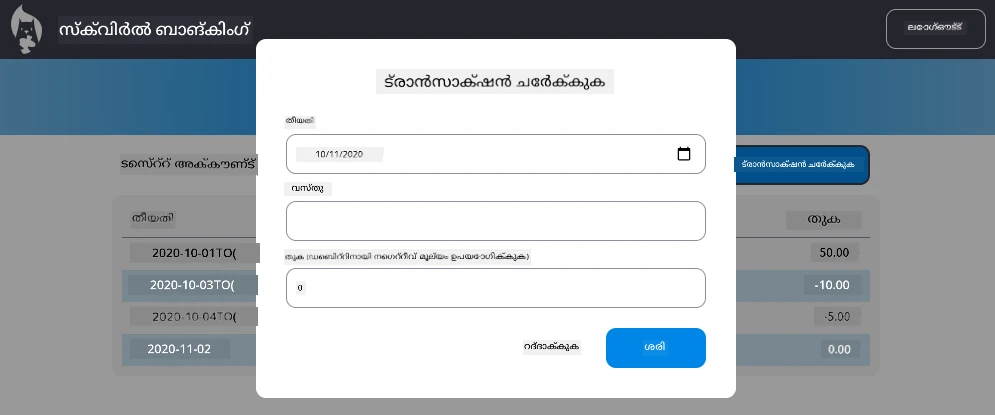

# "ട്രാൻസാക്ഷൻ ചേർക്കുക" ഡയലോഗ് നടപ്പാക്കുക

## അവലോകനം

നിങ്ങളുടെ ബാങ്കിങ് ആപ്പിന് ഇപ്പോൾ ഉറച്ച സ്റ്റേറ്റ് മാനേജുമെന്റ്, ഡാറ്റ persistence ഉണ്ട്, പക്ഷേ യഥാർത്ഥ ബാങ്കിങ് ആപ്പുകൾക്ക് ആവശ്യമായ ഒരു നിർണായക ഫീച്ചർ ഇല്ല: ഉപയോക്താക്കൾ തങ്ങളുടെ സ്വയം ട്രാൻസാക്ഷനുകൾ ചേർക്കാൻ കഴിയുന്ന കഴിവ്. ഈ അസൈൻമെന്റിൽ, നിങ്ങൾ നിലവിലുള്ള സ്റ്റേറ്റ് മാനേജുമെന്റ് സിസ്റ്റത്തോട് ചേർന്ന് പ്രവർത്തിക്കുന്ന ഒരു പൂർണ്ണമായ "ട്രാൻസാക്ഷൻ ചേർക്കുക" ഡയലോഗ് നടപ്പിലാക്കും.

ഈ അസൈൻമെന്റ് നിങ്ങൾ നാല് ബാങ്കിങ് പാഠങ്ങളിൽ ശേഖരിച്ചിട്ടുള്ള എല്ലാം ഒന്നിച്ച് ക്രമീകരിക്കുന്നു: HTML ടെംപ്ലേറ്റിംഗ്, ഫോം കൈകാര്യം, API ഇന്റഗ്രേഷൻ, സ്റ്റേറ്റ് മാനേജുമെന്റ്.

## പഠന ലക്ഷ്യങ്ങൾ

ഈ അസൈൻമെന്റ് പൂർത്തിയാക്കുന്നതിലൂടെ, നിങ്ങൾ:
- **ഉപയോക്തൃ സുഹൃത്തായ** ഡയലോഗ് ഇന്റർഫെയ്‌സ് സൃഷ്ടിക്കും
- **ആക്സസിബിൾ** ഫോം ഡിസൈൻ കീബോർഡ്, സ്ക്രീൻ റീഡർ പിന്തുണയോടെ നടപ്പിലാക്കും
- **ഇന്റഗ്രേറ്റ്** പുതിയ ഫീച്ചറുകൾ നിലവിലുള്ള സ്റ്റേറ്റ് മാനേജുമെന്റ് സംവിധാനത്തോട് ചേർന്ന്
- **API** കമ്മ്യൂണിക്കേഷൻ, പിശക് കൈകാര്യം പ്രാക്ടീസ് ചെയ്യും
- **ആധുനിക വെബ് ഡവലപ്മെന്റ് മാതൃകകൾ** യഥാർത്ഥ ഫീച്ചറുമായി പ്രയോഗിക്കും

## നിർദ്ദേശങ്ങൾ

### ഘട്ടം 1: ട്രാൻസാക്ഷൻ ചേർക്കൽ ബട്ടൺ

ഡാഷ്ബോർഡ് പേജിൽ ഉപയോക്താക്കൾക്ക് എളുപ്പത്തിൽ കണ്ടെത്താനും அணுகാനും കഴിയുന്ന "Add Transaction" ബട്ടൺ **സൃഷ്ടിക്കുക**.

**ആവശ്യകതകൾ:**
- ഡാഷ്ബോർഡിൽ ബട്ടൺ ഒത്തിടത്തിൽ **പിടിക്കുക**
- വ്യക്തമായ, പ്രവർത്തി ഉദ്ദേശിക്കുന്ന ബട്ടൺ ടെക്സ്റ്റ് **ഉപയോഗിക്കുക**
- നിലവിലുള്ള UI ഡിസൈനുമായി പൊരുത്തപ്പെടുന്ന വിധം ബട്ടൺ **സ്റ്റൈൽ ചെയ്യുക**
- ബട്ടൺ കീബോർഡ് ഉപയോഗിച്ചു ഉണ്ടാകുന്നുണ്ടെന്ന് **നിശ്ചയിക്കുക**

### ഘട്ടം 2: ഡയലോഗ് നടപ്പാക്കൽ

നിങ്ങളുടെ ഡയലോഗ് നടപ്പാക്കുന്നതിന് ഈ രണ്ട് മാർഗങ്ങളിൽ ഒന്നിനെ തെരഞ്ഞെടുക്കുക:

**ഓപ്ഷൻ A: വ്യത്യസ്ത പേജ്**
- ട്രാൻസാക്ഷൻ ഫോം വേണ്ടി പുതിയ HTML ടെംപ്ലേറ്റ് **സൃഷ്ടിക്കുക**
- റൂട്ടിംഗ് സിസ്റ്റത്തിൽ പുതിയ റൂട്ടു **ചേർക്കുക**
- ഫോം പേജിലേക്ക്-മാറ്റും തിരിഞ്ഛലും **നടപ്പാക്കുക**

**ഓപ്ഷൻ B: മോഡൽ ഡയലോഗ് (ശിപാർശ ചെയ്യുന്നു)**
- ഡാഷ്ബോർഡിൽ നിന്ന് പുറത്ത് പോവാതെ ജാവാസ്ക്രിപ്റ്റ് ഉപയോഗിച്ച് ഡയലോഗ് **പ്രദർശിപ്പിക്കുക/മറച്ചിൽ ചെയ്യുക**
- [`hidden` പ്രോപ്പർട്ടി](https://developer.mozilla.org/docs/Web/HTML/Global_attributes/hidden) അല്ലെങ്കിൽ CSS ക്ലാസുകൾ ഉപയോഗിച്ച് നടപ്പാക്കുക
- താരതമ്യമായ ഫോക്കസ് മാനേജുമെന്റ് ഉപയോഗിച്ച് സ്മൂത്ത് ഉപയോഗനുഭവം **സൃഷ്ടിക്കുക**

### ഘട്ടം 3: ആക്സസിബിലിറ്റി നടപ്പാക്കൽ

നിങ്ങളുടെ ഡയലോഗ് [മോഡൽ ഡയലോഗ് ആക്സസിബിലിറ്റി മാനദണ്ഡങ്ങൾ](https://developer.paciellogroup.com/blog/2018/06/the-current-state-of-modal-dialog-accessibility/) പാലിക്കുന്നതായി **നിശ്ചയിക്കുക**:

**കീബോർഡ് നാവിഗേഷൻ:**
- Esc കീ ഉപയോഗിച്ച് ഡയലോഗ് അടയ്ക്കാൻ പിന്തുണ **നൽകുക**
- ഡയലോഗ് തുറന്നപ്പോൾ ഫോക്കസ് അതിനുള്ളിൽ കുടുങ്ങുക
- ഡയലോഗ് അടച്ചപ്പോൾ ഫോകസ് ട്രിഗർ ബട്ടണിലേക്ക് **തിരിച്ച് നൽകുക**

**സ്ക്രീൻ റീഡർ പിന്തുണ:**
- അനുയോജ്യമായ ARIA ലേബലുകളും റോളുകളും **ചേർക്കുക**
- ഡയലോഗ് തുറക്കുകയും അടയ്ക്കുകയും ചെയ്യുന്നതായി സ്ക്രീൻ റീഡറുകൾക്ക് **അറിയിക്കുക**
- ക്ലിയർ ആയ ഫോമിന്റെ ഫീൽഡ് ലേബലുകളും പിശക് സന്ദേശങ്ങളും **ഉണ്ടാക്കുക**

### ഘട്ടം 4: ഫോം രൂപകൽപ്പന

ട്രാൻസാക്ഷൻ ഡാറ്റ ശേഖരിക്കുന്ന HTML ഫോം **രൂപകൽപ്പന ചെയ്യുക**:

**ആവശ്യമായ ഫീൽഡുകൾ:**
- **തിയതി**: ട്രാൻസാക്ഷൻ നടന്ന തീയതി
- **വിവരണം**: ട്രാൻസാക്ഷൻ എന്തിനുവേണ്ടി
- **തുക**: ട്രാൻസാക്ഷൻ വില (ഇൻകം പോസിറ്റീവ്, ചെലവ് നെഗറ്റീവ്)

**ഫോം സവിശേഷതകൾ:**
- സമർപ്പിക്കാനുമുമ്പ് ഉപയോക്തൃ ഇൻപുട്ട് **സാധുവാക്കുക**
- അസാധുവായ ഡാറ്റയ്ക്ക് വ്യക്തമായ പിശക് സന്ദേശങ്ങൾ **പ്രദർശിപ്പിക്കുക**
- ഉപകാരപ്രദമായ പ്ലേസ്ഹോൾഡർ ടെക്സ്റ്റും ലേബലുകളും ഉൾക്കൊള്ളിക്കുക
- നിലവിലുള്ള ഡിസൈനുമായി പൊരുത്തം പുലർത്തുന്ന വിധം **സ്റ്റൈൽ ചെയ്യുക**

### ഘട്ടം 5: API ഇന്റഗ്രേഷൻ

നിങ്ങളുടെ ഫോം ബാക്ക്‌എൻഡ് API-വുമായി **ബന്ധിപ്പിക്കുക**:

**നടപ്പാക്കൽ നടപടികൾ:**
- ശരിയായ എന്റ്പോയിന്റും ഡാറ്റ ഫോർമാറ്റും അറിയാൻ [സെർവർ API സവിശേഷതകൾ](../api/README.md) **പരിശോധിക്കുക**
- നിങ്ങളുടെ ഫോം ഇൻപുട്ടുകളിൽ നിന്നുള്ള JSON ഡാറ്റ **സൃഷ്ടിക്കുക**
- API-യിലേക്ക് ആവശ്യമായ പിശക് കൈകാര്യം സഹിതം ഡാറ്റ **അയയ്ക്കുക**
- ഉപയോക്താവിന് വിജയ/പരാജയ സന്ദേശങ്ങൾ **പ്രദർശിപ്പിക്കുക**
- നെറ്റ്‌വർക്ക് പിശകുകൾ സൗമ്യമായി **കൈകാര്യം ചെയ്യുക**

### ഘട്ടം 6: സ്റ്റേറ്റ് മാനേജുമെന്റ് ഇന്റഗ്രേഷൻ

പുതിയ ട്രാൻസാക്ഷനോടെ നിങ്ങളുടെ ഡാഷ്ബോർഡ് **അപ്ഡേറ്റ് ചെയ്യുക**:

**ഇന്റഗ്രേഷൻ ആവശ്യകതകൾ:**
- ട്രാൻസാക്ഷൻ വിജയകരമായി ചേർക്കുന്നതിന് ശേഷം അക്കൗണ്ട് ഡാറ്റ **റിഫ്രഷ് ചെയ്യുക**
- പേജ് റീലോഡ് ആവാതെ ഡാഷ്ബോർഡ് പ്രദർശനം **അപ്ഡേറ്റ് ചെയ്യുക**
- പുതിയ ട്രാൻസാക്ഷൻ ഉടൻ തന്നെ കാണപ്പെടുക
- പ്രക്രിയ മുഴുവനും ശരിയായ സ്റ്റേറ്റ് സ്ഥിരത **ഉറപ്പാക്കുക**

## ടെക്‌നിക്കൽ സ്പെസിഫിക്കേഷനുകൾ

**API എന്റ്പോയിന്റ് വിശദാംശങ്ങൾ:**
- ട്രാൻസാക്ഷൻ ഡാറ്റയ്ക്ക് ആവശ്യമായ JSON ഫോർമാറ്റ്
- HTTP മെത്തഡും എന്റ്പോയിന്റ് URL ഉം
- പ്രതീക്ഷിക്കുന്ന റസ്പോൺസ് ഫോർമാറ്റ്
- പിശക് റസ്പോൺസ് കൈകാര്യം

ഉല്ലേഖനം:  [സെർവർ API ഡോക്യുമെന്റേഷൻ](../api/README.md)

**പ്രതീക്ഷിച്ച ഫലം:**
ഈ അസൈൻമെന്റ് പൂര്‍ത്തിയാക്കിയതിനു ശേഷം നിങ്ങളുടെ ബാങ്കിങ് ആപ്പിൽ പ്രൊഫഷണൽ രൂപത്തിലുള്ള ഒരു പൂർണ്ണമായ "Add Transaction" ഫീച്ചർ ഉണ്ടായിരിക്കണം:

## നിങ്ങളുടെ നടപ്പാക്കൽ ടെസ്റ്റ് ചെയ്യുക

**ഫങ്ഷണൽ ടെസ്റ്റിംഗ്:**
1. "Add Transaction" ബട്ടൺ വ്യക്തമായി കാണപ്പെടുകയും ആക്സസിബിൾ ആയിരിക്കയും ചെയ്യും എന്ന് **പരിശോധിക്കുക**
2. ഡയലോഗ് ശരിയായി തുറക്കുകയും അടയ്ക്കുകയും ചെയ്യുന്നത് **ടെസ്റ്റ് ചെയ്യുക**
3. എല്ലാ ആവശ്യമായ ഫീൽഡുകൾക്കും ഫോമിന്റെ സാന്ദ്രീകരണം ശരിയാണെന്ന് **സ്ഥാപിക്കുക**
4. വിജയകരമായ ട്രാൻസാക്ഷനുകൾ ഉടനടി ഡാഷ്ബോർഡിൽ കാണപ്പെടുന്നത് ** ഉറപ്പാക്കുക**
5. അസാധുവായ ഡാറ്റക്കും നെറ്റ്‌വർക്ക് പ്രശ്‌നങ്ങൾക്കും പിശക് കൈകാര്യം തുടങ്ങുന്നതായി **നിശ്ചയിക്കുക**

**ആക്സസിബിലിറ്റി ടെസ്റ്റിംഗ്:**
1. കീബോർഡ് മാത്രം ഉപയോഗിച്ച് മുഴുവൻ പ്രവാഹവും **നാവിഗേറ്റ് ചെയ്യുക**
2. സ്ക്രീൻ റീഡർ ഉപയോഗിച്ച് ശരിയായ പരസ്യം ഉണ്ടെന്ന് **ടെസ്റ്റ് ചെയ്യുക**
3. ഫോക്കസ് മാനേജുമെന്റ് ശരിയായി പ്രവർത്തിക്കുന്നുവെന്ന് **സ്ഥാപിക്കുക**
4. എല്ലാ ഫോം ഘടകങ്ങൾക്കും അനുയോജ്യമായ ലേബലുകൾ ഉണ്ടെന്ന് **പരിശോധിക്കുക**

## മൂല്യനിർണയ രുബ്രിക്

| ക്രൈറ്റീരിയ | ഉത്തമം | മതിവരുന്ന | മെച്ചപ്പെടുത്തേണ്ടത് |
| -------- | --------- | -------- | ----------------- |
| **ഫംഗ്ഷനാലിറ്റി** | ട്രാൻസാക്ഷൻ ഫീച്ചർ അത്യുത్తമമായ ഉപയോക്തൃ അനുഭവത്തോടെ പൂർണ്ണമായി പ്രവർത്തിക്കുന്നു; പാഠങ്ങളിൽ നിന്നുള്ള മികച്ച പ്രാക്ടിസുകൾ പാലിക്കുന്നു | ട്രാൻസാക്ഷൻ ഫീച്ചർ ശരിയായി പ്രവര്‍ത്തിക്കുന്നുവെങ്കിലും കുറച്ച് മികച്ച പ്രാക്ടിസുകള് പാലിക്കാതെ ചെറിയ ഉപയോഗപ്രശ്നങ്ങള് ഉണ്ടായിരിക്കും | ട്രാൻസാക്ഷൻ ഫീച്ചർ ഭാഗികമായി മാത്രം പ്രവർത്തിക്കുകയോ ഗൗരവമുള്ള ഉപയോഗപ്രശ്നങ്ങൾ ഉള്ളതു കൂടിയാകാം |
| **കോഡ് ഗുണമേന്മ** | കോഡ് സജ്ജീകരിച്ച് നല്ലതായും, സ്ഥിരമായ പാറ്റേണുകൾ പാലിച്ചും, യോഗ്യമായ പിശക് കൈകാര്യം ഉൾപ്പെടുത്തിയും നിലവിലുള്ള സ്റ്റേറ്റ് മാനേജുമെന്റുമായി മികച്ച സാന്ദ്രതയോടെ ചേർക്കുന്നു | കോഡ് പ്രവർത്തിക്കുന്നുവെങ്കിലും ക്രമീകരണ പ്രശ്‌നങ്ങളും ഉറപ്പില്ലാത്ത പാറ്റേണുകളും ഉണ്ടായിരിക്കാം | കോഡിൽ ഗൗരവമായ ഘടനാപരമായ പ്രശ്‌നങ്ങളോ നിലവിലുള്ള പാറ്റേണുകളിൽ ചേർന്നുപോകാത്തതോ ഉണ്ടാകാം |
| **ആക്സസിബിലിറ്റി** | കീബോർഡ് നാവിഗേഷൻ, സ്ക്രീൻ റീഡർ സാങ്കേതിക വിദ്യകൾ പൂർണ്ണമായി പിന്തുണയ്ക്കുന്നു; WCAG മാർഗനിർദേശങ്ങൾ പാലിക്കുന്ന മികച്ച ഫോകസ് മാനേജുമെന്റ് വാഗ്ദാനം ചെയ്യുന്നു | അടിസ്ഥാന ആക്സസിബിലിറ്റി ഫീച്ചറുകൾ നടപ്പാക്കിയിരിക്കുന്നു, പക്ഷേ കുറച്ച് കീബോർഡ് നാവിഗേഷൻ അല്ലെങ്കിൽ സ്ക്രീൻ റീഡർ പിന്തുണ കാണാനാകില്ല | ആക്സസിബിലിറ്റി പരിഗണനകൾ കുറഞ്ഞതോ ഇല്ലാതെയോ ആണ് |
| **ഉപയോക്തൃ അനുഭവം** | ബോധ്യമായ, മെച്ചപ്പെട്ട ഇന്റർഫെയ്‌സ്; വ്യക്തമായ പ്രതികരണങ്ങൾ, സ്മൂട്ട് ഇന്ററാക്ഷനുകൾ, പ്രൊഫഷണൽ രൂപം | നല്ല ഉപയോക്തൃ അനുഭവം; ചെറിയ പ്രതികരണമോ ദൃശ്യ ഡിസൈൻ മെച്ചപ്പെടുത്തലോ ആവശ്യമുണ്ട് | കാര്യമായി ഉപയോക്തൃ അനുഭവം താഴ്ന്നതിനാൽ ആശയഭ്രാന്തി ഉണ്ടാകാം, പ്രതികരണമില്ലായ്മ |

## അധിക വെല്ലുവിളികൾ (ഓപ്ഷണൽ)

അടിസ്ഥാന ആവശ്യങ്ങൾ പൂർത്തിയാക്കിയശേഷം, ഈ മെച്ചപ്പെടുത്തലുകൾ പരിഗണിക്കുക:

**വനിതക ഫീച്ചറുകൾ:**
- ട്രാൻസാക്ഷൻ വിഭാഗങ്ങൾ ചേർക്കൽ (ഭക്ഷണ, ഗതാഗതം, വിനോദം, മുതലായവ)
- യാഥാർത്ഥ്യ സമയ ഫീഡ്ബാക്കോടെ ഇൻപുട്ട് സാധുത പരിശോധന
- പവർ യൂസർമാർക്കുള്ള കീബോർഡ് ഷോർട്കട്ടുകൾ സൃഷ്ടിക്കൽ
- ട്രാൻസാക്ഷൻ എഡിറ്റിംഗ്, ഡിലീഷൻ കഴിവുകൾ ചേർക്കൽ

**ഉന്നത ഇന്റഗ്രേഷൻ:**
- അവസാനങ്ങളിൽ ചേർക്കപ്പെട്ട ട്രാൻസാക്ഷനുകൾക്കുള്ള undo ഫംഗ്ഷണാലിറ്റി നടപ്പാക്കൽ
- CSV ഫയൽമാർഗ്ഗം ബൾക്ക് ട്രാൻസാക്ഷൻ ഇമ്പോർട്ട് ചേർക്കൽ
- ട്രാൻസാക്ഷൻ തിരച്ചിൽ, ഫിൽട്ടർ സവിശേഷതകൾ സൃഷ്ടിക്കൽ
- ഡാറ്റ എക്സ്പോർട്ട് ഫംഗ്ഷണാലിറ്റി നടപ്പാക്കൽ

ഈ ഓപ്ഷണൽ ഫീച്ചറുകൾ നിങ്ങൾക്ക് കൂടുതലായി ആധുനിക വെബ് ഡവലപ്മെന്റ് ആശയങ്ങൾ അഭ്യാസം നടത്താനും കൂടുതൽ പൂർണ്ണമായ ഒരു ബാങ്കിങ് ആപ്പ് സൃഷ്ടിക്കാനുമാകും!

---

<!-- CO-OP TRANSLATOR DISCLAIMER START -->
**വിവാദം**:
ഈ പ്രമാണം AI തിരച്ചിൽ സേവനം [Co-op Translator](https://github.com/Azure/co-op-translator) ഉപയോഗിച്ച് വിവർത്തനം ചെയ്തതാണ്. ഞങ്ങൾ കൃത്യതയ്ക്കായി പരിശ്രമിക്കുന്നുവെങ്കിലും, ഓട്ടോമാറ്റഡ് വിവർത്തനങ്ങളിൽ തെറ്റുകളും അശുദ്ധികളും ഉണ്ടാകാം എന്നതു അറിയുക. ആങ്ങളിൽ പ്രമാണത്തിന്റെ മാതൃഭാഷയിലെ പ്രധാന പ്രമാണം മാത്രമാണ് പ്രാമുഖ്യ സൂത്രധാരമെന്നാണ് കരുതേണ്ടത്. നിർണ്ണായക വിവരങ്ങൾക്കായി, പ്രൊഫഷണൽ മാനവ വിവർത്തനം നിർദ്ദേശിക്കുന്നു. ഈ വിവർത്തനം ഉപയോഗിക്കുന്നതിൽ നിന്നുണ്ടാകുന്ന ഏതെങ്കിലും തെറ്റിദ്ധാരണകൾക്ക് അല്ലെങ്കിൽ വിമർശനങ്ങൾക്ക് ഞങ്ങൾ ബാധ്യത വഹിക്കുന്നില്ല.
<!-- CO-OP TRANSLATOR DISCLAIMER END -->