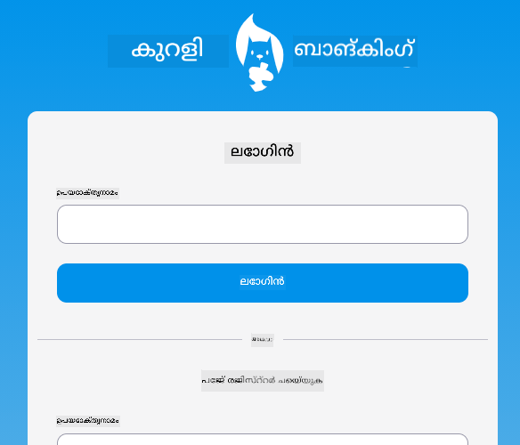
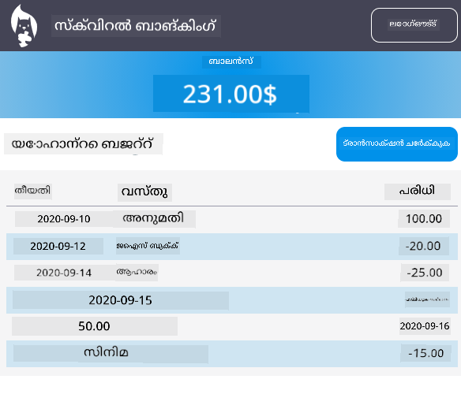

<!--
CO_OP_TRANSLATOR_METADATA:
{
  "original_hash": "830359535306594b448db6575ce5cdee",
  "translation_date": "2026-01-08T11:30:42+00:00",
  "source_file": "7-bank-project/README.md",
  "language_code": "ml"
}
-->
# :dollar: ഒരു ബാങ്ക് നിർമ്മിക്കുക

ഈ പ്രോജക്ടിൽ, നിങ്ങൾ ഒരു خیالی ബാങ്ക് എങ്ങനെ നിർമ്മിക്കാമെന്ന് പഠിക്കും. ഈ പഠനങ്ങളിൽ ഒരു വെബ് ആപ്പ് എങ്ങനെൽയൗട്ട് ചെയ്യാം, റൂട്ടുകൾ എങ്ങനെ നൽകാം, ഫോമുകൾ നിർമ്മിക്കുക, സ്റ്റേറ്റ് മാനേജ് ചെയ്യുക, ബാങ്കിന്റെ ഡാറ്റ ലഭിക്കുന്ന API-യിൽ നിന്ന് ഡാറ്റ എങ്ങനെ ഫിച്ച് ചെയ്യാം എന്നതിനെക്കുറിച്ചുള്ള നിർദ്ദേശങ്ങൾ ഉൾបទമാണ്.

|  |  |
|--------------------------------|--------------------------------|

## പാഠങ്ങൾ

1. [HTML ടെംപ്ലേറ്റുകളും വെബ് ആപ്പിലെ റൂട്ടുകളും](1-template-route/README.md)
2. [ലോഗിൻ & രജിസ്ട്രേഷൻ ഫോം നിർമ്മിക്കുക](2-forms/README.md)
3. [ഡാറ്റ ഫിച്ചിംഗ് & ഉപയോഗിക്കുന്ന വിധികൾ](3-data/README.md)
4. [സ്റ്റേറ്റ് മാനേജ്മെന്റ് ആശയങ്ങൾ](4-state-management/README.md)

### ക്രെഡിറ്റ്

ഈ പാഠങ്ങൾ :hearts: തയ്യാർ ചെയ്തത് [യോഹാൻ ലസോർസ](https://twitter.com/sinedied) ആണ്.

ഈ പാഠങ്ങളിൽ ഉപയോഗിക്കുന്ന [സ്വർവ്വർ API](/7-bank-project/api/README.md) എങ്ങനെ നിർമിക്കാമെന്ന് പഠിക്കാൻ താൽപര്യമുണ്ടെങ്കിൽ, [ഈ വീഡിയോകളുടെ സീരീസ്](https://aka.ms/NodeBeginner) (പ്രധാനമായും വീഡിയോകൾ 17 മുതൽ 21 വരെ) പിന്തുടരാം.

നിങ്ങൾക്ക് [ഈ ഇന്ററാക്റ്റീവ് ലേൺ ട്യൂട്ടോറിയൽ](https://aka.ms/learn/express-api) കാണാനും കഴിയും.

---

<!-- CO-OP TRANSLATOR DISCLAIMER START -->
**അസ്വാഭാവിക കുറിപ്പ്**:
ഈ രേഖ AI വിവർത്തന സേവനമായ [Co-op Translator](https://github.com/Azure/co-op-translator) ഉപയോഗിച്ചു വിവർത്തനം ചെയ്തതാണ്. നാം ശരിയായതിലേക്കുള്ള പരിശ്രമം നടത്താറായിരുന്നാലും, യന്ത്രവൽക്കൃത വിവർത്തനങ്ങളിൽ പിഴവുകളും തെറ്റുകളും ഉണ്ടായേക്കാമെന്ന് ദയവായി കരുതുക. പ്രാധാന്യമേറിയ വിവരങ്ങൾക്ക് പ്രൊഫഷണൽ മനുഷ്യ വിവർത്തനം ഉപദേശിക്കുന്നു. ഓരിജിനൽ രേഖയുടെ സ്വതന്ത്ര ഭാഷയിൽ ഉള്ള ഉള്ളടക്കം ആണ് പ്രാമാണികമായ ഉറവിടം എന്ന് കരുതണം. ഈ വിവർത്തനം ഉപയോഗിച്ചതിനെത്തുടർന്ന് ഉണ്ടായ ഏതെങ്കിലും തെറ്റായ മനസ്സിലാക്കലുകൾക്കും തെറ്റായ വ്യാഖ്യാനങ്ങൾക്കും ഞങ്ങൾ ഉത്തരവാദികളല്ല.
<!-- CO-OP TRANSLATOR DISCLAIMER END -->