# ഒരു കോഡ് എഡിറ്റർ ഉപയോഗിക്കുന്നത്: VSCode.dev കഴിവാർജ്ജനം

*ദി മാട്രിക്‌സ്*-യിലെ നീവോ ഒരു വൻ കമ്പ്യൂട്ടർ ടേർമിനലിൽ പ്ലഗ് ഇൻ ചെയ്ത് ഡിജിറ്റൽ ലോകത്തെ പ്രവേശിക്കേണ്ടിവന്നത് ഓർക്കൂ? ഇന്നത്തെ വെബ് ഡെവലപ്പ്മെന്റ് ടൂൾസ് എതിർവശ കഥയാണ് – എവിടേയുമുള്ള ഏറ്റവും ശക്തമായ കഴിവുകൾ. VSCode.dev ഒരു ബ്രൗസർ അടിസ്ഥാനമാക്കിയ കോഡ് എഡിറ്ററാണ്, ഇന്റർനെറ്റ് കണക്ഷൻ ഉള്ള ഏത് ഡിവൈസിനും പ്രൊഫഷണൽ ഡെവലപ്പ്മെന്റ് ഉപകരണങ്ങൾ കൊണ്ടുവരുന്നത്.

പ്രിന്റിംഗ് പ്രസ് എല്ലാർക്കും പുസ്തകങ്ങൾ ലഭ്യമാക്കുന്നത് പോലെ, മഠത്തിലെ എഴുത്തുകാരെ മാത്രമല്ല, VSCode.dev കോഡിംഗിനെ ഡെമോക്രടൈസ് ചെയ്യുന്നു. ലൈബ്രറി കമ്പ്യൂട്ടറിൽ നിന്നോ, സ്കൂൾ ലാബിൽ നിന്നോ, ബ്രൗസർ ലഭ്യമുള്ള എവിടെയെയും നിങ്ങൾ പ്രോജക്റ്റുകളിൽ പ്രവർത്തിക്കാം. ഇൻസ്റ്റാൾ ചെയ്യേണ്ടതില്ല, “എനിക്ക് എന്റെ പ്രത്യേക സെറ്റപ്പ് വേണം” പോലുള്ള നിയന്ത്രണങ്ങളില്ല.

ഈ പാഠത്തിന്റെ അവസാനം, നിങ്ങൾക്ക് VSCode.dev നാവിഗേറ്റ് ചെയ്യാനും, GitHub റിപ്പോസിറ്ററികൾ നേരിട്ട് നിങ്ങളുടെ ബ്രൗസറിൽ തുറക്കാനും, ഗിറ്റ് ഉപയോഗിച്ച് വേർഷൻ കൺട്രോൾ നടത്താനും കഴിയുന്നതായി മനസ്സിലാകും – പ്രൊഫഷണൽ ഡെവലപ്പർമാർ ദിവസംപ്രതി ആശ്രയിക്കുന്ന എല്ലാ കഴിവുകളും.

## ⚡ അടുത്ത 5 മിനിറ്റിൽ നിങ്ങൾക്ക് ചെയ്യാനാകുന്നത്

**ബിസി ഡെവലപ്പർമാർക്ക് ദ്രുത തുടക്കം**


- **മിനിറ്റ് 1**: [vscode.dev](https://vscode.dev) സന്ദർശിക്കുക - ഇൻസ്റ്റലേഷൻ ആവശ്യമില്ല  
- **മിനിറ്റ് 2**: GitHub-ൽ സൈൻ ഇൻ ചെയ്ത് നിങ്ങളുടെ റിപ്പോസിറ്ററികൾ ബന്ധിപ്പിക്കുക  
- **മിനിറ്റ് 3**: URL ട്രിക്ക് പരീക്ഷിക്കുക: ഏതൊരു റിപ്പോ URL-ലും `github.com` മാറ്റി `vscode.dev/github` ഉപയോഗിക്കുക  
- **മിനിറ്റ് 4**: പുതുതായി ഒരു ഫയൽ созда് ചെയ്തു സ്വയം പ്രവർത്തിക്കുന്ന സിന്റാക്സ് ഹൈലൈറ്റിംഗ് കാണുക  
- **മിനിറ്റ് 5**: ഒരു മാറ്റം വരുത്തി സോഴ്‌സ് കൺട്രോൾ പാനലിലൂടെ കമിറ്റ് ചെയ്യുക  

**ദ്രുത പരിശോധന URL:**
```
# Transform this:
github.com/microsoft/Web-Dev-For-Beginners

# Into this:
vscode.dev/github/microsoft/Web-Dev-For-Beginners
```

**ഇതിന്റെ പ്രാധാന്യം**: 5 മിനിറ്റിനുള്ളിൽ, പ്രൊഫഷണൽ ഉപകരണങ്ങളുള്ള എവിടെ നിന്നും കോഡിംഗിന്റെ സ്വാതന്ത്ര്യം നിങ്ങൾ അനുഭവപ്പെടും. ഇത് വികസനത്തിന്റെ ഭാവിയാണ് – ലഭ്യമായും, ശക്തവുമായും, പെട്ടെന്നുള്ളതുമായും.

## 🗺️ ക്ലൗഡ് അടിസ്ഥാന ഡെവലപ്പ്മെന്റിലൂടെ നിങ്ങളുടെ പഠന യാത്ര

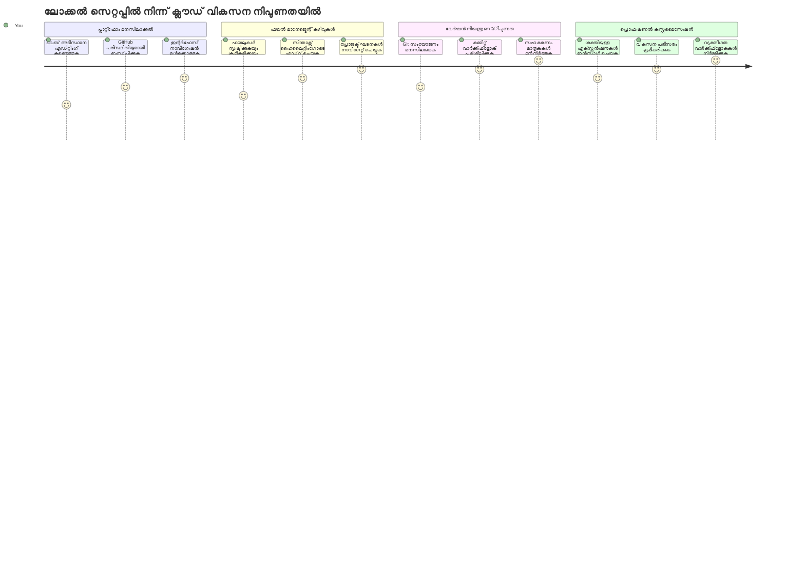
**നിങ്ങളുടെ യാത്രയുടെ ഗন্তവ്യം**: ഈ പാഠത്തിന്റെ അവസാനം, നിങ്ങൾ ഒരു പ്രൊഫഷണൽ ക്ലൗഡ് ഡെവലപ്പ്മെന്റ് പരിസരത്ത് പക្តിയായി熟തലമായിരിക്കും, ഏത് ഡിവൈസിലും പ്രവർത്തിക്കുന്നതുമായ, വലിയ സാങ്കേതിക കമ്പനികളിലെ ഡെവലപ്പർമാർ ഉപയോഗിക്കുന്ന ഉപകരണങ്ങളുമായി കോഡ് ചെയ്യാൻ കഴിയും.

## നിങ്ങൾ എന്ത് പഠിക്കും

ഇതുവരെ ഞങ്ങൾ ചേർന്ന് നടക്കും, നിങ്ങൾക്ക് കഴിയും:

- VSCode.dev രണ്ടാമത്തെ വീട്ടുപോലെ നാവിഗേറ്റ് ചെയ്യുക – നിങ്ങൾക്ക് എന്തും ലഭ്യമാകാനും വഴിമ မറയാതെ  
- ഏതൊരു GitHub റിപ്പോസിറ്ററിയും നിങ്ങളുടെ ബ്രൗസറിൽ അതു തുറന്ന് ഉടൻ എഡിറ്റുചെയ്യാൻ (ഇത് അത്യന്തം മായാജാലമാണ്!)  
- ഗിറ്റ് ഉപയോഗിച്ച് പരിഷ്കരണങ്ങൾ ട്രാക്ക് ചെയ്തുകൊണ്ടു പ്രൊഫഷണലായി നിങ്ങളുടെ പുരോഗതി സംരക്ഷിക്കുക  
- എഡിറ്റർ എക്സ്റ്റൻഷനുകളിൽ കോഡിംഗ് വേഗത്തിലാക്കി കൂടുതൽ രസകരമാക്കുക  
- പ്രോജക്റ്റ് ഫയലുകൾ ആത്മവിശ്വാസത്തോടെ സൃഷ്ടിക്കുകയും ക്രമീകരിക്കുകയും ചെയ്യുക  

## നിങ്ങൾക്ക് വേണ്ടത്

ആവശ്യകതകൾ സരളമാണ്:

- ഒരു സൗജന്യ [GitHub അക്കൗണ്ട്](https://github.com) (ആവശ്യമായാൽ ഞങ്ങൾ നിങ്ങൾക്ക് സൃഷ്ടിക്കാനുള്ള വഴി പ്രദാനം ചെയ്യും)  
- വെബ് ബ്രൗസറുകളോടുള്ള അടിസ്ഥാന പരിചയം  
- GitHub ബേസിക് പാഠം സഹായകരമാണ്, പക്ഷേ അനിവാര്യമല്ല  

> 💡 **GitHub പുതിയользനാർ?** ഒരു അക്കൗണ്ട് സൃഷ്ടിക്കുന്നത് സൗജന്യമാണ്, ചില മിനിറ്റുകൾ വേണ്ടി വരും. ലൈബ്രറി കാർഡ് പോലെ, ലോകമാകെയുള്ള പുസ്തകങ്ങളിലേക്ക് ആക്‌സസ് നൽകുന്നതുപോലെ, GitHub അക്കൗണ്ട് ഇന്റർനെറ്റിലെ കോഡ് റിപ്പോസിറ്ററികൾക്ക് വാതിലുകൾ തുറക്കുന്നു.  

## 🧠 ക്ലൗഡ് ഡെവലപ്പ്മെന്റ് പരിസ്ഥിതി അവലോകനം

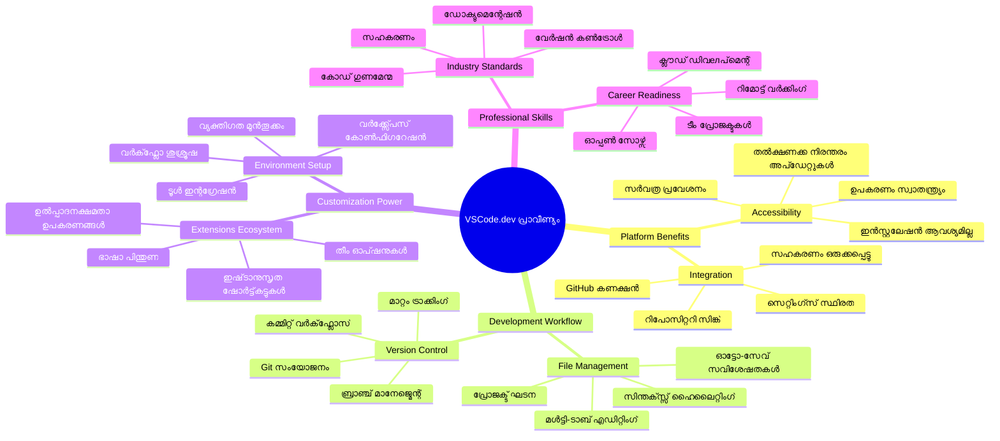
**പ്രധാന സിദ്ധാന്തം**: ക്ലൗഡ്-അടിസ്ഥാനമാക്കിയ ഡെവലപ്പ്മെന്റ് പരിസരങ്ങൾ കോഡിംഗിന്റെ ഭാവിയാണ് – പ്രൊഫഷണൽ നിലവാരത്തിലുള്ള ഉപകരണങ്ങൾ, ലഭ്യമാകുന്ന, സഹകരണപരമായ, പ്ലാറ്റ്ഫോം സ്വതന്ത്രമായ.

## വെബ് അടിസ്ഥാന കോഡ് എഡിറ്ററുകൾ的重要ം

ഇന്റർനെറ്റിന് മുമ്പ്, വിവിധ സർവ്വകലാശാലകളിലെ ശാസ്ത്രജ്ഞങ്ങൾ അവരുടെ ഗവേഷണം എളുപ്പത്തിൽ പങ്ക് വെയ്ക്കാനായിരുന്നില്ല. 1960-കളിൽ ARPANET കംപ്യൂട്ടറുകൾ ബന്ധിപ്പിച്ചു. വെബ് അടിസ്ഥാന കോഡ് എഡിറ്ററുകൾ അതേ സിദ്ധാന്തത്തെ പിന്തുടരുന്നു – നിങ്ങളുടെ സ്ഥലം അല്ലെങ്കിൽ ഉപകരണം എന്തായാലും ശക്തമായ ഉപകരണങ്ങൾ ലഭ്യമാക്കുന്നു.

ഒരു കോഡ് എഡിറ്റർ നിങ്ങളുടെ ഡെവലപ്പ്മെന്റ് വേർക്ക്സ്പേസായി പ്രവർത്തിക്കുന്നു, അവിടെ നിങ്ങൾ കോഡ് ഫയലുകൾ എഴുതുന്നു, എഡിറ്റ് ചെയ്യുന്നു, ക്രമീകരിക്കുന്നു. ലളിതമായ ടെക്സ്റ്റ് എഡിറ്ററുകൾക്ക് വ്യത്യസ്തമായി, പ്രൊഫഷണൽ കോഡ് എഡിറ്ററുകൾ സിന്റാക്സ് ഹൈലൈറ്റിംഗ്, പിശക് കണ്ടെത്തൽ, പ്രോജക്റ്റ് മാനേജ്‌മെന്റ് ഫീച്ചറുകൾ നൽകുന്നു.

VSCode.dev ഈ കഴിവുകൾ നിങ്ങളുടെ ബ്രൗസറിലേക്ക് കൊണ്ടുവരുന്നു:

**വെബ് അടിസ്ഥാന എഡിറ്റിങ്ങിന്റെ ഗുണങ്ങൾ:**

| സവിശേഷത | വിവരണം | പ്രായോഗിക വ benefit |
|---------|-------------|----------|
| **പ്ലാറ്റ്ഫോം സ്വാതന്ത്ര്യം** | ബ്രൗസർ ഉള്ള ഏതൊരു ഡിവൈസിലും പ്രവർത്തിക്കുകയും | വ്യത്യസ്ത കമ്പ്യൂട്ടറുകളിൽ സമരസ്യത്തോടെ പ്രവർത്തിക്കുക |
| **ഇൻസ്റ്റലേഷൻ ആവശ്യമില്ല** | വെബ് യൂആർഎൽ വഴിയുള്ള ആക്‌സസ് | സോഫ്‌‌റ്റ്‌വെയർ ഇൻസ്റ്റലേഷൻ നിയന്ത്രണങ്ങൾ മറികടക്കുക |
| **സ്വയം അപ്‌ഡേറ്റുകൾ** | എല്ലായ്പ്പോഴും ഏറ്റവും പുതിയ വേർഷനിൽ പ്രവർത്തിക്കുന്നു | പുതിയ ഫീച്ചറുകൾ മാനുവൽ അപ്‌ഡേറ്റുകൾ കൂടാതെ ലഭിക്കുന്നു |
| **റിപ്പോസിറ്ററി സംയോജനം** | GitHub-നോടുള്ള നേരിട്ട് ബന്ധം | പ്രാദേശിക ഫയൽ മാനേജ്‌മെന്റ് ഇല്ലാതെ കോഡ് എഡിറ്റ് ചെയ്യുക |

**പ്രായോഗിക പ്രതിഫലങ്ങൾ:**
- വ്യത്യസ്ത പരിസ്ഥിതികളിൽ പ്രവൃത്തി തുടർച്ച
- ഓപ്പറേറ്റിംഗ് സിസ്റ്റം സീമാപൂർവം സംവേദനാശക്തമായ ഇന്റർഫേസ്  
- ഉടനെ സഹകരണ കഴിവുകൾ  
- പ്രാദേശിക സംഭരണ സ്ഥലം കുറയുന്നു  

## VSCode.dev പരിചയം

മാരി ക്യൂറിയുടെ ലബോറട്ടറി സങ്കീർണ്ണമായ ഉപകരണങ്ങൾക്കൊണ്ടുള്ള ഒരു ലളിതമായ സ്ഥലം ആയ പോലെ, VSCode.dev ബ്രൗസർ ഇന്റർഫേസ് പ്രൊഫഷണൽ ഡെവലപ്പ്മെന്റ് ടൂളുകൾ അടങ്ങിയിട്ടുണ്ട്. ഈ വെബ് ആപ്ലിക്കേഷൻ ഡെസ്ക്ടോപ്പ് കോഡ് എഡിറ്ററുകളെ സമാനമായ കോർ ഫംഗ്ഷണാലിറ്റി നൽകുന്നു.

ബ്രൗസറിൽ [vscode.dev](https://vscode.dev) സന്ദർശിക്കുക. ഡൗൺലോഡുകളോ സിസ്റ്റം ഇൻസ്റ്റലേഷനുകളോ ഇല്ലാതെ ഇന്റർഫേസ് ലോഡ് ചെയ്യും – ക്ലൗഡ് കംപ്യൂട്ടിങ്ങ് സിദ്ധാന്തത്തിന്റെ നേരിട്ടുള്ള പ്രയോഗം.

### നിങ്ങളുടെ GitHub അക്കൗണ്ട് ബന്ധിപ്പിക്കൽ

അലക്സാണ്ടർ ഗ്രാഹം ബെല്ലിന്റെ ടെലിഫോൺ ദൂരസ്ഥലങ്ങൾ ബന്ധിപ്പിച്ചതുപോലെ, GitHub അക്കൗണ്ട് ബന്ധിപ്പിക്കുന്നത് VSCode.dev-നെയും നിങ്ങളുടെ കോഡ് റിപ്പോസിറ്ററികളെയും ബന്ധിപ്പിക്കുന്നു. GitHub-ൽ സൈൻ ഇൻ ചെയ്യാൻ പ്രോപ്റ്റ് ചെയ്യുന്നപ്പോൾ, ഈ ബന്ധം അംഗീകരിക്കുക നിർദേശം.

**GitHub സംയോജനം നൽകുന്നത്:**
- എഡിറ്ററിനുള്ളിൽനിന്ന് നിങ്ങളുടെ റിപ്പോസിറ്ററികളിലേക്ക് നേരിട്ട് ആക്‌സസ്  
- ഉപകരണങ്ങളിലിടയിലുള്ള ക്രമീകരണങ്ങളും എക്സ്റ്റൻഷനുകളും സമന്വയിപ്പിക്കൽ  
- GitHub-ലേക്ക് ലളിതമായ സേവിംഗ് പ്രവൃത്തി  
- വ്യക്തിഗതമാക്കിയ ഡെവലപ്പ്മെന്റ് പരിസ്ഥിതി  

### നിങ്ങളുടെ പുതിയ വെർക്ക്സ്പെയ്സ് മനസ്സിലാക്കുക

എല്ലാം ലോഡ് ചെയ്തതിനു ശേഷം, നിങ്ങൾ മനോഹരമായി ശുചിത്വമുള്ള ഒരു വേർക്ക്സ്പേസ് കാണും, അഭിപ്രായങ്ങൾക്ക് നിർദ്ദേശിക്കപ്പെടുന്നത് – നിങ്ങളുടെ കോഡ് ആണ് പ്രധാനങ്ങൾ!

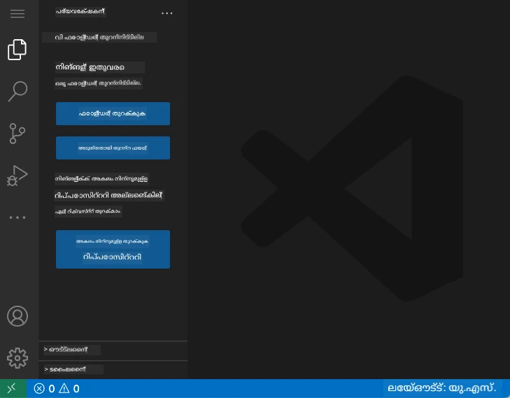

**ഇവിടെ നിങ്ങളുടെ അയൽക്കൂട്ടത്തിന്റെ ടൂർ:**
- **ആക്ടിവിറ്റി ബാർ** (ഇടതു വശത്ത് സ്ട്രിപ്പ്): എക്സ്പ്ലോറർ 📁, തിരയൽ 🔍, സോഴ്‌സ് കൺട്രോൾ 🌿, എക്സ്റ്റൻഷൻസ് 🧩, ക്രമീകരണങ്ങൾ ⚙️ എന്നിവയടങ്ങിയ പ്രധാന നാവിഗേഷൻ  
- **സൈഡ്‌ബാർ** (അടുത്തുള്ള പാനൽ): നിങ്ങൾ തിരഞ്ഞെടുത്തതു പ്രകാരം ബന്ധപ്പെട്ട വിവരം പ്രദർശിപ്പിക്കുന്നു  
- **എഡിറ്റർ ഏരിയ** (മധ്യത്തെ വലിയ സ്പേസ്): ഇവിടെ മജികാണ് – നിങ്ങളുടെ പ്രധാന കോഡിംഗ് ഏരിയ  

**ഒരു നിമിഷം കണ്ടെത്തുക:**
- ആക്ടിവിറ്റി ബാർ ഐക്കണുകൾ ഒന്ന് ഒന്ന് ക്ലിക്ക് ചെയ്ത് അവയുടെ പ്രവർത്തനം കാണുക  
- സൈഡ്‌ബാർ വ്യത്യസ്ത വിവരങ്ങൾ കാണിക്കുക ശ്രദ്ധിക്കുക – അത്ര മനോഹരമാണ്, അല്ലേ?  
- എക്സ്പ്ലോറർ ദൃശ്യം (📁) നിങ്ങൾ കൂടുതൽ സമയം ചിലവഴിക്കുന്ന സ്ഥലം തന്നെയാണ്, അതിനാൽ അതിൽ സുഖം അനുഭവിക്കൂ  

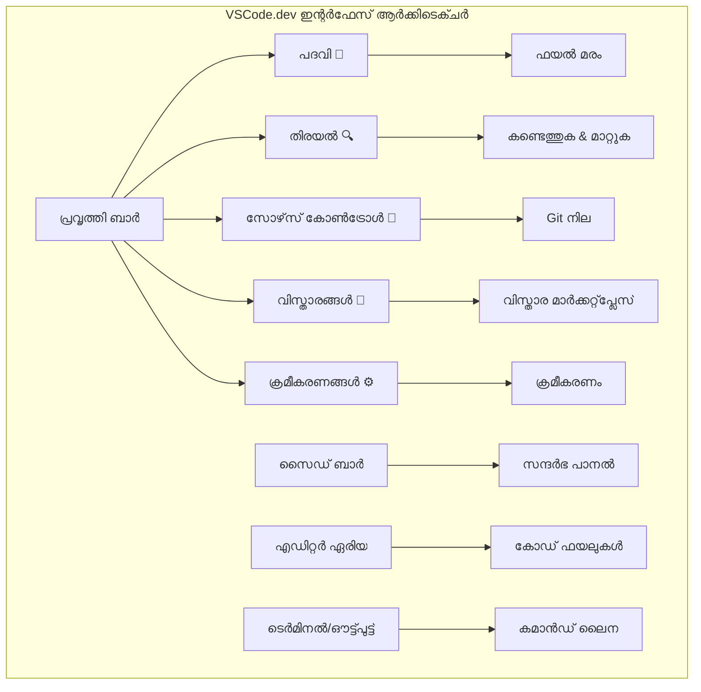
## GitHub റിപ്പോസിറ്ററികൾ തുറന്നെടുക്കൽ

ഇന്റർനെറ്റിന് മുമ്പ്, ഗവേഷകർ രേഖകൾ ലഭിക്കുന്നതിന് ലൈബ്രറികളിലേക്ക് ശാരീരം യാത്ര ചെയ്യേണ്ടിവന്നു. GitHub റിപ്പോസിറ്ററികൾ ഇതുപോലെ ആണ് – റിമോട്ട് ആയി സൂക്ഷിച്ചിരിക്കുന്ന കോഡ് കണക്കുകൾ. VSCode.dev പ്രാദേശിക യന്ത്രത്തിലേക്ക് ഡൗൺലോഡ് ചെയ്യാതെ നേരിട്ട് എഡിറ്റ് ചെയ്യാനുള്ള ആശയം ഒഴിവാക്കുന്നു.

ഈ സവിശേഷത പൊതു റിപ്പോസിറ്ററികൾ നേരിട്ട് ദൃശ്യമാക്കുകയോ, എഡിറ്റുചെയ്യുകയോ, സംഭാവന നൽകുകയോ ചെയ്യാൻ സഹായിക്കുന്നു. റിപ്പോസിറ്ററി തുറക്കാനുള്ള രണ്ടു മാർഗ്ഗങ്ങൾ

### മാർഗ്ഗം 1: പോയിന്റ്-ആൻഡ്-ക്ലിക്ക് രീതി

നിങ്ങൾ VSCode.dev-ലിൽ പുതിയതായി തുടങ്ങി പ്രത്യേക റിപ്പോസിറ്ററി തുറക്കാൻ ഉദ്ദേശിക്കുമ്പോൾ ഇത് അനുയോജ്യമായും തുടങ്ങിയവർക്കും സൗകര്യമുള്ളതും ആണ്:

**ഇങ്ങനെ ചെയ്യുക:**

1. [vscode.dev](https://vscode.dev) സന്ദർശിക്കുക, ഇതിനകം അവിടെ ഇല്ലെങ്കിൽ  
2. സ്വാഗതപ്പടിയിലെ "Open Remote Repository" ബട്ടൺ കണ്ടെത്തി ക്ലിക്ക് ചെയ്യുക  

   

3. ഏതൊരു GitHub റിപ്പോസിറ്ററി URL പേസ്റ്റ് ചെയ്യുക (ഉദാ: `https://github.com/microsoft/Web-Dev-For-Beginners`)  
4. Enter അമർത്തി ഞെട്ടിക്കുന്ന മാറ്റം കാണുക!

**പ്രൊ ടിപ്പ് - കമാൻഡ് പാളറ്റ് ഷോർട്ട്കട്ട്:**

കോഡിംഗ് അപാരമായി സൃഷ്ടിക്കാനുള്ള ആഗ്രഹമുണ്ടോ? ഈ കീബോർഡ് ഷോർട്ട്കട്ട് ട്രൈ ചെയ്യൂ: Ctrl+Shift+P (മാക്‌സിൽ Cmd+Shift+P) കമാൻഡ് അലയം തുറക്കാൻ:

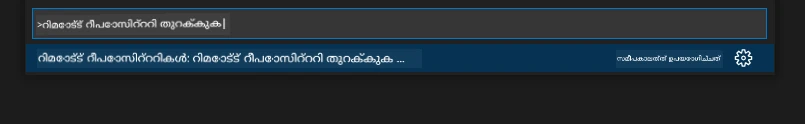

**കമാൻഡ് പാളറ്റ് എല്ലാം ചെയ്യാൻ കഴിയുന്ന ഒരു തിരയൽ എഞ്ചിൻ പോലെയാണ്:**
- "open remote" ടൈപ്പ് ചെയ്യുക, ഇത് റിപ്പോസിറ്ററി ഓപ്പണറെ കണ്ടെത്തും  
- ഇത് അടുത്ത കാലത്ത് തുറന്ന റിപ്പോസിറ്ററികൾ ഓർമ്മിക്കുന്നു (ഉപകാരപ്രദം!)  
- ഇത് ഉപയോഗത്തിൽ ആസ്വദിക്കുമ്പോൾ, നിങ്ങൾ അതിവേഗത്തിലുള്ള കോഡിംഗ് അനുഭവിക്കും  
- ഇതാണ് VSCode.dev-യുടെ "ഹെയ് സിരി, പക്ഷേ കോഡിംഗിനുള്ള" പതിപ്പ്  

### മാർഗ്ഗം 2: URL മാറ്റൽ സാങ്കേതിക വിദ്യ

HTTP, HTTPS വ്യത്യസ്ത പ്രോട്ടോകോളുകൾ ഉപയോഗിക്കുന്നതിനോടൊപ്പം ഒരേ ഡൊമൈൻ ഘടനയായത് പോലെ, VSCode.dev-നും GitHub-നും സമാനമായ URL രീതിയാണ്. ഏതൊരു GitHub റിപ്പോസിറ്ററി URL-യും VSCode.dev-യിൽ നേരിട്ട് തുറക്കാനായി മാറ്റാം.

**URL പരിവർത്തന മാതൃക:**

| റിപ്പോസിറ്ററി തരം | GitHub URL | VSCode.dev URL |
|----------------|---------------------|----------------|
| **പൊതു റിപ്പോസിറ്ററി** | `github.com/microsoft/Web-Dev-For-Beginners` | `vscode.dev/github/microsoft/Web-Dev-For-Beginners` |
| **സ്വന്തം പ്രോജക്ട്** | `github.com/your-username/my-project` | `vscode.dev/github/your-username/my-project` |
| **ഏത് ആക്‌സസ്ബിള്‍ റിപ്പോ** | `github.com/their-username/awesome-repo` | `vscode.dev/github/their-username/awesome-repo` |

**പ്രവർത്തനം:**
- `github.com` മാറ്റി `vscode.dev/github` ഉപയോഗിക്കുക  
- മറ്റ് URL ഘടകങ്ങൾ മാറ്റാതെ നിലനിർത്തുക  
- പൊതു ആയി ലഭ്യമായ ഏതൊരു റിപ്പോസിറ്ററിയും  
- ഉടൻ എഡിറ്റിങ്ങിനുള്ള ആക്‌സസ് നൽകുന്നു  

> 💡 **ജീവിതപരിവർത്തക ടിപ്പ്**: നിങ്ങൾക്കിഷ്ടപ്പെട്ട റിപ്പോസിറ്ററികളുടെ VSCode.dev പതിപ്പുകൾ ബുക്ക്മാർക്ക് ചെയ്യൂ. "എഡിറ്റ് മൈ പോർട്ട്ഫോളിയോ" എന്നും "ഫിക്‌സ് ഡോക്യുമെന്റേഷൻ" പോലുള്ള ബുക്ക്മാർക്കുകൾ എനിക്ക് ഉണ്ടെന്ന് പറഞ്ഞു എഡിറ്റിങ്ങ് മോഡിലേക്ക് നേരിട്ട് പോകും!

**ഏത് മാർഗ്ഗം തിരഞ്ഞെടുക്കണം?**
- **ഇന്റർഫേസ് വഴിവഴി**: നിങ്ങൾ എക്‌സ്‌പ്ലോർ ചെയ്യുമ്പോൾ അല്ലെങ്കിൽ കൃത്യമായ റിപ്പോസിറ്ററി പേര് ഓർക്കാനാവാത്തപ്പോൾ  
- **URL ട്രിക്ക്**: നിങ്ങൾക്ക് എവിടെ പോകണമെന്ന് തികച്ചും അറിയുമ്പോൾ അതിവേഗ പ്രവേശനത്തിനാണ്  

### 🎯 പഠന പരിശോധന: ക്ലൗഡ് ഡെവലപ്പ്മെന്റ് ആക്‌സസ്

**താൽക്കാലിക നിർത്തിവെക്കുക**: വെബ് ബ്രൗസർ വഴി കോഡ് റിപ്പോസിറ്ററികൾ ആക്‌സസ് ചെയ്യാനുള്ള രണ്ട് മാർഗ്ഗങ്ങൾ നിങ്ങൾ പഠിച്ചു. ഇത് ഡെവലപ്പ്മെന്റ് പ്രവർത്തനത്തിൽ ഒരു അടിസ്ഥാന മാറ്റമാണ്.

**ദ്രുത സ്വയം-അവലോകനം**:
- വെബ് അടിസ്ഥാന എഡിറ്റിങ്ങ് എങ്ങനെ പരമ്പരാഗത "ഡെവലപ്പ്മെന്റ് പരിസ്ഥിതി സജ്ജീകരണം" ഒഴിവാക്കുന്നു എന്ന് വിശദീകരിക്കാമോ?  
- URL മാറ്റൽ സാങ്കേതിക വിദ്യ പ്രാദേശിക ഗിറ്റ് ക്ലോണിംഗിനേക്കാൾ എന്ത് ഗുണങ്ങൾ നൽകുന്നു?  
- ഈ സമീപനം തുറസ്സായ സോഴ്‌സ് പ്രോജക്റ്റുകളിലേക്ക് സംഭാവന നൽകുന്നതിൽ എന്ത് മാറ്റം വരുത്തും?  

**യഥാർത്ഥ ലോക ബന്ധം**: GitHub, GitLab, Replit മുതലായ ആകെ കമ്പനികൾ ഈ ക്ലൗഡ്-ഫസ്റ്റ് സിദ്ധാന്തങ്ങളിൽ അവരുടെ ഡെവലപ്പ്മെന്റ് പ്ലാറ്റ്ഫോമുകൾ നിർമ്മിച്ചിട്ടുണ്ട്. നിങ്ങൾ ലോകമാകെ പ്രൊഫഷണൽ ടീം ഉപയോഗിക്കുന്ന പ്രവൃത്തി രീതി പഠിക്കുന്നു.

**പ്രശ്നം**: ക്ലൗഡ് അടിസ്ഥാനത്തിലുള്ള ഡെവലപ്പ്മെന്റ് സ്‌കൂളുകളിൽ കോഡിംഗ് പഠിപ്പിക്കുന്ന രീതിയിൽ എങ്ങനെ മാറ്റം വരുത്തും? ഡിവൈസ് ആവശ്യകതകൾ, സോഫ്റ്റ്വയര്‍ മാനേജ്‌മെന്റ്, സഹകരണ സാധ്യതകൾ പരിഗണിക്കുക.

## ഫയലുകളോടും പ്രോജക്റ്റുകളോടും പ്രവർത്തിക്കൽ

ഇപ്പോൾ നിങ്ങൾക്ക് ഒരു റിപ്പോസിറ്ററി തുറന്നതായി സങ്കൽപ്പിക്കാം, തുടങ്ങാം! VSCode.dev നിങ്ങൾക്ക് കോഡ് ഫയലുകൾ സൃഷ്ടിക്കാനും എഡിറ്റ് ചെയ്യാനും ക്രമീകരിക്കാനും ആവശ്യമായ എല്ലാം നൽകുന്നു. ഇത് നിങ്ങളുടെ ഡിജിറ്റൽ വർക്ക്‌ഷോപ്പ് പോലെയാണ് – എല്ലാ ഉപകരണങ്ങളും ആവശ്യമായിടത്ത് തന്നെ.

നിങ്ങളുടെ കോഡിംഗ് പ്രവൃത്തി പ്രവാഹത്തിലെ മിക്ക ഭാഗവും നിർമ്മിക്കുന്നവയിലേക്ക് നമുക്ക് പ്രവേശിക്കാം.

### പുതിയ ഫയലുകൾ സൃഷ്ടിക്കൽ

ഒരു ആർക്കിടെക്റ്റിന്റെ ഓഫിസിലെ ബ്ലൂപിന്റുകൾ ക്രമീകരിക്കുന്നതു പോലെ, VSCode.dev-ൽ ഫയൽ സൃഷ്ടി ഒരു ഘടിതമായ പ്രക്രിയയാണ്. സിസ്റ്റം എല്ലാ സാധാരണ വെബ് ഡെവലപ്പ്മെന്റ് ഫയൽ തരങ്ങളും പിന്തുണയ്ക്കുന്നു.

**ഫയൽ സൃഷ്ടി പ്രക്രിയ:**

1. എക്സ്പ്ലോറർ സൈഡ്‌ബാറിൽ ലക്ഷ്യ ഫോൾഡറിൽ നാവിഗേറ്റ് ചെയ്യുക  
2. ഫോൾഡർ പേരിന്റെ മുകളിൽ ഹോവർ ചെയ്ത് "പുതിയ ഫയൽ" ചിഹ്നം കാണിക്കുക (📄+)  
3. അനുയോജ്യമായ ഒരുകീഴിൽ നിന്നുള്ള ഫയൽനാമം നൽകുക (`style.css`, `script.js`, `index.html`)  
4. Enter അമർത്തി ഫയൽ സൃഷ്ടിക്കുക  

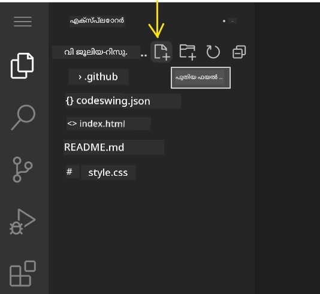

**നാമകരണം ചട്ടങ്ങൾ:**
- ഫയലിന്റെ ഉദ്ദേശ്യം വ്യക്തമാക്കുന്ന വിവരണാത്മക നാമങ്ങൾ ഉപയോഗിക്കുക  
- ശരിയായ സിന്റാക്‌സ് ഹൈലൈറ്റിംഗിനായി ഫയൽ എക്സ്റ്റൻഷനുകൾ ഉൾപ്പെടുത്തുക  
- പ്രോജക്റ്റുകളിൽ സർഗയോഗപ്രദമായ നാമകരണം പാലിക്കുക  
- സ്പെയ്‌സുകൾക്കുപകരം ലോവർക്കേസ് അക്ഷരങ്ങളും ഹൈഫനും ഉപയോഗിക്കുക  

### ഫയലുകൾ എഡിറ്റ് ചെയ്യൽ, സേവ് ചെയ്യൽ

ഇതാണ് യഥാർത്ഥ രസകരമായ സ്ഥലം! VSCode.dev-ന്റെ എഡിറ്റർ കോഡിംഗ് സുഗമവും ബുദ്ധിമാനുമായ അനുഭവമാക്കുന്ന സഹായക ഫീച്ചറുകൾ നിറഞ്ഞതാണ്. ഇത് വളരെ ബുദ്ധിമാൻ ഒരു എഴുത്തുകാരനുപോലെ, പക്ഷേ കോഡിനായി.

**നിങ്ങളുടെ എഡിറ്റിംഗ് പ്രവൃത്തി പ്രവാഹം:**

1. എക്സ്പ്ലോററിൽ ഏതെങ്കിലും ഫയൽ ക്ലിക്ക് ചെയ്ത് മുഖ്യ ഏരിയയിൽ തുറക്കുക  
2. ടൈപ്പ് ആരംഭിച്ച് VSCode.dev നിങ്ങളുടെ സഹായത്തോടെ നിറം, നിർദ്ദേശങ്ങൾ, പിശക് കണ്ടെത്തൽ എന്നിവ കാണിക്കുക  
3. Ctrl+S (Windows/Linux) അല്ലെങ്കിൽ Cmd+S (Mac) ഉപയോഗിച്ച് ജോലിസേവ് ചെയ്യുക – എന്നാൽ അത് ഓട്ടോസേവും ചെയ്യുന്നു!  

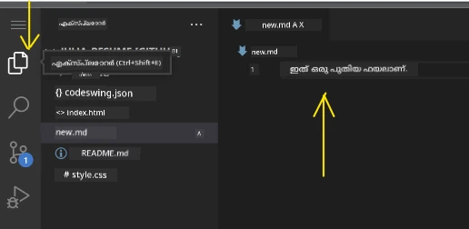

**നിങ്ങൾ കോഡ് ചെയ്യുമ്പോൾ സംഭവിക്കുന്ന കൂൾ കാര്യങ്ങൾ:**
- നിങ്ങളുടെ കോഡ് മനോഹരമായി കളർ കോഡുചെയ്യപ്പെട്ടിരിക്കുന്നു, വായിക്കാൻ എളുപ്പം  
- VSCode.dev ടൈപ്പിക്കുമ്പോൾ സജഷനുകൾ നൽകുന്നു (ഓട്ടോകറക്ട് പോലേയല്ല, അതേക്കാൾ ബുദ്ധിമാനാണ്)  
- നിങ്ങൾ രക്ഷസേവ് ചെയ്യുന്നതിനു മുൻപ് പിശകുകൾ കണ്ടെത്തുന്നു  
- ഇങ്ങനെ ബ്രൗസർ ടാബുകളായി പല ഫയലുകളും തുറക്കാം  
- എല്ലാം പൃഥകമായി പശ്ചാത്തലത്തിൽ സേവ് ചെയ്യപ്പെടുന്നു  

> ⚠️ **ദ്രുത ടിപ്പ്**: ഓട്ടോ-സേവ് ഉള്ളതിനാൽ പോലും Ctrl+S അല്ലെങ്കിൽ Cmd+S അമർത്തുന്നത് നല്ല പതിങ്ങാണ്. അത sofort പ്രവർത്തനമായി എല്ലാം സംഭരിച്ചു കൂടാതെ ചില അധിക സഹായകരമായ ഫീച്ചറുകൾ തുടക്കം കുറിക്കുന്നു, പിശക് പരിശോധിക്കൽ പോലുള്ള.

### Git ഉപയോഗിച്ച് വേർഷൻ കൺട്രോൾ

പുരാതত্ব ശാസ്ത്രജ്ഞർ ഭേദഗതി നിരീക്ഷണത്തിന് ഘട്ടങ്ങളായ രേഖകൾ സൃഷ്ടിക്കുന്ന പോലെ, ഗിറ്റ് നിങ്ങളുടെ കോഡിലെ മാറ്റങ്ങൾ സമയക്രമത്തിൽ ട്രാക്ക് ചെയ്യുന്നു. ഈ സിസ്റ്റം പ്രോജക്റ്റിന്റെ ചരിത്രം സംരക്ഷിക്കുകയും ആവശ്യമായപ്പോൾ മുൻകാല പതിപ്പുകളിലേക്ക് തിരിച്ചുപോകാനും അനുവദിക്കുന്നു. VSCode.dev ഇന്റഗ്രേറ്റഡ് Git ഫംഗ്ഷൻ ആകുന്നു.

**സോഴ്‌സ് കൺട്രോൾ ഇന്റർഫേസ്:**

1. ആക്ടിവിറ്റി ബാറിലെ 🌿 അടയാളം ഉപയോഗിച്ച് സോഴ്‌സ് കൺട്രോൾ പാനൽ തുറക്കുക  
2. മാറ്റം വരുത്തിയ ഫയലുകൾ "Changes" വിഭാഗത്തിൽ കാണാം  
3. കളർ കോഡിംഗ് മാറ്റങ്ങളുടെ തരം സൂചിപ്പിക്കുന്നു: കൂട്ടിച്ചേർത്തത് പച്ച, നീക്കംചെയ്‌തു ചുവപ്പ്  

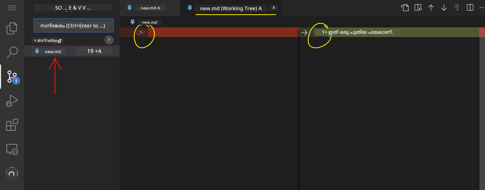

**നിങ്ങളുടെ ജോലി (കമിറ്റ് പ്രവൃത്തി പ്രവാഹം) സംരക്ഷിക്കൽ:**

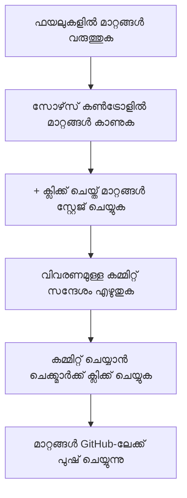
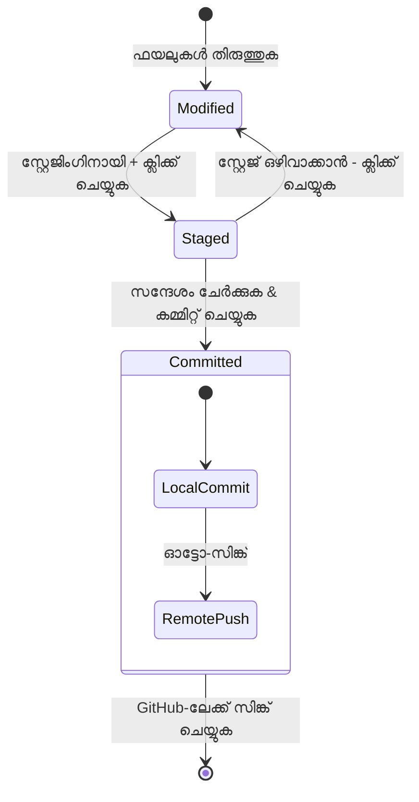
**നിങ്ങളുടെ ഘട്ടം പിന്തുടരുന്ന പ്രക്രിയ:**
- സേവ് ചെയ്യാൻ ആഗ്രഹിക്കുന്ന ഫയലുകള്‍ക്ക് അടുത്തുള്ള “+” ചിഹ്നം ക്ലിക്ക് ചെയ്യുക (ഇത് അവയെ "സ്റ്റേജിംഗ്" ആക്കുന്നു)
- നിങ്ങളുടെ സ്റ്റേജ് ചെയ്ത മാറ്റങ്ങൾ എല്ലാം നിങ്ങൾ സന്തോഷവാനാണെന്ന് ഡബിൾ-ചെക്ക് ചെയ്യുക
- നിങ്ങൾ എന്ത് ചെയ്തെന്ന് വിശദീകരിക്കുന്ന ഒരു ചെറിയ കുറിപ്പ് എഴുതുക (ഇത് നിങ്ങളുടെ "commit message" ആണ്)
- എല്ലാം GitHub-ലേക്ക് സേവ് ചെയ്യാൻ ചെക്ക്മാർക്ക് ബട്ടൺ ക്ലിക്ക് ചെയ്യുക
- നിങ്ങളൊരു കാര്യം പലമട്ടം മാറ്റാൻ ആഗ്രഹിക്കുന്നുവെങ്കിൽ, undo ഐക്കൺ മാറ്റങ്ങൾ തള്ളാൻ അനുവദിക്കുന്നു

**നല്ല commit message-കൾ എഴുതുക (ഇത് നിങ്ങൾ അനുഭവിക്കാനിരിക്കുന്നതിൽ നിന്ന് എളുപ്പമാണ്!):**
- നിങ്ങൾ എന്ത് ചെയ്തുവെന്ന് വിവരിക്കുക, ഉദാഹരണത്തിന് "Add contact form" അല്ലെങ്കിൽ "Fix broken navigation"
- അത് ചെറിയതും ഒരു ട്ട്വീറ്റ് നീളമതും ആക്കുക, ഒരു ലേഖനമല്ലാതെ
- "Add", "Fix", "Update", അല്ലെങ്കിൽ "Remove" പോലുള്ള ക്രിയാപദങ്ങൾ ഉപയോഗിച്ച് തുടങ്ങുക
- **നല്ല ഉദാഹരണങ്ങൾ**: "Add responsive navigation menu", "Fix mobile layout issues", "Update colors for better accessibility"

> 💡 **പെട്ടെന്ന് നാവിഗേഷൻ ടിപ്**: നിങ്ങളുടെ GitHub സംഭരണശാലയിലേക്ക് തിരിച്ച് പോകാൻ മുകളിൽ ഇടതു ഭൂരിപക്ഷത്തിൽ ഹംബർഗർ മെനു (☰) ഉപയോഗിക്കുക. ഇത് നിങ്ങളുടെ എഡിറ്റിംഗ് പരിസ്ഥിതിയും നിങ്ങളുടെ പ്രോജക്റ്റിന്റെ GitHub ഹോവും തമ്മിലുള്ള ഒരു പോർട്ടൽ പോലെയാണ്!

## വിപുലീകരണങ്ങളുമായി ഫังก്ഷണാലിറ്റി മെച്ചപ്പെടുത്തൽ

ഒരു കരകൗശലക്കാരനായ ശരിയായ ആൾക്കാർ ഉപകരണശാലയിൽ വ്യത്യസ്തകാര്യങ്ങൾക്ക് പ്രത്യേക യന്ത്രങ്ങൾ ഉണ്ടാക്കുന്നത് പോലെ, VSCode.dev-ൽ നിങ്ങൾക്ക് പ്രത്യേക ശേഷികൾ ചേർക്കുന്ന വിപുലീകരണങ്ങളുമായി ഇഷ്‌ടാനുസൃതീകരണം സാധ്യമാണ്. ഈ സമൂഹം വികസിപ്പിച്ച പ്ലഗിനുകൾ കോഡ് ഫോർമാറ്റിംഗ്, ലൈവ് പ്രിവ്യൂ, മെച്ചപ്പെട്ട Git ഇന്റഗ്രേഷനു പോലുള്ള സാധാരണ വികസന ആവശ്യങ്ങൾ പരിഹരിക്കുന്നു.

വിപുലീകരണ മാർക്കറ്റ്‌പ്ലെയ്‌സ് ലോകമാകെയുള്ള ഡവലപ്പർമാർ സൃഷ്ടിച്ച ആയിരക്കണക്കിന് സൗജന്യ ഉപകരണങ്ങൾ ഹോസ്റ്റ് ചെയ്യുന്നു. ഓരോ വിപുലീകരണവും Workflow-ന്റെ പ്രത്യേക ചാലഞ്ചുകൾ പരിഹരിക്കുന്നത് കൊണ്ട് നിങ്ങൾക്ക് നിങ്ങളുടെ വ്യക്തിഗത ആവശ്യങ്ങൾക്കും ഇഷ്ടങ്ങൾക്കുമനുസൃതമായി ഒരു വ്യക്തിഗത ഡവലപ്പ്മെന്റ് പരിസ്ഥിതി നിർമ്മിക്കാന് സാധിക്കും.

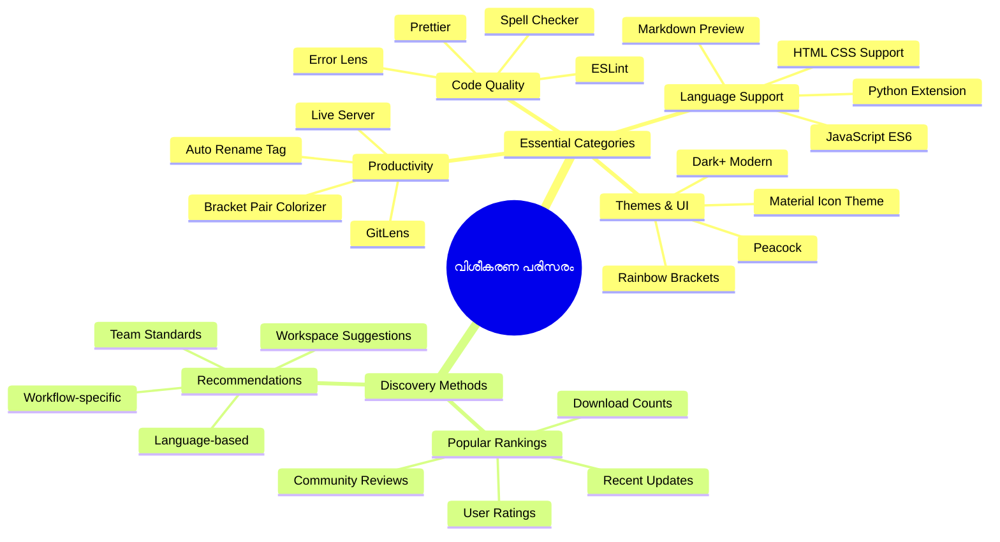
### നിങ്ങളുടെ അനുയോജ്യമായ വിപുലീകരണങ്ങൾ കണ്ടെത്തൽ

വിപുലീകരണ മാർക്കറ്റ്‌പ്ലേസ് വളരെ നന്നായി ക്രമീകരിച്ചിട്ടുള്ളതിനാൽ, നിങ്ങൾക്ക് ആവശ്യമുള്ളത് കണ്ടെത്താൻ വഴിതെറ്റാതെ പോകില്ല. ഇത് നിങ്ങൾ അറിയാത്ത തികച്ചും പുതിയ ഉപകരണങ്ങളും പ്രത്യേക ഉപകരണങ്ങളും കണ്ടെത്താൻ സഹായിക്കുന്നു!

**മാർക്കറ്റ്‌പ്ലേസ് കാണാൻ:**

1. Activity Bar-ൽ Extensions ഐക്കണിൽ (🧩) ക്ലിക്ക് ചെയ്യുക
2. ചുറ്റുമുളളത് പരീക്ഷിക്കുക അല്ലെങ്കിൽ ഒരു പ്രത്യേകതു തിരയുക
3. ഇന്ററെസ്റ്റിങ്ങ് പോലെ തോന്നുന്നതിൽ ക്ലിക്ക് ചെയ്യുക കൂടുതൽ അറിയാൻ

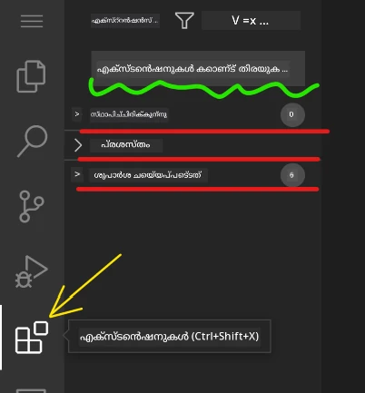

**ഇവിടെ നിങ്ങൾ കാണുന്നതെന്ത്:**

| വിഭാഗം | ഉള്ളടക്കം | അത് എങ്ങനെ സഹായകരം |
|----------|---------|----------|
| **Installed** | നിങ്ങൾ ഇതിനകം ചേർത്ത വിപുലീകരണങ്ങൾ | നിങ്ങളുടെ വ്യക്തിഗത കോഡിംഗ് ഉപകരണങ്ങൾ |
| **Popular** | ജനപ്രിയമായവ | ഭൂരിഭാഗം ഡവലപ്പർമാർ വിശ്വസിക്കുന്നതു |
| **Recommended** | നിങ്ങളുടെ പ്രോജക്റ്റിനുള്ള ബുദ്ധിമുട്ടുകളും | VSCode.dev-യുടെ സഹായകരമായ ശുപാർശകൾ |

**ബ്രൗസിംഗ് എളുപ്പമാക്കുന്നവ:**
- ഓരോ വിപുലീകരണവും റേറ്റింగുകൾ, ഡൗൺലോഡ് എണ്ണം, യഥാർത്ഥ ഉപയോക്തൃ റവ്യൂസ് കാണിക്കുന്നു
- സ്ക്രീൻഷോട്ടുകളും അതിന്റെ പ്രവർത്തനം വിശദീകരിക്കുന്ന ക്ലിയർ വിവരണവും ലഭ്യമാണ്
- എല്ലാം കംപാറ്റിബിലിറ്റിയുടെ വിവരങ്ങളോടുകൂടിയാണ് նշിക്കപ്പെട്ടിരിക്കുന്നത്
- സമാനമായ വിപുലീകരണങ്ങൾ നിർദ്ദേശിക്കുന്നു താങ്കൾക്ക് ഓപ്ഷനുകൾ താരതമ്യം ചെയ്യാൻ

### വിപുലീകരണങ്ങൾ ഇൻസ്റ്റാൾ ചെയ്യൽ (ഇത് വളരെ എളുപ്പം!)

നിങ്ങളുടെ എഡിറ്ററിന് പുതിയ സവിശേഷതകൾ കൂട്ടിച്ചേർക്കുന്നത് ഒരു ബട്ടൺ അമർത്തുന്നതുപോലെ എളുപ്പമാണ്. വിപുലീകരണങ്ങൾ സെക്കൻഡുകൾക്കുള്ളിൽ ഇൻസ്റ്റാൾ ചെയ്ത് ഉടൻ തന്നെ പ്രവർത്തിക്കാൻ തുടങ്ങി – പുനരാരംഭം, കാത്തിരിപ്പ് ഇല്ല.

**നിങ്ങൾ ചെയ്യേണ്ടത്:**

1. നിങ്ങൾക്ക് ആഗ്രഹിച്ചു കണ്ടുപിടിക്കുക ("live server" അല്ലെങ്കിൽ "prettier" എന്നിവ പരീക്ഷിക്കാം)
2. ഇഷ്ടപ്പെട്ട ഒരു വിപുലീകരണത്തിൽ ക്ലിക്ക് ചെയ്ത് കൂടുതൽ വിവരങ്ങൾ കാണുക
3. ഇത് എന്ത് ചെയ്യുന്നതാണെന്ന് വായിക്കൂ, റേറ്റിങ്ങുകളും പരിശോധിക്കൂ
4. ആ നീല "Install" ബട്ടൺ അമർത്തിയാൽ തീർന്നു!


**പിന്നിലെ പ്രക്രിയ:**
- വിപുലീകരണം ഡൗൺലോഡ് ചെയ്ത് സ്വന്തം ക്രമീകരണങ്ങൾ സ്വയം നടത്തുന്നു
- പുതിയ സവിശേഷതകൾ ഉടൻ നിങ്ങളുടെ ഇന്റർഫേസിൽ പ്രത്യക്ഷപ്പെടുന്നു
- എല്ലാം ഉടൻ പ്രവർത്തനം ആരംഭിക്കുന്നു (ഗൗരവമായി, അത്ര വേഗത്തിലാണ്!)
- നിങ്ങൾ സൈൻ ഇൻ ചെയ്താൽ, വിപുലീകരണം എല്ലാ ഉപകരണങ്ങളിലും സിങ്ക് ചെയ്യപ്പെടും

**ഞാൻ ആരംഭിക്കാൻ ശുപാർശ ചെയ്യുന്ന ചില വിപുലീകരണങ്ങൾ:**
- **Live Server**: നിങ്ങൾ കോഡ് ചെയ്യുമ്പോൾ വെബ്സൈറ്റ് റിയൽ ടൈമിൽ അപ്‌ഡേറ്റ് കാണാൻ (ഇത് അതിശയകരമാണ്!)
- **Prettier**: നിങ്ങളുടെ കോഡ് സുതാര്യവും പ്രൊഫഷണലായും ഓട്ടോമാറ്റിക്കായി രൂപപ്പെടുത്തുന്നു
- **Auto Rename Tag**: ഒരു HTML ടാഗ് മാറ്റുമ്പോൾ അതിന്റെ പങ്കാളിയും അപ്ഡേറ്റ് ചെയ്യും
- **Bracket Pair Colorizer**: നിങ്ങളുടെ ബ്രാക്കറ്റുകൾക്കും നിറം കൊടുക്കുന്നു, തിരക്കുഴക്കും ഒരുപാട് ദൂരമാണ്
- **GitLens**: Git ഫീച്ചറുകൾക്ക് ഉയർന്നuserinfoയും സഹായകരമായ വിവരങ്ങളും നൽകുന്നു

### നിങ്ങളുടെ വിപുലീകരണങ്ങളെ ഇഷ്‌ടാനുസൃതമാക്കുക

അറുപതുകൂടെ വിപുലീകരണങ്ങൾ ക്രമീകരണങ്ങൾ നിങ്ങളുടെ ഇഷ്‌ടാനുസരണമായി മാറ്റാൻ അനുവദിക്കുന്നു. ഇത് ഒരു കാറിലെ സീറ്റും മിററും ക്രമീകരിക്കുന്നതുപോലെ ആണ് – ഓരോരുത്തർക്കും തങ്ങളുടെ ഇഷ്ടങ്ങൾ കാണാം!

**വിപുലീകരണ ക്രമീകരണങ്ങൾ ഇങ്ങനെ ഭേദഗതി ചെയ്യാം:**

1. Extensions പാനലിൽ നിങ്ങളുടെ ഇൻസ്റ്റാൾ ചെയ്ത വിപുലീകരണം കണ്ടെത്തുക
2. അതിന്റെ പേരിനടിയിൽ ചെറിയ ഗിയർ ഐക്കൺ (⚙️) കാണുക, അതിൽ ക്ലിക്ക് ചെയ്യുക
3. പൊപ്പ്-ഡൗൺ മെനുവിൽ നിന്ന് "Extension Settings" തിരഞ്ഞെടുക്കുക
4. നിങ്ങൾക്ക് ഇഷ്ടപ്പെട്ട രീതിയിൽ ക്രമീകരണം ഇങ്ങനെ മാറ്റുക

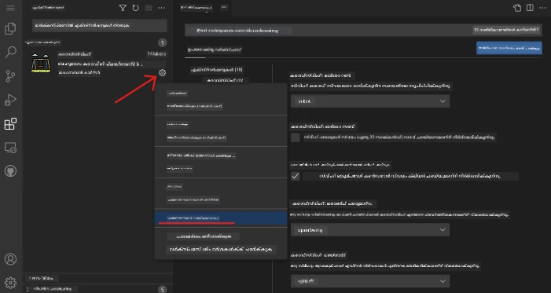

**സാധാരണയായി മാറ്റം വരുത്താൻ സാധ്യതയുള്ളതുകൾ:**
- നിങ്ങളുടെ കോഡിന്റെ ഫോർമാറ്റിംഗ് (ടാബുകൾ vs സ്പേസുകൾ, ലൈനിന്റെ നീളം തുടങ്ങിയവ)
- വ്യത്യസ്ത പ്രവർത്തനങ്ങൾ ട്രിഗർ ചെയ്യുന്ന കീബോർഡ് ഷോർട്ട്കട്ടുകൾ
- എങ്ങനെ ഫയൽ തരം വിപുലീകരണം ഫലപ്രദമാകണം
- പ്രത്യേക സവിശേഷതകൾ ഓണോ ഓഫ് ചെയ്യുന്നതിലൂടെ വിന്യാസം സുതാര്യമാക്കുക

### നിങ്ങളുടെ വിപുലീകരണങ്ങൾ ക്രമപ്പെടുത്തി സൂക്ഷിക്കൽ

കൂടുതൽ കണ്ണികളുള്ള വിപുലീകരണങ്ങൾ കണ്ടെത്തുമ്പോൾ, അവയുമായി ഉറപ്പിക്കുകയും സുഗമമായി പ്രവർത്തിക്കുകയും ചെയ്യണം. VSCode.dev ഇതു വളരെ എളുപ്പമാക്കുന്നു.

**നിങ്ങളുടെ വിപുലീകരണ സംരക്ഷണ ഓപ്ഷനുകൾ:**

| ചെയ്യാൻ കഴിയുന്നത് | സഹായകരമാകുന്നത് | പ്രോ ടിപ് |
|--------|---------|----------|
| **Disable** | ഒരു വിപുലീകരണത്തിൽ പ്രശ്നങ്ങളുണ്ടോയെന്ന് പരിശോധിക്കുമ്പോൾ | പിന്നീട് വീണ്ടും ആവശ്യമുള്ളപ്പോൾ പൂർണമായും അൺഇൻസ്റ്റാൾ ചെയ്യുന്നത് baino നല്ലത് |
| **Uninstall** | ആവശ്യവതല്ലാത്ത വിപുലീകരണങ്ങൾ പൂര്‍ണമായും നീക്കം ചെയ്യുമ്പോൾ | നിങ്ങളുടെ പരിസ്ഥിതി ശുദ്ധവും ഫാസ്റ്റുമാക്കി സൂക്ഷിക്കും |
| **Update** | ഏറ്റവും പുതിയ സവിശേഷതകളും പിഴവിൻ പരിഹാരങ്ങളും നേടുക | സാധാരണയായി സ്വയം സംഭവിക്കും, പക്ഷേ പരിശോധിക്കുന്നത് നല്ലതാണ് |

**ഞാൻ എങ്ങനെ വിപുലീകരണങ്ങൾ നിരന്തരം നിയന്ത്രിക്കുന്നു:**
- ചില മാസങ്ങൾക്ക് ഒന്നു ഞാൻ എനിക്ക് ഇൻസ്റ്റാൾ ചെയ്തതു അവലോകനം ചെയ്ത് ഉപയോഗിക്കാത്തത് നീക്കം ചെയ്യുന്നു
- വിപുലീകരണങ്ങൾ അപ്ഡേറ്റ് ചെയ്തുവെച്ചാൽ പുതിയ മെച്ചപ്പെടുത്തലുകളും സുരക്ഷാ പരിഹാരങ്ങളും എടുക്കുന്നു
- ഒന്നും മന്ദഗതിയാണെങ്കിൽ, താൽക്കാലികമായി പ്രധാനവിപുലീകരണങ്ങൾ ഡിസ്‌എബിൾ ചെയ്ത് കാരണമുള്ളതാണോ എന്ന് പരിശോധിക്കുന്നു
- വിപുലീകരണങ്ങൾക്ക് വൻ അപ്ഡേറ്റ് വന്നാൽ, അപ്ഡേറ്റ് നോട്ടുകൾ വായിക്കുന്നു – ചിലപ്പോൾ പുതിയ മനോഹരമായ സവിശേഷതകളും കാണാം!

> ⚠️ **പരീക്ഷണസൂചന**: വിപുലീകരണങ്ങൾ മികച്ചതാണ്, പക്ഷേ വളരെ അധികം ആണെങ്കിൽ പ്രകടനം മന്ദഗതിയാകും. നിങ്ങളുടെ ജീവിതം വാസ്തവത്തിൽ മെച്ചപ്പെടുത്തുന്നവയിൽ മാത്രം ശ്രദ്ധ കേന്ദ്രീകരിക്കുക, ഉപയോഗിക്കാത്തവിടെ uninstall ചെയ്യുന്നതിൽ ഭയം വേണ്ട.

### 🎯 പാഠധാരാമിക ചെക്ക്-ഇൻ: വികസന പരിസ്ഥിതി ഇഷ്‌ടാനുസൃതീകരണം

**ആർക്കിടെക്ചർ ഗ്രഹണം**: സമൂഹം വികസിപ്പിച്ച വിപുലീകരണങ്ങൾ ഉപയോഗിച്ച് ഒരു പ്രൊഫഷണൽ ഡവലപ്പ്മെന്റ് പരിസ്ഥിതി ഇഷ്‌ടാനുസൃതമാക്കാൻ പഠിച്ചു. ഇത് എങ്ങനെ എന്റർപ്രൈസ് ഡവലപ്പ്മെന്റ് ടീമുകൾ സാധാരണ ടീം ഇൻഫ്രാസ്ട്രക്ചർ സ്ഥാനങ്ങൾ നിർമ്മിക്കാറുണ്ട് എന്നും പ്രതിഫലിപ്പിക്കുന്നു.

**പ്രധാന ആശയങ്ങൾ**:
- **വിപുലീകരണ കണ്ടെത്തൽ**: വികസനത്തിനുള്ള പ്രത്യേക പ്രശ്നങ്ങൾ പരിഹരിക്കുന്ന ഉപകരണങ്ങൾ കണ്ടെത്തുക
- **പരിസ്ഥിതി ക്രമീകരണം**: വ്യക്തിഗത അല്ലെങ്കിൽ ടീമിന്റെ ഇഷ്ടാനുസരണം ഉപകരണങ്ങൾ ഇഷ്‌ടാനുസൃതമാക്കുക
- **പ്രകടന മെച്ചപ്പെടുത്തൽ**: ഫംഗ്ഷണാലിറ്റി സിസ്റ്റം പ്രകടനത്തോടൊപ്പം തുല്യവലക്കിൽ നിർത്തുക
- **സമൂഹ സഹകരണം**: ആഗോള ഡവലപ്പർ സമൂഹം സൃഷ്ടിച്ച ഉപകരണങ്ങൾ പ്രയോജനം ചെയ്യുക

**വ്യവസായ ബന്ധം**: വിൻകോടിന്റെ വിപുലീകരണ പരിസ്ഥിതി പ്രധാന ഡവലപ്പ്മെന്റ് പ്ലാറ്റ്ഫോമുകൾക്ക് പ്രവർത്തനം നൽകുന്നു, വളരെയധികം പ്രൊഫഷണൽ ഡവലപ്പർ പ്രവൃത്തികൾക്ക് അത്യാവശ്യമാണ്.

**അന്വേഷണ ചോദ്യങ്ങൾ**: 10 ഡവലപ്പർമാർ ഉള്ള ഒരു ടീമിനായി സാധാരണ ഡവലപ്പ്മെന്റ് പരിസ്ഥിതി എങ്ങനെ സജ്ജമാക്കും? സ്ഥിരത, പ്രകടനം, വ്യക്തിഗത ഇഷ്ടങ്ങൾ എന്നിവ പരിഗണിക്കുക.

## 📈 നിങ്ങളുടെ ക്ലൗഡ് ഡവലപ്പ്മെന്റ് നൈപുണ്യ ടൈംലൈൻ

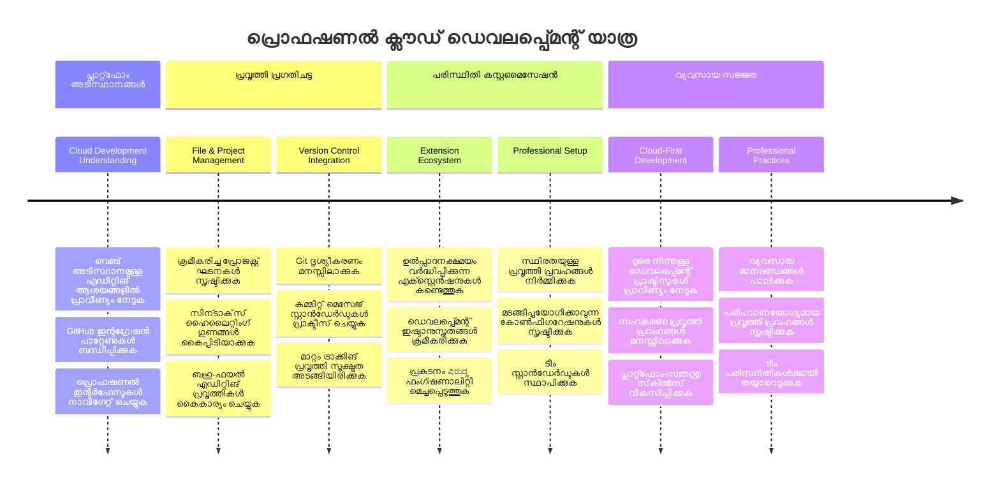
**🎓 പാസ്സിംഗ് മൈൽസ്റ്റോൺ**: വലിയ ടെക്ക് കമ്പനികളിലെ പ്രൊഫഷണൽ ഡവലപ്പർമാർ ഉപയോഗിക്കുന്ന സമാനമായ ഉപകരണങ്ങളും workflowകളും ഉപയോഗിച്ച് ക്ലൗഡ് അധിഷ്ഠിത വികസനത്തിൽ നിങ്ങൾ വിജയം സാദ്ധിച്ചിരിക്കുന്നു. ഈ കഴിവുകൾ സോഫ്റ്റ്‌വെയർ വികസനത്തിന്റെ ഭാവിയെ പ്രതിനിധാനം ചെയ്യുന്നു.

**🔄 അടുത്ത തല തലത്തിലുള്ള കഴിവുകൾ**:
- ഉയർന്ന ക്ലൗഡ് ഡവലപ്പ്മെന്റ് പ്ലാറ്റ്‌ഫോമുകൾ (Codespaces, GitPod) പരീക്ഷിക്കാൻ തയ്യാറാകുക
- വിഭജിച്ച ഡവലപ്പ്മെന്റ് ടീമുകളിൽ ജോലി ചെയ്യാൻ പാഠം പഠിക്കുക
- ആഗോളമായി ഓപ്പൺ സോഴ്സ് പ്രോജക്റ്റുകളിൽ സംഭാവന നടത്താൻ സജ്ജമാകുക
- ആധുനിക DevOps, തുടർച്ചയായ ഇന്റഗ്രേഷൻ പ്രവർത്തനങ്ങൾക്ക് അടിസ്ഥാനം ഉറപ്പ് വരുത്തുക

## GitHub Copilot ഏജന്റ് ചാലഞ്ച് 🚀

NASA ബഹിരാകാശ മിഷനുകൾക്ക് സ്വീകരിക്കുന്ന ഘടനാപരമായ സമീപനം പോലെ, ഈ ചാലഞ്ച് VSCode.dev കഴിവുകൾ സമഗ്രമായ workflow സ്കenario-വിൽ പ്രയോഗിക്കുന്നതാണ്.

**ലക്ഷ്യം:** VSCode.dev ഉപയോഗത്തിൽ പ്രാവീണ്യം തെളിയിച്ച് സമ്പൂർണ്ണ വെബ് ഡവലപ്പ്മെന്റ് workflow സ്ഥാപിക്കുക.

**പ്രോജക്റ്റ് ആവശ്യകതകൾ:** ഏജന്റ് മോഡിൽ സഹായത്തോടെ ഈ പ്രവർത്തനങ്ങൾ പൂർത്തിയാക്കുക:
1. നിലവിലുള്ള ഒരു റിപ്പോസിറ്ററി ഫോർക്ക് ചെയ്യുക അല്ലെങ്കിൽ പുതിയത് സൃഷ്ടിക്കുക
2. HTML, CSS, JavaScript ഫയലുകൾ അടങ്ങിയ ഒരു പ്രവർത്തനക്ഷമ പ്രോജക്റ്റ് ഘടന സ്ഥാപിക്കുക
3. മൂന്ന് വികസനം മെച്ചപ്പെടുത്തുന്ന വിപുലീകരണങ്ങൾ ഇൻസ്റ്റാൾ ചെയ്ത് ക്രമീകരിക്കുക
4. വിവരണാത്മക commit message-കളോടുള്ള പതിപ്പു നിയന്ത്രണം അഭ്യസിക്കുക
5. feature branch സൃഷ്ടിക്കലും മാറ്റം വരുത്തലും പരീക്ഷിക്കുക
6. പ്രക്രിയയും പഠനങ്ങളും README.md ല് രേഖപ്പെടുത്തുക

ഈ അഭ്യാസം VSCode.dev ആശയങ്ങൾ സാരാംശമാക്കി ഭാവിയിലെ വികസന പദ്ധതികളിൽ പ്രയോഗിക്കാവുന്ന ഒരു workflow ആയി ഏകീകൃതമാക്കുന്നു.

[എജന്റ് മോഡ്](https://code.visualstudio.com/blogs/2025/02/24/introducing-copilot-agent-mode) കുറിച്ച് കൂടുതൽ അറിയുക.

## അസൈൻമെന്റ്

ഇപ്പൊഴാണ് ഈ കഴിവുകൾ ട്രക്ക് ഡ്രൈവ് ചെയ്യാനുള്ള സമയം! ഞാൻ നിങ്ങൾക്ക് മുഴുവൻ പറഞ്ഞുതീര്‍ന്ന വിഷയങ്ങൾ പ്രായോഗികമായി അഭ്യാസം ചെയ്യാൻ കഴിയും ഒരു പ്രോജക്റ്റ് കൊടുത്തിരിക്കുന്നു: [VSCode.dev ഉപയോഗിച്ച് റീസ്യൂം വെബ്സൈറ്റ് സൃഷ്ടിക്കുക](./assignment.md)

ഈ അസൈൻമെന്റ് നിങ്ങൾ ബ്രൗസറിൽ പ്രൊഫഷണൽ റീസ്യൂം വെബ്സൈറ്റ് നിർമ്മിക്കാൻ സഹായിക്കും. നിങ്ങൾ പഠിച്ച എല്ലാ ഫീച്ചറുകളും ഇവിടെ ഉപയോഗിക്കും, അവസാനം നിങ്ങൾക്ക് ഒരു മനോഹരമായ വെബ്സൈറ്റ് കൂടാതെ പുതിയ workflow-ൽ ഉറച്ച വിശ്വാസവും ലഭിക്കും.

## തുടരുക പഠിക്കുക, കഴിവുകൾ വളർത്തുക

നിങ്ങൾക്ക് ഇപ്പോൾ ഒരു ഉറച്ച അടിസ്ഥാനം ലഭിച്ചിരിക്കുന്നു, പക്ഷേ ശേഖരിക്കാനുള്ള ധാരാളം മറ്റും ഉണ്ട്! നിങ്ങളുടെ VSCode.dev കഴിവുകൾ അടുത്ത തലത്തിലേക്ക് എത്തിക്കാൻ ചില വാചകങ്ങളും ആശയങ്ങളും ഇങ്ങുണ്ട്:

**ബുക്ക്മാർക്ക് ചെയ്യാൻ വാച്യമായ ഔദ്യോഗിക ഡോകുമെന്റുകൾ:**
- [VSCode വെബ് ഡോകുമെന്റേഷൻ](https://code.visualstudio.com/docs/editor/vscode-web?WT.mc_id=academic-0000-alfredodeza) – ബ്രൗസർ അടിസ്ഥാനത്തിലുള്ള എഡിറ്റിംഗിന് പൂര്‍ണ ഗൈഡ്
- [GitHub Codespaces](https://docs.github.com/en/codespaces) – ക്ലൗഡിൽ കൂടുതൽ ശക്തി ആവശ്യമുള്ളവർക്ക്

**തദന്തര പരീക്ഷിക്കാൻ മനോഹരമായ സവിശേഷതകൾ:**
- **കീബോർഡ് ഷോർട്ട്കട്ടുകൾ**: കോഡിംഗ് നിൻജയെന്നു തോന്നിക്കുന്ന കീ കോംബൊസുകൾ പഠിക്കുക
- **വർക്ക്സ്പേസ് ക്രമീകരണങ്ങൾ**: വ്യത്യസ്ത തരം പ്രോജക്റ്റുകൾക്ക് വ്യത്യസ്ത പരിസ്ഥിതികൾ ക്രമീകരിക്കുക
- **മൾട്ടി-റൂട്ട് വർക്ക്സ്പേസുകൾ**: ഒരേസമയം പല റിപ്പോസിറ്ററികളിലും ജോലി ചെയ്യുക (മിക്കവാറും സഹായകരം!)
- **ടെർമിനൽ ഇന്റഗ്രേഷൻ**: ബ്രൗസർ തന്നെ CLI ഉപകരണങ്ങൾ ഉപയോഗിക്കാൻتيح ചെയ്യുക

**അഭ്യാസത്തിന് ആശയങ്ങൾ:**
- ചില ഓപ്പൺ സോഴ്സ് പ്രോജക്റ്റുകളിലേക്ക് ചാടിക്കയറി VSCode.dev ഉപയോഗിച്ച് സംഭാവന നൽകുക – തിരിച്ചടിയാകുന്ന നല്ല മാർഗം!
- വ്യത്യസ്ത വിപുലീകരണങ്ങൾ പരീക്ഷിച്ച് നിങ്ങളുടെ അനുയോജ്യമായ സജ്ജീകരണം കണ്ടെത്തൂ
- നിങ്ങൾ എപ്പോഴും നിർമ്മിക്കാൻ ഇഷ്ടപ്പെടുന്ന സൈറ്റ് ടേംപ്ലേറ്റുകൾ സൃഷ്ടിക്കുക
- Git workflow-കൾ വിശകലനം ചെയ്യുക – branch, merge തുടങ്ങിയവ അഭ്യസിക്കുക – ഇത് ടീമ്കൾക്ക് സുവർണമാണ്

---

**നിങ്ങൾ ബ്രൗസർ അടിസ്ഥാനത്തിലുള്ള ഡവലപ്പ്മെന്റ് അവലംബിച്ചു!** 🎉 പോർട്ടബിൾ ഉപകരണങ്ങളുടെ കണ്ടുപിടിത്തം ശാസ്ത്രജ്ഞർക്കു ദൂരം പ്രസ്ഥാനങ്ങളിൽ ഗവേഷണം നടത്താൻ സഹായിച്ചതുപോലെ, VSCode.dev പ്രൊഫഷണൽ കോഡിംഗ് ഏതൊരു ഇന്റർനെറ്റ് കണക്റ്റ് ചെയ്ത ഉപകരണത്തിലുമാകും സാധ്യമാക്കുന്നു.

ഈ നൈപുണ്യങ്ങൾ നിലവിലെ വ്യവസായ പരിപാടികൾ പ്രതിഫലിപ്പിക്കുന്നു – പല പ്രൊഫഷണൽ ഡവലപ്പർമാരും അവരുടെ സൗകര്യത്തിനും പ്രാപ്യതയ്ക്കുമായി ക്ലൗഡ് അടിസ്ഥാന വികസന പരിസ്ഥിതികൾ ഉപയോഗിക്കുന്നു. നിങ്ങൾ പഠിച്ച workflow വ്യക്തിഗത പ്രോജക്റ്റുകളിൽ നിന്ന് വലിയ ടീമുകളിലേക്കുള്ള സഹകരണങ്ങളിലേക്കും വ്യാപിക്കുന്നത് കാണാം.

ഈ സാങ്കേതിക വിദ്യകൾ നിങ്ങളുടെ അടുത്ത വികസന പ്രോജക്റ്റിൽ പ്രയോഗിക്കുക! 🚀

---

<!-- CO-OP TRANSLATOR DISCLAIMER START -->
**അസാധുവാക്കല്‍**:  
ഈ രേഖ AI ഭാഷാന്തര സേവനം [കോ-ഓപ് ട്രാൻസ്ലേറ്റർ](https://github.com/Azure/co-op-translator) ഉപയോഗിച്ച് ഭാഷാന്തരപ്പെടുത്തിയതാണ്. നമുക്ക് കൃത്യതയ്ക്കായി ശ്രമിക്കുകയുള്ളതു കൊണ്ട്, സ്വയമാറ്റം ചെയ്യപ്പെട്ട ഭാഷാന്തരത്തിലാണ് പിശകുകൾ അല്ലെങ്കിൽ തെറ്റായ വിവരം ഉണ്ടായേക്കാവുന്നതെന്ന് ദയവായി ശ്രദ്ധിക്കുക. പ്രാഥമികമായി, ഈ രേഖയുടെ സ്വന്തം ഭാഷയിലുള്ള പരമാധികാര ഉറവിടമായി കണക്കാക്കണം. അത്യന്താപേക്ഷിത വിവരങ്ങൾക്ക്, പ്രൊഫഷണൽ മനുഷ്യ ഭാഷാന്തരം ശുപാർശ ചെയ്യുന്നു. ഈ ഭാഷാന്തരത്തിന്റെ ഉപയോഗത്തിൽ നിന്നുണ്ടാകുന്ന തെറ്റായ വ്യാഖ്യാനങ്ങൾക്കോ തെറ്റിദ്ധാരണകൾക്കോ ഞങ്ങൾ ഉത്തരവാദിത്വം ചുമത്തുന്നില്ല.
<!-- CO-OP TRANSLATOR DISCLAIMER END -->