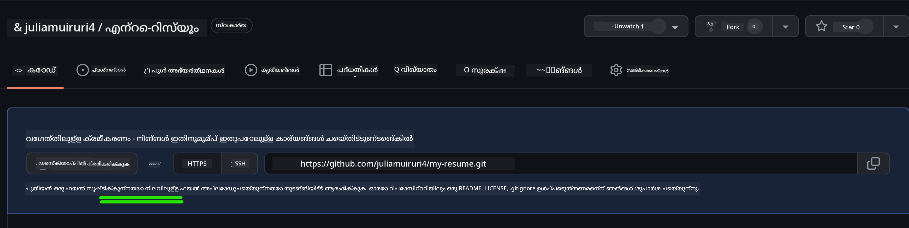
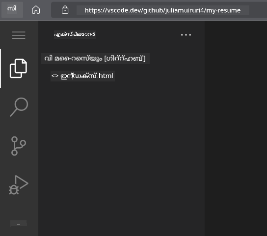
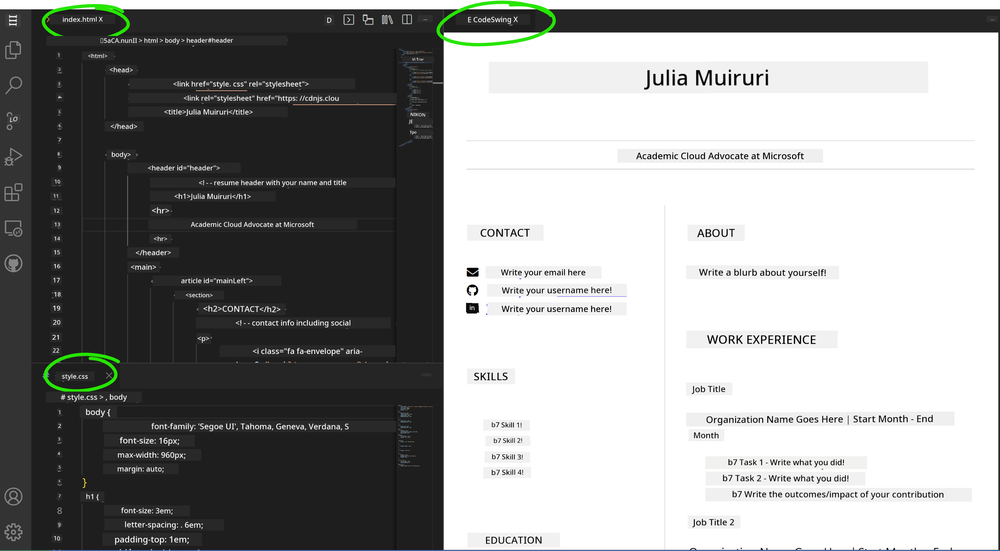

<!--
CO_OP_TRANSLATOR_METADATA:
{
  "original_hash": "effe56ba51c38d7bdfad1ea38288666b",
  "translation_date": "2026-01-08T13:23:21+00:00",
  "source_file": "8-code-editor/1-using-a-code-editor/assignment.md",
  "language_code": "ml"
}
-->
# VSCode.dev ഉപയോഗിച്ച് ഒരു റിസ്യൂം വെബ്സൈറ്റ് സൃഷ്ടിക്കുക

നിങ്ങളുടെ കഴിവുകളും അനുഭവവും ആധുനിക, ഇടപെടൽ സജ്ജമായ രൂപത്തില്‍ പ്രദര്‍ശിപ്പിക്കുന്ന പ്രൊഫഷണൽ റിസ്യൂം വെബ്സൈറ്റ് നിർമ്മിച്ച് നിങ്ങളുടെ കരിയർ സാധ്യതകൾ മാറ്റിമറിക്കുക. പാരമ്പര്യമായ PDF കളെ അയക്കുന്നതിനുപകരം, റിക്രൂട്ടർമാർക്ക് നിങ്ങളുടെ യോഗ്യതകളും വെബ് ഡെവലപ്പ്മെന്റ് കഴിവുകളും തെളിയിക്കുന്ന ഒരു സ്ലീക്ക്, റെസ്പോൺസീവ് വെബ്സൈറ്റ് നൽകുന്നതായി കരുതുക.

ഈ ഹാൻഡ്‌സ്-ഓൺ അസൈൻമെന്റ് നിങ്ങളുടെ എല്ലാ VSCode.dev കഴിവുകളും പ്രയോജനം ചെയ്യവച്ചുകൊണ്ട് നിങ്ങളുടെ കരിയറിനുള്ള വാസ്തവമായ സഹായകാരിയായ ഒന്നിനെ സൃഷ്ടിക്കും. നിങ്ങൾ റിപോസിറ്ററി സൃഷ്ടിച്ച് ഡിപ്ലോയ് ചെയ്യുന്നതു വരെയുള്ള മുഴുവൻ വെബ് ഡെവലപ്പ്മെന്റ് പ്രവണത സഹజമായി ബ്രൗസറിൽ തന്നെ അനുഭവിക്കും.

ഈ പ്രോജക്ട് പൂർത്തിയാക്കിയാൽ, നിങ്ങൾക്കൊരു പ്രൊഫഷണൽ ഓൺലൈൻ സാന്നിദ്ധ്യവും ലഭിക്കും, അത് ചുരുക്കി പങ്കിടാനും നിങ്ങളുടെ കഴിവുകൾ വർദ്ധിക്കുമ്പോൾ അപ്ഡേറ്റ് ചെയ്യാനും വ്യക്തിഗത ബ്രാൻഡിനൊത്ത് അനുകൂലമാക്കാനും സാധിക്കും. இது യഥാർത്ഥ ലോക വെബ് ഡെവലപ്പ്മെന്റ് കഴിവുകൾ പ്രകടിപ്പിക്കുന്ന ഒരു പ്രായോഗിക പ്രോജക്ടാണ്.

## പഠന ലക്ഷ്യങ്ങൾ

ഈ അസൈൻമെന്റ് പൂർത്തിയാക്കിയ ശേഷം, നിങ്ങൾക്ക് കഴിയും:

- **VSCode.dev ഉപയോഗിച്ച്** ഒരു പൂര്‍ണമായ വെബ് ഡെവലപ്പ്മെന്റ് പ്രോജക്ട് സൃഷ്ടിക്കുകയും നിയന്ത്രിക്കുകയും ചെയ്യാൻ
- **സെമാന്റിക് HTML ഘടകങ്ങൾ ഉപയോഗിച്ച്** ഒരു പ്രൊഫഷണൽ വെബ്സൈറ്റ് ഘടിപ്പിക്കാൻ
- **ആധുനിക CSS സാങ്കേതിക വിദ്യകളിലൂടെ** റെസ്പോൺസീവ് ലേയൗട്ട് സ്റ്റൈൽചെയ്യാൻ
- **അടിസ്ഥാന വെബ് സാങ്കേതിക വിദ്യകൾ ഉപയോഗിച്ച്** ഇടപെടൽ സവിശേഷതകൾ നടപ്പാക്കാൻ
- **വെബ്‌സൈറ്റ് ലൈവ് ആയി** പങ്കുവെക്കാവുന്ന URL വഴിയുള്ള ഡിപ്ലോയ്മെന്റ് നടത്താൻ
- **ഡെവലപ്‌മെന്റ് പ്രക്രിയയിൽ** വേർഷൻ കൺട്രോൾ മികച്ച രീതികൾ പ്രയോഗിച്ച് കാണിക്കാൻ

## മുൻ‌വിധികൾ

ഈ അസൈൻമെന്റ് തുടങ്ങുന്നതിനു മുമ്പ്, നിങ്ങൾക്കുണ്ടായിരിക്കണം:

- ഒരു GitHub അക്കൗണ്ട് ([github.com](https://github.com/) ൽ സൃഷ്ടിക്കാം)
- VSCode.dev ഇന്റർഫേസ് നാവിഗേഷൻ, അടിസ്ഥാന പ്രവർത്തനങ്ങൾ ഉൾപ്പെടുന്ന പാഠം പൂർത്തിയാക്കിയത്
- HTML ഘടനയും CSS സ്റ്റൈലിംഗും അടിസ്ഥാനബോധം

## പ്രോജക്ട് സജ്ജീകരണവും റിപോസിറ്ററി സൃഷ്ടിക്കുകയും

നിങ്ങളുടെ പ്രോജക്ട് അടിസ്ഥാന ഘടന സജ്ജമാക്കാൻ തുടങ്ങാം. പ്രോജക്റ്റുകൾ ശരിയായ റിപോസിറ്ററി ആരംഭവും ഘടനാ പദ്ധതിയുമായി ആരംഭിക്കുന്ന യഥാർത്ഥ ലോക വികസന പ്രവണതകൾക്കുള്ള സമാനമായ ഇത് ആണ്.

### ഘട്ടം 1: GitHub റിപോസിറ്ററി സൃഷ്ടിക്കുക

ഒരു പ്രത്യേക റിപോസിറ്ററി സജ്ജീകരിക്കുന്നത് നിങ്ങളുടെ പ്രോജക്ട് ശരിയായ രീതിയിൽ ക്രമീകരിക്കുകയും വേർഷൻ കൺട്രോൾ ചെയ്യപ്പെടുകയും ഉറപ്പാക്കുന്നു.

1. [GitHub.com](https://github.com) ലേക്ക് പോവുക, നിങ്ങളുടെ അക്കൗണ്ടിൽ പ്രവേശിക്കുക  
2. മുകളിൽ വലത് വശത്തുള്ള "New" ചെറുപടികോണ്ടി അല്ലെങ്കിൽ "+" ഐക്കൺ ക്ലിക്ക് ചെയ്യുക  
3. നിങ്ങളുടെ റിപോസിറ്ററിയുടെ പേര് `my-resume` ആയി നല്കുക (അല്ലെങ്കില്‍ `john-smith-resume` പോലുള്ള വ്യക്തിഗത പേര് തെരഞ്ഞെടുക്കാം)  
4. ചെറിയ വിവരണം ചേർക്കുക: "HTML, CSS ഉപയോഗിച്ച് നിർമ്മിച്ച പ്രൊഫഷണൽ റിസ്യൂം വെബ്സൈറ്റ്"  
5. "Public" തിരഞ്ഞെടുക്കുക, ഇത് നിങ്ങളുടെ റിസ്യൂം തൊഴിൽദായകർക്ക് ആക്സസ് ചെയ്യാമാകാൻ  
6. "Add a README file" കണ്ടെത്തി, പ്രാരംഭ പ്രോജക്ട് വിവരണം സൃഷ്ടിക്കാൻ  
7. "Create repository" ക്ലിക്ക് ചെയ്ത് സജ്ജീകരണം പൂർത്തിയാക്കുക  

> 💡 **റിപോസിറ്ററി നാമക്കുറിപ്പ്**: പ്രോജക്ടിന്റെ വീക്ഷണശേഷിയും ഉദ്ദേശവും വ്യക്തമായി കാണിക്കുന്ന വിവരണാത്മകവും പ്രൊഫഷണൽ പേരുകൾ ഉപയോഗിക്കുക. ഇത് തൊഴിൽദായകർക്ക് പങ്കുവെക്കുമ്പോഴും പോർട്ട്ഫോളിയോ അവലോകനങ്ങളിൽ സഹായിക്കുന്നു.

### ഘട്ടം 2: പ്രോജക്ട് ഘടന ആരംഭിക്കുക

VSCode.dev ഒരു റിപോസിറ്ററി തുറക്കാൻ കുറഞ്ഞത് ഒരു ഫയൽ ആവശ്യമാണ്, അതിനാൽ വെബ്ബിൽ എഡിറ്ററിലേക്ക് മാറുന്നതിനു മുമ്പ് GitHub-ൽ തന്നെ മുഖ്യ HTML ഫയൽ സൃഷ്ടിക്കാം.

1. പുതിയ റിപോസിറ്ററിയിൽ "creating a new file" ലിങ്കിൽ ക്ലിക്ക് ചെയ്യുക  
2. ഫയൽ നാമം ആയി `index.html` ടൈപ്പ് ചെയ്യുക  
3. ഈ പ്രാരম্ভിക HTML ഘടന ചേർക്കുക:

```html
<!DOCTYPE html>
<html lang="en">
<head>
    <meta charset="UTF-8">
    <meta name="viewport" content="width=device-width, initial-scale=1.0">
    <title>Your Name - Professional Resume</title>
</head>
<body>
    <h1>Your Name</h1>
    <p>Professional Resume Website</p>
</body>
</html>
```
  
4. "Add initial HTML structure" എന്നുള്ള കമ്മിറ്റ് സന്ദേശം നൽകുക  
5. "Commit new file" ക്ലിക്ക് ചെയ്ത് മാറ്റങ്ങൾ സേവ് ചെയ്യുക  



**ഈ ആരംഭം ചെയ്യുന്നതിലൂടെ സംഭവിക്കുന്നത്:**
- **വ്യവസ്ഥാപിക്കുന്നു** ബോധ്യപ്പെട്ട HTML5 ഡോക്യുമെന്റ് ഘടന സെമാന്റിക് ഘടകങ്ങളോടെ  
- **ഉൾപ്പെടുത്തി** viewport മെറ്റാ ടാഗ് റെസ്പോൺസീവ് ഡിസൈൻ പൊരുത്തത്തിനായി  
- **സജ്ജമാക്കി** ബ്രൗസർ ടാബുകളിൽ കാണപ്പെടുന്ന വിവരപരമായ പേജ് തലക്കെട്ട്  
- **സൃഷ്ടിച്ചു** പ്രൊഫഷണൽ ഉള്ളടക്ക ക്രമീകരണത്തിന് അടിസ്ഥാനം  

## VSCode.dev-ൽ ജോലി ചെയ്യൽ

ഇപ്പോൾ നിങ്ങൾക്കുള്ള റിപോസിറ്ററി അടിസ്ഥാന ഘടന സജ്ജമാണ്, പ്രധാന വികസന പ്രവർത്തനത്തിനായി VSCode.dev ചുവടെ പുനഃസ്ഥാപിക്കാം. വെബ്-അടിസ്ഥാന എഡിറ്റർ പ്രൊഫഷണൽ വെബ് ഡെവലപ്പ്മെന്റിന് ആവശ്യമായ മുഴുവൻ ടൂളുകളും നൽകുന്നു.

### ഘട്ടം 3: പ്രോജക്ട് VSCode.dev-ൽ തുറക്കുക

1. പുതിയ ബ്രൗസർ ടാബിൽ [vscode.dev](https://vscode.dev) തുറക്കുക  
2. സ്വാഗതം സ്ക്രീനിൽ "Open Remote Repository" ക്ലിക്ക് ചെയ്യുക  
3. GitHub-ൽ നിന്നുള്ള നിങ്ങളുടെ റിപോസിറ്ററി URL കോപ്പി ചെയ്ത് ഇൻപുട്ട് ഫീൽഡിൽ പേസ്റ്റ് ചെയ്യുക  

   ഫോർമാറ്റ്: `https://github.com/your-username/my-resume`  
   
   *`your-username` നിങ്ങളുടെ യഥാർത്ഥ GitHub യൂസർനേം ഉപയോഗിക്കുക*

4. Enter അമർത്തിയാൽ പ്രോജക്ട് ലോഡ് ചെയ്യും

✅ **വിജയം സൂചിപ്പിക്കുന്നത്**: എക്‌സ്പ്ലോറർ സൈഡ്ബാറിൽ നിങ്ങളുടെ പ്രോജക്ട് ഫയലുകൾ കാണണം, പ്രധാന എഡിറ്റർ അരിയയിൽ `index.html` എഡിറ്റ് ചെയ്യാൻ ലഭ്യമാകും.



**ഇന്റർഫേസ് തുറക്കുന്നത് കാണുന്നതിന്:**
- **എക്‌സ്പ്ലോറർ സൈഡ്ബാർ**: നിങ്ങളുടെ റിപോസിറ്ററിയിലെ ഫയലുകളും ഫോൾഡർ ഘടനയും **പ്രദർശിപ്പിക്കുന്നു**  
- **എഡിറ്റർ പ്രദേശம்**: തിരഞ്ഞെടുത്ത ഫയലുകളുടെ ഉള്ളടക്കം **ഞായ്മ അപേക്ഷിക്കുന്നു**  
- **ആക്ടിവിറ്റി ബാർ**: സോഴ്‌സ് കൺട്രോൾ, എക്സ്റ്റെൻഷനുകൾ പോലുള്ള സവിശേഷതകൾക്ക് **പ്രവേശനം** നൽകുന്നു  
- **സ്റ്റാറ്റസ് ബാർ**: കണക്റ്റിയൻ നിലയും നിലവിലുളള ബ്രാഞ്ച് വിവരവും **റിപ്പോർട്ട് ചെയ്യുന്നു**  

### ഘട്ടം 4: നിങ്ങളുടെ റിസ്യൂം ഉള്ളടക്കം നിർമ്മിക്കുക

`index.html` ൽ ഉള്ള പ്ലേസ്ഹോൾഡർ ഉള്ളടക്കം വിപുലമായ റിസ്യൂം ഘടനയോടെ മാറ്റി എഴുതുക. ഈ HTML നിങ്ങളുടെ യോഗ്യതയുടെ പ്രൊഫഷണൽ അവതരണത്തിന് അടിസ്ഥിതമാണ്.

<details>
<summary><b>പൂർണ HTML റിസ്യൂം ഘടന</b></summary>

```html
<!DOCTYPE html>
<html lang="en">
<head>
    <meta charset="UTF-8">
    <meta name="viewport" content="width=device-width, initial-scale=1.0">
    <link href="style.css" rel="stylesheet">
    <link rel="stylesheet" href="https://cdnjs.cloudflare.com/ajax/libs/font-awesome/5.15.4/css/all.min.css">
    <title>Your Name - Professional Resume</title>
</head>
<body>
    <header id="header">
        <h1>Your Full Name</h1>
        <hr>
        <p class="role">Your Professional Title</p>
        <hr>
    </header>
    
    <main>
        <article id="mainLeft">
            <section>
                <h2>CONTACT</h2>
                <p>
                    <i class="fa fa-envelope" aria-hidden="true"></i>
                    <a href="mailto:your.email@domain.com">your.email@domain.com</a>
                </p>
                <p>
                    <i class="fab fa-github" aria-hidden="true"></i>
                    <a href="https://github.com/your-username">github.com/your-username</a>
                </p>
                <p>
                    <i class="fab fa-linkedin" aria-hidden="true"></i>
                    <a href="https://linkedin.com/in/your-profile">linkedin.com/in/your-profile</a>
                </p>
            </section>
            
            <section>
                <h2>SKILLS</h2>
                <ul>
                    <li>HTML5 & CSS3</li>
                    <li>JavaScript (ES6+)</li>
                    <li>Responsive Web Design</li>
                    <li>Version Control (Git)</li>
                    <li>Problem Solving</li>
                </ul>
            </section>
            
            <section>
                <h2>EDUCATION</h2>
                <h3>Your Degree or Certification</h3>
                <p>Institution Name</p>
                <p>Start Date - End Date</p>
            </section>
        </article>
        
        <article id="mainRight">
            <section>
                <h2>ABOUT</h2>
                <p>Write a compelling summary that highlights your passion for web development, key achievements, and career goals. This section should give employers insight into your personality and professional approach.</p>
            </section>
            
            <section>
                <h2>WORK EXPERIENCE</h2>
                <div class="job">
                    <h3>Job Title</h3>
                    <p class="company">Company Name | Start Date – End Date</p>
                    <ul>
                        <li>Describe a key accomplishment or responsibility</li>
                        <li>Highlight specific skills or technologies used</li>
                        <li>Quantify impact where possible (e.g., "Improved efficiency by 25%")</li>
                    </ul>
                </div>
                
                <div class="job">
                    <h3>Previous Job Title</h3>
                    <p class="company">Previous Company | Start Date – End Date</p>
                    <ul>
                        <li>Focus on transferable skills and achievements</li>
                        <li>Demonstrate growth and learning progression</li>
                        <li>Include any leadership or collaboration experiences</li>
                    </ul>
                </div>
            </section>
            
            <section>
                <h2>PROJECTS</h2>
                <div class="project">
                    <h3>Project Name</h3>
                    <p>Brief description of what the project accomplishes and technologies used.</p>
                    <a href="#" target="_blank">View Project</a>
                </div>
            </section>
        </article>
    </main>
</body>
</html>
```
</details>

**കസ്റ്റമൈസേഷൻ മാർഗ്ഗനിർദ്ദേശങ്ങൾ:**
- എല്ലാ പ്ലേസ്ഹോൾഡർ വാചകങ്ങളും നിങ്ങളുടെ യഥാർത്ഥ വിവരങ്ങളാൽ മാറ്റുക  
- നിങ്ങളുടെ അനുഭവത്തിന്റെ അടിസ്ഥാനത്തിലും കരിയർ ശ്രദ്ധയുടെയും അടിസ്ഥാനത്തിൽ സെക്ഷനുകൾ ക്രമീകരിക്കുക  
- ആവശ്യത്തിനനുസരിച്ച് സെക്ഷനുകൾ ചേർക്കാനും നീക്കം ചെയ്യാനും (ഉദാഹരണം: സർട്ടിഫിക്കേഷനുകൾ, സന്നിധാനം പ്രവർത്തനം, ഭാഷകൾ)  
- നിങ്ങളുടെ യഥാർത്ഥ പ്രൊഫൈലുകൾക്കും പ്രോജക്ടുകൾക്കും ലിങ്കുകൾ ചേർക്കുക  

### ഘട്ടം 5: പിന്തുണ ചേർക്കുന്ന ഫയലുകൾ സൃഷ്ടിക്കുക

പ്രൊഫഷണൽ വെബ്സൈറ്റുകൾ സുസംഘടിത ഫയൽ ഘടന ആവശ്യപ്പെടുന്നു. ഒരു CSS സ്റ്റൈൽഷീറ്റും കോൺഫിഗറേഷൻ ഫയലുകളും സൃഷ്ടിക്കുക.

1. എക്‌സ്‌പ്ലോറർ സൈഡ്ബാറിൽ നിങ്ങളുടെ പ്രോജക്ട് ഫോൾഡർ പേരിനു മുകളിൽ ഹോവർ ചെയ്യുക  
2. കാണുന്ന "New File" ഐക്കൺ (📄+) ക്ലിക്ക് ചെയ്യുക  
3. തനിക്കും ത ഇത് ചുവടെയുള്ള ഫയലുകൾ ഒന്നു ഒന്നു സൃഷ്ടിക്കുക:  
   - `style.css` (സ്റ്റൈലിംഗിനും ലേയൗട്ടിനും)  
   - `codeswing.json` (പ്രിവ്യൂ എക്സ്റ്റൻഷൻ കോൺഫിഗറേഷൻ)  

**CSS ഫയൽ (`style.css`) ഉണ്ടാക്കൽ:**

<details>
<summary><b>പ്രൊഫഷണൽ CSS സ്റ്റൈലിംഗ്</b></summary>

```css
/* Modern Resume Styling */
body {
    font-family: 'Segoe UI', Tahoma, Geneva, Verdana, sans-serif;
    font-size: 16px;
    line-height: 1.6;
    max-width: 960px;
    margin: 0 auto;
    padding: 20px;
    color: #333;
    background-color: #f9f9f9;
}

/* Header Styling */
header {
    text-align: center;
    margin-bottom: 3em;
    padding: 2em;
    background: linear-gradient(135deg, #667eea 0%, #764ba2 100%);
    color: white;
    border-radius: 10px;
    box-shadow: 0 4px 6px rgba(0, 0, 0, 0.1);
}

h1 {
    font-size: 3em;
    letter-spacing: 0.1em;
    margin-bottom: 0.2em;
    font-weight: 300;
}

.role {
    font-size: 1.3em;
    font-weight: 300;
    margin: 1em 0;
}

/* Main Content Layout */
main {
    display: grid;
    grid-template-columns: 35% 65%;
    gap: 3em;
    margin-top: 3em;
    background: white;
    padding: 2em;
    border-radius: 10px;
    box-shadow: 0 2px 10px rgba(0, 0, 0, 0.1);
}

/* Typography */
h2 {
    font-size: 1.4em;
    font-weight: 600;
    margin-bottom: 1em;
    color: #667eea;
    border-bottom: 2px solid #667eea;
    padding-bottom: 0.3em;
}

h3 {
    font-size: 1.1em;
    font-weight: 600;
    margin-bottom: 0.5em;
    color: #444;
}

/* Section Styling */
section {
    margin-bottom: 2.5em;
}

#mainLeft {
    border-right: 1px solid #e0e0e0;
    padding-right: 2em;
}

/* Contact Links */
section a {
    color: #667eea;
    text-decoration: none;
    transition: color 0.3s ease;
}

section a:hover {
    color: #764ba2;
    text-decoration: underline;
}

/* Icons */
i {
    margin-right: 0.8em;
    width: 20px;
    text-align: center;
    color: #667eea;
}

/* Lists */
ul {
    list-style: none;
    padding-left: 0;
}

li {
    margin: 0.5em 0;
    padding: 0.3em 0;
    position: relative;
}

li:before {
    content: "▸";
    color: #667eea;
    margin-right: 0.5em;
}

/* Work Experience */
.job, .project {
    margin-bottom: 2em;
    padding-bottom: 1.5em;
    border-bottom: 1px solid #f0f0f0;
}

.company {
    font-style: italic;
    color: #666;
    margin-bottom: 0.5em;
}

/* Responsive Design */
@media (max-width: 768px) {
    main {
        grid-template-columns: 1fr;
        gap: 2em;
    }
    
    #mainLeft {
        border-right: none;
        border-bottom: 1px solid #e0e0e0;
        padding-right: 0;
        padding-bottom: 2em;
    }
    
    h1 {
        font-size: 2.2em;
    }
    
    body {
        padding: 10px;
    }
}

/* Print Styles */
@media print {
    body {
        background: white;
        color: black;
        font-size: 12pt;
    }
    
    header {
        background: none;
        color: black;
        box-shadow: none;
    }
    
    main {
        box-shadow: none;
    }
}
```
</details>

**കോൺഫിഗറേഷൻ ഫയൽ (`codeswing.json`) സൃഷ്ടിക്കൽ:**

```json
{
    "scripts": [],
    "styles": []
}
```
  
**CSS സവിശേഷതകളുടെ വ്യാഖ്യാനം:**  
- **CSS ഗ്രിഡ്** ഉപയോഗിച്ച് പ്രൊഫഷണൽ, റെസ്പോൺസീവ് ലേയൗട്ട് ഘടിപ്പിക്കുന്നു  
- **ആധുനിക നിറപ്പൂച്ചകൾ** ഗ്രേഡിയന്റ് തലക്കെട്ടുകളോടെ നടപ്പിലാക്കുന്നു  
- **ഹോവർ ഇഫക്റ്റുകളും സ്മൂത്ത് ട്രാൻസിഷനുകളും** ഇടപെടലിനു കൂട്ടായി ഉൾപ്പെടുത്തുന്നു  
- എല്ലാ ഉപകരണ വലുപ്പങ്ങളിലും പ്രവർത്തിക്കുന്ന റെസ്പോൺസീവ് ഡിസൈൻ നൽകുന്നു  
- PDF ജനറേഷനുള്ള പ്രിന്റ്-ഫ്രണ്ട്ലി സ്റ്റൈൽ ചേർക്കുന്നു  

### ഘട്ടം 6: എക്സ്റ്റൻഷനുകൾ ഇൻസ്റ്റാൾ ചെയ്ത് കോൺഫിഗർ ചെയ്യുക

ലൈവ് പ്രിവ്യൂ കഴിവുകൾ, മെച്ചപ്പെട്ട പ്രവൃത്തി പ്രവണത ടൂളുകൾ എന്നിവ നൽകുന്ന എക്സ്റ്റൻഷനുകൾ നിങ്ങളുടെ ഡെവലപ്‌മെന്റ് അനുഭവം മെച്ചപ്പെടുത്തും. CodeSwing എക്സ്റ്റൻഷൻ വെബ് ഡെവലപ്പ്മെന്റ് പ്രോജക്ടുകൾക്ക് വളരെ സഹായകരമാണ്.

**CodeSwing എക്സ്റ്റൻഷൻ ഇൻസ്റ്റാൾ ചെയ്യൽ:**

1. ആക്ടിവിറ്റി ബാറിൽ എക്സ്റ്റൻഷൻസ് ഐക്കൺ (🧩) ക്ലിക്ക് ചെയ്യുക  
2. മാർക്കറ്റ്പ്ലേസ് സെർച്ച് ബോക്സിൽ "CodeSwing" തിരയുക  
3. തിരഞ്ഞെടുത്ത പട്ടികയിൽ നിന്നും CodeSwing എക്സ്റ്റൻഷൻ തിരയുക  
4. നീല നിറത്തിലുള്ള "Install" ബട്ടൺ ക്ലിക്ക് ചെയ്യുക  


**CodeSwing നൽകുന്ന സേവനങ്ങൾ:**
- എഡിറ്റ് ചെയ്യുമ്പൊള്‍ നിങ്ങളുടെ വെബ്സൈറ്റ് ലൈവ് പ്രിവ്യൂ കാണാൻ സാധിക്കും  
- സ്വച്ഛന്ദമായി പേജ് റിഫ്രഷ് ചെയ്യാതെ മാറ്റങ്ങൾ തത്സമയം പ്രതിഫലിക്കും  
- HTML, CSS, ജാവാസ്ക്രിപ്റ്റ് തുടങ്ങി നിരവധി ഫയൽ ടൈപ്പുകൾ പിന്തുണയ്ക്കുന്നു  
- സമുർണ്ണമായ വിപുലീകരിച്ച ഡെവലപ്പ്‌മെന്റ് എൻവയിരോണ്മെന്റ് അനുഭവം നൽകുന്നു  

**ഇൻസ്റ്റാളേഷനുകഴിഞ്ഞുള്ള ഉടൻ ഫലങ്ങൾ:**  
CodeSwing ഇൻസ്റ്റാൾ ചെയ്ത ഉടനെ, എഡിറ്ററിൽ നിങ്ങളുടെ റിസ്യൂം വെബ്സൈറ്റിന്റെ ലൈവ് പ്രിവ്യൂ കാണാം. മാറ്റങ്ങൾ വരുത്തുമ്പോൾ സൈറ്റ് എങ്ങനെ കാണപ്പെടുന്നു എന്ന് നേരിട്ടും തിരിച്ചറിയാം.



**പുതിയ ഇന്റർഫേസ് വിശദീകരണം:**  
- **സ്പ്ലിറ്റ് വ്യൂ**: ഒരു ഭാഗത്ത് കോഡ്, മറുവശത്ത് ലൈവ് പ്രിവ്യൂ കാണിക്കും  
- **തത്സമയ അപ്‌ഡേറ്റുകൾ**: ടൈപ്പ് ചെയ്തതൊക്കെ ഉടൻ പ്രതിഫലിപ്പിക്കും  
- **ഇന്ററാക്ടീവ് പ്രിവ്യൂ**: ലിങ്കുകളും കൂടിയുള്ള ഇടപെടലുകളും പരീക്ഷിക്കാൻ സഹായിക്കും  
- **മൊബൈൽ സിമുലേഷൻ**: റെസ്പോൺസീവ് ഡിസൈൻ ടെസ്റ്റിംഗും ലഭ്യമാക്കും  

### ഘട്ടം 7: വേർഷൻ കൺട്രോൾവും പ്രസിദ്ധീകരണവും

ഇപ്പോൾ നിങ്ങളുടെ റിസ്യൂം വെബ്സൈറ്റ് പൂര്‍ണമായിട്ടുണ്ടെന്നും Git ഉപയോഗിച്ച് നിങ്ങളുടെ പ്രവർത്തനം സംരക്ഷിക്കുകയും ഓൺലൈനിൽ ലഭ്യമാക്കുകയും ചെയ്യാം.

**മാറ്റങ്ങൾ കമ്മിറ്റ് ചെയ്യുക:**

1. ആക്ടിവിറ്റി ബാറിൽ സോഴ്‌സ് കൺട്രോൾ ഐക്കൺ (🌿) ക്ലിക്ക് ചെയ്യുക  
2. "Changes" സെക്ഷണിൽ നിങ്ങൾ സൃഷ്ടിച്ചും തിരുത്തിയ ഫയലുകൾ പരിശോധിക്കുക  
3. ഓരോ ഫയലിനും അടുത്തുള്ള "+" ഐക്കൺ ക്ലിക്ക് ചെയ്ത് മാറ്റങ്ങൾ സ്റ്റേജ് ചെയ്യുക  
4. "Add complete resume website with responsive design" പോലെയുള്ള ഒരു വിവരണാത്മക കമ്മിറ്റ് സന്ദേശം എഴുതുക  
5. മാറ്റങ്ങൾ സമർപ്പിക്കാൻ ചെക്ക് മാർക്ക് (✓) ക്ലിക്ക് ചെയ്യുക  

**ഫലപ്രദമായ കമ്മിറ്റ് സന്ദേശ ഉദാഹരണങ്ങൾ:**  
- "Add professional resume content and styling"  
- "Implement responsive design for mobile compatibility"  
- "Update contact information and project links"  

> 💡 **പൊതുപ്രവൃത്തി സുതാര്യനാക്കി സ്ഥാപിക്കുക**: നല്ല കമ്മിറ്റ് സന്ദേശങ്ങൾ നിങ്ങളുടെ പ്രോജക്ടിന്റെ പുരോഗതി രേഖപ്പെടുത്താനും സൂക്ഷ്മത കാണിക്കാനും സഹായിക്കുന്നു - തൊഴിലുടമകളുടെ മൂല്യം.

**പ്രസിദ്ധീകരിച്ച സൈറ്റ് ആക്സസ് ചെയ്യുക:**  
കമ്മിറ്റ് ചെയ്ത ശേഷം, നിങ്ങളുടെ GitHub റിപോസിറ്ററിയിലേക്ക് മടങ്ങാം പ്രധാനഭാഗത്തെ hamburger മെനു (☰) വഴി. റിസ്യൂം വെബ്സൈറ്റ് ഇപ്പോൾ വേർഷൻ നിയന്ത്രിതവും ഡിപ്ലോയ്‌മെന്റിനും പങ്കുവെക്കുന്നതിനും തയ്യാറായിരിക്കുന്നു.

## ഫലങ്ങളും അടുത്ത ഘട്ടങ്ങളും

**അഭിനന്ദനങ്ങൾ! 🎉** VSCode.dev ഉപയോഗിച്ച് പ്രൊഫഷണൽ റിസ്യൂം വെബ്സൈറ്റ് വിജയകരമായി സൃഷ്ടിച്ചു. നിങ്ങളുടെ പ്രോജക്ട് തെളിയിക്കുന്നു:

**സാങ്കേതിക കഴിവുകൾ:**  
- **റിപോസിറ്ററി മാനേജ്മെന്റ്**: ഒരു പൂർണ്ണമായ പ്രോജക്ട് ഘടന സൃഷ്ടിച്ച് ക്രമീകരിച്ചു  
- **വെബ് ഡെവലപ്പ്മെന്റ്**: ആധുനിക HTML5, CSS3 ഉപയോഗിച്ച് റെസ്പോൺസീവ് വെബ്സൈറ്റ് നിർമ്മിച്ചു  
- **വേർഷൻ കൺട്രോൾ**: ഗിറ്റ് പ്രവൃത്തി പലയിടത്തും അർത്ഥപ്പൂർവ്വം പ്രയോഗിച്ചു  
- **ടൂൾ പ്രാവീണ്യം**: VSCode.dev ഇന്റർഫേസ്, എക്സ്റ്റൻഷൻ സംവിധാനങ്ങൾ ഫലപ്രദമായി ഉപയോഗിച്ചു

**പ്രൊഫഷണൽ ഫലയങ്ങൾ:**  
- **ഓൺലൈൻ സാന്നിധ്യം**: യോഗ്യതാ തെളിയിക്കുന്ന പങ്കുവെക്കാവുന്ന URL  
- **ആധുനിക രൂപം**: പാരമ്പര്യ PDF റിസ്യൂമുകളെക്കാള്‍ ഇടപെടൽ അനുഭവസമ്പന്നമായ രൂപം  
- **പ്രകടിപ്പിച്ച കഴിവുകൾ**: വെബ് ഡെവലപ്പ്മെന്റ് കഴിവുകളുടെ സാക്ഷ്യപ്രമാണം  
- **ഇളവുള്ള അപ്ഡേറ്റ്**: തുടർച്ചയായി മെച്ചപ്പെടുത്തുകയും വ്യക്തിഗതമാക്കുകയും ചെയ്യാവുന്ന അടിസ്ഥാനം  

### ഡിപ്ലോയ്‌മെന്റ് ഓപ്ഷനുകൾ

തൊഴിൽദായകർക്ക് നിങ്ങളുടെ റിസ്യൂം ആക്സസ് ചെയ്യാൻ, താഴെ പറയുന്ന ഹോസ്റ്റിംഗ് ഒപ്ഷനുകൾ പരിഗണിക്കാം:

**GitHub Pages (പ്രത്യാശിതം):**  
1. GitHub-ലുള്ള നിങ്ങളുടെ റിപോസിറ്ററി സെറ്റിംഗ്സിലേക്ക് പോവുക  
2. "Pages" സെക്ഷനിലേക്ക് സ്ക്രോൾ ചെയ്യുക  
3. "Deploy from a branch" തിരഞ്ഞെടുക്കുക, "main" ബ്രാഞ്ച് തെരഞ്ഞടുക്കുക  
4. നിങ്ങളുടെ സൈറ്റ് ലഭ്യമാകും `https://your-username.github.io/my-resume` എന്ന ലിങ്കിൽ  

**മറ്റു പ്ലാറ്റ്ഫോമുകൾ:**  
- **Netlify**: കസ്റ്റം ഡൊമെയ്‌നുകളോടെ സ്വയം ഡിപ്ലോയ്മെന്റ്  
- **Vercel**: ആധുനിക ഹോസ്റ്റിംഗ് സവിശേഷതകളോടെ വേഗത്തിലുള്ള ഡിപ്ലോയ്മെന്റ്  
- **GitHub Codespaces**: സജ്ജീകരിച്ച ഡെവലപ്‌മെന്റ് എൻവയിരണ്മെന്റ്  


### മെച്ചപ്പെടുത്തലുകൾ

താഴെപ്പറയുന്ന സവിശേഷതകൾ ചേർത്ത് നിങ്ങളുടെ കഴിവ് വികസിപ്പിക്കുക:

**സാങ്കേതിക മെച്ചപ്പെടുത്തലുകൾ:**  
- **ജാവാസ്ക്രിപ്റ്റ് ഇടപെടൽ**: സ്മൂത്ത് സ്ക്രോൾ ചെയ്യലും മറ്റ് ഇന്ററാക്ടീവ് ഘടകങ്ങളും ചേർക്കുക  
- **ഡാർക്ക്/ലൈറ്റ് മോഡ് ടോഗിൾ**: ഉപഭോക്തൃ ഇഷ്ടാനുസരണം തീം മാറ്റിമാറ്റം നടപ്പിലാക്കുക  
- **കണ്ടാക്റ്റ് ഫോമും**: തൊഴിൽദായകരിൽ നിന്നും നേരിട്ടുള്ള സംവാദം സാധ്യമാക്കുക  
- **SEO ഒപ്റ്റിമൈസേഷൻ**: മെറ്റ ടാഗുകളും ഘടനാബദ്ധമായ ഡാറ്റയും ചേർക്കുക  

**ഉള്ളടക്കം മെച്ചപ്പെടുത്തലുകൾ:**  
- **പ്രോജക്ട് പോർട്ട്ഫോളിയോ**: GitHub റിപോസിറ്ററികൾക്കും ലൈവ് ഡെമോയ്ക്കും ലിങ്കുകൾ ചേർക്കുക  
- **സ്കിൽസ് ദൃശ്യമാക്കൽ**: പ്രോഗ്രസ് ബാറുകൾ അല്ലെങ്കിൽ റേറ്റിംഗ് സിസ്റ്റങ്ങൾ സൃഷ്ടിക്കുക  
- **സ്വീകാര്യതാ വിഭാഗം**: സഹപ്രവർത്തകരിൽ നിന്നുള്ള ശുപാർശകളോ അധ്യാപകരുടെ അഭിപ്രായങ്ങളോ ഉൾപ്പെടുത്തുക  
- **ബ്ലോഗ് ഇന്റഗ്രേഷൻ**: നിങ്ങളുടെ പഠന യാത്രയെ പ്രദർശിപ്പിക്കാൻ ഒരു ബ്ലോഗ് സെക്ഷൻ ചേർക്കുക  

## GitHub Copilot ഏജന്റ് ചുമതല 🚀

എജന്റ് മോഡ് ഉപയോഗിച്ച് ചുവടെയുള്ള വെല്ലുവിളി പൂർത്തിയാക്കുക:

**വിവരണം:** നിങ്ങളുടെ റിസ്യൂം വെബ്സൈറ്റ് മെച്ചപ്പെടുത്തി പ്രൊഫഷണൽ വെബ് ഡെവലപ്പ്മെന്റ് കഴിവുകളും ആധുനിക ഡിസൈൻ സിദ്ധാന്തങ്ങളും കാണിക്കുന്ന ഉയർന്ന സവിശേഷതകൾ നടപ്പിലാക്കുക.

**പ്രേമ്പ്റ്റ്:** നിലവിലെ റിസ്യൂം വെബ്സൈറ്റ് അടിസ്ഥാനമാക്കി, ഈ ഉയർന്ന സവിശേഷതകൾ നടപ്പാക്കുക:  
1. സ്മൂത്ത് ട്രാൻസിഷനോടുകൂടിയ ഡാർക്ക്/ലൈറ്റ് തീം ടോഗിൾ ചേർക്കുക  
2. ആനിമേറ്റ് ചെയ്ത പ്രോഗ്രസ് ബാറുകളുള്ള ഇന്ററാക്ടീവ് സ്കിൽസ് സെക്ഷൻ സൃഷ്ടിക്കുക  
3. ഫാം വാലിഡേഷനോടുള്ള കോൺടാക്റ്റ് ഫോർം നടപ്പിലാക്കുക  
4. ഹോവർ ഇഫക്റ്റുകളും മോഡൽ പോപ്അപുകളും ഉള്ള പ്രോജക്ട് പോർട്ട്ഫോളിയോ സെക്ഷൻ ചേർക്കുക  
5. കുറഞ്ഞത് 3 സാമ്പിൾ പോസ്റ്റുകൾ ഉള്ള ബ്‌ളോഗ് സെക്ഷൻ ഉൾപ്പെടുത്തുക, നിങ്ങളുടെ പഠനയാത്രയെക്കുറിച്ച്  
6. SEO ന് അനുയോജ്യമായ മെറ്റ ടാഗുകളും ഘടനാബദ്ധ ഡാറ്റയും പ്രവർത്തനക്ഷമതയും സാധ്യമാക്കുക  
7. മെച്ചപ്പെടുത്തിയ സൈറ്റ് GitHub Pages അല്ലെങ്കിൽ Netlify ഉപയോഗിച്ച് ഡിപ്ലോയ് ചെയ്യുക  
8. README.md ൽ പുതിയ എല്ലാ സവിശേഷതകളും സ്ക്രീൻഷോട്ടുകളുമായി രേഖപ്പെടുത്തുക  

നിങ്ങളുടെ മെച്ചപ്പെടുത്തിയ വെബ്സൈറ്റ് ആധുനിക വെബ് ഡെവലപ്പ്മെന്റ് പ്രാക്ടീസുകൾ ഉൾക്കൊള്ളണം, റെസ്പോൺസീവ് ഡിസൈൻ, ജാവാസ്ക്രിപ്റ്റ് ഇടപെടലുകൾ, പ്രൊഫഷണൽ ഡിപ്ലോയ്മെന്റ് പ്രവണതകൾ എന്നിവയടക്കം.

## വെല്ലുവിളി വിപുലീകരണം

നിങ്ങളുടെ കഴിവുകൾക്ക് കൂടുതൽ വലുതാക്കാൻ തയ്യാറാണോ? ഈ ഉയർന്ന വെല്ലുവിളികൾ ശ്രമിക്കൂ:

**📱 മൊബൈൽ-ഫസ്റ്റ് പുനർനിർമ്മാണം:** CSS ഗ്രിഡും ഫ്ലക്സ്ബോക്സും ഉപയോഗിച്ച് നിങ്ങളുടെ സൈറ്റ് മൊബൈൽ-ഫസ്റ്റ് സമീപനത്തിൽ പുനർനിർമ്മിക്കുക

**🔍 SEO ഒപ്റ്റിമൈസേഷൻ:** മെറ്റ ടാഗുകൾ, ഘടനാബദ്ധ ഡാറ്റ, പ്രവർത്തനക്ഷമത ഉൾപ്പെടെയുള്ള സമഗ്ര SEO നടപ്പിലാക്കുക

**🌐 ബഹുഭാഷാ പിന്തുണ:** വിവിധ ഭാഷകൾ പിന്തുണയ്ക്കുന്നതിനായുള്ള അന്താരാഷ്ട്രവൽക്കരണ സവിശേഷതകൾ ചേർക്കുക

**📊 അനാലിറ്റിക്സ് ഇന്റഗ്രേഷൻ:** Google Analytics ചേർത്ത് സന്ദർശക പങ്കാളിത്തം ട്രാക്ക് ചെയ്ത് ഉള്ളടക്കം മെച്ചപ്പെടുത്തുക

**🚀 പ്രകടന ഓപ്റ്റിമൈസേഷൻ:** എല്ലാ വിഭാഗത്തിലും പൂർണ്ണമായ Lighthouse സ്‌കോറുകൾ നേടുക

## അവലോകനവും സ്വയംപഠനവും

ഈ സ്രോതസ്സുകൾ ഉപയോഗിച്ച് നിങ്ങളുടെ അറിവ് വിപുലീകരിക്കുക:

**ആധുനിക VSCode.dev സവിശേഷതകൾ:**  
- [VSCode.dev ഡോക്യുമെന്റേഷൻ](https://code.visualstudio.com/docs/editor/vscode-web?WT.mc_id=academic-0000-alfredodeza) - വെബ്-അടിസ്ഥാന എഡിറ്റിംഗിന്റെ പൂർണ്ണ മാർഗ്ഗനിർദ്ദേശം  
- [GitHub Codespaces](https://docs.github.com/en/codespaces) - ക്ലൗഡ് ഡെവലപ്‌മെന്റ് എൻവയിരോണ്മെൻറുകൾ  

**വെബ് ഡെവലപ്പ്മെന്റ് മികച്ച പ്രായോഗികങ്ങൾ:**  
- **റെസ്പോൺസീവ് ഡിസൈൻ**: ആധുനിക ലേയൗട്ടിനായി CSS ഗ്രിഡും ഫ്ലക്സ്ബോക്സും പഠിക്കുക
- **പ്രവേശനയോഗ്യത**: ഉൾക്കൊള്ളുന്ന വെബ് ഡിസൈനിനായി WCAG മാർഗ്ഗനിർദേശങ്ങൾ പഠിക്കുക  
- **പ്രവർത്തനക്ഷമത**: ലൈറ്റ്ഹൗസ് പോലുള്ള ടൂൾസുകൾ ഉപയോഗിച്ച് ഓപ്റ്റിമൈസേഷൻ അന്വേഷിക്കുക  
- **SEO**: സെർച്ച് എഞ്ചിൻ ഓപ്റ്റിമൈസേഷൻ അടിസ്ഥാനങ്ങൾ മനസിലാക്കുക  

**പ്രൊഫഷണൽ വികസനം:**  
- **പോർട്ട്ഫോളിയോ നിർമ്മാണം**: വൈവിധ്യമാർന്ന കഴിവുകൾ പ്രദർശിപ്പിക്കാൻ അധിക പ്രൊജക്റ്റുകൾ സൃഷ്ടിക്കുക  
- **ഓപ്പൺ സോഴ്സ്**: സഹകരണാനുഭവം നേടാൻ നിലവിലുള്ള പ്രൊജക്റ്റുകളിൽ സംഭാവന നൽകുക  
- **നെറ്റ്‌വർക്കിംഗ്**: ഡെവലപ്പർ കമ്മ്യൂണിറ്റികളിൽ നിങ്ങളുടെ റിസൂം വെബ്സൈറ്റ് പങ്കുവെച്ച് ഫീഡ്ബാക്ക് കൈപ്പിടിയിൽപ്പെടുത്തുക  
- **നിരന്തര പഠനം**: വെബ് ഡെവലപ്പ്മെന്റ് ട്രെൻഡുകളും സാങ്കേതികവിദ്യകളും അപ്ഡേറ്റ് ആയി തുടരുക  

---

**നിങ്ങളുടെ അടുത്ത ശ്രമങ്ങൾ:** നിങ്ങളുടെ റിസൂം വെബ്സൈറ്റ് സ്നേഹിതരോട്, കുടുംബത്തിനോട്, അല്ലെങ്കിൽ മാർഗ്ഗദർശകരോട് ഫീഡ്ബാക്കിനായി പങ്കുവെക്കുക. അവരുടേത് നിർദേശങ്ങൾ ഉപയോഗിച്ച് നിങ്ങളുടെ ഡിസൈൻ മെച്ചപ്പെടുത്തുകയും പുനരാവർത്തിക്കുകയും ചെയ്യുക. ഓർമിക്കുക, ഈ പ്രൊജക്റ്റ് ഒരു റിസൂം മാത്രമല്ല – നിങ്ങളുടെ വെബ് ഡെവലപ്പറായി വളർച്ചയുടെ പ്രദർശനമാണ്!

---

<!-- CO-OP TRANSLATOR DISCLAIMER START -->
** വിജയപരിഹാര നിഷേധം **:
ഈ രേഖ [Co-op Translator](https://github.com/Azure/co-op-translator) എന്ന എഐ വിവർത്തന സേവനം ഉപയോഗിച്ച് മലയാളത്തിലേക്ക് വിവർത്തനം ചെയ്തിട്ടുണ്ട്. ഞങ്ങൾ കൃത്യത നേടാൻ ശ്രമിച്ചെങ്കിലും, ഓട്ടോമാറ്റഡ് വിവർത്തനങ്ങളിൽ പിഴവുകൾ അല്ലെങ്കിൽ അസാധുത്വങ്ങൾ ഉണ്ടാകാമെന്ന് ദയവായി ശ്രദ്ധിക്കുക. ഒറിജിനൽ രേഖ അതിന്റെ പ്രാണഭാഷയിൽ എങ്കിൽ പോലും അതിനുള്ള അധികാരാനുസൃത ഉറവിടം എന്നു കരുതണം. പ്രധാനപ്പെട്ട വിവരങ്ങൾക്ക് പ്രൊഫഷണൽ മനുഷ്യ നിർവാചനം ശിപാർശ ചെയ്യുന്നു. ഈ വിവർത്തനം ഉപയോഗിച്ചതിനാൽ ഉണ്ടായ ഏതെങ്കിലും തെറ്റിദ്ധാരണകൾക്കോ തെറ്റായ വ്യാഖ്യാനങ്ങൾക്കോ ഞങ്ങൾ ഉത്തരവാദികളല്ല.
<!-- CO-OP TRANSLATOR DISCLAIMER END -->