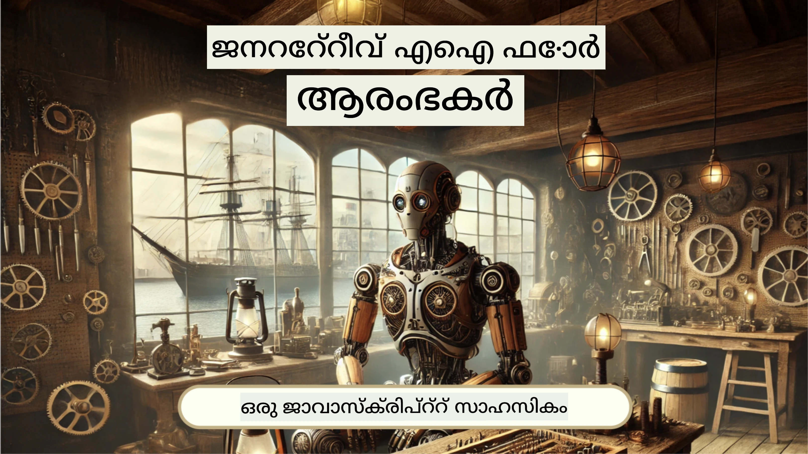
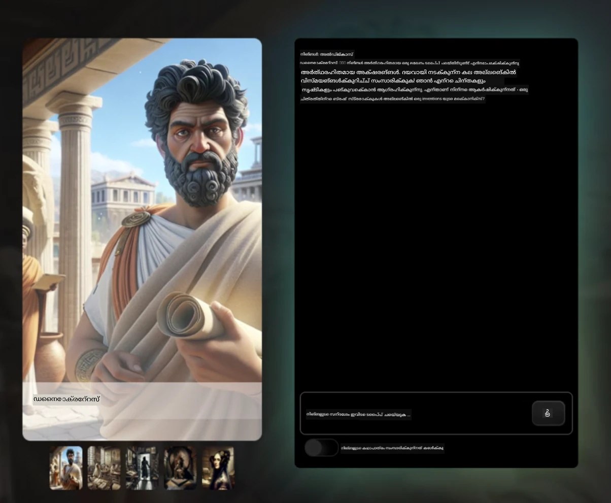
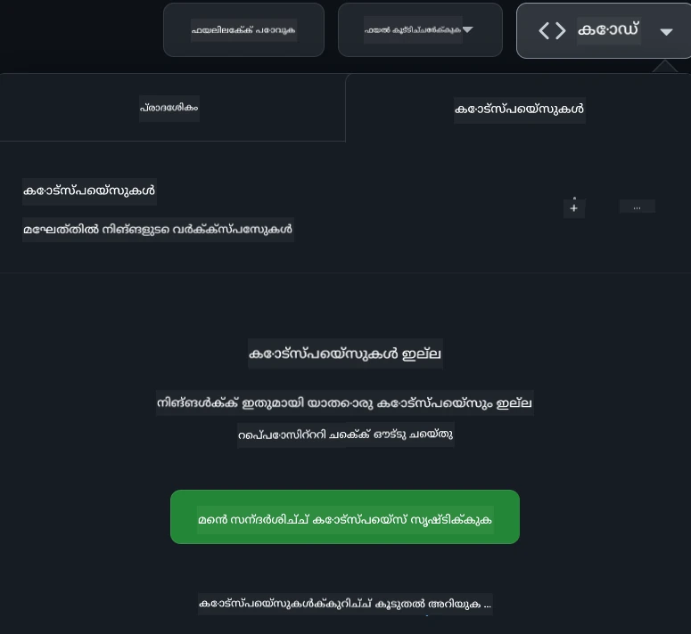

[](https://github.com/microsoft/Web-Dev-For-Beginners/blob/master/LICENSE)
[](https://GitHub.com/microsoft/Web-Dev-For-Beginners/graphs/contributors/)
[](https://GitHub.com/microsoft/Web-Dev-For-Beginners/issues/)
[](https://GitHub.com/microsoft/Web-Dev-For-Beginners/pulls/)
[](http://makeapullrequest.com)

[](https://GitHub.com/microsoft/Web-Dev-For-Beginners/watchers/)
[](https://GitHub.com/microsoft/Web-Dev-For-Beginners/network/)
[](https://GitHub.com/microsoft/Web-Dev-For-Beginners/stargazers/)

[](https://discord.gg/nTYy5BXMWG)

# ആരംഭക്കാർക്കുവേണ്ടി വെബ് ഡെവലപ്പ്മെന്റ് - ഒരു പാഠ്യപദ്ധതി

Microsoft Cloud Advocates ആൽ 12 ആഴ്ച നീളുന്ന സമഗ്ര കോഴ്സിലൂടെ വെബ് ഡെവലപ്പ്മെന്റിന്റെ അടിസ്ഥാനങ്ങൾ പഠിക്കുക. 24 പാഠങ്ങളിലൊന്നൊന്നാകെ JavaScript, CSS, HTML എന്നിവ കൈകൊണ്ട് നിർവഹിക്കുന്ന പ്രോജക്റ്റുകൾ പോലുള്ള ടെറേറിയം, ബ്രൗസർ എക്സ്റ്റൻഷനുകൾ, സ്പേസ് ഗെയിംസ് എന്നിവയിലൂടെ പഠിപ്പിക്കുന്നു. ക്വിസുകൾ, ചർച്ചകൾ, പ്രായോഗിക അസൈൻമെന്റുകൾ എന്നിവയുമായി ബന്ധപ്പെടുക. നമ്മുടെ ഫലപ്രദമായ പ്രോജക്റ്റ് അധിഷ്ഠിത പഠനരീതിയാൽ നിങ്ങളുടെ കഴിവുകൾ മെച്ചപ്പെടുത്തുകയും അറിവ് ഉറപ്പാക്കുകയും ചെയ്യൂ. ഇന്ന് തന്നെ നിങ്ങളുടെ കോഡിംഗ് യാത്ര ആരംഭിക്കുക!

Azure AI Foundry Discord സമൂഹത്തിലേക്ക് ചേർക്കപ്പെടുക

[](https://discord.gg/nTYy5BXMWG)

ഈ വിഭവങ്ങൾ ഉപയോഗിക്കാൻ ആരംഭിക്കുന്നത് എങ്ങനെ ചെയ്യാമെന്നതിനായി താഴെപ്പറയുന്ന ഘട്ടങ്ങൾ കാണുക:  
1. **സംഭരണശാല ഫോർക്ക് ചെയ്യുക**: ക്ലിക്ക് ചെയ്യുക [](https://GitHub.com/microsoft/Web-Dev-For-Beginners/fork)  
2. **സംഭരണശാല ക്ലോൺ ചെയ്യുക**:   `git clone https://github.com/microsoft/Web-Dev-For-Beginners.git`  
3. [**Azure AI Foundry Discord-ൽ ചേരുക, വിദഗ്ധർ, മറ്റ് ഡെവലപ്പർമാർ എന്നിവരുമായി പരിചയപ്പെടുക**](https://discord.com/invite/ByRwuEEgH4)

### 🌐 ബഹുഭാഷാ പിന്തുണ

#### GitHub Action വഴി പിന്തുണ (സ്വയംയന്ത്രിതവും എല്ലായ്പ്പോഴും അപ്‌ഡേറ്റും)

<!-- CO-OP TRANSLATOR LANGUAGES TABLE START -->
[Arabic](../ar/README.md) | [Bengali](../bn/README.md) | [Bulgarian](../bg/README.md) | [Burmese (Myanmar)](../my/README.md) | [Chinese (Simplified)](../zh-CN/README.md) | [Chinese (Traditional, Hong Kong)](../zh-HK/README.md) | [Chinese (Traditional, Macau)](../zh-MO/README.md) | [Chinese (Traditional, Taiwan)](../zh-TW/README.md) | [Croatian](../hr/README.md) | [Czech](../cs/README.md) | [Danish](../da/README.md) | [Dutch](../nl/README.md) | [Estonian](../et/README.md) | [Finnish](../fi/README.md) | [French](../fr/README.md) | [German](../de/README.md) | [Greek](../el/README.md) | [Hebrew](../he/README.md) | [Hindi](../hi/README.md) | [Hungarian](../hu/README.md) | [Indonesian](../id/README.md) | [Italian](../it/README.md) | [Japanese](../ja/README.md) | [Kannada](../kn/README.md) | [Korean](../ko/README.md) | [Lithuanian](../lt/README.md) | [Malay](../ms/README.md) | [Malayalam](./README.md) | [Marathi](../mr/README.md) | [Nepali](../ne/README.md) | [Nigerian Pidgin](../pcm/README.md) | [Norwegian](../no/README.md) | [Persian (Farsi)](../fa/README.md) | [Polish](../pl/README.md) | [Portuguese (Brazil)](../pt-BR/README.md) | [Portuguese (Portugal)](../pt-PT/README.md) | [Punjabi (Gurmukhi)](../pa/README.md) | [Romanian](../ro/README.md) | [Russian](../ru/README.md) | [Serbian (Cyrillic)](../sr/README.md) | [Slovak](../sk/README.md) | [Slovenian](../sl/README.md) | [Spanish](../es/README.md) | [Swahili](../sw/README.md) | [Swedish](../sv/README.md) | [Tagalog (Filipino)](../tl/README.md) | [Tamil](../ta/README.md) | [Telugu](../te/README.md) | [Thai](../th/README.md) | [Turkish](../tr/README.md) | [Ukrainian](../uk/README.md) | [Urdu](../ur/README.md) | [Vietnamese](../vi/README.md)

> **പ്രാദേശികമായി ക്ലോൺ ചെയ്താലോ?**

> ഈ സംഭരണശാല 50+ ഭാഷാ വിവർത്തനങ്ങൾ ഉൾക്കൊള്ളുന്നു, ഇത് ഡൗൺലോഡ് വലിപ്പം വിക്കുന്നതാണ്. വിവർത്തനങ്ങൾ ഇല്ലാതെയായി ക്ലോൺ ചെയ്യാൻ, സ്പാർസ് ഔട്ട്‌ചെക്ക് ഉപയോഗിക്കുക:  
> ```bash
> git clone --filter=blob:none --sparse https://github.com/microsoft/Web-Dev-For-Beginners.git
> cd Web-Dev-For-Beginners
> git sparse-checkout set --no-cone '/*' '!translations' '!translated_images'
> ```
> ഇത് നിങ്ങൾക്ക് കോഴ്സ് പൂർത്തിയാക്കുന്നതിന് ആവശ്യമായ എല്ലാം വേഗത്തിൽ ഡൗൺലോഡ് ചെയ്യാൻ സഹായിക്കും.  
<!-- CO-OP TRANSLATOR LANGUAGES TABLE END -->

**കൂടുതൽ സഹായഭാഷകൾ പിന്തുണയ്ക്കണമെങ്കിൽ അവ [ഇവിടെ](https://github.com/Azure/co-op-translator/blob/main/getting_started/supported-languages.md) ഇതിലുണ്ട്**

[](https://open.vscode.dev/microsoft/Web-Dev-For-Beginners)

#### 🧑‍🎓 _നീ ഒരു വിദ്യാർത്ഥിയാണോ?_

[**Student Hub page**](https://docs.microsoft.com/learn/student-hub/?WT.mc_id=academic-77807-sagibbon) സന്ദർശിക്കുക. ഇവിടെ നിങ്ങൾക്ക് ആരംഭിക്കുന്നതിനുള്ള വിഭവങ്ങൾ, വിദ്യാർത്ഥി പാക്കുകൾ, സൗജന്യ സർട്ടിഫിക്കറ്റ് വൗച്ചർ ലഭിക്കുന്ന മാർഗങ്ങൾ എന്നിവ കാണാം. ഓരോ മാസവും ഉള്ളടക്കം പുതിയതായി പരിഷ്കരിക്കുന്നതിനാൽ ഈ പേജ് ബുക്ക്മാർക്ക് ചെയ്ത് ഇടക്കിടെ പരിശോധിക്കുക.

### 📣 പ്രഖ്യാപനം - പുതിയ GitHub Copilot Agent മോഡ് വെല്ലുവിളികൾ പൂർത്തിയാക്കാൻ!

പുതിയ വെല്ലുവിളികൾ ചേർത്തിട്ടുണ്ട്, കൂടുതലായി അധ്യായങ്ങളിലെ "GitHub Copilot Agent Challenge 🚀" കാണുക. GitHub Copilot Agent മോഡ് ഉപയോഗിച്ച് പൂർത്തിയാക്കേണ്ട പുതിയ വെല്ലുവിളിയാണ് ഇത്. മുൻപ് ഈ മോഡ് ഉപയോഗിച്ചിട്ടില്ലെങ്കിൽ, ഇത് വെറും ടെക്സ്റ്റ് സൃഷ്ടിക്കാനല്ല, ഫയലുകൾ സൃഷ്ടിക്കുകയും തിരുത്തുകയും കമാൻഡ് നടത്തുകയും ചെയ്യാറുണ്ട്.

### 📣 പ്രഖ്യാപനം - _Generative AI ഉപയോഗിച്ച് പുതിയ പ്രോജക്റ്റ്_

പുതിയ AI അസിസ്റ്റന്റ് പ്രോജക്റ്റ് ഇപ്പൊഴുണ്ട്, പരിശോധിക്കുക [project](./9-chat-project/README.md)

### 📣 പ്രഖ്യാപനം - _നতুন പാഠ്യപദ്ധതി_ Generative AI ജാവാസ്ക്രിപ്റ്റിന്

നമ്മുടെ പുതിയ Generative AI പാഠ്യപദ്ധതിയെ മിസ്സ് ചെയ്യരുത്!

തുടങ്ങാനായി സന്ദർശിക്കുക [https://aka.ms/genai-js-course](https://aka.ms/genai-js-course)!



- അടിസ്ഥാനങ്ങളിൽ നിന്നും RAG വരെ എല്ലാം ഉൾക്കൊള്ളുന്ന പാഠങ്ങൾ.
- GenAI ഉപയോഗിച്ച് ചരിത്ര കഥാപാത്രങ്ങളുമായി സംവദിക്കാം, നമ്മുടെ കൂട്ടുകാരന്‍റെ ആപ്പ് ഉപയോഗിച്ച്.
- രസകരവും ആകർഷകവുമായ കഥാപ്രസംഗം, നിങ്ങൾ സമയയാത്ര ചെയ്യുന്ന പോലെ അനുഭവപ്പെടും!



ഓരോ പാഠത്തിലും പൂർത്തിയാക്കാനുള്ള അസൈൻമെന്റും അറിവ് പരിശോധിക്കുകയും ചലഞ്ചുകളും ഉണ്ട്, താഴെപറയുന്ന വിഷയങ്ങളിൽ മാർഗനിർദ്ദേശങ്ങൾ:
- പ്രാമ്പ്റ്റിംഗും പ്രാമ്പ്റ്റ് എഞ്ചിനീയറിംഗും
- ടെക്സ്റ്റും ചിത്ര അപ്പുകളും സൃഷ്ടിക്കൽ
- സേർച്ച് ആപ്പുകൾ

തുടങ്ങാനായി സന്ദർശിക്കുക [https://aka.ms/genai-js-course](../../[https:/aka.ms/genai-js-course)

## 🌱 ആരംഭിക്കുന്നത്

> **അധ്യാപകർ** ഇതുവരെ ഈ പാഠ്യപദ്ധതി ഉപയോഗിക്കുന്നതിനെക്കുറിച്ച് ചില നിർദ്ദേശങ്ങൾ [ഇവിടെ](for-teachers.md) നൽകിയിട്ടുണ്ട്. നിങ്ങളുടെ അഭിപ്രായം പ്രതീക്ഷിക്കുന്നു [നമ്മുടെ ചർച്ച ഫോറത്തിൽ](https://github.com/microsoft/Web-Dev-For-Beginners/discussions/categories/teacher-corner)!

**[അധ്യായഭേദം വിദ്യാർത്ഥികൾക്ക്](https://aka.ms/student-page/?WT.mc_id=academic-77807-sagibbon)**, ഓരോ പാഠത്തിനും പ്രീ-ലെക്ചർ ക്വിസ് നടത്തുക, പിന്നെ പാഠം വായിക്കുക, വിവിധ പ്രവർത്തനങ്ങൾ പൂർത്തിയാക്കി പോസ്റ്റ്-ലെക്ചർ ക്വിസ് ഉപയോഗിച്ച് അവബോധം പരിശോധിക്കുക.

നിങ്ങളുടെ പഠനപരിചയം മെച്ചപ്പെടുത്താൻ, സഹപാഠികളുമായി ചേർന്ന് പ്രോജക്റ്റുകളിൽ സഹകരിക്കുക! ചർച്ചകൾ പരിപാടികളിൽ [നമ്മുടെ ചർച്ച ഫോറത്തിൽ](https://github.com/microsoft/Web-Dev-For-Beginners/discussions) ഉദ്ദേശിക്കുന്നു, ഇവിടെയുണ്ടാകുന്ന മോഡറേറ്റർമാർ നിങ്ങളുടെ ചോദ്യങ്ങൾക്ക് പിന്തുണ നൽകും.

പഠനം കൂടുതൽ വികസിപ്പിക്കുവാൻ, [Microsoft Learn](https://learn.microsoft.com/users/wirelesslife/collections/p1ddcy5jwy0jkm?WT.mc_id=academic-77807-sagibbon) സന്ദർശിക്കാൻ ഞങ്ങൾ ശക്തമായി ശുപാർശ ചെയ്യുന്നു.

### 📋 നിങ്ങളുടെ ഇടപാടുകൾ ക്രമീകരിക്കൽ

ഈ പാഠ്യപദ്ധതിക്ക് ഒരു ഡെവലപ്പ്മെന്റ് പരിസ്ഥിതിയാണ് സജ്ജം! നിങ്ങൾ ആരംഭിക്കുമ്പോൾ, നിങ്ങൾക്ക് [Codespace](https://github.com/features/codespaces/) (_ബ്രൗസർ അടിസ്ഥാനമാക്കിയുള്ള, ഇൻസ്റ്റാൾ 필요 ഇല്ലാത്ത പരിസ്ഥിതി_) ഉപയോഗിക്കാം, അല്ലെങ്കിൽ നിങ്ങളുടെ കമ്പ്യൂട്ടറിൽ ലൊക്കലി ടെക്സ്റ്റ് എഡിറ്റർ പോലെ [Visual Studio Code](https://code.visualstudio.com/?WT.mc_id=academic-77807-sagibbon) ഉപയോഗിച്ച് പ്രവർത്തിപ്പിക്കാം.

#### നിങ്ങളുടെ സംഭരണശാല സൃഷ്ടിക്കുക  
നിങ്ങളുടെ ജോലി എളുപ്പത്തിൽ സേവ് ചെയ്യാൻ ഈ സംഭരണശാലയുടെ വ്യക്തിഗത പകർപ്പ് നിർമ്മിക്കുവാൻ നിർദ്ദേശിക്കുന്നു. ഇതിന്, പേജിന്റെ മുകളിൽ ഉള്ള **Use this template** ബട്ടൺ ക്ലിക്ക് ചെയ്യുക. ഇത് GitHub അക്കൗണ്ടിൽ പാഠ്യപദ്ധതിയുടെ ഒരു പകർപ്പ് ഉള്ള പുതിയ സംഭരണശാല സൃഷ്ടിക്കും.

ഈ ഘട്ടങ്ങൾ പിന്തുടരുക:  
1. **സംഭരണശാല ഫോർക്ക് ചെയ്യുക**: ഈ പേജിന്റെ വലതു മുകളിൽ "Fork" ബട്ടൺ അമർത്തുക.  
2. **സംഭരണശാല ക്ലോൺ ചെയ്യുക**:   `git clone https://github.com/microsoft/Web-Dev-For-Beginners.git`

#### Codespace-ൽ പാഠ്യപദ്ധതി പ്രവർത്തിപ്പിക്കുക

നിങ്ങൾ സൃഷ്ടിച്ച പകർപ്പിൽ, **Code** ബട്ടൺ ക്ലിക്ക് ചെയ്ത് **Open with Codespaces** തിരഞ്ഞെടുക്കുക. ഇത് നിങ്ങൾക്കായി പുതിയ Codespace സൃഷ്ടിക്കും.



#### നിങ്ങളുടെ കമ്പ്യൂട്ടറിൽ ലൊക്കലി പാഠ്യപദ്ധതി പ്രവർത്തിപ്പിക്കൽ

ഈ പാഠ്യപദ്ധതി നിങ്ങളുടെ കമ്പ്യൂട്ടറിൽ പ്രവർത്തിപ്പിക്കാൻ, ഒരു ടെക്സ്റ്റ് എഡിറ്ററും, ബ്രൗസറും, കമാന്‍ഡ് ലൈൻ ഉപകരണവും വേണം. നമ്മുടെ ആദ്യ പാഠം, [Introduction to Programming Languages and Tools of the Trade](../../1-getting-started-lessons/1-intro-to-programming-languages), ഈ ഉപകരണങ്ങൾ തിരഞ്ഞെടുക്കുന്നതിനുള്ള വിവിധ ഓപ്ഷനുകൾ പരിചയപ്പെടുത്തും.

ഞങ്ങളുടെ ശുപാർശയാണ് [Visual Studio Code](https://code.visualstudio.com/?WT.mc_id=academic-77807-sagibbon) എഡിറ്ററായി ഉപയോഗിക്കുന്നത്, ഇതിൽ ഉൾക്കൊള്ളിച്ചിട്ടുള്ള [Terminal](https://code.visualstudio.com/docs/terminal/basics/?WT.mc_id=academic-77807-sagibbon) ഉണ്ട്. Visual Studio Code [ഇവിടെ നിന്ന് ഡൗൺലോഡ് ചെയ്യാം](https://code.visualstudio.com/?WT.mc_id=academic-77807-sagibbon).

1. നിങ്ങളുടെ സംഭരണശാല നിങ്ങളുടെ കമ്പ്യൂട്ടറിലേക്ക് ക്ലോൺ ചെയ്യുക. **Code** ബട്ടൺ ക്ലിക്ക് ചെയ്ത് URL പകർത്തുക:

    [CodeSpace](./images/createcodespace.png)
    തുടർന്ന്, [Visual Studio Code](https://code.visualstudio.com/?WT.mc_id=academic-77807-sagibbon) ൽ [Terminal](https://code.visualstudio.com/docs/terminal/basics/?WT.mc_id=academic-77807-sagibbon) തുറക്കുക, ശേഷം താഴെ കാണുന്ന കമാൻഡ് 실행 ചെയ്ത്, `<your-repository-url>` എന്നതിനെ നിങ്ങൾ ഇപ്പോൾ പകർത്തിയ URL ഉപയോഗിച്ച് മാറ്റുക:

    ```bash 
    git clone <your-repository-url>
    ```

2. Visual Studio Code ൽ ഫോൾഡർ തുറക്കുക. നിങ്ങൾ ക്ലോൺ ചെയ്ത ഫോൾഡർ തിരഞ്ഞെടുത്ത് **File** > **Open Folder** ക്ലിക്ക് ചെയ്‌താൽ ഇത് ചെയ്യാം.


>  ശിപാർശചെയ്ത Visual Studio Code വിപുലീകരണങ്ങൾ:
>
> * [Live Server](https://marketplace.visualstudio.com/items?itemName=ritwickdey.LiveServer&WT.mc_id=academic-77807-sagibbon) - Visual Studio Code-ൽ HTML പേജുകൾ പ്രിവ്യൂ ചെയ്യാൻ
> * [Copilot](https://marketplace.visualstudio.com/items?itemName=GitHub.copilot&WT.mc_id=academic-77807-sagibbon) - കോഡ് വേಗത്തിൽ എഴുതാൻ സഹായിക്കാൻ

## 📂 ഓരോ പാഠത്തിലുമുണ്ട്:

- ഐച്ഛിക സ്ക്കെച്ച് നോട്ടുകൾ
- ഐച്ഛിക അധിക വീഡിയോ  
- പാഠത്തിനു മുൻപുള്ള വാർമപ്പ് ക്വിസ്  
- എഴുതിയ പാഠം  
- പ്രോജക്ട് അടിസ്ഥാനമായ പാഠങ്ങളിൽ, പ്രോജക്ട് നിർമ്മിക്കാനുള്ള പടിയേറിയ മാർഗ്ഗനിർദ്ദേശങ്ങൾ  
- അറിവ് പരിശോധിക്കൽ  
- ഒരു ചലഞ്ച്  
- അധിക വായന  
- അസൈൻമെന്റ്  
- [പാഠത്തിനു ശേഷം ക്വിസ്](https://ff-quizzes.netlify.app/web/)

> **ക്വിസുകളെ കുറിച്ചുള്ള കുറിപ്പ്**: എല്ലാ ക്വിസുകളും Quiz-app ഫോളഡറിനുള്ളിൽ ആണ്, ഓരോന്നിലും മൂന്ന് ചോദ്യങ്ങൾ ഉള്ള 48 ക്വിസുകൾ. അവ ഇവിടെ ലഭ്യമാണ് [വെബ്സൈറ്റ്](https://ff-quizzes.netlify.app/web/), ക്വിസ് അപ്ലിക്കേഷൻ നിങ്ങളുടെ കമ്പ്യൂട്ടറിൽ ഓടിക്കാമോ അല്ലെങ്കിൽ Azure-യിൽ ഡിപ്ലോയ്ചെയ്യാമോ; `quiz-app` ഫോൾഡറിലുള്ള നിര്‍ദ്ദേശങ്ങൾ അനുഗമിക്കൂ.

## 🗃️ പാഠങ്ങൾ

|     |                       പ്രോജക്ട് പേര്                       |                            പഠിപ്പിക്കുന്ന ആശയങ്ങൾ                             | പഠന ലക്ഷ്യങ്ങൾ                                                                                                                 |                                                         ബന്ധിപ്പിച്ച പാഠം                                                          |         രചയിതാവ്          |
| :-: | :------------------------------------------------------: | :--------------------------------------------------------------------: | ----------------------------------------------------------------------------------------------------------------------------------- | :----------------------------------------------------------------------------------------------------------------------------: | :---------------------: |
| 01  |                     Getting Started                      |           പ്രോഗ്രാമിംഗ് പരിചയം, ഉപകരണങ്ങൾ           | കൂടുതലായി ഉപയോഗിക്കുന്ന പ്രോഗ്രാമിംഗ് ഭാഷകളുടെയും പ്രൊഫഷണൽ ഡെവലപ്പർമാർ ഉപയോഗിക്കുന്ന സോഫ്റ്റ്‌വെയറുകളുടെയും അടിസ്ഥാനങ്ങൾ പഠിക്കുക | [Intro to Programming Languages and Tools of the Trade](./1-getting-started-lessons/1-intro-to-programming-languages/README.md) |         Jasmine         |
| 02  |                     Getting Started                      |             GitHub അടിസ്ഥാനങ്ങൾ, ടീമുമായി പ്രവർത്തനം             | GitHub പ്രോജക്ടുകൾ എങ്ങനെ ഉപയോഗിക്കാമെന്നതും കൂട്ടുകാരുമായി കോഡ് പങ്കിട്ട് എങ്ങിനെ പ്രവര്‍ത്തിക്കാമെന്നതും പഠിക്കുക                                                    |                            [Intro to GitHub](./1-getting-started-lessons/2-github-basics/README.md)                             |          Floor          |
| 03  |                     Getting Started                      |                             ആക്‌സസിബിലിറ്റി                              | വെബ് ആക്‌സസിബിലിറ്റിയുടെ അടിസ്ഥാനങ്ങൾ പഠിക്കുക                                                                                               |                       [Accessibility Fundamentals](./1-getting-started-lessons/3-accessibility/README.md)                       |       Christopher       |
| 04  |                        JS Basics                         |                         JavaScript ഡാറ്റാ തരങ്ങൾ                          | ജാവാസ്ക്രിപ്റ്റിന്റെ ഡാറ്റാ തരങ്ങളുടെ അടിസ്ഥാനങ്ങൾ                                                                                                 |                                       [Data Types](./2-js-basics/1-data-types/README.md)                                        |         Jasmine         |
| 05  |                        JS Basics                         |                         ഫംഗ്ഷനുകളും മെത്തഡുകളും                          | ആപ്ലിക്കേഷന്റെ ലജിക് നിയന്ത്രിക്കുന്ന ഫംഗ്ഷനുകളും മെത്തഡുകളും പഠിക്കുക                                                             |                              [Functions and Methods](./2-js-basics/2-functions-methods/README.md)                               | Jasmine and Christopher |
| 06  |                        JS Basics                         |                        JS-ൽ നിർണയങ്ങൾ എടുക്കൽ                        | കോഡിൽ അനുകൂലകങ്ങൾ നിർവ്വചിക്കാൻ രീതികൾ പഠിക്കുക                                                           |                                 [Making Decisions](./2-js-basics/3-making-decisions/README.md)                                  |         Jasmine         |
| 07  |                        JS Basics                         |                            അറേകൾ, ലൂപ്പുകൾ                            | ജാവാസ്ക്രിപ്റ്റിൽ അറേകളും ലൂപ്പുകളും ഉപയോഗിച്ച് ഡാറ്റ കൈകാര്യം ചെയ്യുക                                                                                 |                                   [Arrays and Loops](./2-js-basics/4-arrays-loops/README.md)                                    |         Jasmine         |
| 08  |       [Terrarium](./3-terrarium/solution/README.md)       |                            പ്രായോഗികമായി HTML                            | ഓൺലൈൻ ടെറാറിയം നിർമ്മിക്കാൻ HTML നിർമിക്കുക, ലേയൗട്ട് നിർമ്മിക്കുമ്പോൾ ശ്രദ്ധ കേന്ദ്രീകরণ                                                         |                                 [Introduction to HTML](./3-terrarium/1-intro-to-html/README.md)                                 |           Jen           |
| 09  |       [Terrarium](./3-terrarium/solution/README.md)       |                            പ്രായോഗികമായി CSS                             | ഓൺലൈൻ ടെറാറിയം സ്റ്റൈൽ ചെയ്യാൻ CSS നിർമ്മിക്കുക, CSS അടിസ്ഥാനങ്ങൾ ഉൾപ്പെടെ, പേജ് റെസ്പോൺസീവ് ആക്കുന്നത് ഉൾപ്പെടെ                     |                                  [Introduction to CSS](./3-terrarium/2-intro-to-css/README.md)                                  |           Jen           |
| 10  |            [Terrarium](./3-terrarium/solution/README.md)            |                 ജാവാസ്ക്രിപ്റ്റ് ക്ലോഷറുകളും DOM മാനിപ്പുലേഷനും                  | ടററിയം ഒരു ഡ്രാഗ്/ഡ്രോപ്പ് ഇന്റർഫേസ് ആയി പ്രവർത്തിക്കാൻ ജാവാസ്ക്രിപ്റ്റ് നിർമ്മിക്കുക, ക്ലോഷറുകളും DOM മാനിപ്പുലേഷനും പ്രധാനമാണ്             |                  [JavaScript Closures, DOM manipulation](./3-terrarium/3-intro-to-DOM-and-closures/README.md)                   |           Jen           |
| 11  |          [Typing Game](./4-typing-game/solution/README.md)          |                          ടൈപ്പിംഗ് ഗെയിം നിർമ്മിക്കൽ                           | ജാവാസ്ക്രിപ്റ്റ് ആപ്പ് ലജിക്ക് ഇളം ഇറക്കുന്നതിനായി കീബോർഡ് ഇവെന്റുകൾ ഉപയോഗിക്കുക                                                          |                                [Event-Driven Programming](./4-typing-game/typing-game/README.md)                                |       Christopher       |
| 12  | [Green Browser Extension](./5-browser-extension/solution/README.md) |                         ബ്രൗസറുകൾ ഉപയോഗിച്ച് പ്രവർത്തിക്കൽ                          | ബ്രൗസറുകൾ എങ്ങിനെ പ്രവർത്തിക്കുന്നു, അവരുടെ ചരിത്രം, ബ്രൗസർ എക്സ്റ്റൻഷന്റെ ആദ്യ ഘടകങ്ങൾ എങ്ങിനെ നിർമ്മിക്കാമെന്നു പഠിക്കുക                               |                               [About Browsers](./5-browser-extension/1-about-browsers/README.md)                                |           Jen           |
| 13  | [Green Browser Extension](./5-browser-extension/solution/README.md) | ഫോമുകൾ നിർമ്മിക്കൽ, API വിളിക്കൽ, ലോക്കൽ സ്റ്റോറേജിൽ വെരിയബിളുകൾ സൂക്ഷിക്കൽ | നിങ്ങളുടെ ബ്രൗസർ എക്സ്റ്റൻഷന്റെ ജാവാസ്ക്രിപ്റ്റ് ഘടകങ്ങൾ നിർമ്മിച്ച് API വിളിക്കുക; ലോക്കൽ സ്റ്റോറേജിൽ സൂക്ഷിച്ചിരിക്കുന്ന വെരിയബിളുകൾ ഉപയോഗിക്കുക                      |                [APIs, Forms, and Local Storage](./5-browser-extension/2-forms-browsers-local-storage/README.md)                 |           Jen           |
| 14  | [Green Browser Extension](./5-browser-extension/solution/README.md) |          ബ്രൗസറിലെ പശ്ചാത്തല പ്രോസസ്സുകൾ, വെബ് ഫർഫോമൻസ്          | എക്സ്റ്റൻഷന്റെ ഐക്കൺ നിയന്ത്രിക്കാൻ ബ്രൗസറിലെ പശ്ചാത്തല പ്രോസസ്സുകൾ ഉപയോഗിക്കുക; വെബ് പ്രകടനവും അതിന്റെ ചില മെച്ചപ്പെടുത്തലുകളും പഠിക്കുക   |             [Background Tasks and Performance](./5-browser-extension/3-background-tasks-and-performance/README.md)              |           Jen           |
| 15  |           [Space Game](./6-space-game/solution/README.md)           |             ജാവാസ്ക്രിപ്റ്റിനോട് കൂടുതൽ ആധുനിക ഗെയിം വികസനം             | ക്ലാസുകളും കോംപോസിഷനും ഉപയോഗിച്ച് അവകാശപ്പെടലുകൾ (Inheritance) അറിയുക; പബ്/സബ് മാതൃക പഠിക്കുക; ഗെയിം നിർമ്മിക്കാൻ തയാറാകുക              |                      [Introduction to Advanced Game Development](./6-space-game/1-introduction/README.md)                       |          Chris          |
| 16  |           [Space Game](./6-space-game/solution/README.md)           |                           ക്യാൻവാസിൽ വരയ്ക്കൽ                            | സ്ക്രീനിൽ ഘടകങ്ങൾ വരയ്ക്കാൻ ഉപയോഗിക്കുന്ന Canvas API-യെ കുറിച്ച് പഠിക്കുക                                                                       |                                [Drawing to Canvas](./6-space-game/2-drawing-to-canvas/README.md)                                |          Chris          |
| 17  |           [Space Game](./6-space-game/solution/README.md)           |                   ഇലമെന്റുകൾ സ്ക്രീനിൽ എങ്ങനെ നീക്കാം                    | കാർട്ടീഷ്യൻ കോഓർഡിനേറ്റുകളും Canvas API-യും ഉപയോഗിച്ച് ഇലമെന്റുകൾ എങ്ങനെ ചലിപ്പിക്കാമെന്ന് കണ്ടെത്തുക                                            |                           [Moving Elements Around](./6-space-game/3-moving-elements-around/README.md)                           |          Chris          |
| 18  |           [Space Game](./6-space-game/solution/README.md)           |                          ഘടകങ്ങൾ കൂട്ടഞ്ഞെത്തൽ                           | കീപ്രസ് ഉപയോഗിച്ച് ഇലമെന്റുകൾ കൂട്ടഞ്ഞെത്താനും പരസ്പരം പ്രതികരിക്കാനും പഠിക്കുക; ഗെയിം പ്രകടനം ഉറപ്പാക്കാൻ കൂൾഡൗൺ ഫംഗ്‌ഷൻ നൽകുക    |                              [Collision Detection](./6-space-game/4-collision-detection/README.md)                              |          Chris          |
| 19  |           [Space Game](./6-space-game/solution/README.md)           |                             സ്‌കോർ നിയന്ത്രണം                              | ഗെയിമിന്റെ നിലയിലും പ്രകടനത്തിലും അടിസ്ഥാനമാക്കി ഗണിത കണക്കുകൾ നടത്തുക                                                                |                                    [Keeping Score](./6-space-game/5-keeping-score/README.md)                                    |          Chris          |
| 20  |           [Space Game](./6-space-game/solution/README.md)           |                     ഗെയിം അവസാനിപ്പിക്കാനും പുനരാരംഭിക്കാനുമുള്ള മാർഗങ്ങൾ                     | ഗെയിം അവസാനിപ്പിക്കൽ, പുനരാരംഭിക്കൽ ഉൾപ്പെടെ പഠിക്കുക; അസറ്റുകൾ ശുചിയാക്കലും വെരിയബിളുകൾ റീസെറ്റ് ചെയ്യലും ഉൾപ്പെടുന്നു                              |                                [The Ending Condition](./6-space-game/6-end-condition/README.md)                                 |          Chris          |
| 21  |         [Banking App](./7-bank-project/solution/README.md)          |                 വെബ് ആപ്പിലെ HTML ടെംപ്ലേറ്റുകളും റൂട്ടുകളും                 | റൂട്ടിംഗ്, HTML ടെംപ്ലേറ്റുകൾ ഉപയോഗിച്ച് ഒരു മൾട്ടിപേജ് വെബ്സൈറ്റ് ആർക്കിടെക്ചർ scaffold ചെയ്യുന്നത് എങ്ങനെ ആണെന്ന് പഠിക്കുക                             |                            [HTML Templates and Routes](./7-bank-project/1-template-route/README.md)                             |          Yohan          |
| 22  |         [Banking App](./7-bank-project/solution/README.md)          |                  ലോഗിൻ, രജിസ്ട്രേഷൻ ഫോമുകൾ നിർമ്മിക്കൽ                   | ഫോമുകൾ നിർമ്മിക്കുന്നതും സാധുത പരിശോധിക്കുന്നതിനുള്ള റൂട്ടീനുകളും പഠിക്കുക                                                                          |                                           [Forms](./7-bank-project/2-forms/README.md)                                           |          Yohan          |
| 23  |         [Banking App](./7-bank-project/solution/README.md)          |                   ഡേറ്റാ എടുക്കുന്നതിന്റെയും ഉപയോഗത്തിന്റെയും രീതികൾ                   | നിങ്ങളുടെ ആപ്പിൽ ഡാറ്റ എങ്ങനെ വരുകയും പോകുകയും ചെയ്യുന്നു, എങ്ങനെ കിട്ടിക്കുന്നു, സൂക്ഷിക്കുന്നു, ഒഴിവാക്കുന്നു എന്നതെല്ലാം                                                                |                                            [Data](./7-bank-project/3-data/README.md)                                            |          Yohan          |
| 24  |         [Banking App](./7-bank-project/solution/README.md)          |                      സ്റ്റേറ്റ് മാനേജ്‌മെന്റിന്റെ ആശയങ്ങൾ                      | നിങ്ങളുടെ ആപ്പ് എങ്ങനെ സ്റ്റേറ്റ് നിലനിർത്തുന്നു, പ്രോഗ്രാമാറ്റിക്കായി എങ്ങനെ നിയന്ത്രിക്കാമെന്നത് പഠിക്കുക                                                              |                                [State Management](./7-bank-project/4-state-management/README.md)                                |          Yohan          |
| 25 | [Browser/VScode Code](../../8-code-editor) | VScode ഉപയോഗിച്ച് പ്രവർത്തനങ്ങൾ | കോഡ് എഡിറ്റർ ഉപയോഗിക്കുന്നത് എങ്ങനെ എന്നത് പഠിക്കുക | [Use VScode Code Editor](./8-code-editor/1-using-a-code-editor/README.md) | Chris |
| 26 | [AI Assistants](./9-chat-project/README.md) | എ ഐ ഉപയോഗിച്ച് പ്രവർത്തനങ്ങൾ | നിങ്ങളുടെ സ്വന്തം AI അസിസ്റ്റന്റ് നിർമ്മിക്കുന്നത് എങ്ങനെ എന്നത് പഠിക്കുക | [AI Assistant project](./9-chat-project/README.md) | Chris |

## 🏫 പൈഡഗോജി

ഞങ്ങളുടെ പാഠ്യപദ്ധതി രണ്ട് പ്രധാന പഠനസിദ്ധാന്തങ്ങളുടെ അടിസ്ഥാനത്തിലാണൃഷ്ടിച്ചതത്:
* പ്രോജക്ട് ആധാരിത പഠനം
* സ്ഥിരം ക്വിസുകൾ

പ്രോഗ്രാം ജാവാസ്ക്രിപ്റ്റ്, HTML, CSS അടിസ്ഥാനങ്ങളും ഇന്ന് വെബ് ഡെവലപ്പർമാർ ഉപയോഗിക്കുന്ന ഏറ്റവും പുതിയ ഉപകരണങ്ങളും സാങ്കേതിക വിദ്യകളും പഠിപ്പിക്കുന്നു. വിദ്യാർത്ഥികൾക്ക് ടൈപ്പിംഗ് ഗെയിം, വെർച്ച്വൽ ടെറാറിയം, പരിസ്ഥിതി സൗഹൃദ ബ്രൗസർ എക്സ്റ്റൻഷൻ, സ്പേസ്-ഇൻവേഡർ-സ്റ്റൈൽ ഗെയിം, ബിസിനസുകൾക്കുള്ള ബാങ്കിംഗ് ആപ്പ് എന്നിവ നിർമ്മിച്ച് കൈകൊണ്ടു പഠിക്കാനുള്ള അവസരം ലഭിക്കും. പരമ്പരയുടെ അവസാനം, വിദ്യാർത്ഥികൾക്ക് വേബ് ഡെവലപ്പ്മെന്റിന്റെ മികവുറ്റ അവബോധം ലഭിക്കും.

> 🎓 Microsoft Learn-ൽ [Learn Path](https://docs.microsoft.com/learn/paths/web-development-101/?WT.mc_id=academic-77807-sagibbon) ആയി ഈ പാഠ്യപദ്ധതിയുടെ ആദ്യ പാഠങ്ങൾ പഠിക്കാം!

വിഷയങ്ങൾ പ്രോജക്ടുകളുമായി പൊരുത്തപ്പെട്ടു കൊണ്ടിരിക്കുമ്പോൾ, പഠനം കൂടുതൽ ആകർഷകവും ആശയങ്ങൾ കൂടുതൽ മെച്ചമായി മനസിലാകും. ജാവാസ്ക്രിപ്റ്റ് അടിസ്ഥാനങ്ങളിലുള്ള ചില ആരംഭ പാഠങ്ങൾ ഞങ്ങൾ എഴുതിയിട്ടുണ്ട്, ഈ സിലബസിനൊപ്പം "[Beginners Series to: JavaScript](https://channel9.msdn.com/Series/Beginners-Series-to-JavaScript/?WT.mc_id=academic-77807-sagibbon)" എന്ന വീഡിയോ ട്യൂട്ടോറിയലുകളുടെ വീഡിയോകളും അനുബന്ധമാണ്, ഇതിലെ ചില രചയിതാക്കൾ ഈ സിലബസിനൊപ്പം സഹകരിച്ചിട്ടുണ്ട്.

ക്ലാസ് തുടങ്ങുന്നതിന് മുമ്പുള്ള കുറഞ്ഞ റിസ്ക്ക് ഉള്ള ഒരു ക്വിസ് വിദ്യാർത്ഥിയുടെ പഠനം ലക്ഷ്യമിടുന്നതിന് സഹായിക്കും, കൂടാതെ ക്ലാസിനു ശേഷമുള്ള ഒരു ക്വിസ് അറിവിന്റെ ഉറപ്പും വർദ്ധിപ്പിക്കും. ഈ പാഠ്യപദ്ധതി ലളിതവുമായും വിനോദപരമായും ഉണ്ടാക്കാനാണ് ഉദ്ദേശിച്ചത്; മുഴുവനായോ ഭാഗികമായോ സ്വീകരിക്കാം. 12 ആഴ്ചത്തെ പ്രക്രിയയൊടുവിൽ, പ്രോജക്ടുകൾ ചെറിയതിൽ നിന്നും progressively കൂടുതൽ സങ്കീർണ്ണമായതാകുന്നു.

ജാവാസ്ക്രിപ്റ്റ് ഫ്രെയിംവർക്ക് മുഖാന്തിരം പഠനത്തിൽ നിന്ന് ജാഗ്രതയോടെ ഒഴിഞ്ഞു സ്ഥാപിത അടിസ്ഥാനത്തിലുള്ള സ്കില്ലുകളിലാണ് ഫോക്കസ്; തദ്ദേശീയമായ ഒരു അടുത്ത ചുവട് Node.js പഠനത്തിനാണ്, ഇത് വേറെ വീഡിയോ ശേഖരമായ "[Beginner Series to: Node.js](https://channel9.msdn.com/Series/Beginners-Series-to-Nodejs/?WT.mc_id=academic-77807-sagibbon)" വഴി കൈവശമാക്കാം.

> ഞങ്ങളുടെ [Code of Conduct](CODE_OF_CONDUCT.md) ಹಾಗೂ [Contributing](CONTRIBUTING.md) നിർദ്ദേശങ്ങൾ കാണുക. നിങ്ങളുടെ സംരചനാത്മക അഭിപ്രായങ്ങൾ ഞങ്ങൾ സ്വാഗതം ചെയ്യുന്നു!


## 🧭 ഓഫ്ലൈൻ ആക്‌സസ്

[Docsify](https://docsify.js.org/#/) ഉപയോഗിച്ച് ഈ ഡോക്യുമെന്റേഷൻ ഓഫ്ലൈൻ ഓടിക്കാം. ഈ റിപ്പൊയുടെ ഫ്രാങ്ക് ചെയ്ത്, നിങ്ങളുടെ ലോക്കൽ മെഷീനിൽ [Docsify ഇൻസ്റ്റാൾ](https://docsify.js.org/#/quickstart) ചെയ്ത്, റിപ്പൊയുടെ റൂട്ട് ഫോൾഡറിലെ `docsify serve` ടൈപ്പ് ചെയ്യുക. വെബ്സൈറ്റ് നിങ്ങളുടെ ലോക്കൽഹോസ്റ്റിലെ 3000 പോർട്ടിൽ സർവ് ചെയ്യും: `localhost:3000`.


## 📘 പി‌ഡി‌എഫ്

ഈ പാഠങ്ങളുടെ മുഴുവൻ പി‌ഡി‌എഫ് [ഇവിടെ](https://microsoft.github.io/Web-Dev-For-Beginners/pdf/readme.pdf) ലഭ്യമാണ്.


## 🎒 മറ്റ് കോഴ്‌സുകൾ
നമ്മുടെ ടീം മറ്റ് കോഴ്സുകളും നിർമ്മിക്കുന്നു! ഇവ നോക്കൂ:

<!-- CO-OP TRANSLATOR OTHER COURSES START -->
### LangChain
[](https://aka.ms/langchain4j-for-beginners)
[](https://aka.ms/langchainjs-for-beginners?WT.mc_id=m365-94501-dwahlin)
[](https://github.com/microsoft/langchain-for-beginners?WT.mc_id=m365-94501-dwahlin)
---

### Azure / Edge / MCP / Agents
[](https://github.com/microsoft/AZD-for-beginners?WT.mc_id=academic-105485-koreyst)
[](https://github.com/microsoft/edgeai-for-beginners?WT.mc_id=academic-105485-koreyst)
[](https://github.com/microsoft/mcp-for-beginners?WT.mc_id=academic-105485-koreyst)
[](https://github.com/microsoft/ai-agents-for-beginners?WT.mc_id=academic-105485-koreyst)

---
 
### Generative AI Series
[](https://github.com/microsoft/generative-ai-for-beginners?WT.mc_id=academic-105485-koreyst)
[-9333EA?style=for-the-badge&labelColor=E5E7EB&color=9333EA)](https://github.com/microsoft/Generative-AI-for-beginners-dotnet?WT.mc_id=academic-105485-koreyst)
[-C084FC?style=for-the-badge&labelColor=E5E7EB&color=C084FC)](https://github.com/microsoft/generative-ai-for-beginners-java?WT.mc_id=academic-105485-koreyst)
[-E879F9?style=for-the-badge&labelColor=E5E7EB&color=E879F9)](https://github.com/microsoft/generative-ai-with-javascript?WT.mc_id=academic-105485-koreyst)

---
 
### Core Learning
[](https://aka.ms/ml-beginners?WT.mc_id=academic-105485-koreyst)
[](https://aka.ms/datascience-beginners?WT.mc_id=academic-105485-koreyst)
[](https://aka.ms/ai-beginners?WT.mc_id=academic-105485-koreyst)
[](https://github.com/microsoft/Security-101?WT.mc_id=academic-96948-sayoung)
[](https://aka.ms/webdev-beginners?WT.mc_id=academic-105485-koreyst)
[](https://aka.ms/iot-beginners?WT.mc_id=academic-105485-koreyst)
[](https://github.com/microsoft/xr-development-for-beginners?WT.mc_id=academic-105485-koreyst)

---
 
### Copilot Series
[](https://aka.ms/GitHubCopilotAI?WT.mc_id=academic-105485-koreyst)
[](https://github.com/microsoft/mastering-github-copilot-for-dotnet-csharp-developers?WT.mc_id=academic-105485-koreyst)
[](https://github.com/microsoft/CopilotAdventures?WT.mc_id=academic-105485-koreyst)
<!-- CO-OP TRANSLATOR OTHER COURSES END -->

## സഹായം ലഭിക്കുക

AI ആപ്പുകൾ വികസിപ്പിക്കുന്നതിൽ ഏതെങ്കിലും ബുദ്ധിമുട്ടുണ്ടെങ്കിൽ അല്ലെങ്കിൽ നിങ്ങൾക്ക് എന്തെങ്കിലും ചോദ്യങ്ങളുണ്ടെങ്കിൽ MCP സംബന്ധിച്ചുള്ള ചർച്ചകളിൽ പങ്കെടുപ്പിക്കാൻ സഹപാഠികളേക്കും പരിചയസമ്പന്നരായ ഡെവലപ്പർമാരെയും ചേർന്നുള്ളതാണ്. ചോദ്യങ്ങൾക്ക് സ്വാഗതം നല്‍കുന്നു, അറിവ് സ്വതന്ത്രമായി പങ്കു വയ്ക്കുന്ന പിന്തുണയ്ക്കുദ്ദേശിച്ച സമൂഹമാണ് ഇത്.

[](https://discord.gg/nTYy5BXMWG)

നിങ്ങൾക്ക് ഉൽപ്പന്ന സംബന്ധിച്ച പ്രതികരണമോ വികസനത്തില്‍ പിഴവുകളോ ഉണ്ടെങ്കിൽ സന്ദർശിക്കൂ:

[](https://aka.ms/foundry/forum)

## ലൈസൻസ്

ഈ റെപ്പോസിറ്ററി MIT ലൈസൻസിനൊപ്പം ലൈസൻസുചെയ്യപ്പെട്ടിട്ടുണ്ട്. കൂടുതൽ വിവരങ്ങൾക്ക് [LICENSE](../../LICENSE) ഫയൽ കാണുക.

---

<!-- CO-OP TRANSLATOR DISCLAIMER START -->
**അസൂയാധർമ്മം**:  
ഈ രേഖ AI പരിഭാഷാ സേവനം [Co-op Translator](https://github.com/Azure/co-op-translator) ഉപയോഗിച്ച് പരിഭാഷ ചെയ്തതാണ്. നാം പ്രായോഗികതയ്ക്കായി പരിശ്രമിക്കുന്നുവെങ്കിലും, ഓട്ടോമാറ്റഡ് പരിഭാഷകളിൽ പിശകുകളും വർഗ്ഗവത്യാസങ്ങളും ഉണ്ടാകാമെന്ന് ദയവായി ശ്രദ്ധിക്കുക. തത്വപരമായ ഭാഷയിൽ പറ്റിയുള്ള യഥാർത്ഥ രേഖയാണ് അവകാശപ്പെട്ട ഉറവിടം കരുതേണ്ടത്. നിർണായകമായ വിവരങ്ങൾക്ക്, പ്രൊഫഷണൽ മനുഷ്യ പരിഭാഷ നിർദ്ദേശിക്കുന്നു. ഈ പരിഭാഷയുടെ ഉപയോഗത്തിൽ നിന്ന് ഒരിനം തെറ്റിദ്ധാരണകൾ അല്ലെങ്കിൽ വ്യാഖ്യാനച്ചെല്ലുകൾ ഉണ്ടായാൽ അതിന് ഞങ്ങൾ ഉത്തരവാദികളല്ല.
<!-- CO-OP TRANSLATOR DISCLAIMER END -->