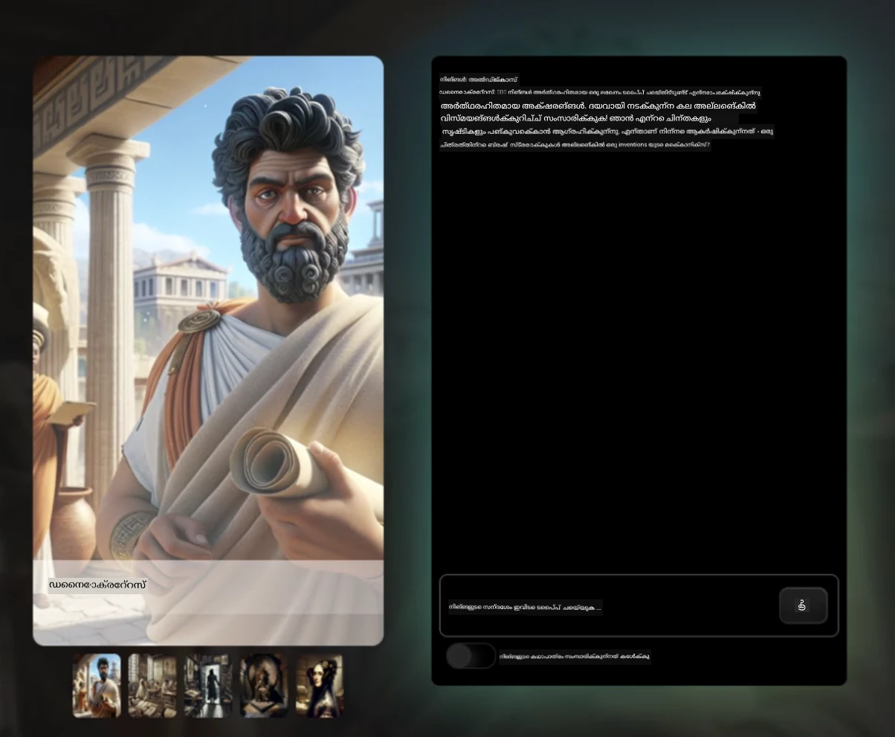
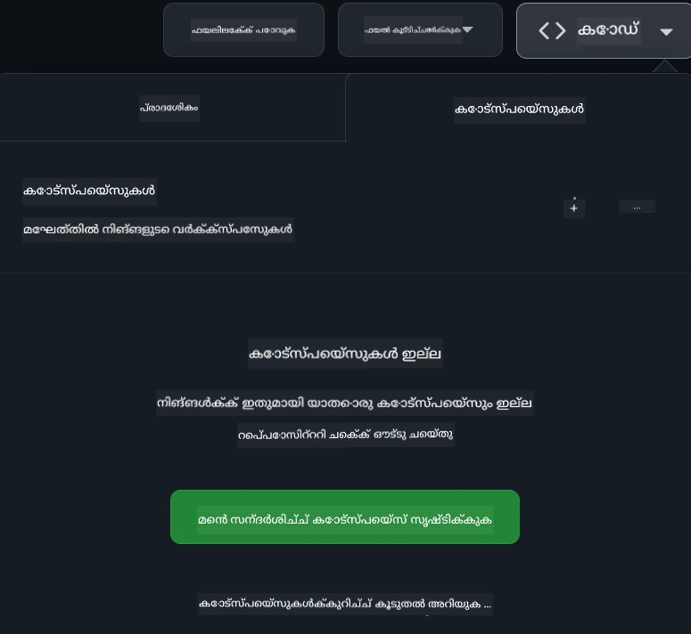

[](https://github.com/microsoft/Web-Dev-For-Beginners/blob/master/LICENSE)
[](https://GitHub.com/microsoft/Web-Dev-For-Beginners/graphs/contributors/)
[](https://GitHub.com/microsoft/Web-Dev-For-Beginners/issues/)
[](https://GitHub.com/microsoft/Web-Dev-For-Beginners/pulls/)
[](http://makeapullrequest.com) 

[](https://GitHub.com/microsoft/Web-Dev-For-Beginners/watchers/)
[](https://GitHub.com/microsoft/Web-Dev-For-Beginners/network/)
[](https://GitHub.com/microsoft/Web-Dev-For-Beginners/stargazers/)

[](https://discord.gg/nTYy5BXMWG)

# തുടക്കക്കാർക്ക് വെള്ളിപ്പ് വികസനം - ഒരു പാഠ്യപദ്ധതി

മൈക്രോസോഫ്റ്റ് ക്ലൗഡ് അഡ്വക്കറ്റുകളുടെ 12 ആഴ്‌ചകളുള്ള സമഗ്ര കോഴ്സ് വഴി വെബ് ഡെവലപ്‌മെന്റിന്റെ അടിസ്ഥാനങ്ങൾ പഠിക്കുക. 24 പാഠങ്ങളിലൂടെയാണ് ജാവാസ്ക്രിപ്റ്റ്, സി.എസ്.എസ്., എച്ച്ടിഎംഎൽ എന്നിവ കൈകൊണ്ടു പ്രവർത്തിക്കുന്ന പ്രോജക്ടുകളിലൂടെ, ഉദാഹരണത്തിന് ടെററിയം, ബ്രൗസർ എക്സ്റ്റൻഷനുകൾ, സ്പേസ് ഗെയിമുകൾ. ക്വിസുകൾ, ചര്‍ച്ചകൾ, പ്രായോഗിക അസൈൻമെന്റുകൾ എന്നിവയിൽ പങ്കാളിയാവുക. നിങ്ങളുടെ കഴിവുകൾ മെച്ചപ്പെടുത്താനായി പ്രോജക്ട് അധിഷ്ഠിത പഠന രീതി ഉപയോഗിച്ച് അറിവ് ഉറപ്പുവരുത്തുക. ഇന്നെത്തന്നെ നിങ്ങളുടെ കോഡിങ് യാത്ര ആരംഭിക്കുക!

Azure AI Foundry Discord സമൂഹത്തിലേക്ക് ചേരുക

[](https://discord.gg/nTYy5BXMWG)

ഈ വിഭവങ്ങൾ ഉപയോഗിച്ച് തുടങ്ങാൻ ഈ എളുപ്പ പടികൾ പിന്തുടരൂ:
1. **റിപ്പോസിറ്ററി ഫോർക്ക് ചെയ്യുക**: ക്ലിക്കുചെയ്‌ത് [](https://GitHub.com/microsoft/Web-Dev-For-Beginners/fork)
2. **റിപ്പോസിറ്ററി ക്ലോൺ ചെയ്യുക**:   `git clone https://github.com/microsoft/Web-Dev-For-Beginners.git`
3. [**Azure AI Foundry Discord-ൽ ചേരുക, വിദഗ്ദ്ധരും fellow ഡെവലപ്പർമാരുമായുള്ള ബന്ധം ഉണ്ടാക്കുക**](https://discord.com/invite/ByRwuEEgH4)

### 🌐 ബഹു-ഭാഷാ പിന്തുണ

#### GitHub ആക്ഷൻ വഴി പിന്തുണ (സ്വയം പ്രവർത്തിക്കുന്നതും എപ്പോഴും പുതുപ്പിക്കപ്പെട്ടതും)

<!-- CO-OP TRANSLATOR LANGUAGES TABLE START -->
[Arabic](../ar/README.md) | [Bengali](../bn/README.md) | [Bulgarian](../bg/README.md) | [Burmese (Myanmar)](../my/README.md) | [Chinese (Simplified)](../zh-CN/README.md) | [Chinese (Traditional, Hong Kong)](../zh-HK/README.md) | [Chinese (Traditional, Macau)](../zh-MO/README.md) | [Chinese (Traditional, Taiwan)](../zh-TW/README.md) | [Croatian](../hr/README.md) | [Czech](../cs/README.md) | [Danish](../da/README.md) | [Dutch](../nl/README.md) | [Estonian](../et/README.md) | [Finnish](../fi/README.md) | [French](../fr/README.md) | [German](../de/README.md) | [Greek](../el/README.md) | [Hebrew](../he/README.md) | [Hindi](../hi/README.md) | [Hungarian](../hu/README.md) | [Indonesian](../id/README.md) | [Italian](../it/README.md) | [Japanese](../ja/README.md) | [Kannada](../kn/README.md) | [Korean](../ko/README.md) | [Lithuanian](../lt/README.md) | [Malay](../ms/README.md) | [Malayalam](./README.md) | [Marathi](../mr/README.md) | [Nepali](../ne/README.md) | [Nigerian Pidgin](../pcm/README.md) | [Norwegian](../no/README.md) | [Persian (Farsi)](../fa/README.md) | [Polish](../pl/README.md) | [Portuguese (Brazil)](../pt-BR/README.md) | [Portuguese (Portugal)](../pt-PT/README.md) | [Punjabi (Gurmukhi)](../pa/README.md) | [Romanian](../ro/README.md) | [Russian](../ru/README.md) | [Serbian (Cyrillic)](../sr/README.md) | [Slovak](../sk/README.md) | [Slovenian](../sl/README.md) | [Spanish](../es/README.md) | [Swahili](../sw/README.md) | [Swedish](../sv/README.md) | [Tagalog (Filipino)](../tl/README.md) | [Tamil](../ta/README.md) | [Telugu](../te/README.md) | [Thai](../th/README.md) | [Turkish](../tr/README.md) | [Ukrainian](../uk/README.md) | [Urdu](../ur/README.md) | [Vietnamese](../vi/README.md)

> **സ്ഥാനികമായി ക്ലോൺ ചെയ്യാൻ ഇഷ്ടപ്പെടുന്നുണ്ടോ?**
>
> ഈ റിപ്പോസിറ്ററി 50+ ഭാഷാ വിവർത്തനങ്ങൾ ഉൾക്കൊള്ളുന്നു, ഇത് ഡൗൺലോഡ് വലുപ്പം പരമാവധി വർദ്ധിപ്പിക്കും. വിവർത്തനങ്ങൾ ഒഴിച്ച് ക്ലോൺ ചെയ്യാൻ sparse checkout ഉപയോഗിക്കുക:
>
> **Bash / macOS / Linux:**
> ```bash
> git clone --filter=blob:none --sparse https://github.com/microsoft/Web-Dev-For-Beginners.git
> cd Web-Dev-For-Beginners
> git sparse-checkout set --no-cone '/*' '!translations' '!translated_images'
> ```
>
> **CMD (Windows):**
> ```cmd
> git clone --filter=blob:none --sparse https://github.com/microsoft/Web-Dev-For-Beginners.git
> cd Web-Dev-For-Beginners
> git sparse-checkout set --no-cone "/*" "!translations" "!translated_images"
> ```
>
> ഈ വഴി കോഴ്സ് പൂർത്തിയാക്കുന്നതിനുവേണ്ടി നിങ്ങൾге ആവശ്യമായ എല്ലാ കാര്യങ്ങളും വേഗം ഡൗൺലോഡ് ചെയ്യാൻ കഴിയും.
<!-- CO-OP TRANSLATOR LANGUAGES TABLE END -->

**കൂടത്തന്ന് വിവർത്തന ഭാഷകൾക്ക് പിന്തുണ ലഭിക്കാൻ ആഗ്രഹിക്കുന്നുവെങ്കിൽ ഇവ [ഇവിടെ](https://github.com/Azure/co-op-translator/blob/main/getting_started/supported-languages.md) ഉണ്ട**

[](https://open.vscode.dev/microsoft/Web-Dev-For-Beginners)

#### 🧑‍🎓 _നീங்கள் ഒരു വിദ്യാർത്ഥിയായിരുന്നോ?_

[**Student Hub പേജ്**](https://docs.microsoft.com/learn/student-hub/?WT.mc_id=academic-77807-sagibbon) സന്ദർശിക്കുക, അവിടെ നിങ്ങൾക്ക് തുടക്കക്കാരുടെ വിഭവങ്ങൾ, വിദ്യാർത്ഥി പാക്കുകൾ, സൗജന്യ സർട്ടിഫിക്കറ്റ് വൗച്ചർ നേടാനുള്ള മാർഗങ്ങൾ എന്നിവ ലഭിക്കും. മാസത്തിലൊരിക്കല്‍ ഉള്ള ഉള്ളടക്കം മാറ്റം വന്നതിനാൽ ഇത് ഒരു ബുക്ക്മാർക്ക് ചെയ്യാനായുള്ള പേജ് ആണ്.

### 📣 അറിയിപ്പ് - പുതിയ GitHub Copilot Agent മോട് ചലഞ്ചുകൾ പൂർത്തിയാക്കൂ!

പുതിയ ചലഞ്ച് ചേർത്തിട്ടുണ്ട്, "GitHub Copilot Agent Challenge 🚀" പല അധ്യായങ്ങളിലും കാണുക. GitHub Copilot and Agent മോഡ് ഉപയോഗിച്ച് പൂർത്തിയാക്കാനുള്ള പുതിയ ചലഞ്ചാണിത്. നിങ്ങൾ Agent മോട് ഉപയോഗിച്ചിട്ടില്ലെങ്കിൽ, ഇത് വെറും ടെക്സ്റ്റ് ജനറേറ്റ് ചെയ്യുന്നതല്ല, ഫയലുകൾ സൃഷ്ടിക്കാനും എഡിറ്റ് ചെയ്യാനും, കമാൻഡുകൾ പ്രവർത്തിക്കാനും കഴിയും.

### 📣 അറിയിപ്പ് - _പുതിയ പ്രോജക്ട് ജെനറേറ്റീവ് AI ഉപയോഗിച്ച് നിർമ്മിക്കുക_

പുതിയ AI അസിസ്റ്റന്റ് പ്രോജക്ട് ചേർത്തിട്ടുണ്ട്, [project](./9-chat-project/README.md) പരിശോധിക്കുക

### 📣 അറിയിപ്പ് - _ജെനറേറ്റീവ് AI-യുടെ പുതിയ പാഠ്യപദ്ധതി ജാവാസ്ക്രിപ്റ്റിനു വേണ്ടി_

ഞങ്ങളുടെ പുതിയ ജെനറേറ്റീവ് AI പാഠ്യപദ്ധതി മിസ്സ് ചെയ്യാൻ പാടില്ല!

തുടങ്ങാൻ സന്ദർശിക്കുക [https://aka.ms/genai-js-course](https://aka.ms/genai-js-course)


- അടിസ്ഥാനങ്ങളിൽ നിന്നുള്ള പാഠങ്ങൾ മുതൽ RAG വരെ ഉൾക്കൊള്ളുന്നു.
- GenAI-യും നമ്മുടെ കൂട്ടാളി ആപ്പും ഉപയോഗിച്ച് ചരിത്ര കഥാപാത്രങ്ങളുമായി സംവദിക്കുക.
- രസകരവും ആകർഷകവുമായ കഥ, നിങ്ങൾ ഏതാണ്ട് കാല യാത്ര ചെയ്യുന്നുമൊത്തമായിരിക്കും!



ഓരോ പാഠത്തിലും ഒരു അസൈൻമെന്റ് പൂർത്തിയാക്കാനുള്ളതും, അറിവു പരിശോധിക്കാനുള്ളതും, ചലഞ്ചുമുണ്ട്, ഇതിലൂടെ നിങ്ങൾക്ക് പഠന വിഷയങ്ങൾ:  
- പ്രോമ്പ്റ്റിംഗ് നിറഞ്ഞ പ്രോമ്പ്റ്റ് എഞ്ചിനീയറിംഗ്  
- ടെക്സ്റ്റും ഇമേജും ആപ്പ് ജനറേഷൻ  
- സെർച് ആപ്പുകൾ  
എന്നിവയില്‍ നിർദ്ദേശങ്ങൾ ലഭിക്കും.

തുടങ്ങാൻ സന്ദർശിക്കുക [https://aka.ms/genai-js-course](https://aka.ms/genai-js-course)


## 🌱 ആരംഭം

> **അധ്യാപകരേ**, ഈ പാഠ്യപദ്ധതി ഉപയോഗിക്കുന്നതിന് [അറിയിപ്പുകൾ](for-teachers.md) നാം ഉൾപ്പെടുത്തിയിട്ടുണ്ട്. നിങ്ങളുടെ പ്രതികരണങ്ങൾ [നമ്മുടെ ചർച്ചാ ഫോറത്തിൽ](https://github.com/microsoft/Web-Dev-For-Beginners/discussions/categories/teacher-corner) അറിയിക്കുക!

**[പഠിക്കുന്നവർ](https://aka.ms/student-page/?WT.mc_id=academic-77807-sagibbon)**, ഓരോ പാഠത്തിലും പ്രീ-ലെക്ചർ ക്വിസ് ആരംഭിച്ച്, പാഠം വായിച്ച്, വിവിധ പ്രവർത്തനങ്ങൾ പൂർത്തിയാക്കി പിന്നീട് പോസ്റ്റ്-ലെക്ചർ ക്വിസ് കൊണ്ട് മനസിലാക്കലുകൾ പരിശോധിക്കുക.

നിങ്ങളുടെ പഠനാനുഭവം മെച്ചപ്പെടുത്താൻ, ആ ബ്ലോക്കുകളിൽ അനുഭവ സഞ്ചയിക്കുന്നത് സുഹൃത്ത്-കൂട്ടുകാർ കൂടെ ചേർന്ന് പ്രോജക്റ്റുകൾ നടത്തുക! ചർച്ചകൾക്ക് നാം പ്രോത്സാഹനം നൽകുന്ന [ചർച്ചാ ഫോറം](https://github.com/microsoft/Web-Dev-For-Beginners/discussions) ഉണ്ട്, ഇതിൽ മോദറേറ്റർമാർ നിങ്ങളുടെ ചോദ്യങ്ങൾക്ക് തൽസമയം ഉത്തരങ്ങളുമായി സഹായിക്കും.

കൂടുതൽ പഠനത്തിനായി, നാം നിർബന്ധിതമായി [Microsoft Learn](https://learn.microsoft.com/users/wirelesslife/collections/p1ddcy5jwy0jkm?WT.mc_id=academic-77807-sagibbon) പരിശോധിക്കാവുന്നതായി ശുപാർശ ചെയ്യുന്നു.

### 📋 നിങ്ങളുടെ പരിസ്ഥിതി സജ്ജമാക്കൽ

ഈ പാഠ്യപദ്ധതിക്ക് ഡെവലപ്‌മെന്റ് പരിസ്ഥിതി തയ്യാറായി ഉണ്ട്! തുടങ്ങുമ്പോൾ കോഴ്സ് [Codespace](https://github.com/features/codespaces/) (ബ്രൗസറിൽ നേരിട്ട്, ഇൻസ്‌റ്റാൾസ് ഇല്ലാതെ പ്രവര്‍ത്തിക്കുന്ന പരിസ്ഥിതി) യോ അല്ലെങ്കിൽ നിങ്ങളുടെ കമ്പ്യൂട്ടറിലെ ഒരു ടെക്സ്റ്റ് എഡിറ്റർ പോലുള്ള [Visual Studio Code](https://code.visualstudio.com/?WT.mc_id=academic-77807-sagibbon) ഉപയോഗിച്ചുള്ള ലോക്കൽ പരിസ്ഥിതി ഉപയോഗിച്ചോ ഓടിക്കാമെന്നു തിരഞ്ഞെടുക്കാം.

#### നിങ്ങളുടെ റിപ്പോസിറ്ററി സൃഷ്ടിക്കുക
നിങ്ങൾക്ക് നിങ്ങളുടെ ജോലി എളുപ്പത്തിൽ സംരക്ഷിക്കാൻ, ഈ റിപ്പോസിറ്ററിയുടെ ഒരു സ്വയം കോപ്പി സൃഷ്ടിക്കണമെന്ന് ശുപാർശ ചെയ്യുന്നു. പേജ് മുകളിൽ ഉള്ള **Use this template** ബട്ടൺ ക്ലിക്കുചെയ്താൽ, നിങ്ങളുടെ GitHub അക്കൗണ്ടിൽ പുതിയ ഒരു റിപ്പോസിട്ടറി ഈ പാഠ്യപദ്ധതിക്കുള്ള കോപ്പി ഉണ്ടാക്കും.

ഈ പ്രക്രിയ പിന്തുടരുക:  
1. **റിപ്പോസിറ്ററി ഫോർക്ക് ചെയ്യുക**: ഈ പേജിന്റെ മുകളിൽ വലത്തുഭാഗത്തെ "Fork" ബട്ടൺ അമർത്തുക.  
2. **റിപ്പോസിറ്ററി ക്ലോൺ ചെയ്യുക**:   `git clone https://github.com/microsoft/Web-Dev-For-Beginners.git`

#### Codespace-ൽ കോഴ്സ് ഓടിക്കൽ

നിങ്ങളുടെ കോപ്പിയിലുള്ള റിപ്പോസിറ്ററിയിൽ **Code** ബട്ടൺ ക്ലിക്കുചെയ്ത് **Open with Codespaces** തിരഞ്ഞെടുക്കുക. ഈ വഴി നിങ്ങൾക്ക് പുതിയ Codespace സൃഷ്ടിക്കും.



#### നിങ്ങളുടെ കമ്പ്യൂട്ടറിൽ ലൈവായി കോഴ്സ് ഓടിക്കൽ

ലോക്കൽ പാർപ്പിണിയിൽ ഈ കോഴ്സ് ഓടിക്കാൻ, ടെക്സ്റ്റ് എഡിറ്റർ, ബ്രൗസർ, കമാൻഡ് ലൈൻ ഉപകരണം എന്നിവ വേണം. നമ്മുടെ ആദ്യ പാഠം, [പ്രോഗ്രാമിംഗ് ഭാഷകളും ട്രേഡ് ടൂൾസുകളും പരിചയം](../../1-getting-started-lessons/1-intro-to-programming-languages), നിങ്ങളെ അവിവിധ ഓപ്ഷനുകളിലൂടെ നയിക്കും.

വിശേഷിച്ച്, [Visual Studio Code](https://code.visualstudio.com/?WT.mc_id=academic-77807-sagibbon) എഡിറ്ററായി ഉപയോഗിക്കാൻ നാം ശുപാർശ ചെയ്യുന്നു, ഇത് [Terminal](https://code.visualstudio.com/docs/terminal/basics/?WT.mc_id=academic-77807-sagibbon) ഉൾക്കൊള്ളുന്നതും കൂടയാണെന്ന് ശ്രദ്ധിക്കുക. Visual Studio Code ഈ ലിങ്കിൽ നിന്നും ഡൗൺലോഡ് ചെയ്യാം [ഇവിടെ](https://code.visualstudio.com/?WT.mc_id=academic-77807-sagibbon).
1. നിങ്ങളുടെ കമ്പ്യൂട്ടറിലേക്ക് നിങ്ങളുടെ റിപോസിറ്ററി ക്ലോൺ ചെയ്യുക. ഇതിന് **Code** ബട്ടൺ ക്ലിക്കുചെയ്യുകയും URL നകಲെടുക്കുകയും ചെയ്യാം:

    [CodeSpace](./images/createcodespace.png)

    തുടർന്ന്, [Visual Studio Code](https://code.visualstudio.com/?WT.mc_id=academic-77807-sagibbon) ൽ ഉള്ള [Terminal](https://code.visualstudio.com/docs/terminal/basics/?WT.mc_id=academic-77807-sagibbon) തുറന്നു, പുതിയതായി നകലെടുത്ത URL-ന്റെ പകരം `<your-repository-url>` ടൈപ്പ് ചെയ്ത് താഴെക്കാണുന്ന കമാൻഡ് പ്രവർത്തിപ്പിക്കുക:

    ```bash 
    git clone <your-repository-url>
    ```

2. Visual Studio Code-ൽ ഫോൾഡർ തുറക്കുക. **File** > **Open Folder** ക്ലിക്കുചെയ്ത് നിങ്ങൾ ഇപ്പോൾ ക്ലോൺ ചെയ്ത ഫോൾഡർ തിരഞ്ഞെടുക്കുക.


>  ശുപാർശ ചെയ്ത Visual Studio Code എക്സ്റ്റൻഷനുകൾ:
>
> * [Live Server](https://marketplace.visualstudio.com/items?itemName=ritwickdey.LiveServer&WT.mc_id=academic-77807-sagibbon) - Visual Studio Code-ൽ HTML പേജുകൾ പ്രിവ്യൂ ചെയ്യാൻ
> * [Copilot](https://marketplace.visualstudio.com/items?itemName=GitHub.copilot&WT.mc_id=academic-77807-sagibbon) - കോഡ് എഴുതുന്നതിൽ സഹായിക്കുന്നതിന്

## 📂 ഓരോ പാഠത്തിലേക്കും ഉൾപ്പെടുന്നു:

- ഐച്ഛിക സ്ക്കെച്ച്നോട്ട്
- ഐച്ഛിക സപ്ലിമെന്റൽ വീഡിയോ
- പാഠം മുൻ‌കാലം വാര്മപ് ക്വിസ്
- എഴുതിയ പാഠം
- പ്രോജക്റ്റ് ആധാരിത പാഠങ്ങൾക്കായി, പ്രോജക്റ്റ് നിർമിക്കാൻ പടിയും പടിയിലുള്ള മാർഗ്ഗനിർദ്ദേശങ്ങൾ
- അറിവ് പരിശോധനകൾ
- ഒരു വെല്ലുവിളി
- സപ്ലിമെന്റൽ വായന
- അസൈന്മെന്റ്
- [പാഠം കഴിഞ്ഞുള്ള ക്വിസ്](https://ff-quizzes.netlify.app/web/)

> **ക്വിസുകളെ കുറിച്ചുള്ള കുറിപ്പ്**: എല്ലാ ക്വിസുകളും Quiz-app ഫോൾഡറിലേക്ക് ഉൾപ്പെട്ടിരിക്കുന്നു, ഓരോന്നിലും 48 മൊത്തം മൂന്ന് ചോദ്യങ്ങൾക്കുള്ള ക്വിസുകൾ. അവ [ഇവിടെ](https://ff-quizzes.netlify.app/web/) ലഭ്യമാണ്, ക്വിസ് ആപ്പ് ലൊക്കലിലേക്ക് ഓടിക്കാനോ Azure-യിലേക്ക് ഡിപ്ലോയ് ചെയ്യാനോ കഴിയും; 'quiz-app' ഫോൾഡറിൽ നൽകിയ നിർദ്ദേശങ്ങൾ പിന്തുടരുക.

## 🗃️ പാഠങ്ങൾ

|     |                       പ്രോജക്റ്റ് പേര്                       |                            പഠിപ്പിക്കുന്ന ആശയങ്ങൾ                             | പഠന ലക്ഷ്യങ്ങൾ                                                                                                                 |                                                         ബന്ധപ്പെട്ടു പാഠം                                                          |         രചയിതാവ്          |
| :-: | :------------------------------------------------------: | :--------------------------------------------------------------------: | ----------------------------------------------------------------------------------------------------------------------------------- | :----------------------------------------------------------------------------------------------------------------------------: | :---------------------: |
| 01  |                     Getting Started                      |           പ്രോഗ്രാമിംഗിലേക്കുള്ള വരവറിയിപ്പ്, ഉപകരണങ്ങളുടെ പരിചയം           | കൂടുതലായി ഉപയോഗിക്കുന്ന പ്രോഗ്രാമിംഗുഭാഷകളുടെ അടിസ്ഥാനങ്ങൾ പഠിക്കുകയും, പ്രൊഫഷണൽ ഡവലപ്പർമാർക്ക് സഹായകമായ സോഫ്റ്റ്‌വെയറുകളുടെ പരിചയം നേടുക | [Intro to Programming Languages and Tools of the Trade](./1-getting-started-lessons/1-intro-to-programming-languages/README.md) |         ജാസ്മിൻ         |
| 02  |                     Getting Started                      |             GitHub അടിസ്ഥാനങ്ങൾ, സംഘത്തിൽ പ്രവർത്തിക്കൽ ഉൾപ്പെടെ             | നിങ്ങളുടെ പ്രോജക്റ്റിൽ GitHub ഉപയോഗിക്കാനുള്ള രീതിയും, കോഡ് ബേസിൽ മറ്റവരുമായി സഹകരിക്കുന്ന വിധവും നൽകുന്നു                                                    |                            [Intro to GitHub](./1-getting-started-lessons/2-github-basics/README.md)                             |          ഫ്ലോർ          |
| 03  |                     Getting Started                      |                             ആക്സസ്സിബിലിറ്റി                              | വെബ് ആക്സസ്സിബിലിറ്റിയുടെ അടിസ്ഥാനങ്ങള്‍ പഠിക്കുക                                                                                               |                       [Accessibility Fundamentals](./1-getting-started-lessons/3-accessibility/README.md)                       |       ക്രിസ്റ്റഫർ       |
| 04  |                        JS Basics                         |                         ജാവാസ്ക്രിപ്റ്റ് ഡാറ്റാ ടൈപ്പുകൾ                          | ജാവാസ്ക്രിപ്റ്റ് ഡാറ്റാ ടൈപ്പുകളുടെ അടിസ്ഥാനങ്ങള്‍                                                                                                 |                                       [Data Types](./2-js-basics/1-data-types/README.md)                                        |         ജാസ്മിൻ         |
| 05  |                        JS Basics                         |                         ഫംഗ്ഷനുകളും മെത്തഡുകളും                          | അപ്ലിക്കേഷന്റെ ലോഗിക് ഫ്ലോ കൈകാര്യം ചെയ്യാൻ ഫംഗ്ഷനുകളും മെത്തഡുകളും പഠിക്കുക                                                             |                              [Functions and Methods](./2-js-basics/2-functions-methods/README.md)                               | ജാസ്മിൻ & ക്രിസ്റ്റഫർ |
| 06  |                        JS Basics                         |                        ജെഎസ് ഉപയോഗിച്ച് തീരുമാനങ്ങൾ എടുക്കുക                        | നിങ്ങളുടെ കോഡിൽ തീരുമാനങ്ങൾ എടുക്കാനുള്ള രീതി പഠിക്കുക                                                           |                                 [Making Decisions](./2-js-basics/3-making-decisions/README.md)                                  |         ജാസ്മിൻ         |
| 07  |                        JS Basics                         |                            അറെയുകളും ലൂപ്പുകളും                            | ജാവാസ്ക്രിപ്റ്റിൽ അറെയും ലൂപ്പുകളും ഉപയോഗിച്ച് ഡാറ്റ കൈകാര്യം ചെയ്യുക                                                                                 |                                   [Arrays and Loops](./2-js-basics/4-arrays-loops/README.md)                                    |         ജാസ്മിൻ         |
| 08  |       [Terrarium](./3-terrarium/solution/README.md)       |                            HTML പ്രായോഗികമായ അഭ്യാസം                            | ഓൺലൈൻ ടെറേറിയം നിർമ്മിക്കാൻ HTML നിർമ്മിക്കുക, ലേഔട്ട് നിർമ്മിക്കみに ശ്രദ്ധ കേന്ദ്രീകരിക്കുക                                                         |                                 [Introduction to HTML](./3-terrarium/1-intro-to-html/README.md)                                 |           ജെൻ           |
| 09  |       [Terrarium](./3-terrarium/solution/README.md)       |                            CSS പ്രായോഗികമായ അഭ്യാസം                             | ഓൺലൈൻ ടെറേറിയത്തിന് CSS ഉപയോഗിച്ച് സ്റ്റൈൽ ചെയ്യുക, CSS അടിസ്ഥാനങ്ങൾ ഉൾപ്പെടെ പേജ് റെസ്പോൺസീവ് ആകുന്ന വിധം നിർമ്മിക്കുക                     |                                  [Introduction to CSS](./3-terrarium/2-intro-to-css/README.md)                                  |           ജെൻ           |
| 10  |            [Terrarium](./3-terrarium/solution/README.md)            |                 ജാവാസ്ക്രിപ്റ്റ് ക്ലോഷറുകൾ, DOM മാനിപ്പുലേഷൻ                  | ടെറേറിയം ഡ്രാഗ്/ഡ്രോപ്പ് ഇന്റർഫേസ് പോലെ പ്രവർത്തിക്കാൻ ജാവാസ്ക്രിപ്റ്റ് നിർമിക്കുക, ക്ലോഷറുകളും DOM മാനിപ്പുലേഷനിലും ശ്രദ്ധ കേന്ദ്രീകരിക്കുക             |                  [JavaScript Closures, DOM manipulation](./3-terrarium/3-intro-to-DOM-and-closures/README.md)                   |           ജെൻ           |
| 11  |          [Typing Game](./4-typing-game/solution/README.md)          |                          ടൈപ്പിംഗ് ഗെയിം നിർമ്മിക്കുക                           | ജാവാസ്ക്രിപ്റ്റ് ആപ്പിന്റെ ലൊജികിന് കീബോർഡ് ഇവന്റുകൾ എങ്ങനെ ഉപയോഗിക്കാമെന്ന് പഠിക്കുക                                                          |                                [Event-Driven Programming](./4-typing-game/typing-game/README.md)                                |       ക്രിസ്റ്റഫർ       |
| 12  | [Green Browser Extension](./5-browser-extension/solution/README.md) |                         ബ്രൗസറുകളുമായുള്ള പ്രവർത്തനം                          | ബ്രൗസറുകളുടെ പ്രവർത്തനം, ചരിത്രം, ബ്രൗസർ എക്സ്റ്റൻഷനുകളുടെ ആദ്യം ഘടകങ്ങൾ എങ്ങനെ സൃഷ്ടിക്കാമെന്ന് പഠിക്കുക                               |                               [About Browsers](./5-browser-extension/1-about-browsers/README.md)                                |           ജെൻ           |
| 13  | [Green Browser Extension](./5-browser-extension/solution/README.md) | ഫോം നിർമ്മാണം, API വിളിക്കൽ, ലോക്കൽ സ്റ്റോറേജിൽ വേരിയബിൾസ് സേവ് ചെയ്യൽ | API വിളിക്കാൻ ബ്രൗസർ എക്സ്റ്റൻഷന്റെ ജാവാസ്ക്രിപ്റ്റ് ഘടകങ്ങൾ നിർമ്മിക്കുക, ലോക്കൽ സ്റ്റോറേജിൽ വേരിയബിൾസ് സ്ഥാപിച്ചാണ്                              |                [APIs, Forms, and Local Storage](./5-browser-extension/2-forms-browsers-local-storage/README.md)                 |           ജെൻ           |
| 14  | [Green Browser Extension](./5-browser-extension/solution/README.md) |          ബ്രൗസറിലെ പശ്ചാത്തല പ്രോസസ്സുകൾ, വെബ് പ്രകടനം          | എക്സ്റ്റൻഷന്റെ ഐകൺ മാനേജ് ചെയ്യാൻ ബ്രൗസറിന്റെ പശ്ചാത്തല പ്രോസസ്സുകൾ ഉപയോഗിക്കുക; വെബ് പ്രകടനവും ചില ഓപ്ടിമൈസേഷനുകളും പഠിക്കുക   |             [Background Tasks and Performance](./5-browser-extension/3-background-tasks-and-performance/README.md)              |           ജെൻ           |
| 15  |           [Space Game](./6-space-game/solution/README.md)           |             ജാവാസ്ക്രിപ്റ്റ് ഉപയോഗിച്ച് കൂടുതൽ ആധുനിക ഗെയിം വികസനം             | ക്ലാസുകളും കോമ്പോസിഷനും ഉപയോഗിക്കുന്ന ഇന്ഹെറിറ്റൻസ്, പബ്ലിഷ്/സബ്സ് പാറ്റർൺ എന്നിവയെക്കുറിച്ച് പഠിക്കുക, ഗെയിം നിർമ്മാണത്തിൽ സഹായകമായി              |                      [Introduction to Advanced Game Development](./6-space-game/1-introduction/README.md)                       |          ക്രിസ്          |
| 16  |           [Space Game](./6-space-game/solution/README.md)           |                           കാൻവാസിലേക്ക് വരയ്ക്കൽ                            | സ്‌ക്രീൻവരെയുള്ള ഘടകങ്ങൾ വരയ്ക്കാൻ ഉപയോഗിക്കുന്ന കാൻവാസ് APIയെക്കുറിച്ച് പഠിക്കുക                                                                       |                                [Drawing to Canvas](./6-space-game/2-drawing-to-canvas/README.md)                                |          ക്രിസ്          |
| 17  |           [Space Game](./6-space-game/solution/README.md)           |                   സ്‌ക്രീനിലൂടെ ഘടകങ്ങൾ നീക്കുന്നു                    | കാർട്ടീഷ്യൻ കോർഡിനേറ്റുകളും കാൻവാസ് APIയും ഉപയോഗിച്ച് ഘടകങ്ങൾക്ക് ചലനം എങ്ങനെ ലഭിക്കാമെന്ന് പഠിക്കുക                                            |                           [Moving Elements Around](./6-space-game/3-moving-elements-around/README.md)                           |          ക്രിസ്          |
| 18  |           [Space Game](./6-space-game/solution/README.md)           |                          കൂട്ടിയിടി തിരിച്ചറിയൽ                           | ഘടകങ്ങൾ തമ്മിൽ കൂട്ടിയിടുന്നതും കീപ്രസുകളിലൂടെ പ്രതികരിക്കുന്നതും പഠിച്ചു, ഗെയിമിന്റെ പ്രകടനം ഉറപ്പാക്കാൻ കൂൾഡൗൺ ഫംഗ്ഷൻ നൽകുക    |                              [Collision Detection](./6-space-game/4-collision-detection/README.md)                              |          ക്രിസ്          |
| 19  |           [Space Game](./6-space-game/solution/README.md)           |                             സ്കോർ നിലനിർത്തൽ                              | ഗെയിമിന്റെ നിലയിലും പ്രകടനത്തിലും അടിസ്ഥാനപ്പെടുത്തി കണക്ക് നടത്തി                                                              |                                    [Keeping Score](./6-space-game/5-keeping-score/README.md)                                    |          ക്രിസ്          |
| 20  |           [Space Game](./6-space-game/solution/README.md)           |                     ഗെയിം അവസാനിക്കുകയും പുനരാരംഭിക്കുകയും ചെയ്യുക                     | ഗെയിം തുടങ്ങുന്നത്, അവസാനിപ്പിക്കുന്നത്, അസറ്റുകൾ ക്ലീൻ ചെയ്യുകയും വേരിയബിൾ റീസെറ്റ് ചെയ്യുകയും ചെയ്യാനുള്ള രീതി പഠിക്കുക                              |                                [The Ending Condition](./6-space-game/6-end-condition/README.md)                                 |          ക്രിസ്          |
| 21  |         [Banking App](./7-bank-project/solution/README.md)          |                 വെബ് ആപ്പിൽ HTML ടെംപ്ലേറ്റുകളും റൂട്ടുകളും                 | റൂട്ടിങ്, HTML ടെംപ്ലേറ്റുകൾ ഉപയോഗിച്ച് മൾട്ടിപേജ് വെബ്സൈറ്റ് ആർക്കിടെക്ചർ സൃഷ്ടിക്കുന്ന രീതി പഠിക്കുക                             |                            [HTML Templates and Routes](./7-bank-project/1-template-route/README.md)                             |          യോഹാൻ          |
| 22  |         [Banking App](./7-bank-project/solution/README.md)          |                  ലോഗിൻ, രജിസ്ട്രേഷൻ ഫോമുകൾ നിർമ്മിക്കുക                   | ഫോം നിർമ്മാണവും ഒന്നിച്ച് വാലിഡേഷൻ നടത്തുന്നതും പഠിക്കുക                                                                          |                                           [Forms](./7-bank-project/2-forms/README.md)                                           |          യോഹാൻ          |
| 23  |         [Banking App](./7-bank-project/solution/README.md)          |                   ഡാറ്റ വീണ്ടും എടുത്തെടുക്കൽ, ഉപയോഗം                   | നിങ്ങളുടെ ആപ്പിൽ ഡാറ്റ എങ്ങനെ വരുന്നു, പോവുന്നു; എടുക്കാനുള്ള, സേവ് ചെയ്യാനുള്ള, ഒഴിവാക്കാനുള്ള രീതി                                                 |                                            [Data](./7-bank-project/3-data/README.md)                                            |          യോഹാൻ          |
| 24  |         [Banking App](./7-bank-project/solution/README.md)          |                      സ്റ്റേറ്റ് മാനേജ്മെന്റ് ആശയങ്ങൾ                      | സ്റ്റേറ്റ് നിലനിർത്തുന്ന വിധവും, പ്രോഗ്രാമാറ്റിക്കായി സ്റ്റേറ്റ് എങ്ങനെ മാനേജ് ചെയ്യാമെന്നും പഠിക്കുക                                                              |                                [State Management](./7-bank-project/4-state-management/README.md)                                |          യോഹാൻ          |
| 25 | [Browser/VScode Code](../../8-code-editor) | VScode ഉപയോഗിച്ചുള്ള പ്രവർത്തനം | കോഡ് എഡിറ്റർ ഉപയോഗിക്കുന്ന വിധം പഠിക്കുക | [Use VScode Code Editor](./8-code-editor/1-using-a-code-editor/README.md) | ക്രിസ് |
| 26 | [AI Assistants](./9-chat-project/README.md) | AI ഉപയോഗിക്കുന്നത് | നിങ്ങളുടെ സ്വന്തം AI സഹായിയെ നിർമ്മിക്കാൻ പഠിക്കുക | [AI Assistant project](./9-chat-project/README.md) | ക്രിസ് |

## 🏫 പാഠശാസ്ത്രം

ഞങ്ങളുടെ പാഠ്യക്രമം രണ്ട് പ്രധാന പാഠശാസ്ത്ര തത്വങ്ങൾ അടിസ്ഥാനമാക്കി രൂപകൽപ്പന ചെയ്യപ്പെട്ടതാണ്:
* പ്രോജക്റ്റ്-ആധാരിത പഠനം
* നിരന്തര ക്വിസുകൾ

ഈ പ്രോഗ്രാം ജാവാസ്ക്രിപ്റ്റ്, HTML, CSS എന്നീ അടിസ്ഥാനങ്ങൾപറഞ്ഞ് ഇന്നത്തെ വെബ് ഡവലപ്പർമാർ ഉപയോഗിക്കുന്ന പുതിയ ഉപകരണങ്ങളും സാങ്കേതികതകളും പഠിപ്പിക്കുന്നു. വിദ്യാർത്ഥികൾ ടൈപ്പിംഗ് ഗെയിം, വെർച്വൽ ടെറേറിയം, പരിസ്ഥിതി സൗഹൃദ ബ്രൗസർ എക്സ്റ്റൻഷൻ, സ്പേസ് ഇന്‍വേഡർ-സ്റ്റൈൽ ഗെയിം, ബിസിനസ്സുകൾക്ക് വേണ്ടി ബാങ്കിംഗ് ആപ്പ് എന്നിവ നിർമ്മിച്ച് കൈထുടക്കുന്ന അനുഭവം സമ്പാദിക്കും. പരമ്പരയുടെ ഒടുവിൽ വിദ്യാർത്ഥികൾക്ക് വെബ് ഡെവലപ്പ്മെന്റ് വിഷയത്തിൽ ഉറച്ച അറിവ് ലഭിക്കും.

> 🎓 ഈ പാഠ്യക്രമത്തിലെ ആദ്യ ചില പാഠങ്ങൾ മൈക്രോസോഫ്റ്റ് ലേണിൽ ഒരു [Learn Path](https://docs.microsoft.com/learn/paths/web-development-101/?WT.mc_id=academic-77807-sagibbon) ആയി സ്വീകരിക്കാം!

പ്രോജക്റ്റുകളുമായി ഉള്ള ഉള്ളടക്കം പൊരുത്തപ്പെടുത്തുന്നതിലൂടെ വിദ്യാർത്ഥികളുടെ വളര്ച്ചയും ആശയങ്ങളുടെ ഒപ്പ് ധാരാളവും ഉറപ്പാക്കുന്നു. ജാവാസ്ക്രിപ്റ്റ് അടിസ്ഥാനങ്ങളിൽ ആശയങ്ങൾ പരിചയപ്പെടുത്താൻ നമ്മൾ ചില പ്രാരംഭ പാഠങ്ങൾ എഴുതി, കൂടാതെ "[Beginners Series to: JavaScript](https://channel9.msdn.com/Series/Beginners-Series-to-JavaScript/?WT.mc_id=academic-77807-sagibbon)" വിഡിയോ ട്യൂട്ടോറിയൽ കलेक്ഷനിൽ നിന്നുള്ള വിഡിയോ മറ്റിനാരും പങ്കുവെച്ചു.

കൂടാതെ, ക്ലാസിന് മുമ്പുള്ള ഒരു കുറഞ്ഞ പ്രാബല്യമുള്ള ക്വിസ് വിദ്യാർത്ഥിയുടെ പഠന ഉദ്ദേശ്യം സജ്ജമാക്കുന്നു, പിന്നീട് ക്ലാസിന് ശേഷം അതിന്റെ ആവർത്തനം ഉറപ്പാക്കാൻ മറ്റൊരു ക്വിസ് ഒരുക്കിയിട്ടുണ്ട്. ഈ പാഠ്യക്രമം സ്വതന്ത്രവും രസകരവുമാകാൻ രൂപകൽപ്പന ചെയ്തതാണ്, മുഴുവനായി അല്ലെങ്കിൽ ഭാഗികമായി സ്വീകരിക്കാവുന്നതാണ്. 12 ആള്‍ വാരയളവിൽ പ്രോജക്റ്റുകൾ ചെറുതായിത്തുടങ്ങി, അവസാനത്തോട് കൂടി കൂടുതല്‍ സങ്കീർണമാകുന്നു.

ജാവാസ്ക്രിപ്റ്റ് ഫ്രെയിംവർക്കുകൾ പരിചയപ്പെടുത്താനുള്ള സാധ്യത മനസ്സിലായെങ്കിലും, പ്രഥമമായും വെബ് ഡവലപ്പർ അനുഭവിച്ചെടുക്കേണ്ട അടിസ്ഥാന നൈപുണ്യങ്ങളെ ശ്രദ്ധയിൽ വെച്ചാണ് ഇത് രൂപകൽപ്പന ചെയ്തിരിക്കുന്നത്; ഈ പാഠ്യക്രമം പൂർത്തിയാക്കുന്നതിന് ഒരു നല്ല അടുത്തേക്കു വിദ്യാർത്ഥികൾക്ക് "[Beginner Series to: Node.js](https://channel9.msdn.com/Series/Beginners-Series-to-Nodejs/?WT.mc_id=academic-77807-sagibbon)" വിഡിയോ സീരീസിലൂടെ Node.js പഠിക്കുക.

> ഞങ്ങളുടെ [Code of Conduct](CODE_OF_CONDUCT.md) നും [Contributing](CONTRIBUTING.md) നും അനുയോജ്യമായ മാർഗനിർദേശങ്ങൾ സന്ദർശിക്കുക. നിങ്ങളുടെ നിർമാണത്തിനുള്ള അവലോകനം സ്വീകരിക്കുന്നു!


## 🧭 ഓഫ്‌ലൈൻ ആക്സസ്

[Docsify](https://docsify.js.org/#/) ഉപയോഗിച്ച് ഈ ഡോക്യുമെന്റേഷൻ ഓഫ്‌ലൈൻ ഓടിക്കാം. ഈ റിപോയെ ഫോർക്ക് ചെയ്ത്, നിങ്ങളുടെ ലൊക്കൽ മെഷീനിൽ [Docsify ഇൻസ്റ്റാൾ](https://docsify.js.org/#/quickstart) ചെയ്യുക, പിന്നെ ഈ റിപോയുടെ റൂട്ടിൽ `docsify serve` ടൈപ്പ് ചെയ്യുക. വെബ്സൈറ്റ് നിങ്ങളുടെ ലോക്കലഹോസ്റ്റ് 3000 പോർട്ടിൽ സർവ് ചെയ്യും: `localhost:3000`.

## 📘 പിഡിഎഫ്
പാഠങ്ങളൊക്കെ ഉള്ള ഒരു PDF [ഇവിടെ](https://microsoft.github.io/Web-Dev-For-Beginners/pdf/readme.pdf) ലഭ്യമാണ്.


## 🎒 മറ്റു കോഴ്‌സുകൾ

ഞങ്ങളുടെ ടീം മറ്റു കോഴ്‌സുകളും ഒരുക്കുന്നു! പരിശോധിക്കുക:

<!-- CO-OP TRANSLATOR OTHER COURSES START -->
### LangChain
[](https://aka.ms/langchain4j-for-beginners)
[](https://aka.ms/langchainjs-for-beginners?WT.mc_id=m365-94501-dwahlin)
[](https://github.com/microsoft/langchain-for-beginners?WT.mc_id=m365-94501-dwahlin)
---

### Azure / Edge / MCP / ഏജന്റുകൾ  
[](https://github.com/microsoft/AZD-for-beginners?WT.mc_id=academic-105485-koreyst)
[](https://github.com/microsoft/edgeai-for-beginners?WT.mc_id=academic-105485-koreyst)
[](https://github.com/microsoft/mcp-for-beginners?WT.mc_id=academic-105485-koreyst)
[](https://github.com/microsoft/ai-agents-for-beginners?WT.mc_id=academic-105485-koreyst)

---

### ജനറേറ്റീവ് AI സീരീസ്  
[](https://github.com/microsoft/generative-ai-for-beginners?WT.mc_id=academic-105485-koreyst)
[-9333EA?style=for-the-badge&labelColor=E5E7EB&color=9333EA)](https://github.com/microsoft/Generative-AI-for-beginners-dotnet?WT.mc_id=academic-105485-koreyst)
[-C084FC?style=for-the-badge&labelColor=E5E7EB&color=C084FC)](https://github.com/microsoft/generative-ai-for-beginners-java?WT.mc_id=academic-105485-koreyst)
[-E879F9?style=for-the-badge&labelColor=E5E7EB&color=E879F9)](https://github.com/microsoft/generative-ai-with-javascript?WT.mc_id=academic-105485-koreyst)

---

### കോർ ലേണിങ്  
[](https://aka.ms/ml-beginners?WT.mc_id=academic-105485-koreyst)
[](https://aka.ms/datascience-beginners?WT.mc_id=academic-105485-koreyst)
[](https://aka.ms/ai-beginners?WT.mc_id=academic-105485-koreyst)
[](https://github.com/microsoft/Security-101?WT.mc_id=academic-96948-sayoung)
[](https://aka.ms/webdev-beginners?WT.mc_id=academic-105485-koreyst)
[](https://aka.ms/iot-beginners?WT.mc_id=academic-105485-koreyst)
[](https://github.com/microsoft/xr-development-for-beginners?WT.mc_id=academic-105485-koreyst)

---

### കോപൈലറ്റ് സീരീസ്  
[](https://aka.ms/GitHubCopilotAI?WT.mc_id=academic-105485-koreyst)
[](https://github.com/microsoft/mastering-github-copilot-for-dotnet-csharp-developers?WT.mc_id=academic-105485-koreyst)
[](https://github.com/microsoft/CopilotAdventures?WT.mc_id=academic-105485-koreyst)
<!-- CO-OP TRANSLATOR OTHER COURSES END -->

## സഹായം ലഭിക്കേണ്ടത് എങ്ങനെ

AI ആപ്പുകൾ നിർമ്മിക്കുന്നതിനിടയിൽ നിങ്ങള്ക്ക് പ്രശ്നമുണ്ടെങ്കിൽ അല്ലെങ്കിൽ ഏതെങ്കിലും ചോദ്യം ഉണ്ടെങ്കിൽ MCP-യെ കുറിച്ച് fellow learners ഉം അനുഭവസമ്പന്നരായ ഡെവലപ്പർമാരും കൂടിയുള്ള ചർച്ചകളിൽ ചേരുക. ഇത് ഒരു പിന്തുണയുള്ള സമൂഹമാണ്, അവിടെ ചോദ്യങ്ങൾ സ്വാഗതികരിക്കുന്നതും അറിവ് സ്വേച്ഛയാകമായി പങ്കു വെയ്ക്കപ്പെടുന്നതുമാണ്.

[](https://discord.gg/nTYy5BXMWG)

ഉൽപ്പന്ന ഫീഡ്‌ബാക്ക് അല്ലെങ്കിൽ എങ്ങനെ പിഴവുകൾ സംഭവിച്ചിട്ടുണ്ടോ എന്നുള്ള വിവരം നൽകേണ്ടത്:

[](https://aka.ms/foundry/forum)

## ലൈസൻസ്

ഈ റിപോസിറ്ററി MIT ലൈസൻസ് പ്രകാരമാണ് ലൈസൻസു ചെയ്തിരിക്കുന്നത്. കൂടുതൽ വിവരങ്ങൾക്ക് [LICENSE](../../LICENSE) ഫയൽ കാണുക.

---

<!-- CO-OP TRANSLATOR DISCLAIMER START -->
**പ്രതിജ്ഞാപത്രം**:  
ഈ രേഖ AI വിവർത്തന സേവനം [കോ-ഓപ്പ് ട്രാൻസ്ലേറ്റർ](https://github.com/Azure/co-op-translator) ഉപയോഗിച്ച് വിവർത്തനംചെയ്തതാണ്. ഞങ്ങൾ ശരീയം അനുവദിക്കാൻ ശ്രമിച്ചേക്കുമ്പോഴും, ഓട്ടോമേറ്റഡ് വിവർത്തനങ്ങളിൽ പിശകുകളും അസാധുതകളും ഉണ്ടായിരിക്കാമെന്ന് ദയവായി ശ്രദ്ധിക്കുക. മാതൃഭാഷത്തിലുള്ള ആസലിൾ രേഖ കൃത്യമായ ഉറവിടമായി പരിഗണിക്കേണ്ടതാണ്. നിർണായക വിവരങ്ങൾക്കായി, പ്രൊഫഷണൽ മാനവ വിവർത്തനം ശുപാർശ ചെയ്യുന്നു. ഈ വിവർത്തനം ഉപയോഗിച്ചുള്ള തെറ്റിദ്ധാരണകൾക്കും വ്യാഖ്യാനകാര്യങ്ങൾക്കും ഞങ്ങൾ ഉത്തരവാദിത്വം ബാധകമല്ല.
<!-- CO-OP TRANSLATOR DISCLAIMER END -->