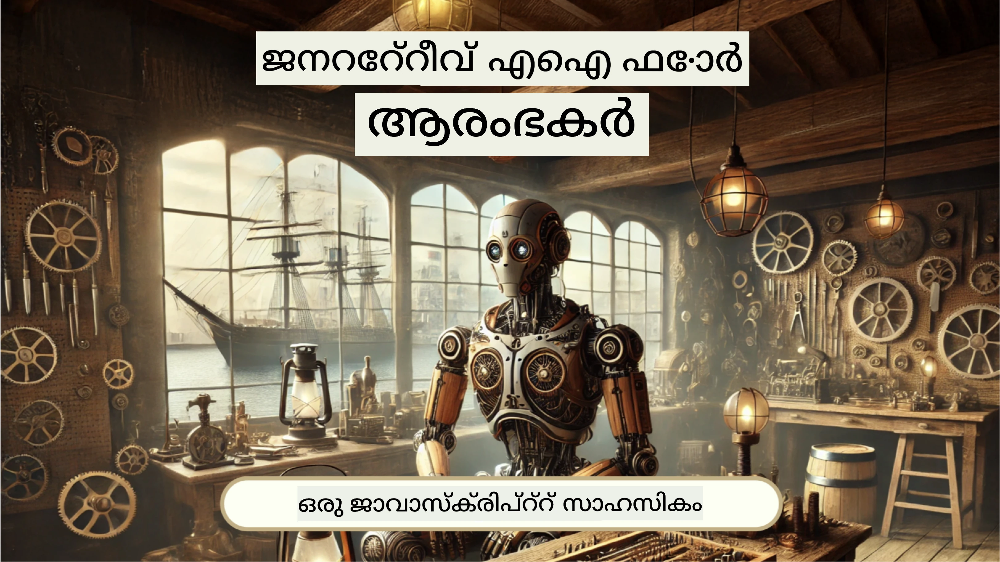
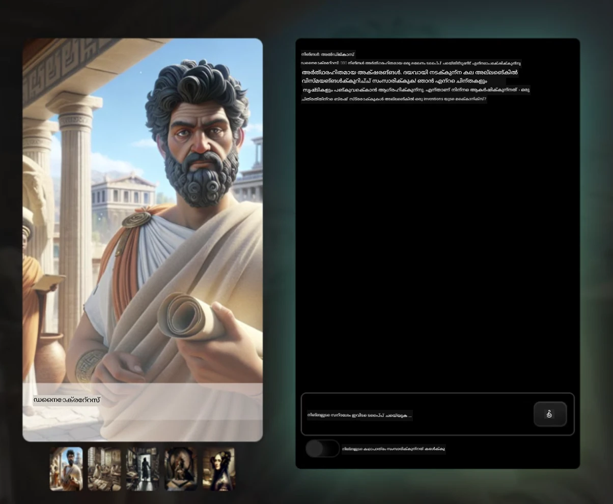
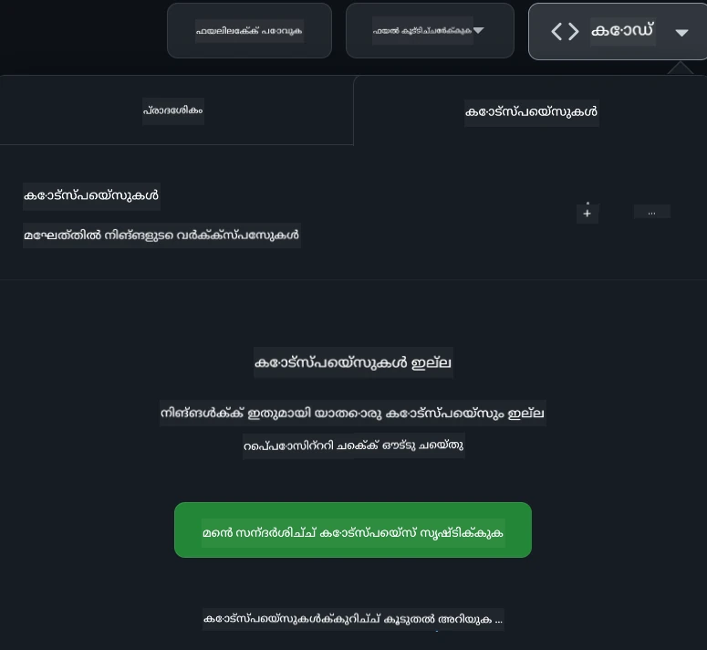

[](https://github.com/microsoft/Web-Dev-For-Beginners/blob/master/LICENSE)
[](https://GitHub.com/microsoft/Web-Dev-For-Beginners/graphs/contributors/)
[](https://GitHub.com/microsoft/Web-Dev-For-Beginners/issues/)
[](https://GitHub.com/microsoft/Web-Dev-For-Beginners/pulls/)
[](http://makeapullrequest.com) 

[](https://GitHub.com/microsoft/Web-Dev-For-Beginners/watchers/)
[](https://GitHub.com/microsoft/Web-Dev-For-Beginners/network/)
[](https://GitHub.com/microsoft/Web-Dev-For-Beginners/stargazers/)

[](https://discord.gg/nTYy5BXMWG)

# Web Development for Beginners - ഒരു പാഠ്യപദ്ധതി

Microsoft Cloud Advocates ഒരുക്കുന്ന 12 ആഴ്‌ചകളുള്ള സമഗ്ര കോഴ്സിനൊപ്പം വെബ് ഡെവലപ്പ്മെന്റിന്റെ അടിസ്ഥാനങ്ങൾ പഠിക്കൂ. 24 പാഠങ്ങളുടെ ഓരോതും ടെറേറിയം, ബ്രൗസർ എക്സ്റ്റൻഷനുകൾ, സ്‌പേസ് ഗെയിമുകൾ പോലുള്ള പ്രായോഗിക പ്രോജക്ടുകൾ വഴിയുള്ള ജാവാസ്ക്രിപ്റ്റ്, CSS, HTML എന്നിവയിൽ ആഴത്തിലുള്ള പഠനം നൽകുന്നു. ക്വിസുകളും, ചർച്ചകളും, പ്രായോഗിക അസൈൻമെന്റുകളും നിങ്ങളെ സജീവമാക്കും. പ്രൊജക്ട് അടിസ്ഥാനമുള്ള ഈ പാഠരീതിയോടെ നിങ്ങളുടെ വിദ്യയുയർത്തി പരിപൂർണമായി മനസ്സിലാക്കുക. ഇന്ന് തന്നെ നിങ്ങളുടെ കോഡിംഗ് യാത്ര ആരംഭിക്കുക!

Azure AI Foundry Discord-ലേക്ക് ചേരുക, വിദഗ്ധരുമായും മറ്റ് ഡവലപ്പർമാരുമായും പരിചയപ്പെടുക.

[](https://discord.gg/nTYy5BXMWG)

ഈ സ്രോതസുകൾ ഉപയോഗിച്ച് ആരംഭിക്കാൻ ഈ ചുവടുകളെ പിന്തുടരുക:
1. **റിപ്പോസിറ്ററി Fork ചെയ്യുക**: ക്ലിക്ക് ചെയ്യുക [](https://GitHub.com/microsoft/Web-Dev-For-Beginners/fork)
2. **റിപ്പോസിറ്ററി ക്ലോൺ ചെയ്യുക**:   `git clone https://github.com/microsoft/Web-Dev-For-Beginners.git`
3. [**Azure AI Foundry Discord-ലേക്ക് ചേരുക, വിദഗ്ധരുമായും മറ്റ് ഡവലപ്പർമാരുമായും പരിചയപ്പെടുക**](https://discord.com/invite/ByRwuEEgH4)

### 🌐 බഹു-ഭാഷാ പിന്തുണ

#### GitHub Action വഴി പിന്തുണ (സ്വയം ക്രമീകരണമായും സ്ഥിരമായി അപ്‌ഡേറ്റ് ചെയ്യുന്നവ)

<!-- CO-OP TRANSLATOR LANGUAGES TABLE START -->
[Arabic](../ar/README.md) | [Bengali](../bn/README.md) | [Bulgarian](../bg/README.md) | [Burmese (Myanmar)](../my/README.md) | [Chinese (Simplified)](../zh-CN/README.md) | [Chinese (Traditional, Hong Kong)](../zh-HK/README.md) | [Chinese (Traditional, Macau)](../zh-MO/README.md) | [Chinese (Traditional, Taiwan)](../zh-TW/README.md) | [Croatian](../hr/README.md) | [Czech](../cs/README.md) | [Danish](../da/README.md) | [Dutch](../nl/README.md) | [Estonian](../et/README.md) | [Finnish](../fi/README.md) | [French](../fr/README.md) | [German](../de/README.md) | [Greek](../el/README.md) | [Hebrew](../he/README.md) | [Hindi](../hi/README.md) | [Hungarian](../hu/README.md) | [Indonesian](../id/README.md) | [Italian](../it/README.md) | [Japanese](../ja/README.md) | [Kannada](../kn/README.md) | [Khmer](../km/README.md) | [Korean](../ko/README.md) | [Lithuanian](../lt/README.md) | [Malay](../ms/README.md) | [Malayalam](./README.md) | [Marathi](../mr/README.md) | [Nepali](../ne/README.md) | [Nigerian Pidgin](../pcm/README.md) | [Norwegian](../no/README.md) | [Persian (Farsi)](../fa/README.md) | [Polish](../pl/README.md) | [Portuguese (Brazil)](../pt-BR/README.md) | [Portuguese (Portugal)](../pt-PT/README.md) | [Punjabi (Gurmukhi)](../pa/README.md) | [Romanian](../ro/README.md) | [Russian](../ru/README.md) | [Serbian (Cyrillic)](../sr/README.md) | [Slovak](../sk/README.md) | [Slovenian](../sl/README.md) | [Spanish](../es/README.md) | [Swahili](../sw/README.md) | [Swedish](../sv/README.md) | [Tagalog (Filipino)](../tl/README.md) | [Tamil](../ta/README.md) | [Telugu](../te/README.md) | [Thai](../th/README.md) | [Turkish](../tr/README.md) | [Ukrainian](../uk/README.md) | [Urdu](../ur/README.md) | [Vietnamese](../vi/README.md)

> **പ്രാദേശികമായി ക്ലോൺ ചെയ്യാമോ?**
>
> ഈ റിപോസിറ്ററിയിൽ 50+ ഭാഷാ പരിഭാഷകളും അടങ്ങിയിട്ടുണ്ട്, ഇത് ഡൗൺലോഡ് വലിപ്പം വളരെയധികം വർദ്ധിപ്പിക്കുന്നു. പരിഭാഷകൾ ഇല്ലാതെ ക്ലോൺ ചെയ്യാൻ, സ്‌പാർസ് ചെക്ക്ഔട്ട് ഉപയോഗിക്കുക:
>
> **Bash / macOS / Linux:**
> ```bash
> git clone --filter=blob:none --sparse https://github.com/microsoft/Web-Dev-For-Beginners.git
> cd Web-Dev-For-Beginners
> git sparse-checkout set --no-cone '/*' '!translations' '!translated_images'
> ```
>
> **CMD (Windows):**
> ```cmd
> git clone --filter=blob:none --sparse https://github.com/microsoft/Web-Dev-For-Beginners.git
> cd Web-Dev-For-Beginners
> git sparse-checkout set --no-cone "/*" "!translations" "!translated_images"
> ```
>
> ഇത് നിങ്ങൾക്ക് കോഴ്‌സ് പൂർത്തിയാക്കാൻ വേണ്ടതെല്ലാം ഒരു വേഗത്തിലുള്ള ഡൗൺലോഡുമായി നൽകും.
<!-- CO-OP TRANSLATOR LANGUAGES TABLE END -->

**മേറെ വിവർത്തനങ്ങൾ ആഗ്രഹിക്കുന്നുവെങ്കിൽ, പിന്തുണയുള്ള ഭാഷകൾ ഇവിടെ കൊടുക്കപ്പെട്ടിരിക്കുന്നു. [ഇവിടെ](https://github.com/Azure/co-op-translator/blob/main/getting_started/supported-languages.md)**

[](https://open.vscode.dev/microsoft/Web-Dev-For-Beginners)

#### 🧑‍🎓 _നിങ്ങൾ ഒരു വിദ്യാർത്ഥിയാണോ?_

[**Student Hub പേജ്**](https://docs.microsoft.com/learn/student-hub/?WT.mc_id=academic-77807-sagibbon) സന്ദർശിക്കുക, അവിടെ നിങ്ങൾക്ക് തുടക്കക്കാരൻ ആയതിനുള്ള ഉറവിടങ്ങൾ, വിദ്യാർത്ഥി പാക്കുകൾ, ഒപ്പം സൗജന്യ സർട്ടിഫിക്കറ്റ് വൗചർ നേടാനുള്ള മാർഗങ്ങൾ ലഭിക്കും. ഓരോ മാസവും ഉള്ളടക്കം മാറ്റുമ്പോൾ ഇവിടെ ബുക്ക്‌മാർക്ക് ചെയ്യുകയും ഇടയ്ക്കിടെ പരിശോധിക്കുകയുമാണ് ഏറ്റവും നല്ലത്.

### 📣 പ്രഖ്യാപനം - പുതിയ GitHub Copilot Agent മോഡ് ചലഞ്ചുകൾ പൂർത്തിയാക്കണം!

പുതിയ ചലഞ്ച് ചേർത്തിട്ടുണ്ട്, മിക്ക അധ്യായങ്ങളിലും "GitHub Copilot Agent Challenge 🚀" കാണുക. GitHub Copilot, Agent മോഡ് ഉപയോഗിച്ച് നിങ്ങൾക്ക് പൂർത്തിയാക്കാനുള്ള പുതിയ ഒരു ചലഞ്ച് ആണ് ഇത്. Agent മോഡിന്റെ ഉപയോഗം ഇല്ലെങ്കിൽ, ഇത് തീരുവടക്കം എഴുത്ത് സൃഷ്‌ടിക്കുക മാത്രമല്ല, ഫയലുകൾ സൃഷ്‌ടിക്കുകയും എഡിറ്റ് ചെയ്യുകയും, കമാൻഡുകൾ ഓടിക്കുകയും മറ്റും ചെയ്യാൻ കഴിയും.

### 📣 പ്രഖ്യാപനം - _Generative AI ഉപയോഗിച്ച് നിർമ്മിക്കാനുള്ള പുതിയ പ്രോജക്ട്_

പുതിയ AI അസിസ്റ്റന്റ് പ്രോജക്ട് ചേർത്തിട്ടുണ്ട്, പരിശോധിക്കുക [project](./9-chat-project/README.md)

### 📣 പ്രഖ്യാപനം - _Generative AI-നുള്ള പുതിയ പാഠ്യപദ്ധതി_ ജാവാസ്ക്രിപ്റ്റിനായുള്ളത് പുറത്തിറങ്ങിയിരിക്കുന്നു

പുതിയ Generative AI പാഠ്യപദ്ധതി ഒഴിവാക്കേണ്ടതില്ല!

[https://aka.ms/genai-js-course](https://aka.ms/genai-js-course) സന്ദർശിച്ച് തുടങ്ങിയെടുക്കുക!



- അടിസ്ഥാനങ്ങൾ മുതൽ RAG-വരെ ഉൾക്കൊള്ളുന്ന പാഠങ്ങൾ.
- GenAI-യുടേയും നമ്മുടെ കൂട്ടിച്ചേർത്ത ആപ്ലിക്കേഷന്റേയും സഹായത്തോടെ ചരിത്ര കഥാപാത്രങ്ങളുമായി സംവദിക്കുക.
- രസകരവും ആകർഷകവുമായ കഥാപ്രവാഹം, നിങ്ങൾക്കൊരു കാലയാത്ര!




ഓരോ പാഠവും ഒരു അസൈൻമെന്റ്, ഒരു വിജ്ഞാന പരിശോധന, ഒരു ചോദ്യോത്തര ചലഞ്ച് എന്നിവ ഉൾക്കൊള്ളുന്നു, പഠിക്കാനുള്ള വിഷയങ്ങൾ:
- പ്രോംപ്റ്റിങ്, പ്രോംപ്റ്റ് എഞ്ചിനീയറിംഗ്
- ടെക്സ്റ്റ്, ഇമേജ് ആപ് ജനറേഷൻ
- സെർച്ച് ആപ്ലിക്കേഷനുകൾ

[https://aka.ms/genai-js-course](https://aka.ms/genai-js-course) സന്ദർശിച്ച് തുടങ്ങിയെടുക്കുക!


## 🌱 ആരംഭിക്കാം

> **അദ്ധ്യാപകർ**, ഈ പാഠ്യപദ്ധതി ഉപയോഗിക്കുന്നതിന് ചില നിർദ്ദേശങ്ങൾ ഞങ്ങൾ [ഉൾപ്പെടുത്തിയിട്ടുണ്ട്](for-teachers.md). നിങ്ങളുടെ പ്രതികരണം [നമ്മുടെ ചർച്ച ഫോറത്തിൽ](https://github.com/microsoft/Web-Dev-For-Beginners/discussions/categories/teacher-corner) നാം ആഗ്രഹിക്കുന്നു!

**[പഠിക്കുന്നവർ](https://aka.ms/student-page/?WT.mc_id=academic-77807-sagibbon)**, ഓരോ പാഠത്തിനും തുടക്കത്തിൽ ഒരു പ്രീ-ലെക്ചർ ക്വിസ് നടത്തുകയും പാഠഭാഗം വായിക്കുകയും വിവിധ പ്രവർത്തനങ്ങൾ പൂർത്തിയാക്കുകയും പോസ്റ്റ്-ലെക്ചർ ക്വിസ് വഴി മനസ്സിലാക്കിയ കാര്യങ്ങളെ പരിശോധിക്കുകയും ചെയ്യുക.

പഠനാനുഭവം മെച്ചപ്പെടുത്താൻ, സഹപാഠികളുമായി ചേർന്ന് പ്രോജക്ടുകൾ രൂപകരിക്കാൻ ശ്രമിക്കുക! ചർച്ചകൾക്ക് ഞങ്ങളുടെ [ചർച്ച ഫോറം](https://github.com/microsoft/Web-Dev-For-Beginners/discussions) ഉണ്ട്, അവിടെ ഒരു നിരന്തരമായ നിരീക്ഷക സംഘം നിങ്ങളുടെ ചോദ്യങ്ങൾക്ക് ഉത്തരം നൽകാൻ സന്നദ്ധമാണ്.

കൂടുതൽ വിദ്യാഭ്യാസത്തിനും മൈക്രോസോഫ്റ്റ് ലേൺ ([Microsoft Learn](https://learn.microsoft.com/users/wirelesslife/collections/p1ddcy5jwy0jkm?WT.mc_id=academic-77807-sagibbon)) ഉപയോഗിച്ച് കൂടുതൽ പഠനസാധനങ്ങൾ തേടാൻ ഞങ്ങൾ ശക്തമായി നിർദ്ദേശിക്കുന്നു.

### 📋 നിങ്ങളുടെ പരിസ്ഥിതി സജ്ജീകരിക്കൽ

ഈ പാഠ്യപദ്ധതിയിൽ വികസന പരിസ്ഥിതി തയ്യാറാണ്! പഠനം തുടങ്ങിയാൽ [Codespace](https://github.com/features/codespaces/) (_ബ്രൗസറിലെ, ഇൻസ്റ്റാളേഷൻ ഇല്ലാതെ പ്രവർത്തിക്കുന്ന ഒരു പരിസ്ഥിതി_) അല്ലെങ്കിൽ നിങ്ങളുടെ കമ്പ്യൂട്ടറിൽ പ്രാദേശികമായി [Visual Studio Code](https://code.visualstudio.com/?WT.mc_id=academic-77807-sagibbon) പോലുള്ള ടെക്സ്റ്റ് എഡിറ്റർ ഉപയോഗിച്ച് കോഴ്സ് ഓടിക്കാം.

#### നിങ്ങളുടെ റിപോസിറ്ററി സൃഷ്ടിക്കുക
നിങ്ങളുടെ പ്രവൃത്തി സ്ത്രസപ്പെടുത്താതെ സംരക്ഷിക്കാനായി, ഈ റെപ്പോസിറ്ററിയുടെ സ്വന്തം കോപ്പി സൃഷ്ടിക്കേണ്ടതുണ്ട്. പേജിന്റെ മുകളിലുള്ള **Use this template** ബട്ടൺ ക്ലിക്കുചെയ്താൽ ഇത് നിങ്ങളുടെ GitHub അക്കൗണ്ടിൽ പുതിയ റിപോസിറ്ററി ആയി സൃഷ്ടിക്കും.

ഈ ചുവടുകൾ പിന്തുടരുക:
1. **റിപ്പോസിറ്ററി Fork ചെയ്യുക**: ഈ പേജിന്റെ മുകളിലേയ്ക്ക് വലതുവശത്തുള്ള "Fork" ബട്ടൺ ക്ലിക്ക് ചെയ്യുക.
2. **റിപ്പോസിറ്ററി ക്ലോൺ ചെയ്യുക**:   `git clone https://github.com/microsoft/Web-Dev-For-Beginners.git`

#### Codespace-ൽ പാഠ്യപദ്ധതി ഓടിക്കുക

നിങ്ങളുടെ സൃഷ്ടിച്ച കോപ്പിയിൽ, **Code** ബട്ടൺ ക്ലിക്ക് ചെയ്ത് **Open with Codespaces** തിരഞ്ഞെടുക്കുക. ഇതു വഴി നിങ്ങൾക്കായി പുതിയ Codespace സൃഷ്ടിക്കപ്പെടും.



#### പ്രാദേശികമായി പാഠ്യപദ്ധതി ഓടിക്കുക

നിങ്ങളുടെ കമ്പ്യൂട്ടറിൽ പാഠ്യപദ്ധതി ഓടിക്കാൻ, ഒരു ടെക്സ്റ്റ് എഡിറ്റർ, ഒരു ബ്രൗസർ, ഒരു കമാൻഡ് ലൈൻ ടൂൾ എന്നിവ ആവശ്യമാണ്. ആദ്യ പാഠം, [പ്രോഗ്രാമിംഗ് ഭാഷകളും ഉപകരണങ്ങളുമായുള്ള പരിചയം](../../1-getting-started-lessons/1-intro-to-programming-languages) സഹായത്തോടെ എല്ലാ ടൂള്‍ ഓപ്ഷനുകളും പരിചയപ്പെടാം, നിങ്ങൾക്ക് ഏറ്റവും അനുയോജ്യം തിരഞ്ഞെടുക്കാം.

ഞങ്ങളുടെ ശുപാർശ: [Visual Studio Code](https://code.visualstudio.com/?WT.mc_id=academic-77807-sagibbon) ആണ്, അതിൽ ഉൾക്കൊള്ളുന്ന [ടർമിനൽ](https://code.visualstudio.com/docs/terminal/basics/?WT.mc_id=academic-77807-sagibbon) അനുബദ്ധമാണ്. Visual Studio Code [ഇവിടെ](https://code.visualstudio.com/?WT.mc_id=academic-77807-sagibbon) നിന്നും ഡൗൺലോഡ് ചെയ്യാം.
1. നിങ്ങളുടെ കമ്പ്യൂട്ടറിലേക്ക് നിങ്ങളുടെ റിപ്പോസിറ്ററി ക്ലോൺ ചെയ്യുക. നിങ്ങൾക്ക് ഇത് **Code** ബട്ടൺ ക്ലിക്ക് ചെയ്ത് URL പകര്‍ത്തി ചെയ്യാം:

    [CodeSpace](./images/createcodespace.png)

    പിന്നീട്, [Visual Studio Code](https://code.visualstudio.com/?WT.mc_id=academic-77807-sagibbon)–യിലെ [Terminal](https://code.visualstudio.com/docs/terminal/basics/?WT.mc_id=academic-77807-sagibbon) തുറന്നുകൊണ്ട്, മേൽപ്പറഞ്ഞാൽ URL ബଦലായി `<your-repository-url>` ഉപയോഗിച്ച് താഴെ പറയുന്ന കമാൻഡ് റൺ ചെയ്യുക:

    ```bash 
    git clone <your-repository-url>
    ```

2. Visual Studio Code-ൽ ഫോൾഡർ തുറക്കുക. നിങ്ങൾ ഇപ്പോൾ ക്ലോൺ ചെയ്ത ഫോൾഡർ തിരഞ്ഞെടുത്ത് **File** > **Open Folder** ക്ലിക്ക് ചെയ്യുക.


>  ശുപാർശ ചെയ്യുന്ന Visual Studio Code എക്സ്റ്റൻഷനുകൾ:
>
> * [Live Server](https://marketplace.visualstudio.com/items?itemName=ritwickdey.LiveServer&WT.mc_id=academic-77807-sagibbon) - Visual Studio Code-ൽ HTML പേജുകൾ പ്രിവ്യൂ ചെയ്യാൻ
> * [Copilot](https://marketplace.visualstudio.com/items?itemName=GitHub.copilot&WT.mc_id=academic-77807-sagibbon) - കോഡ് എഴുതാൻ വേഗത കൂട്ടാൻ സഹായിക്കുന്നു

## 📂 ഓരോ പാഠവും ഉൾക്കൊള്ളുന്നത്:

- നിർബന്ധമല്ലാത്ത സ്കെച്ച് നോട്ട്
- നിർബന്ധമല്ലാത്ത സഹായക വീഡിയോ
- പാഠത്തിന് മുമ്പുള്ള വാര്മപ്പ് ക്വിസ്
- എഴുത്തുപരമായ പാഠം
- പ്രൊജക്റ്റ് അടിസ്ഥാനമാക്കിയുള്ള പാഠങ്ങൾക്കായി, പ്രോജക്റ്റ് നിർമ്മിക്കാൻ ഘട്ടം ഘട്ടമായ മാർഗനിർദ്ദേശങ്ങൾ
- അറിവ് പരിശോദനകൾ
- ഒരു ചൈലഞ്ച്
- സഹായക വായന
- അസൈൻമെന്റ്
- [പാഠത്തിന് ശേഷം ക്വിസ്](https://ff-quizzes.netlify.app/web/)

> **ക്വിസുകളെക്കുറിച്ച് ഒരു കുറിപ്പ്**: എല്ലാ ക്വിസുകളും Quiz-app ഫോൾഡറിൽ സഞ്ചയിച്ചിരിക്കുന്നു, മൂന്ന് ചോദ്യങ്ങളുള്ള 48 ക്വിസുകൾ. അവ [ഇവിടെ](https://ff-quizzes.netlify.app/web/) ലഭ്യമാണ്, ക്വിസ് ആപ്പ് ലോക്കലായി ഓടിക്കാനോ അല്ലെങ്കിൽ ആസ്യൂറിലേക്ക് വിന്യസ്തമാക്കാനോ കഴിയും; `quiz-app` ഫോൾഡറിലുള്ള നിർദ്ദേശങ്ങൾ പാലിക്കുക.

## 🗃️ പാഠങ്ങൾ

|     |                       പ്രോജക്റ്റ് നാമം                       |                            പഠിപ്പിച്ച ആശയങ്ങൾ                             | പഠന ലക്ഷ്യങ്ങൾ                                                                                                                 |                                                         ബന്ധപ്പെട്ട പാഠം                                                          |         രചയിതാവ്          |
| :-: | :------------------------------------------------------: | :--------------------------------------------------------------------: | ----------------------------------------------------------------------------------------------------------------------------------- | :----------------------------------------------------------------------------------------------------------------------------: | :---------------------: |
| 01  |                     തുടങ്ങി കൊള്ളാം                      |           പ്രോഗ്രാമിംഗിന്റെയും 工 herramientasതുൽനിൽപുകൾ പരിചയം           | പല പ്രോഗ്രാമിംഗ് ഭാഷകളുടെ അടിസ്ഥാനങ്ങളും പ്രൊഫഷണൽ വികസകരുടെ ജോലി സഹായിക്കുന്ന സോഫ്റ്റ്‌വെയർ പഠിക്കുക | [Intro to Programming Languages and Tools of the Trade](./1-getting-started-lessons/1-intro-to-programming-languages/README.md) |         ജാസ്മിൻ         |
| 02  |                     തുടങ്ങി കൊള്ളാം                      |             GitHub അടിസ്ഥാനങ്ങൾ ഉൾപ്പെടെ ടീം പ്രവർത്തനം             | നിങ്ങളുടെ പ്രോജക്റ്റിൽ GitHub എങ്ങനെ ഉപയോഗിക്കാമെന്ന് അറിയുക, മറ്റുമായി സഹകരിക്കൽ                     |                            [Intro to GitHub](./1-getting-started-lessons/2-github-basics/README.md)                             |          ഫ്‌ലോർ          |
| 03  |                     തുടങ്ങി കൊള്ളാം                      |                             പ്രാപ്യത                                   | വെബ് പ്രാപ്യതയുടെ അടിസ്ഥാനങ്ങൾ പഠിക്കുക                                                                                                |                       [Accessibility Fundamentals](./1-getting-started-lessons/3-accessibility/README.md)                       |       ക്രിസ്റ്റോഫർ       |
| 04  |                        JS അടിസ്ഥാനങ്ങൾ                         |                         ജാവാസ്ക്രിപ്റ്റ് ഡാറ്റ ടൈപ്പുകൾ                          | ജാവാസ്ക്രിപ്റ്റ് ഡാറ്റ ടൈപ്പുകളുടെ അടിസ്ഥാനങ്ങൾ                  |                                       [Data Types](./2-js-basics/1-data-types/README.md)                                        |         ജാസ്മിൻ         |
| 05  |                        JS അടിസ്ഥാനങ്ങൾ                         |                         ഫംഗ്ഷനുകളും മെത്തഡുകളും                          | അപ്ലിക്കേഷന്റെ ലജിക് ഫ്ലോ നിയന്ത്രിക്കാൻ ഫംഗ്ഷനുകളും മെഥഡുകളും പഠിക്കുക                                           |                              [Functions and Methods](./2-js-basics/2-functions-methods/README.md)                               | ജാസ്മിൻ, ക്രിസ്റ്റോഫർ |
| 06  |                        JS അടിസ്ഥാനങ്ങൾ                         |                        JS ഉപയോഗിച്ച് തീരുമാനങ്ങൾ എടുക്കൽ                        | കോഡിൽ നിബന്ധനകൾ സൃഷ്ടിക്കാൻ തീരുമാനമെടുക്കൽ രീതി പഠിക്കുക                                                                  |                                 [Making Decisions](./2-js-basics/3-making-decisions/README.md)                                  |         ജാസ്മിൻ         |
| 07  |                        JS അടിസ്ഥാനങ്ങൾ                         |                            അറേസും ലൂപ്പുകളും                            | ജാവാസ്ക്രിപ്റ്റിൽ അറേകളും ലൂപ്പുകളും ഉപയോഗിച്ച് ഡാറ്റ കൈകാര്യം ചെയ്യുക                                                                             |                                   [Arrays and Loops](./2-js-basics/4-arrays-loops/README.md)                                    |         ജാസ്മിൻ         |
| 08  |       [ടെറേറിയം](./3-terrarium/solution/README.md)       |                            പ്രായോഗികത്തിൽ HTML                            | ഓൺലൈൻ ടെറേറിയത്തിനായി HTML നിർമ്മിക്കുക, ലേയൗട്ട് നിർമ്മിക്കാൻ കേന്ദ്രീകരിക്കുന്നു                                                         |                                 [Introduction to HTML](./3-terrarium/1-intro-to-html/README.md)                                 |           ജെൻ           |
| 09  |       [ടെറേറിയം](./3-terrarium/solution/README.md)       |                            പ്രായോഗികത്തിൽ CSS                             | ഓൺലൈൻ ടെറേറിയത്തിന് മിക്കസിലായി CSS നിർമ്മിക്കുക, പേജ് റെസ്പോൺസീവ് ആക്കാൻ കേന്ദ്രസഹായം നൽകുക                     |                                  [Introduction to CSS](./3-terrarium/2-intro-to-css/README.md)                                  |           ജെൻ           |
| 10  |            [ടെറേറിയം](./3-terrarium/solution/README.md)            |                 ജാവാസ്ക്രിപ്റ്റ് ക്ലോസറുകൾ, DOM മാനിപ്പുലേഷൻ                  | ഡ്രാഗ്/ഡ്രോപ്പ് ഇന്റർഫേസ് പോലെ പ്രവർത്തിക്കാൻ ടെറേറിയം ജാവാസ്ക്രിപ്റ്റ് നിർമ്മിക്കുക, ക്ലോസറുകളും DOM മാനിപ്പുലേഷനും കേന്ദ്രീകരിച്ച്             |                  [JavaScript Closures, DOM manipulation](./3-terrarium/3-intro-to-DOM-and-closures/README.md)                   |           ജെൻ           |
| 11  |          [ടൈപ്പിങ് ഗേം](./4-typing-game/solution/README.md)          |                          ഒരു ടൈപ്പിങ് ഗെയിം നിർമ്മിക്കൽ                           | കീബോർഡ് ഇവന്റുകൾ ഉപയോഗിച്ച് ജാവാസ്ക്രിപ്റ്റ് ആപ്പിന്റെ ലജിക് നിയന്ത്രിക്കുന്നത് പഠിക്കുക                                                          |                                [Event-Driven Programming](./4-typing-game/typing-game/README.md)                                |       ക്രിസ്റ്റോഫർ       |
| 12  | [ഗ്രീൻ ബ്രൗസർ എക്സ്റ്റൻഷൻ](./5-browser-extension/solution/README.md) |                         ബ്രൗസറുകളുമായി ജോലിചെയ്യൽ                          | ബ്രൗസറുകൾ എങ്ങനെ പ്രവർത്തിക്കുന്നു, അവരുടെ ചരിത്രം, ബ്രൗസർ എക്സ്റ്റൻഷൻ ആദ്യ ഘടകങ്ങൾ നിർമ്മിക്കല്                        |                               [About Browsers](./5-browser-extension/1-about-browsers/README.md)                                |           ജെൻ           |
| 13  | [ഗ്രീൻ ബ്രൗസർ എക്സ്റ്റൻഷൻ](./5-browser-extension/solution/README.md) | ഫോം പ്ലാൻ ചെയ്യൽ, API കോൾ ചെയ്യൽ, ലോക്കൽ സ്റ്റോറേജിൽ വേരിയബിളുകൾ സൂക്ഷിക്കൽ | ബ്രൗസർ എക്സ്റ്റൻഷന്റെ ജാവാസ്ക്രിപ്റ്റ് ഘടകങ്ങൾ API കോൾ ചെയ്യാനും വേരിയബിളുകൾ ലോക്കൽ സ്റ്റോറേജിൽ സൂക്ഷിക്കാനും നിർമ്മിക്കുക                      |                [APIs, Forms, and Local Storage](./5-browser-extension/2-forms-browsers-local-storage/README.md)                 |           ജെൻ           |
| 14  | [ഗ്രീൻ ബ്രൗസർ എക്സ്റ്റൻഷൻ](./5-browser-extension/solution/README.md) |          ബ്രൗസറിലെ പശ്ചാത്തല പ്രോസസ്സുകൾ, വെബ് പ്രവർത്തനം          | എക്സ്റ്റൻഷന്റെ ഐകോൺ നിയന്ത്രിക്കാൻ ബ്രൗസറിലെ പശ്ചാത്തല പ്രോസസ്സുകൾ ഉപയോഗിക്കുക; വെബ് പ്രകടനം കുറിചറിയുക, ചില മെച്ചപ്പെടുത്തലുകൾ പഠിക്കുക   |             [Background Tasks and Performance](./5-browser-extension/3-background-tasks-and-performance/README.md)              |           ജെൻ           |
| 15  |           [സ്പേസ് ഗെയിം](./6-space-game/solution/README.md)           |             ജാവാസ്ക്രിപ്റ്റ് ഉപയോഗിച്ചുള്ള ഉയർന്ന തലത്തിലുള്ള ഗെയിം വികസനം             | ക്ലാസ്സുകളും കംപോസിഷനും ഉപയോഗിച്ച് ഇൻഹെറിറ്റൻസ് പഠിക്കുക, പബ്ലിഷർ/സബ്സ്ക്രൈബർ പാറ്റേൺ പഠിച്ച് ഗെയിം നിർമ്മിക്കാൻ തയ്യാറെടുക്കുക              |                      [Introduction to Advanced Game Development](./6-space-game/1-introduction/README.md)                       |          ക്രിസ്          |
| 16  |           [സ്പേസ് ഗെയിം](./6-space-game/solution/README.md)           |                           കാൻവാസിലേക്ക് ചിത്രങ്ങൾ ആകുക                            | സ്ക്രീനിൽ ഘടകങ്ങൾ വരയ്ക്കാൻ ഉപയോഗിക്കുന്ന കാൻവാസ് API പഠിക്കുക                                                                       |                                [Drawing to Canvas](./6-space-game/2-drawing-to-canvas/README.md)                                |          ക്രിസ്          |
| 17  |           [സ്പേസ് ഗെയിം](./6-space-game/solution/README.md)           |                   സ്ക്രീനിലുടനീളം ഘടകങ്ങൾ പ്രയാണം ചെയ്യൽ                    | ഘടകങ്ങൾ ചലിപ്പിക്കാൻ കാർട്ടീഷ്യൻ കോർഡിനേറ്റുകളും കാൻവാസ് API-യും ഉപയോഗിക്കുന്നത് അറിയുക                                            |                           [Moving Elements Around](./6-space-game/3-moving-elements-around/README.md)                           |          ക്രിസ്          |
| 18  |           [സ്പേസ് ഗെയിം](./6-space-game/solution/README.md)           |                          ഘടകങ്ങൾ കൂട്ടിയിടിക്കൽ                           | കീപ്രസ് ഉപയോഗിച്ച് ഘടകങ്ങൾ കൂട്ടിയിടിക്കാനും പ്രതികരിക്കാനും കളിയുടെ പ്രകടനം ഉറപ്പാക്കാൻ കൂൾഡൗൺ ഫംഗ്ഷൻ നൽകാനും പഠിക്കുക    |                              [Collision Detection](./6-space-game/4-collision-detection/README.md)                              |          ക്രിസ്          |
| 19  |           [സ്പേസ് ഗെയിം](./6-space-game/solution/README.md)           |                             സ്‌കോർ ക്രമീകരിക്കൽ                              | ഗെയിമിന്റെ നിലയും പ്രകടനവും അടിസ്ഥാനമാക്കിയുള്ള ഗണിത സൂചനകൾ നിർവഹിച്ചു പഠിക്കുക                                                                |                                    [Keeping Score](./6-space-game/5-keeping-score/README.md)                                    |          ക്രിസ്          |
| 20  |           [സ്പേസ് ഗെയിം](./6-space-game/solution/README.md)           |                     ഗെയിം അവസാനിപ്പിക്കുകയും വീണ്ടും തുടങ്ങുകയും ചെയ്യൽ                     | ഗെയിം അവസാനിപ്പിക്കുകയും പുനരാരംഭിക്കുകയും ചെയ്യുന്നതിനെക്കുറിച്ച് പഠിക്കുകയും അസറ്റുകൾ ശുചീകരിക്കുകയും വേരിയബിളുകൾ റീസെറ്റ് ചെയ്യുക                              |                                [The Ending Condition](./6-space-game/6-end-condition/README.md)                                 |          ക്രിസ്          |
| 21  |         [ബാങ്കിംഗ് ആപ്പ്](./7-bank-project/solution/README.md)          |                 വെബ് ആപ്പിൽ HTML ടെംപ്ലേറ്റുകളും റൂട്ടുകളും                 | മൾട്ടിപേജ് വെബ്സൈറ്റിന്റെ ഘടന സൃഷ്ടിക്കാൻ റൂട്ടിംഗും HTML ടെംപ്ലേറ്റുകളും ഉപയോഗിച്ച് പഠിക്കുക                             |                            [HTML Templates and Routes](./7-bank-project/1-template-route/README.md)                             |          യോഗന്          |
| 22  |         [ബാങ്കിംഗ് ആപ്പ്](./7-bank-project/solution/README.md)          |                  ലോഗിൻ/രജിസ്ട്രേഷൻ ഫോമുകൾ നിർമ്മിക്കൽ                   | ഫോമുകൾ നിർമ്മിക്കൽ, സാധുത പരിശോധനയുമായി ബന്ധപ്പെട്ട നടപടികൾ പഠിക്കുക                                                                          |                                           [Forms](./7-bank-project/2-forms/README.md)                                           |          യോഗന്          |
| 23  |         [ബാങ്കിംഗ് ആപ്പ്](./7-bank-project/solution/README.md)          |                   ഡാറ്റ ഓങ്ങനെ സ്വീകരിക്കുകയും ഉപയോഗിക്കുകയോ                   | നിങ്ങളുടെ ആപ്പിലേക്ക് ഡാറ്റ എങ്ങനെ പ്രവേശിക്കുന്നു, എങ്ങനെ സ്വീകരിക്കുന്നു, സംഭരിക്കുന്നു, നശിപ്പിക്കുന്നു പഠിക്കുക                                                 |                                            [Data](./7-bank-project/3-data/README.md)                                            |          യോഗന്          |
| 24  |         [ബാങ്കിംഗ് ആപ്പ്](./7-bank-project/solution/README.md)          |                      സ്റ്റേറ്റ് മാനേജ്മെന്റ് ആശയങ്ങൾ                      | നിങ്ങളുടെ ആപ്പ് സ്റ്റേറ്റ് എങ്ങനെ കൈകാര്യം ചെയ്യുന്നു, പ്രോഗ്രാമാറ്റിക്കായി അതിനെ നിയന്ത്രിക്കുക                                                              |                                [State Management](./7-bank-project/4-state-management/README.md)                                |          യോഗന്          |
| 25 | [Browser/VScode Code](../../8-code-editor) | VScode-ഉം ഉപയോഗിച്ച് ജോലി ചെയ്യൽ | കോഡ് എഡിറ്റർ ഉപയോഗിക്കുന്നത് പഠിക്കുക| [Use VScode Code Editor](./8-code-editor/1-using-a-code-editor/README.md) | ക്രിസ് |
| 26 | [AI അസിസ്റ്റൻറുകൾ](./9-chat-project/README.md) | AI-യുമായി ജോലി ചെയ്യൽ | നിങ്ങളുടെ സ്വന്തം AI അസിസ്റ്റന്റ് നിർമ്മിക്കാൻ പഠിക്കുക | [AI Assistant project](./9-chat-project/README.md) | ക്രിസ് |

## 🏫 പാഠശാസ്ത്രം

നമ്മുടെ പാഠ്യപദ്ധതി രണ്ട് പ്രധാന പാഠശാസ്ത്ര സിദ്ധാന്തങ്ങളെ അടിസ്ഥാനമാക്കിയാണ് രൂപകല്പന ചെയ്തിരിക്കുന്നത്:
* പ്രോജക്റ്റ്-ആധാരിത പഠനം
* തുടർച്ചയായ ക്വിസുകൾ

ജാവാസ്ക്രിപ്റ്റും HTML-ഉം CSS-ഉം ഉൾപ്പെടെയുള്ള അടിസ്ഥാനങ്ങൾ, ഇന്നത്തെ വെബ് ഡെവലപ്പർമാർ ഉപയോഗിക്കുന്ന ഏറ്റവും പുതിയ ഉപകരണങ്ങളും സാങ്കേതിക വിദ്യകളും ഈ പ്രോഗ്രാം പഠിപ്പിക്കുന്നു. വിദ്യാര്‍ഥികൾ ടൈപ്പിങ് ഗെയിം, വിർച്വൽ ടെറേറിയം, പാരിസ്ഥിതിക സൗഹൃദ ബ്രൗസർ എക്സ്റ്റൻഷൻ, സ്‌പേസ്-ഇന്വേഡർ-ശൈലിയുടെ ഗെയിം, ബിസിനസ്സുകൾക്കുള്ള ബാങ്കിംഗ് ആപ്പ് എന്നിവ നിർമ്മിച്ചുകൊണ്ട് പ്രായോഗിക പരിചയം നേടും. പരമ്പര അവസാനത്തിൽ, വിദ്യാർത്ഥികൾക്ക് വെബ് ഡെവലപ്‌മെന്റിന്റെ സുതാര്യമായ ബോധം ഉണ്ടാകും.

> 🎓 നിങ്ങൾക്ക് Microsoft Learn-ൽ [Learn Path](https://docs.microsoft.com/learn/paths/web-development-101/?WT.mc_id=academic-77807-sagibbon) ആയി ഈ പാഠ്യപദ്ധതിയിലെ ആദ്യ പാഠങ്ങൾ സ്വീകരിക്കാൻ കഴിയും!

ഉള്ളടക്കം പ്രോജക്റ്റുകളുമായി സങ്കലിപ്പിക്കപ്പെട്ടിട്ടുള്ളതുകൊണ്ട് വിദ്യാര്‍ഥികൾക്ക് എളുപ്പത്തിലാണ് ആസ്വദിക്കാൻ സാധിക്കുന്നത്, ആശയങ്ങളുടെ ഉറപ്പുള്ള പകർത്തൽ ഉറപ്പാക്കുന്നു. കൂടാതെ ജാവാസ്ക്രിപ്റ്റ് അടിസ്ഥാനപരമായ ആശയങ്ങൾ പരിചയപ്പെടുത്താൻ വിവിധ തുടക്ക പാഠങ്ങൾ നമ്മൾ തയ്യാറാക്കിയിട്ടുണ്ട്, കൂടാതെ “[Beginners Series to: JavaScript](https://channel9.msdn.com/Series/Beginners-Series-to-JavaScript/?WT.mc_id=academic-77807-sagibbon)” വീഡിയോ ട്യൂട്ടോറിയലുകളിൽ നിന്നുള്ള ചില രചയിതാക്കൾ ഈ പാഠ്യപദ്ധതിയിൽ സംഭാവന നൽകിയിട്ടുണ്ട്.

ക്ലാസിനുമുന്‍പ് കുറഞ്ഞമാപ്പുള്ള ക്വിസ് ഒരു വിഷയം പഠിക്കാനുള്ള മനോഭാവം സജ്ജമാക്കുകയും, ക്ലാസിനുശേഷം രണ്ടാം ക്വിസ് അറിവിന്റെ ഉറപ്പാക്കൽ ഉറപ്പാക്കുകയും ചെയ്യുന്നു. ഈ പാഠ്യപദ്ധതി ലവണീയവും രസകരവും ആക്കാൻ രൂപകല്പന ചെയ്തതാണ്, മുഴുവനായോ ഭാഗങ്ങളായോ സ്വീകരിക്കാം. പ്രോജക്റ്റുകൾ ചെറിയതായിരിക്കുമ്പോഴുതന്നെ 12 ആഴ്ചകളുടെ കാലയളവിൽ അതിഗംഭീരമായി വികസിക്കുന്നു.

നാം ജാവാസ്ക്രിപ്റ്റ് ഫ്രെയിംവർക്ക്‌സുകൾ നീക്കം ചെയ്യാതിരിക്കുകയാണ് വെബ് ഡെവലപ്പർക്ക് അഭ്യസിക്കേണ്ട അടിസ്ഥാന കഴിവുകൾക്ക് ആദ്യം ശ്രദ്ധ കേന്ദ്രീകരിക്കാൻ; ഈ പാഠ്യപദ്ധതി പൂര്‍ത്തിയാക്കിയതിന് പിന്മടങ്ങ്, Node.js പഠിക്കാനായി "[Beginner Series to: Node.js](https://channel9.msdn.com/Series/Beginners-Series-to-Nodejs/?WT.mc_id=academic-77807-sagibbon)" എന്ന വീഡിയോ ശേഖരം ഉപയോഗിച്ച് പഠനം തുടരുന്നത് നല്ലതാകും.

> ഞങ്ങളുടെ [Code of Conduct](CODE_OF_CONDUCT.md) മുറിച്ചു [Contributing](CONTRIBUTING.md) മാർഗനിർദ്ദേശങ്ങൾ സന്ദർശിക്കുക. നിങ്ങളുടെ നിർമാണാത്മക പ്രതികരണം സ്വീകരിക്കുന്നു!


## 🧭 ഓഫ്‌ലൈൻ ആക്സസ്

[Docsify](https://docsify.js.org/#/) ഉപയോഗിച്ച് ഈ ഡോക്യുമെന്റേഷൻ ഓഫ്ലൈനായി റൺ ചെയ്യാം. ഈ റിപ്പോ ഫോർക്ക് ചെയ്യുക, നിങ്ങളുടെ ലോക്കൽ മെഷീനിൽ [Docsify ഇൻസ്റ്റാൾ](https://docsify.js.org/#/quickstart) ചെയ്യുക, തുടർന്ന് ഈ റിപ്പോയുടെ റൂട്ട് ഫോൾഡറിലേക്ക് പോയി `docsify serve` ടൈപ്പ് ചെയ്യുക. പോർട്ട് 3000-ൽ വെബ്സൈറ്റ് ലോക്കൽഹോസ്റ്റിൽ ലഭ്യമാകും: `localhost:3000`.

## 📘 PDF
ഏതാനും പാഠങ്ങളുടെ PDF ഇവിടെ ലഭ്യമാണ് [here](https://microsoft.github.io/Web-Dev-For-Beginners/pdf/readme.pdf).


## 🎒 മറ്റ് കോഴ്സുകൾ

നമ്മൾ മറ്റു കോഴ്സുകളും നിർമ്മിക്കുന്നു! പരിശോധിക്കുക:

<!-- CO-OP TRANSLATOR OTHER COURSES START -->
### LangChain
[](https://aka.ms/langchain4j-for-beginners)
[](https://aka.ms/langchainjs-for-beginners?WT.mc_id=m365-94501-dwahlin)
[](https://github.com/microsoft/langchain-for-beginners?WT.mc_id=m365-94501-dwahlin)
---

### Azure / Edge / MCP / ഏജന്റുമാർ
[](https://github.com/microsoft/AZD-for-beginners?WT.mc_id=academic-105485-koreyst)
[](https://github.com/microsoft/edgeai-for-beginners?WT.mc_id=academic-105485-koreyst)
[](https://github.com/microsoft/mcp-for-beginners?WT.mc_id=academic-105485-koreyst)
[](https://github.com/microsoft/ai-agents-for-beginners?WT.mc_id=academic-105485-koreyst)

---
 
### ജനറേറ്റീവ് AI സിരീസ്
[](https://github.com/microsoft/generative-ai-for-beginners?WT.mc_id=academic-105485-koreyst)
[-9333EA?style=for-the-badge&labelColor=E5E7EB&color=9333EA)](https://github.com/microsoft/Generative-AI-for-beginners-dotnet?WT.mc_id=academic-105485-koreyst)
[-C084FC?style=for-the-badge&labelColor=E5E7EB&color=C084FC)](https://github.com/microsoft/generative-ai-for-beginners-java?WT.mc_id=academic-105485-koreyst)
[-E879F9?style=for-the-badge&labelColor=E5E7EB&color=E879F9)](https://github.com/microsoft/generative-ai-with-javascript?WT.mc_id=academic-105485-koreyst)

---
 
### കോർ ലേണിംഗ്
[](https://aka.ms/ml-beginners?WT.mc_id=academic-105485-koreyst)
[](https://aka.ms/datascience-beginners?WT.mc_id=academic-105485-koreyst)
[](https://aka.ms/ai-beginners?WT.mc_id=academic-105485-koreyst)
[](https://github.com/microsoft/Security-101?WT.mc_id=academic-96948-sayoung)
[](https://aka.ms/webdev-beginners?WT.mc_id=academic-105485-koreyst)
[](https://aka.ms/iot-beginners?WT.mc_id=academic-105485-koreyst)
[](https://github.com/microsoft/xr-development-for-beginners?WT.mc_id=academic-105485-koreyst)

---
 
### കോപൈലറ്റ് സിരീസ്
[](https://aka.ms/GitHubCopilotAI?WT.mc_id=academic-105485-koreyst)
[](https://github.com/microsoft/mastering-github-copilot-for-dotnet-csharp-developers?WT.mc_id=academic-105485-koreyst)
[](https://github.com/microsoft/CopilotAdventures?WT.mc_id=academic-105485-koreyst)
<!-- CO-OP TRANSLATOR OTHER COURSES END -->

## സഹായം ലഭ്യമാക്കൽ

നിങ്ങൾ പിഴച്ചോ അല്ലെങ്കിൽ AI ആപ്പുകൾ നിർമ്മിക്കുന്നതിൽ ഏതെങ്കിലും സംശയങ്ങളുണ്ടെങ്കിൽ MCP সম্পর্কে fellow learners နှင့် അനുഭവസമ്പന്നരായ ഡെവലപ്പർമാരുമായി ചർച്ചകളിൽ ചേർന്നു. സംശയങ്ങൾ സ്വാഗതം ചെയ്യുന്ന, അറിവ് സ്വതന്ത്രമായി പങ്കുവെക്കുന്ന ഒരു പിന്തുണയുള്ള സമൂഹമാണ് ഇത്.

[](https://discord.gg/nTYy5BXMWG)

നിങ്ങൾക്ക് ഉൽപ്പന്ന പ്രതികരണം അല്ലെങ്കിൽ പിശകുകൾ ഉണ്ടെങ്കിൽ, സന്ദർശിക്കുക:

[](https://aka.ms/foundry/forum)

## ലൈസൻസ്

ഈ റിപോസിറ്ററി MIT ലൈസൻസിന് കീഴിലാണ്. കൂടുതൽ വിവരങ്ങൾക്ക് [LICENSE](../../LICENSE) ഫയൽ നോക്കുക.

---

<!-- CO-OP TRANSLATOR DISCLAIMER START -->
**പരിഭവം**:  
ഈ പ്രമാണം AI വിവർത്തന സേവനമായ [Co-op Translator](https://github.com/Azure/co-op-translator) ഉപയോഗിച്ചുകൊണ്ട് വിവർത്തനം ചെയ്തതാണ്. ഞങ്ങൾ ശുദ്ധതയ്ക്കായി പരിശ്രമിച്ചാലും, സ്വയംഘടിത വിവർത്തനത്തിൽ പിശകുകൾ അല്ലെങ്കിൽ തെറ്റായവ ഉണ്ടാകാമെന്നും ദയവായി ശ്രദ്ധിക്കുക. പ്രമാണത്തിന്റെ മാതൃഭാഷയിലെ ആദ്യരൂപം തന്നെയാണ് സർവ്വ്വാധികാരSOURCE ആയി കണക്കാക്കേണ്ടത്. നിർണായകമായ വിവരങ്ങൾക്ക്, പ്രൊഫഷണൽ മനുഷ്യ വിവർത്തനം ശുപാർശ ചെയുന്നു. ഈ വിവർത്തനത്തിന്റെ ഉപയോഗത്തിൽ ഉണ്ടാകുന്ന തെറ്റായ മനസ്സിലാക്കലുകൾക്കോ തെറ്റായ വ്യാഖ്യാനങ്ങൾക്കോ നാം ഉത്തരവാദികളല്ല.
<!-- CO-OP TRANSLATOR DISCLAIMER END -->