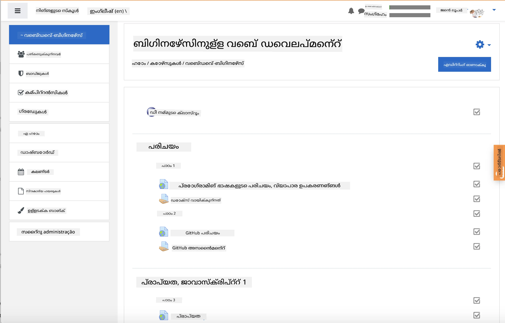
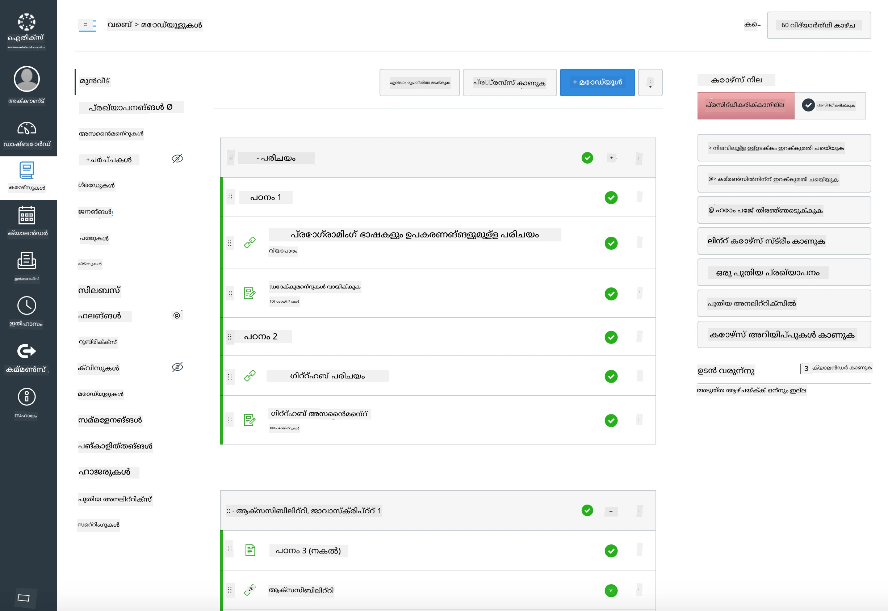

<!--
CO_OP_TRANSLATOR_METADATA:
{
  "original_hash": "71009af209f81cc01a1f2d324200375f",
  "translation_date": "2026-01-08T10:11:39+00:00",
  "source_file": "for-teachers.md",
  "language_code": "ml"
}
-->
### അധ്യാപകര്‍ക്ക്

ഈ പാഠ്യക്രമം നിങ്ങളുടെ ക്ലാസ്സുകളില്‍ ഉപയോഗിക്കുന്നതിന് സ്വാഗതം. ഇത് GitHub Classroom-നും മുഖ്യ LMS പ്ലാറ്റ്ഫോറങ്ങളില്‍ കൂടി ദ്രുതഗതിയിലും എളുപ്പത്തിൽ പ്രവര്‍ത്തിക്കുന്നു, കൂടാതെ ഇത് നിങ്ങളുടെ വിദ്യാര്‍ത്ഥികളോടൊപ്പം സ്വതന്ത്ര റിപ്പോസിറ്ററിയായി ഉപയോഗിക്കാം.

### GitHub Classroom-ന്‍റെൊപ്പം ഉപയോഗിക്കുക

പ്രതിവ6371, ക്ലാസ്‍കര്‍ക്രമം, അഭ്യാസങ്ങള്‍ പൊതുസഞ്ചിതമായിരിക്കുന്നു ആദ64-യുള്ളവര്‍ക്കും വേണ്ടിയാണ് GitHub Classroom ഉപയോഗിക്കുന്നത്.

- ഈ റിപ്പൊ നിങ്ങളുടെ ഓര്‍ഗനൈസേഷനിലേക്കു ഫോര്‍ക്ക് ചെയ്യുക.
- ഓരോ പാഠത്തിനും പ്രത്യേക റിപ്പൊ സൃഷ്ടിക്കുക, അതിലൂടെ GitHub Classroom ഓരോ അഭ്യാസവും സ്വതന്ത്രമായി ചേര്‍ക്കാന്‍ കഴിയുന്നു.
  - ഓപ്ഷന്‍ A: വായ്പ്പു റിപ്പൊകള്‍ (ഓരോ പാഠത്തിനും ഒരൊറ്റ), അവയില്‍ പാഠഫോള്ഡര്‍ ഉള്ളടക്കം പകർത്തുക.
  - ഓപ്ഷന്‍ B: ചരിത്രം സംരക്ഷിക്കുന്ന രീതിയില്‍ (ഉദാഹരണത്തിന് ഒരു ഫോള്‍ഡര്‍ പുതിയ റിപ്പൊയിലേക്കു വിഭജിക്കുക) ചെയ്തുകൊണ്ടു സൃഷ്ടിക്കുക.
- GitHub Classroom-ല്‍ ഓരോ പാഠത്തിന് ഒരു അഭ്യാസം സൃഷ്ടിച്ച് അനുയോജ്യമായ പാഠ റിപ്പൊയിലേക്ക് സൂചിപ്പിക്കുക.
- ശുപാര്‍ശ ചെയ്യുന്ന ക്രമീകരണങ്ങള്‍:
  - റിപ്പൊവിസിബിലിറ്റി: വിദ്യാര്‍ത്ഥി പ്രവര്‍ത്തനത്തിനായി സ്വകാര്യമായി വെക്കുക.
  - പാഠം റിപ്പൊയുടെ ഡിഫോൾട്ട് ബ്രാഞ്ചില്‍ നിന്ന് തുടങ്ങിയ കോഡ് ഉപയോഗിക്കുക.
  - ക്വിസുകളും സമര്‍പ്പണങ്ങളും വേണ്ടി ഇഷൂയുടെയും പുള്ള് റിക്ക്വസ്റ്റ് ടെംപ്ലേറ്റുകള്‍ ചേര്‍ക്കുക.
  - നിങ്ങളുടെ പാഠങ്ങളില്‍ ഓട്ടോഗ്രേഡിംഗ്, ടെസ്റ്റുകൾ ഉൾപ്പെട്ടിട്ടുണ്ടെങ്കില്‍ അവ ക്രമീകരിക്കുക.
- സഹായകമായ സന്ധര്‍ഭങ്ങള്‍:
  - റിപ്പൊ പേരുകള്‍ lesson-01-intro, lesson-02-html തുടങ്ങിയവ പോലെ.
  - ലേബലുകള്‍: quiz, assignment, needs-review, late, resubmission.
  - ഓരോ കോഹോര്‍ട്ടിന് ടാഗുകള്‍/റിലീസുകള്‍ (ഉദാ. v2025-term1).

ടിപ്പ്: വിന്‍ഡോസ് Git konflikts ഒഴിവാക്കാന്‍, സെങ്ക്ലഡായ ഫോള്‍ഡറുകള്‍ (OneDrive/Google Drive പോലുള്ള) ഉള്ളില്‍ റിപ്പോസിടറികള്‍ സൂക്ഷിക്കുന്നത് ഒഴിവാക്കുക.

### Moodle, Canvas, അല്ലെങ്കില്‍ Blackboard-നൊപ്പം ഉപയോഗിക്കുക

ഈ പാഠ്യക്രമം സാധാരണ LMS പ്രവൃത്തിക്കും അനുയോജ്യമായ ഇറക്കുമതി പാക്കേജുകൾ ഉൾപ്പെടുന്നു.

- Moodle: പാഠ്യക്രമം മുഴുവനും ലോഡ് ചെയ്യാൻ Moodle അപ്ലോഡ് ഫയല്‍ [Moodle upload file](../../../../../../../teaching-files/webdev-moodle.mbz) ഉപയോഗിക്കുക.
- Common Cartridge: വ്യാപകമായ LMS യുമായി പൊരുത്തപ്പെടാന്‍ Common Cartridge ഫയല്‍ [Common Cartridge file](../../../../../../../teaching-files/webdev-common-cartridge.imscc) ഉപയോഗിക്കുക.
- കുറിപ്പുകൾ:
  - Moodle Cloudയ്ക്ക് Common Cartridge പിന്തുണ കുറവാണ്. മുകളില്‍ പറയുന്ന Moodle ഫയല്‍ ഉപയോഗിക്കുക, അത് Canvas-ലും അപ്ലോഡ് ചെയ്യാം.
  - ഇറക്കുമതി ചെയ്ത ശേഷം, നിങ്ങളുടെ ടേം ഷെഡ്യൂളിന് അനുയോജ്യമായി മോഡ്യൂളുകളും, തീയ്യതികളും, ക്വിസുകളുടെ ക്രമീകരണങ്ങളും പരിശോധിക്കുക.

> Moodle ക്ലാസ്സില്‍ പാഠ്യക്രമം

> Canvas-ൽ പാഠ്യക്രമം

### ക്ലാസ്സ്‌റൂം ഇല്ലാതെ ഈ റിപ്പോ നേരിട്ട് ഉപയോഗിക്കുക

GitHub Classroom ഉപയോഗിക്കാതെ നേരിട്ട് ഈ റിപ്പോയില്‍ നിന്നു കോഴ്സ് പ്രവര്‍ത്തിപ്പിക്കാം.

- സിങ്ക്‌റോണസ്/ഓണ്‍ലൈനായി (Zoom/Teams):
  - ചോദ്യത്തിന്‍റെ ഉത്തരം സессണുകള്‍ നടത്തുക; ക്വിസുകൾക്ക് ബ്രേക്ക് ഔട്ട് റൂമുകൾ ഉപയോഗിക്കുക.
  - ക്വിസുകള്‍ക്കായി സമയപരിധി പ്രഖ്യാപിക്കുക; വിദ്യാര്‍ത്ഥികള്‍ ഉത്തരങ്ങള്‍ GitHub Issues ആയി സമര്‍പ്പിക്കും.
  - കൂട്ടായി ചെയ്യുന്ന അഭ്യാസങ്ങള്‍ക്കായി, വിദ്യാര്‍ത്ഥികള്‍ പൊതുവായ പാഠം റിപ്പോസിറ്ററികളില്‍ പ്രവര്‍ത്തിച്ച് പുള്ള് റിക്ക്വസ്റ്റുകള്‍ തുറക്കും.
- പ്രൈവറ്റ്/അസിങ്ക്‌റോണസ് ഫോർമാറ്റുകള്‍:
  - ഓരോ പാഠവും കടന്നുവാങ്ങി നിങ്ങളുടെ സ്വത്തമായ **സ്വകാര്യ** റിപ്പോസിറ്ററികളാക്കി, നിങ്ങളെ സഹപ്രവര്‍ത്തകനായി ചേര്‍ക്കുക.
  - ക്ലാസ്‌പഠന റിപ്പო അല്ലെങ്കില്‍ സ്വന്തം സ്വകാര്യ ഫോര്‍ക്കുകളില്‍ Issues (ക്വിസുകള്‍)നും Pull Requests (അഭ്യാസങ്ങള്‍)നും വഴി സമര്‍പ്പിക്കുക.

### മികച്ച പ്രാക്ടിസുകള്‍

- Git/GitHub അടിസ്ഥാനങ്ങള്‍, Issues, PRs എന്നിവയെ കുറിച്ച് ഒരു ഓറിയന്റേഷന്‍ പാഠം നല്‍കുക.
- Issues-ല്‍ ബഹു-ചുവട് ചോദ്യങ്ങള്‍ക്ക്/അഭ്യാസങ്ങള്‍ക്ക് ചെക്‌ലിസ്റ്റ് ഉപയോഗിക്കുക.
- CONTRIBUTING.md, CODE_OF_CONDUCT.md അടക്കം ക്ലാസ്‌റൂം നയങ്ങള്‍ നിശ്ചയിക്കുക.
- ആക്‌സസിബിലിറ്റിയുടെ കുറിപ്പുകളും (alt പാഠം, ക്യാപ്ഷനുകൾ) പ്രിന്റ് ചെയ്യാവുന്ന PDF-കളും ചേര്‍ക്കുക.
- പാഠ്യവിഷയങ്ങള്‍ വര്‍ഷത്തിലോ സെമസ്റ്ററിലോ ഒപ്പം വേഴ്ഷന്‍ ചെയ്യുക, പ്രസിദ്ധീകരണത്തിനു ശേഷം പാഠം റിപ്പോസിറ്ററികള്‍ പൂട്ടുക.

### പ്രതികരണങ്ങളും പിന്തുണയും

ഈ പാഠ്യക്രമം നിങ്ങളും നിങ്ങളുടെ വിദ്യാര്‍ത്ഥികളും ഉപയോഗിക്കാനായി ആഗ്രഹിക്കുന്നു. പിഴവുകള്‍, ആവശ്യങ്ങള്‍, മെച്ചപ്പെടുത്തലുകള്‍ക്കായി ഈ റിപ്പോഷിറ്ററിയില്‍ പുതിയ ഒരു Issue തുറക്കുക, അല്ലെങ്കില്‍ Teacher Corner-ല്‍ ചര്‍ച്ച ആരംഭിക്കുക.

---

<!-- CO-OP TRANSLATOR DISCLAIMER START -->
**തൊഴിലാളി**:  
ഈ രേഖ AI തർജ്ജമാ സേവനം [കോ-ഓപ് ട്രാൻസ്‌ലേറ്റർ](https://github.com/Azure/co-op-translator) ഉപയോഗിച്ച് തർജ്ജമ ചെയ്തു. നാം നിർവേദനക്ഷമതയ്ക്കായി ശ്രമിച്ചിട്ടും, സ്വയംഭരണ തർജ്ജമകൾ പിശകുകൾ അല്ലെങ്കിൽ തെറ്റായ വിവരങ്ങൾ ഉൾപ്പെടുത്താവുന്നത് ശ്രദ്ധിക്കുക. എല്ലാ പ്രധാന വിവരങ്ങൾക്കും സ്വദേശഭാഷയിൽ ഉള്ള മൗലിക രേഖയെ വിശ്വസനീയമായ ഉറവിടമായി കാണണം. നിർണായക വിവരങ്ങൾക്ക് പ്രൊഫഷണൽ മനുഷ്യ തർജ്ജമ ശുപാർശ ചെയ്യപ്പെടുന്നു. ഈ തർജ്ജമ ഉപയോഗിച്ച് ഉണ്ടാകുന്ന സംശയങ്ങൾക്കും തെറ്റായ വിവർത്തനങ്ങൾക്കും ഞങ്ങൾ ഉത്തരവാദികളല്ല.
<!-- CO-OP TRANSLATOR DISCLAIMER END -->