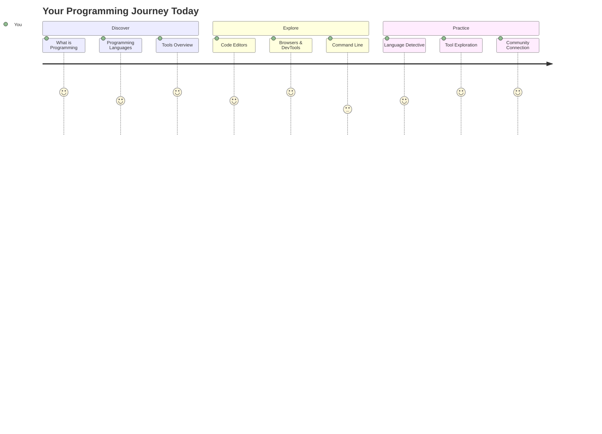
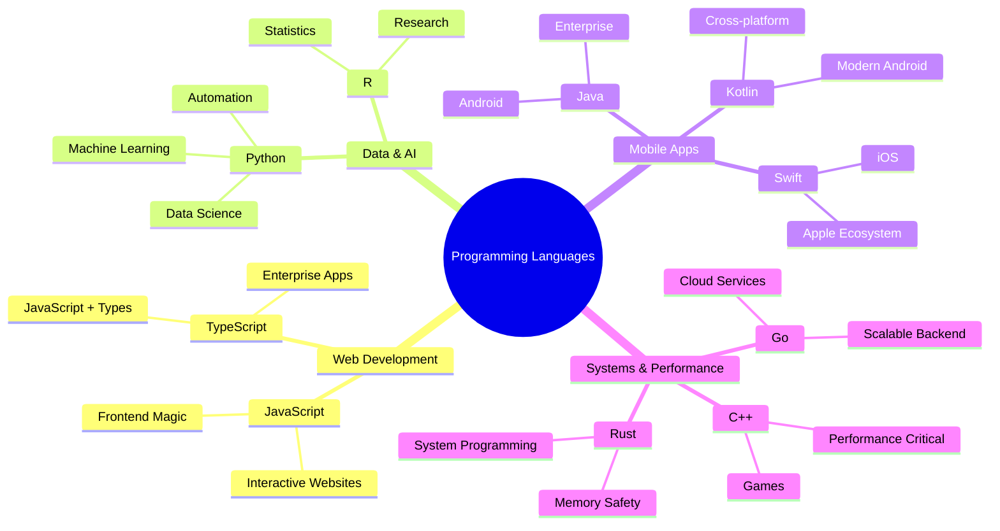
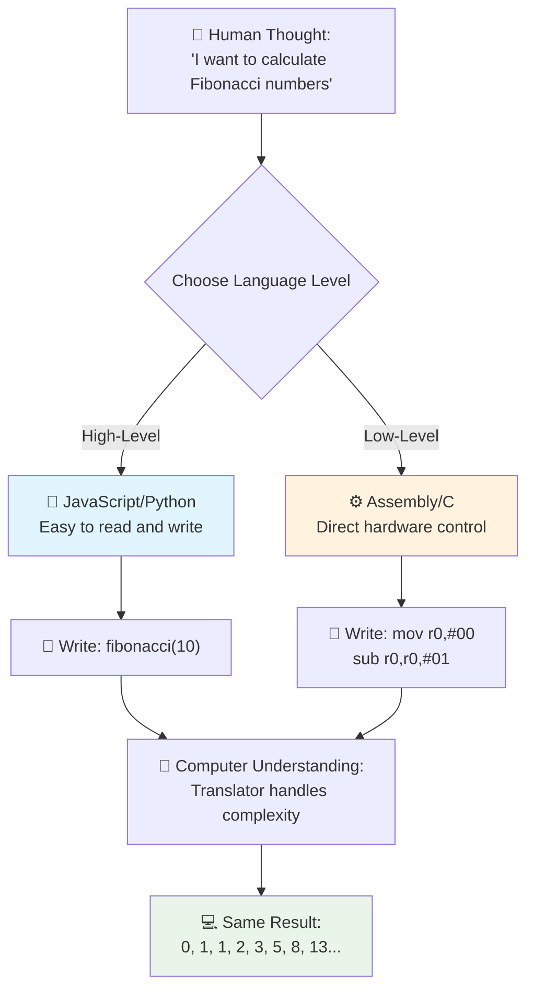
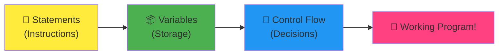
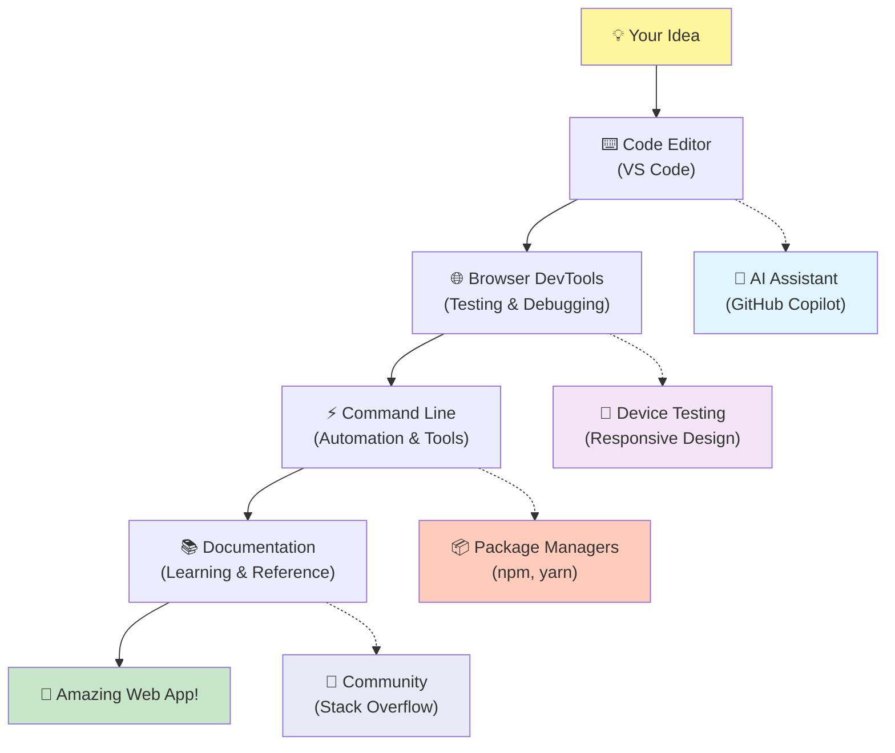
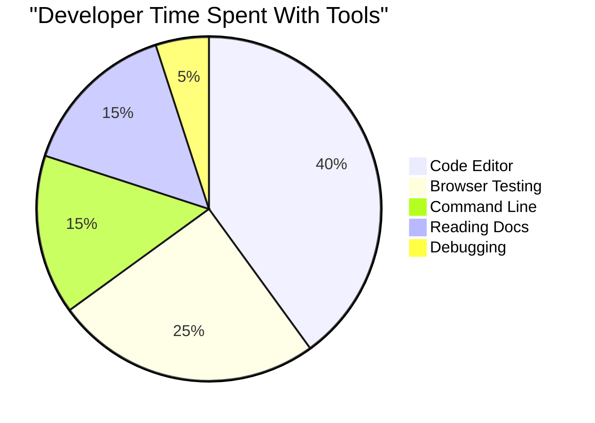
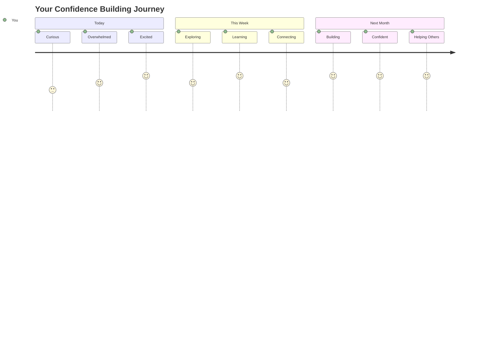

<!--
CO_OP_TRANSLATOR_METADATA:
{
  "original_hash": "d45ddcc54eb9232a76d08328b09d792e",
  "translation_date": "2025-11-03T23:37:49+00:00",
  "source_file": "1-getting-started-lessons/1-intro-to-programming-languages/README.md",
  "language_code": "mo"
}
-->
# 程式語言與現代開發工具簡介

嗨，未來的開發者！👋 我能告訴你一件每天都讓我感到激動的事嗎？你即將發現，程式設計不僅僅是關於電腦的事情——它更像是擁有一種能將你最狂野的想法變成現實的超能力！

你知道那種使用你最喜歡的應用程式時，一切都完美契合的瞬間嗎？當你點擊一個按鈕，發生了一些絕妙的事情，讓你忍不住驚嘆「哇，他們是怎麼做到的？」好吧，有人就像你一樣——可能在凌晨兩點坐在他們最喜歡的咖啡館裡喝著第三杯濃縮咖啡——寫下了創造這種魔法的程式碼。而最讓人驚訝的是：在這堂課結束之前，你不僅會明白他們是怎麼做到的，還會迫不及待地想要自己試試！

聽著，我完全理解如果你現在覺得程式設計很難。當我剛開始學習時，我真的以為你需要是某種數學天才，或者從五歲開始就一直在寫程式。但有一件事完全改變了我的看法：程式設計就像學習一種新語言的對話。你從「你好」和「謝謝」開始，然後慢慢學會點咖啡，最後你就能進行深刻的哲學討論了！只不過在這種情況下，你是在和電腦對話，說真的？它們是你能遇到的最有耐心的對話夥伴——它們不會評判你的錯誤，並且總是樂於再試一次！

今天，我們將探索那些讓現代網頁開發不僅僅是可能，而且令人上癮的不可思議工具。我說的是Netflix、Spotify以及你最喜歡的獨立應用程式工作室的開發者每天都在使用的編輯器、瀏覽器和工作流程。而最讓人開心的是：大多數這些專業級、行業標準的工具都是完全免費的！


> [Tomomi Imura](https://twitter.com/girlie_mac) 的手繪筆記



## 來看看你已經知道什麼！

在我們進入有趣的部分之前，我很好奇——你對這個程式設計世界已經了解多少？聽著，如果你看到這些問題時心想「我完全不知道這些是什麼」，那不僅沒關係，還是最好的狀態！這意味著你來對地方了。把這個測驗當作是運動前的拉伸——我們只是要熱身一下腦袋！

[參加課前測驗](https://forms.office.com/r/dru4TE0U9n?origin=lprLink)

## 我們即將一起展開的冒險

好吧，我真的非常興奮能和你一起探索今天的內容！說真的，我真希望能看到你在理解這些概念時的表情。以下是我們即將一起踏上的精彩旅程：

- **什麼是程式設計（以及為什麼它是最酷的事情！）**——我們將發現程式碼如何成為驅動你周圍一切事物的隱形魔法，從那個知道今天是星期一早上的鬧鐘，到完美推薦你Netflix節目的演算法。
- **程式語言及其驚人的個性**——想像一下走進一個派對，每個人都有完全不同的超能力和解決問題的方式。這就是程式語言的世界，你一定會喜歡認識它們！
- **創造數位魔法的基本構件**——把這些想像成終極的創意樂高套件。一旦你了解這些部件如何組合在一起，你會發現你可以建造任何你想像中的東西。
- **讓你感覺像是拿到魔法棒的專業工具**——我不是在誇張——這些工具真的會讓你感覺自己擁有超能力，而最棒的是？它們就是專業人士每天使用的工具！

> 💡 **重點是**：今天不要試圖記住所有的內容！現在，我只希望你能感受到對未來可能性的興奮。隨著我們一起練習，細節會自然地記住——這才是真正的學習方式！

> 你可以在 [Microsoft Learn](https://docs.microsoft.com/learn/modules/web-development-101/introduction-programming/?WT.mc_id=academic-77807-sagibbon) 上學習這堂課！

## 那麼，程式設計到底是什麼？

好吧，讓我們來解答這個價值百萬的問題：程式設計到底是什麼？

我來講一個完全改變我對這個問題看法的故事。上週，我試著向我媽媽解釋如何使用我們的新智能電視遙控器。我聽到自己說：「按下紅色按鈕，但不是大紅色按鈕，是左邊的小紅色按鈕……不，是你的左邊……好，現在按住兩秒鐘，不是一秒，也不是三秒……」聽起來熟悉嗎？😅

這就是程式設計！它是一種藝術，能夠向一個非常強大的東西提供非常詳細的逐步指令，但需要把每件事都解釋得非常清楚。只不過，與其向你的媽媽解釋（她可能會問「哪個紅色按鈕？！」），你是在向電腦解釋（它只會完全按照你的指令執行，即使你說的話並不完全是你想表達的意思）。

當我第一次了解到這一點時，讓我大開眼界的是：電腦的核心其實非常簡單。它們只懂兩件事——1和0，基本上就是「是」和「否」或「開」和「關」。就這樣！但神奇的是——我們不需要像《駭客任務》裡那樣用1和0來交流。這就是**程式語言**的救星。它們就像世界上最棒的翻譯員，能將你完全正常的人類思維轉換成電腦語言。

而每天早上醒來時，仍然讓我感到激動的是：你生活中的每一件數位化的事物，都是由某個像你一樣的人創造的。他們可能穿著睡衣，手裡拿著一杯咖啡，在筆記本電腦上敲著程式碼。那個讓你看起來完美無瑕的Instagram濾鏡？有人寫了程式碼。那個推薦你新最愛歌曲的演算法？開發者建造了它。那個幫助你和朋友分攤晚餐費的應用程式？是的，有人想「這太麻煩了，我想我可以解決這個問題」，然後……他們真的做到了！

當你學會程式設計時，你不僅僅是在學習一項新技能——你正在成為這個令人驚嘆的問題解決者社群的一部分，他們每天都在思考：「如果我能建造一些能讓某人的一天變得更好一點的東西呢？」說真的，有什麼比這更酷的嗎？

✅ **趣味事實探索**：當你有空的時候，可以查一下這個超酷的事情——你認為世界上第一位電腦程式設計師是誰？我給你一個提示：可能不是你想的那個人！這個人的故事非常有趣，顯示程式設計一直以來都是關於創造性問題解決和跳出框架思考。

### 🧠 **檢查時間：你感覺如何？**

**花點時間反思：**
- 「向電腦提供指令」的概念現在對你來說是否有點理解了？
- 你能想到一個日常任務，想用程式設計來自動化嗎？
- 關於程式設計這件事，你腦海中有哪些問題正在浮現？

> **記住**：如果有些概念現在感覺模糊不清是完全正常的。學習程式設計就像學習一種新語言——需要時間讓你的大腦建立那些神經通路。你做得很好！

## 程式語言就像不同口味的魔法

好吧，這聽起來可能有點奇怪，但請跟著我——程式語言就像不同類型的音樂。想想看：有爵士樂，流暢且即興；搖滾樂，強而有力且直接；古典音樂，優雅且結構化；還有嘻哈音樂，創意且表達力強。每種風格都有自己的氛圍、熱情的粉絲社群，每一種都適合不同的情境和心情。

程式語言完全一樣！你不會用同一種語言來建造一個有趣的手機遊戲和用來處理大量氣候數據的程式，就像你不會在瑜伽課上播放死亡金屬音樂（嗯，大多數瑜伽課啦！😄）。

但每次想到這件事都讓我驚嘆的是：這些語言就像有世界上最耐心、最聰明的翻譯員坐在你旁邊。你可以用一種對人類大腦來說自然的方式表達你的想法，而它們會處理所有將其轉換成電腦語言的複雜工作。就像有一個朋友，既精通「人類創意」又精通「電腦邏輯」——而且他們永遠不會累，不需要喝咖啡，也不會因為你問了同樣的問題兩次而評判你！

### 常見程式語言及其用途



| 語言 | 最適合 | 為什麼受歡迎 |
|------|--------|--------------|
| **JavaScript** | 網頁開發、使用者介面 | 在瀏覽器中運行，驅動互動式網站 |
| **Python** | 數據科學、自動化、人工智慧 | 易於閱讀和學習，擁有強大的庫 |
| **Java** | 企業應用程式、Android應用程式 | 平台獨立，適合大型系統 |
| **C#** | Windows應用程式、遊戲開發 | 微軟生態系統支持強大 |
| **Go** | 雲服務、後端系統 | 快速、簡單，為現代計算設計 |

### 高階語言與低階語言

好吧，這是我剛開始學習時讓我腦袋爆炸的概念，所以我要分享一個最終讓我理解的比喻——希望它也能幫助到你！

想像一下，你正在拜訪一個你不會說當地語言的國家，而你急需找到最近的洗手間（我們都曾有過這種情況，對吧？😅）：

- **低階程式設計**就像是你完全掌握當地方言，能用文化參考、本地俚語和只有當地人懂的內部笑話與街角賣水果的奶奶聊天。非常令人印象深刻且高效……如果你剛好很流利！但如果你只是想找個洗手間，可能會覺得壓力很大。

- **高階程式設計**就像有一個超棒的當地朋友，他完全理解你。你可以用簡單的英文說「我真的需要找個洗手間」，而他會處理所有的文化翻譯，並用你能理解的方式給你指路。

在程式設計的術語中：
- **低階語言**（例如Assembly或C）讓你能與電腦的硬體進行非常詳細的對話，但你需要像機器一樣思考，這……嗯，讓我們說這是一個相當大的心理轉變吧！
- **高階語言**（例如JavaScript、Python或C#）讓你可以像人類一樣思考，而它們會處理所有的機器語言。除此之外，它們還擁有非常友好的社群，充滿了記得自己曾經是新手並真心想幫助你的好人！

猜猜我會建議你從哪一種開始？😉 高階語言就像有訓練輪的自行車，你永遠不會想要拆掉它們，因為它們讓整個學習過程變得更加愉快！



### 讓我告訴你為什麼高階語言更友好

好吧，我要向你展示一些東西，這些東西完美地展示了為什麼我愛上了高階語言，但首先——我需要你答應我一件事。當你看到第一個程式碼範例時，不要驚慌！它看起來很嚇人是正常的。這正是我要說明的重點！

我們將看到用兩種完全不同的風格寫的同一個任務。兩者都創建了所謂的斐波那契數列——這是一個美麗的數學模式，每個數字都是前兩個數字的總和：0, 1, 1, 2, 3, 5, 8, 13...（趣事：你會在自然界的各個地方找到這個模式——向日葵種子螺旋、松果的排列，甚至是星系的形成！）

準備好看差異了嗎？我們開始吧！

**高階語言（JavaScript）——人類友好：**

```javascript
// Step 1: Basic Fibonacci setup
const fibonacciCount = 10;
let current = 0;
let next = 1;

console.log('Fibonacci sequence:');
```

**這段程式碼的作用：**
- **宣告**一個常數來指定我們想生成多少個斐波那契數字
- **初始化**兩個變數來追蹤序列中的當前數字和下一個數字
- **設置**定義斐波那契模式的起始值（0和1）
- **顯示**一個標題消息來標識我們的輸出

```javascript
// Step 2: Generate the sequence with a loop
for (let i = 0; i < fibonacciCount; i++) {
  console.log(`Position ${i + 1}: ${current}`);
  
  // Calculate next number in sequence
  const sum = current + next;
  current = next;
  next = sum;
}
```

**分解這裡發生的事情：**
- 使用`for`循環**遍歷**序列中的每個位置
- 使用模板字面值格式**顯示**每個數字及其位置
- 通過添加當前值和下一個值**計算**下一個斐波那契數字
- **更新**我們的追蹤變數以進入下一次迭代

```javascript
// Step 3: Modern functional approach
const generateFibonacci = (count) => {
  const sequence = [0, 1];
  
  for (let i = 2; i < count; i++) {
    sequence[i] = sequence[i - 1] + sequence[i - 2];
  }
  
  return sequence;
};

// Usage example
const fibSequence = generateFibonacci(10);
console.log(fibSequence);
```

**在上面，我們：**
- 使用現代箭頭函數語法**創建**了一個可重用的函數
- **構建**了一個陣列來存儲完整的序列，而不是逐一顯示
- 使用陣列索引從前面的值中**計算**每個新數字
- **返回**完整的序列，以便在程式的其他部分靈活使用

**低階語言（ARM Assembly）——電腦友好：**

```assembly
 area ascen,code,readonly
 entry
 code32
 adr r0,thumb+1
 bx r0
 code16
thumb
 mov r0,#00
 sub r0,r0,#01
 mov r1,#01
 mov r4,#10
 ldr r2,=0x40000000
back add r0,r1
 str r0,[r2]
 add r2,#04
 mov r3,r0
 mov r0,r1
 mov r1,r3
 sub r4,#01
 cmp r4,#00
 bne back
 end
```

注意，JavaScript版本幾乎像英文指令一樣易讀，而Assembly版本使用了直接控制電腦處理器的晦澀命令。兩者完成了完全相同的任務，但高階語言對人類來說更容易理解、編寫和維護。

**你會注意到的主要差異：**
- **可讀性**：JavaScript使用描述性名稱如`fibonacciCount`，而Assembly使用晦澀的標籤如`r0`、`r1`
- **註解**：高階語言鼓勵使用解釋性的註解，使程式碼更具自我說明性  
- **結構**：JavaScript 的邏輯流程與人類逐步解決問題的思維方式相符  
- **維護性**：根據不同需求更新 JavaScript 版本既簡單又清晰  

✅ **關於斐波那契數列**：這個絕美的數字模式（每個數字等於前兩個數字的總和：0, 1, 1, 2, 3, 5, 8...）幾乎無處不在！你可以在向日葵的螺旋、松果的排列、鸚鵡螺的曲線，甚至是樹枝的生長方式中發現它。數學和程式碼能幫助我們理解並重現自然界用來創造美的模式，這真是令人驚嘆！

## 創造魔法的基石

好了，現在你已經看到了程式語言的實際運作方式，讓我們來拆解一下構成每個程式的基本元素。把這些想像成你最愛的食譜中的基本材料——一旦你了解了每個材料的作用，你幾乎可以用任何語言來閱讀和撰寫程式！

這有點像學習程式語言的文法。還記得在學校學過的名詞、動詞以及如何組成句子嗎？程式語言也有自己的文法版本，老實說，比英語文法還要邏輯清晰且容易理解！😄

### 語句：一步步的指令

我們先從 **語句** 開始——這些就像是你和電腦對話中的單句。每個語句都告訴電腦執行一個特定的動作，就像給出指示一樣：「在這裡左轉」、「在紅燈處停下」、「停在那個位置」。

我喜歡語句的地方在於它們通常非常易讀。看看這個例子：

```javascript
// Basic statements that perform single actions
const userName = "Alex";                    
console.log("Hello, world!");              
const sum = 5 + 3;                         
```
  
**這段程式碼的作用是：**  
- **宣告** 一個常數變數來儲存使用者的名字  
- **顯示** 一個問候訊息到主控台輸出  
- **計算** 並儲存一個數學運算的結果  

```javascript
// Statements that interact with web pages
document.title = "My Awesome Website";      
document.body.style.backgroundColor = "lightblue";
```
  
**逐步解析發生了什麼：**  
- **修改** 瀏覽器標籤中顯示的網頁標題  
- **更改** 整個頁面背景的顏色  

### 變數：程式的記憶系統

好吧，**變數** 說真的是我最喜歡教的概念之一，因為它們和你每天使用的東西非常相似！

想想你的手機聯絡人清單。你不會記住每個人的電話號碼——相反地，你會儲存「媽媽」、「最好的朋友」或「營業到凌晨兩點的披薩店」，然後讓手機記住實際的號碼。變數的運作方式完全一樣！它們就像是有標籤的容器，你的程式可以用來儲存資訊，並在需要時用一個有意義的名字來取回。

有趣的是：變數可以在程式運行時改變（這就是為什麼叫做「變數」——你看出來了吧？）。就像當你發現一家更好的披薩店時，會更新聯絡人一樣，當程式獲得新資訊或情況發生變化時，變數也可以更新！

讓我來展示一下這有多簡單又美妙：

```javascript
// Step 1: Creating basic variables
const siteName = "Weather Dashboard";        
let currentWeather = "sunny";               
let temperature = 75;                       
let isRaining = false;                      
```
  
**理解這些概念：**  
- **儲存** 不會改變的值在 `const` 變數中（例如網站名稱）  
- **使用** `let` 來儲存可能會在程式中改變的值  
- **指定** 不同的數據類型：字串（文字）、數字和布林值（真/假）  
- **選擇** 描述性名稱，清楚說明每個變數的內容  

```javascript
// Step 2: Working with objects to group related data
const weatherData = {                       
  location: "San Francisco",
  humidity: 65,
  windSpeed: 12
};
```
  
**在上面的例子中，我們：**  
- **創建** 一個物件來將相關的天氣資訊分組  
- **組織** 多個數據到一個變數名稱下  
- **使用** 鍵值對來清楚標記每個資訊  

```javascript
// Step 3: Using and updating variables
console.log(`${siteName}: Today is ${currentWeather} and ${temperature}°F`);
console.log(`Wind speed: ${weatherData.windSpeed} mph`);

// Updating changeable variables
currentWeather = "cloudy";                  
temperature = 68;                          
```
  
**讓我們理解每個部分：**  
- **顯示** 資訊，使用帶有 `${}` 語法的模板字面值  
- **訪問** 物件屬性，使用點符號（`weatherData.windSpeed`）  
- **更新** 使用 `let` 宣告的變數以反映變化的條件  
- **結合** 多個變數來創建有意義的訊息  

```javascript
// Step 4: Modern destructuring for cleaner code
const { location, humidity } = weatherData; 
console.log(`${location} humidity: ${humidity}%`);
```
  
**你需要知道的事情：**  
- **提取** 物件中的特定屬性，使用解構賦值  
- **自動創建** 與物件鍵相同名稱的新變數  
- **簡化** 程式碼，避免重複使用點符號  

### 控制流程：教會程式如何思考

好吧，這是程式設計中最令人驚嘆的部分！**控制流程** 基本上就是教你的程式如何做出明智的決定，就像你每天不假思索地做的那樣。

想像一下：今天早上你可能經歷了這樣的情況：「如果下雨，我會帶傘。如果天冷，我會穿外套。如果我遲到了，我會跳過早餐，改在路上買咖啡。」你的大腦每天自然地遵循這種 if-then 邏輯數十次！

這就是讓程式感覺聰明且充滿活力的原因，而不是僅僅遵循一些無聊、可預測的腳本。它們實際上可以觀察情況，評估發生的事情，並做出適當的反應。這就像給你的程式一個可以適應和做出選擇的大腦！

想看看這是如何運作的嗎？讓我來展示給你看：

```javascript
// Step 1: Basic conditional logic
const userAge = 17;

if (userAge >= 18) {
  console.log("You can vote!");
} else {
  const yearsToWait = 18 - userAge;
  console.log(`You'll be able to vote in ${yearsToWait} year(s).`);
}
```
  
**這段程式碼的作用是：**  
- **檢查** 使用者的年齡是否符合投票資格  
- **執行** 不同的程式碼塊，根據條件結果  
- **計算** 並顯示距離符合投票資格還有多久（如果未滿 18 歲）  
- **提供** 每種情況的具體、有幫助的反饋  

```javascript
// Step 2: Multiple conditions with logical operators
const userAge = 17;
const hasPermission = true;

if (userAge >= 18 && hasPermission) {
  console.log("Access granted: You can enter the venue.");
} else if (userAge >= 16) {
  console.log("You need parent permission to enter.");
} else {
  console.log("Sorry, you must be at least 16 years old.");
}
```
  
**解析這裡發生的事情：**  
- **結合** 多個條件，使用 `&&`（和）運算符  
- **創建** 條件層次結構，使用 `else if` 處理多種情況  
- **處理** 所有可能的情況，使用最後的 `else` 語句  
- **提供** 每種不同情況的清晰、可操作的反饋  

```javascript
// Step 3: Concise conditional with ternary operator
const votingStatus = userAge >= 18 ? "Can vote" : "Cannot vote yet";
console.log(`Status: ${votingStatus}`);
```
  
**你需要記住的事情：**  
- **使用** 三元運算符（`? :`）處理簡單的兩種選擇條件  
- **先寫** 條件，接著是 `?`，然後是條件為真時的結果，再接著是 `:`，最後是條件為假時的結果  
- **應用** 這種模式，當你需要根據條件分配值時  

```javascript
// Step 4: Handling multiple specific cases
const dayOfWeek = "Tuesday";

switch (dayOfWeek) {
  case "Monday":
  case "Tuesday":
  case "Wednesday":
  case "Thursday":
  case "Friday":
    console.log("It's a weekday - time to work!");
    break;
  case "Saturday":
  case "Sunday":
    console.log("It's the weekend - time to relax!");
    break;
  default:
    console.log("Invalid day of the week");
}
```
  
**這段程式碼完成了以下任務：**  
- **匹配** 變數值與多個特定情況  
- **將** 相似的情況分組（工作日與週末）  
- **執行** 當找到匹配時的適當程式碼塊  
- **包含** 一個 `default` 情況來處理意外值  
- **使用** `break` 語句，防止程式繼續執行下一個情況  

> 💡 **現實生活中的類比**：將控制流程想像成擁有世界上最有耐心的 GPS 為你指路。它可能會說：「如果主街有交通堵塞，改走高速公路。如果高速公路有施工，試試風景路線。」程式使用的正是這種條件邏輯，來智能地應對不同情況，並始終為用戶提供最佳的體驗。

### 🎯 **概念檢查：掌握基礎知識**

**來看看你對基礎知識的掌握情況：**  
- 你能用自己的話解釋變數和語句的區別嗎？  
- 想一個現實生活中你會用到 if-then 決策的情境（比如我們的投票例子）  
- 程式邏輯中有什麼讓你感到驚訝的地方嗎？  

**快速信心提升：**  

  
✅ **接下來的內容**：我們將繼續深入探討這些概念，這將是一段令人興奮的旅程！現在，只需專注於感受對未來無限可能的興奮。隨著我們一起練習，具體的技能和技術會自然地融入你的腦海中——我保證，這將比你想像的更有趣！

## 工具箱

好吧，這是我真的興奮到無法自已的地方！🚀 我們即將討論一些令人驚嘆的工具，這些工具會讓你感覺自己像是剛剛拿到了數位太空船的鑰匙。

你知道嗎，廚師有那些用起來得心應手的刀具，音樂家有那把一彈就能發出美妙聲音的吉他？而開發者也有我們自己的這些神奇工具，最棒的是——它們大多是完全免費的！

想到要和你分享這些工具，我簡直興奮得坐不住了，因為它們徹底改變了我們開發軟體的方式。我們要談的是 AI 驅動的程式碼助手，它們可以幫助你撰寫程式碼（我不是在開玩笑！），還有雲端環境，讓你可以在任何有 Wi-Fi 的地方構建完整的應用程式，甚至還有像 X 光一樣的除錯工具，能讓你看穿程式的內部。

最讓我激動的是：這些工具並不是你剛開始學習時用的「入門工具」，然後就會被淘汰。這些正是 Google、Netflix 和你喜歡的那些獨立應用工作室的開發者此刻正在使用的專業級工具。使用它們時，你會感覺自己像個專業人士！


  
### 程式碼編輯器和 IDE：你的新數位好夥伴

來聊聊程式碼編輯器——這些將成為你最愛的工作場所！把它們想像成你的個人編碼聖地，在這裡你會花大部分時間來創作和完善你的數位作品。

但現代編輯器的神奇之處在於：它們不僅僅是高級的文字編輯器。它們就像有一位最聰明、最支持你的編碼導師，24/7 陪伴在你身邊。它們在你注意到之前就抓住你的拼寫錯誤，提出讓你看起來像天才的改進建議，幫助你理解每段程式碼的作用，有些甚至能預測你接下來要輸入什麼，並主動幫你完成！

我還記得第一次發現自動完成功能時的感覺——我真的覺得自己活在未來。你開始輸入某些東西，然後你的編輯器會說：「嘿，你是不是在想這個正好符合你需求的函數？」這就像有一個讀心術的編碼夥伴！

**這些編輯器為什麼這麼厲害？**

現代程式碼編輯器提供了一系列令人印象深刻的功能，旨在提高你的生產力：

| 功能 | 功能描述 | 幫助原因 |
|------|----------|----------|
| **語法高亮** | 為程式碼的不同部分上色 | 讓程式碼更易讀，方便發現錯誤 |
| **自動完成** | 在你輸入時建議程式碼 | 加快編碼速度並減少拼寫錯誤 |
| **除錯工具** | 幫助你找到並修復錯誤 | 節省大量排查問題的時間 |
| **擴展功能** | 添加專門功能 | 根據任何技術自定義你的編輯器 |
| **AI 助手** | 提供程式碼建議和解釋 | 加速學習和提高生產力 |

> 🎥 **影片資源**：想看看這些工具的實際運作嗎？查看這個 [工具箱影片](https://youtube.com/watch?v=69WJeXGBdxg) 獲取全面概覽。

#### 推薦的網頁開發編輯器

**[Visual Studio Code](https://code.visualstudio.com/?WT.mc_id=academic-77807-sagibbon)** (免費)  
- 最受網頁開發者歡迎  
- 優秀的擴展生態系統  
- 內建終端機和 Git 整合  
- **必備擴展功能**：  
  - [GitHub Copilot](https://marketplace.visualstudio.com/items?itemName=GitHub.copilot) - AI 驅動的程式碼建議  
  - [Live Share](https://marketplace.visualstudio.com/items?itemName=MS-vsliveshare.vsliveshare) - 即時協作  
  - [Prettier](https://marketplace.visualstudio.com/items?itemName=esbenp.prettier-vscode) - 自動程式碼格式化  
  - [Code Spell Checker](https://marketplace.visualstudio.com/items?itemName=streetsidesoftware.code-spell-checker) - 捕捉程式碼中的拼寫錯誤  

**[JetBrains WebStorm](https://www.jetbrains.com/webstorm/)** (付費，學生免費)  
- 高級除錯和測試工具  
- 智能程式碼完成  
- 內建版本控制  

**雲端 IDE** (價格各異)  
- [GitHub Codespaces](https://github.com/features/codespaces) - 瀏覽器中的完整 VS Code  
- [Replit](https://replit.com/) - 適合學習和分享程式碼  
- [StackBlitz](https://stackblitz.com/) - 即時全棧網頁開發  

> 💡 **入門提示**：從 Visual Studio Code 開始——它免費、在業界廣泛使用，並且擁有大量的社群提供有用的教學和擴展功能。

### 網頁瀏覽器：你的秘密開發實驗室

準備好讓你的腦袋完全被震撼吧！你知道嗎，你一直用來瀏覽社交媒體和觀看影片的瀏覽器，其實隱藏著一個令人難以置信的開發者實驗室，就等著你去發現！

每次你右鍵點擊網頁並選擇「檢查元素」時，你就打開了一個隱藏的開發者工具世界，這些工具的功能其實比我以前花幾百美元購買的昂貴軟體還要強大。這就像發現你的普通廚房後面隱藏著一個專業廚師的實驗室一樣！
第一次有人向我展示瀏覽器的開發者工具（DevTools）時，我花了三個小時不停地點來點去，心裡一直在想：「等等，它居然還能做到這些？！」你可以即時編輯任何網站，查看所有內容的加載速度，測試網站在不同設備上的外觀，甚至像專業人士一樣調試 JavaScript。這簡直太令人驚嘆了！

**以下是瀏覽器成為你秘密武器的原因：**

當你創建網站或網頁應用時，你需要了解它在真實世界中的外觀和行為。瀏覽器不僅展示你的作品，還提供有關性能、可訪問性和潛在問題的詳細反饋。

#### 瀏覽器開發者工具（DevTools）

現代瀏覽器包含全面的開發套件：

| 工具類別 | 功能 | 使用案例 |
|----------|------|----------|
| **元素檢查器** | 即時查看和編輯 HTML/CSS | 調整樣式並立即查看效果 |
| **控制台** | 查看錯誤信息並測試 JavaScript | 調試問題並嘗試代碼 |
| **網絡監控** | 跟蹤資源加載情況 | 優化性能和加載時間 |
| **可訪問性檢查器** | 測試包容性設計 | 確保網站適合所有用戶 |
| **設備模擬器** | 預覽不同屏幕尺寸 | 測試響應式設計而無需多台設備 |

#### 推薦的開發瀏覽器

- **[Chrome](https://developers.google.com/web/tools/chrome-devtools/)** - 業界標準的開發者工具，擁有豐富的文檔
- **[Firefox](https://developer.mozilla.org/docs/Tools)** - 出色的 CSS Grid 和可訪問性工具
- **[Edge](https://docs.microsoft.com/microsoft-edge/devtools-guide-chromium/?WT.mc_id=academic-77807-sagibbon)** - 基於 Chromium，擁有微軟的開發資源

> ⚠️ **重要測試提示**：一定要在多個瀏覽器中測試你的網站！在 Chrome 上完美運行的內容可能在 Safari 或 Firefox 上看起來不同。專業開發者會在所有主流瀏覽器上進行測試，以確保一致的用戶體驗。

### 命令行工具：開發者的超能力入口

好吧，讓我們坦誠地聊聊命令行，因為我希望你能聽到一個真正理解它的人說的話。當我第一次看到它時——那個黑乎乎的屏幕上閃爍著文字——我真的想，「不行，絕對不行！這看起來像是1980年代黑客電影裡的場景，我肯定不夠聰明去搞懂這個！」😅

但我希望有人當時能告訴我這些，而現在我告訴你：命令行並不可怕——它其實就像在和你的電腦直接對話。想像一下，這就像通過一個帶有圖片和菜單的高級應用程序點餐（這很簡單也很方便），與走進你最喜歡的本地餐廳，廚師知道你喜歡什麼，只需說一句「給我來點驚喜的美味」就能做出完美的菜肴之間的區別。

命令行是開發者感覺自己像巫師的地方。你輸入幾個看似神奇的詞（好吧，它們只是命令，但感覺很神奇！），按下回車鍵，然後——砰——你創建了整個項目結構，安裝了來自世界各地的強大工具，或者將你的應用部署到互聯網上供數百萬人使用。一旦你嘗到這種力量的滋味，真的會上癮！

**為什麼命令行會成為你最喜歡的工具：**

雖然圖形界面在許多任務中表現出色，但命令行在自動化、精確性和速度方面更勝一籌。許多開發工具主要通過命令行界面工作，學會高效使用它們可以顯著提高你的生產力。

```bash
# Step 1: Create and navigate to project directory
mkdir my-awesome-website
cd my-awesome-website
```

**這段代碼的作用：**
- **創建**一個名為「my-awesome-website」的新目錄作為你的項目
- **進入**新創建的目錄開始工作

```bash
# Step 2: Initialize project with package.json
npm init -y

# Install modern development tools
npm install --save-dev vite prettier eslint
npm install --save-dev @eslint/js
```

**逐步解析：**
- 使用 `npm init -y` **初始化**一個帶有默認設置的 Node.js 項目
- **安裝** Vite 作為現代構建工具，用於快速開發和生產構建
- **添加** Prettier 用於自動代碼格式化，以及 ESLint 用於代碼質量檢查
- 使用 `--save-dev` 標誌將這些標記為僅限開發的依賴項

```bash
# Step 3: Create project structure and files
mkdir src assets
echo '<!DOCTYPE html><html><head><title>My Site</title></head><body><h1>Hello World</h1></body></html>' > index.html

# Start development server
npx vite
```

**以上操作中，我們已完成：**
- **組織**項目，創建了分別存放源代碼和資產的文件夾
- **生成**了一個基本的 HTML 文件，具有正確的文檔結構
- **啟動**了 Vite 開發服務器，用於實時重新加載和模塊熱替換

#### 網頁開發必備命令行工具

| 工具 | 用途 | 為什麼需要它 |
|------|------|-------------|
| **[Git](https://git-scm.com/)** | 版本控制 | 跟蹤更改、與他人協作、備份你的工作 |
| **[Node.js & npm](https://nodejs.org/)** | JavaScript 運行時和包管理 | 在瀏覽器外運行 JavaScript，安裝現代開發工具 |
| **[Vite](https://vitejs.dev/)** | 構建工具和開發服務器 | 超快的開發速度，支持模塊熱替換 |
| **[ESLint](https://eslint.org/)** | 代碼質量 | 自動查找並修復 JavaScript 中的問題 |
| **[Prettier](https://prettier.io/)** | 代碼格式化 | 保持代碼一致的格式和可讀性 |

#### 平台特定選項

**Windows:**
- **[Windows Terminal](https://docs.microsoft.com/windows/terminal/?WT.mc_id=academic-77807-sagibbon)** - 現代化、功能豐富的終端
- **[PowerShell](https://docs.microsoft.com/powershell/?WT.mc_id=academic-77807-sagibbon)** 💻 - 強大的腳本環境
- **[Command Prompt](https://docs.microsoft.com/windows-server/administration/windows-commands/?WT.mc_id=academic-77807-sagibbon)** 💻 - 傳統的 Windows 命令行

**macOS:**
- **[Terminal](https://support.apple.com/guide/terminal/)** 💻 - 系統自帶的終端應用
- **[iTerm2](https://iterm2.com/)** - 增強型終端，擁有高級功能

**Linux:**
- **[Bash](https://www.gnu.org/software/bash/)** 💻 - 標準 Linux shell
- **[KDE Konsole](https://docs.kde.org/trunk5/en/konsole/konsole/index.html)** - 高級終端模擬器

> 💻 = 操作系統預裝

> 🎯 **學習路徑**：從基本命令開始，例如 `cd`（切換目錄）、`ls` 或 `dir`（列出文件）、`mkdir`（創建文件夾）。練習使用現代工作流命令，例如 `npm install`、`git status` 和 `code .`（在 VS Code 中打開當前目錄）。隨著你越來越熟悉，你會自然掌握更多高級命令和自動化技術。

### 文檔：你的隨時可用學習導師

好吧，讓我分享一個小秘密，這會讓你對自己是初學者的身份感覺好很多：即使是最有經驗的開發者，也會花大量時間閱讀文檔。而這並不是因為他們不知道自己在做什麼——這其實是智慧的象徵！

把文檔想像成擁有世界上最耐心、最知識淵博的老師，他們全天候都在你身邊。凌晨2點卡在一個問題上？文檔會以溫暖的虛擬擁抱和你需要的答案陪伴你。想了解大家都在談論的某個新功能？文檔會提供分步示例支持你。想弄清楚某些東西為什麼會這樣運作？你猜對了——文檔會以一種讓你恍然大悟的方式解釋清楚！

有一件事徹底改變了我的看法：網頁開發世界發展得非常快，沒有人（我指的是絕對沒有人！）能把所有東西都記住。我曾看過擁有15年以上經驗的資深開發者查詢基本語法，你知道嗎？這並不丟人——這很聰明！重點不是擁有完美的記憶力，而是知道如何快速找到可靠的答案並理解如何應用它們。

**真正的魔力在這裡：**

專業開發者花大量時間閱讀文檔——不是因為他們不知道自己在做什麼，而是因為網頁開發領域發展迅速，保持更新需要不斷學習。優秀的文檔不僅幫助你理解如何使用某些工具，還幫助你理解為什麼以及何時使用它們。

#### 必備文檔資源

**[Mozilla Developer Network (MDN)](https://developer.mozilla.org/docs/Web)**
- 網頁技術文檔的黃金標準
- 提供 HTML、CSS 和 JavaScript 的全面指南
- 包括瀏覽器兼容性信息
- 提供實用示例和交互式演示

**[Web.dev](https://web.dev)** (由 Google 提供)
- 現代網頁開發最佳實踐
- 性能優化指南
- 可訪問性和包容性設計原則
- 真實項目的案例研究

**[Microsoft Developer Documentation](https://docs.microsoft.com/microsoft-edge/#microsoft-edge-for-developers)**
- Edge 瀏覽器開發資源
- 漸進式網頁應用指南
- 跨平台開發洞察

**[Frontend Masters Learning Paths](https://frontendmasters.com/learn/)**
- 結構化學習課程
- 行業專家提供的視頻課程
- 實踐編程練習

> 📚 **學習策略**：不要試圖記住文檔——而是學會如何高效地瀏覽它。收藏常用的參考資料，練習使用搜索功能快速找到特定信息。

### 🔧 **工具掌握檢查：什麼讓你感到興奮？**

**花點時間思考：**
- 你最想先嘗試哪個工具？（沒有錯誤的答案！）
- 命令行是否仍然讓你感到害怕，或者你對它感到好奇？
- 你能想像使用瀏覽器開發者工具來窺探你最喜歡的網站背後的秘密嗎？



> **有趣的洞察**：大多數開發者大約40%的時間花在代碼編輯器上，但注意有多少時間用於測試、學習和解決問題。編程不僅僅是寫代碼——它是創造體驗！

✅ **思考食糧**：這裡有一個有趣的問題值得思考——你認為用於構建網站的工具（開發）和設計網站外觀的工具（設計）有什麼不同？這就像設計一座漂亮房子的建築師和實際建造它的承包商之間的區別。兩者都至關重要，但需要不同的工具箱！這種思考方式真的能幫助你看到網站如何誕生的全貌。

## GitHub Copilot Agent 挑戰 🚀

使用 Agent 模式完成以下挑戰：

**描述：** 探索現代代碼編輯器或 IDE 的功能，展示它如何改善你作為網頁開發者的工作流程。

**提示：** 選擇一個代碼編輯器或 IDE（例如 Visual Studio Code、WebStorm 或基於雲的 IDE）。列出三個幫助你更高效地編寫、調試或維護代碼的功能或擴展。對每個功能進行簡要說明，解釋它如何改善你的工作流程。

---

## 🚀 挑戰

**好了，偵探，準備好迎接你的第一個案件了嗎？**

現在你已經有了這麼棒的基礎，我有一個冒險任務，將幫助你看到編程世界的多樣性和迷人之處。聽著——這不是要你現在就開始寫代碼，所以不用有壓力！把自己想像成一個編程語言偵探，正在進行你的第一個激動人心的案件！

**你的任務，如果你選擇接受：**
1. **成為語言探索者**：選擇三種來自完全不同領域的編程語言——也許一種用於構建網站，一種用於創建移動應用，一種用於科學家數據分析。找到每種語言中完成同一簡單任務的示例代碼。我保證你會驚訝於它們在完成相同事情時的不同表現！

2. **揭開它們的起源故事**：每種語言有什麼特別之處？這裡有個有趣的事實——每一種編程語言的誕生都是因為有人認為：「你知道嗎？一定有更好的方法來解決這個特定問題。」你能找出那些問題是什麼嗎？其中一些故事真的非常有趣！

3. **了解它們的社群**：看看每種語言的社群有多熱情和友好。有些語言的開發者數以百萬計，分享知識並互相幫助；有些語言的社群規模較小，但非常緊密和支持。你會喜歡看到這些社群的不同個性！

4. **跟隨你的直覺**：哪種語言現在對你來說最容易接近？不要為做出「完美」的選擇而感到壓力——只需聽從你的直覺！這裡真的沒有錯誤的答案，你以後可以隨時探索其他語言。

**額外偵探工作**：看看你能否發現哪些主要網站或應用是用每種語言構建的。我保證你會對 Instagram、Netflix 或你停不下來玩的那款手機遊戲背後的技術感到震驚！

> 💡 **記住**：今天你並不是要成為這些語言的專家。你只是先熟悉一下這些領域，然後再決定在哪裡安家。慢慢來，享受這個過程，讓你的好奇心引導你！

## 讓我們慶祝你的發現！

天啊，你今天吸收了這麼多令人難以置信的信息！我真的很期待看到你從這段精彩旅程中學到了多少。而且記住——這不是一個需要你完美答題的測試。這更像是一次慶祝，慶祝你所學到的所有關於這個迷人世界的知識！

[參加課後測驗](https://ff-quizzes.netlify.app/web/)
## 回顧與自學

**慢慢探索，享受其中的樂趣吧！**

今天你已經學到了很多，這是值得驕傲的事！現在來到最有趣的部分——探索那些激發你好奇心的主題。記住，這不是作業——這是一場冒險！

**深入探索讓你感興趣的內容：**

**動手嘗試程式語言：**
- 瀏覽2-3個吸引你注意的程式語言官方網站。每個語言都有自己的特色和故事！
- 試試一些線上程式碼遊樂場，例如 [CodePen](https://codepen.io/)、[JSFiddle](https://jsfiddle.net/) 或 [Replit](https://replit.com/)。不要害怕嘗試——你不會弄壞任何東西！
- 閱讀你喜歡的程式語言的誕生故事。真的，有些故事非常有趣，能幫助你理解為什麼這些語言會以現在的方式運作。

**熟悉你的新工具：**
- 如果還沒下載 Visual Studio Code，趕快下載吧——它是免費的，你一定會喜歡！
- 花幾分鐘瀏覽擴展市場。這就像是你的程式碼編輯器的應用商店！
- 打開瀏覽器的開發者工具，隨便點點看。別擔心是否能完全理解——只要熟悉一下裡面的內容就好。

**加入社群：**
- 追蹤一些開發者社群，例如 [Dev.to](https://dev.to/)、[Stack Overflow](https://stackoverflow.com/) 或 [GitHub](https://github.com/)。程式開發社群對新手非常友好！
- 在 YouTube 上觀看一些適合初學者的程式教學影片。有很多優秀的創作者，他們都記得自己剛開始學習時的感受。
- 考慮加入本地的聚會或線上社群。相信我，開發者們非常樂意幫助新手！

> 🎯 **聽著，我希望你記住這一點**：沒有人期望你一夜之間成為程式高手！現在，你只是開始了解這個令人驚嘆的新世界。慢慢來，享受這段旅程，記住——你所崇拜的每一位開發者曾經也坐在你現在的位置上，感到興奮，也許有點不知所措。這是完全正常的，這意味著你正在正確地進行！

## 作業

[閱讀文件](assignment.md)

> 💡 **給你的作業一點提示**：我非常希望看到你探索一些我們還沒提到的工具！跳過我們已經討論過的編輯器、瀏覽器和命令行工具——還有一整個令人驚嘆的開發工具宇宙等著你去發掘。尋找那些活躍維護並擁有充滿活力、樂於助人的社群的工具（這些工具通常有最好的教學資源和最支持的社群，當你遇到困難需要幫助時，會有友善的手伸向你）。

---

## 🚀 你的程式設計旅程時間表

### ⚡ **接下來5分鐘可以做的事**
- [ ] 收藏2-3個吸引你注意的程式語言網站
- [ ] 如果還沒下載 Visual Studio Code，趕快下載吧
- [ ] 打開瀏覽器的開發者工具（F12），隨便點點看任何網站
- [ ] 加入一個程式設計社群（Dev.to、Reddit r/webdev 或 Stack Overflow）

### ⏰ **接下來一小時可以完成的事**
- [ ] 完成課後測驗並反思你的答案
- [ ] 設置 VS Code 並安裝 GitHub Copilot 擴展
- [ ] 在線上嘗試兩種不同程式語言的 "Hello World" 範例
- [ ] 在 YouTube 上觀看 "開發者的一天" 影片
- [ ] 開始你的程式語言探索（來自挑戰）

### 📅 **一週的冒險**
- [ ] 完成作業並探索3個新的開發工具
- [ ] 在社交媒體上追蹤5位開發者或程式設計相關帳號
- [ ] 在 CodePen 或 Replit 上嘗試建立一些小作品（即使只是 "Hello, [你的名字]!"）
- [ ] 閱讀一篇開發者的部落格文章，了解他們的程式設計旅程
- [ ] 參加一次線上聚會或觀看程式設計講座
- [ ] 開始使用線上教學學習你選擇的程式語言

### 🗓️ **一個月的蛻變**
- [ ] 建立你的第一個小型專案（即使只是簡單的網頁也算！）
- [ ] 為開源專案做出貢獻（從修正文件開始）
- [ ] 指導一位剛開始學習程式設計的人
- [ ] 建立你的開發者作品集網站
- [ ] 與本地開發者社群或學習小組建立聯繫
- [ ] 開始規劃你的下一個學習里程碑

### 🎯 **最終反思檢查**

**在繼續之前，花點時間慶祝一下：**
- 今天有什麼關於程式設計的事情讓你感到興奮？
- 你最想先探索哪個工具或概念？
- 你對開始這段程式設計旅程有什麼感受？
- 你現在最想問開發者的一個問題是什麼？



> 🌟 **記住**：每位專家曾經都是初學者。每位資深開發者曾經也和你現在一樣——興奮、可能有點不知所措，並且對未來的可能性感到好奇。你有著令人驚嘆的同伴，這段旅程將會非常精彩。歡迎來到程式設計的奇妙世界！🎉

---

**免責聲明**：  
本文件已使用 AI 翻譯服務 [Co-op Translator](https://github.com/Azure/co-op-translator) 進行翻譯。儘管我們努力確保翻譯的準確性，但請注意，自動翻譯可能包含錯誤或不準確之處。原始文件的母語版本應被視為權威來源。對於關鍵信息，建議使用專業人工翻譯。我們對因使用此翻譯而產生的任何誤解或誤釋不承擔責任。