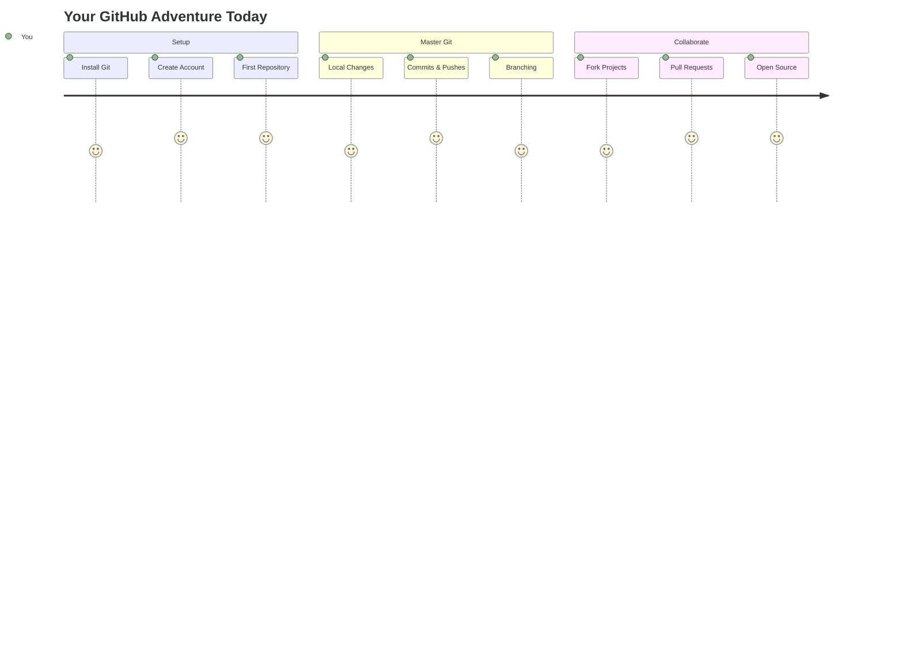
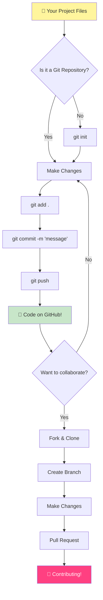
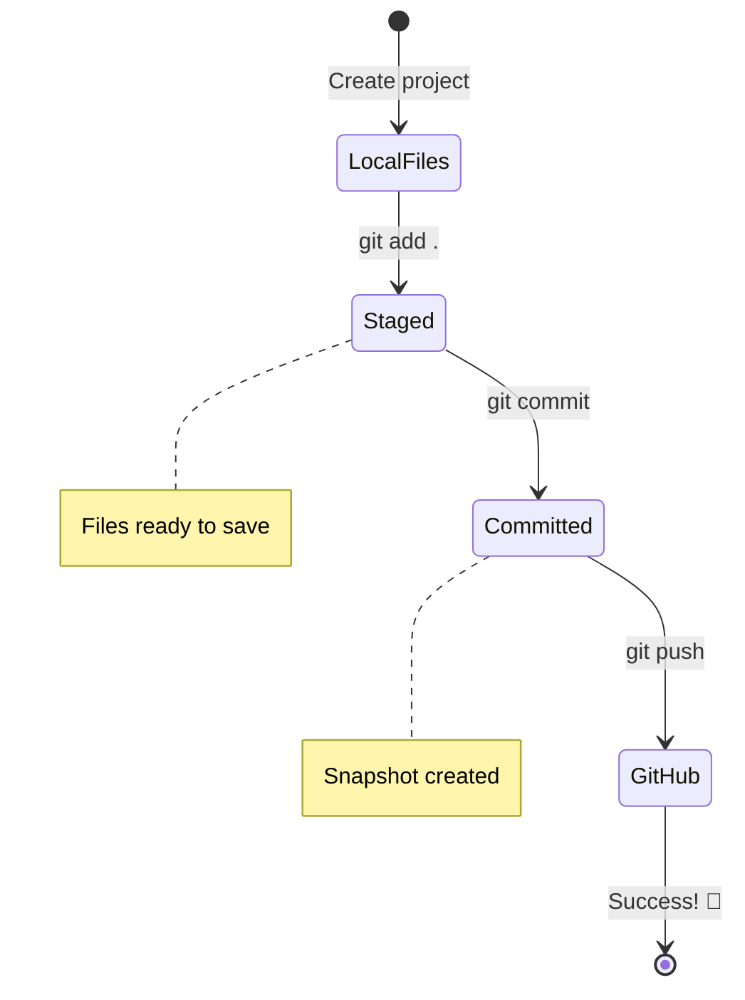
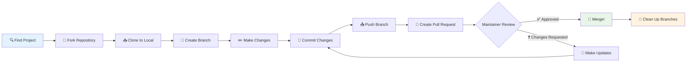
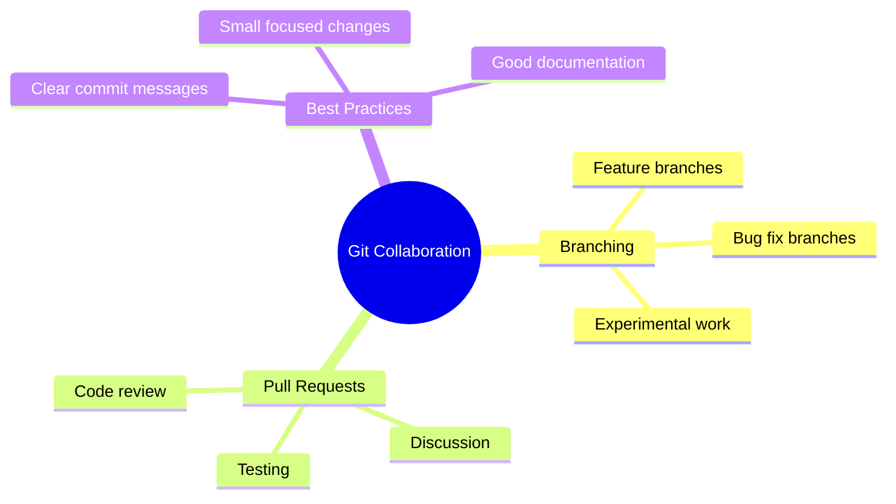
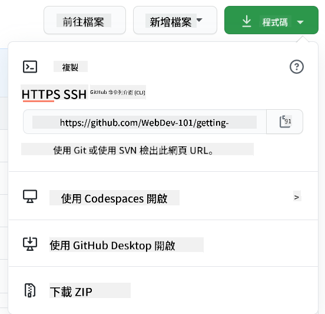
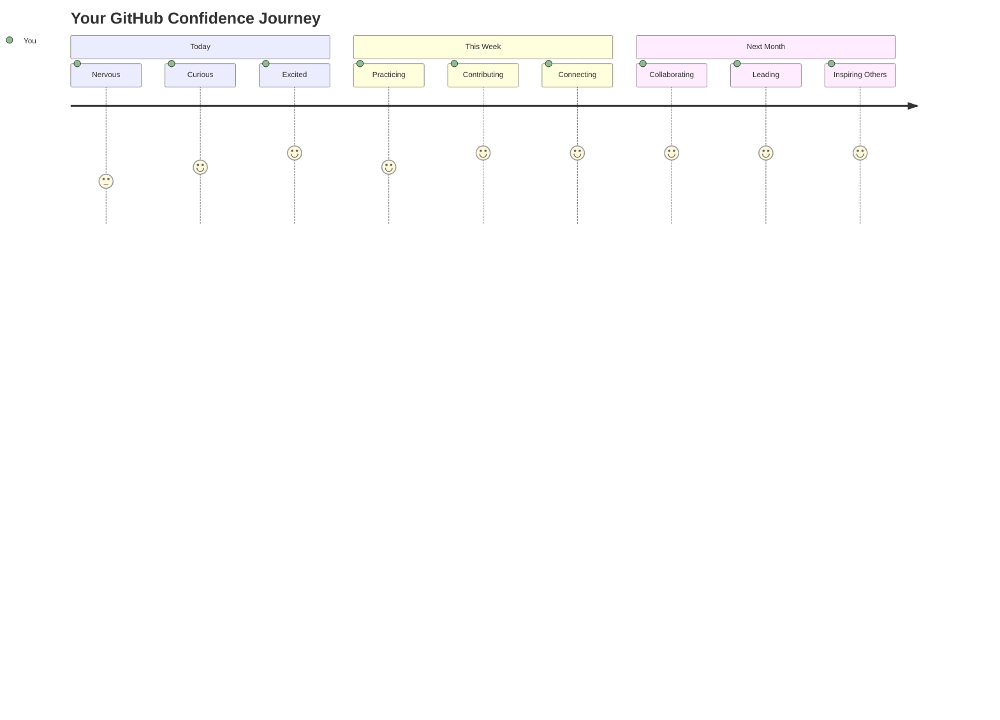

<!--
CO_OP_TRANSLATOR_METADATA:
{
  "original_hash": "0fe3ff66299b447f1c8cb34dcbf0c5ef",
  "translation_date": "2025-11-03T23:40:44+00:00",
  "source_file": "1-getting-started-lessons/2-github-basics/README.md",
  "language_code": "mo"
}
-->
# GitHub 簡介

嗨，未來的開發者！👋 準備好加入全球數百萬的程式設計師行列了嗎？我真的很興奮向你介紹 GitHub——把它想像成程式員的社交媒體平台，不過我們分享的不是午餐照片，而是程式碼，並一起創造令人驚嘆的事物！

這件事真的讓我感到驚奇：你手機上的每個應用程式、你瀏覽的每個網站，以及你將學習使用的大多數工具，都是由開發者團隊在像 GitHub 這樣的平台上合作完成的。你喜歡的音樂應用程式？可能有人像你一樣為它做出了貢獻。你愛不釋手的遊戲？沒錯，可能也是透過 GitHub 合作完成的。而現在，你將學習如何成為這個令人驚嘆的社群的一部分！

我知道一開始可能會覺得有點多——天啊，我還記得第一次看 GitHub 頁面時心想「這到底是什麼意思？」但重點是：每一位開發者都從你現在的位置開始。到這堂課結束時，你將擁有自己的 GitHub 儲存庫（把它想像成你在雲端的個人專案展示），並且你會知道如何保存你的工作、與他人分享，甚至為數百萬人使用的專案做出貢獻。

我們將一起踏上這段旅程，一步一步來。沒有匆忙，沒有壓力——只有你、我，以及一些即將成為你新好朋友的超酷工具！


> Sketchnote by [Tomomi Imura](https://twitter.com/girlie_mac)



## 課前測驗
[課前測驗](https://ff-quizzes.netlify.app)

## 簡介

在我們深入探索真正令人興奮的內容之前，先讓你的電腦準備好迎接 GitHub 的魔法吧！把這想像成在創作傑作之前整理你的藝術用品——準備好正確的工具會讓一切更加順暢，也更有趣。

我會親自帶你完成每個設定步驟，我保證這看起來並沒有那麼可怕。如果有些東西一開始不太明白，那完全正常！我還記得第一次設置我的開發環境時，感覺像是在閱讀古代象形文字。每一位開發者都曾經站在你現在的位置，懷疑自己是否做對了。劇透一下：如果你在這裡學習，你已經做對了！🌟

在這堂課中，我們將涵蓋：

- 追蹤你在電腦上的工作
- 與他人合作完成專案
- 如何為開源軟體做出貢獻

### 先決條件

讓你的電腦準備好迎接 GitHub 的魔法吧！別擔心——這個設定只需要做一次，然後你就可以開始你的整個程式設計旅程了。

好吧，讓我們從基礎開始！首先，我們需要檢查 Git 是否已經在你的電腦上。Git 基本上就像一個超級聰明的助手，記住你對程式碼所做的每一個改變——比每兩秒瘋狂按 Ctrl+S 好得多（我們都曾經這樣做過！）。

讓我們通過在終端輸入這個魔法指令來看看 Git 是否已經安裝：
`git --version`

如果 Git 還沒有安裝，別擔心！只需前往 [下載 Git](https://git-scm.com/downloads) 並下載它。一旦安裝完成，我們需要正式介紹 Git 給你認識：

> 💡 **首次設置**：這些指令告訴 Git 你是誰。這些資訊將附加到你所做的每次提交中，因此選擇一個你願意公開分享的名字和電子郵件。

```bash
git config --global user.name "your-name"
git config --global user.email "your-email"
```

要檢查 Git 是否已經配置好，你可以輸入：
```bash
git config --list
```

你還需要一個 GitHub 帳戶、一個程式碼編輯器（例如 Visual Studio Code），並且需要打開你的終端（或：命令提示符）。

前往 [github.com](https://github.com/) 並創建一個帳戶（如果你還沒有的話），或者登錄並填寫你的個人資料。

💡 **現代化提示**：考慮設置 [SSH 密鑰](https://docs.github.com/en/authentication/connecting-to-github-with-ssh) 或使用 [GitHub CLI](https://cli.github.com/) 以便更輕鬆地進行無密碼身份驗證。

✅ GitHub 不是世界上唯一的程式碼儲存庫；還有其他的，但 GitHub 是最知名的。

### 準備工作

你需要在本地電腦（筆記本或 PC）上有一個包含程式碼專案的資料夾，以及 GitHub 上的一個公共儲存庫，這將作為如何為他人專案做出貢獻的示例。

### 保護你的程式碼安全

讓我們談談安全性——但別擔心，我們不會用可怕的東西讓你不知所措！把這些安全實踐想像成鎖住你的車或房子。它們是簡單的習慣，會成為你的第二天性，並保護你的辛勤工作。

我們將從一開始就向你展示使用 GitHub 的現代化安全方法。這樣，你將養成良好的習慣，這些習慣在你的程式設計生涯中會對你大有幫助。

在使用 GitHub 時，遵循安全最佳實踐非常重要：

| 安全領域 | 最佳實踐 | 為什麼重要 |
|----------|----------|------------|
| **身份驗證** | 使用 SSH 密鑰或個人訪問令牌 | 密碼的安全性較低，正在逐步淘汰 |
| **雙重身份驗證** | 啟用 GitHub 帳戶的 2FA | 增加一層帳戶保護 |
| **儲存庫安全性** | 切勿提交敏感資訊 | API 密鑰和密碼不應出現在公共儲存庫中 |
| **依賴管理** | 啟用 Dependabot 進行更新 | 保持依賴項安全且最新 |

> ⚠️ **重要安全提醒**：切勿將 API 密鑰、密碼或其他敏感資訊提交到任何儲存庫。使用環境變數和 `.gitignore` 文件來保護敏感數據。

**現代化身份驗證設置：**

```bash
# Generate SSH key (modern ed25519 algorithm)
ssh-keygen -t ed25519 -C "your_email@example.com"

# Set up Git to use SSH
git remote set-url origin git@github.com:username/repository.git
```

> 💡 **專業提示**：SSH 密鑰消除了反覆輸入密碼的需要，比傳統身份驗證方法更安全。

---

## 像專業人士一樣管理你的程式碼

好吧，這是事情真正變得令人興奮的地方！🎉 我們即將學習如何像專業人士一樣追蹤和管理你的程式碼，老實說，這是我最喜歡教的東西之一，因為它真的改變了遊戲規則。

想像一下：你正在寫一個驚人的故事，你想記錄下每一個草稿、每一個精彩的編輯，以及每一個「等等，這太棒了！」的時刻。這正是 Git 為你的程式碼所做的！它就像擁有一個最不可思議的時光旅行筆記本，記住一切——每次按鍵、每次改變、每次「哎呀，這毀了所有東西」的時刻，你可以立即撤銷。

我會坦白——一開始可能會覺得很複雜。當我開始時，我想「為什麼我不能像平常一樣保存我的文件？」但相信我：一旦你理解了 Git（你一定會的！），你會有一個靈光乍現的時刻，心想「我以前怎麼能沒有這個就寫程式呢？」這就像發現自己能飛，而之前一直在地上走！

假設你在本地有一個包含一些程式碼專案的資料夾，你想開始使用版本控制系統 Git 來追蹤你的進度。有些人把使用 Git 比作寫一封給未來自己的情書。幾天、幾週或幾個月後閱讀你的提交訊息時，你將能回憶起為什麼做出某個決定，或者「回滾」某個改變——前提是你寫了好的「提交訊息」。



### 任務：創建你的第一個儲存庫！

> 🎯 **你的任務（我真的為你感到興奮！）**：我們將一起創建你的第一個 GitHub 儲存庫！完成後，你將擁有自己的網路角落，存放你的程式碼，並完成你的第一次「提交」（這是開發者用來描述以非常聰明的方式保存工作的術語）。
>
> 這真的是一個非常特別的時刻——你即將正式加入全球開發者社群！我仍然記得創建我的第一個儲存庫時的激動，心想「哇，我真的在做這件事！」

讓我們一起一步步完成這次冒險。每個部分都慢慢來——匆忙是沒有獎勵的，我保證每一步都會有意義。記住，每個你崇拜的程式設計明星都曾經坐在你現在的位置，準備創建他們的第一個儲存庫。這是不是很酷？

> 查看影片
> 
> [](https://www.youtube.com/watch?v=9R31OUPpxU4)

**讓我們一起完成：**

1. **在 GitHub 上創建你的儲存庫**。前往 GitHub.com，尋找那個亮綠色的 **New** 按鈕（或右上角的 **+** 符號）。點擊它並選擇 **New repository**。

   以下是該做的事情：
   1. 為你的儲存庫命名——取一個對你有意義的名字！
   1. 如果你願意，可以添加描述（這有助於其他人了解你的專案是什麼）
   1. 決定是否要設置為公開（每個人都可以看到）或私人（僅供你使用）
   1. 我建議勾選添加 README 文件的選項——它就像你的專案的首頁
   1. 點擊 **Create repository** 並慶祝——你剛剛創建了你的第一個儲存庫！🎉

2. **導航到你的專案資料夾**。現在讓我們打開你的終端（別擔心，它看起來並沒有那麼可怕！）。我們需要告訴你的電腦你的專案文件在哪裡。輸入以下指令：

   ```bash
   cd [name of your folder]
   ```

   **我們在這裡做了什麼：**
   - 我們基本上是在說「嘿，電腦，帶我到我的專案資料夾」
   - 這就像在桌面上打開一個特定的資料夾，但我們是用文字指令來完成的
   - 將 `[name of your folder]` 替換為你的專案資料夾的實際名稱

3. **將你的資料夾轉換為 Git 儲存庫**。這是魔法發生的地方！輸入：

   ```bash
   git init
   ```

   **剛剛發生了什麼（很酷的事情！）：**
   - Git 剛剛在你的專案中創建了一個隱藏的 `.git` 資料夾——你不會看到它，但它確實存在！
   - 你的普通資料夾現在是一個「儲存庫」，可以追蹤你所做的每個改變
   - 把它想像成給你的資料夾超能力，記住一切

4. **檢查發生了什麼**。讓我們看看 Git 對你的專案現在的看法：

   ```bash
   git status
   ```

   **理解 Git 告訴你的內容：**
   
   你可能會看到類似這樣的東西：

   ```output
   Changes not staged for commit:
   (use "git add <file>..." to update what will be committed)
   (use "git restore <file>..." to discard changes in working directory)

        modified:   file.txt
        modified:   file2.txt
   ```

   **別慌！這意味著：**
   - **紅色**的文件是有改變但尚未準備好保存的文件
   - **綠色**的文件（當你看到它們時）是準備好保存的文件
   - Git 很貼心地告訴你接下來可以做什麼

   > 💡 **專業提示**：`git status` 指令是你的好朋友！每當你對發生的事情感到困惑時都可以使用它。這就像在問 Git「嘿，現在的情況如何？」

5. **讓你的文件準備好保存**（這叫做「暫存」）：

   ```bash
   git add .
   ```

   **我們剛剛做了什麼：**
   - 我們告訴 Git「嘿，我想在下一次保存中包含所有文件」
   - `.` 就像在說「這個資料夾中的所有內容」
   - 現在你的文件已經「暫存」，準備好進入下一步

   **想更有選擇性嗎？** 你可以只添加特定文件：

   ```bash
   git add [file or folder name]
   ```

   **為什麼你可能想這樣做？**
   - 有時你想將相關的改變一起保存
   - 它幫助你將工作組織成邏輯塊
   - 讓你更容易理解什麼時候改變了什麼

   **改變主意了嗎？** 別擔心！你可以像這樣取消暫存文件：

   ```bash
   # Unstage everything
   git reset
   
   # Unstage just one file
   git reset [file name]
   ```

   別擔心——這不會刪除你的工作，只是將文件從「準備保存」的堆中移出。

6. **永久保存你的工作**（進行你的第一次提交！）：

   ```bash
   git commit -m "first commit"
   ```

   **🎉 恭喜！你剛剛完成了你的第一次提交！**
   
   **剛剛發生了什麼：**
   - Git 在這個確切的時刻為你所有的暫存文件拍了一張「快照」
   - 你的提交訊息「first commit」解釋了這個保存點的內容
   - Git 為這個快照分配了一個唯一的 ID，讓你以後可以隨時找到它
   - 你正式開始追蹤你的專案歷史了！

   > 💡 **未來的提交訊息**：對於你的下一次提交，請更具描述性！不要用「updated stuff」，試試「Add contact form to homepage」或「Fix navigation menu bug」。你的未來自己會感謝你！

7. **將你的本地專案連接到 GitHub**。現在，你的專案只存在於你的電腦上。讓我們將它連接到你的 GitHub 儲存庫，這樣你就可以與世界分享它！

   首先，前往你的 GitHub 儲存庫頁面並複製 URL。然後回到這裡輸入：

   ```bash
   git remote add origin https://github.com/username/repository_name.git
   ```
   
   （用你的實際儲存庫 URL 替換該 URL！）
**我們剛剛做了什麼：**
- 我們建立了本地專案與 GitHub 儲存庫之間的連接
- "Origin" 只是你的 GitHub 儲存庫的暱稱——就像在手機中新增一個聯絡人
- 現在你的本地 Git 知道該將你的程式碼發送到哪裡，當你準備分享時

💡 **更簡單的方法**：如果你已安裝 GitHub CLI，你可以用一條指令完成：
   ```bash
   gh repo create my-repo --public --push --source=.
   ```

8. **將你的程式碼發送到 GitHub**（重要時刻！）：

   ```bash
   git push -u origin main
   ```

**🚀 就是這樣！你正在將程式碼上傳到 GitHub！**

**發生了什麼：**
- 你的提交正在從你的電腦傳送到 GitHub
- `-u` 標誌建立了永久連接，讓未來的推送更簡單
- "main" 是你的主要分支的名稱（就像主要資料夾）
- 之後，你只需輸入 `git push` 就能進行未來的上傳！

💡 **快速提示**：如果你的分支名稱是其他名稱（例如 "master"），請使用該名稱。你可以使用 `git branch --show-current` 來檢查。

9. **你的新日常編碼節奏**（這是上癮的開始！）：

從現在開始，每當你對專案進行更改時，你只需進行以下簡單的三步驟：

   ```bash
   git add .
   git commit -m "describe what you changed"
   git push
   ```

**這將成為你的編碼節奏：**
- 對你的程式碼進行一些精彩的更改 ✨
- 使用 `git add` 將它們暫存（"嘿 Git，注意這些更改！"）
- 使用 `git commit` 和描述性訊息保存它們（未來的你會感謝自己！）
- 使用 `git push` 與世界分享 🚀
- 重複以上步驟——真的，這會變得像呼吸一樣自然！

我喜歡這個工作流程，因為它就像在玩電子遊戲時有多個存檔點。做了一個你喜歡的更改？提交它！想嘗試一些冒險的事情？沒問題——如果事情不順利，你隨時可以回到上次的提交！

> 💡 **提示**：你可能也想採用 `.gitignore` 文件，防止你不想追蹤的文件出現在 GitHub 上——例如存放在同一資料夾中的筆記文件，但不適合放在公共儲存庫中。你可以在[.gitignore templates](https://github.com/github/gitignore)找到 `.gitignore` 文件的範本，或者使用 [gitignore.io](https://www.toptal.com/developers/gitignore) 創建一個。

### 🧠 **第一次儲存庫檢查：感覺如何？**

**花點時間慶祝並反思：**
- 第一次看到你的程式碼出現在 GitHub 上是什麼感覺？
- 哪一步感覺最困惑，哪一步感覺出乎意料地簡單？
- 你能用自己的話解釋 `git add`、`git commit` 和 `git push` 的區別嗎？



> **記住**：即使是有經驗的開發者有時也會忘記確切的指令。讓這個工作流程成為肌肉記憶需要練習——你做得很棒！

#### 現代 Git 工作流程

考慮採用以下現代化的做法：

- **標準化提交**：使用標準化的提交訊息格式，例如 `feat:`、`fix:`、`docs:` 等。了解更多請訪問 [conventionalcommits.org](https://www.conventionalcommits.org/)
- **原子提交**：讓每次提交代表一個邏輯上的改變
- **頻繁提交**：經常提交，使用描述性訊息，而不是大規模、不頻繁的提交

#### 提交訊息

一個好的 Git 提交主題行應該能完成以下句子：
如果應用，這次提交將 <你的主題行>

主題應使用祈使句現在時態："change" 而不是 "changed" 或 "changes"。
在主題中使用祈使句現在時態，在正文（可選）中也使用祈使句現在時態。正文應包括更改的動機，並與之前的行為進行對比。你是在解釋 `為什麼`，而不是 `如何`。

✅ 花幾分鐘瀏覽 GitHub。你能找到一個非常棒的提交訊息嗎？你能找到一個非常簡短的嗎？你認為在提交訊息中最重要和最有用的信息是什麼？

## 與他人合作（最有趣的部分！）

準備好你的帽子，因為這是 GitHub 變得非常神奇的地方！🪄 你已經掌握了管理自己程式碼的技巧，但現在我們要深入我最喜歡的部分——與來自世界各地的出色人才合作。

想像一下：你明天醒來，發現東京的一個人改進了你的程式碼，而你在睡覺時，柏林的一個人修復了你一直困擾的錯誤。到了下午，聖保羅的一位開發者添加了一個你從未想過的功能。這不是科幻小說——這只是 GitHub 世界中的普通一天！

讓我真正興奮的是，你即將學到的合作技能？這些正是 Google、Microsoft 和你最喜歡的初創公司每天使用的工作流程。你不僅僅是在學習一個酷炫的工具——你是在學習讓整個軟體世界共同運作的秘密語言。

真的，當你第一次體驗到有人合併你的拉取請求的快感時，你就會明白為什麼開發者對開源如此充滿熱情。這就像成為世界上最大、最具創意的團隊項目的一部分！

> 查看影片
>
> [](https://www.youtube.com/watch?v=bFCM-PC3cu8)

將內容放到 GitHub 上的主要原因是使與其他開發者的合作成為可能。



在你的儲存庫中，導航到 `Insights > Community`，看看你的專案如何與推薦的社群標準進行比較。

想讓你的儲存庫看起來專業且吸引人嗎？前往你的儲存庫，點擊 `Insights > Community`。這個很酷的功能會顯示你的專案如何與 GitHub 社群認為的 "良好儲存庫實踐" 相比。

> 🎯 **讓你的專案更出色**：一個組織良好的儲存庫，配有良好的文件，就像擁有一個乾淨、吸引人的店面。它告訴人們你對自己的工作很在意，並讓其他人想要貢獻！

**以下是讓儲存庫變得出色的要素：**

| 添加內容 | 為什麼重要 | 對你的幫助 |
|----------|------------|------------|
| **描述** | 第一印象很重要！ | 人們能立即知道你的專案是做什麼的 |
| **README** | 你的專案首頁 | 就像新訪客的友好導遊 |
| **貢獻指南** | 表明你歡迎幫助 | 人們能確切知道如何幫助你 |
| **行為準則** | 創造友好的空間 | 每個人都感到受歡迎 |
| **許可證** | 法律清晰 | 其他人知道如何使用你的程式碼 |
| **安全政策** | 表明你負責任 | 展示專業的做法 |

> 💡 **專業提示**：GitHub 提供這些文件的範本。在創建新儲存庫時，勾選框以自動生成這些文件。

**現代 GitHub 功能探索：**

🤖 **自動化與 CI/CD：**
- **GitHub Actions** 用於自動化測試和部署
- **Dependabot** 用於自動依賴更新

💬 **社群與專案管理：**
- **GitHub Discussions** 用於超越問題的社群對話
- **GitHub Projects** 用於看板式專案管理
- **分支保護規則** 用於強制執行程式碼質量標準

所有這些資源都將有助於新團隊成員的入職。而這些通常是新貢獻者在查看你的程式碼之前會看的東西，以了解你的專案是否是他們應該花時間的地方。

✅ README 文件雖然需要時間準備，但經常被忙碌的維護者忽略。你能找到一個特別描述性強的例子嗎？注意：有一些[工具可以幫助創建好的 README](https://www.makeareadme.com/) 你可能會想試試。

### 任務：合併一些程式碼

貢獻文件幫助人們為專案做出貢獻。它解釋了你希望的貢獻類型以及流程如何運作。貢獻者需要完成一系列步驟才能在 GitHub 上為你的儲存庫做出貢獻：

1. **Fork 你的儲存庫** 你可能希望人們 _fork_ 你的專案。Fork 意味著在他們的 GitHub 個人檔案上創建你的儲存庫的副本。
1. **Clone**。接著他們會將專案克隆到本地機器。
1. **創建分支**。你會希望要求他們為自己的工作創建一個 _分支_。
1. **專注於一個區域的更改**。要求貢獻者將貢獻集中在一件事上——這樣你能 _合併_ 他們工作的機率更高。想像他們寫了一個錯誤修復，添加了一個新功能，並更新了幾個測試——如果你只想或只能實施其中的 2 個或 1 個更改呢？

✅ 想像一個分支在撰寫和交付良好程式碼中特別重要的情況。你能想到哪些使用案例？

> 注意，成為你希望看到的改變，並為自己的工作創建分支。你所做的任何提交都將在你目前 "檢出" 的分支上進行。使用 `git status` 查看是哪個分支。

讓我們來看看貢獻者的工作流程。假設貢獻者已經 _fork_ 並 _clone_ 了儲存庫，因此他們有一個準備好工作的 Git 儲存庫在本地機器上：

1. **創建分支**。使用指令 `git branch` 創建一個分支，該分支將包含他們打算貢獻的更改：

   ```bash
   git branch [branch-name]
   ```

   > 💡 **現代方法**：你也可以用一條指令創建並切換到新分支：
   ```bash
   git switch -c [branch-name]
   ```

1. **切換到工作分支**。切換到指定分支並使用 `git switch` 更新工作目錄：

   ```bash
   git switch [branch-name]
   ```

   > 💡 **現代提示**：`git switch` 是更改分支時取代 `git checkout` 的現代替代方案。它更清晰且對初學者更安全。

1. **進行工作**。此時你可以添加你的更改。不要忘記用以下指令告訴 Git：

   ```bash
   git add .
   git commit -m "my changes"
   ```

   > ⚠️ **提交訊息質量**：確保你給你的提交取一個好名字，既為自己，也為你幫助的儲存庫維護者。具體說明你改變了什麼！

1. **與 `main` 分支合併你的工作**。某個時候你完成了工作，並希望將你的工作與 `main` 分支的工作合併。`main` 分支可能在此期間發生了變化，因此請確保首先使用以下指令更新它：

   ```bash
   git switch main
   git pull
   ```

   此時你需要確保任何 _衝突_（Git 無法輕易 _合併_ 的情況）發生在你的工作分支。因此執行以下指令：

   ```bash
   git switch [branch_name]
   git merge main
   ```

   `git merge main` 指令將把 `main` 的所有更改帶入你的分支。希望你可以直接繼續。如果不行，VS Code 會告訴你 Git _困惑_ 的地方，你只需修改受影響的文件，指出哪個內容最準確。

   💡 **現代替代方案**：考慮使用 `git rebase` 以獲得更清晰的歷史：
   ```bash
   git rebase main
   ```
   這會將你的提交重新播放到最新的 main 分支之上，創建線性歷史。

1. **將你的工作發送到 GitHub**。將你的工作發送到 GitHub 意味著兩件事。將你的分支推送到你的儲存庫，然後打開一個 PR（拉取請求）。

   ```bash
   git push --set-upstream origin [branch-name]
   ```

   上述指令會在你的 fork 儲存庫中創建分支。

### 🤝 **合作技能檢查：準備好與他人合作了嗎？**

**看看你對合作的感覺：**
- Fork 和拉取請求的概念現在對你來說是否清楚了？
- 關於使用分支，你最想多練習的是什麼？
- 你對為別人的專案做出貢獻感到多舒適？



> **信心提升**：你所崇拜的每一位開發者都曾對自己的第一次拉取請求感到緊張。GitHub 社群對新手非常友好！

1. **打開 PR**。接下來，你需要打開一個 PR。你可以通過導航到 GitHub 上的 fork 儲存庫來完成。你會在 GitHub 上看到一個指示，詢問你是否想創建一個新的 PR，點擊它，你會進入一個介面，可以更改提交訊息標題，給它一個更合適的描述。現在你 fork 的儲存庫的維護者會看到這個 PR，_希望_ 他們會欣賞並 _合併_ 你的 PR。你現在是一名貢獻者，太棒了 :)

   💡 **現代提示**：你也可以使用 GitHub CLI 創建 PR：
   ```bash
   gh pr create --title "Your PR title" --body "Description of changes"
   ```

   🔧 **PR 的最佳實踐**：
   - 使用關鍵字（例如 "Fixes #123"）鏈接相關問題
   - 為 UI 更改添加截圖
   - 請求特定的審查者
   - 使用草稿 PR 表示正在進行的工作
   - 確保所有 CI 檢查通過後再請求審查
1. **清理**。在成功合併 PR 後進行清理被認為是良好的習慣。你需要清理本地分支以及推送到 GitHub 的分支。首先，使用以下指令刪除本地分支：

   ```bash
   git branch -d [branch-name]
   ```

   接著，前往 GitHub 頁面，找到你分叉的倉庫，並移除你剛剛推送的遠端分支。

`Pull request` 這個詞聽起來有點奇怪，因為實際上你是想將你的更改推送到專案中。但專案的維護者（專案擁有者）或核心團隊需要在合併到專案的 "main" 分支之前審核你的更改，因此你實際上是在向維護者請求更改的決定。

Pull request 是一個比較和討論分支中引入的差異的地方，包含審核、評論、整合測試等功能。一個好的 pull request 大致遵循與提交訊息相同的規則。當你的工作解決了一個問題時，你可以在問題追蹤器中引用該問題。這可以通過使用 `#` 後接問題編號來完成。例如 `#97`。

🤞希望所有檢查都通過，並且專案擁有者成功合併你的更改到專案中🤞

更新你當前的本地工作分支，將 GitHub 上對應的遠端分支中的所有新提交拉取下來：

`git pull`

## 貢獻開源專案（你的影響力機會！）

準備好迎接一件會讓你大開眼界的事情了嗎？🤯 讓我們來聊聊如何貢獻開源專案——光是想到要和你分享這件事就讓我感到興奮！

這是你成為非凡事物一部分的機會。想像一下，改進每天數百萬開發者使用的工具，或者修復你朋友喜愛的應用程式中的一個 bug。這不僅僅是夢想——這就是開源貢獻的全部！

每次想到這件事我都會感到激動：你所學習的每一個工具——你的程式碼編輯器、我們將探索的框架，甚至你正在閱讀這篇文章的瀏覽器——都始於某個和你一樣的人，第一次顫抖著手點擊 "create pull request"。

最美妙的部分是：開源社群就像互聯網上最大的擁抱。大多數專案都積極尋找新手，並標記了 "good first issue" 的問題，專門為像你這樣的人準備！維護者看到新貢獻者時真的會感到興奮，因為他們記得自己第一次踏出那一步的感覺。

```mermaid
flowchart TD
    A[🔍 Explore GitHub] --> B[🏷️ Find "good first issue"]
    B --> C[📖 Read Contributing Guidelines]
    C --> D[🍴 Fork Repository]
    D --> E[💻 Set Up Local Environment]
    E --> F[🌿 Create Feature Branch]
    F --> G[✨ Make Your Contribution]
    G --> H[🧪 Test Your Changes]
    H --> I[📝 Write Clear Commit]
    I --> J[📤 Push & Create PR]
    J --> K[💬 Engage with Feedback]
    K --> L[🎉 Merged! You're a Contributor!]
    L --> M[🌟 Find Next Issue]
    
    style A fill:#e1f5fe
    style L fill:#c8e6c9
    style M fill:#fff59d
```

你不僅僅是在學習程式碼——你正在準備加入一個全球性的建設者大家庭，他們每天醒來都在思考 "我們如何讓數位世界變得更好一點？" 歡迎加入這個俱樂部！🌟

首先，讓我們在 GitHub 上找到一個你感興趣並希望貢獻更改的倉庫（或 **repo**）。你需要將其內容複製到你的電腦上。

✅ 找到適合初學者的倉庫的一個好方法是 [透過標籤 'good-first-issue' 進行搜尋](https://github.blog/2020-01-22-browse-good-first-issues-to-start-contributing-to-open-source/)。



有幾種複製程式碼的方法。一種方法是使用 HTTPS、SSH 或 GitHub CLI（命令列介面）來 "克隆" 倉庫的內容。

打開你的終端機，像這樣克隆倉庫：
```bash
# Using HTTPS
git clone https://github.com/ProjectURL

# Using SSH (requires SSH key setup)
git clone git@github.com:username/repository.git

# Using GitHub CLI
gh repo clone username/repository
```

要開始專案，切換到正確的資料夾：
`cd ProjectURL`

你也可以使用以下方式打開整個專案：
- **[GitHub Codespaces](https://github.com/features/codespaces)** - GitHub 的雲端開發環境，直接在瀏覽器中使用 VS Code
- **[GitHub Desktop](https://desktop.github.com/)** - 一個用於 Git 操作的圖形介面應用程式  
- **[GitHub.dev](https://github.dev)** - 在任何 GitHub 倉庫中按下 `.` 鍵即可在瀏覽器中打開 VS Code
- **VS Code** 搭配 GitHub Pull Requests 擴展

最後，你也可以下載壓縮的程式碼資料夾。

### 關於 GitHub 的一些有趣事實

你可以在 GitHub 上對任何公共倉庫進行加星、關注和/或 "分叉"。你可以在右上角的下拉選單中找到你加星的倉庫。這就像程式碼的書籤。

專案通常有一個問題追蹤器，大多數情況下在 GitHub 的 "Issues" 標籤中，除非另有說明，人們在這裡討論與專案相關的問題。而 Pull Requests 標籤則是人們討論和審核正在進行的更改的地方。

專案可能還有論壇、郵件列表或像 Slack、Discord 或 IRC 這樣的聊天頻道進行討論。

🔧 **現代 GitHub 功能**：
- **GitHub Discussions** - 內建的社群對話論壇
- **GitHub Sponsors** - 財務支持維護者  
- **Security 標籤** - 漏洞報告和安全建議
- **Actions 標籤** - 查看自動化工作流程和 CI/CD 管道
- **Insights 標籤** - 關於貢獻者、提交和專案健康狀況的分析
- **Projects 標籤** - GitHub 的內建專案管理工具

✅ 瀏覽你的新 GitHub 倉庫並嘗試一些功能，例如編輯設定、向倉庫添加資訊、創建專案（例如看板），以及設置 GitHub Actions 進行自動化。你可以做的事情還有很多！

---

## 🚀 挑戰 

好了，現在是時候測試你剛剛學到的 GitHub 超能力了！🚀 這是一個能讓你感到非常滿足的挑戰：

找一位朋友（或者那個總是問你在搞什麼 "電腦東西" 的家人）一起展開一場合作編程冒險吧！這就是真正的魔力所在——創建一個專案，讓他們分叉，創建一些分支，並像專業人士一樣合併更改。

我不會騙你——你們可能會在某些時候笑出聲（尤其是當你們都試圖更改同一行時），可能會感到困惑，但你們一定會有那些令人驚嘆的 "原來如此！" 的時刻，讓所有的學習都變得值得。此外，與他人分享第一次成功合併的喜悅是非常特別的——這就像在慶祝你們的進步！

還沒有找到編程夥伴？完全沒問題！GitHub 社群充滿了非常友好的夥伴，他們記得自己剛開始時的感受。尋找標有 "good first issue" 的倉庫——它們基本上是在說 "嘿，初學者，來和我們一起學習吧！" 是不是很棒？

## 課後測驗
[課後測驗](https://ff-quizzes.netlify.app/web/en/)

## 回顧與持續學習

哇！🎉 看看你——你剛剛像個真正的高手一樣征服了 GitHub 的基礎知識！如果你現在覺得腦袋有點滿，那是完全正常的，事實上這是一個好現象。你剛剛學到了一些我剛開始時花了好幾週才熟悉的工具。

Git 和 GitHub 是非常強大的工具（真的非常強大），我認識的每一位開發者——包括那些現在看起來像巫師一樣的人——都需要練習並在其中摸索一段時間才能完全掌握。你能完成這堂課，意味著你已經在掌握開發者工具箱中最重要的工具的路上了。

以下是一些非常棒的資源，幫助你練習並變得更厲害：

- [貢獻開源軟體指南](https://opensource.guide/how-to-contribute/#how-to-submit-a-contribution) – 你的影響力路線圖
- [Git 速查表](https://training.github.com/downloads/github-git-cheat-sheet/) – 快速參考的好幫手！

記住：熟能生巧，而不是完美！你使用 Git 和 GitHub 的次數越多，就會越自然。GitHub 創建了一些很棒的互動課程，讓你可以在安全的環境中練習：

- [GitHub 入門](https://github.com/skills/introduction-to-github)
- [使用 Markdown 進行溝通](https://github.com/skills/communicate-using-markdown)  
- [GitHub Pages](https://github.com/skills/github-pages)
- [管理合併衝突](https://github.com/skills/resolve-merge-conflicts)

**想要挑戰自己？試試這些現代工具：**
- [GitHub CLI 文件](https://cli.github.com/manual/) – 讓你感覺像命令列巫師
- [GitHub Codespaces 文件](https://docs.github.com/en/codespaces) – 在雲端編程！
- [GitHub Actions 文件](https://docs.github.com/en/actions) – 自動化所有事情
- [Git 最佳實踐](https://www.atlassian.com/git/tutorials/comparing-workflows) – 提升你的工作流程

## GitHub Copilot Agent 挑戰 🚀

使用 Agent 模式完成以下挑戰：

**描述：** 創建一個協作的網頁開發專案，展示你在本課中學到的完整 GitHub 工作流程。這個挑戰將幫助你在真實世界的場景中練習倉庫創建、協作功能和現代 Git 工作流程。

**提示：** 創建一個新的公共 GitHub 倉庫，用於一個簡單的 "網頁開發資源" 專案。倉庫應包含一個結構良好的 README.md 文件，列出有用的網頁開發工具和資源，按類別（HTML、CSS、JavaScript 等）組織。設置倉庫的社群標準，包括許可證、貢獻指南和行為準則。創建至少兩個功能分支：一個用於添加 CSS 資源，另一個用於添加 JavaScript 資源。對每個分支進行描述性提交，然後創建 pull request 將更改合併回主分支。啟用 GitHub 功能，如 Issues、Discussions，並設置基本的 GitHub Actions 工作流程進行自動檢查。

## 作業 

你的任務，如果你選擇接受：完成 [GitHub 入門](https://github.com/skills/introduction-to-github) 課程。這個互動課程將讓你在安全、引導的環境中練習你學到的一切。此外，完成後你還會獲得一個酷炫的徽章！🏅

**準備好迎接更多挑戰？**
- 為你的 GitHub 帳戶設置 SSH 驗證（再也不用輸入密碼！）
- 嘗試使用 GitHub CLI 進行日常 Git 操作
- 創建一個帶有 GitHub Actions 工作流程的倉庫
- 探索 GitHub Codespaces，直接在雲端編輯這個倉庫

---

## 🚀 你的 GitHub 精通時間表

### ⚡ **接下來 5 分鐘內可以做的事**
- [ ] 為這個倉庫和其他 3 個你感興趣的專案加星
- [ ] 為你的 GitHub 帳戶設置雙重身份驗證
- [ ] 為你的第一個倉庫創建一個簡單的 README
- [ ] 關注 5 位讓你感到啟發的開發者

### 🎯 **這一小時內可以完成的事**
- [ ] 完成課後測驗並反思你的 GitHub 旅程
- [ ] 設置 SSH 密鑰以進行無密碼的 GitHub 驗證
- [ ] 創建你的第一個有意義的提交，並撰寫一個出色的提交訊息
- [ ] 探索 GitHub 的 "Explore" 標籤，發現熱門專案
- [ ] 練習分叉倉庫並進行小改動

### 📅 **你的 GitHub 一週冒險**
- [ ] 完成 GitHub Skills 課程（GitHub 入門、Markdown）
- [ ] 向開源專案提交你的第一個 pull request
- [ ] 設置 GitHub Pages 網站展示你的作品
- [ ] 加入你感興趣的專案的 GitHub Discussions
- [ ] 創建一個具有完整社群標準的倉庫（README、許可證等）
- [ ] 嘗試使用 GitHub Codespaces 進行雲端開發

### 🌟 **你的 GitHub 一個月轉型**
- [ ] 為 3 個不同的開源專案做出貢獻
- [ ] 指導一位 GitHub 新手（回饋社群！）
- [ ] 使用 GitHub Actions 設置自動化工作流程
- [ ] 建立一個展示你 GitHub 貢獻的作品集
- [ ] 參加 Hacktoberfest 或類似的社群活動
- [ ] 成為你自己專案的維護者，讓其他人來貢獻

### 🎓 **最終 GitHub 精通檢查**

**慶祝你的進步：**
- 你最喜歡使用 GitHub 的哪一部分？
- 哪個協作功能讓你最興奮？
- 你現在對貢獻開源的信心如何？
- 你想要貢獻的第一個專案是什麼？



> 🌍 **歡迎加入全球開發者社群！** 你現在擁有了與全球數百萬開發者合作的工具。你的第一次貢獻可能看起來微不足道，但請記住——每個主要的開源專案都始於某人第一次提交。問題不是你是否會產生影響，而是哪些令人驚嘆的專案會首先受益於你的獨特視角！🚀

記住：每個專家都曾是初學者。你一定可以做到！💪

---

**免責聲明**：  
本文件已使用 AI 翻譯服務 [Co-op Translator](https://github.com/Azure/co-op-translator) 進行翻譯。儘管我們致力於提供準確的翻譯，請注意自動翻譯可能包含錯誤或不準確之處。原始文件的母語版本應被視為權威來源。對於關鍵信息，建議使用專業人工翻譯。我們對因使用此翻譯而引起的任何誤解或誤釋不承擔責任。