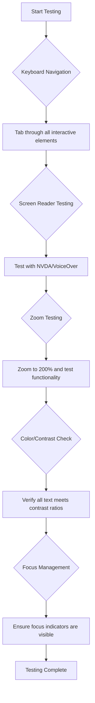
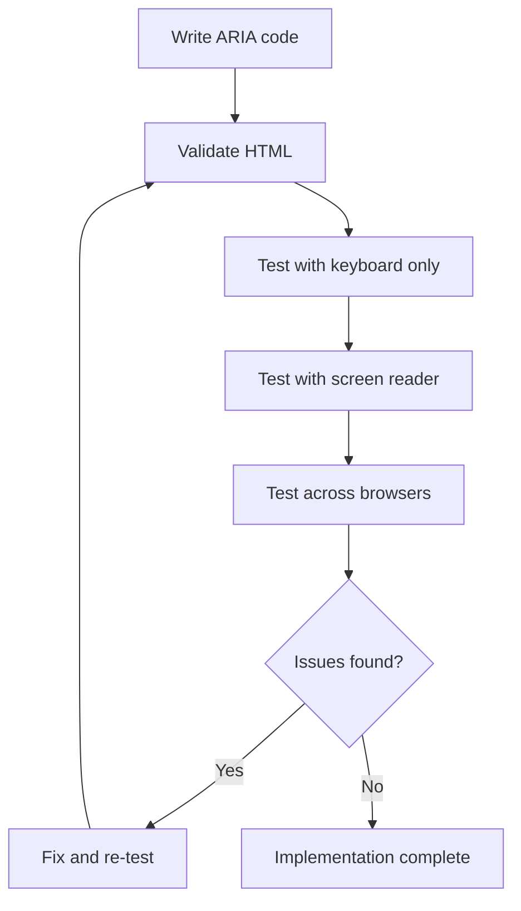

<!--
CO_OP_TRANSLATOR_METADATA:
{
  "original_hash": "90b19cde5b79b29e91babd3138cd8035",
  "translation_date": "2025-10-22T22:38:40+00:00",
  "source_file": "1-getting-started-lessons/3-accessibility/README.md",
  "language_code": "mo"
}
-->
# 建立無障礙網頁


> [Tomomi Imura](https://twitter.com/girlie_mac) 的手繪筆記

## 課前測驗
[課前測驗](https://ff-quizzes.netlify.app/web/)

> 網路的力量在於它的普遍性。無論是否有殘疾，每個人都能使用是其重要的方面。
>
> \- Sir Timothy Berners-Lee，W3C主任及萬維網的發明者

以下可能會讓你感到驚訝：當你建立無障礙網站時，你不僅僅是在幫助有殘疾的人——你其實是在讓網路對所有人都更友好！

你是否注意到街角的斜坡？它們最初是為輪椅設計的，但現在它們也幫助了推嬰兒車的人、使用手推車的送貨員、拖著行李箱的旅客以及騎自行車的人。無障礙網頁設計的運作方式正是如此——幫助某一群體的解決方案往往最終能惠及所有人。是不是很酷？

在這堂課中，我們將探討如何創建真正適合所有人使用的網站，無論他們如何瀏覽網頁。你將學到已經內建於網頁標準中的實用技術，親自操作測試工具，並了解無障礙設計如何使你的網站對所有用戶更友好。

在課程結束時，你將有信心將無障礙設計自然地融入你的開發工作流程中。準備好探索如何通過深思熟慮的設計選擇來讓全球數十億用戶都能使用網路了嗎？讓我們開始吧！

> 你可以在 [Microsoft Learn](https://docs.microsoft.com/learn/modules/web-development-101/accessibility/?WT.mc_id=academic-77807-sagibbon) 上學習這堂課！

## 理解輔助技術

在我們開始編碼之前，先花點時間了解不同能力的人如何實際體驗網路。這不僅僅是理論——了解這些真實世界的導航模式將使你成為更好的開發者！

輔助技術是非常驚人的工具，它們幫助有殘疾的人以可能讓你驚訝的方式與網站互動。一旦你掌握了這些技術的運作方式，創建無障礙的網頁體驗就會變得更加直觀。這就像學會用別人的眼光來看你的代碼。

### 螢幕閱讀器

[螢幕閱讀器](https://en.wikipedia.org/wiki/Screen_reader) 是非常先進的技術，可以將數字文本轉換為語音或點字輸出。雖然它們主要供視障人士使用，但對於有閱讀障礙（如閱讀困難症）的用戶也非常有幫助。

我喜歡把螢幕閱讀器比作一個非常聰明的旁白，像讀書一樣為你朗讀內容。它會以邏輯順序朗讀內容，提示互動元素如「按鈕」或「連結」，並提供用鍵盤快捷鍵在頁面中跳轉的功能。但重點是——螢幕閱讀器只有在我們用正確的結構和有意義的內容建立網站時才能發揮作用。這就是作為開發者的你的責任！

**各平台流行的螢幕閱讀器：**
- **Windows**: [NVDA](https://www.nvaccess.org/about-nvda/)（免費且最受歡迎）、[JAWS](https://webaim.org/articles/jaws/)、[Narrator](https://support.microsoft.com/windows/complete-guide-to-narrator-e4397a0d-ef4f-b386-d8ae-c172f109bdb1/?WT.mc_id=academic-77807-sagibbon)（內建）
- **macOS/iOS**: [VoiceOver](https://support.apple.com/guide/voiceover/welcome/10)（內建且功能強大）
- **Android**: [TalkBack](https://support.google.com/accessibility/android/answer/6283677)（內建）
- **Linux**: [Orca](https://wiki.gnome.org/Projects/Orca)（免費且開源）

**螢幕閱讀器如何導航網頁內容：**

螢幕閱讀器提供多種導航方法，使熟練的用戶能高效瀏覽：
- **順序閱讀**：像讀書一樣從上到下閱讀內容
- **地標導航**：在頁面部分之間跳轉（標頭、導航、主要內容、頁尾）
- **標題導航**：在標題之間跳轉以了解頁面結構
- **連結列表**：生成所有連結的列表以便快速訪問
- **表單控件**：直接在輸入字段和按鈕之間導航

> 💡 **這件事讓我大開眼界**：68%的螢幕閱讀器用戶主要通過標題導航（[WebAIM調查](https://webaim.org/projects/screenreadersurvey9/#finding)）。這意味著你的標題結構就像是用戶的路線圖——當你設計得當時，你實際上是在幫助人們更快地找到內容！

### 建立你的測試工作流程

有個好消息——有效的無障礙測試並不需要讓人感到壓力山大！你需要結合自動化工具（它們非常擅長捕捉明顯的問題）和一些手動測試。以下是我發現的系統化方法，可以在不耗費整天時間的情況下捕捉到最多的問題：

**基本手動測試工作流程：**



**逐步測試清單：**
1. **鍵盤導航**：僅使用 Tab、Shift+Tab、Enter、Space 和方向鍵
2. **螢幕閱讀器測試**：啟用 NVDA、VoiceOver 或 Narrator，並閉上眼睛導航
3. **縮放測試**：測試 200% 和 400% 的縮放級別
4. **顏色對比驗證**：檢查所有文本和 UI 元件
5. **焦點指示器測試**：確保所有互動元素都有明顯的焦點狀態

✅ **從 Lighthouse 開始**：打開瀏覽器的開發工具，運行 Lighthouse 無障礙性審核，然後使用結果來指導你的手動測試重點。

### 縮放和放大工具

你是否曾經在手機上放大文字，或者在陽光明媚的戶外眯著眼睛看筆記本螢幕？許多用戶每天都依賴放大工具來使內容可讀。這包括低視力者、老年人，以及任何曾嘗試在戶外閱讀網站的人。

現代的縮放技術已經超越了僅僅放大內容的功能。了解這些工具的工作原理將幫助你創建在任何放大級別下都能保持功能和吸引力的響應式設計。

**現代瀏覽器的縮放功能：**
- **頁面縮放**：按比例縮放所有內容（文本、圖片、佈局）——這是首選方法
- **僅文字縮放**：在保持原始佈局的同時增加字體大小
- **捏合縮放**：移動設備支持的臨時放大手勢
- **瀏覽器支持**：所有現代瀏覽器支持最高 500% 的縮放而不影響功能

**專用放大軟體：**
- **Windows**: [Magnifier](https://support.microsoft.com/windows/use-magnifier-to-make-things-on-the-screen-easier-to-see-414948ba-8b1c-d3bd-8615-0e5e32204198)（內建）、[ZoomText](https://www.freedomscientific.com/training/zoomtext/getting-started/)
- **macOS/iOS**: [Zoom](https://www.apple.com/accessibility/mac/vision/)（內建且功能強大）

> ⚠️ **設計考量**：WCAG 要求內容在縮放至 200% 時仍保持功能性。在此級別，水平滾動應該最小化，所有互動元素應保持可訪問性。

✅ **測試你的響應式設計**：將瀏覽器縮放至 200% 和 400%。你的佈局是否能優雅地適應？你是否仍然能夠在不過度滾動的情況下訪問所有功能？

## 現代無障礙性測試工具

現在你已經了解人們如何使用輔助技術來導航網路，讓我們來探索幫助你建立和測試無障礙網站的工具。

可以這樣想：自動化工具非常擅長捕捉明顯的問題（例如缺少替代文字），而手動測試則幫助你確保網站在真實世界中使用起來感覺良好。兩者結合，能讓你有信心確保網站適合所有人使用。

### 顏色對比測試

有個好消息：顏色對比是最常見的無障礙性問題之一，但也是最容易解決的問題。良好的對比度對所有人都有益——從視力受損的用戶到試圖在海灘上閱讀手機的人。

**WCAG 對比度要求：**

| 文本類型 | WCAG AA（最低要求） | WCAG AAA（增強要求） |
|----------|---------------------|-----------------------|
| **普通文本**（小於 18pt） | 對比度比率 4.5:1 | 對比度比率 7:1 |
| **大文本**（18pt+ 或 14pt+ 粗體） | 對比度比率 3:1 | 對比度比率 4.5:1 |
| **UI 元件**（按鈕、表單邊框） | 對比度比率 3:1 | 對比度比率 3:1 |

**必備測試工具：**
- [Colour Contrast Analyser](https://www.tpgi.com/color-contrast-checker/) - 帶有顏色選擇器的桌面應用
- [WebAIM Contrast Checker](https://webaim.org/resources/contrastchecker/) - 基於網頁的即時反饋工具
- [Stark](https://www.getstark.co/) - Figma、Sketch、Adobe XD 的設計工具插件
- [Accessible Colors](https://accessible-colors.com/) - 尋找無障礙顏色調色板

✅ **建立更好的顏色調色板**：從你的品牌顏色開始，使用對比度檢查工具創建無障礙的變體。將這些記錄為你的設計系統的無障礙顏色標記。

### 全面無障礙性審核

最有效的無障礙性測試結合了多種方法。沒有單一工具能捕捉所有問題，因此建立包含多種方法的測試例行程序可以確保全面覆蓋。

**基於瀏覽器的測試（內建於開發工具中）：**
- **Chrome/Edge**: Lighthouse 無障礙性審核 + 無障礙性面板
- **Firefox**: 無障礙性檢查器，帶有詳細的樹狀視圖
- **Safari**: Web Inspector 中的審核標籤，帶有 VoiceOver 模擬功能

**專業測試擴展工具：**
- [axe DevTools](https://www.deque.com/axe/devtools/) - 行業標準的自動化測試工具
- [WAVE](https://wave.webaim.org/extension/) - 提供錯誤高亮的視覺反饋
- [Accessibility Insights](https://accessibilityinsights.io/) - 微軟的全面測試套件

**命令行和 CI/CD 集成：**
- [axe-core](https://github.com/dequelabs/axe-core) - 用於自動化測試的 JavaScript 庫
- [Pa11y](https://pa11y.org/) - 命令行無障礙性測試工具
- [Lighthouse CI](https://github.com/GoogleChrome/lighthouse-ci) - 自動化無障礙性評分工具

> 🎯 **測試目標**：以 Lighthouse 無障礙性得分 95+ 作為基準。記住，自動化工具只能捕捉大約 30-40% 的無障礙性問題——手動測試仍然是必不可少的！

## 從一開始就建立無障礙性

成功的無障礙性設計的關鍵是從第一天起就將其融入基礎中。我知道你可能會想「我可以稍後再添加無障礙性」，但這就像試圖在房子建好後再加一個坡道。可能嗎？是的。容易嗎？不太可能。

把無障礙性想像成設計房子——在初始建築計劃中包含輪椅無障礙性要比後期改造容易得多。

### POUR 原則：你的無障礙性基礎

《網頁內容無障礙指導方針》（WCAG）基於四個基本原則，簡稱為 POUR。別擔心——這些並不是枯燥的學術概念！它們實際上是為了讓內容適合所有人使用的實用指南。

一旦你掌握了 POUR，做出無障礙性設計決策就會變得更加直觀。這就像擁有一個指導你設計選擇的心智清單。讓我們來分解一下：

**🔍 可感知性（Perceivable）**：信息必須以用戶能通過其可用感官感知的方式呈現

- 為非文本內容（圖片、影片、音頻）提供文本替代
- 確保所有文本和 UI 元件具有足夠的顏色對比度
- 為多媒體內容提供字幕和文字記錄
- 設計內容在放大至 200% 時仍保持功能性
- 使用多種感官特徵（不僅僅是顏色）來傳達信息

**🎮 可操作性（Operable）**：所有界面元件必須能通過可用的輸入方式操作

- 確保所有功能可通過鍵盤導航訪問
- 為用戶提供足夠的時間閱讀和與內容互動
- 避免可能引發癲癇或前庭障礙的內容
- 通過清晰的結構和地標幫助用戶高效導航
- 確保互動元素具有足夠的目標大小（至少 44px）

**📖 可理解性（Understandable）**：信息和界面操作必須清晰易懂

- 使用清晰、簡單的語言，適合你的受眾
- 確保內容以可預測、一致的方式顯示和操作
- 為用戶輸入提供清晰的指示和錯誤信息
- 幫助用戶理解並糾正表單中的錯誤
- 使用邏輯的閱讀順序和信息層次結構組織內容

**💪 穩健性（Robust）**：內容必須能可靠地在不同技術和輔助設備上運作

- 使用有效的語義 HTML 作為基礎
- 確保與當前和未來的輔助技術兼容
- 遵循網頁標準和最佳標記實踐
- 在不同的瀏覽器、設備和輔助工具上進行測試
- 結構化內容，使其在不支持高級功能時仍能正常運作

## 創建無障礙的視覺設計

良好的視覺設計與無障礙性密切相關。當你以無障礙性為出發點進行設計時，通常會發現這些限制能引導出更簡潔、更優雅的解決方案，惠及所有用戶。

讓我們來探討如何創建視覺上吸引人的設計，讓所有人都能使用，無論他們的視覺能力如何，或者是在什麼樣的條件下查看你的內容。

### 顏色和視覺無障礙性策略
顏色是溝通的強大工具，但它不應該是傳達重要信息的唯一方式。超越顏色的設計能創造更強大、更具包容性的體驗，適用於更多情境。

**為色覺差異設計：**

大約8%的男性和0.5%的女性有某種形式的色覺差異（通常稱為「色盲」）。最常見的類型包括：
- **Deuteranopia（綠色盲）**：難以區分紅色和綠色
- **Protanopia（紅色盲）**：紅色看起來更暗
- **Tritanopia（藍色盲）**：難以區分藍色和黃色（罕見）

**包容性的顏色策略：**

```css
/* ❌ Bad: Using only color to indicate status */
.error { color: red; }
.success { color: green; }

/* ✅ Good: Color plus icons and context */
.error {
  color: #d32f2f;
  border-left: 4px solid #d32f2f;
}
.error::before {
  content: "⚠️";
  margin-right: 8px;
}

.success {
  color: #2e7d32;
  border-left: 4px solid #2e7d32;
}
.success::before {
  content: "✅";
  margin-right: 8px;
}
```

**超越基本對比要求：**
- 使用色盲模擬器測試你的顏色選擇
- 在顏色編碼的同時使用圖案、紋理或形狀
- 確保互動狀態在沒有顏色的情況下仍然可區分
- 考慮你的設計在高對比模式下的外觀

✅ **測試你的顏色可訪問性**：使用像 [Coblis](https://www.color-blindness.com/coblis-color-blindness-simulator/) 這樣的工具，查看你的網站在不同色覺類型的用戶眼中是如何呈現的。

### 焦點指示器與互動設計

焦點指示器是數字世界中的光標——它們向鍵盤使用者顯示頁面上的位置。設計良好的焦點指示器通過使互動清晰且可預測來提升每個人的使用體驗。

**現代焦點指示器最佳實踐：**

```css
/* Enhanced focus styles that work across browsers */
button:focus-visible {
  outline: 2px solid #0066cc;
  outline-offset: 2px;
  box-shadow: 0 0 0 4px rgba(0, 102, 204, 0.25);
}

/* Remove focus outline for mouse users, preserve for keyboard users */
button:focus:not(:focus-visible) {
  outline: none;
}

/* Focus-within for complex components */
.card:focus-within {
  box-shadow: 0 0 0 3px rgba(74, 144, 164, 0.5);
  border-color: #4A90A4;
}

/* Ensure focus indicators meet contrast requirements */
.custom-focus:focus-visible {
  outline: 3px solid #ffffff;
  outline-offset: 2px;
  box-shadow: 0 0 0 6px #000000;
}
```

**焦點指示器要求：**
- **可見性**：與周圍元素的對比度至少為3:1
- **寬度**：圍繞整個元素的最小厚度為2px
- **持續性**：應保持可見，直到焦點移動到其他地方
- **區別性**：必須與其他UI狀態在視覺上有所不同

> 💡 **設計提示**：出色的焦點指示器通常結合使用輪廓、框陰影和顏色變化，以確保在不同背景和情境下的可見性。

✅ **審核焦點指示器**：使用Tab鍵瀏覽你的網站，注意哪些元素有清晰的焦點指示器。是否有任何難以看清或完全缺失的？

### 語義HTML：可訪問性的基礎

語義HTML就像是為輔助技術提供網站的GPS系統。當你使用正確的HTML元素來實現其預期目的時，你基本上是在為屏幕閱讀器、鍵盤和其他工具提供詳細的路線圖，幫助用戶有效地導航。

這裡有一個讓我印象深刻的比喻：語義HTML就像是一個組織良好的圖書館，擁有清晰的分類和有用的標誌，而不是一本書隨意散落的倉庫。兩個地方都有相同的書，但你更願意在哪裡找到你需要的東西？答案顯而易見！

**可訪問頁面結構的基石：**

```html
<!-- Landmark elements provide page navigation structure -->
<header>
  <h1>Your Site Name</h1>
  <nav aria-label="Main navigation">
    <ul>
      <li><a href="/home">Home</a></li>
      <li><a href="/about">About</a></li>
      <li><a href="/services">Services</a></li>
    </ul>
  </nav>
</header>

<main>
  <article>
    <header>
      <h1>Article Title</h1>
      <p>Published on <time datetime="2024-10-14">October 14, 2024</time></p>
    </header>
    
    <section>
      <h2>First Section</h2>
      <p>Content that relates to this section...</p>
    </section>
    
    <section>
      <h2>Second Section</h2>
      <p>More related content...</p>
    </section>
  </article>
  
  <aside>
    <h2>Related Links</h2>
    <nav aria-label="Related articles">
      <ul>
        <li><a href="/related-1">First related article</a></li>
        <li><a href="/related-2">Second related article</a></li>
      </ul>
    </nav>
  </aside>
</main>

<footer>
  <p>&copy; 2024 Your Site Name. All rights reserved.</p>
  <nav aria-label="Footer links">
    <ul>
      <li><a href="/privacy">Privacy Policy</a></li>
      <li><a href="/contact">Contact Us</a></li>
    </ul>
  </nav>
</footer>
```

**為什麼語義HTML能改變可訪問性：**

| 語義元素 | 目的 | 屏幕閱讀器的好處 |
|----------|------|------------------|
| `<header>` | 頁面或部分的標題 | 「橫幅地標」- 快速導航到頂部 |
| `<nav>` | 導航鏈接 | 「導航地標」- 列出導航部分 |
| `<main>` | 主要頁面內容 | 「主要地標」- 直接跳到內容 |
| `<article>` | 自包含內容 | 宣告文章邊界 |
| `<section>` | 主題內容組 | 提供內容結構 |
| `<aside>` | 相關的側邊欄內容 | 「補充地標」 |
| `<footer>` | 頁面或部分的頁腳 | 「內容信息地標」 |

**語義HTML賦予屏幕閱讀器的超能力：**
- **地標導航**：即刻跳轉到主要頁面部分
- **標題大綱**：根據標題結構生成目錄
- **元素列表**：創建所有鏈接、按鈕或表單控件的列表
- **上下文意識**：理解內容部分之間的關係

> 🎯 **快速測試**：嘗試使用屏幕閱讀器的地標快捷鍵（NVDA/JAWS中的D鍵，H鍵用於標題，K鍵用於鏈接）導航你的網站。導航是否合理？

✅ **審核你的語義結構**：使用瀏覽器的開發者工具中的可訪問性面板查看可訪問性樹，確保你的標記創建了邏輯結構。

### 標題層次：創建邏輯的內容大綱

標題對於可訪問內容至關重要——它們就像支撐一切的脊柱。屏幕閱讀器用戶非常依賴標題來理解和導航你的內容。可以把它想像成為你的頁面提供了一個目錄。

**標題的黃金法則：**
永遠不要跳過層級。始終從 `<h1>` 到 `<h2>` 到 `<h3>` 等邏輯進展。還記得在學校做大綱的時候嗎？原則完全一樣——你不會直接從「I. 主要點」跳到「C. 子子點」，而不先有「A. 子點」，對吧？

**完美的標題結構示例：**

```html
<!-- ✅ Excellent: Logical, hierarchical progression -->
<main>
  <h1>Complete Guide to Web Accessibility</h1>
  
  <section>
    <h2>Understanding Screen Readers</h2>
    <p>Introduction to screen reader technology...</p>
    
    <h3>Popular Screen Reader Software</h3>
    <p>NVDA, JAWS, and VoiceOver comparison...</p>
    
    <h3>Testing with Screen Readers</h3>
    <p>Step-by-step testing instructions...</p>
  </section>
  
  <section>
    <h2>Color and Contrast Guidelines</h2>
    <p>Designing with sufficient contrast...</p>
    
    <h3>WCAG Contrast Requirements</h3>
    <p>Understanding the different contrast levels...</p>
    
    <h3>Testing Tools and Techniques</h3>
    <p>Tools for verifying contrast ratios...</p>
  </section>
</main>
```

```html
<!-- ❌ Problematic: Skipping levels, inconsistent structure -->
<h1>Page Title</h1>
<h3>Subsection</h3> <!-- Skipped h2 -->
<h2>This should come before h3</h2>
<h1>Another main heading?</h1> <!-- Multiple h1s -->
```

**標題最佳實踐：**
- **每頁一個 `<h1>`**：通常是你的主要頁面標題或主要內容標題
- **邏輯進展**：不要跳過層級（h1 → h2 → h3，而不是 h1 → h3）
- **描述性內容**：使標題在脫離上下文時仍然有意義
- **使用CSS進行視覺樣式設計**：用CSS設計外觀，使用HTML層級構建結構

**屏幕閱讀器導航統計數據：**
- 68%的屏幕閱讀器用戶通過標題導航 ([WebAIM Survey](https://webaim.org/projects/screenreadersurvey9/#finding))
- 用戶期望找到邏輯的標題大綱
- 標題提供了最快速理解頁面結構的方法

> 💡 **專業提示**：使用像「HeadingsMap」這樣的瀏覽器擴展來可視化你的標題結構。它應該像一個組織良好的目錄一樣清晰。

✅ **測試你的標題結構**：使用屏幕閱讀器的標題導航（NVDA中的H鍵）跳轉瀏覽你的標題。進展是否邏輯且能清楚地講述你的內容？

### 高級視覺可訪問性技術

除了對比度和顏色的基本原則外，還有一些更高級的技術可以幫助創造真正包容的視覺體驗。這些方法確保你的內容能在不同的觀看條件和輔助技術下正常運作。

**基本的視覺溝通策略：**

- **多模態反饋**：結合視覺、文本，有時還有音頻提示
- **漸進式披露**：以易於消化的方式呈現信息
- **一致的互動模式**：使用熟悉的UI慣例
- **響應式排版**：在不同設備上適當調整文字大小
- **加載和錯誤狀態**：為所有用戶操作提供清晰的反饋

**增強可訪問性的CSS工具：**

```css
/* Screen reader only text - visually hidden but accessible */
.sr-only {
  position: absolute;
  width: 1px;
  height: 1px;
  padding: 0;
  margin: -1px;
  overflow: hidden;
  clip: rect(0, 0, 0, 0);
  white-space: nowrap;
  border: 0;
}

/* Skip link for keyboard navigation */
.skip-link {
  position: absolute;
  top: -40px;
  left: 6px;
  background: #000000;
  color: #ffffff;
  padding: 8px 16px;
  text-decoration: none;
  border-radius: 4px;
  font-weight: bold;
  transition: top 0.3s ease;
  z-index: 1000;
}

.skip-link:focus {
  top: 6px;
}

/* Reduced motion respect */
@media (prefers-reduced-motion: reduce) {
  .skip-link {
    transition: none;
  }
  
  * {
    animation-duration: 0.01ms !important;
    animation-iteration-count: 1 !important;
    transition-duration: 0.01ms !important;
  }
}

/* High contrast mode support */
@media (prefers-contrast: high) {
  .button {
    border: 2px solid;
  }
}
```

> 🎯 **可訪問性模式**：「跳轉鏈接」對於鍵盤用戶至關重要。它應該是頁面上的第一個可聚焦元素，並直接跳轉到主要內容區域。

✅ **實施跳轉導航**：在你的頁面中添加跳轉鏈接，並在頁面加載後按Tab鍵進行測試。它們應該出現並允許你跳轉到主要內容。

## 創造有意義的鏈接文本

鏈接是網絡的高速公路，但糟糕的鏈接文本就像路牌上只寫著「地方」而不是「芝加哥市中心」。這樣的指引並不太有幫助，對吧？

當我第一次了解到這一點時，感到非常驚訝：屏幕閱讀器可以提取頁面上的所有鏈接，並將它們顯示為一個大列表。想像一下，如果有人給你一個頁面上所有鏈接的目錄。每個鏈接是否能單獨理解？這就是你的鏈接文本需要通過的測試！

### 理解鏈接導航模式

屏幕閱讀器提供了強大的鏈接導航功能，這些功能依賴於精心撰寫的鏈接文本：

**鏈接導航方法：**
- **順序閱讀**：鏈接作為內容流的一部分被閱讀
- **鏈接列表生成**：所有頁面鏈接匯總為可搜索的目錄
- **快速導航**：使用鍵盤快捷鍵在鏈接之間跳轉（NVDA中的K鍵）
- **搜索功能**：通過輸入部分文本找到特定鏈接

**為什麼上下文很重要：**
當屏幕閱讀器用戶生成鏈接列表時，他們會看到類似以下的內容：
- 「下載報告」
- 「了解更多」
- 「點擊這裡」
- 「隱私政策」
- 「點擊這裡」

只有其中兩個鏈接在脫離上下文時提供了有用的信息！

> 📊 **用戶影響**：屏幕閱讀器用戶掃描鏈接列表以快速了解頁面內容。通用的鏈接文本迫使他們返回每個鏈接的上下文，大大減慢了瀏覽速度。

### 避免常見的鏈接文本錯誤

了解哪些做法不可取，有助於識別並修正現有內容中的可訪問性問題。

**❌ 提供無上下文的通用鏈接文本：**

```html
<!-- Meaningless when read from a link list -->
<p>Our sustainability efforts are detailed in our recent report. 
   <a href="/sustainability-2024.pdf">Click here</a> to view it.</p>

<!-- Repeated generic text throughout the page -->
<div class="article-card">
  <h3>Web Accessibility Guide</h3>
  <p>Learn the fundamentals...</p>
  <a href="/accessibility-guide">Read more</a>
</div>
<div class="article-card">
  <h3>Color Contrast Tips</h3>
  <p>Improve your design...</p>
  <a href="/color-contrast">Read more</a>
</div>

<!-- URLs as link text (difficult for screen readers to announce) -->
<p>Visit https://www.w3.org/WAI/WCAG21/quickref/ for WCAG guidelines.</p>

<!-- Vague action words -->
<a href="/contact">Go</a> | <a href="/about">See</a> | <a href="/help">View</a>
```

**為什麼這些模式失敗：**
- **「點擊這裡」** 無法告訴用戶目的地
- **「閱讀更多」** 多次重複會造成混淆
- **原始URL** 對屏幕閱讀器來說難以清楚地發音
- **單詞** 如「前往」或「查看」缺乏描述性上下文

### 撰寫出色的鏈接文本

描述性鏈接文本對每個人都有益——視覺用戶可以快速掃描鏈接，屏幕閱讀器用戶能立即理解目的地。

**✅ 清晰、描述性的鏈接文本示例：**

```html
<!-- Descriptive text that explains the destination -->
<p>Our comprehensive <a href="/sustainability-2024.pdf">2024 sustainability report (PDF, 2.1MB)</a> details our environmental initiatives.</p>

<!-- Specific, unique link text for each card -->
<div class="article-card">
  <h3>Web Accessibility Guide</h3>
  <p>Learn the fundamentals of inclusive design...</p>
  <a href="/accessibility-guide">Read our complete web accessibility guide</a>
</div>
<div class="article-card">
  <h3>Color Contrast Tips</h3>
  <p>Improve your design with better color choices...</p>
  <a href="/color-contrast">Explore color contrast best practices</a>
</div>

<!-- Meaningful text instead of raw URLs -->
<p>The <a href="https://www.w3.org/WAI/WCAG21/quickref/">WCAG 2.1 Quick Reference guide</a> provides comprehensive accessibility guidelines.</p>

<!-- Descriptive action links -->
<a href="/contact">Contact our support team</a> | 
<a href="/about">About our company</a> | 
<a href="/help">Get help with your account</a>
```

**鏈接文本最佳實踐：**
- **具體化**：使用「下載季度財務報告」而不是「下載」
- **包括文件類型和大小**：例如「（PDF，1.2MB）」用於可下載文件
- **提及鏈接是否外部打開**：例如「（在新窗口中打開）」在適當情況下
- **使用主動語言**：使用「聯繫我們」而不是「聯繫頁面」
- **保持簡潔**：盡量控制在2-8個詞之內

### 高級鏈接可訪問性模式

有時候，視覺設計限制或技術需求需要特殊解決方案。以下是一些常見挑戰場景的高級技術：

**使用ARIA增強上下文：**

```html
<!-- When button text must be short but needs more context -->
<a href="/report.pdf" 
   aria-label="Download 2024 annual financial report, PDF format, 2.3MB">
  Download Report
</a>

<!-- When the full context comes from surrounding content -->
<h3 id="sustainability-heading">Sustainability Initiative</h3>
<p>Our efforts to reduce environmental impact...</p>
<a href="/sustainability-details" 
   aria-labelledby="sustainability-heading"
   aria-describedby="sustainability-summary">
  Learn more
</a>
<p id="sustainability-summary">Detailed breakdown of our 2024 environmental goals and achievements</p>
```

**指示文件類型和外部目的地：**

```html
<!-- Method 1: Include information in visible link text -->
<a href="/annual-report.pdf">
  Download our 2024 annual report (PDF, 2.3MB)
</a>

<!-- Method 2: Use screen reader-only text for file details -->
<a href="/annual-report.pdf">
  Download our 2024 annual report
  <span class="sr-only">(PDF format, 2.3MB)</span>
</a>

<!-- Method 3: External link indication -->
<a href="https://example.com" 
   target="_blank" 
   aria-describedby="external-link-warning">
  Visit external resource
</a>
<span id="external-link-warning" class="sr-only">
  (opens in new window)
</span>

<!-- Method 4: Using CSS for visual indicators -->
<a href="https://example.com" class="external-link">
  External resource
</a>
```

```css
/* Visual indicator for external links */
.external-link::after {
  content: " ↗";
  font-size: 0.8em;
  color: #666;
}

/* Screen reader announcement for external links */
.external-link::before {
  content: "External link: ";
  position: absolute;
  left: -10000px;
  width: 1px;
  height: 1px;
  overflow: hidden;
}
```

> ⚠️ **重要**：使用 `target="_blank"` 時，務必告知用戶鏈接會在新窗口或標籤中打開。意外的導航變化可能會讓人感到困惑。

✅ **測試你的鏈接上下文**：使用瀏覽器的開發者工具生成頁面上所有鏈接的列表。是否能在沒有任何上下文的情況下理解每個鏈接的目的？

## ARIA：提升HTML的可訪問性

[可訪問的富互聯網應用（ARIA）](https://developer.mozilla.org/docs/Web/Accessibility/ARIA) 就像是為你的複雜網頁應用和輔助技術之間提供了一個通用翻譯器。當僅靠HTML無法表達你的互動組件的所有功能時，ARIA就能填補這些空白。

我喜歡把ARIA比作在HTML上添加有用的註解——就像劇本中的舞台指導，幫助演員理解自己的角色和關係。

**關於ARIA最重要的規則是**：始終優先使用語義HTML，然後再添加ARIA來增強它。把ARIA想像成調味料，而不是主菜。它應該是用來澄清和增強HTML結構，而不是取代它。先把基礎打好！

### ARIA的策略性實施

ARIA很強大，但能力越大，責任越大。不正確的ARIA可能會使可訪問性比沒有ARIA更糟。以下是何時以及如何有效使用它的指南：

**✅ 使用ARIA的情況：**
- 創建自定義的交互式小部件（如手風琴、標籤、輪播）
- 構建無需頁面重新加載的動態內容
- 為複雜的UI關係提供額外的上下文
- 指示加載狀態或即時內容更新
- 使用自定義控件創建類似應用的界面

**❌ 避免使用ARIA的情況：**
- 標準HTML元素已提供所需的語義
- 不確定如何正確實施
- 重複語義HTML已提供的信息
- 未使用實際輔助技術進行測試

> 🎯 **ARIA黃金法則**：「除非絕對必要，否則不要更改語義，始終確保鍵盤可訪問性，並使用真實的輔助技術進行測試。」

**ARIA的五大類別：**

1. **角色**：這個元素是什麼？（`button`、`tab`、`dialog`）
2. **屬性**：它有哪些特徵？（`aria-required`、`aria-haspopup`）
3. **狀態**：它目前的狀態是什麼？（`aria-expanded`、`aria-checked`）
4. **地標**：它在頁面結構中的位置是什麼？（`banner`、`navigation`、`main`）
5. **即時區域**：如何宣布變更？（`aria-live`、`aria-atomic`）

### 現代網頁應用的基本ARIA模式

這些模式解決了互動式網頁應用中最常見的可訪問性挑戰：

**命名和描述元素：**

```html
<!-- aria-label: Provides accessible name when visible text isn't sufficient -->
<button aria-label="Close newsletter subscription dialog">×</button>

<!-- aria-labelledby: References existing text as the accessible name -->
<section aria-labelledby="news-heading">
  <h2 id="news-heading">Latest News</h2>
  <!-- news content -->
</section>

<!-- aria-describedby: Links to additional descriptive text -->
<input type="password" 
       aria-describedby="pwd-requirements pwd-strength"
       required>
<div id="pwd-requirements">
  Password must contain at least 8 characters, including uppercase, lowercase, and numbers.
</div>
<div id="pwd-strength" aria-live="polite">
  <!-- Dynamic password strength indicator -->
</div>
```

**即時區域用於動態內容：**

```html
<!-- Polite announcements (don't interrupt current speech) -->
<div aria-live="polite" id="status-updates">
  <!-- Status messages appear here -->
</div>

<!-- Assertive announcements (interrupt and announce immediately) -->
<div aria-live="assertive" id="urgent-alerts">
  <!-- Error messages and critical alerts -->
</div>

<!-- Loading states with live regions -->
<button id="submit-btn" aria-describedby="loading-status">
  Submit Application
</button>
<div id="loading-status" aria-live="polite" aria-atomic="true">
  <!-- "Processing your application..." appears here -->
</div>
```

**交互式小部件示例（手風琴）：**

```html
<div class="accordion">
  <h3>
    <button aria-expanded="false" 
            aria-controls="panel-1" 
            id="accordion-trigger-1"
            class="accordion-trigger">
      Accessibility Guidelines
    </button>
  </h3>
  <div id="panel-1" 
       role="region"
       aria-labelledby="accordion-trigger-1" 
       hidden>
    <p>WCAG 2.1 provides comprehensive guidelines...</p>
  </div>
</div>
```

```javascript
// JavaScript to manage accordion state
function toggleAccordion(trigger) {
  const panel = document.getElementById(trigger.getAttribute('aria-controls'));
  const isExpanded = trigger.getAttribute('aria-expanded') === 'true';
  
  // Toggle states
  trigger.setAttribute('aria-expanded', !isExpanded);
  panel.hidden = isExpanded;
  
  // Announce change to screen readers
  const status = document.getElementById('status-updates');
  status.textContent = isExpanded ? 'Section collapsed' : 'Section expanded';
}
```

### ARIA實施最佳實踐

ARIA功能強大，但需要謹慎實施。遵循以下指南有助於確保你的ARIA增強而非阻礙可訪問性：

**🛡️ 核心原則：**

1. **優先使用語義HTML**：始終選擇 `<button>` 而不是 `<div role="button">`
2. **不要破壞語義**：切勿覆蓋現有HTML的含義（避免使用 `<h1 role="button">`）
3. **保持鍵盤可訪問性**：所有交互式ARIA元素必須完全支持鍵盤操作
4. **與真實用戶測試**：ARIA在不同輔助技術中的支持差異很大
5. **從簡開始**：複雜的 ARIA 實現更容易出現錯誤

**🔍 測試流程：**



**🚫 常見的 ARIA 錯誤避免：**

- **信息衝突**：不要與 HTML 語義相矛盾
- **過度標記**：過多的 ARIA 信息會讓使用者感到困惑
- **靜態 ARIA**：忘記在內容變更時更新 ARIA 狀態
- **未測試的實現**：理論上可行但實際操作失敗的 ARIA
- **缺乏鍵盤支持**：ARIA 角色未提供相應的鍵盤交互

> 💡 **測試資源**：使用像 [accessibility-checker](https://www.npmjs.com/package/accessibility-checker) 這樣的工具進行自動化 ARIA 驗證，但一定要使用真實的螢幕閱讀器進行完整的體驗測試。

✅ **向專家學習**：研究 [ARIA Authoring Practices Guide](https://w3c.github.io/aria-practices/) 以了解經過實踐驗證的模式和複雜交互元件的實現。

## 讓圖片和媒體更具可訪問性

視覺和音頻內容是現代網頁體驗的重要部分，但如果未經過深思熟慮地實現，可能會造成障礙。目標是確保媒體的資訊和情感影響能夠觸及每一位使用者。一旦掌握了技巧，這將變得得心應手。

不同類型的媒體需要不同的可訪問性方法。就像烹飪一樣——你不會用處理厚牛排的方式來處理精緻的魚。了解這些區別有助於你為每種情況選擇合適的解決方案。

### 圖片可訪問性的策略

網站上的每張圖片都有其用途。了解這些用途有助於你撰寫更好的替代文字，並創造更具包容性的體驗。

**四種類型的圖片及其替代文字策略：**

**信息性圖片** - 傳遞重要信息：
```html

```

**裝飾性圖片** - 純粹視覺效果，無信息價值：
```html

```

**功能性圖片** - 作為按鈕或控制項：
```html
<button>
  
</button>
```

**複雜圖片** - 圖表、圖解、信息圖：
```html

<div id="chart-description">
  <p>Detailed description: Sales data shows a steady increase across all quarters...</p>
</div>
```

### 視頻和音頻的可訪問性

**視頻要求：**
- **字幕**：語音內容和音效的文字版本
- **音頻描述**：為盲人使用者提供視覺元素的旁白
- **文字稿**：所有音頻和視覺內容的完整文字版本

```html
<video controls>
  <source src="video.mp4" type="video/mp4">
  <track kind="captions" src="captions.vtt" srclang="en" label="English">
  <track kind="descriptions" src="descriptions.vtt" srclang="en" label="Audio descriptions">
</video>
```

**音頻要求：**
- **文字稿**：所有語音內容的文字版本
- **視覺指示**：對於僅有音頻的內容，提供視覺提示

### 現代圖片技術

**使用 CSS 處理裝飾性圖片：**
```css
.hero-section {
  background-image: url('decorative-hero.jpg');
  /* Decorative images in CSS don't need alt text */
}
```

**具有可訪問性的響應式圖片：**
```html
<picture>
  <source media="(min-width: 800px)" srcset="large-chart.png">
  <source media="(min-width: 400px)" srcset="medium-chart.png">
  
</picture>
```

✅ **測試圖片的可訪問性**：使用螢幕閱讀器瀏覽包含圖片的頁面。你是否能獲得足夠的信息來理解內容？

## 鍵盤導航和焦點管理

許多使用者完全依靠鍵盤來瀏覽網頁。其中包括有運動障礙的人、覺得鍵盤比滑鼠更快的高效使用者，以及滑鼠無法使用的任何人。確保你的網站能夠良好地支持鍵盤輸入是必不可少的，並且通常能讓你的網站對所有人都更高效。

### 基本的鍵盤導航模式

**標準鍵盤交互：**
- **Tab**：在互動元素之間向前移動焦點
- **Shift + Tab**：向後移動焦點
- **Enter**：激活按鈕和鏈接
- **Space**：激活按鈕，選中複選框
- **方向鍵**：在元件組內導航（單選按鈕、菜單）
- **Escape**：關閉模態窗口、下拉菜單或取消操作

### 焦點管理的最佳實踐

**可見的焦點指示器：**
```css
/* Ensure focus is always visible */
button:focus-visible {
  outline: 2px solid #4A90A4;
  outline-offset: 2px;
}

/* Custom focus styles for different components */
.card:focus-within {
  box-shadow: 0 0 0 3px rgba(74, 144, 164, 0.5);
}
```

**跳轉鏈接以提高導航效率：**
```html
<a href="#main-content" class="skip-link">Skip to main content</a>
<a href="#navigation" class="skip-link">Skip to navigation</a>

<nav id="navigation">
  <!-- navigation content -->
</nav>
<main id="main-content">
  <!-- main content -->
</main>
```

**正確的 Tab 順序：**
```html
<!-- Use semantic HTML for natural tab order -->
<form>
  <label for="name">Name:</label>
  <input type="text" id="name" tabindex="0">
  
  <label for="email">Email:</label>
  <input type="email" id="email" tabindex="0">
  
  <button type="submit" tabindex="0">Submit</button>
</form>
```

### 模態窗口中的焦點限制

打開模態對話框時，焦點應限制在模態內：

```javascript
// Modern focus trap implementation
function trapFocus(element) {
  const focusableElements = element.querySelectorAll(
    'button, [href], input, select, textarea, [tabindex]:not([tabindex="-1"])'
  );
  
  const firstElement = focusableElements[0];
  const lastElement = focusableElements[focusableElements.length - 1];

  element.addEventListener('keydown', (e) => {
    if (e.key === 'Tab') {
      if (e.shiftKey && document.activeElement === firstElement) {
        e.preventDefault();
        lastElement.focus();
      } else if (!e.shiftKey && document.activeElement === lastElement) {
        e.preventDefault();
        firstElement.focus();
      }
    }
    
    if (e.key === 'Escape') {
      closeModal();
    }
  });
  
  // Focus first element when modal opens
  firstElement.focus();
}
```

✅ **測試鍵盤導航**：嘗試僅使用 Tab 鍵瀏覽你的網站。你能到達所有互動元素嗎？焦點順序是否合理？焦點指示器是否清晰可見？

## 表單的可訪問性

表單是使用者交互的關鍵，對其可訪問性需要特別注意。

### 標籤與表單控件的關聯

**每個表單控件都需要一個標籤：**
```html
<!-- Explicit labeling (preferred) -->
<label for="username">Username:</label>
<input type="text" id="username" name="username" required>

<!-- Implicit labeling -->
<label>
  Password:
  <input type="password" name="password" required>
</label>

<!-- Using aria-label when visual label isn't desired -->
<input type="search" aria-label="Search products" placeholder="Search...">
```

### 錯誤處理和驗證

**可訪問的錯誤信息：**
```html
<label for="email">Email Address:</label>
<input type="email" id="email" name="email" 
       aria-describedby="email-error" 
       aria-invalid="true" required>
<div id="email-error" role="alert">
  Please enter a valid email address
</div>
```

**表單驗證的最佳實踐：**
- 使用 `aria-invalid` 表示無效字段
- 提供清晰、具體的錯誤信息
- 使用 `role="alert"` 宣告重要的錯誤信息
- 在表單提交時和即時顯示錯誤

### 字段集和分組

**分組相關的表單控件：**
```html
<fieldset>
  <legend>Shipping Address</legend>
  <label for="street">Street Address:</label>
  <input type="text" id="street" name="street">
  
  <label for="city">City:</label>
  <input type="text" id="city" name="city">
</fieldset>

<fieldset>
  <legend>Preferred Contact Method</legend>
  <input type="radio" id="contact-email" name="contact" value="email">
  <label for="contact-email">Email</label>
  
  <input type="radio" id="contact-phone" name="contact" value="phone">
  <label for="contact-phone">Phone</label>
</fieldset>
```

## 你的可訪問性旅程：關鍵要點

恭喜！你剛剛獲得了創建真正包容性網頁體驗的基礎知識。這真是令人興奮的事情！網頁可訪問性不僅僅是完成合規性檢查——它是關於認識人們與數字內容交互的多樣性，並為這種驚人的複雜性進行設計。

你現在已經成為一個越來越多的開發者社群的一員，他們明白出色的設計是為所有人服務的。歡迎加入這個行列！

**🎯 你的可訪問性工具包現在包括：**

| 核心原則 | 實現方式 | 影響 |
|----------|----------|------|
| **語義 HTML 基礎** | 使用正確的 HTML 元素完成其預期用途 | 螢幕閱讀器可以高效導航，鍵盤自動工作 |
| **包容性視覺設計** | 足夠的對比度、有意義的顏色使用、可見的焦點指示器 | 在任何光線條件下都清晰可見 |
| **描述性內容** | 有意義的鏈接文字、替代文字、標題 | 使用者在沒有視覺上下文的情況下也能理解內容 |
| **鍵盤可訪問性** | Tab 順序、鍵盤快捷鍵、焦點管理 | 運動可訪問性和高效使用者的便利性 |
| **ARIA 增強** | 策略性使用以填補語義空白 | 複雜的應用程序能與輔助技術協同工作 |
| **全面測試** | 自動化工具 + 手動驗證 + 真實使用者測試 | 在問題影響使用者之前發現問題 |

**🚀 你的下一步：**

1. **將可訪問性融入你的工作流程**：讓測試成為開發過程中的自然部分
2. **向真實使用者學習**：尋求使用輔助技術的人的反饋
3. **保持更新**：可訪問性技術隨著新技術和標準的發展而演變
4. **倡導包容性**：分享你的知識，讓可訪問性成為團隊的優先事項

> 💡 **記住**：可訪問性限制通常會帶來創新、優雅的解決方案，並惠及所有人。人行道坡道、字幕和語音控制都始於可訪問性功能，最終成為主流的改進。

**商業案例非常明確**：可訪問的網站能觸及更多使用者，在搜索引擎中排名更高，維護成本更低，並避免法律風險。但說實話，關注可訪問性的真正原因要深刻得多。可訪問的網站體現了網絡的最佳價值——開放性、包容性，以及每個人都應該平等獲得信息的理念。

你現在已經具備了構建未來包容性網絡的能力。你創建的每個可訪問網站都讓互聯網成為一個更友好的地方。仔細想想，這真是太棒了！

## 附加資源

繼續你的可訪問性學習之旅，以下是一些重要資源：

**📚 官方標準和指南：**
- [WCAG 2.1 Guidelines](https://www.w3.org/WAI/WCAG21/quickref/) - 官方可訪問性標準快速參考
- [ARIA Authoring Practices Guide](https://w3c.github.io/aria-practices/) - 互動元件的全面模式
- [WebAIM Guidelines](https://webaim.org/) - 實用的、適合初學者的可訪問性指導

**🛠️ 工具和測試資源：**
- [axe DevTools](https://www.deque.com/axe/devtools/) - 行業標準的可訪問性測試工具
- [A11y Project Checklist](https://www.a11yproject.com/checklist/) - 步驟式的可訪問性驗證
- [Accessibility Insights](https://accessibilityinsights.io/) - 微軟的全面測試套件
- [Color Oracle](https://colororacle.org/) - 用於設計測試的色盲模擬器

**🎓 學習和社群：**
- [WebAIM Screen Reader Survey](https://webaim.org/projects/screenreadersurvey9/) - 真實使用者的偏好和行為
- [Inclusive Components](https://inclusive-components.design/) - 現代可訪問性元件模式
- [A11y Coffee](https://a11y.coffee/) - 快速的可訪問性提示和見解
- [Web Accessibility Initiative (WAI)](https://www.w3.org/WAI/) - W3C 的全面可訪問性資源

**🎥 實踐學習：**
- [Accessibility Developer Guide](https://www.accessibility-developer-guide.com/) - 實用的實現指導
- [Deque University](https://dequeuniversity.com/) - 專業的可訪問性培訓課程

## GitHub Copilot Agent 挑戰 🚀

使用 Agent 模式完成以下挑戰：

**描述：** 創建一個可訪問的模態對話框元件，展示正確的焦點管理、ARIA 屬性和鍵盤導航模式。

**提示：** 使用 HTML、CSS 和 JavaScript 構建一個完整的模態對話框元件，包括：正確的焦點限制、ESC 鍵關閉、點擊外部關閉、螢幕閱讀器的 ARIA 屬性，以及可見的焦點指示器。模態應包含一個具有正確標籤和錯誤處理的表單。確保元件符合 WCAG 2.1 AA 標準。


## 🚀 挑戰

將以下 HTML 重寫為盡可能可訪問的版本，根據你學到的策略。

```html
<!DOCTYPE html>
<html lang="en">
  <head>
    <meta charset="UTF-8">
    <meta name="viewport" content="width=device-width, initial-scale=1.0">
    <title>Turtle Ipsum - The World's Premier Turtle Fan Club</title>
    <link href='../assets/style.css' rel='stylesheet' type='text/css'>
  </head>
  <body>
    <header class="site-header">
      <h1 class="site-title">Turtle Ipsum</h1>
      <p class="site-subtitle">The World's Premier Turtle Fan Club</p>
    </header>
    
    <nav class="main-nav" aria-label="Main navigation">
      <h2 class="nav-header">Resources</h2>
      <ul class="nav-list">
        <li><a href="https://www.youtube.com/watch?v=CMNry4PE93Y">"I like turtles" video</a></li>
        <li><a href="https://en.wikipedia.org/wiki/Turtle">Basic turtle information</a></li>
        <li><a href="https://en.wikipedia.org/wiki/Turtles_(chocolate)">Chocolate turtles candy</a></li>
      </ul>
    </nav>
    
    <main class="main-content">
      <article>
        <h1>Welcome to Turtle Ipsum</h1>
        <p class="intro">
          <a href="/about">Learn more about our turtle community</a> and discover fascinating facts about these amazing creatures.
        </p>
        <p class="article-text">
          Turtle ipsum dolor sit amet, consectetur adipiscing elit, sed do eiusmod tempor incididunt ut labore et dolore magna aliqua. Ut enim ad minim veniam, quis nostrud exercitation ullamco laboris nisi ut aliquip ex ea commodo consequat. Duis aute irure dolor in reprehenderit in voluptate velit esse cillum dolore eu fugiat nulla pariatur. Excepteur sint occaecat cupidatat non proident, sunt in culpa qui officia deserunt mollit anim id est laborum.
        </p>
      </article>
    </main>
    
    <footer class="footer">
      <section class="newsletter-signup">
        <h2>Stay Updated</h2>
        <button type="button" onclick="showNewsletterForm()">Sign up for turtle news</button>
      </section>
      
      <nav class="footer-nav" aria-label="Footer navigation">
        <h2>Site Pages</h2>
        <ul>
          <li><a href="../">Home</a></li>
          <li><a href="../semantic">Semantic HTML example</a></li>
        </ul>
      </nav>
      
      <p class="footer-copyright">&copy; 2024 Instrument. All rights reserved.</p>
    </footer>
  </body>
</html>
```

**所做的主要改進：**
- 添加了正確的語義 HTML 結構
- 修正了標題層次結構（單一 h1，邏輯進展）
- 使用有意義的鏈接文字代替“點擊這裡”
- 包含導航的正確 ARIA 標籤
- 添加了 lang 屬性和正確的 meta 標籤
- 對互動元素使用了 button 元素
- 使用正確的地標結構化頁腳內容

## 課後測驗
[課後測驗](https://ff-quizzes.netlify.app/web/en/)

## 回顧與自學

許多國家對可訪問性要求有法律規定。了解你所在國家的可訪問性法律。哪些內容被涵蓋，哪些未被涵蓋？例如 [這個政府網站](https://accessibility.blog.gov.uk/)。

## 作業
 
[分析一個不可訪問的網站](assignment.md)

致謝: [Turtle Ipsum](https://github.com/Instrument/semantic-html-sample) by Instrument

---

**免責聲明**：  
本文件已使用 AI 翻譯服務 [Co-op Translator](https://github.com/Azure/co-op-translator) 進行翻譯。儘管我們努力確保翻譯的準確性，但請注意，自動翻譯可能包含錯誤或不準確之處。原始文件的母語版本應被視為權威來源。對於關鍵信息，建議使用專業人工翻譯。我們對因使用此翻譯而產生的任何誤解或誤釋不承擔責任。