<!--
CO_OP_TRANSLATOR_METADATA:
{
  "original_hash": "7f2c48e04754724123ea100a822765e5",
  "translation_date": "2025-11-03T23:39:22+00:00",
  "source_file": "1-getting-started-lessons/3-accessibility/README.md",
  "language_code": "mo"
}
-->
# 建立無障礙網頁


> Sketchnote 作者：[Tomomi Imura](https://twitter.com/girlie_mac)

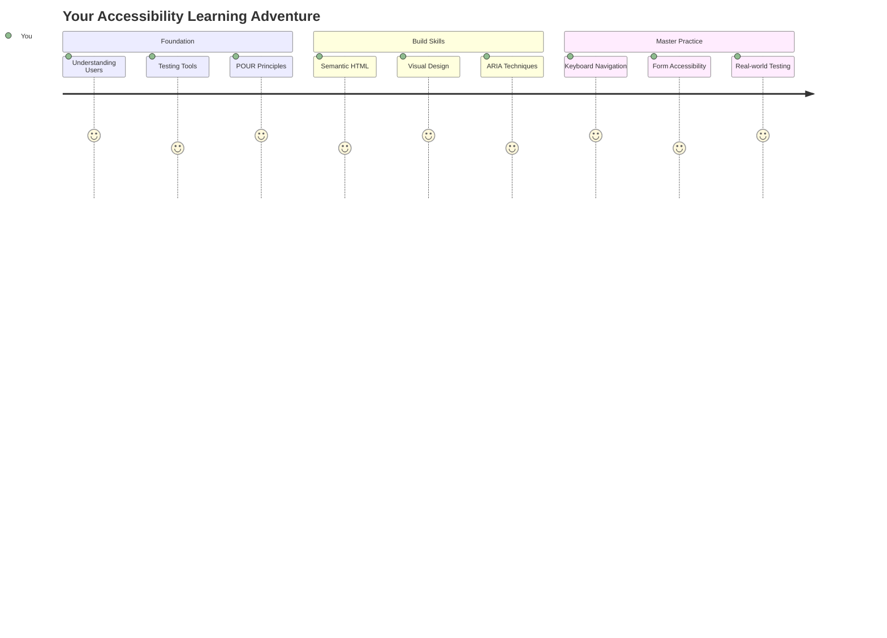

## 課前測驗
[課前測驗](https://ff-quizzes.netlify.app/web/)

> 網路的力量在於其普遍性。無論是否有障礙，人人都能使用是其核心。
>
> \- Sir Timothy Berners-Lee，W3C 主任及全球資訊網的發明者

以下可能會讓你感到驚訝：當你建立無障礙網站時，不僅僅是在幫助有障礙的人，實際上你是在讓網路對所有人都更友好！

你是否注意過街角的斜坡？它們最初是為輪椅設計的，但現在也幫助了推嬰兒車的人、使用手推車的送貨員、拖著行李的旅客，甚至是騎自行車的人。無障礙網頁設計的運作方式正是如此——為某一群體設計的解決方案往往能惠及所有人。是不是很棒？

在這節課中，我們將探討如何建立真正適合所有人使用的網站，無論他們如何瀏覽網頁。你將學到已經內建於網頁標準中的實用技術，親自操作測試工具，並了解無障礙設計如何讓你的網站對所有使用者更友好。

在課程結束時，你將有信心將無障礙設計自然地融入你的開發流程。準備好探索如何通過周到的設計選擇讓全球數十億用戶都能使用網路了嗎？讓我們開始吧！

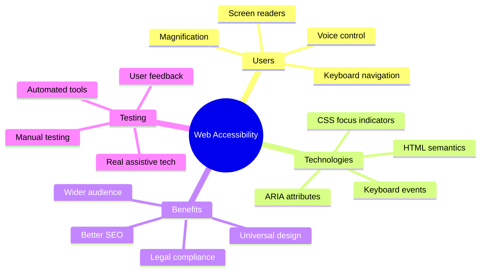

> 你可以在 [Microsoft Learn](https://docs.microsoft.com/learn/modules/web-development-101/accessibility/?WT.mc_id=academic-77807-sagibbon) 上學習這節課！

## 理解輔助技術

在我們開始編碼之前，先花點時間了解不同能力的人如何實際體驗網路。這不僅僅是理論——了解這些真實世界的導航模式將使你成為更好的開發者！

輔助技術是非常驚人的工具，幫助有障礙的人以可能讓你驚訝的方式與網站互動。一旦你掌握了這些技術的運作方式，創造無障礙的網頁體驗就會變得更加直觀。這就像學會用別人的眼光來看你的程式碼。

### 螢幕閱讀器

[螢幕閱讀器](https://en.wikipedia.org/wiki/Screen_reader) 是非常先進的技術，可以將數位文字轉換為語音或點字輸出。雖然它們主要供視力障礙者使用，但對於有閱讀障礙（如閱讀困難症）的使用者也非常有幫助。

我喜歡把螢幕閱讀器比作一個非常聰明的旁白，像讀書一樣為你朗讀內容。它以邏輯順序朗讀內容，提示互動元素如「按鈕」或「連結」，並提供鍵盤快捷鍵以便快速瀏覽頁面。但重點是——螢幕閱讀器只有在我們用正確的結構和有意義的內容建立網站時才能發揮作用。這就是你作為開發者的責任！

**各平台流行的螢幕閱讀器：**
- **Windows**: [NVDA](https://www.nvaccess.org/about-nvda/)（免費且最受歡迎）、[JAWS](https://webaim.org/articles/jaws/)、[Narrator](https://support.microsoft.com/windows/complete-guide-to-narrator-e4397a0d-ef4f-b386-d8ae-c172f109bdb1/?WT.mc_id=academic-77807-sagibbon)（內建）
- **macOS/iOS**: [VoiceOver](https://support.apple.com/guide/voiceover/welcome/10)（內建且功能強大）
- **Android**: [TalkBack](https://support.google.com/accessibility/android/answer/6283677)（內建）
- **Linux**: [Orca](https://wiki.gnome.org/Projects/Orca)（免費且開源）

**螢幕閱讀器如何瀏覽網頁內容：**

螢幕閱讀器提供多種導航方式，使有經驗的使用者能高效瀏覽：
- **順序閱讀**：像讀書一樣從上到下閱讀內容
- **地標導航**：在頁面部分之間跳轉（標頭、導航、主要內容、頁尾）
- **標題導航**：在標題之間跳轉以了解頁面結構
- **連結列表**：生成所有連結的列表以便快速訪問
- **表單控制**：直接在輸入欄位和按鈕之間導航

> 💡 **讓我驚訝的一件事**：68%的螢幕閱讀器使用者主要通過標題進行導航（[WebAIM調查](https://webaim.org/projects/screenreadersurvey9/#finding)）。這意味著你的標題結構就像是使用者的路線圖——當你設計得當時，你實際上是在幫助人們更快地找到內容！

### 建立你的測試工作流程

有個好消息——有效的無障礙測試並不需要讓人感到壓力山大！你可以結合自動化工具（它們非常擅長捕捉明顯的問題）和一些手動測試。以下是我發現的系統化方法，它能在不耗費整天時間的情況下捕捉到最多的問題：

**基本手動測試工作流程：**

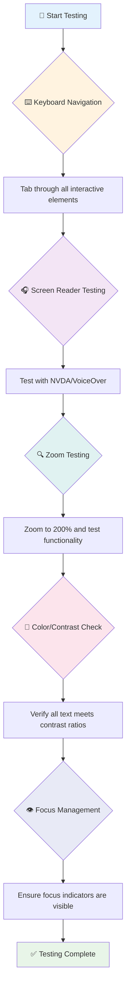

**逐步測試清單：**
1. **鍵盤導航**：僅使用 Tab、Shift+Tab、Enter、Space 和方向鍵
2. **螢幕閱讀器測試**：啟用 NVDA、VoiceOver 或 Narrator，並閉眼導航
3. **縮放測試**：測試 200% 和 400% 的縮放級別
4. **色彩對比驗證**：檢查所有文字和 UI 元件
5. **焦點指示器測試**：確保所有互動元素都有可見的焦點狀態

✅ **從 Lighthouse 開始**：打開瀏覽器的開發者工具，運行 Lighthouse 無障礙性審核，然後根據結果指導你的手動測試重點。

### 縮放和放大工具

你是否曾經在手機上用手指縮放文字，或者在陽光明媚的戶外眯著眼睛看筆記本螢幕？許多使用者每天都依賴放大工具來使內容更易於閱讀，包括視力低下的人、老年人，以及任何曾嘗試在戶外閱讀網站的人。

現代縮放技術已經超越了僅僅放大內容的功能。了解這些工具的運作方式將幫助你創建在任何放大級別下都能保持功能和美觀的響應式設計。

**現代瀏覽器的縮放功能：**
- **頁面縮放**：按比例縮放所有內容（文字、圖片、佈局）——這是首選方法
- **僅文字縮放**：在保持原始佈局的同時增加字體大小
- **手勢縮放**：移動設備支持的臨時放大手勢
- **瀏覽器支持**：所有現代瀏覽器都支持最高 500% 的縮放而不影響功能

**專用放大軟體：**
- **Windows**: [Magnifier](https://support.microsoft.com/windows/use-magnifier-to-make-things-on-the-screen-easier-to-see-414948ba-8b1c-d3bd-8615-0e5e32204198)（內建）、[ZoomText](https://www.freedomscientific.com/training/zoomtext/getting-started/)
- **macOS/iOS**: [Zoom](https://www.apple.com/accessibility/mac/vision/)（內建且功能強大）

> ⚠️ **設計考量**：WCAG 要求內容在放大到 200% 時仍然保持功能性。在此級別，水平滾動應盡量減少，所有互動元素應保持可訪問性。

✅ **測試你的響應式設計**：將瀏覽器縮放到 200% 和 400%。你的佈局是否能優雅地適應？你是否仍然能在不過度滾動的情況下訪問所有功能？

## 現代無障礙測試工具

現在你已經了解人們如何使用輔助技術瀏覽網路，接下來我們來探索幫助你建立和測試無障礙網站的工具。

可以這樣想：自動化工具非常擅長捕捉明顯的問題（例如缺少替代文字），而手動測試則幫助你確保網站在真實世界中使用起來感覺良好。兩者結合，能讓你確信你的網站適合所有人使用。

### 色彩對比測試

有個好消息：色彩對比是最常見的無障礙問題之一，但也是最容易解決的問題。良好的對比度對所有人都有益——從視力障礙者到試圖在沙灘上閱讀手機的人。

**WCAG 對比要求：**

| 文字類型 | WCAG AA（最低要求） | WCAG AAA（增強要求） |
|----------|---------------------|-----------------------|
| **普通文字**（小於 18pt） | 4.5:1 對比度 | 7:1 對比度 |
| **大文字**（18pt+ 或 14pt+ 粗體） | 3:1 對比度 | 4.5:1 對比度 |
| **UI 元件**（按鈕、表單邊框） | 3:1 對比度 | 3:1 對比度 |

**必備測試工具：**
- [Colour Contrast Analyser](https://www.tpgi.com/color-contrast-checker/) - 桌面應用程式，帶有色彩選擇器
- [WebAIM Contrast Checker](https://webaim.org/resources/contrastchecker/) - 網頁版，提供即時反饋
- [Stark](https://www.getstark.co/) - 設計工具插件，適用於 Figma、Sketch、Adobe XD
- [Accessible Colors](https://accessible-colors.com/) - 尋找無障礙色彩方案

✅ **建立更好的色彩方案**：從你的品牌色彩開始，使用對比檢查工具創建無障礙的變體。將這些記錄為你的設計系統中的無障礙色彩標記。

### 全面無障礙審核

最有效的無障礙測試結合了多種方法。沒有單一工具能捕捉所有問題，因此建立包含多種方法的測試流程可以確保全面覆蓋。

**基於瀏覽器的測試（內建於開發者工具）：**
- **Chrome/Edge**: Lighthouse 無障礙性審核 + 無障礙性面板
- **Firefox**: 無障礙性檢查器，帶有詳細的樹狀視圖
- **Safari**: Web Inspector 中的審核標籤，帶有 VoiceOver 模擬

**專業測試擴展工具：**
- [axe DevTools](https://www.deque.com/axe/devtools/) - 業界標準的自動化測試工具
- [WAVE](https://wave.webaim.org/extension/) - 提供錯誤高亮的視覺反饋
- [Accessibility Insights](https://accessibilityinsights.io/) - 微軟的全面測試套件

**命令列和 CI/CD 集成：**
- [axe-core](https://github.com/dequelabs/axe-core) - 用於自動化測試的 JavaScript 庫
- [Pa11y](https://pa11y.org/) - 命令列無障礙測試工具
- [Lighthouse CI](https://github.com/GoogleChrome/lighthouse-ci) - 自動化無障礙性評分

> 🎯 **測試目標**：以 Lighthouse 無障礙性得分 95+ 作為基準。記住，自動化工具只能捕捉大約 30-40% 的無障礙問題——手動測試仍然是必不可少的！

### 🧠 **測試技能檢查：準備好找出問題了嗎？**

**來看看你對無障礙測試的感受：**
- 哪種測試方法目前對你來說最容易上手？
- 你能想像用僅鍵盤導航一整天嗎？
- 你個人在線上遇到過哪些無障礙障礙？

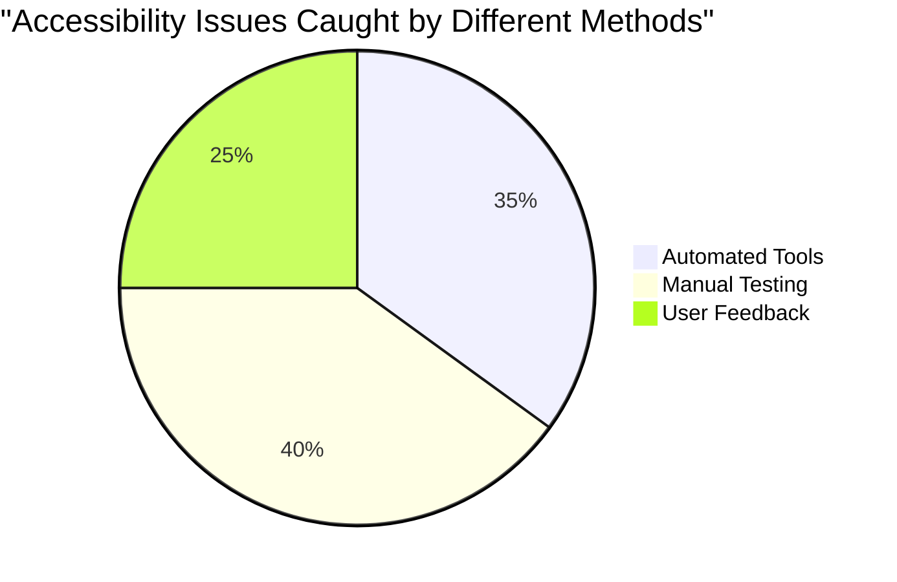

> **信心提升**：專業的無障礙測試人員使用的正是這些方法的組合。你正在學習業界標準的實踐！

## 從基礎開始建立無障礙性

無障礙設計成功的關鍵是從第一天就將其融入基礎中。我知道你可能會想「我可以稍後再添加無障礙性」，但這就像試圖在房子建好後再加一個坡道。可能嗎？是的。容易嗎？不太可能。

把無障礙性想像成設計房子——在最初的建築計劃中包含輪椅無障礙設計要比後期改造容易得多。

### POUR 原則：你的無障礙性基礎

《網頁內容無障礙指導方針》（WCAG）基於四個基本原則，簡稱為 POUR。別擔心——這些並不是枯燥的學術概念！它們實際上是讓內容適合所有人使用的實用指南。

一旦你掌握了 POUR，做出無障礙設計的決定就會變得更加直觀。這就像有了一個指導你設計選擇的心智清單。讓我們來拆解一下：

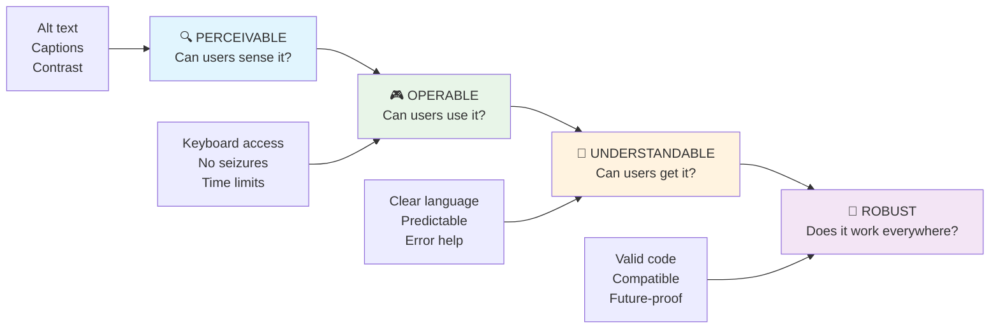

**🔍 可感知性（Perceivable）**：資訊必須以使用者能通過其可用感官感知的方式呈現

- 為非文字內容（圖片、影片、音頻）提供文字替代
- 確保所有文字和 UI 元件具有足夠的色彩對比度
- 為多媒體內容提供字幕和文字稿
- 設計內容在放大到 200% 時仍然保持功能性
- 使用多種感官特徵（不僅僅是顏色）來傳達資訊

**🎮 可操作性（Operable）**：所有介面元件必須能通過可用的輸入方式操作

- 確保所有功能可通過鍵盤導航訪問
- 為使用者提供足夠的時間閱讀和與內容互動
- 避免會引發癲癇或前庭障礙的內容
- 通過清晰的結構和地標幫助使用者高效導航
- 確保互動元素具有足夠的目標大小（至少 44px）

**📖 可理解性（Understandable）**：資訊和介面操作必須清晰易懂

- 使用清晰、簡單的語言，適合你的受眾
- 確保內容以可預測、一致的方式顯示和操作
- 為使用者輸入提供清晰的指示和錯誤訊息
- 幫助使用者理解並糾正表單中的錯誤
- 使用邏輯的閱讀順序和資訊層次結構組織內容

**💪 穩健性（Robust）**：內容必須能可靠地在不同技術和輔助設備上運作

- **使用有效的語義 HTML 作為基礎**
- **確保與當前和未來的輔助技術兼容**
- **遵循網頁標準和最佳標記實踐**
- **在不同的瀏覽器、設備和輔助工具上進行測試**
- **結構化內容，以便在不支持高級功能時能夠平穩降級**

### 🎯 **POUR 原則檢查：讓它深入人心**

**快速回顧基礎：**
- 你能想到一個網站功能違反每個 POUR 原則的例子嗎？
- 作為開發者，哪個原則對你來說最自然？
- 這些原則如何改善設計，讓所有人受益，而不僅僅是殘障用戶？

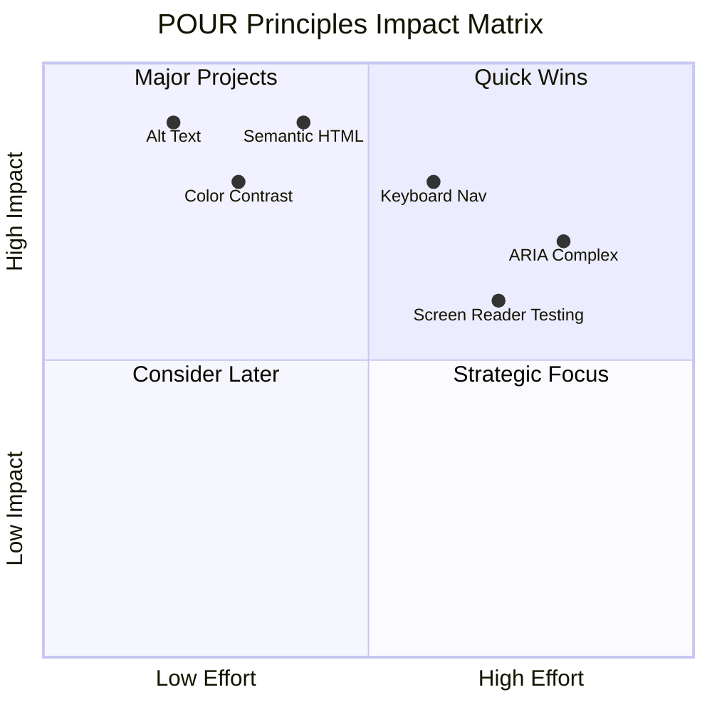

> **記住**：從高影響、低成本的改進開始。使用語義化 HTML 和替代文字可以以最少的努力帶來最大的無障礙提升！

## 創造無障礙的視覺設計

良好的視覺設計與無障礙性密不可分。當你以無障礙性為出發點進行設計時，通常會發現這些限制能夠引導出更簡潔、更優雅的解決方案，讓所有用戶都受益。

讓我們來探討如何創造既吸引人又適合所有人使用的視覺設計，無論他們的視覺能力如何，或者是在什麼樣的條件下瀏覽你的內容。

### 顏色和視覺無障礙策略

顏色在溝通中非常重要，但它不應該是傳達重要信息的唯一方式。超越顏色的設計能夠創造更強大、更包容的體驗，適用於更多情境。

**針對色覺差異進行設計：**

大約 8% 的男性和 0.5% 的女性有某種形式的色覺差異（通常稱為「色盲」）。最常見的類型包括：
- **綠盲（Deuteranopia）**：難以區分紅色和綠色
- **紅盲（Protanopia）**：紅色看起來更暗
- **藍黃盲（Tritanopia）**：難以區分藍色和黃色（罕見）

**包容性的顏色策略：**

```css
/* ❌ Bad: Using only color to indicate status */
.error { color: red; }
.success { color: green; }

/* ✅ Good: Color plus icons and context */
.error {
  color: #d32f2f;
  border-left: 4px solid #d32f2f;
}
.error::before {
  content: "⚠️";
  margin-right: 8px;
}

.success {
  color: #2e7d32;
  border-left: 4px solid #2e7d32;
}
.success::before {
  content: "✅";
  margin-right: 8px;
}
```

**超越基本的對比要求：**
- 使用色盲模擬器測試你的顏色選擇
- 在顏色編碼之外使用圖案、紋理或形狀
- 確保互動狀態在沒有顏色的情況下仍然可區分
- 考慮你的設計在高對比模式下的外觀

✅ **測試你的顏色無障礙性**：使用像 [Coblis](https://www.color-blindness.com/coblis-color-blindness-simulator/) 這樣的工具查看你的網站在不同色覺類型的用戶眼中是什麼樣子。

### 焦點指示器和互動設計

焦點指示器是數字世界中的光標——它們向鍵盤用戶顯示頁面上的位置。設計良好的焦點指示器通過使互動清晰且可預測，提升了所有人的使用體驗。

**現代焦點指示器的最佳實踐：**

```css
/* Enhanced focus styles that work across browsers */
button:focus-visible {
  outline: 2px solid #0066cc;
  outline-offset: 2px;
  box-shadow: 0 0 0 4px rgba(0, 102, 204, 0.25);
}

/* Remove focus outline for mouse users, preserve for keyboard users */
button:focus:not(:focus-visible) {
  outline: none;
}

/* Focus-within for complex components */
.card:focus-within {
  box-shadow: 0 0 0 3px rgba(74, 144, 164, 0.5);
  border-color: #4A90A4;
}

/* Ensure focus indicators meet contrast requirements */
.custom-focus:focus-visible {
  outline: 3px solid #ffffff;
  outline-offset: 2px;
  box-shadow: 0 0 0 6px #000000;
}
```

**焦點指示器要求：**
- **可見性**：與周圍元素的對比度至少為 3:1
- **寬度**：元素周圍至少 2px 的厚度
- **持續性**：直到焦點移動到其他地方之前應保持可見
- **區分性**：必須與其他 UI 狀態視覺上不同

> 💡 **設計提示**：優秀的焦點指示器通常結合了輪廓、陰影框和顏色變化，以確保在不同背景和情境下的可見性。

✅ **審核焦點指示器**：使用 Tab 鍵瀏覽你的網站，記錄哪些元素有清晰的焦點指示器。是否有任何難以看清或完全缺失的？

### 語義化 HTML：無障礙性的基礎

語義化 HTML 就像是為輔助技術提供了一個網站的 GPS 系統。當你使用正確的 HTML 元素來實現其預期目的時，基本上就是為屏幕閱讀器、鍵盤和其他工具提供了一份詳細的路線圖，幫助用戶有效地導航。

這裡有一個非常形象的比喻：語義化 HTML 就像是一個組織良好的圖書館，有清晰的分類和有用的標誌，而不是一本隨意堆放書籍的倉庫。兩個地方的書籍是一樣的，但你更願意在哪裡找書？答案顯而易見！

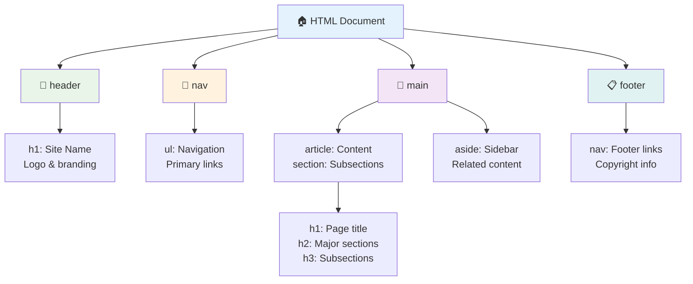

**可訪問頁面結構的基石：**

```html
<!-- Landmark elements provide page navigation structure -->
<header>
  <h1>Your Site Name</h1>
  <nav aria-label="Main navigation">
    <ul>
      <li><a href="/home">Home</a></li>
      <li><a href="/about">About</a></li>
      <li><a href="/services">Services</a></li>
    </ul>
  </nav>
</header>

<main>
  <article>
    <header>
      <h1>Article Title</h1>
      <p>Published on <time datetime="2024-10-14">October 14, 2024</time></p>
    </header>
    
    <section>
      <h2>First Section</h2>
      <p>Content that relates to this section...</p>
    </section>
    
    <section>
      <h2>Second Section</h2>
      <p>More related content...</p>
    </section>
  </article>
  
  <aside>
    <h2>Related Links</h2>
    <nav aria-label="Related articles">
      <ul>
        <li><a href="/related-1">First related article</a></li>
        <li><a href="/related-2">Second related article</a></li>
      </ul>
    </nav>
  </aside>
</main>

<footer>
  <p>&copy; 2024 Your Site Name. All rights reserved.</p>
  <nav aria-label="Footer links">
    <ul>
      <li><a href="/privacy">Privacy Policy</a></li>
      <li><a href="/contact">Contact Us</a></li>
    </ul>
  </nav>
</footer>
```

**語義化 HTML 如何改變無障礙性：**

| 語義元素 | 目的 | 屏幕閱讀器的好處 |
|----------|------|------------------|
| `<header>` | 頁面或部分的標題 | 「橫幅地標」- 快速導航到頂部 |
| `<nav>` | 導航鏈接 | 「導航地標」- 列出導航部分 |
| `<main>` | 主要頁面內容 | 「主要地標」- 直接跳到內容 |
| `<article>` | 自包含內容 | 宣告文章邊界 |
| `<section>` | 主題內容組 | 提供內容結構 |
| `<aside>` | 相關的側邊欄內容 | 「補充地標」 |
| `<footer>` | 頁面或部分的頁腳 | 「內容信息地標」 |

**語義化 HTML 的屏幕閱讀器超能力：**
- **地標導航**：瞬間跳轉到主要頁面部分
- **標題大綱**：根據標題結構生成目錄
- **元素列表**：創建所有鏈接、按鈕或表單控件的列表
- **上下文感知**：理解內容部分之間的關係

> 🎯 **快速測試**：使用屏幕閱讀器的地標快捷鍵（NVDA/JAWS 中的 D 鍵）或標題快捷鍵（H 鍵）導航你的網站。導航是否合理？

### 🏗️ **語義化 HTML 精通檢查：建立堅實基礎**

**讓我們評估你的語義理解：**
- 你能僅通過查看 HTML 識別網頁上的地標嗎？
- 你會如何向朋友解釋 `<section>` 和 `<div>` 的區別？
- 如果屏幕閱讀器用戶報告導航問題，你首先會檢查什麼？

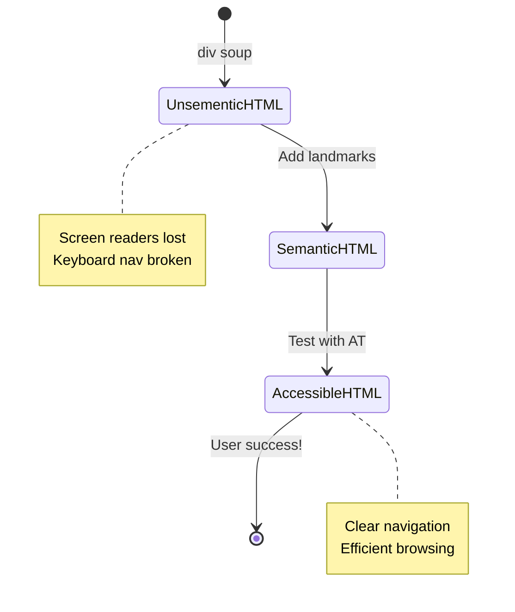

> **專業洞察**：良好的語義化 HTML 能自動解決約 70% 的無障礙性問題。掌握這一基礎，你就已經走在正確的道路上！

✅ **審核你的語義結構**：使用瀏覽器的開發工具中的無障礙面板查看無障礙樹，確保你的標記創建了邏輯結構。

### 標題層次：創建邏輯內容大綱

標題對於可訪問內容至關重要——它們就像是支撐一切的脊椎。屏幕閱讀器用戶非常依賴標題來理解和導航你的內容。可以把它想像成為你的頁面提供了一個目錄。

**標題的黃金法則：**
永遠不要跳過層級。始終從 `<h1>` 到 `<h2>` 到 `<h3>` 等邏輯進展。還記得在學校做大綱嗎？原則完全一樣——你不會直接從「I. 主點」跳到「C. 子子點」，而不經過「A. 子點」，對吧？

**完美的標題結構示例：**

```html
<!-- ✅ Excellent: Logical, hierarchical progression -->
<main>
  <h1>Complete Guide to Web Accessibility</h1>
  
  <section>
    <h2>Understanding Screen Readers</h2>
    <p>Introduction to screen reader technology...</p>
    
    <h3>Popular Screen Reader Software</h3>
    <p>NVDA, JAWS, and VoiceOver comparison...</p>
    
    <h3>Testing with Screen Readers</h3>
    <p>Step-by-step testing instructions...</p>
  </section>
  
  <section>
    <h2>Color and Contrast Guidelines</h2>
    <p>Designing with sufficient contrast...</p>
    
    <h3>WCAG Contrast Requirements</h3>
    <p>Understanding the different contrast levels...</p>
    
    <h3>Testing Tools and Techniques</h3>
    <p>Tools for verifying contrast ratios...</p>
  </section>
</main>
```

```html
<!-- ❌ Problematic: Skipping levels, inconsistent structure -->
<h1>Page Title</h1>
<h3>Subsection</h3> <!-- Skipped h2 -->
<h2>This should come before h3</h2>
<h1>Another main heading?</h1> <!-- Multiple h1s -->
```

**標題最佳實踐：**
- **每頁一個 `<h1>`**：通常是你的主要頁面標題或主要內容標題
- **邏輯進展**：不要跳過層級（h1 → h2 → h3，而不是 h1 → h3）
- **描述性內容**：使標題在脫離上下文時仍然有意義
- **使用 CSS 進行視覺樣式**：用 CSS 控制外觀，用 HTML 層級控制結構

**屏幕閱讀器導航統計：**
- 68% 的屏幕閱讀器用戶通過標題導航（[WebAIM 調查](https://webaim.org/projects/screenreadersurvey9/#finding)）
- 用戶期望找到邏輯的標題大綱
- 標題提供了最快速理解頁面結構的方式

> 💡 **專業提示**：使用瀏覽器擴展如「HeadingsMap」來可視化你的標題結構。它應該像一個組織良好的目錄一樣易於閱讀。

✅ **測試你的標題結構**：使用屏幕閱讀器的標題導航（NVDA 中的 H 鍵）跳轉你的標題。進展是否邏輯地講述了你的內容故事？

### 高級視覺無障礙技術

除了對比和顏色的基本要求外，還有一些更高級的技術可以幫助創造真正包容的視覺體驗。這些方法確保你的內容能夠在不同的瀏覽條件和輔助技術下正常工作。

**基本視覺溝通策略：**

- **多模態反饋**：結合視覺、文本，有時還有音頻提示
- **漸進式披露**：以易於消化的塊狀呈現信息
- **一致的互動模式**：使用熟悉的 UI 慣例
- **響應式排版**：在不同設備上適當調整文字大小
- **加載和錯誤狀態**：為所有用戶操作提供清晰的反饋

**增強無障礙性的 CSS 工具：**

```css
/* Screen reader only text - visually hidden but accessible */
.sr-only {
  position: absolute;
  width: 1px;
  height: 1px;
  padding: 0;
  margin: -1px;
  overflow: hidden;
  clip: rect(0, 0, 0, 0);
  white-space: nowrap;
  border: 0;
}

/* Skip link for keyboard navigation */
.skip-link {
  position: absolute;
  top: -40px;
  left: 6px;
  background: #000000;
  color: #ffffff;
  padding: 8px 16px;
  text-decoration: none;
  border-radius: 4px;
  font-weight: bold;
  transition: top 0.3s ease;
  z-index: 1000;
}

.skip-link:focus {
  top: 6px;
}

/* Reduced motion respect */
@media (prefers-reduced-motion: reduce) {
  .skip-link {
    transition: none;
  }
  
  * {
    animation-duration: 0.01ms !important;
    animation-iteration-count: 1 !important;
    transition-duration: 0.01ms !important;
  }
}

/* High contrast mode support */
@media (prefers-contrast: high) {
  .button {
    border: 2px solid;
  }
}
```

> 🎯 **無障礙模式**：「跳過鏈接」對於鍵盤用戶至關重要。它應該是頁面上的第一個可聚焦元素，並直接跳到主要內容區域。

✅ **實施跳過導航**：在你的頁面中添加跳過鏈接，並在頁面加載後按 Tab 鍵進行測試。它們應該出現並允許你跳到主要內容。

## 創造有意義的鏈接文本

鏈接基本上是網絡的高速公路，但糟糕的鏈接文本就像路標上只寫「地方」，而不是「芝加哥市中心」。這樣不太有幫助，對吧？

這裡有一個讓我大開眼界的事實：屏幕閱讀器可以提取頁面上的所有鏈接並將它們顯示為一個大列表。想像一下，如果有人遞給你一份頁面上所有鏈接的目錄。每個鏈接是否能單獨理解？這就是你的鏈接文本需要通過的測試！

### 理解鏈接導航模式

屏幕閱讀器提供了強大的鏈接導航功能，依賴於精心編寫的鏈接文本：

**鏈接導航方法：**
- **順序閱讀**：鏈接作為內容流的一部分被閱讀
- **鏈接列表生成**：所有頁面鏈接匯總為可搜索的目錄
- **快速導航**：使用鍵盤快捷鍵（NVDA 中的 K 鍵）在鏈接之間跳轉
- **搜索功能**：通過輸入部分文本找到特定鏈接

**為什麼上下文很重要：**
當屏幕閱讀器用戶生成鏈接列表時，他們會看到類似以下內容：
- 「下載報告」
- 「了解更多」
- 「點擊這裡」
- 「隱私政策」
- 「點擊這裡」

只有其中兩個鏈接在脫離上下文時提供了有用的信息！

> 📊 **用戶影響**：屏幕閱讀器用戶掃描鏈接列表以快速理解頁面內容。通用鏈接文本迫使他們返回每個鏈接的上下文，大大減慢了瀏覽速度。

### 避免常見的鏈接文本錯誤

理解哪些方法不起作用有助於你識別並修復現有內容中的無障礙性問題。

**❌ 提供無上下文的通用鏈接文本：**

```html
<!-- Meaningless when read from a link list -->
<p>Our sustainability efforts are detailed in our recent report. 
   <a href="/sustainability-2024.pdf">Click here</a> to view it.</p>

<!-- Repeated generic text throughout the page -->
<div class="article-card">
  <h3>Web Accessibility Guide</h3>
  <p>Learn the fundamentals...</p>
  <a href="/accessibility-guide">Read more</a>
</div>
<div class="article-card">
  <h3>Color Contrast Tips</h3>
  <p>Improve your design...</p>
  <a href="/color-contrast">Read more</a>
</div>

<!-- URLs as link text (difficult for screen readers to announce) -->
<p>Visit https://www.w3.org/WAI/WCAG21/quickref/ for WCAG guidelines.</p>

<!-- Vague action words -->
<a href="/contact">Go</a> | <a href="/about">See</a> | <a href="/help">View</a>
```

**為什麼這些模式失敗：**
- **「點擊這裡」** 沒有告訴用戶目的地
- **「閱讀更多」** 多次重複會造成混淆
- **原始 URL** 對屏幕閱讀器來說難以清晰地發音
- **單詞** 如「去」或「看」缺乏描述性上下文

### 編寫優秀的鏈接文本

描述性鏈接文本對所有人都有好處——視覺用戶可以快速掃描鏈接，屏幕閱讀器用戶能立即理解目的地。

**✅ 清晰、描述性的鏈接文本示例：**

```html
<!-- Descriptive text that explains the destination -->
<p>Our comprehensive <a href="/sustainability-2024.pdf">2024 sustainability report (PDF, 2.1MB)</a> details our environmental initiatives.</p>

<!-- Specific, unique link text for each card -->
<div class="article-card">
  <h3>Web Accessibility Guide</h3>
  <p>Learn the fundamentals of inclusive design...</p>
  <a href="/accessibility-guide">Read our complete web accessibility guide</a>
</div>
<div class="article-card">
  <h3>Color Contrast Tips</h3>
  <p>Improve your design with better color choices...</p>
  <a href="/color-contrast">Explore color contrast best practices</a>
</div>

<!-- Meaningful text instead of raw URLs -->
<p>The <a href="https://www.w3.org/WAI/WCAG21/quickref/">WCAG 2.1 Quick Reference guide</a> provides comprehensive accessibility guidelines.</p>

<!-- Descriptive action links -->
<a href="/contact">Contact our support team</a> | 
<a href="/about">About our company</a> | 
<a href="/help">Get help with your account</a>
```

**鏈接文本最佳實踐：**
- **具體化**：「下載季度財務報告」 vs. 「下載」
- **包括文件類型和大小**：「（PDF，1.2MB）」適用於可下載文件
- **提及鏈接是否外部打開**：「（在新窗口中打開）」在適當時
- **使用主動語言**：「聯繫我們」 vs. 「聯繫頁面」
- **保持簡潔**：盡量控制在 2-8 個單詞內

### 高級鏈接無障礙模式

有時視覺設計限制或技術需求需要特殊解決方案。以下是常見挑戰場景的高級技術：

**使用 ARIA 增強上下文：**

```html
<!-- When button text must be short but needs more context -->
<a href="/report.pdf" 
   aria-label="Download 2024 annual financial report, PDF format, 2.3MB">
  Download Report
</a>

<!-- When the full context comes from surrounding content -->
<h3 id="sustainability-heading">Sustainability Initiative</h3>
<p>Our efforts to reduce environmental impact...</p>
<a href="/sustainability-details" 
   aria-labelledby="sustainability-heading"
   aria-describedby="sustainability-summary">
  Learn more
</a>
<p id="sustainability-summary">Detailed breakdown of our 2024 environmental goals and achievements</p>
```

**指示文件類型和外部目的地：**

```html
<!-- Method 1: Include information in visible link text -->
<a href="/annual-report.pdf">
  Download our 2024 annual report (PDF, 2.3MB)
</a>

<!-- Method 2: Use screen reader-only text for file details -->
<a href="/annual-report.pdf">
  Download our 2024 annual report
  <span class="sr-only">(PDF format, 2.3MB)</span>
</a>

<!-- Method 3: External link indication -->
<a href="https://example.com" 
   target="_blank" 
   aria-describedby="external-link-warning">
  Visit external resource
</a>
<span id="external-link-warning" class="sr-only">
  (opens in new window)
</span>

<!-- Method 4: Using CSS for visual indicators -->
<a href="https://example.com" class="external-link">
  External resource
</a>
```

```css
/* Visual indicator for external links */
.external-link::after {
  content: " ↗";
  font-size: 0.8em;
  color: #666;
}

/* Screen reader announcement for external links */
.external-link::before {
  content: "External link: ";
  position: absolute;
  left: -10000px;
  width: 1px;
  height: 1px;
  overflow: hidden;
}
```

> ⚠️ **重要**：使用 `target="_blank"` 時，務必告知用戶鏈接會在新窗口或標籤中打開。意外的導航變化可能會讓人感到困惑。

✅ **測試你的鏈接上下文**：使用瀏覽器的開發工具生成頁面上所有鏈接的列表。你能在沒有任何周圍上下文的情況下理解每個鏈接的目的嗎？

## ARIA：超級增強 HTML 無障礙性

[Accessible Rich Internet Applications (ARIA)](https://developer.mozilla.org/docs/Web/Accessibility/ARIA) 就像是你的複雜網絡應用和輔助技術之間的通用翻譯器。當 HTML 本身無法表達你的互動組件的所有功能時，ARIA 就會填補這些空白。

我喜歡把 ARIA 想像成為你的 HTML 添加有用的註解——就像劇本中的舞台指導，幫助演員理解角色和關係。

**這裡是關於 ARIA 的最重要規則**：始終先使用語義化 HTML，然後再添加 ARIA 進行增強。把 ARIA 想像成調味料，而不是主菜。它應該澄清並增強你的 HTML 結構，而不是取代它。先打好基礎！

### 策略性 ARIA 實施

ARIA 很強大，但強大伴隨著責任。錯誤的 ARIA 可能會讓無障礙性比沒有 ARIA 還糟。以下是何時以及如何有效使用它：

**✅ 使用 ARIA 的情況：**
- 創建自定義交互式小部件（手風琴、選項卡、輪播）
- 構建無需頁面重新加載的動態內容
- 為複雜的 UI 關係提供額外的上下文
- 指示加載狀態或實時內容更新
- 使用自定義控件創建類似應用的界面

**❌ 避免使用 ARIA 的情況：**
- 標準 HTML 元素已提供所需的語義
- 你不確定如何正確實施
- 它重複了語義化 HTML 已提供的信息
- 你尚未使用實際輔助技術進行測試

> 🎯 **ARIA 黃金法則**：「除非絕對必要，否則不要改變語義，始終確保鍵盤無障礙性，並使用真實的輔助技術進行測試。」
**ARIA 的五大類別：**

1. **角色**：這個元素是什麼？（`button`、`tab`、`dialog`）
2. **屬性**：它有哪些特性？（`aria-required`、`aria-haspopup`）
3. **狀態**：它目前的狀況如何？（`aria-expanded`、`aria-checked`）
4. **地標**：它在頁面結構中的位置？（`banner`、`navigation`、`main`）
5. **即時區域**：如何宣告內容的變更？（`aria-live`、`aria-atomic`）

### 現代網頁應用的基本 ARIA 模式

這些模式解決了互動式網頁應用中最常見的無障礙挑戰：

**命名和描述元素：**

```html
<!-- aria-label: Provides accessible name when visible text isn't sufficient -->
<button aria-label="Close newsletter subscription dialog">×</button>

<!-- aria-labelledby: References existing text as the accessible name -->
<section aria-labelledby="news-heading">
  <h2 id="news-heading">Latest News</h2>
  <!-- news content -->
</section>

<!-- aria-describedby: Links to additional descriptive text -->
<input type="password" 
       aria-describedby="pwd-requirements pwd-strength"
       required>
<div id="pwd-requirements">
  Password must contain at least 8 characters, including uppercase, lowercase, and numbers.
</div>
<div id="pwd-strength" aria-live="polite">
  <!-- Dynamic password strength indicator -->
</div>
```

**即時區域用於動態內容：**

```html
<!-- Polite announcements (don't interrupt current speech) -->
<div aria-live="polite" id="status-updates">
  <!-- Status messages appear here -->
</div>

<!-- Assertive announcements (interrupt and announce immediately) -->
<div aria-live="assertive" id="urgent-alerts">
  <!-- Error messages and critical alerts -->
</div>

<!-- Loading states with live regions -->
<button id="submit-btn" aria-describedby="loading-status">
  Submit Application
</button>
<div id="loading-status" aria-live="polite" aria-atomic="true">
  <!-- "Processing your application..." appears here -->
</div>
```

**互動式元件範例（手風琴）：**

```html
<div class="accordion">
  <h3>
    <button aria-expanded="false" 
            aria-controls="panel-1" 
            id="accordion-trigger-1"
            class="accordion-trigger">
      Accessibility Guidelines
    </button>
  </h3>
  <div id="panel-1" 
       role="region"
       aria-labelledby="accordion-trigger-1" 
       hidden>
    <p>WCAG 2.1 provides comprehensive guidelines...</p>
  </div>
</div>
```

```javascript
// JavaScript to manage accordion state
function toggleAccordion(trigger) {
  const panel = document.getElementById(trigger.getAttribute('aria-controls'));
  const isExpanded = trigger.getAttribute('aria-expanded') === 'true';
  
  // Toggle states
  trigger.setAttribute('aria-expanded', !isExpanded);
  panel.hidden = isExpanded;
  
  // Announce change to screen readers
  const status = document.getElementById('status-updates');
  status.textContent = isExpanded ? 'Section collapsed' : 'Section expanded';
}
```

### ARIA 實作最佳實踐

ARIA 功能強大，但需要謹慎實施。遵循以下指南有助於確保您的 ARIA 增強而非阻礙無障礙性：

**🛡️ 核心原則：**

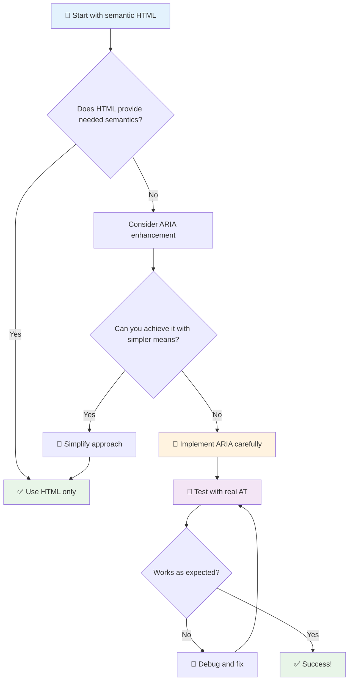

1. **優先使用語義化 HTML**：始終選擇 `<button>` 而非 `<div role="button">`
2. **不要破壞語義**：切勿覆蓋現有 HTML 的含義（避免使用 `<h1 role="button">`）
3. **保持鍵盤可訪問性**：所有互動式 ARIA 元素必須完全支持鍵盤操作
4. **與真實用戶測試**：ARIA 支援在不同輔助技術間差異很大
5. **從簡單開始**：複雜的 ARIA 實作更容易出現錯誤

**🔍 測試工作流程：**

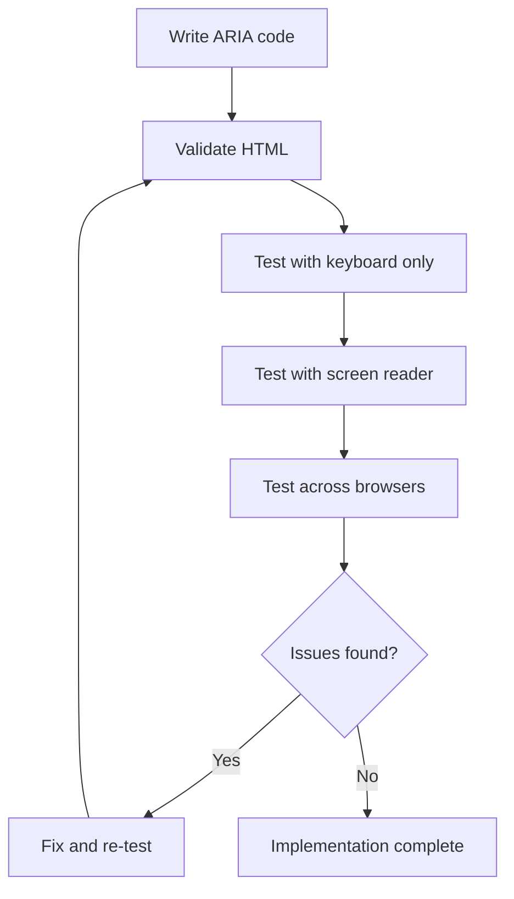

**🚫 常見 ARIA 錯誤避免：**

- **信息衝突**：不要與 HTML 語義矛盾
- **過度標籤**：過多的 ARIA 信息會讓用戶感到困惑
- **靜態 ARIA**：忘記在內容變更時更新 ARIA 狀態
- **未測試的實作**：理論上可行但實際上失敗的 ARIA
- **缺乏鍵盤支援**：ARIA 角色未提供相應的鍵盤互動

> 💡 **測試資源**：使用 [accessibility-checker](https://www.npmjs.com/package/accessibility-checker) 等工具進行自動化 ARIA 驗證，但一定要使用真實的螢幕閱讀器進行完整體驗測試。

### 🎭 **ARIA 技能檢查：準備好應對複雜互動了嗎？**

**評估您的 ARIA 信心：**
- 什麼時候應選擇 ARIA 而非語義化 HTML？（提示：幾乎不需要！）
- 您能解釋為什麼 `<div role="button">` 通常比 `<button>` 差嗎？
- ARIA 測試最重要的事情是什麼？

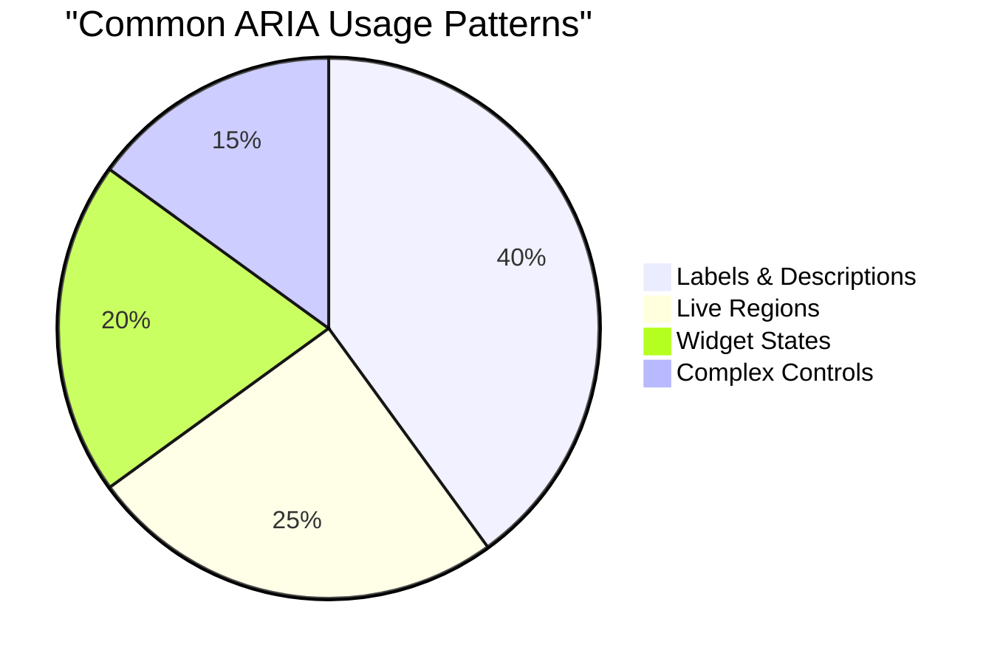

> **關鍵洞察**：大多數 ARIA 的使用是用於標籤和描述元素。複雜的元件模式比您想像的要少得多！

✅ **向專家學習**：研究 [ARIA Authoring Practices Guide](https://w3c.github.io/aria-practices/) 以了解經過實踐驗證的模式和複雜互動元件的實作。

## 讓圖片和媒體更具無障礙性

視覺和音頻內容是現代網頁體驗的重要部分，但如果未經過周全的實作，可能會造成障礙。目標是確保您的媒體信息和情感影響能夠觸及每位用戶。一旦掌握了技巧，這將變得得心應手。

不同類型的媒體需要不同的無障礙方法。就像烹飪一樣——處理精緻的魚和厚實的牛排方式不同。了解這些差異有助於您為每種情況選擇合適的解決方案。

### 策略性圖片無障礙性

網站上的每張圖片都有其目的。了解這些目的有助於您撰寫更好的替代文字並創造更具包容性的體驗。

**圖片的四種類型及其替代文字策略：**

**信息性圖片** - 傳達重要信息：
```html

```

**裝飾性圖片** - 純粹視覺效果，無信息價值：
```html

```

**功能性圖片** - 作為按鈕或控制項：
```html
<button>
  
</button>
```

**複雜圖片** - 圖表、圖解、資訊圖表：
```html

<div id="chart-description">
  <p>Detailed description: Sales data shows a steady increase across all quarters...</p>
</div>
```

### 視頻和音頻的無障礙性

**視頻要求：**
- **字幕**：語音內容和音效的文字版本
- **音頻描述**：為盲人用戶敘述視覺元素
- **文字稿**：所有音頻和視覺內容的完整文字版本

```html
<video controls>
  <source src="video.mp4" type="video/mp4">
  <track kind="captions" src="captions.vtt" srclang="en" label="English">
  <track kind="descriptions" src="descriptions.vtt" srclang="en" label="Audio descriptions">
</video>
```

**音頻要求：**
- **文字稿**：所有語音內容的文字版本
- **視覺指示**：對於僅音頻內容，提供視覺提示

### 現代圖片技術

**使用 CSS 處理裝飾性圖片：**
```css
.hero-section {
  background-image: url('decorative-hero.jpg');
  /* Decorative images in CSS don't need alt text */
}
```

**具有無障礙性的響應式圖片：**
```html
<picture>
  <source media="(min-width: 800px)" srcset="large-chart.png">
  <source media="(min-width: 400px)" srcset="medium-chart.png">
  
</picture>
```

✅ **測試圖片無障礙性**：使用螢幕閱讀器瀏覽包含圖片的頁面。您是否獲得足夠的信息來理解內容？

## 鍵盤導航和焦點管理

許多用戶完全使用鍵盤瀏覽網頁。其中包括有運動障礙的人、覺得鍵盤比鼠標更快的高效用戶，以及鼠標無法使用的任何人。確保您的網站能很好地支持鍵盤輸入是必須的，並且通常能讓您的網站對所有人更高效。

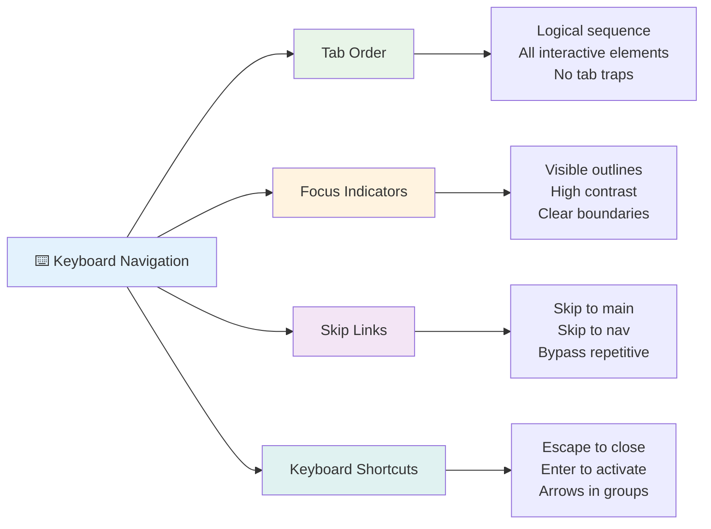

### 基本鍵盤導航模式

**標準鍵盤互動：**
- **Tab**：向前移動焦點到互動元素
- **Shift + Tab**：向後移動焦點
- **Enter**：激活按鈕和連結
- **Space**：激活按鈕，勾選核取框
- **方向鍵**：在元件組內導航（單選按鈕、選單）
- **Escape**：關閉模態窗口、下拉選單或取消操作

### 焦點管理最佳實踐

**可見的焦點指示器：**
```css
/* Ensure focus is always visible */
button:focus-visible {
  outline: 2px solid #4A90A4;
  outline-offset: 2px;
}

/* Custom focus styles for different components */
.card:focus-within {
  box-shadow: 0 0 0 3px rgba(74, 144, 164, 0.5);
}
```

**跳過連結以提高導航效率：**
```html
<a href="#main-content" class="skip-link">Skip to main content</a>
<a href="#navigation" class="skip-link">Skip to navigation</a>

<nav id="navigation">
  <!-- navigation content -->
</nav>
<main id="main-content">
  <!-- main content -->
</main>
```

**正確的 Tab 順序：**
```html
<!-- Use semantic HTML for natural tab order -->
<form>
  <label for="name">Name:</label>
  <input type="text" id="name" tabindex="0">
  
  <label for="email">Email:</label>
  <input type="email" id="email" tabindex="0">
  
  <button type="submit" tabindex="0">Submit</button>
</form>
```

### 模態窗口中的焦點限制

打開模態對話框時，焦點應限制在模態內：

```javascript
// Modern focus trap implementation
function trapFocus(element) {
  const focusableElements = element.querySelectorAll(
    'button, [href], input, select, textarea, [tabindex]:not([tabindex="-1"])'
  );
  
  const firstElement = focusableElements[0];
  const lastElement = focusableElements[focusableElements.length - 1];

  element.addEventListener('keydown', (e) => {
    if (e.key === 'Tab') {
      if (e.shiftKey && document.activeElement === firstElement) {
        e.preventDefault();
        lastElement.focus();
      } else if (!e.shiftKey && document.activeElement === lastElement) {
        e.preventDefault();
        firstElement.focus();
      }
    }
    
    if (e.key === 'Escape') {
      closeModal();
    }
  });
  
  // Focus first element when modal opens
  firstElement.focus();
}
```

✅ **測試鍵盤導航**：嘗試僅使用 Tab 鍵瀏覽您的網站。您能到達所有互動元素嗎？焦點順序是否合乎邏輯？焦點指示器是否清晰可見？

## 表單無障礙性

表單是用戶互動的關鍵部分，需要特別注意無障礙性。

### 標籤和表單控制項的關聯

**每個表單控制項都需要一個標籤：**
```html
<!-- Explicit labeling (preferred) -->
<label for="username">Username:</label>
<input type="text" id="username" name="username" required>

<!-- Implicit labeling -->
<label>
  Password:
  <input type="password" name="password" required>
</label>

<!-- Using aria-label when visual label isn't desired -->
<input type="search" aria-label="Search products" placeholder="Search...">
```

### 錯誤處理和驗證

**無障礙的錯誤信息：**
```html
<label for="email">Email Address:</label>
<input type="email" id="email" name="email" 
       aria-describedby="email-error" 
       aria-invalid="true" required>
<div id="email-error" role="alert">
  Please enter a valid email address
</div>
```

**表單驗證最佳實踐：**
- 使用 `aria-invalid` 表示無效字段
- 提供清晰、具體的錯誤信息
- 使用 `role="alert"` 宣告重要錯誤
- 在表單提交時和即時顯示錯誤

### 字段集和分組

**分組相關的表單控制項：**
```html
<fieldset>
  <legend>Shipping Address</legend>
  <label for="street">Street Address:</label>
  <input type="text" id="street" name="street">
  
  <label for="city">City:</label>
  <input type="text" id="city" name="city">
</fieldset>

<fieldset>
  <legend>Preferred Contact Method</legend>
  <input type="radio" id="contact-email" name="contact" value="email">
  <label for="contact-email">Email</label>
  
  <input type="radio" id="contact-phone" name="contact" value="phone">
  <label for="contact-phone">Phone</label>
</fieldset>
```

## 您的無障礙旅程：關鍵要點

恭喜！您剛剛獲得了創建真正包容性網頁體驗的基礎知識。這真是令人興奮的事情！網頁無障礙性不僅僅是檢查合規性——它是關於認識人們與數字內容互動的多樣性，並為這種驚人的複雜性進行設計。

您現在已成為一個不斷壯大的開發者社群的一員，這些人明白出色的設計是為所有人服務的。歡迎加入這個行列！

**🎯 您的無障礙工具包現在包括：**

| 核心原則 | 實作 | 影響 |
|----------|------|------|
| **語義化 HTML 基礎** | 使用正確的 HTML 元素完成其預期目的 | 螢幕閱讀器能有效導航，鍵盤自動工作 |
| **包容性視覺設計** | 足夠的對比度、有意義的顏色使用、可見的焦點指示器 | 在任何光線條件下都清晰可見 |
| **描述性內容** | 有意義的連結文字、替代文字、標題 | 用戶在沒有視覺上下文的情況下理解內容 |
| **鍵盤無障礙性** | Tab 順序、鍵盤快捷鍵、焦點管理 | 運動無障礙性和高效用戶的便利性 |
| **ARIA 增強** | 策略性使用以填補語義空白 | 複雜應用程序能與輔助技術協同工作 |
| **全面測試** | 自動化工具 + 手動驗證 + 真實用戶測試 | 在影響用戶之前發現問題 |

**🚀 您的下一步：**

1. **將無障礙性融入您的工作流程**：讓測試成為開發過程中的自然部分
2. **向真實用戶學習**：尋求使用輔助技術的人的反饋
3. **保持最新**：無障礙技術隨著新技術和標準的出現而演變
4. **倡導包容性**：分享您的知識並使無障礙性成為團隊的優先事項

> 💡 **記住**：無障礙性限制通常會帶來創新、優雅的解決方案，造福所有人。斜坡、字幕和語音控制最初都是無障礙功能，後來成為主流改進。

**商業案例非常明確**：無障礙網站能觸及更多用戶，在搜索引擎中排名更高，維護成本更低，並避免法律風險。但說實話？關注無障礙性的真正原因要深刻得多。無障礙網站體現了網絡的最佳價值——開放性、包容性，以及每個人都應該平等獲得信息的理念。

您現在已準備好構建未來的包容性網絡。您創建的每個無障礙網站都使互聯網成為一個更友好的地方。仔細想想，這真的很棒！

## 其他資源

通過以下重要資源繼續您的無障礙學習旅程：

**📚 官方標準和指南：**
- [WCAG 2.1 Guidelines](https://www.w3.org/WAI/WCAG21/quickref/) - 官方無障礙標準快速參考
- [ARIA Authoring Practices Guide](https://w3c.github.io/aria-practices/) - 互動元件的全面模式
- [WebAIM Guidelines](https://webaim.org/) - 實用且適合初學者的無障礙指導

**🛠️ 工具和測試資源：**
- [axe DevTools](https://www.deque.com/axe/devtools/) - 行業標準的無障礙測試工具
- [A11y Project Checklist](https://www.a11yproject.com/checklist/) - 步驟式無障礙性驗證
- [Accessibility Insights](https://accessibilityinsights.io/) - 微軟的綜合測試套件
- [Color Oracle](https://colororacle.org/) - 用於設計測試的色盲模擬器

**🎓 學習和社群：**
- [WebAIM Screen Reader Survey](https://webaim.org/projects/screenreadersurvey9/) - 真實用戶的偏好和行為
- [Inclusive Components](https://inclusive-components.design/) - 現代無障礙元件模式
- [A11y Coffee](https://a11y.coffee/) - 快速無障礙性提示和見解
- [Web Accessibility Initiative (WAI)](https://www.w3.org/WAI/) - W3C 的綜合無障礙資源

**🎥 實踐學習：**
- [Accessibility Developer Guide](https://www.accessibility-developer-guide.com/) - 實用的實作指導
- [Deque University](https://dequeuniversity.com/) - 專業的無障礙性培訓課程

## GitHub Copilot Agent 挑戰 🚀

使用 Agent 模式完成以下挑戰：

**描述：** 創建一個無障礙的模態對話框元件，展示正確的焦點管理、ARIA 屬性和鍵盤導航模式。

**提示：** 使用 HTML、CSS 和 JavaScript 構建一個完整的模態對話框元件，包括：正確的焦點限制、ESC 鍵關閉、點擊外部關閉、螢幕閱讀器的 ARIA 屬性，以及可見的焦點指示器。模態應包含一個具有正確標籤和錯誤處理的表單。確保元件符合 WCAG 2.1 AA 標準。

## 🚀 挑戰

使用您學到的策略，將以下 HTML 重寫為盡可能無障礙。

```html
<!DOCTYPE html>
<html lang="en">
  <head>
    <meta charset="UTF-8">
    <meta name="viewport" content="width=device-width, initial-scale=1.0">
    <title>Turtle Ipsum - The World's Premier Turtle Fan Club</title>
    <link href='../assets/style.css' rel='stylesheet' type='text/css'>
  </head>
  <body>
    <header class="site-header">
      <h1 class="site-title">Turtle Ipsum</h1>
      <p class="site-subtitle">The World's Premier Turtle Fan Club</p>
    </header>
    
    <nav class="main-nav" aria-label="Main navigation">
      <h2 class="nav-header">Resources</h2>
      <ul class="nav-list">
        <li><a href="https://www.youtube.com/watch?v=CMNry4PE93Y">"I like turtles" video</a></li>
        <li><a href="https://en.wikipedia.org/wiki/Turtle">Basic turtle information</a></li>
        <li><a href="https://en.wikipedia.org/wiki/Turtles_(chocolate)">Chocolate turtles candy</a></li>
      </ul>
    </nav>
    
    <main class="main-content">
      <article>
        <h1>Welcome to Turtle Ipsum</h1>
        <p class="intro">
          <a href="/about">Learn more about our turtle community</a> and discover fascinating facts about these amazing creatures.
        </p>
        <p class="article-text">
          Turtle ipsum dolor sit amet, consectetur adipiscing elit, sed do eiusmod tempor incididunt ut labore et dolore magna aliqua. Ut enim ad minim veniam, quis nostrud exercitation ullamco laboris nisi ut aliquip ex ea commodo consequat. Duis aute irure dolor in reprehenderit in voluptate velit esse cillum dolore eu fugiat nulla pariatur. Excepteur sint occaecat cupidatat non proident, sunt in culpa qui officia deserunt mollit anim id est laborum.
        </p>
      </article>
    </main>
    
    <footer class="footer">
      <section class="newsletter-signup">
        <h2>Stay Updated</h2>
        <button type="button" onclick="showNewsletterForm()">Sign up for turtle news</button>
      </section>
      
      <nav class="footer-nav" aria-label="Footer navigation">
        <h2>Site Pages</h2>
        <ul>
          <li><a href="../">Home</a></li>
          <li><a href="../semantic">Semantic HTML example</a></li>
        </ul>
      </nav>
      
      <p class="footer-copyright">&copy; 2024 Instrument. All rights reserved.</p>
    </footer>
  </body>
</html>
```

**所做的主要改進：**
- 添加了正確的語義化 HTML 結構
- 修正了標題層次結構（單一 h1，邏輯進展）
- 使用有意義的連結文字代替「點擊這裡」
- 包含導航的正確 ARIA 標籤
- 添加 lang 屬性和正確的 meta 標籤
- 使用按鈕元素作為互動元素
- 使用正確的地標結構化頁尾內容

## 課後測驗
[課後測驗](https://ff-quizzes.netlify.app/web/en/)

## 回顧與自學

許多國家政府對無障礙性有法律要求。了解您所在國家的無障礙法律。哪些內容被涵蓋，哪些未被涵蓋？例如 [此政府網站](https://accessibility.blog.gov.uk/)。

## 作業

[分析一個不具無障礙性的網站](assignment.md)

致謝：[Turtle Ipsum](https://github.com/Instrument/semantic-html-sample) by Instrument

---

## 🚀 您的無障礙掌握時間表

### ⚡ **您可以在接下來的 5 分鐘內完成的事情**
- [ ] 在瀏覽器中安裝 axe DevTools 擴展
- [ ] 在您喜愛的網站上運行 Lighthouse 無障礙性審核
- [ ] 嘗試僅使用 Tab 鍵導航任何網站
- [ ] 測試瀏覽器內建的螢幕閱讀器（Narrator/VoiceOver）

### 🎯 **您可以在這一小時內完成的事情**
- [ ] 完成課後測驗並反思無障礙性洞察
- [ ] 練習為 10 張不同的圖片撰寫有意義的替代文字
- [ ] 使用 HeadingsMap 擴展審核網站的標題結構
- [ ] 修復挑戰 HTML 中發現的無障礙性問題
- [ ] 使用 WebAIM 的工具測試您當前項目的顏色對比度

### 📅 **您的一周無障礙性旅程**
- [ ] 完成分析不具無障礙性網站的作業
- [ ] 使用無障礙性測試工具設置您的開發環境
- [ ] 在 5 個不同的複雜網站上練習鍵盤導航
- [ ] 建立一個具有正確標籤、錯誤處理和 ARIA 的簡單表單
- [ ] 加入一個無障礙社群（如 A11y Slack、WebAIM 論壇）
- [ ] 觀看有殘障的真實用戶如何瀏覽網站（YouTube 上有很棒的範例）

### 🌟 **你的月度轉變計畫**
- [ ] 將無障礙測試整合到你的開發工作流程中
- [ ] 通過修復無障礙問題來為開源項目做出貢獻
- [ ] 與使用輔助技術的人進行可用性測試
- [ ] 為你的團隊建立一個無障礙元件庫
- [ ] 在你的工作場所或社群中倡導無障礙
- [ ] 指導對無障礙概念新手的人

### 🏆 **最終無障礙冠軍檢查**

**慶祝你的無障礙旅程：**
- 你對人們如何使用網路感到最驚訝的事情是什麼？
- 哪一項無障礙原則最符合你的開發風格？
- 學習無障礙知識如何改變了你對設計的看法？
- 你想在實際項目中進行的第一個無障礙改進是什麼？

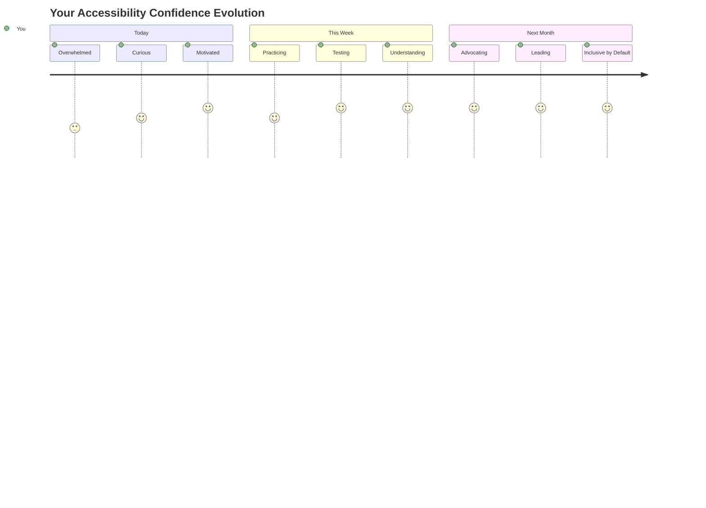

> 🌍 **你現在是一位無障礙冠軍了！** 你明白了出色的網頁體驗應該適用於每個人，無論他們如何訪問網路。你構建的每一個無障礙功能都讓互聯網變得更加包容。網路需要像你這樣的開發者，將無障礙視為創造更好用戶體驗的機會，而不是限制。歡迎加入這個運動！🎉

---

**免責聲明**：  
本文件已使用 AI 翻譯服務 [Co-op Translator](https://github.com/Azure/co-op-translator) 進行翻譯。儘管我們致力於提供準確的翻譯，請注意自動翻譯可能包含錯誤或不準確之處。原始文件的母語版本應被視為權威來源。對於關鍵資訊，建議使用專業人工翻譯。我們對因使用此翻譯而引起的任何誤解或誤釋不承擔責任。