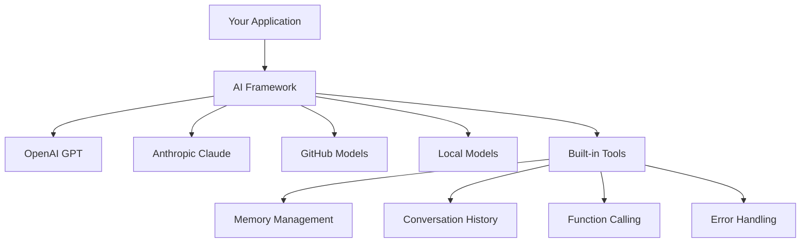
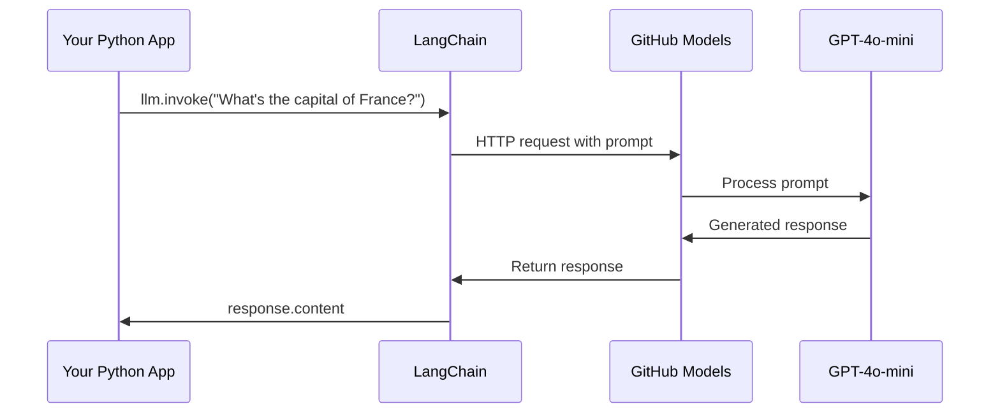
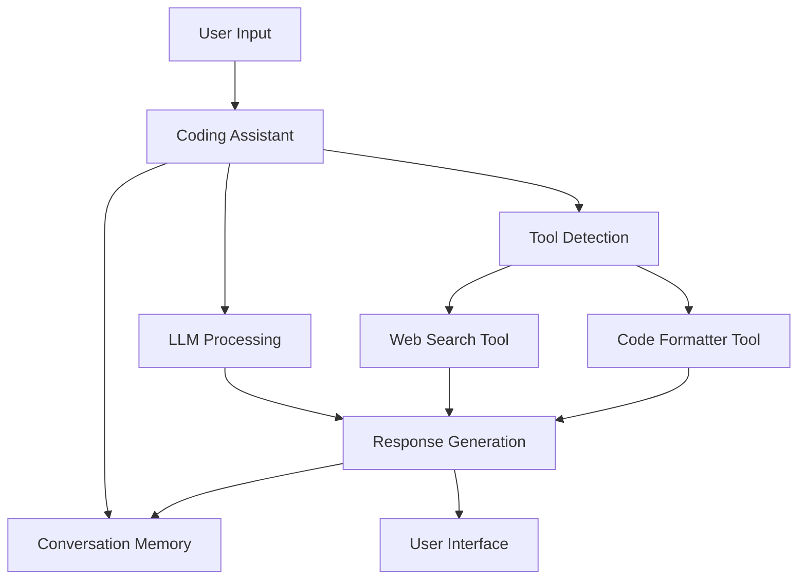
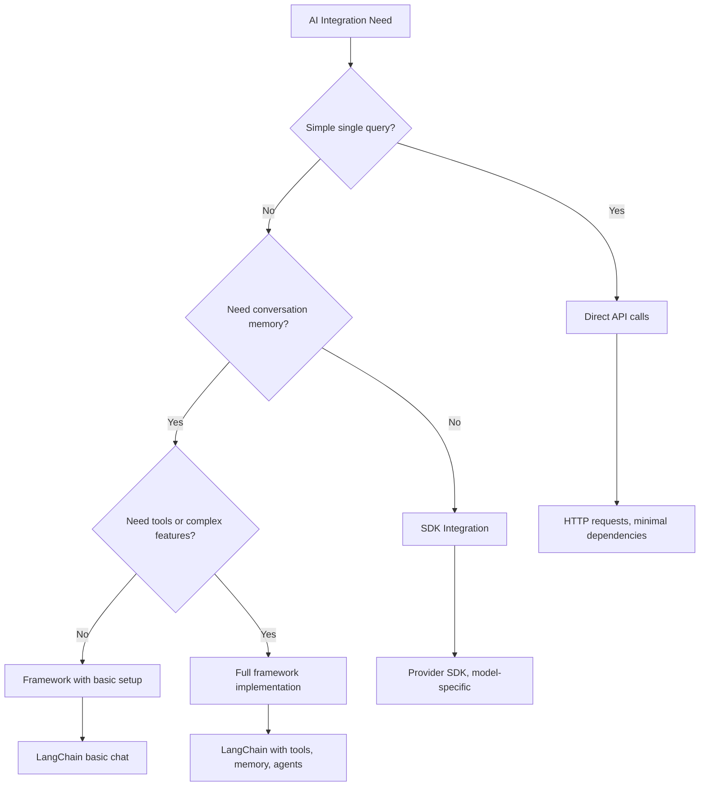

<!--
CO_OP_TRANSLATOR_METADATA:
{
  "original_hash": "e2c4ae5688e34b4b8b09d52aec56c79e",
  "translation_date": "2025-10-22T22:41:25+00:00",
  "source_file": "10-ai-framework-project/README.md",
  "language_code": "mo"
}
-->
# AI 框架

是否曾感到從零開始建立 AI 應用程式令人望而生畏？你並不孤單！AI 框架就像是 AI 開發的瑞士刀——它們是強大的工具，可以在建立智能應用程式時節省時間並減少麻煩。可以把 AI 框架想像成一個井然有序的圖書館：它提供預建的元件、標準化的 API 和智能抽象，讓你能專注於解決問題，而不是糾結於實現細節。

在這堂課中，我們將探討像 LangChain 這樣的框架如何將過去複雜的 AI 整合任務轉化為簡潔、易讀的程式碼。你將學習如何應對現實世界中的挑戰，例如追蹤對話、實現工具調用，以及通過統一介面管理不同的 AI 模型。

到課程結束時，你將了解何時應選擇使用框架而非直接 API 調用，如何有效利用框架的抽象，以及如何建立適合現實世界使用的 AI 應用程式。讓我們一起探索 AI 框架能為你的專案帶來什麼。

## 為什麼選擇框架？

你準備好建立 AI 應用程式了——太棒了！但事情是這樣的：你有幾種不同的路徑可以選擇，每種都有自己的優缺點。這有點像選擇步行、騎車或開車到某地——它們都能帶你到目的地，但過程（以及所需的努力）會完全不同。

讓我們來分解整合 AI 到專案中的三種主要方式：

| 方法 | 優點 | 最適合 | 考量 |
|------|------|--------|------|
| **直接 HTTP 請求** | 完全控制，無需依賴 | 簡單查詢，學習基礎 | 程式碼冗長，需手動處理錯誤 |
| **SDK 整合** | 減少樣板代碼，模型特定優化 | 單一模型應用程式 | 限於特定供應商 |
| **AI 框架** | 統一 API，內建抽象 | 多模型應用程式，複雜工作流程 | 學習曲線，可能過度抽象 |

### 框架的實際好處



**框架的重要性：**
- **統一**多個 AI 供應商於一個介面
- **自動處理**對話記憶
- **提供**常見任務的現成工具，例如嵌入和函數調用
- **管理**錯誤處理和重試邏輯
- **將**複雜的工作流程轉化為易讀的方法調用

> 💡 **專業提示**：當需要在不同 AI 模型之間切換或建立複雜功能（如代理、記憶或工具調用）時，使用框架。學習基礎或建立簡單、專注的應用程式時，則使用直接 API。

**結論**：就像選擇工匠的專業工具和完整的工作坊一樣，這取決於工具是否適合任務。框架在複雜、功能豐富的應用程式中表現出色，而直接 API 則適合簡單的使用情境。

## 簡介

在這堂課中，我們將學習：

- 使用常見的 AI 框架。
- 解決常見問題，例如聊天對話、工具使用、記憶和上下文。
- 利用這些知識建立 AI 應用程式。

## 你的第一個 AI 提示

讓我們從基礎開始，建立你的第一個 AI 應用程式，發送問題並獲得答案。就像阿基米德在浴缸中發現浮力原理一樣，有時最簡單的觀察能帶來最強大的洞察力——而框架讓這些洞察力變得觸手可及。

### 使用 LangChain 連接 GitHub 模型

我們將使用 LangChain 連接到 GitHub 模型，這非常棒，因為它提供了免費訪問各種 AI 模型的機會。最棒的是，你只需要一些簡單的配置參數即可開始：

```python
from langchain_openai import ChatOpenAI
import os

llm = ChatOpenAI(
    api_key=os.environ["GITHUB_TOKEN"],
    base_url="https://models.github.ai/inference",
    model="openai/gpt-4o-mini",
)

# Send a simple prompt
response = llm.invoke("What's the capital of France?")
print(response.content)
```

**讓我們來分解這裡發生的事情：**
- **建立**一個使用 `ChatOpenAI` 類的 LangChain 客戶端——這是你通往 AI 的入口！
- **配置**使用你的身份驗證令牌連接到 GitHub 模型
- **指定**要使用的 AI 模型（`gpt-4o-mini`）——可以把它想像成選擇你的 AI 助手
- **發送**你的問題，使用 `invoke()` 方法——這就是魔法發生的地方
- **提取**並顯示回應——瞧，你正在與 AI 對話！

> 🔧 **設置提示**：如果你使用 GitHub Codespaces，那麼你很幸運——`GITHUB_TOKEN` 已經為你設置好了！在本地工作？別擔心，你只需要創建一個具有正確權限的個人訪問令牌。

**預期輸出：**
```text
The capital of France is Paris.
```



## 建立對話式 AI

第一個例子展示了基礎，但它只是一次性交流——你問一個問題，得到一個答案，就結束了。在實際應用中，你希望你的 AI 記住你們討論過的內容，就像華生和福爾摩斯在調查過程中建立的對話一樣。

這就是 LangChain 特別有用的地方。它提供了不同的消息類型，幫助結構化對話，並讓你賦予 AI 一定的個性。你將建立能夠保持上下文和角色的聊天體驗。

### 理解消息類型

可以把這些消息類型想像成對話中參與者戴的不同“帽子”。LangChain 使用不同的消息類來追蹤誰在說什麼：

| 消息類型 | 目的 | 使用範例 |
|----------|------|----------|
| `SystemMessage` | 定義 AI 的個性和行為 | "你是一個樂於助人的編程助手" |
| `HumanMessage` | 代表使用者輸入 | "解釋函數如何運作" |
| `AIMessage` | 儲存 AI 回應 | 對話中的先前 AI 回應 |

### 建立你的第一個對話

讓我們建立一個對話，讓我們的 AI 扮演一個特定角色。我們將讓它化身為皮卡德艦長——一個以外交智慧和領導力著稱的角色：

```python
messages = [
    SystemMessage(content="You are Captain Picard of the Starship Enterprise"),
    HumanMessage(content="Tell me about you"),
]
```

**分解這個對話設置：**
- **通過**`SystemMessage`建立 AI 的角色和個性
- **提供**使用者的初始查詢，使用 `HumanMessage`
- **建立**多輪對話的基礎

完整的程式碼如下所示：

```python
from langchain_core.messages import HumanMessage, SystemMessage
from langchain_openai import ChatOpenAI
import os

llm = ChatOpenAI(
    api_key=os.environ["GITHUB_TOKEN"],
    base_url="https://models.github.ai/inference",
    model="openai/gpt-4o-mini",
)

messages = [
    SystemMessage(content="You are Captain Picard of the Starship Enterprise"),
    HumanMessage(content="Tell me about you"),
]


# works
response  = llm.invoke(messages)
print(response.content)
```

你應該會看到類似的結果：

```text
I am Captain Jean-Luc Picard, the commanding officer of the USS Enterprise (NCC-1701-D), a starship in the United Federation of Planets. My primary mission is to explore new worlds, seek out new life and new civilizations, and boldly go where no one has gone before. 

I believe in the importance of diplomacy, reason, and the pursuit of knowledge. My crew is diverse and skilled, and we often face challenges that test our resolve, ethics, and ingenuity. Throughout my career, I have encountered numerous species, grappled with complex moral dilemmas, and have consistently sought peaceful solutions to conflicts.

I hold the ideals of the Federation close to my heart, believing in the importance of cooperation, understanding, and respect for all sentient beings. My experiences have shaped my leadership style, and I strive to be a thoughtful and just captain. How may I assist you further?
```

為了保持對話的連續性（而不是每次都重置上下文），你需要不斷將回應添加到消息列表中。就像口述傳統保存故事一樣，這種方法建立了持久的記憶：

```python
from langchain_core.messages import HumanMessage, SystemMessage
from langchain_openai import ChatOpenAI
import os

llm = ChatOpenAI(
    api_key=os.environ["GITHUB_TOKEN"],
    base_url="https://models.github.ai/inference",
    model="openai/gpt-4o-mini",
)

messages = [
    SystemMessage(content="You are Captain Picard of the Starship Enterprise"),
    HumanMessage(content="Tell me about you"),
]


# works
response  = llm.invoke(messages)

print(response.content)

print("---- Next ----")

messages.append(response)
messages.append(HumanMessage(content="Now that I know about you, I'm Chris, can I be in your crew?"))

response  = llm.invoke(messages)

print(response.content)

```

很酷吧？這裡發生的事情是，我們調用了 LLM 兩次——第一次只有初始的兩條消息，然後再次調用完整的對話歷史。就像 AI 真正跟隨著我們的聊天一樣！

當你運行這段程式碼時，你會得到第二個回應，聽起來像是：

```text
Welcome aboard, Chris! It's always a pleasure to meet those who share a passion for exploration and discovery. While I cannot formally offer you a position on the Enterprise right now, I encourage you to pursue your aspirations. We are always in need of talented individuals with diverse skills and backgrounds. 

If you are interested in space exploration, consider education and training in the sciences, engineering, or diplomacy. The values of curiosity, resilience, and teamwork are crucial in Starfleet. Should you ever find yourself on a starship, remember to uphold the principles of the Federation: peace, understanding, and respect for all beings. Your journey can lead you to remarkable adventures, whether in the stars or on the ground. Engage!
```

我會把這當作一個可能的答案 ;)

## 流式回應

是否注意到 ChatGPT 似乎在即時“打字”它的回應？這就是流式處理的作用。就像看著熟練的書法家工作——看到字符逐筆出現，而不是瞬間完成——流式處理讓互動感覺更自然，並提供即時反饋。

### 使用 LangChain 實現流式處理

```python
from langchain_openai import ChatOpenAI
import os

llm = ChatOpenAI(
    api_key=os.environ["GITHUB_TOKEN"],
    base_url="https://models.github.ai/inference",
    model="openai/gpt-4o-mini",
    streaming=True
)

# Stream the response
for chunk in llm.stream("Write a short story about a robot learning to code"):
    print(chunk.content, end="", flush=True)
```

**流式處理的好處：**
- **顯示**內容正在生成——不再尷尬地等待！
- **讓**使用者感覺事情正在發生
- **感覺**更快，即使技術上並非如此
- **讓**使用者在 AI 還在“思考”時開始閱讀

> 💡 **使用者體驗提示**：流式處理在處理較長的回應（如程式碼解釋、創意寫作或詳細教程）時表現尤佳。你的使用者會喜歡看到進度，而不是盯著空白螢幕！

## 提示模板

提示模板就像古典演講中使用的修辭結構——想想西塞羅如何根據不同的聽眾調整他的演講模式，同時保持相同的說服框架。它們讓你建立可重用的提示，能在不重新編寫的情況下替換不同的信息。設置好模板後，只需用所需的值填充變數即可。

### 建立可重用的提示

```python
from langchain_core.prompts import ChatPromptTemplate

# Define a template for code explanations
template = ChatPromptTemplate.from_messages([
    ("system", "You are an expert programming instructor. Explain concepts clearly with examples."),
    ("human", "Explain {concept} in {language} with a practical example for {skill_level} developers")
])

# Use the template with different values
questions = [
    {"concept": "functions", "language": "JavaScript", "skill_level": "beginner"},
    {"concept": "classes", "language": "Python", "skill_level": "intermediate"},
    {"concept": "async/await", "language": "JavaScript", "skill_level": "advanced"}
]

for question in questions:
    prompt = template.format_messages(**question)
    response = llm.invoke(prompt)
    print(f"Topic: {question['concept']}\n{response.content}\n---\n")
```

**你會喜歡使用模板的原因：**
- **保持**你的提示在整個應用程式中一致
- **不再需要**混亂的字串拼接——只有乾淨、簡單的變數
- **你的 AI**行為可預測，因為結構保持不變
- **更新**變得輕而易舉——只需更改一次模板，所有地方都會同步更新

## 結構化輸出

是否曾因為 AI 回應是非結構化文本而感到沮喪？結構化輸出就像教你的 AI 遵循林奈用於生物分類的系統方法——有組織、可預測且易於使用。你可以請求 JSON、特定的數據結構或任何你需要的格式。

### 定義輸出架構

```python
from langchain_core.prompts import ChatPromptTemplate
from langchain_core.output_parsers import JsonOutputParser
from pydantic import BaseModel, Field

class CodeReview(BaseModel):
    score: int = Field(description="Code quality score from 1-10")
    strengths: list[str] = Field(description="List of code strengths")
    improvements: list[str] = Field(description="List of suggested improvements")
    overall_feedback: str = Field(description="Summary feedback")

# Set up the parser
parser = JsonOutputParser(pydantic_object=CodeReview)

# Create prompt with format instructions
prompt = ChatPromptTemplate.from_messages([
    ("system", "You are a code reviewer. {format_instructions}"),
    ("human", "Review this code: {code}")
])

# Format the prompt with instructions
chain = prompt | llm | parser

# Get structured response
code_sample = """
def calculate_average(numbers):
    return sum(numbers) / len(numbers)
"""

result = chain.invoke({
    "code": code_sample,
    "format_instructions": parser.get_format_instructions()
})

print(f"Score: {result['score']}")
print(f"Strengths: {', '.join(result['strengths'])}")
```

**結構化輸出的優勢：**
- **不再需要**猜測回應的格式——每次都一致
- **直接**插入你的資料庫和 API，無需額外工作
- **捕捉**奇怪的 AI 回應，避免破壞你的應用程式
- **讓**你的程式碼更乾淨，因為你確切知道自己在處理什麼

## 工具調用

現在我們來到最強大的功能之一：工具。這是你賦予 AI 除了對話之外的實際能力的方式。就像中世紀的行會為特定工藝開發專門工具一樣，你可以為你的 AI 配備專門的工具。你描述可用的工具，當有人提出匹配的請求時，你的 AI 就能採取行動。

### 使用 Python

讓我們添加一些工具，如下所示：

```python
from typing_extensions import Annotated, TypedDict

class add(TypedDict):
    """Add two integers."""

    # Annotations must have the type and can optionally include a default value and description (in that order).
    a: Annotated[int, ..., "First integer"]
    b: Annotated[int, ..., "Second integer"]

tools = [add]

functions = {
    "add": lambda a, b: a + b
}
```

這裡發生了什麼？我們正在為名為 `add` 的工具創建一個藍圖。通過繼承 `TypedDict` 並使用那些高級的 `Annotated` 類型為 `a` 和 `b`，我們為 LLM 提供了這個工具的清晰描述以及它需要的內容。`functions` 字典就像我們的工具箱——它告訴程式碼當 AI 決定使用特定工具時該做什麼。

接下來讓我們看看如何使用這個工具調用 LLM：

```python
llm = ChatOpenAI(
    api_key=os.environ["GITHUB_TOKEN"],
    base_url="https://models.github.ai/inference",
    model="openai/gpt-4o-mini",
)

llm_with_tools = llm.bind_tools(tools)
```

這裡我們使用 `bind_tools` 方法將工具陣列綁定到 LLM，從而使新的 LLM `llm_with_tools` 獲得這些工具的知識。

要使用這個新的 LLM，我們可以輸入以下程式碼：

```python
query = "What is 3 + 12?"

res = llm_with_tools.invoke(query)
if(res.tool_calls):
    for tool in res.tool_calls:
        print("TOOL CALL: ", functions[tool["name"]](../../../10-ai-framework-project/**tool["args"]))
print("CONTENT: ",res.content)
```

現在，我們在這個具有工具的 LLM 上調用 `invoke`，可能會看到屬性 `tool_calls` 被填充。如果是這樣，任何被識別的工具都會有 `name` 和 `args` 屬性，標識應調用的工具及其參數。完整程式碼如下：

```python
from langchain_core.messages import HumanMessage, SystemMessage
from langchain_openai import ChatOpenAI
import os
from typing_extensions import Annotated, TypedDict

class add(TypedDict):
    """Add two integers."""

    # Annotations must have the type and can optionally include a default value and description (in that order).
    a: Annotated[int, ..., "First integer"]
    b: Annotated[int, ..., "Second integer"]

tools = [add]

functions = {
    "add": lambda a, b: a + b
}

llm = ChatOpenAI(
    api_key=os.environ["GITHUB_TOKEN"],
    base_url="https://models.github.ai/inference",
    model="openai/gpt-4o-mini",
)

llm_with_tools = llm.bind_tools(tools)

query = "What is 3 + 12?"

res = llm_with_tools.invoke(query)
if(res.tool_calls):
    for tool in res.tool_calls:
        print("TOOL CALL: ", functions[tool["name"]](../../../10-ai-framework-project/**tool["args"]))
print("CONTENT: ",res.content)
```

運行這段程式碼，你應該會看到類似的輸出：

```text
TOOL CALL:  15
CONTENT: 
```

AI 分析了 "What is 3 + 12"，並將其識別為 `add` 工具的任務。就像熟練的圖書管理員根據問題類型知道該查閱哪個參考資料一樣，它根據工具的名稱、描述和字段規範做出了這一判斷。結果 15 來自我們的 `functions` 字典執行工具：

```python
print("TOOL CALL: ", functions[tool["name"]](../../../10-ai-framework-project/**tool["args"]))
```

### 一個更有趣的工具：調用網路 API

加法演示了這個概念，但真正的工具通常執行更複雜的操作，例如調用網路 API。讓我們擴展示例，讓 AI 從網路獲取內容——類似於電報操作員曾經連接遠程地點的方式：

```python
class joke(TypedDict):
    """Tell a joke."""

    # Annotations must have the type and can optionally include a default value and description (in that order).
    category: Annotated[str, ..., "The joke category"]

def get_joke(category: str) -> str:
    response = requests.get(f"https://api.chucknorris.io/jokes/random?category={category}", headers={"Accept": "application/json"})
    if response.status_code == 200:
        return response.json().get("value", f"Here's a {category} joke!")
    return f"Here's a {category} joke!"

functions = {
    "add": lambda a, b: a + b,
    "joke": lambda category: get_joke(category)
}

query = "Tell me a joke about animals"

# the rest of the code is the same
```

現在，如果你運行這段程式碼，你會得到類似以下的回應：

```text
TOOL CALL:  Chuck Norris once rode a nine foot grizzly bear through an automatic car wash, instead of taking a shower.
CONTENT:  
```

以下是完整程式碼：

```python
from langchain_openai import ChatOpenAI
import requests
import os
from typing_extensions import Annotated, TypedDict

class add(TypedDict):
    """Add two integers."""

    # Annotations must have the type and can optionally include a default value and description (in that order).
    a: Annotated[int, ..., "First integer"]
    b: Annotated[int, ..., "Second integer"]

class joke(TypedDict):
    """Tell a joke."""

    # Annotations must have the type and can optionally include a default value and description (in that order).
    category: Annotated[str, ..., "The joke category"]

tools = [add, joke]

def get_joke(category: str) -> str:
    response = requests.get(f"https://api.chucknorris.io/jokes/random?category={category}", headers={"Accept": "application/json"})
    if response.status_code == 200:
        return response.json().get("value", f"Here's a {category} joke!")
    return f"Here's a {category} joke!"

functions = {
    "add": lambda a, b: a + b,
    "joke": lambda category: get_joke(category)
}

llm = ChatOpenAI(
    api_key=os.environ["GITHUB_TOKEN"],
    base_url="https://models.github.ai/inference",
    model="openai/gpt-4o-mini",
)

llm_with_tools = llm.bind_tools(tools)

query = "Tell me a joke about animals"

res = llm_with_tools.invoke(query)
if(res.tool_calls):
    for tool in res.tool_calls:
        # print("TOOL CALL: ", tool)
        print("TOOL CALL: ", functions[tool["name"]](../../../10-ai-framework-project/**tool["args"]))
print("CONTENT: ",res.content)
```

## 嵌入和文檔處理

嵌入是現代 AI 中最優雅的解決方案之一。想像一下，如果你可以將任何文本轉換為捕捉其含義的數值坐標。這正是嵌入所做的——它們將文本轉化為多維空間中的點，其中相似的概念聚集在一起。這就像擁有一個思想的坐標系，讓人聯想到門捷列夫如何根據原子性質組織元素週期表。

### 創建和使用嵌入

```python
from langchain_openai import OpenAIEmbeddings
from langchain_community.vectorstores import FAISS
from langchain_community.document_loaders import TextLoader
from langchain.text_splitter import CharacterTextSplitter

# Initialize embeddings
embeddings = OpenAIEmbeddings(
    api_key=os.environ["GITHUB_TOKEN"],
    base_url="https://models.github.ai/inference",
    model="text-embedding-3-small"
)

# Load and split documents
loader = TextLoader("documentation.txt")
documents = loader.load()

text_splitter = CharacterTextSplitter(chunk_size=1000, chunk_overlap=0)
texts = text_splitter.split_documents(documents)

# Create vector store
vectorstore = FAISS.from_documents(texts, embeddings)

# Perform similarity search
query = "How do I handle user authentication?"
similar_docs = vectorstore.similarity_search(query, k=3)

for doc in similar_docs:
    print(f"Relevant content: {doc.page_content[:200]}...")
```

### 各種格式的文檔加載器

```python
from langchain_community.document_loaders import (
    PyPDFLoader,
    CSVLoader,
    JSONLoader,
    WebBaseLoader
)

# Load different document types
pdf_loader = PyPDFLoader("manual.pdf")
csv_loader = CSVLoader("data.csv")
json_loader = JSONLoader("config.json")
web_loader = WebBaseLoader("https://example.com/docs")

# Process all documents
all_documents = []
for loader in [pdf_loader, csv_loader, json_loader, web_loader]:
    docs = loader.load()
    all_documents.extend(docs)
```

**嵌入的用途：**
- **建立**真正理解你意思的搜索，而不僅僅是關鍵字匹配
- **創建**能回答有關文檔問題的 AI
- **製作**推薦系統，提供真正相關的內容
- **自動**組織和分類你的內容

## 建立完整的 AI 應用程式

現在我們將整合你所學的一切，製作一個綜合應用程式——一個能回答問題、使用工具並保持對話記憶的編程助手。就像印刷機結合了現有技術（活字、墨水、紙張和壓力）成為一個變革性的工具一樣，我們將結合我們的 AI 元件，創造出實用且有用的東西。

### 完整應用程式示例

```python
from langchain_openai import ChatOpenAI, OpenAIEmbeddings
from langchain_core.prompts import ChatPromptTemplate
from langchain_core.messages import HumanMessage, SystemMessage, AIMessage
from langchain_community.vectorstores import FAISS
from typing_extensions import Annotated, TypedDict
import os
import requests

class CodingAssistant:
    def __init__(self):
        self.llm = ChatOpenAI(
            api_key=os.environ["GITHUB_TOKEN"],
            base_url="https://models.github.ai/inference",
            model="openai/gpt-4o-mini"
        )
        
        self.conversation_history = [
            SystemMessage(content="""You are an expert coding assistant. 
            Help users learn programming concepts, debug code, and write better software.
            Use tools when needed and maintain a helpful, encouraging tone.""")
        ]
        
        # Define tools
        self.setup_tools()
    
    def setup_tools(self):
        class web_search(TypedDict):
            """Search for programming documentation or examples."""
            query: Annotated[str, "Search query for programming help"]
        
        class code_formatter(TypedDict):
            """Format and validate code snippets."""
            code: Annotated[str, "Code to format"]
            language: Annotated[str, "Programming language"]
        
        self.tools = [web_search, code_formatter]
        self.llm_with_tools = self.llm.bind_tools(self.tools)
    
    def chat(self, user_input: str):
        # Add user message to conversation
        self.conversation_history.append(HumanMessage(content=user_input))
        
        # Get AI response
        response = self.llm_with_tools.invoke(self.conversation_history)
        
        # Handle tool calls if any
        if response.tool_calls:
            for tool_call in response.tool_calls:
                tool_result = self.execute_tool(tool_call)
                print(f"🔧 Tool used: {tool_call['name']}")
                print(f"📊 Result: {tool_result}")
        
        # Add AI response to conversation
        self.conversation_history.append(response)
        
        return response.content
    
    def execute_tool(self, tool_call):
        tool_name = tool_call['name']
        args = tool_call['args']
        
        if tool_name == 'web_search':
            return f"Found documentation for: {args['query']}"
        elif tool_name == 'code_formatter':
            return f"Formatted {args['language']} code: {args['code'][:50]}..."
        
        return "Tool execution completed"

# Usage example
assistant = CodingAssistant()

print("🤖 Coding Assistant Ready! Type 'quit' to exit.\n")

while True:
    user_input = input("You: ")
    if user_input.lower() == 'quit':
        break
    
    response = assistant.chat(user_input)
    print(f"🤖 Assistant: {response}\n")
```

**應用程式架構：**



**我們實現的主要功能：**
- **記住**整個對話，保持上下文連續性
- **通過工具調用**執行操作，而不僅僅是對話
- **遵循**可預測的交互模式
- **自動管理**錯誤處理和複雜工作流程

## 作業：建立你自己的 AI 驅動學習助手

**目標**：創建一個 AI 應用程式，幫助學生學習編程概念，提供解釋、程式碼示例和互動測驗。

### 要求

**核心功能（必須）：**
1. **對話介面**：實現一個聊天系統，能在多個問題中保持上下文
2. **教育工具**：創建至少兩個幫助學習的工具：
   - 程式碼解釋工具
   - 概念測驗生成器
3. **個人化學習**：使用系統消息來根據不同的技能水平調整回應  
4. **回應格式化**：為測驗問題實現結構化輸出  

### 實施步驟  

**步驟 1：設置您的環境**  
```bash
pip install langchain langchain-openai
```
  
**步驟 2：基本聊天功能**  
- 創建一個 `StudyAssistant` 類別  
- 實現對話記憶功能  
- 添加教育支持的個性化配置  

**步驟 3：添加教育工具**  
- **代碼解釋器**：將代碼分解為易於理解的部分  
- **測驗生成器**：創建有關程式設計概念的問題  
- **進度追蹤器**：追蹤已覆蓋的主題  

**步驟 4：增強功能（可選）**  
- 實現流式回應以提升用戶體驗  
- 添加文件加載功能以整合課程材料  
- 創建嵌入以基於相似性檢索內容  

### 評估標準  

| 功能 | 優秀 (4) | 良好 (3) | 合格 (2) | 需要改進 (1) |  
|------|----------|----------|----------|-------------|  
| **對話流暢性** | 自然、上下文感知的回應 | 良好的上下文保留 | 基本對話 | 無交換間的記憶 |  
| **工具整合** | 多個有用工具無縫運作 | 正確實現 2 個以上工具 | 1-2 個基本工具 | 工具無法運作 |  
| **代碼質量** | 乾淨、文檔齊全、錯誤處理完善 | 結構良好，有部分文檔 | 基本功能正常 | 結構差，無錯誤處理 |  
| **教育價值** | 對學習真正有幫助，具適應性 | 良好的學習支持 | 基本解釋 | 教育價值有限 |  

### 示例代碼結構  

```python
class StudyAssistant:
    def __init__(self, skill_level="beginner"):
        # Initialize LLM, tools, and conversation memory
        pass
    
    def explain_code(self, code, language):
        # Tool: Explain how code works
        pass
    
    def generate_quiz(self, topic, difficulty):
        # Tool: Create practice questions
        pass
    
    def chat(self, user_input):
        # Main conversation interface
        pass

# Example usage
assistant = StudyAssistant(skill_level="intermediate")
response = assistant.chat("Explain how Python functions work")
```
  
**額外挑戰：**  
- 添加語音輸入/輸出功能  
- 使用 Streamlit 或 Flask 實現網頁界面  
- 使用嵌入技術從課程材料中創建知識庫  
- 添加進度追蹤和個人化學習路徑  

## 總結  

🎉 現在您已掌握 AI 框架開發的基礎，並學會如何使用 LangChain 構建複雜的 AI 應用。就像完成了一次全面的學徒訓練，您已經獲得了豐富的技能工具包。讓我們回顧一下您所取得的成就。  

### 您學到了什麼  

**核心框架概念：**  
- **框架的好處**：了解何時選擇框架而不是直接使用 API  
- **LangChain 基礎**：設置和配置 AI 模型連接  
- **消息類型**：使用 `SystemMessage`、`HumanMessage` 和 `AIMessage` 進行結構化對話  

**高級功能：**  
- **工具調用**：創建和整合自定義工具以增強 AI 功能  
- **對話記憶**：在多次對話中保持上下文  
- **流式回應**：實現實時回應交付  
- **提示模板**：構建可重用的動態提示  
- **結構化輸出**：確保一致且可解析的 AI 回應  
- **嵌入技術**：創建語義搜索和文檔處理功能  

**實際應用：**  
- **構建完整應用**：將多個功能結合到可投入生產的應用中  
- **錯誤處理**：實現穩健的錯誤管理和驗證  
- **工具整合**：創建擴展 AI 功能的自定義工具  

### 關鍵要點  

> 🎯 **記住**：像 LangChain 這樣的 AI 框架基本上是您隱藏複雜性、功能豐富的最佳夥伴。當您需要對話記憶、工具調用或希望在多個 AI 模型之間工作而不失去理智時，它們是完美的選擇。  

**AI 整合的決策框架：**  


  
### 接下來的方向  

**立即開始構建：**  
- 利用這些概念，創建一些讓您感到興奮的東西！  
- 通過 LangChain 嘗試不同的 AI 模型——就像擁有一個 AI 模型的遊樂場  
- 創建能解決您工作或項目中實際問題的工具  

**準備好邁向下一個層次？**  
- **AI 代理**：構建能夠自主計劃和執行複雜任務的 AI 系統  
- **RAG（檢索增強生成）**：將 AI 與您自己的知識庫結合，打造超強應用  
- **多模態 AI**：同時處理文本、圖像和音頻——可能性無窮無盡！  
- **生產部署**：學習如何擴展您的 AI 應用並在現實世界中監控它們  

**加入社群：**  
- LangChain 社群是保持最新資訊和學習最佳實踐的絕佳途徑  
- GitHub Models 為您提供尖端的 AI 功能——非常適合進行實驗  
- 不斷嘗試不同的使用案例——每個項目都會教您一些新東西  

您現在擁有了構建智能對話應用的知識，這些應用可以幫助人們解決實際問題。就像文藝復興時期的工匠將藝術視野與技術技能相結合一樣，您現在可以將 AI 能力與實際應用相融合。問題是：您會創造什麼？🚀  

## GitHub Copilot Agent 挑戰 🚀  

使用代理模式完成以下挑戰：  

**描述：** 構建一個高級 AI 驅動的代碼審查助手，結合多個 LangChain 功能，包括工具調用、結構化輸出和對話記憶，為代碼提交提供全面的反饋。  

**提示：** 創建一個 CodeReviewAssistant 類別，實現以下功能：  
1. 一個分析代碼複雜性並提出改進建議的工具  
2. 一個檢查代碼是否符合最佳實踐的工具  
3. 使用 Pydantic 模型進行結構化輸出，以確保一致的審查格式  
4. 對話記憶功能，用於追蹤審查會話  
5. 一個主聊天界面，可以處理代碼提交並提供詳細的可操作反饋  

該助手應能審查多種程式語言的代碼，在會話中保持多次代碼提交的上下文，並提供摘要評分和詳細的改進建議。  

了解更多 [代理模式](https://code.visualstudio.com/blogs/2025/02/24/introducing-copilot-agent-mode)。  

---

**免責聲明**：  
本文件已使用 AI 翻譯服務 [Co-op Translator](https://github.com/Azure/co-op-translator) 進行翻譯。儘管我們努力確保翻譯的準確性，但請注意，自動翻譯可能包含錯誤或不準確之處。原始文件的母語版本應被視為權威來源。對於關鍵信息，建議使用專業人工翻譯。我們對因使用此翻譯而引起的任何誤解或誤釋不承擔責任。