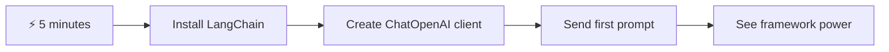
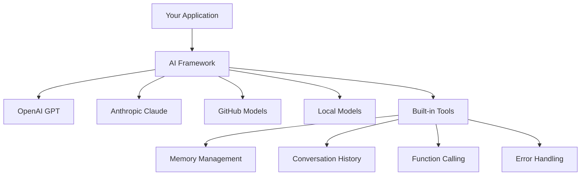
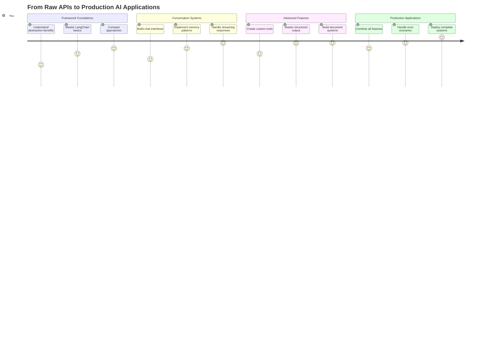
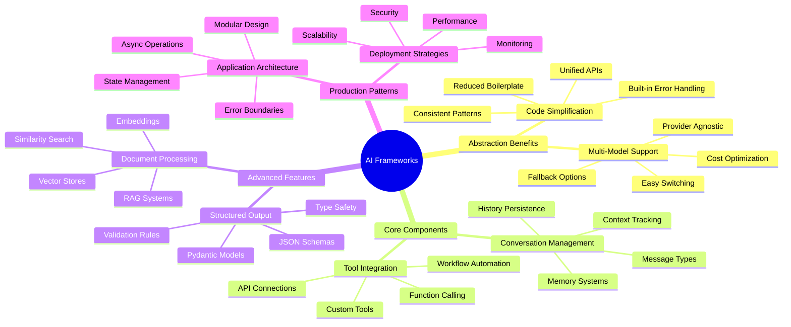
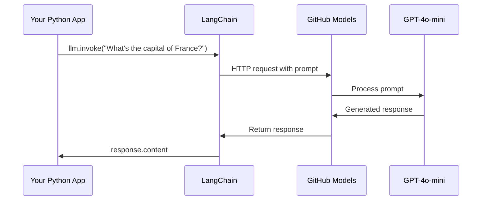
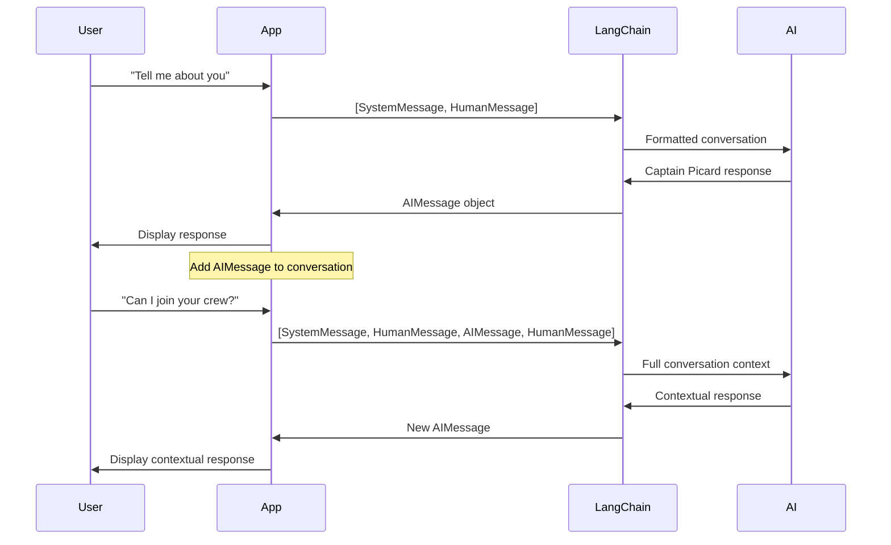
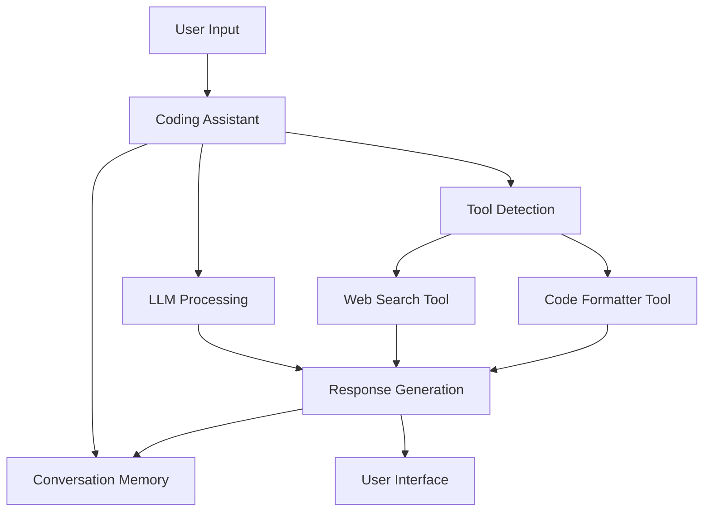
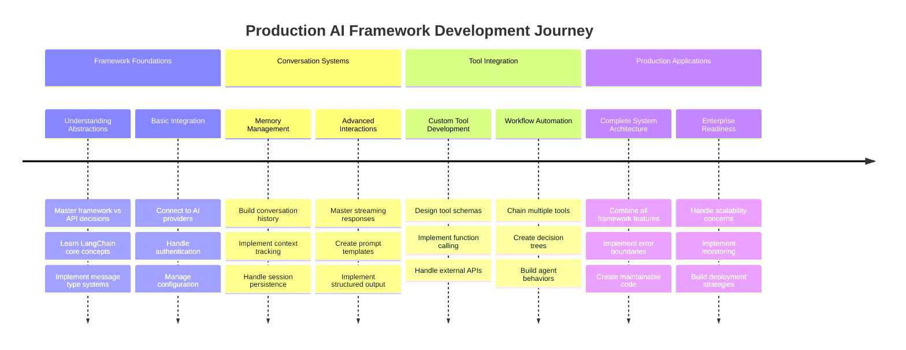
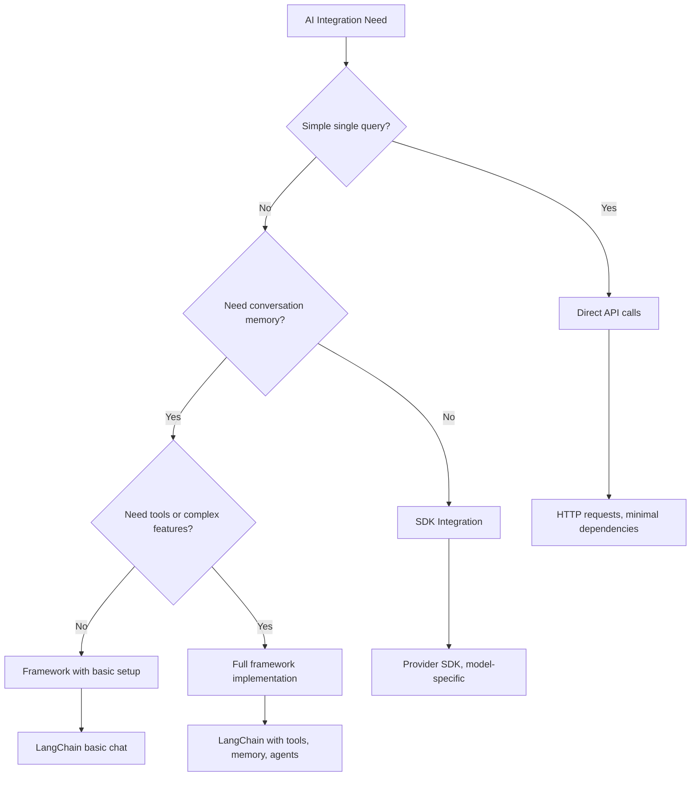

<!--
CO_OP_TRANSLATOR_METADATA:
{
  "original_hash": "3925b6a1c31c60755eaae4d578232c25",
  "translation_date": "2025-11-03T23:41:57+00:00",
  "source_file": "10-ai-framework-project/README.md",
  "language_code": "mo"
}
-->
# AI 框架

是否曾感到在從零開始構建 AI 應用程式時感到不知所措？你並不孤單！AI 框架就像是 AI 開發的瑞士刀——它們是強大的工具，可以在構建智能應用程式時節省時間和減少麻煩。可以將 AI 框架想像成一個井然有序的圖書館：它提供預建的組件、標準化的 API 和智能抽象，讓你可以專注於解決問題，而不是糾結於實現細節。

在本課程中，我們將探討像 LangChain 這樣的框架如何將過去複雜的 AI 整合任務轉化為簡潔、易讀的代碼。你將學習如何應對現實世界中的挑戰，例如跟蹤對話、實現工具調用，以及通過統一的介面管理不同的 AI 模型。

到課程結束時，你將了解何時應選擇使用框架而不是直接 API 調用，如何有效地使用框架的抽象功能，以及如何構建適合現實世界使用的 AI 應用程式。讓我們一起探索 AI 框架能為你的項目帶來什麼。

## ⚡ 接下來 5 分鐘內你可以做什麼

**忙碌開發者的快速入門路徑**



- **第 1 分鐘**：安裝 LangChain：`pip install langchain langchain-openai`
- **第 2 分鐘**：設置你的 GitHub token 並導入 ChatOpenAI 客戶端
- **第 3 分鐘**：使用系統和人類消息創建一個簡單的對話
- **第 4 分鐘**：添加一個基本工具（例如加法函數）並體驗 AI 工具調用
- **第 5 分鐘**：體驗原始 API 調用與框架抽象之間的差異

**快速測試代碼**：
```python
from langchain_openai import ChatOpenAI
from langchain_core.messages import SystemMessage, HumanMessage

llm = ChatOpenAI(
    api_key=os.environ["GITHUB_TOKEN"],
    base_url="https://models.github.ai/inference",
    model="openai/gpt-4o-mini"
)

response = llm.invoke([
    SystemMessage(content="You are a helpful coding assistant"),
    HumanMessage(content="Explain Python functions briefly")
])
print(response.content)
```

**為什麼這很重要**：在 5 分鐘內，你將體驗到 AI 框架如何將複雜的 AI 整合轉化為簡單的方法調用。這是支持生產級 AI 應用程式的基礎。

## 為什麼選擇框架？

你準備好構建 AI 應用程式了——太棒了！但事情是這樣的：你有幾種不同的路徑可以選擇，每種都有自己的優缺點。這有點像選擇步行、騎自行車或開車到達某地——它們都能讓你到達目的地，但體驗（和努力程度）會完全不同。

讓我們來分解一下你可以將 AI 整合到項目中的三種主要方式：

| 方法 | 優勢 | 最適合 | 注意事項 |
|------|------|--------|----------|
| **直接 HTTP 請求** | 完全控制，無需依賴 | 簡單查詢，學習基礎知識 | 代碼冗長，需要手動處理錯誤 |
| **SDK 整合** | 減少樣板代碼，模型特定優化 | 單一模型應用程式 | 僅限於特定提供商 |
| **AI 框架** | 統一 API，內建抽象 | 多模型應用程式，複雜工作流 | 學習曲線，可能過度抽象 |

### 框架在實踐中的優勢



**為什麼框架很重要**：
- **統一**多個 AI 提供商於一個介面
- **自動處理**對話記憶
- **提供**嵌入和函數調用等常見任務的現成工具
- **管理**錯誤處理和重試邏輯
- **將**複雜的工作流轉化為易讀的方法調用

> 💡 **專業提示**：當需要在不同的 AI 模型之間切換或構建代理、記憶或工具調用等複雜功能時，使用框架。學習基礎知識或構建簡單、專注的應用程式時，則使用直接 API。

**總結**：就像選擇工匠的專業工具和完整的工作坊一樣，這取決於工具是否匹配任務。框架在構建複雜、功能豐富的應用程式方面表現出色，而直接 API 則適合簡單的使用場景。

## 🗺️ AI 框架掌握學習之旅



**你的學習目標**：到本課程結束時，你將掌握 AI 框架開發，並能構建媲美商業 AI 助手的高級生產級 AI 應用程式。

## 介紹

在本課程中，我們將學習：

- 使用常見的 AI 框架。
- 解決常見問題，例如聊天對話、工具使用、記憶和上下文。
- 利用這些知識構建 AI 應用程式。

## 🧠 AI 框架開發生態系統



**核心原則**：AI 框架抽象了複雜性，同時提供強大的抽象功能，用於對話管理、工具整合和文檔處理，使開發者能夠使用簡潔、可維護的代碼構建高級 AI 應用程式。

## 你的第一個 AI 提示

讓我們從基礎開始，創建你的第一個 AI 應用程式，發送一個問題並獲得答案。就像阿基米德在浴缸中發現浮力原理一樣，有時最簡單的觀察會帶來最強大的洞察力——框架讓這些洞察力變得觸手可及。

### 使用 LangChain 設置 GitHub 模型

我們將使用 LangChain 連接到 GitHub 模型，這非常棒，因為它讓你可以免費訪問各種 AI 模型。最棒的是？你只需要一些簡單的配置參數即可開始：

```python
from langchain_openai import ChatOpenAI
import os

llm = ChatOpenAI(
    api_key=os.environ["GITHUB_TOKEN"],
    base_url="https://models.github.ai/inference",
    model="openai/gpt-4o-mini",
)

# Send a simple prompt
response = llm.invoke("What's the capital of France?")
print(response.content)
```

**讓我們來分解一下這裡發生了什麼**：
- **創建**一個使用 `ChatOpenAI` 類的 LangChain 客戶端——這是你的 AI 門戶！
- **配置**與 GitHub 模型的連接，使用你的身份驗證 token
- **指定**要使用的 AI 模型（`gpt-4o-mini`）——可以將其視為選擇你的 AI 助手
- **發送**你的問題，使用 `invoke()` 方法——這就是魔法發生的地方
- **提取**並顯示響應——瞧，你正在與 AI 聊天！

> 🔧 **設置提示**：如果你使用 GitHub Codespaces，那麼 `GITHUB_TOKEN` 已經為你設置好了！在本地工作？不用擔心，你只需要創建一個具有正確權限的個人訪問 token。

**預期輸出**：
```text
The capital of France is Paris.
```



## 構建對話式 AI

第一個示例展示了基礎，但它只是單次交換——你問一個問題，得到一個答案，就結束了。在實際應用中，你希望你的 AI 記住你一直在討論的內容，就像華生和福爾摩斯在調查對話中逐步建立的那樣。

這就是 LangChain 特別有用的地方。它提供了不同的消息類型，幫助結構化對話，並讓你賦予 AI 一個個性。你將構建能夠保持上下文和角色的聊天體驗。

### 理解消息類型

可以將這些消息類型想像成參與者在對話中戴的不同“帽子”。LangChain 使用不同的消息類來跟蹤誰在說什麼：

| 消息類型 | 目的 | 示例用例 |
|----------|------|----------|
| `SystemMessage` | 定義 AI 的個性和行為 | "你是一個樂於助人的編程助手" |
| `HumanMessage` | 代表用戶輸入 | "解釋函數如何工作" |
| `AIMessage` | 存儲 AI 的回應 | 對話中的先前 AI 回應 |

### 創建你的第一個對話

讓我們創建一個對話，讓 AI 扮演一個特定角色。我們將讓它化身為皮卡德艦長——一個以外交智慧和領導力著稱的角色：

```python
messages = [
    SystemMessage(content="You are Captain Picard of the Starship Enterprise"),
    HumanMessage(content="Tell me about you"),
]
```

**分解這個對話設置**：
- **通過** `SystemMessage` 建立 AI 的角色和個性
- **提供**初始用戶查詢，通過 `HumanMessage`
- **創建**多輪對話的基礎

此示例的完整代碼如下所示：

```python
from langchain_core.messages import HumanMessage, SystemMessage
from langchain_openai import ChatOpenAI
import os

llm = ChatOpenAI(
    api_key=os.environ["GITHUB_TOKEN"],
    base_url="https://models.github.ai/inference",
    model="openai/gpt-4o-mini",
)

messages = [
    SystemMessage(content="You are Captain Picard of the Starship Enterprise"),
    HumanMessage(content="Tell me about you"),
]


# works
response  = llm.invoke(messages)
print(response.content)
```

你應該會看到類似的結果：

```text
I am Captain Jean-Luc Picard, the commanding officer of the USS Enterprise (NCC-1701-D), a starship in the United Federation of Planets. My primary mission is to explore new worlds, seek out new life and new civilizations, and boldly go where no one has gone before. 

I believe in the importance of diplomacy, reason, and the pursuit of knowledge. My crew is diverse and skilled, and we often face challenges that test our resolve, ethics, and ingenuity. Throughout my career, I have encountered numerous species, grappled with complex moral dilemmas, and have consistently sought peaceful solutions to conflicts.

I hold the ideals of the Federation close to my heart, believing in the importance of cooperation, understanding, and respect for all sentient beings. My experiences have shaped my leadership style, and I strive to be a thoughtful and just captain. How may I assist you further?
```

為了保持對話連續性（而不是每次重置上下文），你需要不斷將回應添加到消息列表中。就像口述傳統保存了跨世代的故事一樣，這種方法建立了持久的記憶：

```python
from langchain_core.messages import HumanMessage, SystemMessage
from langchain_openai import ChatOpenAI
import os

llm = ChatOpenAI(
    api_key=os.environ["GITHUB_TOKEN"],
    base_url="https://models.github.ai/inference",
    model="openai/gpt-4o-mini",
)

messages = [
    SystemMessage(content="You are Captain Picard of the Starship Enterprise"),
    HumanMessage(content="Tell me about you"),
]


# works
response  = llm.invoke(messages)

print(response.content)

print("---- Next ----")

messages.append(response)
messages.append(HumanMessage(content="Now that I know about you, I'm Chris, can I be in your crew?"))

response  = llm.invoke(messages)

print(response.content)

```

很酷吧？這裡發生的事情是我們調用了 LLM 兩次——第一次僅使用我們的初始兩條消息，然後再次使用完整的對話歷史。就像 AI 真正跟隨著我們的聊天一樣！

當你運行此代碼時，你會得到第二個回應，聽起來像：

```text
Welcome aboard, Chris! It's always a pleasure to meet those who share a passion for exploration and discovery. While I cannot formally offer you a position on the Enterprise right now, I encourage you to pursue your aspirations. We are always in need of talented individuals with diverse skills and backgrounds. 

If you are interested in space exploration, consider education and training in the sciences, engineering, or diplomacy. The values of curiosity, resilience, and teamwork are crucial in Starfleet. Should you ever find yourself on a starship, remember to uphold the principles of the Federation: peace, understanding, and respect for all beings. Your journey can lead you to remarkable adventures, whether in the stars or on the ground. Engage!
```



我會把這當作一個可能 ;)

## 流式回應

是否注意到 ChatGPT 似乎在實時“輸入”它的回應？這就是流式處理的作用。就像看著一位熟練的書法家工作——看到字符逐筆出現，而不是瞬間顯示——流式處理使交互感覺更自然，並提供即時反饋。

### 使用 LangChain 實現流式處理

```python
from langchain_openai import ChatOpenAI
import os

llm = ChatOpenAI(
    api_key=os.environ["GITHUB_TOKEN"],
    base_url="https://models.github.ai/inference",
    model="openai/gpt-4o-mini",
    streaming=True
)

# Stream the response
for chunk in llm.stream("Write a short story about a robot learning to code"):
    print(chunk.content, end="", flush=True)
```

**為什麼流式處理很棒**：
- **顯示**內容正在創建中——不再尷尬地等待！
- **讓**用戶感覺事情正在發生
- **感覺**更快，即使技術上並非如此
- **讓**用戶在 AI 還在“思考”時開始閱讀

> 💡 **用戶體驗提示**：流式處理在處理較長的回應（如代碼解釋、創意寫作或詳細教程）時表現尤佳。你的用戶會喜歡看到進度，而不是盯著空白屏幕！

### 🎯 教學檢查：框架抽象的優勢

**暫停並反思**：你剛剛體驗了 AI 框架抽象的力量。將你所學的內容與之前課程中的原始 API 調用進行比較。

**快速自我評估**：
- 你能解釋 LangChain 如何簡化對話管理，相較於手動消息跟蹤嗎？
- `invoke()` 和 `stream()` 方法有什麼區別？你會在什麼情況下使用它們？
- 框架的消息類型系統如何改善代碼組織？

**現實世界的聯繫**：你所學的抽象模式（消息類型、流式介面、對話記憶）被每個主要 AI 應用程式使用——從 ChatGPT 的介面到 GitHub Copilot 的代碼助手。你正在掌握專業 AI 開發團隊使用的相同架構模式。

**挑戰問題**：你會如何設計一個框架抽象，用於通過單一介面處理不同的 AI 模型提供商（OpenAI、Anthropic、Google）？考慮其優勢和權衡。

## 提示模板

提示模板的作用就像古典演講中使用的修辭結構——想想西塞羅如何根據不同的觀眾調整他的演講模式，同時保持相同的說服框架。它們讓你創建可重用的提示，並且可以在不重寫所有內容的情況下替換不同的信息。一旦設置好模板，你只需填入所需的變量即可。

### 創建可重用的提示

```python
from langchain_core.prompts import ChatPromptTemplate

# Define a template for code explanations
template = ChatPromptTemplate.from_messages([
    ("system", "You are an expert programming instructor. Explain concepts clearly with examples."),
    ("human", "Explain {concept} in {language} with a practical example for {skill_level} developers")
])

# Use the template with different values
questions = [
    {"concept": "functions", "language": "JavaScript", "skill_level": "beginner"},
    {"concept": "classes", "language": "Python", "skill_level": "intermediate"},
    {"concept": "async/await", "language": "JavaScript", "skill_level": "advanced"}
]

for question in questions:
    prompt = template.format_messages(**question)
    response = llm.invoke(prompt)
    print(f"Topic: {question['concept']}\n{response.content}\n---\n")
```

**你會愛上使用模板的原因**：
- **保持**你的提示在整個應用程式中一致
- **不再**有混亂的字符串拼接——只有乾淨、簡單的變量
- **你的 AI** 行為可預測，因為結構保持不變
- **更新**非常簡單——只需更改一次模板，所有地方都修正了

## 結構化輸出

是否曾因嘗試解析以非結構化文本返回的 AI 回應而感到沮喪？結構化輸出就像教你的 AI 遵循林奈斯用於生物分類的系統方法——有組織、可預測且易於使用。你可以請求 JSON、特定數據結構或任何你需要的格式。

### 定義輸出架構

```python
from langchain_core.prompts import ChatPromptTemplate
from langchain_core.output_parsers import JsonOutputParser
from pydantic import BaseModel, Field

class CodeReview(BaseModel):
    score: int = Field(description="Code quality score from 1-10")
    strengths: list[str] = Field(description="List of code strengths")
    improvements: list[str] = Field(description="List of suggested improvements")
    overall_feedback: str = Field(description="Summary feedback")

# Set up the parser
parser = JsonOutputParser(pydantic_object=CodeReview)

# Create prompt with format instructions
prompt = ChatPromptTemplate.from_messages([
    ("system", "You are a code reviewer. {format_instructions}"),
    ("human", "Review this code: {code}")
])

# Format the prompt with instructions
chain = prompt | llm | parser

# Get structured response
code_sample = """
def calculate_average(numbers):
    return sum(numbers) / len(numbers)
"""

result = chain.invoke({
    "code": code_sample,
    "format_instructions": parser.get_format_instructions()
})

print(f"Score: {result['score']}")
print(f"Strengths: {', '.join(result['strengths'])}")
```

**為什麼結構化輸出是改變遊戲規則的**：
- **不再**猜測你會得到什麼格式——每次都一致
- **直接**插入你的數據庫和 API，無需額外工作
- **捕捉**奇怪的 AI 回應，防止它們破壞你的應用程式
- **讓**你的代碼更乾淨，因為你確切知道自己在處理什麼

## 工具調用

現在我們來到最強大的功能之一：工具。這是你賦予 AI 除對話之外的實際能力的方式。就像中世紀的行會為特定工藝開發專門工具一樣，你可以為你的 AI 配備專注的工具。你描述可用的工具，當有人請求匹配的內容時，你的 AI 就可以採取行動。

### 使用 Python

讓我們添加一些工具，如下所示：

```python
from typing_extensions import Annotated, TypedDict

class add(TypedDict):
    """Add two integers."""

    # Annotations must have the type and can optionally include a default value and description (in that order).
    a: Annotated[int, ..., "First integer"]
    b: Annotated[int, ..., "Second integer"]

tools = [add]

functions = {
    "add": lambda a, b: a + b
}
```

這裡發生了什麼？我們正在為名為 `add` 的工具創建藍圖。通過繼承 `TypedDict` 並使用那些高級的 `Annotated` 類型來定義 `a` 和 `b`，我們為 LLM 提供了這個工具的清晰概念以及它需要什麼。`functions` 字典就像我們的工具箱——它告訴代碼當 AI 決定使用特定工具時該做什麼。

接下來讓我們看看如何調用 LLM 使用這個工具：

```python
llm = ChatOpenAI(
    api_key=os.environ["GITHUB_TOKEN"],
    base_url="https://models.github.ai/inference",
    model="openai/gpt-4o-mini",
)

llm_with_tools = llm.bind_tools(tools)
```

在這裡，我們使用 `bind_tools` 與我們的 `tools` 陣列，從而 LLM `llm_with_tools` 現在擁有這個工具的知識。

要使用這個新的 LLM，我們可以輸入以下代碼：

```python
query = "What is 3 + 12?"

res = llm_with_tools.invoke(query)
if(res.tool_calls):
    for tool in res.tool_calls:
        print("TOOL CALL: ", functions[tool["name"]](../../../10-ai-framework-project/**tool["args"]))
print("CONTENT: ",res.content)
```

現在我們調用具有工具的新的 llm 的 `invoke` 方法，如果 `tool_calls` 屬性被填充，任何識別的工具都會有 `name` 和 `args` 屬性，標識應該調用的工具及其參數。完整代碼如下：

```python
from langchain_core.messages import HumanMessage, SystemMessage
from langchain_openai import ChatOpenAI
import os
from typing_extensions import Annotated, TypedDict

class add(TypedDict):
    """Add two integers."""

    # Annotations must have the type and can optionally include a default value and description (in that order).
    a: Annotated[int, ..., "First integer"]
    b: Annotated[int, ..., "Second integer"]

tools = [add]

functions = {
    "add": lambda a, b: a + b
}

llm = ChatOpenAI(
    api_key=os.environ["GITHUB_TOKEN"],
    base_url="https://models.github.ai/inference",
    model="openai/gpt-4o-mini",
)

llm_with_tools = llm.bind_tools(tools)

query = "What is 3 + 12?"

res = llm_with_tools.invoke(query)
if(res.tool_calls):
    for tool in res.tool_calls:
        print("TOOL CALL: ", functions[tool["name"]](../../../10-ai-framework-project/**tool["args"]))
print("CONTENT: ",res.content)
```

運行此代碼，你應該會看到類似的輸出：

```text
TOOL CALL:  15
CONTENT: 
```

AI 分析了 "What is 3 + 12"，並將其識別為 `add` 工具的任務。就像一位熟練的圖書管理員知道根據問題類型查閱哪個參考資料一樣，它根據工具的名稱、描述和字段規範做出了這一判斷。結果 15 來自我們的 `functions` 字典執行工具：

```python
print("TOOL CALL: ", functions[tool["name"]](../../../10-ai-framework-project/**tool["args"]))
```

### 一個更有趣的工具，調用 Web API
將數字相加可以展示概念，但實際的工具通常執行更複雜的操作，例如調用網絡 API。我們來擴展這個例子，讓 AI 從互聯網獲取內容——就像電報操作員曾經連接遙遠地點一樣：

```python
class joke(TypedDict):
    """Tell a joke."""

    # Annotations must have the type and can optionally include a default value and description (in that order).
    category: Annotated[str, ..., "The joke category"]

def get_joke(category: str) -> str:
    response = requests.get(f"https://api.chucknorris.io/jokes/random?category={category}", headers={"Accept": "application/json"})
    if response.status_code == 200:
        return response.json().get("value", f"Here's a {category} joke!")
    return f"Here's a {category} joke!"

functions = {
    "add": lambda a, b: a + b,
    "joke": lambda category: get_joke(category)
}

query = "Tell me a joke about animals"

# the rest of the code is the same
```
  
現在，如果您運行此代碼，您將收到類似以下的回應：

```text
TOOL CALL:  Chuck Norris once rode a nine foot grizzly bear through an automatic car wash, instead of taking a shower.
CONTENT:  
```
  
```mermaid
flowchart TD
    A[User Query: "Tell me a joke about animals"] --> B[LangChain Analysis]
    B --> C{Tool Available?}
    C -->|Yes| D[Select joke tool]
    C -->|No| E[Generate direct response]
    
    D --> F[Extract Parameters]
    F --> G[Call joke(category="animals")]
    G --> H[API Request to chucknorris.io]
    H --> I[Return joke content]
    I --> J[Display to user]
    
    E --> K[AI-generated response]
    K --> J
    
    subgraph "Tool Definition Layer"
        L[TypedDict Schema]
        M[Function Implementation]
        N[Parameter Validation]
    end
    
    D --> L
    F --> N
    G --> M
```
  
以下是完整的代碼：

```python
from langchain_openai import ChatOpenAI
import requests
import os
from typing_extensions import Annotated, TypedDict

class add(TypedDict):
    """Add two integers."""

    # Annotations must have the type and can optionally include a default value and description (in that order).
    a: Annotated[int, ..., "First integer"]
    b: Annotated[int, ..., "Second integer"]

class joke(TypedDict):
    """Tell a joke."""

    # Annotations must have the type and can optionally include a default value and description (in that order).
    category: Annotated[str, ..., "The joke category"]

tools = [add, joke]

def get_joke(category: str) -> str:
    response = requests.get(f"https://api.chucknorris.io/jokes/random?category={category}", headers={"Accept": "application/json"})
    if response.status_code == 200:
        return response.json().get("value", f"Here's a {category} joke!")
    return f"Here's a {category} joke!"

functions = {
    "add": lambda a, b: a + b,
    "joke": lambda category: get_joke(category)
}

llm = ChatOpenAI(
    api_key=os.environ["GITHUB_TOKEN"],
    base_url="https://models.github.ai/inference",
    model="openai/gpt-4o-mini",
)

llm_with_tools = llm.bind_tools(tools)

query = "Tell me a joke about animals"

res = llm_with_tools.invoke(query)
if(res.tool_calls):
    for tool in res.tool_calls:
        # print("TOOL CALL: ", tool)
        print("TOOL CALL: ", functions[tool["name"]](../../../10-ai-framework-project/**tool["args"]))
print("CONTENT: ",res.content)
```
  
## 嵌入和文檔處理

嵌入是現代 AI 中最優雅的解決方案之一。想像一下，如果您可以將任何文本轉換為數字座標，並且這些座標能夠捕捉文本的含義。這正是嵌入的作用——它們將文本轉換為多維空間中的點，類似概念會聚集在一起。這就像為想法建立了一個坐標系，讓人聯想到門捷列夫如何根據原子性質組織元素週期表。

### 創建和使用嵌入

```python
from langchain_openai import OpenAIEmbeddings
from langchain_community.vectorstores import FAISS
from langchain_community.document_loaders import TextLoader
from langchain.text_splitter import CharacterTextSplitter

# Initialize embeddings
embeddings = OpenAIEmbeddings(
    api_key=os.environ["GITHUB_TOKEN"],
    base_url="https://models.github.ai/inference",
    model="text-embedding-3-small"
)

# Load and split documents
loader = TextLoader("documentation.txt")
documents = loader.load()

text_splitter = CharacterTextSplitter(chunk_size=1000, chunk_overlap=0)
texts = text_splitter.split_documents(documents)

# Create vector store
vectorstore = FAISS.from_documents(texts, embeddings)

# Perform similarity search
query = "How do I handle user authentication?"
similar_docs = vectorstore.similarity_search(query, k=3)

for doc in similar_docs:
    print(f"Relevant content: {doc.page_content[:200]}...")
```
  
### 支援多種格式的文檔加載器

```python
from langchain_community.document_loaders import (
    PyPDFLoader,
    CSVLoader,
    JSONLoader,
    WebBaseLoader
)

# Load different document types
pdf_loader = PyPDFLoader("manual.pdf")
csv_loader = CSVLoader("data.csv")
json_loader = JSONLoader("config.json")
web_loader = WebBaseLoader("https://example.com/docs")

# Process all documents
all_documents = []
for loader in [pdf_loader, csv_loader, json_loader, web_loader]:
    docs = loader.load()
    all_documents.extend(docs)
```
  
**嵌入可以做什麼：**
- **構建**真正理解您意思的搜索，而不僅僅是關鍵字匹配
- **創建**能回答您文檔問題的 AI
- **製作**能推薦真正相關內容的推薦系統
- **自動**組織和分類您的內容

```mermaid
flowchart LR
    A[Documents] --> B[Text Splitter]
    B --> C[Create Embeddings]
    C --> D[Vector Store]
    
    E[User Query] --> F[Query Embedding]
    F --> G[Similarity Search]
    G --> D
    D --> H[Relevant Documents]
    H --> I[AI Response]
    
    subgraph "Vector Space"
        J[Document A: [0.1, 0.8, 0.3...]]
        K[Document B: [0.2, 0.7, 0.4...]]
        L[Query: [0.15, 0.75, 0.35...]]
    end
    
    C --> J
    C --> K
    F --> L
    G --> J
    G --> K
```
  
## 構建完整的 AI 應用程序

現在，我們將整合您學到的所有內容，構建一個綜合應用程序——一個可以回答問題、使用工具並保持對話記憶的編碼助手。就像印刷術將現有技術（活字、墨水、紙張和壓力）結合成一個變革性的東西一樣，我們將把 AI 組件結合成一個實用且有用的工具。

### 完整應用程序示例

```python
from langchain_openai import ChatOpenAI, OpenAIEmbeddings
from langchain_core.prompts import ChatPromptTemplate
from langchain_core.messages import HumanMessage, SystemMessage, AIMessage
from langchain_community.vectorstores import FAISS
from typing_extensions import Annotated, TypedDict
import os
import requests

class CodingAssistant:
    def __init__(self):
        self.llm = ChatOpenAI(
            api_key=os.environ["GITHUB_TOKEN"],
            base_url="https://models.github.ai/inference",
            model="openai/gpt-4o-mini"
        )
        
        self.conversation_history = [
            SystemMessage(content="""You are an expert coding assistant. 
            Help users learn programming concepts, debug code, and write better software.
            Use tools when needed and maintain a helpful, encouraging tone.""")
        ]
        
        # Define tools
        self.setup_tools()
    
    def setup_tools(self):
        class web_search(TypedDict):
            """Search for programming documentation or examples."""
            query: Annotated[str, "Search query for programming help"]
        
        class code_formatter(TypedDict):
            """Format and validate code snippets."""
            code: Annotated[str, "Code to format"]
            language: Annotated[str, "Programming language"]
        
        self.tools = [web_search, code_formatter]
        self.llm_with_tools = self.llm.bind_tools(self.tools)
    
    def chat(self, user_input: str):
        # Add user message to conversation
        self.conversation_history.append(HumanMessage(content=user_input))
        
        # Get AI response
        response = self.llm_with_tools.invoke(self.conversation_history)
        
        # Handle tool calls if any
        if response.tool_calls:
            for tool_call in response.tool_calls:
                tool_result = self.execute_tool(tool_call)
                print(f"🔧 Tool used: {tool_call['name']}")
                print(f"📊 Result: {tool_result}")
        
        # Add AI response to conversation
        self.conversation_history.append(response)
        
        return response.content
    
    def execute_tool(self, tool_call):
        tool_name = tool_call['name']
        args = tool_call['args']
        
        if tool_name == 'web_search':
            return f"Found documentation for: {args['query']}"
        elif tool_name == 'code_formatter':
            return f"Formatted {args['language']} code: {args['code'][:50]}..."
        
        return "Tool execution completed"

# Usage example
assistant = CodingAssistant()

print("🤖 Coding Assistant Ready! Type 'quit' to exit.\n")

while True:
    user_input = input("You: ")
    if user_input.lower() == 'quit':
        break
    
    response = assistant.chat(user_input)
    print(f"🤖 Assistant: {response}\n")
```
  
**應用程序架構：**


  
**我們實現的關鍵功能：**
- **記住**整個對話，保持上下文連貫性
- **執行操作**通過工具調用，而不僅僅是對話
- **遵循**可預測的交互模式
- **自動管理**錯誤處理和複雜的工作流程

### 🎯 教學檢查：生產級 AI 架構

**架構理解**：您已構建了一個完整的 AI 應用程序，結合了對話管理、工具調用和結構化工作流程。這代表了生產級 AI 應用程序的開發。

**掌握的關鍵概念**：
- **基於類的架構**：組織良好、可維護的 AI 應用程序結構
- **工具集成**：超越對話的自定義功能
- **記憶管理**：持久的對話上下文
- **錯誤處理**：穩健的應用程序行為

**行業聯繫**：您實現的架構模式（對話類、工具系統、記憶管理）與企業 AI 應用程序（如 Slack 的 AI 助手、GitHub Copilot 和 Microsoft Copilot）中使用的模式相同。您正在以專業級的架構思維進行構建。

**反思問題**：您將如何擴展此應用程序以處理多用戶、持久存儲或與外部數據庫集成？考慮可擴展性和狀態管理的挑戰。

## 作業：構建您自己的 AI 驅動學習助手

**目標**：創建一個 AI 應用程序，幫助學生學習編程概念，提供解釋、代碼示例和互動測驗。

### 要求

**核心功能（必需）：**
1. **對話界面**：實現一個能在多個問題中保持上下文的聊天系統
2. **教育工具**：創建至少兩個幫助學習的工具：
   - 代碼解釋工具
   - 概念測驗生成器
3. **個性化學習**：使用系統消息根據不同技能水平調整回應
4. **回應格式化**：為測驗問題實現結構化輸出

### 實施步驟

**步驟 1：設置您的環境**  
```bash
pip install langchain langchain-openai
```
  
**步驟 2：基本聊天功能**  
- 創建一個 `StudyAssistant` 類
- 實現對話記憶
- 添加教育支持的個性化配置

**步驟 3：添加教育工具**  
- **代碼解釋器**：將代碼分解為易於理解的部分
- **測驗生成器**：創建有關編程概念的問題
- **進度追蹤器**：跟蹤已覆蓋的主題

**步驟 4：增強功能（可選）**  
- 實現流式回應以提升用戶體驗
- 添加文檔加載功能以納入課程材料
- 創建嵌入以基於相似性檢索內容

### 評估標準

| 功能 | 優秀 (4) | 良好 (3) | 合格 (2) | 需要改進 (1) |
|------|----------|----------|----------|--------------|
| **對話流** | 自然、上下文感知的回應 | 良好的上下文保留 | 基本對話 | 無上下文記憶 |
| **工具集成** | 多個有用工具無縫運行 | 正確實現 2 個以上工具 | 1-2 個基本工具 | 工具無法運行 |
| **代碼質量** | 乾淨、文檔齊全、錯誤處理完善 | 結構良好，有部分文檔 | 基本功能正常 | 結構差，無錯誤處理 |
| **教育價值** | 真正有助於學習，適應性強 | 良好的學習支持 | 基本解釋 | 教育價值有限 |

### 示例代碼結構

```python
class StudyAssistant:
    def __init__(self, skill_level="beginner"):
        # Initialize LLM, tools, and conversation memory
        pass
    
    def explain_code(self, code, language):
        # Tool: Explain how code works
        pass
    
    def generate_quiz(self, topic, difficulty):
        # Tool: Create practice questions
        pass
    
    def chat(self, user_input):
        # Main conversation interface
        pass

# Example usage
assistant = StudyAssistant(skill_level="intermediate")
response = assistant.chat("Explain how Python functions work")
```
  
**額外挑戰：**
- 添加語音輸入/輸出功能
- 使用 Streamlit 或 Flask 實現網頁界面
- 使用嵌入從課程材料創建知識庫
- 添加進度追蹤和個性化學習路徑

## 📈 您的 AI 框架開發掌握時間表


  
**🎓 畢業里程碑**：您已成功掌握使用現代工具和模式進行 AI 框架開發的技能。這些技能代表了 AI 應用程序開發的前沿，為構建企業級智能系統做好了準備。

**🔄 下一階段能力**：
- 準備探索高級 AI 架構（代理、多代理系統）
- 準備構建帶有向量數據庫的 RAG 系統
- 能夠創建多模態 AI 應用程序
- 為 AI 應用程序的擴展和優化奠定基礎

## 總結

🎉 您現在已掌握 AI 框架開發的基礎，並學會如何使用 LangChain 構建複雜的 AI 應用程序。就像完成了一次全面的學徒訓練，您已經獲得了一整套技能工具。讓我們回顧一下您所完成的內容。

### 您學到了什麼

**核心框架概念：**
- **框架優勢**：了解何時選擇框架而非直接 API 調用
- **LangChain 基礎**：設置和配置 AI 模型連接
- **消息類型**：使用 `SystemMessage`、`HumanMessage` 和 `AIMessage` 進行結構化對話

**高級功能：**
- **工具調用**：創建和集成自定義工具以增強 AI 功能
- **對話記憶**：在多次對話中保持上下文
- **流式回應**：實現實時回應交付
- **提示模板**：構建可重用的動態提示
- **結構化輸出**：確保一致且可解析的 AI 回應
- **嵌入**：創建語義搜索和文檔處理功能

**實際應用：**
- **構建完整應用程序**：將多個功能結合到生產就緒的應用程序中
- **錯誤處理**：實現穩健的錯誤管理和驗證
- **工具集成**：創建擴展 AI 功能的自定義工具

### 關鍵要點

> 🎯 **記住**：像 LangChain 這樣的 AI 框架基本上是您隱藏複雜性、功能豐富的好夥伴。當您需要對話記憶、工具調用或想與多個 AI 模型協作時，它們是完美的選擇。

**AI 集成的決策框架：**


  
### 接下來該怎麼做？

**立即開始構建：**
- 利用這些概念，構建一些讓您感到興奮的東西！
- 通過 LangChain 嘗試不同的 AI 模型——這就像擁有一個 AI 模型的遊樂場
- 創建解決您工作或項目中實際問題的工具

**準備好進階了嗎？**
- **AI 代理**：構建能夠自主計劃和執行複雜任務的 AI 系統
- **RAG（檢索增強生成）**：將 AI 與您自己的知識庫結合，打造超強應用
- **多模態 AI**：同時處理文本、圖像和音頻——可能性無窮無盡！
- **生產部署**：學習如何擴展您的 AI 應用程序並在現實世界中監控它們

**加入社群：**
- LangChain 社群非常適合保持最新資訊並學習最佳實踐
- GitHub Models 為您提供尖端的 AI 功能——非常適合實驗
- 不斷嘗試不同的使用案例——每個項目都會教會您一些新東西

您現在擁有構建智能對話應用程序的知識，這些應用程序可以幫助人們解決實際問題。就像文藝復興時期的工匠將藝術視野與技術技能相結合一樣，您現在可以將 AI 能力與實際應用相結合。問題是：您會創造什麼？🚀

## GitHub Copilot 代理挑戰 🚀

使用代理模式完成以下挑戰：

**描述：** 構建一個高級 AI 驅動的代碼審查助手，結合多個 LangChain 功能，包括工具調用、結構化輸出和對話記憶，提供對代碼提交的全面反饋。

**提示：** 創建一個 `CodeReviewAssistant` 類，實現以下功能：
1. 一個分析代碼複雜性並提出改進建議的工具
2. 一個檢查代碼是否符合最佳實踐的工具
3. 使用 Pydantic 模型進行結構化輸出，確保一致的審查格式
4. 對話記憶，用於跟蹤審查會話
5. 一個主聊天界面，可以處理代碼提交並提供詳細的、可操作的反饋

該助手應能審查多種編程語言的代碼，在一個會話中保持多次代碼提交的上下文，並提供總結分數和詳細的改進建議。

在這裡了解更多關於 [代理模式](https://code.visualstudio.com/blogs/2025/02/24/introducing-copilot-agent-mode)。

---

**免責聲明**：  
本文件已使用 AI 翻譯服務 [Co-op Translator](https://github.com/Azure/co-op-translator) 進行翻譯。儘管我們努力確保準確性，但請注意，自動翻譯可能包含錯誤或不準確之處。原始文件的母語版本應被視為權威來源。對於關鍵信息，建議使用專業人工翻譯。我們對因使用此翻譯而引起的任何誤解或誤釋不承擔責任。