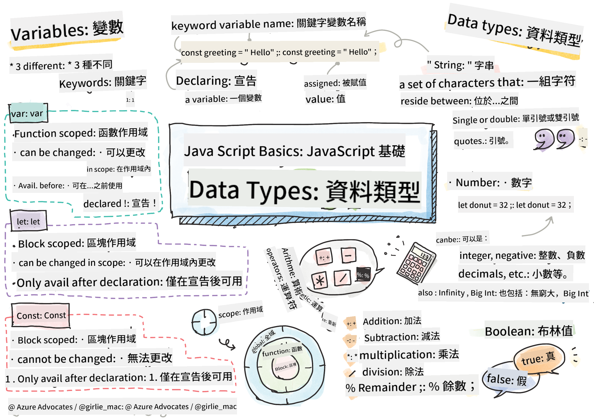

<!--
CO_OP_TRANSLATOR_METADATA:
{
  "original_hash": "d0092f6533ae3ec3adad5b5ece68efaf",
  "translation_date": "2025-10-22T22:33:43+00:00",
  "source_file": "2-js-basics/1-data-types/README.md",
  "language_code": "mo"
}
-->
# JavaScript 基礎：資料型別


> Sketchnote 作者：[Tomomi Imura](https://twitter.com/girlie_mac)

資料型別是 JavaScript 中的基本概念之一，您在撰寫每個程式時都會遇到。可以將資料型別想像成古代亞歷山大圖書館的檔案系統——他們為存放詩歌、數學和歷史記錄的卷軸設置了特定的分類。JavaScript 以類似的方式組織資訊，為不同類型的資料設置不同的類別。

在本課程中，我們將探討使 JavaScript 運作的核心資料型別。您將學習如何處理數字、文字、真假值，並了解為什麼選擇正確的型別對您的程式至關重要。這些概念起初可能看起來很抽象，但隨著練習，它們將變得非常自然。

理解資料型別將使您對 JavaScript 的其他部分更加清晰。就像建築師在建造大教堂之前需要了解不同的建築材料一樣，這些基礎知識將支持您未來的所有建設。

## 課前測驗
[課前測驗](https://ff-quizzes.netlify.app/web/)

本課程涵蓋了 JavaScript 的基礎知識，這是一種為網頁提供互動性的程式語言。

> 您可以在 [Microsoft Learn](https://docs.microsoft.com/learn/modules/web-development-101-variables/?WT.mc_id=academic-77807-sagibbon) 上學習本課程！

[](https://youtube.com/watch?v=JNIXfGiDWM8 "JavaScript 中的變數")

[](https://youtube.com/watch?v=AWfA95eLdq8 "JavaScript 中的資料型別")

> 🎥 點擊上方圖片觀看有關變數和資料型別的影片

讓我們從變數和填充它們的資料型別開始吧！

## 變數

變數是程式設計中的基本構建塊。就像中世紀的煉金術士用標籤罐子存放不同的物質一樣，變數讓您可以存儲資訊並給它一個描述性的名稱，以便稍後引用。需要記住某人的年齡嗎？將其存儲在名為 `age` 的變數中。想要追蹤使用者的名字？將其保存在名為 `userName` 的變數中。

我們將專注於使用 JavaScript 創建變數的現代方法。您在此學到的技術代表了多年來程式語言的演變以及程式設計社群所開發的最佳實踐。

創建和**宣告**變數的語法如下 **[關鍵字] [名稱]**。它由以下兩部分組成：

- **關鍵字**。使用 `let` 來宣告可以更改的變數，或使用 `const` 來宣告固定不變的值。
- **變數名稱**，這是您自己選擇的描述性名稱。

✅ 關鍵字 `let` 是在 ES6 中引入的，為您的變數提供所謂的 _區塊作用域_。建議您使用 `let` 或 `const`，而不是舊的 `var` 關鍵字。我們將在未來的部分中更深入地探討區塊作用域。

### 任務 - 使用變數

1. **宣告變數**。讓我們從創建第一個變數開始：

    ```javascript
    let myVariable;
    ```

   **這樣做的目的：**
   - 這告訴 JavaScript 創建一個名為 `myVariable` 的存儲位置
   - JavaScript 為此變數分配了記憶體空間
   - 該變數目前沒有值（undefined）

2. **賦值**。現在讓我們在變數中放入一些內容：

    ```javascript
    myVariable = 123;
    ```

   **賦值的工作原理：**
   - `=` 運算符將值 123 賦給我們的變數
   - 該變數現在包含此值，而不是 undefined
   - 您可以在程式碼中使用 `myVariable` 來引用此值

   > 注意：在本課程中使用 `=` 表示我們使用了 "賦值運算符"，用於將值設置給變數。它並不表示相等。

3. **更聰明的方式**。事實上，我們可以將這兩個步驟結合起來：

    ```javascript
    let myVariable = 123;
    ```

    **這種方法更有效率：**
    - 您可以在一個語句中宣告變數並賦值
    - 這是開發者的標準做法
    - 它在保持清晰的同時減少了程式碼的長度

4. **改變主意**。如果我們想存儲另一個數字怎麼辦？

   ```javascript
   myVariable = 321;
   ```

   **理解重新賦值：**
   - 該變數現在包含 321，而不是 123
   - 之前的值被替換——變數一次只能存儲一個值
   - 這種可變性是使用 `let` 宣告的變數的關鍵特性

   ✅ 試試看！您可以直接在瀏覽器中撰寫 JavaScript。打開瀏覽器窗口並導航到開發者工具。在控制台中，您會找到一個提示；輸入 `let myVariable = 123`，按下回車，然後輸入 `myVariable`。會發生什麼？注意，您將在後續課程中學到更多有關這些概念的知識。

## 常數

有時您需要存儲在程式執行期間永遠不應更改的資訊。可以將常數想像成古希臘的歐幾里得所建立的數學原理——一旦被證明和記錄，它們就成為未來所有參考的固定基礎。

常數的工作方式與變數類似，但有一個重要的限制：一旦您為其賦值，就不能再更改它的值。這種不可變性有助於防止程式中關鍵值的意外修改。

常數的宣告和初始化遵循與變數相同的概念，但使用 `const` 關鍵字。常數通常使用全大寫字母來宣告。

```javascript
const MY_VARIABLE = 123;
```

**這段程式碼的作用：**
- **創建**一個名為 `MY_VARIABLE` 的常數，值為 123
- **使用**全大寫命名規範來表示常數
- **防止**未來對此值的任何更改

常數有兩個主要規則：

- **必須立即賦值**——不允許空常數！
- **不能更改該值**——如果您嘗試更改，JavaScript 會拋出錯誤。讓我們看看這意味著什麼：

   **簡單值** - 以下是不允許的：
   
      ```javascript
      const PI = 3;
      PI = 4; // 不允許
      ```

   **需要記住的事情：**
   - **嘗試**重新賦值常數會導致錯誤
   - **保護**重要值不被意外更改
   - **確保**值在整個程式中保持一致
 
   **物件引用受到保護** - 以下是不允許的：
   
      ```javascript
      const obj = { a: 3 };
      obj = { b: 5 } // 不允許
      ```

   **理解這些概念：**
   - **防止**用新物件替換整個物件
   - **保護**原始物件的引用
   - **保持**物件在記憶體中的身份

    **物件值未受保護** - 以下是允許的：
    
      ```javascript
      const obj = { a: 3 };
      obj.a = 5;  // 允許
      ```

      **分析這裡發生的事情：**
      - **修改**物件內部屬性的值
      - **保持**相同的物件引用
      - **展示**物件內容可以更改，而引用保持不變

   > 注意，`const` 表示引用受到重新賦值的保護。然而，值並非完全 _不可變_，尤其是當它是像物件這樣的複雜結構時，內容仍然可以更改。

## 資料型別

JavaScript 將資訊組織成不同的類別，稱為資料型別。這個概念類似於古代學者如何分類知識——亞里士多德區分了不同類型的推理，知道邏輯原則不能統一地應用於詩歌、數學和自然哲學。

資料型別很重要，因為不同的操作適用於不同類型的資訊。就像您無法對人的名字進行算術運算或對數學公式進行字母排序一樣，JavaScript 需要每個操作的適當資料型別。理解這一點可以防止錯誤並使您的程式碼更可靠。

變數可以存儲許多不同類型的值，例如數字和文字。這些不同類型的值被稱為**資料型別**。資料型別是軟體開發的重要部分，因為它幫助開發者決定程式碼應如何編寫以及軟體應如何運行。此外，某些資料型別具有獨特的功能，有助於轉換或提取值中的其他資訊。

✅ 資料型別也被稱為 JavaScript 的基本資料型別，因為它們是程式語言提供的最低層次資料型別。JavaScript 有 7 種基本資料型別：string、number、bigint、boolean、undefined、null 和 symbol。花點時間想像每個基本型別可能代表什麼。什麼是 `zebra`？`0` 呢？`true` 呢？

### 數字

數字是 JavaScript 中最簡單的資料型別。無論您處理的是整數如 42、小數如 3.14，還是負數如 -5，JavaScript 都能統一處理它們。

還記得我們之前的變數嗎？我們存儲的 123 實際上是一個數字型別：

```javascript
let myVariable = 123;
```

**主要特徵：**
- JavaScript 自動識別數值
- 您可以使用這些變數進行數學運算
- 不需要明確的型別宣告

變數可以存儲所有類型的數字，包括小數或負數。數字還可以與算術運算符一起使用，這部分內容將在[下一節](../../../../2-js-basics/1-data-types)中介紹。

### 算術運算符

算術運算符允許您在 JavaScript 中執行數學計算。這些運算符遵循數學家幾個世紀以來使用的相同原則——與學者如阿爾·花拉子米（Al-Khwarizmi）開發代數符號時使用的符號相同。

這些運算符的工作方式與傳統數學中的預期一致：加號表示加法，減號表示減法，依此類推。

在執行算術運算時可以使用多種運算符，以下列出了一些：

| 符號 | 描述                                                                  | 範例                          |
| ---- | --------------------------------------------------------------------- | ----------------------------- |
| `+`  | **加法**：計算兩個數字的和                                           | `1 + 2 //預期答案是 3`         |
| `-`  | **減法**：計算兩個數字的差                                           | `1 - 2 //預期答案是 -1`        |
| `*`  | **乘法**：計算兩個數字的乘積                                         | `1 * 2 //預期答案是 2`         |
| `/`  | **除法**：計算兩個數字的商                                           | `1 / 2 //預期答案是 0.5`       |
| `%`  | **餘數**：計算兩個數字相除後的餘數                                   | `1 % 2 //預期答案是 1`         |

✅ 試試看！在瀏覽器的控制台中嘗試進行算術運算。結果是否讓您感到驚訝？

### 字串

在 JavaScript 中，文字資料以字串的形式表示。"字串" 這個術語源於字符串聯在一起的概念，就像中世紀修道院的抄寫員將字母連接起來形成手稿中的單詞和句子一樣。

字串是網頁開發的基礎。網站上顯示的每一段文字——使用者名稱、按鈕標籤、錯誤訊息、內容——都以字串資料的形式處理。理解字串對於創建功能性使用者介面至關重要。

字串是位於單引號或雙引號之間的一組字符。

```javascript
'This is a string'
"This is also a string"
let myString = 'This is a string value stored in a variable';
```

**理解這些概念：**
- **使用**單引號 `'` 或雙引號 `"` 定義字串
- **存儲**可以包含字母、數字和符號的文字資料
- **賦值**字串值給變數以供稍後使用
- **需要**引號來區分文字和變數名稱

記住在撰寫字串時使用引號，否則 JavaScript 會假設它是一個變數名稱。

### 格式化字串

字串操作允許您結合文字元素、整合變數，並創建響應程式狀態的動態內容。這項技術使您能夠以程式化的方式構建文字。

通常您需要將多個字串連接在一起——這個過程稱為串接。

要**串接**兩個或更多字串，或將它們連接在一起，請使用 `+` 運算符。

```javascript
let myString1 = "Hello";
let myString2 = "World";

myString1 + myString2 + "!"; //HelloWorld!
myString1 + " " + myString2 + "!"; //Hello World!
myString1 + ", " + myString2 + "!"; //Hello, World!
```

**逐步分析發生的事情：**
- **使用** `+` 運算符將多個字串結合
- **直接**將字串連接在一起，第一個範例中沒有空格
- **添加**空格字符 `" "` 以提高可讀性
- **插入**標點符號如逗號以創建正確的格式

✅ 為什麼在 JavaScript 中 `1 + 1 = 2`，但 `'1' + '1' = 11`？想一想。那麼 `'1' + 1` 呢？

**模板字面值**是格式化字串的另一種方式，除了使用引號，還使用反引號。任何非純文字的內容都必須放在 `${ }` 的佔位符中，包括可能是字串的變數。

```javascript
let myString1 = "Hello";
let myString2 = "World";

`${myString1} ${myString2}!` //Hello World!
`${myString1}, ${myString2}!` //Hello, World!
```

**讓我們理解每個部分：**
- **使用**反引號 `` ` `` 而不是普通引號來創建模板字面值
- **直接嵌入**變數，使用 `${}` 的佔位符語法
- **保留**空格和格式，與撰寫時完全一致
- **提供**一種更清晰的方式來創建包含變數的複雜字串
您可以使用任一方法來達成格式化的目標，但模板字面值會保留所有的空格和換行。

✅ 什麼時候應該使用模板字面值而不是普通字串？

### 布林值

布林值代表最簡單的數據形式：它只能包含兩個值——`true` 或 `false`。這種二元邏輯系統可以追溯到19世紀數學家喬治·布爾的工作，他開發了布爾代數。

儘管布林值非常簡單，但它們對程式邏輯至關重要。它們使您的程式碼能夠根據條件做出決策——例如用戶是否已登入、按鈕是否被點擊，或者是否滿足某些條件。

布林值只能是兩個值：`true` 或 `false`。布林值可以幫助決定在滿足某些條件時應執行哪些程式碼。在許多情況下，[運算符](../../../../2-js-basics/1-data-types)有助於設置布林值，您會經常注意到並撰寫變數的初始化或使用運算符更新其值。

```javascript
let myTrueBool = true;
let myFalseBool = false;
```

**在上面的例子中，我們：**
- **創建**了一個存儲布林值 `true` 的變數
- **展示**了如何存儲布林值 `false`
- **使用**了精確的關鍵字 `true` 和 `false`（不需要加引號）
- **準備**了這些變數以便在條件語句中使用

✅ 如果一個變數的值被評估為布林值 `true`，則可以認為它是「真值」。有趣的是，在 JavaScript 中，[所有值都是真值，除非被定義為假值](https://developer.mozilla.org/docs/Glossary/Truthy)。

---

## GitHub Copilot Agent 挑戰 🚀

使用 Agent 模式完成以下挑戰：

**描述：** 創建一個個人信息管理器，展示您在本課中學到的所有 JavaScript 數據類型，同時處理真實世界的數據場景。

**提示：** 建立一個 JavaScript 程式，創建一個包含以下內容的用戶資料物件：人的名字（字串）、年齡（數字）、是否是學生的狀態（布林值）、喜歡的顏色（陣列），以及包含街道、城市和郵政編碼屬性的地址物件。包括顯示個人資料信息和更新單個字段的函數。確保展示字串拼接、模板字面值、年齡的算術運算，以及學生狀態的布林邏輯。

在這裡了解更多關於 [Agent 模式](https://code.visualstudio.com/blogs/2025/02/24/introducing-copilot-agent-mode)。

## 🚀 挑戰

JavaScript 有一些行為可能會讓開發者感到意外。以下是一個經典的例子：試著在瀏覽器控制台中輸入以下內容：`let age = 1; let Age = 2; age == Age`，並觀察結果。它會返回 `false`——您能判斷原因嗎？

這代表了許多值得理解的 JavaScript 行為之一。熟悉這些特性將幫助您撰寫更可靠的程式碼並更有效地進行除錯。

## 課後測驗
[課後測驗](https://ff-quizzes.netlify.app)

## 回顧與自學

查看[這份 JavaScript 練習題清單](https://css-tricks.com/snippets/javascript/)並嘗試完成其中一題。您學到了什麼？

## 作業

[數據類型練習](assignment.md)

---

**免責聲明**：  
本文件已使用 AI 翻譯服務 [Co-op Translator](https://github.com/Azure/co-op-translator) 進行翻譯。儘管我們努力確保翻譯的準確性，但請注意，自動翻譯可能包含錯誤或不準確之處。原始文件的母語版本應被視為權威來源。對於關鍵信息，建議使用專業人工翻譯。我們對因使用此翻譯而引起的任何誤解或誤釋不承擔責任。