<!--
CO_OP_TRANSLATOR_METADATA:
{
  "original_hash": "672b0bb6e8b431075f3bdb7130590d2d",
  "translation_date": "2025-11-03T23:34:42+00:00",
  "source_file": "2-js-basics/1-data-types/README.md",
  "language_code": "mo"
}
-->
# JavaScript 基礎：資料型別


> Sketchnote by [Tomomi Imura](https://twitter.com/girlie_mac)

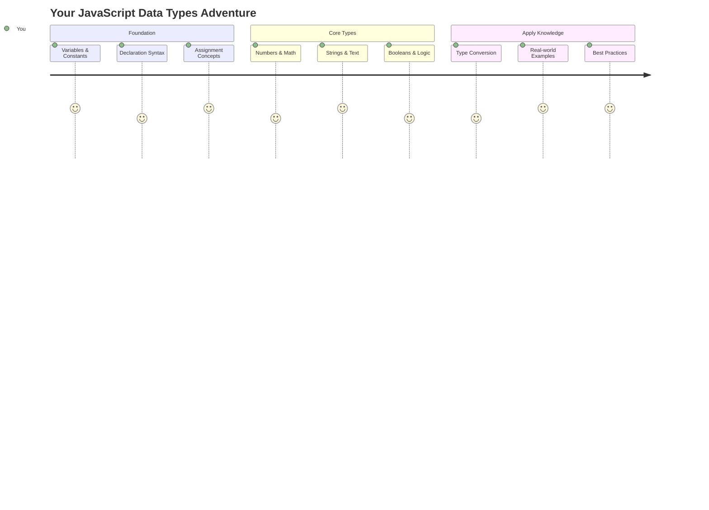

資料型別是 JavaScript 中的基本概念之一，您在每個程式中都會遇到它。可以將資料型別想像成古代亞歷山大圖書館的檔案系統——他們有專門存放詩歌、數學和歷史記錄的地方。JavaScript 以類似的方式組織資訊，為不同類型的資料分配不同的類別。

在本課程中，我們將探討使 JavaScript 運作的核心資料型別。您將學習如何處理數字、文字、真假值，並了解為什麼選擇正確的型別對您的程式至關重要。這些概念起初可能看起來很抽象，但隨著練習，它們會變得自然。

理解資料型別將使 JavaScript 的其他部分更加清晰。就像建築師在建造大教堂之前需要了解不同的建材一樣，這些基礎將支持您未來的所有建設。

## 課前測驗
[課前測驗](https://ff-quizzes.netlify.app/web/)

本課程涵蓋了 JavaScript 的基礎知識，這是一種為網頁提供互動性的語言。

> 您可以在 [Microsoft Learn](https://docs.microsoft.com/learn/modules/web-development-101-variables/?WT.mc_id=academic-77807-sagibbon) 上學習本課程！

[](https://youtube.com/watch?v=JNIXfGiDWM8 "JavaScript 中的變數")

[](https://youtube.com/watch?v=AWfA95eLdq8 "JavaScript 中的資料型別")

> 🎥 點擊上方圖片觀看有關變數和資料型別的影片

讓我們從變數和填充它們的資料型別開始吧！

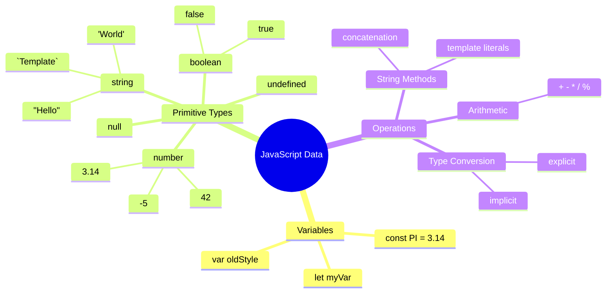

## 變數

變數是程式設計中的基本構建塊。就像中世紀的煉金術士用來存放不同物質的標籤罐一樣，變數讓您可以存儲資訊並給它一個描述性名稱，以便稍後引用它。需要記住某人的年齡嗎？將其存儲在名為 `age` 的變數中。想要追蹤使用者的名字？將其保存在名為 `userName` 的變數中。

我們將專注於使用 JavaScript 創建變數的現代方法。您在此學到的技術代表了多年來語言的演變以及程式設計社群制定的最佳實踐。

創建和**宣告**變數的語法如下 **[關鍵字] [名稱]**。它由以下兩部分組成：

- **關鍵字**。使用 `let` 表示可以更改的變數，或使用 `const` 表示保持不變的值。
- **變數名稱**，這是您自己選擇的描述性名稱。

✅ 關鍵字 `let` 是在 ES6 中引入的，為您的變數提供所謂的 _區塊作用域_。建議使用 `let` 或 `const` 而不是舊的 `var` 關鍵字。我們將在未來的部分中更深入地探討區塊作用域。

### 任務 - 使用變數

1. **宣告變數**。讓我們從創建第一個變數開始：

    ```javascript
    let myVariable;
    ```

   **這完成了什麼：**
   - 這告訴 JavaScript 創建一個名為 `myVariable` 的存儲位置
   - JavaScript 為此變數分配了內存空間
   - 該變數目前沒有值（undefined）

2. **賦值**。現在讓我們在變數中放入一些內容：

    ```javascript
    myVariable = 123;
    ```

   **賦值如何運作：**
   - `=` 運算符將值 123 賦給我們的變數
   - 該變數現在包含此值，而不是未定義
   - 您可以在整個程式碼中使用 `myVariable` 引用此值

   > 注意：在本課程中使用 `=` 表示我們使用了“賦值運算符”，用於為變數設置值。它並不表示相等。

3. **更聰明的方式**。事實上，讓我們將這兩個步驟結合起來：

    ```javascript
    let myVariable = 123;
    ```

    **這種方法更高效：**
    - 您可以在一條語句中宣告變數並賦值
    - 這是開發者的標準做法
    - 它在保持清晰的同時減少了程式碼的長度

4. **改變主意**。如果我們想存儲另一個數字怎麼辦？

   ```javascript
   myVariable = 321;
   ```

   **理解重新賦值：**
   - 該變數現在包含 321 而不是 123
   - 之前的值被替換——變數一次只存儲一個值
   - 這種可變性是使用 `let` 宣告的變數的關鍵特性

   ✅ 試試看！您可以直接在瀏覽器中編寫 JavaScript。打開瀏覽器窗口並導航到開發者工具。在控制台中，您會找到提示；輸入 `let myVariable = 123`，按回車，然後輸入 `myVariable`。會發生什麼？注意，您將在後續課程中了解更多這些概念。

### 🧠 **變數掌握檢查：熟悉變數**

**讓我們看看您對變數的理解程度：**
- 您能解釋宣告變數和賦值變數的區別嗎？
- 如果您在宣告變數之前嘗試使用它，會發生什麼？
- 什麼時候您會選擇使用 `let` 而不是 `const`？

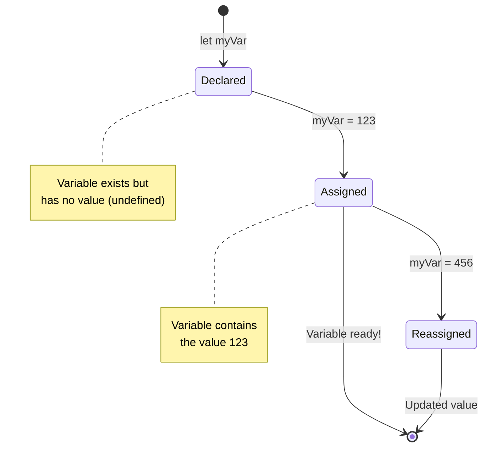

> **快速提示**：將變數想像成標有標籤的儲物箱。您創建箱子（`let`），將東西放進去（`=`），如果需要，稍後可以更換內容！

## 常數

有時您需要存儲在程式執行期間永遠不應更改的資訊。可以將常數想像成古希臘的歐幾里得建立的數學原理——一旦被證明和記錄，它們就成為未來所有參考的固定值。

常數的運作方式類似於變數，但有一個重要的限制：一旦您為其賦值，就不能更改它的值。這種不可變性有助於防止程式中對關鍵值的意外修改。

常數的宣告和初始化遵循與變數相同的概念，但使用 `const` 關鍵字。常數通常使用全大寫字母命名。

```javascript
const MY_VARIABLE = 123;
```

**這段程式碼的作用：**
- **創建**一個名為 `MY_VARIABLE` 的常數，值為 123
- **使用**常數的全大寫命名慣例
- **防止**未來對此值的任何更改

常數有兩個主要規則：

- **必須立即為其賦值**——不允許空常數！
- **永遠不能更改該值**——如果您嘗試更改，JavaScript 會拋出錯誤。讓我們看看這是什麼意思：

   **簡單值** - 以下是不允許的：
   
      ```javascript
      const PI = 3;
      PI = 4; // 不允許
      ```

   **您需要記住的事情：**
   - **嘗試**重新賦值常數會導致錯誤
   - **保護**重要值免受意外更改
   - **確保**值在整個程式中保持一致
 
   **物件引用受保護** - 以下是不允許的：
   
      ```javascript
      const obj = { a: 3 };
      obj = { b: 5 } // 不允許
      ```

   **理解這些概念：**
   - **防止**用新物件替換整個物件
   - **保護**對原始物件的引用
   - **保持**物件在內存中的身份

    **物件值未受保護** - 以下是允許的：
    
      ```javascript
      const obj = { a: 3 };
      obj.a = 5;  // 允許
      ```

      **分解發生的事情：**
      - **修改**物件內的屬性值
      - **保持**相同的物件引用
      - **展示**物件內容可以更改，而引用保持不變

   > 注意，`const` 表示引用受到重新賦值的保護。然而，值並非 _不可變_，尤其是像物件這樣的複雜結構時，值仍然可以改變。

## 資料型別

JavaScript 將資訊組織成不同的類別，稱為資料型別。這一概念類似於古代學者如何分類知識——亞里士多德區分了不同類型的推理，知道邏輯原則不能統一應用於詩歌、數學和自然哲學。

資料型別很重要，因為不同的操作需要不同類型的資訊。就像您不能對人的名字進行算術運算或對數學方程式進行字母排序一樣，JavaScript 需要每個操作的適當資料型別。理解這一點可以防止錯誤並使您的程式碼更可靠。

變數可以存儲許多不同類型的值，例如數字和文字。這些不同類型的值被稱為**資料型別**。資料型別是軟體開發的重要組成部分，因為它幫助開發者決定程式碼的編寫方式以及軟體的運行方式。此外，某些資料型別具有獨特的功能，有助於轉換或提取值中的其他資訊。

✅ 資料型別也被稱為 JavaScript 的基本資料型別，因為它們是語言提供的最低層次資料型別。JavaScript 有 7 種基本資料型別：string、number、bigint、boolean、undefined、null 和 symbol。花點時間想像一下這些基本型別可能代表什麼。什麼是 `zebra`？`0` 是什麼？`true` 又是什麼？

### 數字

數字是 JavaScript 中最簡單的資料型別。無論您是處理像 42 這樣的整數、像 3.14 這樣的小數，還是像 -5 這樣的負數，JavaScript 都能統一處理它們。

還記得我們之前的變數嗎？我們存儲的 123 實際上是一個數字型別：

```javascript
let myVariable = 123;
```

**主要特徵：**
- JavaScript 自動識別數值
- 您可以使用這些變數進行數學運算
- 不需要明確的型別宣告

變數可以存儲所有類型的數字，包括小數或負數。數字還可以與算術運算符一起使用，這部分內容在[下一節](../../../../2-js-basics/1-data-types)中介紹。

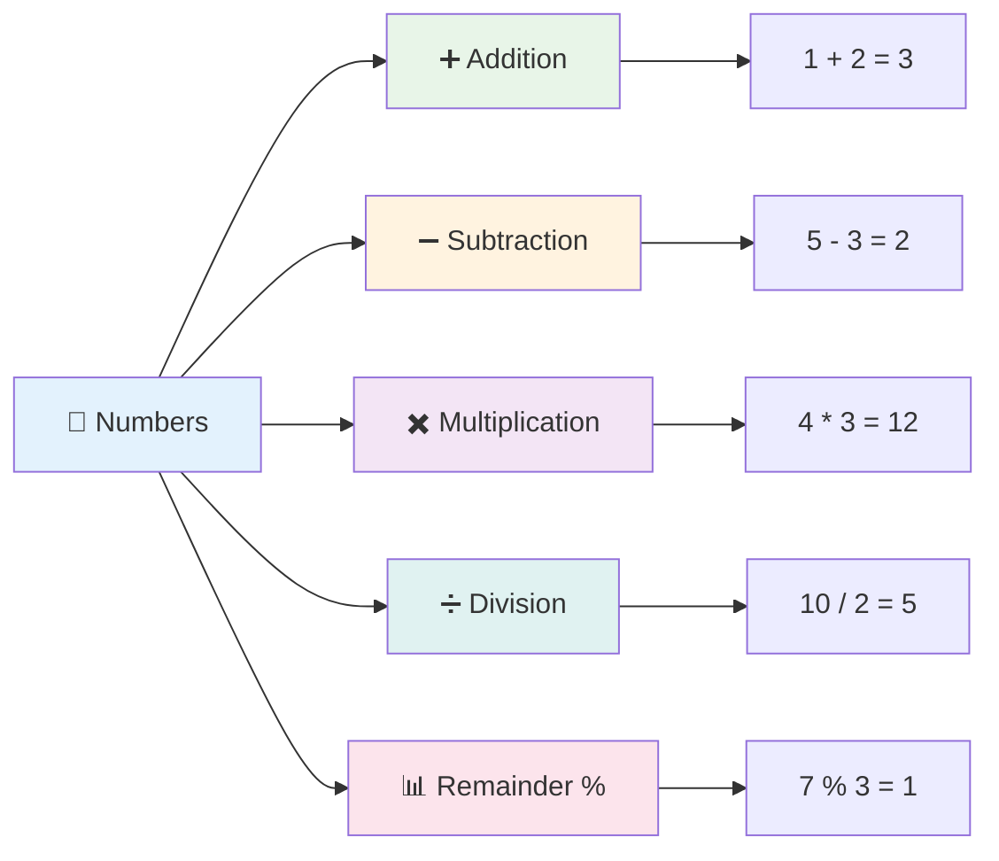

### 算術運算符

算術運算符允許您在 JavaScript 中執行數學計算。這些運算符遵循數學家幾個世紀以來使用的相同原則——與發展代數符號的學者如 Al-Khwarizmi 的作品中出現的符號相同。

這些運算符的工作方式與傳統數學中的預期一致：加號表示加法，減號表示減法，依此類推。

在執行算術功能時可以使用多種類型的運算符，以下列出了一些：

| 符號 | 描述                                                                  | 範例                          |
| ------ | -------------------------------------------------------------------- | ------------------------------ |
| `+`    | **加法**：計算兩個數字的總和                                        | `1 + 2 //預期答案是 3`         |
| `-`    | **減法**：計算兩個數字的差                                          | `1 - 2 //預期答案是 -1`        |
| `*`    | **乘法**：計算兩個數字的乘積                                        | `1 * 2 //預期答案是 2`         |
| `/`    | **除法**：計算兩個數字的商                                          | `1 / 2 //預期答案是 0.5`       |
| `%`    | **餘數**：計算兩個數字相除的餘數                                    | `1 % 2 //預期答案是 1`         |

✅ 試試看！在瀏覽器的控制台中嘗試進行算術運算。結果是否讓您感到驚訝？

### 🧮 **數學技能檢查：自信計算**

**測試您的算術理解：**
- `/`（除法）和 `%`（餘數）之間有什麼區別？
- 您能預測 `10 % 3` 的結果嗎？（提示：不是 3.33...）
- 為什麼餘數運算符在程式設計中可能很有用？

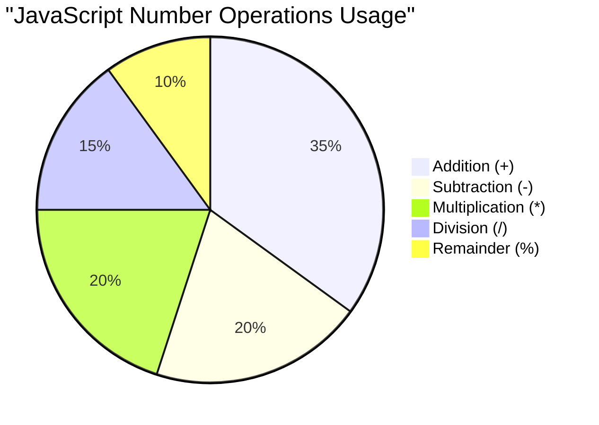

> **現實世界的洞察**：餘數運算符（%）在檢查數字是奇數還是偶數、創建模式或循環遍歷陣列時非常有用！

### 字串

在 JavaScript 中，文字資料以字串表示。“字串”這個術語源於字符按順序串聯在一起的概念，就像中世紀修道院的抄寫員將字母連接起來形成手稿中的單詞和句子一樣。

字串是網頁開發的基礎。網站上顯示的每一段文字——使用者名稱、按鈕標籤、錯誤訊息、內容——都以字串資料的形式處理。理解字串對於創建功能性使用者介面至關重要。

字串是一組位於單引號或雙引號之間的字符。

```javascript
'This is a string'
"This is also a string"
let myString = 'This is a string value stored in a variable';
```

**理解這些概念：**
- **使用**單引號 `'` 或雙引號 `"` 定義字串
- **存儲**可以包含字母、數字和符號的文字資料
- **賦值**字串值給變數以供稍後使用
- **需要**引號以區分文字和變數名稱

記住在編寫字串時使用引號，否則 JavaScript 會假設它是一個變數名稱。

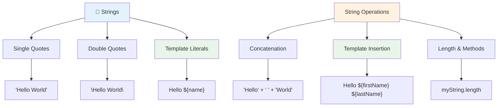

### 格式化字串

字串操作允許您結合文字元素、合併變數並創建響應程式狀態的動態內容。這項技術使您能夠以程式化的方式構建文字。

通常您需要將多個字串連接在一起——這個過程稱為串接。
要**串聯**兩個或多個字串，或將它們結合在一起，可以使用 `+` 運算符。

```javascript
let myString1 = "Hello";
let myString2 = "World";

myString1 + myString2 + "!"; //HelloWorld!
myString1 + " " + myString2 + "!"; //Hello World!
myString1 + ", " + myString2 + "!"; //Hello, World!
```

**逐步解析以下內容：**
- 使用 `+` 運算符**結合**多個字串
- 在第一個範例中，直接**連接**字串，沒有空格
- 在字串之間**添加**空格字符 `" "`，以提高可讀性
- **插入**標點符號，例如逗號，以創建正確的格式

✅ 為什麼在 JavaScript 中 `1 + 1 = 2`，但 `'1' + '1' = 11`？想一想。那麼 `'1' + 1` 又會怎麼樣？

**模板字串**是另一種格式化字串的方法，與其使用引號，不如使用反引號。任何非純文字的內容都必須放在 `${ }` 的佔位符中，包括可能是字串的變數。

```javascript
let myString1 = "Hello";
let myString2 = "World";

`${myString1} ${myString2}!` //Hello World!
`${myString1}, ${myString2}!` //Hello, World!
```

**讓我們理解每個部分：**
- 使用反引號 `` ` `` 而不是普通引號來創建模板字串
- 使用 `${}` 的佔位符語法直接嵌入變數
- 精確**保留**空格和格式，與原始內容一致
- 提供了一種更簡潔的方式來使用變數創建複雜的字串

你可以使用任一方法來實現你的格式化目標，但模板字串會保留所有的空格和換行。

✅ 什麼時候應該使用模板字串而不是普通字串？

### 🔤 **字串掌握檢查：文字操作信心**

**評估你的字串技能：**
- 你能解釋為什麼 `'1' + '1'` 等於 `'11'` 而不是 `2` 嗎？
- 你覺得哪種字串方法更易讀：串聯還是模板字串？
- 如果忘記在字串周圍加上引號會發生什麼？

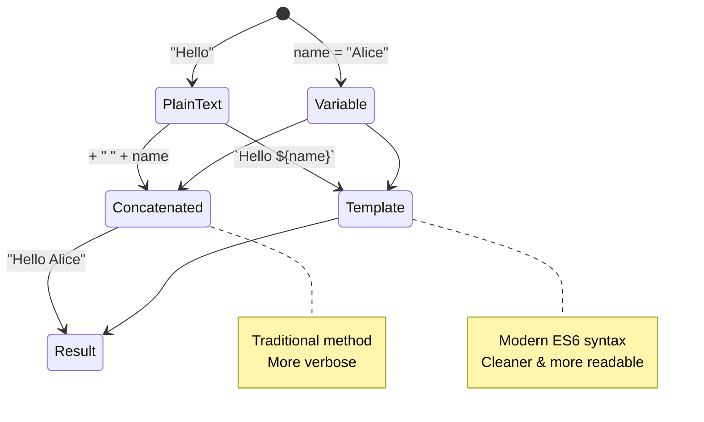

> **專業提示**：模板字串通常更適合用於構建複雜的字串，因為它們更易讀，並且能很好地處理多行字串！

### 布林值

布林值是最簡單的數據形式：它們只能持有兩個值——`true` 或 `false`。這種二元邏輯系統可以追溯到19世紀數學家喬治·布爾的布爾代數。

儘管布林值很簡單，但它們對程式邏輯至關重要。它們使你的程式碼能夠根據條件做出決策——例如用戶是否已登錄、按鈕是否被點擊，或者是否滿足某些條件。

布林值只能是兩個值：`true` 或 `false`。布林值可以幫助決定在滿足某些條件時應執行哪些程式碼行。在許多情況下，[運算符](../../../../2-js-basics/1-data-types)有助於設置布林值，並且你會經常注意到變數被初始化或其值通過運算符進行更新。

```javascript
let myTrueBool = true;
let myFalseBool = false;
```

**在上面的範例中，我們：**
- **創建**了一個存儲布林值 `true` 的變數
- **展示**了如何存儲布林值 `false`
- **使用**了精確的關鍵字 `true` 和 `false`（不需要引號）
- **準備**這些變數以供條件語句使用

✅ 如果一個變數的值被評估為布林值 `true`，則可以認為該變數是“真值”。有趣的是，在 JavaScript 中，[所有值都是真值，除非被定義為假值](https://developer.mozilla.org/docs/Glossary/Truthy)。

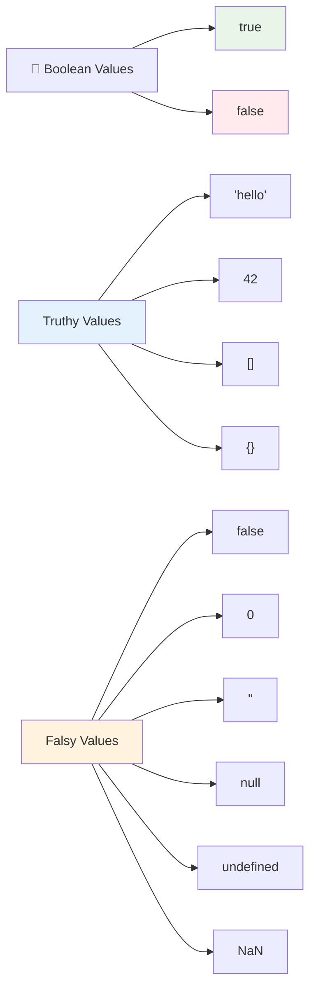

### 🎯 **布林邏輯檢查：決策能力**

**測試你的布林理解：**
- 你認為為什麼 JavaScript 除了 `true` 和 `false` 之外，還有“真值”和“假值”？
- 你能預測以下哪些是假值嗎：`0`、`"0"`、`[]`、`"false"`？
- 布林值如何在控制程式流程中發揮作用？

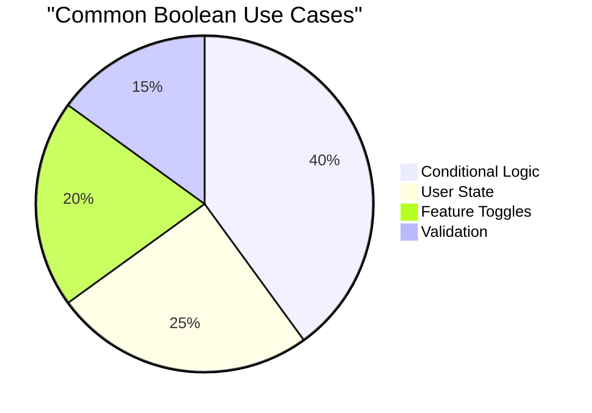

> **記住**：在 JavaScript 中，只有6個值是假值：`false`、`0`、`""`、`null`、`undefined` 和 `NaN`。其他所有值都是真值！

---

## 📊 **你的數據類型工具包摘要**

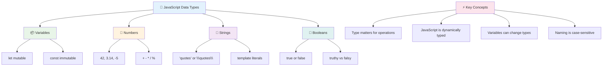

## GitHub Copilot Agent 挑戰 🚀

使用 Agent 模式完成以下挑戰：

**描述：** 創建一個個人信息管理器，展示你在本課中學到的所有 JavaScript 數據類型，同時處理真實世界的數據場景。

**提示：** 建立一個 JavaScript 程式，創建一個包含以下內容的用戶資料物件：人的名字（字串）、年齡（數字）、是否是學生的狀態（布林值）、喜愛的顏色（陣列），以及包含街道、城市和郵政編碼屬性的地址物件。包括顯示個人資料信息和更新單個字段的函數。確保展示字串串聯、模板字串、年齡的算術運算，以及學生狀態的布林邏輯。

了解更多 [Agent 模式](https://code.visualstudio.com/blogs/2025/02/24/introducing-copilot-agent-mode) 的信息。

## 🚀 挑戰

JavaScript 有一些行為可能會讓開發者感到意外。以下是一個經典的例子：嘗試在瀏覽器控制台中輸入：`let age = 1; let Age = 2; age == Age`，並觀察結果。它返回 `false`——你能判斷原因嗎？

這是許多值得理解的 JavaScript 行為之一。熟悉這些特性將幫助你編寫更可靠的程式碼並更有效地排除問題。

## 課後測驗
[課後測驗](https://ff-quizzes.netlify.app)

## 回顧與自學

查看 [這份 JavaScript 練習題列表](https://css-tricks.com/snippets/javascript/) 並嘗試完成其中一題。你學到了什麼？

## 作業

[數據類型練習](assignment.md)

## 🚀 你的 JavaScript 數據類型掌握時間表

### ⚡ **你可以在接下來的5分鐘內完成的事情**
- [ ] 打開瀏覽器控制台，創建3個具有不同數據類型的變數
- [ ] 嘗試挑戰：`let age = 1; let Age = 2; age == Age`，並找出為什麼它是 false
- [ ] 使用你的名字和喜歡的數字練習字串串聯
- [ ] 測試當你將數字加到字串時會發生什麼

### 🎯 **你可以在這一小時內完成的事情**
- [ ] 完成課後測驗並回顧任何令人困惑的概念
- [ ] 創建一個迷你計算器，可以進行加、減、乘、除兩個數字
- [ ] 使用模板字串構建一個簡單的名字格式化工具
- [ ] 探索 `==` 和 `===` 比較運算符的區別
- [ ] 練習在不同數據類型之間進行轉換

### 📅 **你的為期一周的 JavaScript基礎**
- [ ] 自信且有創意地完成作業
- [ ] 使用所學的所有數據類型創建一個個人資料物件
- [ ] 使用 [CSS-Tricks 的 JavaScript 練習題](https://css-tricks.com/snippets/javascript/) 進行練習
- [ ] 使用布林邏輯構建一個簡單的表單驗證器
- [ ] 嘗試使用陣列和物件數據類型（預覽即將到來的課程）
- [ ] 加入 JavaScript 社群並就數據類型提出問題

### 🌟 **你的為期一個月的轉變**
- [ ] 將數據類型知識整合到更大的程式專案中
- [ ] 理解在真實應用中何時以及為什麼使用每種數據類型
- [ ] 幫助其他初學者理解 JavaScript 基礎
- [ ] 建立一個小型應用程式來管理不同類型的用戶數據
- [ ] 探索進階數據類型概念，例如類型強制和嚴格相等性
- [ ] 通過改進文檔為開源 JavaScript 專案做出貢獻

### 🧠 **最終數據類型掌握檢查**

**慶祝你的 JavaScript 基礎：**
- 哪種數據類型的行為最讓你感到驚訝？
- 你對向朋友解釋變數與常數的區別有多自信？
- 你發現 JavaScript 的類型系統中最有趣的事情是什麼？
- 你能想像用這些基礎知識構建哪些真實應用？

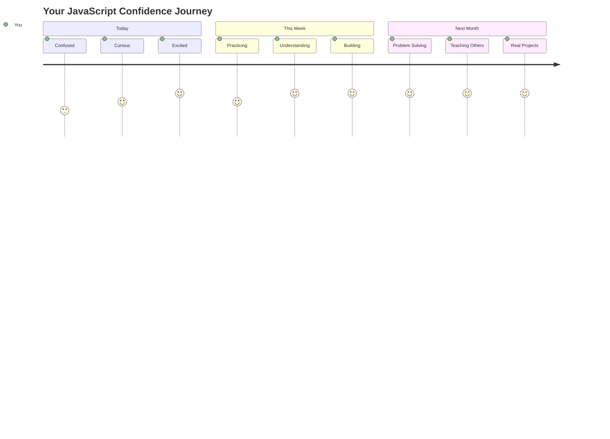

> 💡 **你已經打下了基礎！** 理解數據類型就像在寫故事之前學習字母。你將來編寫的每個 JavaScript 程式都會使用這些基本概念。你現在擁有了創建互動網站、動態應用程式以及用程式碼解決真實問題的基石。歡迎來到 JavaScript 的奇妙世界！ 🎉

---

**免責聲明**：  
本文件已使用 AI 翻譯服務 [Co-op Translator](https://github.com/Azure/co-op-translator) 進行翻譯。儘管我們努力確保翻譯的準確性，但請注意，自動翻譯可能包含錯誤或不準確之處。原始文件的母語版本應被視為權威來源。對於關鍵信息，建議使用專業人工翻譯。我們對因使用此翻譯而產生的任何誤解或誤釋不承擔責任。