<!--
CO_OP_TRANSLATOR_METADATA:
{
  "original_hash": "71f7d7dafa1c7194d79ddac87f669ff9",
  "translation_date": "2025-11-03T23:35:26+00:00",
  "source_file": "2-js-basics/2-functions-methods/README.md",
  "language_code": "mo"
}
-->
# JavaScript 基礎：方法與函數

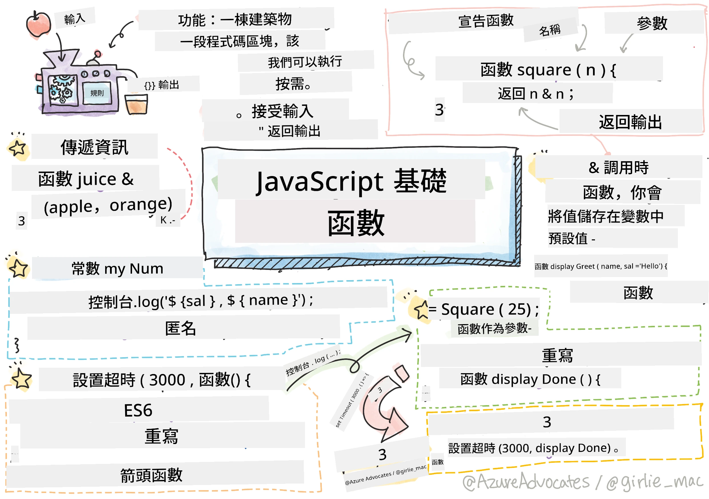
> Sketchnote by [Tomomi Imura](https://twitter.com/girlie_mac)

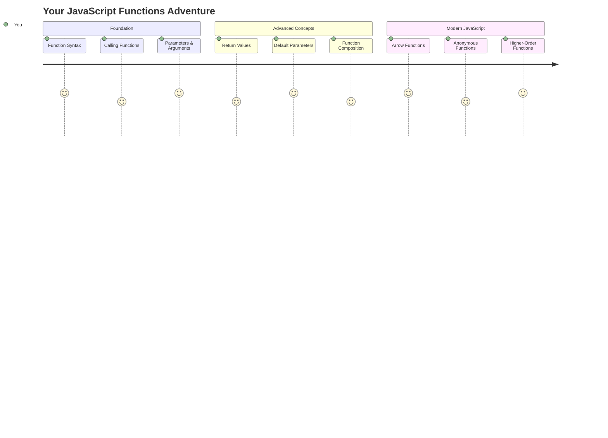

## 課前測驗
[課前測驗](https://ff-quizzes.netlify.app)

重複撰寫相同的程式碼是程式設計中最常見的挫折之一。函數解決了這個問題，讓你可以將程式碼打包成可重複使用的模組。可以將函數想像成亨利·福特的裝配線中標準化的零件——一旦創建了一個可靠的元件，就可以在需要的地方使用它，而不需要重新從頭開始。

函數允許你將程式碼片段打包，並在程式中重複使用。與其到處複製和貼上相同的邏輯，不如只需創建一次函數，並在需要時調用它。這種方法能讓程式碼更有條理，也更容易進行更新。

在本課程中，你將學習如何創建自己的函數、向函數傳遞資訊並獲得有用的結果。你將了解函數與方法的區別，學習現代語法方法，並了解函數如何與其他函數協作。我們將逐步構建這些概念。

[](https://youtube.com/watch?v=XgKsD6Zwvlc "方法與函數")

> 🎥 點擊上方圖片觀看有關方法與函數的影片。

> 你可以在 [Microsoft Learn](https://docs.microsoft.com/learn/modules/web-development-101-functions/?WT.mc_id=academic-77807-sagibbon) 上學習本課程！

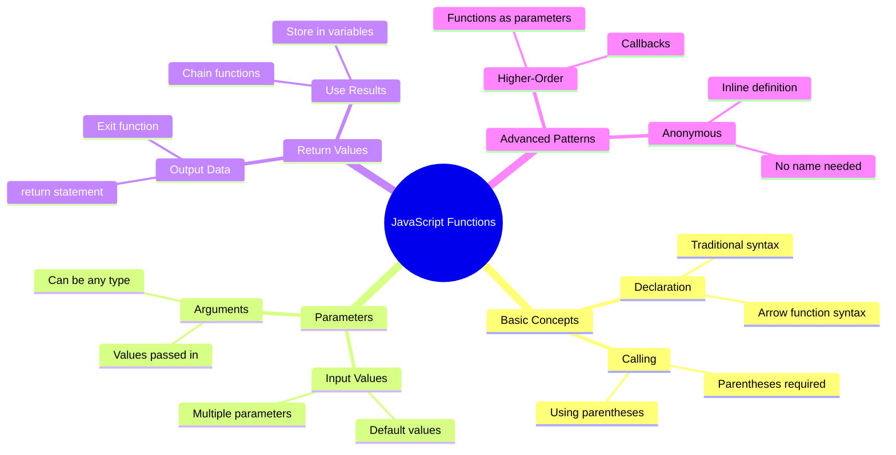

## 函數

函數是一個獨立的程式碼區塊，用於執行特定任務。它封裝了邏輯，讓你可以在需要時執行。

與其在程式中多次撰寫相同的程式碼，不如將它打包成一個函數，並在需要時調用它。這種方法能讓程式碼更簡潔，也更容易進行更新。想像一下，如果需要更改分散在程式碼庫中 20 個不同位置的邏輯，維護起來會有多麼困難。

為函數命名時，使用描述性名稱非常重要。一個命名清晰的函數能清楚地表達其用途——例如，看到 `cancelTimer()` 時，你會立即明白它的作用，就像一個標有明確標籤的按鈕能告訴你點擊後會發生什麼。

## 創建並調用函數

讓我們來看看如何創建函數。語法遵循一致的模式：

```javascript
function nameOfFunction() { // function definition
 // function definition/body
}
```

讓我們分解一下：
- `function` 關鍵字告訴 JavaScript「嘿，我正在創建一個函數！」
- `nameOfFunction` 是你給函數取的描述性名稱
- 括號 `()` 是你可以添加參數的地方（稍後我們會詳細介紹）
- 大括號 `{}` 包含了調用函數時執行的實際程式碼

讓我們創建一個簡單的問候函數來看看效果：

```javascript
function displayGreeting() {
  console.log('Hello, world!');
}
```

這個函數會在控制台中打印「Hello, world!」。一旦定義了它，你可以根據需要多次使用它。

要執行（或「調用」）函數，只需寫下函數的名稱，後面加上括號。JavaScript 允許你在調用函數之前或之後定義它——JavaScript 引擎會處理執行順序。

```javascript
// calling our function
displayGreeting();
```

當你運行這行程式碼時，它會執行 `displayGreeting` 函數中的所有程式碼，並在瀏覽器的控制台中顯示「Hello, world!」。你可以多次調用這個函數。

### 🧠 **函數基礎檢查：構建你的第一個函數**

**來看看你對基本函數的理解：**
- 你能解釋為什麼在函數定義中使用大括號 `{}` 嗎？
- 如果你寫 `displayGreeting` 而不加括號會發生什麼？
- 為什麼你可能需要多次調用同一個函數？

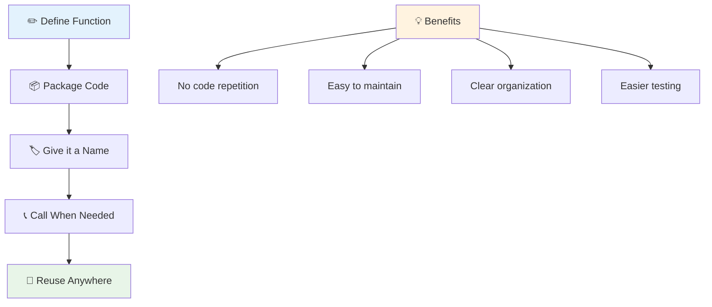

> **注意：** 在這些課程中，你已經使用了 **方法**。例如，`console.log()` 是一個方法——本質上是一個屬於 `console` 物件的函數。主要區別在於方法附屬於物件，而函數則是獨立的。在日常對話中，許多開發者會將這些術語互換使用。

### 函數的最佳實踐

以下是一些幫助你撰寫出色函數的提示：

- 為你的函數取一個清晰、描述性的名稱——你的未來自己會感謝你！
- 使用 **駝峰命名法** 為多個單詞的名稱命名（例如使用 `calculateTotal` 而不是 `calculate_total`）
- 讓每個函數專注於做好一件事

## 向函數傳遞資訊

我們的 `displayGreeting` 函數有些局限——它只能為所有人顯示「Hello, world!」。參數讓我們可以使函數更靈活和有用。

**參數** 就像佔位符，你可以在每次使用函數時插入不同的值。這樣，同一個函數可以在每次調用時處理不同的資訊。

在定義函數時，你可以在括號內列出參數，並用逗號分隔多個參數：

```javascript
function name(param, param2, param3) {

}
```

每個參數都像是一個佔位符——當有人調用你的函數時，他們會提供實際的值來填充這些位置。

讓我們更新問候函數，使其可以接受某人的名字：

```javascript
function displayGreeting(name) {
  const message = `Hello, ${name}!`;
  console.log(message);
}
```

注意我們使用了反引號（`` ` ``）和 `${}` 直接將名字插入到訊息中——這叫做模板字面值，它是一種非常方便的方式，可以將變數混合到字串中。

現在當我們調用函數時，可以傳遞任何名字：

```javascript
displayGreeting('Christopher');
// displays "Hello, Christopher!" when run
```

JavaScript 會將字串 `'Christopher'` 賦值給 `name` 參數，並創建個性化訊息「Hello, Christopher!」

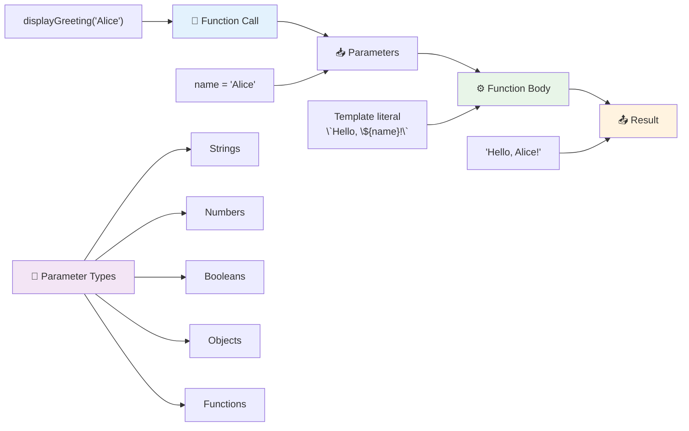

## 預設值

如果我們希望某些參數是可選的該怎麼辦？這時候預設值就派上用場了！

假設我們希望人們能夠自定義問候語，但如果他們沒有指定，我們就使用「Hello」作為備選。你可以通過使用等號來設置預設值，就像設置變數一樣：

```javascript
function displayGreeting(name, salutation='Hello') {
  console.log(`${salutation}, ${name}`);
}
```

在這裡，`name` 仍然是必需的，但如果沒有人提供其他問候語，`salutation` 則有一個備選值 `'Hello'`。

現在我們可以用兩種不同的方式調用這個函數：

```javascript
displayGreeting('Christopher');
// displays "Hello, Christopher"

displayGreeting('Christopher', 'Hi');
// displays "Hi, Christopher"
```

在第一次調用中，由於我們沒有指定問候語，JavaScript 使用了預設的「Hello」。在第二次調用中，它使用了我們自定義的「Hi」。這種靈活性使函數能夠適應不同的場景。

### 🎛️ **參數掌握檢查：讓函數更靈活**

**測試你對參數的理解：**
- 參數和引數有什麼區別？
- 為什麼預設值在實際程式設計中很有用？
- 如果你傳遞的引數比參數多，會發生什麼？

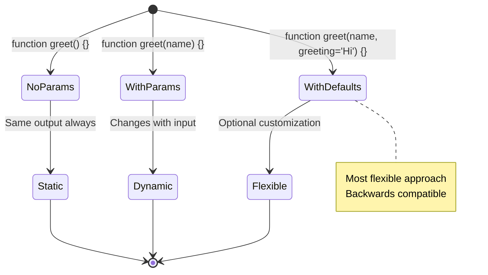

> **專業提示：** 預設參數使你的函數更易於使用。使用者可以快速開始，並在需要時進行自定義！

## 返回值

到目前為止，我們的函數只是將訊息打印到控制台，但如果你希望函數計算某些內容並將結果返回給你該怎麼辦？

這就是 **返回值** 的作用。函數不僅可以顯示某些內容，還可以將一個值返回給你，讓你可以將其存儲在變數中或在程式碼的其他部分使用。

要返回一個值，你可以使用 `return` 關鍵字，後面跟著你想返回的內容：

```javascript
return myVariable;
```

這裡有一個重要的點：當函數遇到 `return` 語句時，它會立即停止執行並將該值返回給調用它的人。

讓我們修改問候函數，使其返回訊息而不是打印：

```javascript
function createGreetingMessage(name) {
  const message = `Hello, ${name}`;
  return message;
}
```

現在這個函數不再打印問候語，而是創建訊息並將其返回給我們。

要使用返回的值，我們可以像使用其他值一樣將其存儲在變數中：

```javascript
const greetingMessage = createGreetingMessage('Christopher');
```

現在 `greetingMessage` 包含「Hello, Christopher」，我們可以在程式碼中的任何地方使用它——例如顯示在網頁上、包含在電子郵件中或傳遞給另一個函數。

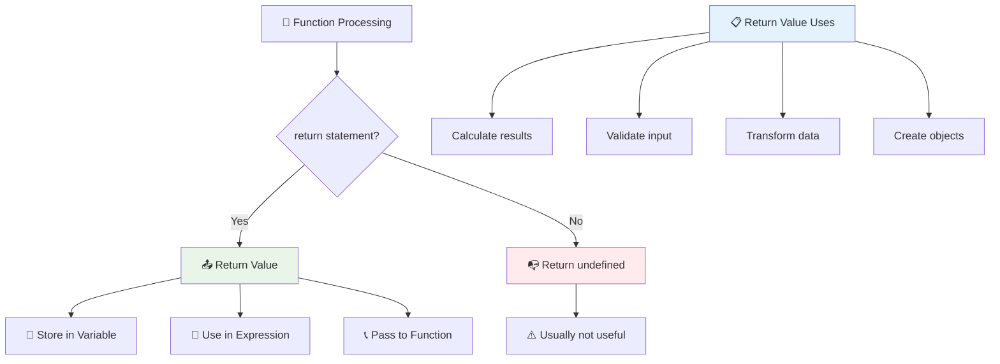

### 🔄 **返回值檢查：獲取結果**

**評估你對返回值的理解：**
- 函數中的 `return` 語句之後的程式碼會發生什麼？
- 為什麼返回值通常比僅僅打印到控制台更好？
- 函數是否可以返回不同類型的值（字串、數字、布林值）？

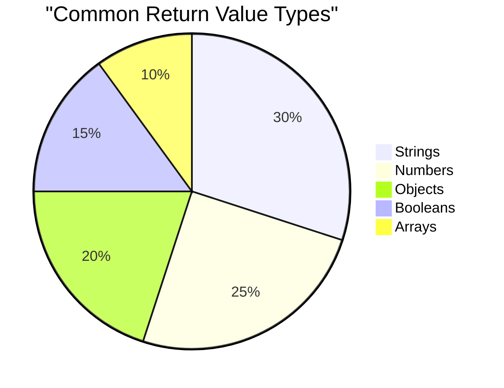

> **關鍵洞察：** 返回值的函數更具靈活性，因為調用者可以決定如何處理結果。這使你的程式碼更模組化和可重複使用！

## 函數作為函數的參數

函數可以作為參數傳遞給其他函數。雖然這個概念一開始可能看起來很複雜，但它是一個強大的功能，可以實現靈活的程式設計模式。

這種模式在你想要表達「當某件事發生時，執行另一件事」時非常常見。例如，「當計時器結束時，運行這段程式碼」或「當使用者點擊按鈕時，調用這個函數」。

讓我們來看看 `setTimeout`，這是一個內建函數，它會等待一定的時間，然後運行一些程式碼。我們需要告訴它要運行什麼程式碼——這正是傳遞函數的完美用例！

試試這段程式碼——3 秒後，你會看到一條訊息：

```javascript
function displayDone() {
  console.log('3 seconds has elapsed');
}
// timer value is in milliseconds
setTimeout(displayDone, 3000);
```

注意我們將 `displayDone`（不加括號）傳遞給 `setTimeout`。我們並沒有自己調用函數——而是將它交給 `setTimeout`，並說「3 秒後調用它」。

### 匿名函數

有時你只需要一個函數來完成某件事，並且不想給它命名。想想看——如果你只使用一次函數，為什麼要用額外的名字來讓程式碼變得混亂？

JavaScript 允許你創建 **匿名函數**——即沒有名字的函數，你可以在需要的地方直接定義它。

以下是我們如何使用匿名函數重寫計時器示例：

```javascript
setTimeout(function() {
  console.log('3 seconds has elapsed');
}, 3000);
```

這實現了相同的結果，但函數直接在 `setTimeout` 調用中定義，省去了單獨的函數聲明。

### 簡化箭頭函數

現代 JavaScript 提供了一種更簡短的函數撰寫方式，稱為 **箭頭函數**。它使用 `=>`（看起來像箭頭——明白了吧？），並且非常受開發者歡迎。

箭頭函數讓你可以省略 `function` 關鍵字，撰寫更簡潔的程式碼。

以下是使用箭頭函數的計時器示例：

```javascript
setTimeout(() => {
  console.log('3 seconds has elapsed');
}, 3000);
```

`()` 是參數的位置（此例中為空），接著是箭頭 `=>`，最後是大括號中的函數主體。這提供了相同的功能，但語法更簡潔。

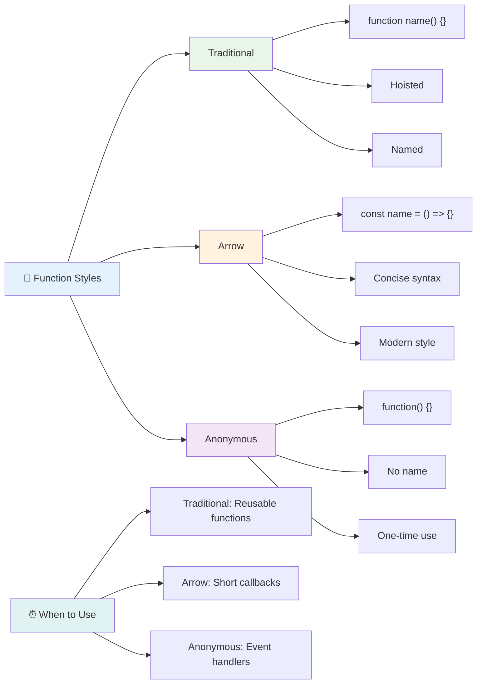

### 何時使用每種策略

什麼時候應該使用哪種方法？一個實用的指導原則是：如果你會多次使用函數，請給它命名並單獨定義。如果它只用於一個特定用途，考慮使用匿名函數。箭頭函數和傳統語法都是有效的選擇，但箭頭函數在現代 JavaScript 程式碼庫中更為常見。

### 🎨 **函數風格掌握檢查：選擇合適的語法**

**測試你對語法的理解：**
- 什麼時候你可能更喜歡箭頭函數而不是傳統函數語法？
- 匿名函數的主要優勢是什麼？
- 你能想到一個命名函數比匿名函數更好的情況嗎？

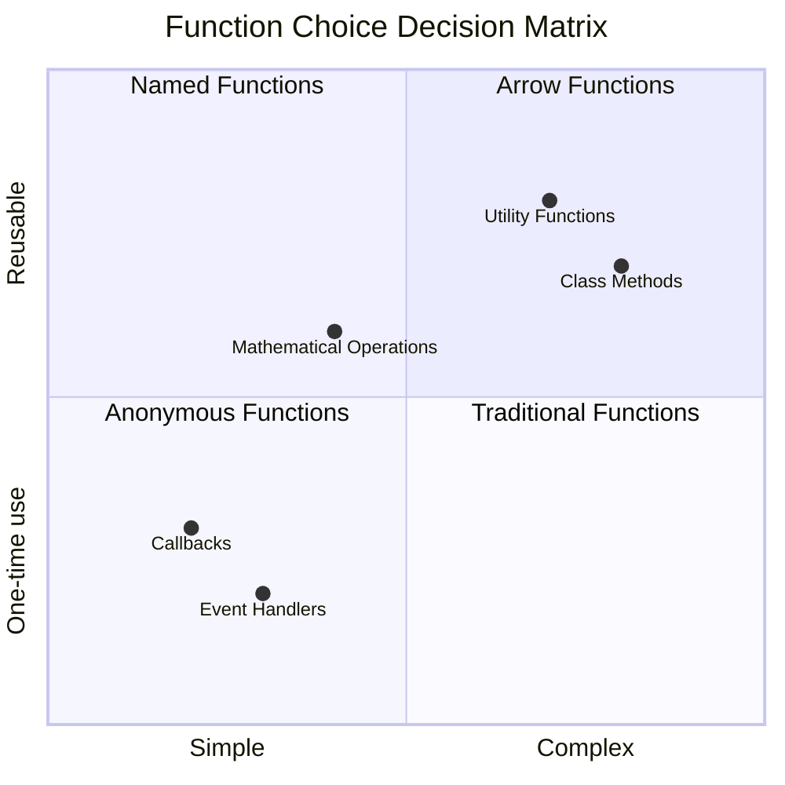

> **現代趨勢：** 箭頭函數因其簡潔的語法正成為許多開發者的首選，但傳統函數仍然有其用武之地！

---

## 🚀 挑戰

你能用一句話說明函數與方法的區別嗎？試試看！

## GitHub Copilot Agent 挑戰 🚀

使用 Agent 模式完成以下挑戰：

**描述：** 創建一個數學函數的工具庫，展示本課程中涵蓋的不同函數概念，包括參數、預設值、返回值和箭頭函數。

**提示：** 創建一個名為 `mathUtils.js` 的 JavaScript 文件，其中包含以下函數：
1. 一個函數 `add`，接受兩個參數並返回它們的和
2. 一個函數 `multiply`，具有預設參數值（第二個參數預設為 1）
3. 一個箭頭函數 `square`，接受一個數字並返回它的平方
4. 一個函數 `calculate`，接受另一個函數作為參數以及兩個數字，然後將該函數應用於這些數字
5. 演示調用每個函數的適當測試案例

了解更多有關 [Agent 模式](https://code.visualstudio.com/blogs/2025/02/24/introducing-copilot-agent-mode) 的資訊。

## 課後測驗
[課後測驗](https://ff-quizzes.netlify.app)

## 回顧與自學

值得[多了解一下箭頭函數](https://developer.mozilla.org/docs/Web/JavaScript/Reference/Functions/Arrow_functions)，因為它們在程式碼庫中越來越常用。練習撰寫一個函數，然後用這種語法重寫它。

## 作業

[函數趣味練習](assignment.md)

---

## 🧰 **你的 JavaScript 函數工具包摘要**

```mermaid
graph TD
    A["🎯 JavaScript Functions"] --> B["📋 Function Declaration"]
    A --> C["📥 Parameters"]
    A --> D["📤 Return Values"]
    A --> E["🎨 Modern Syntax"]
    
    B --> B1["function name() {}"]
    B --> B2["Descriptive naming"]
    B --> B3["Reusable code blocks"]
    
    C --> C1["Input data"]
    C --> C2["Default values"]
    C --> C3["Multiple parameters"]
    
    D --> D1["return statement"]
    D --> D2["Exit function"]
    D --> D3["Pass data back"]
    
    E --> E1["Arrow functions: () =>"]
    E --> E2["Anonymous functions"]
    E --> E3["Higher-order functions"]
    
    F["⚡ Key Benefits"] --> F1["Code reusability"]
    F --> F2["Better organization"]
    F --> F3["Easier testing"]
    F --> F4["Modular design"]
    
    style A fill:#e3f2fd
    style B fill:#e8f5e8
    style C fill:#fff3e0
    style D fill:#f3e5f5
    style E fill:#e0f2f1
    style F fill:#fce4ec
```

---

## 🚀 你的 JavaScript 函數掌握時間表

### ⚡ **你可以在接下來的 5 分鐘內完成的事情**
- [ ] 撰寫一個簡單的函數，返回你最喜歡的數字
- [ ] 創建一個帶有兩個參數的函數，將它們相加
- [ ] 嘗試將傳統函數轉換為箭頭函數語法  
- [ ] 練習挑戰：解釋函數與方法之間的差異  

### 🎯 **這一小時你可以完成的目標**  
- [ ] 完成課後測驗並複習任何令人困惑的概念  
- [ ] 從 GitHub Copilot 挑戰中建立數學工具庫  
- [ ] 創建一個使用另一個函數作為參數的函數  
- [ ] 練習撰寫具有預設參數的函數  
- [ ] 嘗試在函數返回值中使用模板字面值  

### 📅 **你的整週函數精通計劃**  
- [ ] 以創意完成 "Fun with Functions" 作業  
- [ ] 將你撰寫的一些重複代碼重構為可重用的函數  
- [ ] 使用僅函數（不使用全域變數）建立一個小型計算器  
- [ ] 使用像 `map()` 和 `filter()` 的陣列方法練習箭頭函數  
- [ ] 創建一組常用任務的工具函數集合  
- [ ] 學習高階函數和函數式編程概念  

### 🌟 **你的整月轉型計劃**  
- [ ] 精通進階函數概念，例如閉包和作用域  
- [ ] 建立一個大量使用函數組合的專案  
- [ ] 透過改善函數文件為開源做出貢獻  
- [ ] 教授他人有關函數及不同語法風格的知識  
- [ ] 探索 JavaScript 中的函數式編程範式  
- [ ] 為未來專案創建個人可重用函數庫  

### 🏆 **最終函數冠軍檢查**

**慶祝你的函數精通：**  
- 你目前創建的最有用的函數是什麼？  
- 學習函數如何改變你對代碼組織的看法？  
- 你偏好哪種函數語法？為什麼？  
- 你會用函數解決哪個現實世界的問題？  

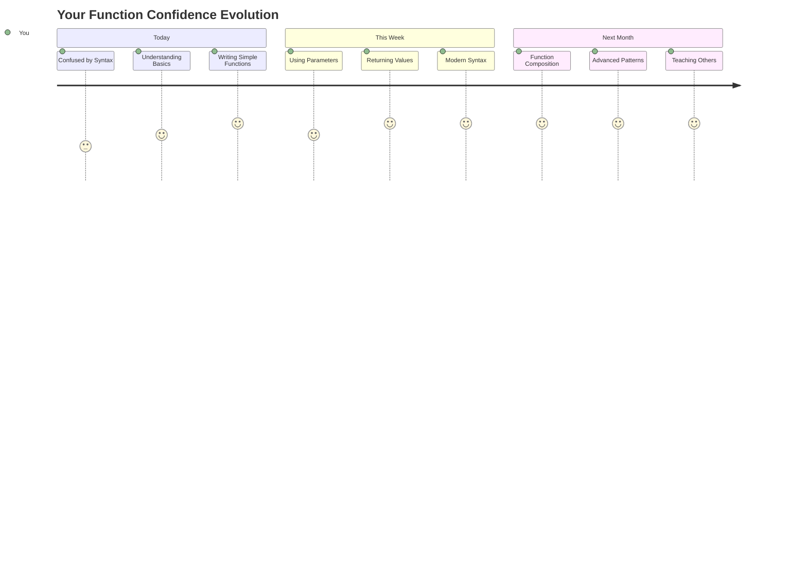
  
> 🎉 **你已經掌握了編程中最強大的概念之一！** 函數是大型程式的基石。你將來建立的每個應用程式都會使用函數來組織、重用和結構化代碼。現在你已經了解如何將邏輯打包成可重用的組件，這使你成為更高效、更有效的程式設計師。歡迎來到模組化編程的世界！🚀  

---

**免責聲明**：  
此文件已使用 AI 翻譯服務 [Co-op Translator](https://github.com/Azure/co-op-translator) 進行翻譯。儘管我們努力確保準確性，但請注意，自動翻譯可能包含錯誤或不準確之處。原始文件的母語版本應被視為權威來源。對於關鍵信息，建議使用專業人工翻譯。我們對因使用此翻譯而產生的任何誤解或誤釋不承擔責任。