<!--
CO_OP_TRANSLATOR_METADATA:
{
  "original_hash": "c688385d15dd3645e924ea0ffee8967f",
  "translation_date": "2025-11-03T23:36:31+00:00",
  "source_file": "2-js-basics/3-making-decisions/README.md",
  "language_code": "mo"
}
-->
# JavaScript 基礎：做出決策


> Sketchnote 作者：[Tomomi Imura](https://twitter.com/girlie_mac)

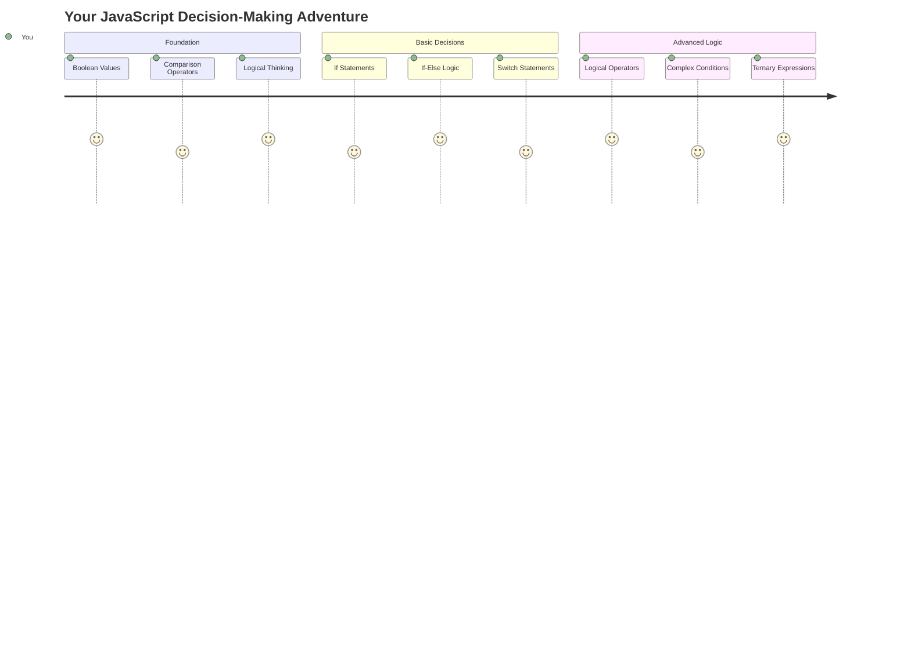

你是否曾經好奇應用程式如何做出聰明的決策？例如導航系統如何選擇最快的路線，或者恆溫器如何決定何時開啟暖氣？這就是程式設計中決策的基本概念。

就像 Charles Babbage 的分析機器被設計用來根據條件執行不同的操作序列一樣，現代的 JavaScript 程式需要根據不同的情況做出選擇。這種分支和做出決策的能力使靜態程式碼轉變為具有回應性和智能的應用程式。

在這堂課中，你將學習如何在程式中實現條件邏輯。我們將探討條件語句、比較運算符和邏輯表達式，這些工具能讓你的程式碼評估情況並做出適當的回應。

## 課前測驗

[課前測驗](https://ff-quizzes.netlify.app/web/quiz/11)

做出決策並控制程式流程是程式設計的基本能力。本節將介紹如何使用布林值和條件邏輯來控制 JavaScript 程式的執行路徑。

[](https://youtube.com/watch?v=SxTp8j-fMMY "做出決策")

> 🎥 點擊上方圖片觀看有關做出決策的影片。

> 你可以在 [Microsoft Learn](https://docs.microsoft.com/learn/modules/web-development-101-if-else/?WT.mc_id=academic-77807-sagibbon) 上學習這堂課！

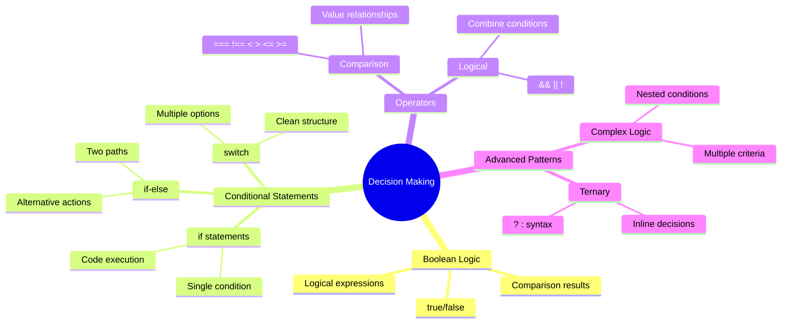

## 布林值簡短回顧

在探討決策之前，讓我們回顧一下上一堂課中的布林值。以數學家 George Boole 命名的布林值代表二元狀態——`true` 或 `false`。沒有模糊地帶，只有明確的結果。

這些二元值構成了所有計算邏輯的基礎。你的程式所做的每一個決策最終都歸結為布林值的評估。

創建布林變數非常簡單：

```javascript
let myTrueBool = true;
let myFalseBool = false;
```

這段程式碼創建了兩個具有明確布林值的變數。

✅ 布林值以英國數學家、哲學家和邏輯學家 George Boole (1815–1864) 命名。

## 比較運算符與布林值

在實際應用中，你很少會手動設置布林值。相反，你會通過評估條件來生成它們，例如：「這個數字是否比那個數字大？」或者「這些值是否相等？」

比較運算符使這些評估成為可能。它們比較值並根據操作數之間的關係返回布林結果。

| 符號  | 描述                                                                                                                                                   | 範例                |
| ------ | ----------------------------------------------------------------------------------------------------------------------------------------------------- | ------------------ |
| `<`    | **小於**：比較兩個值，若左側值小於右側值，則返回 `true` 布林值                                                                                      | `5 < 6 // true`    |
| `<=`   | **小於或等於**：比較兩個值，若左側值小於或等於右側值，則返回 `true` 布林值                                                                          | `5 <= 6 // true`   |
| `>`    | **大於**：比較兩個值，若左側值大於右側值，則返回 `true` 布林值                                                                                      | `5 > 6 // false`   |
| `>=`   | **大於或等於**：比較兩個值，若左側值大於或等於右側值，則返回 `true` 布林值                                                                          | `5 >= 6 // false`  |
| `===`  | **嚴格相等**：比較兩個值，若左右兩側的值相等且類型相同，則返回 `true` 布林值                                                                        | `5 === 6 // false` |
| `!==`  | **不相等**：比較兩個值，返回與嚴格相等運算符相反的布林值                                                                                           | `5 !== 6 // true`  |

✅ 在瀏覽器的控制台中寫一些比較來檢查你的知識。返回的數據是否讓你感到驚訝？

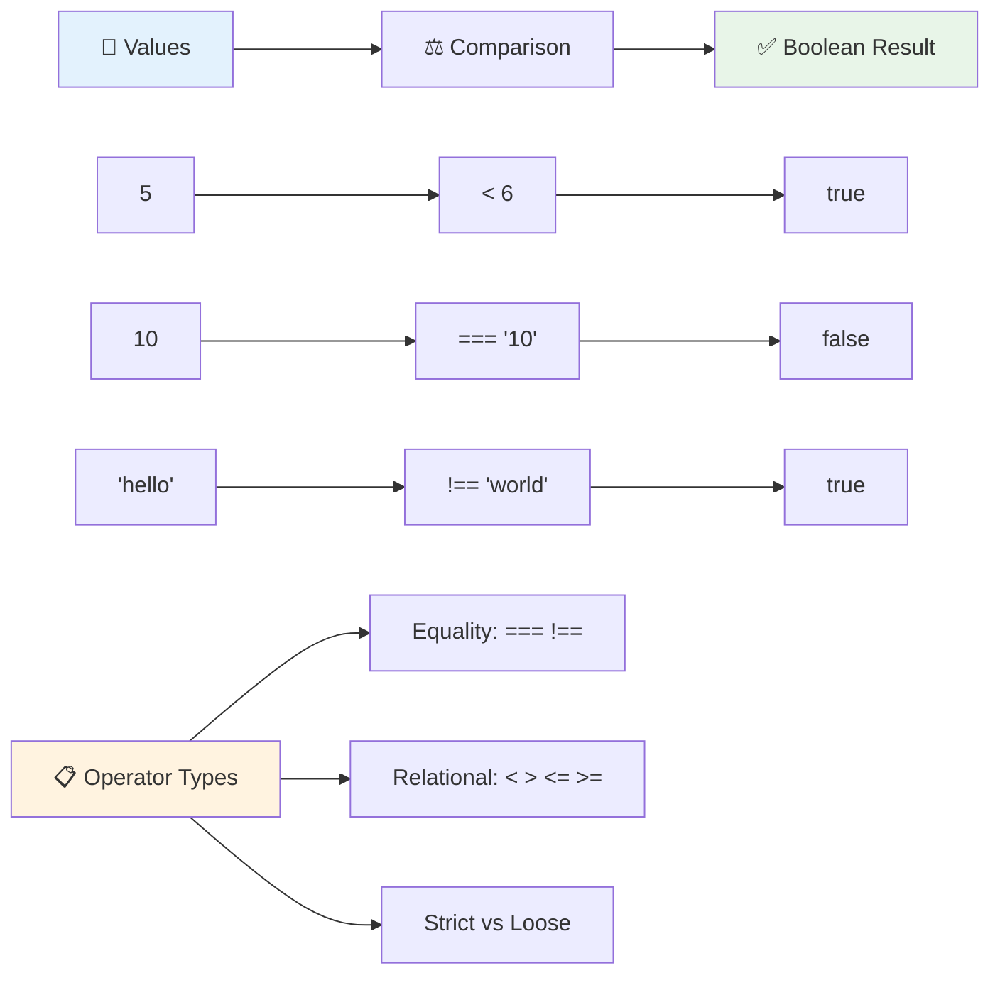

### 🧠 **比較邏輯掌握：理解布林邏輯**

**測試你的比較理解：**
- 為什麼你認為 `===`（嚴格相等）通常比 `==`（寬鬆相等）更受推薦？
- 你能預測 `5 === '5'` 的返回值嗎？`5 == '5'` 又如何？
- `!==` 和 `!=` 有什麼區別？

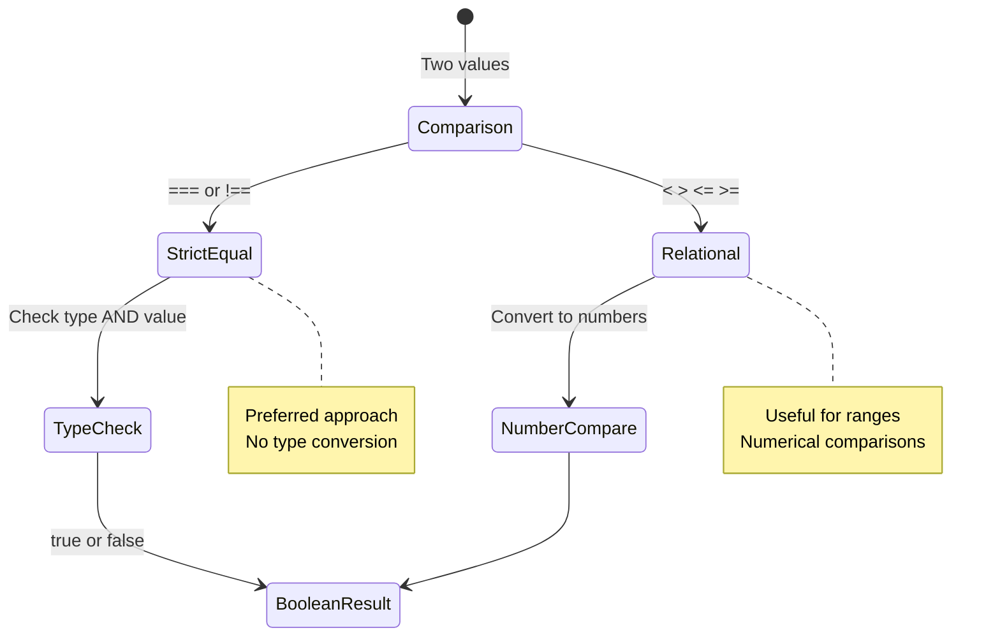

> **專業提示**：除非你特別需要類型轉換，否則始終使用 `===` 和 `!==` 進行相等性檢查。這可以防止意外行為！

## If 語句

`if` 語句就像是在程式中提出問題。「如果這個條件為真，那麼執行這件事。」它可能是你在 JavaScript 中用來做出決策最重要的工具。

以下是它的工作方式：

```javascript
if (condition) {
  // Condition is true. Code in this block will run.
}
```

條件放在括號內，如果條件為 `true`，JavaScript 就會執行大括號內的程式碼。如果條件為 `false`，JavaScript 會跳過整個區塊。

你通常會使用比較運算符來創建這些條件。讓我們看看一個實際的例子：

```javascript
let currentMoney = 1000;
let laptopPrice = 800;

if (currentMoney >= laptopPrice) {
  // Condition is true. Code in this block will run.
  console.log("Getting a new laptop!");
}
```

由於 `1000 >= 800` 的結果為 `true`，區塊內的程式碼會執行，並在控制台顯示「Getting a new laptop!」。

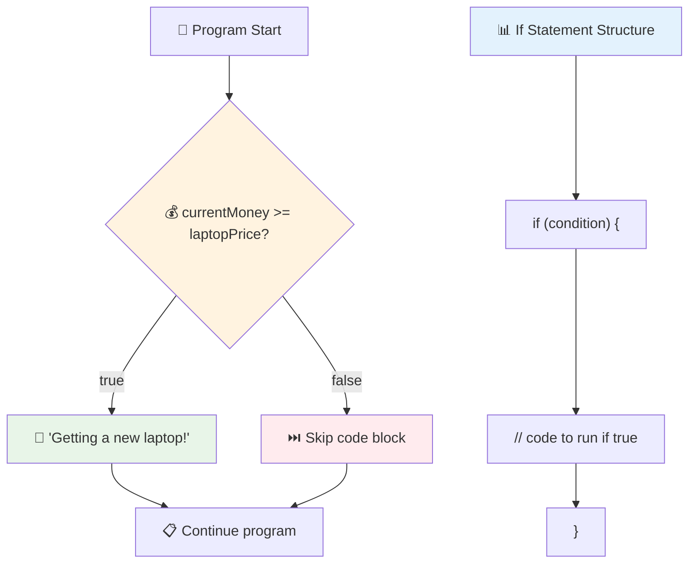

## If..Else 語句

但如果你希望程式在條件為假時執行其他操作呢？這就是 `else` 的作用——它就像一個備案計劃。

`else` 語句讓你可以說「如果這個條件不為真，那麼執行另一件事。」

```javascript
let currentMoney = 500;
let laptopPrice = 800;

if (currentMoney >= laptopPrice) {
  // Condition is true. Code in this block will run.
  console.log("Getting a new laptop!");
} else {
  // Condition is false. Code in this block will run.
  console.log("Can't afford a new laptop, yet!");
}
```

現在，由於 `500 >= 800` 的結果為 `false`，JavaScript 會跳過第一個區塊並執行 `else` 區塊。你會在控制台看到「Can't afford a new laptop, yet!」。

✅ 在瀏覽器控制台中運行這段程式碼來測試你的理解。改變 `currentMoney` 和 `laptopPrice` 變數的值，看看返回的 `console.log()` 有什麼變化。

### 🎯 **If-Else 邏輯檢查：分支路徑**

**評估你的條件邏輯理解：**
- 如果 `currentMoney` 恰好等於 `laptopPrice`，會發生什麼？
- 你能想到一個現實世界中使用 if-else 邏輯的場景嗎？
- 你如何擴展這個邏輯來處理多個價格範圍？

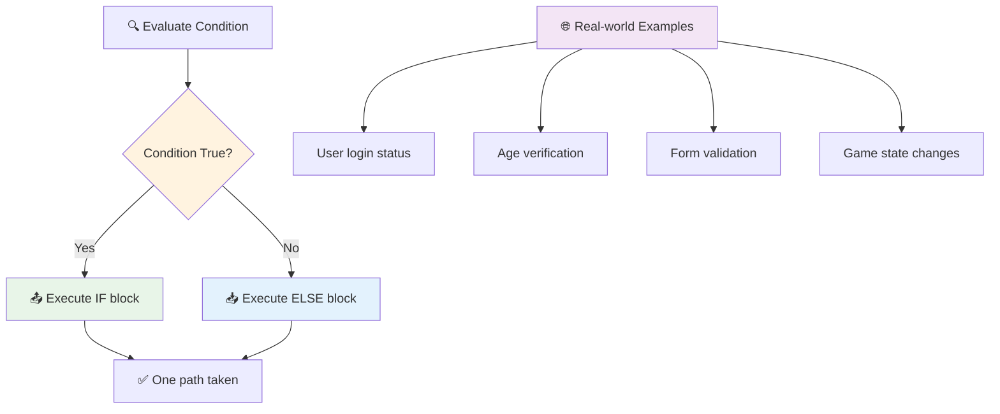

> **關鍵洞察**：If-else 確保只執行一條路徑。這保證你的程式對任何條件都有回應！

## Switch 語句

有時你需要將一個值與多個選項進行比較。雖然你可以鏈接多個 `if..else` 語句，但這種方法會變得笨重。`switch` 語句提供了一種更清晰的結構來處理多個離散值。

這個概念類似於早期電話交換機中的機械切換系統——一個輸入值決定執行的特定路徑。

```javascript
switch (expression) {
  case x:
    // code block
    break;
  case y:
    // code block
    break;
  default:
    // code block
}
```

以下是它的結構：
- JavaScript 只評估一次表達式
- 它會檢查每個 `case` 以找到匹配項
- 找到匹配項後，執行該程式碼區塊
- `break` 告訴 JavaScript 停止並退出 switch
- 如果沒有匹配項，則執行 `default` 區塊（如果有的話）

```javascript
// Program using switch statement for day of week
let dayNumber = 2;
let dayName;

switch (dayNumber) {
  case 1:
    dayName = "Monday";
    break;
  case 2:
    dayName = "Tuesday";
    break;
  case 3:
    dayName = "Wednesday";
    break;
  default:
    dayName = "Unknown day";
    break;
}
console.log(`Today is ${dayName}`);
```

在這個例子中，JavaScript 發現 `dayNumber` 是 `2`，找到匹配的 `case 2`，將 `dayName` 設置為「Tuesday」，然後退出 switch。結果是控制台顯示「Today is Tuesday」。

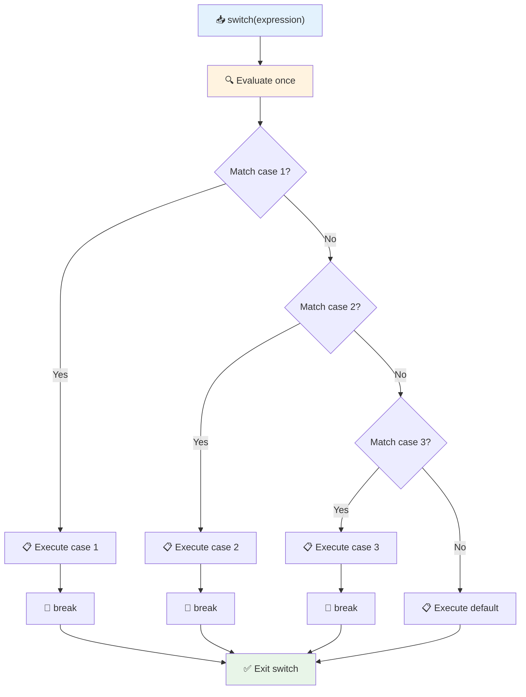

✅ 在瀏覽器控制台中運行這段程式碼來測試你的理解。改變變數 `a` 的值，看看返回的 `console.log()` 有什麼變化。

### 🔄 **Switch 語句掌握：多選項**

**測試你的 switch 理解：**
- 如果忘記了 `break` 語句，會發生什麼？
- 什麼情況下你會選擇使用 `switch` 而不是多個 `if-else` 語句？
- 即使你認為已涵蓋所有可能性，`default` 區塊為什麼仍然有用？

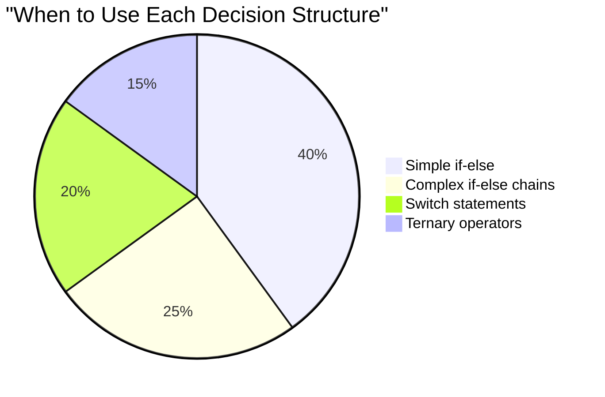

> **最佳實踐**：當比較一個變數與多個特定值時使用 `switch`。對於範圍檢查或複雜條件，使用 `if-else`！

## 邏輯運算符與布林值

複雜的決策通常需要同時評估多個條件。就像布林代數允許數學家結合邏輯表達式一樣，程式設計提供了邏輯運算符來連接多個布林條件。

這些運算符通過結合簡單的真/假評估來實現複雜的條件邏輯。

| 符號  | 描述                                                                                     | 範例                                                                 |
| ------ | --------------------------------------------------------------------------------------- | ------------------------------------------------------------------- |
| `&&`   | **邏輯與**：比較兩個布林表達式。僅當兩側都為真時返回 true                              | `(5 > 3) && (5 < 10) // 兩側都為真。返回 true` |
| `\|\|` | **邏輯或**：比較兩個布林表達式。只要有一側為真就返回 true                              | `(5 > 10) \|\| (5 < 10) // 一側為假，另一側為真。返回 true` |
| `!`    | **邏輯非**：返回布林表達式的相反值                                                     | `!(5 > 10) // 5 不大於 10，所以 "!" 使其為真`         |

這些運算符讓你以有用的方式結合條件：
- 與（`&&`）表示兩個條件都必須為真
- 或（`||`）表示至少一個條件必須為真  
- 非（`!`）將真翻轉為假（反之亦然）

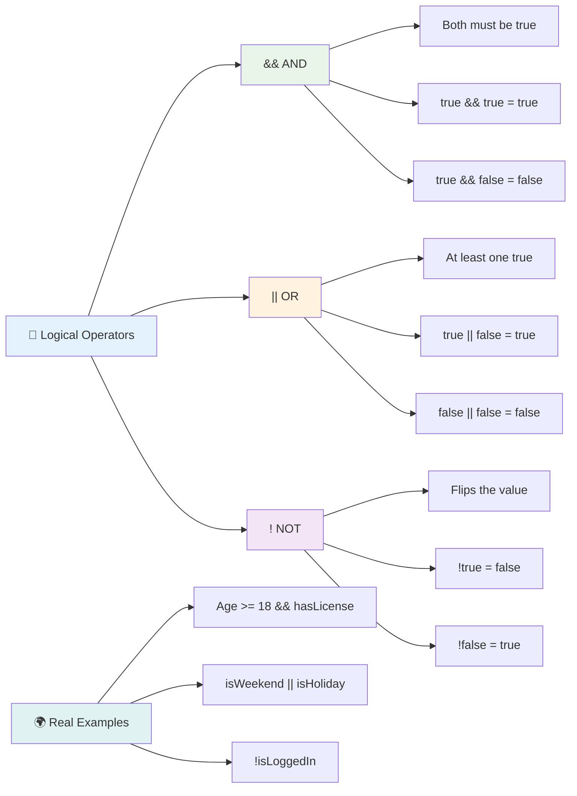

## 使用邏輯運算符進行條件與決策

讓我們用一個更實際的例子來看看這些邏輯運算符的應用：

```javascript
let currentMoney = 600;
let laptopPrice = 800;
let laptopDiscountPrice = laptopPrice - (laptopPrice * 0.2); // Laptop price at 20 percent off

if (currentMoney >= laptopPrice || currentMoney >= laptopDiscountPrice) {
  // Condition is true. Code in this block will run.
  console.log("Getting a new laptop!");
} else {
  // Condition is false. Code in this block will run.
  console.log("Can't afford a new laptop, yet!");
}
```

在這個例子中：我們計算出 20% 折扣價格（640），然後評估我們的可用資金是否能支付全價或折扣價。由於 600 滿足折扣價 640 的條件，該條件評估為真。

### 🧮 **邏輯運算符檢查：結合條件**

**測試你的邏輯運算符理解：**
- 在表達式 `A && B` 中，如果 A 為假，B 會被評估嗎？
- 你能想到一個需要同時使用三個運算符（&&, ||, !）的情況嗎？
- `!user.isActive` 和 `user.isActive !== true` 有什麼區別？

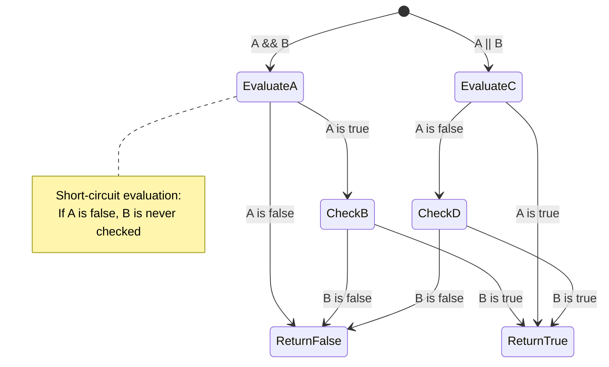

> **性能提示**：JavaScript 使用「短路評估」——在 `A && B` 中，如果 A 為假，B 根本不會被評估。善用這一特性！

### 非運算符

有時候，思考某件事「不為真」會更容易。例如，與其問「用戶是否已登入？」你可能想問「用戶是否未登入？」感嘆號（`!`）運算符可以幫助你翻轉邏輯。

```javascript
if (!condition) {
  // runs if condition is false
} else {
  // runs if condition is true
}
```

`!` 運算符就像在說「相反的...」——如果某件事是 `true`，`!` 會使其變為 `false`，反之亦然。

### 三元運算符

對於簡單的條件賦值，JavaScript 提供了 **三元運算符**。這種簡潔的語法允許你在一行中寫出條件表達式，當需要根據條件分配兩個值之一時非常有用。

```javascript
let variable = condition ? returnThisIfTrue : returnThisIfFalse;
```

它讀起來像一個問題：「這個條件為真嗎？如果是，使用這個值。如果不是，使用那個值。」

以下是一個更具體的例子：

```javascript
let firstNumber = 20;
let secondNumber = 10;
let biggestNumber = firstNumber > secondNumber ? firstNumber : secondNumber;
```

✅ 花點時間多讀幾遍這段程式碼。你理解這些運算符的工作方式嗎？

這行程式碼的意思是：「`firstNumber` 是否大於 `secondNumber`？如果是，將 `firstNumber` 放入 `biggestNumber`。如果不是，將 `secondNumber` 放入 `biggestNumber`。」

三元運算符只是傳統 `if..else` 語句的一種簡化寫法：

```javascript
let biggestNumber;
if (firstNumber > secondNumber) {
  biggestNumber = firstNumber;
} else {
  biggestNumber = secondNumber;
}
```

兩種方法產生的結果完全相同。三元運算符提供了簡潔性，而傳統的 if-else 結構在處理複雜條件時可能更具可讀性。

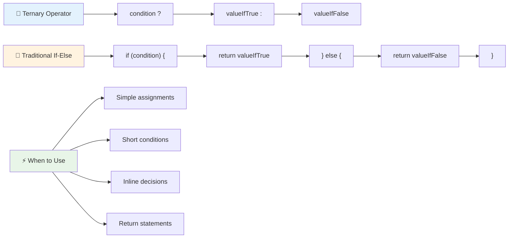

---

## 🚀 挑戰

創建一個程式，先使用邏輯運算符編寫，然後使用三元運算符重寫。你更喜歡哪種語法？

---

## GitHub Copilot Agent 挑戰 🚀

使用 Agent 模式完成以下挑戰：

**描述：** 創建一個全面的成績計算器，展示本課中的多種決策概念，包括 if-else 語句、switch 語句、邏輯運算符和三元運算符。

**提示：** 編寫一個 JavaScript 程式，接收學生的數字分數（0-100），並根據以下標準確定其字母成績：
- A: 90-100
- B: 80-89  
- C: 70-79
- D: 60-69
- F: 低於 60

要求：
1. 使用 if-else 語句來確定字母成績
2. 使用邏輯運算符檢查學生是否通過（成績 >= 60）且是否獲得榮譽（成績 >= 90）
3. 使用 switch 語句為每個字母成績提供具體反饋
4. 使用三元運算符判斷學生是否有資格參加下一門課程（成績 >= 70）
5. 包含輸入驗證以確保分數在 0 到 100 之間

用各種分數測試你的程式，包括邊界情況，例如 59、60、89、90，以及無效輸入。

了解更多關於 [agent mode](https://code.visualstudio.com/blogs/2025/02/24/introducing-copilot-agent-mode) 的資訊。

## 課後測驗

[課後測驗](https://ff-quizzes.netlify.app/web/quiz/12)

## 回顧與自學

閱讀更多關於使用者可用的多種運算符 [在 MDN](https://developer.mozilla.org/docs/Web/JavaScript/Reference/Operators)。

瀏覽 Josh Comeau 的精彩 [運算符查詢工具](https://joshwcomeau.com/operator-lookup/)！

## 作業

[運算符](assignment.md)

---

## 🧠 **你的決策工具箱摘要**

```mermaid
graph TD
    A["🎯 JavaScript Decisions"] --> B["🔍 Boolean Logic"]
    A --> C["📊 Conditional Statements"]
    A --> D["🔗 Logical Operators"]
    A --> E["⚡ Advanced Patterns"]
    
    B --> B1["true/false values"]
    B --> B2["Comparison operators"]
    B --> B3["Truthiness concepts"]
    
    C --> C1["if statements"]
    C --> C2["if-else chains"]
    C --> C3["switch statements"]
    
    D --> D1["&& (AND)"]
    D --> D2["|| (OR)"]
    D --> D3["! (NOT)"]
    
    E --> E1["Ternary operator"]
    E --> E2["Short-circuit evaluation"]
    E --> E3["Complex conditions"]
    
    F["💡 Key Principles"] --> F1["Clear readable conditions"]
    F --> F2["Consistent comparison style"]
    F --> F3["Proper operator precedence"]
    F --> F4["Efficient evaluation order"]
    
    style A fill:#e3f2fd
    style B fill:#e8f5e8
    style C fill:#fff3e0
    style D fill:#f3e5f5
    style E fill:#e0f2f1
    style F fill:#fce4ec
```

---

## 🚀 你的 JavaScript 決策掌握時間表

### ⚡ **你可以在接下來的 5 分鐘內完成的事情**
- [ ] 在瀏覽器控制台練習比較運算符
- [ ] 寫一個簡單的 if-else 語句來檢查你的年齡
- [ ] 嘗試挑戰：使用三元運算符重寫 if-else
- [ ] 測試不同的 "truthy" 和 "falsy" 值會發生什麼

### 🎯 **你可以在這一小時內完成的事情**
- [ ] 完成課後測驗並回顧任何令人困惑的概念
- [ ] 從 GitHub Copilot 挑戰中建立全面的成績計算器
- [ ] 為一個真實場景（例如選擇穿什麼）創建一個簡單的決策樹
- [ ] 練習使用邏輯運算符結合多個條件
- [ ] 為不同的使用情況嘗試使用 switch 語句

### 📅 **你的週期邏輯掌握計劃**
- [ ] 使用創意範例完成運算符作業
- [ ] 使用各種條件結構建立一個迷你測驗應用程式
- [ ] 創建一個表單驗證器，檢查多個輸入條件
- [ ] 練習 Josh Comeau 的 [運算符查詢工具](https://joshwcomeau.com/operator-lookup/) 練習
- [ ] 重構現有程式碼以使用更合適的條件結構
- [ ] 學習短路評估及其性能影響

### 🌟 **你的月度轉型計劃**
- [ ] 掌握複雜的嵌套條件並保持程式碼的可讀性
- [ ] 建立一個具有複雜決策邏輯的應用程式
- [ ] 通過改進現有專案中的條件邏輯來為開源做出貢獻
- [ ] 教授其他人不同的條件結構以及何時使用它們
- [ ] 探索函數式程式設計方法來處理條件邏輯
- [ ] 為條件最佳實踐創建個人參考指南

### 🏆 **最終決策冠軍檢查**

**慶祝你的邏輯思維掌握：**
- 你成功實現的最複雜的決策邏輯是什麼？
- 哪種條件結構對你來說最自然？為什麼？
- 學習邏輯運算符如何改變你的問題解決方法？
- 哪個真實應用程式會受益於複雜的決策邏輯？

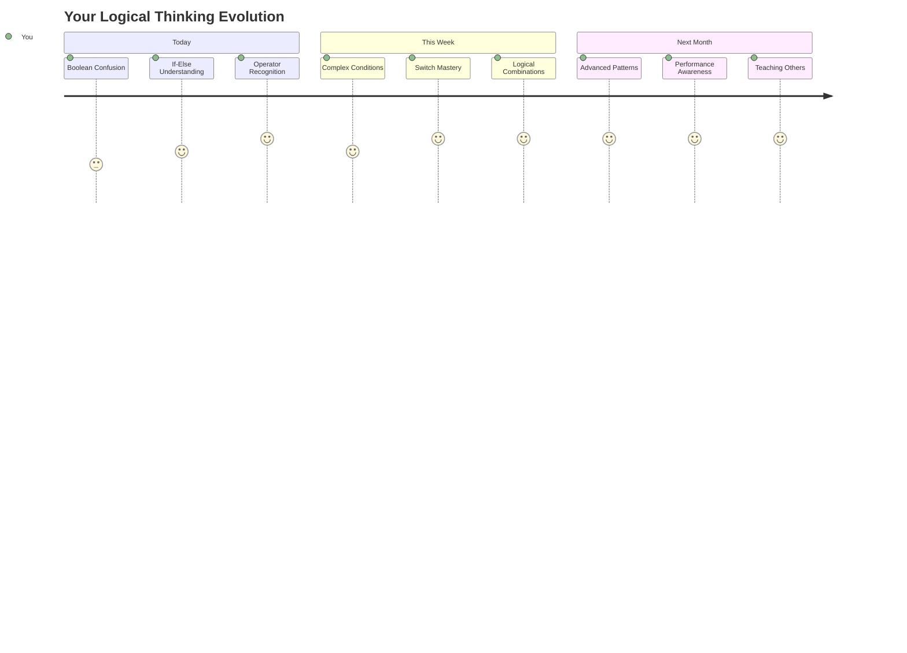

> 🧠 **你已經掌握了數位決策的藝術！** 每個互動式應用程式都依賴條件邏輯來智能地回應使用者行動和變化的情況。你現在了解如何讓你的程式思考、評估並選擇適當的回應。這種邏輯基礎將為你建立的每個動態應用程式提供動力！ 🎉

---

**免責聲明**：  
本文件已使用 AI 翻譯服務 [Co-op Translator](https://github.com/Azure/co-op-translator) 進行翻譯。雖然我們致力於提供準確的翻譯，但請注意，自動翻譯可能包含錯誤或不準確之處。原始文件的母語版本應被視為權威來源。對於關鍵信息，建議使用專業人工翻譯。我們對因使用此翻譯而引起的任何誤解或誤釋不承擔責任。