<!--
CO_OP_TRANSLATOR_METADATA:
{
  "original_hash": "1710a50a519a6e4a1b40a5638783018d",
  "translation_date": "2025-11-03T23:35:57+00:00",
  "source_file": "2-js-basics/4-arrays-loops/README.md",
  "language_code": "mo"
}
-->
# JavaScript 基礎：陣列與迴圈


> Sketchnote 作者：[Tomomi Imura](https://twitter.com/girlie_mac)

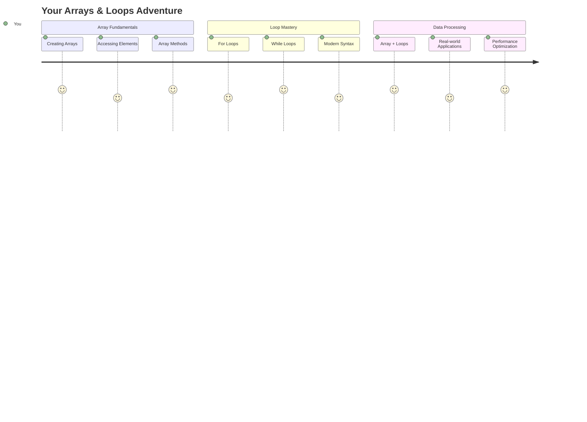

## 課前測驗
[課前測驗](https://ff-quizzes.netlify.app/web/quiz/13)

你是否曾經好奇網站如何追蹤購物車中的商品或顯示好友列表？這就是陣列和迴圈的用途。陣列就像數位容器，可以存放多個資訊，而迴圈則能有效地處理這些數據，避免重複的程式碼。

這兩個概念結合起來，形成了程式中處理資訊的基礎。你將學會如何從手動逐步撰寫每個步驟，轉變為創建能快速處理數百甚至數千項目資料的智能高效程式碼。

在本課程結束時，你將了解如何僅用幾行程式碼完成複雜的數據任務。讓我們一起探索這些重要的程式設計概念吧。

[](https://youtube.com/watch?v=1U4qTyq02Xw "陣列")

[](https://www.youtube.com/watch?v=Eeh7pxtTZ3k "迴圈")

> 🎥 點擊上方圖片觀看有關陣列和迴圈的影片。

> 你可以在 [Microsoft Learn](https://docs.microsoft.com/learn/modules/web-development-101-arrays/?WT.mc_id=academic-77807-sagibbon) 上學習本課程！

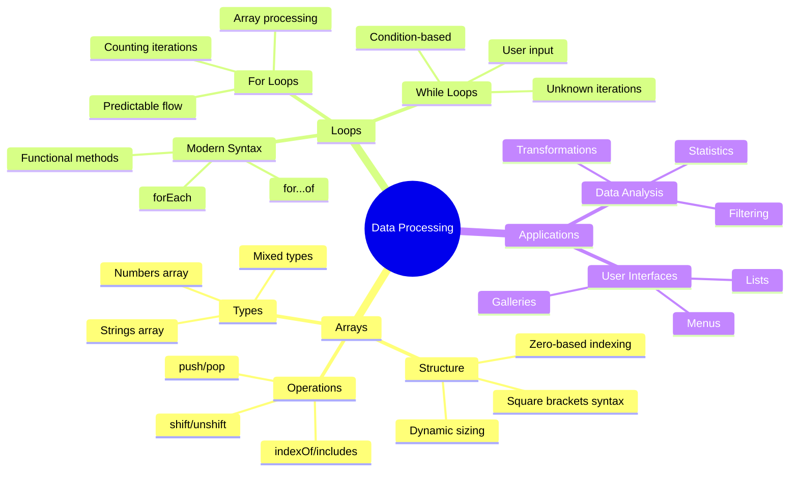

## 陣列

把陣列想像成數位檔案櫃——與其每個抽屜只存放一份文件，你可以在一個結構化的容器中組織多個相關項目。在程式設計中，陣列讓你能夠在一個有組織的包裝中存放多個資訊。

無論你是在建立相片庫、管理待辦事項清單，還是追蹤遊戲中的高分，陣列都是數據組織的基礎。讓我們來看看它是如何運作的。

✅ 陣列無處不在！你能想到一個現實生活中的陣列例子嗎，例如太陽能板陣列？

### 建立陣列

建立陣列非常簡單——只需使用方括號！

```javascript
// Empty array - like an empty shopping cart waiting for items
const myArray = [];
```

**這裡發生了什麼？**
你剛剛使用方括號 `[]` 創建了一個空的容器。把它想像成一個空的圖書館書架——它已準備好存放你想要組織的書籍。

你也可以從一開始就為你的陣列填入初始值：

```javascript
// Your ice cream shop's flavor menu
const iceCreamFlavors = ["Chocolate", "Strawberry", "Vanilla", "Pistachio", "Rocky Road"];

// A user's profile info (mixing different types of data)
const userData = ["John", 25, true, "developer"];

// Test scores for your favorite class
const scores = [95, 87, 92, 78, 85];
```

**值得注意的酷事：**
- 你可以在同一個陣列中存放文字、數字，甚至是 true/false 值
- 只需用逗號分隔每個項目——簡單！
- 陣列非常適合將相關資訊組織在一起

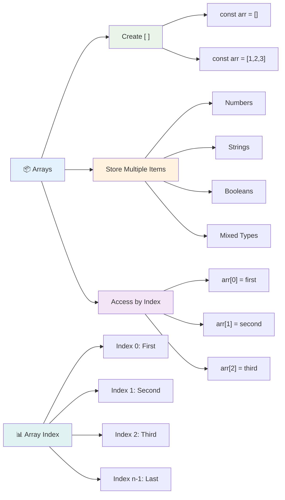

### 陣列索引

有件事可能一開始會讓人感到不習慣：陣列的項目編號是從 0 開始，而不是 1。這種基於零的索引源於電腦記憶體的運作方式——自從像 C 這樣的早期程式語言開始，這就成為了一種程式設計慣例。陣列中的每個位置都有自己的地址編號，稱為 **索引**。

| 索引 | 值 | 描述 |
|-------|-------|-------------|
| 0 | "巧克力" | 第一個元素 |
| 1 | "草莓" | 第二個元素 |
| 2 | "香草" | 第三個元素 |
| 3 | "開心果" | 第四個元素 |
| 4 | "洛基路" | 第五個元素 |

✅ 陣列從零索引開始是否讓你感到驚訝？在某些程式語言中，索引是從 1 開始的。這背後有一段有趣的歷史，你可以在 [維基百科](https://en.wikipedia.org/wiki/Zero-based_numbering) 上閱讀。

**存取陣列元素：**

```javascript
const iceCreamFlavors = ["Chocolate", "Strawberry", "Vanilla", "Pistachio", "Rocky Road"];

// Access individual elements using bracket notation
console.log(iceCreamFlavors[0]); // "Chocolate" - first element
console.log(iceCreamFlavors[2]); // "Vanilla" - third element
console.log(iceCreamFlavors[4]); // "Rocky Road" - last element
```

**這裡發生了什麼？**
- **使用** 方括號表示法和索引號來存取元素
- **返回** 陣列中該特定位置存放的值
- **從** 0 開始計數，第一個元素的索引為 0

**修改陣列元素：**

```javascript
// Change an existing value
iceCreamFlavors[4] = "Butter Pecan";
console.log(iceCreamFlavors[4]); // "Butter Pecan"

// Add a new element at the end
iceCreamFlavors[5] = "Cookie Dough";
console.log(iceCreamFlavors[5]); // "Cookie Dough"
```

**在上面的例子中，我們：**
- **修改** 索引 4 的元素，從 "洛基路" 改為 "奶油胡桃"
- **新增** 一個新元素 "餅乾麵團" 到索引 5
- **自動擴展** 陣列長度，當新增超出目前範圍的元素時

### 陣列長度與常用方法

陣列附帶內建的屬性和方法，使得處理數據更加簡單。

**尋找陣列長度：**

```javascript
const iceCreamFlavors = ["Chocolate", "Strawberry", "Vanilla", "Pistachio", "Rocky Road"];
console.log(iceCreamFlavors.length); // 5

// Length updates automatically as array changes
iceCreamFlavors.push("Mint Chip");
console.log(iceCreamFlavors.length); // 6
```

**需要記住的重點：**
- **返回** 陣列中的元素總數
- **自動更新** 當元素被新增或移除時
- **提供** 用於迴圈和驗證的動態計數

**重要的陣列方法：**

```javascript
const fruits = ["apple", "banana", "orange"];

// Add elements
fruits.push("grape");           // Adds to end: ["apple", "banana", "orange", "grape"]
fruits.unshift("strawberry");   // Adds to beginning: ["strawberry", "apple", "banana", "orange", "grape"]

// Remove elements
const lastFruit = fruits.pop();        // Removes and returns "grape"
const firstFruit = fruits.shift();     // Removes and returns "strawberry"

// Find elements
const index = fruits.indexOf("banana"); // Returns 1 (position of "banana")
const hasApple = fruits.includes("apple"); // Returns true
```

**理解這些方法：**
- 使用 `push()`（尾部）和 `unshift()`（開頭）**新增**元素
- 使用 `pop()`（尾部）和 `shift()`（開頭）**移除**元素
- 使用 `indexOf()` **定位**元素並用 `includes()` 檢查是否存在
- **返回** 有用的值，例如移除的元素或位置索引

✅ 自己試試看！使用瀏覽器的控制台創建並操作一個你自己的陣列。

### 🧠 **陣列基礎檢查：組織你的數據**

**測試你的陣列理解：**
- 你認為為什麼陣列從 0 開始計數而不是 1？
- 如果你嘗試存取不存在的索引（例如在 5 個元素的陣列中使用 `arr[100]`），會發生什麼？
- 你能想到三個現實生活中使用陣列的場景嗎？

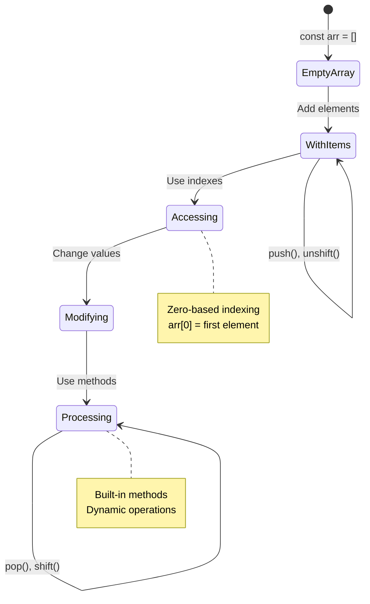

> **現實洞察**：陣列在程式設計中無處不在！社交媒體動態、購物車、相片庫、播放清單歌曲——它們背後都是陣列！

## 迴圈

想像一下查爾斯·狄更斯小說中學生被懲罰時，必須在石板上重複寫句子。如果你能簡單地指示某人「把這句話寫 100 次」，並讓它自動完成，那就是迴圈對程式碼的作用。

迴圈就像擁有一個不知疲倦的助手，可以無誤地重複執行任務。無論你需要檢查購物車中的每個商品，還是顯示相簿中的所有照片，迴圈都能高效地處理重複的工作。

JavaScript 提供了幾種迴圈類型供你選擇。讓我們來看看每一種迴圈，並了解它們的使用時機。

```mermaid
flowchart TD
    A["🔄 Loop Types"] --> B["For Loop"]
    A --> C["While Loop"]
    A --> D["For...of Loop"]
    A --> E["forEach Method"]
    
    B --> B1["Known iterations"]
    B --> B2["Counter-based"]
    B --> B3["for(init; condition; increment)"]
    
    C --> C1["Unknown iterations"]
    C --> C2["Condition-based"]
    C --> C3["while(condition)"]
    
    D --> D1["Modern ES6+"]
    D --> D2["Array iteration"]
    D --> D3["for(item of array)"]
    
    E --> E1["Functional style"]
    E --> E2["Array method"]
    E --> E3["array.forEach(callback)"]
    
    F["⏰ When to Use"] --> F1["For: Counting, indexes"]
    F --> F2["While: User input, searching"]
    F --> F3["For...of: Simple iteration"]
    F --> F4["forEach: Functional programming"]
    
    style A fill:#e3f2fd
    style B fill:#e8f5e8
    style C fill:#fff3e0
    style D fill:#f3e5f5
    style E fill:#e0f2f1
    style F fill:#fce4ec
```

### For 迴圈

`for` 迴圈就像設置一個計時器——你清楚地知道自己希望某件事發生的次數。它非常有條理且可預測，這使得它在處理陣列或需要計數時非常合適。

**For 迴圈結構：**

| 組成部分 | 目的 | 範例 |
|-----------|---------|----------|
| **初始化** | 設定起始點 | `let i = 0` |
| **條件** | 何時繼續 | `i < 10` |
| **遞增** | 如何更新 | `i++` |

```javascript
// Counting from 0 to 9
for (let i = 0; i < 10; i++) {
  console.log(`Count: ${i}`);
}

// More practical example: processing scores
const testScores = [85, 92, 78, 96, 88];
for (let i = 0; i < testScores.length; i++) {
  console.log(`Student ${i + 1}: ${testScores[i]}%`);
}
```

**逐步解析發生了什麼：**
- **初始化** 計數器變數 `i`，初始值為 0
- **檢查** 條件 `i < 10`，在每次迴圈執行前
- **執行** 條件為真時的程式碼區塊
- **遞增** 每次迴圈後將 `i` 加 1
- **停止** 當條件變為假（當 `i` 達到 10 時）

✅ 在瀏覽器控制台中執行此程式碼。當你對計數器、條件或迴圈表達式進行小改動時會發生什麼？你能讓它倒著運行，創建倒數嗎？

### 🗓️ **For 迴圈掌握檢查：受控重複**

**評估你的 for 迴圈理解：**
- For 迴圈的三個部分是什麼？每個部分的作用是什麼？
- 你如何反向迴圈遍歷一個陣列？
- 如果你忘記了遞增部分（`i++`），會發生什麼？

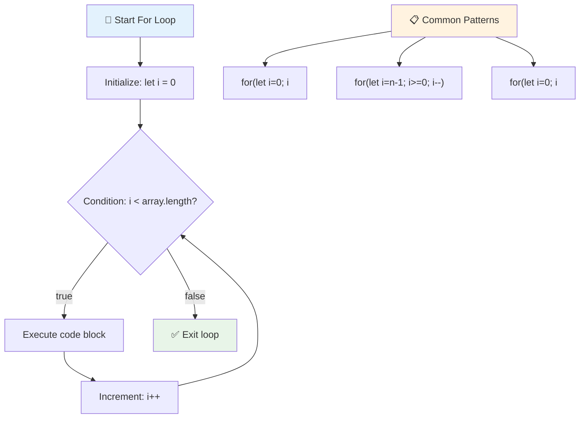

> **迴圈智慧**：當你清楚知道需要重複的次數時，for 迴圈是最完美的選擇。它是處理陣列的最常見選擇！

### While 迴圈

`while` 迴圈就像在說「一直做這件事直到...」——你可能不知道它會執行多少次，但你知道什麼時候停止。它非常適合用於像是要求使用者輸入直到他們給出正確答案，或者在數據中搜尋直到找到所需內容。

**While 迴圈特性：**
- **持續執行** 只要條件為真
- **需要** 手動管理任何計數器變數
- **在每次迴圈前檢查** 條件
- **可能有風險** 如果條件永遠不為假，可能導致無限迴圈

```javascript
// Basic counting example
let i = 0;
while (i < 10) {
  console.log(`While count: ${i}`);
  i++; // Don't forget to increment!
}

// More practical example: processing user input
let userInput = "";
let attempts = 0;
const maxAttempts = 3;

while (userInput !== "quit" && attempts < maxAttempts) {
  userInput = prompt(`Enter 'quit' to exit (attempt ${attempts + 1}):`);
  attempts++;
}

if (attempts >= maxAttempts) {
  console.log("Maximum attempts reached!");
}
```

**理解這些範例：**
- **手動管理** 迴圈內的計數器變數 `i`
- **遞增** 計數器以防止無限迴圈
- **展示** 實際應用場景，例如用戶輸入和嘗試次數限制
- **包含** 防止無限執行的安全機制

### ♾️ **While 迴圈智慧檢查：基於條件的重複**

**測試你的 while 迴圈理解：**
- 使用 while 迴圈的主要風險是什麼？
- 什麼情況下你會選擇使用 while 迴圈而不是 for 迴圈？
- 你如何防止無限迴圈？

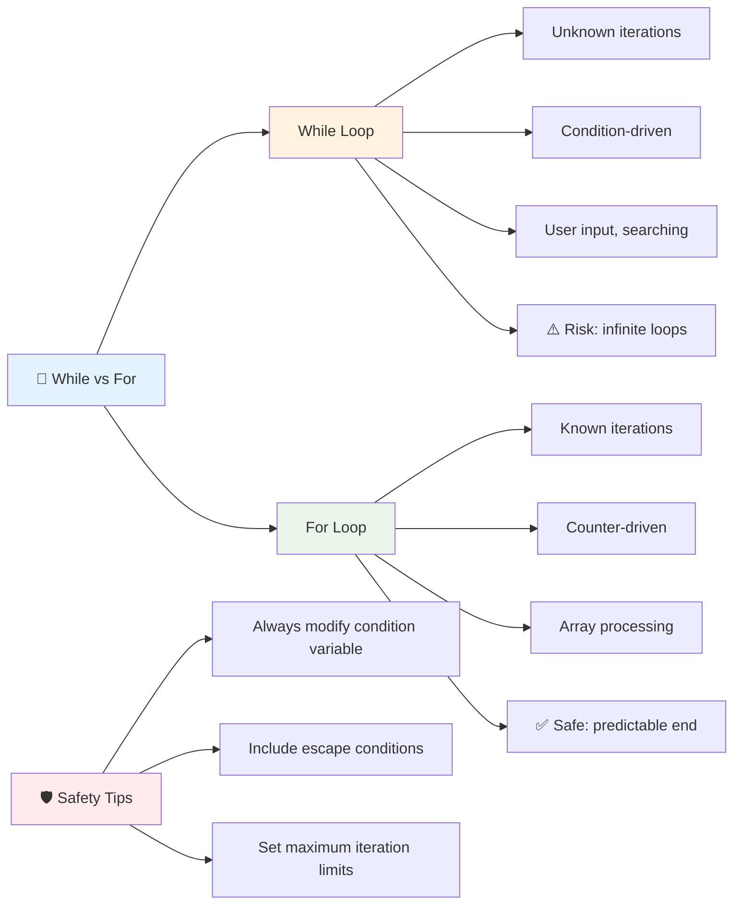

> **安全第一**：While 迴圈功能強大，但需要謹慎管理條件。務必確保你的迴圈條件最終會變為假！

### 現代迴圈替代方案

JavaScript 提供了現代迴圈語法，使你的程式碼更易讀且更少出錯。

**For...of 迴圈（ES6+）：**

```javascript
const colors = ["red", "green", "blue", "yellow"];

// Modern approach - cleaner and safer
for (const color of colors) {
  console.log(`Color: ${color}`);
}

// Compare with traditional for loop
for (let i = 0; i < colors.length; i++) {
  console.log(`Color: ${colors[i]}`);
}
```

**For...of 的主要優勢：**
- **消除** 索引管理和潛在的越界錯誤
- **直接提供** 陣列元素的存取
- **提升** 程式碼可讀性並減少語法複雜性

**forEach 方法：**

```javascript
const prices = [9.99, 15.50, 22.75, 8.25];

// Using forEach for functional programming style
prices.forEach((price, index) => {
  console.log(`Item ${index + 1}: $${price.toFixed(2)}`);
});

// forEach with arrow functions for simple operations
prices.forEach(price => console.log(`Price: $${price}`));
```

**關於 forEach 的重點：**
- **執行** 每個陣列元素的函數
- **提供** 元素值和索引作為參數
- **無法** 提前停止（與傳統迴圈不同）
- **返回** undefined（不會創建新陣列）

✅ 為什麼你會選擇 for 迴圈而不是 while 迴圈？17K 名觀眾在 StackOverflow 上有相同的問題，一些意見可能 [對你有幫助](https://stackoverflow.com/questions/39969145/while-loops-vs-for-loops-in-javascript)。

### 🎨 **現代迴圈語法檢查：擁抱 ES6+**

**評估你的現代 JavaScript 理解：**
- `for...of` 相較於傳統 for 迴圈的優勢是什麼？
- 什麼情況下你仍然會偏好使用傳統 for 迴圈？
- `forEach` 和 `map` 有什麼不同？

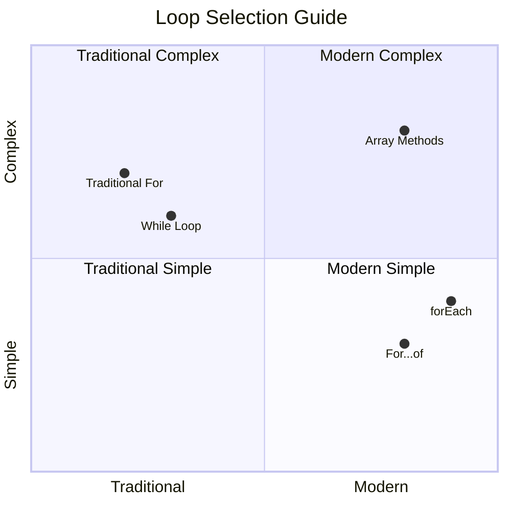

> **現代趨勢**：像 `for...of` 和 `forEach` 的 ES6+ 語法正成為陣列迴圈的首選，因為它更簡潔且更少出錯！

## 迴圈與陣列

將陣列與迴圈結合使用可以創造強大的數據處理能力。這種組合是許多程式任務的基礎，從顯示列表到計算統計數據。

**傳統陣列處理：**

```javascript
const iceCreamFlavors = ["Chocolate", "Strawberry", "Vanilla", "Pistachio", "Rocky Road"];

// Classic for loop approach
for (let i = 0; i < iceCreamFlavors.length; i++) {
  console.log(`Flavor ${i + 1}: ${iceCreamFlavors[i]}`);
}

// Modern for...of approach
for (const flavor of iceCreamFlavors) {
  console.log(`Available flavor: ${flavor}`);
}
```

**讓我們理解每種方法：**
- **使用** 陣列長度屬性來確定迴圈邊界
- **透過索引存取** 傳統 for 迴圈中的元素
- **直接存取** for...of 迴圈中的元素
- **精確處理** 每個陣列元素一次

**實際數據處理範例：**

```javascript
const studentGrades = [85, 92, 78, 96, 88, 73, 89];
let total = 0;
let highestGrade = studentGrades[0];
let lowestGrade = studentGrades[0];

// Process all grades with a single loop
for (let i = 0; i < studentGrades.length; i++) {
  const grade = studentGrades[i];
  total += grade;
  
  if (grade > highestGrade) {
    highestGrade = grade;
  }
  
  if (grade < lowestGrade) {
    lowestGrade = grade;
  }
}

const average = total / studentGrades.length;
console.log(`Average: ${average.toFixed(1)}`);
console.log(`Highest: ${highestGrade}`);
console.log(`Lowest: ${lowestGrade}`);
```

**這段程式碼的運作方式：**
- **初始化** 用於追蹤的變數，例如總和和極值
- **使用** 單一高效迴圈處理每個分數
- **累積** 總分以計算平均值
- **追蹤** 迴圈期間的最高和最低值
- **在迴圈完成後計算** 最終統計數據

✅ 在瀏覽器的控制台中嘗試迴圈遍歷你自己創建的陣列。

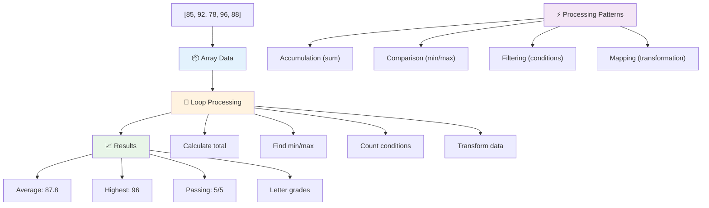

---

## GitHub Copilot Agent 挑戰 🚀

使用 Agent 模式完成以下挑戰：

**描述：** 建立一個綜合數據處理函數，結合陣列和迴圈分析數據集並生成有意義的洞察。

**提示：** 創建一個名為 `analyzeGrades` 的函數，該函數接收一個包含學生成績物件的陣列（每個物件包含 name 和 score 屬性），並返回一個包含統計數據的物件，包括最高分、最低分、平均分、通過人數（分數 >= 70），以及一個分數高於平均分的學生姓名陣列。在解決方案中至少使用兩種不同的迴圈類型。

了解更多有關 [agent 模式](https://code.visualstudio.com/blogs/2025/02/24/introducing-copilot-agent-mode) 的資訊。

## 🚀 挑戰
JavaScript 提供了幾個現代化的陣列方法，可以用來取代傳統的迴圈來完成特定任務。探索 [forEach](https://developer.mozilla.org/docs/Web/JavaScript/Reference/Global_Objects/Array/forEach)、[for-of](https://developer.mozilla.org/docs/Web/JavaScript/Reference/Statements/for...of)、[map](https://developer.mozilla.org/docs/Web/JavaScript/Reference/Global_Objects/Array/map)、[filter](https://developer.mozilla.org/docs/Web/JavaScript/Reference/Global_Objects/Array/filter) 和 [reduce](https://developer.mozilla.org/docs/Web/JavaScript/Reference/Global_Objects/Array/reduce)。

**你的挑戰：** 使用至少三種不同的陣列方法重構學生成績的範例。注意，使用現代 JavaScript 語法後，程式碼會變得更簡潔、更易讀。

## 課後測驗
[課後測驗](https://ff-quizzes.netlify.app/web/quiz/14)

## 回顧與自學

JavaScript 中的陣列附帶許多非常有用的操作方法，適合用來進行資料處理。[深入了解這些方法](https://developer.mozilla.org/docs/Web/JavaScript/Reference/Global_Objects/Array)，並嘗試在你自己建立的陣列上使用一些方法（例如 push、pop、slice 和 splice）。

## 作業

[迴圈處理陣列](assignment.md)

---

## 📊 **你的陣列與迴圈工具包摘要**

```mermaid
graph TD
    A["🎯 Arrays & Loops Mastery"] --> B["📦 Array Fundamentals"]
    A --> C["🔄 Loop Types"]
    A --> D["🔗 Data Processing"]
    A --> E["🎨 Modern Techniques"]
    
    B --> B1["Creation: [ ]"]
    B --> B2["Indexing: arr[0]"]
    B --> B3["Methods: push, pop"]
    B --> B4["Properties: length"]
    
    C --> C1["For: Known iterations"]
    C --> C2["While: Condition-based"]
    C --> C3["For...of: Direct access"]
    C --> C4["forEach: Functional"]
    
    D --> D1["Statistics calculation"]
    D --> D2["Data transformation"]
    D --> D3["Filtering & searching"]
    D --> D4["Real-time processing"]
    
    E --> E1["Arrow functions"]
    E --> E2["Method chaining"]
    E --> E3["Destructuring"]
    E --> E4["Template literals"]
    
    F["💡 Key Benefits"] --> F1["Efficient data handling"]
    F --> F2["Reduced code repetition"]
    F --> F3["Scalable solutions"]
    F --> F4["Cleaner syntax"]
    
    style A fill:#e3f2fd
    style B fill:#e8f5e8
    style C fill:#fff3e0
    style D fill:#f3e5f5
    style E fill:#e0f2f1
    style F fill:#fce4ec
```

---

## 🚀 你的陣列與迴圈精通時間表

### ⚡ **接下來 5 分鐘內可以完成的事**
- [ ] 建立一個包含你最喜愛電影的陣列並存取特定元素
- [ ] 撰寫一個從 1 數到 10 的 for 迴圈
- [ ] 嘗試課程中的現代陣列方法挑戰
- [ ] 在瀏覽器主控台練習陣列索引

### 🎯 **接下來 1 小時內可以完成的事**
- [ ] 完成課後測驗並回顧任何有挑戰性的概念
- [ ] 完成 GitHub Copilot 挑戰中的綜合成績分析器
- [ ] 建立一個簡單的購物車功能，能新增和移除商品
- [ ] 練習不同迴圈類型的轉換
- [ ] 嘗試使用陣列方法，例如 `push`、`pop`、`slice` 和 `splice`

### 📅 **一週的資料處理旅程**
- [ ] 完成「迴圈處理陣列」作業並進行創意改進
- [ ] 使用陣列和迴圈建立一個待辦事項應用程式
- [ ] 建立一個簡單的數據統計計算器
- [ ] 練習使用 [MDN 陣列方法](https://developer.mozilla.org/docs/Web/JavaScript/Reference/Global_Objects/Array)
- [ ] 建立一個相片集或音樂播放清單介面
- [ ] 探索使用 `map`、`filter` 和 `reduce` 進行函數式程式設計

### 🌟 **一個月的轉變**
- [ ] 精通進階陣列操作與效能優化
- [ ] 建立完整的數據視覺化儀表板
- [ ] 參與涉及資料處理的開源專案
- [ ] 用實際範例教導他人陣列與迴圈的使用
- [ ] 建立個人可重複使用的資料處理函數庫
- [ ] 探索基於陣列的演算法與資料結構

### 🏆 **最終資料處理冠軍檢查**

**慶祝你對陣列與迴圈的精通：**
- 你學到的最有用的陣列操作是什麼？它如何應用於現實世界？
- 哪種類型的迴圈對你來說最自然？為什麼？
- 理解陣列與迴圈如何改變你組織資料的方式？
- 你接下來想挑戰什麼複雜的資料處理任務？

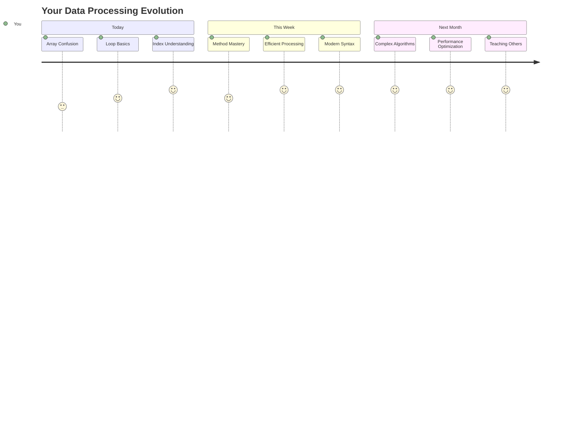

> 📦 **你已解鎖資料組織與處理的力量！** 陣列與迴圈是幾乎所有應用程式的基礎。從簡單的清單到複雜的數據分析，現在你擁有高效且優雅地處理資訊的工具。每個動態網站、行動應用程式和數據驅動的應用程式都依賴這些基本概念。歡迎進入可擴展資料處理的世界！ 🎉

---

**免責聲明**：  
此文件已使用 AI 翻譯服務 [Co-op Translator](https://github.com/Azure/co-op-translator) 進行翻譯。儘管我們努力確保準確性，但請注意，自動翻譯可能包含錯誤或不準確之處。原始文件的母語版本應被視為權威來源。對於關鍵信息，建議使用專業人工翻譯。我們對因使用此翻譯而產生的任何誤解或誤釋不承擔責任。