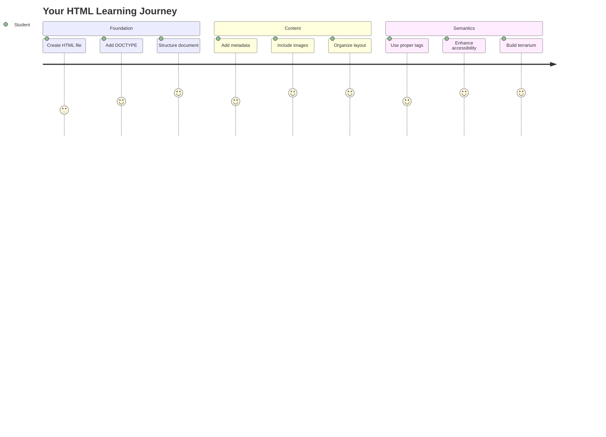
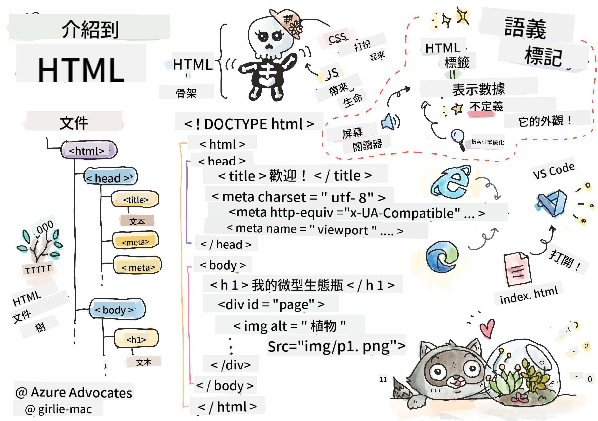
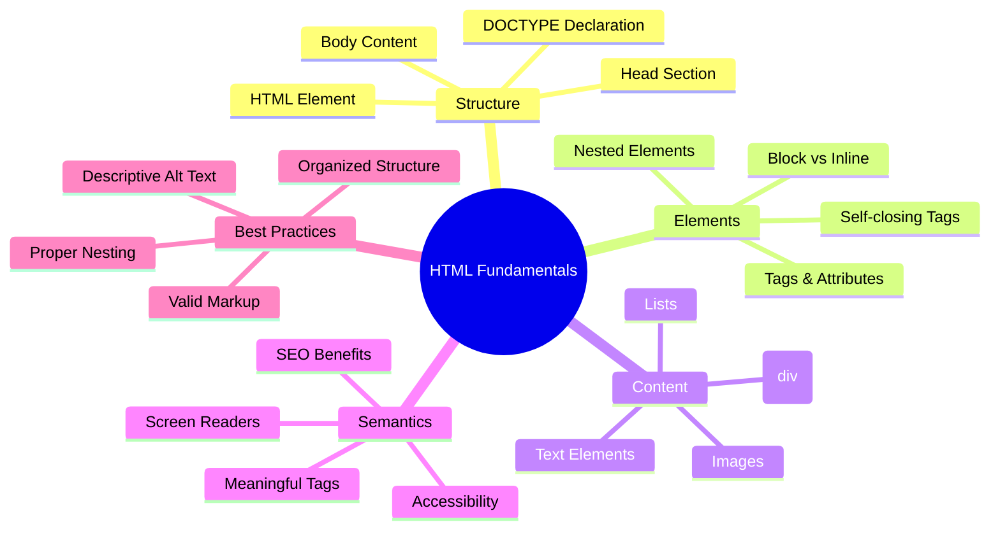
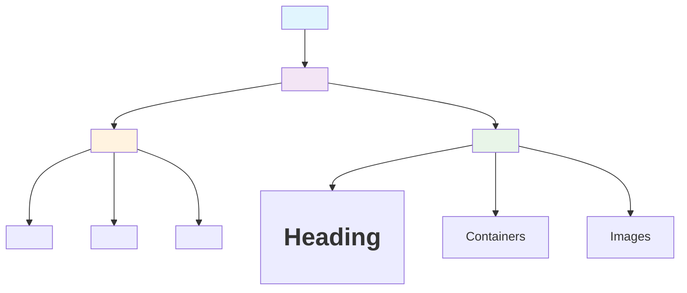
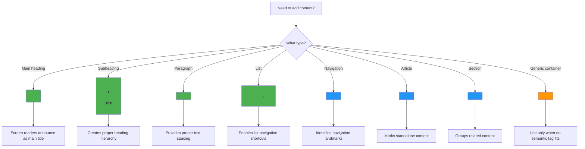
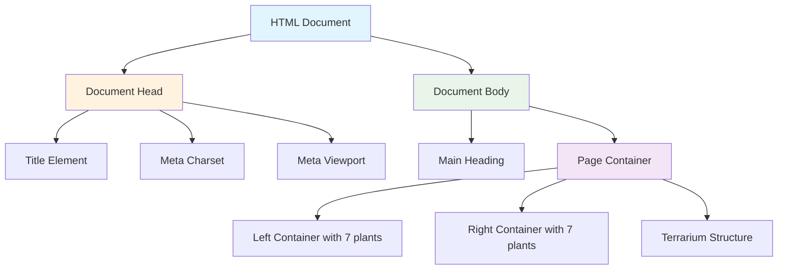
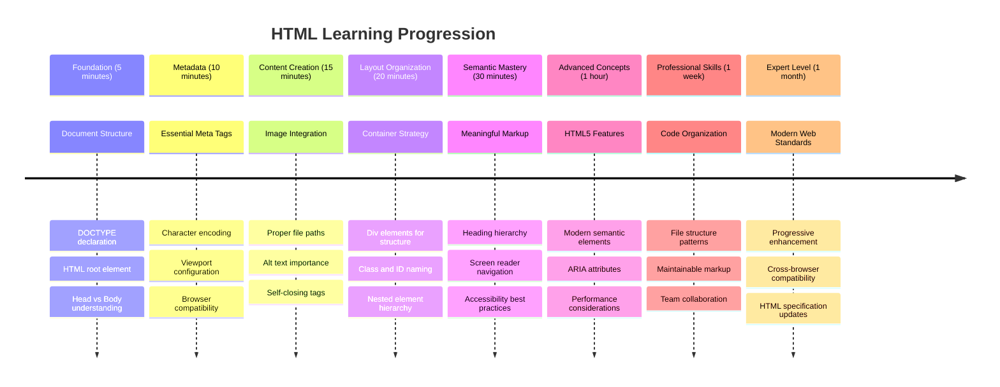

<!--
CO_OP_TRANSLATOR_METADATA:
{
  "original_hash": "3fcfa99c4897e051b558b5eaf1e8cc74",
  "translation_date": "2025-11-03T23:46:10+00:00",
  "source_file": "3-terrarium/1-intro-to-html/README.md",
  "language_code": "mo"
}
-->
# 玻璃花園專案第一部分：HTML入門




> 手繪筆記由 [Tomomi Imura](https://twitter.com/girlie_mac) 提供

HTML，即超文本標記語言，是您曾經瀏覽過的每個網站的基礎。可以將HTML想像成網頁的骨架——它定義了內容的位置、組織方式以及每個部分的意義。雖然CSS稍後會用顏色和佈局來“裝飾”您的HTML，JavaScript則會通過互動性使其“活起來”，但HTML提供了使其他一切成為可能的基本結構。

在本課程中，您將為虛擬玻璃花園界面創建HTML結構。這個動手項目將教您基本的HTML概念，同時構建一些視覺上吸引人的內容。您將學習如何使用語義元素組織內容、處理圖片以及為互動式網頁應用程序創建基礎。

在本課程結束時，您將擁有一個工作中的HTML頁面，顯示有序列的植物圖片，為下一課的樣式設置做好準備。不要擔心它一開始看起來很簡單——這正是HTML在CSS添加視覺效果之前應該做的事情。



## 課前測驗

[課前測驗](https://ff-quizzes.netlify.app/web/quiz/15)

> 📺 **觀看並學習**：查看這段有用的視頻概述
> 
> [](https://www.youtube.com/watch?v=1TvxJKBzhyQ)

## 設置您的專案

在我們深入HTML代碼之前，讓我們為您的玻璃花園專案設置一個合適的工作空間。從一開始就創建一個有組織的文件結構是一個重要的習慣，這將在您的網頁開發過程中對您大有幫助。

### 任務：創建您的專案結構

您將為您的玻璃花園專案創建一個專用文件夾，並添加您的第一個HTML文件。以下是您可以使用的兩種方法：

**選項1：使用Visual Studio Code**
1. 打開Visual Studio Code
2. 點擊“File”→“Open Folder”或使用`Ctrl+K, Ctrl+O`（Windows/Linux）或`Cmd+K, Cmd+O`（Mac）
3. 創建一個名為`terrarium`的新文件夾並選擇它
4. 在Explorer面板中，點擊“New File”圖標
5. 將文件命名為`index.html`


**選項2：使用終端命令**
```bash
mkdir terrarium
cd terrarium
touch index.html
code index.html
```

**這些命令的作用：**
- **創建**一個名為`terrarium`的新目錄作為您的專案文件夾
- **進入**terrarium目錄
- **創建**一個空的`index.html`文件
- **打開**該文件以便在Visual Studio Code中進行編輯

> 💡 **專業提示**：文件名`index.html`在網頁開發中非常特殊。當有人訪問網站時，瀏覽器會自動尋找`index.html`作為默認顯示的頁面。這意味著像`https://mysite.com/projects/`這樣的URL會自動提供`projects`文件夾中的`index.html`文件，而無需在URL中指定文件名。

## 理解HTML文檔結構

每個HTML文檔都遵循特定的結構，瀏覽器需要這種結構來正確理解和顯示內容。可以將這種結構想像成一封正式的信件——它有特定順序的必需元素，幫助接收者（在這裡是瀏覽器）正確處理內容。



讓我們從添加每個HTML文檔所需的基本框架開始。

### DOCTYPE聲明和根元素

任何HTML文件的前兩行都是文檔對瀏覽器的“介紹”：

```html
<!DOCTYPE html>
<html></html>
```

**理解這段代碼的作用：**
- **聲明**文檔類型為HTML5，使用`<!DOCTYPE html>`
- **創建**包含所有頁面內容的根`<html>`元素
- **建立**現代網頁標準以確保瀏覽器正確渲染
- **保證**在不同瀏覽器和設備上的一致顯示效果

> 💡 **VS Code提示**：在VS Code中將鼠標懸停在任何HTML標籤上，可以查看來自MDN Web Docs的有用信息，包括使用示例和瀏覽器兼容性細節。

> 📚 **了解更多**：DOCTYPE聲明可以防止瀏覽器進入“怪異模式”，該模式曾用於支持非常舊的網站。現代網頁開發使用簡單的`<!DOCTYPE html>`聲明來確保[符合標準的渲染](https://developer.mozilla.org/docs/Web/HTML/Quirks_Mode_and_Standards_Mode)。

### 🔄 **教學檢查**
**暫停並反思**：在繼續之前，請確保您理解：
- ✅ 為什麼每個HTML文檔都需要DOCTYPE聲明
- ✅ `<html>`根元素包含什麼
- ✅ 此結構如何幫助瀏覽器正確渲染頁面

**快速自測**：您能用自己的話解釋“符合標準的渲染”是什麼意思嗎？

## 添加基本文檔元數據

HTML文檔的`<head>`部分包含瀏覽器和搜索引擎需要的重要信息，但訪問者不會直接在頁面上看到這些信息。可以將其視為幫助您的網頁正常運行並在不同設備和平台上正確顯示的“幕後信息”。

這些元數據告訴瀏覽器如何顯示您的頁面、使用什麼字符編碼以及如何處理不同的屏幕尺寸——這些都是創建專業、可訪問網頁的必要條件。

### 任務：添加文檔頭部

在您的開頭和結尾`<html>`標籤之間插入以下`<head>`部分：

```html
<head>
	<title>Welcome to my Virtual Terrarium</title>
	<meta charset="utf-8" />
	<meta http-equiv="X-UA-Compatible" content="IE=edge" />
	<meta name="viewport" content="width=device-width, initial-scale=1" />
</head>
```

**分解每個元素的作用：**
- **設置**顯示在瀏覽器標籤和搜索結果中的頁面標題
- **指定**UTF-8字符編碼以便全球範圍內正確顯示文本
- **確保**與現代版本的Internet Explorer兼容
- **配置**響應式設計，通過設置視口匹配設備寬度
- **控制**初始縮放級別以自然大小顯示內容

> 🤔 **思考一下**：如果您將視口meta標籤設置為這樣：`<meta name="viewport" content="width=600">`會發生什麼？這將強制頁面始終保持600像素寬，破壞響應式設計！了解更多關於[正確的視口配置](https://developer.mozilla.org/docs/Web/HTML/Viewport_meta_tag)。

## 建立文檔主體

`<body>`元素包含網頁的所有可見內容——用戶將看到和交互的所有內容。雖然`<head>`部分向瀏覽器提供指令，但`<body>`部分包含實際內容：文本、圖片、按鈕以及創建用戶界面的其他元素。

讓我們添加主體結構並了解HTML標籤如何協同工作以創建有意義的內容。

### 理解HTML標籤結構

HTML使用成對的標籤來定義元素。大多數標籤都有像`<p>`這樣的開頭標籤和像`</p>`這樣的結尾標籤，中間包含內容：`<p>Hello, world!</p>`。這創建了一個包含文本“Hello, world!”的段落元素。

### 任務：添加主體元素

更新您的HTML文件以包含`<body>`元素：

```html
<!DOCTYPE html>
<html>
	<head>
		<title>Welcome to my Virtual Terrarium</title>
		<meta charset="utf-8" />
		<meta http-equiv="X-UA-Compatible" content="IE=edge" />
		<meta name="viewport" content="width=device-width, initial-scale=1" />
	</head>
	<body></body>
</html>
```

**這個完整結構提供了以下內容：**
- **建立**基本的HTML5文檔框架
- **包含**正確的元數據以便瀏覽器正確渲染
- **創建**一個空的主體以容納可見內容
- **遵循**現代網頁開發的最佳實踐

現在您已準備好添加玻璃花園的可見元素。我們將使用`<div>`元素作為容器來組織不同的內容部分，並使用``元素顯示植物圖片。

### 使用圖片和佈局容器

圖片在HTML中很特別，因為它們使用“自閉合”標籤。與`<p></p>`等包裹內容的元素不同，``標籤本身包含所有必要的信息，通過`src`屬性指定圖片文件路徑，通過`alt`屬性提供可訪問性。

在將圖片添加到HTML之前，您需要通過創建一個images文件夾並添加植物圖片來正確組織您的專案文件。

**首先，設置您的圖片：**
1. 在您的玻璃花園專案文件夾中創建一個名為`images`的文件夾
2. 從[解決方案文件夾](../../../../3-terrarium/solution/images)下載植物圖片（共14張植物圖片）
3. 將所有植物圖片複製到您的新`images`文件夾中

### 任務：創建植物展示佈局

現在在您的`<body></body>`標籤之間添加有序的植物圖片佈局：

```html
<div id="page">
	<div id="left-container" class="container">
		<div class="plant-holder">
			
		</div>
		<div class="plant-holder">
			
		</div>
		<div class="plant-holder">
			
		</div>
		<div class="plant-holder">
			
		</div>
		<div class="plant-holder">
			
		</div>
		<div class="plant-holder">
			
		</div>
		<div class="plant-holder">
			
		</div>
	</div>
	<div id="right-container" class="container">
		<div class="plant-holder">
			
		</div>
		<div class="plant-holder">
			
		</div>
		<div class="plant-holder">
			
		</div>
		<div class="plant-holder">
			
		</div>
		<div class="plant-holder">
			
		</div>
		<div class="plant-holder">
			
		</div>
		<div class="plant-holder">
			
		</div>
	</div>
</div>
```

**逐步解析此代碼的作用：**
- **創建**一個主頁面容器，`id="page"`，用於容納所有內容
- **建立**兩個列容器：`left-container`和`right-container`
- **組織**左列7個植物，右列7個植物
- **包裹**每個植物圖片在`plant-holder`的div中以便單獨定位
- **應用**一致的類名以便下一課進行CSS樣式設置
- **分配**唯一的ID給每個植物圖片以便後續JavaScript交互
- **包含**指向images文件夾的正確文件路徑

> 🤔 **思考一下**：注意所有圖片目前都有相同的alt文字“plant”。這對於可訪問性來說並不理想。使用屏幕閱讀器的用戶會聽到“plant”重複14次，無法知道每張圖片顯示的是哪種植物。您能想到更好、更具描述性的alt文字嗎？

> 📝 **HTML元素類型**：`<div>`元素是“塊級”元素，佔據整個寬度，而`<span>`元素是“內聯”元素，只佔據必要的寬度。如果您將所有這些`<div>`標籤更改為`<span>`標籤，您認為會發生什麼？

### 🔄 **教學檢查**
**結構理解**：花點時間回顧您的HTML結構：
- ✅ 您能識別佈局中的主要容器嗎？
- ✅ 您理解為什麼每張圖片都有唯一的ID嗎？
- ✅ 您如何描述`plant-holder` div的用途？

**視覺檢查**：在瀏覽器中打開您的HTML文件。您應該看到：
- 一個基本的植物圖片列表
- 圖片分為兩列
- 簡單的未設置樣式的佈局

**記住**：這種簡單的外觀正是CSS設置樣式之前HTML應該呈現的樣子！

添加這些標記後，植物將顯示在屏幕上，儘管它們看起來還不夠精美——這就是下一課中CSS的作用！目前，您已經擁有一個堅實的HTML基礎，可以正確地組織您的內容並遵循可訪問性最佳實踐。

## 使用語義HTML提升可訪問性

語義HTML意味著根據元素的意義和用途選擇HTML元素，而不僅僅是根據它們的外觀。使用語義標記時，您是在向瀏覽器、搜索引擎和屏幕閱讀器等輔助技術傳達內容的結構和意義。



這種方法使您的網站對殘障用戶更具可訪問性，並幫助搜索引擎更好地理解您的內容。這是現代網頁開發的一個基本原則，旨在為每個人創造更好的體驗。

### 添加語義頁面標題

讓我們為您的玻璃花園頁面添加一個合適的標題。在您的開頭`<body>`標籤之後插入以下行：

```html
<h1>My Terrarium</h1>
```

**為什麼語義標記很重要：**
- **幫助**屏幕閱讀器導航和理解頁面結構
- **改善**搜索引擎優化（SEO），通過明確內容層次結構
- **提升**視障或認知障礙用戶的可訪問性
- **創造**更好的用戶體驗，適用於所有設備和平台
- **遵循**網頁標準和專業開發的最佳實踐

**語義選擇與非語義選擇的示例：**

| 用途 | ✅ 語義選擇 | ❌ 非語義選擇 |
|------|------------|--------------|
| 主標題 | `<h1>標題</h1>` | `<div class="big-text">標題</div>` |
| 導航 | `<nav><ul><li></li></ul></nav>` | `<div class="menu"><div></div></div>` |
| 按鈕 | `<button>點擊我</button>` | `<span onclick="...">點擊我</span>` |
| 文章內容 | `<article><p></p></article>` | `<div class="content"><div></div></div>` |

> 🎥 **行動中的示例**：觀看[屏幕閱讀器如何與網頁交互](https://www.youtube.com/watch?v=OUDV1gqs9GA)，了解為什麼語義標記對可訪問性至關重要。注意正確的HTML結構如何幫助用戶高效導航。

## 創建玻璃花園容器

現在讓我們添加玻璃花園本身的HTML結構——植物最終將被放置的玻璃容器。這部分展示了一個重要概念：HTML提供結構，但如果沒有CSS樣式，這些元素目前還不會顯示出來。

玻璃花園的標記使用描述性的類名，這將使下一課中的CSS樣式設置更加直觀和易於維護。

### 任務：添加玻璃花園結構

在最後一個`</div>`標籤上方（頁面容器的閉合標籤之前）插入以下標記：

```html
<div id="terrarium">
	<div class="jar-top"></div>
	<div class="jar-walls">
		<div class="jar-glossy-long"></div>
		<div class="jar-glossy-short"></div>
	</div>
	<div class="dirt"></div>
	<div class="jar-bottom"></div>
</div>
```

**理解這個玻璃花園結構：**
- **創建**一個主玻璃花園容器，並賦予唯一的ID以便樣式設置
- **定義**每個視覺組件的獨立元素（頂部、牆壁、泥土、底部）
- **包含**嵌套元素以呈現玻璃反射效果（光澤元素）
- **使用**描述性類名，清楚地表明每個元素的用途
- **準備**結構以便使用 CSS 樣式創建玻璃生態瓶的外觀

> 🤔 **注意到什麼了嗎？**：即使你添加了這些標記，頁面上也沒有看到任何新內容！這完美地說明了 HTML 提供結構，而 CSS 則提供外觀。這些 `<div>` 元素已存在，但尚未有任何視覺樣式——這部分內容將在下一課中介紹！



### 🔄 **教學檢查**
**HTML 結構掌握**：在繼續之前，確保你能夠：
- ✅ 解釋 HTML 結構與視覺外觀的區別
- ✅ 辨識語義化與非語義化的 HTML 元素
- ✅ 描述正確的標記如何有助於無障礙設計
- ✅ 認識完整的文檔樹結構

**測試你的理解**：嘗試在瀏覽器中打開你的 HTML 文件，禁用 JavaScript 並移除 CSS。這樣可以看到你所創建的純語義結構！

---

## GitHub Copilot Agent 挑戰

使用 Agent 模式完成以下挑戰：

**描述**：為植物護理指南部分創建語義化的 HTML 結構，該部分可以添加到生態瓶項目中。

**提示**：創建一個語義化的 HTML 部分，包含主標題「植物護理指南」，三個子部分標題「澆水」、「光照需求」和「土壤護理」，每個部分包含一段植物護理信息。使用適當的語義化 HTML 標籤，例如 `<section>`、`<h2>`、`<h3>` 和 `<p>`，以適當地結構化內容。

了解更多關於 [agent 模式](https://code.visualstudio.com/blogs/2025/02/24/introducing-copilot-agent-mode) 的信息。

## 探索 HTML 歷史挑戰

**了解網絡演變**

自從 Tim Berners-Lee 在 1990 年於 CERN 創建第一個網絡瀏覽器以來，HTML 已經有了顯著的演變。一些較舊的標籤，例如 `<marquee>`，現在已被棄用，因為它們不符合現代的無障礙標準和響應式設計原則。

**試試這個實驗：**
1. 暫時將你的 `<h1>` 標題包裹在 `<marquee>` 標籤中：`<marquee><h1>我的生態瓶</h1></marquee>`
2. 在瀏覽器中打開你的頁面並觀察滾動效果
3. 思考為什麼這個標籤被棄用（提示：考慮用戶體驗和無障礙性）
4. 移除 `<marquee>` 標籤並恢復語義化標記

**反思問題：**
- 滾動標題如何影響視覺障礙或對運動敏感的用戶？
- 有哪些現代 CSS 技術可以更無障礙地實現類似的視覺效果？
- 為什麼使用當前的網絡標準而不是棄用的元素很重要？

探索更多關於 [過時和棄用的 HTML 元素](https://developer.mozilla.org/docs/Web/HTML/Element#Obsolete_and_deprecated_elements)，了解網絡標準如何演變以改善用戶體驗。

## 課後測驗

[課後測驗](https://ff-quizzes.netlify.app/web/quiz/16)

## 回顧與自學

**深化你的 HTML 知識**

HTML 作為網絡的基礎已經有超過 30 年的歷史，從一種簡單的文檔標記語言演變為構建交互式應用程序的複雜平台。了解這種演變有助於你更好地理解現代網絡標準並做出更好的開發決策。

**推薦學習路徑：**

1. **HTML 的歷史與演變**
   - 研究從 HTML 1.0 到 HTML5 的時間線
   - 探索為什麼某些標籤被棄用（無障礙性、移動友好性、可維護性）
   - 調查新興的 HTML 功能和提案

2. **語義化 HTML 深入研究**
   - 學習 [HTML5 語義元素](https://developer.mozilla.org/docs/Web/HTML/Element) 的完整列表
   - 練習何時使用 `<article>`、`<section>`、`<aside>` 和 `<main>`
   - 了解用於增強無障礙性的 ARIA 屬性

3. **現代網絡開發**
   - 探索 [構建響應式網站](https://docs.microsoft.com/learn/modules/build-simple-website/?WT.mc_id=academic-77807-sagibbon) 的 Microsoft Learn 模塊
   - 理解 HTML 如何與 CSS 和 JavaScript 集成
   - 學習網絡性能和 SEO 的最佳實踐

**反思問題：**
- 你發現了哪些被棄用的 HTML 標籤，為什麼它們被移除？
- 未來版本中有哪些新的 HTML 功能正在被提議？
- 語義化 HTML 如何促進網絡無障礙性和 SEO？

### ⚡ **你可以在接下來的 5 分鐘內完成的事情**
- [ ] 打開開發者工具（F12），檢查你最喜歡的網站的 HTML 結構
- [ ] 創建一個包含基本標籤的簡單 HTML 文件：`<h1>`、`<p>` 和 ``
- [ ] 使用 W3C HTML Validator 在線驗證你的 HTML
- [ ] 嘗試使用 `<!-- comment -->` 在 HTML 中添加註解

### 🎯 **你可以在接下來的一小時內完成的事情**
- [ ] 完成課後測驗並回顧語義化 HTML 概念
- [ ] 使用正確的 HTML 結構構建一個關於自己的簡單網頁
- [ ] 嘗試使用不同的標題級別和文本格式標籤
- [ ] 添加圖片和鏈接以練習多媒體集成
- [ ] 研究你尚未嘗試過的 HTML5 功能

### 📅 **你的 HTML 一周學習計劃**
- [ ] 使用語義化標記完成生態瓶項目作業
- [ ] 使用 ARIA 標籤和角色創建一個無障礙網頁
- [ ] 練習使用各種輸入類型創建表單
- [ ] 探索 HTML5 API，例如 localStorage 或地理定位
- [ ] 學習響應式 HTML 模式和移動優先設計
- [ ] 回顧其他開發者的 HTML 代碼以學習最佳實踐

### 🌟 **你的 HTML 一個月基礎之旅**
- [ ] 構建一個展示你 HTML 技能的作品集網站
- [ ] 使用像 Handlebars 這樣的框架學習 HTML 模板化
- [ ] 通過改進 HTML 文檔為開源項目做出貢獻
- [ ] 掌握高級 HTML 概念，例如自定義元素
- [ ] 將 HTML 與 CSS 框架和 JavaScript 庫集成
- [ ] 指導其他人學習 HTML 基礎知識

## 🎯 你的 HTML 精通時間表



### 🛠️ 你的 HTML 工具包摘要

完成本課程後，你現在擁有：
- **文檔結構**：完整的 HTML5 基礎，包含正確的 DOCTYPE
- **語義化標記**：增強無障礙性和 SEO 的有意義標籤
- **圖片集成**：正確的文件組織和 alt 文本實踐
- **佈局容器**：使用描述性類名的策略性 div
- **無障礙意識**：了解屏幕閱讀器的導航方式
- **現代標準**：當前的 HTML5 實踐和棄用標籤知識
- **項目基礎**：為 CSS 樣式和 JavaScript 交互打下堅實基礎

**下一步**：你的 HTML 結構已準備好進行 CSS 樣式設計！你所構建的語義基礎將使下一課更容易理解。

## 作業

[練習你的 HTML：構建博客模型](assignment.md)

---

**免責聲明**：  
本文件已使用 AI 翻譯服務 [Co-op Translator](https://github.com/Azure/co-op-translator) 進行翻譯。儘管我們努力確保翻譯的準確性，但請注意，自動翻譯可能包含錯誤或不準確之處。原始文件的母語版本應被視為權威來源。對於關鍵信息，建議使用專業人工翻譯。我們對因使用此翻譯而引起的任何誤解或誤釋不承擔責任。