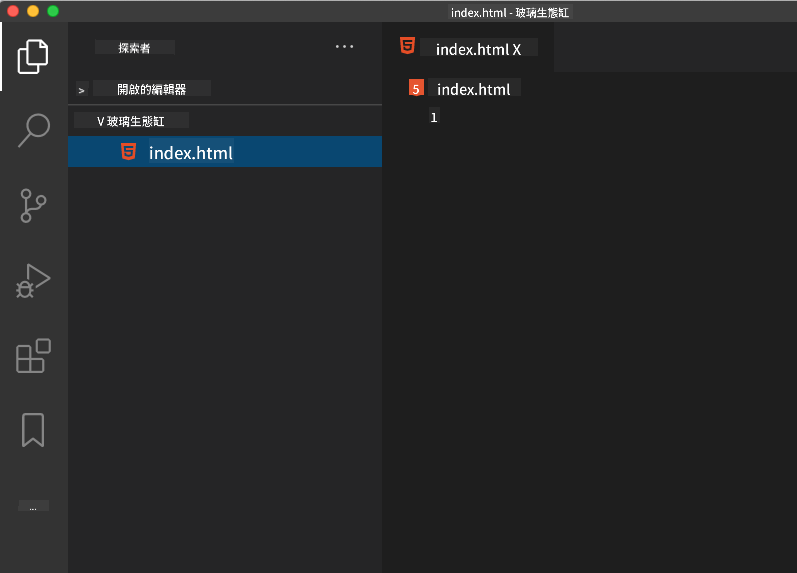

<!--
CO_OP_TRANSLATOR_METADATA:
{
  "original_hash": "46a0639e719b9cf1dfd062aa24cad639",
  "translation_date": "2025-08-25T21:07:09+00:00",
  "source_file": "3-terrarium/1-intro-to-html/README.md",
  "language_code": "mo"
}
-->
# Terrarium 專案第一部分：HTML 簡介

  
> 手繪筆記由 [Tomomi Imura](https://twitter.com/girlie_mac) 提供

## 課前測驗

[課前測驗](https://ff-quizzes.netlify.app/web/quiz/15)

> 查看影片

> 
> [](https://www.youtube.com/watch?v=1TvxJKBzhyQ)

### 簡介

HTML，全名為超文本標記語言 (HyperText Markup Language)，是網頁的「骨架」。如果說 CSS 是為 HTML「穿上衣服」，JavaScript 是讓它「活起來」，那麼 HTML 就是網頁應用的「身體」。HTML 的語法甚至反映了這個概念，因為它包含了「head」、「body」和「footer」等標籤。

在這堂課中，我們將使用 HTML 來設計我們虛擬玻璃花園介面的「骨架」。它將包含一個標題和三個欄位：左右兩側的欄位放置可拖曳的植物，中間的區域則是實際的玻璃花園。到本課結束時，你將能看到植物出現在欄位中，但介面可能看起來有點奇怪；別擔心，在下一節課中，你將使用 CSS 為介面添加樣式，使其更美觀。

### 任務

在你的電腦上，建立一個名為 `terrarium` 的資料夾，並在其中建立一個名為 `index.html` 的檔案。你可以在 Visual Studio Code 中完成這個操作：打開一個新的 VS Code 視窗，點擊「開啟資料夾」，然後導航到你新建的資料夾。接著，在 Explorer 面板中點擊小的「檔案」按鈕，建立新檔案：



或者

使用以下指令在 Git Bash 中完成：
* `mkdir terrarium`
* `cd terrarium`
* `touch index.html`
* `code index.html` 或 `nano index.html`

> `index.html` 檔案告訴瀏覽器它是資料夾中的預設檔案；例如，`https://anysite.com/test` 可能是由一個名為 `test` 的資料夾結構建立的，該資料夾中包含 `index.html`；`index.html` 不一定會顯示在 URL 中。

---

## DocType 和 html 標籤

HTML 檔案的第一行是它的 DocType。這行需要放在檔案的最頂端，雖然看起來有點奇怪，但它告訴舊版瀏覽器需要以標準模式渲染頁面，遵循當前的 HTML 規範。

> 提示：在 VS Code 中，你可以將滑鼠懸停在標籤上，查看來自 MDN 參考指南的相關資訊。

第二行應該是 `<html>` 標籤的開啟標籤，接著是它的關閉標籤 `</html>`。這些標籤是你的介面的根元素。

### 任務

在你的 `index.html` 檔案頂部添加以下內容：

```HTML
<!DOCTYPE html>
<html></html>
```

✅ DocType 可以通過查詢字串設定不同的模式：[Quirks Mode 和 Standards Mode](https://developer.mozilla.org/docs/Web/HTML/Quirks_Mode_and_Standards_Mode)。這些模式曾經用於支援非常舊的瀏覽器（如 Netscape Navigator 4 和 Internet Explorer 5），但現在已不常用。你可以堅持使用標準的 DocType 聲明。

---

## 文件的 'head'

HTML 文件的 'head' 區域包含關於網頁的重要資訊，也稱為 [metadata](https://developer.mozilla.org/docs/Web/HTML/Element/meta)。在我們的例子中，我們需要告訴網頁伺服器以下四件事：

-   頁面的標題
-   頁面的元數據，包括：
    -   字元集，告訴頁面使用的字元編碼
    -   瀏覽器資訊，包括 `x-ua-compatible`，表示支援 IE=edge 瀏覽器
    -   關於視窗的行為資訊，設定視窗的初始縮放比例為 1，控制頁面首次加載時的縮放級別。

### 任務

在 `<html>` 標籤的開啟和關閉標籤之間，添加一個 'head' 區塊。

```html
<head>
	<title>Welcome to my Virtual Terrarium</title>
	<meta charset="utf-8" />
	<meta http-equiv="X-UA-Compatible" content="IE=edge" />
	<meta name="viewport" content="width=device-width, initial-scale=1" />
</head>
```

✅ 如果你將視窗的 meta 標籤設置為這樣：`<meta name="viewport" content="width=600">`，會發生什麼？閱讀更多關於 [viewport](https://developer.mozilla.org/docs/Web/HTML/Viewport_meta_tag) 的資訊。

---

## 文件的 `body`

### HTML 標籤

在 HTML 中，你可以在 .html 檔案中添加標籤來建立網頁的元素。每個標籤通常有一個開啟和關閉標籤，例如：`<p>hello</p>` 表示一段文字。通過在 `<html>` 標籤對內添加一組 `<body>` 標籤來建立介面的主體；你的標記現在看起來像這樣：

### 任務

```html
<!DOCTYPE html>
<html>
	<head>
		<title>Welcome to my Virtual Terrarium</title>
		<meta charset="utf-8" />
		<meta http-equiv="X-UA-Compatible" content="IE=edge" />
		<meta name="viewport" content="width=device-width, initial-scale=1" />
	</head>
	<body></body>
</html>
```

現在，你可以開始建立你的頁面了。通常，你會使用 `<div>` 標籤來建立頁面中的各個元素。我們將建立一系列的 `<div>` 元素來包含圖片。

### 圖片

有一個 HTML 標籤不需要關閉標籤，那就是 `` 標籤，因為它有一個 `src` 屬性，包含頁面渲染該項目所需的所有資訊。

在你的應用中建立一個名為 `images` 的資料夾，並將 [source code folder](../../../../3-terrarium/solution/images) 中的所有圖片添加到該資料夾中；（共有 14 張植物圖片）。

### 任務

在 `<body></body>` 標籤之間添加這些植物圖片到兩個欄位中：

```html
<div id="page">
	<div id="left-container" class="container">
		<div class="plant-holder">
			
		</div>
		<div class="plant-holder">
			
		</div>
		<div class="plant-holder">
			
		</div>
		<div class="plant-holder">
			
		</div>
		<div class="plant-holder">
			
		</div>
		<div class="plant-holder">
			
		</div>
		<div class="plant-holder">
			
		</div>
	</div>
	<div id="right-container" class="container">
		<div class="plant-holder">
			
		</div>
		<div class="plant-holder">
			
		</div>
		<div class="plant-holder">
			
		</div>
		<div class="plant-holder">
			
		</div>
		<div class="plant-holder">
			
		</div>
		<div class="plant-holder">
			
		</div>
		<div class="plant-holder">
			
		</div>
	</div>
</div>
```

> 注意：Spans vs. Divs。Divs 被認為是「區塊」元素，而 Spans 是「內聯」元素。如果你將這些 divs 轉換為 spans，會發生什麼？

通過這些標記，植物現在會顯示在螢幕上。看起來可能很糟，因為它們尚未使用 CSS 進行樣式設計，我們會在下一課中完成這部分。

每張圖片都有替代文字 (alt text)，即使你無法看到或渲染圖片時也會顯示。這是一個重要的屬性，有助於提升無障礙性。在未來的課程中，你將學到更多關於無障礙性的內容；目前請記住，alt 屬性為圖片提供了替代資訊，當使用者因某些原因無法查看圖片時（例如網速慢、src 屬性錯誤，或使用螢幕閱讀器）會顯示這些資訊。

✅ 你是否注意到每張圖片的 alt 標籤都是一樣的？這是好的做法嗎？為什麼？你能改進這段程式碼嗎？

---

## 語意化標記

一般來說，在撰寫 HTML 時，使用有意義的「語意化」標記是更好的做法。這意味著你應該使用 HTML 標籤來表示它們設計用於的數據或互動類型。例如，頁面上的主標題文字應該使用 `<h1>` 標籤。

在你的開啟 `<body>` 標籤下方添加以下內容：

```html
<h1>My Terrarium</h1>
```

使用語意化標記，例如將標題設為 `<h1>`，將無序列表渲染為 `<ul>`，有助於螢幕閱讀器更好地導航頁面。一般來說，按鈕應該寫為 `<button>`，列表應該寫為 `<li>`。雖然可以使用特別樣式的 `<span>` 元素和點擊處理器來模仿按鈕，但對於使用輔助技術的使用者來說，這樣的做法可能會讓他們難以定位頁面上的按鈕並與之互動。因此，盡量使用語意化標記。

✅ 看看螢幕閱讀器 [如何與網頁互動](https://www.youtube.com/watch?v=OUDV1gqs9GA)。你能理解為什麼非語意化標記可能會讓使用者感到沮喪嗎？

## 玻璃花園

介面的最後一部分是建立將被樣式化為玻璃花園的標記。

### 任務：

在最後一個 `</div>` 標籤上方添加以下標記：

```html
<div id="terrarium">
	<div class="jar-top"></div>
	<div class="jar-walls">
		<div class="jar-glossy-long"></div>
		<div class="jar-glossy-short"></div>
	</div>
	<div class="dirt"></div>
	<div class="jar-bottom"></div>
</div>
```

✅ 即使你將這些標記添加到螢幕上，你卻什麼都看不到。為什麼？

---

## 🚀挑戰

HTML 中有一些有趣的「舊」標籤，雖然你不應該在標記中使用已棄用的標籤，例如 [這些標籤](https://developer.mozilla.org/docs/Web/HTML/Element#Obsolete_and_deprecated_elements)。不過，你能使用舊的 `<marquee>` 標籤讓 h1 標題水平滾動嗎？（如果你這麼做，記得之後將其移除）

## 課後測驗

[課後測驗](https://ff-quizzes.netlify.app/web/quiz/16)

## 回顧與自學

HTML 是構建網頁的「經典」基石系統，幫助網頁發展成今天的樣子。通過學習一些舊標籤和新標籤，了解它的歷史。你能找出為什麼某些標籤被棄用，而某些標籤被新增嗎？未來可能會引入哪些標籤？

了解更多關於為網頁和行動裝置建立網站的內容，請參考 [Microsoft Learn](https://docs.microsoft.com/learn/modules/build-simple-website/?WT.mc_id=academic-77807-sagibbon)。

## 作業

[練習你的 HTML：建立一個部落格模型](assignment.md)

**免責聲明**：  
本文件已使用 AI 翻譯服務 [Co-op Translator](https://github.com/Azure/co-op-translator) 進行翻譯。儘管我們努力確保翻譯的準確性，但請注意，自動翻譯可能包含錯誤或不準確之處。原始文件的母語版本應被視為權威來源。對於關鍵信息，建議使用專業人工翻譯。我們對因使用此翻譯而引起的任何誤解或誤釋不承擔責任。